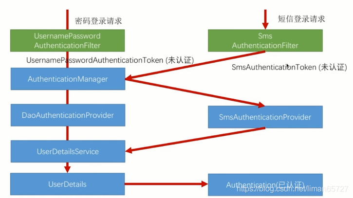

> 本文由 [简悦 SimpRead](http://ksria.com/simpread/) 转码， 原文地址 [blog.csdn.net](https://blog.csdn.net/liman65727/article/details/118655528)

### 文章目录

*   [前言](#_1)
*   [spring-security 认证流程](#springsecurity_5)
*   [自定义短信验证码登录](#_13)
*   [总结](#_318)

前言
==

前面几篇博客完成了验证码的重构和说明，这一篇开始介绍自定义的短信验证码登录。

spring-security 认证流程
====================

之前我们简单实现过一个用户名密码的[表单](https://so.csdn.net/so/search?q=%E8%A1%A8%E5%8D%95&spm=1001.2101.3001.7020)登录——登录的请求会交给`UsernamePasswordAuthenticationFilter`这个过滤器，这个过滤器会组装一个`UsernamePasswordAuthenticationToken`的对象交给`AuthenticationManager`，`AuthenticationManager`这个对象在整个 spring-security 容器的容器中只有一个，之后`AuthenticationManager`会在所有的 AuthenticationProvider 中挑出支持当前认证请求 Token 的 Provider 实例，利用选中的 Provider 实例进行认证。在 Provider 认证的过程中，可以调用`UserDetailsService`进行用户认证。认证完成之后，会将其标记为已认证存入会话中。



如果我们要实现我们自定义的短信验证码的认证，我们需要仿照上图左边的认证流程，实现我们自己的认证流程。我们需要自定义一个`SmsAuthenticationFilter`，然后自定义实现一个`SmsAuthenticationProvider`，最重要的还有`SmsAuthentincationToken`。

自定义短信验证码登录
==========

1、自定义 token，这个 token 在登录成功之前先只会存储登录的请求参数，登录成功之后，则会存储登录成功之后的用户信息

```
/**
 * autor:liman
 * createtime:2021/7/11
 * comment: 短信验证码登录的token（短信验证码登录的登录信息）
 * 登录之前，存放的是用户的手机号，登录成功之后，其中会存放用户信息
 * 需要参考 UsernamePasswordAuthenticationToken
 */
public class SmsVerifyCodeAuthenticationToken extends AbstractAuthenticationToken {

    private static final long serialVersionUID = SpringSecurityCoreVersion.SERIAL_VERSION_UID;

    //用于存放认证信息的，登录之前存放手机号，登录成功之后，这里会存放用户信息
    private final Object principal;
//    private Object credentials;//这个用于存放密码（这个实例中用不上）

    /**
     * 登录认证之前的构造函数
     */
    public SmsVerifyCodeAuthenticationToken(Object principal) {
        super(null);
        this.principal = principal;
        setAuthenticated(false);
    }

    /**
     * 登录认证chenggong
     * @param principal
     * @param authorities
     */
    public SmsVerifyCodeAuthenticationToken(Object principal,
                                               Collection<? extends GrantedAuthority> authorities) {
        super(authorities);
        this.principal = principal;
//        this.credentials = credentials;
        super.setAuthenticated(true); // must use super, as we override
    }

    public Object getCredentials() {
//        return this.credentials;
        return null;
    }

    public Object getPrincipal() {
        return this.principal;
    }

    public void setAuthenticated(boolean isAuthenticated) throws IllegalArgumentException {
        if (isAuthenticated) {
            throw new IllegalArgumentException(
                    "Cannot set this token to trusted - use constructor which takes a GrantedAuthority list instead");
        }
        super.setAuthenticated(false);
    }

    @Override
    public void eraseCredentials() {
        super.eraseCredentials();
    }
}
```

2、自定义实现 SmsAuthenticationFilter

```
/**
 * autor:liman
 * createtime:2021/7/11
 * comment:用于短信验证码登录的过滤器
 */
public class SmsVerifyCodeAuthenticationFilter extends AbstractAuthenticationProcessingFilter {

    public static final String SELF_SMS_LOGIN_MOBILE = "mobile";

    private String mobileParameter = SELF_SMS_LOGIN_MOBILE;
    private boolean postOnly = true;//当前过滤器只处理post请求


    public SmsVerifyCodeAuthenticationFilter() {
        //匹配的目标请求
        super(new AntPathRequestMatcher("/authentication/mobile", "POST"));
    }


    /**
     * 真正的认证流程
     * @param request
     * @param response
     * @return
     * @throws AuthenticationException
     */
    public Authentication attemptAuthentication(HttpServletRequest request,
                                                HttpServletResponse response) throws AuthenticationException {
        if (postOnly && !request.getMethod().equals("POST")) {//是否是post请求
            throw new AuthenticationServiceException(
                    "认证的方法不支持" + request.getMethod());
        }

        String mobile = obtainMobile(request);

        if (mobile == null) {
            mobile = "";
        }
        mobile = mobile.trim();

        //实例化token
        SmsVerifyCodeAuthenticationToken authRequest = new SmsVerifyCodeAuthenticationToken(
                mobile);

        // 将请求的信息设置到token中
        setDetails(request, authRequest);

        //条用AuthenticationManager进行验证
        return this.getAuthenticationManager().authenticate(authRequest);
    }

    /**
     * 获取用户名（这里是mobile）
     * @param request so that request attributes can be retrieved
     *
     */
    protected String obtainMobile(HttpServletRequest request) {
        return request.getParameter(mobileParameter);
    }

    /**
     * Provided so that subclasses may configure what is put into the authentication
     * request's details property.
     *
     * @param request that an authentication request is being created for
     * @param authRequest the authentication request object that should have its details
     * set
     */
    protected void setDetails(HttpServletRequest request,
                              SmsVerifyCodeAuthenticationToken authRequest) {
        authRequest.setDetails(authenticationDetailsSource.buildDetails(request));
    }

    /**
     */
    public void setMobileParameter(String mobileParameter) {
        Assert.hasText(mobileParameter, "手机号不能为空");
        this.mobileParameter = mobileParameter;
    }

    /**
     * 只支持post
     */
    public void setPostOnly(boolean postOnly) {
        this.postOnly = postOnly;
    }
}
```

可以看到，如果想实现更复杂的登录方式，可以自定义 obtainMobile 方法，这个方法就定义在这个 Filter 中，可以自行发挥。甚至可以直接读取 request 请求中的数据流，并将数据流转换成我们自定义的对象都是可行的（笔者最新实际开发的项目中就用到了这个方法）。

3、自定义实现 SmsAuthenticationProvider

```
/**
 * autor:liman
 * createtime:2021/7/11
 * comment:短信验证码登录的认证逻辑
 */
public class SmsVerifyCodeAuthenticationProvider implements AuthenticationProvider {

    private UserDetailsService userDetailsService;

    @Override
    public Authentication authenticate(Authentication authentication) throws AuthenticationException {
        SmsVerifyCodeAuthenticationToken smsVerifyCodeAuthenticationToken = (SmsVerifyCodeAuthenticationToken) authentication;
        String mobile = (String) smsVerifyCodeAuthenticationToken.getPrincipal();
        UserDetails userInfo = userDetailsService.loadUserByUsername(mobile);//根据手机号读取用户信息

        if (null == userInfo) {
            throw new InternalAuthenticationServiceException("用户信息不存在");
        }

        //登录成功，则需要重新构造SmsVerifyCodeAuthenticationToken
        SmsVerifyCodeAuthenticationToken authenticationResult = new SmsVerifyCodeAuthenticationToken(userInfo, userInfo.getAuthorities());
        authenticationResult.setDetails(smsVerifyCodeAuthenticationToken.getDetails());//未认证的token中detail信息也要复制到认证之后的请求信息

        return authenticationResult;
    }

    /**
     * 当前provider 支持的认证类型是哪一种
     *
     * @param authentication
     * @return
     */
    @Override
    public boolean supports(Class<?> authentication) {
        //判断传进来的是否是SmsVerifyCodeAuthenticationToken
        return SmsVerifyCodeAuthenticationToken.class.isAssignableFrom(authentication);
    }

    public UserDetailsService getUserDetailsService() {
        return userDetailsService;
    }

    public void setUserDetailsService(UserDetailsService userDetailsService) {
        this.userDetailsService = userDetailsService;
    }
}
```

最为关键的就是 authenticate 方法，这个方法中在完成认证之后，重新实例化了一个 Token 对象，并将请求的详细信息赋值给了新建的 Token。同时，这里是用`UserDetailsService`去读取用户信息，这里完全可以自定义

4、配置处理

```
/**
 * autor:liman
 * createtime:2021/7/11
 * comment:短信验证码的登录配置
 */
@Component
public class SmsVerifyCodeAuthenticationSecurityConfig extends SecurityConfigurerAdapter<DefaultSecurityFilterChain,HttpSecurity> {

    @Autowired
    private AuthenticationSuccessHandler selfAuthenticationSuccessHandler;
    @Autowired
    private AuthenticationFailureHandler selfAuthenticationFailureHandler;

    //这个可以是我们自定义的用户服务类
    @Autowired
    private UserDetailsService userDetailsService;

    @Override
    public void configure(HttpSecurity http) throws Exception {
        //实例和初始化我们自定义的短信认证Filter
        SmsVerifyCodeAuthenticationFilter smsVerifyCodeAuthenticationFilter = new SmsVerifyCodeAuthenticationFilter();
        smsVerifyCodeAuthenticationFilter.setAuthenticationManager(http.getSharedObject(AuthenticationManager.class));
        smsVerifyCodeAuthenticationFilter.setAuthenticationSuccessHandler(selfAuthenticationSuccessHandler);
        smsVerifyCodeAuthenticationFilter.setAuthenticationFailureHandler(selfAuthenticationFailureHandler);

        //实例和初始化我们自定义的认证Provider
        SmsVerifyCodeAuthenticationProvider smsVerifyCodeAuthenticationProvider = new SmsVerifyCodeAuthenticationProvider();
        smsVerifyCodeAuthenticationProvider.setUserDetailsService(userDetailsService);

        //将我们自定义的认证Provider和Filter交给spring-security进行托管，将过滤器插入到UsernamePasswordAuthenticationFilter过滤器之前
        http.authenticationProvider(smsVerifyCodeAuthenticationProvider)
                .addFilterAfter(smsVerifyCodeAuthenticationFilter,UsernamePasswordAuthenticationFilter.class);

    }
}
```

5、将上述配置应用到登录中

```
@Configuration
public class BrowserSecurityConfig extends WebSecurityConfigurerAdapter {

    @Autowired
    private SecurityProperties securityProperties;
    //自定义登录成功处理器
    @Autowired
    private SelfAuthenticationSuccessHandler selfAuthenticationSuccessHandler;
    @Autowired
    private SelfAuthenticationFailureHandler selfAuthenticationFailureHandler;

    @Autowired
    private SmsVerifyCodeAuthenticationSecurityConfig smsVerifyCodeAuthenticationSecurityConfig;


    @Override
    protected void configure(HttpSecurity http) throws Exception {

        ImageVerifyCodeFilter imageVerifyCodeFilter = new ImageVerifyCodeFilter();
        imageVerifyCodeFilter.setAuthenticationFailureHandler(selfAuthenticationFailureHandler);
        imageVerifyCodeFilter.setSecurityProperties(securityProperties);
        imageVerifyCodeFilter.afterPropertiesSet();

        SmsVerifyCodeFilter smsVerifyCodeFilter = new SmsVerifyCodeFilter();
        smsVerifyCodeFilter.setAuthenticationFailureHandler(selfAuthenticationFailureHandler);
        smsVerifyCodeFilter.setSecurityProperties(securityProperties);
        smsVerifyCodeFilter.afterPropertiesSet();

        http.addFilterBefore(imageVerifyCodeFilter, UsernamePasswordAuthenticationFilter.class)
                .addFilterBefore(smsVerifyCodeFilter, UsernamePasswordAuthenticationFilter.class)
                .formLogin()//采用表单登录
                .loginPage("/authentication/require")//指定登录的页面
                .loginProcessingUrl("/authentication/form")//覆盖 UsernamePasswordAuthenticationFilter 中的请求配置，但最终处理这个请求的还是 UsernamePasswordAuthenticationFilter
                .successHandler(selfAuthenticationSuccessHandler)//自定义登录成功处理器
                .failureHandler(selfAuthenticationFailureHandler)
                .and()
                .authorizeRequests()//并且要认证请求
                .antMatchers("/authentication/require", securityProperties.getBrowser().getLoginPage(),
                        "/verifycode/*").permitAll()//登录页的请求不需要认证
                .anyRequest()//对任意的请求
                .authenticated()//都需要做认证
                .and().csrf().disable()//关闭csrf
                .apply(smsVerifyCodeAuthenticationSecurityConfig);//导入短信验证码登录的安全配置
    }
}
```

主要注意最后一行，将我们自定义的配置交给应用的总配置即可。

总结
==

自定义实现登录方式，可以不只是短信验证码登录。  
源码地址——[请参看以 spring-security 开头的文件夹](https://github.com/liman657/2021_learn_project)。