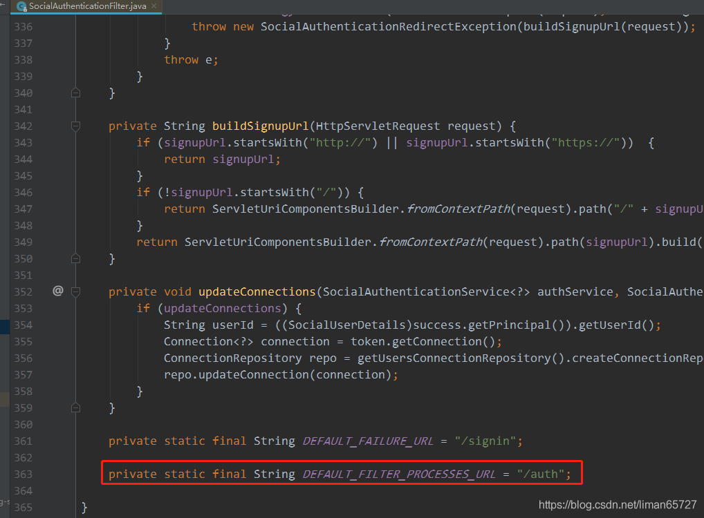

> 本文由 [简悦 SimpRead](http://ksria.com/simpread/) 转码， 原文地址 [blog.csdn.net](https://blog.csdn.net/liman65727/article/details/118862877)

### 文章目录

*   [OAuth 简介](#OAuth_1)
*   *   [OAuth 协议要解决的问题](#OAuth_7)
*   [spring-social 简介](#springsocial_27)
*   [QQ 登录（实例）](#QQ_50)
*   *   [1、实现 Api 与 ServiceProvider](#1ApiServiceProvider_56)
    *   [2、获取到用户信息之后的处理](#2_271)
    *   [3、一些需要的配置与整合](#3_426)
    *   [4、一个简单的小结](#4_512)
*   [几个重要的问题（有源码的解读）](#_527)
*   *   [1、QQ 登录的路径问题](#1QQ_531)
    *   [2、内部引发 signin 的跳转](#2signin_657)
    *   [3、如果自定义获取 token](#3token_696)
*   [总结](#_795)

OAuth 简介
========

关于 OAuth 协议，这篇博客不会花大篇幅去介绍，因为有很多大牛已经总结的不错了。实在不敢班门弄斧。

较为详细的博客总结——[OAuth 协议简介](https://blog.csdn.net/hereweare2009/article/details/3968582)

OAuth 协议要解决的问题
--------------

应用场景：如果我们需要开发一个系统，需要读取用户微信好友列表信息。如果直接读取用户的微信密码，这肯定不现实，只能通过相关的授权协议来实现，OAuth 协议就解决了这个问题。

OAuth 协议的大体流程步骤如下：图中有三个角色，资源所有者，第三方应用，服务提供商。为了方便理解，资源所有者可以类比为客户，服务提供商可以类比为微信，第三方应用可以类比为我们自己的应用，我们需要读取用户在微信的好友列表。（图参照于我们学习的某课网的课程）


OAuth 其中用户同意授权的步骤（第二步）有如下几种模式——1、授权码模式，2、密码模式，3、简化模式，4、客户端模式

其中简化模式和客户端模式使用的不多。我们本篇博客总结的时候，暂时总结授权码模式，后续再总结密码模式。

授权码模式的认证流程，授权码模式是认证流程最完成，最安全的认证模式


在授权码模式中，用户同意授权的动作是在第三方服务器上完成的，在向用户发放授权码之后，再去申请令牌，这样一定程度上避免了伪造令牌的情况。

spring-social 简介
================

spring-social 就是为我们封装了下图中的流程


spring-social 几乎为我们封装了上述图片中的 1~7 步，我么不需要再繁重的组装每一步内容，只需要在一定程度上根据 spring-social 定义的接口，配置好相关的请求 url 和参数，即可获取第三方社交的基本用户信息。上述流程中第一步到第五步，都是一个标准的流程，但是针对第六步，由于每个服务商提供的用户信息不同，所以是一个定制化的流程。

spring-social 在 spring-security 过滤器链中加入了一个过滤器，这个过滤器就封装了流程。


从上述的第一步到第六步，都需要和服务提供商交互，spring-social 为我们提供了一个固定的抽象类——ServiceProvider（有基于 OAuth2 和 OAuth1 协议，本篇介绍 OAuth2 协议）由于不同服务提供商的基础用户信息有差异，针对此，spring-social 提供了对应的 [Api](https://so.csdn.net/so/search?q=Api&spm=1001.2101.3001.7020)（`AbstractOAuth2ApiBinding`）

最后的第七步，是我们自己对用户信息的处理，spring-social 针对这一步的处理，提供了一个 ConnectionFactory ，spring-social 把每次与服务提供商交互获取一次用户信息看成发起一次 connection。其中的 ApiAdapter 是将不同的第三方用户信息，转换为标准的 Connection 的用户信息。除此之外，spring-social 还在数据库层面为我们存储了与第三方用户的关联信息。

代码层面的构造


QQ 登录（实例）
=========

下面开始基于 spring-social 实现 QQ 登录。

准备的东西：需要在 QQ 互联平台上注册好相关的 appId 和 appsecret，目前 QQ 互联的注册需要合法备案的域名，这里为了安全，也不会贴出我自己的 appId 和 appsecret。

1、实现 Api 与 ServiceProvider
--------------------------

定义接口和用户信息实体

```
/**
 * autor:liman
 * createtime:2021/7/12
 * comment: QQ登录的接口
 */
public interface QQLoginInterface {

    QQUserInfo getQQUserInfo() ;

}

/**
 * autor:liman
 * createtime:2021/7/12
 * comment: QQ登录返回的用户信息（相关字段参照于QQ互联平台提供）
 */
@Data
public class QQUserInfo {

    /**
     * 	返回码
     */
    private String ret;
    /**
     * 如果ret<0，会有相应的错误信息提示，返回数据全部用UTF-8编码。
     */
    private String msg;
    /**
     *
     */
    private String openId;
    /**
     * 不知道什么东西，文档上没写，但是实际api返回里有。
     */
    private String is_lost;
    /**
     * 省(直辖市)
     */
    private String province;
    /**
     * 市(直辖市区)
     */
    private String city;
    /**
     * 出生年月
     */
    private String year;
    /**
     * 	用户在QQ空间的昵称。
     */
    private String nickname;
    /**
     * 	大小为30×30像素的QQ空间头像URL。
     */
    private String figureurl;
    /**
     * 	大小为50×50像素的QQ空间头像URL。
     */
    private String figureurl_1;
    /**
     * 	大小为100×100像素的QQ空间头像URL。
     */
    private String figureurl_2;
    /**
     * 	大小为40×40像素的QQ头像URL。
     */
    private String figureurl_qq_1;
    /**
     * 	大小为100×100像素的QQ头像URL。需要注意，不是所有的用户都拥有QQ的100×100的头像，但40×40像素则是一定会有。
     */
    private String figureurl_qq_2;
    /**
     * 	性别。 如果获取不到则默认返回”男”
     */
    private String gender;
    /**
     * 	标识用户是否为黄钻用户（0：不是；1：是）。
     */
    private String is_yellow_vip;
    /**
     * 	标识用户是否为黄钻用户（0：不是；1：是）
     */
    private String vip;
    /**
     * 	黄钻等级
     */
    private String yellow_vip_level;
    /**
     * 	黄钻等级
     */
    private String level;
    /**
     * 标识是否为年费黄钻用户（0：不是； 1：是）
     */
    private String is_yellow_year_vip;

}
```

2、继承实现`AbstractOAuth2ApiBinding`

```
/**
 * autor:liman
 * createtime:2021/7/12
 * comment:
 * AbstractOAuth2ApiBinding中有两个关键的属性
 * 1、accessToken用于存储前几步下来获取的访问令牌
 * 2、restTemplate 一个发起HTTP请求的工具类
 * 同时由于每一个用户的信息不同，因此这个不可能是单例的，而是每次从QQ获取用户信息，都会实例化一个QQLoginImpl
 */
@Slf4j
public class QQLoginImpl extends AbstractOAuth2ApiBinding implements QQLoginInterface {

    //根据token获取用户OPENID的url
    private static final String URL_GET_OPENID= "https://graph.qq.com/oauth2.0/me?access_token=%s";
    //根据openId获取用户信息的url
    private static final String URL_GET_USERINFO="https://graph.qq.com/user/get_user_info?oauth_consumer_key=%s&openid=%s";

    private String appId;

    private String openId;

    private ObjectMapper objectMapper=new ObjectMapper();

    public QQLoginImpl(String accessToken,String appId){
        super(accessToken,TokenStrategy.ACCESS_TOKEN_PARAMETER);//将token作为参数放到url后面
        this.appId = appId;
        
		//构造函数中，去获取openId
        String url = String.format(URL_GET_OPENID,accessToken);
        String result = getRestTemplate().getForObject(url,String.class);//获取openId的结果
        log.info("从QQ获取的openId结果为:{}",result);
        //截取获取openid
        this.openId = StringUtils.substringBetween(result, "\"openid\":\"", "\"}");
    }

    /**
    从QQ获取用户信息
    */
    @Override
    public QQUserInfo getQQUserInfo(){
        try {
            String url = String.format(URL_GET_USERINFO, appId, openId);
            String result = getRestTemplate().getForObject(url, String.class);
            log.info("读取到的用户信息为:{}", result);
            QQUserInfo qqUserInfo = objectMapper.readValue(result, QQUserInfo.class);
            qqUserInfo.setOpenId(openId);
            return qqUserInfo;
        }catch (Exception e){
            log.error("获取用户信息出现异常，异常信息为:{}",e);
            return null;
        }
    }
}
```

从 QQ 获取用户信息，根据 QQ 互联平台提供的接口文档中我们可知，需要三个参数：1、token（这个通过 OAuth 协议前 5 步流程获取），2、appId（这个需要在 QQ 互联上申请注册，让 QQ 互联知道访问 QQ 服务器的是哪一个应用），3、openId（这个根据 token 去 QQ 互联上获取即可）。其中 token 的获取，父类自动帮助我们处理了，我们不需要单独处理。

3、构建 ServeiceProvider

这一步的类需要继承至抽象类`AbstractOAuth2ServiceProvider`，同时指定我们 QQ 登录接口的泛型，这个类在构造方法中会实例化`OAuth2Template`，这个类完成了我们去 QQ 获取 token 和获取授权码的所有操作。

```
/**
 * autor:liman
 * createtime:2021/7/12
 * comment:QQ服务提供者
 */
@Slf4j
public class QQServiceProvider extends AbstractOAuth2ServiceProvider<QQLoginInterface> {

    private String appId;

    /**
     * 获取授权码的url
     */
    private static final String URL_AUTHORIZE = "https://graph.qq.com/oauth2.0/authorize";
    /**
     * 根据授权码获取token的url
     */
    private static final String URL_ACCESS_TOKEN = "https://graph.qq.com/oauth2.0/token";

    /**
     * Create a new {@link OAuth2ServiceProvider}.
     *
     * @param oauth2Operations the OAuth2Operations template for conducting the OAuth 2 flow with the provider.
     */
    public QQServiceProvider(String appId, String appSecret) {
        /**
         * 第一个参数：appId,QQ互联平台注册之后被分配的
         * 第二个参数：appSecret，QQ互联平台注册之后被分配的
         * 第三个参数：去QQ获取授权码的url，万年不变的，可以写成固定值
         * 第四个参数：去QQ获取token的url，也是万年不变的
         */
        super(new OAuth2Template(appId, appSecret, URL_AUTHORIZE, URL_ACCESS_TOKEN));
		this.appId = appId;
    }

    /**
    返回一个我们的api实例
    */
    @Override
    public QQLoginInterface getApi(String accessToken) {
        // QQLoginImpl每次返回的时候都得重新实例化一个（不能通过@Component注解加入，原因之前已经介绍过了）
        return new QQLoginImpl(accessToken, appId);
    }
}
```

2、获取到用户信息之后的处理
--------------

通过第一小节的内容，其实已经可获取到用户信息了，但是针对用户信息如何处理，还需要我们自己开发相关代码，并做好配置

1、构建 ApiAdapter

在之前的整体代码构造图片中，可以知道`ConnectionFactory`中需要一个适配器和 ServiceProvider，其中 ServiceProvider 在上一小结中已经实现。

```
/**
 * autor:liman
 * createtime:2021/7/14
 * comment:QQAdapter需要适配QQ获取的用户信息
 */
public class QQAdapter implements ApiAdapter<QQLoginInterface> {

	//判断第三方服务商的服务器（QQ） 是否是通的，这里直接固定返回true
    @Override
    public boolean test(QQLoginInterface api) {
        return true;
    }

	//创建一个connection需要的数据项
	//从api中获取用户信息，然后将信息存入到ConnectionValues中，ConnectionValues就是spring-social定义的标准的第三方用户信息数据结构。
    @Override
    public void setConnectionValues(QQLoginInterface api, ConnectionValues values) {
        QQUserInfo userInfo = api.getQQUserInfo();

		//昵称
        values.setDisplayName(userInfo.getNickname());
        values.setImageUrl(userInfo.getFigureurl_qq_1());//头像
        values.setProfileUrl(null);//个人主页(QQ没有，这里直接设置为null)
        values.setProviderUserId(userInfo.getOpenId());//用户在服务商的openId（第三方用户id）
    }

    /**
     * 用于解绑和绑定 后续会总结
     * @param api
     * @return
     */
    @Override
    public UserProfile fetchUserProfile(QQLoginInterface api) {
        return null;
    }

    /**
     * 某些社交网站上，可以更新微博的操作，这里不需要
     * @param api
     * @param message
     */
    @Override
    public void updateStatus(QQLoginInterface api, String message) {
		//do nothing
    }
}
```

2、ConnectionFactory 的构建

构建 OAuth 协议的 ConnectionFactory，需要指定相关泛型，根据之前提供的代码构建图中，可以知道其需要两个组件，一个是 QQAdapter，一个是 QQServiceProvider，这两个只需要在构造函数中实例化即可。Connection 由 ConnectionFactory 自动产生，不需要我们操作。

```
/**
 * autor:liman
 * createtime:2021/7/14
 * comment:
 */
public class QQConnectionFactory extends OAuth2ConnectionFactory<QQLoginInterface> {

    /**
     * Create a {@link OAuth2ConnectionFactory}.
     *
     * @param providerId      the provider id e.g. "facebook"
     * @param serviceProvider the ServiceProvider model for conducting the authorization flow and obtaining a native service API instance.
     * @param apiAdapter      the ApiAdapter for mapping the provider-specific service API model to the uniform {@link Connection} interface.
     *
     * 有三个参数：
     * 第一个为服务提供商id，自己配置的
     * 第二个为我们构建的serviceProvider
     * 第三个为我们构建的apiAdapter
     *
     */
    public QQConnectionFactory(String providerId, String appId,String appSecret) {
        super(providerId, new QQServiceProvider(appId,appSecret), new QQAdapter());
    }
}
```

3、配置 UsersConnectionRepository

`JdbcUsersConnectionsRepository`这个类 spring-social 为我们提供好了，我们只需要配置即可。

```
@Configuration
@EnableSocial
public class SocialConfig extends SocialConfigurerAdapter {

    @Autowired
    private DataSource dataSource;

    @Autowired
    private SecurityProperties securityProperties;

    @Override
    public UsersConnectionRepository getUsersConnectionRepository(ConnectionFactoryLocator connectionFactoryLocator) {
        //第一个参数是数据源（这里省略了数据库的配置）
        //第二个参数是一个根据第三方查找指定的ConnectionFactory，这个参数会被传递进来，这个是根据条件自动查找相关的ConnectionFactory ,如果是微信登录，则会查找微信的ConnectionFactory
        //第三个是加解密的配置，这里配置的是不加密
        JdbcUsersConnectionRepository repository = new JdbcUsersConnectionRepository(dataSource, connectionFactoryLocator, Encryptors.noOpText());
        repository.setTablePrefix("self_");//指定操作表的前缀
        return repository;
    }
}
```

`JdbcUsersConnectionsRepository`操作的就是我们数据库中的一张表，这个表我们需要手动创建，但是在 spring-social 相关包中提供了 SQL，就在`JdbcUsersConnectionsRepository`[源码](https://so.csdn.net/so/search?q=%E6%BA%90%E7%A0%81&spm=1001.2101.3001.7020)对应的包下


拷贝相关 SQL，在数据库中执行即可，如果针对表名加前缀，可以在上述代码中通过 setTablePrefix 进行配置，但是表名是不能改的。

**这个表其中有三个属性至关重要——userId，providerId，providerUserId，这三个字段分别表示：在本系统中的用户 id，服务提供商的 Id，用户在第三方系统中的用户 id（openId）。这三个字段联合作为主键。这几个字段可以定位到当前系统中的用户与第三方关联用户的基础信息，refreshToken 是当前用户的令牌。**

4、提供一个`SocialUserDetailsService`用于用户信息的转换

```
/**
 * autor:liman
 * createtime:2021/7/8
 * comment:SocialUserDetailsService的子类，用于转换用户信息
 */
@Component
@Slf4j
public class MyUserDetailService implements SocialUserDetailsService {

    @Autowired
    private PasswordEncoder passwordEncoder;

    /**
     * 这里的参数是spring-social根据openId查出来的userId
     * @param userId
     * @return
     * @throws UsernameNotFoundException
     */
    @Override
    public SocialUserDetails loadUserByUserId(String userId) throws UsernameNotFoundException {
        log.info("社交登录用户id:{}",userId);
        return new SocialUser(userId,passwordEncoder.encode("123456"),
                true,true,true,true,
                AuthorityUtils.commaSeparatedStringToAuthorityList("admin"));
    }
}
```

3、一些需要的配置与整合
------------

appid 和 appsecret

老操作，通过 Properties 类注入

```
public class SocialLoginProperties {

    private QQSocialLoginProperties qq = new QQSocialLoginProperties();

    public QQSocialLoginProperties getQq() {
        return qq;
    }

    public void setQq(QQSocialLoginProperties qq) {
        this.qq = qq;
    }
}

/**
 * autor:liman
 * createtime:2021/7/14
 * comment:社交登录的相关配置 SocialProperties由spring-social提供，其中有appid 和 appsecret
 */
public class QQSocialLoginProperties extends SocialProperties {

    public String provideId = "QQ";//自定义服务提供商的标示

    public String getProvideId() {
        return provideId;
    }

    public void setProvideId(String provideId) {
        this.provideId = provideId;
    }
}
```

在配置 ConnectionFactory 的时候，需要用到 appid 和 appsecret

```
/**
 * autor:liman
 * createtime:2021/7/14
 * comment:
 */
@Configuration
@ConditionalOnProperty(prefix="self.security.core.social.qq",name = "app-id")//配置文件中配置了app-id项，则这个配置才生效
public class QQAutoConfig extends SocialAutoConfigurerAdapter {

    @Autowired
    private SecurityProperties securityProperties;

    /**
     * 配置QQ的连接工厂
     * @return
     */
    @Override
    protected ConnectionFactory<?> createConnectionFactory() {

        QQSocialLoginProperties qqSocialLoginProperties = securityProperties.getSocial().getQq();

        return new QQConnectionFactory(qqSocialLoginProperties.getProvideId(),qqSocialLoginProperties.getAppId(),qqSocialLoginProperties.getAppSecret());
    }
}
```

最后一步，将`SocialAuthenticationFilter`加入到 spring-security 认证的过滤器链上。

1、在 SocialConfig 类中构造一个`SpringSocialConfigurer`，这个类中的 config 方法会自动为我们实例化一个`SocialAuthenticationFilter`

```
@Bean
public SpringSocialConfigurer selfSocialSecurityConfig(){
    SpringSocialConfigurer selfSpringSocialConfig = new SpringSocialConfigurer();
    return selfSpringSocialConfig;
}
```

之后在我们的 springsecurity 的核心配置类中加入上述 Bean 即可。

```
http.and().apply(selfSocialSecurityConfig);//引入社交登录的配置
```

4、一个简单的小结
---------

到目前为止，已经完成了社交登录所需要的全部组件，但是还是会有些问题，先在这里梳理一下整个的代码流程

先上图


这张图就是 spring-social 在进行第三方登录的时候涉及到的主要的接口和实现类，以及他们的调用顺序。其实这个流程与我们之前的自定义手机验证码登录流程差异不大。

一个过滤器拦截某一个特定的请求，在过滤器中将需要身份认证的信息封装一个`Authentication`中，然后将这个`Authentication`交给`AuthenticationManager`管理，`AuthenticationManager`会根据具体的`Authentication`类型找到对应的`AuthenticationProvider`进行具体的认证，只进行具体的认证过程中，`AuthenticationProvider`会调用我们具体的`UserDetailsService`类，如果校验通过，则会将认证成功的信息再次放到`Authentication`中。这其实就是 spring-security 最关键，最核心的认证流程。

只是在 spring-social 第三方登录的时候，用到了一些特殊的东西，当第三方登录请求进入到 SocialAuthenticationFilter 中，这个过滤器会调用 SocialAuthenticationService，这个 SocialAuthenticationService 会帮我们完成 OAuth2 的第三方认证。在 SocialAuthenticationService 认证的过程中，会去调用我们自己写的一些组件（这些组件在图中用橘色标明了）。

几个重要的问题（有源码的解读）
===============

以上一顿操作猛如虎，但是…… 依旧不能实现 QQ 登录存在以下几个问题

1、QQ 登录的路径问题
------------

我们可以在指定页面上添加一个 QQ 登录的入口

```
<h3>社交登录</h3>
<a href="/auth/qq">QQ登录</a>
```

需要说明的是，这个配置的 href 属性是有讲究的。**我们点击之后，QQ 会回调一个 url，这个 url 其实就是在这个 href 后面加上了授权码**。（具体需要调试才能发现，由于不好截图，这里只能用文字描述）

**以上面的 href=/auth/qq 为例，其中前半段其实是`SocialAuthenticationFilter`中指定的拦截 url，后半段是我们配置的 providerId**

我们可以在`SocialAuthenticationFilter`中的源码看到如下内容



在构造函数中指定了针对这个默认的 url 的拦截。href 中 / auth 之后的 / qq，其实就是我们在构建 ConnectionFactory 中传入的 providerId，表示服务提供商的 Id，因此如果在申请 QQ 互联平台时，配置回调 url 的时候，要慎重。

`SocialAuthenticationFilter`中核心的认证方式如下，其实就是找到指定的`SocialAuthenticationService`，将需要认证的参数传递进去即可。

```
//以下代码位于：
//org.springframework.social.security.SocialAuthenticationFilter#attemptAuthentication
public Authentication attemptAuthentication(HttpServletRequest request, HttpServletResponse response) throws AuthenticationException {
	if (detectRejection(request)) {
		if (logger.isDebugEnabled()) {
			logger.debug("A rejection was detected. Failing authentication.");
		}
		throw new SocialAuthenticationException("Authentication failed because user rejected authorization.");
	}
	
	Authentication auth = null;
	Set<String> authProviders = authServiceLocator.registeredAuthenticationProviderIds();
	String authProviderId = getRequestedProviderId(request);
	if (!authProviders.isEmpty() && authProviderId != null && authProviders.contains(authProviderId)) {
		SocialAuthenticationService<?> authService = authServiceLocator.getAuthenticationService(authProviderId);
		auth = attemptAuthService(authService, request, response);
		if (auth == null) {
			throw new AuthenticationServiceException("authentication failed");
		}
	}
	return auth;
}
```

还需要留意一下`SocialAuthenticationFilter`中定义的失败的处理器就是`org.springframework.security.web.authentication.SimpleUrlAuthenticationFailureHandler`这个失败处理器会将我们的请求重定向到一个默认的失败路径上去，这个默认的失败路径就是在`SocialAuthenticationFilter`中定义的 DEFAULT_FAILURE_URL，上图中都可以看到。

如果要修改`SocialAuthenticationFilter`中的默认认证路径，需要我们自定义一个`SpringSocialConfigurer`。我们翻看`SpringSocialConfigurer`中的代码，发现在其构造函数的时候，其加入了`SocialAuthenticationFilter`过滤器


但是在加入`SocialAuthenticationFilter`过滤器之前，其用一个方法 postProcess 处理了一下


这个方法是 protected 类型的，因此我们可以通过继承`SpringSocialConfigurer`进行复写，这个方法就是设置了`SocialAuthenticationFilter`的拦截 url。

自定义`SpringSocialConfigurer`中的 postProcess 方法

```
/**
 * autor:liman
 * createtime:2021/7/15
 * comment:自定义的springsocial配置类
 */
public class SelfSpringSocialConfig extends SpringSocialConfigurer {

    private String processFilterUrl;

    public SelfSpringSocialConfig(String processFilterUrl) {
        this.processFilterUrl = processFilterUrl;
    }

    @Override
    protected <T> T postProcess(T object) {
        SocialAuthenticationFilter socialAuthenticationFilter = (SocialAuthenticationFilter) super.postProcess(object);
        socialAuthenticationFilter.setFilterProcessesUrl(processFilterUrl);
        return (T) socialAuthenticationFilter;
    }
}
```

将我们自定义的`SpringSocialConfigurer`交给容器托管，并注入给相关 security 的配置

```
/**
 * autor:liman
 * createtime:2021/7/14
 * comment: 社交登录的配置类
 */
@Configuration
@EnableSocial
public class SocialConfig extends SocialConfigurerAdapter {

    @Autowired
    private DataSource dataSource;

    @Autowired
    private SecurityProperties securityProperties;

    @Override
    public UsersConnectionRepository getUsersConnectionRepository(ConnectionFactoryLocator connectionFactoryLocator) {
        //第二个参数是一个，这个参数会被传递进来，这个是根据条件自动查找相关的ConnectionFactory ,如果是微信登录，则查找微信的ConnectionFactory
        //第三个是加解密
        JdbcUsersConnectionRepository repository = new JdbcUsersConnectionRepository(dataSource, connectionFactoryLocator, Encryptors.noOpText());
        repository.setTablePrefix("imooc_");
        return repository;
    }

    //直接在SocialConfig中定义我们自己实现的SpringSocialConfigurer
    @Bean
    public SpringSocialConfigurer selfSocialSecurityConfig(){

        String processFilterUrl = securityProperties.getSocial().getProcessFilterUrl();

        SelfSpringSocialConfig selfSpringSocialConfig = new SelfSpringSocialConfig(processFilterUrl);

        return selfSpringSocialConfig;
    }
}
```

2、内部引发 signin 的跳转
-----------------

走到了这里，革命成功大半。但是…… 我们在引发第三方跳转的时候，在走 OAuth 流程的时候，会引发一个 / signin 的跳转，这个可以在`OAuth2AuthenticationService`的源码中找到答案。在上一小节中介绍跳转 href 的时候，我们说过，如果我们配置的 href 是 "/auth/qq"。在我们点击 QQ 登录之后，QQ 服务器会配置一个 redirect 的地址，这个地址就是在 href 后面加上了授权码（如果我们配置的 href 是 "/auth/qq"，则 redirect 的值为：“域名 / auth/qq?code=XXXXX”，在用户点击确认授权之后，服务器会跳转到 redirect 指定的值，而这个值其实依旧是我们原先的 href 路径，只是在后面加了一个参数。

说了这么多，就是一句话，在点击 QQ 登录链接请求之前和之后，我们的应用需要处理两次`SocialAuthenticationFilter`的目标 url。

```
//以下代码位于：
//org.springframework.social.security.provider.OAuth2AuthenticationService#getAuthToken中
public SocialAuthenticationToken getAuthToken(HttpServletRequest request, HttpServletResponse response) throws SocialAuthenticationRedirectException {
	String code = request.getParameter("code");
	if (!StringUtils.hasText(code)) {//如果code没有值（点击QQ登录的时候）
		OAuth2Parameters params =  new OAuth2Parameters();
		params.setRedirectUri(buildReturnToUrl(request));
		setScope(request, params);
		params.add("state", generateState(connectionFactory, request));
		addCustomParameters(params);
        //做一个重定向，将用户重定向到QQ的网站
		throw new SocialAuthenticationRedirectException(getConnectionFactory().getOAuthOperations().buildAuthenticateUrl(params));
	} else if (StringUtils.hasText(code)) {//如果code有值（从QQ服务器带着授权码调回到我们本身应用的时候）
		try {
			String returnToUrl = buildReturnToUrl(request);
            //根据code去第三方服务器（QQ）获取令牌（这个就是最关键的一步）
			AccessGrant accessGrant = getConnectionFactory().getOAuthOperations().exchangeForAccess(code, returnToUrl, null);
			// TODO avoid API call if possible (auth using token would be fine)
			Connection<S> connection = getConnectionFactory().createConnection(accessGrant);
			return new SocialAuthenticationToken(connection, null);
		} catch (RestClientException e) {
			logger.debug("failed to exchange for access", e);
			return null;
		}
	} else {
		return null;
	}
}
```

由于 QQ 返回的 token 不一定按照 spring 的默认数据结构实现，因此在根据授权码去获取令牌的时候，会出现异常，这个异常就引发了`SocialAuthenticationFilter`失败的跳转，这里就引出了如何自定义获取令牌的问题。

3、如果自定义获取 token
---------------

可以继续深入到 exchangeForAccess 方法中，我们可以就看到 spring-social 中默认获取 access_token 的实现。这个方法就在`OAuth2Template`类中

```
//以下代码位于：
//org.springframework.social.oauth2.OAuth2Template#exchangeForAccess
public AccessGrant exchangeForAccess(String authorizationCode, String redirectUri, MultiValueMap<String, String> additionalParameters) {
	MultiValueMap<String, String> params = new LinkedMultiValueMap<String, String>();
	if (useParametersForClientAuthentication) {//如果useParametersForClientAuthentication为true，才会送给第三方服务client_id和client_secret
		params.set("client_id", clientId);
		params.set("client_secret", clientSecret);
	}
	params.set("code", authorizationCode);
	params.set("redirect_uri", redirectUri);
	params.set("grant_type", "authorization_code");
	if (additionalParameters != null) {
		params.putAll(additionalParameters);
	}
	return postForAccessGrant(accessTokenUrl, params);
}

//以下代码位于:
//org.springframework.social.oauth2.OAuth2Template#postForAccessGrant
protected AccessGrant postForAccessGrant(String accessTokenUrl, MultiValueMap<String, String> parameters) {
    //简单的通过RestTemplate请求我们指定的获取token的url，然后第三方服务器返回的是一个JSON的数据，但是有时候第三方服务器并不会按照json返回数据。
    //这里是直接将json转成一个Map
	return extractAccessGrant(getRestTemplate().postForObject(accessTokenUrl, parameters, Map.class));
}

//以下代码位于：
//org.springframework.social.oauth2.OAuth2Template#extractAccessGrant
private AccessGrant extractAccessGrant(Map<String, Object> result) {
    //可以很明显的看到，这个是根据restTemplate获取的json转换成的map，从中获取指定的参数构建AccessGrant（这个AccessGrant就是spring为我们封装的令牌）
	return createAccessGrant((String) result.get("access_token"), (String) result.get("scope"), (String) result.get("refresh_token"), getIntegerValue(result, "expires_in"), result);
}

//org.springframework.social.oauth2.OAuth2Template#createAccessGrant
protected AccessGrant createAccessGrant(String accessToken, String scope, String refreshToken, Long expiresIn, Map<String, Object> response) {
	return new AccessGrant(accessToken, scope, refreshToken, expiresIn);
}
```

如果获取 token 失败，则会引发`SocialAuthenticationFilter`默认的失败 url 的处理。因此如果要考虑全面一点，则需要让我们新写一个`OAuth2Template`，使得其可以处理非 json 返回的数据。同时 QQ 互联平台的接口文档中也说明了，其返回的 token 格式如下，并不是所谓的 json，因此我们需要自定义处理获取 token 接口的返回数据。


同时，对于 client_id 和 client_secret 是必输，因此我们需要将`useParametersForClientAuthentication`属性设置为 true。

絮叨了这么多，就是为了引出我们自定义的`QQOAuth2Template`的代码

```
/**
 * autor:liman
 * createtime:2021/7/17
 * comment:自定义的OAuth2Template，使得其可以处理第三方服务器返回的非json数据。
 */
@Slf4j
public class QQOAuth2Template extends OAuth2Template {
    public QQOAuth2Template(String clientId, String clientSecret, String authorizeUrl, String accessTokenUrl) {
        super(clientId, clientSecret, authorizeUrl, accessTokenUrl);
        setUseParametersForClientAuthentication(true);
    }

    /**
     * 往RestTemplate中加入新的HTTP消息处理器
     * @return
     */
    @Override
    protected RestTemplate createRestTemplate() {
        RestTemplate restTemplate = super.createRestTemplate();
        restTemplate.getMessageConverters().add(new StringHttpMessageConverter(Charset.forName("UTF-8")));
        return super.createRestTemplate();
    }

    /**
     * 针对不同的返回参数，这里可以定制化处理（这里是按照QQ的标准）
     * @param accessTokenUrl
     * @param parameters
     * @return
     */
    @Override
    protected AccessGrant postForAccessGrant(String accessTokenUrl, MultiValueMap<String, String> parameters) {
        String responseStr = getRestTemplate().postForObject(accessTokenUrl, parameters, String.class);
        log.info("从QQ获取token，的返回字符串为:{}",responseStr);
        String[] items = StringUtils.splitByWholeSeparatorPreserveAllTokens(responseStr,"&");
        String accessToken = StringUtils.substringAfterLast(items[0],"=");
        Long expiresIn = Long.valueOf(StringUtils.substringAfterLast(items[1],"="));
        String refreshToken = StringUtils.substringAfterLast(items[2],"=");

        //构建AccessGrant
        return new AccessGrant(accessToken,null,refreshToken,expiresIn);
    }
}
```

到这里，登录时 OK 了，但是，依旧还有但是，到这里还会引发一个 signup 的跳转。到这里我们相当于走到了 AuthenticationProvider。

总结
==

本篇篇幅较长（好吧我说实话，确实很长），因为涉及内容较多，从源码层层深入剖析问题，并最终引出解决方案，这本身就是一个很耗费时长的过程，如果耐心看完相信会有所收获，继续说一点最后的问题，到这里依旧没有完成 QQ 登录的完整流程，spring-social 会自动给我们跳转到注册页面。这个问题就是 QQ 第三方登录引发的注册问题，这个会在下一篇博客中总结，毕竟，这篇博客篇幅已经够长了。

有点乱，还是附上源码地址吧——[参考其中的 spring-security 开头的项目](https://github.com/liman657/2021_learn_project)。