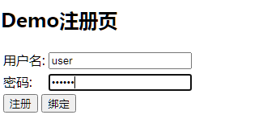

> 本文由 [简悦 SimpRead](http://ksria.com/simpread/) 转码， 原文地址 [blog.csdn.net](https://blog.csdn.net/liman65727/article/details/118875577)

### 文章目录

*   [前言](#_1)
*   [问题原因](#_5)
*   [配置自己的注册页](#_84)
*   [操作已认证的第三方用户信息](#_128)
*   *   [1、提供获取第三方用户信息的接口](#1_184)
    *   [2、将注册后的用户信息绑定到会话](#2_228)
*   [静默注册](#_252)
*   [总结](#_345)

前言
==

上篇博客篇幅较长，较为详细的介绍了第三方登录的问题，以 QQ 为例的目的其实是因为 QQ 的 QAuth2 协议流程比较规范和完善。但是絮叨的东西比较零散，如果要成体系的学习可能需要反复看几遍，这篇博客是上篇博客的一个延续，在完成 QQ 第三方登录之后，如果用户原本没有在系统中注册，则会引发 spring-social 中默认的 singup 的默认跳转，本篇博客就是总结如何解决这个问题

问题原因
====

上篇博客在介绍完 QQ 登录之后，最后会发现并没有很顺畅的跳转到我们系统的主页，而是发现跳转到了 signin 的路径。这个路径是 spring-security 中默认的注册路径。为什么会发生这个跳转，其实原因比较简单，是`SocialAuthenticationFilter`中捕获了`SocialAuthenticationProvider`中抛出的`BadCredentialsException`然后做了跳转，在源码中可以找到佐证的内容

`SocialAuthenticationFilter`中做认证的源码如下

```
//以下代码位于：
//org.springframework.social.security.SocialAuthenticationFilter#doAuthentication
//看名字就知道是做认证的
private Authentication doAuthentication(SocialAuthenticationService<?> authService, HttpServletRequest request, SocialAuthenticationToken token) {
	try {
		if (!authService.getConnectionCardinality().isAuthenticatePossible()) return null;
		token.setDetails(authenticationDetailsSource.buildDetails(request));
		Authentication success = getAuthenticationManager().authenticate(token);
		Assert.isInstanceOf(SocialUserDetails.class, success.getPrincipal(), "unexpected principle type");
		updateConnections(authService, token, success);			
		return success;
	} catch (BadCredentialsException e) {//捕获BadCredentialsException，进行处理
		// connection unknown, register new user?
		if (signupUrl != null) {//如果signupUrl不为空，则表示需要跳到注册
			// store ConnectionData in session and redirect to register page
            //将从第三方获取到的用户信息存入到会话中
			sessionStrategy.setAttribute(new ServletWebRequest(request), ProviderSignInAttempt.SESSION_ATTRIBUTE, new ProviderSignInAttempt(token.getConnection()));
            //然后抛出需要跳转的异常
			throw new SocialAuthenticationRedirectException(buildSignupUrl(request));
		}
		throw e;
	}
}
```

`SocialAuthenticationProvider`中做认证的代码如下

```
//以下代码位于：
//org.springframework.social.security.SocialAuthenticationProvider#authenticate
public Authentication authenticate(Authentication authentication) throws AuthenticationException {
    //判断认证的authentication类型是否是SocialAuthenticationToken
	Assert.isInstanceOf(SocialAuthenticationToken.class, authentication, "unsupported authentication type");
    //判断是否已经认证了
	Assert.isTrue(!authentication.isAuthenticated(), "already authenticated");
    //获取token中的providerId（服务商ID）
	SocialAuthenticationToken authToken = (SocialAuthenticationToken) authentication;
	String providerId = authToken.getProviderId();
    //这里的connection可以认为就是第三方服务商返回的用户数据。
	Connection<?> connection = authToken.getConnection();

    //这里要根据第三方的用户id，去本地数据库中查找用户信息，如果用户信息不存在，则会抛出BadCredentialsException
    //进而引发signup的跳转
	String userId = toUserId(connection);
	if (userId == null) {
		throw new BadCredentialsException("Unknown access token");
	}
	
    //取出用户信息，返回userDetails
	UserDetails userDetails = userDetailsService.loadUserByUserId(userId);
	if (userDetails == null) {
		throw new UsernameNotFoundException("Unknown connected account id");
	}

    //根据userDetails构建认证成功的token。
	return new SocialAuthenticationToken(connection, userDetails, authToken.getProviderAccountData(), getAuthorities(providerId, userDetails));
}

//以下代码位于：
//org.springframework.social.security.SocialAuthenticationProvider#toUserId
//主要用于通过usersConnectionRepository根据第三方用户id查找本地原有的用户信息
protected String toUserId(Connection<?> connection) {
	List<String> userIds = usersConnectionRepository.findUserIdsWithConnection(connection);
	// only if a single userId is connected to this providerUserId
	return (userIds.size() == 1) ? userIds.iterator().next() : null;
}
```

可以看到关键的一步——toUserId，这一步是根据第三方服务商返回的用户信息中的用户 id（通常是 openId）去本地数据库中获取用户信息，如果没有获取到用户信息，则抛出了`BadCredentialsException`进而引发了 signup 的跳转。

** 从业务表现上来说，我们虽然拿到了第三方的用户信息，但是这个用户信息目前在我们自己的系统中并不存在，则 spring-social 默认引导新用户去注册。** 当然，我们可以定制处理这个流程，这个后面再说。至少现在，问题根源通过源码找到了。

配置自己的注册页
========

上面问题分析之后已经知道，spring-social 为我们自定义了一个注册页，如果我们想自定义注册页，只需要在将社交登录的配置加入到 spring-security 的时候设置相关属性即可。

在我们之前配置的 SpringSocialConfigurer 中加入配置即可。

```
@Bean
public SpringSocialConfigurer selfSocialSecurityConfig(){
    String processFilterUrl = securityProperties.getSocial().getProcessFilterUrl();
    SelfSpringSocialConfig selfSpringSocialConfig = new SelfSpringSocialConfig(processFilterUrl);

    //指定第三方用户信息认证不存在的注册页
    selfSpringSocialConfig.signupUrl(securityProperties.getBrowser().getSiguUpPage());
    return selfSpringSocialConfig;
}
```

一个简陋的注册页



** 需要说明的是，这是因为社交用户，本身我们系统中就没有该社交用户的数据，spring social 默认为该用户需要注册和绑定，才会引发跳转。我们需要让用户自己决定注册还是绑定。在绑定和注册的时候，我们需要将注册完成的用户信息与第三方用户信息做一个关联，这才是完整的流程。** 只需要记住一点，我们现在虽然能顺利拿到用户的第三方信息，但是我们本地还没有数据。

我们提供的注册接口，这里不给出具体实现（毕竟注册千人前面），只是说明需要做的事情

```
@PostMapping("/register")
public void userRegister(@RequestBody User user) {
    //TODO:这里要完成用户注册，同时将用户信息存入到我们自己的数据表
    //TODO:还需要将用户信息与第三方用户信息做一个关联
    //TODO:如果是绑定，请求也会走到这里，也可以完成上述操作。
}
```

现在还有两个问题：

1、如果用户需要在注册页面显示第三方的用户信息，告知用户具体在与那一个社交账号绑定，该如何实现

2、在注册的时候，我们本地系统会产生一个唯一的用户 id，如何将这个用户 id 传给已经存于会话中的第三方认证的用户信息。

两个问题汇成一个——如何更新关联第三方登录之后的 AuthenticationToken 信息。

操作已认证的第三方用户信息
=============

上一小节中，其实是如果社交用户在我们本系统中没有用户数据的时候，我们的系统需要帮助其完成注册，而注册了用户需要将会话中的用户与 user_connection 表中的用户进行关联与更新，需要通过 spring-social 为我们封装好的工具类——`ProviderSignUpUtils`

只是我们需要配置一下

```
/**
 * autor:liman
 * createtime:2021/7/14
 * comment: 社交登录的配置类
 */
@Configuration
@EnableSocial
public class SocialConfig extends SocialConfigurerAdapter {

    @Autowired
    private DataSource dataSource;
    @Autowired
    private SecurityProperties securityProperties;
    @Autowired
    private ConnectionFactoryLocator connectionFactoryLocator;


    @Override
    public UsersConnectionRepository getUsersConnectionRepository(ConnectionFactoryLocator connectionFactoryLocator) {
        //第二个参数是一个，这个参数会被传递进来，这个是根据条件自动查找相关的ConnectionFactory ,如果是微信登录，则查找微信的ConnectionFactory
        //第三个是加解密
        JdbcUsersConnectionRepository repository = new JdbcUsersConnectionRepository(dataSource, connectionFactoryLocator, Encryptors.noOpText());
        repository.setTablePrefix("self_");
        return repository;
    }

    @Bean
    public SpringSocialConfigurer selfSocialSecurityConfig(){
        String processFilterUrl = securityProperties.getSocial().getProcessFilterUrl();
        SelfSpringSocialConfig selfSpringSocialConfig = new SelfSpringSocialConfig(processFilterUrl);

        //指定第三方用户信息认证不存在的注册页
        selfSpringSocialConfig.signupUrl(securityProperties.getBrowser().getSiguUpPage());
        return selfSpringSocialConfig;
    }

    //这里配置ProviderSignInUtils
    @Bean
    public ProviderSignInUtils providerSignInUtils(ConnectionFactoryLocator connectionFactoryLocator){
        return new ProviderSignInUtils(connectionFactoryLocator,
                getUsersConnectionRepository(connectionFactoryLocator));
    }
}
```

在上述代码的尾端，配置了`ProviderSignInUtils`这个配置类也是第三方认证登录开发的核心配置类之一。有了这个工具类之后，我们可以直接读取第三方认证登录时，会话中的认证信息了。

针对上一个标题结尾的两个问题的解决方案

1、提供获取第三方用户信息的接口
----------------

具体如下：

```
@Autowired
private ProviderSignInUtils providerSignInUtils;

//可以根据自己的喜好定义其存放位置
@GetMapping("/socialuserinfo")
public BaseResponse getSocialUserInfo(HttpServletRequest request){
    BaseResponse result = new BaseResponse(StatusCode.Success);
    log.info("开始获取会话中的第三方用户信息");
    //利用providerSignInUtils，从会话中读取第三方用户信息
    Connection<?> connectionFromSession = providerSignInUtils.getConnectionFromSession(new ServletWebRequest(request));
    SocialUserInfo socialUserInfo = new SocialUserInfo();
    socialUserInfo.setProviderId(connectionFromSession.getKey().getProviderId());
    socialUserInfo.setProviderUserId(connectionFromSession.getKey().getProviderUserId());
    socialUserInfo.setNickName(connectionFromSession.getDisplayName());
    socialUserInfo.setHeadImg(connectionFromSession.getImageUrl());
    result.setData(socialUserInfo);
    return result;
}

/**
 * autor:liman
 * createtime:2021/7/18
 * comment: 第三方用户信息的实体
 */
@Data
@ToString
public class SocialUserInfo {

    private String providerId;

    private String providerUserId;

    private String nickName;

    private String headImg;

}
```

2、将注册后的用户信息绑定到会话
----------------

在之前的 register 请求中，加入如下一行代码即可。

```
@Autowired
private ProviderSignInUtils providerSignInUtils;

@PostMapping("/register")
public void userRegister(@RequestBody User user, HttpServletRequest request) {
    //TODO:这里要完成用户注册，同时将用户信息存入到我们自己的数据表
    //TODO:还需要将用户信息与第三方用户信息做一个关联
    //TODO:如果是绑定，请求也会走到这里，也可以完成上述操作。

    //利用providerSignInUtils，将注册之后的用户信息，关联到会话中
    providerSignInUtils.doPostSignUp(user.getId(),new ServletWebRequest(request));

}
```

顺便说一句，从会话中读取第三方用户信息是知道了，但是…… 还记得第三方的用户信息是何时存入进去的么？

在文章开头已经提到，是在`SocialAuthenticationFilter`中处理`BadCredentialsException`的时候存入会话的，在开头的源码注释中，加上了相关备注。

静默注册
====

上面算是解决了用户授权之后的用户绑定，但是还需要用户手动绑定和注册，如果想实现用户的静默注册和跳转，这个又该如何操作。在 QQ 第三方登录篇幅的最后，还是简单介绍一下实现静默注册关联的方案。

向源码要方案

文章开篇介绍过`org.springframework.social.security.SocialAuthenticationProvider#authenticate`的源码，其中调用了一个 toUserId 方法，这个方法会去数据库中查询关联的本地用户信息，如果不存在则抛出`BadCredentialsException`，这也是引发自定义 signup 跳转的罪魁祸首。于是我们就需要继续深入到`toUserId`方法中去探索

```
//org.springframework.social.security.SocialAuthenticationProvider#toUserId
protected String toUserId(Connection<?> connection) {
    //由于我们使用的是JdbcUsersConnectionRepository，这行会实际执行JdbcUsersConnectionRepository中的对应方法
	List<String> userIds = usersConnectionRepository.findUserIdsWithConnection(connection);
	// only if a single userId is connected to this providerUserId
	return (userIds.size() == 1) ? userIds.iterator().next() : null;
}
```

进入到

```
//以下代码位于：
//org.springframework.social.connect.jdbc.JdbcUsersConnectionRepository#findUserIdsWithConnection
public List<String> findUserIdsWithConnection(Connection<?> connection) {
	ConnectionKey key = connection.getKey();
	List<String> localUserIds = jdbcTemplate.queryForList("select userId from " + tablePrefix + "UserConnection where providerId = ? and providerUserId = ?", String.class, key.getProviderId(), key.getProviderUserId());		
    //如果没有找到本地系统中的userId,其实还有一个connectionSignUp操作。
    //这个就是根据第三方用户信息静默注册的逻辑，如果不为空，则调用connectionSignUp中的execute方法，
    //设置新的newUserId，然后新的newUserId加入到会话中。
	if (localUserIds.size() == 0 && connectionSignUp != null) {
		String newUserId = connectionSignUp.execute(connection);
		if (newUserId != null)
		{
			createConnectionRepository(newUserId).addConnection(connection);
			return Arrays.asList(newUserId);
		}
	}
	return localUserIds;
}
```

因此，解决方案就非常简单了，我们只需要自定义实现 connectionSignUp 接口，并将其交给 SpringSocialConfigure 管理就可以了。

```
/**
 * autor:liman
 * createtime:2021/7/18
 * comment: 自定义第三方静默注册的逻辑（简单实例）
 */
@Component
public class SelfConnectionSignUp implements ConnectionSignUp {
    
//    @Autowired
//    private MyUserDetailService userDetailService;

    /**
     * 根据第三方用户信息静默注册的逻辑
     * @param connection
     * @return
     */
    @Override
    public String execute(Connection<?> connection) {
        //根据第三方用户信息创建用户，并返回静默注册之后的唯一本地用户标示
        String newUserId = connection.getKey().getProviderUserId();//这里简单处理的，直接以第三方用户id为唯一标示
        return newUserId;
    }
}
```

交给 SpringSocialConfig 管理即可（这里只截取了部分代码）

```
@Configuration
@EnableSocial
public class SocialConfig extends SocialConfigurerAdapter {

    @Autowired(required = false)
    private ConnectionSignUp connectionSignUp;

    @Override
    public UsersConnectionRepository getUsersConnectionRepository(ConnectionFactoryLocator connectionFactoryLocator) {
        //第二个参数是一个，这个参数会被传递进来，这个是根据条件自动查找相关的ConnectionFactory ,如果是微信登录，则查找微信的ConnectionFactory
        //第三个是加解密
        JdbcUsersConnectionRepository repository = new JdbcUsersConnectionRepository(dataSource, connectionFactoryLocator, Encryptors.noOpText());
        repository.setTablePrefix("self_");
        if(connectionSignUp!=null){
            repository.setConnectionSignUp(connectionSignUp);
        }
        return repository;
    }
}
```

总结
==

至此，QQ 第三方登录中所有的细节，均已根据某课网的课程总结完成，非常零散，而且在测试的时候需要有可用的 QQ 互联的相关配置，因此在测试学习的时候，遇到很大阻力，个人觉得这应该算是 spring-security 中最为复杂的部分了。

还是附上源码地址吧——[参考其中的 spring-security 开头的项目](https://github.com/liman657/2021_learn_project)。