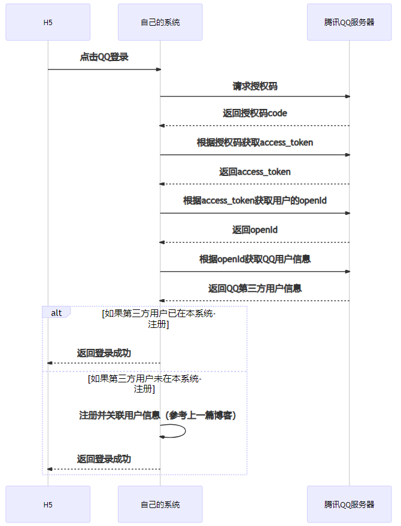
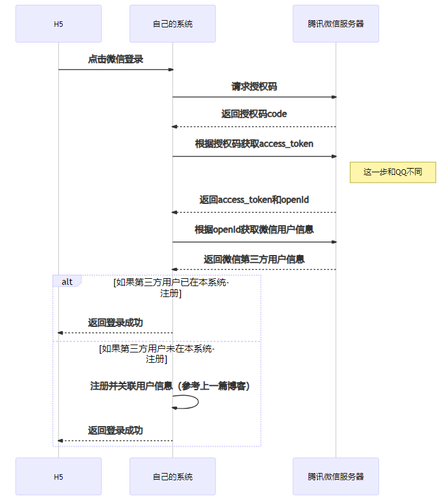
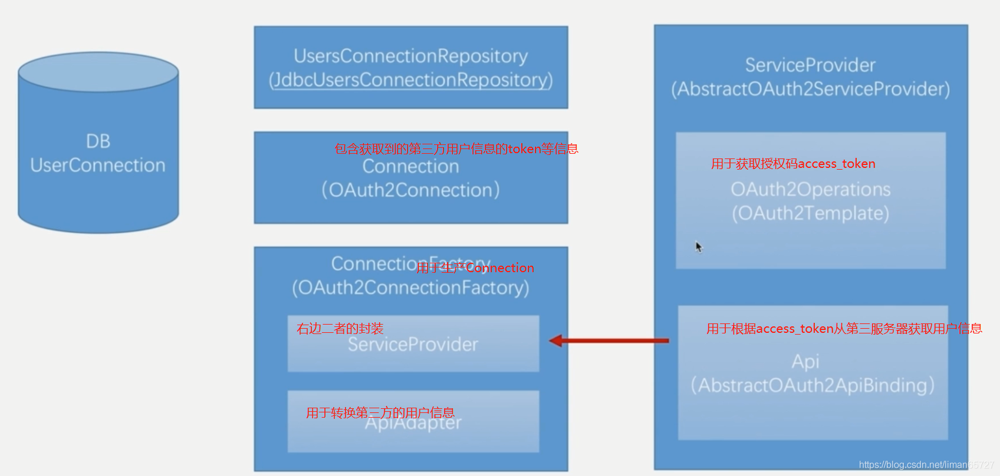
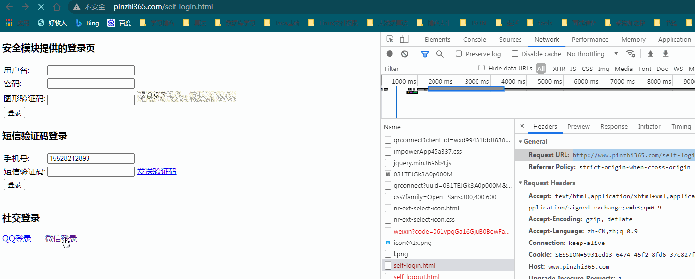

> 本文由 [简悦 SimpRead](http://ksria.com/simpread/) 转码， 原文地址 [blog.csdn.net](https://blog.csdn.net/liman65727/article/details/118881964)

### 文章目录

*   [前言](#_1)
*   [微信登录](#_29)
*   *   [与 QQ 登录的差异](#QQ_33)
    *   [原有流程的各个组件](#_60)
    *   [微信登录的实现](#_69)
    *   *   [Api（AbstractOAuth2ApiBinding）](#ApiAbstractOAuth2ApiBinding_73)
        *   [OAuth2Operations（OAuth2Template）](#OAuth2OperationsOAuth2Template_214)
        *   [ApiAdapter](#ApiAdapter_396)
        *   [ServiceProvider](#ServiceProvider_443)
        *   [ConnectionFactory](#ConnectionFactory_479)
        *   [配置类](#_542)
*   [测试结果](#_569)
*   [总结](#_573)

前言
==

前两篇博客大体较为细化的总结了 QQ 登录的方方面面，针对这一篇开始总结一下微信登录。在正式开篇之前，梳理一下 QQ 登录中，我们系统与 QQ 服务器交互的[时序图](https://so.csdn.net/so/search?q=%E6%97%B6%E5%BA%8F%E5%9B%BE&spm=1001.2101.3001.7020)



QQ 的登录，是标准的 QAuth2 流程，因此流程较为繁琐，在梳理了上述流程之后，后面我们再看看微信登录，微信登录大体流程和上面差不多。但是也有一些差异

微信登录
====

在前几篇博客的基础上完成第三方微信登录。

与 QQ 登录的差异
----------

由于 QQ 登录是按照标准的 OAuth2 协议实现，而 spring-social 中默认的实现也是按照标准的 OAuth2 协议实现的，因此在开发 QQ 登录本身的时候，更多的是介绍概念和组件上的内容。微信登录与 QQ 登录流程上有一个小小的差异，具体如下图



不同的一步，已经在图中标注，除此之外，参考微信开放平台文档，其实有些上送的参数，也有所差异，在开发微信登录的时候这些也需要解决

原有流程的各个组件
---------

在正式开始前，还需要先梳理一下之前 spring-social 为我们封装的各个组件，以及各个组件是干啥的，还是直接贴图吧。图中与数据库相关的，就是用于关联第三方用户信息与本地用户数据的。



我们只需要按部就班实现相关的组件即可。

微信登录的实现
-------

知道了各个组件，我们只需要填鸭式实现各个组件即可。

### Api（AbstractOAuth2ApiBinding）

1、定义一个获取微信用户信息的接口，何其实现类，这个实现类，就是对应图中的 api

```
/**
 * autor:liman
 * createtime:2021/7/18
 * comment: 微信获取用户信息的接口
 */
public interface WeixinLoginInterface {

    /**
     * 与QQ不同，微信获取用户信息需要传一个openId
     * 因为微信登录在获取access_token这一步就会返回用户的openId
     * 这个对开发者来说是一个好事，但是对于spring-social标准的oauth实现就有点麻烦了
     * @param openId
     * @return
     */
    WeixinUserInfo getWeixinUserInfo(String openId);

}
```

2、`WeixinLoginInterface`的实现类

这个其实就是上图中`Api`的角色

```
/**
 * autor:liman
 * createtime:2021/7/18
 * comment: 微信获取用户信息的实现类
 */
@Slf4j
public class WeixinLoginImpl extends AbstractOAuth2ApiBinding implements WeixinLoginInterface {

    /**
     * 获取用户信息的url
     */
    private static final String URL_GET_USER_INFO = "https://api.weixin.qq.com/sns/userinfo?openid=";

    private ObjectMapper objectMapper = new ObjectMapper();

    public WeixinLoginImpl(String accessToken) {
        super(accessToken, TokenStrategy.ACCESS_TOKEN_PARAMETER);//将token拼装到请求url的后面，而不是请求体中
    }

    /**
     * 由于默认注册的StringHttpMessageConverter字符集为ISO-8859-1，而微信返回的是UTF-8的，所以覆盖了原来的方法。
     *
     * @return
     */
    @Override
    protected List<HttpMessageConverter<?>> getMessageConverters() {
        List<HttpMessageConverter<?>> messageConverters = super.getMessageConverters();
        //去掉原有的ISO-8859-1，新增一个UTF-8
        messageConverters.remove(0);
        messageConverters.add(new StringHttpMessageConverter(Charset.forName("UTF-8")));
        return messageConverters;
    }

    @Override
    public WeixinUserInfo getWeixinUserInfo(String openId) {

        String url = URL_GET_USER_INFO + openId;//根据openId获取用户信息
        String responseData = getRestTemplate().getForObject(url,String.class);//获取返回数据
        log.info("从微信返回的数据为:{}",responseData);
        if(StringUtils.contains(responseData,"errcode")){
            log.info("获取微信用户异常");
            return null;
        }

        WeixinUserInfo weixinUserInfo = null;

        try {
            weixinUserInfo = objectMapper.readValue(responseData, WeixinUserInfo.class);
        } catch (IOException e) {
            log.info("解析微信用户数据出现异常，异常信息为:{}",e);
        }
        return weixinUserInfo;
    }
}
```

标示微信用户信息的实体

```
/**
 * autor:liman
 * createtime:2021/7/18
 * comment: 微信平台获取的用户信息实体
 */
@Data
@ToString
public class WeixinUserInfo {

    /**
     * 普通用户的标识，对当前开发者帐号唯一
     */
    private String openid;
    /**
     * 普通用户昵称
     */
    private String nickname;
    /**
     * 语言
     */
    private String language;
    /**
     * 普通用户性别，1为男性，2为女性
     */
    private String sex;
    /**
     * 普通用户个人资料填写的省份
     */
    private String province;
    /**
     * 普通用户个人资料填写的城市
     */
    private String city;
    /**
     * 国家，如中国为CN
     */
    private String country;
    /**
     * 用户头像，最后一个数值代表正方形头像大小（有0、46、64、96、132数值可选，0代表640*640正方形头像），用户没有头像时该项为空
     */
    private String headimgurl;
    /**
     * 用户特权信息，json数组，如微信沃卡用户为（chinaunicom）
     */
    private String[] privilege;
    /**
     * 用户统一标识。针对一个微信开放平台帐号下的应用，同一用户的unionid是唯一的。
     */
    private String unionid;

}
```

### OAuth2Operations（OAuth2Template）

`OAuth2Template`用于获取 access_token，根据不同的第三方平台，需要有相关自定义的实现，这里就是根据微信进行的定制化实现。相关原因已在代码注释中。

```
/**
 * autor:liman
 * createtime:2021/7/18
 * comment: 微信的OAuth2Template
 */
@Slf4j
public class WeixinOAuth2Template extends OAuth2Template {

    private String clientId;

    private String clientSecret;

    private String accessTokenUrl;


    //刷新token的url
    private static final String REFRESH_TOKEN_URL = "https://api.weixin.qq.com/sns/oauth2/refresh_token";

    /**
     * 构造函数中设置clientId等属性
     * @param clientId
     * @param clientSecret
     * @param authorizeUrl
     * @param accessTokenUrl
     */
    public WeixinOAuth2Template(String clientId, String clientSecret, String authorizeUrl, String accessTokenUrl) {
        super(clientId, clientSecret, authorizeUrl, accessTokenUrl);
        setUseParametersForClientAuthentication(true);
        this.clientId = clientId;
        this.clientSecret=clientSecret;
        this.accessTokenUrl = accessTokenUrl;
    }

    /**
     * 复写了exchangeForAccess方法，因为获取token的时候，微信没有按照标准的OAuth2协议的参数
     * 因此我们要复写exchangeForAccess方法，按照微信的参数传递appId和secret等参数
     * @param authorizationCode
     * @param redirectUri
     * @param parameters
     * @return
     */
    /* (non-Javadoc)
     * @see org.springframework.social.oauth2.OAuth2Template#exchangeForAccess(java.lang.String, java.lang.String, org.springframework.util.MultiValueMap)
     */
    @Override
    public AccessGrant exchangeForAccess(String authorizationCode, String redirectUri,
                                         MultiValueMap<String, String> parameters) {

        StringBuilder accessTokenRequestUrl = new StringBuilder(accessTokenUrl);

        accessTokenRequestUrl.append("?appid="+clientId);
        accessTokenRequestUrl.append("&secret="+clientSecret);
        accessTokenRequestUrl.append("&code="+authorizationCode);
        accessTokenRequestUrl.append("&grant_type=authorization_code");
        accessTokenRequestUrl.append("&redirect_uri="+redirectUri);

        return getAccessToken(accessTokenRequestUrl);
    }

    /**
     *
     * @param refreshToken
     * @param additionalParameters
     * @return
     */
    public AccessGrant refreshAccess(String refreshToken, MultiValueMap<String, String> additionalParameters){
        StringBuilder refreshTokenUrl = new StringBuilder(REFRESH_TOKEN_URL);

        refreshTokenUrl.append("?appid="+clientId);
        refreshTokenUrl.append("&grant_type=refresh_token");
        refreshTokenUrl.append("&refresh_token="+refreshToken);

        return getAccessToken(refreshTokenUrl);
    }

    private AccessGrant getAccessToken(StringBuilder accessTokenRequestUrl) {

        log.info("获取access_token, 请求URL: "+accessTokenRequestUrl.toString());

        String response = getRestTemplate().getForObject(accessTokenRequestUrl.toString(), String.class);

        log.info("获取access_token, 响应内容: "+response);

        Map<String, Object> result = null;
        try {
            result = new ObjectMapper().readValue(response, Map.class);
        } catch (Exception e) {
            e.printStackTrace();
        }

        //返回错误码时直接返回空
        if(StringUtils.isNotBlank(MapUtils.getString(result, "errcode"))){
            String errcode = MapUtils.getString(result, "errcode");
            String errmsg = MapUtils.getString(result, "errmsg");
            throw new RuntimeException("获取access token失败, errcode:"+errcode+", errmsg:"+errmsg);
        }

        WeixinAccessGrant accessToken = new WeixinAccessGrant(
                MapUtils.getString(result, "access_token"),
                MapUtils.getString(result, "scope"),
                MapUtils.getString(result, "refresh_token"),
                MapUtils.getLong(result, "expires_in"));

        //针对返回的额外的openId的处理
        accessToken.setOpenId(MapUtils.getString(result, "openid"));

        return accessToken;
    }

    /**
     * 构建获取授权码的请求。也就是引导用户跳转到微信的地址。
     */
    public String buildAuthenticateUrl(OAuth2Parameters parameters) {
        String url = super.buildAuthenticateUrl(parameters);
        url = url + "&appid="+clientId+"&scope=snsapi_login";
        return url;
    }

    public String buildAuthorizeUrl(OAuth2Parameters parameters) {
        return buildAuthenticateUrl(parameters);
    }

    /**
     * 微信返回的contentType是html/text，添加相应的HttpMessageConverter来处理。
     */
    protected RestTemplate createRestTemplate() {
        RestTemplate restTemplate = super.createRestTemplate();
        restTemplate.getMessageConverters().add(new StringHttpMessageConverter(Charset.forName("UTF-8")));
        return restTemplate;
    }
}
```

除了上述以为，由于微信登录的特殊性，微信需要自定义一下 token 的对象

```
/**
 * autor:liman
 * createtime:2021/7/18
 * comment:
 * 微信的access_token信息。与标准OAuth2协议不同，微信在获取access_token时会同时返回openId,
 * 并没有单独的通过accessToken换取openId的服务
 * 所以在这里继承了标准 AccessGrant，添加了openId字段，作为对微信access_token信息的封装。
 * 在spring-social的基础上自定义了一个AccessGrant
 */
@Slf4j
public class WeixinAccessGrant extends AccessGrant {

    private static final long serialVersionUID = -1L;

    private String openId;

    public WeixinAccessGrant() {
        super("");
    }

    public WeixinAccessGrant(String accessToken, String scope, String refreshToken, Long expiresIn) {
        super(accessToken, scope, refreshToken, expiresIn);
    }

    /**
     * @return the openId
     */
    public String getOpenId() {
        return openId;
    }

    /**
     * @param openId the openId to set
     */
    public void setOpenId(String openId) {
        this.openId = openId;
    }
}
```

### ApiAdapter

这个比较简单，只是简单的将得到的第三方用户信息进行适配

```
/**
 * autor:liman
 * createtime:2021/7/18
 * comment: 微信Adapter 这个与QQ中的adapter差别不大
 */
@Slf4j
public class WeixinAdapter implements ApiAdapter<WeixinLoginInterface> {

    private String openId;

    public WeixinAdapter() {
    }

    public WeixinAdapter(String openId) {
        this.openId = openId;
    }

    @Override
    public boolean test(WeixinLoginInterface api) {
        return true;
    }
	//只是简单的将得到的第三方用户信息进行适配
    @Override
    public void setConnectionValues(WeixinLoginInterface api, ConnectionValues values) {
        WeixinUserInfo weixinUserInfo = api.getWeixinUserInfo(openId);
        values.setProviderUserId(weixinUserInfo.getOpenid());
        values.setDisplayName(weixinUserInfo.getNickname());
        values.setImageUrl(weixinUserInfo.getHeadimgurl());
    }

    @Override
    public UserProfile fetchUserProfile(WeixinLoginInterface api) {
        return null;
    }

    @Override
    public void updateStatus(WeixinLoginInterface api, String message) {

    }
}
```

### ServiceProvider

这个只是一个包含 OAuth2Operations 和 Api 的封装类

```
/**
 * autor:liman
 * createtime:2021/7/18
 * comment: 微信的serviceProvider
 */
@Slf4j
public class WeixinServiceProvider extends AbstractOAuth2ServiceProvider<WeixinLoginInterface> {

    /**
     * 微信获取授权码的url
     */
    private static final String URL_AUTHORIZE = "https://open.weixin.qq.com/connect/qrconnect";
    /**
     * 微信获取accessToken的url
     */
    private static final String URL_ACCESS_TOKEN = "https://api.weixin.qq.com/sns/oauth2/access_token";

    /**
     * 构造函数中传入appid和appSecret
     */
    public WeixinServiceProvider(String appId,String appSecret) {
        super(new WeixinOAuth2Template(appId,appSecret,URL_AUTHORIZE,URL_ACCESS_TOKEN));
    }

    @Override
    public WeixinLoginInterface getApi(String accessToken) {
        return new WeixinLoginImpl(accessToken);
    }
}
```

### ConnectionFactory

```
/**
 * autor:liman
 * createtime:2021/7/18
 * comment: 微信端的ConnectionFactory
 */
public class WeixinConnectionFactory extends OAuth2ConnectionFactory<WeixinLoginInterface> {
    /**
     * Create a {@link OAuth2ConnectionFactory}.
     *
     * @param providerId      the provider id e.g. "facebook"
     * @param serviceProvider the ServiceProvider model for conducting the authorization flow and obtaining a native service API instance.
     * @param apiAdapter      the ApiAdapter for mapping the provider-specific service API model to the uniform {@link Connection} interface.
     */
    public WeixinConnectionFactory(String providerId, String appId,String appSecret) {
        super(providerId, new WeixinServiceProvider(appId,appSecret), new WeixinAdapter());
    }

    /**
     * 复写了connectionFactory中获取第三方用户id的方法
     * @param accessGrant
     * @return
     */
    @Override
    protected String extractProviderUserId(AccessGrant accessGrant) {
        if(accessGrant instanceof WeixinAccessGrant){
            return ((WeixinAccessGrant)accessGrant).getOpenId();
        }
        return null;
    }


    /**
     * 复写了关于connection创建的所有方法
     * @param accessGrant
     * @return
     */

    @Override
    public Connection<WeixinLoginInterface> createConnection(AccessGrant accessGrant) {
        return new OAuth2Connection<WeixinLoginInterface>(getProviderId(), extractProviderUserId(accessGrant), accessGrant.getAccessToken(),
                accessGrant.getRefreshToken(), accessGrant.getExpireTime(), getOAuth2ServiceProvider(), getApiAdapter(extractProviderUserId(accessGrant)));
    }

    /* (non-Javadoc)
     * @see org.springframework.social.connect.support.OAuth2ConnectionFactory#createConnection(org.springframework.social.connect.ConnectionData)
     */
    public Connection<WeixinLoginInterface> createConnection(ConnectionData data) {
        return new OAuth2Connection<WeixinLoginInterface>(data, getOAuth2ServiceProvider(), getApiAdapter(data.getProviderUserId()));
    }

    private ApiAdapter<WeixinLoginInterface> getApiAdapter(String providerUserId) {
        return new WeixinAdapter(providerUserId);//微信的apiAdapter是一个多实例的，这点与QQ不同
    }

    private OAuth2ServiceProvider<WeixinLoginInterface> getOAuth2ServiceProvider() {
        return (OAuth2ServiceProvider<WeixinLoginInterface>) getServiceProvider();
    }
}
```

### 配置类

配置一下上面的主键，主要是配置 ConnectionFactory

```
/**
 * autor:liman
 * createtime:2021/7/18
 * comment:微信登录的配置类
 */
@Configuration
//配置了微信的app-id，这个配置类才生效
@ConditionalOnProperty(prefix="self.security.core.social.weixin",name = "app-id")
public class WeixinAutoConfiguration extends SocialAutoConfigurerAdapter {

    @Autowired
    private SecurityProperties securityProperties;


    @Override
    protected ConnectionFactory<?> createConnectionFactory() {
        WeixinSocialLoginProperties weixinConfig = securityProperties.getSocial().getWeixin();
        return new WeixinConnectionFactory(weixinConfig.getProviderId(), weixinConfig.getAppId(),
                weixinConfig.getAppSecret());
    }
}
```

测试结果
====



总结
==

简单堆砌了微信登录的代码实现，原理没啥可絮叨了，在 QQ 登录中都做了详细总结

还是附上源码地址吧——[参考其中的 spring-security 开头的项目](https://github.com/liman657/2021_learn_project)。