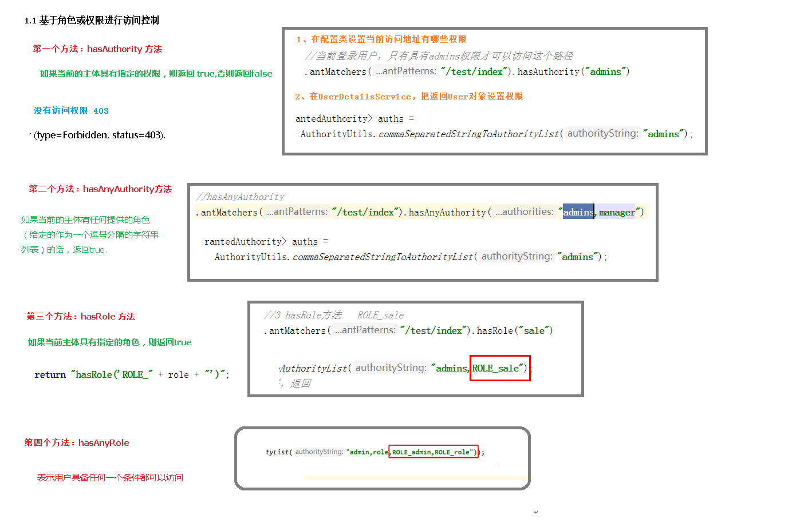

# 基本原理


# 入门案例


# SpringSecurity Web权限方案


## 设置登录系统的账号、密码

### 方式一：在application.properties

```properties
spring.security.user.name=atguigu 
spring.security.user.password=atguigu
```

### 方式二：编写类实现接口

```java
package com.atguigu.config;
@Configuration
public class SecurityConfig  {

    // 注入PasswordEncoder 类到spring 容器中
    @Bean
    public PasswordEncoder passwordEncoder() {
        return new BCryptPasswordEncoder();
    }
}
```

```java
package com.atguigu.service;
@Service
public class LoginService implements UserDetailsService {
    @Override
    public UserDetails loadUserByUsername(String username) throws UsernameNotFoundException {
        // 判断用户名是否存在
        if (!"admin".equals(username)) {
            throw new UsernameNotFoundException("用户名不存在！");
        }
        // 从数据库中获取的密码atguigu 的密文
        String pwd = "$2a$10$2R/M6iU3mCZt3ByG7kwYTeeW0w7/UqdeXrb27zkBIizBvAven0/na";
        
        // 第三个参数表示权限
        return new User(username,pwd, AuthorityUtils.createAuthorityList("admin,"));
    }
}

```

## 实现数据库认证来完成用户登录

完成自定义登录

### 准备sql

```sql
create table users(
    id bigint primary key auto_increment,
    username varchar(20) unique not null,
    password varchar(100)
);
-- 密码atguigu
insert into users values(1,'张san','$2a$10$2R/M6iU3mCZt3ByG7kwYTeeW0w7/UqdeXrb27zkBIizBvAven0/na');
-- 密码atguigu
insert into users values(2,'李si','$2a$10$2R/M6iU3mCZt3ByG7kwYTeeW0w7/UqdeXrb27zkBIizBvAven0/na');
create table role(
    id bigint primary key auto_increment,
    name varchar(20)
);
insert into role values(1,'管理员');
insert into role values(2,'普通用户');
create table role_user(
    uid bigint,
    rid bigint
);
insert into role_user values(1,1);
insert into role_user values(2,2);
create table menu(
    id bigint primary key auto_increment,
    name varchar(20),
    url varchar(100),
    parentid bigint,
    permission varchar(20)
);
insert into menu values(1,'系统管理','',0,'menu:system');
insert into menu values(2,'用户管理','',0,'menu:user');
create table role_menu(
    mid bigint,
    rid bigint
);
insert into role_menu values(1,1);
insert into role_menu values(2,1);
insert into role_menu values(2,2);
```

### 添加依赖

```xml
   <dependencies>
        <dependency>
            <groupId>org.springframework.boot</groupId>
            <artifactId>spring-boot-starter-web</artifactId>
        </dependency>

        <dependency>
            <groupId>org.springframework.boot</groupId>
            <artifactId>spring-boot-starter-security</artifactId>
        </dependency>

        <dependency>
            <groupId>org.springframework.boot</groupId>
            <artifactId>spring-boot-starter-test</artifactId>
            <scope>test</scope>
        </dependency>

        <!--        mybatis-plus-->
        <dependency>
            <groupId>com.baomidou</groupId>
            <artifactId>mybatis-plus-boot-starter</artifactId>
            <version>3.0.5</version>
        </dependency>
        <!--        mysql-->
        <dependency>
            <groupId>mysql</groupId>
            <artifactId>mysql-connector-java</artifactId>
        </dependency>
        <!--lombok用来简化实体类-->
        <dependency>
            <groupId>org.projectlombok</groupId>
            <artifactId>lombok</artifactId>
        </dependency>

    </dependencies>
```

### 制作实体类

```java
package com.atguigu.pojo;
@Data
public class Users {
    private Integer id;
    private String username;
    private String password;

```

### 整合MybatisPlus制作mapper

```java
package com.atguigu.mapper;

@Mapper
public interface UsersMapper extends BaseMapper<Users> {
}
```

配置文件添加数据库配置

```yaml
#mysql数据库连接
spring:
    datasource:
        driver-class-name: com.mysql.cj.jdbc.Driver
        url: jdbc:mysql://localhost:3306/gouwenyong?serverTimezone=GMT%2B8
        username: root
        password: root
```

### 制作登录实现类

```java
package com.atguigu.service;

@Service("userDetailsService")
public class LoginService implements UserDetailsService {

    @Autowired
    private UsersMapper usersMapper;

    @Override
    public UserDetails loadUserByUsername(String username) throws UsernameNotFoundException {

        QueryWrapper<Users> wrapper = new QueryWrapper<>();
        wrapper.eq("username", username);
        Users users = usersMapper.selectOne(wrapper);

        if (users == null) {
            throw new UsernameNotFoundException("用户名不存在！");
        }

        List<GrantedAuthority> auths = AuthorityUtils.commaSeparatedStringToAuthorityList("role");

        // 第三个参数表示权限
        return new User(username, users.getPassword(), auths);
    }
}

```

### 测试访问

```java
@RestController
@RequestMapping("/test")
public class TestController {


    @GetMapping("hello")
    public String hello() {
        return "hello controller";
    }
}

```


输入用户名，密码


## 未认证请求跳转到登录页

### 引入前端模板依赖

```xml
<dependency>
    <groupId>org.springframework.boot</groupId>
    <artifactId>spring-boot-starter-thymeleaf</artifactId>
</dependency>
```

配置信息

```yaml
server:
    port: 8080

#mysql数据库连接
spring:
    datasource:
        driver-class-name: com.mysql.cj.jdbc.Driver
        url: jdbc:mysql://localhost:3306/gouwenyong?serverTimezone=GMT%2B8
        username: root
        password: root
    thymeleaf:
        prefix: classpath:/templates/pages/
        suffix: .html
```

### 引入登录页面


```html
<!DOCTYPE html>
<html lang="en">
<head>
    <meta charset="UTF-8">
    <title>登录页</title>
</head>
<body>

<form action="/user/login" method="post">
    <!--用户名和密码默认username，password-->
    用户名：<input type="text" name="username">
    <br/>
    密码：<input type="text" name="password">
    <br/>
    <input type="submit" value="login">

</form>
</body>
</html>
```

### 编写控制器

```java
package com.atguigu.controller;

@Controller
public class IndexController {
    // 返回登录页
    @GetMapping("index")
    public String index() {
        return "index";
    }

    @GetMapping("findAll")
    @ResponseBody
    public String findAll() {
        return "findAll";
    }


    @GetMapping("/test/hello")
    @ResponseBody
    public String hello() {
        return "hello controller";
    }

    @GetMapping("/test/index")
    @ResponseBody
    public String indexSu(){
        return "登陆成功之后跳转";
    }
}
```

### 编写配置类放行登录页面以及静态资源

```java
package com.atguigu.config;

@Configuration
public class SecurityConfig extends WebSecurityConfigurerAdapter {
    @Autowired
    UserDetailsService userDetailsService;

    // 注入PasswordEncoder 类到spring 容器中
    @Bean
    public PasswordEncoder passwordEncoder() {
        return new BCryptPasswordEncoder();
    }

    @Override
    protected void configure(AuthenticationManagerBuilder auth) throws Exception {
        auth.userDetailsService(userDetailsService)
                .passwordEncoder(passwordEncoder());
    }

    @Override
    protected void configure(HttpSecurity http) throws Exception {
        http.formLogin() //自定义编写的登陆页面
                .loginPage("/login.html") //登陆页面设置
                .loginProcessingUrl("/user/login") //登陆访问路径
                .usernameParameter("username")//登录名参数名
                .passwordParameter("password")//登陆密码参数名org.springframework.security.web.authentication.UsernamePasswordAuthenticationFilter.SPRING_SECURITY_FORM_USERNAME_KEY
                .defaultSuccessUrl("/test/index").permitAll() //登陆成功之后，跳转路径
            .and().authorizeRequests()
                .antMatchers("/index","/findAll") //表示配置请求路径
                    .permitAll() // 前面指定的url指定URL无需保护。
                .anyRequest() // 其他请求
                    .authenticated()//需要认证
            .and().csrf().disable();//关闭crsf防护
    }
}
```

### 测试

http://localhost:8080/index  不需要权限

http://localhost:8080/test/hello   需要登录

## 基于角色或权限进行访问控制




## 自定义403页面


## 注解使用


## 自定义退出


## 基于数据库记住用户


