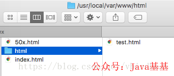

* * *

一、HTTP 服务器
-------------------------------------------------------------------------------------------------------------------------------------------------

Nginx 本身也是一个静态资源的服务器，当只有静态资源的时候，就可以使用 Nginx 来做服务器，如果一个网站只是静态页面的话，那么就可以通过这种方式来实现部署。

1、 首先在文档根目录`Docroot(/usr/local/var/www)`下创建 html 目录, 然后在 html 中放一个 test.html;

[](https://mp.weixin.qq.com/s?__biz=MzUzMTA2NTU2Ng==&mid=2247487551&idx=1&sn=18f64ba49f3f0f9d8be9d1fdef8857d9&scene=21#wechat_redirect)  

2、 配置`nginx.conf`中的 server

```nginx
user mengday staff;

http {
    server {
        listen       80;
        server_name  localhost;
        client_max_body_size 1024M;

        # 默认location
        location / {
            root   /usr/local/var/www/html;
            index  index.html index.htm;
        }
    }
}
```

3、访问测试

*   `http://localhost/` 指向`/usr/local/var/www/index.html`, index.html 是安装 nginx 自带的 html
    
*   `http://localhost/test.html` 指向`/usr/local/var/www/html/test.html`
    

> 注意：如果访问图片出现 403 Forbidden 错误，可能是因为 nginx.conf 的第一行 user 配置不对，默认是 #user nobody; 是注释的，linux 下改成 user root; macos 下改成 user 用户名 所在组; 然后重新加载配置文件或者重启，再试一下就可以了， 用户名可以通过 who am i 命令来查看。

4、指令简介

*   server : 用于定义服务，http 中可以有多个 server 块
    
*   listen : 指定服务器侦听请求的 IP 地址和端口，如果省略地址，服务器将侦听所有地址，如果省略端口，则使用标准端口
    
*   server_name : 服务名称，用于配置域名
    
*   location : 用于配置映射路径 uri 对应的配置，一个 server 中可以有多个 location, location 后面跟一个 uri, 可以是一个正则表达式, / 表示匹配任意路径, 当客户端访问的路径满足这个 uri 时就会执行 location 块里面的代码
    
*   root : 根路径，当访问`http://localhost/test.html`，“/test.html” 会匹配到”/”uri, 找到 root 为`/usr/local/var/www/html`，用户访问的资源物理地址 =`root + uri = /usr/local/var/www/html + /test.html=/usr/local/var/www/html/test.html`
    
*   index : 设置首页，当只访问`server_name`时后面不跟任何路径是不走 root 直接走 index 指令的；如果访问路径中没有指定具体的文件，则返回 index 设置的资源，如果访问`http://localhost/html/` 则默认返回 index.html
    

5、location uri 正则表达式

*   `.` ：匹配除换行符以外的任意字符
    
*   `?` ：重复 0 次或 1 次
    
*   `+` ：重复 1 次或更多次
    
*   `*` ：重复 0 次或更多次
    
*   `\d` ：匹配数字
    
*   `^` ：匹配字符串的开始
    
*   `$` ：匹配字符串的结束
    
*   `{n}` ：重复 n 次
    
*   `{n,}` ：重复 n 次或更多次
    
*   `[c]` ：匹配单个字符 c
    
*   `[a-z]` ：匹配 a-z 小写字母的任意一个
    
*   `(a|b|c)` : 属线表示匹配任意一种情况，每种情况使用竖线分隔，一般使用小括号括括住，匹配符合 a 字符 或是 b 字符 或是 c 字符的字符串
    
*   `\` 反斜杠：用于转义特殊字符
    

小括号 () 之间匹配的内容，可以在后面通过`$1`来引用，`$2`表示的是前面第二个 () 里的内容。正则里面容易让人困惑的是`\`转义特殊字符。

> 基于 Spring Boot + MyBatis Plus + Vue & Element 实现的后台管理系统 + 用户小程序，支持 RBAC 动态权限、多租户、数据权限、工作流、三方登录、支付、短信、商城等功能
> 
> *   项目地址：https://github.com/YunaiV/ruoyi-vue-pro
>     
> *   视频教程：https://doc.iocoder.cn/video/
>     

二、静态服务器
----------------------------------------------------------------------------------------------------------------------------------------------

在公司中经常会遇到静态服务器，通常会提供一个上传的功能，其他应用如果需要静态资源就从该静态服务器中获取。

1、在`/usr/local/var/www` 下分别创建 images 和 img 目录，分别在每个目录下放一张`test.jpg`

[](https://mp.weixin.qq.com/s?__biz=MzUzMTA2NTU2Ng==&mid=2247487551&idx=1&sn=18f64ba49f3f0f9d8be9d1fdef8857d9&scene=21#wechat_redirect)  

```nginx
http {
    server {
        listen       80;
        server_name  localhost;


        set $doc_root /usr/local/var/www;

        # 默认location
        location / {
            root   /usr/local/var/www/html;
            index  index.html index.htm;
        }

        location ^~ /images/ {
            root $doc_root;
       }

       location ~* \.(gif|jpg|jpeg|png|bmp|ico|swf|css|js)$ {
           root $doc_root/img;
       }
    }
}
```

自定义变量使用 set 指令，语法 set 变量名值; 引用使用变量名值; 引用使用变量名; 这里自定义了 doc_root 变量。

静态服务器 location 的映射一般有两种方式：

*   使用路径，如 /images/ 一般图片都会放在某个图片目录下，
    
*   使用后缀，如 .jpg、.png 等后缀匹配模式
    

访问`http://localhost/test.jpg` 会映射到 `$doc_root/img`

访问`http://localhost/images/test.jpg` 当同一个路径满足多个 location 时，优先匹配优先级高的 location，由于`^~` 的优先级大于 `~`, 所以会走`/images/`对应的 location

常见的 location 路径映射路径有以下几种：

*   `=`    进行普通字符精确匹配。也就是完全匹配。
    
*   `^~`     前缀匹配。如果匹配成功，则不再匹配其他 location。
    
*   `~`    表示执行一个正则匹配，区分大小写
    
*   `~*`     表示执行一个正则匹配，不区分大小写
    
*   `/xxx/`  常规字符串路径匹配
    
*   `/`    通用匹配，任何请求都会匹配到
    

#### location 优先级

当一个路径匹配多个 location 时究竟哪个 location 能匹配到时有优先级顺序的，而优先级的顺序于 location 值的表达式类型有关，和在配置文件中的先后顺序无关。相同类型的表达式，字符串长的会优先匹配。

以下是按优先级排列说明：

*   等号类型（=）的优先级最高。一旦匹配成功，则不再查找其他匹配项，停止搜索。
    
*   `^~`类型表达式，不属于正则表达式。一旦匹配成功，则不再查找其他匹配项，停止搜索。
    
*   正则表达式类型（`~ ~*`）的优先级次之。如果有多个 location 的正则能匹配的话，则使用正则表达式最长的那个。
    
*   常规字符串匹配类型。按前缀匹配。
    
*   / 通用匹配，如果没有匹配到，就匹配通用的
    

优先级搜索问题：不同类型的 location 映射决定是否继续向下搜索

*   等号类型、`^~`类型：一旦匹配上就停止搜索了，不会再匹配其他 location 了
    
*   正则表达式类型 (`~ ~*`）, 常规字符串匹配类型`/xxx/` : 匹配到之后，还会继续搜索其他其它 location，直到找到优先级最高的，或者找到第一种情况而停止搜索
    

location 优先级从高到底：

(`location =`) > (`location 完整路径`) > (`location ^~ 路径`) > (`location ~,~* 正则顺序`) > (`location 部分起始路径`) > (`/`)

```nginx
location = / {
    # 精确匹配/，主机名后面不能带任何字符串 /
    [ configuration A ]
}
location / {
    # 匹配所有以 / 开头的请求。
    # 但是如果有更长的同类型的表达式，则选择更长的表达式。
    # 如果有正则表达式可以匹配，则优先匹配正则表达式。
    [ configuration B ]
}
location /documents/ {
    # 匹配所有以 /documents/ 开头的请求，匹配符合以后，还要继续往下搜索。
    # 但是如果有更长的同类型的表达式，则选择更长的表达式。
    # 如果有正则表达式可以匹配，则优先匹配正则表达式。
    [ configuration C ]
}
location ^~ /images/ {
    # 匹配所有以 /images/ 开头的表达式，如果匹配成功，则停止匹配查找，停止搜索。
    # 所以，即便有符合的正则表达式location，也不会被使用
    [ configuration D ]
}

location ~* \.(gif|jpg|jpeg)$ {
    # 匹配所有以 gif jpg jpeg结尾的请求。
    # 但是 以 /images/开头的请求，将使用 Configuration D，D具有更高的优先级
    [ configuration E ]
}

location /images/ {
    # 字符匹配到 /images/，还会继续往下搜索
    [ configuration F ]
}


location = /test.htm {
    root   /usr/local/var/www/htm;
    index  index.htm;
}
```

注意：location 的优先级与 location 配置的位置无关

> 基于 Spring Cloud Alibaba + Gateway + Nacos + RocketMQ + Vue & Element 实现的后台管理系统 + 用户小程序，支持 RBAC 动态权限、多租户、数据权限、工作流、三方登录、支付、短信、商城等功能
> 
> *   项目地址：https://github.com/YunaiV/yudao-cloud
>     
> *   视频教程：https://doc.iocoder.cn/video/
>     

三、反向代理
---------------------------------------------------------------------------------------------------------------------------------------------

反向代理应该是 Nginx 使用最多的功能了，反向代理 (Reverse Proxy) 方式是指以代理服务器来接受 internet 上的连接请求，然后将请求转发给内部网络上的服务器，并将从服务器上得到的结果返回给 internet 上请求连接的客户端，此时代理服务器对外就表现为一个反向代理服务器。

简单来说就是真实的服务器不能直接被外部网络访问，所以需要一台代理服务器，而代理服务器能被外部网络访问的同时又跟真实服务器在同一个网络环境，当然也可能是同一台服务器，端口不同而已。

反向代理通过`proxy_pass`指令来实现。

启动一个 Java Web 项目，端口号为 8081

```nginx
server {
    listen       80;
    server_name  localhost;

    location / {
        proxy_pass http://localhost:8081;
        proxy_set_header Host $host:$server_port;
        # 设置用户ip地址
         proxy_set_header X-Forwarded-For $remote_addr;
         # 当请求服务器出错去寻找其他服务器
         proxy_next_upstream error timeout invalid_header http_500 http_502 http_503;
    }

}
```

当我们访问 localhost 的时候，就相当于访问 `localhost:8081`了

四、负载均衡
---------------------------------------------------------------------------------------------------------------------------------------------

负载均衡也是 Nginx 常用的一个功能，负载均衡其意思就是分摊到多个操作单元上进行执行，例如 Web 服务器、FTP 服务器、企业关键应用服务器和其它关键任务服务器等，从而共同完成工作任务。

简单而言就是当有 2 台或以上服务器时，根据规则随机的将请求分发到指定的服务器上处理，负载均衡配置一般都需要同时配置反向代理，通过反向代理跳转到负载均衡。而 Nginx 目前支持自带 3 种负载均衡策略，还有 2 种常用的第三方策略。

负载均衡通过 upstream 指令来实现。

#### 1. RR(round robin : 轮询 默认

每个请求按时间顺序逐一分配到不同的后端服务器，也就是说第一次请求分配到第一台服务器上，第二次请求分配到第二台服务器上，如果只有两台服务器，第三次请求继续分配到第一台上，这样循环轮询下去，也就是服务器接收请求的比例是 1:1， 如果后端服务器 down 掉，能自动剔除。轮询是默认配置，不需要太多的配置

同一个项目分别使用 8081 和 8082 端口启动项目

```nginx
upstream web_servers {
   server localhost:8081;
   server localhost:8082;
}

server {
    listen       80;
    server_name  localhost;
    #access_log  logs/host.access.log  main;


    location / {
        proxy_pass http://web_servers;
        # 必须指定Header Host
        proxy_set_header Host $host:$server_port;
    }
 }
```

访问地址仍然可以获得响应 `http://localhost/api/user/login?username=zhangsan&password=111111` ，这种方式是轮询的

#### 2. 权重

指定轮询几率，weight 和访问比率成正比, 也就是服务器接收请求的比例就是各自配置的 weight 的比例，用于后端服务器性能不均的情况, 比如服务器性能差点就少接收点请求，服务器性能好点就多处理点请求。

```nginx
upstream test {
    server localhost:8081 weight=1;
    server localhost:8082 weight=3;
    server localhost:8083 weight=4 backup;
}
```

示例是 4 次请求只有一次被分配到 8081 上，其他 3 次分配到 8082 上。backup 是指热备，只有当 8081 和 8082 都宕机的情况下才走 8083

#### [3. ip_hash]

上面的 2 种方式都有一个问题，那就是下一个请求来的时候请求可能分发到另外一个服务器，当我们的程序不是无状态的时候 (采用了 session 保存数据)，这时候就有一个很大的很问题了，比如把登录信息保存到了 session 中，那么跳转到另外一台服务器的时候就需要重新登录了，所以很多时候我们需要一个客户只访问一个服务器，那么就需要用 iphash 了，iphash 的每个请求按访问 ip 的 hash 结果分配，这样每个访客固定访问一个后端服务器，可以解决 session 的问题。

```nginx
upstream test {
    ip_hash;
    server localhost:8080;
    server localhost:8081;
}
```

#### [4. fair(第三方)]

按后端服务器的响应时间来分配请求，响应时间短的优先分配。这个配置是为了更快的给用户响应

```nginx
upstream backend {
    fair;
    server localhost:8080;
    server localhost:8081;
}
```

#### [5. url_hash(第三方)]

按访问 url 的 hash 结果来分配请求，使每个 url 定向到同一个后端服务器，后端服务器为缓存时比较有效。在 upstream 中加入 hash 语句，server 语句中不能写入 weight 等其他的参数，`hash_method`是使用的 hash 算法

```nginx
upstream backend {
    hash $request_uri;
    hash_method crc32;
    server localhost:8080;
    server localhost:8081;
}
```

以上 5 种负载均衡各自适用不同情况下使用，所以可以根据实际情况选择使用哪种策略模式, 不过 fair 和 url_hash 需要安装第三方模块才能使用。

[五、动静分离]
---------------------------------------------------------------------------------------------------------------------------------------------

动静分离是让动态网站里的动态网页根据一定规则把不变的资源和经常变的资源区分开来，动静资源做好了拆分以后，我们就可以根据静态资源的特点将其做缓存操作，这就是网站静态化处理的核心思路。

```nginx
upstream web_servers {
       server localhost:8081;
       server localhost:8082;
}

server {
    listen       80;
    server_name  localhost;

    set $doc_root /usr/local/var/www;

    location ~* \.(gif|jpg|jpeg|png|bmp|ico|swf|css|js)$ {
       root $doc_root/img;
    }

    location / {
        proxy_pass http://web_servers;
        # 必须指定Header Host
        proxy_set_header Host $host:$server_port;
    }

    error_page 500 502 503 504  /50x.html;
    location = /50x.html {
        root $doc_root;
    }

 }
```

[六、其他]
-------------------------------------------------------------------------------------------------------------------------------------------

#### [1.return 指令](https://mp.weixin.qq.com/s?__biz=MzUzMTA2NTU2Ng==&mid=2247487551&idx=1&sn=18f64ba49f3f0f9d8be9d1fdef8857d9&scene=21#wechat_redirect)

返回 http 状态码 和 可选的第二个参数可以是重定向的 URL

```nginx
location /permanently/moved/url {
    return 301 http://www.example.com/moved/here;
}
```

#### [2. rewrite 指令](https://mp.weixin.qq.com/s?__biz=MzUzMTA2NTU2Ng==&mid=2247487551&idx=1&sn=18f64ba49f3f0f9d8be9d1fdef8857d9&scene=21#wechat_redirect)

重写 URI 请求 rewrite，通过使用 rewrite 指令在请求处理期间多次修改请求 URI，该指令具有一个可选参数和两个必需参数。

第一个 (必需) 参数是请求 URI 必须匹配的正则表达式。

第二个参数是用于替换匹配 URI 的 URI。

可选的第三个参数是可以停止进一步重写指令的处理或发送重定向 (代码 301 或 302) 的标志

```nginx
location /users/ {
    rewrite ^/users/(.*)$ /show?user=$1 break;
}
```

#### [3. error_page 指令](https://mp.weixin.qq.com/s?__biz=MzUzMTA2NTU2Ng==&mid=2247487551&idx=1&sn=18f64ba49f3f0f9d8be9d1fdef8857d9&scene=21#wechat_redirect)

使用 error_page 指令，您可以配置 NGINX 返回自定义页面以及错误代码，替换响应中的其他错误代码，或将浏览器重定向到其他 URI。在以下示例中，`error_page`指令指定要返回 404 页面错误代码的页面 (/404.html)。

```nginx
error_page 404 /404.html;
```

#### [4. 日志](https://mp.weixin.qq.com/s?__biz=MzUzMTA2NTU2Ng==&mid=2247487551&idx=1&sn=18f64ba49f3f0f9d8be9d1fdef8857d9&scene=21#wechat_redirect)

访问日志：需要开启压缩 gzip on; 否则不生成日志文件，打开`log_format`、`access_log`注释

```nginx
log_format  main  '$remote_addr - $remote_user [$time_local] "$request" '
                      '$status $body_bytes_sent "$http_referer" '
                      '"$http_user_agent" "$http_x_forwarded_for"';

access_log  /usr/local/etc/nginx/logs/host.access.log  main;

gzip  on;
```

#### [5. deny 指令](https://mp.weixin.qq.com/s?__biz=MzUzMTA2NTU2Ng==&mid=2247487551&idx=1&sn=18f64ba49f3f0f9d8be9d1fdef8857d9&scene=21#wechat_redirect)

```nginx
# 禁止访问某个目录
location ~* \.(txt|doc)${
    root $doc_root;
    deny all;
}
```

#### [6. 内置变量](https://mp.weixin.qq.com/s?__biz=MzUzMTA2NTU2Ng==&mid=2247487551&idx=1&sn=18f64ba49f3f0f9d8be9d1fdef8857d9&scene=21#wechat_redirect)

nginx 的配置文件中可以使用的内置变量以美元符`$`开始，也有人叫全局变量。其中，部分预定义的变量的值是可以改变的。

*   `$args` ：`#`这个变量等于请求行中的参数，同`$query_string`
    
*   `$content_length` ：请求头中的 Content-length 字段。
    
*   `$content_type` ：请求头中的 Content-Type 字段。
    
*   `$document_root` ：当前请求在 root 指令中指定的值。
    
*   `$host` ：请求主机头字段，否则为服务器名称。
    
*   `$http_user_agent` ：客户端 agent 信息
    
*   `$http_cookie` ：客户端 cookie 信息
    
*   `$limit_rate` ：这个变量可以限制连接速率。
    
*   `$request_method` ：客户端请求的动作，通常为 GET 或 POST。
    
*   `$remote_addr` ：客户端的 IP 地址。
    
*   `$remote_port` ：客户端的端口。
    
*   `$remote_user` ：已经经过 Auth Basic Module 验证的用户名。
    
*   `$request_filename` ：当前请求的文件路径，由 root 或 alias 指令与 URI 请求生成。
    
*   `$scheme` ：HTTP 方法（如 http，https）。
    
*   `$server_protocol` ：请求使用的协议，通常是 HTTP/1.0 或 HTTP/1.1。
    
*   `$server_addr` ：服务器地址，在完成一次系统调用后可以确定这个值。
    
*   `$server_name` ：服务器名称。
    
*   `$server_port` ：请求到达服务器的端口号。
    
*   `$request_uri` ：包含请求参数的原始 URI，不包含主机名，如：”`/foo/bar.php?arg=baz`”。
    
*   `$uri` ：不带请求参数的当前 URI，`$uri`不包含主机名，如”`/foo/bar.html`”。
    
*   `$document_uri` ：与`$uri`相同
    

