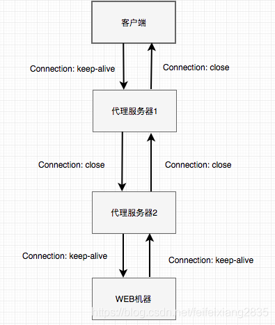
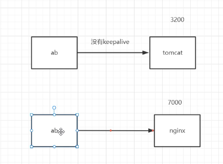
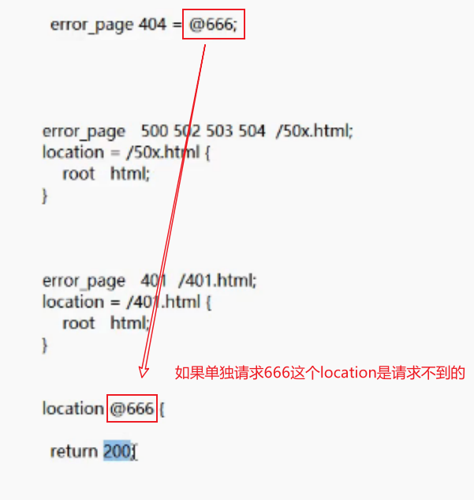

# Nginx高级 第一部分：扩容

通过扩容提升整体吞吐量，扩容方式

1. 单机垂直扩容：硬件资源增加

2. 水平扩展：集群化

3. 细粒度拆分：分布式

   1. 数据分区

   2. 上游服务SOA化（原生支持水平／垂直扩容）**面向服务的架构**

   3. 入口细分
      1. 浏览器
      2. 移动端原生App（物联网）
      3. H5内嵌式应用

4. 数据异构化
   1. 多级缓存
      1. 客户端缓存
      2. CDN缓存
      3. 异地多活
      4. Nginx缓存

5. 服务异步化
   1. 拆分请求
   2. 消息中间件

扩容原则

1. 无状态原则
2. 弹性原则

## 1.单机垂直扩容：硬件资源增加

云服务资源增加

+ 整机：IBM、浪潮、DELL、HP等
+ CPU/主板：更新到主流
+ 网卡：10G/40G网卡
+ 磁盘：SAS(SCSI) HDD（机械）、HHD（混合）、SATA SSD、PCI-e SSD、 MVMe SSD
  + SSD
            多副本机制
            系统盘/热点数据/数据库存储
  + HDD
    		冷数据存储


## 2.水平扩展：集群化

### 会话管理  --会话保持

架构：


痛点：客户端与服务器的会话管理【cookie  session】

解决办法：

1. Nginx高级负载均衡

   + ip_hash   根据ip  hash分发
     + 问题1：ip集中、流量倾斜。
     + 问题2：后端服务器宕机 ，会话丢失
     + 场景：中小型项目快速扩容

   + 其他hsah
     + `hash    $cookie_jsessionid;`   --浏览器请求会携带cookie，
     + `hash    $request_uri;`    --根据url&hash分发
     + 使用Http Header区分不同用户 `hash $http_你设置的header名称;`

   + 使用lua逻辑定向分发

2. Redis + SpringSession


#### Nginx高级负载均衡

##### **hash分发--ip_hash **

ip_hash是容易理解的，但是因为仅仅能用ip这个因子来分配后端，因此ip_hash是有缺陷的，不能在一些情况下使用：

1. nginx不是最前端的服务器，ip_hash要求nginx一定是最前端的服务器，否则nginx得不到正确ip，就不能根据ip作hash。譬如使用的是squid为最前端，那么nginx取ip时只能得到squid的服务器ip地址，用这个地址来作分流是肯定错乱的。

2. nginx的后端还有其它方式的负载均衡。假如nginx后端又有其它负载均衡，将请求又通过另外的方式分流了，那么某个客户端的请求肯定不能定位到同一台session应用服务器上。这么算起来，nginx后端只能直接指向应用服务器，或者再搭一个squid，然后指向应用服务器。最好的办法是用location作一次分流，将需要session
3. 流量倾斜

```nginx
   upstream httpds {
       ip_hash;
       server 192.168.44.102 ;
       server 192.168.44.103 ;
   }


    server {
        listen       80;
        server_name  localhost;

        location / {
            proxy_pass http://httpds;

            # root   html;
        }
    
    
    
       location ~*/(css|img|js) {
     
        root   /usr/local/nginx/html;

    }
```


##### hash分发--$cookie 

`hash $cookie_jsessionid;`

>   我们已经知道了如果使用Servlet Session的话，Web容器会自动的在用户浏览器上建立名为jsessionid的cookie，并且值就是服务器端的SessionID。另一方面，新版的NGINX不光可以通过IP的hash来分发流量，也可以通过url的hash，cookie的hash，header的hash等等进行链接的固定分配。由于用户登陆成功以后名为jsessionid的cookie就有了一个短期固定的值，而且每个用户都不一样，那么我们就可以根据这个sessionid的hash值为它分配一个服务器。在当前sessionID起作用的时候那么分配的服务器也是同一个，并且不需要安装第三方的插件，方法如下: `#hash $cookie_cookiename;`
>
> ```nginx
> # 以jsessionid hash分发
> upstream backend {
>     ...
>     hash        $cookie_jsessionid;
>  
> }
> ```
>
> 

测试：


##### **hash分发--$request_uri**


测试：

`192.168.44.101/index.jsp`   --> 访问04服务器

`192.168.44.101/index.jsp？`   --> 访问05服务器


##### hash分发--Http Header

> **hash $http_x_forwarded_for;**
>
> 有些情况下无法使用cookie，比如客户端浏览器禁用的cookie，Android，IOS等移动端调用的HTTPAPI接口等。现在比较常用的做法是把SessionID，有的也喜欢叫做token，放在请求的URL或者请求参数中
> 那么没有cookie如何区分用户呢，这种情况下虽然不能使用cookie，但是header是可以使用的，我们可以把token或者sessionID放到header中，然后对该header的值进行hash，并固定分配一个服务器。配置文件的写法如下
> `hash $http_你设置的header名称;`
>
> 
>
>
> 大多数的反向代理软件都会把它收到的请求源的IP记录在x_forwarded_for这个header中，所以一个客户总是拥有一个唯一的x_forwarded_for头不会变化，所以我们也可以对这个Header进行hash,效果就是根据IP地址进行分流是一样的。
>
> `hash $http_x_forwarded_for;`
>
>
> 如果你的上级也是NGINX,那么应该按照如下配置
>
> ```nginx
> location / {
> 	proxy_pass http://localhost:8000;
> 	 
> 	proxy_set_header X-Real-IP $remote_addr;
> 	# needed for HTTPS
> 	# proxy_set_header X_FORWARDED_PROTO https;
> 	proxy_set_header X-Forwarded-For $remote_addr;
> 	proxy_set_header X-Forwarded-For $proxy_add_x_forwarded_for;
> 	proxy_set_header Host $host;
> 	proxy_redirect off;
> }
> ```


#### 使用sticky模块完成对Nginx的负载均衡的会话保持

> Sticky是nginx的一个模块，它是基于cookie的一种nginx的负载均衡解决方案**，通过分发和识别cookie，来使同一个客户端的请求落在同一台服务器**上，默认标识名为*route*
>
> 1. 客户端首次发起访问请求，nginx接收后，发现请求头没有cookie，则以轮询方式将请求分发给后端服务器。
> 2. 后端服务器处理完请求，将响应数据返回给nginx。
> 3. 此时nginx生成带route的cookie，返回给客户端。route的值与后端服务器对应，可能是明文，也可能是md5、sha1等Hash值
> 4. 客户端接收请求，并保存带route的cookie。
> 5. 当客户端下一次发送请求时，会带上route，nginx根据接收到的cookie中的route值，转发给对应的后端服务器。

> 参考博客：https://www.cnblogs.com/tssc/p/7481885.html


**使用参考**


http://nginx.org/en/docs/http/ngx_http_upstream_module.html#sticky

tengine中有session_sticky模块我们通过第三方的方式安装在开源版本中

sticky是第三方模块，需要重新编译Nginx,他可以对Nginx这种静态文件服务器使用基于cookie的负载均衡

##### 1.下载模块

**项目官网**

https://bitbucket.org/nginx-goodies/nginx-sticky-module-ng/src/master/

另外一个版本

https://github.com/bymaximus/nginx-sticky-module-ng

**下载**

https://bitbucket.org/nginx-goodies/nginx-sticky-module-ng/get/1.2.6.zip

##### 2.上传解压

##### 3.重新编译Nginx

依赖` yum install openssl-devel`   

**进到源码目录重新编译**

```shell
./configure --prefix=/usr/local/nginx --add-module=/root/nginx-goodies-nginx-sticky-module-ng-c78b7dd79d0d
```

**执行`make`**

**如遇报错修改源码**


打开 `ngx_http_sticky_misc.c`文件

在12行添加

```c
#include <openssl/sha.h>
#include <openssl/md5.h>
```


**备份之前的程序**

```shell
mv /usr/local/nginx/sbin/nginx /usr/local/nginx/sbin/nginx.old
```


**把编译好的Nginx程序替换到原来的目录里**

```shell
cp objs/nginx /usr/local/nginx/sbin/
```

**升级检测**

```
make upgrade
```

检查程序中是否包含新模块

```
nginx -V
```


配置方法

```nginx
upstream httpget {

    # 注意sticky name不要和jessionid冲突
    sticky name=route expires=6h;

    server 192.168.44.102;
    server 192.168.44.103;
}
```


### 反向代理中的容错机制

#### 参考文档

https://docs.nginx.com/nginx/admin-guide/load-balancer/http-load-balancer/

http://nginx.org/en/docs/stream/ngx_stream_proxy_module.html#proxy_bind


**proxy_timeout** 


#### 重试机制

**proxy_next_upstream**

作用：

当后端服务器返回指定的错误时，将请求传递到其他服务器。

`error`与服务器建立连接，向其传递请求或读取响应头时发生错误;

`timeout`在与服务器建立连接，向其传递请求或读取响应头时发生超时;

`invalid_header`服务器返回空的或无效的响应;

`http_500`服务器返回代码为500的响应;

`http_502`服务器返回代码为502的响应;

`http_503`服务器返回代码为503的响应;

`http_504`服务器返回代码504的响应;

`http_403`服务器返回代码为403的响应;

`http_404`服务器返回代码为404的响应;

`http_429`服务器返回代码为429的响应;

不了解这个机制，在日常开发web服务的时候，就可能会踩坑。

比如有这么一个场景：一个用于导入数据的web页面，上传一个excel，通过读取、处理excel，向数据库中插入数据，处理时间较长（如1分钟），且为同步操作（即处理完成后才返回结果）。暂且不论这种方式的好坏，若nginx配置的响应等待时间（proxy_read_timeout）为30秒，就会触发超时重试，将请求又打到另一台。如果处理中没有考虑到重复数据的场景，就会发生数据多次重复插入！（当然，这种场景，内网可以通过机器名访问该服务器进行操作，就可以绕过nginx了，不过外网就没办法了。）


### KeepAlive

在http协议header中可以看到当前连接状态


#### 测试工具charles

**下载地址**

https://www.charlesproxy.com/assets/release/4.6.2/charles-proxy-4.6.2-win64.msi?k=fc1457e312

**官网**

https://www.charlesproxy.com

#### 什么时候使用？

明显的预知用户会在当前连接上有下一步操作

复用连接，有效减少握手次数，尤其是https建立一次连接开销会更大

#### 什么时候不用？

访问内联资源一般用缓存，不需要keepalive

长时间的tcp连接容易导致系统资源无效占用

#### 对客户端使用keepalive


浏览器  --> nginx

http://nginx.org/en/docs/http/ngx_http_upstream_module.html


**keepalive_time** 

> 限制keepalive保持连接的最大时间  默认3600s
>
> 限制通过一个keepalive连接处理请求的最长时间。到达该时间后，连接将在后续请求处理后关闭。
>
> 1.19.10新功能


**keepalive_timeout**

> 用于设置Nginx服务器与客户端保持连接的超时时间
>
> 用于踢出不活动连接
>
> keepalive_timeout = 0 即关闭
>
> 


**send_timeout**

> 两次向客户端写操作之间的间隔 如果大于这个时间则关闭连接 **默认60s**
>
> **此处有坑**，注意耗时的同步操作超过send_timeout有可能会丢弃用户连接，强制断开连接。
>
>  
>
> - send_timeout 10;  10秒
> - send_timeout 10 10; 同时下发一个header 告诉浏览器
>
> 该设置表示Nginx服务器与客户端连接后，某次会话中服务器等待客户端响应超过10s，就会自动关闭连接。注意：准备过程中，不是传输过程
>


**keepalive_requests**

> 单个连接中可处理的请求数
>
> 默认1000


**keepalive_disable**

> 不对某些浏览器建立长连接
>
> 默认msie6  IE6


```nginx
http {
    include       mime.types;
    default_type  application/octet-stream;


    sendfile        on;
    
    keepalive_time 1h; # 一个tcp连接总时长，超过之后 强制失效

	#keepalive_timeout = 0; #即关闭
    keepalive_timeout  65 65; #超过这个时间 没有活动，会让keepalive失效 
    
  
    send_timeout 60;# 默认60s  此处有坑！！ 系统中 若有耗时操作，超过 send_timeout 强制断开连接。 注意：准备过程中，不是传输过程


    keepalive_requests 1000;  #一个tcp复用中 可以并发接收的请求个数
```


#### 对上游服务器使用keepalive


nginx -->  服务器tomcat

首先需要配置使用http1.1协议。以便建立更高效的传输，默认使用http1.0，在http1.0中需要配置header才能

在Upstream中所配置的上游服务器默认都是用短连接，即每次请求都会在完成之后断开

##### 相关配置

###### upstream中配置

**keepalive 100;**

> 向上游服务器的保留连接数   --核心连接数

**keepalive_timeout  **

> 连接保留时间

 **keepalive_requests ** 

> 一个tcp复用中 可以并发接收的请求个数


###### server中配置

```nginx
proxy_http_version 1.1;
#配置http版本号
#默认使用http1.0协议，需要在request中增加”Connection： keep-alive“ header才能够支持，而HTTP1.1默认支持。

proxy_set_header Connection "";
#清除 close信息  NGINX向后台请求的
```


```nginx
http{
   ...
  upstream backend {
        server 192.167.61.1:8080;
        server 192.167.61.1:8082 back;
        keepalive 100;
        # keepalive_requests 100;
        # keepalive_timeout 60s;
	}

    server {
        listen      80;
        server_name manage.jt.com;   
        local /test {
            proxy_http_version 1.1;
            proxy_set_header Connection ""; # 传递给上游服务器的头信息

            proxy_pass http://backend;
        }
    }      
}
```


### 扩展 keepalive 概念

#### 高可用 Keepalived

Keepalived是一个基于VRRP协议来实现的服务高可用方案，可以利用其来避免IP单点故障。它的作用是检测服务器的状态，如果有一台服务器宕机，或出现故障，Keepalived将检测到，使用其他服务器代替该服务器的工作，当服务器工作正常后Keepalived自动将服务器加入到服务器群中。
Keepalived一般不会单独出现，而是与其它负载均衡技术（如lvs、haproxy、nginx）一起工作来达到集群的高可用。

一个简单的使用例子，将域名解析到一台负载均衡机器上，然后负载均衡反向代理到WEB机器上。中间的负载均衡只有一台，没法做到高可用，至少需要做到两台，那配置成两台机器之后，Keepalived就可以保证服务只有一个对外的虚拟IP，如果MASTER的负载均衡出现故障的时候，自动切换到BACKUP负载均衡上，服务不受任何影响。Keepalived来保证这些。

我们以前有过一套稍显复杂的服务配置，Keepalived给HAProxy提供高可用，然后HAProxy给Twemproxy提供高可用和负载均衡，Twemproxy给Redis集群提供高可用和负载均衡。提供负载均衡服务的基本都会保证高可用，我们使用最多的Nginx作为反向代理服务器的时候，就能保证web服务的高可用。

nginx+keepalived 搭建高可用的服务教程有很多。感兴趣的可以自己试下搭建。

#### TCP 的keepalive

TCP的keepalive主要目的是及时的释放服务器资源。
通过TCP协议客户端与服务器建立连接之后，如果客户端一直不发送数据，或者隔很长时间才发送一次数据，当连接很久没有数据传输时如何去确定对方还在线，到底是掉线了还是确实没有数据传输，连接是保持还是关闭，多长时间或者在什么样的机制下连接应该关闭释放资源。TCP的keepalive就是为了解决这个问题才引入的。
TCP的keepalive主要是三个参数来控制

```yaml
tcp_keepalive_time 7200
心跳周期
tcp_keepalive_intvl 75
侦测包发送间隔
tcp_keepalive_probes 9
侦测包重试次数
```

解释下这个流程和参数。
客户端与服务器建立连接后，如果双方在tcp_keepalive_time(7200S)后，没有任何数据的传输，服务器就会每隔tcp_keepalive_intvl（75S）向客户端发送探测包，判断客户端的连接状态，大概包括客户端崩溃、强制关闭了应用、主机不可达等的异常状态。如果侦测包发送了tcp_keepalive_probes（9）次之后仍然没有收到客户端的回复(就是ack包)，服务器就会认为这个连接已经不可用了，可以丢弃或者关闭了。

#### Nginx 的keepalive

TCP层已经有keepalive，为什么应用层的Nginx还需要keepalive？
我理解的是，使用TCP的keepalive的保证传输层连接的可用性，默认配置都是2小时的检测周期。Nginx的keepalive来保证应用层的连接的可用性。一个在第四层传输层上保证可用性，一个在第七层应用层上保证应用层协议连接的可用性。
有本书里面有提到：
*为什么TCP keepalive不能替代应用层心跳？心跳除了说明应用程序还活着（进程还在，网络通畅），更重要的是表明应用程序还能正常工作。而TCP keepalive由操作系统负责探查，即便进程死锁或者阻塞，操作系统也会如常收发TCP keepalive信息，对方无法得知这一异常。*

nginx keepalive跟TCP的配置基本一致，只不过名字不一样罢了。配置说明如下

```ini
so_keepalive=on|off|[keepidle]:[keepintvl]:[keepcnt] 
```

so_keepalive=30m::10 表示开启tcp侦测，30分钟后无数据收发会发送侦测包，时间间隔使用系统默认的，发送10次侦测包。

#### HTTP的keepalive

HTTP的keepalive比较常见，就是将短链接变成长链接。短连接是每个请求响应，客户端和服务器都要新建一个连接，完成之后立即断开连接；当使用keepalive长连接时，客户端到服务器端的建立连接，响应完成后连接不断开，下次请求直接服用原来的连接，这样就避免了重复建立连接和断开连接的开销。

那么客户端和服务器端是怎么约定使用长连接通信还是短连接通信。
主要Connection头部

```makefile
客户端请求长连接头部：Connection: keep-alive
服务端同意使用长连接的响应头部：Connection: keep-alive
两者缺一不可，如果服务器端不支持长连接：Connection: Close
如果是HTTP/1.1默认使用长连接，无论头部是不是 Connection: keep-alive
```

注意的点：
Connection只对当前的连接双方有效,并且Connection头部不向后传递，只标识自己的连接状态。
如果是多级代理又是什么流程？

1客户端与代理服务器1建连的时候带了Connection: keep-alive，但是代理服务器1不支持长连接，回复了Connection: Close，所以使两者用短连接
2代理服务器1与代理服务器2建连的时候使用Connection: Close短连接，代理服务器2回复了Connection: Close，所以两者使用短连接
3代理服务器2与web机器建连的时候使用了Connection: keep-alive，web机器支持长连接，也回复了Connection: keep-alive，所以两者使用长连接

nginx没有专门类似keep_alive on/off的开关，但是也有配置来控制，就是keepalive_timeout，如果设置成0，就表示禁用客户端的长连接。当然了如果大于0就启用长连接多长时间内有效

HTTP的keepalive是开发者最长遇到的，所以要格外注意。不是服务器要求使用长连接连接就是长连接，是需要双方都同意才能使用长连接通信。以前遇到过阿里云的SLB就不支持长连接，WEB服务器或者代理服务器跟SLB连接的都是短连接。

### AB安装

`yum install httpd-tools`

参数说明：

- -n  即requests，用于指定压力测试总共的执行次数。
- -c  即concurrency，用于指定的并发数。
- -t  即timelimit，等待响应的最大时间(单位：秒)。
- -b  即windowsize，TCP发送/接收的缓冲大小(单位：字节)。
- -p  即postfile，发送POST请求时需要上传的文件，此外还必须设置-T参数。
- -u  即putfile，发送PUT请求时需要上传的文件，此外还必须设置-T参数。
- -T  即content-type，用于设置Content-Type请求头信息，例如：application/x-www-form-urlencoded，默认值为text/plain。
- -v  即verbosity，指定打印帮助信息的冗余级别。
- -w  以HTML表格形式打印结果。
- -i  使用HEAD请求代替GET请求。
- -x  插入字符串作为table标签的属性。
- -y  插入字符串作为tr标签的属性。
- -z  插入字符串作为td标签的属性。
- -C  添加cookie信息，例如："Apache=1234"(可以重复该参数选项以添加多个)。
- -H  添加任意的请求头，例如："Accept-Encoding: gzip"，请求头将会添加在现有的多个请求头之后(可以重复该参数选项以添加多个)。
- -A  添加一个基本的网络认证信息，用户名和密码之间用英文冒号隔开。
- -P  添加一个基本的代理认证信息，用户名和密码之间用英文冒号隔开。
- -X  指定使用的和端口号，例如:"126.10.10.3:88"。
- -V  打印版本号并退出。
- -k  使用HTTP的KeepAlive特性。
- -d  不显示百分比。
- -S  不显示预估和警告信息。
- -g  输出结果信息到gnuplot格式的文件中。
- -e  输出结果信息到CSV格式的文件中。
- -r  指定接收到错误信息时不退出程序。
- -h  显示用法信息，其实就是ab -help。


```shell
ab -n 100000 -c 30 http://192.168.44.102/

    -n  100000个请求
    -c 30 并发30
    http://192.168.44.102  ip和端口
    /  访问uri
```


#### 直连nginx

```sh
Server Software:        nginx/1.21.6
Server Hostname:        192.168.44.102
Server Port:            80

Document Path:          /
Document Length:        16 bytes

Concurrency Level:      30    # 并发数
Time taken for tests:   13.035 seconds     # 耗时
Complete requests:      100000
Failed requests:        0
Write errors:           0
Total transferred:      25700000 bytes
HTML transferred:       1600000 bytes
Requests per second:    7671.48 [#/sec] (mean)  # QPS
Time per request:       3.911 [ms] (mean)
Time per request:       0.130 [ms] (mean, across all concurrent requests)
Transfer rate:          1925.36 [Kbytes/sec] received  # 吞吐量

Connection Times (ms)
              min  mean[+/-sd] median   max
Connect:        0    0   0.4      0      12
Processing:     1    3   1.0      3      14
Waiting:        0    3   0.9      3      14
Total:          2    4   0.9      4      14

Percentage of the requests served within a certain time (ms)
  50%      4
  66%      4
  75%      4
  80%      4
  90%      5
  95%      5
  98%      6
  99%      7
 100%     14 (longest request)

```

#### 反向代理

```sh
Server Software:        nginx/1.21.6
Server Hostname:        192.168.44.101
Server Port:            80

Document Path:          /
Document Length:        16 bytes

Concurrency Level:      30
Time taken for tests:   25.968 seconds
Complete requests:      100000
Failed requests:        0
Write errors:           0
Total transferred:      25700000 bytes
HTML transferred:       1600000 bytes
Requests per second:    3850.85 [#/sec] (mean)  # QPS
Time per request:       7.790 [ms] (mean)
Time per request:       0.260 [ms] (mean, across all concurrent requests)
Transfer rate:          966.47 [Kbytes/sec] received

Connection Times (ms)
              min  mean[+/-sd] median   max
Connect:        0    0   0.2      0      13
Processing:     3    8   1.4      7      22
Waiting:        1    7   1.4      7      22
Total:          3    8   1.4      7      22

Percentage of the requests served within a certain time (ms)
  50%      7
  66%      8
  75%      8
  80%      8
  90%      9
  95%     10
  98%     12
  99%     13
 100%     22 (longest request)

```

#### 直连Tomcat

```sh
Server Software:        
Server Hostname:        192.168.44.105
Server Port:            8080

Document Path:          /
Document Length:        7834 bytes

Concurrency Level:      30
Time taken for tests:   31.033 seconds
Complete requests:      100000
Failed requests:        0
Write errors:           0
Total transferred:      804300000 bytes
HTML transferred:       783400000 bytes
Requests per second:    3222.38 [#/sec] (mean)   # QPS
Time per request:       9.310 [ms] (mean)
Time per request:       0.310 [ms] (mean, across all concurrent requests)
Transfer rate:          25310.16 [Kbytes/sec] received

Connection Times (ms)
              min  mean[+/-sd] median   max
Connect:        0    0   0.3      0      15
Processing:     0    9   7.8      7     209
Waiting:        0    9   7.2      7     209
Total:          0    9   7.8      7     209

Percentage of the requests served within a certain time (ms)
  50%      7
  66%      9
  75%     11
  80%     13
  90%     18
  95%     22
  98%     27
  99%     36
 100%    209 (longest request)

```

#### nginx反向代理Tomcat + keepalive




```sh
Server Software:        nginx/1.21.6
Server Hostname:        192.168.44.101
Server Port:            80

Document Path:          /
Document Length:        7834 bytes

Concurrency Level:      30
Time taken for tests:   23.379 seconds
Complete requests:      100000
Failed requests:        0
Write errors:           0
Total transferred:      806500000 bytes
HTML transferred:       783400000 bytes
Requests per second:    4277.41 [#/sec] (mean)   # QPS
Time per request:       7.014 [ms] (mean)
Time per request:       0.234 [ms] (mean, across all concurrent requests)
Transfer rate:          33688.77 [Kbytes/sec] received

Connection Times (ms)
              min  mean[+/-sd] median   max
Connect:        0    0   0.2      0       9
Processing:     1    7   4.2      6     143
Waiting:        1    7   4.2      6     143
Total:          1    7   4.2      6     143

Percentage of the requests served within a certain time (ms)
  50%      6
  66%      7
  75%      7
  80%      7
  90%      8
  95%     10
  98%     13
  99%     16
 100%    143 (longest request)

```

#### nginx反向代理Tomcat    

去掉nginx 反向代理与Tomcat的keeplive

```sh
Server Software:        nginx/1.21.6
Server Hostname:        192.168.44.101
Server Port:            80

Document Path:          /
Document Length:        7834 bytes

Concurrency Level:      30
Time taken for tests:   33.814 seconds
Complete requests:      100000
Failed requests:        0
Write errors:           0
Total transferred:      806500000 bytes
HTML transferred:       783400000 bytes
Requests per second:    2957.32 [#/sec] (mean)   # QPS
Time per request:       10.144 [ms] (mean)
Time per request:       0.338 [ms] (mean, across all concurrent requests)
Transfer rate:          23291.74 [Kbytes/sec] received

Connection Times (ms)
              min  mean[+/-sd] median   max
Connect:        0    0   0.2      0       9
Processing:     1   10   5.5      9     229
Waiting:        1   10   5.5      9     229
Total:          1   10   5.5      9     229

Percentage of the requests served within a certain time (ms)
  50%      9
  66%     10
  75%     11
  80%     11
  90%     13
  95%     14
  98%     17
  99%     19
 100%    229 (longest request)

```


总结：

什么时候在Tomcat 前置NGINX性能优提升？

客户端不支持keeplive


### UpStream工作流程

#### Http1.x协议报文组成


#### proxy_pass 向上游服务器请求数据共有6个阶段

- 初始化
- 与上游服务器建立连接
- 向上游服务器发送请求
- **处理响应头**
- **处理响应体**
- 结束


**set_header**

设置header

**proxy_connect_timeout** 

与上游服务器连接超时时间、快速失败

**proxy_send_timeout**

定义nginx向后端服务发送请求的间隔时间(不是耗时)。默认60秒，超过这个时间会关闭连接

**proxy_read_timeout**

后端服务给nginx响应的时间，规定时间内后端服务没有给nginx响应，连接会被关闭，nginx返回504 Gateway Time-out。默认60秒

##### 缓冲区

**proxy_requset_buffering**

是否完全读到请求体之后再向上游服务器发送请求

**proxy_buffering** 

是否缓冲上游服务器数据

**proxy_buffers 32 64k;**

缓冲区大小 32个 64k大小内存缓冲块

**proxy_buffer_size**

header缓冲区大小

```nginx
proxy_requset_buffering on;
proxy_buffering on;

proxy_buffer_size 64k;

proxy_buffers 32 128k;
proxy_busy_buffers_size 8k;
proxy_max_temp_file_size 1024m;
```

**proxy_temp_file_write_size 8k**

当启用从代理服务器到临时文件的响应的缓冲时，一次限制写入临时文件的数据的大小。 默认情况下，大小由proxy_buffer_size和proxy_buffers指令设置的两个缓冲区限制。 临时文件的最大大小由proxy_max_temp_file_size指令设置。  

**proxy_max_temp_file_size 1024m;**

临时文件最大值

**proxy_temp_path** 

> ```
> proxy_temp_path /spool/nginx/proxy_temp 1 2;
> ```

a temporary file might look like this:

> ```
> /spool/nginx/proxy_temp/7/45/00000123457
> ```


#### 对客户端的限制

可配置位置

- http
- server
- location


**client_body_buffer_size**

对客户端请求中的body缓冲区大小

默认32位8k 64位16k

如果请求体大于配置，则写入临时文件

**client_header_buffer_size**

设置读取客户端请求体的缓冲区大小。 如果请求体大于缓冲区，则将整个请求体或仅将其部分写入临时文件。 默认32位8K。 64位平台16K。  

**client_max_body_size 1000M;**

默认1m，如果一个请求的大小超过配置的值，会返回413 (request Entity Too Large)错误给客户端

将size设置为0将禁用对客户端请求正文大小的检查。  

一般需要重新配置

**client_body_timeout**

指定客户端与服务端建立连接后发送 request body 的超时时间。如果客户端在指定时间内没有发送任何内容，Nginx 返回 HTTP 408（Request Timed Out）

**client_header_timeout**

客户端向服务端发送一个完整的 request header 的超时时间。如果客户端在指定时间内没有发送一个完整的 request header，Nginx 返回 HTTP 408（Request Timed Out）。

**client_body_temp_path** *path*` [`*level1*` [`*level2*` [`*level3*`]]]

在磁盘上客户端的body临时缓冲区位置

**client_body_in_file_only on;**

把body写入磁盘文件，请求结束也不会删除

**client_body_in_single_buffer**

尽量缓冲body的时候在内存中使用连续单一缓冲区，在二次开发时使用`$request_body`读取数据时性能会有所提高


**client_header_buffer_size** 

设置读取客户端请求头的缓冲区大小

如果一个请求行或者一个请求头字段不能放入这个缓冲区，那么就会使用large_client_header_buffers

**large_client_header_buffers**

默认8k


### 获取客户端真实IP

#### X-Real-IP

额外模块，不推荐使用

#### setHeader

nginx代理到后端时，将浏览器ip写入header【 `X-Forwarded-For`】中

```nginx

	proxy_set_header X-Forwarded-For $remote_addr;
        ...
```


测试java程序

```java
@ResponseBody
@Controller
public class TestController {

    @GetMapping("/test")
    public List<String> getIP(HttpServletRequest request) {

        Enumeration<String> headerNames = request.getHeaderNames();
        ArrayList<String> list = new ArrayList<>();
        while (headerNames.hasMoreElements()) {
            String name = headerNames.nextElement();

            list.add(name + "--> " + request.getHeader(name));
        }

        String remoteHost = request.getRemoteHost();
        int remotePort = request.getRemotePort();
        String remoteAddr = request.getRemoteAddr();

        list.add("remoteHost "  + remoteHost);
        list.add("remotePort "  + remotePort);
        list.add("remoteAddr "  + remoteAddr);

        String ipAddr = request.getHeader("x-forwarded-for");
        list.add("ipAddr " + ipAddr);

        return list;
    }
}

```


#### 一些默认有用的header

```nginx
"x-forwarded-for--> 192.168.74.1",
"host--> localhost:8080",
"connection--> close",
"cache-control--> max-age=0",   # 缓存
"upgrade-insecure-requests--> 1", #
"user-agent--> Mozilla/5.0 (Windows NT 10.0; Win64; x64) AppleWebKit/537.36 (KHTML, like Gecko) Chrome/106.0.0.0 Safari/537.36",  # 客户端操作系统平台  根据不同客户端展示不同的下载地址
"accept--> text/html,application/xhtml+xml,application/xml;q=0.9,image/avif,image/webp,image/apng,*/*;q=0.8,application/signed-exchange;v=b3;q=0.9", # 接受响应类型
"accept-encoding--> gzip, deflate",  # 压缩算法
"accept-language--> zh-CN,zh;q=0.9,en;q=0.8", # 接受语言
```


### Gzip压缩

Gzip的压缩分为动态压缩和静态压缩。动态压缩简而言之就是[nginx](https://so.csdn.net/so/search?q=nginx&spm=1001.2101.3001.7020)上的资源是以原始文件形式存在的，当返回给浏览器的时候再进行压缩，浏览器收到压缩文件再解压缩。静态压缩就是nginx上的资源不是原始文件，而是提前压缩好的压缩文件，直接返回给浏览器，浏览器再进行解压缩。

#### Gzip动态压缩

作用域 `http, server, location`

##### gzip on;

开关，默认关闭

##### gzip_buffers 32 4k|16 8k

缓冲区大小，64为系统选择  16 8K

**gzip_comp_level** 1；

压缩等级 1-9，数字越大压缩比越高


##### gzip_http_version 1.1;

使用gzip的最小版本

##### gzip_min_length

设置将被gzip压缩的响应的最小长度。 长度仅由“Content-Length”响应报头字段确定。

##### gzip_proxied 多选

**off 为不做限制**

作为反向代理时，针对上游服务器返回的头信息进行压缩

expired - 启用压缩，如果header头中包含 "Expires" 头信息
no-cache - 启用压缩，如果header头中包含 "Cache-Control:no-cache" 头信息
no-store - 启用压缩，如果header头中包含 "Cache-Control:no-store" 头信息
private - 启用压缩，如果header头中包含 "Cache-Control:private" 头信息
no_last_modified - 启用压缩,如果header头中不包含 "Last-Modified" 头信息
no_etag - 启用压缩 ,如果header头中不包含 "ETag" 头信息
auth - 启用压缩 , 如果header头中包含 "Authorization" 头信息
**any - 无条件启用压缩**


#####  gzip_vary on;

增加一个header，适配老的浏览器 `Vary: Accept-Encoding`

##### gzip_types

哪些mime类型的文件进行压缩

##### gzip_disable

禁止某些浏览器使用gzip  

`gzip_disable "MSIE [1-6]\.(?!.*SV1)";`  # 少用正则，服务器性能损耗

##### 完整实例

```nginx
  gzip on;
  gzip_buffers 16 8k;
  gzip_comp_level 6;
  gzip_http_version 1.1;
  gzip_min_length 256;
  gzip_proxied any;
  gzip_vary on;
  gzip_types text/plain application/x-javascript text/css application/xml;
  gzip_types
    text/xml application/xml application/atom+xml application/rss+xml application/xhtml+xml image/svg+xml
    text/javascript application/javascript application/x-javascript
    text/x-json application/json application/x-web-app-manifest+json
    text/css text/plain text/x-component
    font/opentype application/x-font-ttf application/vnd.ms-fontobject
    image/x-icon;
  gzip_disable "MSIE [1-6]\.(?!.*SV1)";  # 少用正则，服务器性能损耗
```

```http
HTTP/1.1 200
Server: nginx/1.21.6
Date: Wed, 18 May 2022 17:42:35 GMT
Content-Type: text/html;charset=utf-8
Content-Length: 7832
Connection: keep-alive
Keep-Alive: timeout=65
```

#### Gzip静态压缩

##### ngx_http_gunzip_module

帮助不支持gzip的客户端解压本地文件

```
Syntax:	gunzip on | off;
Default:	
gunzip off;
Context:	http, server, location
```


##### http_gzip_static_module

gzip静态压缩，解决动态压缩不支持sendfile【0拷贝】，需要重新编译nginx

```sh
./configure --with-http_gzip_static_module
make

将新编码的nginx 替换之前的nginx程序
```


```nginx
Syntax:	gzip_static on | off | always;
Default:	
gzip_static off;
Context:	http, server, location
```


```nginx
gunzip on ;
gzip_static always;
```


#### Brotli

##### 安装

- 官网
  - `https://github.com/google/ngx_brotli`
  - `https://codeload.github.com/google/brotli/tar.gz/refs/tags/v1.0.9`

- 下载 两个项目

- 解压缩

模块化编译

```shell
./configure --with-compat --add-dynamic-module=/root/ngx_brotli-1.0.0rc --prefix=/usr/local/nginx/
```

或

```
--add-dynamic-module=brotli目录
```

- make

- 将`ngx_http_brotli_filter_module.so` `ngx_http_brotli_static_module.so`拷贝到`/usr/local/nginx/modules/`
- 复制nginx主程序
- 配置文件中添加

```
load_module "/usr/local/nginx/modules/ngx_http_brotli_filter_module.so";
load_module "/usr/local/nginx/modules/ngx_http_brotli_static_module.so";
```

```
brotli on;
    brotli_static on;
	brotli_comp_level 6;
	brotli_buffers 16 8k;
	brotli_min_length 20;
	brotli_types text/plain text/css text/javascript application/javascript text/xml application/xml application/xml+rss application/json image/jpeg image/gif image/png;

```


- 测试

默认http协议是没有br的

```
curl -H 'Accept-Encoding: gzip' -I http://localhost
```


### 合并客户端请求

压缩请求数

请求一个页面时，客户端有很多异步请求css、js等多个请求。将多个请求合并成一个请求，减少并发请求。


#### Concat模块

This is a module that is distributed with [Tengine](http://tengine.taobao.org/) which is a distribution of NGINX that is used by the e-commerce/auction site [Taobao.com](https://en.wikipedia.org/wiki/Taobao). This distribution contains some modules that are new on the NGINX scene. The *ngx_http_concat* module is one of them.

这是一个由 Tengine 发布的模块，Tengine 是 NGINX 的一个发布版本，被电子商务/拍卖网站 Taobao.com 使用。这个发行版包含一些 NGINX 场景中的新模块。Ngx _ http _ concat 模块就是其中之一。

The module is inspired by Apache’s [modconcat](https://code.google.com/archive/p/modconcat). It follows the same pattern for enabling the concatenation. It uses two *?*, like this:

该模块的灵感来自 Apache 的 modconcat。它遵循启用连接的相同模式。它用两个？像这样:

```
http://example.com/??style1.css,style2.css,foo/style3.css
```

If a **third** *?* is present it’s treated as **version string**. Like this:

如果存在第三个? ，则将其视为版本字符串，如下所示:

```
http://example.com/??style1.css,style2.css,foo/style3.css?v=102234
```

Configuration example:

配置示例:

```nginx
location /static/css/ {
    concat on;
    concat_max_files 20;
}

location /static/js/ {
    concat on;
    concat_max_files 30;
}
```


Nginx官方介绍：https://www.nginx.com/resources/wiki/modules/concat/

git地址：https://github.com/alibaba/nginx-http-concat

- 安装

下载源码解压缩编译安装

- 配置

```
    concat on;
    concat_max_files 30;
```


测试：前端一次请求，nginx 的 concat模块将font.css和bg.css 文件拼接后返回


### 资源静态化

1. 高并发系统资源静态化方案

2. 一致性问题  --动态变化数据 异步加载，不参与静态资源生成
   1. 列表页
   2. 详情页
3. 合并文件输出  --SSI
4. 集群文件同步   --技术 linux下rsync


### SSI合并服务器端文件

官方文档

http://nginx.org/en/docs/http/ngx_http_ssi_module.html

```
location / {
    ssi on;
    ...
}
```


#### 配置

**ssi on | off**

开启

**ssi_min_file_chunk** 

向磁盘存储并使用sendfile发送，文件大小最小值

**ssi_last_modified** 

是否保留lastmodified

**ssi_silent_errors** 

不显示逻辑错误

**ssi_value_length**

限制脚本参数最大长度

**ssi_types** 

默认text/html;如果需要其他mime类型 需要设置


#### include file

```
<!--# include file="footer.html" -->
```

静态文件直接引用


#### include virtual

可以指向location，而不一定是具体文件


#### include wait

阻塞请求

#### include set

在virtual基础上设置变量

#### set

设置临时变量

#### block

可以声明一个ssi的命令块，里面可以包裹其他命令

#### config errmsg

在模板中配置报错情况

#### config timefmt

日期格式化

#### echo

直接输出变量

- var变量名称
- encoding 是否使用特殊编码格式
- default 变量没有值的时候使用默认值

#### if

逻辑判断


## rsync  【Linux文件同步】

https://www.samba.org/ftp/rsync/rsync.html

remote synchronize是一个远程数据同步工具，可通过 LAN/WAN 快速同步多台主机之间的文件。也可以使用 rsync 同步本地硬盘中的不同目录。
rsync 是用于替代 rcp 的一个工具，rsync 使用所谓的 rsync算法 进行数据同步，这种算法只传送两个文件的不同部分，而不是每次都整份传送，因此速度相当快。

rsync 基于inotify 开发


Rsync有三种模式：

- 本地模式（类似于cp命令）
- 远程模式（类似于scp命令）
- 守护进程（socket进程：是rsync的重要功能）


## rsync 常用选项


| 选项     | 含义                                                         |
| :------- | :----------------------------------------------------------- |
| -a       | 包含-rtplgoD                                                 |
| -r       | 同步目录时要加上，类似cp时的-r选项                           |
| -v       | 同步时显示一些信息，让我们知道同步的过程                     |
| -l       | 保留软连接                                                   |
| -L       | 加上该选项后，同步软链接时会把源文件给同步                   |
| -p       | 保持文件的权限属性                                           |
| -o       | 保持文件的属主                                               |
| -g       | 保持文件的属组                                               |
| -D       | 保持设备文件信息                                             |
| -t       | 保持文件的时间属性                                           |
| –delete  | 删除DEST中SRC没有的文件                                      |
| –exclude | 过滤指定文件，如–exclude “logs”会把文件名包含logs的文件或者目录过滤掉，不同步 |
| -P       | 显示同步过程，比如速率，比-v更加详细                         |
| -u       | 加上该选项后，如果DEST中的文件比SRC新，则不同步              |
| -z       | 传输时压缩                                                   |

#### 安装

两端Linux都安装

```sh
yum install -y rsync
```

### 

#### 密码文件

创建文件`/etc/rsync.password`

内容

```
sgg:123
```

修改权限

```sh
chmod 600 /etc/rsync.password
```


修改配置添加用户`/etc/rsyncd.conf`

```
auth users = sgg
secrets file = /etc/rsyncd.pwd
```


#### 开机启动

在`/etc/rc.local`文件中添加

```sh
rsync --daemon
```

- 修改权限

```sh
echo "sgg:111" >> /etc/rsyncd.passwd

chmod 600 /etc/rsync.password
```


#### 查看远程目录

```sh
rsync --list-only 192.168.44.104::ftp/
 
# 登陆sgg用户  查看站点下文件
rsync --list-only sgg@192.168.44.104::ftp/
```


ftp/  表示ftp站点

#### 拉取数据到指定目录

```
rsync -avz rsync://192.168.44.104:873/ftp

rsync -avz 192.168.44.104::ftp/ /root/w
```


##### 使用SSH方式

rsync -avzP /usr/local/nginx/html/ root@192.168.44.105:/www/

#### 客户端免密

客户端只放密码

```sh
echo "111" >> /etc/rsyncd.passwd.client

# 使用本地密码文件和账户登陆 查看站点下文件
rsync --list-only  --password-file=/etc/rsyncd.passwd.client sgg@192.168.44.104::ftp/
```

此时在客户端已经可以配合脚本实现定时同步了


#### 如何实现推送？

近时推送方案

```sh
rsync -avz --password-file=/etc/rsyncd.passwd.client /usr/local/nginx/html/ rsync://sgg@192.168.44.105:/ftp
```

```--delete 删除目标目录比源目录多余文件```

被推送服务器 添加`read only= no`


#### 实时推送

推送端安装inotify

依赖

```sh
yum install -y automake
```


```sh
wget http://github.com/downloads/rvoicilas/inotify-tools/inotify-tools-3.14.tar.gz
./configure --prefix=/usr/local/inotify
make && make install
```


监控目录

```sh
/usr/local/inotify/bin/inotifywait -mrq --timefmt '%Y-%m-%d %H:%M:%S' --format '%T %w%f %e' -e close_write,modify,delete,create,attrib,move //usr/local/nginx/html/

```


#### 简单自动化脚本

```shell
#!/bin/bash

/usr/local/inotify/bin/inotifywait -mrq --timefmt '%d/%m/%y %H:%M' --format '%T %w%f %e' -e close_write,modify,delete,create,attrib,move //usr/local/nginx/html/ | while read file
do
       
        rsync -az --delete --password-file=/etc/rsyncd.passwd.client /usr/local/nginx/html/ sgg@192.168.44.102::ftp/
done

```


#### inotify常用参数

| 参数       | 说明                                                         | 含义                                                         |
| ---------- | ------------------------------------------------------------ | ------------------------------------------------------------ |
| -r         | --recursive                                                  | #递归查询目录                                                |
| -q         | --quiet                                                      | #打印很少的信息，仅仅打印监控事件信息                        |
| -m         | --monitor                                                    | #始终保持事件监听状态                                        |
| --excludei |                                                              | #排除文件或目录时，不区分大小写                              |
| --timefmt  |                                                              | #指定事件输出格式                                            |
| --format   |                                                              | #打印使用指定的输出类似格式字符串                            |
| -e         | --event[ -e\|--event ... ]accessmodifyattribcloseopenmove_tomove createdeleteumount | #通过此参数可以指定要监控的事件 #文件或目录被读取#文件或目录的内容被修改#文件或目录属性被改变#文件或目录封闭，无论读/写模式#文件或目录被打开#文件或目录被移动至另外一个目录#文件或目录被移动另一个目录或从另一个目录移动至当前目录#文件或目录被创建在当前目录#文件或目录被删除#文件系统被卸载 |


## 多级缓存

+ 静态资源缓存
+ 浏览器缓存
+ CDN缓存
+ 正向代理缓存
+ 反向代理缓存
+ Nginx内存缓存
+ 外置内存缓存
+ 上游服务器应用缓存


#### 静态资源缓存


#### 浏览器缓存

##### 什么时候可以用缓存？

1. 不常改变的内容
2. 过期时间
3. 针对post/get请求都可以
4. 存储位置
5. 磁盘使用空间限制

观察京东缓存及加载速度

- deskcache

字面理解是从内存中，其实也是字面的含义，这个资源是直接从内存中拿到的，**不会请求服务器**一般已经加载过该资源且缓存在了内存当中，当关闭该页面时，此资源就被内存释放掉了，再次重新打开相同页面时不会出现from memory cache的情况

- memorycache

是从磁盘当中取出的，也是在已经在之前的某个时间加载过该资源，**不会请求服务器**但是此资源不会随着该页面的关闭而释放掉，因为是存在硬盘当中的，下次打开仍会from disk cache


##### Age

是CDN添加的属性表示在CDN中缓存了多少秒

##### **via**

用来标识CDN缓存经历了哪些服务器，缓存是否命中，使用的协议


#### Nginx默认缓存

Nginx版本不同会默认配置

#### 强制缓存与协商缓存

强制缓存：直接从本机读取，不请求服务器


协商缓存：发送请求header中携带Last-Modified，服务器可能会返回`304` Not Modified


#### 浏览器强制缓存

##### **cache-control**

http1.1的规范，使用max-age表示文件可以在浏览器中缓存的时间以秒为单位


| 标记                   | 类型       | 功能                                                         |
| ---------------------- | ---------- | ------------------------------------------------------------ |
| public                 | 响应头     | 响应的数据可以被缓存，客户端和代理层都可以缓存               |
| private                | 响应头     | 可私有缓存，客户端可以缓存，代理层不能缓存（CDN，proxy_pass） |
| no-cache               | 请求头     | 可以使用本地缓存，但是必须发送请求到服务器回源验证           |
| no-store               | 请求和响应 | 应禁用缓存                                                   |
| max-age                | 请求和响应 | 文件可以在浏览器中缓存的时间以秒为单位                       |
| s-maxage               | 请求和响应 | 用户代理层缓存，CDN下发，当客户端数据过期时会重新校验        |
| max-stale              | 请求和响应 | 缓存最大使用时间，如果缓存过期，但还在这个时间范围内则可以使用缓存数据 |
| min-fresh              | 请求和响应 | 缓存最小使用时间，                                           |
| must-revalidate        | 请求和响应 | 当缓存过期后，必须回源重新请求资源。比no-cache更严格。因为HTTP 规范是允许客户端在某些特殊情况下直接使用过期缓存的，比如校验请求发送失败的时候。那么带有must-revalidate的缓存必须校验，其他条件全部失效。 |
| proxy-revalidate       | 请求和响应 | 和must-revalidate类似，只对CDN这种代理服务器有效，客户端遇到此头，需要回源验证 |
| stale-while-revalidate | 响应       | 表示在指定时间内可以先使用本地缓存，后台进行异步校验         |
| stale-if-error         | 响应       | 在指定时间内，重新验证时返回状态码为5XX的时候，可以用本地缓存 |
| only-if-cached         | 响应       | 那么只使用缓存内容，如果没有缓存 则504 getway timeout        |


在浏览器和服务器端验证文件是否过期的时候，浏览器在二次请求的时候会携带IF-Modified-Since属性


##### Expires

过期时间

```
expires 30s;   #缓存30秒
expires 30m;  #缓存30分钟   
expires 2h;     #缓存2小时
expires 30d;    #缓存30天
```

#### 协商缓存

##### **last-modified   --最后修改时间**

##### **etag  --哈希值**

http1.1支持

在HTTP协议中If-Modified-Since和If-None-Match分别对应Last-Modified和ETag

Entity Tag 的缩写，中文译过来就是实体标签的意思.

HTTP中并没有指定如何生成ETag，哈希是比较理想的选择。

在计算Etag的时候，会产生CPU的耗费，所以也可以用时间戳，但这样直接使用Last-Modified即可。

ETag 用来校验用户请求的资源是否有变化，作用和lastmodified很像，区别是lastmodified精确到秒，ETag可以用hash算法来生成更精确的比对内容。

**当用户首次请求资源的时候返回给用户数据和200状态码并生成ETag，再次请求的时候服务器比对ETag，没有发生变化的话返回304**


Cache-Control直接是通过不请求来实现，而ETag是会发请求的，只不过服务器根据请求的东西的内容有无变化来判断是否返回请求的资源


### 总结：

#### cache-control、expires 强制缓存

页面首次打开，直接读取缓存数据，刷新，会向服务器发起请求

#### etag、lastmodify  协商缓存

【文件最后修改时间 hash】没发生变化 返回304 不发送数据


##### last-modified 与ssi的冲突


#### 浏览器缓存原则

- 多级集群负载时last-modified必须保持一致
- 还有一些场景下我们希望禁用浏览器缓存。比如轮训api上报数据数据
- 浏览器缓存很难彻底禁用，大家的做法是加版本号，随机数等方法。
- 只缓存200响应头的数据，像3XX这类跳转的页面不需要缓存。
- 对于js，css这类可以缓存很久的数据，可以通过加版本号的方式更新内容
- 不需要强一致性的数据，可以缓存几秒
- 异步加载的接口数据，可以使用ETag来校验。
- 在服务器添加Server头，有利于排查错误

- 分为手机APP和Client以及是否遵循http协议

- 在没有联网的状态下可以展示数据

- 流量消耗过多

- 提前下发  避免秒杀时同时下发数据造成流量短时间暴增
- 兜底数据 在服务器崩溃和网络不可用的时候展示
- 临时缓存  退出即清理
- 固定缓存  展示框架这种，可能很长时间不会更新，可用随客户端下发
  - **首页**有的时候可以看做是框架 应该禁用缓存，以保证加载的资源都是最新的
- 父子连接 页面跳转时有一部分内容不需要重新加载，可用从父菜单带过来
- 预加载     某些逻辑可用判定用户接下来的操作，那么可用异步加载那些资源
- 漂亮的加载过程 异步加载 先展示框架，然后异步加载内容，避免主线程阻塞

### CDN缓存


### GEOip

地理位置

#### 1 下载数据库

官网需注册登录

下载数据库

maxmind.com

#### 2 安装依赖

##### 官方git

https://github.com/maxmind/libmaxminddb

下载后执行编译安装之后 安装动态链接库

```sh
$ echo /usr/local/lib  >> /etc/ld.so.conf.d/local.conf 
$ ldconfig
```

#### Nginx模块

https://github.com/leev/ngx_http_geoip2_module

更完整的配置可参考官方文档

http://nginx.org/en/docs/http/ngx_http_geoip_module.html#geoip_proxy


#### Nginx配置

```nginx
    geoip2 /root/GeoLite2-ASN_20220524/GeoLite2-ASN.mmdb {
		$geoip2_country_code country iso_code;
    }
add_header country $geoip2_country_code;
```


`/root/GeoLite2-ASN_20220524/GeoLite2-ASN.mmdb` 数据库文件本地地址


### 正向代理与反向代理缓存

#### 正向代理配置

参考：https://juejin.cn/post/6865213076174536712

```nginx
 resolver 8.8.8.8;#  DNS服务器
location / {
    proxy_pass $scheme://$http_host$request_uri;
}


#scheme 协议
#host 主机
#request_uri uri
```

> 配置完成后，如果直接使用ip访问，nginx会进入递归调用，报错终止

需要配置本机代理地址：


不能代理https，需要使用第三方ngx_http_proxy_connect_module 模块

#### 代理https请求

需要第三方模块

https://github.com/chobits/ngx_http_proxy_connect_module

配置

```nginx
 server {
     listen                         3128;

     # dns resolver used by forward proxying
     resolver                       8.8.8.8;

     # forward proxy for CONNECT request
     proxy_connect;
     proxy_connect_allow            443 563;
     proxy_connect_connect_timeout  10s;
     proxy_connect_read_timeout     10s;
     proxy_connect_send_timeout     10s;

     # forward proxy for non-CONNECT request
     location / {
         proxy_pass http://$host;
         proxy_set_header Host $host;
     }
 }
```


### proxy缓存【nginx缓存代理服务器】

nginx缓存后台服务代理服务器的请求文件

官网解释

http://nginx.org/en/docs/http/ngx_http_proxy_module.html#proxy_cache

#### 配置

```nginx
#http模块：
    proxy_cache_path /ngx_tmp levels=1:2 keys_zone=test_cache:100m inactive=1d max_size=10g ;
        # proxy_cache_path  本地缓存位置
        # levels 本地村换目录格式
        # keys_zone  对应proxy_cache 配置名称   100m  内存中使用的大小【url对应哈市值】
        # inactive 在磁盘保存最长时间


    #location模块：
        add_header  Nginx-Cache "$upstream_cache_status";
        proxy_cache test_cache;
        proxy_cache_valid 168h;  # 缓存过期时间  不配置该选项，缓存不会生效
```


**proxy_cache_use_stale** 

默认off

在什么时候可以使用过期缓存

可选`error` | `timeout` | `invalid_header` | `updating` | `http_500` | `http_502` | `http_503` | `http_504` | `http_403` | `http_404` | `http_429` | `off`

**proxy_cache_background_update** 

默认off

运行开启子请求更新过期的内容。同时会把过期的内容返回给客户端

**proxy_no_cache**       **proxy_cache_bypass** 

指定什么时候不使用缓存而直接请求上游服务器

```nginx
proxy_no_cache $cookie_nocache $arg_nocache$arg_comment;
proxy_no_cache $http_pragma    $http_authorization;
```

如果这些变量如果存在的话不为空或者不等于0，则不使用缓存


**proxy_cache_convert_head** 

默认 on

是否把head请求转换成get请求后再发送给上游服务器 以便缓存body里的内容

如果关闭 需要在 `cache key` 中添加 $request_method 以便区分缓存内容

**proxy_cache_lock** 

默认off

缓存更新锁

**proxy_cache_lock_age** 

默认5s

缓存锁超时时间

#### 断点续传缓存 range

当有完整的content-length之后即可断点续传


在反向代理服务器中需向后传递header

```nginx
proxy_set_header Range $http_range;
```

proxy_cache_key中增加range

**proxy_cache_max_range_offset** 

range最大值，超过之后不做缓存，默认情况下 不需要对单文件较大的资源做缓存

**proxy_cache_methods** 

默认 head get

**proxy_cache_min_uses** 

默认1

被请求多少次之后才做缓存   -- 判断热点请求

**proxy_cache_path** 

path 指定存储目录

以cache_key取md5值

- **levels=1:2**

目录层级数及目录名称位数

取mdb5后几位

TMPFS

- **use_temp_path**

默认创建缓存文件时，先向缓冲区创建临时文件，再移动到缓存目录

是否使用缓冲区

- **inactive** 

指定时间内未被访问过的缓存将被删除

#### 缓存清理

**purger**

需要第三方模块支持

https://github.com/FRiCKLE/ngx_cache_purge

配置

```nginx

        location ~ /purge(/.*) {

            proxy_cache_purge  test_cache  $1;
        }
        #自定义cachekey
         proxy_cache_key $uri;
```


**proxy_cache_key** 

默认`$scheme$proxy_host$request_uri`

缓存的key


**proxy_cache_revalidate** 

如果缓存过期了，向上游服务器发送“If-Modified-Since” and “If-None-Match来验证是否改变，如果没有就不需要重新下载资源了


**proxy_cache_valid** 

可以针对不容http状态码设置缓存过期时间

不设置状态码会默认200, 301, 302

```nginx
proxy_cache_valid 200 302 10m;
proxy_cache_valid 301      1h;
proxy_cache_valid any      1m;
```

any指其他任意状态码


# 第二部分 高效


## Nginx内存缓存

**strace**

安装：`yum install -y strace`

**strace**可以用它来监控用户空间进程和内核的交互。比如对应用程序的系统调用、信号传递与进程状态变更等进行跟踪与分析，以达到解决问题的目的。

一般应用为静态文件元数据信息缓存

参考文档：https://blog.51cto.com/u_11934066/3152588

`strace -p   nginx的work_process进程号`

sendfile内核linux的执行过程

```
epoll_wait(8, [{EPOLLIN, {u32=1904243152, u64=140709327827408}}, {EPOLLIN, {u32=1904242704, u64=140709327826960}}], 512, 25215) = 2
recvfrom(10, "GET / HTTP/1.1\r\nHost: 192.168.44"..., 1024, 0, NULL, NULL) = 475
stat("/usr/local/nginx//html/index.html", {st_mode=S_IFREG|0644, st_size=1429, ...}) = 0
open("/usr/local/nginx//html/index.html", O_RDONLY|O_NONBLOCK) = 11
fstat(11, {st_mode=S_IFREG|0644, st_size=1429, ...}) = 0
writev(10, [{iov_base="HTTP/1.1 200 OK\r\nServer: nginx/1"..., iov_len=263}], 1) = 263
sendfile(10, 11, [0] => [1429], 1429)   = 1429
write(4, "192.168.44.1 - - [27/May/2022:14"..., 193) = 193
close(11) 
```


**open_file_cache**

```nginx
open_file_cache max=500 inactive=60s
open_file_cache_min_uses 1; 
open_file_cache_valid 60s; 
open_file_cache_errors on
```

**max**缓存最大数量，超过数量后会使用LRU淘汰

**inactive** 指定时间内未被访问过的缓存将被删除


**open_file_cache_min_uses**

被访问到多少次后会开始缓存

**open_file_cache_valid**

间隔多长时间去检查文件是否有变化

**open_file_cache_errors**

对错误信息是否缓存，例如：如果找不到文件，下一次直接不去找了


## Nginx外置缓存

http://nginx.org/en/docs/http/ngx_http_memcached_module.html

### error_page

指定状态码

```nginx
	error_page 404 =302 http://www.atguigu.com;
#发生404错误时重定向跳转到http://www.atguigu.com
```

默认指向location

```nginx
# ========================================================
    error_page 500 502 503 504 /50x.html; # 错误码是500 502 503 504  时请求到/50x.html 【去寻找下面的location= /50x.html  】
    location = /50x.html {   #去html 目录下找50x.html文件
    	root html;
    }


 #D:\java_Develop\nginx-1.15.10\html 的目录
#2019/03/26  22:06               494 50x.html
#2019/03/26  22:06               612 index.html
```


### 匿名location




### nginx + memcached

#### memcached安装

`yum -y install memcached`

默认配置文件在

`/etc/sysconfig/memcached`

查看状态

```shell
memcached-tool 127.0.0.1:11211  stats
```


#### nginx配置

```nginx
    
   upstream backend {
    
#   server 192.168.44.102 weight=8 down;
   server 192.168.44.104:8080;
   }

location / {
		
        set            $memcached_key "$uri?$args";# 设置存储在 memcached的key
        memcached_pass 127.0.0.1:11211;

    # 添加标记HIT
	add_header X-Cache-Satus HIT;
	
	add_header Content-Type 'text/html; charset=utf-8'; # 强制响应数据格式为html

	# root   html;
 }


error_page 404  @fallback;# 如果从memcached中没有找到，会返回404，进入匿名location 【fallback】中转发到后台

location @fallback{
    
    proxy_set_header memcached_key $memcached_key;
    proxy_pass http:192.168.44.104:8080;
}
```


### nginx + redis

#### Redis安装

7.0下载地址

https://codeload.github.com/redis/redis/tar.gz/refs/tags/7.0.0

#### 安装

```
依赖
yum install -y tcl-devel

解压
make
make install 
```


### redis2-nginx-module 

redis2-nginx-module是一个支持 Redis 2.0 协议的 Nginx upstream 模块，它可以让 Nginx 以非阻塞方式直接防问远方的 Redis 服务，同时支持 TCP 协议和 Unix Domain Socket 模式，并且可以启用强大的 Redis 连接池功能。

https://www.nginx.com/resources/wiki/modules/redis2/

https://github.com/openresty/redis2-nginx-module

redis快速安装

```
yum install epel-release
yum install -y redis
```

redis2-nginx-module 安装

```shell
 wget 'http://nginx.org/download/nginx-1.11.2.tar.gz'
 tar -xzvf nginx-1.11.2.tar.gz
 cd nginx-1.11.2/

 # Here we assume you would install you nginx under /opt/nginx/.
 ./configure --prefix=/opt/nginx \
             --add-module=/path/to/redis2-nginx-module

 make -j2
 make install
```


#### test

```nginx
location = /foo {

	default_type text/html;

     redis2_query auth 123123; # Redis密码

     set $value 'first';

     redis2_query set one $value; # 等价于对Redis 【set one first】

     redis2_pass 192.168.199.161:6379;#Redis地址

 }
```

`localhost/foo`  向Redis添加`one=first`


#### get

```nginx
location = /get {

	default_type text/html;

     redis2_pass 192.168.199.161:6379;

     redis2_query auth 123123;

     set_unescape_uri $key $arg_key;  # this requires ngx_set_misc

     redis2_query get $key;

}
```

`# GET /get?key=some_key`


#### set

```nginx
# GET /set?key=one&val=first%20value

location = /set {

    default_type text/html;

    redis2_pass 192.168.199.161:6379;

    redis2_query auth 123123;
 

     set_unescape_uri $key $arg_key;  # this requires ngx_set_misc

     set_unescape_uri $val $arg_val;  # this requires ngx_set_misc

     redis2_query set $key $val;

 }
```


#### pipeline


```nginx
     set $value 'first';

     redis2_query set one $value;

     redis2_query get one;

     redis2_query set one two;

     redis2_query get one;

redis2_query del key1;
```

#### list

```lua
    redis2_query lpush key1 C;

    redis2_query lpush key1 B;

    redis2_query lpush key1 A;

redis2_query lrange key1 0 -1;
```


#### 集群

```nginx
upstream redis_cluster {

     server 192.168.199.161:6379;

     server 192.168.199.161:6379;

 }

location = /redis {

default_type text/html;

         redis2_next_upstream error timeout invalid_response;

         redis2_query get foo;

         redis2_pass redis_cluster;
   }
```


## Stream模块

http://nginx.org/en/docs/stream/ngx_stream_core_module.html

Mysql透明化多主高可用，负载均衡配置


## 限流

### 服务器端QPS限制  --漏桶算法

官方文档

http://nginx.org/en/docs/http/ngx_http_limit_req_module.html

测试工具

​	https://jmeter.apache.org/

​	使用教程：https://www.jianshu.com/p/6bc152ca6126

配置

```nginx
limit_req_zone $binary_remote_addr zone=one:10m rate=15r/s;# http 下配置
# $binary_remote_addr 以远程请求的地址为限速单位
# zone=test:10m 申请10M内存空间
# rate=15r/s  每秒15个请求

limit_req zone=one burst=20 nodelay;#  location下配置
# burst 令牌桶算法中桶
# nodelay 不在桶里面的请求，快速失败
```


```nginx
http {
    limit_req_zone $binary_remote_addr zone=one:10m rate=1r/s;

    ...

    server {

        ...

        location /search/ {
            limit_req zone=one burst=5;
        }
```

### NGINX限制带宽 --令牌桶算法

http://nginx.org/en/docs/http/ngx_http_core_module.html#limit_rate

限制到客户端的响应传输速率。速率以每秒字节数为单位指定。零值禁用速率限制。每个请求设置一个限制，因此如果一个客户端同时打开两个连接，总速率将是指定限制的两倍。

```nginx
location /flv/ {
    flv;
    limit_rate_after 500k; # 传输500k后开始限速
    limit_rate       50k; # 限速50k
}
```


### 客户端并发数限制  -- 计数器算法

http://nginx.org/en/docs/http/ngx_http_limit_conn_module.html

设置给定键值的共享内存区域和允许的最大连接数。当超过此限制时，服务器将在回复请求时返回错误。例如，指令

> ```nginx
> limit_conn_zone $binary_remote_addr zone=addr:10m;
> 
> server {
>     location /download/ {
>         limit_conn addr 1;
>     }
> ```

一次只允许每个 IP 地址有一个连接。

### 漏桶算法与令牌桶算法对比

#### 漏桶算法

漏桶算法思路很简单，水（请求）先进入到漏桶里，漏桶以一定的速度出水，当水流入速度过大会直接溢出，可以看出漏桶算法能强行限制数据的传输速率。


漏桶算法可以很好地限制容量池的大小，从而防止流量暴增。

#### 令牌桶算法

令牌桶算法的原理是系统会以一个恒定的速度往桶里放入令牌，而如果请求需要被处理，则需要先从桶里获取一个令牌，当桶里没有令牌可取时，则拒绝服务。


令牌桶算法通过发放令牌，根据令牌的rate频率做请求频率限制，容量限制等。

#### 区别

漏桶算法能够强行限制数据的传输速率。令牌桶算法能够在限制数据的平均传输速率的同时还允许某种程度的突发传输。需要说明的是：在某些情况下，漏桶算法不能够有效地使用网络资源。因为漏桶的漏出速率是固定的，所以即使网络中没有发生拥塞，漏桶算法也不能使某一个单独的数据流达到端口速率。因此，**漏桶算法对于存在突发特性的流量来说缺乏效率。而令牌桶算法则能够满足这些具有突发特性的流量。**通常，漏桶算法与令牌桶算法结合起来为网络流量提供更高效的控制。

#### 使用场景

漏桶算法：恒定速率流出，不支持突发流量。在依赖服务没有做限流的场景下，**可以用于防止打垮我们依赖服务，**因为第三方服务的最大水位及其在最大水位可持续服务多长时间，对上层服务是未知的。

令牌桶算法：恒定速率流入，可以支持突发流量。通常突发流量最大值对于我们自己维护的服务是清晰可控的，为保证系统的最大可用性（尽可能处理更多的请求），同时**防止自己的服务被打垮**，优先使用令牌桶算法。


## 日志

### ngx_http_log_module

http://nginx.org/en/docs/http/ngx_http_log_module.html

简单配置：

```nginx
log_format compression '$remote_addr - $remote_user [$time_local] '
                       '"$request" $status $bytes_sent '
                       '"$http_referer" "$http_user_agent" "$gzip_ratio"'; # 日志格式

access_log /spool/logs/nginx-access.log compression buffer=32k;
# 			位置					日志格式别名【见上】 缓冲区大小
```


#### ngx_http_empty_gif_module

http://nginx.org/en/docs/http/ngx_http_empty_gif_module.html

```nginx
location = /_.gif {
    empty_gif;
}
```

Ngx _ http _ void _ GIF _ module 模块发出单像素透明的 GIF。

#### 日志详细配置

##### 日志压缩、缓冲等配置

```
Syntax: 句法:	access_log path [format [buffer=size] [gzip[=level]] [flush=time] [if=condition]];
access_log off;
Default: 默认值:	
access_log logs/access.log combined;
Context: http, server, location, if in location, limit_except
```

设置缓冲日志写入的路径、格式和配置。可以在同一配置级别上指定多个日志。可以通过在第一个参数中指定“ syslog:”前缀来配置对 syslog 的日志记录。关闭的特殊值取消当前级别上的所有 access _ log 指令。如果未指定格式，则使用预定义的“组合”格式。

##### 日志打印为json 格式

```
Syntax: log_format name [escape=default|json|none] string ...;
Default: log_format combined "...";
Context: http
```


```json
log_format  ngxlog json '{"timestamp":"$time_iso8601",'
                    '"source":"$server_addr",'
                    '"hostname":"$hostname",'
                    '"remote_user":"$remote_user",'
                    '"ip":"$http_x_forwarded_for",'
                    '"client":"$remote_addr",'
                    '"request_method":"$request_method",'
                    '"scheme":"$scheme",'
                    '"domain":"$server_name",'
                    '"referer":"$http_referer",'
                    '"request":"$request_uri",'
                    '"requesturl":"$request",'
                    '"args":"$args",'
                    '"size":$body_bytes_sent,'
                    '"status": $status,'
                    '"responsetime":$request_time,'
                    '"upstreamtime":"$upstream_response_time",'
                    '"upstreamaddr":"$upstream_addr",'
                    '"http_user_agent":"$http_user_agent",'
                    '"http_cookie":"$http_cookie",'
                    '"https":"$https"'
                    '}';
```

#### errorlog

http://nginx.org/en/docs/ngx_core_module.html#error_log

```
Syntax:	error_log file [level];
Default:	
error_log logs/error.log error;
Context:	main, http, mail, stream, server, location
```


#### 日志分割

1.脚本

2.Logrotate 

## 上游服务器健康状态

### 重试机制

http://nginx.org/en/docs/http/ngx_http_proxy_module.html#proxy_next_upstream

```
Syntax:	proxy_next_upstream error | timeout | invalid_header | http_500 | http_502 | http_503 | http_504 | http_403 | http_404 | http_429 | non_idempotent | off ...;
Default:	
proxy_next_upstream error timeout;
Context:	http, server, location
```


**max_fails**

最大失败次数

0为标记一直可用，不检查健康状态

**fail_timeout**

失败时间

当fail_timeout时间内失败了max_fails次，标记服务不可用

fail_timeout时间后会再次激活次服务


**proxy_next_upstream** 

**proxy_next_upstream_timeout** 

重试最大超时时间

**proxy_next_upstream_tries** 

重试次数，包括第一次

proxy_next_upstream_timeout时间内允许proxy_next_upstream_tries次重试

### 主动健康检查

tengine版

https://github.com/yaoweibin/nginx_upstream_check_module

nginx商业版

http://nginx.org/en/docs/http/ngx_http_upstream_hc_module.html


基于nginx源码补丁安装

```sh
$ wget 'http://nginx.org/download/nginx-1.0.14.tar.gz'
$ tar -xzvf nginx-1.0.14.tar.gz
$ cd nginx-1.0.14/
$ patch -p1 < /path/to/nginx_http_upstream_check_module/check.patch

$ ./configure --add-module=/path/to/nginx_http_upstream_check_module

$ make
$ make install
```


#### 配置

```nginx
 upstream backend {
    
#   server 192.168.44.102 weight=8 down;
   		server 192.168.44.104:8080;
   		server 192.168.44.105:8080;
 		check interval=3000 rise=2 fall=5 timeout=1000 type=http;
       	check_http_send "HEAD / HTTP/1.0\r\n\r\n";
       	check_http_expect_alive http_2xx http_3xx;
   }

   

   
   location /status {
         check_status;
         access_log off;
    }


    location / {

        proxy_pass http://backend;
        root   html;
    }
```


## Openresty

### Lua

Lua 是由巴西里约热内卢天主教大学（Pontifical Catholic University of Rio de Janeiro）里的一个研究小组于1993年开发的一种轻量、小巧的脚本语言，用标准 C 语言编写，其设计目的是为了嵌入应用程序中，从而为应用程序提供灵活的扩展和定制功能。

官网：http://www.lua.org/

### IDE

#### EmmyLua插件

https://github.com/EmmyLua/IntelliJ-EmmyLua

https://emmylua.github.io/zh_CN/

#### LDT 基于eclipse

https://www.eclipse.org/ldt/

### Lua基础语法

#### hello world

```lua
print("hello world!")
```


#### 保留关键字

`and`       `break`     `do   ` `else`      `elseif`      `end`       `false`    ` for`       `function  if`      `in`        `local`     `nil`      ` not `      `or`      `repeat`    `return`    `then`     ` true`      `until`    ` while`

#### 注释

```lua
-- 两个减号是行注释

--[[

 这是块注释

 这是块注释.

 --]]
```


#### 变量

##### 数字类型

Lua的数字只有double型，64bits

你可以以如下的方式表示数字

 ```lua
num = 1024

num = 3.0

num = 3.1416

num = 314.16e-2

num = 0.31416E1

num = 0xff

num = 0x56
 ```

##### 字符串

可以用单引号，也可以用双引号

也可以使用转义字符‘\n’ （换行）， ‘\r’ （回车）， ‘\t’ （横向制表）， ‘\v’ （纵向制表）， ‘\\’ （反斜杠）， ‘\”‘ （双引号）， 以及 ‘\” （单引号)等等

下面的四种方式定义了完全相同的字符串（其中的两个中括号可以用于定义有换行的字符串）

```lua
a = 'alo\n123"'

a = "alo\n123\""

a = '\97lo\10\04923"'

a = [[alo

123"]]
```


##### 空值

C语言中的NULL在Lua中是nil，比如你访问一个没有声明过的变量，就是nil

##### 布尔类型

只有nil和false是 false

数字0，‘’空字符串（’\0’）都是true

##### 作用域

lua中的变量如果没有特殊说明，默认全是全局变量，那怕是语句块或是函数里。

变量前加local关键字的是局部变量。

#### 控制语句

##### while循环

```lua
local i = 0
local max = 10

while i <= max do
    print(i)
    i = i +1
end
```


##### if-else

```lua
local function main()
local age = 35

local sex = 'Male'
 
  if age == 40 and sex =="Male" then
    print(" 男人四十一枝花 ")

  elseif age > 60 and sex ~="Female" then
    print("old man!!")

  elseif age < 20 then
    io.write("too young, too simple!\n")
  
  else
    print("Your age is "..age)  -- ..表示字符串和变量拼接

  end

end

main()-- 调用
print("jack".."\t\t -->")

--[[
Your age is 35
jack		 -->
]]
```


##### for循环

```lua
sum = 0  --未标记local 表示全局变量

for i = 100, 1, -2 do -- in(start end)  step
    print(i)
	sum = sum + i

end
print(sum)

--[[
100
98
...
8
6
4
2
2550
]]
```


##### 函数

1.

```lua
function myPower(x,y)

  return      y+x

end

power2 = myPower(2,3)

 print(power2)
```


2.

```lua
function newCounter()

   local i = 0
   return function()     -- anonymous function

        i = i + 1

        return i

    end
end

 

c1 = newCounter()

print(c1())  --> 1

print(c1())  --> 2

print(c1())	--> 3
```


#### 返回值

赋值

```lua
name, age,bGay = "yiming", 37, false, "yimingl@hotmail.com"

print(name,age,bGay) -- yiming	37	false
```


 函数返回多个值

 ```lua
function isMyGirl(name)
  return name == 'xiao6' , name --返回两个值
end

local bol,name = isMyGirl('xiao6')

print(name,bol)--xiao6	true
 ```


#### Table

key，value的键值对 类似 map

```lua
local function main()
    dog = {name='111',age=18,height=165.5}

    dog.age=35

    print(dog.name,dog.age,dog.height)

    print(dog)
end
main()
--打印：
--111	35	165.5
--table: 0x63e6d0
```


#### 数组

```lua
local function main()
arr = {"string", 100, "dog",function() print("wangwang!") return 1 end}

print(arr[4]())
end
main()

```


#### 遍历

```lua
arr = {"string", 100, "dog",function() print("wangwang!") return 1 end}

for k, v in pairs(arr) do

   print(k, v)
end

--[[
1	string
2	100
3	dog
4	function: 0x63e6e0
]]
```


 

#### 成员函数

```lua
local function main()

	person = {name='旺财',age = 18}

     function  person.eat(food)

        print(person.name .." eating "..food)
     end
	person.eat("骨头")
end
main()

```

## Openresty Nginx + Lua 

Nginx是一个主进程配合多个工作进程的工作模式，每个进程由单个线程来处理多个连接。

在生产环境中，我们往往会把cpu内核直接绑定到工作进程上，从而提升性能。

### 安装

#### 预编译安装

以CentOS举例 其他系统参照：http://openresty.org/cn/linux-packages.html

你可以在你的 CentOS 系统中添加 openresty 仓库，这样就可以便于未来安装或更新我们的软件包（通过 yum update 命令）。运行下面的命令就可以添加我们的仓库：

      yum install yum-utils

      yum-config-manager --add-repo https://openresty.org/package/centos/openresty.repo

然后就可以像下面这样安装软件包，比如 openresty：

   yum install openresty

如果你想安装命令行工具 resty，那么可以像下面这样安装 openresty-resty 包：

      sudo yum install openresty-resty

#### 源码编译安装

#### 下载

http://openresty.org/cn/download.html

最小版本基于nginx1.21

`./configure`

然后在进入 `openresty-VERSION/ `目录, 然后输入以下命令配置:

 `./configure`

默认, `--prefix=/usr/local/openresty` 程序会被安装到`/usr/local/openresty`目录。

依赖 `gcc openssl-devel pcre-devel zlib-devel`

安装：`yum install gcc openssl-devel pcre-devel zlib-devel postgresql-devel`

 

您可以指定各种选项，比如

 ```
./configure --prefix=/opt/openresty \

            --with-luajit \

            --without-http_redis2_module \

            --with-http_iconv_module \

            --with-http_postgres_module
 ```


试着使用 `./configure --help` 查看更多的选项。

`make && make install`

#### 服务命令

##### 启动

`Service openresty start`

##### 停止

`Service openresty stop`

##### 检查配置文件是否正确

`Nginx -t`

 重新加载配置文件

`Service openresty reload`

##### 查看已安装模块和版本号

`Nginx -V`

### 测试lua脚本

```nginx
在Nginx.conf 中写入
   location /lua {

        default_type text/html;
        content_by_lua '
           ngx.say("<p>Hello, World!</p>")  #页面显示p标签
         ';
      }
```


### lua-nginx-module

#### 创建配置文件lua.conf

```nginx
   server {
        listen       80;
        server_name  localhost;

   		location /lua {
        	 default_type text/html;
       		 content_by_lua_file conf/lua/hello.lua; # 引用lua脚本
         }
	}
```


#### 在Nginx.conf下引入lua配置

`include       lua.conf;`

#### 创建外部lua脚本

`conf/lua/hello.lua`

内容：

`ngx.say("<p>Hello, World!</p>")`


#### 获取Nginx uri中的单一变量

 ```nginx
     location /nginx_var {

          default_type text/html;

         content_by_lua_block {

             ngx.say(ngx.var.arg_a)

         }
     }
 ```


#### 获取Nginx uri中的所有变量

```lua
local uri_args = ngx.req.get_uri_args()  

for k, v in pairs(uri_args) do  

    if type(v) == "table" then  

        ngx.say(k, " : ", table.concat(v, ", "), "<br/>")  

    else  

        ngx.say(k, ": ", v, "<br/>")  

    end  
end
```


#### 在处理http请求时还可以使用

- set_by_lua

修改nginx变量

- rewrite_by_lua

修改uri

- access_by_lua

访问控制

- header_filter_by_lua

修改响应头

- boy_filter_by_lua

修改响应体

- log_by_lua

日志

#### 代码热部署

```nginx
lua_code_cache off
```


#### 获取Nginx请求头信息

```lua
local headers = ngx.req.get_headers()                         

ngx.say("Host : ", headers["Host"], "<br/>")  

ngx.say("user-agent : ", headers["user-agent"], "<br/>")  

ngx.say("user-agent : ", headers.user_agent, "<br/>")

for k,v in pairs(headers) do  

    if type(v) == "table" then  

        ngx.say(k, " : ", table.concat(v, ","), "<br/>")  

    else  

        ngx.say(k, " : ", v, "<br/>")  

    end  

end  
```


#### 获取post请求参数

```lua
ngx.req.read_body()  

ngx.say("post args begin", "<br/>")  

local post_args = ngx.req.get_post_args()  

for k, v in pairs(post_args) do  

    if type(v) == "table" then  

        ngx.say(k, " : ", table.concat(v, ", "), "<br/>")  

    else  

        ngx.say(k, ": ", v, "<br/>")  

    end  
end
```

#### http协议版本

```lua
ngx.say("ngx.req.http_version : ", ngx.req.http_version(), "<br/>")
```

#### 请求方法

```lua
ngx.say("ngx.req.get_method : ", ngx.req.get_method(), "<br/>")  
```

#### 原始的请求头内容  

```lua
ngx.say("ngx.req.raw_header : ",  ngx.req.raw_header(), "<br/>")  
```


#### body内容体  

```lua
ngx.say("ngx.req.get_body_data() : ", ngx.req.get_body_data(), "<br/>")
```

 

### Nginx缓存

#### Nginx全局内存缓存

在nginx的conf文件中申请 1M缓存空间

```nginx
lua_shared_dict shared_data 1m;# 申请1M内存用作缓存
```


在lua脚本中使用缓存空间

```lua
--在lua脚本中使用
local shared_data = ngx.shared.shared_data  

local i = shared_data:get("i")  --加锁访问

if not i then  --如果i没有获取到  写入1

    i = 1  
    shared_data:set("i", i)  
    ngx.say("lazy set i ", i, "<br/>")  
end  
 

i = shared_data:incr("i", 1)  
ngx.say("i=", i, "<br/>")
```


#### lua-resty-lrucache

Lua 实现的一个简单的 LRU 缓存，适合在 Lua 空间里直接缓存较为复杂的 Lua 数据结构：它相比 ngx_lua 共享内存字典可以省去较昂贵的序列化操作，相比 memcached 这样的外部服务又能省去较昂贵的 socket 操作

https://github.com/openresty/lua-resty-lrucache

引用lua文件

```nginx
# nginx.conf

http {
    # only if not using an official OpenResty release
    lua_package_path "/path/to/lua-resty-lrucache/lib/?.lua;;";

    server {
        listen 8080;

        location = /t {
            content_by_lua_block {
                require("myapp").go()
            }
        }
    }
}
```


自定义函数

```lua
-- file myapp.lua: example "myapp" module
local _M = {}

lrucache = require "resty.lrucache"

c, err = lrucache.new(200)  -- allow up to 200 items in the cache
ngx.say("count=init")


if not c then
    error("failed to create the cache: " .. (err or "unknown"))
end

function _M.go()

    count = c:get("count")

    c:set("count",100)
    ngx.say("count=", count, " --<br/>")

    if not count then  

        c:set("count",1)
        ngx.say("lazy set count ", c:get("count"), "<br/>")  

    else

        c:set("count",count+1)
        ngx.say("count=", count, "<br/>")
	end


end
return _M
```

打开lua_code_cache


### lua-resty-redis访问redis

https://github.com/openresty/lua-resty-redis

#### 常用方法

```lua
local res, err = red:get("key")

local res, err = red:lrange("nokey", 0, 1)

ngx.say("res:",cjson.encode(res))
```


#### 创建连接

```lua
red, err = redis:new()

ok, err = red:connect(host, port, options_table?)
```


#### timeout

```lua
red:set_timeout(time)
```

#### keepalive

```lua
red:set_keepalive(max_idle_timeout, pool_size)
```


#### close

```lua
ok, err = red:close()
```

 

#### pipeline

```lua
red:init_pipeline()

results, err = red:commit_pipeline()
```

#### 认证

```lua
    local res, err = red:auth("foobared")

    if not res then

        ngx.say("failed to authenticate: ", err)

        return
end
```


```lua
  local redis = require "resty.redis"
                local red = redis:new()

                red:set_timeouts(1000, 1000, 1000) -- 1 sec

  local ok, err = red:connect("127.0.0.1", 6379)
 if not ok then
                    ngx.say("failed to connect: ", err)
                    return
                end

                ok, err = red:set("dog", "an animal")
                if not ok then
                    ngx.say("failed to set dog: ", err)
                    return
                end

                ngx.say("set result: ", ok)

                local res, err = red:get("dog")
                if not res then
                    ngx.say("failed to get dog: ", err)
                    return
                end

                if res == ngx.null then
                    ngx.say("dog not found.")
                    return
                end


              ngx.say("dog: ", res)
```


#### redis-cluster支持

https://github.com/steve0511/resty-redis-cluster

 

### redis2-nginx-module 

redis2-nginx-module是一个支持 Redis 2.0 协议的 Nginx upstream 模块，它可以让 Nginx 以非阻塞方式直接防问远方的 Redis 服务，同时支持 TCP 协议和 Unix Domain Socket 模式，并且可以启用强大的 Redis 连接池功能。

#### test

```nginx
location = /foo {

default_type text/html;

     redis2_query auth 123123;

     set $value 'first';

     redis2_query set one $value;

     redis2_pass 192.168.199.161:6379;

 }
```


#### get

```nginx
location = /get {

default_type text/html;

     redis2_pass 192.168.199.161:6379;

     redis2_query auth 123123;

     set_unescape_uri $key $arg_key;  # this requires ngx_set_misc

     redis2_query get $key;

}
```


#### set

```nginx
# GET /set?key=one&val=first%20value

location = /set {

default_type text/html;

redis2_pass 192.168.199.161:6379;

redis2_query auth 123123;
 

     set_unescape_uri $key $arg_key;  # this requires ngx_set_misc

     set_unescape_uri $val $arg_val;  # this requires ngx_set_misc

     redis2_query set $key $val;

 }
```


#### pipeline


```nginx
     set $value 'first';

     redis2_query set one $value;

     redis2_query get one;

     redis2_query set one two;

     redis2_query get one;

redis2_query del key1;
```

#### list

```lua
    redis2_query lpush key1 C;

    redis2_query lpush key1 B;

    redis2_query lpush key1 A;

redis2_query lrange key1 0 -1;
```


#### 集群

```nginx
upstream redis_cluster {

     server 192.168.199.161:6379;

     server 192.168.199.161:6379;

 }

location = /redis {

default_type text/html;

         redis2_next_upstream error timeout invalid_response;

         redis2_query get foo;

         redis2_pass redis_cluster;
   }
```


### lua-resty-mysql

 https://github.com/openresty/lua-resty-mysql

 ```lua
 local mysql = require "resty.mysql"
                 local db, err = mysql:new()
                 if not db then
                     ngx.say("failed to instantiate mysql: ", err)
                     return
                 end
 
                 db:set_timeout(1000) -- 1 sec
 
 
                 local ok, err, errcode, sqlstate = db:connect{
                     host = "192.168.44.211",
                     port = 3306,
                     database = "zhangmen",
                     user = "root",
                     password = "111111",
                     charset = "utf8",
                     max_packet_size = 1024 * 1024,
                 }
 
 
                 ngx.say("connected to mysql.<br>")
 
 
 
                 local res, err, errcode, sqlstate = db:query("drop table if exists cats")
                 if not res then
                     ngx.say("bad result: ", err, ": ", errcode, ": ", sqlstate, ".")
                     return
                 end
 
 
                 res, err, errcode, sqlstate =
                     db:query("create table cats "
                              .. "(id serial primary key, "
                              .. "name varchar(5))")
                 if not res then
                     ngx.say("bad result: ", err, ": ", errcode, ": ", sqlstate, ".")
                     return
                 end
 
                 ngx.say("table cats created.")
 
 
 
                 res, err, errcode, sqlstate =
                     db:query("select * from t_emp")
                 if not res then
                     ngx.say("bad result: ", err, ": ", errcode, ": ", sqlstate, ".")
                     return
                 end
 
                 local cjson = require "cjson"
                 ngx.say("result: ", cjson.encode(res))
 
 
                 local ok, err = db:set_keepalive(10000, 100)
                 if not ok then
                     ngx.say("failed to set keepalive: ", err)
                     return
                 end
  
 
 ```

## 模板实时渲染 lua-resty-template

https://github.com/bungle/lua-resty-template

如果学习过JavaEE中的servlet和JSP的话，应该知道JSP模板最终会被翻译成Servlet来执行；

而lua-resty-template模板引擎可以认为是JSP，其最终会被翻译成Lua代码，然后通过ngx.print输出。   

lua-resty-template大体内容有： 

l   模板位置：从哪里查找模板； 

l   变量输出/转义：变量值输出； 

l   代码片段：执行代码片段，完成如if/else、for等复杂逻辑，调用对象函数/方法； 

l   注释：解释代码片段含义； 

l   include：包含另一个模板片段； 

l   其他：lua-resty-template还提供了不需要解析片段、简单布局、可复用的代码块、宏指令等支持。

基础语法

l   {(include_file)}：包含另一个模板文件；

l   {* var *}：变量输出；

l   {{ var }}：变量转义输出；

l   ：代码片段；

l   {# comment #}：注释；

l   {-raw-}：中间的内容不会解析，作为纯文本输出；

### lua代码热加载

在http模块中加入

```nginx
lua_code_cache off;
```

reload后Nginx会提示影响性能，记得在生产环境中关掉。


### 测试

### 一、初始化

```lua
-- Using template.new
local template = require "resty.template"
local view = template.new "view.html"
view.message = "Hello, World!"
view:render()

-- Using template.render
-- template.render("view.html", { message = "Hel11lo, Worl1d!" })


```

### 二、执行函数，得到渲染之后的内容

```lua
local func = template.compile("view.html")  

local content = func(context)  

ngx.say("xx:",content) 
```

#### 模板文件存放位置

##### nginx.conf中配置

```nginx
set $template_root /usr/local/openresty/nginx/tpl;
```


### resty.template.html

```lua
local template = require("resty.template")
local html = require "resty.template.html"

template.render([[
<ul>

    {*html.li(person.name)*} --

</ul>
<table>

    <tr data-sort="{{(person.name or ""):lower()}}">
        {*html.td{ id = person.id }(person.name)*}
    </tr>

</table>]], {
    { id = 1, name = "Emma"},
    { id = 2, name = "James" },
    { id = 3, name = "Nicholas" },
    { id = 4 }
})

```

### 模板内容

```html
<!DOCTYPE html>
<html>
<body>
  <h1>{{message}}</h1>
</body>
</html>

```

### 多值传入

```lua
template.caching(false)
local template = require("resty.template")
local context = {
    name = "lucy",
    age = 50,
}
template.render("view.html", context)

```

### 模板内容

```lua
<!DOCTYPE html>
<html>
<body>
  <h1>name:{{name}}</h1>
  <h1>age:{{age}}</h1>
</body>
</html>

```


### 模板管理与缓存

模板缓存：默认开启，开发环境可以手动关闭

```template.caching(true)```

模板文件需要业务系统更新与维护，当模板文件更新后，可以通过模板版本号或消息通知Openresty清空缓存重载模板到内存中

`template.cache = {}`


### 完整页面


```lua
local template = require("resty.template")
template.caching(false)
local context = {
    title = "测试",
    name = "lucy",
    description = "<script>alert(1);</script>",
    age = 40,
    hobby = {"电影", "音乐", "阅读"},
    score = {语文 = 90, 数学 = 80, 英语 = 70},
    score2 = {
        {name = "语文", score = 90},
        {name = "数学", score = 80},
        {name = "英语", score = 70},
    }
}

template.render("view.html", context)

```

### 模板

```html
{(header.html)}  
   <body>  
      {# 不转义变量输出 #}  
      姓名：{* string.upper(name) *}<br/>  
      {# 转义变量输出 #}  
      简介：{{description}}
           简介：{* description *}<br/>  
      {# 可以做一些运算 #}  
      年龄: {* age + 10 *}<br/>  
      {# 循环输出 #}  
      爱好：  
        
          - xxoo
            
                - {* v *} 
  
         
      <br/>  
  
      成绩：  
        
        
         ，  
         {* k *} = {* v *}  
           
      <br/>  
      成绩2：  
        
         ，  
          {* t.name *} = {* t.score *}  
      <br/>  
      {# 中间内容不解析 #}  
      {-raw-}{(file)}{-raw-}  
{(footer.html)}  

```


### layout 布局统一风格

使用模板内容嵌套可以实现全站风格同一布局

#### lua

`local template = require "resty.template"`

一、

```lua
local layout   = template.new "layout.html"

layout.title   = "Testing lua-resty-template"

layout.view    = template.compile "view.html" { message = "Hello, World!" }

layout:render()
```


二、

```lua
template.render("layout.html", {

  title = "Testing lua-resty-template",

  msg = "type=2",

  view  = template.compile "view.html" { message = "Hello, World!" }

})
```


三、

此方式重名变量值会被覆盖

```lua
local view     = template.new("view.html", "layout.html")

view.title     = "Testing lua-resty-template"

view.msg = "type=3"

view.message   = "Hello, World!"

view:render()
```


四、

可以区分一下

```lua
local layout   = template.new "layout.html"

layout.title   = "Testing lua-resty-template"

layout.msg = "type=4"

local view     = template.new("view.html", layout)

view.message   = "Hello, World!"

view:render()
```


 

#### layout.html

```
<!DOCTYPE html>

<html>

<head>

    <title>{{title}}</title>

</head>

<h1>layout</h1>

<body>

    {*view*}

</body>

</html>
```


#### view.html·

`msg:{{message}}`

 

#### 多级嵌套

lua

```
local view     = template.new("view.html", "layout.html")

view.title     = "Testing lua-resty-template"

view.message   = "Hello, World!"

view:render()

view.html


```


<h1>msg:{{message}}</h1>

section.html

<div
id="section">


​    {*view*} - sss

</div>

layout.html

<!DOCTYPE html>


<html>

<head>


​    <title>{{title}}</title>

</head>

<h1>layout {{msg}}</h1>

<body>

​    {*view*}

</body>

</html>


### Redis缓存+mysql+模板输出

lua

```lua
  cjson = require "cjson"
sql="select * from t_emp"


local redis = require "resty.redis"
                local red = redis:new()

                red:set_timeouts(1000, 1000, 1000) -- 1 sec

  local ok, err = red:connect("127.0.0.1", 6379)
 if not ok then
                    ngx.say("failed to connect: ", err)
                    return
                end


        
                local res, err = red:get(sql)
                if not res then
                    ngx.say("failed to get sql: ", err)
                    return
                end

                if res == ngx.null then
                    ngx.say("sql"..sql.." not found.")


--mysql查询
local mysql = require "resty.mysql"
                local db, err = mysql:new()
                if not db then
                    ngx.say("failed to instantiate mysql: ", err)
                    return
                end

                db:set_timeout(1000) -- 1 sec


                local ok, err, errcode, sqlstate = db:connect{
                    host = "192.168.44.211",
                    port = 3306,
                    database = "zhangmen",
                    user = "root",
                    password = "111111",
                    charset = "utf8",
                    max_packet_size = 1024 * 1024,
                }


                ngx.say("connected to mysql.<br>")


 res, err, errcode, sqlstate =
                    db:query(sql)
                if not res then
                    ngx.say("bad result: ", err, ": ", errcode, ": ", sqlstate, ".")
                    return
                end


          --ngx.say("result: ", cjson.encode(res))


      ok, err = red:set(sql, cjson.encode(res))
                if not ok then
                    ngx.say("failed to set sql: ", err)
                    return
                end

                ngx.say("set result: ", ok)

                    return
                end


local template = require("resty.template")
template.caching(false)
local context = {
    title = "测试",
    name = "lucy",
    description = "<script>alert(1);</script>",
    age = 40,
    hobby = {"电影", "音乐", "阅读"},
    score = {语文 = 90, 数学 = 80, 英语 = 70},
    score2 = {
        {name = "语文", score = 90},
        {name = "数学", score = 80},
        {name = "英语", score = 70},
    },

zhangmen=cjson.decode(res)

}


template.render("view.html", context)
```


模板

```html

{(header.html)}  
   <body>  
      {# 不转义变量输出 #}  
      姓名：{* string.upper(name) *}<br/>  
      {# 转义变量输出 #}  

      年龄: {* age + 10 *}<br/>  
      {# 循环输出 #}  
      爱好：  
        
          - xxoo
            
                - {* v *} 
  
         
      <br/>  
  
      成绩：  
        
        
         ，  
         {* k *} = {* v *}  
           
      <br/>  
      成绩2：  
        
         ，  
          {* t.name *} = {* t.score *}  
      <br/>  
      {# 中间内容不解析 #}  
      {-raw-}{(file)}{-raw-}  


掌门：
{* zhangmen *}


     
         {* z.deptId *},{* z.age *},{* z.name *},{* z.empno *},<br>
      <br/>  

{(footer.html)}  

```


## Lua 开源项目

### WAF

https://github.com/unixhot/waf

https://github.com/loveshell/ngx_lua_waf

 

l   防止 SQL 注入，本地包含，部分溢出，fuzzing 测试，XSS/SSRF 等 Web 攻击

l   防止 Apache Bench 之类压力测试工具的攻击

l   屏蔽常见的扫描黑客工具，扫描器

l   屏蔽图片附件类目录执行权限、防止 webshell 上传

l   支持 IP 白名单和黑名单功能，直接将黑名单的 IP 访问拒绝

l   支持 URL 白名单，将不需要过滤的 URL 进行定义

l   支持 User-Agent 的过滤、支持 CC 攻击防护、限制单个 URL 指定时间的访问次数

l   支持支持 Cookie 过滤，URL 与 URL 参数过滤

l   支持日志记录，将所有拒绝的操作，记录到日志中去

### Kong 基于Openresty的流量网关

https://konghq.com/

https://github.com/kong/kong

Kong 基于 OpenResty，是一个云原生、快速、可扩展、分布式的微服务抽象层（Microservice Abstraction Layer），也叫 API 网关（API Gateway），在 Service Mesh 里也叫 API 中间件（API Middleware）。

Kong 开源于 2015 年，核心价值在于高性能和扩展性。从全球 5000 强的组织统计数据来看，Kong 是现在依然在维护的，在生产环境使用最广泛的 API 网关。

Kong 宣称自己是世界上最流行的开源微服务 API 网关（The World’s Most Popular Open Source Microservice API Gateway）。

核心优势：

l   可扩展：可以方便的通过添加节点水平扩展，这意味着可以在很低的延迟下支持很大的系统负载。

l   模块化：可以通过添加新的插件来扩展 Kong 的能力，这些插件可以通过 RESTful Admin API 来安装和配置。

l   在任何基础架构上运行：Kong 可以在任何地方都能运行，比如在云或混合环境中部署 Kong，单个或全球的数据中心。

###  APISIX

### ABTestingGateway

https://github.com/CNSRE/ABTestingGateway

ABTestingGateway 是一个可以动态设置分流策略的网关，关注与灰度发布相关领域，基于 Nginx 和 ngx-lua 开发，使用 Redis 作为分流策略数据库，可以实现动态调度功能。

ABTestingGateway 是新浪微博内部的动态路由系统 dygateway 的一部分，目前已经开源。在以往的基于 Nginx 实现的灰度系统中，分流逻辑往往通过 rewrite 阶段的 if 和 rewrite 指令等实现，优点是性能较高，缺点是功能受限、容易出错，以及转发规则固定，只能静态分流。ABTestingGateway 则采用 ngx-lua，通过启用 lua-shared-dict 和 lua-resty-lock 作为系统缓存和缓存锁，系统获得了较为接近原生 Nginx 转发的性能。

l   支持多种分流方式，目前包括 iprange、uidrange、uid 尾数和指定uid分流

l   支持多级分流，动态设置分流策略，即时生效，无需重启

l   可扩展性，提供了开发框架，开发者可以灵活添加新的分流方式，实现二次开发

l   高性能，压测数据接近原生 Nginx 转发

l   灰度系统配置写在 Nginx 配置文件中，方便管理员配置

l   适用于多种场景：灰度发布、AB 测试和负载均衡等
