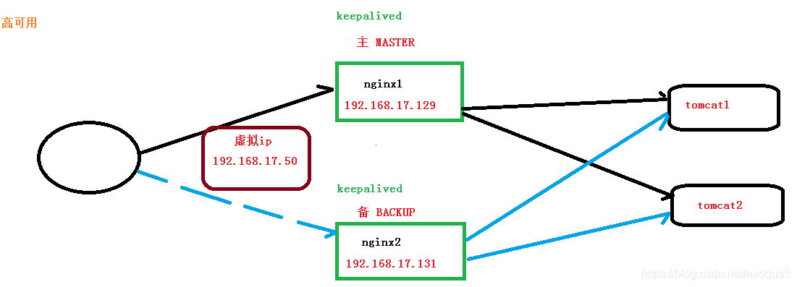

# Nginx 基础使用

## 目录结构

进入Nginx的主目录我们可以看到这些文件夹

```nginx
client_body_temp conf fastcgi_temp html logs proxy_temp sbin scgi_temp uwsgi_temp
```

其中这几个文件夹在刚安装后是没有的，主要用来存放运行过程中的临时文件

```nginx
client_body_temp fastcgi_temp proxy_temp scgi_temp
```

### conf

用来存放配置文件相关

### html

用来存放静态文件的默认目录 html、css等

### sbin

nginx的主程序

## 基本运行原理


Master线程调度work线程进行实际工作

Master不处理具体请求

## Nginx配置与应用场景

### 最小配置

#### worker_processes

worker_processes 1; 默认为1，表示开启一个业务进程

#### worker_connections

worker_connections 1024; 单个业务进程可接受连接数

#### include mime.types;

include mime.types; 引入http mime类型

#### default_type application/octet-stream;

default_type application/octet-stream; 如果mime类型没匹配上，默认使用二进制流的方式传输。

#### sendfile on;

sendfile on; 使用linux的sendfile(socket, file, len) 高效网络传输，也就是数据0拷贝。
未开启sendfile


开启后


#### keepalive_timeout 65;

keepalive_timeout 65;

#### server


虚拟主机配置

```nginx
server {
    listen 80; #监听本机端口号
    server_name localhost   *.mmban.com  ~^[0-9]+\.mmban\.com$; #多域名匹配同一站点
    location / { #匹配路径
    	root htmlApp; #文件根目录
   	 	index index.html index.htm; #默认页名称
    }
    error_page 500 502 503 504 /50x.html; #报错编码对应页面  其中 /50x.html  表示去寻找下面的location= /50x.html      500 502 503 504表示错误码
    location = /50x.html {
    	root html;
    }
}
```

### 虚拟主机


原本一台服务器只能对应一个站点，通过虚拟主机技术可以虚拟化成多个站点同时对外提供服务

#### servername匹配规则

我们需要注意的是servername匹配分先后顺序，写在前面的匹配上就不会继续往下匹配了。

#### 完整匹配

我们可以在同一servername中匹配多个域名。指向同一主机

```nginx
server_name   vod.mmban.com   www1.mmban.com ;  # 这两个域名指向同一个站点
```

#### 通配符匹配

```nginx
server_name   *.mmban.com ；  
```

#### 通配符结束匹配

通配符名字只可以在名字的起始处或结尾处包含一个星号，并且星号与其他字符之间用点分隔。所以，“www.*.example.org”* *和* *“w*.example.org” 都是非法的。不过，上面的两个名字可以使用正则表达式描述，即 “~^www..+.example.org” 和 “ w.∗.example.org” 和 “w.∗.example.org”和“~^w.*.example.org”**。星号可以匹配名字的多个节（各节都是以点号分隔的）。**“*.example.org” 不仅匹配 www.example.org，也匹配 www.sub.example.org。

有一种形如 “.example.org” 的特殊通配符，它可以既匹配确切的名字“example.org”，又可以匹配一般的通配符名字“*.example.org”。

```nginx
server_name   vod.*;
```

#### 正则匹配

```nginx
server_name ~^[0-9]+\.mmban\.com$;
```

nginx 使用的正则表达式兼容 PCRE。为了使用正则表达式，虚拟主机名必须以波浪线 “~” 起始：

`server_name ~^www\d+\.example\.net$;`

否则该名字会被认为是个确切的名字，如果表达式含星号，则会被认为是个通配符名字（而且很可能是一个非法的通配符名字）。不要忘记设置 “^” 和“$”锚点，语法上它们不是必须的，但是逻辑上是的。同时需要注意的是，域名中的点 “.” 需要用反斜线 “\” 转义。含有 “{” 和“}”的正则表达式需要被引用，如：

`server_name "~^(?<name>\w\d{1,3}+)\.example\.net$";`

否则 nginx 就不能启动，错误提示是：

directive "server_name" is not terminated by ";" in ...

命名的正则表达式捕获组在后面可以作为变量使用：

```nginx
server {
   server_name  ~^(www\.)?(?<domain>.+)$;
 
   location / {
     root  /sites/$domain;
   }
 }
```


PCRE 使用下面语法支持命名捕获组：

•      ? 从 PCRE-7.0 开始支持，兼容 Perl 5.10 语法

•      ?’name’ 从 PCRE-7.0 开始支持，兼容 Perl 5.10 语法

•      ?P 从 PCRE-4.0 开始支持，兼容 Python 语法

如果 nginx 不能启动，并显示错误信息：

pcre_compile() failed: unrecognized character after (?< in ...

说明 PCRE 版本太旧，应该尝试使用? P。捕获组也可以以数字方式引用：

```nginx
server {
   server_name  ~^(www\.)?(.+)$;
 
   location / {
     root  /sites/$2;
   }
 }
```

不过，这种用法只限于简单的情况（比如上面的例子），因为数字引用很容易被覆盖。

### 反向代理

隧道式代理

`proxy_pass http://baidu.com;`

```nginx
location / {
	proxy_pass http://atguigu.com/;
}
```

## 基于反向代理的负载均衡

```nginx
# 配置域名代理
server {
	listen		80;  #监听本机端口号
	server_name	manage.jt.com;
	location / {		
		#代理的是服务器地址
		proxy_pass    http://jtW;  # 代理地址
	}
}

#定义多台tomcat服务器   1.轮询策略
upstream  jtW {
		server localhost:8081;
		server localhost:8082;
		server localhost:8083;
}
```

### 负载均衡策略

### 轮询

默认情况下使用轮询方式，逐一转发，这种方式适用于无状态请求。

### weight(权重)

指定轮询几率，weight和访问比率成正比，用于后端服务器性能不均的情况。

```nginx
upstream httpd {
    server 127.0.0.1:8050 weight=10 down;
    server 127.0.0.1:8060 weight=1;
    server 127.0.0.1:8060 weight=1 backup;
}
```

+ down：表示当前的server暂时不参与负载
+ weight：默认为1.weight越大，负载的权重就越大。
+ backup： 其它所有的非backup机器down或者忙的时候，请求backup机器。

### ip_hash

根据客户端的ip地址转发同一台服务器，可以保持回话。

```nginx
#定义多台tomcat服务器   1.轮询策略    2.权重策略
upstream  jtW {
   	ip_hash;
	server localhost:8081 weight=6;
	server localhost:8082 weight=3;
	server localhost:8083 weight=1;
}
```

补充知识:
1).IPHASH一般只做测试时用.
2).使用IPHASH可能造成负载不均`(hash(ip)%3集中到某一台服务器)`的现象. 某些服务器负载压力过高.有宕机的风险.
3).使用IPHASH时,如果后端服务器宕机,则直接影响用户的使用(因为同一个ip访问同一台服务器).
4).工作中如果需要实现用户信息的共享,一般采用SSO的方式进行.
用户只需一次登录就可以访问所有相互信任的应用系统

### least_conn

最少连接访问

### url_hash

根据用户访问的url定向转发请求

定向流量转发，如访问页面和注册页面，根据urlhash转发不同服务器

需要第三方的插件

适用于访问固定资源不在同一服务器

### fair

根据后端服务器响应时间转发请求

需要第三方的插件

### 总结


## 正向代理配置

```nginx
proxy_pass $scheme://$host$request_uri;
resolver 8.8.8.8;
```


## 动静分离

### 配置反向代理

```nginx
location / {
	proxy_pass http://127.0.0.1:8080;
	#root html;
	#index index.html index.htm;
}
```

### 固定配置location

```nginx
location /css {
	root /usr/local/nginx/static;
	index index.html index.htm;
}
location /images {
	root /usr/local/nginx/static;
	index index.html index.htm;
}
location /js {
	root /usr/local/nginx/static;
	index index.html index.htm;
}
```

### 使用正则location

#### location 前缀

`/` 通用匹配，任何请求都会匹配到。
`=` 精准匹配，不是以指定模式开头
`~` 正则匹配，区分大小写
`~*` 正则匹配，不区分大小写
`^~` 非正则匹配，匹配以指定模式开头的location

#### location匹配顺序

+ 多个正则location直接按书写顺序匹配，成功后就不会继续往后面匹配
+ 普通（非正则）location会一直往下，直到找到匹配度最高的（最大前缀匹配）
+ 当普通location与正则location同时存在，如果正则匹配成功,则不会再执行普通匹配
+ 所有类型location存在时，“=”匹配 > “^~”匹配 > 正则匹配 > 普通（最大前缀匹配）

案例分析

```nginx
location  = / {
  # 只匹配"/".
  [ configuration A ] 
}
location  / {
  # 匹配任何请求，因为所有请求都是以"/"开始
  # 但是更长字符匹配或者正则表达式匹配会优先匹配
  [ configuration B ] 
}

location ^~ /images/ {
  # 匹配任何以 /images/ 开始的请求，并停止匹配 其它location
  [ configuration C ] 
}

location ~* \.(gif|jpg|jpeg)$ {
  # 匹配以 gif, jpg, or jpeg结尾的请求. 
  # 但是所有 /images/ 目录的请求将由 [Configuration C]处理.   
  [ configuration D ] 
}
请求URI例子:

/ -> 符合configuration A
/documents/document.html -> 符合configuration B
/images/1.gif -> 符合configuration C
/documents/1.jpg ->符合 configuration D

@location 例子
error_page 404 = @fetch;

location @fetch{
  proxy_pass http://fetch;
}
```


```nginx
location ~*/(css|img|js) {  #匹配/css  /img /js 路径下内容
	root /usr/local/nginx/static;
	index index.html index.htm;
}
```


自己测试：

```nginx
 server {
        listen       80;
        server_name  localhost;
		
		# ~ 表示正则匹配
		location ~/.+\.(js|css) {           
			root html;
		}
		location  / {           
			proxy_pass http://localhost:8081;
		}

	}
```

### alias与root

```nginx
location /css {
	alias /usr/local/nginx/static/css;
	index index.html index.htm;
}
```

root用来设置根目录，而alias在接受请求的时候在路径上不会加上location。

1）alias指定的目录是准确的，即location匹配访问的path目录下的文件直接是在alias目录下查找的； 

2）root指定的目录是location匹配访问的path目录的上一级目录,这个path目录一定要是真实存在root指定目录下的； 

3）使用alias标签的目录块中不能使用rewrite的break（具体原因不明）；另外，alias指定的目录后面必须要加上"/"符号！！ 

4）alias虚拟目录配置中，location匹配的path目录如果后面不带"/"，那么访问的url地址中这个path目录后面加不加"/"不影响访问，访问时它会自动加上"/"； 但是如果location匹配的path目录后面加上"/"，那么访问的url地址中这个path目录必须要加上"/"，访问时它不会自动加上"/"。如果不加上"/"，访问就会失败！

5）root目录配置中，location匹配的path目录后面带不带"/"，都不会影响访问。

## UrlRewrite

nginx 实现转发

### 基础

rewrite是实现URL重写的关键指令，根据regex (正则表达式)部分内容，重定向到replacement，结尾是flag标记。

```nginx
rewrite 	<regex> 	<replacement> 	[flag];
关键字 		正则 		替代内容 		flag标记
```

> 关键字：其中关键字error_log不能改变
> 正则：perl兼容正则表达式语句进行规则匹配
> 替代内容：将正则匹配的内容替换成replacement，满足正则表达式替换
> flag标记：rewrite支持的flag标记
> rewrite参数的标签段位置：
> server,location,if
>
> flag标记说明：
> 	last #本条规则匹配完成后，继续向下匹配新的location URI规则
> 	break #本条规则匹配完成即终止，不再匹配后面的任何规则
> 	redirect #返回302临时重定向，浏览器地址会显示跳转后的URL地址
> 	permanent #返回301永久重定向，浏览器地址栏会显示跳转后的URL地址

实例

```nginx
location  / {   
    rewrite 	^/([0-9]+)\.html$ 	/index.jsp?pageNum=$1 	break;
	proxy_pass http://localhost:8081;
}
```

> 请求路径`/2.html`   转发到后台`/index.jsp?pageNum=2`   利用正则表达式的分组取值


http跳转到https  可以使用

```nginx
return 301 https://$server_name$request_uri;
```


### 同时使用负载均衡

#### 应用服务器防火墙配置

```sh
#开启防火墙
systemctl start firewalld
#重启防火墙
systemctl restart firewalld
#重载规则
firewall-cmd --reload
#查看已配置规则
firewall-cmd --list-all

#指定端口和ip访问   192.168.44.101 允许指定ip访问
firewall-cmd --permanent --add-rich-rule="rule family="ipv4" source address="192.168.44.101" port protocol="tcp" port="8080" accept"

#移除规则
firewall-cmd --permanent --remove-rich-rule="rule family="ipv4" source address="192.168.44.101" port port="8080" protocol="tcp" accept"
```

#### nginx网关配置

```nginx
# 负载均衡配置
upstream httpds {
	server 192.168.44.102 weight=8 down;
	server 192.168.44.103:8080 weight=2;
	server 192.168.44.104:8080 weight=1 backup;
}
server {
        listen       80;
        server_name  localhost;
        location / {
            # urlReWrite
            rewrite  ^/([0-9]+).html$  /index.jsp?pageNum=$1  redirect;
            # 反向代理
            proxy_pass http://httpds ;
        }
}
```

## 防盗链配置

Referer防盗链，是基于HTTP请求头中Referer字段（例如，Referer黑白名单）来设置访问控制规则，实现对访客的身份识别和过滤，防止网站资源被非法盗用

```nginx
valid_referers none | blocked | server_names | strings ....;
```

+ none， 检测 Referer 头域不存在的情况。
+ blocked，检测 Referer 头域的值被防火墙或者代理服务器删除或伪装的情况。这种情况该头域的值不以“http://” 或 “https://” 开头。
+ server_names ，设置一个或多个 URL ，检测 Referer 头域的值是否是这些 URL 中的某一个。

在需要防盗链的location中配置

```nginx
location ~*/(css|img|js) { 
    # 检测请求头Referer 参数，只允许192.168.44.101访问
    valid_referers 192.168.44.101;
    if ($invalid_referer) { # 无效的参数返回status403
        return 403;# 可以返回状态码或者location
    }
    
	root /usr/local/nginx/static;
	index index.html index.htm;
}
```

安装crul

```
yum install -y curl
```

使用curl测试

```sh
curl -I http://192.168.44.101/img/logo.png
```


带引用

```sh
curl -e "http://baidu.com" -I http://192.168.44.101/img/logo.png
```

`-I`  查看请求头信息

`-e "http://baidu.com"`  添加成Referer 请求头参数


```nginx
# 非法引用返回转发到指定图片
location ~*/(css|img|js) { 
    # 检测请求头Referer 参数，只允许192.168.44.101访问
    valid_referers 192.168.44.101;
    if ($invalid_referer) { # 无效的参数返回status403
       rewrite ^/ /img/x.png break;
    }
    
	root /usr/local/nginx/static;
	index index.html index.htm;
}
```

## 高可用配置

服务器之间通过keeplived心跳检测存活，动态为主机设置一个虚拟ip，master宕机后，ip漂移到备机上，对外实现高可用

### 安装Keepalived

#### 编译安装

下载地址

```
https://www.keepalived.org/download.html#
```

使用`./configure` 编译安装

如遇报错提示

```
configure: error:
!!! OpenSSL is not properly installed on your system. !!!
!!! Can not include OpenSSL headers files. !!!
```

安装依赖

```sh
yum install openssl-devel
```

#### yum安装

```sh
yum install keepalived
```

### 配置

使用yum安装后配置文件在
`/etc/keepalived/keepalived.conf`

第一台机器 主机

```nginx
! Configuration File for keepalived
global_defs {
	router_id lb111   # 标识
}
vrrp_instance atguigu {
    state MASTER  # 主备
    interface ens33  # 网卡
    virtual_router_id 51
    priority 100
    advert_int 1
    authentication {  # 分组认证
        auth_type PASS
        auth_pass 1111
    }
    virtual_ipaddress {
        192.168.44.200  # 虚拟ip
    }
}
```

第二台机器 从机

```nginx
! Configuration File for keepalived
global_defs {
	router_id lb110
}
vrrp_instance atguigu {
    state BACKUP  # 主备
    interface ens33
    virtual_router_id 51
    priority 50
    advert_int 1
    authentication {
    auth_type PASS
    auth_pass 1111
    }
    virtual_ipaddress {
        192.168.44.200 # 虚拟ip
    }
}
```


### 实操

keepalived 配置文件位置：/etc/keepalived/keepalived.conf

```shell
# 使用 yum 命令安装 keepalived
yum install -y keepalived

# 使用 rpm 命令查询 keepalived 的安装包
rpm -q -a keepalived
```

为什么要配置nginx高可用？以防单一nginx挂了，另一个nginx能担当重任。


#### 1、什么是Nginx高可用



```java
需要两台 nginx 服务器
需要 keepalived
需要虚拟 ip
```

#### 2、配置高可用的准备工作

```java
需要两台服务器 192.168.17.129 和 192.168.17.131
在两台服务器安装 Nginx
在两台服务器安装 keepalived
```

#### 3、在两台服务器安装 keepalived

```java
使用 yum 命令进行安装yum install keepalived –y
安装之后，使用命令rpm -q -a keepalived查看是否安装成功
在 etc 里面生成目录 keepalived，有文件 keepalived.conf
```

#### 4、完成高可用配置（主从配置）

修改`/etc/keepalived/keepalivec.conf`配置文件

##### ①、主服务器192.168.17.129

```nginx
global_defs {
	notification_email {
		acassen@firewall.loc
		failover@firewall.loc
		sysadmin@firewall.loc
	}
	notification_email_from Alexandre.Cassen@firewall.loc
	smtp_server 192.168.17.129
	smtp_connect_timeout 30
	router_id LVS_DEVEL_M  # 本机的标识
}

vrrp_script chk_http_port {
	script "/usr/local/src/nginx_check.sh"
	interval 2 #（检测脚本执行的间隔）
	weight 2
}

vrrp_instance VI_1 {
	state MASTER # 备份服务器上将 MASTER 改为 BACKUP
	interface ens33 //网卡名称（用ifconfig命令查看）
	virtual_router_id 51 # 主、备机的 virtual_router_id 必须相同
	priority 100 # 主、备机取不同的优先级，主机值较大，备份机值较小
	advert_int 1
	authentication { # 分组认证
		auth_type PASS
		auth_pass 1111
	}
	virtual_ipaddress {
		192.168.17.50 // VRRP H 虚拟地址
	}
}
```

##### ②、从服务器192.168.17.131

```java
global_defs {
	notification_email {
		acassen@firewall.loc
		failover@firewall.loc
		sysadmin@firewall.loc
	}
	notification_email_from Alexandre.Cassen@firewall.loc
	smtp_server 192.168.17.129
	smtp_connect_timeout 30
	router_id LVS_DEVEL_L   # 本机的标识
}

vrrp_script chk_http_port {
	script "/usr/local/src/nginx_check.sh"
	interval 2 #（检测脚本执行的间隔）
	weight 2
}

vrrp_instance VI_1 {
	state BACKUP # 备份服务器上将 MASTER 改为 BACKUP
	interface ens33 //网卡名称（用ifconfig命令查看）
	virtual_router_id 51 # 主、备机的 virtual_router_id 必须相同
	priority 90 # 主、备机取不同的优先级，主机值较大，备份机值较小
	advert_int 1
	authentication {# 分组认证
		auth_type PASS
		auth_pass 1111
	}
	virtual_ipaddress {
		192.168.17.50 // VRRP H 虚拟地址
	}
}
```

##### ③、在/usr/local/src 添加检测脚本

#### 主从服务器都一样的配置

```sh
#!/bin/bash
A=`ps -C nginx – no-header |wc -l`
if [ $A -eq 0 ];then
	/usr/local/nginx/sbin/nginx
	sleep 2
	if [ `ps -C nginx --no-header |wc -l` -eq 0 ];then
		killall keepalived
	fi
fi
```

#### 5、把两台服务器上 Nginx 和 keepalived 启动

```java
启动 Nginx： ./nginx
启动 keepalived： systemctl start keepalived.service
```

#### 6、最终测试

```java
在浏览器地址栏输入 虚拟 ip 地址 192.168.17.50
把主服务器（192.168.17.129） Nginx 和 keepalived 停止，再输入 192.168.17.50
```


## Https证书配置

### 不安全的http协议

#### 对称加密

**对称加密不安全**，加解密的秘钥都需要传递，会被拦截破解


#### **非对称解密算法**

```
客户端【公钥 + 明文】 -> 密文 |----------------------->	服务器端 【私钥 + 密文】-> 明文
明文	<-【公钥 + 明文】客户端 <------------------------|	密文<-【私钥 + 明文】服务器端
```

> 公钥不能解开公钥加密的密文
>
> **问题**：被钓鱼网站拦截，钓鱼网站返回伪造公私钥，用私钥解密出内容，去代理伪造请求  【第三方者攻击】


#### CA机构 + 非对称加密 = https


引入CA机构，通过【ca的私钥 + 算法】+ 认证公钥  = 证书

客户端通过证书 + 内置的ca公钥 解密出 服务器公钥加密客户端请求明文   【如果证书被中间者用公钥解码篡改，客户端的内置公钥不能解开，保证的证书的安全性】

**解决了服务器公钥在网络传输的问题，防止被第三者攻击。**

客户端【操作系统内置CA证书的公钥】 解开证书得到服务器公钥

> 如果证书被拦截，用公钥解开篡改，但是客户端公钥不能解开被公钥加密的篡改的证书
>
> 引入第三方信任机构。
>
> 公钥需要正版操作系统和正版浏览器保证可靠性，不会被第三方工具模拟


#### 内嵌操作系统的CA证书查看


### openssl

openssl包含：SSL协议库、应用程序以及密码算法库

### 自签名

#### OpenSSL

系统内置

#### 图形化工具 XCA

下载地址

```
https://www.hohnstaedt.de/xca/index.php/download
```

### CA 签名


## https实战

### 1、申请域名

万维网、阿里云


### 2、 申请主机


### 3、LNMP  搭建服务器环境

`linux+ nginx+ mysql + php`


生成安装命令 + 安装


开放防火墙


### 4、解析域名到主机

1、解析域名


2、泛解析


### 5、 申请CA证书

SSL证书


### 6、配置证书

下载证书


上传到服务器


配置


重启nginx

### 7、 https访问

访问`https://upguigu.com`


### 8、discuz搭建BBS站点

https://www.discuz.net/


```
```


# nginx的原理解析

#### 1、mater 和 worker


#### 2、mater 和 worker两个进程


#### 3、worker 如何进行工作的


#### 4、master-workers 的机制的好处

首先，对于每个 worker 进程来说，独立的进程，不需要加锁，所以省掉了锁带来的开销，同时在编程以及问题查找时，也会方便很多。

其次，采用独立的进程，可以让互相之间不会影响，一个进程退出后，其它进程还在工作，服务不会中断， master 进程则很快启动新的worker进程。

当然， worker 进程的异常退出，肯定是程序有 bug 了，异常退出，会导致当前 worker 上的所有请求失败，不过不会影响到所有请求，所以降低了风险。


#### 5、需要设置多少个 worker

Nginx 同 redis 类似都采用了 io 多路复用机制，每个 worker 都是一个独立的进程，但每个进程里只有一个主线程，通过异步非阻塞的方式来处理请求， 即使是千上万个请求也不在话下。每个 worker 的线程可以把一个 cpu 的性能发挥到极致。

所以 worker 数和服务器的cpu数相等是最为适宜的。设少了会浪费 cpu，设多了会造成 cpu 频繁切换上下文带来的损耗。

```java
#设置 worker 数量。
worker_processes 4
#work 绑定 cpu(4 work 绑定 4cpu)。
worker_cpu_affinity 0001 0010 0100 1000
#work 绑定 cpu (4 work 绑定 8cpu 中的 4 个) 。
worker_cpu_affinity 0000001 00000010 00000100 00001000
123456
```

#### 6、连接数 worker_connection


