> 本文由 [简悦 SimpRead](http://ksria.com/simpread/) 转码， 原文地址 [www.jianshu.com](https://www.jianshu.com/p/6bc152ca6126)

1、简述
----

Apache JMeter 是 Apache 组织开发的基于 Java 的压力测试工具。用于对软件做压力测试，它最初被设计用于 Web 应用测试，但后来扩展到其他测试领域。 它可以用于测试静态和动态资源，例如静态文件、Java [小服务程序](https://links.jianshu.com/go?to=https%3A%2F%2Fbaike.baidu.com%2Fitem%2F%25E5%25B0%258F%25E6%259C%258D%25E5%258A%25A1%25E7%25A8%258B%25E5%25BA%258F%2F4148836)、CGI 脚本、Java 对象、数据库、FTP 服务器， 等等。JMeter 可以用于对服务器、网络或对象模拟巨大的负载，来自不同压力类别下测试它们的强度和分析整体性能。另外，JMeter 能够对应用程序做功能 / [回归测试](https://links.jianshu.com/go?to=https%3A%2F%2Fbaike.baidu.com%2Fitem%2F%25E5%259B%259E%25E5%25BD%2592%25E6%25B5%258B%25E8%25AF%2595%2F1925732)，通过创建带有断言的脚本来验证你的程序返回了你期望的结果。为了最大限度的灵活性，JMeter 允许[使用正则表达式](https://links.jianshu.com/go?to=https%3A%2F%2Fbaike.baidu.com%2Fitem%2F%25E4%25BD%25BF%25E7%2594%25A8%25E6%25AD%25A3%25E5%2588%2599%25E8%25A1%25A8%25E8%25BE%25BE%25E5%25BC%258F%2F6555484)创建断言。

2、下载安装
------

> 由于 Jmeter 是基于 java 开发，首先需要下载安装 JDK，配置环境变量。JMeter 最低要求 Java 8，可兼容更高版本，官网建议使用最低要求版本。

Jmeter 官网下载地址：[https://jmeter.apache.org/download_jmeter.cgi](https://links.jianshu.com/go?to=https%3A%2F%2Fjmeter.apache.org%2Fdownload_jmeter.cgi)

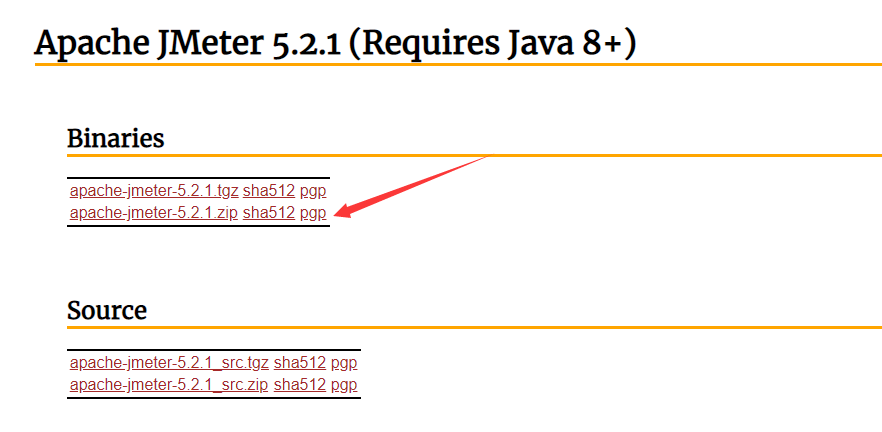 下载 Jmeter

下载完成后解压 zip 包，找到 bin 目录下 `apache-jmeter-5.2.1\bin\jmeter.bat`双击启动 Jmeter

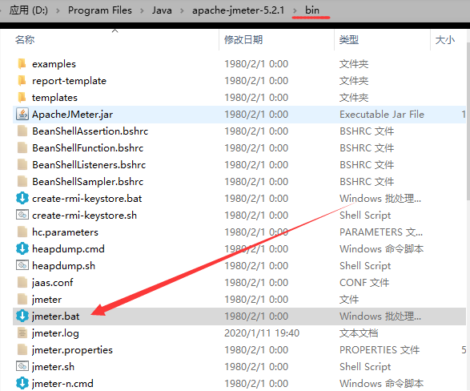 启动 Jmeter

*   注意：打开的时候会有两个窗口，Jmeter 的命令窗口和 Jmeter 的图形操作界面，不可以关闭命令窗口。

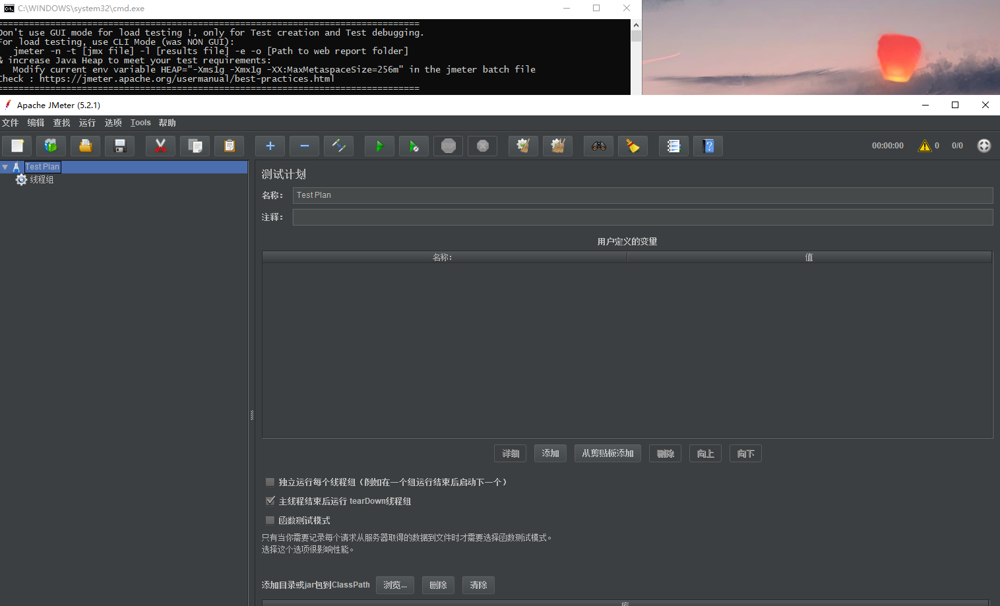 大致界面

3、基础设置
------

### Jmeter 的语言切换

*   **临时方法**：依次点击 `Options` → `Choose Language` → `Chinese(Simplified)` 可切换为简体中文，仅针对本次，关闭 Jmeter 后下次启动会恢复默认语言。

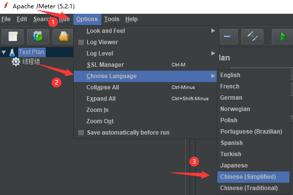 切换语言

*   **永久方法**：打开 Jmeter 解压后文件下的 bin 目录，找到`jmeter.properties`文件并用编辑器打开，在`#language=en`下面插入一行`language=zh_CN`，修改后保存，重启 Jmeter 界面默认显示为中文简体。

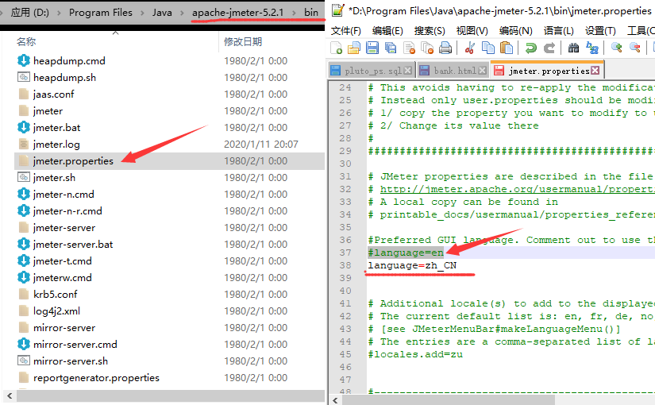 修改默认语言

### 修改 Jmeter 默认编码为 utf-8 解决控制台乱码

*   打开 Jmeter 解压后文件下的 bin 目录，找到`jmeter.properties`文件并用编辑器打开
*   在`#The encoding to be used if none is provided (default ISO-8859-1)、#sampleresult.default.encoding=ISO-8859-1`
*   下面插入一行`The encoding to be used if none is provided (default utf-8)、sampleresult.default.encoding=utf-8`
*   修改后保存重启 Jmeter

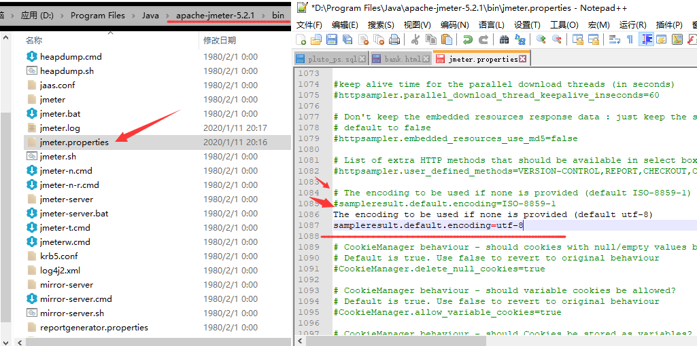 修改编码

4、编写项目测试脚本
----------

#### 4.1、添加线程组

*   右键点击 " 测试计划” → “添加” → “线程（用户）” → “线程组”

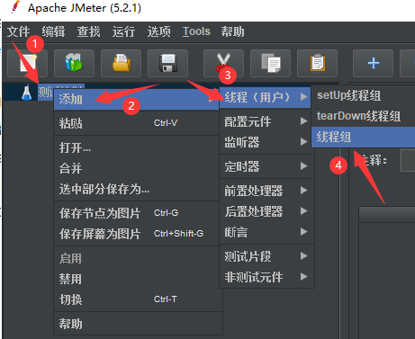 新建线程组

*   配置线程组参数

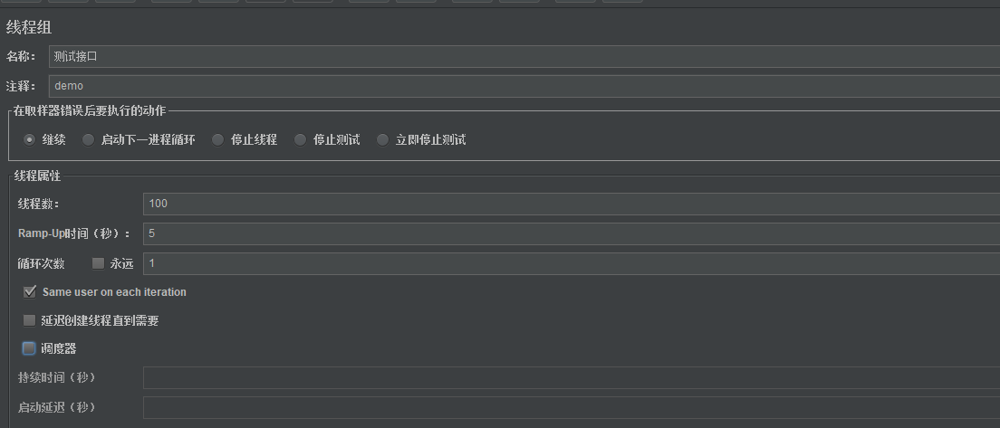 配置

##### 线程组主要参数详解：

1.  线程数：虚拟用户数。一个虚拟用户占用一个进程或线程。模拟多少用户访问也就填写多少个线程数量。
    
2.  Ramp-Up 时间 (秒)：设置的虚拟用户数需要多长时间全部启动。如果线程数为`100`，准备时长为`5`，那么需要`5`秒钟启动`100`个线程，也就是每秒钟启动`20`个线程。 相当于每秒模拟`20`个用户进行访问，设置为零我理解为并发访问。
    
3.  循环次数：如果线程数为`100`，循环次数为`100`。那么总请求数为`100*100=10000` 。如果勾选了 “永远”，那么所有线程会一直发送请求，直到选择停止运行脚本。
    

#### 4.2、添加测试接口

*   右键点击 “你的线程组” → “添加” → “取样器” → “HTTP 请求”

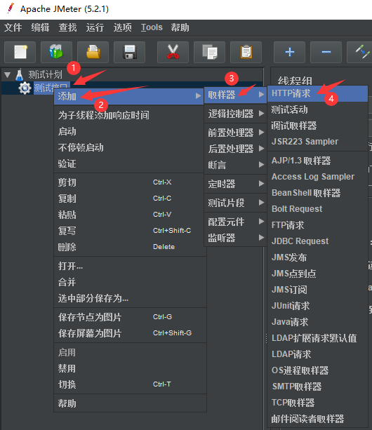 添加请求

*   填写接口请求参数，我这里对本地的 `Spring-boot` 服务进行测试 (本教程所用 demo 源码在文章最后)，可以参考下图填写：

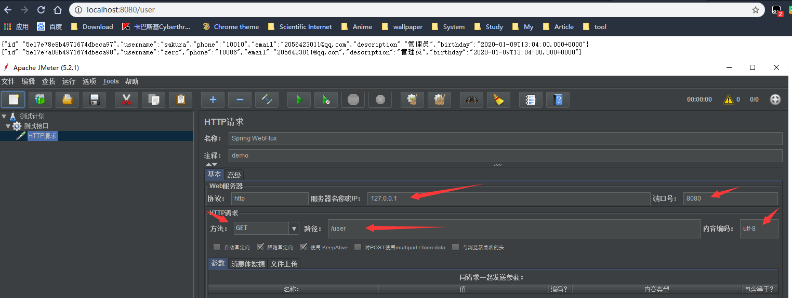 填写接口

##### Http 请求主要参数详解（做过接口测试的应该上手很快）：

*   协议：向目标服务器发送 HTTP 请求协议，可以是`HTTP`或`HTTPS`，默认为`HTTP`。
*   服务器名称或 IP ：`HTTP`请求发送的目标服务器名称或`IP`。
*   端口号：目标服务器的端口号，默认值为 80
*   方法：发送`HTTP`请求的方法，可用方法包括`GET`、`POST`、`HEAD`、`PUT`、`OPTIONS`、`TRACE`、`DELETE`等。
*   路径：目标`URL`路径（`URL`中去掉服务器地址、端口及参数后剩余部分）。
*   内容编码：编码方式，默认为`ISO-8859-1`编码，这里配置为`utf-8`。
*   参数：同请求一起发送参数 ，在请求中发送的`URL`参数，用户可以将`URL`中所有参数设置在本表中，表中每行为一个参数（对应`URL`中的 `key=value`），注意参数传入中文时需要勾选 “编码”。

#### 4.3、添加察看结果树

*   右键点击 “你的线程组” → “添加” → “监听器” → “察看结果树”

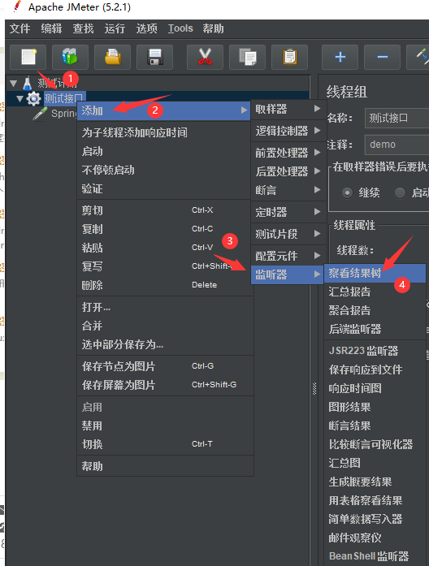 添加结果

*   这里，我们修改响应数据格式 (你返回什么格式就选什么，我这里是返回 json)，运行 Http 请求，可以看到本次请求返回的响应数据。

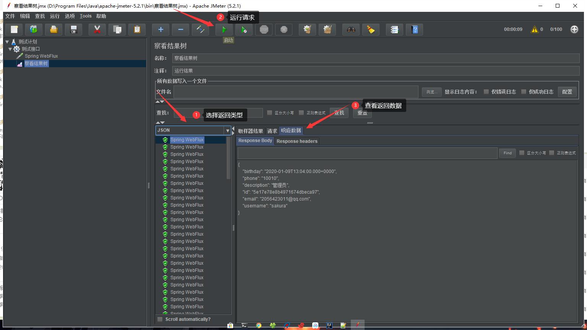 查看结果

#### 4.4、添加用户自定义变量

*   添加用户自定义变量用以 Http 请求参数化，右键点击 “你的线程组” → “添加” → “配置元件” → “用户定义的变量”：

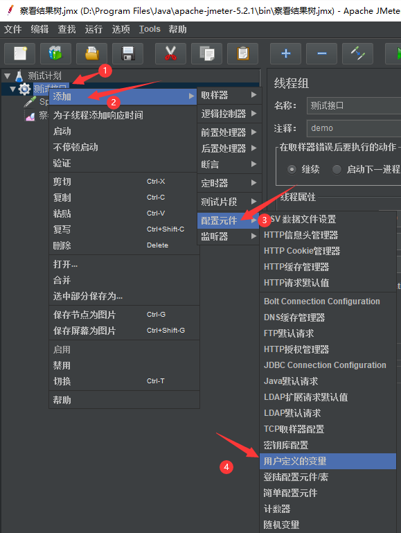 自定义变量

*   新增一个用户名参数（与你实际请求参数 key 对应，做过接口测试的应该特别明白）

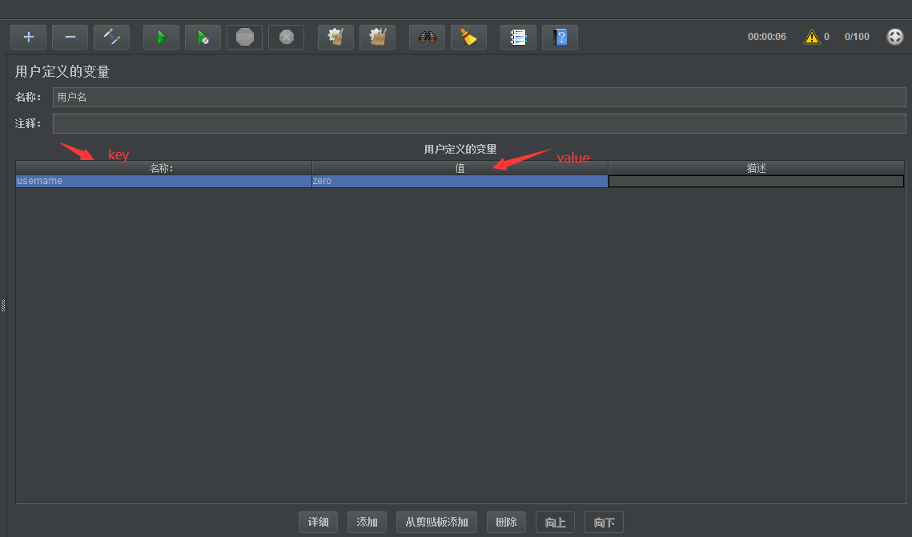 添加变量

*   在 Http 请求中使用该参数，格式为：${key} , 例如：

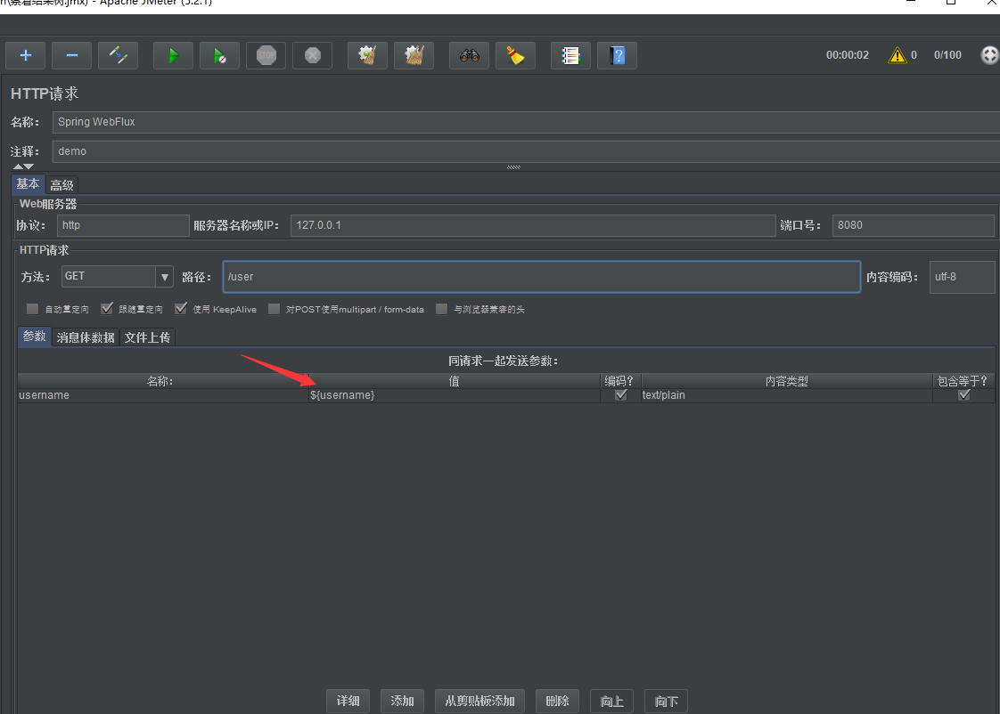 使用参数

*   这里我有一个根据用户名查询用户的方法，所以改变参数后，再次运行结果为 zero 用户数据

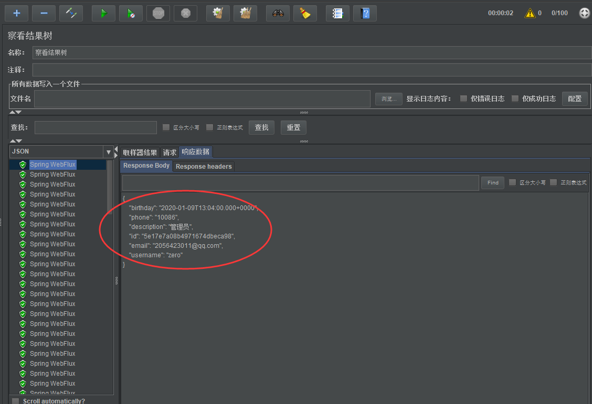 再次查看结果树

#### 4.5、json 断言 (因为我这里返回是 json, 其他需求更据实际情况选择)

*   添加断言：右键点击 “你的 HTTP 请求” → “添加” → “断言” → “json 断言”

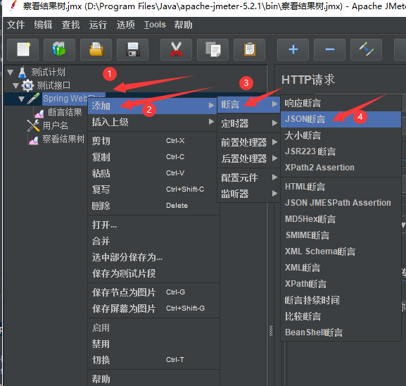 image.png

*   配置 json 断言具体内容

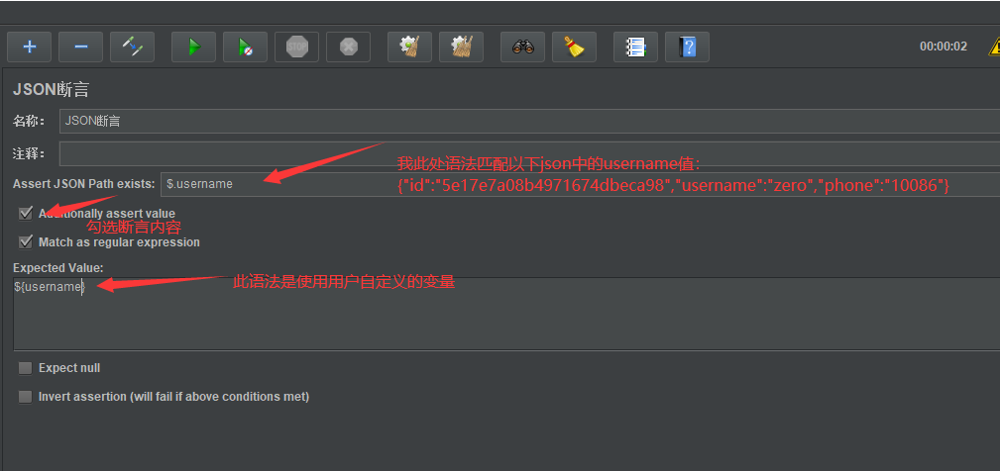 断言内容

*   断言结果：右键点击 “你的 HTTP 请求” → “添加” → “监听器” → “断言结果”

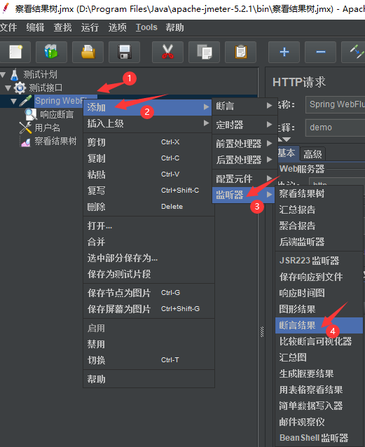 断言结果

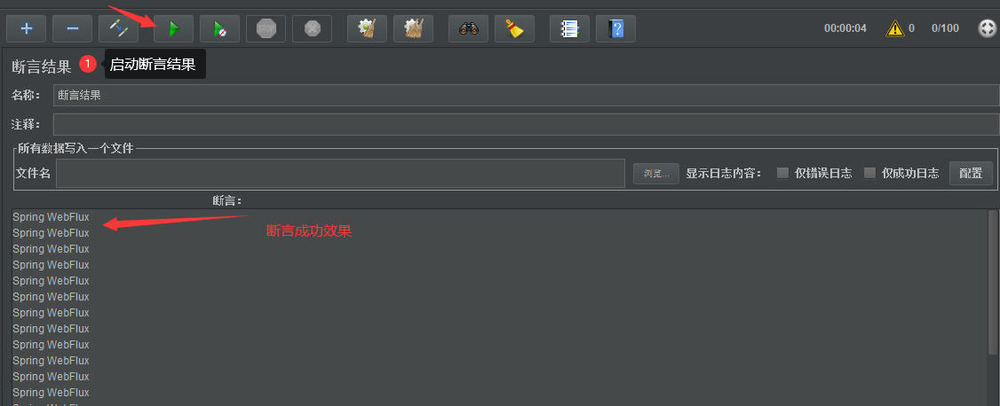 断言成功

> 为了演示失败，我将断言内容进行修改为 zer
> 
> 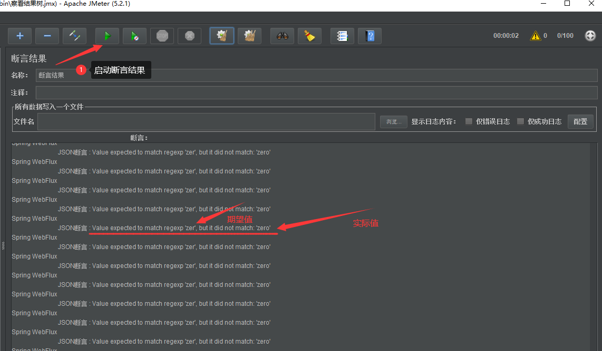 断言失败

#### 4.6、添加聚合报告

*   右键点击 “你的线程组” → “添加” → “监听器” → “聚合报告”，用以存放性能测试报告

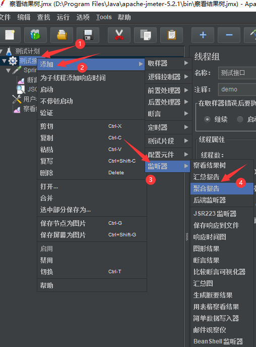 添加报告

> 到此我们已经完成了一个最基础的接口测试脚本

5、性能测试
------

*   为了测试出效果，我这里模拟 100 个用户并发访问获取数据，循环 6 次，线程组数据修改如下：

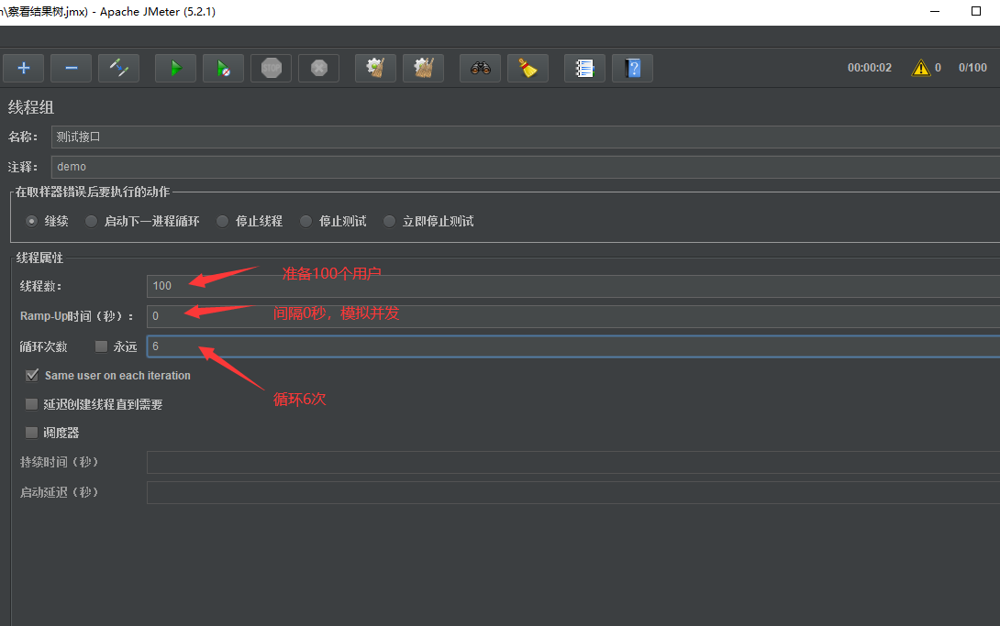 修改线程组

*   回到聚合报告运行本次压力测试

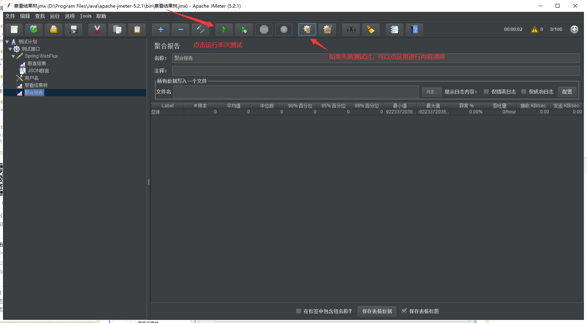 压力测试

*   分析测试报告（先得让本次压力测试运行完毕）

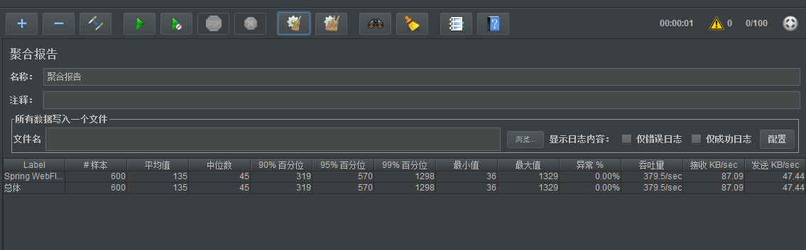 测试数据

##### 聚合报告参数详解：

1.  Label：每个 `JMeter` 的 `element`（例如我这里只有一个 `Spring WebFlux`）都有一个 `Name` 属性，这里显示的就是 `Name` 属性的值。
    
2.  样本 (Samples)：请求数——表示这次测试中一共发出了多少个请求，我这里模拟了`100`个用户循环`6`次也就为`100*6=600`。
    
3.  平均值 (Average)：平均响应时间 (单位:**`ms`**)。默认是单个`Request`的平均响应时间，当使用了`Transaction Controller`时，也可以是`Transaction`为单位显示平均响应时间。
    
4.  中位数 (Median)：也就是 `50％` 用户的响应时间。
    
5.  90% 百分位 (Line)：`90％` 用户的响应时间。相邻几个`*%`同意。
    
6.  最小值 (Min)：最小响应时间。
    
7.  最大值 (Max)：最大响应时间。
    
8.  异常 (Error) %：错误率——错误请求数 / 请求总数。
    
9.  吞吐量 (Throughput)：吞吐量——默认情况下表示每秒完成的请求数（`Request per Second`），当使用了 `Transaction Controller` 时，也可以表示类似 `LoadRunner` 的 `Transaction per Second` 数 。
    
10.  接收 KB/Sec：每秒从服务器端接收到的数据量，相当于`LoadRunner`中的`Throughput/Sec`。
    
11.  发送 KB/Sec：每秒向服务器发送的数据量，相当于`LoadRunner`中的`Throughput/Sec`。

后记
--

*   本次教程演示所用为 Spring WebFlux demo ，源码直链：[webflux-demo](https://links.jianshu.com/go?to=https%3A%2F%2Fgithub.com%2FCodeHaotian%2Fspring-family-study%2Ftree%2Fmaster%2Fwebflux-demo)

> 一般而言，性能测试中我们需要重点关注的数据有：  请求数， 平均响应时间， 最小响应时间， 最大响应时间，% 错误率及 吞吐量。