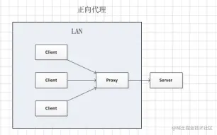
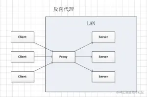
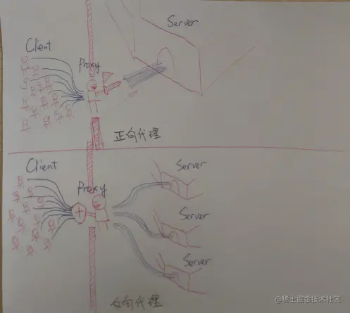
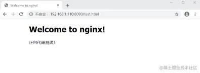
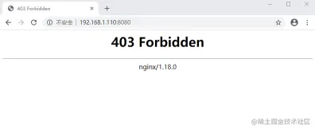
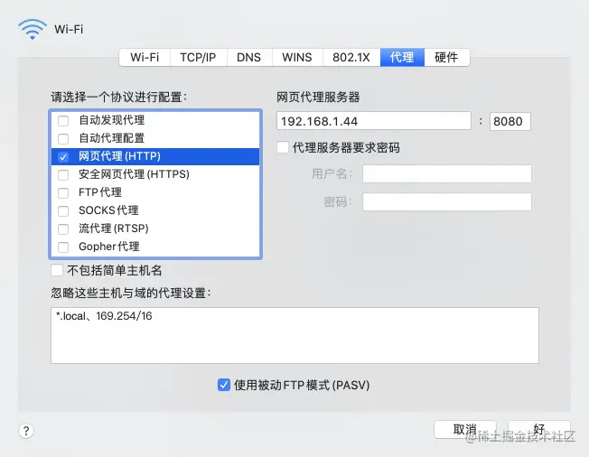
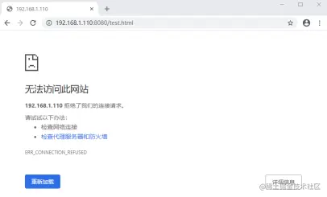
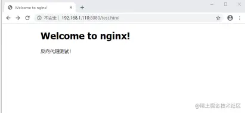

> 本文由 [简悦 SimpRead](http://ksria.com/simpread/) 转码， 原文地址 [juejin.cn](https://juejin.cn/post/6865213076174536712)

Nginx 正向代理与反向代理
===============

### 1. 正向代理与反向代理的区别

#### 1.1 什么是代理服务器？

所谓代理服务器就是位于发起请求的客户端与原始服务器端之间的一台跳板服务器，正向代理可以隐藏客户端，反向代理可以隐藏原始服务器。

> 上面描述的还不是特别了解，接下来我们就认识一下正向代理和反向代理的区别

#### 1.2 正向代理的概念

正向代理，也就是传说中的代理，它的工作原理就像一个跳板，简单来说，比如我想访问 Google 来搜索关键词 “Nginx”，但是国内现在不允许访问 Google。但是我能访问国外的一台服务器（代理服务器），这台服务器能够访问 Google。于是我先连上代理服务器，告诉它我需要访问 Google 来搜索关键词 “Nginx”，代理服务器去请求访问之后，然后返回给我。从网站的角度，只在代理服务器来取内容的时候有一次记录，有时候并不知道是用户的请求，也隐藏来用户的资料，这取决于代理告不告诉服务器端。

结论就是：**正向代理：客户端 <一> 代理 一 > 服务端** 正向代理，是一个位于客户端和原始服务器（origin server）之间的服务器，为来从原始服务器取得内容，客户端向代理发送一个请求并指定目标（原始服务器），然后代理向原始服务器转交请求并将获得的内容返回给客户端。 

#### 1.3 反向代理的概念

举例： 例如：用户访问 http://www.test.com/readme，但 www.test.com 上并不存在 readme 资源，它是偷偷从另外一台服务器上取回来，然后作为转交的内容返回给用户，但用户并不知情。这里所提到的 www.test.com 这个域名对应的服务器就设置来反向代理功能。

结论就是：**客户端 一 > 代理 <一> 服务端** 反向代理正好相反，对于客户端而言它就像是原始服务器，并且客户端不需要进行任何特别的设置。客户端向反向代理命名空间（name-space）中的内容发送普通请求，接着反向代理将判断向何处（原始服务器）转交请求，并将获得的内容返回给客户端，就像这些内容原本就是它自己的一样。 

**网友的神图，加深理解** 

#### 1.4 两者区别

**从用途上来讲：**

*   正向代理的典型用途是为在防火墙内的局域网客户端提供访问 Internet 的途径。正向代理还可以使用缓冲特性减少网络使用率。
    
*   反向代理的典型用途是将防火墙后面的服务器提供给 Internet 用户访问。反向代理还可以为后端的多台服务器提供负载平衡，或为后端较慢的服务器提供缓冲服务。另外，反向代理还可以启用高级 URL 策略和管理技术，从而使处于不同的 web 服务器系统的 web 页面同时存在于同一个 URL 空间下。
    

**从安全性来讲：**

*   正向代理允许客户端通过它访问任意网站并且因此客户端自身，因此你必须采取安全措施以确保为经过授权的客户端提供服务。
*   反向代理对外都是透明的，访问者并不知道自己访问的是一个代理。

**总结：** 开放的反向代理应用： Nginx 和 Nat123。Nginx 是单纯的反向代理，需要自行搭建发现代理服务才能使用，效果高。Nat123 是结合来 NAT 和反向代理的应用，可以直接使用，解决 80 端口问题等，速度快。

### 2. Nginx 正向代理与反向代理实战

#### 2.1 正向代理配置场景演示

正向代理很常见，我们正常上网就是一种正向代理。 接下来我们演示正向代理的一个场景：

1.  首先在 A 服务器（IP：192.168.1.110）的 Nginx 设置访问控制，访问控制之前访问 A 下的 test.html 是这样的，如下：



2.  在 A 服务器的 Nginx 修改配置文件，加入一个判断语句，如果访问 A 的的 IP 不是 192.168.1.44 （B 服务器 IP）则返回 403.

```
location / {
  if ( $remote_addr !~* "^192\.168\.1\.44") {
        return 403;
    }
    root   html;
    index  index.html index.htm;   
}
复制代码
```

添加后 reload 一下 nginx 再访问 test.html，如下： 

此时，在 **A 服务器** 的本地浏览器就是被限制来，访问不了该资源。

3.  接下来，在 **B 服务器** 上修改 Nginx 配置文件，添加 `resolver` 和 `proxy_pass` , 设置如下：

```
server {
    listen       8080;
    server_name  localhost;

    resolver 8.8.8.8;
    location / {
        proxy_pass http://$http_host$request_uri;
    }

    error_page   500 502 503 504  /50x.html;
    location = /50x.html {
        root   /usr/share/nginx/html;
    }
}
复制代码
```

`resolver` 为 DNS 解析，这里填写的 IP 为 Google 提供的免费 DNS 服务器的 IP 地址 `proxy_pass` 配置代理转发

至此便是配置了 B 服务器所有访问根一级的请求全部代理转发对应到 `$http_host$request_uri`  去了， `$http_host` 就是我们要访问的主机名， `$request_uri` 就是我们后面所加的参数。

简单来说就是相当于配置好了我们请求 B 服务器，B 服务器再去请求我们所请求的地址。

那么接下来我们来看一下结果，我们在本地配置好代理，我这里是 mac 系统，可以从网络设置中选择高级，然后选择代理。（这里是在 A 服务器配置代理） 

结果证明，此时在 **A 服务器** 的客户端已经可以成功访问 A 服务器的资源。

以上就是正向代理的一个场景颜色，这个过程中可以知道，我们客户端是想要 A 的资源，但是 A 的资源只有 B 能拿到，便让 B 代理去帮助我们访问 A 的资源。整个过程 A 只知道 B 拿了它的资源，并不知道客户端拿到。

#### 2.2 反向代理配置场景演示

反向代理的演示更为简单一些。

1.  首先我们新建一个 test.conf 的配置文件，启动对应这个配置文件的服务：

```
server {
    listen       8080;
    server_name  localhost;

    location / {
        root   html;
        index  index.html index.htm;
    }

    error_page   500 502 503 504 404  /50x.html;
    location = /50x.html {
        root   /usr/share/nginx/html;
    }
}
复制代码
```

可以看到 `server` 里 `listen` 的端口是 8080，这里假设我的服务器本身不对外开放 8080 端口，只开放了 80 端口。所以此时访问 test.html 结果是访问不到的 

2.  修改 Nginx 的默认配置文件，添加 `proxy_pass` 设置如下：

```
server {
    listen       80;
    server_name  localhost;
    location / {
        root   html;
        index  index.html index.htm;
    }
  
    #设置代理
    location ~ /test.html$ {
        proxy_pass http://127.0.0.1:8080;
    }

    error_page   500 502 503 504 404  /50x.html;
    location = /50x.html {
        root   /usr/share/nginx/html;
    }
}
复制代码
```

此时便可以访问 8080 端口配置的资源了，如下： 

以上便完成了一个反向代理的演示，这个过程中我们可以知道，客户端想要访问的是 test.html，但是 test.html 实际上是 8080 端口下配置的，中间经过了代理才能拿到。也就是说客户端并不知道中间经历了什么代理过程，只有服务端知道。客户端只知道他拿到了 test.html 也就是 8080 端口下配置的资源。

### 3. 总结

经过对正向代理和反向代理概念上的理解，区别，以及在 Nginx 下演示操作一遍，相信你可以深刻体会到正向代理与反向代理的区别，以及在 Nginx 下代理的简单配置。

正向代理和反向代理的区别在于代理的对象不一样，正向代理的代理对象是客户端，反向代理的代理对象是服务端。总结一下：

*   代理服务器站在客户端那边就是正向代理
*   代理服务器站在服务器那边就是反向代理
*   Nginx 通过 `proxy_pass` 可以设置代理服务。

