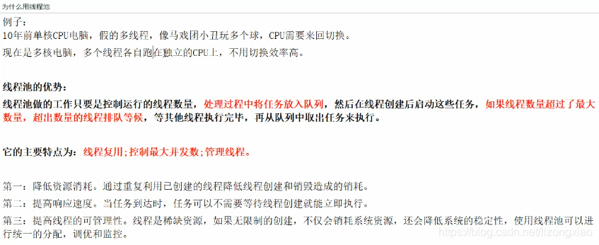
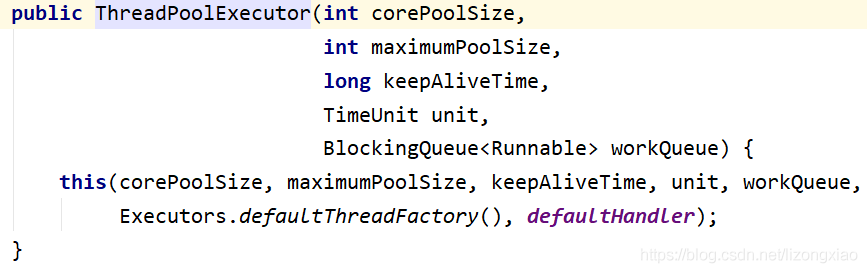
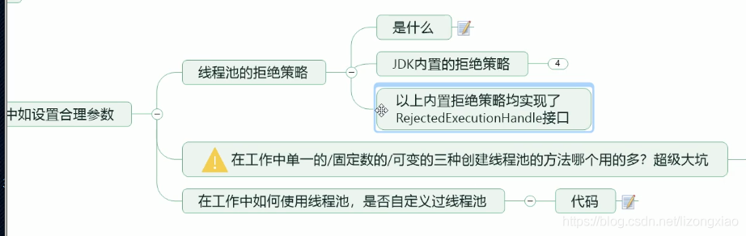

> 本文由 [简悦 SimpRead](http://ksria.com/simpread/) 转码， 原文地址 [blog.csdn.net](https://blog.csdn.net/lizongxiao/article/details/106668806?utm_source=app&app_version=4.8.0&code=app_1562916241&uLinkId=usr1mkqgl919blen)

[笔记地址](https://github.com/LZX842056112/Thread)  
  
  


## 1.卖票复习

-------

老版写法

```java
class Ticket{//资源类
    //票
    private int number = 30;

    public synchronized void saleTicket(){
        if (number > 0){
            System.out.println(Thread.currentThread().getName()+"\t卖出第："+(number--)+"\t还剩下："+number);
        }
    }
}
/**
 *题目：三个售票员   卖出   30张票
 * 多线程编程的企业级套路+模板
 * 1.在高内聚低耦合的前提下，线程    操作(对外暴露的调用方法)     资源类
 */
public class SaleTicket {
    public static void main(String[] args) {
        Ticket ticket = new Ticket();

        new Thread(new Runnable() {
            @Override
            public void run() {
                for (int i = 1; i <= 40; i++) {
                    ticket.saleTicket();
                }
            }
        },"A").start();

        new Thread(new Runnable() {
            @Override
            public void run() {
                for (int i = 1; i <= 40; i++) {
                    ticket.saleTicket();
                }
            }
        },"B").start();

        new Thread(new Runnable() {
            @Override
            public void run() {
                for (int i = 1; i <= 40; i++) {
                    ticket.saleTicket();
                }
            }
        },"C").start();
    }
}
```

  
新版写法，效果一样

```java
//资源类 = 实例变量 + 实例方法
class Ticket{
    //票
    private int number = 30;
    Lock lock  = new ReentrantLock();

    public void sale(){
        lock.lock();
        try {
            if (number > 0){
                System.out.println(Thread.currentThread().getName()+"\t卖出第："+(number--)+"\t还剩下："+number);
            }
        }catch (Exception e){
            e.printStackTrace();
        }finally {
            lock.unlock();
        }
    }
}

/**
 *题目：三个售票员   卖出   30张票
 * 笔记：如何编写企业级的多线程
 * 固定的编程套路+模板
 * 1.在高内聚低耦合的前提下，线程    操作(对外暴露的调用方法)     资源类
 *  1.1先创建一个资源类
 */
public class SaleTicketDemo1 {
    //主线程，一切程序的入口
    public static void main(String[] args) {
        Ticket ticket = new Ticket();

        new Thread(()->{for (int i = 1; i <= 40; i++) ticket.sale();},"A").start();
        new Thread(()->{for (int i = 1; i <= 40; i++) ticket.sale();},"B").start();
        new Thread(()->{for (int i = 1; i <= 40; i++) ticket.sale();},"C").start();
    }
}
```

SaleTicket 拆分  
  


2.LambdaExpress
---------------

  
1  
  
2  
  
3  
  
4  
  


  
5  
  
  


## 3.生产者消费者

---------

老版写法

```java
class Aircondition{
    private int number = 0;

    //老版写法
    public synchronized void increment() throws Exception{
        //1.判断
        while (number != 0){
            this.wait();
        }
        //2.干活
        number++;
        System.out.println(Thread.currentThread().getName()+"\t"+number);
        //3通知
        this.notifyAll();
    }
    public synchronized void decrement() throws Exception{
        //1.判断
        while (number == 0){
            this.wait();
        }
        //2.干活
        number--;
        System.out.println(Thread.currentThread().getName()+"\t"+number);
        //3通知
        this.notifyAll();
    }
}

/**
 * 题目：现在两个线程，可以操作初始值为零的一个变量，
 * 实现一个线程对该变量加1，一个线程对该变量-1，
 * 实现交替，来10轮，变量初始值为0.
 *      1.高内聚低耦合前提下，线程操作资源类
 *      2.判断/干活/通知
 *      3.防止虚假唤醒(判断只能用while，不能用if)
 * 知识小总结：多线程编程套路+while判断+新版写法
 */
public class ProdConsumerDemo4 {
    public static void main(String[] args) {
        Aircondition aircondition = new Aircondition();

        new Thread(()->{
            for (int i = 1; i <= 10; i++) {
                try {
                    aircondition.increment();
                } catch (Exception e) {
                    e.printStackTrace();
                }
            }
        },"A").start();

        new Thread(()->{
            for (int i = 1; i <= 10; i++) {
                try {
                    aircondition.decrement();
                } catch (Exception e) {
                    e.printStackTrace();
                }
            }
        },"B").start();

        new Thread(()->{
            for (int i = 1; i <= 10; i++) {
                try {
                    aircondition.increment();
                } catch (Exception e) {
                    e.printStackTrace();
                }
            }
        },"C").start();

        new Thread(()->{
            for (int i = 1; i <= 10; i++) {
                try {
                    aircondition.decrement();
                } catch (Exception e) {
                    e.printStackTrace();
                }
            }
        },"D").start();
    }
}
```

新版写法

```java
class Aircondition{
    private int number = 0;
    private Lock lock = new ReentrantLock();
    private Condition condition = lock.newCondition();

    //新版写法
    public void increment() throws Exception{
        lock.lock();
        try {
            //1.判断
            while (number != 0){
                condition.await();
            }
            //2.干活
            number++;
            System.out.println(Thread.currentThread().getName()+"\t"+number);
            //3通知
            condition.signalAll();
        } catch (Exception e) {
            e.printStackTrace();
        } finally {
            lock.unlock();
        }
    }
    public void decrement() throws Exception{
        lock.lock();
        try {
            //1.判断
            while (number == 0){
                condition.await();
            }
            //2.干活
            number--;
            System.out.println(Thread.currentThread().getName()+"\t"+number);
            //3通知
            condition.signalAll();
        } catch (Exception e) {
            e.printStackTrace();
        } finally {
            lock.unlock();
        }
    }
}
/**
 * 题目：现在两个线程，可以操作初始值为零的一个变量，
 * 实现一个线程对该变量加1，一个线程对该变量-1，
 * 实现交替，来10轮，变量初始值为0.
 *      1.高内聚低耦合前提下，线程操作资源类
 *      2.判断/干活/通知
 *      3.防止虚假唤醒(判断只能用while，不能用if)
 * 知识小总结：多线程编程套路+while判断+新版写法
 */
public class ProdConsumerDemo4 {
    public static void main(String[] args) {
        Aircondition aircondition = new Aircondition();

        new Thread(()->{
            for (int i = 1; i <= 10; i++) {
                try {
                    aircondition.increment();
                } catch (Exception e) {
                    e.printStackTrace();
                }
            }
        },"A").start();

        new Thread(()->{
            for (int i = 1; i <= 10; i++) {
                try {
                    aircondition.decrement();
                } catch (Exception e) {
                    e.printStackTrace();
                }
            }
        },"B").start();

        new Thread(()->{
            for (int i = 1; i <= 10; i++) {
                try {
                    aircondition.increment();
                } catch (Exception e) {
                    e.printStackTrace();
                }
            }
        },"C").start();

        new Thread(()->{
            for (int i = 1; i <= 10; i++) {
                try {
                    aircondition.decrement();
                } catch (Exception e) {
                    e.printStackTrace();
                }
            }
        },"D").start();
    }
}
```


## 4.精确通知顺序访问

-----------

```java
class ShareData{
    private int number = 1;//A:1,B:2,C:3
    private Lock lock = new ReentrantLock();
    private Condition c1 = lock.newCondition();
    private Condition c2 = lock.newCondition();
    private Condition c3 = lock.newCondition();

    public void printc1(){
        lock.lock();
        try {
            //1.判断
            while (number != 1){
                c1.await();
            }
            //2.干活
            for (int i = 1; i <= 5; i++) {
                System.out.println(Thread.currentThread().getName()+"\t"+i);
            }
            //3.通知
            number = 2;
            //通知第2个
            c2.signal();
        } catch (Exception e) {
            e.printStackTrace();
        } finally {
            lock.unlock();
        }
    }
    public void printc2(){
        lock.lock();
        try {
            //1.判断
            while (number != 2){
                c2.await();
            }
            //2.干活
            for (int i = 1; i <= 10; i++) {
                System.out.println(Thread.currentThread().getName()+"\t"+i);
            }
            //3.通知
            number = 3;
            //如何通知第3个
            c3.signal();
        } catch (Exception e) {
            e.printStackTrace();
        } finally {
            lock.unlock();
        }
    }
    public void printc3(){
        lock.lock();
        try {
            //1.判断
            while (number != 3){
                c3.await();
            }
            //2.干活
            for (int i = 1; i <= 15; i++) {
                System.out.println(Thread.currentThread().getName()+"\t"+i);
            }
            //3.通知
            number = 1;
            //如何通知第1个
            c1.signal();
        } catch (Exception e) {
            e.printStackTrace();
        } finally {
            lock.unlock();
        }
    }
}

/**
 * 备注：多线程之间按顺序调用，实现A->B->C
 * 三个线程启动，要求如下：
 * AA打印5次，BB打印10次，CC打印15次
 * 接着
 * AA打印5次，BB打印10次，CC打印15次
 * 来10轮
 *      1.高内聚低耦合前提下，线程操作资源类
 *      2.判断/干活/通知
 *      3.多线程交互中，防止虚假唤醒(判断只能用while，不能用if)
 *      4.标志位
 */
public class ConditionDemo {
    public static void main(String[] args) {
        ShareData shareData = new ShareData();
        new Thread(()->{
            for (int i = 1; i <= 10; i++) {
                shareData.printc1();
            }
        },"A").start();
        new Thread(()->{
            for (int i = 1; i <= 10; i++) {
                shareData.printc2();
            }
        },"B").start();
        new Thread(()->{
            for (int i = 1; i <= 10; i++) {
                shareData.printc3();
            }
        },"C").start();
    }
}
```


## 5.八锁理论

-------

```java
class Phone{
    public static synchronized void sendEmail() throws Exception{
        try { TimeUnit.SECONDS.sleep(3); } catch (InterruptedException e) { e.printStackTrace(); }
        System.out.println("*******sendEmail");
    }
    public synchronized void sendMs() throws Exception{
        TimeUnit.SECONDS.sleep(2);
        System.out.println("*******sendMs");
    }
    public void sayHello() throws Exception{
        TimeUnit.SECONDS.sleep(3);
        System.out.println("*****sayHello");
    }
}
/**
 * 1.标准访问，先打印邮件
 * 2.邮件设置暂停4秒方法，先打印邮件
 *      对象锁
 *      一个对象里面如果有多个synchronized方法，某一个时刻内，只要一个线程去调用其中的一个synchronized方法了，
 *      其他的线程都只能等待，换句话说，某一个时刻内，只能有唯一一个线程去访问这些synchronized方法，
 *      锁的是当前对象this，被锁定后，其他的线程都不能进入到当前对象的其他的synchronized方法
 * 3.新增sayHello方法，先打印sayHello
 *      加个普通方法后发现和同步锁无关
 * 4.两部手机，先打印短信
 *      换成两个对象后，不是同一把锁了，情况立刻变化
 * 5.两个静态同步方法，同一部手机，先打印邮件
 * 6.两个静态同步方法，同两部手机，先打印邮件，锁的同一个字节码对象
 *      全局锁
 *      synchronized实现同步的基础：java中的每一个对象都可以作为锁。
 *      具体表现为一下3中形式。
 *      对于普通同步方法，锁是当前实例对象，锁的是当前对象this，
 *      对于同步方法块，锁的是synchronized括号里配置的对象。
 *      对于静态同步方法，锁是当前类的class对象
 * 7.一个静态同步方法，一个普通同步方法，同一部手机，先打印短信
 * 8.一个静态同步方法，一个普通同步方法，同二部手机，先打印短信
 *      当一个线程试图访问同步代码块时，它首先必须得到锁，退出或抛出异常时必须释放锁。
 *      也就是说如果一个实例对象的普通同步方法获取锁后，该实例对象的其他普通同步方法必须等待获取锁的方法释放锁后才能获取锁，
 *      可是别的实例对象的普通同步方法因为跟该实例对象的普通同步方法用的是不同的锁，
 *      所以无需等待该实例对象已获取锁的普通同步方法释放锁就可以获取他们自己的锁。
 *
 *      所有的静态同步方法用的也是同一把锁--类对象本身，
 *      这两把锁(this/class)是两个不同的对象，所以静态同步方法与非静态同步方法之间是不会有静态条件的。
 *      但是一旦一个静态同步方法获取锁后，其他的静态同步方法都必须等待该方法释放锁后才能获取锁，
 *      而不管是同一个实例对象的静态同步方法之间，
 *      还是不同的实例对象的静态同步方法之间，只要它们同一个类的实例对象
 */
public class LockBDemo05 {
    public static void main(String[] args) throws InterruptedException {
        Phone phone = new Phone();
        Phone phone2 = new Phone();

        new Thread(()->{
            try {
                phone.sendEmail();
            } catch (Exception e) {
                e.printStackTrace();
            }
        },"A").start();

        Thread.sleep(100);

        new Thread(()->{
            try {
                phone.sendMs();
            } catch (Exception e) {
                e.printStackTrace();
            }
        },"B").start();

        Thread.sleep(100);

        new Thread(()->{
            try {
                phone.sayHello();
            } catch (Exception e) {
                e.printStackTrace();
            }
        },"c").start();
    }
}
```

## 6.集合不安全类

---------

  
  
1.new Vector<>();  
  
2.Collections.synchronizedList(new ArrayList());  
  
3.new CopyOnWriteArrayList(); // 写时复制  
  
  


```java
public class HashSet<E> extends AbstractSet<E> implements Set<E>, Cloneable, java.io.Serializable {
	private static final Object PRESENT = new Object();
	//调用HashMap
	public HashSet() {
        map = new HashMap<>();
    }

	public boolean add(E e) {
		//value为Object类型的常量
        return map.put(e, PRESENT)==null;
    }
}
```

  


```java
/**
 * 1.故障现象
 * 并发修改异常
 * java.util.ConcurrentModificationException
 * 2.导致原因
 * 3.解决方法
 *      3.1 new Vector<>();
 *      3.2 Collections.synchronizedList(new ArrayList<String>());
 *      3.3 new CopyOnWriteArrayList(); //写时复制
 * 4.优化建议(同样的错误不犯第二次)
 *
 * 写时复制：
 *  CopyOnWrite容器即写时复制的容器。往一个容器添加元素的时候，不直接往当前容器Object[]添加，而是现将当前容器Object[]进行Copy，
 *  复制出一个新的容器Object[] newElements，然后新的容器Object[] newElements里添加元素，添加完元素之后，
 *  再将原容器的引用指向新的容器setArray(newElements);。这样做的好处是可以对CopyOnWrite容器进行并发的读，
 *  而不需要加锁，因为当前容器不会添加任何元素。所以CopyOnWrite容器也是一种读写分离的思想，读和写不同的容器
 */
public class NotSafeDemo3 {
    public static void main(String[] args) {
        mapNotSafe();
    }
    public static void mapNotSafe() {
        Map<String,String> map = new ConcurrentHashMap<String, String>();
        for (int i = 1; i <= 30; i++) {
            new Thread(() -> {
                map.put(Thread.currentThread().getName(),UUID.randomUUID().toString().substring(0,8));
                System.out.println(map);
            },String.valueOf(i)).start();
        }
    }

    public static void setNotSafe() {
        Set<String> set = new CopyOnWriteArraySet<String>();
        for (int i = 1; i <= 30; i++) {
            new Thread(() -> {
                set.add(UUID.randomUUID().toString().substring(0,8));
                System.out.println(set);
            },String.valueOf(i)).start();
        }
    }

    public static void listNotSafe() {
        List<String> list = new CopyOnWriteArrayList();
        for (int i = 1; i <= 30; i++) {
            new Thread(() -> {
                list.add(UUID.randomUUID().toString().substring(0,8));
                System.out.println(list);
            },String.valueOf(i)).start();
        }
    }
}
```

7.Callable
----------

  
  


```java
class MyThread implements Runnable{
    @Override
    public void run() {

    }
}

class MyThread2 implements Callable<Integer>{

    @Override
    public Integer call() throws Exception {
        System.out.println("******come in call method()");
        return 1080;
    }
}

/**
 * 多线程中，第3种获得多线程的方式
 */
public class CallableDemo7 {
    public static void main(String[] args) throws ExecutionException, InterruptedException {
        FutureTask<Integer> futureTask = new FutureTask(new MyThread2());

        new Thread(futureTask,"A").start();

        Integer result = futureTask.get();
        System.out.println(result);
    }
}
```


8.CountDownLatchDemo
--------------------


```java
/**
 * CountDownLatch主要有两个方法，当一个或多个线程调用await方法时，这些线程会阻塞。
 * 其他线程调用countDown方法会将计数器减1(调用countDown方法的线程不会阻塞)，
 * 当计数器的值变为0时，因await方法阻塞的线程会被唤醒，继续执行
 */
public class CountDownLatchDemo8 {
    public static void main(String[] args) throws InterruptedException {
        CountDownLatch countDownLatch = new CountDownLatch(6);
        for (int i = 1; i <= 6; i++) {
            new Thread(()->{
                System.out.println(Thread.currentThread().getName()+"\t离开教室");
                countDownLatch.countDown();
            },String.valueOf(i)).start();
        }
        countDownLatch.await();
        System.out.println(Thread.currentThread().getName()+"\t关门走人");
    }

    private static void closeDoor(){
        for (int i = 1; i <= 6; i++) {
            new Thread(()->{
                System.out.println(Thread.currentThread().getName()+"\t离开教室");
            },String.valueOf(i)).start();
        }
    }
}
```

9.CyclicBarrierDemo
-------------------


10.SemaphoreDemo
----------------

  


11.ReadWriteLockDemo
--------------------

```java
class MyCache {
    //volatile:，保证可见性，不保证原子性，一个线程修改后，通知更新
    private volatile Map<String, Object> map = new HashMap<>();
    private ReadWriteLock readWriteLock = new ReentrantReadWriteLock();

    public void put(String key, Object value) {
        readWriteLock.writeLock().lock();
        try {
            System.out.println(Thread.currentThread().getName() + "\t--写入数据" + key);
            //暂停一会线程
            try {
                TimeUnit.MICROSECONDS.sleep(300);
            } catch (Exception e) {
                e.printStackTrace();
            }
            map.put(key, value);
            System.out.println(Thread.currentThread().getName() + "\t--写入完成");

        } catch (Exception e) {
            e.printStackTrace();
        } finally {
            readWriteLock.writeLock().unlock();
        }
    }

    public void get(String key) {
        readWriteLock.readLock().lock();
        try {
            System.out.println(Thread.currentThread().getName() + "\t读取数据");
            Object result = map.get(key);
            System.out.println(Thread.currentThread().getName() + "\t读取完成" + result);
        } catch (Exception e) {
            e.printStackTrace();
        } finally {
            readWriteLock.readLock().unlock();
        }
    }
}
/**
 * 多个线程同时读一个资源类没有任何问题，所以为了满足并发量，读取共享资源应该可以同时进行。
 * 但是，如果有一个线程想去写共享资源来，就不应该再有其他线程可以对改资源进行读或写
 * 小总结：
 *      读-读能共存
 *      读-写不能共存
 *      写-写不能共存
 */
public class ReadWriteLockDemo11 {
    public static void main(String[] args) {
        MyCache myCache = new MyCache();
        for (int i = 1; i <= 5; i++) {
            final int tempInt = i;
            new Thread(()->{
                myCache.put(tempInt+"",tempInt+"");
            },String.valueOf(i)).start();
        }
        for (int i = 1; i <= 5; i++) {
            final int tempInt = i;
            new Thread(()->{
                myCache.get(tempInt+"");
            },String.valueOf(i)).start();
        }
    }
}
```

12.BlockingQueue 种类
-------------------

  
  


**阻塞队列的用处：**

在多线程领域：所谓阻塞，在某些情况下会挂起线程（即阻塞），一旦条件满足，被挂起的线程又会自动被唤起

为什么需要BlockingQueue
好处是我们不需要关心什么时候需要阻塞线程，什么时候需要唤醒线程，因为这一切BlockingQueue都给你一手包办了

在concurrent包发布以前，在多线程环境下，我们每个程序员都必须去自己控制这些细节，尤其还要兼顾效率和线程安全，而这会给我们的程序带来不小的复杂度。  

  
  
  
  
  
  
  
  


13.TestTransferValue
--------------------


```java
public class TestTransferValue {
    public void changeValue1(int age){
        age = 30;
    }
    public void changeValue2(Person person){
        person.setPersonName("xxx");
    }
    public void changeValue3(String str){
        str = "xxx";
    }

    public static void main(String[] args) {
        TestTransferValue test = new TestTransferValue();
        int age = 20;
        test.changeValue1(age);
        System.out.println("age----"+age);

        Person person = new Person("abc");
        test.changeValue2(person);
        System.out.println("personName-------"+person.getPersonName());

        String str = "abc";
        test.changeValue3(str);
        System.out.println("String-----"+str);
    }
}
```


**对第三个解析**：java参数传递属于值拷贝副本传递，调用tets.changeValues(str)时，方法形参str=“abc”指向的地址，由于字符串属于不可变类，再次赋值时，重新开辟新的变量，方法中str指向新的地址，main方法中仍然指向“abc”中


## 14.线程池

  
  
第一种  
  
  
  
第二种  
  
  
第三种  
  


15.ThreadPoolExecutor 底层原理
--------------------------


## 16.线程池里 7 大参数

--------------

  
  


```java
public ThreadPoolExecutor(int corePoolSize,
                              int maximumPoolSize,
                              long keepAliveTime,
                              TimeUnit unit,
                              BlockingQueue<Runnable> workQueue,
                              ThreadFactory threadFactory,
                              RejectedExecutionHandler handler) {
        if (corePoolSize < 0 ||
            maximumPoolSize <= 0 ||
            maximumPoolSize < corePoolSize ||
            keepAliveTime < 0)
            throw new IllegalArgumentException();
        if (workQueue == null || threadFactory == null || handler == null)
            throw new NullPointerException();
        this.corePoolSize = corePoolSize;
        this.maximumPoolSize = maximumPoolSize;
        this.workQueue = workQueue;
        this.keepAliveTime = unit.toNanos(keepAliveTime);
        this.threadFactory = threadFactory;
        this.handler = handler;
    }
```

## 17.线程池底层工作原理


-------------

  
  
  
  
  
  
  
  
  
  
  
  
  
  
  


即CPU核数 = Runtime.getRuntime().availableProcessors()

**分析下线程池处理的程序是****CPU****密集型还是****IO****密集型**

**CPU****密集型：****corePoolSize = CPU****核数** **+ 1**

**IO****密集型：****corePoolSize = CPU****核数** *** 2**


## 18.四大函数式接口

-----------

  
  
  

```java
//R apply(T t);函数型接口，一个参数，一个返回值
Function<String,Integer> function = t ->{return t.length();};
System.out.println(function.apply("abcd"));

//boolean test(T t);断定型接口，一个参数，返回boolean
Predicate<String> predicate = t->{return t.startsWith("a");};
System.out.println(predicate.test("a"));

// void accept(T t);消费型接口，一个参数，没有返回值
Consumer<String> consumer = t->{
    System.out.println(t);
};
consumer.accept("javaXXXX");

//T get(); 供给型接口，无参数，有返回值
Supplier<String> supplier =()->{return UUID.randomUUID().toString();};
System.out.println(supplier.get());
```

19.Stream 流式计算 
--------------


  


20.ForkJoinDemo
---------------


```java
import java.util.concurrent.ForkJoinPool;
import java.util.concurrent.ForkJoinTask;
import java.util.concurrent.RecursiveTask;

/**
 * 分支合并框架
 * <p>
 * 实现功能：将1-100拆分成 小任务
 * 分割到开始和结束小于10就停止分割，进行计算
 */
public class ForkjoinDemo {
    public static void main(String[] args) throws Exception {

        MyTask myTask = new MyTask(0, 1000000000);//创建递归任务
        ForkJoinPool forkJoinPool = new ForkJoinPool();//创建线程池
        ForkJoinTask<Integer> task = forkJoinPool.submit(myTask);//提交任务
        System.out.println(task.get());//获取返回值

        forkJoinPool.shutdown();//关闭池资源

    }

}

/**
 * RecursiveTask 递归任务
 */
class MyTask extends RecursiveTask<Integer> {
    private int begin;
    private int end;
    private final int stop = 10;
    int result;

    public MyTask(int begin, int end) {
        this.begin = begin;
        this.end = end;
    }

    /**
     * 此任务执行的主要计算
     *
     * @return
     */
    @Override
    protected Integer compute() {


        if ((end - begin) <= stop) {
            for (int i = begin; i <= end; i++) {
                result += i;
            }
        } else {
            int mid = (begin + end) / 2;//先乘除法，后加减法，此处括号必须有
            MyTask myTask1 = new MyTask(begin, mid);
            MyTask myTask2 = new MyTask(mid + 1, end);
            myTask1.fork();
            myTask2.fork();
            result = myTask1.join() + myTask2.join();
        }

        return result;
    }
}
```


21.CompletableFutureDemo
------------------------

  
  

```java
import java.util.concurrent.CompletableFuture;
import java.util.concurrent.ExecutionException;

public class CompletableFutureDemo {

    public static void main(String[] args) throws ExecutionException, InterruptedException {
        CompletableFuture<Void> completableFuture = CompletableFuture.runAsync(() -> {
            System.out.println(Thread.currentThread().getName() + "没有返回值，update mysql ok");
        });
        completableFuture.get();


        //异步回调
        CompletableFuture<Integer> supplyAsync = CompletableFuture.supplyAsync(() -> {
            System.out.println(Thread.currentThread().getName() + "有返回值，update mysql ok");
            return 1024;
        });
        supplyAsync.whenComplete((u, t) -> {// 正常执行完毕时处理 BiConsumer<? super T, ? super Throwable> action)  ,第一个泛型是返回值，第二个泛型是异常
            System.out.println("u = " + u);
            System.out.println("u = " + u.getClass());
            System.out.println("t = " + t);
            System.out.println("t = " + t.getMessage());
        }).exceptionally(e -> {//发生异常时处理Function<Throwable, ? extends T> fn
            System.out.println("exception = " + e.getMessage());
            return 444;//
        });

        System.out.println("最终结果：" + supplyAsync.get());
    }
}
```


```java
public class CompletableFutureDemo {

    public static void main(String[] args) throws ExecutionException, InterruptedException {
                //异步回调
        CompletableFuture<Integer> supplyAsync = CompletableFuture.supplyAsync(() -> {
            System.out.println(Thread.currentThread().getName() + "有返回值，update mysql ok");

            int age = 10/0;//制造异常
            return 1024;
        });
        Integer integer = supplyAsync.whenComplete((r, e) -> {// 正常执行完毕时处理 BiConsumer<? super T, ? super Throwable> action)  ,第一个泛型是返回值，第二个泛型是异常
            System.out.println("***返回值 = " + r);//如果正常结束，返回数值，发生异常返回null
            System.out.println("***异常 = " + e);//发生异常，返回异常，正常结束，返回null
        }).exceptionally(e -> {//发生异常时处理Function<Throwable, ? extends T> fn
            System.out.println("exception = " + e.getMessage());
            return 444;
        }).get();

        System.out.println("最终结果：" + integer);
    }
}
```


