# 第一节 基础概念


## 1、程序、进程、线程


### ①程序

程序从开发到发布的过程：源程序（源代码） → 打包封装 → 应用软件
笼统的来说，源程序、应用软件都可以称之为『程序』。
相对于进程、线程来说，程序是一个**静态**的概念。

### ②进程
- 内部视角：程序运行起来就是一个进程。所以相对于程序来说，进程是一个**动态**的概念。
- 外部视角：站在操作系统的层次上来说，现代的大型操作系统都是支持多进程模式运行的，这样操作系统就可以同时执行很多个任务。

### ③线程

在一个进程中，需要同时处理多个不同任务，每一个任务由一个线程来执行。从这个意义上来说，我们可以把进程看做是线程的**容器**。


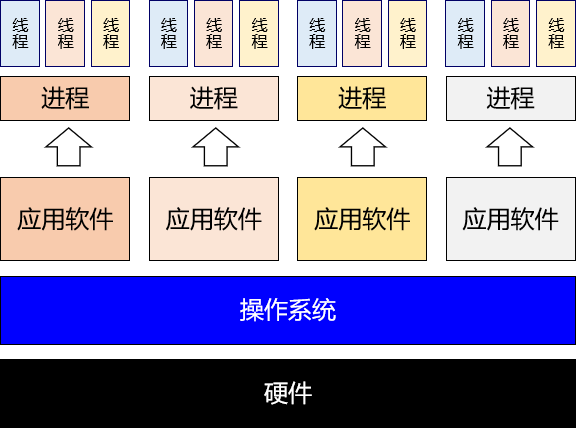


## 2、串行、并行、并发
### ①串行

多个操作在同一个线程内**按顺序**执行。这种情况下的工作模式我们往往也称之为：**同步**。按照同步模式执行的多个操作，当前操作没有结束时，下一个操作就必须等待。处于等待中的状态往往也称为：**阻塞**（block）。

### ②并行、并发

并行和并发都是以**异步**的模式来执行操作的。异步工作模式下不同线程内的操作互相不需要等待。

- 并行：**多个** CPU（或 CPU 核心）同时执行**多个任务**
- 并发：**一个** CPU（或 CPU 核心）同时执行**多个任务**
## 3、sleep() 和 wait() 区别

二者最关键的区别是下面两点：

- sleep() 会让线程**拿着锁**去睡
- wait() 会让线程**放开锁**去睡

### ①sleep() 进入等待状态不释放锁

```java
 public static void main(String[] args) {
        Object commonObject = new Object();

        new Thread(() -> {
            System.out.println(Thread.currentThread().getName() + " begin");

            synchronized (commonObject) {
                try {
                    System.out.println(Thread.currentThread().getName() + " get lock");
                    Thread.sleep(3000);   //sleep不释放锁 带着锁睡
//                    commonObject.wait(3000); //wait释放锁
                    System.out.println(Thread.currentThread().getName() + " end");

                } catch (InterruptedException e) {
                    e.printStackTrace();
                }
                System.out.println(Thread.currentThread().getName() + " release lock");

            }

        }, "Thread-A").start();

        new Thread(() -> {
            System.out.println(Thread.currentThread().getName() + " is begin");

            synchronized (commonObject) {
                System.out.println(Thread.currentThread().getName() + " get lock");
                System.out.println(Thread.currentThread().getName() + " is end");
            }
            System.out.println(Thread.currentThread().getName() + " release lock");

        }, "Thread-B").start();
    }
```

打印结果：

Thread-A begin
Thread-A get lock
Thread-B is begin
Thread-A end
Thread-A release lock
Thread-B get lock
Thread-B is end
Thread-B release lock
### ②wait() 进入等待状态释放锁

```java
 public static void main(String[] args) {
        Object commonObject = new Object();

        new Thread(() -> {
            System.out.println(Thread.currentThread().getName() + " begin");

            synchronized (commonObject) {
                try {
                    System.out.println(Thread.currentThread().getName() + " get lock");
//                    Thread.sleep(3000);   //sleep不释放锁 带着锁睡
                    commonObject.wait(3000); //wait释放锁
                    System.out.println(Thread.currentThread().getName() + " end");

                } catch (InterruptedException e) {
                    e.printStackTrace();
                }
                System.out.println(Thread.currentThread().getName() + " release lock");

            }

        }, "Thread-A").start();

        new Thread(() -> {
            System.out.println(Thread.currentThread().getName() + " is begin");

            synchronized (commonObject) {
                System.out.println(Thread.currentThread().getName() + " get lock");
                System.out.println(Thread.currentThread().getName() + " is end");
            }
            System.out.println(Thread.currentThread().getName() + " release lock");

        }, "Thread-B").start();
    }
```

打印结果：

Thread-A begin
Thread-A get lock
Thread-B is begin
Thread-B get lock
Thread-B is end
Thread-B release lock
Thread-A end
Thread-A release lock

### ③小结

|            | wait()                       | sleep()                |
| ---------- | ---------------------------- | ---------------------- |
| 声明位置   | Object 类                    | Thread 类              |
| 作用对象   | 作用于调用 wait() 方法的对象 | 作用于当前线程         |
| 性质       | 非静态方法                   | 静态方法               |
| 释放锁资源 | **放开锁进入等待**           | **不释放锁进入等待**   |
| 同步要求   | 必须在同步上下文中使用       | 不要求在同步上下文中   |
| 应用场景   | 用于线程中通信               | 用来让线程暂停一段时间 |

## 4、同步方法和同步代码块

### ①区别

|            | 锁对象                            | 锁定范围             |
| ---------- | --------------------------------- | -------------------- |
| 同步代码块 | 由程序员指定                      | 代码块的范围（灵活） |
| 同步方法   | 静态：类. class      非静态：this | 整个方法体           |

### ②同步方法锁对象案例

#### [1] 第一种情况


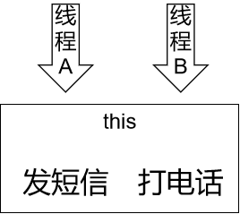

第一种情况：用同一个对象调用两个非静态的同步方法
执行的效果：等发短信执行完成之后，才打印打电话

```java
public class Demo04SynchMethod {

    // 第一种情况：用同一个对象调用两个非静态的同步方法
    // 执行的效果：等发短信执行完成之后，才打印打电话
    public static void situation01(String[] args) {

        // 1、创建 Phone 对象作为多个线程共享的对象
        Phone phone = new Phone();

        // 2、创建发短信的线程
        new Thread(()->{
            phone.sendShortMessage();
        }, "thread-a").start();

        try {TimeUnit.SECONDS.sleep(1);} catch (InterruptedException e) {}

        // 3、创建打电话的线程
        new Thread(()->{
            phone.call();
        }, "thread-b").start();
    }

}

class Phone {

    // this
    public synchronized void sendShortMessage() {
        System.out.println(Thread.currentThread().getName() + " 发短信");
        try { TimeUnit.SECONDS.sleep(5);} catch (InterruptedException e) {}
    }

    // this
    public synchronized void call() {
        System.out.println(Thread.currentThread().getName() + " 打电话");
    }

}
```

#### [2] 第二种情况

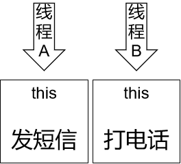

第二种情况：用两个不同的对象调用分别两个非静态的同步方法
执行的效果：各自执行，不需要等待

```java
// 第二种情况：用两个不同的对象调用分别两个非静态的同步方法
// 执行的效果：各自执行，不需要等待
// 1、创建 Phone 对象作为多个线程共享的对象
Phone phone01 = new Phone();
Phone phone02 = new Phone();

// 2、创建发短信的线程
new Thread(()->{
    phone01.sendShortMessage();
}, "thread-a").start();

try {TimeUnit.SECONDS.sleep(1);} catch (InterruptedException e) {}

// 3、创建打电话的线程
new Thread(()->{
    phone02.call();
}, "thread-b").start();
```

#### [3] 第三种情况

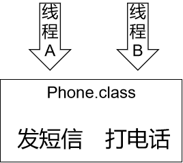

 第三种情况：两个线程分别调用两个静态同步方法
 执行效果：等发短信执行完成之后，才打印打电话

```java
public class Demo04SynchMethod {

    // 第三种情况：两个线程分别调用两个静态同步方法
    // 执行效果：等发短信执行完成之后，才打印打电话
    public static void main(String[] args) {

        // 1、创建 A 线程发短信
        new Thread(()->{
            Phone.sendShortMessage();
        }, "thread-a").start();

        try {TimeUnit.SECONDS.sleep(1);} catch (InterruptedException e) {}

        // 2、创建 B 线程打电话
        new Thread(()->{
            Phone.call();
        }, "thread-b").start();
    }
}

class Phone {

    // Phone.class
    public static synchronized void sendShortMessage() {

        System.out.println(Thread.currentThread().getName() + " 发短信");

        try {
            System.out.println(Thread.currentThread().getName() + " 开始睡觉");
            TimeUnit.SECONDS.sleep(5);
            System.out.println(Thread.currentThread().getName() + " 结束睡觉");
        } catch (InterruptedException e) {}
    }

    // Phone.class
    public static synchronized void call() {
        System.out.println(Thread.currentThread().getName() + " 打电话");
    }

}
```

#### [4] 第四种情况

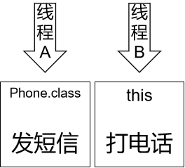

第四种情况：类名调用静态同步方法；对象调用非静态同步方法
执行效果：各自执行，不需要等待

```java
public class Demo04SynchMethod {

    public static void main(String[] args) {

        // 第四种情况：类名调用静态同步方法；对象调用非静态同步方法
        // 执行效果：各自执行，不需要等待
        // 1、创建 A 线程发短信
        new Thread(()->{
            Phone.sendShortMessage();
        }, "thread-a").start();

        try {TimeUnit.SECONDS.sleep(2);} catch (InterruptedException e) {}

        // 2、创建 Phone 对象
        Phone phone = new Phone();

        // 3、创建 B 线程打电话
        new Thread(()->{
            phone.call();
        }, "thread-b").start();
    }
}

class Phone {

    // Phone.class
    public static synchronized void sendShortMessage() {

        System.out.println(Thread.currentThread().getName() + " 发短信");

        try {
            System.out.println(Thread.currentThread().getName() + " 开始睡觉");
            TimeUnit.SECONDS.sleep(5);
            System.out.println(Thread.currentThread().getName() + " 结束睡觉");
        } catch (InterruptedException e) {}
    }

    // this
    public synchronized void call() {
        System.out.println(Thread.currentThread().getName() + " 打电话");
    }

}
```
#### [5] 结论

- 结论 1：静态同步方法使用类. class 作为锁对象；非静态同步方法使用 this 作为锁对象
- 结论 2：多个线程如果使用同一个锁对象就会有竞争关系；否则没有竞争关系
## 5、练习：卖票的例子

```java
public class Demo05SaleTicket {

    // 票库存数量
    private int stock = 10;

    // 声明卖票的方法
    public synchronized void saleTicket() {
        if (stock > 0) {
            System.out.println(Thread.currentThread().getName() + " 号窗口操作：还剩" + --stock + "张票，");
        }else{
            System.out.println("票卖完了！！！");
        }
    }

    public static void main(String[] args) {

        // 创建当前类的对象
        Demo05SaleTicket demo = new Demo05SaleTicket();

        // 开三个窗口卖票
        new Thread(()->{
            while (true) {
                try {TimeUnit.SECONDS.sleep(1);} catch (InterruptedException e) {}
                demo.saleTicket();
            }
        }, "0001").start();

        new Thread(()->{
            while (true) {
                try {TimeUnit.SECONDS.sleep(1);} catch (InterruptedException e) {}
                demo.saleTicket();
            }
        }, "0002").start();

        new Thread(()->{
            while (true) {
                try {
                    TimeUnit.SECONDS.sleep(1);} catch (InterruptedException e) {}
                demo.saleTicket();
            }
        }, "0003").start();
    }
}
```
# 第二节 创建多线程
TIP

无论有多少种形式，创建多线程的真正的方法，其实只有两种：

- 继承 Thread 类
- 实现 Runnable 接口

其它形式都是这两种方式的变体。
## 1、继承 Thread 类

### ①实现方式

- 第一步：继承 Thread 类
- 第二步：重写 run() 方法
- 第三步：创建 Thread 子类对象
- 第四步：调用 start() 方法启动线程

```java
public class CreateThread01Extends {

    public static void main(String[] args) {
        DemoThread demo = new DemoThread("AAA");
        demo.start();
    }
}

class DemoThread extends Thread {

    public DemoThread(String threadName) {
        super(threadName);
    }

    @Override
    public void run() {
        System.out.println(Thread.currentThread().getName() + " thread working ...");
    }
}
```
### ②start() 方法和 run() 方法区别

调用 run() 方法仅仅只是调用了一个子类中重写的父类方法，并没有真正开启一个新的线程，还是在当前线程运行，也就是 main 线程。

## 2、实现 Runnable 接口

### ①实现 Runnable 接口形式

```java
public class CreateThread02Impl {

    public static void main(String[] args) {

        // 第四步：创建实现了 Runnable 接口的类的对象
        MyRunnableThread runnable = new MyRunnableThread();

        // 第五步：创建 Thread 类对象
        // 参数1：runnable 对象
        // 参数2：线程名称
        Thread thread = new Thread(runnable, "thread 002");
        // 第六步：调用 Thread 对象的 start() 方法启动线程
        thread.start();
    }

}

// 第一步：实现 Runnable 接口
class MyRunnableThread implements Runnable {

    // 第二步：实现 run() 方法
    @Override
    public void run() {
        // 第三步：编写线程中的逻辑代码
        System.out.println(Thread.currentThread().getName() + " is working");
    }
}
```

### ②匿名内部类形式

```java
// 第一步：以匿名内部类的方式创建 Runnable 接口类型的对象
Runnable runnable = new Runnable() {
    @Override
    public void run() {
        // 第二步：编写线程中的逻辑代码
        System.out.println(Thread.currentThread().getName() + " is working");
    }
};

// 第三步：创建 Thread 类对象
// 参数1：runnable 对象
// 参数2：线程名称
Thread thread = new Thread(runnable, "thread 003");

// 第四步：调用 Thread 对象的 start() 方法启动线程
thread.start();
```
### ③Lambda 表达式形式

#### [1] 有声明变量的形式

```java
// 编写 Lambda 表达式的口诀：
// 复制小括号
// 写死右箭头
// 落地大括号

// 第一步：以匿名内部类的方式创建 Runnable 接口类型的对象
Runnable runnable = () -> {
    // 第二步：编写线程中的逻辑代码
    System.out.println(Thread.currentThread().getName() + " is working");
};

// 第三步：创建 Thread 类对象
// 参数1：runnable 对象
// 参数2：线程名称
Thread thread = new Thread(runnable, "thread 004");

// 第四步：调用 Thread 对象的 start() 方法启动线程
thread.start();
```

#### [2] 不声明变量形式

```java
// 第一步：创建 Thread 类对象并调用 start() 方法启动线程
// 参数1：以Lambda 表达式形式创建的 runnable 对象
// 参数2：线程名称
new Thread(() -> {
    // 第二步：编写线程中的逻辑代码
    System.out.println(Thread.currentThread().getName() + " is working");
}, "thread 005").start();
```
## 3、使用 Callable 接口配合 FutureTask

TIP

该方案最核心的价值是：使用 Callable 接口限定的功能 + Future 接口限定的功能 = **汇总**各个线程执行结果

最终执行汇总操作的这一步会被阻塞，直到前面各个线程完成了计算。
### ①FutureTask 类和 Runnable 接口的关系

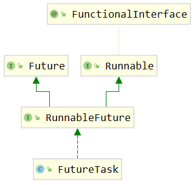

从继承关系能够看到，FutureTask 本身也间接实现了 Runnable 接口。FutureTask 类的对象也是 Runnable 接口的实例，可以用于在创建 Thread 对象时，传入 Thread 构造器。

### ②Future 接口

#### [1] 停止任务

方法声明：

```java
boolean cancel(boolean mayInterruptIfRunning);
```
如果尚未启动，它将停止任务。如果已启动，则仅在 mayInterrupt 为 true 时才会中断任务。

#### [2] 获取任务的结果

```java
V get() throws InterruptedException, ExecutionException;
```

如果任务完成，它将立即返回结果，否则将等待任务完成，然后返回结果。

#### [3] 判断任务是否完成

```java
boolean isDone();
```

如果任务完成，则返回 true，否则返回 false。

### ③FutureTask 类的构造器

#### [1] 介绍

FutureTask 类兼具 Runnable 和 Future 接口的功能，并方便地将两种功能组合在一起。关于 FutureTask 类的使用有如下建议：

- 在主线程中需要执行比较耗时的操作时，但又不想阻塞主线程时，可以把这些作业交给 Future 对象在后台完成
- 当主线程将来需要时，就可以通过 Future 对象获得后台作业的计算结果或者执行状态
- 一般 FutureTask 多用于耗时的计算，主线程可以在完成自己的任务后，再去获取结果。
- 仅在计算完成时才能检索结果；如果计算尚未完成，则阻塞 get() 方法
- 一旦计算完成，就不能再重新开始或取消计算
- get() 方法而获取结果只有在计算完成时获取，否则会一直阻塞直到任务转入完成状态，然后会返回结果或者抛出异常
- get() 只执行一次，因此 get() 方法放到最后

#### [2] 可以使用的构造器

```java
    public FutureTask(Callable<V> callable) {
        if (callable == null)
            throw new NullPointerException();
        this.callable = callable;
        this.state = NEW;       // ensure visibility of callable
    }
```

根据这个构造器，我们知道，创建 FutureTask 对象时，传入一个 Callable 类型的对象即可。

### ④Callable 接口

```java
@FunctionalInterface
public interface Callable<V> {
    /**
     * Computes a result, or throws an exception if unable to do so.
     *
     * @return computed result
     * @throws Exception if unable to compute a result
     */
    V call() throws Exception;
}
```

从 call() 方法的声明我们可以看出，它有一个返回值。这个返回值可以将当前线程内计算结果返回。

### ⑤测试代码

```java
// 1.创建三个FutureTask对象，封装三个线程的执行逻辑
FutureTask<Integer> task01 = new FutureTask<>(() -> {

    int result = (int) (Math.random() * Math.random() * 100);

    System.out.println(Thread.currentThread().getName());

    return result;
});
FutureTask<Integer> task02 = new FutureTask<>(() -> {

    int result = (int) (Math.random() * Math.random() * 1000);

    System.out.println(Thread.currentThread().getName());

    return result;
});
FutureTask<Integer> task03 = new FutureTask<>(() -> {

    int result = (int) (Math.random() * Math.random() * 10000);

    System.out.println(Thread.currentThread().getName());

    return result;
});

// 2.创建三个线程对象，然后启动线程
new Thread(task01, "thread01").start();
new Thread(task02, "thread02").start();
new Thread(task03, "thread03").start();

// 3.上面三个线程执行完成后，可以收集它们各自运算的结果
Integer task01Result = task01.get();
Integer task02Result = task02.get();
Integer task03Result = task03.get();

System.out.println("task01Result = " + task01Result);
System.out.println("task02Result = " + task02Result);
System.out.println("task03Result = " + task03Result);
```

### ⑥Callable 和 Runnable 对比

| Runnable 接口              | Callable 接口             |
| -------------------------- | ------------------------- |
| 重写 run() 方法            | 重写 call() 方法          |
| run() 没有返回值           | call() 有返回值           |
| run() 没有声明抛出异常     | call() 声明抛出 Exception |
| 没有汇总各个线程结果的机制 | 有汇总各个线程结果的机制  |

### ⑦Callable 接口方案的特点
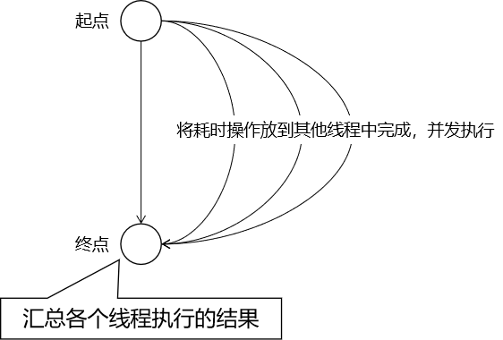


该方案仅在计算完成时才能检索结果；如果计算尚未完成，则阻塞 get() 方法。一旦计算完成，就不能再重新开始或取消计算。get() 方法而获取结果只有在计算完成时获取，否则会一直阻塞直到任务转入完成状态，然后会返回结果或者抛出异常， 且只计算一次。

## 4、线程池

### ①参考代码
```java
// 1.创建线程池对象
ExecutorService pool = Executors.newFixedThreadPool(5);

// 2.给线程池对象分配任务，每一个任务是一个线程
pool.execute(() -> {
    System.out.println(Thread.currentThread().getName() + " " + new Date());
});

pool.execute(() -> {
    System.out.println(Thread.currentThread().getName() + " " + new Date());
});

pool.execute(() -> {
    System.out.println(Thread.currentThread().getName() + " " + new Date());
});
```
### ②开发建议

阿里开发手册中对线程创建的规定：

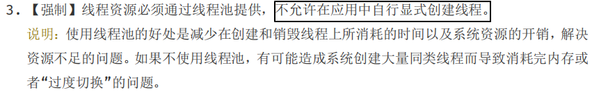

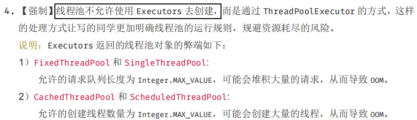

结论：实际开发中，建议使用 **『自定义线程池』** 的方式创建多线程。
## 5、并行计算 [了解]

```java
List<String> list = Arrays.asList("a", "b", "c", "d", "e");

// 串行计算
list.stream().forEach(System.out::print);
System.out.println();

// 并行计算
list.parallelStream().forEach(System.out::print);
```

## 6、Timer 定时任务 [了解]

```java
// 1、创建 Timer 对象封装定时任务中要执行的操作
// 每一个 Timer 对象会使用一个线程来执行定时任务
Timer timer01 = new Timer();

// 2、调用 schedule() 指定任务和执行周期
// 参数1：timerTask 封装具体任务操作
// 参数2：delay 指定定时任务延迟多久后开始执行
// 参数3：period 指定定时任务执行的时间间隔
timer01.schedule(new TimerTask() {
    @Override
    public void run() {
        System.out.println(Thread.currentThread().getName() +" is working");
    }
}, 0, 1000);

Timer timer02 = new Timer();

timer02.schedule(new TimerTask() {
    @Override
    public void run() {
        System.out.println(Thread.currentThread().getName() +" is working");
    }
}, 0, 1000);
```
Timer-0 is working
Timer-1 is working
Timer-0 is working
Timer-1 is working
## 7、Spring 异步方法 [了解]

TIP

使用场景：

在 Spring 环境下，如果组件 A（假设是 ControllerA）要调用组件 B（假设是 ServiceB）的多个方法，而且希望这些方法能够异步执行。

### ①准备 SpringBoot 环境

#### [#](http://heavy_code_industry.gitee.io/code_heavy_industry/pro017-JUC/lecture/chapter01/verse02.html#_1-引入依赖)[1] 引入依赖

```xml
<dependencies>
    <dependency>
        <groupId>org.springframework.boot</groupId>
        <artifactId>spring-boot-starter-web</artifactId>
        <version>2.5.2</version>
    </dependency>
</dependencies>
```

#### [2] 创建主启动类

```java
@SpringBootApplication
public class Application {
    public static void main(String[] args) {
        SpringApplication.run(Application.class, args);
    }
}
```

#### [3] 创建 Service

```java
@Service
public class DemoService {
    public void doSth() {
        System.out.println("Demo Service " + Thread.currentThread().getName());
    }

}
```

#### [4] 创建 Controller

```java
@RestController
public class DemoController {

    @Autowired
    private DemoService demoService;

    @RequestMapping("/demo/test/async")
    public String callServiceMethod() {

        demoService.doSth();
        demoService.doSth();
        demoService.doSth();
        demoService.doSth();
        demoService.doSth();

        return "success";
    }

}
```

### ②使用异步方法

#### [1] 开启异步功能

在主启动类使用 @EnableAsync 注解：

```java
// 开启支持异步方法调用功能
@EnableAsync
@SpringBootApplication
public class Application {

    public static void main(String[] args) {
        SpringApplication.run(Application.class, args);
    }

}
```

#### [2] 标记异步方法

在想要异步调用的方法上使用 @Async 注解：

```java
@Service
public class DemoService {

    // 在想要实现异步调用的方法上加 @Async注解
    @Async
    public void doSth() {
        System.out.println("Demo Service " + Thread.currentThread().getName());
    }

}
```
## 8、小结
面试中如果被问到：创建多线程有哪些方法，至少要能说上来前四种。后面三种是用来卷别人、吹牛的。

其实 Fork Join、CompletableFuture 也可以，后面会讲到。

- [基本] 继承 Thread 类
- [基本] 实现 Runnable 接口
- [基本] 线程池
- [基本] Callable + FutureTask
- [内卷] CompletableFuture
- [内卷] Fork Join
- [内卷] 并行计算
- [内卷] Timer 定时任务
- [内卷] Spring 的异步方法调用
# 第三节 线程状态与生命周期
## 1、线程状态枚举类

### ①源代码

在 java.lang.Thread 类中有一个内部类：

```java
    public enum State {
        /**
         * Thread state for a thread which has not yet started.
         */
        NEW,

        /**
         * Thread state for a runnable thread.  A thread in the runnable
         * state is executing in the Java virtual machine but it may
         * be waiting for other resources from the operating system
         * such as processor.
         */
        RUNNABLE,

        /**
         * Thread state for a thread blocked waiting for a monitor lock.
         * A thread in the blocked state is waiting for a monitor lock
         * to enter a synchronized block/method or
         * reenter a synchronized block/method after calling
         * {@link Object#wait() Object.wait}.
         */
        BLOCKED,

        /**
         * Thread state for a waiting thread.
         * A thread is in the waiting state due to calling one of the
         * following methods:
         * <ul>
         *   <li>{@link Object#wait() Object.wait} with no timeout</li>
         *   <li>{@link #join() Thread.join} with no timeout</li>
         *   <li>{@link LockSupport#park() LockSupport.park}</li>
         * </ul>
         *
         * <p>A thread in the waiting state is waiting for another thread to
         * perform a particular action.
         *
         * For example, a thread that has called <tt>Object.wait()</tt>
         * on an object is waiting for another thread to call
         * <tt>Object.notify()</tt> or <tt>Object.notifyAll()</tt> on
         * that object. A thread that has called <tt>Thread.join()</tt>
         * is waiting for a specified thread to terminate.
         */
        WAITING,

        /**
         * Thread state for a waiting thread with a specified waiting time.
         * A thread is in the timed waiting state due to calling one of
         * the following methods with a specified positive waiting time:
         * <ul>
         *   <li>{@link #sleep Thread.sleep}</li>
         *   <li>{@link Object#wait(long) Object.wait} with timeout</li>
         *   <li>{@link #join(long) Thread.join} with timeout</li>
         *   <li>{@link LockSupport#parkNanos LockSupport.parkNanos}</li>
         *   <li>{@link LockSupport#parkUntil LockSupport.parkUntil}</li>
         * </ul>
         */
        TIMED_WAITING,

        /**
         * Thread state for a terminated thread.
         * The thread has completed execution.
         */
        TERMINATED;
    }
```
### ②说明
| 英文名称      | 中文名称 | 含义                                                    |
| ------------- | -------- | ------------------------------------------------------- |
| NEW           | 新建     | 线程对象刚创建                                          |
| RUNNABLE      | 就绪     | 等待 CPU 时间片                                         |
| RUNNING       | 运行     | 得到了 CPU 时间片，正在执行                             |
| BLOCKED       | 阻塞     | 等待同步锁                                              |
| WAITING       | 等待     | 等待被唤醒                                              |
| TIMED_WAITING | 限时等待 | 在进入等待状态时设定了等待时间 时间一到自动回到就绪状态 |
| TERMINATED    | 终止     | 线程因为代码执行完成或抛异常而停止执行                  |
TIP

- WAITING：睡美人自己醒不过来，必须由王子来唤醒——体现到程序中是**必须由其它线程唤醒**。
- TIMED_WAITING：上闹钟睡觉，闹钟一响就醒来——体现到程序中是过了超时时间就能被唤醒。
- RUNNING：在 Thread.State 枚举类中并没有定义，是我们自己补充上去的。

## 2、线程的生命周期
### ①新建

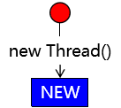

### ②就绪

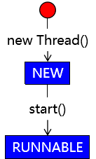

### ③运行

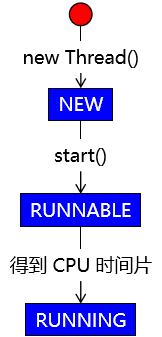

### ④回到就绪状态

本次得到的 CPU 时间片用完，重新回到就绪状态，等待下一个 CPU 时间片。

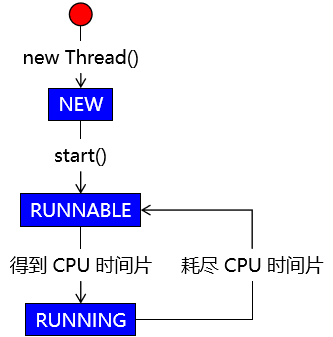
### ⑤结束


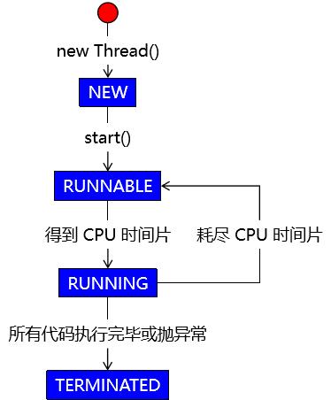


### ⑥等待


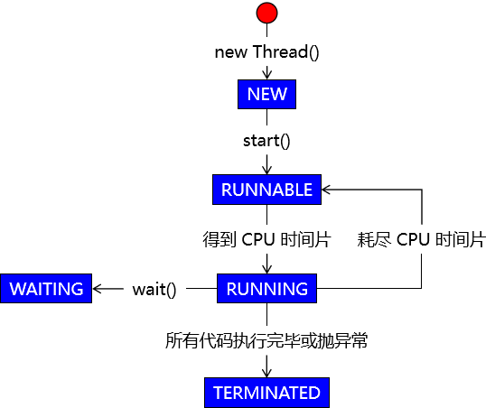


### ⑦唤醒


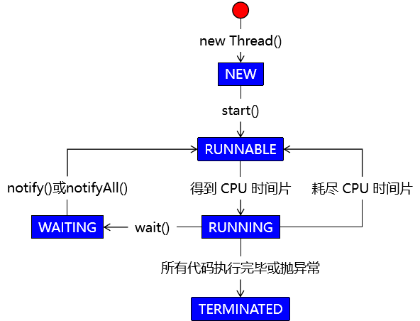

WARNING
本土中的 notify()、notifyAll() 方法应该是由**其它线程**调用，而不是当前线程自己。

### ⑧超时等待与唤醒


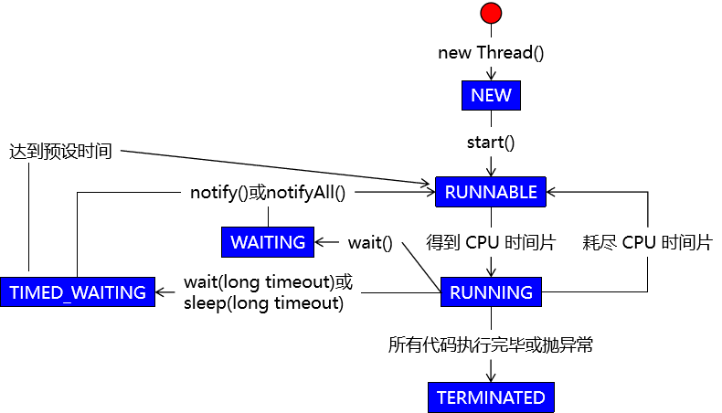


### ⑨阻塞


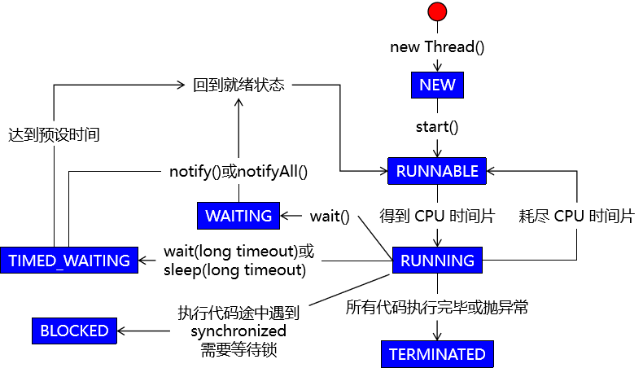


### ⑩得到锁


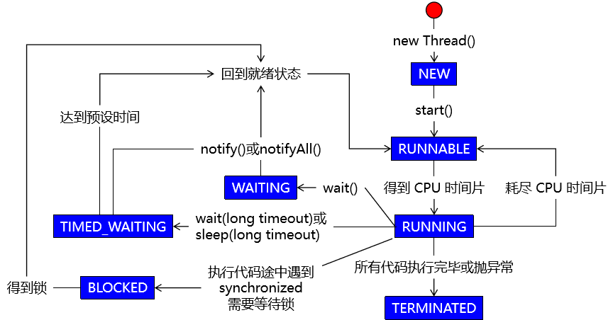


## 3、Dump Threads
学习目标：只是帮助大家理解，不做强制性要求。
### ①演示就绪状态
#### [1]Java 代码
```java
new Thread(()->{
    while (true){}
}, "my-thread").start();
```
#### [2] 查看线程状态


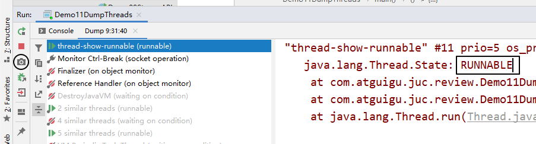


### ②演示等待状态
#### [1] Java 代码
```java
// 创建一个对象用来操作线程状态
Object commonObject = new Object();

// 创建一个线程对象
new Thread(()->{

    synchronized (commonObject) {

        try {
            // 进入等待状态
            commonObject.wait();
        } catch (InterruptedException e) {
            e.printStackTrace();
        }

    }

}).start();
```
#### [2] 查看线程状态


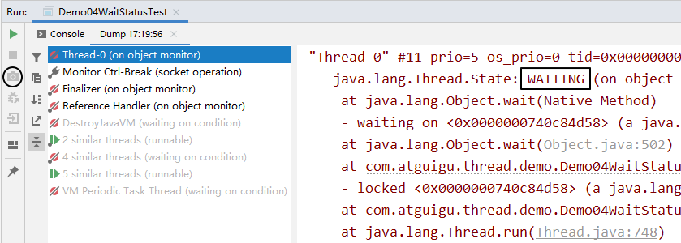


### ③演示阻塞状态
#### [1] Java 代码
```java
// 创建一个普通对象作为同步锁
Object commonObject = new Object();

// 创建两个线程，其中一个线程睡眠时另一个就是阻塞状态
new Thread(()->{

    try {
        synchronized (commonObject) {

            Thread.sleep(10000);

        }
    } catch (InterruptedException e) {
        e.printStackTrace();
    }

}, "AAA").start();

new Thread(()->{

    try {
        synchronized (commonObject) {

            Thread.sleep(10000);

        }
    } catch (InterruptedException e) {
        e.printStackTrace();
    }

}, "BBB").start();
```
#### [2] 查看线程状态
- 状态一：AAA 线程获取同步锁，执行同步代码块，进入 TIMED_WAITING 状态。


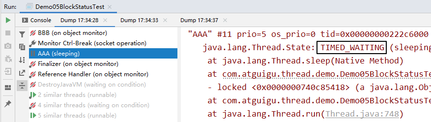


- 状态二：AAA 线程未释放同步锁时，BBB 线程处于 BLOCKED 状态


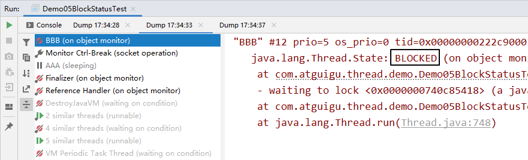


- 状态三：AAA 线程执行完成，释放同步锁，BBB 线程获得同步锁，执行代码块，进入 TIMED_WAITING 状态。


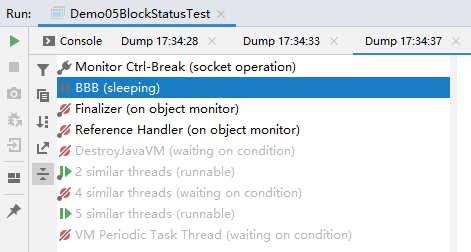


# 第四节 线程间通信
TIP
在多线程模式下进行工作，除了要考虑各个线程之间是否同步、如何竞争锁等问题，还要考虑这样一个问题：线程之间有的时候需要**相互配合**来共同完成一件事情。
把一个大的任务拆分成多个不同的任务线，每个任务线中都有更小的执行步骤。各个线程之间需要彼此配合：A 线程执行一步唤醒 B 线程，自己等待；B 线程执行一步，唤醒 A 线程，自己等待……

## 1、核心语法
### ①Object 类的 wait() 方法
官方文档对 wait() 方法的说明（节选）：
Causes the current thread to wait until another thread invokes the java.lang.Object#notify() method or the java.lang.Object#notifyAll() method for this object.
拆解要点：

- wait() 方法会导致当前线程进入等待状态
- 必须是**另外一个线程**调用 notify() 或 notifyAll() 方法来唤醒
- “for this object” 表示还是要使用**同一个对象**分别调用 wait()、notify()、notifyAll() 这些方法
### ②Object 类的 notify() 方法
官方文档对 notify() 方法的说明（节选）：
Wakes up a single thread that is waiting on this object’s monitor. If any threads are waiting on this object, one of them is chosen to be awakened.
拆解要点：

- notify() 方法**只唤醒一个**线程
- 处于等待状态的线程会被存放在对象监视器中的一个数组中
- 如果在这个对象的监视器中维护的处于等待状态的线程是多个，那么 notify() 方法会**随机唤醒一个**
- notfiy() 方法**无法精确唤醒一个指定的线程**，这个需求可以通过 Lock + Condition 方式实现（定制化通信）
### ③Object 类的 notifyAll() 方法
官方文档对 notifyAll() 方法的说明（节选）：
Wakes up all threads that are waiting on this object’s monitor.

翻译：唤醒当前对象监视器上等待的**所有线程**。

> 如果 synchronized 锁定的是 this，那么对应的一定是 this.wait()、this.notify()、this.notifyAll()；
>
> 如果 synchronized 锁定的是 target，那么对应的一定是 target.wait()、target.notify()、target.notifyAll() 。
>
> 而且 **wait()、notify()、notifyAll() 这三个方法能够被调用的前提是已经获取了相应的互斥锁，所以我们会发现 wait()、notify()、notifyAll() 都是在 synchronized{} 内部被调用的**。如果在 synchronized{} 外部调用，或者锁定的 this，而用 target.wait() 调用的话，JVM 会抛出一个运行时异常：`java.lang.IllegalMonitorStateException`。

## 2、案例演示

### ①需求说明
- 设定一个成员变量，作为两个线程都要操作的共享数据，设置初始化值为 0
- A 线程执行 +1 操作
- B 线程执行 -1 操作
- A、B 两个线程交替执行
### ②实现代码
```java
public class Demo01TwoThreads {

    // 声明成员变量作为共享数据
    private int number = 0;

    // 声明一个执行加法的方法
    public void add() {

        // wait()、notify() 方法要求工作在同步上下文中
        synchronized (this) {

            try {
                // 判断当前 number 的数值
                if (number > 0) {

                    // 如果 number 大于 0，则当前线程等待
                    this.wait();
                }

                // 线程被唤醒后，执行 +1 操作
                System.out.println(Thread.currentThread().getName() + " 线程：" + ++number);

                // 执行完成后，唤醒减法线程
                this.notifyAll();
            } catch (InterruptedException e) {
                e.printStackTrace();
            }
        }

    }

    // 声明一个执行减法的方法
    public void sub() {

        // wait()、notify() 方法要求工作在同步上下文中
        synchronized (this) {

            try {
                // 判断当前 number 的数值
                if (number <= 0) {

                    // 如果 number 小于等于 0，则当前线程等待
                    this.wait();
                }

                // 线程被唤醒后，执行 -1 操作
                System.out.println(Thread.currentThread().getName() + " 线程：" + --number);

                // 执行完成后，唤醒加法线程
                this.notifyAll();
            } catch (InterruptedException e) {
                e.printStackTrace();
            }
        }
    }

    public static void main(String[] args) {

        // 1、创建当前类对象
        Demo01TwoThreads demo = new Demo01TwoThreads();

        // 2、创建 A 线程执行加法操作
        new Thread(()->{

            for (int i = 0; i < 50; i++) {
                demo.add();
                try {
                    TimeUnit.SECONDS.sleep(1);} catch (InterruptedException e) {}
            }

        }, "thread-a").start();


        // 3、创建 B 线程执行减法操作
        new Thread(()->{

            for (int i = 0; i < 50; i++) {
                demo.sub();
                try {
                    TimeUnit.SECONDS.sleep(1);} catch (InterruptedException e) {}
            }

        }, "thread-b").start();
    }

}
```
TIP
测试多线程程序的基本逻辑：
代码的某些错误→运行结果部分正确
代码完全正确→运行结果全部正确
运行结果的一次错误→证明代码肯定有问题
运行结果的一次正确→没法证明代码正确
结论：不能全看运行结果。
如果我们希望能够尽可能通过运行结果证明代码正确，那就需要增加运行的次数，或者有可能需要取消执行过程中的时间间隔。

## 3、虚假唤醒
### ①问题描述
当上面的例子中，线程数量从两个增加到四个，计算结果就会出错：
thread-a 线程：1 thread-c 线程：2 thread-a 线程：3 thread-d 线程：2 thread-d 线程：1 thread-d 线程：0 thread-b 线程：-1 thread-d 线程：-2 thread-a 线程：-1 thread-a 线程：0 thread-a 线程：1 thread-c 线程：2 thread-a 线程：3 thread-d 线程：2 thread-d 线程：1

### ②问题分析
#### [1] 使用 if 的情况

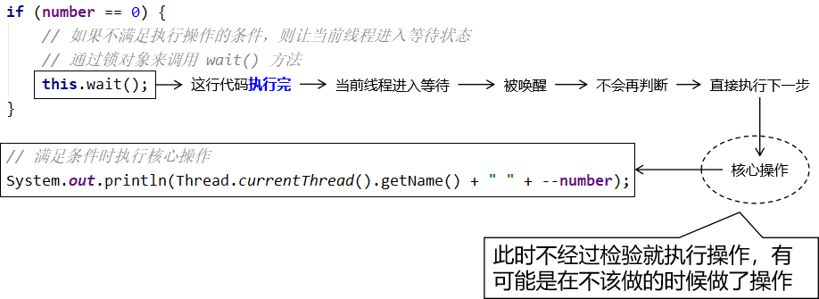

这种情况，我们称之为：**虚假唤醒**。

#### [2] 使用 while 解决问题


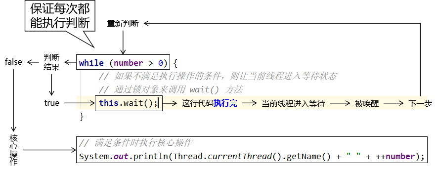

延伸问题：跳出循环之后到核心操作之前的空档是否还会被其它线程干扰？

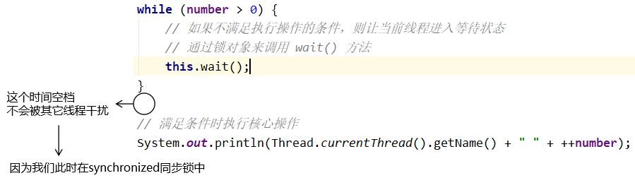

### ③小结

要解决虚假唤醒问题，就需要对线程间通信时的判断条件使用 while 循环结构来执行，而不是 if 分支判断。

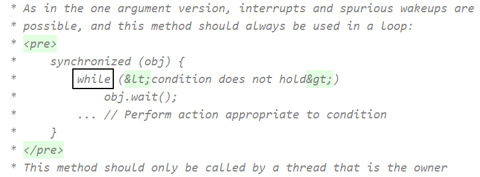


# 方法及其案例

### 停止线程`不推荐stop+destroy`,推荐flag标记

◆不推荐使用JDK提供的 stop（）、destroy（）方法。【已废弃】 推荐线程自己停止下来 

◆建议使用一个标志位进行终止变量当flag=false，则终止线程运行。

除了已废弃的stop方法 ，没有办法可以强制线程终止。

 ```java
// 测试标识位stop
    // 1.建议线程正常停止-->利用次数,不建议死循环
    // 2.建议使用标志位-->设置 一个标记为
    // 3.不使用stop或者destory等过时的jdk不建议使用的方法
    public class FlagStop implements Runnable {
        // 1.设置一个标识位
        private boolean flag = true;

        @Override
        public void run() {
            int i = 0;
            while (flag) {
                System.out.println("run.........." + i++);
            }
        }

        // 2.设置一个公开的线程停止方法
        public void stop() {
            this.flag = false;
        }

        public static void main(String[] args) {

            FlagStop t = new FlagStop();
            new Thread(t).start();
            for (int i = 0; i < 1000; i++) {
                System.out.println("main......." + i);
                if (i == 900) {
                    // 调用stop方法切换标志位,让线程停止
                    t.flag = false;
                    System.out.println("线程停止....");
                }
            }
        }
    }

 ```


### 中断线程interrupt（），协商机制

当一个线程调用`interrupt（）`方法时，就是设置线程的中断状态，每个线程都有的boolean标志，每个线程都应该不时的检查这个标志位，以判断线程是否被中断，

要想得出是否设置了中断状态，调用`Thread.currentThread方法获取当前线程`，然后调用`isInterrupted()方法判断是否处于中断状态`

没有任何语言要求被中断的线程应当中止；被中断的线程可以决定如何响应中断。

 

> `public void interrupt()`      向线程发生中断请求，线程的中断状态设置为true，如果当前线程被一个sleep调用阻塞，则抛出一个InterruptedException异常。
>
> `public static boolean interrupted()`   测试当前线程是否被中断，有一个副作用：它将当前线程的中断状态重置为false
>
> `public boolean isInterrupted()`     测试线程是否已经中断，与**interrupted不同的是，这个调用不会改变线程的中断**


案例如下：

  ```java
 public static void main(String[] args) {
    Runnable r = () -> {
        int i = 0;
        try {

            while (!Thread.currentThread().isInterrupted()) {// 检查是否处于中断状态
                System.out.println(Thread.currentThread().getName() + "::" + i);
            }
        } catch (InterruptedException e) {

        } finally {
        }

    };

    Thread t = new Thread(r);
    t.start();
    for (int i = 0; i < 100; i++) {
        System.out.println(Thread.currentThread().getName() + "::" + i);
        if (i == 10) {
            System.out.println("将t线程设置为中断状态");
            t.interrupt();//设置t线程为中断状态
        }
    }
    System.out.println("end");

  ```


### 线程休眠`(Thread.sleep(millis))`

◆sleep（时间）指定当前线程阻塞的毫秒数； 

◆sleep存在异常**InterruptedException(中断异常)**；

◆sleep时间达到后线程进入就绪状态； 

◆sleep可以模拟网络延时，倒计时等。 

**◆每一个对象都有一个锁，**sleep不会释放锁；

案例1:购票延时

```java
//模拟网络延时,放大线程的不安全性
public class TestSleep implements  Runnable{
   //票数
   private int ticketNUms=10;

   @Override
   public void run() {
       while(true){
           if (ticketNUms<0){
               break;
          }
           //模拟延时
           try {
               Thread.sleep(100);
          } catch (InterruptedException e) {
               e.printStackTrace();
          }
           System.out.println(Thread.currentThread().getName()+"-->拿到了第"+ticketNUms--+"票");
      }

  }

   public static void main(String[] args) {

       TestSleep t=new TestSleep();

       new Thread(t,"小明").start();
       new Thread(t,"老师").start();
       new Thread(t,"黄牛党").start();
  }
}
```

### 线程礼让`Thread.yield()`

◆礼让线程，**让当前正在执行的线程切换到就绪状态（running），等待CPU调度**

◆将线程从运行状态转为就绪状态 

◆让**CPU重新调度**，**礼让不一定成功**！看CPU心情

```java
//测试线程礼让
//礼让不会阻塞,重新回到就绪状态,等待CPU调度,调度的优先级是一致的
public class TestYield {
   public static void main(String[] args) {
       MyYield t= new  MyYield();
       new Thread(t,"一号线程").start();
       new Thread(t,"二号线程").start();
  }
}
class MyYield implements  Runnable{
   @Override
   public void run() {
       System.out.println("Start"+Thread.currentThread().getName());
       Thread.yield();//礼让:从此处退回到就绪状态,在此等待CPU调度,在此调度时优先级相同
       System.out.println("End"+Thread.currentThread().getName());
  }
}
```

### 线程强制执行`Thread.join()`

◆Join合并线程，待此线程执行完成后，再执行其他线程，**其他线程阻塞** 

◆可以想象成**插队**

```java
public class TestJoin  implements  Runnable{
   @Override
   public void run() {
       for (int i = 0; i < 100; i ++) {
           System.out.println("VIP线程"+i);
      }
  }

   public static void main(String[] args) throws InterruptedException {
       //开始线程进入就绪状态
       TestJoin r=new TestJoin();
       Thread t=new Thread(r);
       t.start();

       for (int i = 0; i < 100; i++) {
           //当i=10;r线程需要运行结束后主线程才能继续执行
           if(i==10)
               t.join();//插队,当前线程阻塞,
           System.out.println("main........"+i);
      }
  }
}
```

### 线程状态观测`Thread.State`

线程可以处于以下状态之一：

Thread.State是Thread内部的一个枚举类
 包含以下五种状态  
 NEW——尚未启动的线程处于此状态。
 RUNNAB0LE——在Java虚拟机中执行的线程处于此状态。
 BLOCKED——被阻塞等待监视器锁定的线程处于此状态。
 WAITING——正在等待另一个线程执行特定动作的线程处于此状态。
 TIED_WAITING——正在等待另一个线程执行动作达到指定等待时间的线程处于此状态。
 TERMINATED——已退出的线程处于此状态。

一个线程可以在给定时间点处于一个状态。这些状态是不反映任何操作系统线程状态的虚拟机状态。

一个线程可以在给定时间点处于一个状态。这些状态是不反映任何操作系统线程状态的虚拟机状态。

```java
public class TestState {

   public static void main(String[] args) {

       //lambda表达式传入一个Runnable接口的实现
         Thread t=new Thread(()->{
             for (int i = 0; i < 2; i++) {
                 try {
                     Thread.sleep(1000);
                } catch (InterruptedException e) {
                     e.printStackTrace();
                }
                 System.out.println("///////////////");
            }
        }) ;
         //获取线程状态
       //1.NEW状态
       Thread.State state = t.getState();
       System.out.println(state);//NEW

       //就绪状态
       t.start();
       state = t.getState();
       System.out.println(state);//RUNNAB0LE

       //只要线程不终止,就一直监听状态t线程的状态
       while(state!=Thread.State.TERMINATED){
          // 每间隔0.1s监听一次状态
           try {
               Thread.sleep(100);
          } catch (InterruptedException e) {
               e.printStackTrace();
          }
           state = t.getState();
           System.out.println(state);
      }

  }
}
/*运行结果
NEW
RUNNABLE
TIMED_WAITING
TIMED_WAITING
TIMED_WAITING
TIMED_WAITING
TIMED_WAITING
TIMED_WAITING
TIMED_WAITING
TIMED_WAITING
TIMED_WAITING
///////////////
TIMED_WAITING
TIMED_WAITING
TIMED_WAITING
TIMED_WAITING
TIMED_WAITING
TIMED_WAITING
TIMED_WAITING
TIMED_WAITING
TIMED_WAITING
///////////////
TERMINATED

Process finished with exit code 0
*/
```

### 线程的优先级`Priority`

每当线程调度器有机会选择新线程时，他首先选择具有较高优先级的线程，但是线程的优先级高度依赖于系统。

◆线程的优先级用数字表示，范围从1~10.      

​    Thread.MIN_PRIORITY=1；    最小

​    Thread.MAX_PRIORITY=10；   最大    

​    Thread.NORM_PRIORITY=5；默认 

◆使用以下方式改变或获取优先级getPriority() 和setPriority（int xxx）

注意:

​    优先级的设定建议在start（）调度前

​    优先级低只是意味着获得调度的概率低.并不是优先级低就不会被调用了.这都是看`CPU``的调度`

```java
public class TestPriority {
   public static void main(String[] args) {
       //打印main线程优先级
       System.out.println(Thread.currentThread().getName()+"-->"+Thread.currentThread().getPriority());

       MyPriority t=new MyPriority();
       Thread t1=new Thread(t,"默认优先级5");
       Thread t2=new Thread(t,"优先级1");
       Thread t3=new Thread(t,"优先级1");
       Thread t4=new Thread(t,"优先级5");
       Thread t5=new Thread(t,"优先级10");

       //先设置优先级在启动
       t1.start();

       t2.setPriority(Thread.MIN_PRIORITY);
       t2.start();

       t5.setPriority(Thread.MAX_PRIORITY);
       t5.start();

       t4.setPriority(Thread.NORM_PRIORITY);
       t4.start();
       t3.start();
  }
}

class MyPriority implements  Runnable{
   @Override
   public void run() {
       System.out.println(Thread.currentThread().getName()+"-->"+Thread.currentThread().getPriority());
  }
}
/*运行结果
   main-->5
   默认优先级5-->5
   优先级10-->10
   优先级1-->1
   优先级5-->5
   优先级1-->5
*/
```

## 守护线程

Java提供两种类型的线程：**用户线程和守护线程**。

用户线程是高优先级线程。JVM将在终止任务之前等待任何用户线程完成其任务。

守护线程是低优先级线程，其唯一作用是为用户线程提供服务。当只剩下守护线程时，虚拟机就会推出。

 

由于守护线程旨在为用户线程提供服务，并且仅在用户线程运行时才需要，因此它们都不会退出]VM，直到所有用户线程执行完成。

守护线程的使用

守护线程对于后台支持任务非常有用，例如垃圾收集，释放未使用对象的内存以及从缓存中删除不需要的条目。大多数JVM线程都是守护线程。

### 创建守护线程

要将线程设置为守护线程，daemon.setDaemon(true);设置为守护线程,默认为false用户线程，该方法必须在线程其中之前执行。

案例：

```java
/**守护线程定义*/
class God implements Runnable{
    @Override
    public void run() {
        while(true) {
            System.out.println("守护线程running.........");
        }
    }
}
/**用户线程*/
class You  implements  Runnable {
    @Override
    public void run() {
        for (int i = 0; i < 365; i++) {
            System.out.println("用户线程run....");
        }
        System.out.println("用户线程执行完毕");
    }
}
public class TestDaemon {
    public static void main(String[] args) {
        Thread daemon = new Thread(new God());
        daemon.setDaemon(true);//设置为守护线程,默认为false用户线程
        daemon.start();//开始守护线程

        Thread userThread=new Thread(new You());//用户线程
        userThread.start();
    }
}
```

### 应用场景：

（1）来为其它线程提供服务支持的情况；

（2）或者在任何情况下，程序结束时，这个线程必须正常且立刻关闭，就可以作为守护线程来使用；反之，如果一个正在执行某个操作的线程必须要正确地关闭掉否则就会出现不好的后果的话，那么这个线程就不能是守护线程，而是用户线程。通常都是些关键的事务，比方说，数据库录入或者更新，这些操作都是不能中断的。

