# 第一节 锁膨胀机制
## 1、JDK 1.6 分水岭
在 JDK 1.6 之前，synchronized 的底层工作机制只有『重量级锁』这一种模式。从 JDK 1.6 开始，官方对 synchronized 的底层工作机制做了重大调整。
为了减少获得锁和释放锁带来的性能消耗，引入了『偏向锁』和『轻量级锁』的概念。升级后锁一共有 4 种状态，级别从低到高依次是：**无锁状态**、**偏向锁状态**、**轻量级锁**状态和**重量级锁**状态。**锁可以升级但不能降级，也称为膨胀过程不可逆**。

## 2、锁膨胀 [重点]
### ①无锁
对象（用来作为锁对象的那个）刚创建出来，没有线程来竞争——没有线程准备执行同步代码块。


### ②偏向锁
**只有一个线程访问**对象。此时没有必要执行获得锁和释放锁的操作，我们只需要在对象中记录当前偏向的线程的 ID，只要是这个线程来访问对象，则无需获得锁，直接可以开始操作。
如果一个线程获得了锁，那么锁就进入偏向模式，此时 Mark Word 的结构也就变为偏向锁结构，当该线程再次请求锁时，无需再做任何同步操作（同步操作就是加锁、解锁操作的总称），即获取锁的过程只需要检查 Mark Word 的锁标记位为偏向锁以及当前线程 ID 等于 Mark Word 的 Thread ID 即可，这样就省去了大量有关锁申请的操作。


### ③轻量级锁
轻量级锁是由偏向锁升级而来，当存在第二个线程申请同一个锁对象时，偏向锁就会立即升级为轻量级锁。注意这里的第二个线程**只是申请锁**，**不存在**两个线程同时**竞争**锁，可以是一前一后地交替执行同步块。


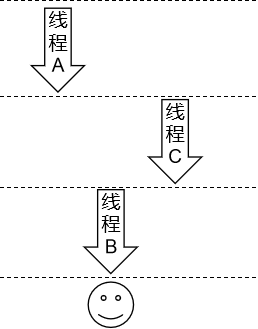


### ④重量级锁
重量级锁是由轻量级锁升级而来。当同一时间有多个线程竞争锁时，锁就会被升级成重量级锁，此时其申请锁带来的开销也就变大。此时各个线程之间**存在竞争关系**。
重量级锁一般用在不追求吞吐量，同步块或者同步方法执行时间较长的场景。


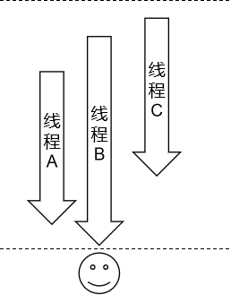


## 3、锁消除 [了解]
消除锁是 JVM 的另外一种锁的优化。在 JIT 编译时，对运行上下文进行扫描，去除不可能存在竞争的锁。比如下面代码的 method01() 和 method02() 的执行效率是一样的，因为 objectLock 锁对象是局部变量，每个线程都可以创建属于自己的锁对象，所以事实上并不存在锁的竞争关系。


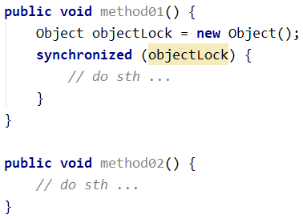


## 4、锁粗化 [了解]
锁粗化是虚拟机对另一种极端情况的优化处理，通过扩大锁的范围，避免反复加锁和释放锁。比如下面 method03() 经过锁粗化优化之后就和 method04() 执行效率一样了。


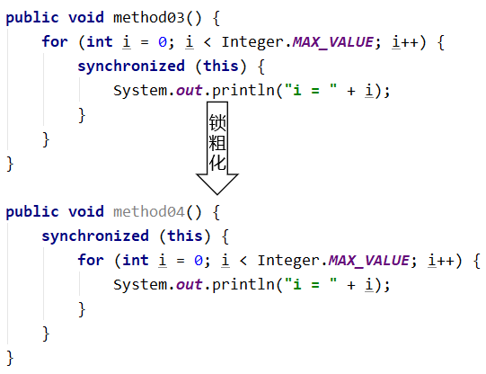


## 5、自旋锁
轻量级锁失败后，虚拟机为了避免线程真实地在操作系统层面挂起，还会进行一项称为自旋锁的优化手段。大致相当于：在遇到 synchronized 时，没有拿到锁，但是并不乖乖去阻塞，而是继续执行一些无意义代码。执行完这些代码再看看别人把锁释放没有。如果还是没有释放，那就只好去阻塞了。
- 适合的场景：锁定时间较短，通过自旋有较大几率获得锁。
- 不适合的场景：锁定时间长，自旋操作本身浪费了 CPU 性能。
  - 通俗来说就是：“旋”了半天没等到，白 “旋” 了。
  自旋代码举例：这例子只是拿常规代码说明一下情况并不能代表底层实际执行效果
```java
System.out.println("正常业务功能代码 ……"); // Runnable 或 Running 状态
System.out.println("正常业务功能代码 ……"); // Runnable 或 Running 状态
System.out.println("正常业务功能代码 ……"); // Runnable 或 Running 状态

for (int i = 0; i < 10; i++) {
    System.out.println("自旋代码 ……"); // Runnable 或 Running 状态
}

// 自旋完成
// 尝试获取锁
// 获取成功：进入同步代码块执行代码
// 获取失败：进入阻塞状态

synchronized (Demo05Spin.class) {

}
```
## 6、自适应自旋锁
这种相当于是对上面自旋锁优化方式的进一步优化，它的自旋的次数不再固定，其自旋的次数由前一次在同一个锁上的自旋时间及锁的拥有者的状态来决定，这就解决了自旋锁带来的缺点。
# 第二节 [对象存储](https://so.csdn.net/so/search?q=对象存储&spm=1001.2101.3001.7020)结构
学习本节内容是为了搞清楚当线程在申请锁时，底层具体是如何工作的。
## 1、对象存储结构
现在我们都知道了对象（包括数组）都是放在堆内存中，那么对象在堆内存中保存时的数据结构是什么样子的呢？


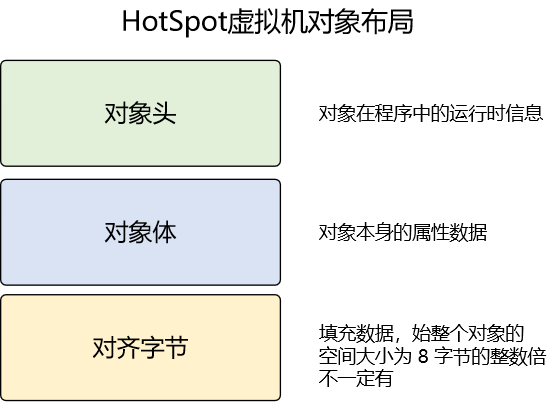


### ①对象头
- 非数组对象
  - Mark Word
  - 类型指针
- 数组
  - Mark Word
  - 类型指针
  - 数组长度


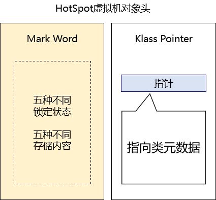


### ②对象体
这一部分也称为：实例数据。也就是对象中实际包含的属性数据。
### ③对齐字节
为了寻址方便，JVM 要求每一个对象起始地址必须是 8 字节的整数倍，也就是要求每一个对象的存储空间都是 8 字节的整数倍。所以对于占空间不满足这一要求的对象会进行填充。所以这一部分是不一定存在的。
## 2、Mark Word
Mark Word 部分用于存储对象自身运行时数据，如哈希码、GC 分代年龄等，这部分数据的长度在 32 位和 64 位的虚拟机中分别为 32 位和 64 位。
由于对象头的信息是与对象自身定义的数据没有关系的额外存储成本，因此考虑到 JVM 的空间效率，Mark Word 被设计成为一个非固定的数据结构，以便存储更多有效的数据，它会根据对象本身的状态复用自己的存储空间。
在 Mark Word 各种状态下的数据结构中，我们首先要关注一个数据：**锁标识位**。下面表格需要大家记住：

| 锁标识位数值 | 是否偏向 | 锁标识位含义 |
| ------------ | -------- | ------------ |
| 01           | 0        | 无锁状态     |
| 01           | 1        | 偏向锁状态   |
| 00           | ——       | 轻量级锁状态 |
| 10           | ——       | 重量级锁状态 |
| 11           | ——       | GC 状态      |
### ①无锁状态


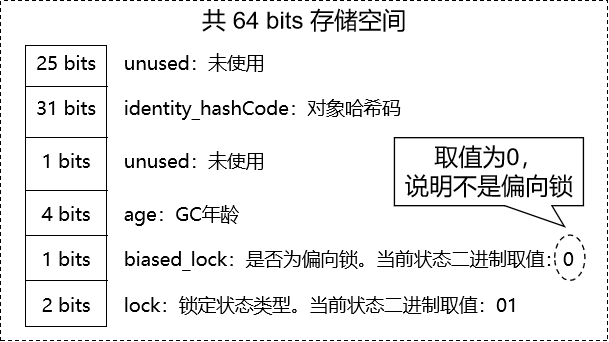


### ②偏向锁状态


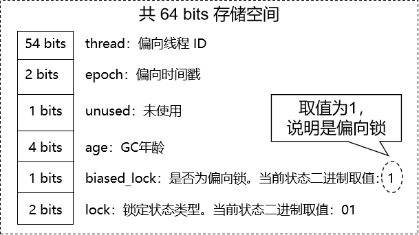


### ③轻量级锁状态


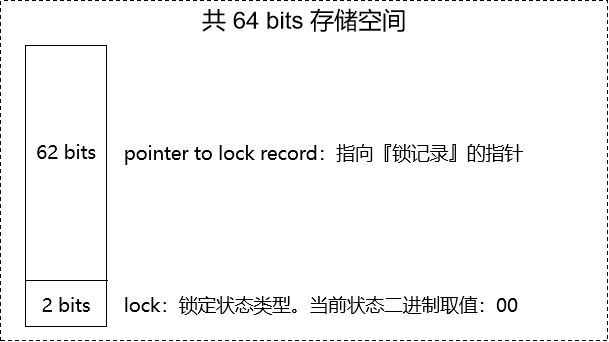


### ④重量级锁状态
这里我们看到了下一个非常重要的数据：指向**对象监视器**的指针。当前对象是由哪一个线程所锁定就是由这个对象监视器来记录的。


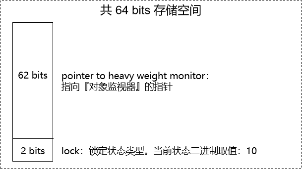


### ⑤GC 状态


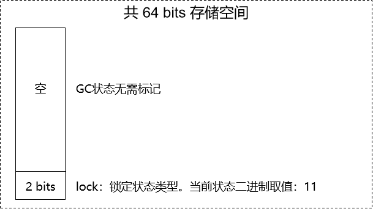


## 3、对象监视器
从上面的介绍中我们发现：当锁状态膨胀为『重量级锁』时，Mark Word 中有一个指针指向一个特殊的对象——对象监视器。这个对象是由 C++ 开发的，原名 ObjectMonitor。
### ①锁对象和对象监视器之间的关系
假设有如下代码：


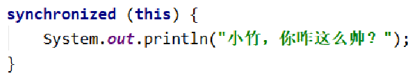


其中 this 就是我们这里所说的锁对象。而就是通过这个锁对象的对象头，我们一步一步找到了它关联的 ObjectMonitor 对象监视器对象。


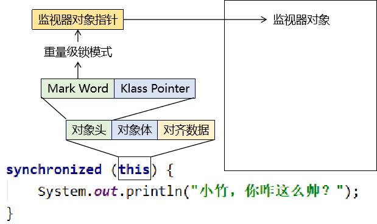


### ②监视器对象结构
```cpp
ObjectMonitor() {
    _header       = NULL;
    _count        = 0;  // 锁计数器
    _waiters      = 0;
    _recursions   = 0; // 锁的重入次数
    _object       = NULL;
    _owner        = NULL; // 指向持有 ObjectMonitor 对象的线程
    _WaitSet      = NULL; // 处于 wait 状态的线程，会被加入到 _WaitSet（等待队列）
    _WaitSetLock  = 0 ;
    _Responsible  = NULL ;
    _succ         = NULL ;
    _cxq          = NULL ;
    FreeNext      = NULL ;
    _EntryList    = NULL ; // 处于等待锁 block 状态的线程，会被加入到该列表（阻塞队列）
    _SpinFreq     = 0 ;
    _SpinClock    = 0 ;
    OwnerIsThread = 0 ;
  }
```
# 第三节 加锁和解锁流程
## 1、monitorenter 指令和 monitorexit 指令
为什么重量级锁能够通过锁对象把线程锁住呢？这里需要看看 **monitorenter** 和 **monitorexit** 这两个指令。那这两个指令是从哪来的呢？
### ①字节码指令分析
首先假定我们有如下代码：
```java
public class Demo06CodeTest {
    
    public void doSth() {

        synchronized (this) {
            System.out.println("Hello");
        }
        
    }

}
```
然后编译：
`javac Demo06CodeTest.java`
然后针对字节码文件执行 javap 分析：
`javap -c Demo06CodeTest.class`


分析结果如下：
```
Compiled from “Demo06CodeTest.java”
public class com.atguigu.thread.demo.Demo06CodeTest {
public com.atguigu.thread.demo.Demo06CodeTest();
Code:
0: aload_0
1: invokespecial #1 // Method java/lang/Object."": ()V
4: return

public void doSth();
Code:
0: aload_0
1: dup
2: astore_1
3: **monitor\**\**enter**
4: getstatic #2 // Field java/lang/System.out:Ljava/io/PrintStream;
7: ldc #3 // String Hello
9: invokevirtual #4 // Method java/io/PrintStream.println:(Ljava/lang/String;)V
12: aload_1
13: **monitor\**\**exit**
14: goto 22
17: astore_2
18: aload_1
19: **monitor\**\**exit**
20: aload_2
21: athrow
22: return
Exception table:
from to target type
4 14 17 any
17 20 17 any
}
```


### ②对应关系
这里的对应关系只是辅助我们理解，很显然代码实际执行时并不是遇到 synchronized 就执行 monitorenter，毕竟线程先要拿到锁才能加注解的锁。


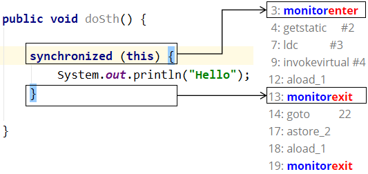


### ③执行过程
当线程在执行代码的过程中遇到了 synchronized，接下来它会这样做：
#### [1] 根据锁对象找到对象监视器
不管是同步方法还是同步代码块，一定有一个锁对象，这个咱们前面说过了。


#### [2] 加锁或阻塞


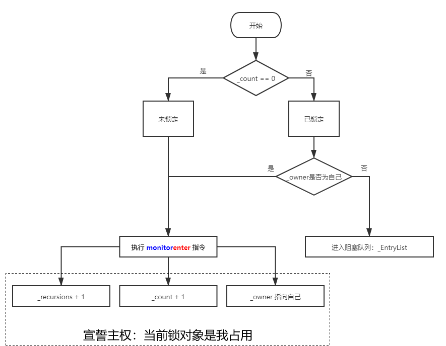


#### [3] 执行代码
即使是被阻塞了也还是会有机会得到锁，得到锁之后当然就是执行同步代码了。代码执行完成就要把锁释放掉。
#### [4] 释放锁
执行 **monitorexit** 指令：
- _count - 1
  - 如果 - 1 后 _count 为零则擦除 _owner
- _recursions - 1
## 2、可重入性
在刚才的分析中不知大家是否会提出一个疑问：为什么在 _count 大于零表示当前对象已锁定时，通过 _owner 能看到是自己锁定的呢？这肯定是因为自己曾经进来过，现在至少是第二次进来了。看下面的例子：
```java
synchronized (this) {
    
    synchronized (this) {
        // ...
    }
    
}
```
从一个同步代码块又进入下一个同步代码块，这种现象我们称之为：『重入』。而多线程执行过程中如果不支持∶『可重入』，那将会发生死锁的问题。
### ①假设不支持可重入
自己把自己锁住：陷入死循环。


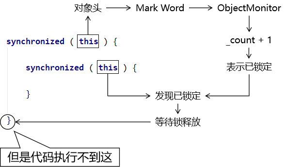


### ②可重入性
所以线程执行时必须支持可重入性。所谓可重入性就是指：一个线程在获得锁之后如果再次进入同步代码，那么对于由它自己锁定的对象可以直接获得锁。具体来说就是：
- _owner 保持指向当前线程不变
- _count 继续 + 1
- _recursions 继续 + 1
而当内层的 synchronized 需要释放锁时执行：
- _owner 保持指向当前线程不变
- _count - 1
- _recursions - 1
当最外层的 synchronized 需要释放锁时执行：
- _owner 擦除
- _count - 1，让 _count 回到 0
- _recursions - 1，让 _recursions 回到 0
结论：**可重入性就是指一个线程可以直接获得它自己加的锁**。大家要理解这个概念。
### ③如果内外锁对象不同
各自执行各自的加锁流程
- 拿到锁就执行同步代码块
  - 没拿到锁就阻塞


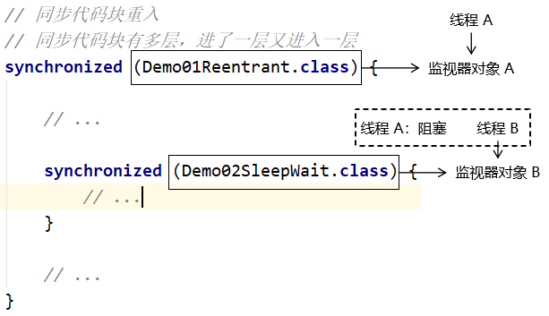


### ④内外锁对象不同导致死锁的例子
两个线程分别进入 if 分支和 else 分支：
```java
//进行化妆
public  void  makeup() throws InterruptedException {
    if (choice==0){ //为0时先获得了口红
        //这里获得了口红后,除非获得了镜子,否则不释放口红锁
        synchronized (lipstick){
            System.out.println(name+"获得了口红");
            Thread.sleep(1000);
            synchronized (mirror){
                System.out.println(name+"获得了镜子");
            }
        }


    }else {
        //这里获得了镜子后,除非获得了口红,否则不释放镜子锁
        synchronized (mirror){
            System.out.println(name+"获得了镜子");
            Thread.sleep(2000);
            synchronized (lipstick){
                System.out.print(name+"获得了口红");
            }
        }
    }
}
```
## 3、补充问题：为什么 monitorexit 出现两次？


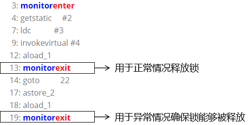


## 4、使用 ClassLayout 查看锁标记状态
本节是通过实际程序的运行来辅助大家理解，不做强制要求。我们这里演示效果的测试环境是：


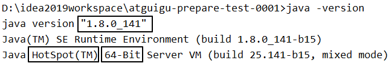


### ①依赖信息
```xml
<dependency>
    <groupId>org.openjdk.jol</groupId>
    <artifactId>jol-core</artifactId>
    <version>0.16</version>
</dependency>
```
### ②核心代码
```java
// lockObject 是一个锁对象
System.out.println(ClassLayout.parseInstance(lockObject).toPrintable());
```
### ③测试代码
```java
// 创建锁对象（main 方法中没有 this，所以自己创建）
Object lockObject = new Object();

// 直接打印对象结构
System.out.println(Thread.currentThread().getName() + " " + ClassLayout.parseInstance(lockObject).toPrintable());

// 加同步代码块，再次打印对象结构
synchronized (lockObject) {
    System.out.println(Thread.currentThread().getName() + " " + ClassLayout.parseInstance(lockObject).toPrintable());
}

// 开启一个新的线程申请锁
new Thread(()->{
    synchronized (lockObject) {
        while (true) {
            try {TimeUnit.SECONDS.sleep(2);} catch (InterruptedException e) {}

            // 在同步代码块内打印对象结构
            System.out.println(Thread.currentThread().getName() + " " + ClassLayout.parseInstance(lockObject).toPrintable());
        }
    }
}, "AAA").start();

try {
    // 这里等待一会儿是为了让 AAA 线程先在较低的锁级别执行一段时间
    TimeUnit.SECONDS.sleep(3);
} catch (InterruptedException e) {
    e.printStackTrace();
}

// 开启一个新的线程申请锁
new Thread(()->{
    synchronized (lockObject) {
        // 新建一个 BBB 线程是为了竞争锁，
        // 但是由于 AAA 线程是 while (true) 执行，永远不会释放锁
        // 所以 BBB 线程内部什么都不用做，只要去竞争就能让 AAA 线程的锁膨胀
    }
}, "BBB").start();
```
### ④膨胀过程
| 标识符       | 含义     |
| ------------ | -------- |
| non-biasable | 不可偏向 |
| biasable     | 可偏向   |
| biased       | 已偏向   |
| thin lock    | 轻量级锁 |
| fat lock     | 重量级锁 |
#### [1] 未开启偏向锁功能
main java.lang.Object object internals:
OFF SZ TYPE DESCRIPTION VALUE
0 8 (object header: mark) 0x0000000000000001 (**non-biasable**; age: 0)
8 4 (object header: class) 0xf80001e5
12 4 (object alignment gap)
Instance size: 16 bytes
Space losses: 0 bytes internal + 4 bytes external = 4 bytes total

main java.lang.Object object internals:
OFF SZ TYPE DESCRIPTION VALUE
0 8 (object header: mark) 0x000000000288f4f8 (**thin lock**: 0x000000000288f4f8)
8 4 (object header: class) 0xf80001e5
12 4 (object alignment gap)
Instance size: 16 bytes
Space losses: 0 bytes internal + 4 bytes external = 4 bytes total

AAA java.lang.Object object internals:
OFF SZ TYPE DESCRIPTION VALUE
0 8 (object header: mark) 0x00000000234bf2d8 (**thin lock**: 0x00000000234bf2d8)
8 4 (object header: class) 0xf80001e5
12 4 (object alignment gap)
Instance size: 16 bytes
Space losses: 0 bytes internal + 4 bytes external = 4 bytes total

AAA java.lang.Object object internals:
OFF SZ TYPE DESCRIPTION VALUE
0 8 (object header: mark) 0x0000000002b8c46a (**fat lock**: 0x0000000002b8c46a)
8 4 (object header: class) 0xf80001e5
12 4 (object alignment gap)
Instance size: 16 bytes
Space losses: 0 bytes internal + 4 bytes external = 4 bytes total
#### [2] 开启偏向锁功能
##### (1) 设置 JVM 参数
**-XX:+UseBiasedLocking**
**-XX:BiasedLockingStartupDelay=0**
- -XX:+UseBiasedLocking 表示开启偏向锁功能
- -XX:BiasedLockingStartupDelay=0 表示延迟开启偏向锁功能的时间为 0
##### (2) 代码运行效果
main java.lang.Object object internals:
OFF SZ TYPE DESCRIPTION VALUE
0 8 (object header: mark) 0x0000000000000005 (**biasable**; age: 0)
8 4 (object header: class) 0xf80001e5
12 4 (object alignment gap)
Instance size: 16 bytes
Space losses: 0 bytes internal + 4 bytes external = 4 bytes total

main java.lang.Object object internals:
OFF SZ TYPE DESCRIPTION VALUE
0 8 (object header: mark) 0x00000000025ee005 (**biased**: 0x00000000000097b8; epoch: 0; age: 0)
8 4 (object header: class) 0xf80001e5
12 4 (object alignment gap)
Instance size: 16 bytes
Space losses: 0 bytes internal + 4 bytes external = 4 bytes total

AAA java.lang.Object object internals:
OFF SZ TYPE DESCRIPTION VALUE
0 8 (object header: mark) 0x00000000236bf568 (**thin lock**: 0x00000000236bf568)
8 4 (object header: class) 0xf80001e5
12 4 (object alignment gap)
Instance size: 16 bytes
Space losses: 0 bytes internal + 4 bytes external = 4 bytes total

AAA java.lang.Object object internals:
OFF SZ TYPE DESCRIPTION VALUE
0 8 (object header: mark) 0x0000000020e2e17a (**fat lock**: 0x0000000020e2e17a)
8 4 (object header: class) 0xf80001e5
12 4 (object alignment gap)
Instance size: 16 bytes
Space losses: 0 bytes internal + 4 bytes external = 4 bytes total
## 5、小结


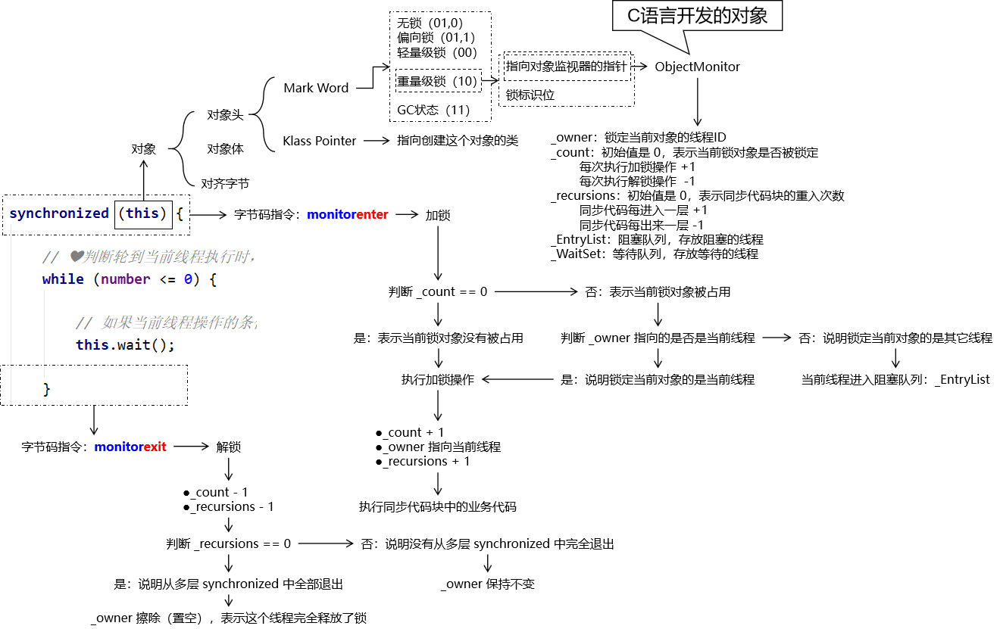