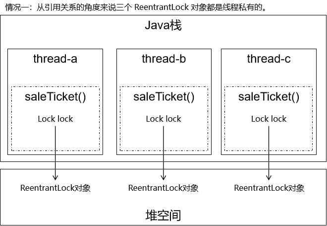
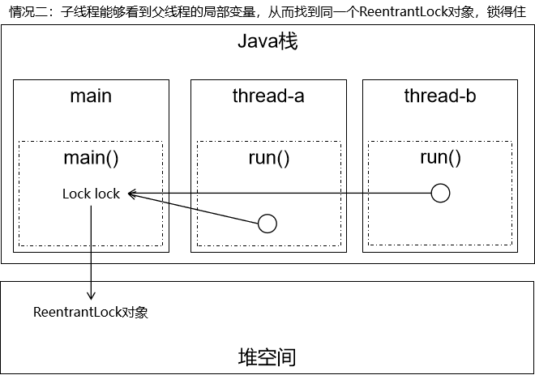
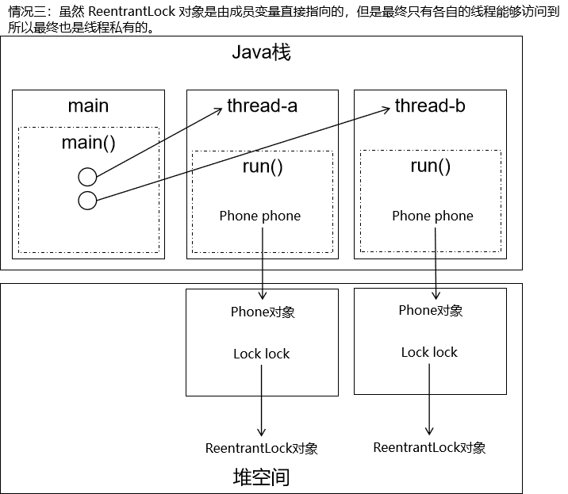
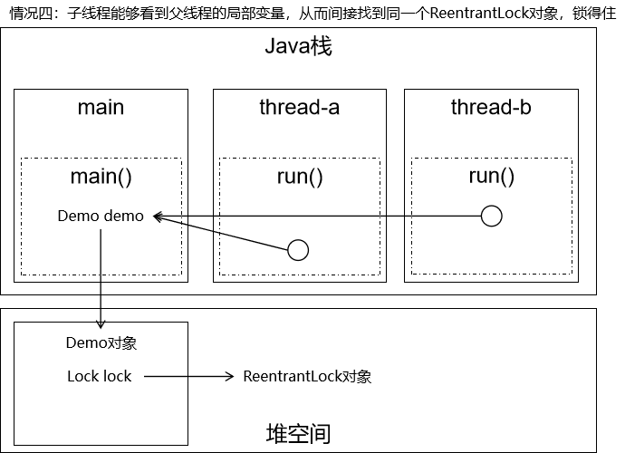
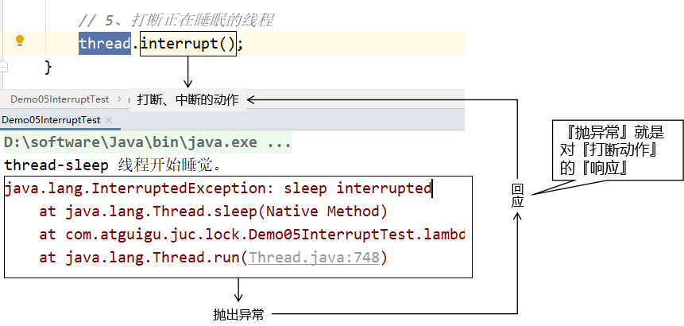
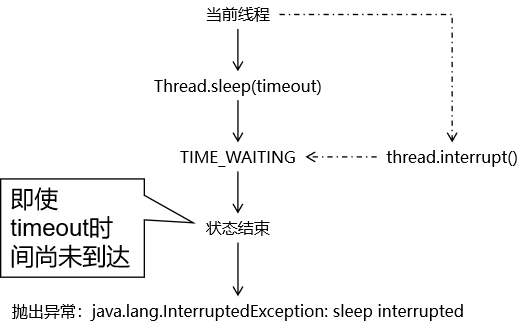
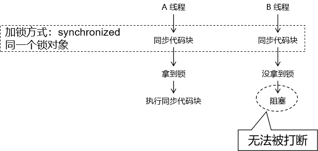
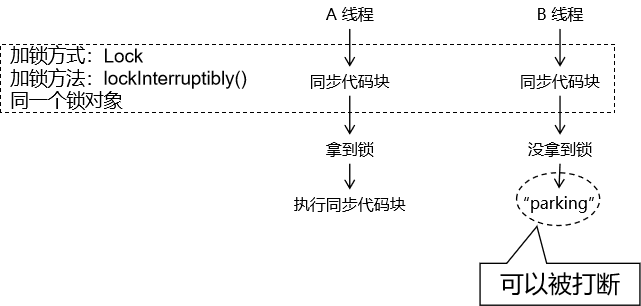

# 第一节 HelloWorld
## 1、卖票
```java
public class Demo01HelloWorld {

    // 声明成员变量维护票库存
    private int stock = 100;

    // 创建锁对象
    // 变量类型：java.util.concurrent.locks.Lock 接口
    // 对象类型：Lock 接口的最常用的实现类 ReentrantLock
    private Lock lock = new ReentrantLock();

    // 声明卖票的方法
    public void saleTicket() {
        try {
            // 加锁
            lock.lock(); // synchronized (this) {

            if (stock > 0) {
                // 卖票的核心操作
                System.out.println(Thread.currentThread().getName() + " 卖了一张，还剩 " + --stock + " 张票。");
            } else {
                System.out.println(Thread.currentThread().getName() + " 卖完了。");
            }

        } catch (Exception e) {
            e.printStackTrace();
        } finally {
            // 解锁
            lock.unlock(); // }
        }
    }

    public static void main(String[] args) {

        // 1、创建当前类对象
        Demo01HelloWorld demo = new Demo01HelloWorld();
        // 2、开启三个线程调用卖票方法
        new Thread(()->{
            for (int i = 0; i < 40; i++) {
                demo.saleTicket();
                try {
                    TimeUnit.SECONDS.sleep(1);} catch (InterruptedException e) {}
            }
        }, "thread-01").start();

        new Thread(()->{
            for (int i = 0; i < 40; i++) {
                demo.saleTicket();
                try {
                    TimeUnit.SECONDS.sleep(1);} catch (InterruptedException e) {}
            }
        }, "thread-02").start();

        new Thread(()->{
            for (int i = 0; i < 40; i++) {
                demo.saleTicket();
                try {
                    TimeUnit.SECONDS.sleep(1);} catch (InterruptedException e) {}
            }
        }, "thread-03").start();
    }

}
```
## 2、需要注意的点
### ①确保锁被释放
使用 Lock API 实现同步操作，是一种面向对象的编码风格。这种风格有很大的灵活性，同时可以在常规操作的基础上附加更强大的功能。但是也要求编写代码更加谨慎：**如果忘记调用 lock.unlock() 方法则锁不会被释放，从而造成程序运行出错**。
### ②加锁和解锁操作对称执行
不管同步操作是一层还是多层，有多少个加锁操作，就应该相应的有多少个解锁操作。
### ③避免锁对象的线程私有化
锁对象如果是线程内部自己创建的，而且是自己独占的，其它线程访问不到这个对象，那么这个锁将无法实现 **『排他』** 效果，说白了就是：锁不住。
#### [1] 情况一局部变量：线程私有
代码片段如下：
```java
    // 声明一个方法卖票
    public void saleTicket() {

        // 锁对象的线程私有化问题：在线程内部，让每个线程自己创建自己的锁。
        // 对其它线程无法产生排他性的互斥效果：锁不住，监守自盗。
        Lock lock = new ReentrantLock();
```
内存分析如下：





#### [2] 情况二局部变量：线程共享
代码片段如下：
```java
public static void main(String[] args) {

    // 场景一：局部变量被多个线程共享
    // 此时其实是锁得住的。
    Lock lock = new ReentrantLock();

    new Thread(()->{
        lock.lock();
    }, "thread-a").start();

    new Thread(()->{
        lock.lock();
    }, "thread-b").start();

}
```
内存分析如下：





#### [3] 情况三成员变量：线程私有
代码片段如下：
```java
class Phone {

    private Lock lock = new ReentrantLock();

    public void sendShortMessage() {
        lock.lock();
        System.out.println(lock.hashCode());
    }

    public static void main(String[] args) {
        new Thread(()->{
            Phone phone = new Phone();
            phone.sendShortMessage();
        },"thread-a").start();

        new Thread(()->{
            Phone phone = new Phone();
            phone.sendShortMessage();
        },"thread-a").start();
    }
}
```
内存分析如下：





#### [4] 情况四成员变量：线程共享
代码片段如下：
```java
public class Demo01HelloWorld {

    // 声明成员变量保存票的库存
    private int stock = 100;

    // 声明成员变量维护 Lock 锁对象
    private Lock lock = new ReentrantLock();
```
```java
    public static void main(String[] args) {

        // 1、创建当前类的对象
        Demo01HelloWorld demo = new Demo01HelloWorld();
```
内存分析如下：





#### [5] 小结
- 使用 Lock 对象实现同步锁，要求各个线程使用的是同一个对象。

- 那么各个线程它们使用的是不是同一个 ReentrantLock 对象，不能看表面。

  - 表面现象 1：使用局部变量指向 ReentrantLock 对象。
  - 表面现象 2：使用成员变量指向 ReentrantLock 对象。

- 本质：根据一系列引用的链条最终找的的 ReentrantLock 对象是不是

  堆空间中的同一个对象

  - 是：锁得住。
  - 否：锁不住。
# 第二节 Lock 接口
全类名：`java.util.concurrent.locks.Lock`
方法功能说明：

| 方法名                                    | 功能                                                         |
| ----------------------------------------- | ------------------------------------------------------------ |
| void lock()                               | 加同步锁                                                     |
| void unlock()                             | 解除同步锁                                                   |
| boolean tryLock()                         | 尝试获取锁 返回 true：表示获取成功 返回 false：表示获取失败  |
| boolean tryLock(long time, TimeUnit unit) | 尝试获取锁，且等待指定时间 返回 true：表示获取成功 返回 false：表示获取失败 |
| void lockInterruptibly()                  | 以『支持响应中断』的模式获取锁                               |
| Condition newCondition();                 | 获取用于线程间通信的 Condition 对象                          |
# 第三节 可[重入锁](https://so.csdn.net/so/search?q=重入锁&spm=1001.2101.3001.7020)
全类名：java.util.concurrent.locks.**ReentrantLock**
## 1、基本用法
- 基本要求 1：将解锁操作放在 finally 块中，确保解锁操作能够被执行到。
- 基本要求 2：加锁和解锁操作要对称。
```java
try {
    // 加锁
    lock.lock();
    // 同步代码部分
} catch(Exception e) {
    // ...
} finally {
    // 解锁
    lock.unlock();
}
```
## 2、验证可重入性
```java
// 声明卖票的方法
public void saleTicket() {

    try {
        // 加锁
        lock.lock(); // synchronized (this) {
        if (stock > 0) {
            // 卖票的核心操作
            System.out.println(Thread.currentThread().getName() + " 卖了一张，还剩 " + --stock + " 张票。");

            // ❤❤❤❤❤❤❤❤❤❤❤可重入性验证❤❤❤❤❤❤❤❤❤❤❤
            this.showMessage();
        } else {
            System.out.println(Thread.currentThread().getName() + " 卖完了。");
        }

    } catch (Exception e) {
        e.printStackTrace();
    } finally {
        // 解锁
        lock.unlock(); // }
    }
}

// ❤❤❤❤❤❤❤❤❤❤❤可重入性验证❤❤❤❤❤❤❤❤❤❤❤
public void showMessage() {

    try {
        lock.lock();
        System.out.println(Thread.currentThread().getName() + " is working");
    } catch (Exception e) {
        e.printStackTrace();
    } finally {
        lock.unlock();
    }
}
```
## 3、接口定义：tryLock()
```java
public class Demo03TryLock {

    private Lock lock = new ReentrantLock();

    public void showMessage() {

        boolean lockResult = false;

        try {

            // 尝试获取锁
            // 返回true：获取成功
            // 返回false：获取失败
            lockResult = lock.tryLock();

            if (lockResult) {
                try {
                    TimeUnit.SECONDS.sleep(1);} catch (InterruptedException e) {}
                System.out.println(Thread.currentThread().getName() + " 得到了锁，正在工作");
            } else {
                System.out.println(Thread.currentThread().getName() + " 没有得到锁");
            }

        }catch (Exception e){
            e.printStackTrace();
        }finally {

            // 如果曾经得到了锁，那么就解锁
            if (lockResult) {
                lock.unlock();
            }

        }

    }

    public static void main(String[] args) {

        // 1、创建多个线程共同操作的对象
        Demo03TryLock demo = new Demo03TryLock();

        // 2、创建三个线程
        new Thread(()->{

            for(int i = 0; i < 20; i++) {
                try {TimeUnit.SECONDS.sleep(1);} catch (InterruptedException e) {}
                demo.showMessage();
            }
        }, "thread-01").start();

        new Thread(()->{

            for(int i = 0; i < 20; i++) {
                try {TimeUnit.SECONDS.sleep(1);} catch (InterruptedException e) {}
                demo.showMessage();
            }

        }, "thread-02").start();

        new Thread(()->{

            for(int i = 0; i < 20; i++) {
                try {TimeUnit.SECONDS.sleep(1);} catch (InterruptedException e) {}
                demo.showMessage();
            }

        }, "thread-03").start();
    }

}
```
## 4、接口定义：tryLock(time, timeUnit)
```java
public class Demo04TryLockWithTime {
    private Lock lock = new ReentrantLock();

    // 得到锁之后占用 5 秒
    public void useLock() {
        try {
            lock.lock();
            System.out.println(Thread.currentThread().getName() + " 开始工作");
            try {TimeUnit.SECONDS.sleep(5);} catch (InterruptedException e) {}
            System.out.println(Thread.currentThread().getName() + " 结束工作");

        } catch (Exception e) {
            e.printStackTrace();
        } finally {
            lock.unlock();
        }
    }

    // 在尝试获取锁的过程中，可以等待一定时间
    public void waitLock() {
        boolean lockResult = false;

        try {
		   //不带超时时间的方式
            //lockResult  = lock.tryLock();
            // 尝试获取锁，并指定了等待时间
            lockResult = lock.tryLock(3, TimeUnit.SECONDS);

            if (lockResult) {
                System.out.println(Thread.currentThread().getName() + " 得到了锁，开始工作");
            } else {
                System.out.println(Thread.currentThread().getName() + " 没有得到锁");
            }

        }catch (Exception e){
            e.printStackTrace();
        }finally {
            if (lockResult) {
                lock.unlock();
            }
        }

    }

    public static void main(String[] args) {

        // 1、创建当前类对象
        Demo04TryLockWithTime demo = new Demo04TryLockWithTime();

        // 2、创建 A 线程占用锁
        new Thread(()->{
            demo.useLock();
        }, "thread-a").start();

        // 3、创建 B 线程尝试获取锁
        new Thread(()->{
            demo.waitLock();
        }, "thread-b").start();
    }
}
```
## 5、实现类提供：公平锁
### ①概念
在 ReentrantLock 构造器中传入 boolean 类型的参数：
- true：创建公平锁（在锁上等待最长时间的线程有最高优先级）
- false：创建非公平锁
```java
    public ReentrantLock(boolean fair) {
        sync = fair ? new FairSync() : new NonfairSync();
    }
```
### ②代码
```java
public class Demo05FairLock {

    private Lock lock = new ReentrantLock(true);

    public void printMessage() {

        try {

            lock.lock();

            System.out.println(Thread.currentThread().getName() + " say hello to you");

            try {TimeUnit.SECONDS.sleep(1);} catch (InterruptedException e) {}

        }catch (Exception e) {
            e.printStackTrace();
        }finally {
            lock.unlock();
        }

    }

    public static void main(String[] args) {

        // 1、创建当前类的对象
        Demo05FairLock demo = new Demo05FairLock();

        // 2、创建三个线程，每个线程内调用 printMessage() 方法十次
        new Thread(()->{

            for (int i = 0; i < 10; i++) {
                demo.printMessage();
            }

        }, "thread-a").start();

        new Thread(()->{

            for (int i = 0; i < 10; i++) {
                demo.printMessage();
            }

        }, "thread-b").start();

        new Thread(()->{

            for (int i = 0; i < 10; i++) {
                demo.printMessage();
            }

        }, "thread-c").start();


    }

}
```
### ③使用建议
- 公平锁对线程操作的吞吐量有限制，效率上不如非公平锁。
- 如果没有特殊需要还是建议使用默认的非公平锁。
## 6、接口定义：lockInterruptibly()
TIP
lock：动词，加锁的动作
Interruptibly：修饰动词的副词，表示可以被打断
组合起来的含义：以可以被打断的方式加锁。具体来说就是如果线程是被 lockInterruptibly() 加的锁给阻塞的，那么这个阻塞状态可以被打断。

### ①响应中断
响应中断这个概念，我们这么解释：





下图描述的是一个最基本的响应中断状态：





默认情况下，对于调用了 sleep() 方法进入 TIME_WAITING 状态的线程，可以通过调用 interrupt() 方法打断。对此我们可以说：线程的 TIME_WAITING 状态支持响应中断。
```java
public static void main(String[] args) {

        // 1、创建线程对象
        Thread thread = new Thread(() -> {

            // 2、进入睡眠状态
            try {
                System.out.println(Thread.currentThread().getName() + " 开始睡了");

                // 概念：这个睡觉的状态能够被打断，那么我们就说这个状态支持响应中断
                Thread.sleep(20000);
                System.out.println(Thread.currentThread().getName() + " 睡醒了");
            } catch (InterruptedException e) {
                e.printStackTrace();
            }

        });

        // 3、启动线程
        thread.start();

        // 4、等一会儿再去打断
        try {TimeUnit.SECONDS.sleep(5);} catch (InterruptedException e) {}

        // 5、调用 interrupt() 方法打断线程的 TIME_WAITING 状态
        thread.interrupt();
    }
```
线程被打断后会抛出异常：


### ②synchronized 方式下的阻塞状态无法被打断
结论：synchronized 导致的 blocked 状态`不支持`响应中断。





```java
public static void main(String[] args) {

        // 1、创建一个对象作为锁对象
        Object lock = new Object();

        // 2、创建一个线程长期占用锁
        new Thread(()->{
            synchronized (lock) {
                while (true) {}
            }
        }, "thread-a").start();

        try {TimeUnit.SECONDS.sleep(1);} catch (InterruptedException e) {}

        // 3、创建一个线程尝试获取锁
        Thread thread = new Thread(() -> {
            System.out.println(Thread.currentThread().getName() + " 开始痴痴的等待锁 。。。");
            synchronized (lock) {
                // ...
            }
        }, "thread-b");

        // 4、启动线程
        thread.start();

        try {TimeUnit.SECONDS.sleep(3);} catch (InterruptedException e) {}

        // 5、尝试打断当前线程的阻塞状态
        // 程序运行效果：blocked 状态无法被打断，也可以说——由 synchronized 造成的阻塞状态不支持响应中断
        System.out.println("调用 thread.interrupt() 方法之前");
        // 尝试打断
        thread.interrupt();
        System.out.println("调用 thread.interrupt() 方法之后");

    }
```
点击快照可以看到 thread-a 处于 RUNNABLE 状态，thread-b 一直处于 CLOCKED 阻塞状态


### ③lockInterruptibly()





lockInterruptibly() 方法表示获取锁但是没有得到的时候，在阻塞中等待其它线程释放锁的过程中，可以被打断。
```java
public class Demo07LockInterruptibly {

    private Lock lock = new ReentrantLock();

    // 小强：持续占用锁。
    public void useLock() {
        try {
            lock.lock();
            while (true) {
                System.out.println(Thread.currentThread().getName() + " 正在占用锁");
                try {TimeUnit.SECONDS.sleep(1);} catch (InterruptedException e) {}
            }
        }finally {
            lock.unlock();
        }
    }

    // 小明：痴痴地等待小强释放锁
    public void waitLock() {
        System.out.println(Thread.currentThread().getName() + " 线程启动了");

        try {
            // 通过 lockInterruptibly() 方法获取锁，在没有获取到锁的阻塞过程中可以被打断
            lock.lockInterruptibly();
            // ...
        }finally {
            lock.unlock();
        }

        System.out.println(Thread.currentThread().getName() + " 线程结束了");

    }

    public static void main(String[] args) {

        // 1、创建当前类对象
        Demo07LockInterruptibly demo = new Demo07LockInterruptibly();

        // 2、创建占用锁的线程（小强）
        new Thread(()->{
            demo.useLock();
        }, "thread-qiang").start();

        Thread thread = new Thread(() -> {
            demo.waitLock();
        }, "thread-ming");
        thread.start();

        try {TimeUnit.SECONDS.sleep(3);} catch (InterruptedException e) {}

        // 打断小明线程的阻塞状态
        thread.interrupt();
    }
}
```
# 第四节 [读写锁](https://so.csdn.net/so/search?q=读写锁&spm=1001.2101.3001.7020)
## 1、读写锁介绍
### ①概念
在实际场景中，读操作不会改变数据，所以应该允许多个线程同时读取共享资源；但是如果一个线程想去写这些共享资源，就不应该允许其他线程对该资源进行读和写的操作了。
针对这种场景，Java 的并发包提供了读写锁 **ReentrantReadWriteLock**，它表示两个锁，一个是**读**操作相关的锁，称为**读锁**，这是一种**共享锁**；一个是**写**相关的锁，称为**写锁**，这是一种**排他锁**，也叫**独占锁**、**互斥锁**。

### ②进入条件
#### [1] 进入读锁的条件
- 同一个线程内（可重入性角度）：
  - 目前无锁：可以进入
  - 已经有读锁：可以进入
  - **已经有写锁：可以进入（锁可以降级，权限可以收缩）**
- 不同线程之间（排他性角度）：
  - 其他线程已经加了读锁：可以进入
  - **其他线程已经加了写锁：不能进入**
#### [2] 进入写锁的条件
- 同一个线程内（可重入性角度）：
  - 目前无锁：可以进入
  - **已经有读锁：不能进入（锁不能升级，权限不拿扩大）**
  - 已经有写锁：可以进入
- 不同线程之间（排他性角度）：
  - **其他线程已经加了读锁：不能进入**
  - **其他线程已经加了写锁：不能进入**
### ③重要特性
#### [1] 公平选择性
支持非公平（默认）和公平的锁获取方式，吞吐量还是非公平优于公平。
#### [2] 重进入
读锁和写锁都支持线程重进入：
- 同一个线程：加读锁后再加读锁
- 同一个线程：加写锁后再加写锁
#### [3] 锁降级
在同一个线程内：读锁不能升级为写锁，但是写锁可以降级为读锁。
## 2、ReadWriteLock 接口
全类名：java.util.concurrent.locks.ReadWriteLock
源码如下：
```java
public interface ReadWriteLock {
    /**
     * Returns the lock used for reading.
     *
     * @return the lock used for reading.
     */
    Lock readLock();

    /**
     * Returns the lock used for writing.
     *
     * @return the lock used for writing.
     */
    Lock writeLock();
}
```
`readLock() 方法用来获取读锁`，`writeLock() 方法用来获取写锁`。也就是说将文件的读写操作分开，分成两种不同的锁来分配给线程，从而使得多个线程可以同时进行读操作。
该接口下我们常用的实现类是：`java.util.concurrent.locks.ReentrantReadWriteLock`

## 3、ReentrantReadWriteLock 和 Lock 的关系


## 4、ReentrantReadWriteLock 类的整体结构
```java
public class ReentrantReadWriteLock implements ReadWriteLock, java.io.Serializable {

    /** 读锁 */
    private final ReentrantReadWriteLock.ReadLock readerLock;

    /** 写锁 */
    private final ReentrantReadWriteLock.WriteLock writerLock;

    final Sync sync;

    /** 使用默认（非公平）的排序属性创建一个新的 ReentrantReadWriteLock */
    public ReentrantReadWriteLock() {
        this(false);
    }

    /** 使用给定的公平策略创建一个新的 ReentrantReadWriteLock */
    public ReentrantReadWriteLock(boolean fair) {
        sync = fair ? new FairSync() : new NonfairSync();
        readerLock = new ReadLock(this);
        writerLock = new WriteLock(this);
    }

    /** 返回用于写入操作的锁 */
    public ReentrantReadWriteLock.WriteLock writeLock() { return writerLock; }

    /** 返回用于读取操作的锁 */
    public ReentrantReadWriteLock.ReadLock  readLock()  { return readerLock; }

    abstract static class Sync extends AbstractQueuedSynchronizer {}

    static final class NonfairSync extends Sync {}

    static final class FairSync extends Sync {}

    public static class ReadLock implements Lock, java.io.Serializable {}

    public static class WriteLock implements Lock, java.io.Serializable {}
}
```
ReentrantReadWriteLock 中有五个内部类，五个内部类之间也是相互关联的。内部类的关系如下图所示。


- Sync 继承自 AQS
- NonfairSync 和 FairSync 是 Sync 类的子类
- ReadLock 和 WriteLock 实现了 Lock 接口
总体结构图：


## 5、效果对比
### ①情景设定
多个线程对同一个数据执行读操作。
### ②synchronized 方式
#### [1] 测试代码
```java
public synchronized void readOperation() {
    for (int i = 0; i < 5; i++) {
        try {
            TimeUnit.SECONDS.sleep(1);} catch (InterruptedException e) {}
        System.out.println(Thread.currentThread().getName() + " is reading");
    }
}

public static void main(String[] args) {

    ReadWriteLockDemo01 demo = new ReadWriteLockDemo01();

    for (int i = 0; i < 5; i++) {
        new Thread(()->{
            demo.readOperation();
        }, "thread" + i).start();
    }

}
```
#### [2] 执行效果
每个线程都必须拿到锁才可以执行：
thread**0** is reading
thread**0** is reading
thread**0** is reading
thread**0** is reading
thread**0** is reading
thread**4** is reading
thread**4** is reading
thread**4** is reading
thread**4** is reading
thread**4** is reading
thread**3** is reading
thread**3** is reading
thread**3** is reading
thread**3** is reading
thread**3** is reading
thread**2** is reading
thread**2** is reading
thread**2** is reading
thread**2** is reading
thread**2** is reading
thread**1** is reading
thread**1** is reading
thread**1** is reading
thread**1** is reading
thread**1** is reading
### ③ReentrantReadWriteLock 方式
#### [1] 测试代码
```java
private ReentrantReadWriteLock lock = new ReentrantReadWriteLock();
private ReentrantReadWriteLock.ReadLock readLock = lock.readLock();

public void readOperation() {
    try {
        readLock.lock();
        for (int i = 0; i < 5; i++) {
            TimeUnit.SECONDS.sleep(1);
            System.out.println(Thread.currentThread().getName() + " is reading");
        }
    } catch (InterruptedException e) {
    } finally {
        readLock.unlock();
    }
}

public static void main(String[] args) {

    ReadWriteLockDemo01 demo = new ReadWriteLockDemo01();

    for (int i = 0; i < 5; i++) {
        new Thread(() -> {
            demo.readOperation();
        }, "thread" + i).start();
    }

}
```
#### [2] 执行效果
读锁允许各个线程交替执行，大大提升了效率：
thread**0** is reading thread**2** is reading thread**3** is reading thread**4** is reading thread**1** is reading thread**2** is reading thread**1** is reading thread**4** is reading

……
TIP
注意：
- 如果有一个线程已经占用了读锁，则此时其他线程如果要申请写锁，则申请写锁的线程会一直等待释放读锁。
- 如果有一个线程已经占用了写锁，则此时其他线程如果申请写锁或者读锁，则申请的线程会一直等待释放写锁。
## 6、典型案例
### ①情景设定
使用 ReentrantReadWriteLock 进行读和写操作

|        | 操作                                               | 测试目标                   |
| ------ | -------------------------------------------------- | -------------------------- |
| 场景一 | **多个线程**：同时获取读锁                         | 读锁可以共享               |
| 场景二 | **多个线程**：获取写锁                             | 写锁不能共享               |
| 场景三 | **多个线程**：一个线程先获取读锁后其他线程获取写锁 | 读排斥写                   |
| 场景四 | **多个线程**：一个线程获取写锁后其他线程获取读锁   | 写排斥读                   |
| 场景五 | **同一个线程**：获取读锁后再去获取写锁             | 读权限**不能升级**为写权限 |
| 场景六 | **同一个线程**：获取写锁后再去获取读锁             | 写权限**可以降级**为读权限 |
| 场景七 | **同一个线程**：获取读锁之后再去获取读锁           | 读锁可重入                 |
| 场景八 | **同一个线程**：获取写锁之后再去所获写锁           | 写锁可重入                 |

### ①场景一：『读』可共享
结论: 多个线程可以**同时获取读锁**
#### [1] 功能代码
```java
// 场景一：『读』可共享
class Situation01 {

    private ReentrantReadWriteLock lock = new ReentrantReadWriteLock();
    private ReentrantReadWriteLock.ReadLock readLock = lock.readLock();

    // 只要都是加读锁的操作，各个线程间不需要彼此等待，可以同时并发执行
    public void read() {

        try {
            // 加锁
            readLock.lock();
            System.out.println(Thread.currentThread().getName() + " 开始执行读操作");
            try { TimeUnit.SECONDS.sleep(1);} catch (InterruptedException e) {}
            System.out.println(Thread.currentThread().getName() + " 结束执行读操作");

        } finally {

            // 释放锁
            readLock.unlock();
        }
    }
}
```
#### [2] 测试代码
```java
// 场景一：创建 Situation01 对象
Situation01 situation01 = new Situation01();
//创建十个线程
for (int i = 0; i < 10; i++) {
    new Thread(()->{
        situation01.read();
    }, "thread" + i).start();
}
```
#### [3] 打印效果
thread0 开始执行读操作
thread1 开始执行读操作
thread2 开始执行读操作
thread3 开始执行读操作
thread4 开始执行读操作
thread5 开始执行读操作
thread6 开始执行读操作
thread7 开始执行读操作
thread8 开始执行读操作
thread9 开始执行读操作
thread6 结束执行读操作
thread7 结束执行读操作
thread8 结束执行读操作
thread9 结束执行读操作
thread2 结束执行读操作
thread3 结束执行读操作
thread4 结束执行读操作
thread0 结束执行读操作
thread5 结束执行读操作
thread1 结束执行读操作
### ②场景二：『写』互排斥
结论：多个线程同时获取写锁，同一时间**只有一个线程**能获取到**写**锁
#### [1] 功能代码
```java
// 场景二：『写』互排斥
class Situation02 {

    private ReentrantReadWriteLock lock = new ReentrantReadWriteLock();
    private ReentrantReadWriteLock.WriteLock writeLock = lock.writeLock();

    public void write() {

        try {

            writeLock.lock();
            System.out.println(Thread.currentThread().getName() + " 开始执行写操作");
            try {TimeUnit.SECONDS.sleep(1);} catch (InterruptedException e) {}
            System.out.println(Thread.currentThread().getName() + " 结束执行写操作");

            System.out.println();
        } catch (Exception e) {
            e.printStackTrace();
        } finally {

            writeLock.unlock();

        }
    }

}
```
#### [2] 测试代码
```java
// 场景二：创建 Situation02 对象
Situation02 situation02 = new Situation02();

for (int i = 0; i < 10; i++) {
    new Thread(()->{
        situation02.write();
    }).start();
}
```
#### [3] 打印效果
Thread-0 开始执行写操作
Thread-0 结束执行写操作

Thread-1 开始执行写操作
Thread-1 结束执行写操作

Thread-2 开始执行写操作
Thread-2 结束执行写操作

Thread-3 开始执行写操作
Thread-3 结束执行写操作
……
### ③场景三：『读』排斥『写』
结论：当对象具**有读**锁时，其他线程**无法加上写**锁
#### [1] 功能代码
```java
class Situation03 {

    private ReentrantReadWriteLock lock = new ReentrantReadWriteLock();
    private ReentrantReadWriteLock.ReadLock readLock = lock.readLock();
    private ReentrantReadWriteLock.WriteLock writeLock = lock.writeLock();


    // 只要都是加读锁的操作，各个线程间不需要彼此等待，可以同时并发执行
    public void read() {

        try {

            // 加锁
            readLock.lock();

            System.out.println(Thread.currentThread().getName() + " 开始执行读操作");

            TimeUnit.SECONDS.sleep(5);

            System.out.println(Thread.currentThread().getName() + " 结束执行读操作");

        } catch (Exception e) {
            e.printStackTrace();
        } finally {

            // 释放锁
            readLock.unlock();

        }

    }

    public void write() {

        try {

            writeLock.lock();

            System.out.println(Thread.currentThread().getName() + " 开始执行写操作");

            TimeUnit.SECONDS.sleep(1);

            System.out.println(Thread.currentThread().getName() + " 结束执行写操作");

            System.out.println();
        } catch (Exception e) {
            e.printStackTrace();
        } finally {

            writeLock.unlock();

        }
    }
}
```
#### [2] 测试代码
```java
// 场景三：创建 Situation03 对象
Situation03 situation03 = new Situation03();

// 创建一个线程使用读锁
new Thread(()->{
    situation03.read();
}, "thread-read").start();

// 创建三个线程使用写锁
new Thread(()->{ situation03.write(); }, "thread-write 01").start();
new Thread(()->{ situation03.write(); }, "thread-write 02").start();
new Thread(()->{ situation03.write(); }, "thread-write 03").start();
```
#### [3] 打印效果
thread-read 开始执行读操作
thread-read 结束执行读操作
thread-write 01 开始执行写操作
thread-write 01 结束执行写操作

thread-write 02 开始执行写操作
thread-write 02 结束执行写操作

thread-write 03 开始执行写操作
thread-write 03 结束执行写操作
### ④场景四：『写』排斥『读』
结论：当对象具**有写**锁时，其他线程**无法加上读**锁
#### [1] 功能代码
```java
class Situation04 {

    private ReentrantReadWriteLock lock = new ReentrantReadWriteLock();
    private ReentrantReadWriteLock.ReadLock readLock = lock.readLock();
    private ReentrantReadWriteLock.WriteLock writeLock = lock.writeLock();

    // 只要都是加读锁的操作，各个线程间不需要彼此等待，可以同时并发执行
    public void read() {

        try {

            // 加锁
            readLock.lock();

            System.out.println(Thread.currentThread().getName() + " 开始执行读操作");

            TimeUnit.SECONDS.sleep(1);

            System.out.println(Thread.currentThread().getName() + " 结束执行读操作");

        } catch (Exception e) {
            e.printStackTrace();
        } finally {

            // 释放锁
            readLock.unlock();

        }

    }

    public void write() {

        try {

            writeLock.lock();

            System.out.println(Thread.currentThread().getName() + " 开始执行写操作");

            TimeUnit.SECONDS.sleep(5);

            System.out.println(Thread.currentThread().getName() + " 结束执行写操作");

            System.out.println();
        } catch (Exception e) {
            e.printStackTrace();
        } finally {

            writeLock.unlock();

        }
    }
}
```
#### [2] 测试代码
```java
Situation04 situation04 = new Situation04();

// 创建一个线程执行写操作
new Thread(()->{ situation04.write(); }, "thread-write").start();

// 创建三个线程执行读操作
new Thread(()->{ situation04.read(); }, "thread-read 01").start();
new Thread(()->{ situation04.read(); }, "thread-read 02").start();
new Thread(()->{ situation04.read(); }, "thread-read 03").start();
```
#### [3] 打印效果
thread-write 开始执行写操作
thread-write 结束执行写操作

thread-read 01 开始执行读操作
thread-read 02 开始执行读操作
thread-read 03 开始执行读操作
thread-read 01 结束执行读操作
thread-read 03 结束执行读操作
thread-read 02 结束执行读操作
### ⑤场景五：『锁升级』不允许
结论：同一个线程中如果读锁尚未释放就不允许获取写锁，这说明**读锁不能升级为写锁**。
#### [1] 功能代码
```java
class Situation05 {

    private ReentrantReadWriteLock lock = new ReentrantReadWriteLock();
    private ReentrantReadWriteLock.ReadLock readLock = lock.readLock();
    private ReentrantReadWriteLock.WriteLock writeLock = lock.writeLock();

    public void readThenWrite() {

        try {
            readLock.lock();

            System.out.println(Thread.currentThread().getName() + " 正在读取数据");

            writeLock.lock();

            System.out.println(Thread.currentThread().getName() + " 正在写入数据");
        } catch (Exception e) {
            e.printStackTrace();
        } finally {

            writeLock.unlock();

            readLock.unlock();

        }

    }

}
```
#### [2] 测试代码
```java
Situation05 situation05 = new Situation05();

// 创建一个线程调用 Situation05 对象读写方法
new Thread(()->{ situation05.readThenWrite(); }).start();
```
#### [3] 打印效果
Thread-0 正在读取数据
### ⑥场景六：『锁降级』
结论：同一个线程，拥有写锁后，即使写锁尚未释放也仍可再获取读锁，这说明**写锁可以降级为读锁**。
#### [1] 功能代码
```java
class Situation06 {

    private ReentrantReadWriteLock lock = new ReentrantReadWriteLock();
    private ReentrantReadWriteLock.ReadLock readLock = lock.readLock();
    private ReentrantReadWriteLock.WriteLock writeLock = lock.writeLock();

    public void writeThenRead() {

        try {
            writeLock.lock();

            System.out.println(Thread.currentThread().getName() + " 正在写入数据");

            // 同一个线程内：在写锁尚未释放时，再加读锁
            readLock.lock();

            System.out.println(Thread.currentThread().getName() + " 正在读取数据");
        } catch (Exception e) {
            e.printStackTrace();
        } finally {

            readLock.unlock();
            System.out.println(Thread.currentThread().getName() + " 读锁释放");

            writeLock.unlock();
            System.out.println(Thread.currentThread().getName() + " 写锁释放");

        }

    }

}
```
#### [2] 测试代码
```java
        Situation06 situation06 = new Situation06();

        // 创建一个线程调用 Situation06 对象的读写方法
        new Thread(()->{ situation06.writeThenRead(); }).start();
```
#### [3] 打印效果
Thread-0 正在写入数据
Thread-0 正在读取数据
Thread-0 写锁释放
Thread-0 读锁释放
### ⑦场景七：『读锁可重入』
结论：同一个线程内，在读锁尚未释放时，再加读锁——可以。
#### [1] 功能代码
```java
class Situation07 {

 	//创建读写锁对象
    private ReadWriteLock readWriteLock = new ReentrantReadWriteLock();

    //通过读写锁对象获取到的读锁对象
    private Lock readLock = readWriteLock.readLock();

    public void readThenRead() {

        try {
            // 第一个读锁
            readLock.lock();

            System.out.println(Thread.currentThread().getName() + " 开始第一次读取数据");

            // 同一个线程内：在读锁尚未释放时，再加读锁
            readLock.lock();

            System.out.println(Thread.currentThread().getName() + " 开始第二次读取数据");
        } catch (Exception e) {
            e.printStackTrace();
        } finally {

            readLock.unlock();
            System.out.println(Thread.currentThread().getName() + " 读锁释放");

            readLock.unlock();
            System.out.println(Thread.currentThread().getName() + " 读锁释放");

        }

    }

}
```
#### [2] 测试代码
```java
Situation07 situation07 = new Situation07();

new Thread(()->{ situation07.readThenRead(); }).start();
```
#### [3] 打印效果
Thread-0 开始第一次读取数据
Thread-0 开始第二次读取数据
Thread-0 读锁释放
Thread-0 读锁释放
### ⑧场景八：『写锁可重入』
结论：同一个线程内，在写锁尚未释放时，再加写锁——可以。
#### [1] 功能代码
```java
class Situation08 {

 	//创建读写锁对象
    private ReadWriteLock readWriteLock = new ReentrantReadWriteLock();
    //通过读写锁对象获取到的写锁对象
    private Lock writeLock = readWriteLock.writeLock();


    public void writeThenWrite() {

        try {
            // 第一个读锁
            writeLock.lock();

            System.out.println(Thread.currentThread().getName() + " 开始第一次写入数据");

            // 同一个线程内：在读锁尚未释放时，再加读锁
            writeLock.lock();

            System.out.println(Thread.currentThread().getName() + " 开始第二次写入数据");
        } catch (Exception e) {
            e.printStackTrace();
        } finally {

            writeLock.unlock();
            System.out.println(Thread.currentThread().getName() + " 写锁释放");

            writeLock.unlock();
            System.out.println(Thread.currentThread().getName() + " 写锁释放");

        }

    }

}
```
#### [2] 测试代码
```java
        Situation08 situation08 = new Situation08();

        new Thread(()->{ situation08.writeThenWrite(); }).start();
```
#### [3] 打印效果
Thread-0 开始第一次写入数据
Thread-0 开始第二次写入数据
Thread-0 写锁释放
Thread-0 写锁释放
### ⑨场景九『写读写三重入』
在一个写锁里面加读锁，再在读锁里面加写锁。
结论：同一个线程内，在写锁尚未释放时，读写锁都可以加。
#### [1] 功能代码
```java
 	//创建读写锁对象
    private ReadWriteLock readWriteLock = new ReentrantReadWriteLock();
    //通过读写锁对象获取到的写锁对象
    private Lock writeLock = readWriteLock.writeLock();
    //通过读写锁对象获取到的读锁对象
    private Lock readLock = readWriteLock.readLock();

    //声明一个方法，在加了写锁之后再加写锁
    public void WriteReadWrite() {

        try {
            //加读锁
            writeLock.lock();
            System.out.println("加了写锁");
            try {
                readLock.lock();
                System.out.println("加了内层读锁");
                try {
                    writeLock.lock();
                    System.out.println("加了内内层写锁");
                } finally {
                    writeLock.unlock();
                    System.out.println("释放了内内层写锁");

                }
            } finally {
                readLock.unlock();
                System.out.println("释放内层读锁");
            }
        } finally {
            writeLock.unlock();
            System.out.println("释放写锁");
        }
    }
```
#### [2] 测试代码
```java
public static void main(String[] args) {
        Demo09WtireReadWrite demo09WtireReadWrite = new Demo09WtireReadWrite();
        demo09WtireReadWrite.WriteReadWrite();
    }
```
#### [3] 打印效果
加了写锁
加了内层读锁
加了内内层写锁
释放了内内层写锁
释放内层读锁
释放写锁
# 第五节 [线程间通信](https://so.csdn.net/so/search?q=线程间通信&spm=1001.2101.3001.7020)
## 1、核心语法
- **ReentrantLock** 同步锁：将执行操作的代码块设置为同步操作，提供原子性保证

- Condition 对象：对指定线程进行等待、唤醒操作
- await() 方法：让线程等待
  - signal() 方法：将线程唤醒
- signalAll()方法：唤醒全部等待中的线程
## 2、案例演示
### ①题目要求
两个线程分别对一个 int 类型的数据执行 + 1 和 - 1 的操作，要求严格交替执行。
### ②代码实现
```java
public class Demo03LockConditionWay {

    // 创建同步锁对象
    private Lock lock = new ReentrantLock();

    // 通过同步锁对象创建控制线程间通信的条件对象
    private Condition condition = lock.newCondition();

    private int data = 0;

    // 声明方法执行 + 1 操作
    public void doIncr() {

        try {

            // 使用 lock 锁对象加锁
            lock.lock();

            // 为了避免虚假唤醒问题：使用 while 结构进行循环判断
            // 判断当前线程是否满足执行核心操作的条件
            while (data == 1) {

                // 满足条件时，不该当前线程干活，所以进入等待状态
                condition.await();
            }
            // 不满足上面的条件时，说明该当前线程干活了，所以执行核心操作
            System.out.println(Thread.currentThread().getName() + " 执行 + 1 操作，data = " + ++data);
            // 自己的任务完成后，叫醒其它线程
            condition.signalAll();
        }finally {

            // 释放锁
            lock.unlock();

        }
    }

    // 声明方法执行 - 1 操作
    public void doDecr() {

        try {
            // 使用 lock 锁对象加锁
            lock.lock();

            // 为了避免虚假唤醒问题：使用 while 结构进行循环判断
            // 判断当前线程是否满足执行核心操作的条件
            while (data == 0) {
                // 满足条件时，不该当前线程干活，所以进入等待状态
                condition.await();
            }

            // 不满足上面的条件时，说明该当前线程干活了，所以执行核心操作
            System.out.println(Thread.currentThread().getName() + " 执行 - 1 操作，data = " + --data);

            // 自己的任务完成后，叫醒其它线程
            condition.signalAll();
        } catch (InterruptedException e) {
            e.printStackTrace();
        } finally {

            // 释放锁
            lock.unlock();

        }
    }

    public static void main(String[] args) {

        // 1、创建当前类的对象
        Demo03LockConditionWay demo = new Demo03LockConditionWay();

        // 2、创建四个线程，两个 + 1，两个 - 1
        new Thread(() -> {
            for (int i = 0; i < 20; i++) {
                demo.doIncr();
            }
        }, "thread-add A").start();

        new Thread(() -> {
            for (int i = 0; i < 20; i++) {
                demo.doDecr();
            }
        }, "thread-sub A").start();

        new Thread(() -> {
            for (int i = 0; i < 20; i++) {
                demo.doIncr();
            }
        }, "thread-add B").start();

        new Thread(() -> {
            for (int i = 0; i < 20; i++) {
                demo.doDecr();
            }
        }, "thread-sub B").start();

    }

}
```
执行效果：
thread-add A 执行 + 1 操作，data = 1
thread-sub A 执行 - 1 操作，data = 0
thread-add A 执行 + 1 操作，data = 1
thread-sub A 执行 - 1 操作，data = 0
thread-add A 执行 + 1 操作，data = 1
thread-sub A 执行 - 1 操作，data = 0
thread-add B 执行 + 1 操作，data = 1
thread-sub B 执行 - 1 操作，data = 0
thread-add B 执行 + 1 操作，data = 1
thread-sub B 执行 - 1 操作，data = 0
thread-add B 执行 + 1 操作，data = 1
## 3、定制化通信
传统的 synchronized、wait()、notifyAll() 方式无法唤醒一个指定的线程。而 Lock 配合 Condition 的方式能够唤醒指定的线程，从而执行指定线程中指定的任务。
### ①语法基础
- **ReentrantLock** 同步锁：将执行操作的代码块设置为同步操作，提供原子性保证

- Condition 对象

  ：对指定线程进行等待、唤醒操作

  - **await()** 方法：让线程**等待**
  - **signal()** 方法：将线程**唤醒**
### ②案例
#### [1] 题目要求
要求四个线程交替执行打印如下内容：
- 线程 1：打印连续数字
- 线程 2：打印连续字母
- 线程 3：打印 * 符
- 线程 4：打印 $ 符
#### [2] 代码实现
```java
public class Demo03Condition {

    // 控制总体的操作步骤
    private int step = 1;

    // 负责打印数字的线程要打印的数字
    private int digital = 1;

    // 负责打印字母的线程要打印的字母
    private char alphaBet = 'a';

    // 同步锁对象
    private Lock lock = new ReentrantLock();

    // 条件对象：对应打印数字的线程
    private Condition conditionDigital = lock.newCondition();

    // 条件对象：对应打印字母的线程
    private Condition conditionAlphaBet = lock.newCondition();

    // 条件对象：对应打印星号的线程
    private Condition conditionStar = lock.newCondition();

    // 条件对象：对应打印 $ 的线程
    private Condition conditionDollar = lock.newCondition();

    // 声明一个方法专门打印数字
    public void printDigital() {
        try {
            lock.lock();

            // 只要 step 对 4 取模不等于 1，就不该当前方法干活
            while (step % 4 != 1) {

                // 使用专门的条件对象，让当前线程进入等待
                // 将来还用同一个条件对象，调用 singal() 方法就能精确的把这里等待的线程唤醒
                conditionDigital.await();
            }

            // 执行要打印的操作
            System.out.print(digital++);

            // 精准唤醒打印字母的线程
            conditionAlphaBet.signal();

            step++ ;
        } catch (Exception e) {
            e.printStackTrace();
        } finally {
            lock.unlock();
        }
    }

    public void printAlphaBet() {
        try {
            lock.lock();

            while (step % 4 != 2) {
                conditionAlphaBet.await();
            }

            System.out.print(alphaBet++);

            conditionStar.signal();

            step++ ;
        } catch (Exception e) {
            e.printStackTrace();
        } finally {
            lock.unlock();
        }
    }

    public void printStar() {
        try {
            lock.lock();

            while (step % 4 != 3) {
                conditionStar.await();
            }

            System.out.print("*");

            conditionDollar.signal();

            step++ ;
        } catch (Exception e) {
            e.printStackTrace();
        } finally {
            lock.unlock();
        }
    }

    public void printDollar() {
        try {
            lock.lock();

            while (step % 4 != 0) {
                conditionDollar.await();
            }

            System.out.println("$");

            conditionDigital.signal();

            step++ ;
        } catch (Exception e) {
            e.printStackTrace();
        } finally {
            lock.unlock();
        }
    }

    public static void main(String[] args) {

        Demo03Condition demo = new Demo03Condition();

        new Thread(()->{
            for (int i = 0; i < 10; i++) {
                demo.printDigital();
            }
        }).start();

        new Thread(()->{
            for (int i = 0; i < 10; i++) {
                demo.printAlphaBet();
            }
        }).start();

        new Thread(()->{
            for (int i = 0; i < 10; i++) {
                demo.printStar();
            }
        }).start();

        new Thread(()->{
            for (int i = 0; i < 10; i++) {
                demo.printDollar();
            }
        }).start();

    }

}
```
打印效果：
1a*$
2b*$
3c*$
4d*$
5e*$
6f*$
7g*$
8h*$
9i*$
10j*$
### ③思考题
曾经有这样一道笔试题：一个线程打印连续数字，一个线程打印连续字母。要求打印两个数字，然后打印两个字母，如此往复。
12ab34cd56ef78gh ……

```java
public class ThinkingThread {
    private Lock lock = new ReentrantLock();
    private Condition conditionA = lock.newCondition();
    private Condition conditionB = lock.newCondition();
    private char alphabet = 'a';
    private int digital = 1;
    private int steep = 1;


    public void printDigital(){
        new Thread(()->{
            while (true){
                try {
                    lock.lock();
                    if (steep %2 != 1){
                        conditionA.await(); 没到条件当前线程阻塞
                    }
                    //核心逻辑
                    if (digital > 25) digital = 1;
                    System.out.print(digital++);
                    System.out.print(digital++);
                    steep++;

                    conditionB.signal();  //唤醒字母编程
//                    try {TimeUnit.SECONDS.sleep(1);} catch (InterruptedException e) {}
                } catch (InterruptedException e) {
                    e.printStackTrace();
                } finally {
                    lock.unlock();
                }
            }
        }).start();
    }
    public void printAlphabet(){
        new Thread(()->{
            while (true){
                try {
                    lock.lock();
                    if (steep %2 != 0){
                        conditionB.await();  //没到条件当前线程阻塞
                    }
                    //核心逻辑
                    if (alphabet > 'a'+25) alphabet = 'a';
                    System.out.print(alphabet++);
                    System.out.print(alphabet++);
                    steep++;

                    conditionA.signal(); //执行完 唤醒打印数字线程
//                    try {TimeUnit.SECONDS.sleep(1);} catch (InterruptedException e) {}
                } catch (InterruptedException e) {
                    e.printStackTrace();
                } finally {
                    lock.unlock();
                }
            }
        }).start();
    }

    public static void main(String[] args) {
        ThinkingThread thinkingThread = new ThinkingThread();
        thinkingThread.printAlphabet();
        thinkingThread.printDigital();
    }
}
```
# 第六节 Lock 与 synchronized 对比
## 1、相同点
- 都支持独占锁
- 都支持可重入
## 2、不同点
|                                   | Lock 系列 API 用法                                 | synchronized 用法          |
| --------------------------------- | -------------------------------------------------- | -------------------------- |
| 加锁 / 解锁                       | 手动                                               | 自动                       |
| 支持共享锁                        | √                                                  | ×                          |
| 支持尝试获取锁失败 后执行特定操作 | √                                                  | ×                          |
| 灵活                              | √                                                  | ×                          |
| 便捷                              | ×                                                  | √                          |
| 响应中断                          | lockInterruptibly() 方式支持阻塞状态响应中断       | sleep() 睡眠后支持响应中断 |
| 代码风格                          | 面向对象                                           | 面向过程                   |
| 底层机制                          | AQS（volatile + CAS + 线程的双向链表）= 非阻塞同步 | 阻塞同步                   |
## 3、使用建议
### ①从功能效果的角度来看
Lock 能够覆盖 synchronized 的功能，而且功能更强大。


### ②从开发便捷性的角度来看
- synchronized：自动加锁、解锁，使用方便
- Lock：手动加锁、解锁，使用不那么方便
### ③从性能角度
二者差不多。
### ④使用建议
synchronized 够用，那就使用 synchronized；如果需要额外附加功能则使用 Lock：
- 公平锁
- 共享锁
- 尝试获取锁
- 以支持响应中断的方式获取锁
- ……