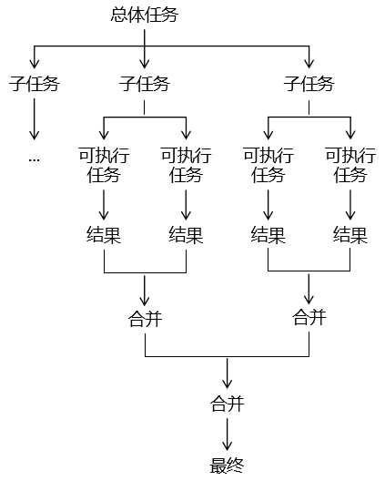
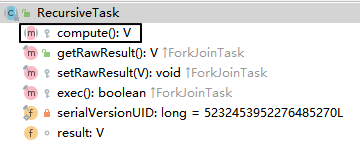
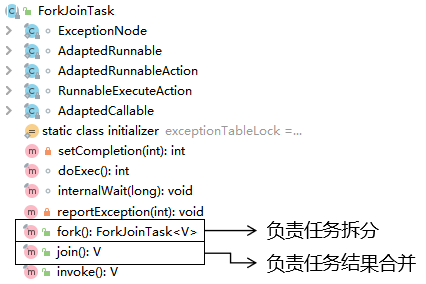

# 第一节 [CountDownLatch]

## 概述

### 使用流程图示意：

```
（等待线程）
    |
    |------> latch.await();  // 阻塞等待
    |
子线程1 ---------> latch.countDown();
子线程2 ---------> latch.countDown();
子线程3 ---------> latch.countDown();
    ...
当计数器为0时，主线程解除阻塞
```

### 使用步骤总结：

1. **初始化** `CountDownLatch latch = new CountDownLatch(3);`
1. **等待线程调用** `latch.await();`
1. **其他线程调用** `latch.countDown();`
1. **计数器为0时，所有等待线程继续执行**


### ✅ 使用场景

- 主线程等待多个客户端初始化完成
- 所有远程调用响应后再聚合结果

### 🔧 核心方法

```java
latch.countDown(); // 每个线程完成后调用
latch.await();     // 主线程等待
latch.await(timeout, unit); // 设置最大等待时间
```

### 📌 小提示：

- `CountDownLatch` **不能重用**，即计数器一旦减到0就不能重置了；
- 适合**一组线程等待另一组线程完成**的场景，例如：主线程等待多个初始化线程完成。

效果：指定一个操作步骤数量，在各个子线程中，每完成一个任务就给步骤数量 - 1；在步骤数量减到0之前，CountDownLatch 可以帮我们把最后一步操作抑制住（阻塞），让最后一步操作一直等到步骤被减到 0 的时候执行。

### 失败处理建议：

#### ✅ 方法一：**保证 countDown() 始终执行**

使用 `try-finally` 结构，确保即使出现异常也能 countDown。

```java
CountDownLatch latch = new CountDownLatch(3);
AtomicBoolean hasError = new AtomicBoolean(false);

for (int i = 0; i < 3; i++) {
    final int id = i;
    new Thread(() -> {
        try {
            if (id == 1) {
                throw new RuntimeException("模拟任务失败");
            }
            System.out.println("线程 " + id + " 完成任务");
        } catch (Exception e) {
            hasError.set(true);
            System.out.println("线程 " + id + " 出错: " + e.getMessage());
        } finally {
            latch.countDown(); // 必须执行，避免死锁
        }
    }).start();
}

// 等待所有线程完成
latch.await();

if (hasError.get()) {
    System.out.println("有线程失败，终止流程");
}
```

#### ✅ 方法二：设置 `await(timeout)` 超时等待

```java
boolean completed = latch.await(5, TimeUnit.SECONDS);
if (!completed) {
    System.out.println("超时未完成，可能有线程未 countDown()");
}
```


## 案例

### 1、班长锁门

有六名同学在值日，班长负责锁门。班长必须确保所有同学都离开教室再锁门。

```Java
// 声明一个变量，用来保存同学的数量
int stuNum = 6;

// 创建CountDownLatch对象
CountDownLatch countDownLatch = new CountDownLatch(stuNum);

// 创建和同学数量相等的线程
for (int i = 0; i < stuNum; i++) {

    String num = String.valueOf(i + 1);

    new Thread(()->{

        // 完成一次操作
        System.out.println(Thread.currentThread().getName() + " " + num + "号同学离开教室");

        // 让countDownLatch管理的数量-1
        countDownLatch.countDown();

    }).start();

}

// 让countDownLatch负责将最后一步操作抑制住
countDownLatch.await();

System.out.println("班长锁门");
```

### 2、集齐七颗龙珠召唤神龙

```Java
// 声明龙珠数量
int dragonBall = 7;

// 创建CountdownLatch对象
CountDownLatch countDownLatch = new CountDownLatch(dragonBall);

// 创建七个线程收集龙珠
for (int i = 0; i < 7; i++) {

    String num = String.valueOf(i);

    new Thread(()->{

        System.out.println("现在拿到了" + num + "号龙珠");

        countDownLatch.countDown();

    }).start();

}

// 让countDownLatch对象抑制最后一步
countDownLatch.await();

System.out.println("龙珠集齐，召唤神龙");
```


# 第二节 CyclicBarrier  同步点


### 一、什么是 `CyclicBarrier`？

`CyclicBarrier` 是 Java 提供的一个**多线程同步工具类**，用于让一组线程在某个“同步点”上等待，直到所有线程都到达该点后再同时继续执行。

它的名字来自两个特性：

- **Cyclic（循环）**：可以重复使用，适用于多阶段的并发任务。
- **Barrier（屏障）**：设置一个屏障，阻止线程前进，直到所有线程都达到屏障。

------

### 二、基本原理

当多个线程调用 `barrier.await()` 方法时，它们会在 barrier 处等待，直到**指定数量的线程都调用了 `await()`**，屏障才会打开，所有线程同时继续执行。

例如：

```java
CyclicBarrier barrier = new CyclicBarrier(3);
```

只有 3 个线程都执行了 `await()`，这些线程才能**一起通过**屏障，进入下一阶段。

------

### 三、使用场景

| 场景类型       | 描述                             |
| -------------- | -------------------------------- |
| 多线程分段处理 | 各线程处理数据块后，在屏障汇总   |
| 并行计算收敛   | 所有计算线程完成后统一执行下一轮 |
| 网络服务同步   | 多客户端“准备就绪”后再开始操作   |
| 模拟并发测试   | 同一时刻启动大量线程测试系统响应 |

------

### 四、常用构造方法

```java
public CyclicBarrier(int parties)
```

- 表示需要 `parties` 个线程调用 `await()` 才能打开屏障。

```java
public CyclicBarrier(int parties, Runnable barrierAction)
```

- 除了等待，还可以指定一个**在屏障打开前由其中一个线程执行的任务**（如打印日志、准备下一阶段等）。

------

### 五、主要方法说明

| 方法名                 | 作用                                       |
| ---------------------- | ------------------------------------------ |
| `await()`              | 当前线程等待，直到所有线程到达             |
| `await(timeout, unit)` | 限时等待，超时将抛异常并破坏屏障           |
| `reset()`              | 手动重置 barrier，打破当前等待，进入下一轮 |
| `isBroken()`           | 返回 barrier 是否已被破坏（如超时或异常）  |
| `getNumberWaiting()`   | 返回当前在等待屏障的线程数                 |
| `getParties()`         | 返回屏障要求的线程总数                     |

------

### 六、示例代码

#### 入门

```java
import java.util.concurrent.*;

public class CyclicBarrierExample {
    public static void main(String[] args) {
        int threadCount = 3;

        CyclicBarrier barrier = new CyclicBarrier(threadCount, () -> {
            System.out.println("所有线程已就绪，继续执行下一步...");
        });

        ExecutorService executor = Executors.newFixedThreadPool(threadCount);

        for (int i = 0; i < threadCount; i++) {
            final int id = i;
            executor.submit(() -> {
                try {
                    System.out.println("线程 " + id + " 准备中...");
                    Thread.sleep(1000 + id * 500);
                    System.out.println("线程 " + id + " 到达同步点");
                    barrier.await(); // 等待其他线程
                    System.out.println("线程 " + id + " 继续执行");
                } catch (Exception e) {
                    e.printStackTrace();
                }
            });
        }

        executor.shutdown();
    }
}
```

#### 失败处理机制：**自动传播 + 可手动重置**

```java
CyclicBarrier barrier = new CyclicBarrier(3, () -> {
    System.out.println("所有线程到达屏障");
});

for (int i = 0; i < 3; i++) {
    final int id = i;
    new Thread(() -> {
        try {
            if (id == 2) throw new RuntimeException("线程故障");
            System.out.println("线程 " + id + " 等待同步");
            barrier.await(5, TimeUnit.SECONDS); // 可设超时
            System.out.println("线程 " + id + " 继续执行");
        } catch (BrokenBarrierException | TimeoutException e) {
            System.out.println("线程 " + id + " 同步失败: " + e);
        } catch (Exception e) {
            System.out.println("线程 " + id + " 自身异常: " + e);
            barrier.reset(); // 通知其他线程失败
        }
    }).start();
}
```


#### 同步点实现

支持多线程在执行各自任务的时候，到达某个状态点就等待，等所有线程都到达这个状态点再继续执行后步骤。

使用 `CyclicBarrier` 实现三个线程在各自任务中遇到 `"special"` 标记时暂停等待，直到所有线程都到达这个标记点后再继续执行。

```java
public class DemoO19CyclicBarrierTest {

    private static List<List<String>> matrix = new ArrayList<>();

    static {
        matrix.add(Arrays.asList("normal","special","end"));
        matrix.add(Arrays.asList("normal","normal","special","end"));
        matrix.add(Arrays.asList("normal","normal","normal","special","end"));
    }

    public static void main(String[] args) {


        // 1.创建CyclicBarrier对象
        CyclicBarrier barrier = new CyclicBarrier(3);

        // 2.创建3个线程分别执行各自的任务
        new Thread(()->{

            try {
                List<String> list = matrix.get(0);
                for (String value : list) {

                    TimeUnit.SECONDS.sleep(1);
                    System.out.println(Thread.currentThread().getName() + " value = " + value);
                    if ("special".equals(value)) {
                        // 遇到特殊任务标记，就让当前线程等一下
                        barrier.await();
                    }
                }
            } catch (InterruptedException e) {
                e.printStackTrace();
            } catch (BrokenBarrierException e) {
                e.printStackTrace();
            }

        }, "thread01").start();

        new Thread(()->{

            try {
                List<String> list = matrix.get(1);

                for (String value : list) {

                    TimeUnit.SECONDS.sleep(1);
                    System.out.println(Thread.currentThread().getName() + " value = " + value);
                    if ("special".equals(value)) {
                        // 遇到特殊任务标记，就让当前线程等一下
                        barrier.await();
                    }

                }

            } catch (InterruptedException e) {
                e.printStackTrace();
            } catch (BrokenBarrierException e) {
                e.printStackTrace();
            }

        }, "thread02").start();
        new Thread(()->{

            try {
                List<String> list = matrix.get(2);

                for (String value : list) {
                    TimeUnit.SECONDS.sleep(1);
                    System.out.println(Thread.currentThread().getName() + " value = " + value);
                    if ("special".equals(value)) {
                        // 遇到特殊任务标记，就让当前线程等一下
                        barrier.await();
                    }

                }

            } catch (InterruptedException e) {
                e.printStackTrace();
            } catch (BrokenBarrierException e) {
                e.printStackTrace();
            }

        }, "thread03").start();
    }

}
```


------

### 七、失败和中断处理机制

如果有任何一个线程在 `await()` 时：

- 抛出异常
- 超时
- 被中断

则整个 barrier 会被“破坏”，其他正在等待的线程将抛出 `BrokenBarrierException`。

#### 👉 如何处理？

```java
try {
    barrier.await(5, TimeUnit.SECONDS);
} catch (BrokenBarrierException | TimeoutException e) {
    System.out.println("同步点失败或超时");
    barrier.reset(); // 重置后可以重新进入下一轮同步
}
```

------

### 八、和 CountDownLatch 对比

| 特性       | `CyclicBarrier`   | `CountDownLatch`   |
| ---------- | ----------------- | ------------------ |
| 可重复使用 | ✅ 是              | ❌ 否               |
| 线程间互等 | ✅ 是              | ❌ 否（主线程等待） |
| 执行回调   | ✅ 支持 `Runnable` | ❌ 不支持           |
| 通知失败   | ✅ 自动传播异常    | ❌ 需配合变量       |

------

### 九、注意事项

- 所有调用 `await()` 的线程**必须都参与同步**，否则会导致死锁或抛出异常。
- 如果任何线程在 `await()` 之前就崩溃或中断，整个屏障会被打破。
- `reset()` 方法只能在控制层明确知道要中止当前同步时调用，**不应轻易使用**，以免误打断。

------

### 🔚 总结

> `CyclicBarrier` 是一种**线程间协同**的工具，适合用于“**所有线程就位，再一起行动**”的场景，支持重复使用、回调执行、自动传播失败等高级特性。

它是实现**多阶段并行计算、网络协同状态同步、模拟并发测试**等任务的利器。


# 第三节 Semaphore

好的，下面是对 **`Semaphore`（信号量）** 的详细讲解，包括常用方法、使用步骤、示例代码和与 `CountDownLatch` 的对比，帮助你全面理解它的作用。

------

## 🌟 一、`Semaphore` 是什么？

`Semaphore`（信号量）是 `java.util.concurrent` 包下的一个并发工具类，**用于控制同时访问某个资源的线程数量**。常用于实现资源的限流，例如控制同时访问数据库连接的线程数量、限流器等场景。

------

## 🔧 二、常用方法

| 方法签名                                          | 说明                                                        |
| ------------------------------------------------- | ----------------------------------------------------------- |
| `Semaphore(int permits)`                          | 创建信号量，指定最多可用的许可数（permit）                  |
| `Semaphore(int permits, boolean fair)`            | 创建公平或非公平的信号量                                    |
| `void acquire()`                                  | 获取一个许可，若没有可用许可则阻塞                          |
| `boolean tryAcquire()`                            | 尝试获取一个许可，成功返回 `true`，失败返回 `false`         |
| `boolean tryAcquire(long timeout, TimeUnit unit)` | 在限定时间内尝试获取许可，成功返回 `true`，超时返回 `false` |
| `void release()`                                  | 释放一个许可                                                |

------

## 🧭 三、使用步骤

1. 创建 `Semaphore` 对象，指定许可数量（如：3）
1. 线程尝试 `acquire()` 获取许可，许可不足时阻塞
1. 执行完任务后，调用 `release()` 释放许可

------

## 💻 四、示例代码

```java
import java.util.concurrent.Semaphore;

public class SemaphoreExample {
    public static void main(String[] args) {
        // 创建信号量，最多允许3个线程同时访问
        Semaphore semaphore = new Semaphore(3);

        for (int i = 1; i <= 10; i++) {
            int threadNum = i;
            new Thread(() -> {
                try {
                    semaphore.acquire(); // 获取许可
                    System.out.println("线程 " + threadNum + " 获取许可，正在执行任务...");
                    Thread.sleep(2000); // 模拟任务执行
                    System.out.println("线程 " + threadNum + " 释放许可");
                } catch (InterruptedException e) {
                    Thread.currentThread().interrupt();
                } finally {
                    semaphore.release(); // 释放许可
                }
            }).start();
        }
    }
}
```

📝 输出可能类似：

```
线程 1 获取许可，正在执行任务...
线程 2 获取许可，正在执行任务...
线程 3 获取许可，正在执行任务...
...其余线程等待，直到许可释放
```

------

## 🔄 五、与 `CountDownLatch` 对比

| 特性       | `CountDownLatch`       | `Semaphore`              |
| ---------- | ---------------------- | ------------------------ |
| 用途       | 等待多个线程完成       | 控制资源访问数量         |
| 是否可重用 | 否                     | 是                       |
| 计数方式   | 一次性倒计时，不能重置 | 可以重复获取/释放许可    |
| 控制机制   | 线程等待计数归零       | 控制并发线程数量（限流） |

------

## 🧠 场景理解

| 场景                            | 用 `CountDownLatch` | 用 `Semaphore` |
| ------------------------------- | ------------------- | -------------- |
| 主线程等待多个子线程初始化完毕  | ✅                   | ❌              |
| 限制某个接口每秒最多处理5个请求 | ❌                   | ✅              |
| 模拟车站只允许3辆车同时进站     | ❌                   | ✅              |
| 一次性等待所有子线程任务完成    | ✅                   | ❌              |

------

如果你有具体的应用场景，我可以帮你写出相应的 `Semaphore` 使用代码！是否需要我演示一个限流器或数据库连接池控制的例子？

## 1、常规方式使用  --抢车位
使用 Semaphore 可以帮助我们管理资源位；当某个线程申请资源时，由 Semaphore 检查这个资源是否可用；如果其他线程释放了这个资源，那么申请资源的线程就可以使用。
```java
// 1、创建 Semaphore 对象，指定资源数量为 3
Semaphore semaphore = new Semaphore(3);

// 2、创建 10 个线程争夺这 3 个资源
for (int i = 0; i < 10; i++) {

    new Thread(() -> {
        try {
            // 申请资源
            semaphore.acquire();
            // 拿到资源执行操作
            System.out.println("【" + Thread.currentThread().getName() + "】号车辆【驶入】车位");
            TimeUnit.SECONDS.sleep(3);
            System.out.println("【" + Thread.currentThread().getName() + "】号车辆【驶出】车位");
        } catch (InterruptedException e) {
            e.printStackTrace();
        } finally {
            // 操作完成释放资源
            semaphore.release();
        }
    }, i + "").start();
}
```
## 2、引入超时机制
```java
// 1、设定车位数量
int carPositionCount = 3;

// 2、创建 Semaphore 对象
Semaphore semaphore = new Semaphore(carPositionCount);

// 3、创建 50 个线程抢车位
for (int i = 0; i < 50; i++) {

    int carNum = i;
    new Thread(()->{
        boolean acquireResult = false;
        try {
            // 线程开始时先申请资源，申请不到会进入等待状态
            // 申请资源方式一：不见不散，等不到资源就一直等
            // semaphore.acquire();

            // 申请资源方式二：过时不候
            acquireResult = semaphore.tryAcquire(3, TimeUnit.SECONDS);
            if (acquireResult) {
                // 申请到资源时，线程会继续执行
                System.out.println(carNum + "号车辆驶入车位");
                // 车辆在车位停放一段时间
                TimeUnit.SECONDS.sleep(2);
                // 停放完成离开车位
                System.out.println(carNum + "号车辆驶出车位");
            } else {
                System.out.println(carNum + "号车辆放弃等待");
            }
        }  finally {

            // 判断当前线程释放拿到了资源
            if (acquireResult) {
                // 任务执行完成释放资源
                semaphore.release();
            }
        }
    }).start();
}
```
## 3、应用场景举例

借助Semaphore实现『限流』操作。

- 当前服务器实例能够承受多大的访问量——设置为资源的数量。
- 根据资源的数量创建Semaphore对象。
- 服务器实例接收到请求通过Semaphore对象管理处理请求数量。
  - 在能力范围内：处理请求。
  - 超过能力范围：设定等待时间，看是否能够得到别的请求处理完成释放资源。


# 第四节 Fork Join 框架

## 1、介绍
使用 Fork Join 框架能够帮助我们把一个大型任务，根据一定规律，拆分成小任务执行。如果拆分后的任务还不够小，可以以**递归**模式继续拆分，直到拆分到可以执行的程度。然后再把各个子任务执行的结果汇总到一起。
- Fork：拆分：把大任务拆分成小任务。
- Join：合并：把小任务执行的结果合并到一起。





## 2、框架中 API 介绍
### ①RecursiveTask





我们使用 Fork Join 框架只需要继承 RecursiveTask，然后重写 compute() 方法即可。在 compute() 方法中需要包含：
- 任务拆分的逻辑
- 任务拆分的操作：调用 fork() 方法
- 已拆分任务的合并：调用 join() 方法
- 子任务结果的合并：将 join() 方法的返回值合并起来
### ②ForkJoinTask
ForkJoinTask 类是 RecursiveTask 的父类。





## 3、案例
### ①需求
完成从 1~100 的累加。
### ②思路
通过任务拆分、合并的方式来实现。拆分的逻辑是：
- 将大范围数值累加拆分为小范围数值累加。
- 在 1~10 区间范围内执行计算。
### ③代码
#### [1] 任务类
```java
class MyTask extends RecursiveTask {

    // 区间开始位置
    private int begin;

    // 区间结束位置
    private int end;

    // 区间调整值：要通过拆分任务将区间调整到 10 以内
    public static final int ADJUST_VALUE = 10;

    // 保存当前任务的结果
    private int result = 0;

    // 声明构造器，设定当前任务的开始和结束位置
    public MyTask(int begin, int end) {
        this.begin = begin;
        this.end = end;
    }

    @Override
    protected Object compute() {

        // 1、判断当前区间是否是原子任务中可以执行计算的范围
        if (end - begin <= ADJUST_VALUE) {

            for (int i = begin; i <= end ; i++) {
                result  = result + i;
            }

        } else {

            // 2、计算新拆分任务的区间范围
            int leftBegin = begin;
            int leftEnd = (begin + end) / 2;

            int rightBegin = leftEnd + 1;
            int rightEnd = end;

            // 3、创建两个新的任务（子任务）
            MyTask myTaskLeft = new MyTask(leftBegin, leftEnd);
            MyTask myTaskRight = new MyTask(rightBegin, rightEnd);

            // 4、调用框架提供的 fork() 进一步拆分任务
            myTaskLeft.fork();
            myTaskRight.fork();

            // 5、调用框架提供的 join() 获取子任务计算的结果
            int leftResult = (int) myTaskLeft.join();
            int rightResult = (int) myTaskRight.join();

            // 6、把子任务的结果合并到一起
            result = leftResult + rightResult;
        }

        return result;
    }

}
```
#### [2] 测试代码
```java
// 1、创建 Fork Join 任务池
ForkJoinPool pool = new ForkJoinPool();

// 2、创建任务对象
MyTask myTask = new MyTask(1, 100);

// 3、将任务对象提交到任务池
ForkJoinTask forkJoinTask = pool.submit(myTask);

// 4、获取任务执行结果
int finalResult = (int) forkJoinTask.get();

System.out.println("finalResult = " + finalResult);
```
