# 第一节 JMM
1. **为什么要学这个 JMM？**

   答：为了理解 [volatile](https://so.csdn.net/so/search?q=volatile&spm=1001.2101.3001.7020) 关键词。

2. **为什么要学这个 volatile ？**

   答：因为 volatile 是后面整个技术体系的基石之一。


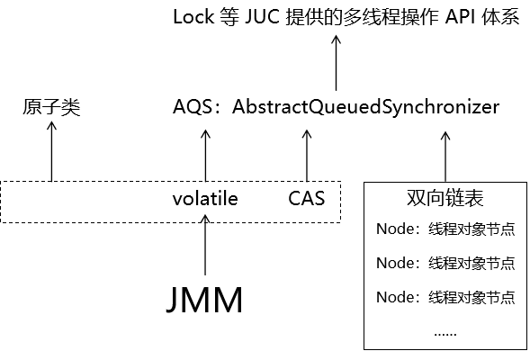


## 1、名词解释
JMM 是 **J**ava **M**emory **M**odel 的缩写，意思是：Java 内存模型。
## 2、产生背景
### ①高速缓存
现代计算机 CPU 的运算处理能力比内存 I/O 读写能力高几个数量级。如果让 CPU 对内存进行等待那将是对 CPU 资源的巨大浪费。可是如果将内存换成能够满足 CPU 需求的存储介质造价会高到无法承受。
为了让二者能力匹配、协调工作，在 CPU 和内存之间再添加一层高速缓存（具体硬件系统中可能是三级缓存，这里不深究），就可以让 CPU 从高速缓存读取和保存数据，数据修改后再从高速缓存同步回内存。


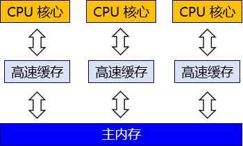


### ②缓存一致性协议
但是从上图我们很容易能发现问题：多个不同 CPU 核心都从主内存读取了同一个数据，又做了不同修改。那么同步会主内存的时候以哪个修改为准呢？这个问题有一个专门的名字：缓存一致性（Cache Coherence）。为了解决一致性的问题，需要各个处理器访问缓存时都要遵循一些协议，在读写时要根据协议来进行操作，这类协议有 MSI、MESI（Illinois Protocol）、MOSI、Synapse、Firefly 及 Dragon Protocol 等。


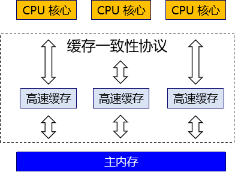


## 3、Java 内存模型
### ①基本概念
对 Java 程序来说同样存在上面的问题。曾经同样的 Java 代码在不同的硬件平台上运行会出现计算结果不一致的情况。这就和不同硬件系统使用不同方式应对缓存不一致问题有关。
为了屏蔽系统和硬件的差异，让一套代码在不同平台下能到达相同的访问结果。JMM 从 Java 5 开始的 **JSR-133** 发布后，已经成熟和完善起来。关于 JSR 标准的介绍请看末尾：


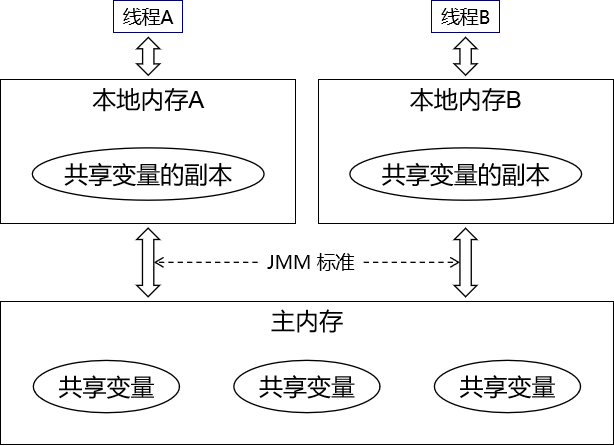


### ②主内存
主内存是各**线程共享**的内存区域。而 JVM 的内存结构中堆内存也是线程共享的。
### ③本地内存
本地内存（也叫工作内存）是主内存是各**线程私有**的内存区域。而 JVM 的内存结构中栈内存是线程私有的。所以 JVM 内存结构和 JMM 内存模型既有关联有不完全等同。
### ④作用
Java 内存模型（JMM）设计出来就是为了解决缓存一致性问题的，拆解开来说，缓存一致性涉及到三个具体问题：
- 原子性
- 可见性
- 有序性
## 4、原子性概念
### ①内部视角 (微观)
如果一个操作是**不可分割**的，那么我们就可以说这个操作是原子操作。比如：
- a = 0; （a 非 long、非 double 类型） 这个操作不可分割，所以是原子操作。
- a ++; 这个操作的本质是 a = a + 1 两步操作，可以分割，所以不是原子操作。
非原子操作都会存在线程安全问题，需要使用同步技术（sychronized）或者锁（Lock）来让它变成一个原子操作。一个操作是原子操作，那么我们称它具有原子性。Java 的 concurrent 包下提供了一些原子类，比如：AtomicInteger、AtomicLong、AtomicReference 等。
### ②外部视角 (宏观)
在 JMM 模型框架下，两个线程各自修改一个共享变量采用的办法是：各自读取到自己的本地内存中，执行计算，然后 flush 回主内存。这就很可能会发生后面操作把前面操作的结果覆盖的问题。这种情况下最终的计算结果肯定是错的。
这样的问题同样需要使用同步机制（synchronized 或 Lock）将修改共享内存中数据的操作封装为原子操作：前面操作完，后面再操作；保证后面的操作在前面操作结果的基础上进行计算。
封装后内部操作仍然是多个，不能说是不可分割的，但是它们作为一个整体不会被多个线程交替执行。
所以从外部视角、宏观视角来说，原子性的含义是：一段代码在**逻辑**上可以看做一个**整体**，多个线程执行这段代码不是交替执行。
## 5、原子性举例
### ①情景设定
- 声明 int 类型的成员变量
- 初始值为 0
- 两个线程对这个数据各执行 100 次累加
### ②未同步
#### [1] Java 代码
```
public class Demo11AtomicTest {

    // 声明成员变量作为操作对象
    private int data = 0;

    // 声明专门的方法执行累加操作
    public void add() {
        System.out.println(Thread.currentThread().getName() + " data = " + ++data);
    }

    public static void main(String[] args) {
        // 创建线程共享对象
        Demo11AtomicTest demo = new Demo11AtomicTest();

        // 创建第一个线程执行累加操作
        new Thread(()->{
            for (int i = 0; i < 100; i++) {
                try {
                    TimeUnit.SECONDS.sleep(1);} catch (InterruptedException e) {}
                demo.add();
            }
        }, "thread-01").start();

        // 创建第二个线程执行累加操作
        new Thread(()->{
            for (int i = 0; i < 100; i++) {
                try {TimeUnit.SECONDS.sleep(1);} catch (InterruptedException e) {}
                demo.add();
            }
        }, "thread-02").start();

    }

}
```
#### [2] 效果说明
thread-01 data = 168
thread-02 data = **169**
thread-01 data = **169**
thread-01 data = 170

……

thread-02 data = 177
thread-02 data = 178
thread-01 data = 179
中间重复的数据非常能说明问题：
- 读取数据：


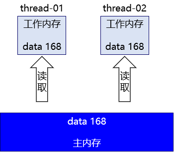


- 执行计算：


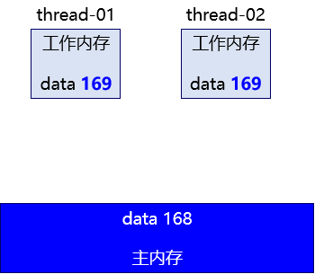


- thread-01 结果写回：


- thread-02 结果写回：


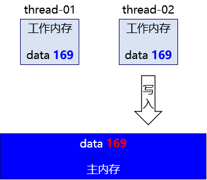


但是其实现在 2 号线程应该做的是从 169 + 1 变成 170。
### ③使用 synchronized 同步
#### [1] 修改 Java 代码
```
// 将累加方法修改为同步方法
public synchronized void add() {
    System.out.println(Thread.currentThread().getName() + " data = " + ++data);
}
```
#### [2] 效果说明
使用同步锁之后可以保证最终结果计算准确：
thread-01 data = 198
thread-02 data = 199
thread-01 data = **200**
### ④使用 AtomicInteger 累加
#### [1] 修改 Java 代码
```
// 声明成员变量作为操作对象
private AtomicInteger data = new AtomicInteger(0);

// 累加方法还是非同步方法
public void add() {
    System.out.println(Thread.currentThread().getName() + " data = " + data.incrementAndGet());
}
```
#### [2] 效果说明
可以保证计算结果正确：
thread-01 data = 194
thread-02 data = 193
thread-01 data = 195
thread-02 data = 196
thread-01 data = 197
thread-02 data = 198
thread-02 data = **200**
thread-01 data = 199
## 6、同步锁和原子类的性能比较
### ①情景设定
两个线程对同一个数据从 0 累加到 1000 万。数量大一些便于看到较为明显的效果，我们中间不执行线程睡眠就不会花很多时间。
### ②同步锁
#### [1] Java 代码
```
public class Demo12PKSync {

    private int data = 0;

    public synchronized void add() {
        data ++;
    }

    public static void main(String[] args) {
        Demo12PKSync demo = new Demo12PKSync();

        new Thread(()->{
            long beginTime = System.currentTimeMillis();

            for (int i = 0; i < 10000000; i++) {
                demo.add();
            }

            long endTime = System.currentTimeMillis();
            long usedTime = endTime - beginTime;
            System.out.println(Thread.currentThread().getName() + " usedTime = " + usedTime);

        }, "thread-01").start();

        new Thread(()->{

            long beginTime = System.currentTimeMillis();
            for (int i = 0; i < 10000000; i++) {
                demo.add();
            }

            long endTime = System.currentTimeMillis();
            long usedTime = endTime - beginTime;
            System.out.println(Thread.currentThread().getName() + " usedTime = " + usedTime);
        }, "thread-02").start();
    }
}
```
#### [2] 效果
thread-01 usedTime = 628
thread-02 usedTime = 700
### ③原子类
#### [1] Java 代码
```
public class Demo12PKAtomic {

    private AtomicInteger data = new AtomicInteger(0);

    public void add() {
        data.incrementAndGet();
    }

    public static void main(String[] args) {
        Demo12PKAtomic demo = new Demo12PKAtomic();

        new Thread(()->{
            long beginTime = System.currentTimeMillis();

            for (int i = 0; i < 10000000; i++) {
                demo.add();
            }

            long endTime = System.currentTimeMillis();
            long usedTime = endTime - beginTime;
            System.out.println(Thread.currentThread().getName() + " usedTime = " + usedTime);

        }, "thread-01").start();

        new Thread(()->{

            long beginTime = System.currentTimeMillis();
            for (int i = 0; i < 10000000; i++) {
                demo.add();
            }

            long endTime = System.currentTimeMillis();
            long usedTime = endTime - beginTime;
            System.out.println(Thread.currentThread().getName() + " usedTime = " + usedTime);
        }, "thread-02").start();
    }
}
```
#### [2] 效果
thread-02 usedTime = 233
thread-01 usedTime = 239
性能的提升效果还是很明显的。原理我们会在后面结合 AQS 和 [CAS](https://so.csdn.net/so/search?q=CAS&spm=1001.2101.3001.7020) 来说明。
### ④只有一个线程时的同步锁
#### [1] Java 代码
在前面代码基础上去掉一个线程。
#### [2] 效果
thread-01 usedTime = 283
也一下子提升了很多，这说明底层具体执行的时候因为只有一个线程，所以没有膨胀到重量级锁。但是生产环境下[并发](https://so.csdn.net/so/search?q=并发&spm=1001.2101.3001.7020)量增大，线程一定会变多。synchronized 必然会膨胀为重量级锁。所以还是要视情况来减少 synchronized 的使用。
## 7、可见性
### ①示例代码
每个线程操作自己的本地内存，对其他线程是不可见的。看下面代码：
```
public class Demo15CanSeeTest {

    private int data = 100;

    public int getData() {
        return data;
    }

    public void setData(int data) {
        this.data = data;
    }

    public static void main(String[] args) {

        Demo15CanSeeTest demo = new Demo15CanSeeTest();

        new Thread(()->{
            while (demo.getData() == 100) {}
            System.out.println("AAA 线程发现 data 新值：" + demo.getData());
        }, "AAA").start();

        new Thread(()->{
            try {TimeUnit.SECONDS.sleep(1);} catch (InterruptedException e) {}

            demo.setData(200);
            System.out.println("BBB 线程修改 data，新值是：" + demo.getData());
        }, "BBB").start();

    }

}
```
运行效果：


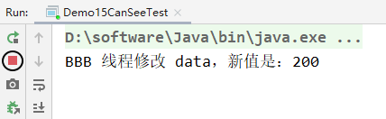


可以看到，程序一直在运行着没有停止。这是因为 while (demo.getData() == 100) 循环条件始终成立。证明 AAA 线程看到的 data 值始终是旧值。
### ②示例分析
#### [1] 两个线程加载变量


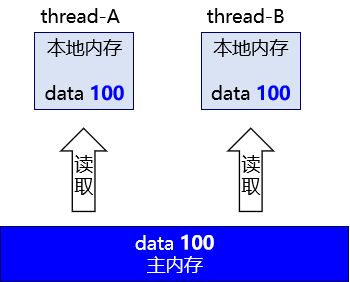


#### [2] 线程 B 修改变量
线程 B 首先在自己的本地内存修改数据：


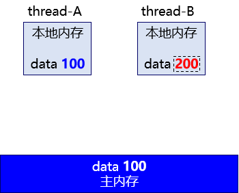


#### [3] 线程 B 将新数据写回主内存


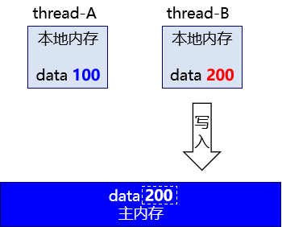


#### [4] 问题核心
线程 A 始终都是在从自己的本地内存获取数据，没有去读取主内存。
## 8、有序性
### ①指令重排序
CPU 执行程序指令和 JVM 编译源程序之后，都会对指令做一定的重排序，目的是提高部分代码执行的效率。原则是重新排序后代码执行的结果和不重排执行的结果必须一样。
### ②有序性概念
从宏观和表面层次来看，我们感觉不到指令重排的存在，指令重排都是系统内部做的优化。保证无论是否指令重排，程序运行的结果都和预期一样，就是有序性。
# 第二节 volatile 关键字
## 1、英文单词


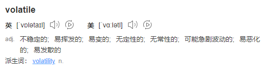


## 2、原子性
被 volatile 关键字修饰的变量是否满足原子性其实并不是由 volatile 本身来决定，而是和变量自身的数据类型有关。
### ①示例代码
```
public class VolatileAtomic {

//        private volatile AtomicInteger data = new AtomicInteger(0);
            private volatile int data = 0;
        public void add() {
//            data.incrementAndGet();
            data++;
//            System.out.println(Thread.currentThread().getName() + " data = " + ++data);
        }

        public static void main(String[] args) throws InterruptedException {
            VolatileAtomic demo = new VolatileAtomic();
            CountDownLatch latch = new CountDownLatch(2);


            new Thread(()->{
                for (int i = 0; i < 1000000; i++) {
                    demo.add();
                }
                latch.countDown();
            }, "AAA").start();

            new Thread(()->{
                for (int i = 0; i < 1000000; i++) {
                    demo.add();
                }
                latch.countDown();
            }, "BBB").start();

            latch.await();
            System.out.println(demo.data);
        }
}
```
### ②运行效果
没有加到 2000000：
985047
但是把数据类型从 int 换成 AtomicInteger 即使不加 volatile 也能够保证原子性。
### ③结论
volatile 关键字不提供原子性保证。
## 3、可见性
volatile 写的内存语义：当**写**一个 volatile 变量时，JMM 会把该线程对应的本地内存中的变量值 **flush 到主内存**。
volatile 读的内存语义：当**读**一个 volatile 变量时，JMM 会把该线程对应的**本地内存置为无效**。线程接下来将**从主内存中读**取共享变量。
所以 volatile 关键字是能够保证可见性的。
大家可以运行下面的例子测试一下：
```
public class Demo15CanSeeTest {

    private volatile int data = 100;

    public int getData() {
        return data;
    }

    public void setData(int data) {
        this.data = data;
    }

    public static void main(String[] args) {

        Demo15CanSeeTest demo = new Demo15CanSeeTest();

        new Thread(()->{
            while (demo.getData() == 100) {}
            System.out.println("AAA 线程发现 data 新值：" + demo.getData());
        }, "AAA").start();

        new Thread(()->{
            try {TimeUnit.SECONDS.sleep(5);} catch (InterruptedException e) {}

            demo.setData(200);
            System.out.println("BBB 线程修改 data，新值是：" + demo.getData());
        }, "BBB").start();
    }
}
```
## 4、有序性
volatile 确实是一个为数不多的能够从编码层面影响指令重排序的关键字。因为它可以在代码中添加内存屏障。
所谓内存屏障，就是一种特殊的指令。底层指令中加入内存屏障，就会禁止一定范围内的内存重排。
### ①volatile 写
在每个 volatile 写操作的前面插入一个 StoreStore 屏障。在每个 volatile 写操作的后面插入一个 StoreLoad 屏障。


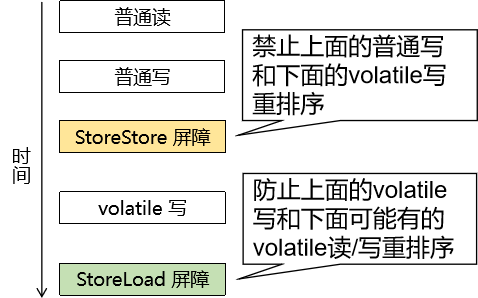


### ②volatile 读
在每个 volatile 读操作的后面插入一个 LoadLoad 屏障和一个 LoadStore 屏障。


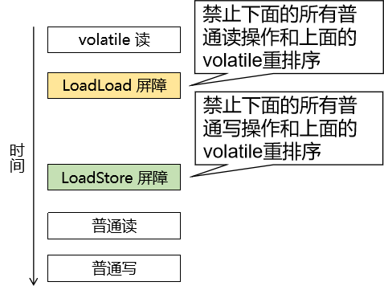


### ③结论
- 微观层面：volatile 关键字能够提供有序性保证，但是从实际开发中编码层面感受不到。
- 宏观层面：volatile 关键字**能够提供可见性**保证，但是**不能提供原子性**保证。
| JMM 特性 | volatile 能力 |
| -------- | ------------- |
| 原子性   | 无            |
| 可见性   | 有            |
| 有序性   | 有            |
## 5、补充
volatile 关键词只能修饰成员变量：


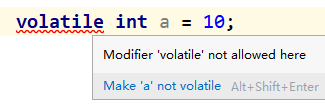


## 6、请谈谈你对 volatile 的理解。
- 内涵
  - 从 JMM 三大特性的角度来说明 volatile 的功能：
    - 原子性：没有
    - 可见性：有
    - 有序性：有
  - **volatile 关键词最重要的功能就是为我们的程序提供可见性保证**
- 外延
  - 从 volatile 在整个技术系统中的作用来说：
    - volatile + CAS = 原子类的底层原理
    - volatile + CAS + 线程对象的双向链表 = AQS 的底层原理
    - AQS 是 JUC 中各种 API 底层用到的同步器的实现原理
- 扩展
  - 从 Lock 系列 API 扩展到传统的 synchronized 同步方式
  - 从多线程的技术领域扩展到项目中多线程的实际应用
# 第三节 CAS 机制
## 1、名称解释
CAS：**C**ompare **A**nd **S**wap 比较并交换。
谁和谁比较？
为什么比较完了才能交换？
谁和谁交换？
这东西有什么用？
下面我们一一来解释。
## 2、工作机制
### ①Unsafe 类
#### [1] 引入
原子类 AtomicInteger 中就大量用到了 CAS 机制，compareAndSet(int expect, int update); 方法就是其中的典型代表。
```
    public final boolean compareAndSet(int expect, int update) {
        return unsafe.compareAndSwapInt(this, valueOffset, expect, update);
    }
```
从源码中我们可以看出，compareAndSet(int expect, int update); 方法里面其实是调用了 Unsafe 类的 compareAndSwapInt() 方法。
Unsafe.compareAndSwapInt() 方法的源码如下：
```
public final native boolean compareAndSwapInt(Object var1, long var2, int var4, int var5);
```
很明显，这是一个本地方法。那 Unsafe 类是做什么的呢？
#### [2] 介绍
C/C++ 代码可以直接操作内存空间。而 Java 程序屏蔽了对内存空间的直接访问，简化了代码复杂度，提高了安全性。但是凡事都有例外，Unsafe 类在一定程度上可以看作是一个可以用来操作内存空间的 Java 类。
正是因为使用 Unsafe 类可以直接操作内存，所以它的名字叫 Unsafe，也就是『**危险**』的意思——常规业务功能的开发中不能直接操作内存，这是非常危险的操作。
所以这里的 Unsafe 并不是指线程不安全。我们这里关注的是它提供的 CAS 方法。
### ②举例说明
#### [1] 内存初始状态
- 内存空间地址：0x00FA
- 内存空间数据值：5


#### [2] 尝试修改成功
CAS 机制修改数据必须提供内存空间地址以找到要修改的数据。提供旧值用来和内存实际值进行比较。提供新值作为修改后的值。
- 内存空间地址：0x00FA
- 内存空间数据值：**5**
- 修改者提供的旧值（expected value）：**5**
- 修改者提供的新值（update value）：10


#### [3] 尝试修改失败
如果修改者提供的旧值与内存实际值不相等，那么 CAS 机制将禁止修改数据。
- 内存空间地址：0x00FA
- 内存空间数据值：**7**
- 修改者提供的旧值（expected value）：**5**
- 修改者提供的新值（update value）：10


#### [4] 自旋
修改被禁止，但操作不会结束。CAS 机制会引导修改者读取当前内存值，然后再次尝试修改。
- 读取内存值作为旧值：


- 再次尝试修改：


TIP
注意：读取内存值之后的第二次尝试修改也不一定修改成功。自旋可能会执行多次。


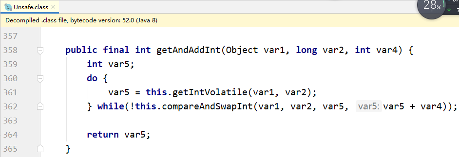


### ③配合 volatile
思考一个问题：我们前面提到的内存空间是工作内存还是主内存呢？很明显，应该是主内存。如果是在工作内存中一个线程内部自己和自己玩也就没必要整这些了，所以这里的内存空间指的是主内存。
但是每个线程修改数据又都是在工作内存完成的，修改完成执行 store 指令才会同步到主内存，执行 write 指令才会设置到对应变量中。
所以 CAS 操作通常都会配合 volatile 关键字：将 CAS 要操作的变量使用 volatile 修饰，实现可见性效果。
这一点我们看 AtomicInteger 类就可以发现：


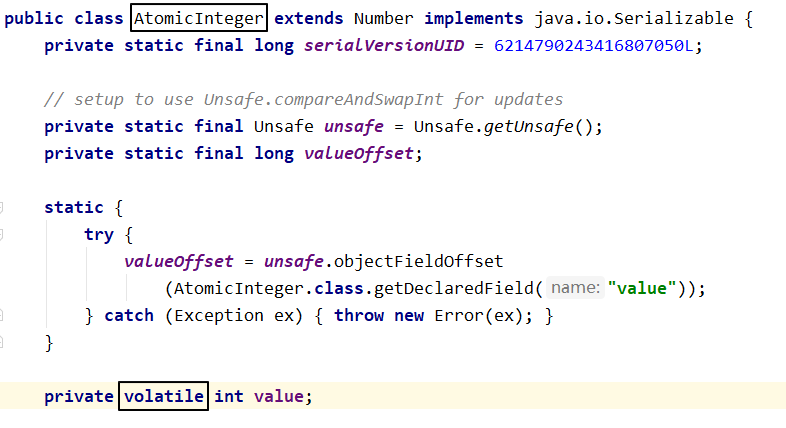


所以 AtomicInteger 等原子类可以看成是 CAS 机制配合 volatile 实现非阻塞同步的经典案例。
## 3、非阻塞同步
前面我们比较过 AtomicInteger 和 synchronized 两种方案实现原子性操作的性能差距，AtomicInteger 方式对比 synchronized 方式性能优势非常明显。
那 AtomicInteger 是如何做到既保证原子性（同步），又能够达到非常高的效率呢？
原因是：
- 使用 CAS 机制修改数据不需要对代码块加同步锁，各线程通过自旋的方式不断尝试修改，**线程不会被阻塞**。
- 配合 volatile 关键字使各个线程直接操作主内存避免了数据不一致。
所以 CAS 配合 volatile 不需要阻塞线程就能够实现同步效果，性能自然就会比 synchronized 更好。我们把这种机制称为：**非阻塞同步**。
当然，这种机制也并不能完全取代同步锁。因为 CAS 针对的是内存中的一个具体数据，无法对一段代码实现同步效果。
## 4、CAS 测试代码
```
// 1、创建 Integer 的原子类对象，设定初始值为 5
AtomicInteger atomicInteger = new AtomicInteger(5);

// 2、尝试修改
// ①基于旧值 5 修改
// updateResult = true 当前值 = 666
boolean updateResult = atomicInteger.compareAndSet(5, 666);
System.out.println("updateResult = " + updateResult + " 当前值 = " + atomicInteger.get());

// ②基于旧值 5 修改
// updateResult = false 当前值 = 666
updateResult = atomicInteger.compareAndSet(5, 777);
System.out.println("updateResult = " + updateResult + " 当前值 = " + atomicInteger.get());

// ③基于旧值 666 修改
// updateResult = true 当前值 = 888
updateResult = atomicInteger.compareAndSet(666, 888);
System.out.println("updateResult = " + updateResult + " 当前值 = " + atomicInteger.get());
```
打印结果：
修改结果：true 当前值：666
修改结果：false 当前值：666
修改结果：true 当前值：777
## 5、ABA 问题


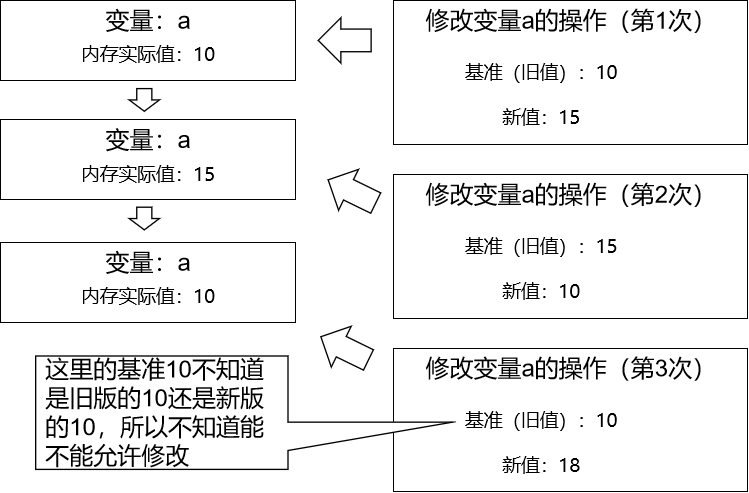


ABA 问题本质：一个原本不允许的操作，因为数据发生了变化，又允许操作了。但是 ABA 问题虽然存在，但如果只修改一个值在简单计算的场景下应该是没有问题的。当然如果确实涉及到复杂的业务逻辑还是要注意一下。
## 6、CAS 和乐观锁
CAS 机制可以看做是乐观锁理念的一种具体实现。但是又**不完整**。因为乐观锁的具体实现通常是需要维护版本号的，但是 CAS 机制中并不包含版本号——如果有版本号辅助就不会有 ABA 问题了。
## 7、从 JMM 三大特性角度看原子类
前面我们看到 AtomicInteger 类是 CAS 机制和 volatile 关键字的整合，所以它的缓存一致性效果是二者的综合：
- 原子性：满足。一方面前面我们已经测试过了，还有就是——你看人家这个类叫什么名字啊喂！
- 有序性：满足。由 volatile 关键字保证有序性。
- 可见性：满足。由 volatile 关键字保证可见性。
结论：单纯使用使用原子类执行并发操作时，**能够保证线程安全**，而且**性能很好**。
# 第四节 AQS
## 1、AQS 简介
首先来认识一个**抽象类**：


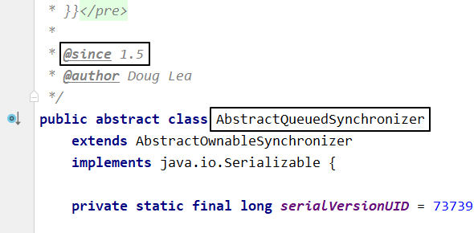


根据类的名字 AbstractQueuedSynchronizer 我们姑且可以翻译为：抽象的队列式同步器。AQS 定义了一套多线程访问共享资源的**同步器框架**，许多同步类实现都依赖于它。
它维护了一个 volatile int state（代表共享资源）和一个 FIFO 线程等待队列（多线程争用资源被阻塞时会进入此队列）。这里 volatile 是核心关键词。state 的访问方式有三种：
- getState()
- setState()
- compareAndSetState()
AQS 定义两种资源共享方式：Exclusive（独占，只有一个线程能执行，如 ReentrantLock）和 Share（共享，多个线程可同时执行，如 Semaphore、CountDownLatch 等。
TIP
- 独占锁：排斥所有其它锁，例如：写锁。
- 共享锁：共享锁之间不排斥，排斥独占锁，例如：读锁。
注意：如果是同一个线程对同一个对象加锁，那么它可以在加了独占锁之后继续加共享锁，或者，在加了共享锁之后继续加独占锁。所以上面所说的排斥是指线程之间。
## 2、AQS 核心方法介绍
不同的自定义同步器争用共享资源的方式也不同。自定义同步器在实现时只需要实现共享资源 **state 的获取与释放**方式即可，至于具体线程等待队列的维护（如获取资源失败入队 / 唤醒出队等），AQS 已经在顶层实现好了。自定义同步器实现时主要实现以下几种方法：
| 方法名                        | 说明                                                         |
| ----------------------------- | ------------------------------------------------------------ |
| boolean isHeldExclusively()   | 该线程是否正在独占资源。只有用到 condition 才需要去重写它。  |
| boolean tryAcquire(int)       | 尝试以独占方式获取资源，成功则返回 true，失败则返回 false。 int 类型的参数是用来累加 state 的 |
| boolean tryRelease(int)       | 尝试以独占方式释放资源，成功则返回 true，失败则返回 false。 int 类型的参数是用来从 state 中减去的 |
| int tryAcquireShared(int)     | 尝试以共享方式获取资源。 返回负数：获取失败 返回正数：获取成功且有剩余资源 返回 0：获取成功但没有剩余资源 |
| boolean tryReleaseShared(int) | 尝试以共享方式释放资源， 如果释放后允许唤醒后续等待结点返回 true，否则返回 false。 |
# 附录：JSR305 标准相关注解
## 1、从 JSR 说起
### ①JCP
JCP（Java Community Process) 是一个由 SUN 公司发起的，开放的国际组织。主要由 Java 开发者以及被授权者组成，负责 Java 技术规范维护，Java 技术发展和更新。
JCP 官网地址：https://jcp.org/en/home/index


### ②JSR
JSR 的全称是：Java Specification Request，意思是 Java 规范提案。谁向谁提案呢？任何人都可以向 JCP (Java Community Process) 提出新增一个标准化技术规范的正式请求。JSR 已成为 Java 界的一个重要标准。登录[ JCP 官网 (opens new window)](https://jcp.org/en/home/index) 可以查看[所有 JSR 标准 (opens new window)](https://jcp.org/en/jsr/all)。
## 2、JSR 305
JSR 305: Annotations for Software Defect Detection
This JSR will work to develop standard annotations (such as @NonNull) that can be applied to Java programs to assist tools that detect software defects.
主要功能：使用注解（例如 @NonNull 等等）协助开发者侦测软件缺陷。
Spring 从 5.0 版本开始支持了 JSR 305 规范中涉及到的相关注解。
```
package org.springframework.lang;

import java.lang.annotation.Documented;
import java.lang.annotation.ElementType;
import java.lang.annotation.Retention;
import java.lang.annotation.RetentionPolicy;
import java.lang.annotation.Target;

import javax.annotation.Nonnull;
import javax.annotation.meta.TypeQualifierNickname;

/**
 * A common Spring annotation to declare that annotated elements cannot be {@code null}.
 *
 * <p>Leverages JSR-305 meta-annotations to indicate nullability in Java to common
 * tools with JSR-305 support and used by Kotlin to infer nullability of Spring API.
 *
 * <p>Should be used at parameter, return value, and field level. Method overrides should
 * repeat parent {@code @NonNull} annotations unless they behave differently.
 *
 * <p>Use {@code @NonNullApi} (scope = parameters + return values) and/or {@code @NonNullFields}
 * (scope = fields) to set the default behavior to non-nullable in order to avoid annotating
 * your whole codebase with {@code @NonNull}.
 *
 * @author Sebastien Deleuze
 * @author Juergen Hoeller
 * @since 5.0
 * @see NonNullApi
 * @see NonNullFields
 * @see Nullable
 */
@Target({ElementType.METHOD, ElementType.PARAMETER, ElementType.FIELD})
@Retention(RetentionPolicy.RUNTIME)
@Documented
@Nonnull
@TypeQualifierNickname
public @interface NonNull {
}
```
## 3、相关注解
| 注解名称       | 含义                     | 可标记位置                                                   |
| -------------- | ------------------------ | ------------------------------------------------------------ |
| @Nullable      | 可以为空                 | @Target({ElementType.**METHOD**, ElementType.**PARAMETER**, ElementType.**FIELD**}) |
| @NonNull       | 不应为空                 | @Target({ElementType.**METHOD**, ElementType.**PARAMETER**, ElementType.**FIELD**}) |
| @NonNullFields | 在特定包下的字段不应为空 | @Target(ElementType.**PACKAGE**) @TypeQualifierDefault(ElementType.**FIELD**) |
| @NonNullApi    | 参数和方法返回值不应为空 | @Target(ElementType.**PACKAGE**) @TypeQualifierDefault({ElementType.**METHOD**, ElementType.**PARAMETER**}) |