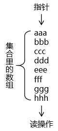
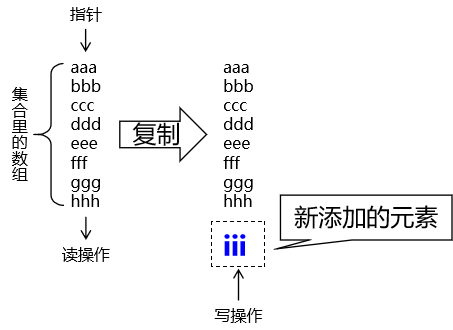
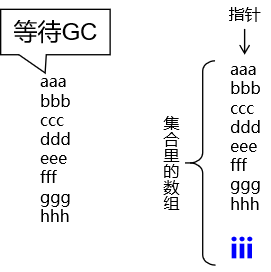
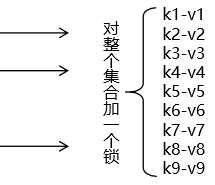
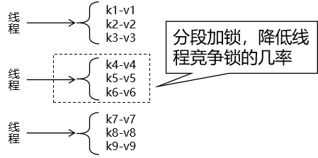

# 一、List 集合

## 1、使用ArrayList

```Java
// 创建被测试的List集合对象
// 具体集合类型ArrayList：抛出java.util.ConcurrentModificationException异常
List<String> list = new ArrayList<>();

// 在多个线程中对这个List集合执行读写操作
for (int i = 0; i < 5; i++) {

    new Thread(()->{

        for (int j = 0; j < 3; j++) {

            // 向集合对象写入数据
            list.add(UUID.randomUUID().toString().replace("-","").substring(0, 5));

            // 打印集合对象，等于是读取数据
            System.out.println(list);

        }

    },"thread"+i).start();

}
```

## 2、各种方案比较

```Java
// 创建被测试的List集合对象
// 具体集合类型ArrayList：抛出java.util.ConcurrentModificationException异常

// 具体集合类型Vector：不会抛异常，线程安全，但是这个类太古老

// Collections.synchronizedList(new ArrayList<>())：不会抛异常，但是锁定范围大，性能低
// public void add(int index, E element) { synchronized (mutex) {list.add(index, element);} }
// public E get(int index) { synchronized (mutex) {return list.get(index);} }

// 具体集合类型CopyOnWriteArrayList：使用了写时复制技术，兼顾了线程安全和并发性能
List<String> list = new CopyOnWriteArrayList<>();
```

## 3、写时复制技术

### ①图解

#### [1]初始状态



#### [2]写操作



#### [3]写操作完成



- 使用写时复制技术要向集合对象中写入数据时：先把整个集合数组复制一份
- 将新数据写入复制得到的新集合数组
- 再让指向集合数组的变量指向新复制的集合数组

优缺点：

- 优点：写操作还是要加独占锁，这方面没区别；读操作允许并发执行，效率提升。
- 缺点：由于需要把集合对象整体复制一份，所以对内存的消耗很大

对应类中的源代码：

- 所在类：java.util.concurrent.CopyOnWriteArrayList

```Java
    public boolean add(E e) {
        final ReentrantLock lock = this.lock;
        lock.lock();
        try {
            Object[] elements = getArray();
            int len = elements.length;
            Object[] newElements = Arrays.copyOf(elements, len + 1);
            newElements[len] = e;
            setArray(newElements);
            return true;
        } finally {
            lock.unlock();
        }
    }
```

# 二、Set 集合

采用了写时复制技术的Set集合：java.util.concurrent.CopyOnWriteArraySet

测试代码：

```Java
// 1、创建集合对象
Set<String> set = new CopyOnWriteArraySet<>();

// 2、创建多个线程，每个线程中读写 List 集合
for (int i = 0; i < 5; i++) {

    new Thread(()->{

        for (int j = 0; j < 5; j++) {

            // 写操作：随机生成字符串存入集合
            set.add(UUID.randomUUID().toString().replace("-","").substring(0, 5));

            // 读操作：打印集合整体
            System.out.println("set = " + set);
        }

    }, "thread-"+i).start();

}
```

对应类中的源码：

- 所在类：java.util.concurrent.CopyOnWriteArraySet

```Java
    public boolean add(E e) {
        return al.addIfAbsent(e);
    }
```

- 所在类：java.util.concurrent.CopyOnWriteArrayList

```Java
    private boolean addIfAbsent(E e, Object[] snapshot) {
        final ReentrantLock lock = this.lock;
        lock.lock();
        try {
            Object[] current = getArray();
            int len = current.length;
            if (snapshot != current) {
                // Optimize for lost race to another addXXX operation
                int common = Math.min(snapshot.length, len);
                for (int i = 0; i < common; i++)
                    if (current[i] != snapshot[i] && eq(e, current[i]))
                        return false;
                if (indexOf(e, current, common, len) >= 0)
                        return false;
            }
            Object[] newElements = Arrays.copyOf(current, len + 1);
            newElements[len] = e;
            setArray(newElements);
            return true;
        } finally {
            lock.unlock();
        }
    }
```

# 三、Map 集合

## 1、ConcurrentHashMap

全类名：java.util.concurrent.ConcurrentHashMap

测试代码：

```Java
// 1、创建集合对象
Map<String, String> map = new ConcurrentHashMap<>();

// 2、创建多个线程执行读写操作
for (int i = 0; i < 5; i++) {
    new Thread(()->{

        for (int j = 0; j < 5; j++) {

            String key = UUID.randomUUID().toString().replace("-","").substring(0, 5);
            String value = UUID.randomUUID().toString().replace("-","").substring(0, 5);

            map.put(key, value);

            System.out.println("map = " + map);
        }

    }, "thread" + i).start();
}
```

## 2、锁分段技术

### ①效率低下的方案

任何线程来操作集合数据都需要等待：



### ②锁分段技术解决方案


> 面试题：如果让你来实现一个微服务注册中心，你会怎么做？ 
>
> 答：注册中心底层使用Map集合来存储数据。 
>
> ●微服务名称：作为 Map 的 key 
>
> ●微服务对象：作为 Map 的 value
>
> ●使用 ConcurrentHashMap 实现并发读写 
>
> ●发现服务：读操作 
>
> ●注册服务：写操作

