# 第一节 阻塞[队列](https://so.csdn.net/so/search?q=队列&spm=1001.2101.3001.7020)
阻塞队列是线程池的核心组件，了解阻塞队列为学习线程池打好基础。
## 1、概念
### ①阻塞


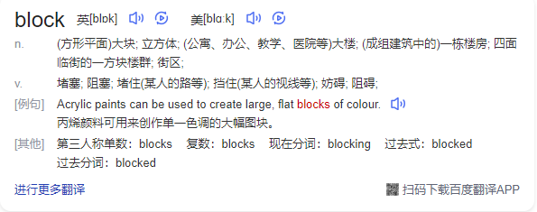


在某些情况下会挂起线程（即阻塞），一旦条件满足，被挂起的线程又会自动被唤起。
### ②BlockingQueue


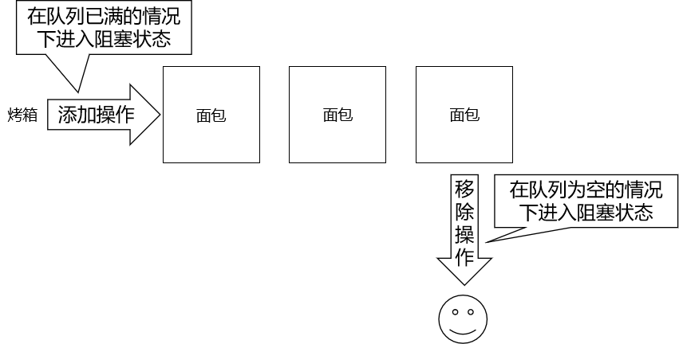


BlockingQueue 即阻塞队列，是 java.util.concurrent 下的一个接口，因此不难理解，BlockingQueue 是为了解决多线程中数据高效安全传输而提出的。从阻塞这个词可以看出，在某些情况下对阻塞队列的访问可能会造成阻塞。**被阻塞**的情况主要有如下两种：
- 当队列**满**了的时候进行**入队列**操作
- 当队列**空**了的时候进行**出队列**操作
阻塞队列主要用在生产者 / 消费者的场景，下面这幅图展示了一个线程生产、一个线程消费的场景：


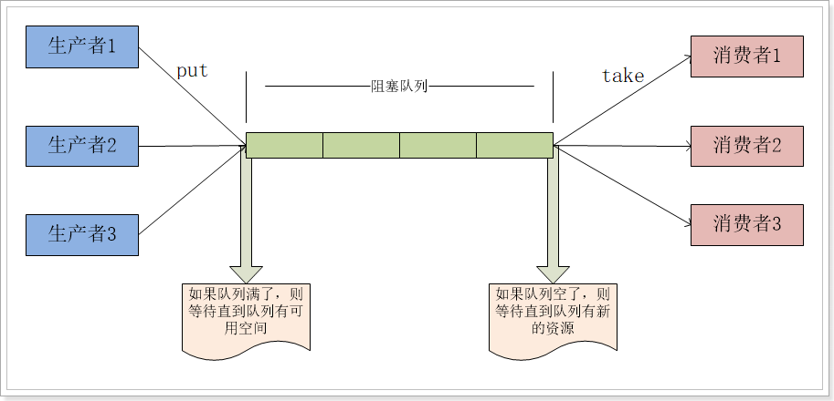


为什么需要 BlockingQueue？好处是我们不需要关心什么时候需要阻塞线程，什么时候需要唤醒线程，因为这一切 BlockingQueue 都给你一手包办了。在 concurrent 包发布以前，在多线程环境下，我们每个程序员都必须去自己控制这些细节，尤其还要兼顾效率和[线程安全](https://so.csdn.net/so/search?q=线程安全&spm=1001.2101.3001.7020)，而这会给我们的程序带来不小的复杂度。
## 2、BlockingQueue 接口


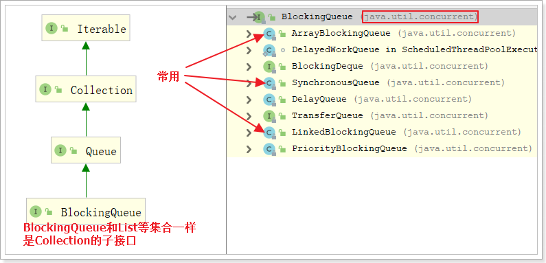


BlockingQueue 接口主要有以下 7 个实现类：
- `ArrayBlockingQueue`：由数组结构组成的有界阻塞队列。

- `LinkedBlockingQueue`：由链表结构组成的有界（但大小默认值为 Integer.MAX_VALUE ）阻塞队列。

- `PriorityBlockingQueue`：支持优先级排序的无界阻塞队列。

- `DelayQueue`：使用优先级队列实现的延迟无界阻塞队列。

- `SynchronousQueue`：不存储元素的阻塞队列，也即单个元素的队列。

- `LinkedTransferQueue`：由链表组成的无界阻塞队列。

- `LinkedBlockingDeque`：由链表组成的双向阻塞队列。

  

BlockingQueue 接口有以下方法：

|      | 抛出异常  | 特定值   | 阻塞   | 超时               |
| ---- | --------- | -------- | ------ | ------------------ |
| 插入 | add(e)    | offer(e) | put(e) | offer(e,tiem,unit) |
| 移除 | remove()  | poll()   | take() | poll(time,unit)    |
| 检查 | element() | peek()   | 不可用 | 不可用             |


详细说明如下：

> add()

- 正常执行返回true，
- 当阻塞队列满时，再往队列里add插入元素会抛IllegalStateException:Queue full

> element()

- 正常情况：返回阻塞队列中的第一个元素
- 当阻塞队列空时：再调用element()检查元素会抛出NoSuchElementException

> remove()

- 正常执行：返回阻塞队列中的第一个元素并删除这个元素
- 当阻塞队列空时：再往队列里remove()移除元素会抛NoSuchElementException

> offer(e)

- 成功：true
- 失败：false

> poll()

- 队列中有元素：返回删除的元素
- 队列中无元素：返回null

> peek()

- 队列中有元素：返回队列中的第一个元素
- 队列中无元素：返回null

> put(e)

- 队列未满：添加成功
- 队列已满：线程阻塞等待，直到能够添加为止

> take()

- 队列非空：获取队列中的第一个元素
- 队列为空：线程阻塞等待，直到队列非空时获取第一个元素

> offer(e,tiem,unit)

如果试图执行的操作无法立即执行，该方法调用将会发生阻塞，直到能够执行，但等待时间不会超过给定值。 返回true或false以告知该操作是否成功

> poll(time,unit)

如果试图执行的操作无法立即执行，该方法调用将会发生阻塞，直到能够执行，但等待时间不会超过给定值。

## 3、测试代码
```java
// 创建一个BlockingQueue对象
BlockingQueue<String> breadShop = new ArrayBlockingQueue<>(3);

// 创建一个线程用于存放出炉的面包
new Thread(()->{

    while (true) {

        try {
            TimeUnit.SECONDS.sleep(3);
            String bread = UUID.randomUUID().toString().replace("-", "").substring(0, 5);
            System.out.println("面包出炉：" + bread + " 货架情况：" + breadShop);
            breadShop.put(bread);
        } catch (InterruptedException e) {
            e.printStackTrace();
        }
    }

}).start();

// 创建一个线程用于卖面包
new Thread(()->{

    while (true) {

        try {
            TimeUnit.SECONDS.sleep((int)(Math.random()*10));
            String bread = breadShop.take();
            System.err.println("面包卖出：" + bread + " 货架情况：" + breadShop);
        } catch (InterruptedException e) {
            e.printStackTrace();
        }

    }

}).start();
```
# 第二节 线程池的概念与架构
## 1、基本概念
线程池的优势：线程池做的工作主要是控制运行的线程数量，处理过程中将任务放入队列，然后在线程创建后启动这些任务，如果线程数量达到了最大数量，超出数量的线程排队等候，等其他线程执行完毕，再从队列中取出任务来执行。 它的主要特点为：**线程复用；控制最大并发数；管理线程**。
- 降低资源消耗。通过重复利用已创建的线程降低线程创建和销毁造成的销耗。
- 提高响应速度。当任务到达时，任务可以不需要等待线程创建就能立即执行。
- 提高线程的可管理性。线程是稀缺资源，如果无限制的创建，不仅会销耗系统资源，还会降低系统的稳定性，使用线程池可以进行统一的分配，调优和监控。
## 2、架构说明
Java 中的线程池是通过 Executor 框架实现的，该框架中用到了 Executor，ExecutorService，ThreadPoolExecutor 这几个类。


Executor 接口是顶层接口，只有一个 execute() 方法，过于简单。通常不使用它，而是使用 ExecutorService 接口：


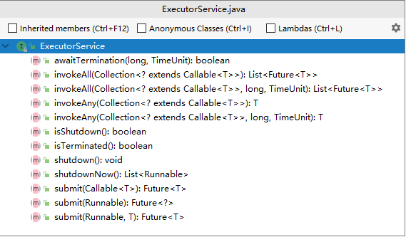


# 第三节 创建线程池
## 1、创建线程池
在 JDK 原生 API 中可以使用 Executors 工具类创建线程池对象


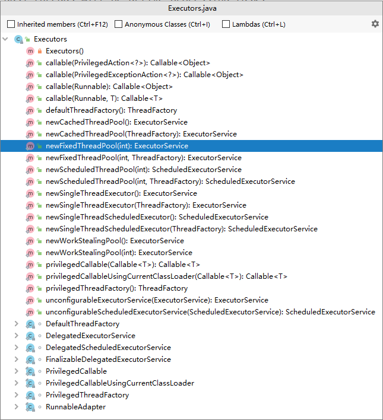


### ①newCachedThreadPool()
执行很多短期异步任务，线程池根据需要创建多线程。并在先前创建的线程可用时将重用它们。可扩容，遇强则强。
### ②newFixedThreadPool(int nThreads)
执行长期任务性能好，创建一个线程池，一池有 N 个固定的线程。
### ③newSingleThreadExecutor()
一个任务一个任务的执行，一池一线程。
## 2、代码演示
```java
// 创建线程池对象
// 总结：通过查看这三个线程池创建时的参数，我们可以看到它们都有自己的缺陷
// 实际开发时我们应该使用 ThreadPoolExecutor 类的对象自定义线程池
// ①方式一：cachedThreadPool 线程池中总共能够容纳 Integer.MAX_VALUE 个线程
// ExecutorService threadPool = Executors.newCachedThreadPool();

// ②方式二：newFixedThreadPool 由程序员指定能够容纳的最大线程数
// 使用的阻塞队列是：LinkedBlockingQueue，阻塞队列最大容量是：Integer.MAX_VALUE
// 意味着：整个线程池任务等待的数量有 Integer.MAX_VALUE 这么多
// ExecutorService threadPool = Executors.newFixedThreadPool(5);

// ③方式三：newSingleThreadExecutor 只能容纳一个线程执行
// 使用的阻塞队列是：LinkedBlockingQueue，阻塞队列最大容量是：Integer.MAX_VALUE
// 意味着：整个线程池任务等待的数量有 Integer.MAX_VALUE 这么多
ExecutorService threadPool = Executors.newSingleThreadExecutor();

System.out.println();

// 给线程池分配任务
while (true) {
    TimeUnit.SECONDS.sleep(1);

    threadPool.execute(()->{
        while (true) {
            try {
                TimeUnit.SECONDS.sleep(2);
            } catch (InterruptedException e) {
                e.printStackTrace();
            }
            System.out.println("任务进行中：" + Thread.currentThread().getName());
        }
    });
}
```
## 3、底层原理
上述案例中的三个方法的本质都是 ThreadPoolExecutor 的实例化对象，只是具体参数值不同。
```java
    public static ExecutorService newCachedThreadPool() {
        return new ThreadPoolExecutor(0, Integer.MAX_VALUE,
                                      60L, TimeUnit.SECONDS,
                                      new SynchronousQueue<Runnable>());
    }
    public static ExecutorService newFixedThreadPool(int nThreads) {
        return new ThreadPoolExecutor(nThreads, nThreads,
                                      0L, TimeUnit.MILLISECONDS,
                                      new LinkedBlockingQueue<Runnable>());
    }
    public static ExecutorService newSingleThreadExecutor() {
        return new FinalizableDelegatedExecutorService
            (new ThreadPoolExecutor(1, 1,
                                    0L, TimeUnit.MILLISECONDS,
                                    new LinkedBlockingQueue<Runnable>()));
    }
```
## 4、提示
使用 Executors 工具类创建的线程池参数设置**非常不合理**，实际开发时通常需要自己创建 `ThreadPoolExecutor` 的对象，自己指定参数。
# 第四节 线程池的 7 个重要参数
## 一、构造器源码
ThreadPoolExecutor 类的构造器有四个，其中三个都是调用这个 7 个参数的构造器。

```Java
    public ThreadPoolExecutor(int corePoolSize,
                              int maximumPoolSize,
                              long keepAliveTime,
                              TimeUnit unit,
                              BlockingQueue<Runnable> workQueue,
                              ThreadFactory threadFactory,
                              RejectedExecutionHandler handler) {
        if (corePoolSize < 0 ||
            maximumPoolSize <= 0 ||
            maximumPoolSize < corePoolSize ||
            keepAliveTime < 0)
            throw new IllegalArgumentException();
        if (workQueue == null || threadFactory == null || handler == null)
            throw new NullPointerException();
        this.acc = System.getSecurityManager() == null ?
                null :
                AccessController.getContext();
        this.corePoolSize = corePoolSize;
        this.maximumPoolSize = maximumPoolSize;
        this.workQueue = workQueue;
        this.keepAliveTime = unit.toNanos(keepAliveTime);
        this.threadFactory = threadFactory;
        this.handler = handler;
    }
```

## 2、七个参数各自的含义
- corePoolSize：线程池中的常驻核心线程数
- maximumPoolSize：线程池中能够容纳同时执行的最大线程数，此值必须大于等于 1
- keepAliveTime：多余的空闲线程的存活时间。当前池中线程数量超过 corePoolSize 时，当空闲时间达到 keepAliveTime 的线程会被销毁，直到剩余线程数量等于 corePoolSize
- unit：keepAliveTime 的时间单位
- workQueue：任务队列，被提交但尚未被执行的任务
- threadFactory：表示生成线程池中工作线程的工厂， 用于创建线程，一般默认的即可
- handler：拒绝策略处理器。当任务队列已满，工作线程也达到了 maximumPoolSize，新增的工作任务将按照某个既定的拒绝策略被拒绝执行。


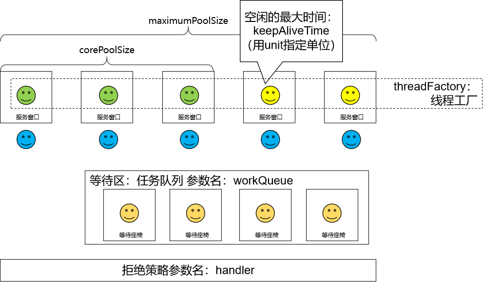


# 第五节 线程池的工作机制


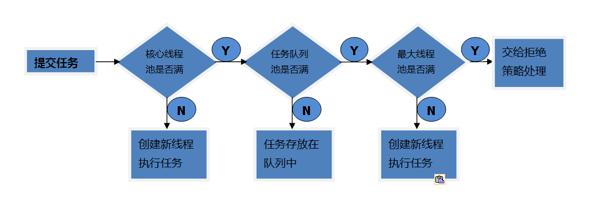


重要的事情说三遍——以下重要！以下重要！以下重要！我们对照的模型就是去银行网点办理业务，如果窗口所有工作人员都在忙碌，我们需要等叫号。那么线程池中和这个模型一致的就按照生活中的经验来理解和记忆即可。有和生活中不一样的地方，会标【反直觉】，请大家留意！
- 【**反直觉**】**刚创建线程池时，线程池中的线程数为零**。

  

  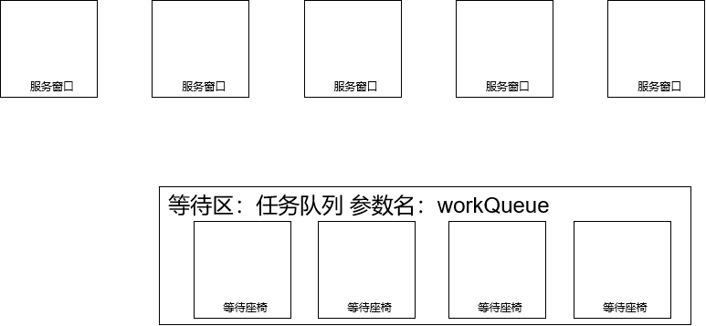

  

- 当调用 execute() 方法添加一个请求任务时，线程池会做出如下判断：

  - 如果正在运行的线程数量小于 corePoolSize，那么马上创建线程运行这个任务；

    

    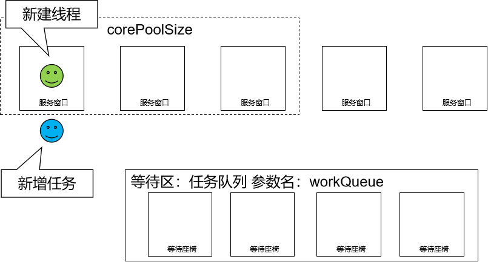

    

    ……

    

    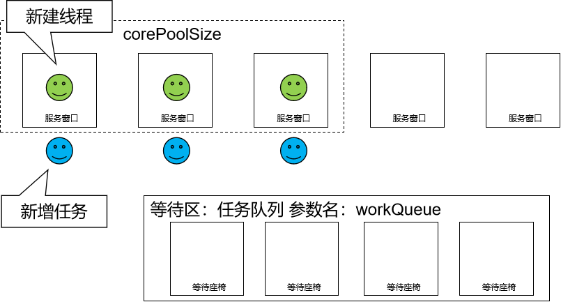

    

  - 【**反直觉**】如果正在运行的线程数量大于或等于 corePoolSize，那么将这个任务放入队列；

    

    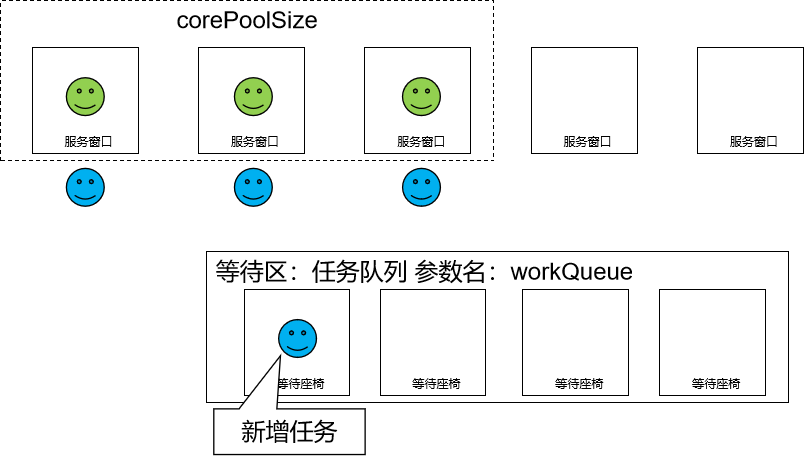

    

    ……

    

    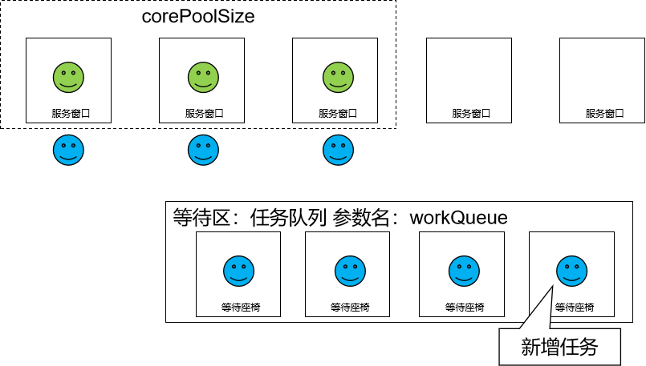

    

  - 【**反直觉**】如果这个时候队列满了且正在运行的线程数量还小于maximumPoolSize，那么还是要创建非核心线程立刻运行这个新增的任务而不是等待时间最长的任务；

    

    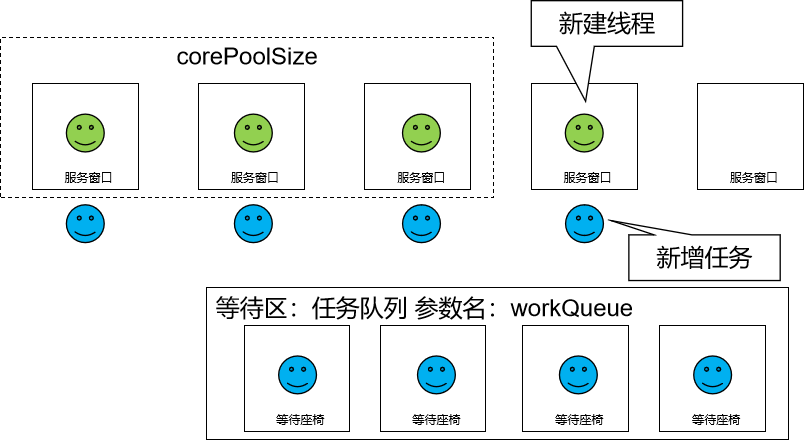

    

  - 如果队列满了且正在运行的线程数量大于或等于 maximumPoolSize，那么线程池会启动饱和拒绝策略来执行。

    

    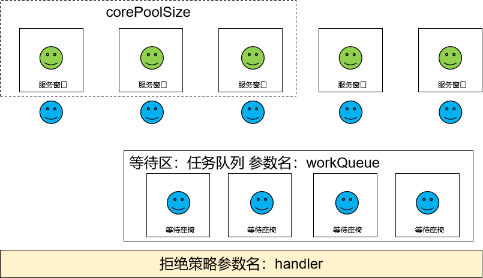

    

- 当一个线程完成任务时，它会从队列中取下一个任务来执行。

  

  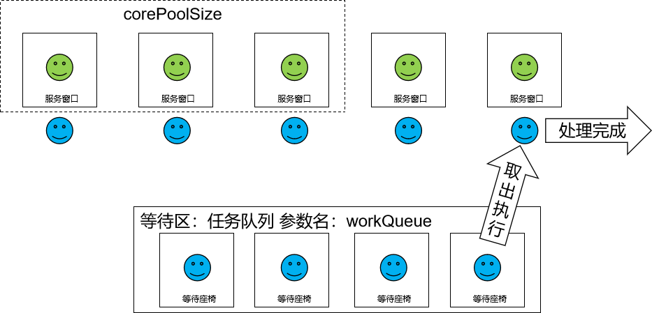

  

- 当一个线程空闲的时间超过 keepAliveTime 时，线程池会判断：

  - 当前运行线程数大于 corePoolSize：空闲时间超时线程会被停掉

    

    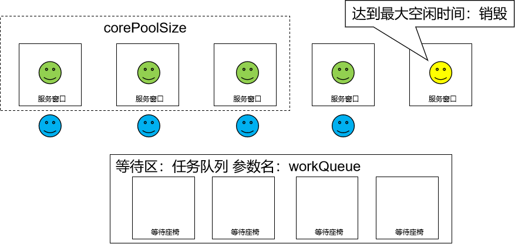

    

  - 当前运行线程数小于等于 corePoolSize：无动作（所以线程池的所有任务完成后，它最终会收缩到 corePoolSize 的大小。）

    

    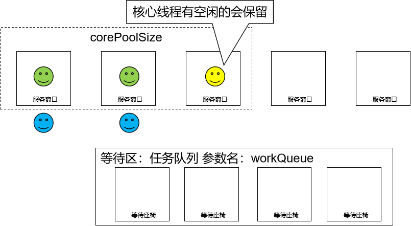

    
# 第六节 线程池的拒绝策略
一般我们创建线程池时，为防止资源被耗尽，任务队列都会选择创建有界任务队列，但这种模式下如果出现任务队列已满且线程池创建的线程数达到你设置的最大线程数时，这时就需要你指定 ThreadPoolExecutor 的 RejectedExecutionHandler 参数即合理的拒绝策略，来处理线程池 “超载” 的情况。
ThreadPoolExecutor 自带的拒绝策略如下：
- AbortPolicy(默认)：直接抛出 RejectedExecutionException 异常，阻止接收新的任务。
- CallerRunsPolicy：“调用者运行” 一种调节机制，该策略既不会抛弃任务，也不会抛出异常，而是将某些任务回退到调用者，从而降低新任务的流量。
- DiscardOldestPolicy：抛弃队列中等待最久的任务，然后把当前任务加入队列中尝试再次提交当前任务。
- DiscardPolicy：该策略默默地丢弃无法处理的任务，不予任何处理也不抛出异常。如果允许任务丢失，这是最好的一种策略。
以上内置的策略均实现了 RejectedExecutionHandler 接口，也可以自己扩展 RejectedExecutionHandler 接口，定义自己的拒绝策略。
# 第七节 自定义线程池
在《阿里巴巴 Java 开发手册》中指出了线程资源必须通过线程池提供，不允许在应用中自行显式的创建线程，这样一方面是线程的创建更加规范，可以合理控制开辟线程的数量；另一方面线程的细节管理交给线程池处理，优化了资源的开销。同时线程池不允许使用 Executors 去创建，而要通过 ThreadPoolExecutor 方式，这一方面是由于 JDK 中 Executor 框架虽然提供了如 newFixedThreadPool()、newSingleThreadExecutor()、newCachedThreadPool() 等创建线程池的方法，但都有其局限性，不够灵活；使用 ThreadPoolExecutor 有助于大家明确线程池的运行规则，创建符合自己的业务场景需要的线程池，避免资源耗尽的风险。
本质上，自定义线程池同样是通过指定 7 个必要参数，创建 ThreadPoolExecutor 对象：
```java
public static void main(String[] args) {

        // 1、准备好创建线程池对象需要使用的七个参数
        // ①核心线程数
        int corePoolSize = 3;
        // ②最大线程数
        int maximumPoolSize = 5;
        // ③空闲线程的超时时间
        int keepAliveTime = 5;
        // ④空闲线程的超时时间的单位
        TimeUnit timeUnit = TimeUnit.SECONDS;
        // ⑤创建线程对象的工程
        ThreadFactory factory = Executors.defaultThreadFactory();
        // ⑥拒绝策略
        RejectedExecutionHandler handler =

                // 在超出任务处理能力后会抛出异常：java.util.concurrent.RejectedExecutionException
                // new ThreadPoolExecutor.AbortPolicy();

                // 将任务返还给调用者
                // new ThreadPoolExecutor.CallerRunsPolicy();

                // 抛弃等待时间最长的任务
                // new ThreadPoolExecutor.DiscardOldestPolicy();

                // 抛弃任务，啥事儿都不干
                new ThreadPoolExecutor.DiscardPolicy();

                /*new RejectedExecutionHandler() {
                    @Override
                    public void rejectedExecution(Runnable r, ThreadPoolExecutor executor) {
                        System.out.println("自定义拒绝策略");
                    }
                };*/

        // ⑦阻塞队列
        int waitingTaskCount = 5;

        BlockingQueue workQueue = new ArrayBlockingQueue(waitingTaskCount);

        // 2、创建对象
        ExecutorService threadPoolExecutor = new ThreadPoolExecutor(
                corePoolSize,
                maximumPoolSize,
                keepAliveTime,
                timeUnit,
                workQueue,
                factory,
                handler);

        // 3、分配任务
        try {
            for (int i = 0; i < 10; i++) {
                // 4、每隔一秒分配一个任务
                // try {TimeUnit.SECONDS.sleep(1);} catch (InterruptedException e) {}
                 String taskName = UUID.randomUUID().toString().substring(0, 5).toUpperCase();
                 threadPoolExecutor.submit(() -> {
                    try {TimeUnit.SECONDS.sleep(2);} catch (InterruptedException e) {}
                    System.out.println(Thread.currentThread().getName() + " " + taskName);
                 });
            }
        } catch (Exception e) {
            e.printStackTrace();
        } finally {
            threadPoolExecutor.shutdown();
        }

    }
```


# 源码分析：

### 线程池扩容原理

1. **提交任务**：当你向线程池提交一个新的任务时，如果当前运行的线程少于核心线程数（`core pool size`），**即使有空闲线程，也会创建一个新的线程来执行该任务**。
2. **核心线程已满**：当正在运行的线程数达到核心线程数，并且有新的任务到来时，这些新任务会被放入任务队列等待执行。如果任务队列是无界的，则所有新来的任务都将被放入队列中等待现有的线程来处理它们。
3. **任务队列已满**：如果任务队列满了（对于有界队列而言），并且当前运行的线程数少于最大线程数（maximum pool size），那么线程池会创建新的线程来处理这些任务。这是线程池的“扩容”过程。
4. **超过最大线程数**：一旦运行的线程数达到了最大线程数，任何新的任务将会根据线程池的饱和策略（如抛出异常、丢弃任务或替换旧任务）进行处理。
5. **线程回收**：当线程完成任务并且在一段时间内没有新的任务可执行（由keep alive time决定），超出了核心线程数的那些线程将被终止以减少资源消耗。

### 关键点

- **核心线程数 vs 最大线程数**：这两个参数决定了线程池的大小范围。核心线程数通常是线程池保持的最小线程数量，而最大线程数则是线程池可以扩展到的最大线程数量。
- **任务队列**：任务队列用于保存等待执行的任务。其容量影响着线程池是否会扩容。
- **饱和策略**：定义了当线程数已经达到最大值且任务队列也满了的时候如何处理新来的任务。


## 一、`execute()` 方法中的扩容时机

Java `ThreadPoolExecutor` 在提交任务时，大致遵循下面这段简化版伪码的流程（以 `execute(Runnable)` 为例）：

```java
public void execute(Runnable task) {
    // 1. 如果当前线程数 < corePoolSize，优先创建核心线程来执行任务
    if (workerCount < corePoolSize) {
        if (addWorker(task, true)) return;
    }
    // 2. 核心线程已满，则尝试将任务放入等待队列
    if (workQueue.offer(task)) {
        // （可选）再次检查线程池状态：若此时线程池已 shutdown，需移除并拒绝执行
        return;
    }
    // 3. 队列已满，且当前线程数 < maximumPoolSize，则创建非核心线程（扩容）
    if (workerCount < maximumPoolSize) {
        if (addWorker(task, false)) return;
    }
    // 4. 无法再扩容，触发饱和策略
    reject(task);
}
```

- **步骤①**：先看是否还没到核心线程数（`corePoolSize`），若没到，**则无论队列是否为空、线程是否空闲，都先启动一个新线程执行。**
- **步骤②**：当核心线程都在忙时，把新任务投入阻塞队列（`workQueue`）。如果队列是无界的（如默认的 `LinkedBlockingQueue` 不指定容量），就永远不会触发扩容。
- **步骤③**：只有当队列满了（有界队列已达容量）**且**当前线程数未达上限（`maximumPoolSize`）时，才会继续创建新线程，这就是“扩容”。
- **步骤④**：若已达到 `maximumPoolSize`，则按照 `RejectedExecutionHandler`（饱和策略）来处理。

------

## 二、队列类型对扩容的影响

1. **无界队列（`LinkedBlockingQueue` 默认）**
   - 核心线程满后，所有新任务都进队列，永远不会走到“扩容”步骤③。
   - 适合任务量大且不希望因短时爆发而频繁扩容线程的场景，但可能导致队列无限增长。
2. **有界队列（`ArrayBlockingQueue` / `LinkedBlockingQueue(int capacity)`）**
   - 当队列达到容量极限，且当前线程数不到 `maximumPoolSize`，线程池才会扩容。
   - 可以控制内存利用和延迟，但要合理设置容量，防止过早扩容或任务被拒绝。
3. **直接交付队列（`SynchronousQueue`）**
   - 该队列不保存任务，提交任务必须直接被线程执行。
   - 当核心线程忙时，每来一个任务就尝试扩容，直到达到 `maximumPoolSize`，然后才开始拒绝。
   - 适合希望“快速扩容、快速回收”的场景，如构建缓存、IO 密集型短任务。

------

## 三、线程回收（缩容）

- 只有非核心线程（即超过 `corePoolSize` 的那些线程）才会被回收。
- 当这些“额外”线程闲置超过 `keepAliveTime` 后，会被终止，直到线程数回落到 `corePoolSize`。
- **可选**：通过 `allowCoreThreadTimeOut(true)` 也可以让核心线程在空闲时间后同样被回收，这样线程池可在零负载时縮至 0 线程。

------

## 四、示例：典型配置与行为对比


| 配置                                                         | 行为特征                                                     |
| :----------------------------------------------------------- | :----------------------------------------------------------- |
| `core=5, max=10, queue=unbounded`                            | 最多只有 5 个线程；队列无限长；不会扩容；不易拒绝，但可能 OOM。 |
| `core=5, max=10, queue=100`                                  | 先用 5 线程；队列可蓄积 100；再扩容到 10 线程；再满则拒绝。  |
| `core=5, max=10, queue=SynchronousQueue, handler=CallerRuns` | 先 5 线程；再每来一个任务马上扩；到 10 后，提交者自己执行（CallerRuns），不抛弃。 |

------

## 五、饱和策略简介

当无法再扩容时，`RejectedExecutionHandler` 会接管：

- `AbortPolicy`：抛出 `RejectedExecutionException`（默认）。
- `CallerRunsPolicy`：直接在调用者线程执行该任务，起到“降速”作用。
- `DiscardPolicy`：静默地丢弃任务。
- `DiscardOldestPolicy`：丢弃队列中最旧的任务，然后尝试提交当前任务。

------

### 小结

1. **“扩容”只有在“核心线程满且队列满且线程数未达最大”时才会触发**。
2. **队列类型** 决定了“核心满了以后先缓冲还是先扩容”。
3. **合理设置** `corePoolSize`、`maximumPoolSize`、`queue` 容量和 `keepAliveTime`，并选择合适的 **饱和策略**，才能让线程池在性能和资源利用间找到平衡。
