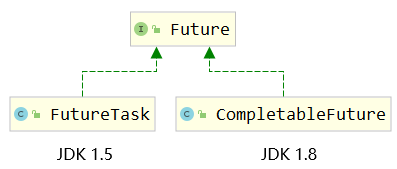
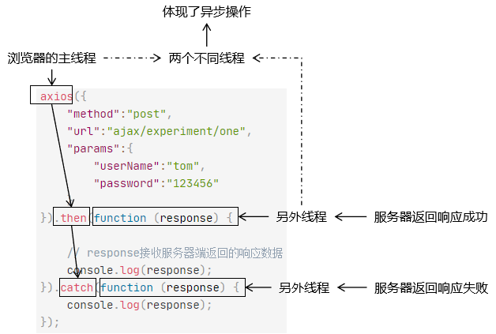
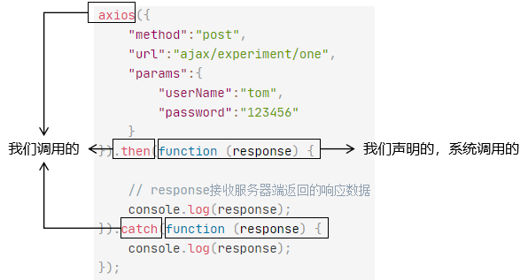
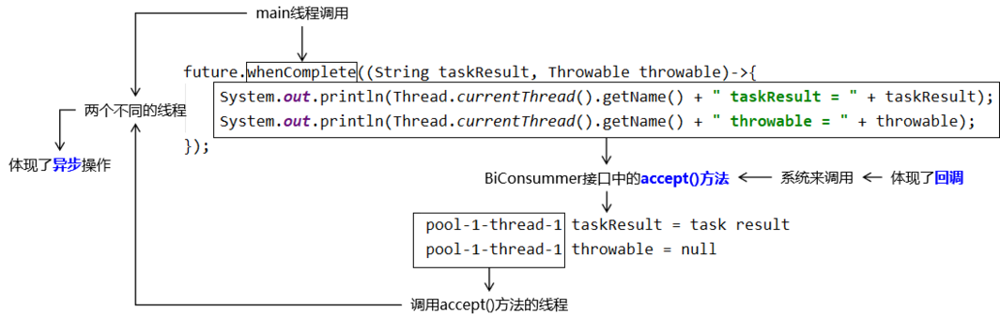
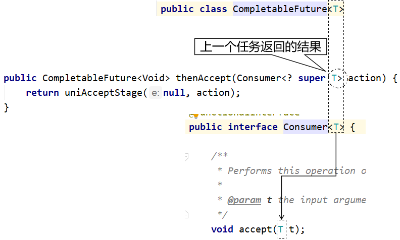
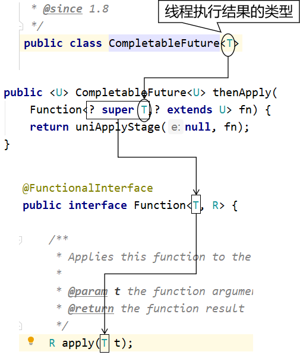
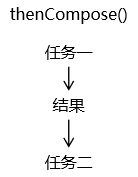
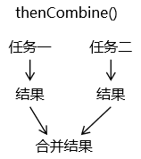
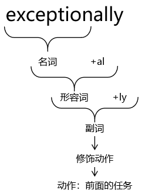

# 第一节 Future接口的局限性

从实现类的版本情况能看出，CompletableFuture是FutureTask的升级版。



## 一、Future接口回顾

java.util.concurrent.Future<V>

|                                               |                                                              |
| --------------------------------------------- | ------------------------------------------------------------ |
| 方法名                                        | 功能                                                         |
| V get()                                       | 调用get()方法获取任务结果，但是会阻塞当前线程，直到目标任务返回 |
| V get(timeout)                                | 调用get()方法获取任务结果，同样会阻塞当前线程，但是如果超过预设时间则放弃获取 |
| boolean isDone()                              | 判断目标任务是否完成<br>返回true：目标任务完成<br>返回false：目标任务未完成<br>注：正常完成、被取消、抛异常完成都算完成 |
| boolean cancel(boolean mayInterruptIfRunning) | 尝试取消当前任务。<br>如果当前任务已经结束或被取消或由于某些原因无法取消，则取消失败。<br>返回true：取消成功<br>返回false：取消失败，无法取消 |
| boolean isCancelled()                         | 判断当前任务是否被取消<br>返回true：已取消<br>返回false：未取消 |

## 二、局限性

### 1、任务结果获取方式

在Future接口下，我们只能通过调用get()方法来获取任务计算结果，但是只要目标任务没有执行完，get()方法会被阻塞——阻塞方式又回到了同步调用，这就和异步操作的初衷相违背了。

```Java
Callable<String> callable = ()->{

    // 睡 10 秒
    TimeUnit.SECONDS.sleep(10);
    return "task result";
};

FutureTask<String> futureTask = new FutureTask<>(callable);

new Thread(futureTask).start();

// 阻塞 10 秒
String taskResult = futureTask.get();
System.out.println("taskResult = " + taskResult);
```

> 我们的理想状态是使用观察者模式，当计算结果完成的时候通知监听者，采用回调的方式实现异步编程。 那什么是回调呢？ 就是我们声明方法，由系统在适当的时机调用这个方法。 CompletableFuture的whenComplete()就是这样一个方法。

### 2、取消任务之后的兜底值

调用Future接口的cancel()方法可以取消当前任务，但是取消之后呢？期待任务结果的线程无法拿到一个兜底值，代码不够优雅、流畅。而CompletableFuture的complete()方法不仅能够强制结束某个任务，而且还能够传入一个和原来任务结果类型一致的数据作为任务结果，起到一个**兜底值**的作用。这一做法**和SpringCloud中熔断、降级的思路一致**。

```Java
// 1、在 Callable 接口类型的对象中封装线程要执行的任务
Callable<String> callable = ()->{

    TimeUnit.MINUTES.sleep(10);

    return "task result";
};

// 2、创建 FutureTask 对象封装线程任务
FutureTask<String> futureTask = new FutureTask<>(callable);

// 3、启动线程执行 FutureTask 封装的任务
new Thread(futureTask, "thread-a").start();

// 4、让主线程等待一段时间
TimeUnit.SECONDS.sleep(5);

// 5、等待一段时间后，我们自己手动取消这个任务
boolean isCanceled = futureTask.cancel(true);
System.out.println("isCanceled = " + isCanceled);

// 6、把任务执行取消之后，再调用 get() 方法
String taskResult = futureTask.get();
System.out.println("taskResult = " + taskResult);
```

上面代码执行的结果：

> isCanceled = true Exception in thread "main" **java.util.concurrent.CancellationException** at java.util.concurrent.FutureTask.report(FutureTask.java:121) at java.util.concurrent.FutureTask.get(FutureTask.java:192) at com.atguigu.juc.day05.Demo04FutureCancel.main(Demo04FutureCancel.java:38)

## 三、CompletableFuture的改进

CompletableFuture相比较于Callable+FutureTask组合、相比较于Future接口定义的基础功能确实做了诸多改进：

- 支持异步回调
- 手动完成任务并返回兜底值
- 支持进一步的非阻塞调用
- 支持链式调用
- 支持多任务合并
- 支持异常处理
# 第二节 CompletableFuture设定异步任务

## 一、设定无返回值任务

```Java
// 1、创建 Runnable 类型对象封装任务内容
Runnable runnable = ()->{
    System.out.println(Thread.currentThread().getName() + " is working");
};

// 2、调用 runAsync() 方法把任务提交给线程池执行
// 由于我们没有指定线程池，所以使用 CompletableFuture 内部的线程池
CompletableFuture.runAsync(runnable);
```

## 二、为啥没执行？

### 1、奇怪的现象

CompletableFuture默认使用内部的ForkJoinPool作为线程池。主线程结束时ForkJoinPool线程池也会被关闭，在关闭之前能够执行到几个异步任务就不一定了，所以才看到这里的奇怪现象。

### 2、指定线程池

我们自己创建的线程池不会随着主线程结束而被关闭，所以能够确保任务被执行到。

```Java
// 1、创建 Runnable 类型对象封装任务内容
Runnable runnable = ()->{
    System.out.println(Thread.currentThread().getName() + " is working");
};

// 2、创建线程池对象
ExecutorService threadPool = Executors.newFixedThreadPool(5);

// 3、将异步任务提交到自己指定的线程池
CompletableFuture.runAsync(runnable, threadPool);
```

> 从这里也证明，CompletableFuture内部有线程池来执行线程任务，这也是一个比Callable+FutureTask厉害的地方。

## 三、小结

runAsync()方法声明如下：

```Java
public static CompletableFuture<Void> runAsync(Runnable runnable,
                                                   Executor executor)
```

功能：提交一个没有返回值的任务。

返回值：CompletableFuture<Void>类型的对象。

返回值意味着我们可以在调用runAsync()方法之后，继续调用CompletableFuture对象的方法，这样就实现了方法的链式调用。

# 第三节 CompletableFuture获取任务结果

## 一、设定有返回值的任务

```Java
// 1、创建线程池对象，让任务在我们自己创建的线程池中运行
ExecutorService threadPool = Executors.newFixedThreadPool(5);

// 2、创建 Supplier 类型对象，封装任务内容
Supplier<String> supplier = ()->{
    System.out.println(Thread.currentThread().getName() + " is working");
    return "task result";
};

// 3、将异步任务提交到自己指定的线程池
CompletableFuture.supplyAsync(supplier, threadPool);
```

## 二、任务结果获取方式

### 1、Future接口定义的get()方法

main线程：主动调用get()方法

#### ①API用法

```Java
// 3、将异步任务提交到自己指定的线程池
CompletableFuture<String> future = CompletableFuture.supplyAsync(supplier, threadPool);

// 4、调用 get() 方法获取任务结果
String taskResult = future.get();
System.out.println("taskResult = " + taskResult);
```

#### ②适用场景探讨

get()方法会一直阻塞到目标任务完成。


### 2、CompletableFuture的whenComplete()方法

main线程：调用whenComplete()方法设定异步回调逻辑，也就是BiConsumer接口中的void accept(T t, U u);方法

`void accept(T t, U u);`是被异步回调的，目标任务什么时候完成，accept()方法什么时候执行。

①API用法

```Java
// 3、将异步任务提交到自己指定的线程池
CompletableFuture<String> future = CompletableFuture.supplyAsync(supplier, threadPool);

// 4、设定异步回调方法
future.whenComplete((String taskResult, Throwable throwable)->{
    System.out.println("taskResult = " + taskResult);
});
```

②适用场景探讨

whenComplete()方法不会阻塞当前线程（例如：main线程），而是在目标任务完成时异步回调。


③异步回调的概念

##### [1]用我们熟悉的代码举例

异步：不在一个线程中执行的操作就是异步的



回调：一个我们声明的方法由系统来调用



##### [2]当前代码分析



##### [3]举个生活中的例子

异步回调方法VS埋地雷

|                                         |                      |
| --------------------------------------- | -------------------- |
| whenComplete()                          | 埋地雷               |
| **main线程**调用的whenComplete()方法    | **八路军**埋地雷     |
| 重写了accept()方法的BiConsumer对象      | 兵工厂生产的地雷     |
| 把BiConsumer对象传入whenComplete()      | 把地雷埋在指定的地方 |
| **pool-1-thread-1线程**调用accept()方法 | **鬼子**踩地雷       |
| 任务完成，返回结果                      | 触发地雷引信         |
| accept()方法执行                        | 地雷爆炸             |

### 3、CompletableFuture的complete()方法

#### ①方法本身的功能

强行结束任务，并返回相同类型数据。

```Java
// 1、创建 Supplier 接口类型的对象，封装线程中要执行的任务
Supplier<String> supplier = ()->{

    System.out.println(Thread.currentThread().getName() + " is working");

    try {
        TimeUnit.MINUTES.sleep(10);
    } catch (InterruptedException e) {
        e.printStackTrace();
    }

    return "task result";
};

// 2、创建线程池对象
ExecutorService threadPool = Executors.newFixedThreadPool(5);

// 3、把 Supplier 对象封装的任务提交给 CompletableFuture
CompletableFuture<String> future = CompletableFuture.supplyAsync(supplier, threadPool);

new Thread(()->{

    try {
        TimeUnit.SECONDS.sleep(8);

        // 4、在另一个线程中通过调用 complete() 方法强制结束任务
        String taskResultByComplete = "specialValue";
        boolean completeResult = future.complete(taskResultByComplete);
        System.out.println("completeResult = " + completeResult);
    } catch (InterruptedException e) {
        e.printStackTrace();
    }
}, "thread-another").start();

// 5、通过常规方式获取任务结果
System.out.println(Thread.currentThread().getName() + " 线程即将调用get()方法");
String taskResultByGet = future.get();
System.out.println("taskResultByGet = " + taskResultByGet);
```

#### ②方法背后的意义

在其它地方强制结束目标任务，并返回和正常结果类型相同的数据，能够让需要任务结果的调用者顺畅的继续执行下去（不必去对抛出的异常try...catch）。

类似于在SpringCloud调用微服务的过程中，设定熔断、降级机制。

# 第四节 CompletableFuture任务后再执行任务

## 一、执行后续任务

### 1、thenRun()方法

thenRun()方法在前面任务执行之后，再执行一个没有返回值的任务。

```Java
ExecutorService threadPool = Executors.newFixedThreadPool(5);

CompletableFuture.runAsync(() -> {
    System.out.println(Thread.currentThread().getName() + " is working");
}, threadPool).thenRun(()->{

    // 封装后续处理任务
    System.out.println(Thread.currentThread().getName() + " is behind");
});
```

### 2、thenRunAsync()方法

#### ①使用默认线程池

方法声明：CompletableFuture<Void> thenRunAsync(Runnable action)

默认使用ForkJoinPool线程池。

#### ②使用指定线程池

方法声明：CompletableFuture<Void> thenRunAsync(Runnable action, Executor executor)

使用指定线程池，在线程池中找空闲线程来执行指定的任务。此时有可能是上一个任务的线程，也可能是其它线程。

其它以Async结尾的方法工作机制相同。

## 二、消费前任务结果

### 1、代码

接收前面任务执行的结果，但是自己没有返回值。

```Java
ExecutorService threadPool = Executors.newFixedThreadPool(5);

CompletableFuture.supplyAsync(() -> {
    return "prev task result";
}, threadPool)
        
        // 封装后续任务，并接收前面任务的返回值
        .thenAccept((String prevTaskResult) -> {

    System.out.println(Thread.currentThread().getName() + " prevTaskResult = " + prevTaskResult);

});
```

### 2、泛型分析



## 三、应用前任务结果

### 1、代码

```Java
ExecutorService threadPool = Executors.newFixedThreadPool(5);

CompletableFuture.supplyAsync(() -> {
    return "prev task result";
}, threadPool)
        
        // 封装后续任务，并接收前面任务的返回值
        .thenApply((String prevTaskResult) -> {

    System.out.println(Thread.currentThread().getName() + " prevTaskResult = " + prevTaskResult);

    // 自己有返回值
    return "current task result";
}).whenComplete((String prevTaskResult, Throwable throwable)->{
    System.out.println("prevTaskResult = " + prevTaskResult);
});
```

### 2、泛型分析




# 第五节 CompletableFuture两任务组合 [了解]

## 一、任务结果纵向传递



- 方法名：thenCompose()
- 合并两个任务
- 合并的两个任务可以传递任务结果：将第一个任务的结果传给第二个任务

```Java
String finalResult = CompletableFuture.supplyAsync(() -> {

    return "first task result";
})

        // 将两个任务合并。
        // 第二个任务可以接收上一个任务的结果
        .thenCompose((String prevTaskResult) -> {

            // 封装任务的方法返回值：要求返回一个新的 CompletableFuture 对象，
            // 在这个新的对象中封装第二个任务并执行任务结果的合并
            return CompletableFuture.supplyAsync(() -> {

                // 当前任务执行的结果
                String currentTaskResult = "second task result";

                // 将两个任务的结果合并
                String composedTaskResult = prevTaskResult + "@" + currentTaskResult;

                return composedTaskResult;
            });
        })
        
        // 如果需要继续合并更多任务，那么就继续调用 thenCompose() 方法
        .thenCompose((String prevTaskResult) -> {
            return CompletableFuture.supplyAsync(() -> {

                // 当前任务执行的结果
                String currentTaskResult = "third task result";

                // 将两个任务的结果合并
                String composedTaskResult = prevTaskResult + "@" + currentTaskResult;

                return composedTaskResult;
            });
        }).get();

System.out.println("finalResult = " + finalResult);
```

## 二、任务结果横向合流



- 方法名：thenCombine
- 作用：组合两个任务，这两个任务之间不传递数据。但是通过 BiFunction 接口类型的对象将两个任务的结果合并到一起。

```Java
CompletableFuture<String> future01 = CompletableFuture.supplyAsync(() -> {
    System.out.println(Thread.currentThread().getName() + " 第一个任务。");
    return "first task result";
});

CompletableFuture<String> future02 = CompletableFuture.supplyAsync(() -> {
    System.out.println(Thread.currentThread().getName() + " 第二个任务。");
    return "second task result";
});

CompletableFuture<String> futureCombined =

        // 合并前面两个任务，通过 BiFunction 接口类型的对象接收两个任务的返回值
        future01.thenCombine(future02, (String firstTaskResult, String secondTaskResult) -> {

    String finalResult = firstTaskResult + " @ " + secondTaskResult;

    return finalResult;
});

String finalResult = futureCombined.get();

System.out.println("finalResult = " + finalResult);
```

thenAcceptBoth()

runAfterBoth()


# 第六节 CompletableFuture多任务组合

当我们希望能够根据多个任务的执行结果触发完成事件之后再执行某些操作，那么可以使用下面两个方法：

- allOf()：所涉及多个任务全部完成触发完成事件
- anyOf()：所涉及多个任务有一个完成即可触发完成事件

## 一、要求全部任务都完成

- 方法名：allOf()
- 所涉及多个任务全部完成触发完成事件
- 如果需要各个具体任务各自的结果，那就调用各自的 get() 方法

```Java
ExecutorService threadPool = Executors.newFixedThreadPool(5);

CompletableFuture<String> future01 = CompletableFuture.supplyAsync(() -> {

    System.out.println("任务 1 开始");
    try {
        TimeUnit.SECONDS.sleep(1);} catch (InterruptedException e) {}
    System.out.println("任务 1 结束");

    return "task01 result";
}, threadPool);

CompletableFuture<String> future02 = CompletableFuture.supplyAsync(() -> {

    System.out.println("任务 2 开始");
    try {
        TimeUnit.SECONDS.sleep(2);} catch (InterruptedException e) {}
    System.out.println("任务 2 结束");

    return "task02 result";
}, threadPool);

CompletableFuture<String> future03 = CompletableFuture.supplyAsync(() -> {

    System.out.println("任务 3 开始");
    try {
        TimeUnit.SECONDS.sleep(3);} catch (InterruptedException e) {}
    System.out.println("任务 3 结束");

    return "task03 result";
}, threadPool);

// allOf 方法用来汇总各个任务
CompletableFuture<Void> future = CompletableFuture.allOf(future01, future02, future03);

// 所有具体任务全部结束，才会触发总任务 future 的完成事件
future.whenComplete((Object taskResult, Throwable throwable)->{
    System.out.println("汇总结果 = " + taskResult);
});

// 如果想要具体任务的结果，需要调用具体任务的 get() 方法
String task01Result = future01.get();
System.out.println("task01Result = " + task01Result);

String task02Result = future02.get();
System.out.println("task02Result = " + task02Result);

String task03Result = future03.get();
System.out.println("task03Result = " + task03Result);
```

## 二、要求任何一个任务完成即可

- 方法名：anyOf()
- 所涉及多个任务有一个完成即可触发完成事件，并能得到这个任务的结果
- 如果想要其它任务的结果，需要调用其它任务的 get() 方法

```Java
ExecutorService threadPool = Executors.newFixedThreadPool(5);

CompletableFuture<String> future01 = CompletableFuture.supplyAsync(() -> {

    System.out.println("任务 1 开始");
    try {
        TimeUnit.SECONDS.sleep(1);} catch (InterruptedException e) {}
    System.out.println("任务 1 结束");

    return "task01 result";
}, threadPool);

CompletableFuture<String> future02 = CompletableFuture.supplyAsync(() -> {

    System.out.println("任务 2 开始");
    try {
        TimeUnit.SECONDS.sleep(2);} catch (InterruptedException e) {}
    System.out.println("任务 2 结束");

    return "task02 result";
}, threadPool);

CompletableFuture<String> future03 = CompletableFuture.supplyAsync(() -> {

    System.out.println("任务 3 开始");
    try {
        TimeUnit.SECONDS.sleep(3);} catch (InterruptedException e) {}
    System.out.println("任务 3 结束");

    return "task03 result";
}, threadPool);

// anyOf 方法用来汇总各个任务
CompletableFuture<Object> future = CompletableFuture.anyOf(future01, future02, future03);

// 任何一个具体任务结束，都会触发总任务 future 的完成事件
future.whenComplete((Object taskResult, Throwable throwable)->{
    System.out.println("汇总结果 = " + taskResult);
});

// 如果想要具体任务的结果，需要调用具体任务的 get() 方法
String task01Result = future01.get();
System.out.println("task01Result = " + task01Result);

String task02Result = future02.get();
System.out.println("task02Result = " + task02Result);

String task03Result = future03.get();
System.out.println("task03Result = " + task03Result);
```

# 第七节 CompletableFuture善后处理

## 一、异常处理

- 作用：针对前面的所有任务，提供异常处理的功能。
- 特点：
  - 能够接收前面任务执行过程中抛出的异常对象
  - 能够在前面任务抛出异常后返回一个相同类型的备用结果，让上层程序可以继续执行（类似于 SpringCloud 中服务降级、熔断思想。）



```Java
CompletableFuture.supplyAsync(() -> {
    System.out.println("第一个任务");
    return "first task result";
}).thenApply((String prevTaskResult) -> {
    System.out.println("第二个任务 " + (10 / 0));

    return prevTaskResult;
})
        // 针对前面所有任务提供异常处理的功能
        // 需要传入的对象：Function<Throwable, ? extends T> fn 类型
        .exceptionally((Throwable t) -> {

            String exceptionFullName = t.getClass().getName();
            System.out.println("exceptionFullName = " + exceptionFullName);

            Throwable cause = t.getCause();
            System.out.println("cause.getClass().getName() = " + cause.getClass().getName());

            String message = t.getMessage();
            System.out.println("message = " + message);

            return "前面任务抛出了异常，由 exceptionally() 方法提供一个备选任务结果。";
        }).whenComplete((String finalResult, Throwable throwable)->{
    System.out.println("finalResult = " + finalResult);
    System.out.println("throwable = " + throwable);
});
```

## 二、最终总体处理

方法名：handle()

相当于在处理整个任务的过程中，在最后的环节做最后的处理。 如果前面的操作中有抛出异常，那么从 Throwable throwable 参数这里可以传进来 如果前面的操作没有抛异常，那么 Throwable throwable 参数传入的就是 null

```Java
CompletableFuture.supplyAsync(() -> {

    return "task result 0001";
}).thenApply((String prevTaskResult) -> {
    System.out.println("在第二个任务中获取到的上一个任务的结果 = " + prevTaskResult);
    return "task result 0002";
})

        // 相当于在处理整个任务的过程中，在最后的环节做最后的处理。
        // 如果前面的操作中有抛出异常，那么从 Throwable throwable 参数这里可以传进来
        // 如果前面的操作没有抛异常，那么 Throwable throwable 参数传入的就是 null
        .handle((String prevTaskResult, Throwable throwable) -> {

            System.out.println("handle 方法中获取到的上一个任务的结果 = " + prevTaskResult);

            System.out.println("handle 方法中获取到的异常：throwable = " + throwable);

            return "current task result";
        }).whenComplete((String finalResult, Throwable throwable)->{
    System.out.println("finalResult = " + finalResult);
    System.out.println("throwable = " + throwable);
});
```