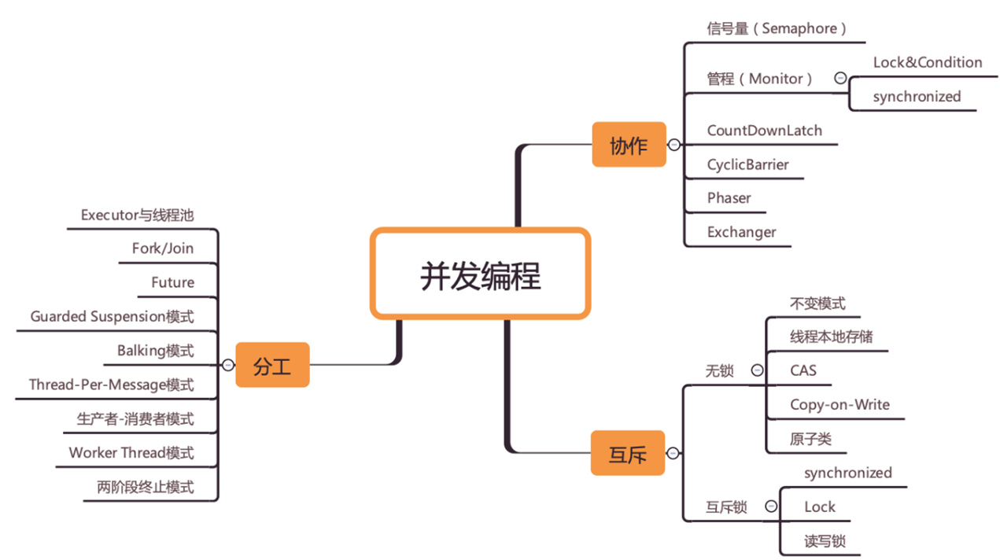

**方法论：「跳出来，看全景」 和 「钻进去，看本质」**

**全景即知识地图，本质即理论基础。**

**并发领域的问题可以抽象为三个核心问题：分工、同步和互斥。**

 

1.分工

　　分工有经典案例可供参考，比如烧水泡茶，饭店传菜；在java中比如fork/join、future、executor等，还有生产-消费者模式等。

2.同步

　　主要指线程间的合作。比如一个线程完成了任务，如何通知另一个线程。例如java中的CountDownLatch。

3.互斥

　　指同一时刻，只能有一个线程能访问共享变量。

