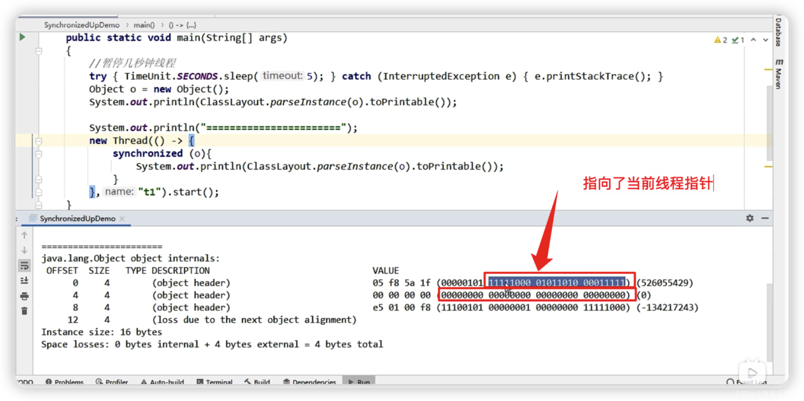
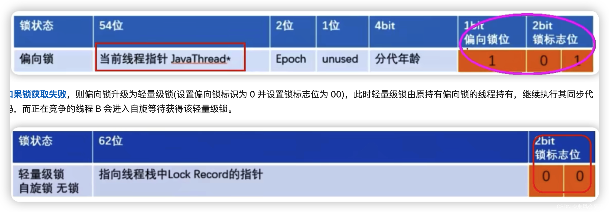
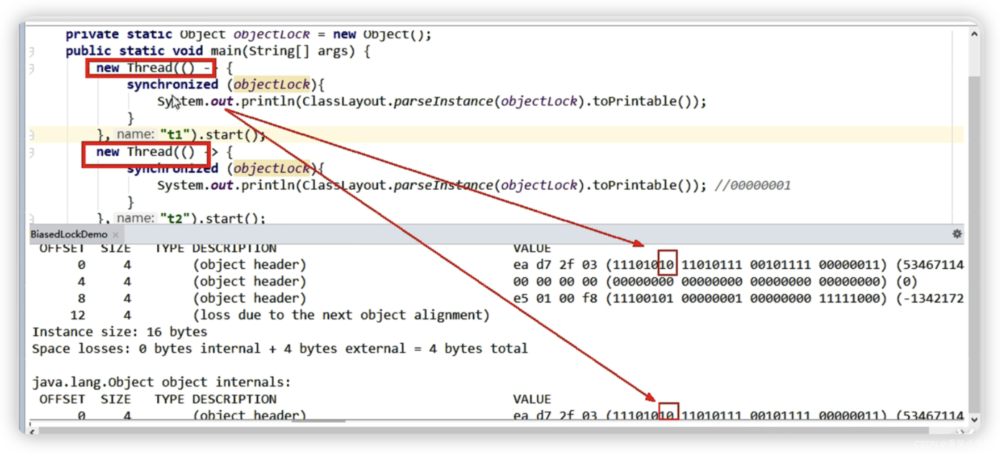
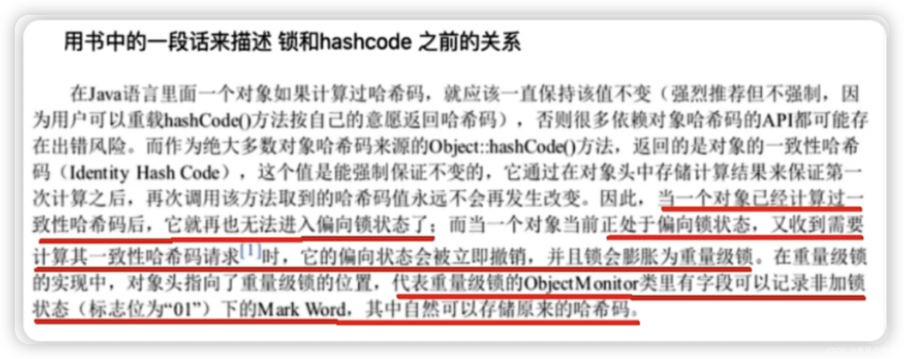

1、一些面试题
===========

谈谈你对 Synchronized 的理解

Synchronized 的锁升级你聊聊

Synchronized 的性能是不是一定弱于 Lock


2、本章路线总纲
============


> synchronized 锁优化的背景 
>
> 用锁能够实现数据的 `安全性` ，但是会带来 `性能下降` 。 
>
> 无锁能够基于线程并行提升程序性能，但是会带来 `安全性下降` 。   
>
> 求平衡？？？  


**synchronized 锁：由对象头中的 Mark Word 根据锁标志位的不同而被复用及锁升级策略**


3、Synchronized 的性能变化
========================

3.1、java5 以前，只有 Synchronized，这个是操作系统级别的重量级操作
------------------------------------------------

重量级锁，假如锁的竞争比较激烈的话，性能下降


Java5 之前，**用户态和内核态之间的切换**


 java 的线程是映射到操作系统原生线程之上的，如果要阻塞或唤醒一个线程就需要**操作系统介入**，需要在**用户态与核心态之间切换**，这种切换会消耗大量的系统资源，因为用户态与内核态都有各自专用的内存空间，专用的寄存器等，用户态切换至内核态需要传递给许多变量、参数给内核，内核也需要保护好用户态在切换时的一些寄存器值、变量等，以便内核态调用结束后切换回用户态继续工作。 

在 Java 早期版本中， `synchronized 属于重量级锁，效率低下，因为监视器锁（monitor）是依赖于底层的操作系统的 Mutex Lock 来实现的` ，挂起线程和恢复线程都需要转入内核态去完成，阻塞或唤醒一个 Java 线程需要操作系统切换 CPU 状态来完成，这种状态切换需要耗费处理器时间，如果同步代码块中内容过于简单，这种切换的时间可能比用户代码执行的时间还长”，时间成本相对较高，这也是为什么早期的 synchronized 效率低的原因 

Java 6 之后，为了减少获得锁和释放锁所带来的性能消耗， 引入了轻量级锁和偏向锁 

3.2、为什么每一个对象都可以成为一个锁？？？？
----------------------------

### **3.2.1、markOop.hpp**


Monitor 可以理解为一种同步工具，也可理解为一种同步机制，常常被描述为一个 Java 对象。 `Java 对象是天生的 Monitor ，每一个 Java 对象都有成为 Monitor 的潜质，因为在 Java 的设计中 ，每一个 Java 对象自打娘胎里出来就带了一把看不见的锁，它叫做内部锁或者 Monitor 锁`。   


Monitor 的本质是依赖于底层操作系统的 Mutex Lock 实现，操作系统实现线程之间的切换需要从用户态到内核态的转换，成本非常高。   

### **3.2.2、Monitor(监视器锁)**


**Mutex Lock**    

Monitor 是在 jvm 底层实现的，底层代码是 c++ 。 本质是依赖于底层操作系统的 Mutex Lock 实现，操作系统实现线程之间的切换需要从用户态到内核态的转换，状态转换需要耗费很多的处理器时间成本非常高。 所以 synchronized 是 Java 语言中的一个重量级操作。    

**Monitor** **与** **java** **对象以及线程是如何关联**   **？**   


1. 如果一个 java 对象被某个线程锁住，则该 java 对象的 Mark Word 字段中 LockWord 指向 monitor 的起始地址   

2. Monitor 的 Owner 字段会存放拥有相关联对象锁的线程 id  

Mutex Lock 的切换需要从用户态转换到核心态中，因此状态转换需要耗费很多的处理器时间。   

3.3、java6 开始，优化 Synchronized
--------------------------------

Java 6 之后，为了减少获得锁和释放锁所带来的性能消耗，引入了轻量级锁和偏向锁

需要有个逐步升级的过程，别一开始就捅到重量级锁

4、synchronized 锁种类及升级步骤
===========================

**4.1、多线程访问情况，3 种**
-------------------

1. 只有一个线程来访问，有且唯一 Only One   --偏向锁
2. 有 2 个线程 A、B 来交替访问  -- 轻量锁
3. 竞争激烈，多个线程来访问  -- 重量锁

**4.2、升级流程**
------------

synchronized 用的锁是存在 Java 对象头里的 Mark Word 中锁升级功能主要依赖 MarkWord 中锁`标志位和释放偏向锁标志位`

**64 位标记图再看**


### 锁指向，请牢记

- 偏向锁：MarkWord 存储的是**偏向的线程 ID**；
- 轻量锁：MarkWord 存储的是**指向线程栈中 Lock Record 的指针**；
- 重量锁：MarkWord 存储的是**指向堆中的 monitor 对象的指针**；


**4.3、无锁**
----------

```java
import org.openjdk.jol.info.ClassLayout;
public class MyObject {
    public static void main(String[] args) {
        Object o = new Object();
        System.out.println("10 进制 hash 码： " + o.hashCode());
        System.out.println("16 进制 hash 码： " + Integer.toHexString(o.hashCode()));
        System.out.println("2 进制 hash 码： " + Integer.toBinaryString(o.hashCode()));
        System.out.println(ClassLayout.parseInstance(o).toPrintable());
    }
}
```

**程序不会有锁的竞争**


- 注 1：整体从右下角往左上角看，但是每 8 位都是从左往右看

- 注 2：这个 **HashCode 调用**了才有，不然就是 0000…

  

  **layout 对应表格读取**


4.4、偏锁
----------

偏向锁：**单线程竞争**

当线程A第一次竞争到锁时，通过操作修改Mark Word中的偏向线程ID、偏向模式。如果不存在其他线程竞争，那么持有偏向锁的线程将永远不需要进行同步。

### 4.4.1、主要作用

- **当一段同步代码一直被同一个线程多次访问，由于只有一个线程访问那么该线程在后续访问时便会自动获得锁。**（不需要调用操作系统，防止不停的在用户态和内核态之间切换）

- 同一个老顾客来访，直接老规矩行方便
- 看看多线程卖票，同一个线程获得体会一下（表面上又三个线程在竞争，但实际上呈现 aaaa bbbb cccccc 这样的特性，大部分情况下都是一个线程获得票）


Hotspot 的作者经过研究发现，大多数情况下：   

多线程的情况下，锁不仅不存在多线程竞争，还存在锁 `由同一线程多次获得的情况` ， 

偏向锁就是在这种情况下出现的，它的出现是为了解决 `只有在一个线程执行同步时提高性能` 。 


备注：

偏向锁会偏向于第一个访问锁的线程，如果在接下来的运行过程中，该锁没有被其他的线程访问，则持有偏向锁的线程将永远不需要触发同步。也即**偏向锁在资源没有竞争情况下消除了同步语句**，懒的连CAS操作都不做了，直接提高程序性能


**通过 CAS 方式修改 markword 中的线程 ID**

### 4.4.2、偏向锁的持有

理论落地：   

       在实际应用运行过程中发现， “锁总是同一个线程持有，很少发生竞争” ，也就是说 `锁总是被第一个占用他的线程拥有 ， 这个线程就是锁的偏向线程` 。   

       那么只需要在锁第一次被拥有的时候，记录下偏向线程 ID 。这样偏向线程就一直持有着锁 ( 后续这个线程进入和退出这段加了同步锁的代码块时， `不需要再次加锁和释放锁` 。而是直接比较对象头里面是否存储了指向当前线程的偏向锁 ) 。   

`如果相等` 表示偏向锁是偏向于当前线程的，就不需要再尝试获得锁了，直到竞争发生才释放锁。以后每次同步，检查锁的偏向线程 ID 与当前线程 ID 是否一致，如果一致直接进入同步。无需每次加锁解锁都去 CAS 更新对象头。 **如果自始至终使用锁的线程只有一个** ，很明显偏向锁几乎没有额外开销，性能极高。   

`如果不等`，表示发生了竞争，锁己经不是总是偏向于同一个线程了，这个时候会尝试使用`CAS来替换 MarkWord 里面的线程 ID 为新线程的 ID`，

+ **竞争成功**，表示之前的线程不存在了，MarkWord 里面的线程 1D 为新线程的 ID，锁不会升级，仍然为偏向锁；

+ **竞争失败**，这时候可能需要升级变为轻量级锁，才能保证线程间公平竞争锁。

**注意，偏向锁只有遇到其他线程尝试竞争偏向锁时，持有偏向锁的线程才会释放锁，线程是不会主动释放偏向锁的。技术实现：**

一个 synchronized 方法被一个线程抢到了锁时，那这个方法所在的对象就会在其所在的 Mark Word 中将偏向锁修改状态位，同时还会占用前 54 位来存储县城指针作为标识。若该线程再次访问同一个 synchronized 方法时，该线程只需要去对象头的 Mark Word 中去判断一下是否有偏向锁指向本身的 ID，无需再进入 Monitor 去竞争对象了


**细化案例 Account 对象举例说明**

偏向锁的操作不用直接捅到操作系统，不涉及 `用户到内核转换 ， 不必要直接升级为最高级` ，我们以一个 account 对象的 “对象头” 为例， 


假如有一个线程执行到 synchronized 代码块的时候，JVM 使用 CAS 操作把线程指针 ID 记录到 Mark Word 当中，并修改标偏向标示，标示当前线程就获得该锁。锁对象变成偏向锁（通过 CAS 修改对象头里的锁标志位），字面意思是 “偏向于第一个获得它的线程” 的锁。执行完同步代码块后，线程并不会主动释放偏向锁。 


这时线程获得了锁，可以执行同步代码块。当该线程第二次到达同步代码块时会判断此时持有锁的线程是否还是自己（持有锁的线程 ID 也在对象头里），JVM 通过 account 对象的 Mark Word 判断：当前线程 ID 还在，说明还持有着这个对象的锁，就可以继续进入临界区工作。 `由于之前没有释放锁，这里也就不需要重新加锁 。 如果自始至终使用锁的线程只有一个` ，很明显偏向锁几乎没有额外开销，性能极高。 

**结论：JVM 不用和操作系统协商设置 Mutex(争取内核)，它只需要记录下线程 ID 就标示自己获得了当前锁，不用操作系统接入。** 

**上述就是偏向锁：在没有其他线程竞争的时候，一直偏向偏心当前线程，当前线程可以一直执行。** 

### **4.4.3、偏向锁 JVM 命令**

##### 偏向锁JVM命令

```sh
java -XX:+PrintFlagsInitial |grep BiasedLock*
```

偏向锁存在且默认开启（图片里最后一行的 false），并且有 4s 延迟


```shell
# 实际上偏向锁在JDK1.6之后是默认开启的，但是启动时间有延迟，
# 所以需要添加参数-XX:BiasedLockingStartupDelay=0，让其在程序启动时立刻启动。

#开启偏向锁 + 延时0：
-XX:+UseBiasedLocking -XX:BiasedLockingStartupDelay=0
#
 关闭偏向锁：关闭之后程序默认会直接进入------------------------------------------>>>>>>>>   轻量级锁状态。
 -XX:-UseBiasedLocking
```

### 4.4.4、Code1 演示

```java
public class MyObject
{
    public static void main(String[] args)
    {
        Object o = new Object();

        new Thread(() -> {
            synchronized (o){
                System.out.println(ClassLayout.parseInstance(o).toPrintable());
            }
        },"t1").start();
    }
}
```

**一切默认**

- 演示无效果，偏向锁本应该是 101，000 是轻量级锁（无效是因为有 4s 延迟，程序直接变成了轻量级锁）

  

因为参数系统默认开启


```sh
-XX:+UseBiasedLocking                       # 开启偏向锁(默认)           
-XX:-UseBiasedLocking                       # 关闭偏向锁
-XX:BiasedLockingStartupDelay=0             # 关闭延迟(演示偏向锁时需要开启)

#参数说明：
#偏向锁在JDK1.6以上默认开启，开启后程序启动几秒后才会被激活，可以使用JVM参数来关闭延迟 -XX:BiasedLockingStartupDelay=0

#如果确定锁通常处于竞争状态则可通过JVM参数 -XX:-UseBiasedLocking 关闭偏向锁，那么默认会进入轻量级锁
```

**关闭延迟参数，启用该功能**

```
-XX:BiasedLockingStartupDelay=0
```


### 4.4.5、Code 演示 2 - 主动迎合这 4 秒的延迟

#### 主动迎合 4 秒的延迟


#### 第一种情况 - 没用 synchronized

- 确实开启了偏向锁 101，但是 o 对象未采用 synchronized 加锁，所以线程 id 是空的


#### 第二种情况 - 用 synchronized

- 使用 synchronized 锁住 o 之后，发现这五十四位指向了当前线程指针



**好日子终会到头**

- 开始有第二个线程来竞争了

### **_4.4.6、_****偏向锁的撤销**

当有另外线程逐步来竞争锁的时候，就不能再使用偏向锁了，要升级为轻量级锁

竞争线程尝试 CAS 更新对象头失败，会等待到**全局安全点**（此时不会执行任何代码）撤销偏向锁。

**撤销**

**偏向锁的撤销**   

偏向锁使用一种等到 `竞争出现才释放锁的机制` ，只有当其他线程竞争锁时，持有偏向锁的原来线程才会被撤销。   

`撤销需要等待全局安全点 (该时间点上没有字节码正在执行)` ，同时检查持有偏向锁的线程是否还在执行：   

①   第一个线程正在执行 synchronized 方法 ( `处于同步块` ) ，它还没有执行完，其它线程来抢夺，该偏向锁会被取消掉并出现 **锁升级** 。   

此时轻量级锁由原持有偏向锁的线程持有，继续执行其同步代码，而正在竞争的线程会进入自旋等待获得该轻量级锁。   

②   第一个线程执行完成 synchronized 方法 ( `退出同步块` ) ，则将对象头设置成无锁状态并撤销偏向锁，重新偏向   。   


### 4.4.7、总体流程：


### 4.4.8、题外话 - java15 逐步废弃偏向锁


4.5、轻锁
----------

### 是什么

**轻量级锁**：多线程竞争，但是**任意时刻最多只有一个线程竞争**，即不存在锁竞争太过激烈的情况，也就没有线程阻寨  【即多个线程刚刚好交替执行】

### 主要作用

- 有线程来参与锁的竞争，但是获取锁的冲突时间极短
- **本质就是自选锁 CAS**

### 64 位标记图再看


### 轻量级锁的获取

轻量级锁是为了在线程**近乎交替**执行同步块时提高性能。

**主要目的：**在没有多线程竞争的前提下，`通过 CAS 减少`重量级锁使用操作系统互斥量产生的性能消耗．`说白了先自旋，不行才升级阻寨`。

**升级时机：**当关闭偏向锁功能或多线程竞争偏向锁会导致偏向锁升级为轻量级锁


假如线程 A 己经拿到锁，这时线程 B 又来抢该对象的锁，由于该对象的锁己经被线程 A 拿到，当前该锁己是偏向锁了。而线程 B 在争抢时发现对象头 Mark Ward 中的线程 ID 不是线程 B 自己的线程 1D(而是线程 A)，那线程 B 就会进行`CAS`操作希望能获得锁。**此吋线程 B 操作中有两种情况：**

**如果锁获取成功**，直接替换 Mark Word 中的线程 1D 为 B 自己的 iD(A—B)．重新偏向于其他线程 (即将偏向锁交给其他线程，相当于当前线程 "被" 释放了锁)，该锁会保持偏向锁状态，A 线程 Over，B 线程上位：


**如果锁获取失败**，则偏向锁升级为轻量级锁 (设置偏向锁标识为 0 并设置锁标志位为 00)，此时轻量级锁由原持有偏向锁的线程持有，继续执行其同步代码，而正在竞争的线程 B 会进入自旋等待获得该轻量级锁。



#### 补充说明

**轻量级锁的加锁**

JVM 会为每个线程在当前线程的栈帧中**创建用于存储锁记录的空间**，官方成为`Displaced Mark Word`。若一个线程获得锁时发现是轻量级锁，会把锁的 MarkWord 复制到自己的 Displaced Mark Word 里面。然后线程尝试用 CAS 将锁的 MarkWord 替换为指向锁记录的指针。如果成功，当前线程获得锁，如果失败，表示 Mark Word 已经被替换成了其他线程的锁记录，说明在与其它线程竞争锁，当前线程就尝试使用自旋来获取锁。


自旋 CAS：不断尝试去获取锁，能不升级就不往上捅，尽量不要阻寨


**轻量级锁的释放**

在释放锁时，当前线程会使用 CAS 操作将 Displaced Mark Word 的内容复制回锁的 Mark Word 里面。如果没有发生竞争，那么这个复制的操作会成功。如果有其他线程因为自旋多次导致轻量级锁升级成了重量级锁，那么 CAS 操作会失败，此时会释放锁并唤醒被阻寨的线程。

### Code 演示

#### 如果关闭偏向锁，就可以直接进入轻量级锁

`-XX:-UseBiasedLocking`


### 步骤流程图示

- 轻量级锁状态下，CAS 自旋达到一定次数也会**升级为重量级锁**


### 自旋达到一定次数和程度

#### java6 之前

- 了解即可-`XX:PreBlockSpin=10`


#### java6 之后

【**自适应自选锁**】的大致原理

线程如果自旋成功了，那下次自旋的最大次数会增加，因为 JVM 认为既然上次成功了，那么这一次也很大概率会成功。反之

如果很少会自旋成功，那么下次会减少自旋的次数甚至不自旋，避免 CPU 空转。

- 总之，自适应意味着自选的次数不是固定不变的，而是根据：**同一个锁上一次自旋的时间**和**拥有锁线程的状态来决定**。

### 轻量锁和偏向锁的区别和不同

- 争夺轻量级锁失败时，自旋尝试抢占锁
- 轻量级锁每次退出同步块都需要释放锁，而偏向锁是在竞争发生时才释放锁

4.6、重锁
----------

有大量的线程参与锁的竞争，冲突性很高

### 锁标志位


### 重量级锁原理

Java 中 synchronized 的重量级锁，是基于进入和退出 Monitor 对象实现的。在编译时会将同步块的开始位置插入`monitor enter`指令，在结束位置插入`monitor exit`指令。

当线程执行到 monitor enter 指令时，会尝试获取对象所对应的 Monitor 所有权，如果获取到了，即获取到了锁，会在 Monitor 的 owner 中存放当前线程的 id，这样它将处于锁定状态，除非退出同步块，否则其他线程无法获取到这个 Monitor。

### **Code 演示**



4.7、小总结
-----------

### 锁升级发生后，hashcode 去哪啦


#### 说明

锁升级为轻量级或重量级锁后，Mark Word 中保存的分别是线程栈帧里的锁记录指针和重量级锁指针，己经没有位置再保存哈希码，GC 年龄了，那么这些信息被移动到哪里去了呢？



- 用更加通俗的话解释（四种锁的不同情况）

**在无锁状态下**，Mark Word 中可以存储对象的 identity hash code 值。当对象的 hashCode() 方法第一次被调用时，JVM 会生成对应的 identity hash code 值并将该值存储到 Mark Word 中。

**对于偏向锁**，在线程获取偏向锁时，会用 Thread |D 和 epoch 值覆盖 identity hash code 所在的位置。如果一个对象的 hashCode() 方法己经被调用过一次之后，这个对象**不能**被设置偏向锁。因为如果可以的化，那 Mark Word 中的 identity hash code 必然会被偏向线程 Id 给覆盖，这就会造成同一个对象前后两次调用 hashCode() 方法得到的结果不一致。

**升级为轻量级锁时**，JVM 会在当前线程的栈帧中创建一个**锁记录 (Lock Record) 空间**，用于存储锁对象的 Mark Word 拷贝，该拷贝中可以包含 identity hash code，所以**轻量级锁可以和 identity hash code 共存**，哈希码和 GC 年龄自然保存在此，释放锁后会将这些信息写回到对象头。

**升级为重量级锁后**，Mark Word 保存的重量级锁指针，代表重量级锁的 **ObjectMonitor 类**里有字段记录非加锁状态下的 **Mark Word**，锁释放后也会将信息写回到对象头。

#### code01

- 当一个对象已经计算过 identity hash code，它就无法进入偏向锁状态，跳过偏向锁，直接升级轻量级锁


#### code02

- 在偏向锁的状态中遇到一致性哈希计算请求，立马**撤销**偏向模式，**膨胀为重量级锁**


### 各种锁优缺点、synchronized 锁升级和实现原理


synchronized 锁升级过程总结：**一句话，就是先自旋，不行再阻塞**。
实际上是把之前的悲观锁（重量级锁）变成在一定条件下使用偏向锁以及使用轻量级（自旋锁 CAS）的形式

synchronized 在修饰方法和代码块在字节码上实现方式有很大差异，但是内部实现还是基于对象头的 MarkWord 来实现的。
JDK1.6 之前 synchronized 使用的是重量级锁，**JDK1.6 之后进行了优化，拥有了无锁 -> 偏向锁 -> 轻量级锁 -> 重量级锁的升级过程**，而不
是无论什么情况都使用重量级锁。

**偏向锁**：适用于单线程适用的情况，在不存在锁竞争的时候进入同步方法 / 代码块则使用偏向锁。

**轻量级锁**：适用于竞争较不激烈的情况 (这和乐观锁的使用范围类似)，存在竞争时升级为轻量级锁，轻量级锁采用的是自旋锁，**如果同步方法 / 代码块执行时间很短的话，采用轻量级锁虽然会占用 cpu 资源但是相对比使用重量级锁还是更高效**。

**重量级锁**：适用于竞争激烈的情况，如果同步方法 / 代码块执行时间很长，那么使用轻量级锁自旋带来的性能消耗就比使用重量级锁更严重，这时候就需要升级为重量级锁。

5、JIT 编译器对锁的优化
==================

JIT： Just In Time Compiler，一般翻译为即时编译器

**5.1、锁消除**
-----------

```java
/**
 * 锁消除
 * 从JIT角度看相当于无视它，synchronized (o)不存在了,
   这个锁对象并没有被共用扩散到其它线程使用，
 * 极端的说就是根本没有加这个锁对象的底层机器码，消除了锁的使用
 */
public class LockClearUPDemo
{
    static Object objectLock = new Object();//正常的

    public void m1()
    {
        //锁消除,JIT会无视它，synchronized(对象锁)不存在了。不正常的
        Object o = new Object();

        synchronized (o)
        {
            System.out.println("-----hello LockClearUPDemo"+"\t"+o.hashCode()+"\t"+objectLock.hashCode());
        }
    }

    public static void main(String[] args)
    {
        LockClearUPDemo demo = new LockClearUPDemo();

        for (int i = 1; i <=10; i++) {
            new Thread(() -> {
                demo.m1();
            },String.valueOf(i)).start();
        }
    }
}
```


**5.2、锁粗化**
-----------

```java
/**
 * 锁粗化
 * 假如方法中首尾相接，前后相邻的都是同一个锁对象，那JIT编译器就会把这几个synchronized块合并成一个大块，
 * 加粗加大范围，一次申请锁使用即可，避免次次的申请和释放锁，提升了性能
 */
public class LockBigDemo
{
    static Object objectLock = new Object();


    public static void main(String[] args)
    {
        new Thread(() -> {
            synchronized (objectLock) {
                System.out.println("11111");
            }
            synchronized (objectLock) {
                System.out.println("22222");
            }
            synchronized (objectLock) {
                System.out.println("33333");
            }
        },"a").start();

        new Thread(() -> {
            synchronized (objectLock) {
                System.out.println("44444");
            }
            synchronized (objectLock) {
                System.out.println("55555");
            }
            synchronized (objectLock) {
                System.out.println("66666");
            }
        },"b").start();

    }
}
```

# 6、小总结

没有锁：自由自在

偏向锁：唯我独尊

轻量锁：楚汉争霸

重量锁：群雄逐鹿