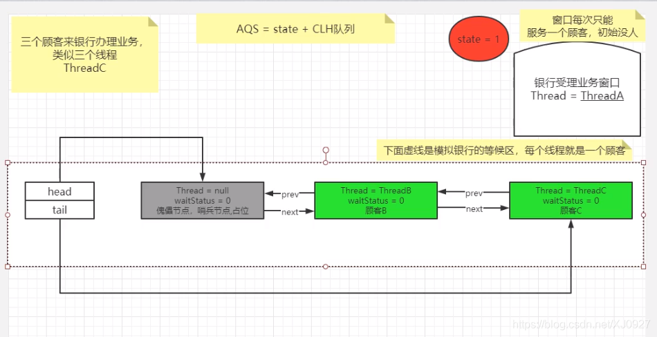

> 本文由 [简悦 SimpRead](http://ksria.com/simpread/) 转码， 原文地址 [blog.csdn.net](https://blog.csdn.net/XJ0927/article/details/113140064)

前置知识:

*   公平锁和非公平锁
*   可重入锁
*   LockSupport
*   自旋锁
*   数据结构之链表
*   设计模式之模板设计模式

是什么
---

> 字面意思：抽象的队列同步器


AbstractOwnableSynchronizer 

AbstractQueuedLongSynchronizer 

AbstractQueuedSynchronizer                   通常地：AbstractQueuedSynchronizer 简称为 AQS 

源代码：AbstractQueuedSynchronizer 简称为 AQS

> 技术翻译：是是用来实现锁或者其它同步器组件的公共基础部分的抽象实现，是重量级基础框架及整个**JUC体系的基石**，主要**用于解决锁分配给“谁”的问题**
>
> 整体就是一个抽象的**FIFO队列**来完成资源获取线程的排队工作，并通过一个**int类变量表示持有锁的状态**
>
> 这里的同步器组件指 CountDownLatch、Semaphore、ReentrantLock、ReentrantReadWriteLock 等


**锁和同步器的关系**

> 锁：面向锁的`使用者`(定义了程序员和锁交互的使用层 API，隐藏了实现细节，你调用即可)
> 
> 同步器：面向锁的`实现者`(比如 Java 并发大神 Douglee，提出统一规 范并简化了锁的实现，屏蔽了同步状态管理、阻塞线程排队和通知、唤醒机制等。)

AQS 为什么是 JUC 内容中最重要的基石
============================

和 AQS 有关的
-----------------


**ReentrantLock**


**CountDownLatch**


**ReentrantReadWriteLock**


**Semaphore**


。。。。。。

能干嘛
---

加锁会导致阻塞，有阻塞就需要排队，实现排队必然需要有某种形式的队列来进行管理

**解释说明**

抢到资源的线程直接使用处理业务，抢不到资源的必然涉及一种 `排队等候机制` 。抢占资源失败的线程继续去等待 (类似银行业务办理窗口都满了，暂时没有受理窗口的顾客只能去 `候客区排队等候` )，但等候线程仍然保留获取锁的可能且获取锁流程仍在继续 (候客区的顾客也在等着叫号，轮到了再去受理窗口办理业务)。 


既然说到了 `排队等候机制` ，那么就一定会有某种队列形成，这样的队列是什么数据结构呢？ 

如果共享资源被占用， **就需要一定的阻塞等待唤醒机制来保证锁分配** 。这个机制主要用的是 CLH 队列的变体实现的，将暂时获取不到锁的线程加入到队列中，这个队列就是 AQS 的抽象表现。它将请求共享资源的线程封装成队列的结点（ **Node** ），通过 `CAS`、`自旋`以及 `LockSupport.park()` 的方式，维护 state 变量的状态，使并发达到同步的效果。 


AQS 初识
======

官网解释：


有阻塞就需要排队，实现排队必然需要队列

AQS 使用一个 volatile 的`int类型的成员变量state`来表示同步状态，通过内置的`FIFO队列`来完成资源获取的排队工作将每条要去抢占资源的线程封装成 一个 Node 节点 来实现锁的分配，通过 **CAS** 完成对 **State** 值的修改。

  


AQS同步队列的基本结构


AQS 内部体系架构
----------


### AQS 自身


#### AQS 的 int 变量：

> AQS 的同步状态 State 成员变量
> 
> 类比，银行办理业务的受理窗口状态：
> 
> *   零就是没人，自由状态可以办理
> *   大于等于 1，有人占用窗口，等着去

```java
/**
* The synchronization state.
*/
private volatile int state;
```

#### AQS 的 CLH 队列

> CLH 队列（三个大牛的名字组成），为一个`双向队列`
> 
> 类比，银行侯客区的等待顾客


小总结：

*   有阻塞就需要排队，实现排队必然需要队列
*   state 变量 + CLH 双端 Node 队列

### 内部类 Node（Node 类在 AQS 类内部）

#### Node 的 int 变量

> Node 的等待状态`waitState`成员变量（注意与 status 状态区分，status 表示同步状态）
> 
> 类比，等候区其它顾客 (其它线程) 的等待状态
> 
>  队列中每个排队的个体就是一个 Node.

```java
volatile int waitStatus;
```

#### Node 此类的讲解

内部结构：

```java
static final class Node{
 
    //共享
    static final Node SHARED = new Node();

    //独占
    static final Node EXCLUSIVE = null;

    //线程被取消了
    static final int CANCELLED = 1;

    //后继线程需要唤醒
    static final int SIGNAL = -1;

    //等待condition唤醒
    static final int CONDITION = -2;

    //共享式同步状态获取将会无条件地传播下去
    static final int PROPAGATE = -3;

    // 初始为0，状态是上面的几种
    volatile int waitStatus;

    // 前置节点
    volatile Node prev;

    // 后继节点
    volatile Node next;

    // 当前Node线程
    volatile Thread thread;

    //指向下一个处于CONDITION 状态的节点
    Node nextWaiter;

    // ...
```

属性说明：


### 总结


CLH：Craig、Landin and Hagersten 队列，是个单向链表，AQS 中的队列是 CLH 变体的虚拟双向队列（FIFO） 

从我们的 ReentrantLock 开始解读 AQS
===========================

> Lock 接口的实现类，基本都是通过【聚合】了一个【队列同步器】的子类完成线程访问控制的

```java
Lock lock = new ReentrantLock();
```

#### ReentrantLock 原理


从最简单的lock方法开始看看公平和非公平


#### 从最简单的 lock 方法开始看看公平和非公平

通过 ReentrantLock 的源码来讲解公平锁和非公平锁 可以明显看出公平锁与非公平锁的 lock() 方法唯一的区别就在于公平锁在获取同步状态时多了一个限制条件:`hasQueuedPredecessors()`，

hasQueuedPredecessors 是公平锁加锁时判断等待队列中是否存在有效节点的方法


#### 非公平锁走起，方法 lock()

对比公平锁和非公平锁的 tryAcqure() 方法的实现代码， 其实差别就在于非公平锁获取锁时比`公平锁中少了一个判断! hasQueuedPredecessors()`

hasQueuedPredecessors() 中判断了是否需要排队，导致公平锁和非公平锁的差异如下:

*   **公平锁** ：公平锁讲究先来先到，线程在获取锁时，如果这个锁的等待队列中已经有线程在等待，那么当前线程就会进入等待队列中；
*   **非公平锁** ：不管是否有等待队列，如果可以获取锁，则立刻占有锁对象。也就是说队列的第一个排队线程在 unpark()苏醒后，不一定就是排头的这个线程获得锁，它还是需要参加竞争锁（存在线程竞争的情况下），后来的线程可能`不讲武德`插队夺锁了。


#### AQS 源码深度分析走起

需要的快捷键：

*   ctrl + alt + B：跳到实现类
*   ctrl + alt + 左箭头 / 右箭头：回到上次操作 / 回到下一次操作

##### 公平、非公平 -- tryAcquire

**公平锁：** 从 lock() 开始，依次跳…

```java
public void lock() {
    sync.lock();
}

final void lock() {
    acquire(1);
}

public final void acquire(int arg) {
    if (!tryAcquire(arg) &&
        acquireQueued(addWaiter(Node.EXCLUSIVE), arg))
        selfInterrupt();
}

//AQS
protected boolean tryAcquire(int arg) {
    throw new UnsupportedOperationException();
}

//具体实现类
protected final boolean tryAcquire(int acquires) {
    ....
}
```

**非公平锁：** 从 lock() 开始，依次跳…

```java
public void lock() {
    sync.lock();
}

final void lock() {
    if (compareAndSetState(0, 1))
        setExclusiveOwnerThread(Thread.currentThread());
    else
        acquire(1);
}

public final void acquire(int arg) {
    if (!tryAcquire(arg) &&
        acquireQueued(addWaiter(Node.EXCLUSIVE), arg))
        selfInterrupt();
}

protected boolean tryAcquire(int arg) {
    throw new UnsupportedOperationException();
}

protected final boolean tryAcquire(int acquires) {
    return nonfairTryAcquire(acquires);
}

final boolean nonfairTryAcquire(int acquires) {
    ....
}
```

无论是公平还是非公平，最终都会走向`tryAcquire`


##### 银行案例

> 带入一个银行办理业务的案例来模拟我们的 AQS 如何进行线程的管理和通知唤醒机制 ：
> 
> 3 个线程模拟 3 个来银行网点，受理窗口办理业务的顾客

```java
package com.aqs.locksupport;

import java.util.concurrent.TimeUnit;
import java.util.concurrent.locks.ReentrantLock;

public class AQSDemo {
    public static void main(String[] args) {
        
        //非公平锁
        ReentrantLock lock = new ReentrantLock();
        // A B C三个顾客，去银行办理业务，A先到，此时窗口空无一人，他优先获得办理窗口的机会，办理业务。
        // A 耗时严重，估计长期占有窗口

        new Thread(() -> {
            lock.lock();
            try {
                System.out.println("-----A thread come in");
                try {
                    TimeUnit.MINUTES.sleep(20);
                } catch (Exception e) {
                    e.printStackTrace();
                }
            } finally {
                lock.unlock();
            }
        }, "A").start();


        //B是第2个顾客，B一看到受理窗口被A占用(只能一个线程持有锁)，只能去候客区等待，进入AQS队列，等待着A办理完成，尝试去抢占受理窗口。
        new Thread(() -> {
            lock.lock();
            try {
                System.out.println("-----B thread come in");
            } finally {
                lock.unlock();
            }
        }, "B").start();

        //C是第3个顾客，C一看到受理窗口被A占用，只能去候客区等待，进入AQS队列，等待着A办理完成，尝试去抢占受理窗口,前面是B顾客，FIFO
        // 进入候客区
        new Thread(() -> {
            lock.lock();
            try {
                System.out.println("-----C thread come in");
            } finally {
                lock.unlock();
            }
        }, "C").start();
    }
}
```


##### lock 方法分析

A 顾客过来办理业务，由于是非公平方式，走下面这条路

```java
final void lock() {
    if (compareAndSetState(0, 1))
        setExclusiveOwnerThread(Thread.currentThread());
    else
        acquire(1);
}

protected final boolean compareAndSetState(int expect, int update) {
    // See below for intrinsics setup to support this
    return unsafe.compareAndSwapInt(this, stateOffset, expect, update);
}
```

由于 state 的状态确实为 0，和 CAS 预估值一样，CAS 操作成功，将 state 值改为 1，同时将 Node 节点中的线程设置为当前线程 A


初始状态：  


第一个顾客来之后：


##### acquire() 方法分析

第二个顾客过来：

```java
final void lock() {
    if (compareAndSetState(0, 1))
        setExclusiveOwnerThread(Thread.currentThread());
    else
        acquire(1);
}
```


此时 state 的状态值为 1，代表锁已经被A线程占有，CAS 失败，走`acquire()`方法

```java
public final void acquire(int arg) {
    if (!tryAcquire(arg) &&
        acquireQueued(addWaiter(Node.EXCLUSIVE), arg))
        selfInterrupt();
}
```

先走`tryAcquire()`方法，如果成功就返回`ture`，取反返回`false`，就不走后面的方法

```java
//具体实现
protected final boolean tryAcquire(int acquires) {
    return nonfairTryAcquire(acquires);
}
```

```java
final boolean nonfairTryAcquire(int acquires) {
    final Thread current = Thread.currentThread(); //获取当前线程：此时是顾客B ；A还在持有锁
    int c = getState(); //获取state状态，此时值为1
    if (c == 0) {
        if (compareAndSetState(0, acquires)) {
            setExclusiveOwnerThread(current);
            return true;
        }
    }
    else if (current == getExclusiveOwnerThread()) {
        int nextc = c + acquires;
        if (nextc < 0) // overflow
            throw new Error("Maximum lock count exceeded");
        setState(nextc);
        return true;
    }
    return false;
}
```

下面对这个类中的两个判断进行分别解读：

情况 1：顾客 B 此时走入大厅，发现柜台有人在办理业务，需要去候客区排队，刚准备坐下时，此时顾客 A 办理完成，就直接去窗口办理：判断当前 state 状态是否为 0，如果为 0，进行 CAS 操作，将 state 设置为 1

```java
if (c == 0) {
    if (compareAndSetState(0, acquires)) {
        setExclusiveOwnerThread(current);
        return true;
    }
}
```


情况 2：顾客 A 办理完，准备起身走时，发现还有件事忘记了办理，又坐下进行办理：判断当前线程是否为线程 A，如果是，将 state 的状态值 + 1，（可重入锁的实现）

总结：这两种情形都是可以获取到锁，即走`tryAcquire()`方法时返回 true

```java
else if (current == getExclusiveOwnerThread()) {
    int nextc = c + acquires;
    if (nextc < 0) // overflow
        throw new Error("Maximum lock count exceeded");
    setState(nextc);
    return true;
}

//附上state+1的方法
protected final void setState(int newState) {
    state = newState;
}
```


此时B线程进来，锁锁被占用 **return false**; 继续推进条件，走下一个方法addWaiter

```java
public final void acquire(int arg) {   
if (!tryAcquire(arg) &&  //     tryAcquire(arg) = false  取反false
    acquireQueued(addWaiter(Node.EXCLUSIVE), arg))        			  			selfInterrupt();
}
```

##### addWaiter 方法分析

但，此时两种情形都不满足：即返回`false`，取反为`true`，继续走后面的方法`addWaiter(Node.EXCLUSIVE)`

```java
public final void acquire(int arg) {
    if (!tryAcquire(arg) &&
        acquireQueued(addWaiter(Node.EXCLUSIVE), arg))
        selfInterrupt();
}
```


```java
private Node addWaiter(Node mode) { //以给定模式构造结点。mode有两种：EXCLUSIVE（独占）和SHARED（共享）
    
    Node node = new Node(Thread.currentThread(), mode);  //当前线程为B，节点为null  独占锁
    // Try the fast path of enq; backup to full enq on failure
    Node pred = tail; //tail为null
    if (pred != null) {
        node.prev = pred;
        if (compareAndSetTail(pred, node)) {
            pred.next = node;
            return node;
        }
    }
    enq(node);
    return node;
}
```

将 tail 节点赋给 pred 节点，此时就为 null，不会进入 if，走入队方法`enq(node)`

```java
private Node enq(final Node node) {//此时node为B顾客
    //CAS"自旋"，直到成功加入队尾
    for (;;) {
        Node t = tail;
        if (t == null) { // 队列为空，创建一个空的标志结点作为head结点，并将tail也指向它。
            if (compareAndSetHead(new Node()))
                tail = head;
        } else {//正常流程，放入队尾
            node.prev = t;
            if (compareAndSetTail(t, node)) {
                t.next = node;
                return t;
            }
        }
    }
}
```

注意：这是一个自旋操作，

tail 为空节点，会进入`if`判断，通过 CAS 操作设置`head`头结点的指向 新建的`new Node()`虚拟头结点（此时 Node 节点即图中的傀儡节点，不储存数据，仅用于占位）

```java
private final boolean compareAndSetHead(Node update) { //此时传入的update为一个Node空节点
    return unsafe.compareAndSwapObject(this, headOffset, null, update);
}
```


然后再将`head`头结点的执行赋给`tail`尾结点的指向

```java
tail = head;
```


完成后，由于是自旋，继续从头开始，不会走下面的 else 分支。

```java
private Node enq(final Node node) {
    for (;;) {
        Node t = tail;//此时tail执行空节点，即不为null
        if (t == null) { // Must initialize
            if (compareAndSetHead(new Node()))
                tail = head;
        } else {
            node.prev = t;//将B线程的前指针指向t节点（这里即tail节点）所执行的节点（这里即空节点）  暂时指向，竞争Tail节点成功后才会生效，否则进入CAS
            if (compareAndSetTail(t, node)) {//竞争Tail节点 成功则完成挂载，否则自旋
                t.next = node;
                return t;
            }
        }
    }
}
```

`tail`不为 null，走`else`分支，

首先：

```java
node.prev = t;//将B线程的前指针指向tail结点
```


然后：

```java
compareAndSetTail(t, node) //设置尾结点：将tail尾结点所执向的节点改为执向顾客B
```


然后：

```java
t.next = node; //将空节点的next指针指向顾客B
```


最后：`return`结束自旋！

此时，第三个顾客 C，也来办理业务，同样也没有抢到锁，需要走到`addWaiter(Node.EXCLUSIVE)`方法

```java
private Node addWaiter(Node mode) {
    Node node = new Node(Thread.currentThread(), mode);
    // Try the fast path of enq; backup to full enq on failure
    Node pred = tail; //tail节点执行顾客B
    if (pred != null) {
        node.prev = pred;
        if (compareAndSetTail(pred, node)) {
            pred.next = node;
            return node;
        }
    }
    enq(node);
    return node;
}
```

此时，tail 节点执行顾客 B，赋给 pred 节点，所以 pred 节点也执行 B，即 pred 不为 null，需要进入`if`判断

首先：

```java
node.prev = pred;//将顾客C的头指针指向顾客B
```


然后：

```java
compareAndSetTail(pred, node)//设置尾结点指向顾客C
```


最后：

```java
pred.next = node;//将顾客B的后指针指向顾客C
```



发现没有顾客 C 没有走`enq(node)`方法，也就是说此时已有哨兵节点，不需要再去创建哨兵节点进行占位。

若还有其他顾客 D、E… 走这条路依然是这样。

##### acquireQueued 方法分析

虽然顾客 B 和顾客 C 依次都入了队，但是，没有真正的阻塞，下面开始执行


通过过tryAcquire() = false【尝试获取锁失败】和addWaiter()【添加队列成功】，该线程获取资源失败，已经被放入等待队列尾部了

`acquireQueued()`方法

如果acquireQueued() 方法返回true ，表示整个加锁过程获取到锁，执行lock()之后的代码

如果acquireQueued() 方法返回false，表示整个加锁过程线程被中断，执行中断流程

```java
public final void acquire(int arg) {
    if (!tryAcquire(arg) && // !tryAcquire(arg) =true
        acquireQueued(addWaiter(Node.EXCLUSIVE), arg))//addWaiter(Node.EXCLUSIVE)  返回包装的node
        selfInterrupt(); //acquireQueued挂起中进入中断流程
}
```

```java
final boolean acquireQueued(final Node node, int arg) { //此时传入进的node为顾客B
    boolean failed = true;//标记是否成功拿到资源
    try {
        boolean interrupted = false;//标记等待过程中是否被中断过

        //又是一个“自旋”！
        for (;;) {
            final Node p = node.predecessor();//拿到当前节点的前驱
            //如果前驱是head，即该结点已成老二，那么便再去试试获取锁 tryAcquire(arg)（可能是老大释放完资源唤醒自己的，当然也可能被interrupt了）。
            if (p == head && tryAcquire(arg)) {//拿到锁
                setHead(node);//拿到资源后，将head指向该结点。所以head所指的标杆结点，就是当前获取到资源的那个结点或null。
                p.next = null;// help GC // setHead中node.prev已置为null，此处再将head.next置为null，就是为了方便GC回收以前的head结点。也就意味着之前拿完资源的结点出队了！
                failed = false; // 成功获取资源
                return interrupted;//返回等待过程中是否被中断过
            }

            //如果自己可以休息了，就通过park()进入waiting状态，直到被unpark()。如果不可中断的情况下被中断了，那么会从park()中醒过来，发现拿不到资源，从而继续进入park()等待。
            if (shouldParkAfterFailedAcquire(p, node) &&
                parkAndCheckInterrupt())
                interrupted = true;//如果等待过程中被中断过，哪怕只有那么一次，就将interrupted标记为true
        }
    } finally {
        if (failed) // 如果等待过程中没有成功获取资源（如timeout，或者可中断的情况下被中断了），那么取消结点在队列中的等待。
            cancelAcquire(node);
    }
}
```

这里又是一个自旋

首先：

```java
final Node p = node.predecessor();//获取当前node的前驱结点
//附上源码
final Node predecessor() throws NullPointerException {
    Node p = prev;//prev为头指针，将其指向的节点付给p
    if (p == null)
        throw new NullPointerException();
    else
        return p;
}
```

然后：`p=head`相等，进入`tryAcquire`方法，再次尝试获取锁，假设现在依然抢不到锁，不能继续往下走，进入下一个`if`判断

```java
if (shouldParkAfterFailedAcquire(p, node) &&
    parkAndCheckInterrupt())
    interrupted = true;
```

```java
private static boolean shouldParkAfterFailedAcquire(Node pred, Node node) {//B线程进入时，此时pred为哨兵节点
    
    //获取前驱结点的状态
    int ws = pred.waitStatus;//此时为0
    //如果SIGNAL状态，即当前节点的前驱结点占用着资源，当前节点的等待被占用的资源释放，直接返回true，
    if (ws == Node.SIGNAL)//-1   含义：前一个节点的状态为正在工作，后续节点需要等待
        /*
             * This node has already set status asking a release
             * to signal it, so it can safely park.
             */
        return true;
    
   //  ws 大于0说明是CANCELLED状态
    if (ws > 0) {
        /*
             * Predecessor was cancelled. Skip over predecessors and
             * indicate retry.
             */
       // 循环判断前驱节点的前驱节点是否也为CANCELLED状态，忽略该状态的节点，重新连接队列
        do {
            node.prev = pred = pred.prev;
        } while (pred.waitStatus > 0);
        pred.next = node;
    } else { //将当前节点的前驱节点设置为设置为SIGNAL 状态，用于后续唤醒操作
        /*
             * waitStatus must be 0 or PROPAGATE.  Indicate that we
             * need a signal, but don't park yet.  Caller will need to
             * retry to make sure it cannot acquire before parking.
             */
        compareAndSetWaitStatus(pred, ws, Node.SIGNAL);
    }
    return false;
}
```

进入：

```java
compareAndSetWaitStatus(pred, ws, Node.SIGNAL);//设置waitStatus为-1
```

由于是自旋，再次进入`acquireQueued`，尝试获取锁，获取失败，同理又进入`shouldParkAfterFailedAcquire`方法，但此时`waitStatus`值为 1，所以进入下列`if`

```java
if (ws == Node.SIGNAL)
    /*
             * This node has already set status asking a release
             * to signal it, so it can safely park.
             */
    return true;
```

> 补充 state状态值
>
> 


`shouldParkAfterFailedAcquire`返回为`true`，继续向下执行  `parkAndCheckInterrupt()`

```java
if (shouldParkAfterFailedAcquire(p, node) &&
    parkAndCheckInterrupt())
    interrupted = true;


//此时：真正被阻塞挂起，等待其他释放锁
private final boolean parkAndCheckInterrupt() {
    //线程挂起，程序不会继续向下执行
    LockSupport.park(this);
 //   根据 park 方法 API描述，程序在下述三种情况会继续向下执行
 //    1．被 unpark
 //    2． 被中断（interrupt）
 //    3．其他不合逻辑的返回才会继续向下执行
 //    因上述三种情况程序执行至此，返回当前线程的中断状态，并清空中断状态
 //    如果由于被中断，该方法会返回 true
    
    return Thread.interrupted();
}
```

这个时候，才调用`park()`方法，将线程进行阻塞！！！


顾客 C 同理，都被阻塞在这里，直到拿到许可证，才可被依次放行

##### unlock() 方法

此时顾客 A 办理完业务，准备释放锁，走到`tryRelease`方法

```java
public void unlock() {
    sync.release(1);
}

public final boolean release(int arg) {
    if (tryRelease(arg)) {
        Node h = head;
        if (h != null && h.waitStatus != 0)
            unparkSuccessor(h);
        return true;
    }
    return false;
}

protected boolean tryRelease(int arg) {
    throw new UnsupportedOperationException();
}
//具体实现
protected final boolean tryRelease(int releases) {
    int c = getState() - releases;//减去1后，此时c就为0
    if (Thread.currentThread() != getExclusiveOwnerThread())
        throw new IllegalMonitorStateException();
    boolean free = false;
    if (c == 0) {
        free = true;
        setExclusiveOwnerThread(null); //将当前拥有锁的线程设置为null
    }
    setState(c); //同时设置state值为0
    return free;
}
```

返回`true`，进入`release`方法的 if 语句

```java
public final boolean release(int arg) {
    if (tryRelease(arg)) {
        Node h = head;//将头节点赋给h
        if (h != null && h.waitStatus != 0)//h的waitStarus状态值为-1
            unparkSuccessor(h);
        return true;
    }
    return false;
}
```

进入`unparkSuccessor(h)`方法：

```java
private void unparkSuccessor(Node node) {
    /*
         * If status is negative (i.e., possibly needing signal) try
         * to clear in anticipation of signalling.  It is OK if this
         * fails or if status is changed by waiting thread.
         */
    int ws = node.waitStatus;  //此时为-1
    if (ws < 0)
        compareAndSetWaitStatus(node, ws, 0); //进入，通过CAS操作将状态设置为0

    /*
         * Thread to unpark is held in successor, which is normally
         * just the next node.  But if cancelled or apparently null,
         * traverse backwards from tail to find the actual
         * non-cancelled successor.
         */
    Node s = node.next;//下一个需要唤醒的结点s
    if (s == null || s.waitStatus > 0) {//如果为空或已取消
        s = null;
        for (Node t = tail; t != null && t != node; t = t.prev)// 从后向前找。
            if (t.waitStatus <= 0)//从这里可以看出，<=0的结点，都是还有效的结点。
                s = t;
    }
    //s != null如果队列中无等待节点，不需要unpark。因为之前已经重置锁state = 0，新进来的线程直接进入tryAcquire(),方法，进入state ==0 分支。【语法上也会抛空指针】
    if (s != null)
        LockSupport.unpark(s.thread); //upark唤醒线程
}
```

一句话概括：**用unpark()唤醒等待队列中最前边的那个未放弃线程**


此时，顾客 B 和顾客 C 正挂起阻塞着，这里 unpark 后，相当于给了一张许可证

顾客 B 来个回马枪！！！

顾客 B 再次来到这个方法

```java
final boolean acquireQueued(final Node node, int arg) { //顾客B
    boolean failed = true;
    try {
        boolean interrupted = false;
        for (;;) {
            final Node p = node.predecessor();
            if (p == head && tryAcquire(arg)) {
                setHead(node);
                p.next = null; // help GC
                failed = false;
                return interrupted;
            }
            if (shouldParkAfterFailedAcquire(p, node) &&
                parkAndCheckInterrupt())
                interrupted = true;
        }
    } finally {
        if (failed)
            cancelAcquire(node);
    }
}
```

尝试获取锁`tryAcquire`, 来到`nonfairTryAcquire`方法

```java
final boolean nonfairTryAcquire(int acquires) {
    final Thread current = Thread.currentThread();
    int c = getState(); // 当前资源被释放  state == 0
    if (c == 0) {
        if (compareAndSetState(0, acquires)) {
            setExclusiveOwnerThread(current);
            return true;
        }
    }
    else if (current == getExclusiveOwnerThread()) {
        int nextc = c + acquires;
        if (nextc < 0) // overflow
            throw new Error("Maximum lock count exceeded");
        setState(nextc);
        return true;
    }
    return false;
}
```

此时 state 的状态值为 0，顾客 B 进入`if`判断

```java
if (c == 0) {
    if (compareAndSetState(0, acquires)) {
        setExclusiveOwnerThread(current);
        return true;
    }
}
```

将锁的线程设置当前线程 B，返回`true`

即进入下列`if`判断

```java
if (p == head && tryAcquire(arg)) {
    setHead(node);
    p.next = null; // help GC
    failed = false;
    return interrupted;
}
```

首先：

```java
setHead(node);//设置头节点


//附上源码
private void setHead(Node node) {
    head = node; //将头节点指向顾客B
    node.thread = null; //将顾客B的线程设置为null
    node.prev = null;//前指针设置为null
}
```


然后：将哨兵节点的后指针设置为 null，此时哨兵节点等待垃圾回收

```java
p.next = null; // help GC
```


此时原顾客 B 节点就成为新的哨兵节点

同理，顾客 C 出队也是如此操作！！！

AQS 考点
------

```
# 第一个考点我相信你应该看过源码了，那么AQS里面有个变量叫State，它的值有几种？

答 3个状态：没占用是0，占用了是1，大于1是可重入锁

# 第二个考点 如果AB两个线程进来了以后，请问这个总共有多少个Node节点？
答案是3个  有一个虚拟头结点，
```

> 更好的阅读体验，推荐`语雀在线文档阅读`：[AQS 源码解读](https://www.yuque.com/learning-recoding/yuanma/aqs)

完整流程思维导图放在： [https://www.processon.com/view/5fb6590f7d9c0857dda50442](https://www.processon.com/view/5fb6590f7d9c0857dda50442)

