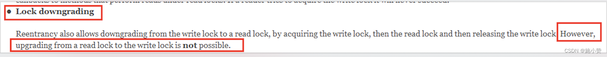

1、一些面试题
===========

无锁→独占锁→读写锁→邮戳锁


你知道 Java 里面有哪些锁?

你说你用过读写锁，锁饥饿问题是什么？

有没有比读写锁更快的锁？

StampedLock 知道吗?(邮戳锁 / 票据锁)

ReentrantReadWriteLock 有锁降级机制策略你知道吗？

**2、请你简单聊聊 ReentrantReadWriteLock**
===================================

**2.1、是什么**
-----------

读写锁定义为：一个资源能够被`多个读线程`访问，或者被`一个写线程`访问，但是不能同时存在读写线程。


#### 1、读写锁意义和特点

​		读写锁ReentrantReadWriteLock并不是真正意义上的读写分离，`它只允许读读共存`，而`读写和写写依然是互斥的`，
大多实际场景是“读/读”线程间并不存在互斥关系，只有"读/写"线程或"写/写"线程间的操作需要互斥的。因此引入ReentrantReadWriteLock。

​		一个ReentrantReadWriteLock同时只能存在一个写锁但是可以存在多个读锁，但不能同时存在写锁和读锁(切菜还是拍蒜选一个)。也即`一个资源可以被多个读操作访问或一个写操作访问，但两者不能同时进行`。


只有在**读多写少情境**之下，读写锁才具有较高的性能体现。 


2.2、特点
----------

可重入、读写分离

无锁无序→加锁→读写锁演变复习

+ 读写/写写互斥

+ 读读共存

写锁慢，可以演示出：获取写锁后，中间没有插入读锁，

读锁慢，可以演示出，获取读锁后，中间没有插入写锁，

```java
class MyResource {

    Map<String, String> map = new HashMap<>();

    //=====ReentrantLock 等价于 =====synchronized
    Lock lock = new ReentrantLock();

    //=====ReentrantReadWriteLock 一体两面，读写互斥，读读共享
    ReentrantReadWriteLock rwLock = new ReentrantReadWriteLock();


    public void write(String key, String value) {
//        lock.lock();
        rwLock.writeLock().lock();
        try {
            System.out.println(Thread.currentThread().getName() + "\t" + "---正在写入");
            map.put(key, value);
            try {
                TimeUnit.MILLISECONDS.sleep(500);
            } catch (InterruptedException e) {
                e.printStackTrace();
            }
            System.out.println(Thread.currentThread().getName() + "\t" + "---完成写入");
        } finally {
//            lock.unlock();
            rwLock.writeLock().unlock();
        }
    }


    public void read(String key) {
//        lock.lock();
        rwLock.readLock().lock();
        try {
            System.out.println(Thread.currentThread().getName() + "\t" + "---正在读取");
            String result = map.get(key);
            //暂停几秒钟线程
            try {
                TimeUnit.SECONDS.sleep(2);
            } catch (InterruptedException e) {
                e.printStackTrace();
            }
            System.out.println(Thread.currentThread().getName() + "\t" + "---完成读取result： " + result);
        } finally {
//            lock.unlock();
            rwLock.readLock().unlock();
        }
    }

}


public class ReentrantReadWriteLockDemo {


    public static void main(String[] args) {
        MyResource myResource = new MyResource();

        for (int i = 1; i <= 10; i++) {
            int finalI = i;
            new Thread(() -> {
                myResource.write(finalI + "", finalI + "");
            }, String.valueOf(i)).start();
        }

        for (int i = 1; i <= 10; i++) {
            int finalI = i;
            new Thread(() -> {
                myResource.read(finalI + "");
            }, String.valueOf(i)).start();
        }

    }
}
```

## 2.3、从写锁→读锁，ReentrantReadWriteLock 可以降级

### 《Java 并发编程的艺术》中关于锁降级的说明：

**锁降级：**将写入锁降级为读锁 (类似 Linux 文件读写权限理解，就像写权限要高于读权限一样)，

锁的严苛程度变强叫做升级，反之叫做降级。


**写锁的降级，降级成为了读锁**

1. 如果同一个线程持有了写锁，在没有释放写锁的情况下，它还可以继续获得读锁。这就是写锁的降级，降级成为了读锁。

2. 规则惯例，先获取写锁，然后获取读锁，再释放写锁的次序。

3. 如果释放了写锁，那么就完全转换为读锁。


why 锁降级？？？   保证数据可见性

见后面《Oracle 公司 ReentrantWriteReadLock 源码总结 》 

### **读写锁降级演示**

**锁降级：**遵循获取写锁→再获取读锁→再释放写锁的次序，写锁能够降级成为读锁。 

如果一个线程占有了写锁，在不释放写锁的情况下，它还能占有读锁，即写锁降级为读锁。 


重入还允许通过获取写入锁定，然后读取锁然后释放写锁从写锁到读取锁,  

但是，从读锁定升级到写锁是**不可能**的。 


**锁降级是为了让当前线程感知到数据的变化，目的是保证数据可见性**

#### 写后读,锁降级

```java
package com.atguigu.juc.rwlock;
 
import java.util.concurrent.TimeUnit;
import java.util.concurrent.locks.ReentrantReadWriteLock;
 
/**
 * 锁降级：遵循获取写锁→再获取读锁→再释放写锁的次序，写锁能够降级成为读锁。

 * 如果一个线程占有了写锁，在不释放写锁的情况下，它还能占有读锁，即写锁降级为读锁。
 */
public class LockDownGradingDemoCopy1 {
 
    public static void main(String[] args) {
 
        ReentrantReadWriteLock readWriteLock = new ReentrantReadWriteLock();
        ReentrantReadWriteLock.ReadLock readLock = readWriteLock.readLock();
        ReentrantReadWriteLock.WriteLock writeLock = readWriteLock.writeLock();
 	// 写后读   锁降低
        writeLock.lock();
        System.out.println("------- 正在写入 ");
        readLock.lock()
        System.out.println("------- 正在读取 ");
 
        writeLock.unlock();
 
    }
}
```


#### 读后写，不能锁升级  --

```java
import java.util.concurrent.TimeUnit;
import java.util.concurrent.locks.ReentrantReadWriteLock;
 
/**
 * 锁降级：遵循获取写锁→再获取读锁→再释放写锁的次序，写锁能够降级成为读锁。
 * <p>
 * 如果一个线程占有了写锁，在不释放写锁的情况下，它还能占有读锁，即写锁降级为读锁。
 */
 
public class LockDownGradingDemoCopy1 {
 
    public static void main(String[] args) {
 
        ReentrantReadWriteLock readWriteLock = new ReentrantReadWriteLock();
 
        ReentrantReadWriteLock.ReadLock readLock = readWriteLock.readLock();
 
        ReentrantReadWriteLock.WriteLock writeLock = readWriteLock.writeLock();
 
 //先读后写   不能升级  --因为可能有其他读锁正在读取，如果当前线程可以修改数据，就会造成其他线程的脏读
        readLock.lock();
        System.out.println("------- 正在读取 ");
        writeLock.lock();
        System.out.println("------- 正在写入 ");
        writeLock.unlock();
 
    }
}
```


**如果有线程在读，那么写线程是无法获取写锁的，是悲观锁的策略**

--因为可能有其他读锁正在读取，如果当前线程可以修改数据，就会造成其他线程的脏读


线程获取读锁是 不能 直接升级为写入锁的。 




在 ReentrantReadWriteLock 中，当读锁被使用时，如果有线程尝试获取写锁，该写线程会被阻塞。 

所以，需要释放所有读锁，才可获取写锁， 


### 写锁和读锁是互斥的

**写锁和读锁是互斥的** （这里的互斥是指 `线程间的互斥` ， 当前线程可以获取到写锁又获取到读锁，但是获取到了读锁不能继续获取写锁），这是因为读写锁要 `保持写操作的可见性` 。 

因为，如果允许读锁在被获取的情况下对写锁的获取，那么正在运行的其他读线程无法感知到当前写线程的操作。 

因此， 分析读写锁 _ReentrantReadWriteLock_ ，会发现它有个潜在的问题： 

_`读锁全完，写锁有望；写锁独占，读写全堵`；_ 

如果有线程正在读，写线程需要等待读线程释放锁后才能获取写锁，见前面 Case《code 演示 LockDownGradingDemo》 

即 ReadWriteLock 读的过程中不允许写 ， 只有等待线程都释放了读锁，当前线程才能获取 **写锁** ， 

也就是写入必须等待 ， 这是一种 **悲观的读锁** ，o(╥﹏╥)o，人家还在读着那，你先别去写，省的数据乱。 


==================后续讲解 _StampedLock_ 时再详细展开 ==================

分析 _StampedLock(_后面详细讲解_)_ ，会发现它改进之处在于： 

读的过程中也允许获取写锁介入 (相当牛 B，读和写两个操作也让你 “共享”(注意引号)) ，这样会导致我们读的数据就可能不一致！ 

所以，需要额外的方法来判断 读的过程中是否有写入， 这是一种 **乐观的读锁** ，O(∩_∩)O 哈哈~。   

显然乐观锁的并发效率更高，但一旦有小概率的写入导致读取的数据不一致，需要能检测出来，再读一遍就行。 


### **读写锁之读写规矩，再说降级** Oracle 公司 ReentrantWriteReadLock 源码总结

锁降级   下面的示例代码摘自 ReentrantWriteReadLock 源码中： 

ReentrantWriteReadLock 支持**锁降级**，遵**循按照获取写锁，获取读锁再释放写锁的次序**， `写锁能够降级成为读锁` ，**不支持锁升级**。 

解读在最下面: 


1 代码中声明了一个 `volatile 类型的 cacheValid 变量，保证其可见性`。

2 首先获取读锁，如果 cache 不可用，则释放读锁，获取写锁，在更改数据之前，再检查一次 cacheValid 的值，然后修改数据，将 cacheValid 置为 true，然后在释放写锁前获取读锁；此时，cache 中数据可用，处理 cache 中数据，最后释放读锁。这个过程就是一个完整的锁降级的过程，目的是保证数据可见性。 


总结：一句话，同一个线程自己持有写锁时再去拿读锁，其本质相当于重入。


**如果违背锁降级的步骤**  

如果当前的线程 C 在修改完 cache 中的数据后，没有获取读锁而是直接释放了写锁，那么假设此时另一个线程 D 获取了写锁并修改了数据，那么 C 线程无法感知到数据已被修改，则数据出现错误。 

**如果遵循锁降级的步骤**  

线程 C 在释放写锁之前获取读锁，那么线程 D 在获取写锁时将被阻塞，直到线程 C 完成数据处理过程，释放读锁。这样可以保证返回的数据是这次更新的数据，该机制是专门为了缓存设计的。 

3、面试题：有没有比读写锁更快的锁？邮戳锁 StampedLock
=====================================

**3.1、是什么**
-----------

`StampedLock 是 JDK1.8 中新增的一个读写锁`，也是对 JDK1.5 中的读写锁 ReentrantReadWriteLock 的优化。

邮戳锁也叫票据锁

stamp（戳记，long 类型）代表了锁的状态。当 stamp 返回零时，表示线程获取锁失败。并且，当释放锁或者转换锁的时候，都要传入最初获取的 stamp 值。

**3.2、它是由锁饥饿问题引出**
------------------

### **3.2.1、锁饥饿问题**

ReentrantReadWriteLock 实现了读写分离，但是一旦**读操作比较多的时候，想要获取写锁就变得比较困难**了， 

假如当前 1000 个线程，999 个读，1 个写，有可能 999 个读取线程长时间抢到了锁，那 1 个写线程就悲剧了  

因为当前有可能会一直存在读锁，而无法获得写锁， 根本没机会写，o(╥﹏╥)o 

### **3.2.2、如何缓解锁饥饿问题？**

使用 “公平” 策略可以一定程度上缓解这个问题   `new ReentrantReadWriteLock(true);`

但是 “公平” 策略是以牺牲系统吞吐量为代价的

### **3.2.3、StampedLock 类的乐观读锁闪亮登场** 

**ReentrantReadWriteLock** 

允许多个线程同时读，但是只允许一个线程写，在线程获取到写锁的时候，其他写操作和读操作都会处于阻塞状态， 读锁和写锁也是互斥的，所以在读的时候是不允许写的，读写锁比传统的 synchronized 速度要快很多， 原因就是在于 **ReentrantReadWriteLock 支持 读并发** 

 **StampedLock 横空出世** 

ReentrantReadWriteLock 的读锁被占用的时候，其他线程尝试获取写锁的时候会被阻塞。 

但是，StampedLock 采取乐观获取锁后，其他线程尝试获取写锁时 *不会被阻塞* ，这其实是对读锁的优化， 

所以， `在获取乐观读锁后，还需要对结果进行校验`。 


> 一句话
>
> 对短的只读代码段，使用乐观模式通常可以减少争用并提高吞吐量

3.3、StampedLock 的特点
-----------------------

所有`获取锁`的方法，都返回一个邮戳（Stamp），Stamp 为零表示获取失败，其余都表示成功；

所有`释放锁`的方法，都需要一个邮戳（Stamp），这个 Stamp 必须是和成功获取锁时得到的 Stamp 一致；

StampedLock 是`不可重入的，危险` (如果一个线程已经持有了写锁，再去获取写锁的话就会造成死锁)


**StampedLock 有三种访问模式**

①Reading（读模式）：功能和 ReentrantReadWriteLock 的读锁类似

②Writing（写模式）：功能和 ReentrantReadWriteLock 的写锁类似

③Optimistic reading（乐观读模式）：无锁机制，类似于数据库中的乐观锁，支持读写并发，很乐观认为读取时没人修改，假如被修改再实现升级为悲观读模式


### 传统版  演示读写互斥

```java


import java.util.concurrent.TimeUnit;
import java.util.concurrent.locks.StampedLock;


public class StampedLockDemo
{
    static int number = 37;
    static StampedLock stampedLock = new StampedLock();

    //演示写锁
    public void write()
    {
        long stamp = stampedLock.writeLock();//获取锁的时候返回邮戳
        System.out.println(Thread.currentThread().getName()+"\t"+"写线程准备修改");
        try
        {
            number = number + 13;
        }finally {
            stampedLock.unlockWrite(stamp);//用同一个邮戳解锁
        }
        System.out.println(Thread.currentThread().getName()+"\t"+"写线程结束修改");
    }

    //悲观读，读没有完成时候写锁无法获得锁
    public void read()
    {
        long stamp = stampedLock.readLock();
        System.out.println(Thread.currentThread().getName()+"\t"+" come in readlock code block，4 seconds continue...");
        for (int i = 0; i < 4; i++) {
            //暂停几秒钟线程
            try { TimeUnit.SECONDS.sleep(1); } catch (InterruptedException e) { e.printStackTrace(); }
            System.out.println(Thread.currentThread().getName()+"\t"+" 正在读取中......");
        }

        try
        {
            int result = number;
            System.out.println(Thread.currentThread().getName()+"\t"+" 获得成员变量值result："+result);
            System.out.println("写线程没有修改成功，读锁时候写锁无法介入，传统的读写互斥");
        }finally {
            stampedLock.unlockRead(stamp);
        }
    }

    public static void main(String[] args)
    {
        StampedLockDemo resource = new StampedLockDemo();

        //传统版  演示读写互斥
        new Thread(() -> {
            resource.read();//读 4s 
        },"readThread").start();

        //暂停几秒钟线程
        try { TimeUnit.SECONDS.sleep(1); } catch (InterruptedException e) { e.printStackTrace(); }

        new Thread(() -> {
            System.out.println(Thread.currentThread().getName()+"\t"+"----come in");
            resource.write();
        },"writeThread").start();

        //暂停几秒钟线程
        try { TimeUnit.SECONDS.sleep(4); } catch (InterruptedException e) { e.printStackTrace(); }

        System.out.println(Thread.currentThread().getName()+"\t"+"number:" +number);

    }
}


```

```
readThread	 come in readlock code block，4 seconds continue...
readThread	 正在读取中......
writeThread	----come in
readThread	 正在读取中......
readThread	 正在读取中......
readThread	 正在读取中......
readThread	 获得成员变量值result：37
写线程没有修改成功，读锁时候写锁无法介入，传统的读写互斥
writeThread	写线程准备修改
writeThread	写线程结束修改
main	number:50
```

### **乐观读模式 code 演示** 

```java
import java.util.concurrent.TimeUnit;
import java.util.concurrent.locks.StampedLock;

/**
 *
 * StampedLock = ReentrantReadWriteLock + 读的过程中也允许获取写锁介入
 */
public class StampedLockDemo
{
    static int number = 37;
    static StampedLock stampedLock = new StampedLock();

    //演示写锁
    public void write()
    {
        long stamp = stampedLock.writeLock();//获取锁的时候返回邮戳
        System.out.println(Thread.currentThread().getName()+"\t"+"写线程准备修改");
        try
        {
            number = number + 13;
        }finally {
            stampedLock.unlockWrite(stamp);//用同一个邮戳解锁
        }
        System.out.println(Thread.currentThread().getName()+"\t"+"写线程结束修改");
    }


    //乐观读，读的过程中也允许获取写锁介入
    public void tryOptimisticRead()
    {
        long stamp = stampedLock.tryOptimisticRead();//乐观读
        int result = number;
        //故意间隔4秒钟，很乐观认为读取中没有其它线程修改过number值，具体靠判断
        System.out.println("4秒前stampedLock.validate方法值(true无修改，false有修改)"+"\t"+stampedLock.validate(stamp));
        for (int i = 0; i < 4; i++) {
            try { TimeUnit.SECONDS.sleep(1); } catch (InterruptedException e) { e.printStackTrace(); }
            System.out.println(Thread.currentThread().getName()+"\t"+"正在读取... "+i+" 秒" +
                    "后stampedLock.validate方法值(true无修改，false有修改)"+"\t"+stampedLock.validate(stamp));
        }
        if(!stampedLock.validate(stamp)){//检测是否有人修改过
            System.out.println("有人修改过------有写操作");
            stamp = stampedLock.readLock();//手动升级为读锁
            try
            {
                System.out.println("从乐观读 升级为 悲观读");
                result = number;
                System.out.println("重新悲观读后result："+result);
            }finally {
                stampedLock.unlockRead(stamp);
            }
        }
        System.out.println(Thread.currentThread().getName()+"\t"+" finally value: "+result);
    }


    public static void main(String[] args)
    {
        StampedLockDemo resource = new StampedLockDemo();

        new Thread(() -> {
            resource.tryOptimisticRead();
        },"readThread").start();

        //暂停2秒钟线程,读过程可以写介入，演示
        //try { TimeUnit.SECONDS.sleep(2); } catch (InterruptedException e) { e.printStackTrace(); }

        //暂停6秒钟线程
        try { TimeUnit.SECONDS.sleep(6); } catch (InterruptedException e) { e.printStackTrace(); }

        new Thread(() -> {
            System.out.println(Thread.currentThread().getName()+"\t"+"----come in");
            resource.write();
        },"writeThread").start();


    }
}

```


**3.4、StampedLock 的缺点**
-----------------------

+ StampedLock 不支持重入，没有 Re 开头

+ StampedLock 的悲观读锁和写锁都不支持条件变量（Condition），这个也需要注意。

+ 使用 StampedLock 一定不要调用中断操作，即不要调用 interrupt() 方法

如果需要支持中断功能，一定使用可中断的悲观读锁 readLockInterruptibly() 和写锁 writeLockInterruptibly()