1、Doug Lea(道哥. 利)
=================

 

2、JUC 四大口诀
==========

2.1、高内聚低耦合前提下，封装思想
------------------

 线程 操作 资源类

2.2、判断、干活、通知
------------

2.3、防止虚假唤醒, wait 方法要注意使用 while 判断
---------------------------------

2.4、注意标志位 flag，可能是 volatile 的
-----------------------------

3、为什么多线程极其重要？？？
===============

3.1、硬件方面：摩尔定律失效
---------------

摩尔定律：

它是由英特尔创始人之一 Gordon Moore(戈登 · 摩尔) 提出来的。其内容为：

当价格不变时，集成电路上可容纳的元器件的数目约每隔 18-24 个月便会增加一倍，性能也将提升一倍。

换言之，每一美元所能买到的电脑性能，将每隔 18-24 个月翻一倍以上。这一定律揭示了信息技术进步的速度。

可是从 2003 年开始 CPU 主频已经不再翻倍，而是采用多核而不是更快的主频。

摩尔定律失效。

在主频不再提高且核数在不断增加的情况下，要想让程序更快就要用到 并行或并发编程。

3.2、软件方面
--------

高并发系统，异步 + 回调等生产需求

4、从 start 一个线程说起
================

4.1、Java 线程理解以及 openjdk 中的实现
----------------------------

`private native void start0();`

Java 语言本身底层就是 C++ 语言

> OpenJDK源码网址:http://openjdk.java.net/

源码位置：openjdk8\hotspot\src\share\vm\runtime

4.2、更加底层的 C++ 源码解读
------------------

### 4.2.1、openjdk8\jdk\src\share\native\java\lang

thread.c

 java 线程是通过 start 的方法启动执行的，主要内容在 native 方法 start0 中 ，

Openjdk 的写 JNI 一般是一 一对应的，Thread.java 对应的就是 Thread.c 

start0 其实就是 JVM_StartThread。此时查看源代码可以看到在 jvm.h 中找到了声明，jvm.cpp 中有实现。 

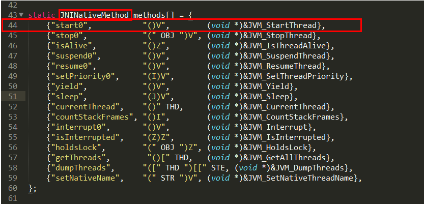

### 4.2.2、openjdk8\hotspot\src\share\vm\prims

jvm.cpp

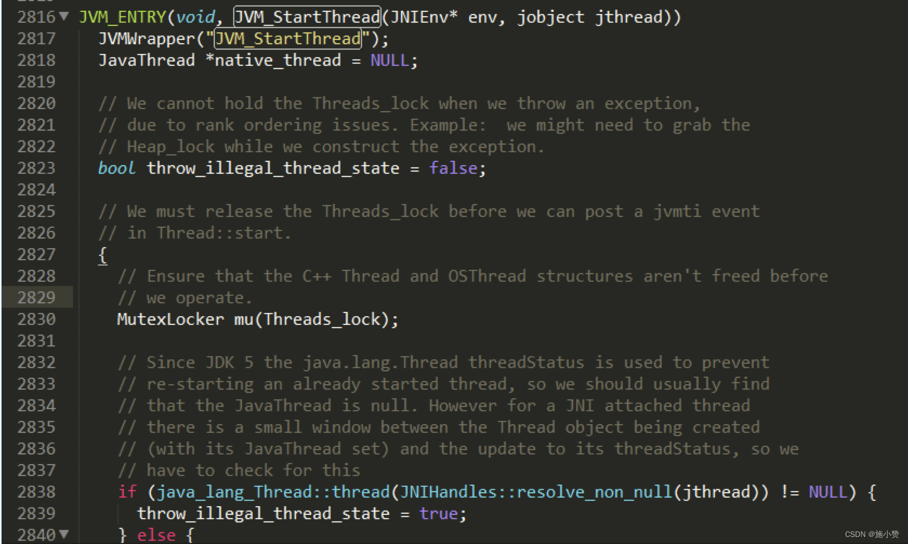

 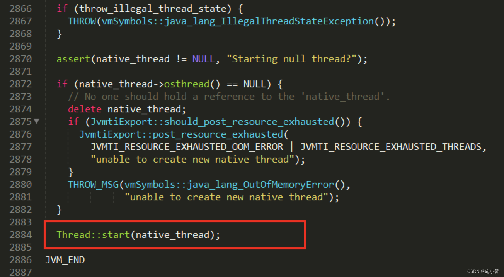

### 4.2.3、openjdk8\hotspot\src\share\vm\runtime

thread.cpp

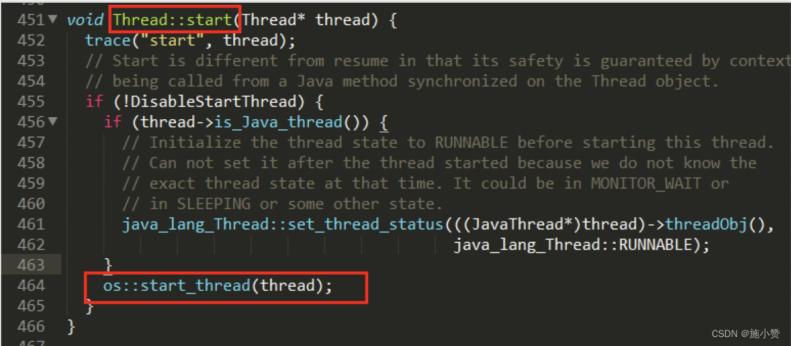

5、Java 多线程相关概念
==============


## 5.0 并发 并行

并发（concurrent）

> 是在同一实体上的多个事件
>
> 是在一台处理器上“同时”处理多个任务
>
> 同一时刻，其实是只有一个事件在发生


并行（parallel）

> 是在不同实体上的多个事件
>
> 是在多台处理器上同时处理多个任务
>
> 同一时刻，大家真的都在做事情，你做你的，


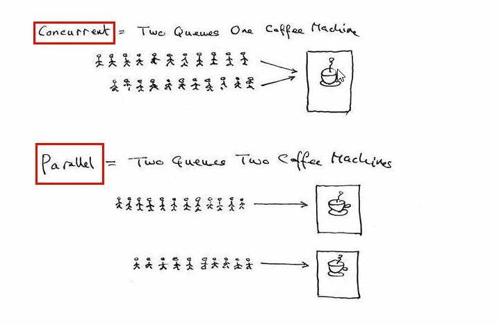

5.1、进程
------

是程序的⼀次执⾏，是系统进⾏资源分配和调度的独⽴单位，每⼀个进程都有它⾃⼰的内存空间和系统资源

5.2、线程
------

在同⼀个进程内⼜可以执⾏多个任务，⽽这每⼀个任务我们就可以看做是⼀个线程

⼀个进程会有 1 个或多个线程的

5.3、面试题：何为进程和线程？
----------------

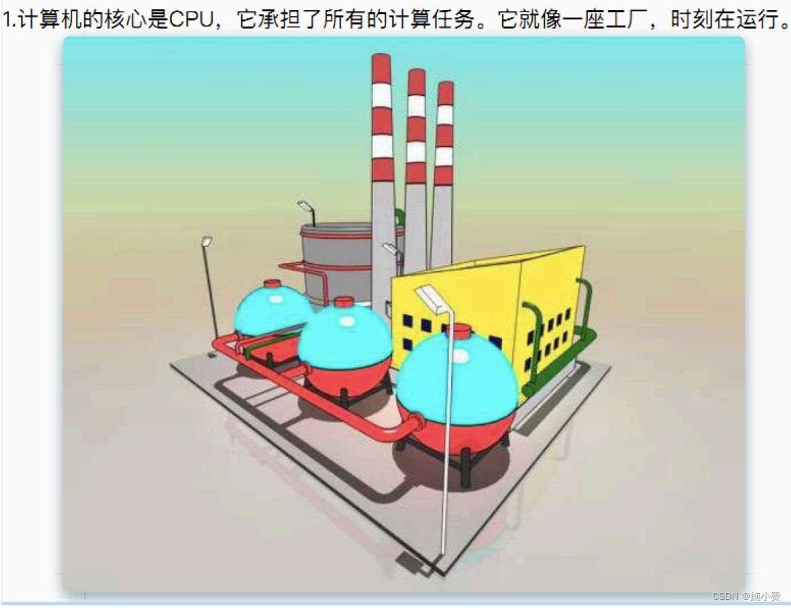 

 

 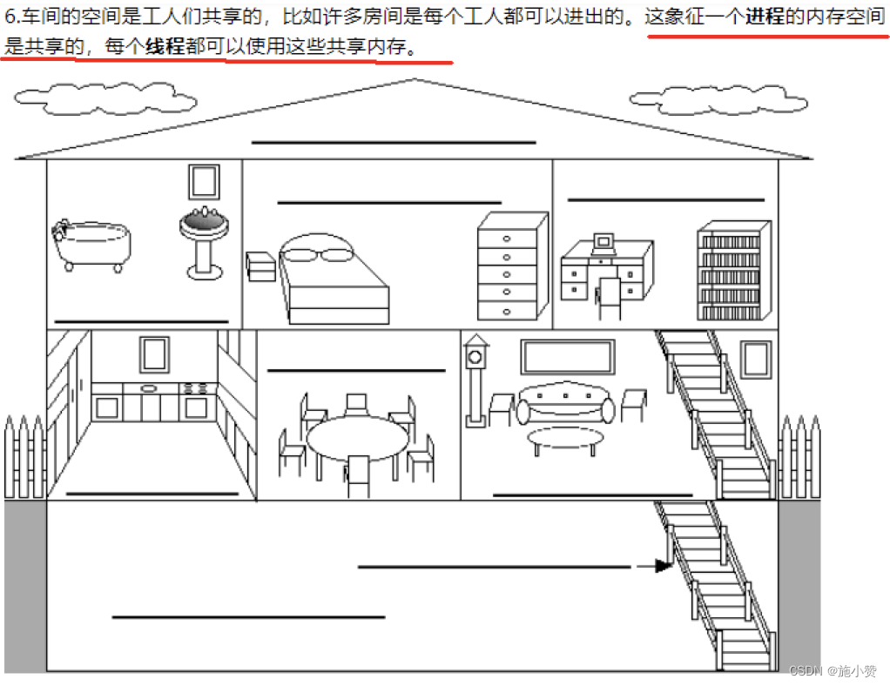

 

 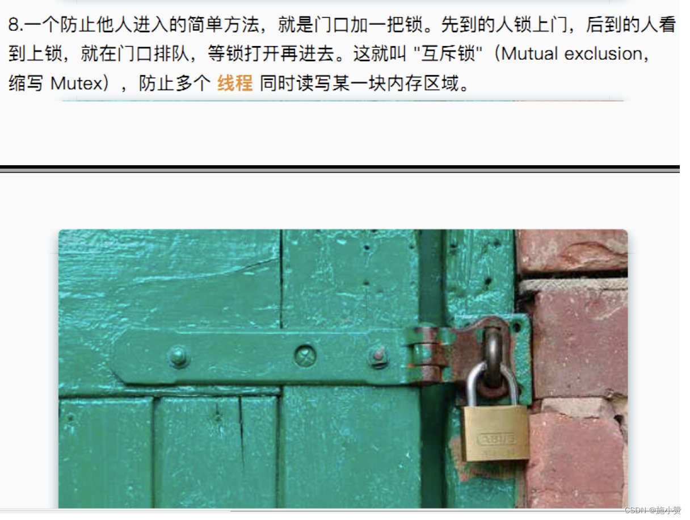

 

 

 

5.4、管程Monitor
------

Monitor(监视器)，也就是我们平时所说的锁  

Monitor 其实是一种同步机制，他的义务是保证（同一时间）只有一个线程可以访问被保护的数据和代码。 

JVM 中同步是基于进入和退出监视器对象 (Monitor, 管程对象) 来实现的，每个对象实例都会有一个 Monitor 对象， 

```java
Object o = new Object();
new Thread(() -> {
    synchronized (o) {
    }
}, "t1").start();
```

Monitor 对象会和 Java 对象一同创建并销毁，它底层是由 C++ 语言来实现的。 

 

 JVM 第 3 版

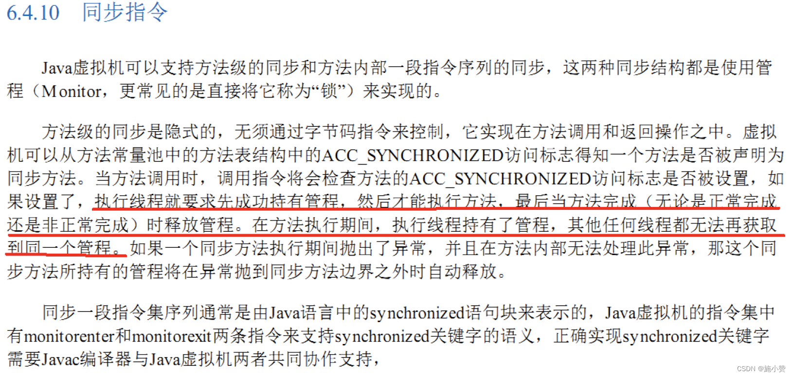

6、用户线程和守护线程
===========

6.1、Java 线程分为用户线程和守护线程，线程的 daemon 属性为 true 表示是守护线程，false 表示是用户线程
----------------------------------------------------------------

一般情况下不做特别说明配置，默认都是用户线程

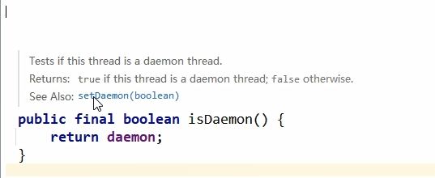

6.2、守护线程（Daemon  Thread）
--------

是一种特殊的线程为`其它线程服务的`，在后台默默地完成一些系统性的服务，比如垃圾回收线程就是最典型的例子

守护线程作为一个服务线程，没有服务对象就没有必要继续运行了，如果用户线程全部结束了，意味着程序需要完成的业务操作已经结束了，系统可以退出了。所以假如当系统只剩下守护线程的时候，java虚拟机会自动退出。


6.3、用户线程
--------

是系统的工作线程，它会完成这个程序需要完成的业务操作

```java
package com.atguigu.juc.bashthread;
 
import java.util.concurrent.TimeUnit;
 
/**
 * 演示守护线程和用户线程
 */
public class DaemonDemo
{
    public static void main(String[] args)
    {
        Thread a = new Thread(() -> {
            System.out.println(Thread.currentThread().getName()+" come in：\t"
                    +(Thread.currentThread().isDaemon() ? "守护线程":"用户线程"));
            while (true)
            {
 
            }
        }, "a");
        //线程的daemon属性为true表示是守护线程，false表示是用户线程
        a.setDaemon(true);
        a.start();
 
        //暂停几秒钟线程
        try { TimeUnit.SECONDS.sleep(2); } catch (InterruptedException e) { e.printStackTrace(); }
 
        System.out.println(Thread.currentThread().getName()+"\t"+" ----task is over");
    }
}
```

6.4、重点
------

当程序中所有用户线程执行完毕之后，不管守护线程是否结束，系统都会自动退出

如果用户线程全部结束了，意味着程序需要完成的业务操作已经结束了，系统可以退出了。所以当系统只剩下守护进程的时候，java 虚拟机会自动退出

setDaemon(true);方法设置守护线程，需要在 start() 方法之前进行，否则会报IllegalThreadStateException

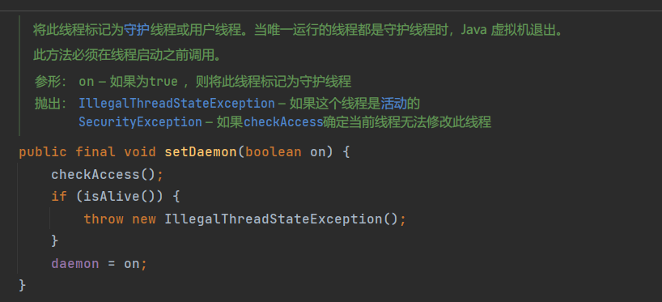