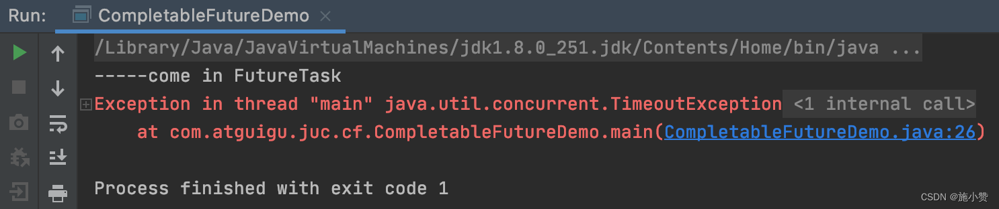
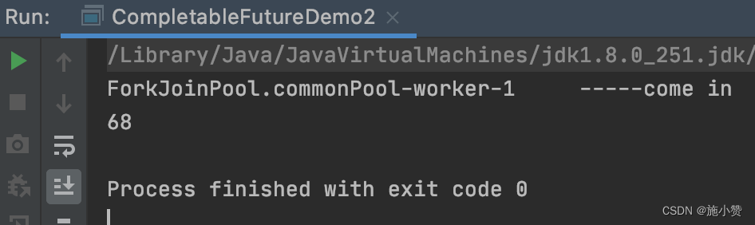
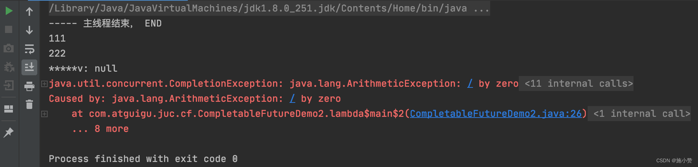

1、Future 和 Callable 接口
======================

Future 接口（FutureTask实现类）定义了操作 异步任务执行一些方法 ，如获取异步任务的执行结果、取消任务的执行、判断任务是否被取消、判断任务执行是否完毕等。

Callable 接口中定义了需要有返回的任务需要实现的方法。


比如主线程让一个`子线程`去执行任务，子线程可能比较耗时，启动子线程开始执行任务后，主线程就去做其他事情了，过了一会才去获取子任务的执行结果。

> 一句话： Future接口可以为主线程开一个分支任务，专门为主线程处理耗时和费力的复杂业务。

# 2、从之前的 FutureTask 说开去

## 2.1Future能干什么？

Future是Java5新加的一个接口，它提供了一种`异步并行计算的功能`。


如果主线程需要执行一个很耗时的计算任务，我们就可以通过future把这个任务放到异步线程中执行。主线程继续处理其他任务或者先行结束，再通过Future获取计算结果。

代码说话： 

+ Runnable接口 
+ Callable接口
+ Future接口和FutureTask实现类

目的：异步多线程任务执行且返回有结果，三个特点：多线程／有返回／异步任务（班长为老师去买水作为新启动的异步多线程任务且买到水有结果返回）


2.2、本源的 Future 接口相关架构
---------------------


**Thread类只接受Runnable接口为入参**


FutureTask类 实现Runnable接口和Future接口，可以通过构造器注入Callable

## 2.3、Future的优缺点

### 优点：future＋线程池异步多线程任务配合，能显著提高程序的执行效率。

```java
public class FutureThreadPoolDemo
{
    public static void main(String[] args) throws ExecutionException, InterruptedException
    {
        //3个任务，目前开启多个异步任务线程来处理，请问耗时多少？
        //方案二，3个任务3个线程，利用线程池（假如每次new一个Thread，太浪费资源，会有GC这些工作），大概**400毫秒**。

        ExecutorService threadPool = Executors.newFixedThreadPool(3);

        long startTime = System.currentTimeMillis();

        FutureTask<String> futureTask1 = new FutureTask<String>(() -> {
            try { TimeUnit.MILLISECONDS.sleep(500); } catch (InterruptedException e) { e.printStackTrace(); }
            return "task1 over";
        });
        threadPool.submit(futureTask1);

        FutureTask<String> futureTask2 = new FutureTask<String>(() -> {
            try { TimeUnit.MILLISECONDS.sleep(300); } catch (InterruptedException e) { e.printStackTrace(); }
            return "task2 over";
        });
        threadPool.submit(futureTask2);

        System.out.println(futureTask1.get());
        System.out.println(futureTask2.get());

        try { TimeUnit.MILLISECONDS.sleep(300); } catch (InterruptedException e) { e.printStackTrace(); }

        long endTime = System.currentTimeMillis();
        System.out.println("----costTime: "+(endTime - startTime) +" 毫秒");


        System.out.println(Thread.currentThread().getName()+"\t -----end");
        threadPool.shutdown();


    }

    private static void m1()
    {
        //3个任务，目前只有一个线程main来处理，请问耗时多少？
        //方案一，3个任务1个main线程处理，大概**1130ms**

        long startTime = System.currentTimeMillis();
        //暂停毫秒
        try { TimeUnit.MILLISECONDS.sleep(500); } catch (InterruptedException e) { e.printStackTrace(); }
        try { TimeUnit.MILLISECONDS.sleep(300); } catch (InterruptedException e) { e.printStackTrace(); }
        try { TimeUnit.MILLISECONDS.sleep(300); } catch (InterruptedException e) { e.printStackTrace(); }

        long endTime = System.currentTimeMillis();
        System.out.println("----costTime: "+(endTime - startTime) +" 毫秒");

        System.out.println(Thread.currentThread().getName()+"\t -----end");
    }
}
```

### 缺点：get（）阻塞

Future对于结果的获取不是很友好，只能通过阻塞或轮询的方式得到任务的结果。

#### get() 阻塞 

> **获取返回值**
>
> + `public V get() `阻塞   一旦调用get()方法，不管是否计算完成都会导致阻塞
> + `public V get(long timeout, TimeUnit unit)`，阻塞,超时则抛出CancellationException 异常

```java
public class FutureAPIDemo
{
    public static void main(String[] args) throws ExecutionException, InterruptedException, TimeoutException
    {
        FutureTask<String> futureTask = new FutureTask<String>( () -> {
            System.out.println(Thread.currentThread().getName()+"\t -----come in");
            try { TimeUnit.SECONDS.sleep(5); } catch (InterruptedException e) { e.printStackTrace(); }
            return "task over";
        });
        Thread t1 = new Thread(futureTask, "t1");
        t1.start();
        
        //1 get容易导致阻塞，一般建议放在程序后面，一旦调用不见不散，非要等到结果才会离开，不管你是否计算完成，容易程序堵塞。
        //System.out.println(futureTask.get());
        // 2.假如我不愿意等待很长时间，我希望过时不候，可以自动离开.   到时拿不到结果，会抛出异常
        System.out.println(futureTask.get(3,TimeUnit.SECONDS));
        

        System.out.println(Thread.currentThread().getName()+"\t ----忙其它任务了");
        //get容易导致阻塞，一般建议放在程序后面
     
    }
}
```



#### isDone()轮询


轮询的方式会耗费无谓的CPU资源，而且也不见得能及时地得到计算结果.
如果想要异步获取结果,通常都会以轮询的方式去判断isDone()获取结果，尽量减少阻塞

```java
public class FutureTaskDemo
{
    public static void main(String[] args) throws ExecutionException, InterruptedException, TimeoutException
    {
        FutureTask<Integer> futureTask = new FutureTask<>(() -> {
            System.out.println(Thread.currentThread().getName() + "\t" + "---come in");
            try { TimeUnit.SECONDS.sleep(5); } catch (InterruptedException e) { e.printStackTrace(); }
            return 1024;
        });
 
        new Thread(futureTask,"t1").start();
        //System.out.println(futureTask.get());//不见不散，只要出现get方法，不管是否计算完成都阻塞等待结果出来再运行
        //System.out.println(futureTask.get(2L,TimeUnit.SECONDS));//过时不候
 
        //不要阻塞，尽量用轮询替代  【FutureTask最佳实践】
        while(true)
        {
            if(futureTask.isDone())
            {
                System.out.println("----result: "+futureTask.get());
                break;
            }else{
                System.out.println("还在计算中，别催，越催越慢，再催熄火");
            }
        }
    }
}
```

 

2.4、想完成一些复杂的任务
--------------


1. 对于简单的业务场景使用Future完全OK

2. 创建异步任务：
   1. Future＋线程池配合

3. 回调通知  whenCompilete
   1. 应对Future的完成时间，完成了可以告诉我，也就是我们的回调通知
   2. 通过轮询的方式去判断任务是否完成这样非常占CPU并且代码也不优雅
4. 任务编排
   1. 想将多个异步任务的计算结果组合起来，后一个异步任务的计算结果需要前一个异步任务的值
   2. 将两个或多个异步计算合成一个异步计算，这几个异步计算互相独立，同时后面这个又依赖前一个处理的结果
5. 对计算速度最快的
   1. 当Future集合中某个任务最快结束时，返回结果，返回第一名处理结果。

> 使用Future之前提供的那点API就囊中羞涩，处理起来不够优雅，这时候还是让CompletableFuture以声明式的方式优雅的处理这些需求
>
> 从i到i＋＋，O（n＿n）O哈哈～
>
> **Future能干的，CampletableFuture都能干** 

# 3、CompletableFuture基本介绍

## 3.1、为什么会出现CompletableFuture

get()方法在Future 计算完成之前会一直处在阻塞状态下，
isDone（）方法容易耗费CPU资源，

对于真正的异步处理我们希望是可以通过传入回调函数，在Future结束时自动调用该回调函数，这样，我们就不用等待结果。

**阻塞的方式和异步编程的设计理念相违背，而轮询的方式会耗费无谓的CPU资源**。因此，JDK8设计出CompletableFuture．

CompletableFuture提供了一种`观察者模式`类似的机制，可以让任务执行完成后通知监听的一方。


3.2、CompletableFuture 和 CompletionStage 源码分别介绍
----------------------------------------------

### 3.2.1、类架构说明


### 3.2.2、接口 CompletionStage

*   CompletionStage 代表异步**计算过程中的某一个阶段**，一个阶段完成以后可能会触发另外一个阶段
*   一个阶段的计算执行可以是一个 Function,Consumer 或者 Runnable。比如：stage.thenApply(x->(x -System.out.print(x)).thenRun(O->System.out.println))
*   一个阶段的执行可能是被单个阶段的完成触发，也可能是由多个阶段一起触发
*   代表异步计算过程中的某一个阶段，一个阶段完成以后可能会触发另外一个阶段，有些类似 <u>Linux 系统的管道分隔符传参数。</u>

### 3.2.3、类 CompletableFuture

*   在 Java8 中，CompletableFuture 提供了非常强大的 Future 的扩展功能，可以帮助我们简化异步编程的复杂性，并且提供了函数式编程的能力，可以通过回调的方式处理计算结果，也提供了转换和组合 CompletableFuture 的方法。
*   它可能代表一个明确完成的 Future, 也有可能代表一个完成阶段 (CompletionStage), 它支持在计算完成以后触发一些函数或执行某些动作。
*   它实现了 Future 和 CompletionStage 接口

3.3、核心的四个静态方法，来创建一个异步操作
-----------------------

利用核心的四个静态方法创建一个异步操作 | 不建议用new

关键就是 |有没有返回值|是否用了线程池|

参数说明：

没有指定Executor的方法，直接使用默认的ForkJoinPool.commPool()作为它的线程池执行异步代码。

如果指定线程池，则使用我们定义的或者特别指定的线程池执行异步代码。

### 3.3.1、runAsync 无 返回值

public static CompletableFuture runAsync(Runnable runnable)

public static CompletableFuture runAsync(Runnable runnable,Executor executor)

### 3.3.2、supplyAsync 有 返回值

public static CompletableFuture supplyAsync(Supplier supplier)

public static CompletableFuture supplyAsync(Supplier supplier,Executor executor)


Supplier 供给性函数接口

### 3.3.3、上述 Executor executor 参数说明

没有指定 Executor 的方法，直接使用默认的 ForkJoinPool.commonPool() 作为它的线程池执行异步代码。

如果指定线程池，则使用我们自定义的或者特别指定的线程池执行异步代码

### 3.3.4、Code

#### 无返回值

```java
package com.atguigu.juc.cf;
 
 
import java.util.concurrent.*;
 

public class CompletableFutureBuildDemo {
    public static void main(String[] args) throws ExecutionException, InterruptedException {
        ExecutorService threadPool = Executors.newFixedThreadPool(3);


        CompletableFuture<Void> completableFuture = CompletableFuture.runAsync(() -> {
            System.out.println(Thread.currentThread().getName());
            //暂停几秒钟线程
            try {
                TimeUnit.SECONDS.sleep(1);
            } catch (InterruptedException e) {
                e.printStackTrace();
            }
        });
        
        //使用自定义线程池threadPool
//        CompletableFuture<Void> completableFuture = CompletableFuture.runAsync(() -> {
//            System.out.println(Thread.currentThread().getName());
//            //暂停几秒钟线程
//            try { TimeUnit.SECONDS.sleep(1); } catch (InterruptedException e) { e.printStackTrace(); }
//        },threadPool);

        System.out.println(completableFuture.get());


    }
}
```

 

####  有 返回值

```java
package com.atguigu.juc.cf;
 
 
import java.util.concurrent.*;
 
public class CompletableFutureDemo2 {
    public static void main(String[] args) throws ExecutionException, InterruptedException {
        CompletableFuture<Integer> completableFuture = CompletableFuture.supplyAsync(() -> {
            System.out.println(Thread.currentThread().getName() + " \t " + "-----come in");
            // 暂停几秒钟线程
            try {
                TimeUnit.SECONDS.sleep(1);
            } catch (InterruptedException e) {
                e.printStackTrace();
            }
            return ThreadLocalRandom.current().nextInt(100);
        });
        System.out.println(completableFuture.get());
    }
}
```



### 3.2.5、`whenComplete`、`exceptionally`，减少阻塞和轮询 

从 Java8 开始引入了 CompletableFuture，它是 Future 的功能增强版，减少阻塞和轮询

可以传入回调对象，当异步任务完成或者发生异常时，自动调用回调对象的回调方法


当CompletableFuture的计算结果完成，或者抛出异常的时候，可以执行特定的Action。主要是下面的方法：

```java
public CompletableFuture<T> whenComplete(BiConsumer<? super T,? super Throwable> action)
public CompletableFuture<T> whenCompleteAsync(BiConsumer<? super T,? super Throwable> action)
public CompletableFuture<T> whenCompleteAsync(BiConsumer<? super T,? super Throwable> action, Executor executor)
public CompletableFuture<T> exceptionally(Function<Throwable,? extends T> fn)
```

可以看到Action的类型是`BiConsumer<? super T,? super Throwable>`它可以处理正常的计算结果，或者异常情况。


whenComplete 和 whenCompleteAsync 的区别：
 whenComplete：是执行当前任务的线程执行继续执行 whenComplete 的任务。
 whenCompleteAsync：是执行把 whenCompleteAsync 这个任务继续提交给线程池来进行执行。

```java
public class CompletableFutureUseDemo {
    public static void main(String[] args) throws ExecutionException, InterruptedException {
        CompletableFuture.supplyAsync(()->{
            System.out.println(Thread.currentThread().getName()+"--------副线程come in");
            int result = ThreadLocalRandom.current().nextInt(10);//产生随机数
            try {
                TimeUnit.SECONDS.sleep(1);
            } catch (InterruptedException e) {
                e.printStackTrace();
            }
            return result;
        }).whenComplete((v,e) -> {//没有异常,v是值，e是异常
            if(e == null){
                System.out.println("------------------计算完成，更新系统updataValue"+v);
            }
        }).exceptionally(e->{//有异常的情况
            e.printStackTrace();
            System.out.println("异常情况"+e.getCause()+"\t"+e.getMessage());
            return null;
        });
		// 缺少这部分会出现默认ForkJoinPool 被关闭
        //线程不要立刻结束，否则CompletableFuture默认使用的线程池会立刻关闭：暂停3秒钟线程
        System.out.println(Thread.currentThread().getName()+"线程先去忙其他任务");
        try {
            TimeUnit.SECONDS.sleep(3);
        } catch (InterruptedException e) {
            e.printStackTrace();
        }
    }
}
//ForkJoinPool.commonPool-worker-9--------副线程come in（这里用的是默认的ForkJoinPool）
//main线程先去忙其他任务
//------------------计算完成，更新系统updataValue3
```


假如换用自定义线程池

```java
public class CompletableFutureUseDemo {
    public static void main(String[] args) throws ExecutionException, InterruptedException {
        ExecutorService threadPool = Executors.newFixedThreadPool(3);
        CompletableFuture.supplyAsync(()->{
            System.out.println(Thread.currentThread().getName()+"--------副线程come in");
            int result = ThreadLocalRandom.current().nextInt(10);//产生随机数
            try {
                TimeUnit.SECONDS.sleep(1);
            } catch (InterruptedException e) {
                e.printStackTrace();
            }
            return result;
        },threadPool).whenComplete((v,e) -> {//没有异常,v是值，e是异常
            if(e == null){
                System.out.println("------------------计算完成，更新系统updataValue"+v);
            }
        }).exceptionally(e->{//有异常的情况
            e.printStackTrace();
            System.out.println("异常情况"+e.getCause()+"\t"+e.getMessage());
            return null;
        });

        //线程不要立刻结束，否则CompletableFuture默认使用的线程池会立刻关闭：暂停3秒钟线程
        System.out.println(Thread.currentThread().getName()+"线程先去忙其他任务");
        try {
            TimeUnit.SECONDS.sleep(3);
        } catch (InterruptedException e) {
            e.printStackTrace();
        }
    }
}
//pool-1-thread-1--------副线程come in
//main线程先去忙其他任务
//------------------计算完成，更新系统updataValue6
```
异常情况的展示，设置一个异常 int i = 10 / 0 ;

```java
public class CompletableFutureUseDemo {
    public static void main(String[] args) throws ExecutionException, InterruptedException {
        ExecutorService threadPool = Executors.newFixedThreadPool(3);
        CompletableFuture.supplyAsync(()->{
            System.out.println(Thread.currentThread().getName()+"--------副线程come in");
            int result = ThreadLocalRandom.current().nextInt(10);//产生随机数
            try {
                TimeUnit.SECONDS.sleep(1);
            } catch (InterruptedException e) {
                e.printStackTrace();
            }
            System.out.println("-----结果---异常判断值---"+result);
            //---------------------异常情况的演示--------------------------------------
            if(result > 2){
                int i  = 10 / 0 ;//我们主动的给一个异常情况
            }
            //------------------------------------------------------------------
            return result;
        },threadPool).whenComplete((v,e) -> {//没有异常,v是值，e是异常
            if(e == null){
                System.out.println("------------------计算完成，更新系统updataValue"+v);
            }
        }).exceptionally(e->{//有异常的情况
            e.printStackTrace();
            System.out.println("异常情况"+e.getCause()+"\t"+e.getMessage());
            return null;
        });

        //线程不要立刻结束，否则CompletableFuture默认使用的线程池会立刻关闭：暂停3秒钟线程
        System.out.println(Thread.currentThread().getName()+"线程先去忙其他任务");
        try {
            TimeUnit.SECONDS.sleep(3);
        } catch (InterruptedException e) {
            e.printStackTrace();
        }
    }
}
//pool-1-thread-1--------副线程come in
//main线程先去忙其他任务
//-----结果---异常判断值---4                (这里 4 >2了，直接抛出异常)
//异常情况java.lang.ArithmeticException: / by zero  java.lang.ArithmeticException: / by zero
//java.util.concurrent.CompletionException: java.lang.ArithmeticException: / by zero
//  at java.util.concurrent.CompletableFuture.encodeThrowable(CompletableFuture.java:273)
//  at java.util.concurrent.CompletableFuture.completeThrowable(CompletableFuture.java:280)
//  at java.util.concurrent.CompletableFuture$AsyncSupply.run(CompletableFuture.java:1592)
//  at java.util.concurrent.ThreadPoolExecutor.runWorker(ThreadPoolExecutor.java:1149)
//  at java.util.concurrent.ThreadPoolExecutor$Worker.run(ThreadPoolExecutor.java:624)
//  at java.lang.Thread.run(Thread.java:748)
//Caused by: java.lang.ArithmeticException: / by zero
//  at com.zhang.admin.controller.CompletableFutureUseDemo.lambda$main$0(CompletableFutureUseDemo.java:19)
//  at java.util.concurrent.CompletableFuture$AsyncSupply.run(CompletableFuture.java:1590)
//  ... 3 more
```


### 3.2.6、CompletableFuture 的优点

1.  异步任务结束时，会自动回调某个对象的方法；
2.  异步任务出错时，会自动回调某个对象的方法；
3.  主线程设置好回调后，不再关心异步任务的执行，异步任务之间可以顺序执行


3.4、函数式编程已经主流
-------------

Lambda +Stream + Chain链式调用 + Java8 函数式编程带走

### 3.4.1 常用函数式接口总结

 


 

 


### 链式调用|链式编程|链式写法

```java
public class Chain {
    public static void main(String[] args) {
        //-------------------老式写法------------
//        Student student = new Student();
//        student.setId(1);
//        student.setMajor("cs");
//        student.setName("小卡");
        new Student().setId(1).setName("大卡").setMajor("cs");
    }
    
}

@NoArgsConstructor
@AllArgsConstructor
@Data
@Accessors(chain = true)//开启链式编程
class Student{
    private int id;
    private String name;
    private String major;
}
```


3.5、先说说 join 和 get 对比
---------------------

join=get, 一样的，区别就是 join 不抛出异常 

```java
public class Chain {
    public static void main(String[] args) throws ExecutionException, InterruptedException {//抛出异常
        CompletableFuture<String> completableFuture = CompletableFuture.supplyAsync(() -> {
            return "hello 12345";
        });
        System.out.println(completableFuture.get());
    }

}

public class Chain {
    public static void main(String[] args)  {//抛出异常
        CompletableFuture<String> completableFuture = CompletableFuture.supplyAsync(() -> {
            return "hello 12345";
        });
        System.out.println(completableFuture.join());
    }
}
```


4、案例精讲 - 电商网站的比价需求
==================


4.1、业务需求说明
----------

对内微服务多系统调用

对外网站比价

   经常出现在等待某条 SQL 执行完成后，再继续执行下一条 SQL ，而这两条 SQL 本身是并无关系的，可以同时进行执行的。 

我们希望能够两条 SQL 同时进行处理，而不是等待其中的某一条 SQL 完成后，再继续下一条。同理， 

对于分布式微服务的调用，按照实际业务，如果是无关联 step by step 的业务，可以尝试是否可以多箭齐发，同时调用。 

  我们去比同一个商品在各个平台上的价格，要求获得一个清单列表， 1 step by step，查完京东查淘宝，查完淘宝查天猫...... 

  2 all   一口气同时查询。。。。。 

一波流 Java8 函数式编程带走

```java
/**
 * 案例说明：电商比价需求
 * 1 同一款产品，同时搜索出同款产品在各大电商的售价;
 * 2 同一款产品，同时搜索出本产品在某一个电商平台下，各个入驻门店的售价是多少
 * <p>
 * 出来结果希望是同款产品的在不同地方的价格清单列表，返回一个List<String>
 * 《mysql》 in jd price is 88.05
 * 《mysql》 in pdd price is 86.11
 * 《mysql》 in taobao price is 90.43
 * <p>
 * 3 要求深刻理解
 * 3.1 函数式编程
 * 3.2 链式编程
 * 3.3 Stream流式计算
 */
public class CompletableFutureNetMallDemo {
    static List<NetMall> list = Arrays.asList(
            new NetMall("jd"),
            new NetMall("pdd"),
            new NetMall("taobao"),
            new NetMall("dangdangwang"),
            new NetMall("tmall")
    );

    public static void main(String[] args) {
        long startTime = System.currentTimeMillis();
        List<String> list1 = getPrice(list, "mysql");
        for (String element : list1) {
            System.out.println(element);
        }long endTime = System.currentTimeMillis();
        System.out.println("----costTime: " + (endTime - startTime) + " 毫秒");

        System.out.println("---------测试CompletableFuture 时间-----------");

        long startTime2 = System.currentTimeMillis();
        List<String> list2 = getPriceByCompletableFuture(list, "mysql");
        for (String element : list2) {
            System.out.println(element);
        }
        long endTime2 = System.currentTimeMillis();
        System.out.println("----costTime: " + (endTime2 - startTime2) + " 毫秒");
    }

    /**
     * step by step 一家家搜查
     * List<NetMall> ----->map------> List<String>
     *
     * @param list
     * @param productName
     * @return
     */
    public static List<String> getPrice(List<NetMall> list, String productName) {
        return list.stream()
                .map((netMall) -> {
                    return String.format(productName + " is %s price is %.2f", netMall.getMallName(), netMall.calcPrice(productName));
                }).collect(Collectors.toList());
    }


    /**
     * List<NetMall> ----->List<CompletableFuture<String>>------> List<String>
     *
     * @param list
     * @param productName
     * @return
     */
    public static List<String> getPriceByCompletableFuture(List<NetMall> list, String productName) {

//        //创建任务集合
//        List<CompletableFuture<String>> completableFutureList = list.stream()
//                .map((netMall) -> {
//                    return CompletableFuture.supplyAsync(() -> {
//                        return String.format(productName + " is %s price is %.2f", netMall.getMallName(), netMall.calcPrice(productName));
//                    });
//
//                })
//                .collect(Collectors.toList());
//
//
//        //获取结果
//        List<String> resultList = completableFutureList.stream().map(completable -> {
//            return completable.join();
//        }).collect(Collectors.toList());
//
//        return resultList;

        return list.stream().map(netMall ->
                        CompletableFuture.supplyAsync(() ->
                                String.format(productName + " in %s price is %.2f", netMall.getMallName(), netMall.calcPrice(productName))))////Stream<CompletableFuture<String>>
                .collect(Collectors.toList())////List<CompletableFuture<String>>
                .stream() //Stream < CompletableFuture < String >
                .map(s -> s.join())////Stream<String>
                .collect(Collectors.toList());

    }

}


class NetMall {
    @Getter
    private String mallName;

    public NetMall(String mallName) {
        this.mallName = mallName;
    }

    public double calcPrice(String productName) {
        //检索需要1秒钟
        try {
            TimeUnit.SECONDS.sleep(1);
        } catch (InterruptedException e) {
            e.printStackTrace();
        }
        return mallName.charAt(0) + productName.charAt(0);
    }
}
```


5、CompletableFuture 常用方法
==========================

### 4.4.1、获得结果和触发计算`get`、`join`、`getNow`、`complete`

#### 获取结果

+ `public T get()` 不见不散，容易阻塞
+ `public T get(long timeout,TimeUnit unit)` 过时不候，超过时间会报异常
+ `public T join()` 类似于get()，区别在于是否需要抛出异常
+ `public T getNow(T valueIfAbsent)` 
  + 没有计算完成的情况下，给一个替代结果
  + 立即获取结果不阻塞
    + 计算完，返回计算完成后的结果
    + 没算完，返回设定的valueAbsent(直接返回了备胎值xxx)

```java
public class CompletableFutureDemo2{
    public static void main(String[] args) throws ExecutionException, InterruptedException{
        CompletableFuture<Integer> completableFuture = CompletableFuture.supplyAsync(() -> {
            try { TimeUnit.SECONDS.sleep(1); } catch (InterruptedException e) { e.printStackTrace(); }
            return 533;
        });

        //去掉注释上面计算没有完成，返回444
        //开启注释上满计算完成，返回计算结果
        try { TimeUnit.SECONDS.sleep(2); } catch (InterruptedException e) { e.printStackTrace(); }

        System.out.println(completableFuture.getNow(444));
    }
}
```

#### 主动触发计算

`public boolean complete(T value)` 是否立即打断get()方法返回括号值  和getNow功能类似

(执行要2s，等待只有1s，所以还没执行完就被打断了。返回true表示打断了获取这个过程，直接返回了备胎值complete；如果没打断，返回false 和原来的abc)

```java
// 是否打断get方法立即返回括号值
public boolean complete(T value)
  
public class CompletableFutureDemo4{
    public static void main(String[] args) throws ExecutionException, InterruptedException{
        CompletableFuture<Integer> completableFuture = CompletableFuture.supplyAsync(() -> {
            try { TimeUnit.SECONDS.sleep(1); } catch (InterruptedException e) { e.printStackTrace(); }
            return 533;
        });

        //注释掉暂停线程，get还没有算完只能返回complete方法设置的444；暂停2秒钟线程，异步线程能够计算完成返回get
        try { TimeUnit.SECONDS.sleep(2); } catch (InterruptedException e) { e.printStackTrace(); }

        //当调用CompletableFuture.get()被阻塞的时候,complete方法就是结束阻塞并get()获取设置的complete里面的值.
        System.out.println(completableFuture.complete(444)+"\t"+completableFuture.get());
    }
}   
```

### 4.4.2、对计算结果进行处理`thenApply`、`handle`

`thenApply`：计算结果存在依赖关系，这两个线程串行化
由于存在依赖关系(当前步错，不走下一步)，当前步骤有异常的话就叫停。

```java
public class CompletableFutureDemo2 {
    public static void main(String[] args) throws ExecutionException, InterruptedException {
        // 当一个线程依赖另一个线程时用 thenApply 方法来把这两个线程串行化 ,
        CompletableFuture.supplyAsync(() -> {
            // 暂停几秒钟线程
            try {
                TimeUnit.SECONDS.sleep(1);
            } catch (InterruptedException e) {
                e.printStackTrace();
            }
            System.out.println("111");
            return 1024;
        }).thenApply(f -> {
            System.out.println("222");
            return f + 1;
        }).thenApply(f -> {
            int age = 10 / 0;
            // 异常情况：那步出错就停在那步。
            System.out.println("333");
            return f + 1;
        }).whenCompleteAsync((v, e) -> {
            System.out.println("*****v: " + v);
        }).exceptionally(e -> {
            e.printStackTrace();
            return null;
        });
        System.out.println("----- 主线程结束， END");
        // 主线程不要立刻结束，否则 CompletableFuture 默认使用的线程池会立刻关闭 :
        try {
            TimeUnit.SECONDS.sleep(2);
        } catch (InterruptedException e) {
            e.printStackTrace();
        }
    }
 
 
}
```




handle：有异常也可以往下一步走，，根据带的异常参数【(value,exception)】可以进一步处理

```java
public class CompletableFutureDemo2 {
    public static void main(String[] args) throws ExecutionException, InterruptedException { // 当一个线程依赖另一个线程时用 handle 方法来把这两个线程串行化 ,
        // 异常情况：有异常也可以往下一步走，根据带的异常参数可以进一步处理
        CompletableFuture.supplyAsync(() -> {
            // 暂停几秒钟线程
            try {
                TimeUnit.SECONDS.sleep(1);
            } catch (InterruptedException e) {
                e.printStackTrace();
            }
            System.out.println("111");
            return 1024;
        }).handle((f, e) -> {
            int age = 10 / 0;
            System.out.println("222");
            return f + 1;
        }).handle((f, e) -> {
            System.out.println("333");
            return f + 1;
        }).whenCompleteAsync((v, e) -> {
            System.out.println("*****v: " + v);
        }).exceptionally(e -> {
            e.printStackTrace();
            return null;
        });
        System.out.println("----- 主线程结束， END");
        // 主线程不要立刻结束，否则 CompletableFuture 默认使用的线程池会立刻关闭 :
        try {
            TimeUnit.SECONDS.sleep(2);
        } catch (InterruptedException e) {
            e.printStackTrace();
        }
    }
}
```


 总结：


> whenComplete 和 whenCompleteAsync 的区别：
>
> whenComplete: 是执行当前任务的线程执行继续执行 whenComplete 的任务。
>
> whenCompleteAsync: 是执行把 whenCompleteAsync 这个任务继续提交给线程池来进行执行。


### 4.4.3、对计算结果进行消费`thenAccept`

`thenAccept`：接收任务的处理结果，并消费处理，无返回结果

```java
public class CompletableFutureDemo2 {
    public static void main(String[] args) throws ExecutionException, InterruptedException {
        CompletableFuture.supplyAsync(() -> {
            return 1;
        }).thenApply(f -> {
            return f + 2;
        }).thenApply(f -> {
            return f + 3;
        }).thenApply(f -> {
            return f + 4;
        }).thenAccept(r -> System.out.println(r));//消费之前的结果，没有返回值
    }
 
}
```

#### 任务之间的顺序执行 的区别


① thenRun：thenRun(Runnable runnable) 任务 A 执行完执行 B，并且 B 不需要 A 的结果

② thenAccept：thenAccept(Consumer action) 任务 A 执行完执行 B，B 需要 A 的结果，但是任务 B 无返回值

③ thenApply：thenApply(Function fn) 任务 A 执行完执行 B，B 需要 A 的结果，同时任务 B 有返回值

```java
System.out.println(CompletableFuture.supplyAsync(() -> "resultA").thenRun(() -> {
    }).join());//null
 
System.out.println(CompletableFuture.supplyAsync(() -> "resultA").thenAccept(resultA -> {
    }).join());//null
 
 
System.out.println(CompletableFuture.supplyAsync(() -> "resultA").thenApply(resultA -> resultA + " resultB").join());//resultA resultB
```

#### CompleteFuture和线程池说明（非常重要）

上面的几个方法都有普通版本和后面加Async的版本

以thenRun和thenRunAsync为例，有什么区别？

结论

1. 没有传入自定义线程池，都用默认线程池ForkJoinPool

2. 传入了一个自定义线程池如果你执行第一个任务的时候，传入了一个自定义线程池

   + 调用thenRun方法执行第二个任务的时候，则第二个任务和第一个任务是用同一个线程池

   + 调用thenRunAsync执行第二个任务的时候，则第一个任务使用的是你自己传入的线程池，第二个任务使用的是ForkJoin线程池

3. 也有可能处理太快，系统优化切换原则，直接使用main线程处理（把sleep去掉）


```java
//2-1
public class CompletableFutureAPIDemo {
    public static void main(String[] args) throws ExecutionException, InterruptedException {
        ExecutorService threadPool = Executors.newFixedThreadPool(5);
        CompletableFuture<Void> completableFuture = CompletableFuture.supplyAsync(()->{
            try {TimeUnit.MILLISECONDS.sleep(20);} catch (InterruptedException e) {e.printStackTrace();}
            System.out.println("1号任务"+"\t"+Thread.currentThread().getName());
            return "abcd";
        },threadPool).thenRun(()->{
            try {TimeUnit.MILLISECONDS.sleep(20);} catch (InterruptedException e) {e.printStackTrace();}
            System.out.println("2号任务"+"\t"+Thread.currentThread().getName());
        }).thenRun(()->{
            try {TimeUnit.MILLISECONDS.sleep(20);} catch (InterruptedException e) {e.printStackTrace();}
            System.out.println("3号任务"+"\t"+Thread.currentThread().getName());
        }).thenRun(()->{
            try {TimeUnit.MILLISECONDS.sleep(20);} catch (InterruptedException e) {e.printStackTrace();}
            System.out.println("4号任务"+"\t"+Thread.currentThread().getName());
        });
    }
}
//1号任务  pool-1-thread-1
//2号任务  pool-1-thread-1
//3号任务  pool-1-thread-1
//4号任务  pool-1-thread-1
```


```java
//2-2
public class CompletableFutureAPIDemo {
    public static void main(String[] args) throws ExecutionException, InterruptedException {
        ExecutorService threadPool = Executors.newFixedThreadPool(5);
        CompletableFuture<Void> completableFuture = CompletableFuture.supplyAsync(()->{
            try {TimeUnit.MILLISECONDS.sleep(20);} catch (InterruptedException e) {e.printStackTrace();}
            System.out.println("1号任务"+"\t"+Thread.currentThread().getName());
            return "abcd";
        },threadPool).thenRunAsync(()->{
            try {TimeUnit.MILLISECONDS.sleep(20);} catch (InterruptedException e) {e.printStackTrace();}
            System.out.println("2号任务"+"\t"+Thread.currentThread().getName());
        }).thenRun(()->{
            try {TimeUnit.MILLISECONDS.sleep(20);} catch (InterruptedException e) {e.printStackTrace();}
            System.out.println("3号任务"+"\t"+Thread.currentThread().getName());
        }).thenRun(()->{
            try {TimeUnit.MILLISECONDS.sleep(20);} catch (InterruptedException e) {e.printStackTrace();}
            System.out.println("4号任务"+"\t"+Thread.currentThread().getName());
        });
    }
}
//1号任务  pool-1-thread-1
//2号任务  ForkJoinPool.commonPool-worker-9---这里另起炉灶重新调用了默认的ForkJoinPool
//3号任务  ForkJoinPool.commonPool-worker-9
//4号任务  ForkJoinPool.commonPool-worker-9

```


```java
public class CompletableFutureAPIDemo {
    public static void main(String[] args) throws ExecutionException, InterruptedException {
        ExecutorService threadPool = Executors.newFixedThreadPool(5);
        CompletableFuture<Void> completableFuture = CompletableFuture.supplyAsync(()->{
//            try {TimeUnit.MILLISECONDS.sleep(20);} catch (InterruptedException e) {e.printStackTrace();}
            System.out.println("1号任务"+"\t"+Thread.currentThread().getName());
            return "abcd";
        },threadPool).thenRun(()->{
           // try {TimeUnit.MILLISECONDS.sleep(20);} catch (InterruptedException e) {e.printStackTrace();}
            System.out.println("2号任务"+"\t"+Thread.currentThread().getName());
        }).thenRun(()->{
          //  try {TimeUnit.MILLISECONDS.sleep(20);} catch (InterruptedException e) {e.printStackTrace();}
            System.out.println("3号任务"+"\t"+Thread.currentThread().getName());
        }).thenRun(()->{
            //try {TimeUnit.MILLISECONDS.sleep(20);} catch (InterruptedException e) {e.printStackTrace();}
            System.out.println("4号任务"+"\t"+Thread.currentThread().getName());
        });
    }
}
//1号任务  1号任务  pool-1-thread-1
//2号任务  main
//3号任务  main
//4号任务  main
```

源码：

```java
//CompletableFuture.java 2009行
public CompletableFuture<Void> thenRun(Runnable action) {//传入值是一样的
        return uniRunStage(null, action);
    }

    public CompletableFuture<Void> thenRunAsync(Runnable action) {
        return uniRunStage(asyncPool, action);//但是这里有个异步的线程池asyncPool
    }

```


```java
    //进入asyncPool
    private static final boolean useCommonPool =
        (ForkJoinPool.getCommonPoolParallelism() > 1);//一般大于1都是成立的

    /**
     * Default executor -- ForkJoinPool.commonPool() unless it cannot
     * support parallelism.
     */
    private static final Executor asyncPool = useCommonPool ?
        ForkJoinPool.commonPool() : new ThreadPerTaskExecutor();//所以这里会调用forkJoin线程池

```

### 4.4.4、对计算速度进行选用`applyToEither`

> applyToEither:谁快用谁
>
> ```java
> public <U> CompletableFuture<U> applyToEither(    CompletionStage<? extends T> other, Function<? super T, U> fn)
> 
> -- other  和谁比较
> -- fn  传入两个先结束的一个值，进行处理，有一个返回值
> ```
>
> 

示例：

```java
public class CompletableFutureFastDemo
{
    public static void main(String[] args)
    {
        CompletableFuture<String> playA = CompletableFuture.supplyAsync(() -> {
            System.out.println("A come in");
            try { TimeUnit.SECONDS.sleep(3); } catch (InterruptedException e) { e.printStackTrace(); }
            return "playA";
        });

        CompletableFuture<String> playB = CompletableFuture.supplyAsync(() -> {
            System.out.println("B come in");
            try { TimeUnit.SECONDS.sleep(1); } catch (InterruptedException e) { e.printStackTrace(); }
            return "playB";
        });

        CompletableFuture<String> result = playA.applyToEither(playB, f -> {
            return f + " is winer";
        });

        System.out.println(Thread.currentThread().getName()+"\t"+"-----: "+result.join());
    }
}
```

### 4.4.5、对计算结果进行合并`thenCombine`

两个 CompletionStage 任务都完成后，最终能把两个任务的结果一起交给 thenCombine 来处理

先完成的先等着，等待其它分支任务 thenCombine

```java
public <U,V> CompletableFuture<V> thenCombine(
    CompletionStage<? extends U> other,
    BiFunction<? super T,? super U,? extends V> fn) 
    
    -- other  需要合并结果的另一个任务
    -- fn  对两个结果处理，并有一个返回值
```

code标准版，好理解先拆分

```java
public class CompletableFutureDemo2 {
    public static void main(String[] args) throws ExecutionException, InterruptedException {
        //任务1
        CompletableFuture<Integer> completableFuture1 = CompletableFuture.supplyAsync(() -> {
            System.out.println(Thread.currentThread().getName() + " \t " + "---come in ");
            return 10;
        });
        //任务2
        CompletableFuture<Integer> completableFuture2 = CompletableFuture.supplyAsync(() -> {
            System.out.println(Thread.currentThread().getName() + " \t " + "---come in ");
            return 20;
        });
        //对任务1  任务2 结果进行合并
        CompletableFuture<Integer> thenCombineResult = completableFuture1.thenCombine(completableFuture2, (x, y) -> {
            System.out.println(Thread.currentThread().getName() + " \t " + "---come in ");
            return x + y;
        });
        System.out.println(thenCombineResult.get());
    }
}
返回结果：
ForkJoinPool.commonPool-worker-1 	 ---come in 
ForkJoinPool.commonPool-worker-1 	 ---come in 
main 	 ---come in 
30
```

简写版本

```java
public class CompletableFutureDemo2 {
    public static void main(String[] args) throws ExecutionException, InterruptedException {
        CompletableFuture<Integer> thenCombineResult = CompletableFuture.supplyAsync(() -> {
            System.out.println(Thread.currentThread().getName() + " \t " + "---come in 1");
            return 10;
        }).thenCombine(CompletableFuture.supplyAsync(() -> {
            System.out.println(Thread.currentThread().getName() + " \t " + "---come in 2");
            return 20;
        }), (x, y) -> {
            System.out.println(Thread.currentThread().getName() + " \t " + "---come in 3");
            return x + y;
        }).thenCombine(CompletableFuture.supplyAsync(() -> {
            System.out.println(Thread.currentThread().getName() + " \t " + "---come in 4");
            return 30;
        }), (a, b) -> {
            System.out.println(Thread.currentThread().getName() + " \t " + "---come in 5");
            return a + b;
        });
        System.out.println("----- 主线程结束， END");
        System.out.println(thenCombineResult.get());
 
 
        // 主线程不要立刻结束，否则 CompletableFuture 默认使用的线程池会立刻关闭 :
        try {
            TimeUnit.SECONDS.sleep(10);
        } catch (InterruptedException e) {
            e.printStackTrace();
        }
    }
}
 
返回结果：
ForkJoinPool.commonPool-worker-1 	 ---come in 1
ForkJoinPool.commonPool-worker-2 	 ---come in 2
main 	 ---come in 3
ForkJoinPool.commonPool-worker-2 	 ---come in 4
main 	 ---come in 5
----- 主线程结束， END
60 
```


