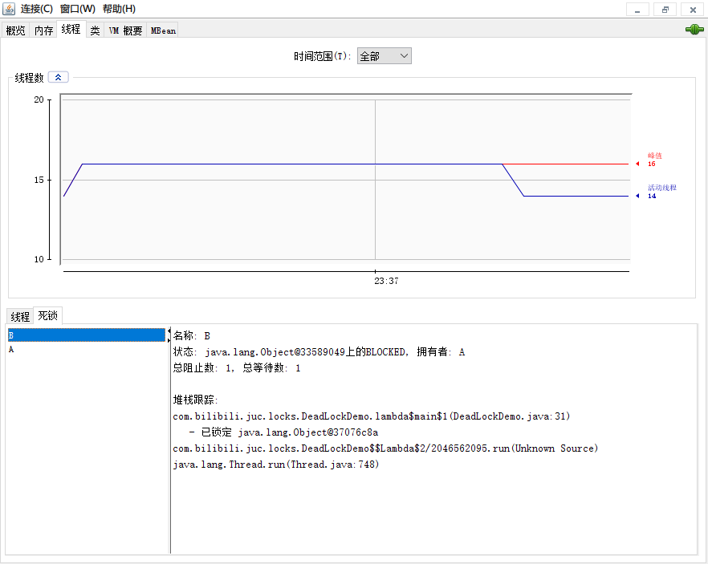

1、一些面试题
=======

1.  Java 加锁有哪几种锁？synchronized, 偏向锁
2.  简单说说 lock
3.  项目中哪个地方用了 countdownlanch, 怎么使用？

2、从轻松的[乐观锁]和悲观锁开讲
======================================================================================================

2.1、悲观锁
----------------------------------------------------------------------------------------------

认为自己在使用数据的时候一定有别的线程来修改数据，因此在获取数据的时候会先加锁，确保数据不会被别的线程修改。 

`synchronized` 关键字和 `Lock` 的实现类都是悲观锁 

> 适合写操作多的场景，先加锁可以保证写操作时数据正确。
>
> 显式的锁定之后再操作同步资源


2.2、乐观锁
-------

乐观锁认为自己在使用数据时 `不会有别的线程修改数据` ，所以不会添加锁，

在java中是通过使用`无锁编程`只是在更新数据的时候去判断之前有没有别的线程更新了这个数据。   

+ 如果这个数据没有被更新，当前线程将自己修改的数据成功写入。
+ 如果数据已经被其他线程更新，则根据不同的实现方式执行不同的操作   ，比如放弃修改、重试抢锁等。


乐观锁一般有两种实现方式：

1. **版本号机制Version**。（只要有人提交了就会修改版本号，可以解决ABA问题）

   + >  `ABA`问题：再CAS中想读取一个值A，想把值A变为C，不能保证读取时的A就是赋值时的A，中间可能有个线程将A变为B再变为A。
     >
     > 解决方法：Juc包提供了一个AtomicStampedReference，原子更新带有版本号的引用类型，通过控制版本值的变化来解决ABA问题。

2. 最常采用的是**CAS**（Compare-and-Swap，即比较并替换）算法实现，Java原子类中的递增操作就通过CAS自旋实现的。


适用于：

适合**读操作多的场景**，不加锁的特点能够使其读操作的性能大幅提升。

乐观锁则直接去操作同步资源，是一种无锁算法，得之我幸不得我命，再抢


2.3、伪代码说明
---------

```java
 //============= 悲观锁的调用方式
    public synchronized void m1(){
        // 加锁后的业务逻辑 ......
    }
 
    // 保证多个线程使用的是同一个 lock 对象的前提下
    ReentrantLock lock = new ReentrantLock();
    public void m2(){
        lock.lock();
        try {
            // 操作同步资源
        } finally {
            lock.unlock();
        }
    }
    
    //============= 乐观锁的调用方式
    //保证多个线程使用的是同一个AtomicInteger
    private AtomicInteger atomicInteger = new AtomicInteger();
    atomicInteger.incrementAndGet();
```


3、通 8 种情况演示锁运行案例，通过字节码看看我们到底锁的是什么
=============================

## 3.1 8锁案例

- 阿里巴巴代码规范
  - 【强制】高并发时，同步调用应该去考量锁的性能损耗。能用无锁数据结构，就不要用锁；能锁区块，就不要锁整个方法体；能用对象锁，就不要用类锁。
  - 说明：尽可能使加锁的代码块工作量尽可能的小，避免在锁代码块中调用 RPC 方法。

### 锁演示

- 8锁案例

##### 1、标准访问有ab两个线程，请问先打印邮件还是短信

```JAVA
class Phone //资源类
{
    public synchronized void sendEmail()
    {
        System.out.println("-------sendEmail");
    }

    public synchronized void sendSMS()
    {
        System.out.println("-------sendSMS");
    }
}

public class Lock8Demo
{
    public static void main(String[] args)//一切程序的入口，主线程
    {
        Phone phone = new Phone();//资源类1

        new Thread(() -> {
            phone.sendEmail();
        },"a").start();

        //暂停毫秒
        try { TimeUnit.MILLISECONDS.sleep(300); } catch (InterruptedException e) { e.printStackTrace(); }

        new Thread(() -> {
            phone.sendSMS();
        },"b").start();

    }
}
```

```java
-------sendEmail
-------sendSMS
```

##### 2、sendEmail方法暂停3秒钟，请问先打印邮件还是短信

```java
class Phone //资源类
{
    public synchronized void sendEmail()
    {
        //暂停几秒钟线程
        try { TimeUnit.SECONDS.sleep(3); } catch (InterruptedException e) { e.printStackTrace(); }
        System.out.println("-------sendEmail");
    }

    public synchronized void sendSMS()
    {
        System.out.println("-------sendSMS");
    }
}

public class Lock8Demo
{
    public static void main(String[] args)//一切程序的入口，主线程
    {
        Phone phone = new Phone();//资源类1

        new Thread(() -> {
            phone.sendEmail();
        },"a").start();

        //暂停毫秒
        try { TimeUnit.MILLISECONDS.sleep(300); } catch (InterruptedException e) { e.printStackTrace(); }

        new Thread(() -> {
            phone.sendSMS();
        },"b").start();

    }
}
```

```java
-------sendEmail
-------sendSMS
```

##### 1-2结论

```
一个对象里面如果有多个synchronized方法，某一个时刻内，只要一个线程去调用其中的一个synchronized方法了，
其它的线程都只能等待，换句话说，某一个时刻内，只能有唯一的一个线程去访问这些synchronized方法
锁的是当前对象this，被锁定后，其它的线程都不能进入到当前对象的其它的synchronized方法
```

##### 3、新增一个普通的hello方法，请问先打印邮件还是hello

```java
class Phone //资源类
{
    public synchronized void sendEmail()
    {
        //暂停几秒钟线程
        try { TimeUnit.SECONDS.sleep(3); } catch (InterruptedException e) { e.printStackTrace(); }
        System.out.println("-------sendEmail");
    }

    public synchronized void sendSMS()
    {
        System.out.println("-------sendSMS");
    }

    public void hello()
    {
        System.out.println("-------hello");
    }
}

public class Lock8Demo
{
    public static void main(String[] args)//一切程序的入口，主线程
    {
        Phone phone = new Phone();//资源类1

        new Thread(() -> {
            phone.sendEmail();
        },"a").start();

        //暂停毫秒
        try { TimeUnit.MILLISECONDS.sleep(300); } catch (InterruptedException e) { e.printStackTrace(); }

        new Thread(() -> {
            phone.hello();
        },"b").start();

    }
}
```

```java
-------hello
-------sendEmail
```

##### 4、有两部手机，请问先打印邮件还是短信

```java
class Phone //资源类
{
    public synchronized void sendEmail()
    {
        //暂停几秒钟线程
        try { TimeUnit.SECONDS.sleep(3); } catch (InterruptedException e) { e.printStackTrace(); }
        System.out.println("-------sendEmail");
    }

    public synchronized void sendSMS()
    {
        System.out.println("-------sendSMS");
    }

    public void hello()
    {
        System.out.println("-------hello");
    }
}

public class Lock8Demo
{
    public static void main(String[] args)//一切程序的入口，主线程
    {
        Phone phone = new Phone();//资源类1
        Phone phone2 = new Phone();//资源类2

        new Thread(() -> {
            phone.sendEmail();
        },"a").start();

        //暂停毫秒
        try { TimeUnit.MILLISECONDS.sleep(300); } catch (InterruptedException e) { e.printStackTrace(); }

        new Thread(() -> {
            phone2.sendSMS();
        },"b").start();
    }
}
```

```java
-------sendSMS
-------sendEmail
```

##### 3-4结论

```
加个普通方法后发现和同步锁无关,hello
换成两个对象后，不是同一把锁了，情况立刻变化。
```

##### 5、两个静态同步方法，同1部手机，请问先打印邮件还是短信

```java
class Phone //资源类
{
    public static synchronized void sendEmail()
    {
        //暂停几秒钟线程
        try { TimeUnit.SECONDS.sleep(3); } catch (InterruptedException e) { e.printStackTrace(); }
        System.out.println("-------sendEmail");
    }

    public static synchronized void sendSMS()
    {
        System.out.println("-------sendSMS");
    }

    public void hello()
    {
        System.out.println("-------hello");
    }
}

public class Lock8Demo
{
    public static void main(String[] args)//一切程序的入口，主线程
    {
        Phone phone = new Phone();//资源类1

        new Thread(() -> {
            phone.sendEmail();
        },"a").start();

        //暂停毫秒
        try { TimeUnit.MILLISECONDS.sleep(300); } catch (InterruptedException e) { e.printStackTrace(); }

        new Thread(() -> {
            phone.sendSMS();
        },"b").start();
    }
}
```

```java
-------sendEmail
-------sendSMS
```

##### 6、两个静态同步方法， 2部手机，请问先打印邮件还是短信

```java
class Phone //资源类
{
    public static synchronized void sendEmail()
    {
        //暂停几秒钟线程
        try { TimeUnit.SECONDS.sleep(3); } catch (InterruptedException e) { e.printStackTrace(); }
        System.out.println("-------sendEmail");
    }

    public static synchronized void sendSMS()
    {
        System.out.println("-------sendSMS");
    }

    public void hello()
    {
        System.out.println("-------hello");
    }
}

public class Lock8Demo
{
    public static void main(String[] args)//一切程序的入口，主线程
    {
        Phone phone = new Phone();//资源类1
        Phone phone2 = new Phone();//资源类2

        new Thread(() -> {
            phone.sendEmail();
        },"a").start();

        //暂停毫秒
        try { TimeUnit.MILLISECONDS.sleep(300); } catch (InterruptedException e) { e.printStackTrace(); }

        new Thread(() -> {
            phone2.sendSMS();
        },"b").start();
    }
}
```

```java
-------sendEmail
-------sendSMS
```

##### 5-6结论

```
都换成静态同步方法后，情况又变化
三种 synchronized 锁的内容有一些差别:
对于普通同步方法，锁的是当前实例对象，通常指this,具体的一部部手机,所有的普通同步方法用的都是同一把锁——实例对象本身，
对于静态同步方法，锁的是当前类的Class对象，如Phone.class唯一的一个模板
对于同步方法块，锁的是 synchronized 括号内的对象
```

##### 7、1个静态同步方法，1个普通同步方法,同1部手机，请问先打印邮件还是短信

```java
class Phone //资源类
{
    public static synchronized void sendEmail()
    {
        //暂停几秒钟线程
        try { TimeUnit.SECONDS.sleep(3); } catch (InterruptedException e) { e.printStackTrace(); }
        System.out.println("-------sendEmail");
    }

    public synchronized void sendSMS()
    {
        System.out.println("-------sendSMS");
    }

    public void hello()
    {
        System.out.println("-------hello");
    }
}

public class Lock8Demo
{
    public static void main(String[] args)//一切程序的入口，主线程
    {
        Phone phone = new Phone();//资源类1

        new Thread(() -> {
            phone.sendEmail();
        },"a").start();

        //暂停毫秒
        try { TimeUnit.MILLISECONDS.sleep(300); } catch (InterruptedException e) { e.printStackTrace(); }

        new Thread(() -> {
            phone.sendSMS();
        },"b").start();
    }
}
```

```java
-------sendSMS
-------sendEmail
```

##### 8、1个静态同步方法，1个普通同步方法,2部手机，请问先打印邮件还是短信

```java
class Phone //资源类
{
    public static synchronized void sendEmail()
    {
        //暂停几秒钟线程
        try { TimeUnit.SECONDS.sleep(3); } catch (InterruptedException e) { e.printStackTrace(); }
        System.out.println("-------sendEmail");
    }

    public synchronized void sendSMS()
    {
        System.out.println("-------sendSMS");
    }

    public void hello()
    {
        System.out.println("-------hello");
    }
}

public class Lock8Demo
{
    public static void main(String[] args)//一切程序的入口，主线程
    {
        Phone phone = new Phone();//资源类1
        Phone phone2 = new Phone();//资源类2

        new Thread(() -> {
            phone.sendEmail();
        },"a").start();

        //暂停毫秒
        try { TimeUnit.MILLISECONDS.sleep(300); } catch (InterruptedException e) { e.printStackTrace(); }

        new Thread(() -> {
            phone2.sendSMS();
        },"b").start();
    }
}
```

```java
-------sendSMS
-------sendEmail
```

##### 7-8结论

```
当一个线程试图访问同步代码时它首先必须得到锁，退出或抛出异常时必须释放锁。

所有的普通同步方法用的都是同一把锁——实例对象本身，就是new出来的具体实例对象本身,本类this
也就是说如果一个实例对象的普通同步方法获取锁后，该实例对象的其他普通同步方法必须等待获取锁的方法释放锁后才能获取锁。

所有的静态同步方法用的也是同一把锁——类对象本身，就是我们说过的唯一模板Class
具体实例对象this和唯一模板Class，这两把锁是两个不同的对象，所以静态同步方法与普通同步方法之间是不会有竞态条件的
但是一旦一个静态同步方法获取锁后，其他的静态同步方法都必须等待该方法释放锁后才能获取锁。
```

### 8锁-结论


> class文件加载到方法区
>
> 实例创建在堆

8种锁的案例实际体现在3个地方-相当于总结

- 作用域**实例方法**，`当前实例加锁`，进入同步代码块前要获得当前实例的锁。
- 作用于**代码块**，对括号里`配置的对象加锁`。
- 作用于**静态方法**，当前类加锁，进去同步代码前要获得当前`类对象的锁`


3.2、synchronized 有三种应用方式
------------------------

JDK 源码 (notify 方法) 说明举例


8种锁的案例实际体现在3个地方-相当于总结

- 作用域**实例方法**，`当前实例加锁`，进入同步代码块前要获得当前实例的锁。
- 作用于**代码块**，对括号里`配置的对象加锁`。
- 作用于**静态方法**，当前类加锁，进去同步代码前要获得当前`类对象的锁`

<table><tbody><tr><td colspan="4" rowspan="1"><p>Synchronized</p></td></tr><tr><td colspan="2" rowspan="1"><p>对象锁 (实例锁)</p></td><td colspan="2" rowspan="1"><p>类锁 (全局锁)</p></td></tr><tr><td><p>synchronized method(){}</p></td><td><p>synchronized(this){}</p></td><td><p>static synchronized method(){}</p></td><td><p>synchronized(class){}</p></td></tr><tr><td colspan="2" rowspan="1"><p>在同个实例对象内，所属线程独占对象锁，其他线程阻塞；不同的实例对象内无影响。</p></td><td colspan="2" rowspan="1"><p>在同个类内，所属线程独占类锁，其他线程阻塞。</p></td></tr></tbody></table>


3.3、从字节码角度分析 synchronized 实现
----------------------------

### 3.3.1、`javap -c ***.class` 文件反编译

 `-c`                       对代码进行反汇编

假如你需要更多信息

`javap -v ***.class` 文件反编译

 `-v`  `-verbose`             输出附加信息（包括行号、本地变量表，反汇编等详细信息）

### 3.3.2、synchronized 同步代码块

`javap -c .\LockSyncDemo.class` 文件反编译

反编译


 

> 第一个monitorexit 是保证正常退出时释放锁
>
> 第二个monitorexit 是保证发生异常退出时释放锁

**synchronized 同步代码块**

        实现使用的是 monitorenter 和 monitorexit 指令

**一定是一个 monitorenter 两个 monitorexit 吗？**

一般情况下是的

        m1 方法里面自己添加抛出一个异常试试


### 3.3.3、synchronized 普通同步方法

javap -v ***.class 文件反编译

反编译


**synchronized 普通同步方法**

        调用指令将会检查方法的 ACC_SYNCHRONIZED 访问标志是否被设置。

        如果设置了，执行线程会将先持有 monitor 然后再执行方法，

        最后在方法完成 (无论是正常完成还是非正常完成) 时释放 monitor

### 3.3.4、synchronized 静态同步方法

javap -v ***.class 文件反编译

反编译


**synchronized 静态同步方法**

        ACC_STATIC, ACC_SYNCHRONIZED 访问标志区分该方法是否静态同步方法

3.4、反编译 synchronized 锁的是什么
--------------------------

### 3.4.1、面试题

什么是管程 monitor？

synchronized 实现原理，monitor 对象什么时候生成的？知道 monitor 的 monitorenter 和 monitorexit 这两个是怎么保证同步的吗，或者说，这两个操作计算机底层是如何执行的

### 3.4.2、管程

管程 (英语：Monitors，也称为监视器) 是一种程序结构，结构内的多个子程序（对象或模块）形成的多个工作线程互斥访问共享资源。 

这些共享资源一般是硬件设备或一群变量。对共享变量能够进行的所有操作集中在一个模块中。（把信号量及其操作原语 “封装” 在一个对象内部）管程实现了在一个时间点，最多只有一个线程在执行管程的某个子程序。管程提供了一种机制，管程可以看做一个软件模块，它是将共享的变量和对于这些共享变量的操作封装起来，形成一个具有一定接口的功能模块，进程可以调用管程来实现进程级别的并发控制。 

 

在 HotSpot 虚拟机中，monitor 采用 ObjectMonitor 实现

> 大厂：为什么任何一个对象都可以成为一个锁？
>
> 溯源

Java **Object 类是所有类的父类**，也就是说 Java 的所有类都继承了 Object，子类可以使用 Object 的所有方法。

`ObjectMonitor.java → ObjectMonitor.cpp → objectMonitor.hpp`

ObjectMonitor.cpp中引入了头文件（include）objectMonitor.hpp

上述 C++ 源码解读1400行

  ```cpp
  ObjectMonitor() {
      _header       = NULL;
      _count        = 0; //用来记录该线程获取锁的次数
      _waiters      = 0,
      _recursions   = 0;//锁的重入次数
      _object       = NULL;
      _owner        = NULL; //------最重要的----指向持有ObjectMonitor对象的线程，记录哪个线程持有了我
      _WaitSet      = NULL; //存放处于wait状态的线程队列
      _WaitSetLock  = 0 ;
      _Responsible  = NULL ;
      _succ         = NULL ;
      _cxq          = NULL ;
      FreeNext      = NULL ;
      _EntryList    = NULL ;//存放处于等待锁block状态的线程队列
      _SpinFreq     = 0 ;
      _SpinClock    = 0 ;
      OwnerIsThread = 0 ;
      _previous_owner_tid = 0;
  }
  ```


**追溯底层可以发现每个对象天生都带着一个对象监视器。**

提前熟悉锁升级
synchronized必须作用于某个对象中，所以Java在对象的头文件存储了锁的相关信息。锁升级功能主要依赖于 MarkWord 中的锁标志位和释放偏向锁标志位


4、公平锁和非公平锁
==========

4.1、从 ReentrantLock 卖票编码演示公平和非公平现象
----------------------------------

```java
package com.atguigu.juc.locks;
 
 
import java.util.concurrent.locks.Lock;
import java.util.concurrent.locks.ReentrantLock;
 
class Ticket
{
    private int number = 50;
 
    private Lock lock = new ReentrantLock(true); //默认false用的是非公平锁
    public void sale()
    {
        lock.lock();
        try
        {
            if(number > 0)
            {
                System.out.println(Thread.currentThread().getName()+"\t 卖出第: "+(number--)+"\t 还剩下: "+number);
            }
        }finally {
            lock.unlock();
        }
    }
 
 
 
    /*Object objectLock = new Object();
    public void sale()
    {
        synchronized (objectLock)
        {
            if(number > 0)
            {
                System.out.println(Thread.currentThread().getName()+"\t 卖出第: "+(number--)+"\t 还剩下: "+number);
            }
        }
    }*/
}
 
/**
 * @auther zzyy
 * @create 2020-07-09 17:48
 */
public class SaleTicketDemo
{
    public static void main(String[] args)
    {
        Ticket ticket = new Ticket();
 
        new Thread(() -> { for (int i = 1; i <=55; i++) ticket.sale(); },"a").start();
        new Thread(() -> { for (int i = 1; i <=55; i++) ticket.sale(); },"b").start();
        new Thread(() -> { for (int i = 1; i <=55; i++) ticket.sale(); },"c").start();
        new Thread(() -> { for (int i = 1; i <=55; i++) ticket.sale(); },"d").start();
        new Thread(() -> { for (int i = 1; i <=55; i++) ticket.sale(); },"e").start();
    }
}
```

4.2、何为公平锁 / 非公平锁?
-----------------


非公平锁

+ 默认是非公平锁

+ 非公平锁可以插队，买卖票不均匀。

+ 是指多个线程获取锁的顺序并不是按照申请锁的顺序，有可能后申请的线程比先申请的线程优先获取锁，在高并发环境下，有可能造成优先级翻转或饥饿的状态（某个线程一直得不到锁）

公平锁

+ `ReentrantLock lock = new ReentrantLock(true)`;

+ 买卖票一开始a占优，后面a b c a b c a b c均匀分布

+ 是指多个线程按照申请锁的顺序来获取锁，这里类似排队买票，先来的人先买后来的人在队尾排着，这是公平的。


⽣活中，排队讲求先来后到视为公平。程序中的公平性也是符合请求锁的绝对时间的，其实就是 FIFO[fast in fase put]，否则视为不公平 


### 4.2.1、源码解读：

按序排队公平锁，就是判断同步队列是否还有先驱节点的存在 (我前面还有人吗?)，如果没有先驱节点才能获取锁；

先占先得非公平锁，是不管这个事的，只要能抢获到同步状态就可以 


### 4.2.2、面试题


>  **为什么会有公平锁/非公平锁的设计？为什么默认是非公平？**
>
> 1. 恢复挂起的线程到真正锁的获取还是有时间差的，从开发人员来看这个时间微乎其微，但是从CPU的角度来看，这个时间差存在的还是很明显的。所以**非公平锁能更充分的利用CPU 的时间片**，尽量**减少 CPU 空闲状态时间**。
> 2. 使用多线程很重要的**考量点是线程切换的开销**，当采用非公平锁时，当1个线程请求锁获取同步状态，然后释放同步状态，因为不需要考虑是否还有前驱节点，所以刚释放锁的线程在此刻再次获取同步状态的概率就变得非常大，所以就减少了线程的开销。

> **使⽤公平锁会有什么问题**？
>
> 公平锁保证了排队的公平性，非公平锁霸气的忽视这个规则，所以就有可能导致排队的长时间在排队，也没有机会获取到锁， 
>
> 这就是传说中的 “锁饥饿” 

> **什么时候用公平？什么时候用非公平？**
>
> + 如果为了更**高的吞吐量，很显然非公平锁是比较合适**的，因为节省很多线程切换时间，吞吐量自然就上去了；
> + 否则那就用公平锁，大家公平使用。

5、可重入锁 (又名递归锁)
==============

5.1、说明
------

**可重入锁又名递归锁** 

是指在`同一个线程`在外层方法获取锁的时候，再`进入该线程的内层方法`会自动获取锁 (前提，锁对象得是同一个对象)，不会因为之前已经获取过还没释放而阻塞。 


如果是 1 个有 synchronized 修饰的递归调用方法， 程序**第 2 次进入被自己阻塞**了岂不是天大的笑话，出现了**作茧自缚。** 

所以 Java 中 **ReentrantLock 和 synchronized 都是可重入锁** ，可重入锁的一个优点是可**一定程度避免死锁**。 


“可重入锁” 这四个字分开来解释：

可：可以。

重：再次。

入：进入。

锁：同步锁。

进入什么？进入同步域（即同步代码块 / 方法或显式锁锁定的代码）

一句话

**一个线程中的多个流程可以获取同一把锁，持有这把同步锁可以再次进入**。

自己可以获取自己的内部锁


5.2、可重入锁种类
----------

### **隐式锁（即 `synchronized` 关键字使用的锁）默认是可重入锁**

指的是可重复可递归调用的锁，在外层使用锁之后，在内层仍然可以使用，并且不发生死锁，这样的锁就叫做可重入锁。 

简单的来说就是： **在一个 synchronized 修饰的方法或代码块的内部调用本类的其他 synchronized 修饰的方法或代码块时，是永远可以得到锁的** 

与可重入锁相反，不可重入锁不可递归调用，递归调用就发生死锁。 

+ 同步块

```java
static Object objectLock = new Object();
public static void syncBlock()
{
    //验证可重入锁
    new Thread(() -> {
        synchronized (objectLock) {// lock
            System.out.println("-----外层");
            synchronized (objectLock)
            {
                System.out.println("-----中层");
                synchronized (objectLock)
                {
                    System.out.println("-----内层");
                }
            }
        }//unlock
    },"t1").start();
}
```

+ 同步方法

```java
 
public class ReEntryLockDemoCopy {
    public synchronized void m1() {
        System.out.println("-----m1");
        m2();
    }
 
    public synchronized void m2() {
        System.out.println("-----m2");
        m3();
    }
 
    public synchronized void m3() {
        System.out.println("-----m3");
    }
 
    public static void main(String[] args) {
        ReEntryLockDemoCopy reEntryLockDemo = new ReEntryLockDemoCopy();
        reEntryLockDemo.m1();
    }
}
```

**Synchronized 的重入的实现机理**

每个锁对象拥有一个**锁计数器**和一个**指向持有该锁的线程的指针**。 


当执行 monitorenter 时，如果目标锁对象的计数器为零，那么说明它没有被其他线程所持有，Java 虚拟机会将该锁对象的持有线程设置为当前线程，并且将其计数器加 1。 


在目标锁对象的计数器不为零的情况下，如果锁对象的持有线程是当前线程，那么 Java 虚拟机可以将其计数器加 1，否则需要等待，直至持有线程释放该锁。 


当执行 monitorexit 时，Java 虚拟机则需将锁对象的计数器减 1。计数器为零代表锁已被释放。 


### **显式锁（即 `Lock`）也有 ReentrantLock 这样的可重入锁。**

```java
package com.atguigu.juc.locks;
 
import java.util.concurrent.locks.Lock;
import java.util.concurrent.locks.ReentrantLock;
 
/**
指的是可重复可递归调用的锁，在外层使用锁之后，在内层仍然可以使用并且不发生死锁，这样的锁就叫做可重入锁。
简单的来说就是：
在一个synchronized修饰的方法或代码块的内部调用本类的其他synchronized修饰的方法或代码块时，是永远可以得到锁的
 */
public class ReEntryLockDemo
{
 
    public static void main(String[] args)
    {
        Lock lock = new ReentrantLock();
 
        new Thread(() -> {
            lock.lock();
            try
            {
                System.out.println(Thread.currentThread().getName()+"\t"+"-----外层");
                lock.lock();
                try
                {
                    System.out.println(Thread.currentThread().getName()+"\t"+"-----内层");
                }finally {
                    //  这里故意注释，实现加锁次数和释放次数不一样                   
                    //   由于加锁次数和释放次数不一样，第二个线程始终无法获取到锁，导致一直在等待。
                   // lock.unlock(); //  正常情况，加锁几次就要解锁几次
                }
            }finally {
                lock.unlock();
            }
        },"t1").start();
 
        new Thread(() -> {
            lock.lock();
            try
            {
                System.out.println("------22222");
            }finally {
                lock.unlock();
            }
        },"t2").start();
    }
 
}
```


6、死锁及排查
=========

## 1、是什么

死锁是指两个或两个以上的线程在执行过程中 , 因争夺资源而造成的一种 互相等待的现象 , 若无外力干涉那它们都将无法推进下去，如果系统资源充足，进程的资源请求都能够得到满足，死锁出现的可能性就很低，否则就会因争夺有限的资源而陷入死锁。  

 

产生死锁主要原因：

1.  系统资源不足
2.  进程运行推进的顺序不合适
3.  资源分配不当

## 2、请写一个死锁代码 case

```java
public class DeadLockDemo
{
    static Object lockA = new Object();
    static Object lockB = new Object();
 
 
    public static void main(String[] args)
    {
 
        Thread a = new Thread(() -> {
            synchronized (lockA) {
                System.out.println(Thread.currentThread().getName() + "\t" + " 自己持有A锁，期待获得B锁");
 
                try {
                    TimeUnit.SECONDS.sleep(1);
                } catch (InterruptedException e) {
                    e.printStackTrace();
                }
 
                synchronized (lockB) {
                    System.out.println(Thread.currentThread().getName() + "\t 获得B锁成功");
                }
            }
        }, "a");
        a.start();
 
        new Thread(() -> {
            synchronized (lockB)
            {
                System.out.println(Thread.currentThread().getName()+"\t"+" 自己持有B锁，期待获得A锁");
 
                try { TimeUnit.SECONDS.sleep(1); } catch (InterruptedException e) { e.printStackTrace(); }
 
                synchronized (lockA)
                {
                    System.out.println(Thread.currentThread().getName()+"\t 获得A锁成功");
                }
            }
        },"b").start();
 
 
    }
}
 
运行结果：代码无法结束运行
```

 

## 3、如何排查死锁

### 1. 纯命令

```shell
jps -l #查看当前进程运行状况

jstack #进程编号 查看该进程信息
```

jps 命令定位进程编号

 

jstack 找到死锁查看

jstack 6488


**不可以 String 同一把锁**

String locka =“A”; 

String lockb =“B”;  不可以 

**严禁这么做**

### 2. 图形化

```
jconsole   #开发者工具jdk1.8\jdk1.8.0_241\bin目录下
```

1. 运行`jconsole`


2. 连接相应的类


3. 点击检测死锁


4. 查看详细信息

   


# 小总结-加解锁流程

指针指向monitor对象（也称为管程或监视器锁）的起始地址。

每个对象都存在着一个monitor与之关联，当一个monitor被某个线程持有后，它便处于锁定状态。

在Java虚拟机(HotSpot)中，monitor是由ObjectMonitor实现的，其主要数据结构如下（位于HotSpot虚拟机源码ObjectMonitor.hpp,C++实现的）


