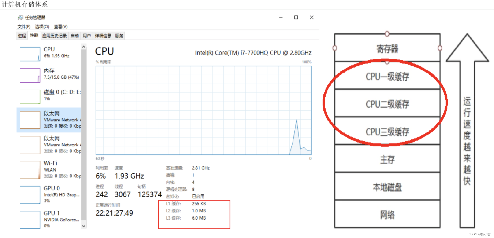
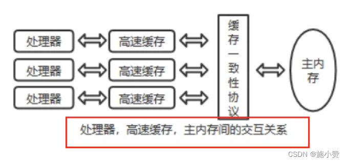
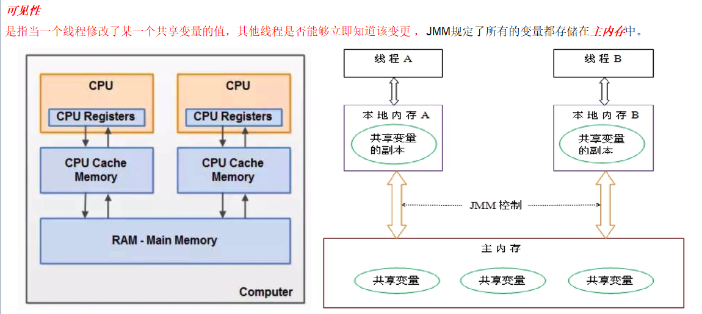
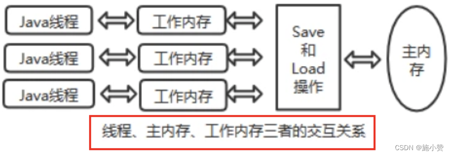
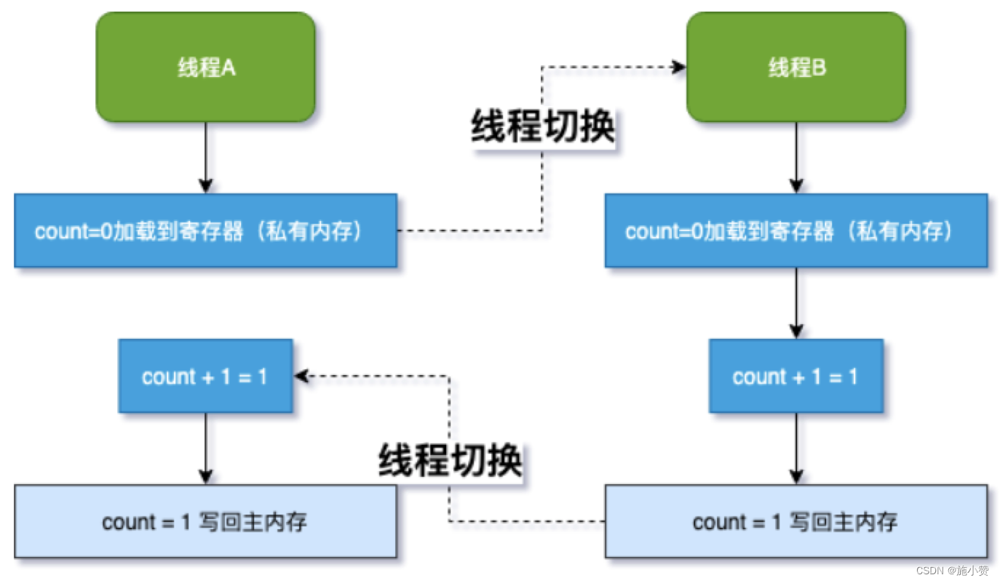
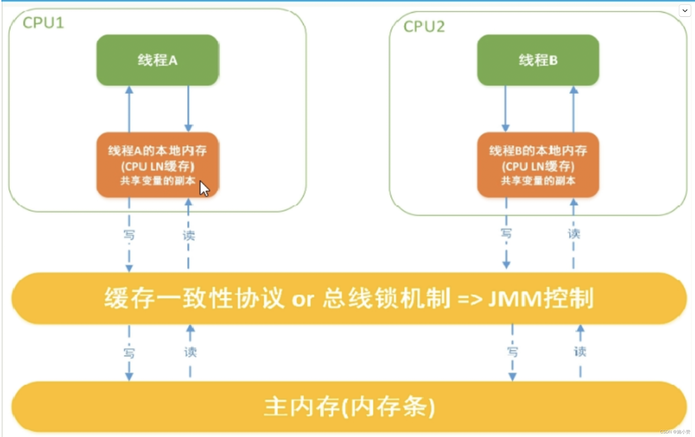
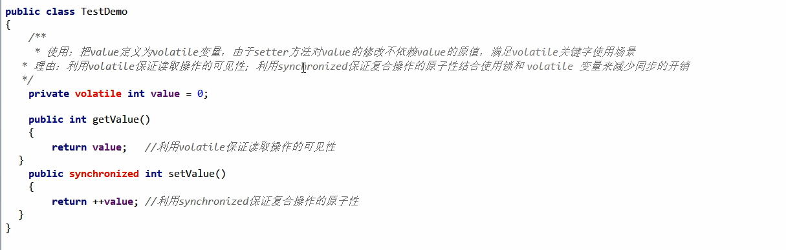

1、先从大厂面试题开始
=======

1.  你知道什么是 Java 内存模型 JMM 吗？
2.  JMM 与 volatile 它们两个之间的关系？(下一章详细讲解)
3.  JMM 有哪些特性 or 它的三大特性是什么？
4.  为什么要有 JMM，它为什么出现？作用和功能是什么？
5.  happens-before 先行发生原则你有了解过吗？

2、计算机硬件存储体系
===========

计算机[存储结构](https://so.csdn.net/so/search?q=%E5%AD%98%E5%82%A8%E7%BB%93%E6%9E%84&spm=1001.2101.3001.7020)，从本地磁盘到主存到 CPU 缓存，也就是从硬盘到内存，到 CPU 。

一般对应的程序的操作就是从数据库查数据到内存然后到 CPU 进行计算



问题？和推导出我们需要知道 JMM

因为有这么多级的缓存 (cpu 和物理主内存的速度不一致的)，

CPU 的运行并 `不是直接操作内存而是先把内存里边的数据读到缓存` ，而内存的读和写操作的时候就会造成不一致的问题



**Java [虚拟机]规范**中试图定义一种 Java 内存模型（java Memory Model，简称 **JMM**) 来**屏蔽掉各种硬件和操作系统的内存访问差异， 以实现让 Java 程序在各种平台下都能达到一致的内存访问效果**。


推导出我们需要知道 JMM 

3、[Java 内存模型]Java Memory Model
=================================================================================================================================

JMM(Java 内存模型 Java Memory [Model](https://so.csdn.net/so/search?q=Model&spm=1001.2101.3001.7020)，简称 JMM)本身是一种 `抽象的` 概念 `并不真实存在` 它 `仅仅描述的是一组约定或规范` ，*通过这组规范定义了程序中 (尤其是多线程) 各个变量的读写访问方式并决定一个线程对共享变量的写入何时以及如何变成对另一个线程可见*，关键技术点都是围绕多线程的 原子性、可见性和有序性 展开的。 

 **原则：** 

 JMM 的关键技术点都是围绕多线程的 `原子性`、`可见性`和`有序性`展开的 

**能干嘛？** 

1. 通过 JMM 来实现 **线程和主内存之间的抽象关系**。 

2.  屏蔽各个 **硬件平台** 和 **操作系统** `的内存访问差异` 以实现让 Java 程序在各种平台下都能达到一致的内存访问效果。 

4、Java 内存模型 Java Memory Model
=============================

4.1、可见性
-------

**是指当一个线程修改了某一个共享变量的值，其他线程是否能够立即知道该变更**   ， JMM 规定了所有的变量都存储在 **主内存** 中。



Java 中 普通的`共享变量`不保证可见性 ，因为数据修改被写入内存的时机是不确定的，*多线程并发下很可能出现 "脏读"* ，所以每个线程都有自己的 工作内存 ，线程自己的工作内存中保存了该线程使用到的变量的 `主内存副本拷贝` ，线程对变量的所有操作（读取，赋值等 ）都必需在线程自己的工作内存中进行，而不能够直接读写主内存中的变量。*不同线程之间也无法直接访问对方工作内存中的变量*，线程间变量值的传递均需要通过主内存来完成  



 **线程脏读：如果没有可见性保证**

<table><tbody><tr><td><p>主内存中有变量 x ，初始值为 0 &nbsp;</p></td></tr><tr><td><p>线程 A 要将 x 加 1 ，先将 x=0 拷贝到自己的私有内存中，然后更新 x 的值 &nbsp;</p></td></tr><tr><td><p>线程 A 将更新后的 x 值回刷到主内存的时间是不固定的&nbsp; &nbsp;</p></td></tr><tr><td><p>刚好在线程 A 没有回刷 x 到主内存时，线程 B 同样从主内存中读取 x ，此时为 0 ，和线程 A 一样的操作，最后期盼的 x=2 就会变成 x=1 &nbsp;</p></td></tr></tbody></table>

 

4.2、原子性
-------

指一个操作是不可中断的，即多线程环境下，操作不能被其他线程干扰

原子性是指**操作是不可分的**，要么全部一起执行，要么不执行。在java中，其表现在对于共享变量的某些操作，是不可分的，必须连续的完成。比如a++，对于共享变量a的操作，实际上会执行3个步骤：

1.读取变量a的值，假如a=1
2.a的值+1，为2
3.将2值赋值给变量a，此时a的值应该为2

这三个操作中任意一个操作，a的值如果被其他线程篡改了，那么都会出现我们不希望出现的结果。所以必须保证这3个操作是原子性的，在操作a++的过程中，其他线程不会改变a的值，如果在上面的过程中出现其他线程修改了a的值，在满足原子性的原则下，上面的操作应该失败。

4.3、有序性 
--------

**是什么？**

> 对于一个线程的执行代码而言，我们总是习惯性认为代码的执行总是从上到下，有序执行。   
>
> 但为了提供性能，编译器和处理器通常会对指令序列进行重新排序。 
>
> Java 规范规定 JVM 线程内部维持**顺序化语义**，即只要程序的最终结果与它顺序化执行的结果**相等**，那么指令的执行顺序可以与代码顺序**不一致**，此过程叫指令的**重排序**。 


 **优缺点：**

> JVM 能根据处理器特性（CPU 多级缓存系统、多核处理器等）适当的机器对指令进行重排序，使得机器指令能更符合 CPU 的执行特性，最大限度的发挥机器性能。但是，
>
> **指令重排**可以保证**串行**语义一致，但没有义务保证**多线程间**的语义也一致（即可能产生 “脏读”），简单说，
>
> 两行以上不相干的代码在执行的时候有可能先执行的不是第一条，不见得是从上到下顺序执行，执行顺序会被优化。 

从 源码到最终执行示例图：


单线程环境里面确保程序最终执行结果和代码顺序执行的结果一致。   

处理器在进行重排序时 `必须要考虑` 指令之间的 `数据依赖性`   

多线程环境中线程交替执行 , 由于编译器优化重排的存在，两个线程中使用的变量能否保证一致性是无法确定的 , 结果无法预测   

**简单案例先过个眼熟：**

```java
public void mySort() {
    int x = 11;//语句1
    int y = 12;//语句2
    x = x + 5;//语句3
    y = x * x;//语句4
}
 
 1 2 3 4
 2 1 3 4
1 3 2 4
问题：请问语句4可以重排后变成第一条吗？
不可以
```

5、JMM 规范下，多线程对变量的读写过程
=====================

5.1、读取过程
--------

由于 JVM 运行程序的实体是线程，而**每个线程创建时 JVM 都会为其创建一个工作内存** (有些地方称为栈空间) ，工作内存是每个线程的**私有数据区域**，而 **Java 内存模型中规定所有变量都存储在 主内存** ，主内存是共享内存区域，所有线程都可以访问， 但**线程对变量的操作 ( 读取赋值等 ) 必须在工作内存中进行，首先要将变量从主内存拷贝到的线程自己的工作内存空间，然后对变量进行操作，操作完成后再将变量写回主内存，** 不能直接操作主内存中的变量，各个线程中的工作内存中存储着主内存中的 `变量副本拷贝` ，因此不同的线程间无法访问对方的工作内存，**线程间的通信 ( 传值 ) 必须通过主内存来完成**，其简要访问过程如下图 :   



**JMM 定义了线程和主内存之间的抽象关系**   

1.  线程之间的共享变量存储在主内存中 (从硬件角度来说就是内存条)   

2.  每个线程都有一个私有的本地工作内存，本地工作内存中存储了该线程用来读 / 写共享变量的副本 (从硬件角度来说就是 CPU 的缓存，比如寄存器、 L1 、 L2 、 L3 缓存等)   

5.2、小总结
-------

*   我们定义的所**有共享变量都储存在物理主内存**中
*   **每个线程都有自己独立的工作内存**，里面保存该线程使用到的**变量的副本 (主内存中该变量的一份拷贝)**
*   线程对共享变量所有的操作都必须先在线程自己的工作内存中进行后写回主内存，不能直接从主内存中读写 (不能越级)
*   **不同线程之间也无法直接访问其他线程的工作内存中的变量**，线程间变量值的传递需要通过主内存来进行 (同级不能相互访问)

6、JMM 规范下，多线程先行发生原则之 `happens-before`
===================================

在 JMM 中，如果一个操作`执行的结果`需要对`另一个操作可见性` 或者 `代码重排序`，那么这两个操作之间必须存在 happens-before 关系。

逻辑上的**先后关系**。

6.1、x 、y 案例说明

<table><tbody><tr><td><p>x = 5 &nbsp;</p></td><td><p>线程 A 执行&nbsp; &nbsp;</p></td></tr><tr><td><p>y = x &nbsp;</p></td><td><p>线程 B 执行&nbsp; &nbsp;</p></td></tr><tr><td><p>上述称之为：写后读&nbsp;</p></td><td></td></tr></tbody></table>

 问题 ?  

<table><tbody><tr><td><p>y 是否等于 5 呢？&nbsp;</p><p>如果线程 A 的操作（ x= 5 ） happens-before(先行发生) 线程 B 的操作（ y = x ） , 那么可以确定线程 B 执行后 y = 5 一定成立 ; &nbsp;</p><p>如果他们不存在 happens-before 原则，那么 y = 5 不一定成立。&nbsp; &nbsp;</p><p>这就是 happens-before 原则的威力。 ------------------- 》 包含可见性和有序性的约束&nbsp; &nbsp;</p></td></tr></tbody></table>

6.2、先行发生原则说明
------------

先行发生原则 (`happens-before`) 被定义在了 JMM 之中
如果 Java 内存模型中所有的有序性都仅靠 volatile 和 synchronized 来完成，那么有很多操作都将会变得非常啰嗦，

但是我们在编写 Java 并发代码的时候并没有察觉到这一点。

我们没有**时时、处处、次次**，添加`volatile`和`synchronized`来完成程序，这是因为 Java 语言中 JMM 原则下

有一个 **“先行发生”(Happens-Before) 的原则限制和规矩 **

**这个原则非常重要：**

它是判断数据是否存在竞争，**线程是否安全**的**非常有用的手段**。依赖这个原则，我们可以通过几条简单规则一揽子**解决并发环境下两个操作之间是否可能存在冲突的所有问题**，而不需要陷入 Java 内存模型苦涩难懂的底层编译原理之中。

6.3、happens-before 总原则
----------------------

- 如果一个操作 `happens-before` 另一个操作，那么第一个操作的执行结果将对第二个操作可见，而且第一个操作的执行顺序排在第二个操作之前。
- 两个操作之间存在 `happens-before` 关系，并不意味着一定要按照 happens-before 原则制定的顺序来执行。如果`重排序之后的执行结果与`按照 happens-before 关系来执行的`结果一致`，那么这种`重排序并不非法`。
  - 1+2+3 = 3+2+1
  - 周一张三周二李四，假如有事情调换班可以的

6.4、happens-before 之 8 条
------------------------

### ①次序规则：

一个线程内，按照代码顺序，写在前面的操作先行发生于写在后面的操作；

加深说明：前一个操作的结果可以被后续的操作获取。讲白点就是前面一个操作把变量 X 赋值为 1，那后面一个操作肯定能知道 X 已经变成了 1。

### ②锁定规则：

一个 unLock 操作`先行发生于`后面 ((这里的“后面” 是指时间上的先后))对同一个锁的 lock 操作；

```java
public class HappenBeforeDemo {
    static Object objectLock = new Object();
 
    public static void main(String[] args) throws InterruptedException {
        // 对于同一把锁 objectLock ， threadA 一定先 unlock 同一把锁后 B 才能获得该锁， A 先行发生于 B 
        synchronized (objectLock) {
        }
    }
}
```

### ③ volatile 变量规则：

对一个 volatile 变量的写操作先行发生于后面对这个变量的读操作，

`前面的写对后面的读是可见的`，这里的 “后面” 同样是指时间上的先后。

### ④ 传递规则：

如果操作 A 先行发生于操作 B，而操作 B 又先行发生于操作 C，则可以得出操作 A 先行发生于操作 C；

### ⑤ 线程启动规则 (Thread Start Rule)：

Thread 对象的 `start()` 方法先行发生于此线程的每一个动作

### ⑥ 线程中断规则 (Thread Interruption Rule)：

对线程 `interrupt()` 方法的调用先行发生于被中断线程的代码检测到中断事件的发生；

可以通过 `Thread.interrupted()` 检测到是否发生中断

也就是说你要先调用了`interrupt()`方法设置过中断标志位，我才能检测到中断发送。

### ⑦ 线程终止规则 (Thread Termination Rule)：

线程中的所有操作都先行发生于对此线程的终止检测，我们可以通过`Thread::isAlive()` 的返回值等手段检测线程是否已经终止执行。

### ⑧ 对象终结规则 (Finalizer Rule)：

一个对象的初始化完成（构造函数执行结束）先行发生于它的 finalize() 方法的开始

说人话：对象没有完成初始化之前，是不能调用 finalized() 方法的

## happens-before-小总结

在Java 语言里面，Happens-Before的语义本质上是一种`可见性`

A Happens—Before B 意味着A发生过的事情对B来说是可见的，无论A事件和B事件是否发生在同一个线程里.


JMM的设计分为两部分：

+ 一部分是面向我们程序员提供的，也就是happens-before规则，它通俗易懂的向我们程序员阐述了一个强内存模型，我们只要理解happens-before规则，就可以编写并发安全的程序了。

+ 另一部分是针对JVM实现的，为了尽可能少的对编译器和处理器做约束从而提高性能，JMM在不影响程序执行结果的前提下对其不做要求，即允许优化重排序。我们只需要关注前者就好了，也就是理解happens-before规则即可，其它繁杂的内容有JMM规范结合操作系统给我们搞定，我们只写好代码即可。

6.5、appens-before 案例说明
--------

- 案例

  ```java
  public class TestDemo
  {
    private int value = 0;
    public int getValue(){
        return value; 
    }
    public  int setValue(){
        return ++value;
    }
  }
  ```

  > 问：假设存在线程 A 和 B，线程 A 先（时间上的先后）调用了 setValue()，然后线程 B 调用了同一个对象的 getValue()，那么线程 B 收到的返回值是什么？是 0 还是 1？
  >
  > 答：真不一定

  

  > 我们就这段简单的代码一次分析 happens-before 的规则（规则 5、6、7、8 可以忽略，因为他们和这段代码毫无关系）：
  >
  > 1. 由于两个方法是由不同的线程调用，不在同一个线程中，所以肯定不满足程序次序规则；
  > 2. 两个方法都没有使用锁，所以不满足锁定规则；
  > 3. 变量不是用 volatile 修饰的，所以 volatile 变量规则不满足；
  > 4. 传递规则肯定不满足；

- 所以我们无法通过 happens-before 原则推导出线程 A happens-before 线程 B，虽然可以确认在时间上线程 A 优先于线程 B 指定，
  但就是无法确认线程 B 获得的结果是什么，所以这段代码不是线程安全的。那么怎么**修复**这段代码呢？

- **修复**

- 把getter/setter方法都定义为synchronized方法

  ```java
  
  public class TestDemo
  {
    private int value = 0;
    public synchronized int getValue(){
        return value; 
    }
    public synchronized int setValue(){
        return ++value;
    }
  }
  //synchronized太猛了，降低太多的效率
  ```

+ 把value定义为volatile变量，由于setter方法对value的修改不依赖value的原值，满足volatile关键字使用场景

> 理由：利用volatile保证读取操作的可见性；利用synchronized保证复合操作的原子性结合使用锁和volatile变量来减少同步的开销。



