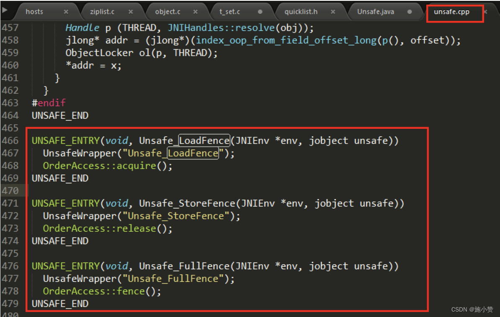

1、被 volatile 修改的变量有 2 大特点
=====================================

**1.1、特点**
----------

+ `可见性`

+ `有序性`  排序要求，有时需要禁重排

不满足原子性

**1.2、volatile 的内存语义**
----------------------

当`写`一个 `volatile变量`时，JMM 会把该线程对应的`本地内存`中的共享变量值`立即刷新回主内存`中。

当`读`一个 `volatile 变量`时，JMM 会把该线程对应的`本地内存设置为无效`，直接从`主内存中读取共享变量`

所以 **volatile 的写内存语义是直接刷新到主内存中，读的内存语义是直接从主内存中读取**。

个人理解：相当于线程的本地工作内存禁止缓存volatile变量，【类似于Redis缓存架构中每次都是读写数据库】

**1.3、volatile 凭什么可以保证可见性和有序性？？？**
----------------------------------

内存屏障 (Memory Barriers / Fences)

**2、内存屏障**
==========

**2.1、先说生活 case**
-----------------

没有管控，顺序难保

设定规则，禁止乱序 ：上海南京路步行街武警 “人墙” 当红灯


**回忆一下 volatile 两大特性**

+ 可见性：立即刷新回主内存 + 失效处理。

+ 有序性：禁止指令重排：存在**数据依赖关系**的禁止重排。

**2.2、是什么**
-----------

  内存屏障（也称内存栅栏，内存栅障，屏障指令等，是一类同步屏障指令，是 CPU 或编译器在对内存随机访问的操作中的一个同步点，使得此点之前的所有读写操作都执行后才可以开始执行此点之后的操作），避免代码重排序。

内存屏障其实就是一种 JVM 指令， Java 内存模型的重排规则会 `要求 Java 编译器在生成 JVM 指令时插入特定的内存屏障指令` ，通过这些内存屏障指令， volatile 实现了 Java 内存模型中的可见性和有序性(禁重排)，但 `volatile 无法保证原子性`。   


***内存屏障之前*** 的所有 `写操作`都要 `回写到主内存` ，   

***内存屏障之后*** 的所有`读操作`都能获得内存屏障之前的所有写操作的最新结果 (实现了可见性) 。 


**写屏障** (Store Memory Barrier) ：告诉处理器在写屏障之前将所有存储在缓存 (store bufferes) 中的数据同步到主内存。也就是说当**看到 Store 屏障指令， 就必须把该指令之前所有写入指令执行完毕才能继续往下执行。**
**读屏障** (Load Memory Barrier) ：处理器在**读屏障之后的读操作， 都在读屏障之后执行**。也就是说在 Load 屏障指令之后就能够保证后面的读取数据指令一定能够读取到最新的数据。 


因此重排序时，不允许把内存屏障之后的指令重排序到内存屏障之前。   

一句话：对一个 volatile 域的写 , happens-before 于任意后续对这个 volatile 域的读，也叫**写后读**。   

## 2.3、分类

### 粗分两种


### 细分四种，见2.4章节

**2.4、JVM 中提供了四类内存屏障指令**
------------------------

### **2.4.1、C++ 源码分析**

IDEA 工具里面找 Unsafe.class   -->Unsafe.java  --> Unsafe.cpp --> OrderAccess.hpp


Unsafe.java


Unsafe.cpp



OrderAccess.hpp


orderAccess_linux_x86.inline.hpp


### **2.4.2、四大屏障分别是什么意思**

| 屏障类型   | 指令示例                 | 说明                                                         |
| ---------- | ------------------------ | ------------------------------------------------------------ |
| LoadLoad   | Load1;LoadLoad;Load2     | 保证 load1 的读取操作在 load2 及后续读取操作之前执行         |
| StoreStore | Store1;StoreStore;Store2 | 在 store2 及其后的写操作执行前，保证 store1 的写操作已刷新到主内存 |
| LoadStore  | Load1;LoadStore;Store2   | 在 store2 及其后的写操作执行前，保证 load1 的读操作已读取结束 |
| StoreLoad  | Store1;StoreLoad;Load2   | 保证 store1 的写操作已刷新到主内存之后，load2 及其后的读操作才能执行 |

orderAccess_linux_x86.inline.hpp


## 2.5、什么叫保证有序性--禁止指令重排

通过内存屏障禁止重排

1.  重排序有可能影响程序的执行和实现， 因此， 我们有时候希望告诉JVM你别“自作聪明”给我重排序， 我这里不需要排序， 听主人的。

2.  对于编译器的重排序， JMM会根据重排序的规则， 禁止特定类型的编译器重排序。

3.  对于处理器的重排序， Java编译器在生成指令序列的适当位置， `插入内存屏障指令`， 来禁止特定类型的处理器排序。

## 2.6、happens-before 之 volatile 变量规则


2.7、JMM 就将内存屏障插⼊策略分为 4 种
----------------------------


### 2.6.1、写

1.  在每个 volatile 写操作的前⾯插⼊⼀个 StoreStore 屏障

2.  在每个 volatile 写操作的后⾯插⼊⼀个 StoreLoad 屏障


### 2.6.2、读

+ 在每个 volatile 读操作的后⾯插⼊⼀个 LoadLoad 屏障

+ 在每个 volatile 读操作的后⾯插⼊⼀个 LoadStore 屏障


volatile读插入内存屏障后生成的指令序列示意图


3、volatile 特性
=================

**3.1、保证可见性**
-------------

说明：保证不同线程对这个变量进行操作时的可见性，即变量一旦改变所有线程立即可见

```java
public class VolatileSeeDemo
{
    //static  boolean flag = true;       //不加volatile，没有可见性
    static volatile boolean flag = true;       //加了volatile，保证可见性

    public static void main(String[] args)
    {
        new Thread(() -> {
            System.out.println(Thread.currentThread().getName()+"\t come in");
            while (flag)//默认flag是true,如果未被修改就一直循环，下面那句话也打不出来
            {

            }
            System.out.println(Thread.currentThread().getName()+"\t flag被修改为false,退出.....");
        },"t1").start();

        //暂停几秒
        try { TimeUnit.SECONDS.sleep(2); } catch (InterruptedException e) { e.printStackTrace(); }

        flag = false;

        System.out.println("main线程修改完成");
    }
}
//没有volatile时
//t1   come in
//main线程修改完成
//--------程序一直在跑（在循环里）

//有volatile时
//t1   come in
//main线程修改完成
//t1   flag被修改为false,退出.....
```

不加 volatile，没有可见性，程序无法停止

加了 volatile，保证可见性，程序可以停止


### **上述代码原理解释**

> 线程 t1 中为何看不到被主线程 main 修改为 false 的 flag 的值？ 

**问题可能:** 

1. 主线程修改了 flag 之后没有将其刷新到主内存，所以 t1 线程看不到。 

2. 主线程将 flag 刷新到了主内存，但是 t1 一直读取的是自己工作内存中 flag 的值，没有去主内存中更新获取 flag 最新的值。 


**我们的诉求：** 

1. 线程中修改了工作内存中的副本之后，立即将其刷新到主内存； 

2. 工作内存中每次读取共享变量时，都去主内存中重新读取，然后拷贝到工作内存。 


**解决：**

使用 volatile 修饰共享变量，就可以达到上面的效果，被 volatile 修改的变量有以下特点： 

1. 线程中`读取`的时候，每次读取**都会去主内存中读取共享变量最新的值，然后将其复制到工作内存** 

2. 线程中`修改`了工作内存中变量的副本，**修改之后会立即刷新到主内存** 


### **volatile 变量的读写过程**

[Java 内存模型]中定义的 8 种工`每个线程自己的工作内存`与`主物理内存之间`的原子操作 


read(读取)→load(加载)→use(使用)→assign(赋值)→store(存储)→write(写入)→ lock(锁定)→unlock(解锁) 


+ read:  `作用于主内存` ，将变量的值从主内存传输到工作内存，主内存到工作内存 

+ load: 作用于工作内存，将 read 从主内存传输的变量值放入工作 `内存变量副本` 中，即数据加载 

+ use: 作用于工作内存，将工作内存变量副本的值传递给执行引擎，每当 JVM 遇到需要该变量的字节码指令时会执行该操作 

+ assign: 作用于工作内存，将从执行引擎接收到的值赋值给工作内存变量，每当 JVM 遇到一个给变量赋值字节码指令时会执行该操作 

+ store: 作用于工作内存，将赋值完毕的工作变量的值写回给主内存 

+ write:  `作用于主内存` ，将 store 传输过来的变量值赋值给主内存中的变量 


由于6条上述只能保证单条指令的原子性，针对多条指令的组合性原子保证，没有大面积加锁 ，所以，JVM 提供了另外两个原子指令 ： 

+ `lock: 作用于主内存` ，将一个变量标记为一个线程独占的状态，只是写时候加锁，就只是锁了写变量的过程。 

+ `unlock: 作用于主内存` ，把一个处于锁定状态的变量释放，然后才能被其他线程占用 


**一个更清晰简单的图**


**3.2、没有原子性**
-------------

### volatile变量的复合操作(如i++)不具有原子性

```java
class MyNumber
{
     volatile int number = 0;
 
    public void addPlusPlus()
    {
        number++;
    }
}
 
public class VolatileNoAtomicDemo
{
    public static void main(String[] args) throws InterruptedException
    {
        MyNumber myNumber = new MyNumber();
 
        for (int i = 1; i <=10; i++) {
            new Thread(() -> {
                for (int j = 1; j <= 1000; j++) {
                    myNumber.addPlusPlus();
                }
            },String.valueOf(i)).start();
        }
 
        //暂停几秒钟线程
        try { TimeUnit.SECONDS.sleep(1); } catch (InterruptedException e) { e.printStackTrace(); }
        System.out.println(Thread.currentThread().getName() + "\t" + myNumber.number);
    }
}
```


##### 1、从i++的字节码角度说明


```java
原子性指的是一个操作是不可中断的，即使是在多线程环境下，一个操作一旦开始就不会被其他线程影响。
public void add()
{
        i++; //不具备原子性，该操作是先读取值，然后写回一个新值，相当于原来的值加上1，分3步完成
 }

```

**如果第二个线程在第一个线程读取旧值和写回新值期间读取i的域值**，那么第二个线程就会与第一个线程一起看到同一个值，
并执行相同值的加1操作，这也就造成了线程安全失败，因此对于add方法必须使用synchronized修饰，以便保证线程安全.


对于volatile变量，JVM只是保证从主内存加载到线程工作内存的值是最新的，`也仅是数据加载时是最新的`。

但是在多线程环境下，“数据计算＂和“数据赋值”操作可能多次出现，若数据在加载之后，若主内存volatile修饰变量发生修改之后，

线程工作内存中的操作将会作废去读主内存最新值，操作出现**写丢失问题**。即`各线程私有内存和主内存公共内存中变量不同步`，进而导致数据不一致。

由此可见**volatile解决的是变量读时的可见性问题，但无法保证原子性，对于多线程修改主内存共享变量的场景必须使用加锁同步。**

**再分析下**

synchronized 加了之后保证了串行执行，每次只有一个线程进来。


但 volatile 不能保证原子性，大家一起读，一起加一，就看谁提交的快了。提交快的直接让另一个失效。


##### 2、读取赋值一个普通变量的情况

当线程1对主内存对象发起read操作到write操作第一套流程的时间里，线程2随时都有可能对这个主内存对象发起第二套操作


##### 3、既然一修改就是可见，为什么还不能保证原子性？

volatile主要是对其中部分指令做了处理

```java
要use(使用)一个变量的时候必需load(载入），要载入的时候必需从主内存read(读取）这样就解决了读的可见性。 
写操作是把assign和store做了关联(在assign(赋值)后必需store(存储))。store(存储)后write(写入)。
也就是做到了给一个变量赋值的时候一串关联指令直接把变量值写到主内存。
就这样通过用的时候直接从主内存取，在赋值到直接写回主内存做到了内存可见性。注意蓝色框框的间隙。。。。。。o(╥﹏╥)o
```


##### 4、读取赋值一个volatile变量的情况


```java
 read-load-use 和 assign-store-write 成为了两个不可分割的原子操作，但是在use和assign之间依然有极小的一段真空期，有可能变量会被其他线程读取，导致写丢失一次...o(╥﹏╥)o
但是无论在哪一个时间点主内存的变量和任一工作内存的变量的值都是相等的。
     
     
     这个特性就导致了volatile变量不适合参与到依赖当前值的运算，如i = i + 1; i++;之类的那么依靠可见性的特点volatile可以用在哪些地方呢？ 通常volatile用做保存某个状态的boolean值or int值。
《深入理解Java虚拟机》提到：
```


#### 结论

volatile 不适合参与到依赖当前值的运算，如 i=i+1，i++ 之类的

那么依靠可见性的特点 volatile 可以用在哪些地方呢？*`通常 volatile 用作保存某个状态的 boolean 值或 or int 值`。* *（一旦布尔值被改变迅速被看到，就可以做其他操作）*

《深入理解 Java 虚拟机》


### 面试回答

JVM的字节码，i++分成三步，间隙期不同步非原子操作(i++)

对于 volatile 变量，JVM 只是保证从主内存加载到线程工作内存的值是最新的，也只是数据加载时是最新的。如果第二个线程在第一个线程**读取旧值**和**写回新值期**间读取 i 的阈值，也就造成了线程安全问题。

（中间这个**蓝色框**代表的是在执行引擎操作期间）


**3.3、指令禁重排**
-------------

说明与案例：

**重排序**   

重排序是指编译器和处理器为了优化程序性能而对指令序列进行重新排序的一种手段，有时候会改变程序语句的先后顺序   

+ 不存在数据依赖关系，可以重排序；   

+ 存在数据依赖关系，禁止重排序   

但重排后的指令绝对不能改变原有的串行语义！ 这点在并发设计中必须要重点考虑！   


**重排序的分类和执行流程**   


编译器优化的重排序 ：   编译器在不改变单线程串行语义的前提下，可以重新调整指令的执行顺序   

指令级并行的重排序 ：   处理器使用指令级并行技术来讲多条指令重叠执行，若不存在数据依赖性，处理器可以改变语句对应机器指令的执行顺序   

内存系统的重排序 ：   由于处理器使用缓存和读 / 写缓冲区，这使得加载和存储操作看上去可能是乱序执行  


**数据依赖性** ： 若两个操作访问同一变量，且这两个操作中有一个为写操作，此时两操作间就存在数据依赖性。   


**案例 ：**   

**不存在**数据依赖关系，*可以重排序* ===> 重排序 OK 。


**存在**数据依赖关系，**禁止重排序** ===> 重排序发生，会导致程序运行结果不同。

编译器和处理器在重排序时，会遵守数据依赖性，不会改变存在依赖关系的两个操作的执行, 但不同处理器和不同线程之间的数据性不会被编译器和处理器考虑，其只会作用于单处理器和单线程环境，下面三种情况，只要重排序两个操作的执行顺序，程序的执行结果就会被改变。


### **volatile 的底层实现是通过内存屏障**

#### 1、volatile有关的禁止指令重排的行为


- 四大屏障的插入情况


 

#### **2、四大屏障的插入情况**

1. 在每一个volatile写操作前面插入一个StoreStore屏障
   - StoreStore屏障可以保证在volatile写之前，其前面的所有普通写操作都已经刷新到主内存中。

2. 在每一个volatile写操作后面插入一个StoreLoad屏障
   - StoreLoad屏障的作用是避免volatile写与后面可能有的volatile读/写操作重排序

3. 在每一个volatile读操作后面插入一个LoadLoad屏障
   - LoadLoad屏障用来禁止处理器把上面的volatile读与下面的普通读重排序。

4. 在每一个volatile读操作后面插入一个LoadStore屏障
   - LoadStore屏障用来禁止处理器把上面的volatile读与下面的普通写重排序。

**code说明**

```java
// 模拟一个单线程，什么顺序读？什么顺序写？ 
public class VolatileTest {
    int i = 0;
    volatile boolean flag = false;
 
    public void write() {
        i = 2;
        flag = true;
    }
 
    public void read() {
        if (flag) {
            System.out.println("---i = " + i);
        }
    }
}
```


**4、如何正确使用 volatile**
=====================

**4.1、单一赋值可以，but 含复合运算赋值不可以 (i++ 之类)**
--------------------------------------

```java
volatile int a = 10
volatile boolean flag = false
```

4.2、状态标志，判断业务是否结束
---------------------

```java
/**
 *   使用：作为一个布尔状态标志，用于指示发生了一个重要的一次性事件，例如完成初始化或任务结束
 *   理由：状态标志并不依赖于程序内任何其他状态，且通常只有一种状态转换
 *   例子：判断业务是否结束
 */
public class UseVolatileDemo {
    private volatile static boolean flag = true;
 
    public static void main(String[] args) {
        new Thread(() -> {
            while (flag) {
                //do something......
            }
        }, "t1").start();
        // 暂停几秒钟线程
        try {
            TimeUnit.SECONDS.sleep(2L);
        } catch (InterruptedException e) {
            e.printStackTrace();
        }
        new Thread(() -> {
            flag = false;
        }, "t2").start();
    }
}
```

4.3、开销较低的读，写锁策略
-------------------

```java
/**
 * 使用：当读远多于写，结合使用内部锁和  volatile  变量来减少同步的开销
 * 理由：利用 volatile 保证读取操作的可见性；利用 synchronized 保证复合操作的原子性
 */
public class Counter {
    private volatile int value;
 
    public int getValue() {
        return value;
        // 利用 volatile 保证读取操作的可见性
    }
 
    public synchronized int increment() {
        return value++; // 利用 synchronized 保证复合操作的原子性 
    }
}
```

**4.4、DCL 双端锁的发布**
------------------

问题

```java
public class SafeDoubleCheckSingleton
{
    private  static SafeDoubleCheckSingleton singleton = null;
    //私有化构造方法
    private SafeDoubleCheckSingleton(){ }
 
    //双重锁设计
    public static SafeDoubleCheckSingleton getInstance(){
        if (singleton == null){
            //1.多线程并发创建对象时，会通过加锁保证只有一个线程能创建对象
            synchronized (SafeDoubleCheckSingleton.class){
                if (singleton == null){
                    //隐患：多线程环境下，由于重排序，该对象可能还未完成初始化就被其他线程读取
                    singleton = new SafeDoubleCheckSingleton();
                }
            }
        }
        //2.对象创建完毕，执行getInstance()将不需要获取锁，直接返回创建对象
        return singleton;
    }
 
    public static void main(String[] args)
    {
        SafeDoubleCheckSingleton instance = SafeDoubleCheckSingleton.getInstance();
 
    }
}
```

`单线程环境下` (或者说正常情况下)，在 "问题代码处"，会执行如下操作，保证能获取到已完成初始化的实例 


由于存在指令重排序......

**隐患：** 多线程环境下， 在 "问题代码处" ，会执行如下操作，由于重排序导致 2,3 乱序，后果就是其他线程得到的是 null 而不是完成初始化的对象   

**right**  


**problem**


**解决 01: 加 volatile 修饰**

```java
public class SafeDoubleCheckSingleton
{
    // 通过 volatile 声明，实现线程安全的延迟初始化。
    private volatile static SafeDoubleCheckSingleton singleton = null;
    //私有化构造方法
    private SafeDoubleCheckSingleton(){ }
 
    //双重锁设计
    public static SafeDoubleCheckSingleton getInstance(){
        if (singleton == null){
            //1.多线程并发创建对象时，会通过加锁保证只有一个线程能创建对象
            synchronized (SafeDoubleCheckSingleton.class){
                if (singleton == null){
                    //隐患：多线程环境下，由于重排序，该对象可能还未完成初始化就被其他线程读取
                    // 原理 : 利用 volatile ，禁止  " 初始化对象 "(2)  和  " 设置 singleton 指向内存空间 "(3)  的重排序
                    singleton = new SafeDoubleCheckSingleton();
                }
            }
        }
        //2.对象创建完毕，执行getInstance()将不需要获取锁，直接返回创建对象
        return singleton;
    }
 
    public static void main(String[] args)
    {
        SafeDoubleCheckSingleton instance = SafeDoubleCheckSingleton.getInstance();
 
    }
}
```

**_面试题，反周志明老师的案例，你还有不加 volatile 的方法吗?_**

**解决 02：采用静态内部类的方式实现**

```java
package com.atguigu.juc.jmm;
 
public class SingletonDemo
{   //现在比较好的做法就是采用静态内部内的方式实现 
    // 私有化构造方法
    private SingletonDemo() { }
   
    private static class SingletonDemoHandler{
        private static SingletonDemo instance = new SingletonDemo();
    }
 
    public static SingletonDemo getInstance(){
        return SingletonDemoHandler.instance;
    }
}
```

5、最后的小总总结
============


> 八股小作文，面试的时候用

## 1、volatile 可见性


## 2、volatile 没有原子性


## 3、volatile 禁重排

- 写指令


- 读指令

  


## 4、凭什么我们 java 写了一个 volatile 关键字系统底层加入内存屏障？两者关系怎么勾搭上的？

字节码层面`javap -c xx.class`

它其实添加了一个 `ACC_VOLATILE`


## 5、内存屏障是什么？

内存屏障是一种屏障指令，它使得 CPU 或编译器对屏障指令的前和后所发出的内存操作执行一个排序的约束。 也叫**内存栅栏**或栅栏指令

## 6、内存屏障能干嘛？

1. 阻止**屏障两边的**指令重排序

2. `写`数据时假如屏障，强制将线程私有工作内存的数据刷回主物理内存

3. `读`数据时加入屏障，线程私有工作内存的数据失效，重新到主物理内存中获取最新数据

## 7、内存屏障的四大指令


**8、对比 java.util.concurrent.locks.Lock 来理解**
----------------------------------------------

cpu 执行机器码指令的时候，是使用 lock 前缀指令来实现 volatile 的功能的。

Lock 指令，相当于内存屏障，功能也类似内存屏障的功能：

(1) 首先对总线 / 缓存加锁，然后去执行后面的指令，最后，释放锁，同时把高速缓存的数据刷新回到主内存

(2) 在 lock 锁住总线 / 缓存的时候，其它 cpu 的读写请求就会被阻塞，直到锁释放。Lock 过后的写操作，会让其它 cpu 的高速缓存中相应的数据失效，这样后续这些 cpu 在读取数据的时候，就会从主内存去加载最新的数据

加了 Lock 指令过后的具体表现，就跟 JMM 添加内存屏障后一样。

9、一句话总结
-------------

volatile 写之前的操作，都禁止重排序到 volatile 之后

volatile 读之后的操作，都禁止重排序到 volatile 之前

volatile 写之后 volatile 读，禁止重排序


