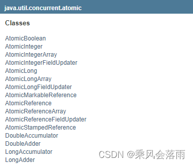
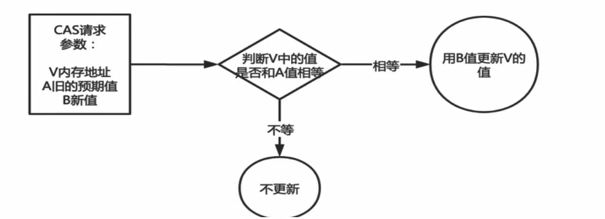
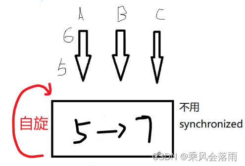
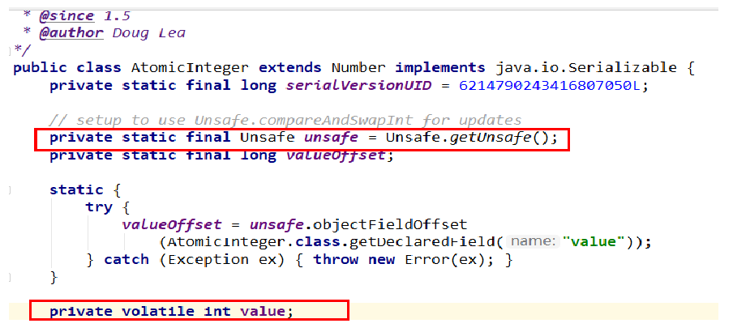
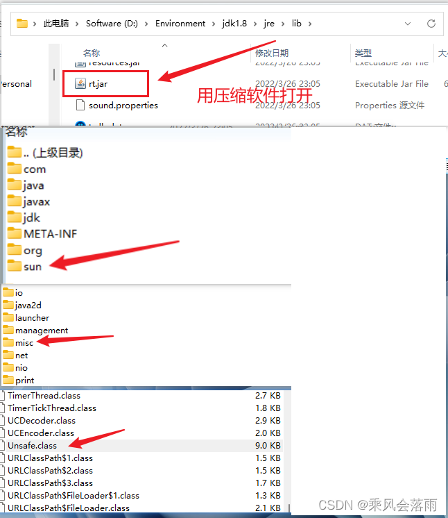
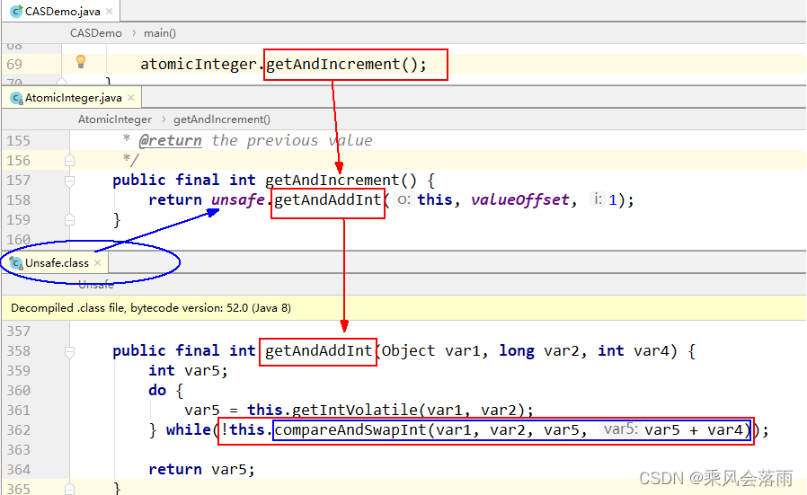
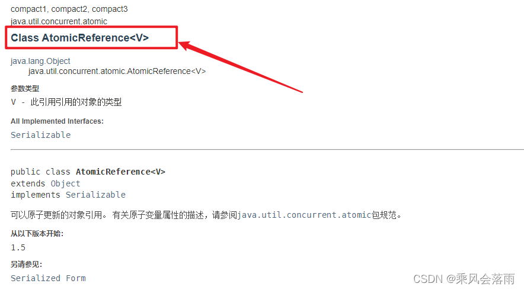
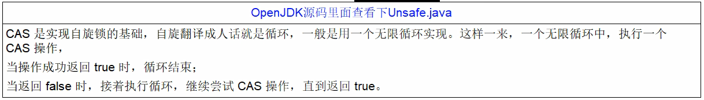
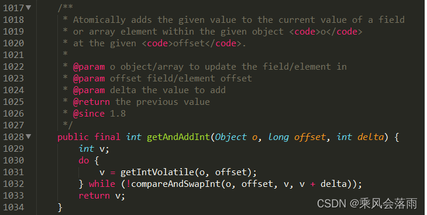
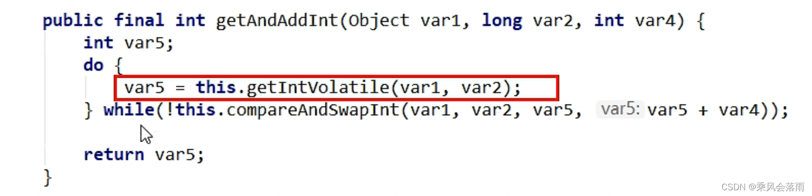

# 原子类

何为原子类

即为 java.util.concurrent.atomic 包下的所有相关类和 API




# 没有 CAS 之前

- 多线程环境**不使用**原子类保证线程安全 i++（基本数据类型）

常用`synchronized`锁，但是它比较重 ，牵扯到了用户态和内核态的切换, 效率不高。

```java
public class T3
{
    volatile int number = 0;
    //读取
    public int getNumber()
    {
        return number;
    }
    //写入加锁保证原子性
    public synchronized void setNumber()
    {
        number++;
    }
}
```


# 使用 CAS 之后

- 多线程情况下**使用原子类**保证线程安全（基本数据类型）

```java
public class T3
{
    volatile int number = 0;
    //读取
    public int getNumber()
    {
        return number;
    }
    //写入加锁保证原子性
    public synchronized void setNumber()
    {
        number++;
    }
    //=================================
    //下面是新版本
    //=================================
    AtomicInteger atomicInteger = new AtomicInteger();

    public int getAtomicInteger()
    {
        return atomicInteger.get();
    }

    public void setAtomicInteger()
    {
        atomicInteger.getAndIncrement();//先读再加
    }
}
```

- 类似于乐观锁

# CAS 是什么

## CAS 基本知识

`compare and swap` 的缩写，中文翻译成`比较并交换`, 实现并发算法时常用到的一种技术。

它包含三个操作数——`内存位置`、`预期原值`及`更新值`。


执行 CAS 操作的时候，将内存位置的值与预期原值比较：
如果**相匹配**，那么处理器会自动将该位置值**更新**为新值，
如果**不匹配**，处理器不做任何操作，多个线程同时执行 CAS 操作**只有一个**会成功。

## CAS 原理

CAS （CompareAndSwap）
CAS 有 3 个操作数，位置内存值`V`，旧的预期值`A`，要修改的更新值`B`。
当且仅当旧的预期值`A`和内存值`V`**相同**时，将内存值`V`**修改**为`B`，否则什么都不做或重来 *

当它重来重试的这种行为成为—**自旋！**



- eg

线程 A 读取了值为 5，想要更新为 6，想要将值写回的时候发现线程 B 和 C 都进行了操作，已经变成了 7，这个时候 A 不能成功，可能会发生**自旋**



## CASDemo 代码

多线程情况下**使用原子类**保证线程安全（基本数据类型）

```java
public class CASDemo
{
    public static void main(String[] args) throws InterruptedException
    {
        AtomicInteger atomicInteger = new AtomicInteger(5);

        System.out.println(atomicInteger.compareAndSet(5, 2020)+"\t"+atomicInteger.get());
        System.out.println(atomicInteger.compareAndSet(5, 1024)+"\t"+atomicInteger.get());
    }
}
//true 2022
//false 2022
```

## 硬件级别保证

对总线加锁，效率比 synchronized 效率高。


CAS是JDK提供的非阻塞原子性操作，它通过`硬件保证`了比较-更新的原子性。

它是非阻塞的且自身原子性，也就是说这玩意效率更高且通过硬件保证，说明这玩意更可靠。

CAS是一条CPU的**原子指令* *（`cmpxchg指令`），不会造成所谓的数据不一致问题，`Unsafe`提供的`CAS方法`（如compareAndSwapXXX）底层实现即为CPU指令cmpxchg。

执行cmpxchg指令的时候，会判断当前系统是否为多核系统，如果是就**给总线加锁**，只有一个**线程会对总线加锁**成功，加锁成功之后会执行cas操作，也就是说`CAS的原子性实际上是CPU实现的， 其实在这一点上还是有排他锁的，只是比起用synchronized， 这里的排他时间要短的多`， 所以在多线程情况下性能会比较好

## 源码分析

```java
//compareAndSet
//发现它调用了Unsafe类
public final boolean compareAndSet(int expect, int update) {
        return unsafe.compareAndSwapInt(this, valueOffset, expect, update);
    }

//compareAndSwapInt
//发现它调用了native方法
public final native boolean compareAndSwapInt(Object var1, long var2, int var4, int var5);
```

```java
//这三个方法是类似的
public final native boolean compareAndSwapObject(Object var1, long var2, Object var4, Object var5);

public final native boolean compareAndSwapInt(Object var1, long var2, int var4, int var5);

public final native boolean compareAndSwapLong(Object var1, long var2, long var4, long var6);
```

上面三个方法都是类似的，主要对 4 个参数做一下说明。
var1：表示要操作的对象
var2：表示要操作对象中属性地址的偏移量
var4：表示需要修改数据的期望的值
var5/var6：表示需要修改为的新值


引出来一个问题：Unsafe 类是什么？

# CAS 底层原理？如果知道，谈谈你对 UnSafe 的理解

## UnSafe

 

1. **Unsafe**

CAS 这个理念 ，落地就是`Unsafe`类

它是 CAS 的核心类，由于 Java 方法无法直接访问底层系统，需要通过本地（native）方法来访问，Unsafe 相当于一个**后门 **，**基于该类可以直接操作特定内存的数据** 。`Unsafe 类`存在于`sun.misc`包中，其内部方法操作可以像 C 的**指针**一样直接操作内存，因为 Java 中 CAS 操作的执行依赖于 Unsafe 类的方法。


**注意 Unsafe 类中的所有方法都是 native修饰的，也就是说 Unsafe 类中的方法都直接调用操作系统底层资源执行相应任务 。**

打开 `rt.jar` 包（最基本的包）



2. 变量`valueOffset`，表示该变量值在内存中的`偏移地址`，因为 Unsafe 就是根据内存偏移地址获取数据的。

```java
public final int getAndIncrement() {
        return unsafe.getAndAddInt(this, valueOffset, 1);
    }
```

3. 变量 value 用 volatile 修饰

## 我们知道 i++ 线程不安全的，那 atomicInteger.getAndIncrement()

CAS 的全称为 `Compare-And-Swap`，它是一条 CPU 并发原语。
它的功能是判断内存某个位置的值是否为预期值，如果是则更改为新的值，这个过程是原子的。
AtomicInteger 类主要利用` CAS (compare and swap)` + `volatile `和 native 方法来保证原子操作，从而避免 synchronized 的高开销，执行效率大为提升。



CAS 并发原语体现在 JAVA 语言中就是 sun.misc.Unsafe 类中的各个方法。调用 UnSafe 类中的 CAS 方法，JVM 会帮我们实现出 **CAS 汇编指令 。这是一种完全依赖于硬件的功能，通过它实现了原子操作。再次强调，由于 CAS 是一种**系统原语 ，原语属于操作系统用语范畴，是由若干条指令组成的，用于完成某个功能的一个过程，**并且原语的执行必须是连续的，在执行过程中不允许被中断，也就是说 `CAS 是一条 CPU 的原子指令`，不会造成所谓的数据不一致问题。**


## 源码分析

```java
new AtomicInteger().getAndIncrement();


//AtomicInteger.java
public final int getAndIncrement() {
        return unsafe.getAndAddInt(this, valueOffset, 1);
    }


//Unsafe.class
public final int getAndAddInt(Object var1, long var2, int var4) {
        int var5;
        do {
            var5 = this.getIntVolatile(var1, var2);
        } while(!this.compareAndSwapInt(var1, var2, var5, var5 + var4));

        return var5;
    }

//Unsafe.class   
public final native boolean compareAndSwapInt(Object var1, long var2, int var4, int var5);
```

- 若在 OpenJDK 源码中查看 Unsafe.java

  - 这里 while 体现了自旋的思想 

  - 假如是 ture, 取反 false 退出循环；假如是 false，取反 true 要继续循环。

    

    

### 原理案例说明

假设线程 A 和线程 B 两个线程同时执行 getAndAddInt 操作（分别跑在不同 CPU 上）：

1. AtomicInteger 里面的 value 原始值为 3，即主内存中 AtomicInteger 的 value 为 3，根据 JMM 模型，线程 A 和线程 B 各自持有一份值为 3 的 value 的副本分别到各自的工作内存。

2. 线程 A 通过 getIntVolatile(var1, var2) 拿到 value 值 3，这时线程 `A 被 挂起` 。

3. 线程 B 也通过 getIntVolatile(var1, var2) 方法获取到 value 值 3，此时刚好线程 B 没有被挂起并执行 `compareAndSwapInt 方法【原子操作，比较和赋值不会被其他线程打断】`比较内存值也为 3，成功修改内存值为 4，线程 B 打完收工，一切 OK。

4. 这时线程 `A 恢复`，执行 compareAndSwapInt 方法比较，发现自己手里的值数字 3 和主内存的值数字 4 不一致，说明该值已经被其它线程抢先一步修改过了，那 A 线程本次修改失败，`只能重新读取重新来一遍`了。

5. 线程 A 重新获取 value 值，因为变量 value 被 volatile 修饰，所以其它线程对它的修改，线程 A 总是能够看到，线程 A 继续执行 compareAndSwapInt 进行比较替换，直到成功。


## 底层汇编

（非计算机专业的，不要求懂，可以不听，需要汇编知识）

了解即可

- `Unsafe`类中的`compareAndSwapInt`，是一个本地方法，该方法的实现位于`unsafe.cpp`中 
- 核心`(Atomic::cmpxchg(x, addr, e)) == e;`


```cpp
UNSAFE_ENTRY(jboolean, Unsafe_CompareAndSwapInt(JNIEnv* env, jobject unsafe, jobject obj, jlong offset, jint e, jint x))
      UnsafeWrapper("Unsafe_CompareAndSwapInt");
      oop p = JNIHandles::resolve(obj);
    // 先想办法拿到变量value在内存中的地址，根据偏移量valueOffset，计算 value 的地址
      jint* addr = (jint* ) index_oop_from_field_offset_long(p, offset);
    // 调用 Atomic 中的函数 cmpxchg来进行比较交换，其中参数x是要交换的值，e是要比较的值
    //cas成功，返回期望值e，等于e，此方法返回true;
    //cas失败，返回内存中的value值，不等于e，此方法返回false
      return (jint)(Atomic::cmpxchg(x, addr, e)) == e;
    UNSAFE_END
    //-------------核心(Atomic::cmpxchg(x, addr, e)) == e;
    //JDK提供的CAS机制，在汇编层级会禁止变量两侧的指令优化，然后使用cmpxchg指令比较并更新变量值（原子性）
```

- 再看看`cmpxchg`里面是什么

```cpp
// 调用 Atomic 中的函数 cmpxchg来进行比较交换，其中参数x是即将更新的值，参数e是原内存的值
  return (jint)(Atomic::cmpxchg(x, addr, e)) == e;
```

```cpp
unsigned Atomic::cmpxchg(unsigned int exchange_value,volatile unsigned int* dest, unsigned int compare_value) {
        assert(sizeof(unsigned int) == sizeof(jint), "more work to do");
 //根据操作系统类型调用不同平台下的重载函数，这个在预编译期间编译器会决定调用哪个平台下的重载函数
        return (unsigned int)Atomic::cmpxchg((jint)exchange_value, (volatile jint*)dest, (jint)compare_value);
    }
```

- 不同的操作系统下会调用不同的 compxchg 重载函数，例如 win10

```cpp
inline jint Atomic::cmpxchg (jint exchange_value, volatile jint* dest, jint compare_value) {
  //判断是否是多核CPU
  int mp = os::is_MP();
  __asm {
    //三个move指令表示的是将后面的值移动到前面的寄存器上
    mov edx, dest
    mov ecx, exchange_value
    mov eax, compare_value
    //CPU原语级别，CPU触发
    LOCK_IF_MP(mp)
    //比较并交换指令
    //cmpxchg: 即“比较并交换”指令
    //dword: 全称是 double word 表示两个字，一共四个字节
    //ptr: 全称是 pointer，与前面的 dword 连起来使用，表明访问的内存单元是一个双字单元 
    //将 eax 寄存器中的值（compare_value）与 [edx] 双字内存单元中的值进行对比，
    //如果相同，则将 ecx 寄存器中的值（exchange_value）存入 [edx] 内存单元中
    cmpxchg dword ptr [edx], ecx
  }
}
```

- 总结

  你只需要记住：CAS 是靠硬件实现的从而在硬件层面提升效率，最底层还是交给`硬件来保证原子性和可见性`

  实现方式是基于硬件平台的汇编指令，在 intel 的 CPU 中 (X86 机器上)，使用的是汇编指令`cmpxchg`指令。

  

  核心思想就是：比较要更新变量的值 V 和预期值 E（compare），相等才会将 V 的值设为新值 N（swap）如果不相等自旋再来。

# 自定义原子引用`AtomicReference<T>`

- 譬如 AtomicInteger 原子整型，可否有其他原子类型? 比如 AtomicBook、AtomicOrder

- 可以！

- 丢入泛型中`Class AtomicReference<V>`

  

  ```java
  import lombok.AllArgsConstructor;
  import lombok.Getter;
  import lombok.ToString;
  
  import java.util.concurrent.atomic.AtomicReference;
  
  @Getter
  @ToString
  @AllArgsConstructor
  class User
  {
      String userName;
      int    age;
  }
  
  
  public class AtomicReferenceDemo
  {
      public static void main(String[] args)
      {
          User z3 = new User("z3",24);
          User li4 = new User("li4",26);
  //将类型丢入泛型即可
          AtomicReference<User> atomicReferenceUser = new AtomicReference<>();
  
          atomicReferenceUser.set(z3);//将这个原子类设置为张三
          //张三换位李四
          System.out.println(atomicReferenceUser.compareAndSet(z3,li4)+"\t"+atomicReferenceUser.get().toString());
          //true   User(userName=li4，age=28)
          System.out.println(atomicReferenceUser.compareAndSet(z3,li4)+"\t"+atomicReferenceUser.get().toString());
          //false   User(userName=li4，age=28)
      }
  }
  ```


# CAS 与自旋锁，借鉴 CAS 思想 

CAS 落地的重要应用 - 自旋锁

## 自旋锁（spinlock）是什么

CAS是实现自旋锁的基础，`CAS利用CPU指令保证了操作的原子性`，以达到锁的效果，至于自旋呢，看字面意思也很明白，自己旋转。是指尝试获取锁的线程不会立即阻塞，而是`采用循环的方式去尝试获取锁`，当线程发现锁被占用时，会不断循环判断锁的状态，直到获取。这样的好处是减少线程上下文切换的消耗，缺点是`循环会消耗CPU`






## 自己实现一个自旋锁 SpinLockDemo

- 题目

```
题目：实现一个自旋锁
自旋锁好处：循环比较获取没有类似wait的阻塞。
 
通过CAS操作完成自旋锁，A线程先进来调用myLock方法自己持有锁5秒钟，B随后进来后发现
当前有线程持有锁，不是null，所以只能通过自旋等待，直到A释放锁后B随后抢到。
```


```java
//利用cas实现自旋锁
public class SpinLockDemo {
    AtomicReference<Thread> atomicReference = new AtomicReference<>();

    public void Lock() {
        Thread thread = Thread.currentThread();
        System.out.println(Thread.currentThread().getName() + "\t" + "-----come in");
        while (!atomicReference.compareAndSet(null, thread)) {//用这个循环实现自旋
            
        }
        //如果是空的，那我们把thread放进去

    }

    public void UnLock() {
        Thread thread = Thread.currentThread();
        atomicReference.compareAndSet(thread, null);//把当前线程踢出去，置为null
        System.out.println(Thread.currentThread().getName() + "\t" + "-------task over,unLock.....");
    }

    //测试
    public static void main(String[] args) {
        SpinLockDemo spinLockDemo = new SpinLockDemo();
        new Thread(() -> {
            spinLockDemo.Lock();
            try {TimeUnit.SECONDS.sleep(5);} catch InterruptedException e) {                e.printStackTrace();}
            spinLockDemo.UnLock();
        }, "A").start();

        //暂停一会儿线程，保证A线程先于B线程启动并完成
        try {TimeUnit.MILLISECONDS.sleep(500);} catch (InterruptedException e) {e.printStackTrace();}

        new Thread(() -> {
            spinLockDemo.Lock();//B  -----come in  B只是尝试去抢锁，但是一直在自旋。

            spinLockDemo.UnLock();//A结束后 B立马抢到锁，然后马上结束了
        }, "B").start();

    }
}
//A  -----come in
//B  -----come in
//A  -------task over,unLock.....
//B  -------task over,unLock.....
```

# CAS 缺点

## 1、循环时间长开销很大

`do while `如果它一直自旋会一直占用 CPU 时间，造成较大的开销

如果 CAS 失败，会一直进行尝试。如果 CAS 长时间一直不成功，可能会给 CPU 带来很大的开销。

## 2 引出来 ABA 问题

### 什么是 ABA 问题

CAS 会导致 “ABA 问题”。

CAS 算法实现一个重要前提需要取出内存中某时刻的数据并在当下时刻比较并替换，那么在这个时间差类会导致数据的变化。


比如说一个线程 one 从内存位置 V 中取出 A，这时候另一个线程 two 也从内存中取出 A，并且线程 two 进行了一些操作将值变成了 B，然后线程 two 又将 V 位置的数据变成 A，这时候线程 one 进行 CAS 操作发现内存中仍然是 A，然后线程 one 操作成功。

**尽管线程 one 的 CAS 操作成功，但是不代表这个过程就是没有问题的。**

### 如何解决 --版本号AtomicStampedReference

`AtomicStampedReference`版本号 （注意区分前面的`Class AtomicReference<V>`）


`Class AtomicStampedReference<V> `相关 API

+ 创建一个新的 AtomicStampedReference与`给定的初始值 + 初始邮戳`。

```java
AtomicStampedReference(V initialRef, int initialStamp)
```

+ compareAndSet

  

```java
public boolean compareAndSet(V expectedReference,//旧值
                                 V newReference,//新值
                                 int expectedStamp,//旧版本号
                                 int newStamp)//新版本号
以原子方式设置该引用和邮票给定的更新值的值，如果当前的参考是==至预期的参考，并且当前标志等于预期标志。
May fail spuriously and does not provide ordering guarantees ，所以只是很少适合替代compareAndSet 。

参数
expectedReference - 参考的预期值
newReference - 参考的新值
expectedStamp - 邮票的预期值
newStamp - 邮票的新值
结果
true如果成功
```

- 示例：

```java
//基本情况
@NoArgsConstructor
@AllArgsConstructor
@Data
class Book{
    private  int id;
    private String bookName;
}

public class AtomicStampedDemo {
    public static void main(String[] args) {
        Book javaBook = new Book(1, "javaBook");
        AtomicStampedReference<Book> stampedReference = new AtomicStampedReference<>(javaBook,1);
        System.out.println(stampedReference.getReference()+"\t"+stampedReference.getReference());
        Book mysqlBook = new Book(2, "mysqlBook");
        boolean b;
        b= stampedReference.compareAndSet(javaBook, mysqlBook, stampedReference.getStamp(), stampedReference.getStamp() + 1);
        System.out.println(b+"\t"+stampedReference.getReference()+"\t"+stampedReference.getStamp());
    }
}
//Book(id=1, bookName=javaBook)  Book(id=1, bookName=javaBook)
//true  Book(id=2, bookName=mysqlBook)  2
  
```

```java
   //ABA复现（单线程情况下）
    public class AtomicStampedDemo {
        public static void main(String[] args) {
            Book javaBook = new Book(1, "javaBook");
            AtomicStampedReference<Book> stampedReference = new AtomicStampedReference<>(javaBook,1);
            System.out.println(stampedReference.getReference()+"\t"+stampedReference.getReference());
            Book mysqlBook = new Book(2, "mysqlBook");
            boolean b;
                    b= stampedReference.compareAndSet(javaBook, mysqlBook, stampedReference.getStamp(), stampedReference.getStamp() + 1);
            System.out.println(b+"\t"+stampedReference.getReference()+"\t"+stampedReference.getStamp());
            b= stampedReference.compareAndSet(mysqlBook,javaBook, stampedReference.getStamp(), stampedReference.getStamp() + 1);
            System.out.println(b+"\t"+stampedReference.getReference()+"\t"+stampedReference.getStamp());
        }
    }
    //Book(id=1, bookName=javaBook)  Book(id=1, bookName=javaBook) --------
    //true  Book(id=2, bookName=mysqlBook)  2
    //true  Book(id=1, bookName=javaBook)  3  --------虽然1.3行内容是一样的，但是版本号不一样
```

```java
//ABA复现（多线程情况下）
public class ABADemo {
    static AtomicInteger atomicInteger = new AtomicInteger(100);
    static AtomicStampedReference atomicStampedReference = new AtomicStampedReference(100, 1);//初始化值100，版本号1

    public static void main(String[] args) {
        abaHappend();

        //-------------------- true-2022

        //暂停一会儿线程,main彻底等待上面的ABA出现演示完成。
        try { Thread.sleep(2000);  } catch (InterruptedException e) { e.printStackTrace(); }

        System.out.println("============以下是使用带邮戳的【版本号】的方案ABA问题的解决=============================");

        stampedABA();
    }

    /**
     * AtomicStampedReference  带邮戳的CAS 解决ABA
     */
    private static void stampedABA() {
        new Thread(() -> {
            int stamp = atomicStampedReference.getStamp();
            System.out.println(Thread.currentThread().getName() + "\t 首次版本号:" + stamp);//1-----------初始获得一样的版本号
            //暂停500毫秒，保证t4线程初始化拿到的版本号和我一样,
            try {TimeUnit.MILLISECONDS.sleep(500); } catch (InterruptedException e) {e.printStackTrace(); }

            atomicStampedReference.compareAndSet(100, 101, atomicStampedReference.getStamp(), atomicStampedReference.getStamp() + 1);
            System.out.println(Thread.currentThread().getName() + "\t 2次版本号:" + atomicStampedReference.getStamp());

            atomicStampedReference.compareAndSet(101, 100, atomicStampedReference.getStamp(), atomicStampedReference.getStamp() + 1);
            System.out.println(Thread.currentThread().getName() + "\t 3次版本号:" + atomicStampedReference.getStamp());
        }, "t3").start();

        new Thread(() -> {
            int stamp = atomicStampedReference.getStamp();//记录一开始的版本号，并且写死
            System.out.println(Thread.currentThread().getName() + "\t 首次版本号:" + stamp);//1------------初始获得一样的版本号
            //暂停1秒钟线程，等待上面的t3线程，发生了ABA问题
            try { TimeUnit.SECONDS.sleep(1);    } catch (InterruptedException e) {  e.printStackTrace();   }

            //这个还是初始的版本号，但是实际上版本号被T3修改了，所以肯定会失败
            boolean result = atomicStampedReference.compareAndSet(100, 2019, stamp, stamp + 1);
            System.out.println(Thread.currentThread().getName() + "\t" + result + "\t" + atomicStampedReference.getReference());
        }, "t4").start();
    }

    /**
     * AtomicInteger 演示ABA问题
     */
    private static void abaHappend() {
        //使用AtomicInteger演示ABA
        new Thread(() -> {
            atomicInteger.compareAndSet(100, 101);
            //暂停一会儿线程
            try {
                Thread.sleep(100);
            } catch (InterruptedException e) {
                e.printStackTrace();
            }
            ;
            atomicInteger.compareAndSet(101, 100);//这里 中间就有人动过了，虽然值是不变的，假如不检查版本号，CAS就直接能成功了
        }, "t1").start();

        new Thread(() -> {
            //暂停一会儿线程
            try {
                Thread.sleep(500);
            } catch (InterruptedException e) {
                e.printStackTrace();
            }
            ;
            System.out.println(atomicInteger.compareAndSet(100, 2022) + "\t" + atomicInteger.get());
        }, "t2").start();
    }
}
/*
true	2022
============以下是使用带邮戳的【版本号】的方案ABA问题的解决=============================
t3	 首次版本号:1
t4	 首次版本号:1
t3	 2次版本号:2
t3	 3次版本号:3
t4	false	100
*/
```


总结：**版本号** + **比较**要一起上