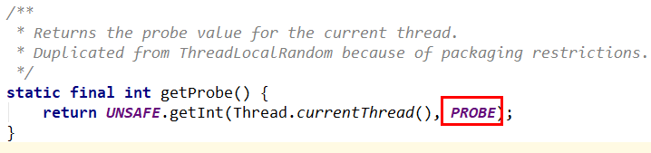
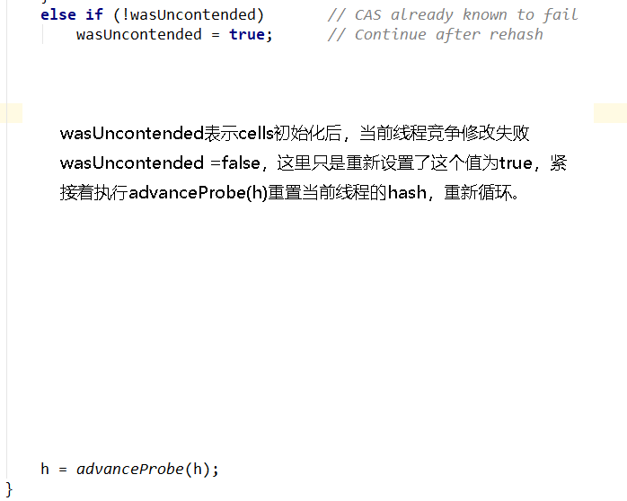
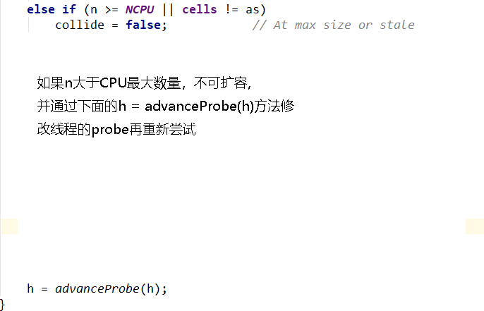
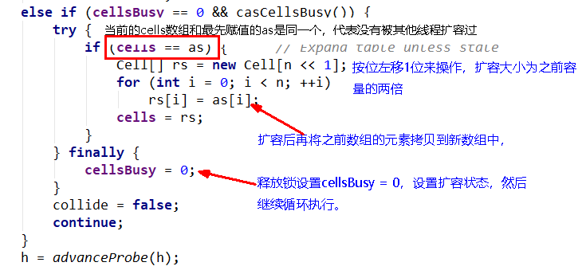

1、是什么
=========


**2、再分类**
=========

2.1、基本类型原子类AtomicInteger
---------------

AtomicInteger、AtomicBoolean、AtomicLong

### 常用 API

```java
public final int get() //获取当前的值
public final int getAndSet(int newValue)//获取当前的值，并设置新的值
public final int getAndIncrement()//获取当前的值，并自增
public final int getAndDecrement() //获取当前的值，并自减
public final int getAndAdd(int delta) //获取当前的值，并加上预期的值
boolean compareAndSet(int expect, int update) //如果输入的数值等于预期值，则以原子方式将该值设置为输入值（update）
```

### 案例：AtomicInteger +CountDownLatch  统计运行时间 

```java
class MyNumber{
    AtomicInteger atomicInteger = new AtomicInteger();
    public void addPlusPlus(){
        atomicInteger.getAndIncrement();
    }
}

public class AtomicIntegerDemo {
    public static final int SIZE = 50;
    public static void main(String[] args) {
        MyNumber myNumber = new MyNumber();
        for(int i = 1;i <= SIZE;i ++){
            new Thread(() -> {
                for(int j = 1;j <= 1000;j ++){
                    myNumber.addPlusPlus();
                }
            },String.valueOf(i)).start();
        }
        System.out.println(Thread.currentThread().getName()+"\t"+"result: "+myNumber.atomicInteger);
    }
}
//本来应该是50000
//1试-main  result: 39000
//2试-main  result: 40178
//?是不是我们的程序有问题？

//因为上面的50*  1000个计算还没结束，他就去get数值了
```

解决：

```java
//方法一（不推荐，做做Demo还行）
public class AtomicIntegerDemo {
    public static final int SIZE = 50;
    public static void main(String[] args) {
        MyNumber myNumber = new MyNumber();
        for(int i = 1;i <= SIZE;i ++){
            new Thread(() -> {
                for(int j = 1;j <= 1000;j ++){
                    myNumber.addPlusPlus();
                }
            },String.valueOf(i)).start();
        }
        //硬等待2s   计算完成
        try {TimeUnit.SECONDS.sleep(2);} catch (InterruptedException e) {e.printStackTrace();}
        System.out.println(Thread.currentThread().getName()+"\t"+"result: "+myNumber.atomicInteger);
    }
}

//方法二-减法计数器CountDownLatch
public class AtomicIntegerDemo {
    public static final int SIZE = 50;
    public static void main(String[] args) throws InterruptedException {
        MyNumber myNumber = new MyNumber();
        CountDownLatch countDownLatch = new CountDownLatch(SIZE);
        for(int i = 1;i <= SIZE;i ++){
            new Thread(() -> {
                try {
                    for(int j = 1;j <= 1000;j ++){
                        myNumber.addPlusPlus();
                    }
                } finally {
                    countDownLatch.countDown();
                }
            },String.valueOf(i)).start();
        }
        countDownLatch.await();
        System.out.println(Thread.currentThread().getName()+"\t"+"result: "+myNumber.atomicInteger);
    }
}
//main  result: 50000
```

2.2、数组类型原子类
---------------

AtomicIntegerArray、AtomicLongArray、AtomicReferenceArray

```java
public class AtomicIntegerArrayDemo
{
    public static void main(String[] args)
    {
        AtomicIntegerArray atomicIntegerArray = new AtomicIntegerArray(new int[5]);//0 0 0 0 0
        //AtomicIntegerArray atomicIntegerArray = new AtomicIntegerArray(5);
        //AtomicIntegerArray atomicIntegerArray = new AtomicIntegerArray(new int[]{1,2,3,4,5});//1 2 3 4 5 

        for (int i = 0; i <atomicIntegerArray.length(); i++) {
            System.out.println(atomicIntegerArray.get(i));
        }
        System.out.println();
        System.out.println();
        System.out.println();
        int tmpInt = 0;

        tmpInt = atomicIntegerArray.getAndSet(0,1122);
        System.out.println(tmpInt+"\t"+atomicIntegerArray.get(0));
        atomicIntegerArray.getAndIncrement(1);
        atomicIntegerArray.getAndIncrement(1);
        tmpInt = atomicIntegerArray.getAndIncrement(1);
        System.out.println(tmpInt+"\t"+atomicIntegerArray.get(1));
    }
}

```


2.3、引用类型原子类
---------------

### 2.3.1、AtomicReference

见第 7 章 CAS ，**4.1、AtomicInteger 原子整型，可否有其它原子类型？**

```java
@Getter
@ToString
@AllArgsConstructor
class User
{
    String userName;
    int    age;
}

public class AtomicReferenceDemo
{
    public static void main(String[] args)
    {
        User z3 = new User("z3",24);
        User li4 = new User("li4",26);

        AtomicReference<User> atomicReferenceUser = new AtomicReference<>();

        atomicReferenceUser.set(z3);
        System.out.println(atomicReferenceUser.compareAndSet(z3,li4)+"\t"+atomicReferenceUser.get().toString());
        System.out.println(atomicReferenceUser.compareAndSet(z3,li4)+"\t"+atomicReferenceUser.get().toString());
    }
}
```


```java
/**
 * 题目：实现一个自旋锁SpinLockDemo
 * 自旋锁好处：循环比较获取没有类似wait的阻塞。
 *
 * 通过CAS操作完成自旋锁，A线程先进来调用myLock方法自己持有锁5秒钟，B随后进来后发现
 * 当前有线程持有锁，不是null，所以只能通过自旋等待，直到A释放锁后B随后抢到。
 */
public class SpinLockDemo
{
    AtomicReference<Thread> atomicReference = new AtomicReference<>();

    public void myLock()
    {
        Thread thread = Thread.currentThread();
        System.out.println(Thread.currentThread().getName()+"\t come in");
        while(!atomicReference.compareAndSet(null,thread))
        {

        }
    }

    public void myUnLock()
    {
        Thread thread = Thread.currentThread();
        atomicReference.compareAndSet(thread,null);
        System.out.println(Thread.currentThread().getName()+"\t myUnLock over");
    }

    public static void main(String[] args)
    {
        SpinLockDemo spinLockDemo = new SpinLockDemo();

        new Thread(() -> {
            spinLockDemo.myLock();
            //暂停一会儿线程
            try { TimeUnit.SECONDS.sleep( 5 ); } catch (InterruptedException e) { e.printStackTrace(); }
            spinLockDemo.myUnLock();
        },"A").start();
        //暂停一会儿线程，保证A线程先于B线程启动并完成
        try { TimeUnit.SECONDS.sleep( 1 ); } catch (InterruptedException e) { e.printStackTrace(); }

        new Thread(() -> {
            spinLockDemo.myLock();
            spinLockDemo.myUnLock();
        },"B").start();

    }
}
```

### 2.3.2、AtomicStampedReference  -- 标记修改过多少次

携带版本号的引用类型原子类，可以解决 ABA 问题

**解决修改过几次**

状态戳原子引用

ABADemo 见第 7 章 CAS，**5.3.2、引出来 ABA 问题？？？**

```java
public class ABADemo
{
    static AtomicInteger atomicInteger = new AtomicInteger(100);
    static AtomicStampedReference atomicStampedReference = new AtomicStampedReference(100,1);

    public static void main(String[] args)
    {
        abaProblem();
        abaResolve();
    }

    public static void abaResolve()
    {
        new Thread(() -> {
            int stamp = atomicStampedReference.getStamp();
            System.out.println("t3 ----第1次stamp  "+stamp);
            try { TimeUnit.SECONDS.sleep(1); } catch (InterruptedException e) { e.printStackTrace(); }
            atomicStampedReference.compareAndSet(100,101,stamp,stamp+1);
            System.out.println("t3 ----第2次stamp  "+atomicStampedReference.getStamp());
            atomicStampedReference.compareAndSet(101,100,atomicStampedReference.getStamp(),atomicStampedReference.getStamp()+1);
            System.out.println("t3 ----第3次stamp  "+atomicStampedReference.getStamp());
        },"t3").start();

        new Thread(() -> {
            int stamp = atomicStampedReference.getStamp();
            System.out.println("t4 ----第1次stamp  "+stamp);
            //暂停几秒钟线程
            try { TimeUnit.SECONDS.sleep(3); } catch (InterruptedException e) { e.printStackTrace(); }
            boolean result = atomicStampedReference.compareAndSet(100, 20210308, stamp, stamp + 1);
            System.out.println(Thread.currentThread().getName()+"\t"+result+"\t"+atomicStampedReference.getReference());
        },"t4").start();
    }

    public static void abaProblem()
    {
        new Thread(() -> {
            atomicInteger.compareAndSet(100,101);
            atomicInteger.compareAndSet(101,100);
        },"t1").start();

        try { TimeUnit.MILLISECONDS.sleep(200); } catch (InterruptedException e) { e.printStackTrace(); }

        new Thread(() -> {
            atomicInteger.compareAndSet(100,20210308);
            System.out.println(atomicInteger.get());
        },"t2").start();
    }
}
```


### 2.3.3、AtomicMarkableReference  --标记是否修改过，简化版

原子更新带有标记位的引用类型对象

**解决是否修改过**

+ 它的定义就是将`状态戳AtomicStampedReference  简化为 true/false`

+ 类似一次性筷子

状态戳 (true/false) 原子引用

```java
public class AtomicMarkableReferenceDemo {

    static AtomicMarkableReference markableReference = new AtomicMarkableReference(100,false);

    public static void main(String[] args) {
        new Thread(()->{
            boolean marked = markableReference.isMarked();
            System.out.println(Thread.currentThread().getName()+"\t"+"默认标识"+marked);
            //暂停1秒钟线程，等待后面的T2线程和我拿到一样的模式flag标识，都是false
            try {TimeUnit.SECONDS.sleep(1);} catch (InterruptedException e) {e.printStackTrace();}
            markableReference.compareAndSet(100, 1000, marked, !marked);
        },"t1").start();

        new Thread(()->{
            boolean marked = markableReference.isMarked();
            System.out.println(Thread.currentThread().getName()+"\t"+"默认标识"+marked);
            //这里停2秒，让t1先修改,然后t2试着修改
            try {TimeUnit.SECONDS.sleep(2);} catch (InterruptedException e) {e.printStackTrace();}
            boolean t2Result = markableReference.compareAndSet(100, 1000, marked, !marked);
            System.out.println(Thread.currentThread().getName()+"\t"+"t2线程result--"+t2Result);
            System.out.println(Thread.currentThread().getName()+"\t"+markableReference.isMarked());
            System.out.println(Thread.currentThread().getName()+"\t"+markableReference.getReference());

        },"t2").start();
    }
}
```


2.4、对象的属性修改原子类
------------------

### 2.4.1、AtomicIntegerFieldUpdater

原子更新对象中 int 类型字段的值

### 2.4.2、AtomicLongFieldUpdater

原子更新对象中 Long 类型字段的值

### 2.4.3、AtomicReferenceFieldUpdater

原子更新引用类型字段的值

**使用目的：**以一种线程安全的方式操作非线程安全对象内的某些字段

例子（它是更加细粒度的/影响某个字段，而不用锁住整个对象）


**使用要求：**

1. `更新的对象属性必须使用 public volatile 修饰符`。

2. 因为对象的属性修改类型原子类都是抽象类，所以每次使用都必须使用静态方法 newUpdater() 创建一个更新器，并且需要设置想要更新的类和属性。


> 面试官问你：你在哪里用了 volatile?
>
> + 在 AtomicReferenceFieldUpdater 中，因为是规定好的必须由 volatile 修饰的
>
> + 还有的话之前我们在 DCL 单例中，也用了 volatile 保证了可见性

### 案例：：原子更新对象中 int 类型字段的值

**AtomicIntegerFieldUpdater：原子更新对象中 int 类型字段的值**

```java
/**
 * 以一种线程安全的方式操作非线程安全对象的某些字段。
 * 需求：
 * 1000个人同时向一个账号转账一元钱，那么累计应该增加1000元，
 * 除了synchronized和CAS,还可以使用AtomicIntegerFieldUpdater来实现。
 */

class BankAccount{
    String bankName = "CCB";
    public volatile int money = 0;//条件一

    //synchronized版本
//    public synchronized void add(){
//        money++;
//    }
    
    //AtomicIntegerFieldUpdater版本
    AtomicIntegerFieldUpdater<BankAccount> fieldUpdater =
            AtomicIntegerFieldUpdater.newUpdater(BankAccount.class,"money");//条件二：只限制了money这个字段

    public void transMoney(BankAccount bankAccount){
        fieldUpdater.getAndIncrement(bankAccount);
    }

}

public class AtomicIntegerFieldUpdaterDemo {
    public static void main(String[] args) throws InterruptedException {
        BankAccount bankAccount = new BankAccount();
        CountDownLatch countDownLatch = new CountDownLatch(10);
        for(int i = 1;i <= 10;i ++){
            new Thread(()->{
                try {
                    for(int j = 1;j <= 1000;j ++){
                       // bankAccount.add();
                        bankAccount.transMoney(bankAccount);
                    }
                } finally {
                    countDownLatch.countDown();
                }
            },String.valueOf(i)).start();
        }
        countDownLatch.await();
        System.out.println(Thread.currentThread().getName()+"\t"+"result: "+bankAccount.money);
    }
}
//main  result: 10000
```


**AtomicReferenceFieldUpdater：原子更新引用类型字段的值**

`AtomicReferenceFieldUpdater`-适用度更广

```java
//多线程并发调用一个类的初始化方法，如果未被初始化过，将执行初始化工作，要求只能初始化一次
//比如这个案例中是针对boolean类型的
class MyVar{
    public volatile Boolean isInit = Boolean.FALSE;
    AtomicReferenceFieldUpdater<MyVar,Boolean> referenceFieldUpdater =
            AtomicReferenceFieldUpdater.newUpdater(MyVar.class,Boolean.class,"isInit");
    public void init(MyVar myVar){
        if(referenceFieldUpdater.compareAndSet(myVar,Boolean.FALSE,Boolean.TRUE)){
            System.out.println(Thread.currentThread().getName()+"\t"+"-----start init,needs 3 seconds");
            try {TimeUnit.SECONDS.sleep(3);} catch (InterruptedException e) {e.printStackTrace();}
            System.out.println(Thread.currentThread().getName()+"\t"+"-----over init");
        }else{
            System.out.println(Thread.currentThread().getName()+"\t"+"抱歉，已经有其他线程进行了初始化");
        }
    }
}

public class AtomicReferenceFieldUpdaterDemo {
    public static void main(String[] args) {
        MyVar myVar = new MyVar();
        for(int i = 1;i <= 5;i ++){
            new Thread(()->{
                myVar.init(myVar);
            },String.valueOf(i)).start();
        }
    }
}
//1  -----start init,needs 3 seconds
//5  抱歉，已经有其他线程进行了初始化
//4  抱歉，已经有其他线程进行了初始化
//2  抱歉，已经有其他线程进行了初始化
//3  抱歉，已经有其他线程进行了初始化
//1  -----over init
```

## 2.5、原子操作增强类原理深度解析

DoubleAccumulator

DoubleAdder

LongAccumulator  累计器

LongAdder   累加器

**一道面试题：**


 

_1_  热点商品点赞计算器，点赞数加加统计，不要求实时精确 

 _2_  一个很大的 _List_ ，里面都是 _int_ 类型，如何实现加加，说说思路

### 常用 API


### `LongAdder` + `LongAccumulator`入门讲解：

LongAdder只能用来计算加法，且从零开始计算

LongAccumulator 提供了自定义的函数操作：long 类型的聚合器，需要传入一个 long 类型的二元操作，可以用来计算各种聚合操作，包括加乘等 

```java
public class LongAdderAPIDemo
{
    public static void main(String[] args)
    {
        //LongAdder只能用来计算加法，且从零开始计算
        LongAdder longAdder = new LongAdder();

        longAdder.increment();
        longAdder.increment();
        longAdder.increment();

        System.out.println(longAdder.longValue());//3

 
        LongAccumulator longAccumulator = new LongAccumulator((x,y) -> x * y,2);
        longAccumulator.accumulate(1);//2*1=2
        longAccumulator.accumulate(2);//2*2=4
        longAccumulator.accumulate(3);//4*3=12

        System.out.println(longAccumulator.longValue());//12

    }
}
```

LongAccumulator 提供了自定义的函数操作：long 类型的聚合器，需要传入一个 long 类型的二元操作，可以用来计算各种聚合操作，包括加乘等   

```java
public class LongAccumulatorDemo{
        //构造器： 参形：
		//accumulatorFunction – 两个参数的无副作用函数 
        //identity – 累加器函数的标识（初始值）
    //LongAccumulator longAccumulator = new LongAccumulator((x, y) -> x + y,0);
   //匿名内部类形式
    LongAccumulator longAccumulator = new LongAccumulator(new LongBinaryOperator()
    {
        @Override
        public long applyAsLong(long left, long right)
        {
            return left - right;
        }
    },777);

    public void add_LongAccumulator()
    {
        longAccumulator.accumulate(1);
    }

    public static void main(String[] args)
    {
        LongAccumulatorDemo demo = new LongAccumulatorDemo();

        demo.add_LongAccumulator();
        demo.add_LongAccumulator();
        System.out.println(demo.longAccumulator.longValue());//775
    }
}
```

### LongAdder 高性能对比synchronized、AtomicLong的演示--总点赞数

50个线程，每个线程100W次，总点赞数出来

```java
class ClickNumberNet
{
    int number = 0;
    public synchronized void clickBySync()
    {
        number++;
    }

    AtomicLong atomicLong = new AtomicLong(0);
    public void clickByAtomicLong()
    {
        atomicLong.incrementAndGet();
    }

    LongAdder longAdder = new LongAdder();
    public void clickByLongAdder()
    {
        longAdder.increment();
    }

    LongAccumulator longAccumulator = new LongAccumulator((x,y) -> x + y,0);
    public void clickByLongAccumulator()
    {
        longAccumulator.accumulate(1);
    }
}

/**
 * 50个线程，每个线程100W次，总点赞数出来
 */
public class LongAdderDemo2
{
    public static void main(String[] args) throws InterruptedException
    {
        ClickNumberNet clickNumberNet = new ClickNumberNet();

        long startTime;
        long endTime;
        CountDownLatch countDownLatch = new CountDownLatch(50);
        CountDownLatch countDownLatch2 = new CountDownLatch(50);
        CountDownLatch countDownLatch3 = new CountDownLatch(50);
        CountDownLatch countDownLatch4 = new CountDownLatch(50);


        startTime = System.currentTimeMillis();
        for (int i = 1; i <=50; i++) {
            new Thread(() -> {
                try
                {
                    for (int j = 1; j <=100 * 10000; j++) {
                        clickNumberNet.clickBySync();
                    }
                }finally {
                    countDownLatch.countDown();
                }
            },String.valueOf(i)).start();
        }
        countDownLatch.await();
        endTime = System.currentTimeMillis();
        System.out.println("----costTime: "+(endTime - startTime) +" 毫秒"+"\t clickBySync result: "+clickNumberNet.number);

        startTime = System.currentTimeMillis();
        for (int i = 1; i <=50; i++) {
            new Thread(() -> {
                try
                {
                    for (int j = 1; j <=100 * 10000; j++) {
                        clickNumberNet.clickByAtomicLong();
                    }
                }finally {
                    countDownLatch2.countDown();
                }
            },String.valueOf(i)).start();
        }
        countDownLatch2.await();
        endTime = System.currentTimeMillis();
        System.out.println("----costTime: "+(endTime - startTime) +" 毫秒"+"\t clickByAtomicLong result: "+clickNumberNet.atomicLong);

        startTime = System.currentTimeMillis();
        for (int i = 1; i <=50; i++) {
            new Thread(() -> {
                try
                {
                    for (int j = 1; j <=100 * 10000; j++) {
                        clickNumberNet.clickByLongAdder();
                    }
                }finally {
                    countDownLatch3.countDown();
                }
            },String.valueOf(i)).start();
        }
        countDownLatch3.await();
        endTime = System.currentTimeMillis();
        System.out.println("----costTime: "+(endTime - startTime) +" 毫秒"+"\t clickByLongAdder result: "+clickNumberNet.longAdder.sum());

        startTime = System.currentTimeMillis();
        for (int i = 1; i <=50; i++) {
            new Thread(() -> {
                try
                {
                    for (int j = 1; j <=100 * 10000; j++) {
                        clickNumberNet.clickByLongAccumulator();
                    }
                }finally {
                    countDownLatch4.countDown();
                }
            },String.valueOf(i)).start();
        }
        countDownLatch4.await();
        endTime = System.currentTimeMillis();
        System.out.println("----costTime: "+(endTime - startTime) +" 毫秒"+"\t clickByLongAccumulator result: "+clickNumberNet.longAccumulator.longValue());


    }
}
```

### **源码、原理分析**

#### **架构**


LongAdder 是 Striped64 的子类 


##### 剩下两罗汉

```java
Striped64
Number
```

#### **原理 (LongAdder 为什么这么快)**

官网说明和阿里要求


#### **Striped64**

Striped64有几个比较重要的成员函数

```java
// Number of CPUS, to place bound on table size         
//CPU数量，即cells数组的最大长度  
static final int NCPU = Runtime.getRuntime().availableProcessors();
 
//Table of cells. When non-null, size is a power of 2. 
//cells数组，为2的幂，2,4,8,16.....，方便以后位运算
transient volatile Cell[] cells;
 
 
//Base value, used mainly when there is no contention, but also as
//a fallback during table initialization races. Updated via CAS.
//基础value值，当并发较低时，只累加该值主要用于没有竞争的情况，通过CAS更新。
transient volatile long base;
 
 
//Spinlock (locked via CAS) used when resizing and/or creating Cells. 
//创建或者扩容Cells数组时使用的自旋锁变量调整单元格大小（扩容），创建单元格时使用的锁。
transient volatile int cellsBusy;
```

Striped64 中一些变量或者方法的定义

`base`: 类似于 AtomicLong 中全局的 value 值。在没有竞争情况下数据直接累加到 base 上，或者 cells 扩容时，也需要将数据写入到 base 上

`collide`: 表示扩容意向，false 一定不会扩容，true 可能会扩容。

`cellsBusy`: 初始化 cells 或者扩容 cells 需要获取锁，0：表示无锁状态 1：表示其他线程已经持有了锁

`casCellsBusy()`: 通过 CAS 操作修改 cellsBusy 的值，CAS 成功代表获取锁，返回 true

`NCPU`: 当前计算机 CPU 数量，CelI 数组扩容时会使用到

`getProbe():` 获取当前线程的 hash 值

`advanceProbe()`: 重置当前线程的 hash 值

#### **Cell**

是 java.util.concurrent.atomic 下 Striped64 的一个内部类


#### **LongAdder 为什么这么快**

LongAdder 的基本思路就是 **分散热点** ，将 value 值分散到一个 **Cell 数组** 中，**不同线程会命中到数组的不同槽中**，各个线程只对自己槽中的那个值进行 CAS 操作，这样热点就被分散了，冲突的概率就小很多。如果要获取真正的 long 值，只要将各个槽中的变量值累加返回。   

`sum()` 会将所有 Cell 数组中的 value 和 base 累加作为返回值，核心的思想就是将之前 AtomicLong 一个 value 的更新压力分散到多个 value 中去，   从而降级更新热点 。   


数学表达: 内部有一个 base 变量，u一个 Cell[] 数组。

base 变量：非竞态条件下[低并发]，直接累加到该变量上

Cell[] 数组：竞态条件下[高并发]，累加个各个线程自己的槽 Cell[i] 中


#### 源码解读深度分析

##### **小总结**

LongAdder 在无竞争的情况，跟 AtomicLong 一样，对 `同一个 base` 进 行操作，当出现竞争关系时则是`采用化整为零的做法`，从空间换时间，用一个数组 cells，将一个 value 拆分进这个数组 cells。多个线程需要同时对 value 进行操作时候，可以对线程 id 进行 hash 得到 hash 值，再根据 hash 值映射到这个数组 cells 的某个下标，再对该下标所对应的值进行自增操作。**当所有线程操作完毕，将数组 cells 的所有值和无竞争值 base 都加起来作为最终结果。** 


##### **longAdder.increment() 源码解读：具体可看大图**

###### **① add(1L)**

> as  表示 cells 引用
> b  表示获取的 base 值
> v  表示 期望值
> m  表示 cells 数组的长度
> a  表示当前线程命中的 cell 单元格


总结一下

1. 最初无竞争时只更新 base;
2. 如果更新 base 失败后，首次新建一个 Cell[] 数组
3. 当多个线程竞争同一个 Cell 比价激烈时，可能就要利用`longAccumulate`对 Cell[] 扩容。

小总结：


###### **② longAccumulate**

**longAccumulate入参说明**


**Striped64中一些变量或者方法的定义**


**线程hash值：probe**





**总纲**


```
上述代码首先给当前线程分配一个hash值，然后进入一个for(;;)自旋，这个自旋分为三个分支：
CASE1：Cell[]数组已经初始化
CASE2：Cell[]数组未初始化(首次新建)
CASE3：Cell[]数组正在初始化中
```

**CASE2**:刚刚要初始化Cell[]数组(首次新建)

未初始化过Cell[]数组，尝试占有锁并首次初始化cells数组


```
如果上面条件都执行成功就会执行数组的初始化及赋值操作， Cell[] rs = new Cell[2]表示数组的长度为2，
rs[h & 1] = new Cell(x) 表示创建一个新的Cell元素，value是x值，默认为1。
h & 1类似于我们之前HashMap常用到的计算散列桶index的算法，通常都是hash & (table.len - 1)。同hashmap一个意思。
```

**CASE3:兜底**

多个线程尝试CAS修改失败的线程会走到这个分支


该分支实现直接操作base基数，将值累加到base上，也即其它线程正在初始化，多个线程正在更新base的值。


**CASE1：Cell数组不再为空且可能存在Cell数组扩容**

多个线程同时命中一个cell的竞争

总体代码：


1. 

   

   

```
上面代码判断当前线程hash后指向的数据位置元素是否为空，
如果为空则将Cell数据放入数组中，跳出循环。
如果不空则继续循环。
```

2. 



3. 

   ```
   说明当前线程对应的数组中有了数据，也重置过hash值，
   这时通过CAS操作尝试对当前数中的value值进行累加x操作，x默认为1，如果CAS成功则直接跳出循环。
   ```

4. 

5. 

6. 

上面6个步骤总结：


###### **③ sum**

sum() 会将所有 Cell 数组中的 value 和 base 累加作为返回值。 

核心的思想就是将之前 AtomicLong 一个 value 的更新压力分散到多个 value 中去， 从而降级更新热点 。 

**为啥在并发情况下 sum 的值不精确**

sum 执行时，并`没有限制`对 base 和 cells 的`更新` (一句要命的话)。`所以 LongAdder 不是强一致性的，它是最终一致性的。` 

首先，最终返回的 sum 局部变量，初始被复制为 base，而最终返回时，很可能 base 已经被更新了，而此时局部变量 sum 不会更新，造成不一致。 

其次，这里对 cell 的读取也无法保证是最后一次写入的值。所以，sum 方法在没有并发的情况下，可以获得正确的结果。 


##### **使用总结**

AtomicLong：

> 线程安全，可允许一些性能损耗，要求高精度时可使用
>
> 保证精度，性能代价
>
> AtomicLong 是多个线程针对单个热点值 value 进行原子操作

LongAdder：

> 当需要在高并发下有较好的性能表现，且对值的精确度要求不高时，可以使用
>
> 保证性能，精度代价
>
> LongAdder 是每个线程拥有自己的槽，各个线程一般只对自己槽中的那个值进行 CAS 操作


### 小总结

**`AtomicLong`：**


**原理：**CAS + 自旋、incrementAndGet

**场景：**低并发下的全局计算、AtomicLong 能保证并发情况下计数的准确性，其内部通过 CAS 来解决并发安全性的问题。

**缺陷：**高并发后性能急剧下降，why？AtomicLong 的自旋会成为瓶颈

N 个线程 CAS 操作修改线程的值，每次只有一个成功过，其它 N-1 失败，失败的不停的自旋直到成功，这样大量失败自旋的情况，一下子 cpu 就打高了。

**LongAdder vs AtomicLong Performance**

[Java 8 Performance Improvements: LongAdder vs AtomicLong | Palomino Labs Blog](http://blog.palominolabs.com/2014/02/10/java-8-performance-improvements-longadder-vs-atomiclong/ "Java 8 Performance Improvements: LongAdder vs AtomicLong | Palomino Labs Blog")

**`LongAdder`**


原理：CAS+Base+Cell 数组分散，空间换时间并分散了热点数据

场景：高并发下的全局计算,最终一致性

缺陷：sum 求和后还有计算线程修改结果的话，最后结果不够准确