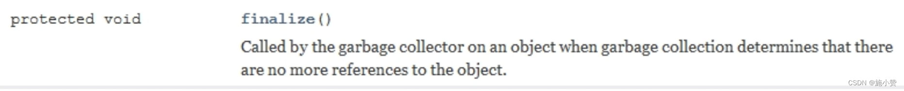

1、ThreadLocal 简介
====================

**1.1、一些面试题**
-------------

ThreadLocal 中 ThreadLocalMap 的数据结构和关系？

ThreadLocal 的 key 是弱引用，这是为什么？

ThreadLocal 内存泄露问题你知道吗？

ThreadLocal 中最后为什么要加 remove 方法？

......

**1.2、是什么**
-----------


稍微翻译一下： 

ThreadLocal 提供线程局部变量。这些变量与正常的变量不同，因为每一个线程在访问 ThreadLocal 实例的时候（通过其 get 或 set 方法） `都有自己的、独立初始化的变量副本` 。T`hreadLocal 实例通常是类中的私有静态字段`，使用它的目的是希望将状态（例如，用户 ID 或事务 ID）与线程关联起来。

**1.3、能干嘛**
-----------

 实现 `每一个线程都有自己专属的本地变量副本` (自己用自己的变量不麻烦别人，不和其他人共享，人人有份，人各一份)， 

主要解决了让每个线程绑定自己的值，通过使用 get() 和 set() 方法，获取默认值或将其值更改为当前线程所存的副本的值`从而避免了线程安全问题`。 


出现前后对比：


以反恐精英为例，每个玩家都有自己专属的内存、血槽、子弹等，无需写回主内存

1.4、api 介绍
--------------


**get（）方法分析**

```java
返回此线程局部变量的当前线程副本中的值。如果变量没有当前线程的值，则首先将其初始化为调用该方法返回 initialValue 的值。
返回值: 此线程本地的当前线程值
   public T get() {
        Thread t = Thread.currentThread();
        ThreadLocalMap map = getMap(t);
        if (map != null) {
            //通过 key 【this :ThreadLocal类型】在Thread的map中获取value,如果value是null，则去根据默认值put
            ThreadLocalMap.Entry e = map.getEntry(this);
            if (e != null) {
                @SuppressWarnings("unchecked")
                T result = (T)e.value;
                return result;
            }
        }
        return setInitialValue();//检查Thread中map是否初始化，设置key【this Threradlocal】-value【initialValue()】
    }

    private T setInitialValue() {
        T value = initialValue();
        Thread t = Thread.currentThread();
        ThreadLocalMap map = getMap(t);
        if (map != null)
            map.set(this, value);
        else
            createMap(t, value);
        return value;
    }
    
实现类   
java.lang.ThreadLocal.SuppliedThreadLocal
    @Override
    protected T initialValue() {
        return supplier.get();
    }
```


**1.5、从 helloworld 讲起**
-----------------------

### **1.4.1、按照总销售额统计，方便集团公司做计划统计**

群雄逐鹿起纷争—为了数据安全只能加锁

```java
//代码样例

class House{
    int saleCount = 0;
    public synchronized void saleHouse(){
        ++ saleCount;
    }
}

public class ThreadLocalDemo {
    public static void main(String[] args) {
        House house = new House();
        for(int i = 1;i <= 5;i ++){
            new Thread(()->{
                int size = new Random().nextInt(5) + 1;
                System.out.println(size);
                for(int j = 1;j <= size;j ++){
                    house.saleHouse();
                }
            },String.valueOf(i)).start();
        }

        try {
            TimeUnit.MILLISECONDS.sleep(300);
        } catch (InterruptedException e) {
            e.printStackTrace();
        }
        System.out.println(Thread.currentThread().getName()+"\t"+"共计卖出多少套："+ house.saleCount);
    }
}
//2
//3
//1
//5
//4
//main  共计卖出多少套：15
```

### 1.4.2、上述需求发生了变化...

不参加总和计算，希望各自分灶吃饭，各凭销售本事提成，按照出单数各自统计

比如某找房软件，每个中介销售都有自己的销售额指标，自己专属自己的，不和别人掺和

人手一份天下安


- 利用 ThreadLocal

- 先初始化，给个 0 值

- 利用 set get 方法

- ------ **注意**，也要调用 **remove(）** 接口，不然容易导致内存泄漏

  

```java
//Demo1
class House{
    int saleCount = 0;
    public synchronized void saleHouse(){
        ++ saleCount;
    }
    
//两个都是创建一个线程局部变量并返回初始值
    /**
     * 一个比较老式的写法（这个阿里巴巴手册里也也有），initialValue()这个api已经淘汰了
     */
    /*ThreadLocal<Integer> saleVolume =  new ThreadLocal<Integer>(){
        @Override
        protected Integer initialValue(){
            return 0;
        }
    };*/
//java8之后带来的新写法
    ThreadLocal<Integer> saleVolume = ThreadLocal.withInitial(() -> 0);//withInitial当前常被用来初始化
    
    public void saleVolumeByThreadLocal(){
        saleVolume.set(1+saleVolume.get());
    }
}

public class ThreadLocalDemo {
    public static void main(String[] args) {
        House house = new House();
        for(int i = 1;i <= 5;i ++){
            new Thread(()->{
                int size = new Random().nextInt(5) + 1;
                try {
                    for (int j = 1; j <=size; j++) {
                        house.saleHouse();
                        house.saleVolumeByThreadLocal();
                    }
                    System.out.println(Thread.currentThread().getName()+"\t"+"号销售卖出："+house.saleVolume.get());
                } finally {
                    house.saleVolume.remove();//如果不清理自定义的 ThreadLocal 变量，可能会影响后续业务逻辑和造成内存泄露等问题
                }
            },String.valueOf(i)).start();
        }

        try {
            TimeUnit.MILLISECONDS.sleep(300);
        } catch (InterruptedException e) {
            e.printStackTrace();
        }
        System.out.println(Thread.currentThread().getName()+"\t"+"共计卖出多少套："+ house.saleCount);
    }
}
//人手一份，不用加锁也可以实现上述需求
//3  号销售卖出：3
//2  号销售卖出：2
//4  号销售卖出：3
//1  号销售卖出：2
//5  号销售卖出：1
//main  共计卖出多少套：11
```

```java
//Demo2-主要演示线程池情况下，线程池中的线程会复用(不会自动清空)，而上面的都是新建一个Thread
class MyData{
    ThreadLocal<Integer> threadLocalField = ThreadLocal.withInitial(() -> 0);
    public void add(){
        threadLocalField.set(1+ threadLocalField.get());
    }
}

/**
 * 根据阿里规范，需要对自定义的ThreadLocal进行回收，否则容易造成内存泄漏和业务逻辑问题(因为线程池中的线程会复用)
 */
public class ThreadLocalDemo2 {
    public static void main(String[] args) {
        MyData myData = new MyData();
        ExecutorService threadPool = Executors.newFixedThreadPool(3);
        try {
            for(int i = 0;i < 10;i ++){
                threadPool.submit(()->{
                    try {
                        Integer beforeInt = myData.threadLocalField.get();
                        myData.add();
                        Integer afterInt = myData.threadLocalField.get();
                        System.out.println(Thread.currentThread().getName()+"\t"+"beforeInt"+beforeInt+"\t afterInt"+afterInt);
                    } finally {
                        myData.threadLocalField.remove();
                    }
                });
            }
        } catch (Exception e) {
            e.printStackTrace();
        }finally {
            threadPool.shutdown();
        }
    }
}
//没有remove---出现了累积
//pool-1-thread-1  beforeInt0   afterInt1
//pool-1-thread-3  beforeInt0   afterInt1
//pool-1-thread-2  beforeInt0   afterInt1
//pool-1-thread-2  beforeInt1   afterInt2
//pool-1-thread-2  beforeInt2   afterInt3
//pool-1-thread-2  beforeInt3   afterInt4
//pool-1-thread-2  beforeInt4   afterInt5
//pool-1-thread-2  beforeInt5   afterInt6
//pool-1-thread-3  beforeInt1   afterInt2
//pool-1-thread-1  beforeInt1   afterInt2
//有remove-不会出现累积的情况
//pool-1-thread-1  beforeInt0   afterInt1
//pool-1-thread-3  beforeInt0   afterInt1
//pool-1-thread-2  beforeInt0   afterInt1
//pool-1-thread-1  beforeInt0   afterInt1
//pool-1-thread-3  beforeInt0   afterInt1
//pool-1-thread-1  beforeInt0   afterInt1
//pool-1-thread-2  beforeInt0   afterInt1
//pool-1-thread-1  beforeInt0   afterInt1
//pool-1-thread-3  beforeInt0   afterInt1
//pool-1-thread-2  beforeInt0   afterInt1
```


**1.6、通过上面代码总结**
----------------

因为每个 Thread 内有自己的`实例副本`且该副本只由当前线程自己使用

既然其它 Thread 不可访问，那就不存在多线程间共享的问题。

统一设置初始值，但是每个线程对这个值的修改都是各自线程互相独立的


一句话：**如何才能不争抢?**

1 加入 synchronized 或者 Lock 控制资源的访问顺序

2 人手一份，大家各自安好，没必要抢夺

**2、从阿里 ThreadLocal 规范开始**
==========================


**2.1、非线程安全的 SimpleDateFormat**
-------------------------------


上述翻译：SimpleDateFormat 中的日期格式不是同步的。推荐（建议）为每个线程创建独立的格式实例。如果多个线程同时访问一个格式，则它必须保持外部同步。 

写时间工具类，一般写成 静态的成员变量 ，不知，此种写法的多线程下的危险性！ 

课堂上讨论一下 SimpleDateFormat 线程不安全问题，以及解决方法。  

```java
package com.atguigu.juc.tl;
 
 
 
import java.text.SimpleDateFormat;
 
import java.util.Date;

public class DateUtils {
 
    public static final SimpleDateFormat sdf = new SimpleDateFormat("yyyy-MM-dd HH:mm:ss");
    /**
     * 模拟并发环境下使用 SimpleDateFormat 的 parse 方法将字符串转换成 Date 对象
     * @param stringDate
     * @return
     * @throws Exception
     */
 
    public static Date parseDate(String stringDate) throws Exception {
 
        return sdf.parse(stringDate);
 
    }

    public static void main(String[] args) throws Exception {
 
        for (int i = 1; i <= 30; i++) {
 
            new Thread(() -> {
                try {
                    System.out.println(DateUtils.parseDate("2020-11-11 11:11:11"));
                } catch (Exception e) {
                    e.printStackTrace();
                }
            }, String.valueOf(i)).start();
 
        }
 
    }
 
}
```


**源码分析结论：**

SimpleDateFormat 类内部有一个 Calendar 对象引用, 它用来储存和这个 SimpleDateFormat 相关的日期信息, 例如 sdf.parse(dateStr),sdf.format(date) 诸如此类的方法参数传入的日期相关 String,Date 等等, 都是交由 Calendar 引用来储存的. 这样就会导致一个问题 如果你的 SimpleDateFormat 是个 static 的, 那么多个 thread 之间就会共享这个 SimpleDateFormat, 同时也是共享这个 Calendar 引用。 


**2.2、解决 1**
------------

将 SimpleDateFormat 定义成局部变量。

缺点：每调用一次方法就会创建一个 SimpleDateFormat 对象，方法结束又要作为垃圾回收。

```java
 public class DateUtils {

    public static void main(String[] args) throws Exception {
 
        for (int i = 1; i <= 30; i++) {
            new Thread(() -> {
                try {
                    SimpleDateFormat sdf = new SimpleDateFormat("yyyy-MM-dd HH:mm:ss");
                    System.out.println(sdf.parse("2020-11-11 11:11:11"));
                    sdf = null;
                } catch (Exception e) {
                    e.printStackTrace();
                }
            }, String.valueOf(i)).start();
        }
    }
}
```

**2.3、解决 2**
------------

ThreadLocal，也叫做线程本地变量或者线程本地存储

```java
public class DateUtils{
    private static final ThreadLocal<SimpleDateFormat>  sdf_threadLocal =
            ThreadLocal.withInitial(()-> new SimpleDateFormat("yyyy-MM-dd HH:mm:ss"));

    /**
     * ThreadLocal可以确保每个线程都可以得到各自单独的一个SimpleDateFormat的对象，那么自然也就不存在竞争问题了。
     * @param stringDate
     * @return
     * @throws Exception
     */
    public static Date parseDateTL(String stringDate)throws Exception{
        return sdf_threadLocal.get().parse(stringDate);
    }

    public static void main(String[] args) throws Exception{
        for (int i = 1; i <=30; i++) {
            new Thread(() -> {
                try {
                    System.out.println(DateUtils.parseDateTL("2020-11-11 11:11:11"));
                } catch (Exception e) {
                    e.printStackTrace();
                }
            },String.valueOf(i)).start();
        }
    }
}
```

```java
public class DateUtils{
    /*
    1   SimpleDateFormat如果多线程共用是线程不安全的类
    public static final SimpleDateFormat SIMPLE_DATE_FORMAT = new SimpleDateFormat("yyyy-MM-dd HH:mm:ss");

    public static String format(Date date)
    {
        return SIMPLE_DATE_FORMAT.format(date);
    }

    public static Date parse(String datetime) throws ParseException
    {
        return SIMPLE_DATE_FORMAT.parse(datetime);
    }*/

    //2   ThreadLocal可以确保每个线程都可以得到各自单独的一个SimpleDateFormat的对象，那么自然也就不存在竞争问题了。
    public static final ThreadLocal<SimpleDateFormat> SIMPLE_DATE_FORMAT_THREAD_LOCAL = ThreadLocal.withInitial(() -> new SimpleDateFormat("yyyy-MM-dd HH:mm:ss"));

    public static String format(Date date){
        return SIMPLE_DATE_FORMAT_THREAD_LOCAL.get().format(date);
    }

    public static Date parse(String datetime) throws ParseException{
        return SIMPLE_DATE_FORMAT_THREAD_LOCAL.get().parse(datetime);
    }


    //3 DateTimeFormatter 代替 SimpleDateFormat
    /*public static final DateTimeFormatter DATE_TIME_FORMAT = DateTimeFormatter.ofPattern("yyyy-MM-dd HH:mm:ss");

    public static String format(LocalDateTime localDateTime)
    {
        return DATE_TIME_FORMAT.format(localDateTime);
    }

    public static LocalDateTime parse(String dateString)
    {

        return LocalDateTime.parse(dateString,DATE_TIME_FORMAT);
    }*/
}
```

**2.4、其它**
----------

① 加锁

② 第 3 方时间库

**3、ThreadLocal 源码分析**
======================

3.1、Thread，ThreadLocal，ThreadLocalMap 关系
--------------------------------------------

- 根据官方 API，Thread 是程序中执行的**线程；\**ThreadLocal 类提供\**线程局部变量**。
- 先打开`Thread.java`类，发现每个 Thread 类里面有一个`ThreadLocal`类

**Thread 和 ThreadLocal**


**ThreadLocal 和 ThreadLocalMap**

而`ThreadLocalMap`是`ThreadLocal`的一个静态内部类


**All 三者总概括**


`threadLocalMap`实际上就是一个以`threadLocal`实例为 **key**，任意对象为 **value** 的`Entry对象`。
当我们为 threadLocal 变量赋值，实际上就是以当前 threadLocal 实例为 key，值为 value 的 Entry 往这个 threadLocalMap 中存放

**3.2、小总结**
-----------

近似的可以理解为 :   

ThreadLocalMap 从字面上就可以看出这是一个保存 ThreadLocal 对象的 map(其实是以 ThreadLocal 为 Key) ，不过是经过了两层包装的 ThreadLocal 对象：   


`JVM 内部维护了一个线程版的 Map<Thread,T>`(通过 ThreadLocal 对象的 set 方法，结果把 ThreadLocal 对象自己当做 key ，放进了 ThreadLoalMap 中) , 每个线程要用到这个 T 的时候，用当前的线程去 Map 里面获取， 通过这样让每个线程都拥有了自己独立的变量 ，人手一份，竞争条件被彻底消除，在并发模式下是绝对安全的变量。   

4、ThreadLocal 内存泄露问题
========================

4.1、从阿里面试题开始讲起
------------------


4.2、什么是内存泄漏
---------------

不再会被使用的对象或者变量占用的内存**不能被回收**，就是内存泄露。

4.3、谁惹的祸  + 四大引用
-------------

### 4.3.1、why?


### **4.3.2、强引用、软引用、弱引用、虚引用分别是什么？**

#### **再回首 ThreadLocalMap**


**ThreadLocalMap** **与** **WeakReference**    

ThreadLocalMap 从字面上就可以看出这是一个保存 ThreadLocal 对象的 map(其实是以它为 Key) ，不过是经过了两层包装的 ThreadLocal 对象：   

（ 1 ）第一层包装是使用 WeakReference<ThreadLocal<?>> 将 ThreadLocal 对象变成一个 `弱引用的对象`；   

（ 2 ）第二层包装是定义了一个专门的类 Entry 来扩展 WeakReference<ThreadLocal<?>> ；   

#### **整体架构**


Java 技术允许使用 finalize() 方法在垃圾收集器将对象从内存中清除出去之前做必要的清理工作。   



**新建一个待 finalize() 方法的对象 MyObject ** 下面演示会用到

```java
class MyObject{
    @Override
    protected void finalize() throws Throwable{
        //finalize的通常目的是在对象被不可撤销的丢弃之前进行清理操作
        System.out.println("finalize()被调用-------invoke finalize");
    }
}
```

#### **1、强引用 (默认支持模式)** 

当内存不足，JVM 开始垃圾回收，对于强引用的对象， `就算是出现了 OOM 也不会对该对象进行回收 ， 死都不收。` 

强引用是我们最常见的普通对象引用，只要还有强引用指向一个对象，就能表明对象还 “活着”，垃圾收集器不会碰这种对象。在 Java 中最常见的就是强引用，把一个对象赋给一个引用变量，这个引用变量就是一个强引用。

当一个对象被强引用变量引用时，它处于`可达状态`，它是不可能被垃圾回收机制回收的， `即使该对象以后永远都不会被用到 JVM 也不会回收` 。因此强引用是造成 Java 内存泄漏的主要原因之一。 

对于一个普通的对象，如果没有其他的引用关系，只要超过了引用的作用域或者显式地将相应（强）引用赋值为 null， 

一般认为就是可以被垃圾收集的了 (当然具体回收时机还是要看垃圾收集策略)。 

```java
public class referenceDemo {
    public static void main(String[] args) {
        MyObject myObject = new MyObject();
        System.out.println("gc before"+myObject);

        myObject = null;//new 一个对象是一个强引用，如果不把他指为null，垃圾回收回收不了他
        System.gc();//人工开启gc 一般不用

        System.out.println("gc after "+myObject);
    }
}
//gc beforecom.zhang.admin.controller.MyObject@2f4d3709
//gc after null
//finalize()被调用-------invoke finalize      -------这不就是在对象丢弃之前进行一个清理操作，这里确实清理了
```

#### **2、软引用**

软引用是一种相对强引用弱化了一些的引用，需要用 java.lang.ref.SoftReference 类来实现，可以让对象豁免一些垃圾收集。 

对于只有软引用的对象来说， 

          **当系统内存充足时它      不会     被回收，** 

          **当系统内存不足时它         会     被回收。** 

软引用通常用在对内存敏感的程序中，比如高速缓存就有用到软引用， **内存够用的时候就保留，不够用就回收！** 

```java
public class ReferenceDemoCopy {
 
    public static void main(String[] args) {
        SoftReference<MyObject> softReference = new SoftReference<>(new MyObject());//软引用
        //当我们内存不够用的时候， soft 会被回收的情况，设置我们的内存大小： -Xms10m -Xmx10m
        System.out.println("gc before内存够用: " + softReference.get());

        System.gc();//手动挡的方式开启Gc回收。
        try {
            TimeUnit.SECONDS.sleep(1);
        } catch (InterruptedException e) {
            e.printStackTrace();
        }


        //设置参数-Xms10m -Xmx10m
        System.out.println("gc before: " + softReference.get());

        try {
            byte[] bytes = new byte[9 * 1024 * 1024];
        } catch (Exception e) {
            e.printStackTrace();
        } finally {
            System.out.println("-----gc after内存不够: " + softReference.get());
        }
    }
}
 
 
运行结果：
没加-Xms10m -Xmx10m 参数，内存够用
gc before内存够用: com.atguigu.juc.tl.MyObject@33c7353a
gc before: com.atguigu.juc.tl.MyObject@33c7353a
-----gc after内存不够: com.atguigu.juc.tl.MyObject@33c7353a
 
 
 
加上 -Xms10m -Xmx10m参数，内存不够用
gc before内存够用: com.atguigu.juc.tl.MyObject@33c7353a
gc before: com.atguigu.juc.tl.MyObject@33c7353a
-----gc after内存不够: null
------------- gc ,finalize() invoked
Exception in thread "main" java.lang.OutOfMemoryError: Java heap space
at com.atguigu.juc.tl.ReferenceDemoCopy.main(ReferenceDemoCopy.java:31)
```


#### **3、弱引用**

弱引用需要用 `java.lang.ref.WeakReference` 类来实现，它比软引用的生存期更短， 

对于只有弱引用的对象来说，**只要垃圾回收机制一运行，不管 JVM 的内存空间是否足够，都会回收该对象占用的内存。**  

```java
public class ReferenceDemoCopy {
    public static void main(String[] args) {

        WeakReference<MyObject> weakReference = new WeakReference(new MyObject());
        System.out.println("gc before: " + weakReference.get());

        System.gc();//手动挡的方式开启Gc回收。

        try {
            TimeUnit.SECONDS.sleep(1);
        } catch (InterruptedException e) {
            e.printStackTrace();
        }
        
        System.out.println("gc after: " + weakReference.get());

    } 
}

gc before: MyObject@7699a589
finalize()被调用-------invoke finalize
gc after: null
```

##### **软引用和弱引用的适用场景**

假如有一个应用需要读取大量的本地图片:

+ 如果每次读取图片都从硬盘读取则会严重影响性能,

+ 如果一次性全部加载到内存中又可能造成内存溢出。

此时使用软引用可以解决这个问题。

设计思路是：用一个HashMap来保存图片的路径和相应图片对象关联的软引用之间的映射关系，在内存不足时，JVM会自动回收这些缓存图片对象所占用的空间，从而有效地避免了OOM的问题。

`Map<String, SoftReference<Bitmap>> imageCache = new HashMap<String, SoftReference<Bitmap>>();`

#### **4、虚引用**

这就是虚引用特点之一了：无法通过虚引用来获取对一个对象的真实引用。

虚引用的特点之二就是 虚引用必须与ReferenceQueue一起使用，**当GC准备回收一个对象，如果发现它还有虚引用，就会在回收之前，把这个虚引用加入到与之关联的ReferenceQueue中**。


1. **虚引用必须和引用队列 (ReferenceQueue)联合使用**
   虚引用需要`java.lang.ret.PhantomReterence类`来实现,顾名思义， 就是**形同虚设**，与其他几种引用都不同，虚引用并不会决定对象的生命周期。**如果一个对象仅持有虚引用，那么它就和没有任何引用一样，在任何时候都可能被垃圾回收器回收**，它不能单独使用也不能通过它访问对象，虚引用必须和引用队列(ReferenceQueue)联合使用。

2. **PhantomReference的get方法总是返回null**
   虚引用的主要作用是跟踪对象被垃圾回收的状态。**仅仅是提供了一和确保对象被 finalize以后，做某些事情的通知机制。**
   **PhantomReference的get方法总是返回null**，因此无法访问对应的引用对象。

3. **处理监控通知使用**
   换句话说，设置虚引用关联对象的**唯一目的，就是在这个对象被收集器回收的时候收到一个系统通知或者后续添加进一步的处理，用来实现比finalize机制更灵活的回收操作**。

**构造方法：**


**引用队列 的作用**


> 我被回收前需要被引用队列保存下。 

案例：记得先给设置成-Xms10m -Xmx10m

从运行结果可以看到：当发生GC，虚引用就会被回收，并且会把回收的通知放到ReferenceQueue中。

虚引用有什么用呢？在NIO中，就运用了虚引用管理堆外内存。

```java
public class ReferenceDemoCopy {
 public static void main(String[] args)
    {
        ReferenceQueue<MyObject> referenceQueue = new ReferenceQueue();
        PhantomReference<MyObject> phantomReference = new PhantomReference<>(new MyObject(),referenceQueue);
        //System.out.println(phantomReference.get());

        List<byte[]> list = new ArrayList<>();

        new Thread(() -> {
            while (true)
            {
                list.add(new byte[1 * 1024 * 1024]);
                try { TimeUnit.MILLISECONDS.sleep(600); } catch (InterruptedException e) { e.printStackTrace(); }
                System.out.println(phantomReference.get());
            }
        },"t1").start();

        new Thread(() -> {
            while (true)
            {
                Reference<? extends MyObject> reference = referenceQueue.poll();
                if (reference != null) {
                    System.out.println("***********有虚对象加入队列了");
                }
            }
        },"t2").start();

        //暂停几秒钟线程
        try { TimeUnit.SECONDS.sleep(5); } catch (InterruptedException e) { e.printStackTrace(); }
    }
}

//null
//finalize()被调用-------invoke finalize
//null
//null
//null
//null
//null
//有虚对象加入队列了  ------(说明被干掉之后进入了这个引用队列)
//Exception in thread "t1" java.lang.OutOfMemoryError: Java heap space
//  at com.zhang.admin.controller.referenceDemo.lambda$main$0(referenceDemo.java:30)
//  at com.zhang.admin.controller.referenceDemo$$Lambda$1/1108411398.run(Unknown Source)
//  at java.lang.Thread.run(Thread.java:748)
```


**4.3.2.7、GCRoots 和四大引用小总结**


### 4.3.3、关系


每个 Thread 对象维护着一个 ThreadLocalMap 的引用 

ThreadLocalMap 是 ThreadLocal 的内部类，用 Entry 来进行存储 

调用 ThreadLocal 的 set() 方法时，实际上就是往 ThreadLocalMap 设置值，key 是 ThreadLocal 对象，值 Value 是传递进来的对象 

调用 ThreadLocal 的 get() 方法时，实际上就是往 ThreadLocalMap 获取值，key 是 ThreadLocal 对象 

ThreadLocal 本身并不存储值，它只是自己作为一个 key 来让线程从 ThreadLocalMap 获取 value，正因为这个原理，所以 ThreadLocal 能够实现 “数据隔离”，获取当前线程的局部变量值，不受其他线程影响～ 

## **4.4、为什么要用弱引用? 不用如何？**

```java
public void function01() {
 
    ThreadLocal tl = new ThreadLocal<Integer>();  //line1
 
    tl.set(2021);  //line2
 
    tl.get();  //line3
 
}
```

line1 新建了一个 ThreadLocal 对象，t1 是强引用指向这个对象；

line2 调用 set() 方法后新建一个 Entry，通过源码可知 Entry 对象里的 k 是弱引用指向这个对象。 


### **4.4.1、为什么源代码用弱引用？**【gc一定回收】

当 function01 方法执行完毕后，**栈帧销毁强引用 tl** 也就没有了。但此时**线程的 ThreadLocalMap 里某个 entry 的 key 引用还指向这个对象**   

+ 若这个 key 引用是 **强引用** ，就会导致 key **指向的 ThreadLocal 对象及 v 指向的对象不能被 gc 回收，造成内存泄漏；**   

+ 若这个 key 引用是 **弱引用** 就 大概率 会减少内存泄漏的问题 ( **还有一个 key 为 null 的雷** ) 。

弱引用还存在问题：**使用弱引用，就可以使 ThreadLocal 对象在方法执行完毕后顺利被回收且 Entry 的 key 引用指向为 null** 。 

-- 下面这句话，我们后续聊，本节先忽略 

**此后我们调用** **get,set** **或** **remove** **方法时，就会尝试删除** **key** **为** **null** **的** **entry** **，可以释放** **value** **对象所占用的内存。**   

### **4.4.2、弱引用就万事大吉了吗？**

**埋雷**

1、 当我们为 threadLocal 变量赋值，实际上就是当前的 Entry(threadLocal 实例为 key ，值为 value) 往这个 threadLocalMap 中存放。 Entry 中的 key 是弱引用，当 threadLocal 外部强引用被置为 null(tl=null), 那么系统 GC 的时候，根据可达性分析，这个 threadLocal 实例就没有任何一条链路能够引用到它，这个 ThreadLocal 势必会被回收，这样一来 ， ThreadLocalMap 中就会出现 key 为 null 的 Entry ，就没有办法访问这些 key 为 null 的 Entry 的 value ，如果当前线程再迟迟不结束【例如线程池】的话，这些 key 为 null 的 Entry 的 value 就会一直存在一条强引用链： Thread Ref -> Thread -> ThreaLocalMap -> Entry -> value 永远无法回收，造成内存泄漏。 

2、 当 然，如果当前 thread 运行结束， threadLocal ， threadLocalMap,Entry 没有引用链可达，在垃圾回收的时候都会被系统进行回收。   

3、 但在实际使用中 我们有时候会用线程池 去维护我们的线程，比如在 Executors.newFixedThreadPool() 时创建线程的时候，为了复用线程是不会结束的，所以 threadLocal 内存泄漏就值得我们小心   

**key 为 null 的 entry，** **原理解析**


**ThreadLocalMap 使用 ThreadLocal 的弱引用作为 key ，如果一个 ThreadLocal 没有外部强引用引用他，那么系统 gc 的时候，这个 ThreadLocal 势必会被回收，这样一来， ThreadLocalMap 中就会出现 key 为 null 的 Entry ，就没有办法访问这些 key 为 null 的 Entry 的 value ，如果当前线程再迟迟不结束的话 (比如正好用在线程池) ，这些 key 为 null 的 Entry 的 value 就会一直存在一条强引用链。**   

虽然弱引用，保证了 key 指向的 ThreadLocal 对象能被及时回收，但是 v 指向的 value 对象是需要 ThreadLocalMap 调用 get 、 set 时发现 key 为 null 时才会去回收整个 entry 、 value ， 因此弱引用不能 100% 保证内存不泄露。 **我们要在不使用某个** **ThreadLocal** **对象后，手动调用** **remove** **方法来删除它** ，尤其是在线程池中，不仅仅是内存泄露的问题，因为线程池中的线程是重复使用的，意味着这个线程的 ThreadLocalMap 对象也是重复使用的，如果我们不手动调用 remove 方法，那么后面的线程就有可能获取到上个线程遗留下来的 value 值，造成 bug 。   


**set、get 方法会去expungeStaleEntry检查所有键为 null 的 Entry 对象**

**set()**


**get()**


**remove()**


**结论**

从前面的 set,getEntry,remove 方法看出，在 threadLocal 的生命周期里，针对 threadLocal 存在的内存泄漏的问题， 

都会通过 `expungeStaleEntry`，cleanSomeSlots,replaceStaleEntry 这三个方法清理掉 key 为 null 的脏 entry。 

### **4.4.3、结论**


**4.5、最佳实践**
------------

1. 一定要进行初始化避免**空指针问题**ThreadLocal.withInitial(()- > 初始化值);
2. 建议把ThreadLocal修饰为static
3. 用完记得手动`remove`


**5、小总结**
=========

ThreadLocal 并不解决线程间共享数据的问题

ThreadLocal 适用于变量在线程间隔离且在方法间共享的场景

ThreadLocal 通过隐式的在不同线程内创建独立实例副本避免了实例线程安全的问题

每个线程持有一个只属于自己的专属 Map 并维护了 ThreadLocal 对象与具体实例的映射，该 Map 由于只被持有它的线程访问，故不存在线程安全以及锁的问题

ThreadLocalMap 的 Entry 对 ThreadLocal 的引用为弱引用，避免了 ThreadLocal 对象无法被回收的问题【 ThreadLocal 对象在线程方法栈内的指向置为null时，ThreadLocalMap 对应的key如果为强引用则ThreadLocal 不满足GC要求。】

都会通过 expungeStaleEntry，cleanSomeSlots,replaceStaleEntry 这三个方法回收键为 null 的 Entry 对象的值（即为具体实例）以及 Entry 对象本身从而防止内存泄漏，属于安全加固的方法

群雄逐鹿起纷争，人各一份天下安


# 拓展：内存泄漏演示分析

ThreadLocal 的作用是提供线程内的局部变量，API 简单易用。不过 ThreadLocal 的使用不是本文存在的原因，今天研究了一下 ThreadLocal 的设计思路，想在这里记录一下。

### 问题剖析

为了实现我们的想法`提供线程内的局部变量`，我们需要一个什么样的东西？官方的 API 大概是这样使用的：

```java
ThreadLocal foo = ThreadLocal.withInitial(()-> 0);
foo.get();
foo.set(1);
foo.remove();
```

显而易见，我们直接操作`ThreadLocal变量`，而变量的值是根据`当前代码执行的上下文（当前线程）`确定的。所以我们起码可以提出 2 点：

1.  线程和 ThreadLocal 变量是**多对多**的关系，即一个线程可以有多个 ThreadLocal 变量；一个 ThreadLocal 变量也对应多个线程。
2.  为了确定一个值，我们至少需要知道是当前处于**哪个线程**？ 以及是**哪个变量？**

幸运的是，这 2 个问题都不难回答。线程当然是**当前线程** ，而变量当然也就是我们**正在操作的变量**。这虽然看起来是 2 个傻问题，但记住这句话：**这确实是 ThreadLocal 设计的关键**。

### 方案研究

如果没看过 ThreadLocal 的源码，只使用过它的 API，让我们实现它，我们会怎么做？

（阅读下文时请时刻记住上面提出的 2 个问题）

（因为个人喜好，使用了 python 和 Java 混合代码）

#### 设计 1：

最容易想到的实现方式：当然是为每个变量维护一个线程表，然后根据线程来取得相应的值。

```python
# 设计1的实现
class ThreadLocal:
  	def get():
      	Map<Thread, Object> threadMap = this.threadMap 
        return threadMap.get(Thread.currentThread()).value()
```

这种方式先定位了变量，后定位了线程。值保存在 ThreadLocal 类的 map 中。

#### 设计 2：

还有一种实现方式：为每个线程维护一个变量表，然后根据变量来取得相应的值。

```python
# 设计2的实现
class ThreadLocal:
 	def get():
 		Map<ThreadLocal, Object> threadLocalMap = Thread.currentThread().threadLocalMap
        return threadLocalMap.get(this).value() # 因为我们操作的是变量，所以this指向当前操作的变量
```

这种方式先定位了线程，后定位了变量。值保存在 **Thread 类**的 map 中。

以上 2 种设计都能满足最初的 API，也就是都能满足我们的需求。JDK 早期版本使用了设计 1 的方案，后来改为了设计 2 的方案。

### 内存泄露

在使用 ThreadLocal 时，仿佛耳边总有个人在轻声说着：泄露~ 内存泄露~! 网上的资料大都语焉不详，可能是因为知根知底的人实在太少了。虽然知道解决问题的方法很简单：调用 remove()，但总有一种知其然，而不知其所以然的感觉，非常难受。所以花了一天的时间研究 ThreadLocal。


背景知识：Thread 类中有一个 ThreadLocalMap 类型的变量，它没有实现 Map 接口，但自己实现了类似 Map 的功能。ThreadLocalMap 的数据保存在一个 Entry 数组中，Entry 的 key 是 ThreadLocal，value 是实际的值。key 有一个特殊的地方在于，它是弱引用的。`弱引用：当所引用的对象在JVM内不再有强引用指向时，GC后weak reference将会被自动回收。` 基于以上背景知识，我们构造以下场景：

```java
// 位置A： some code here...
ThreadLocal local = new ThreadLocal();  //1
local.set("foo")						//2
local = null;							//3
System.gc();							//4
// 位置B： other code here...
```

以上代码执行到位置 B 的时候就发生了内存泄露！

第三行的时候我们把 local 赋值为 null，（请看一眼上图的图）可见，对 ThreadLocal 的引用只剩下 Entry 的 key 的弱引用了。紧接着第四行我们手动触发 GC，ThreadLocal 对象就被回收了，所以 Entry 的 key 指向了 null。但是这时候 Entry 对 value 还是有着强引用的，它不会被回收。更糟糕的是，我们好像没有办法通过**正常渠道**访问到这个 value 了，这个 value 此时失去了意义，只是平白无故地占用着我们的空间，直到**该线程结束**。

**以上场景的条件并不苛刻**

以最常见的 tomcat + springMVC 环境为例：

```java
@RequestMapping(value = "/thread/local")
public String foo() {
    ThreadLocal local = new ThreadLocal();  //1
	local.set("foo")						//2
}
```

以上场景就满足了内存泄露的所有条件：

1.  local 变量是局部变量，方法结束后对 ThreadLocal 的强引用消失。下次 GC 后对 ThreadLocal 的弱引用也消失、
2.  tomcat 使用线程池，每次请求取出一个线程，用完之后放回线程池（意味着线程不会结束）

你可以实现一下上面的方法，请求`/thread/local`接口 100 次，然后在 101 次的时候打上断点，检查 Thread.currentThread().threadLocals，看是否有很多个 key 为 null，而 value 为”foo” 的 Entry。

### 最佳实践

1.  ThreadLocal 在没有线程池使用的情况下，不会存在内存泄露
2.  如果使用了线程池的话，就依赖于线程池的实现，如果线程池不销毁线程的话，那么就会存在内存泄露。所以使用线程池的话，最好在线程工作结束的时候调用一下 remove()
3.  tomcat 等框架使用了线程池，需要调用 remove()

PS: 如果在线程池的情况下不调用 remove()，除了内存泄露还有另外一个被大家忽略的问题：

线程工作结束，被回收后变量的值没有回收。下次再取出该线程，withInitial() 方法将不会执行，所以得到值也是上次的值。这可能会导致程序的逻辑出现错误。

```
private ThreadLocal<String> threadLocal = ThreadLocal.withInitial(()-> UUID.randomUUID().toString());
```

### 

