[TOC]

* * *

## 概述

 在 java8 以前, 我们使用 java 的多线程编程, 一般是通过 Runnable 中的 run 方法来完成, 这种方式, 有个很明显的缺点, 就是, 没有返回值, 这时候, 大家可能会去尝试使用 Callable 中的 call 方法, 然后用 Future 返回结果, 如下:

```java
public static void main(String[] args) throws Exception {
        ExecutorService executor = Executors.newSingleThreadExecutor();
        Future<String> stringFuture = executor.submit(new Callable<String>() {
            @Override
            public String call() throws Exception {
                Thread.sleep(2000);
                return "async thread";
            }
        });
        Thread.sleep(1000);
        System.out.println("main thread");
        System.out.println(stringFuture.get());
 
    }
```

通过观察控制台, 我们发现先打印 main thread , 一秒后打印 async thread, 似乎能满足我们的需求, 但仔细想我们发现一个问题, 当调用 future 的 get() 方法时, 当前主线程是堵塞的, 这好像并不是我们想看到的, 另一种获取返回结果的方式是先轮询, 可以调用 isDone, 等完成再获取, 但这也不能让我们满意.

　　不管怎么看, 这种用法看起来并不优雅, 起码从视觉上就有些丑陋, 而且某些场景无法使用, 比如说,

  　　1. 很多个异步线程执行时间可能不一致, 我的主线程业务不能一直等着, 这时候我可能会想要只等最快的线程执行完或者最重要的那个任务执行完, 亦或者我只等 1 秒钟, 至于没返回结果的线程我就用默认值代替.

  　　2. 我两个异步任务之间执行独立, 但是第二个依赖第一个的执行结果.

　　java8 的 CompletableFuture, 就在这混乱且不完美的多线程江湖中闪亮登场了. CompletableFuture 让 Future 的功能和使用场景得到极大的完善和扩展, 提供了函数式编程能力, 使代码更加美观优雅, 而且可以通过回调的方式计算处理结果, 对异常处理也有了更好的处理手段.


CompletableFuture 实现了 CompletionStage 接口和 Future 接口，前者是对后者的一个扩展，增加了异步回调、流式处理、多个 Future 组合处理的能力，使 Java 在处理多任务的协同工作时更加顺畅便利。

一、创建异步任务
-----------------------------------------------------------------------------------------------------------------------------------------------

### 1、Future.submit

通常的线程池接口类 ExecutorService，其中 execute 方法的返回值是 void，即无法获取异步任务的执行状态，3 个重载的 submit 方法的返回值是 Future，可以据此获取任务执行的状态和结果，示例如下：

```java
@Test
public void test3() throws Exception {
    // 创建异步执行任务:
    ExecutorService executorService= Executors.newSingleThreadExecutor();
    Future<Double> cf = executorService.submit(()->{
        System.out.println(Thread.currentThread()+" start,time->"+System.currentTimeMillis());
        try {
            Thread.sleep(2000);
        } catch (InterruptedException e) {
        }
        if(false){
            throw new RuntimeException("test");
        }else{
            System.out.println(Thread.currentThread()+" exit,time->"+System.currentTimeMillis());
            return 1.2;
        }
    });
    System.out.println("main thread start,time->"+System.currentTimeMillis());
    //等待子任务执行完成,如果已完成则直接返回结果
    //如果执行任务异常，则get方法会把之前捕获的异常重新抛出
    System.out.println("run result->"+cf.get());
    System.out.println("main thread exit,time->"+System.currentTimeMillis());
}
```

执行结果如下：

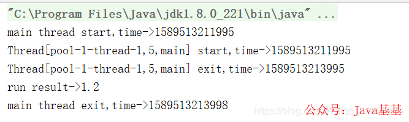

子线程是异步执行的，主线程休眠等待子线程执行完成，子线程执行完成后唤醒主线程，主线程获取任务执行结果后退出。

很多博客说使用不带等待时间限制的 get 方法时，如果子线程执行异常了会导致主线程长期阻塞，这其实是错误的，子线程执行异常时其异常会被捕获，然后修改任务的状态为异常结束并唤醒等待的主线程，get 方法判断任务状态发生变更，就终止等待了，并抛出异常。将上述用例中 if(false) 改成 if(true) ，执行结果如下：

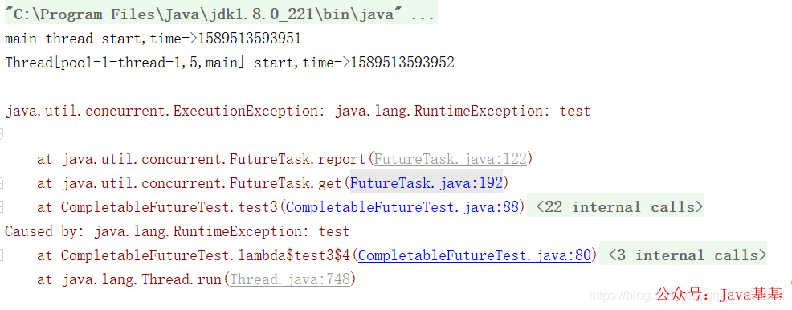

get 方法抛出异常导致主线程异常终止。

### 2、supplyAsync / runAsync

```java
public static <U> CompletableFuture<U> supplyAsync(Supplier<U> supplier){..}
 
public static <U> CompletableFuture<U> supplyAsync(Supplier<U> supplier,Executor executor){..}
 
public static CompletableFuture<Void> runAsync(Runnable runnable){..}
 
public static CompletableFuture<Void> runAsync(Runnable runnable,
Executor executor){..}
```

如果有多线程的基础知识, 我们很容易看出, run 开头的两个方法, 用于执行没有返回值的任务, 因为它的入参是 Runnable 对象, 而 supply 开头的方法显然是执行有返回值的任务了, 至于方法的入参, 如果没有传入 Executor 对象将会使用 ForkJoinPool.commonPool() 作为它的线程池执行异步代码. 在实际使用中, 一般我们使用自己创建的线程池对象来作为参数传入使用, 这样速度会快些.


+ supplyAsync 表示创建带返回值的异步任务的，相当于`ExecutorService submit(Callable<T> task)` 方法

+ runAsync 表示创建无返回值的异步任务，相当于`ExecutorService submit(Runnable task)`方

  

### 3、获取执行结果的几个方法.

```java
V get();
V get(long timeout,Timeout unit);
T getNow(T defaultValue);
T join();
```

　上面两个方法是 Future 中的实现方式, get() 会堵塞当前的线程, 这就造成了一个问题, 如果执行线程迟迟没有返回数据, get() 会一直等待下去, 因此, 第二个 get() 方法可以设置等待的时间.

 　　getNow() 方法比较有意思, 表示当有了返回结果时会返回结果, 如果异步线程抛了异常会返回自己设置的默认值.

### 总结概述

```
不关心上一个任务的执行返回结果，无传参无返回值 thenRun thenRunAsync
依赖上一个任务的结果，有传参，无返回值 thenAccept thenAcceptAsync
依赖上一个任务的结果，有传参数，有返回值 thenApply thenApplyAsync

某个任务执行异常时，执行的回调方法 exceptionAlly
某个任务执行完成后。执行的回调方法，无返回值 whenComplete
某个任务执行完成后，执行的回调方法，有返回值 handle


组合处理
	thenCombine(..) 是结合两个任务的返回值进行转化后再返回, 
	thenAcceptBoth(..)是结合两个任务的返回值进行转化后不需要返回
	runAfterBoth  果连两个任务的返回值也不关心

applyToEither / acceptEither / runAfterEither
这三个方法都是将两个 CompletableFuture 组合起来，只要其中一个执行完了就会执行某个任务，
其区别在于 applyToEither 会将已经执行完成的任务的执行结果作为方法入参，并有返回值；

acceptEither 同样将已经执行完成的任务的执行结果作为方法入参，但是没有返回值；

runAfterEither 没有方法入参，也没有返回值。注意两个任务中只要有一个执行异常，则将该异常信息作为指定任务的执行结果

thenCompose
thenCompose 方法会在某个任务执行完成后，将该任务的执行结果作为方法入参然后执行指定的方法，该方法会返回一个新的 CompletableFuture 实例，如果该 CompletableFuture 实例的 result 不为 null，则返回一个基于该 result 的新的 CompletableFuture 实例；如果该 CompletableFuture 实例为 null，则，然后执行这个新任务

allOf / anyOf
　　allOf: 当所有的`CompletableFuture`都执行完后执行计算
　　anyOf: 最快的那个 CompletableFuture 执行完之后执行计算
```


测试用例如下：

```java
@Test
public void test2() throws Exception {
    // 创建异步执行任务，有返回值
    CompletableFuture<Double> cf = CompletableFuture.supplyAsync(()->{
        System.out.println(Thread.currentThread()+" start,time->"+System.currentTimeMillis());
        try {
            Thread.sleep(2000);
        } catch (InterruptedException e) {
        }
        if(true){
            throw new RuntimeException("test");
        }else{
            System.out.println(Thread.currentThread()+" exit,time->"+System.currentTimeMillis());
            return 1.2;
        }
    });
    System.out.println("main thread start,time->"+System.currentTimeMillis());
    //等待子任务执行完成
    System.out.println("run result->"+cf.get());
    System.out.println("main thread exit,time->"+System.currentTimeMillis());
}

Test
public void test4() throws Exception {
    // 创建异步执行任务，无返回值
    CompletableFuture cf = CompletableFuture.runAsync(()->{
        System.out.println(Thread.currentThread()+" start,time->"+System.currentTimeMillis());
        try {
            Thread.sleep(2000);
        } catch (InterruptedException e) {
        }
        if(false){
            throw new RuntimeException("test");
        }else{
            System.out.println(Thread.currentThread()+" exit,time->"+System.currentTimeMillis());
        }
    });
    System.out.println("main thread start,time->"+System.currentTimeMillis());
    //等待子任务执行完成
    System.out.println("run result->"+cf.get());
    System.out.println("main thread exit,time->"+System.currentTimeMillis());
}
```

这两方法各有一个重载版本，可以指定执行异步任务的 Executor 实现，如果不指定，默认使用`ForkJoinPool.commonPool()`，如果机器是单核的，则默认使用 ThreadPerTaskExecutor，该类是一个内部类，每次执行 execute 都会创建一个新线程。测试用例如下：

```java
@Test
 public void test2() throws Exception {
     ForkJoinPool pool=new ForkJoinPool();
     // 创建异步执行任务:
     CompletableFuture<Double> cf = CompletableFuture.supplyAsync(()->{
         System.out.println(Thread.currentThread()+" start,time->"+System.currentTimeMillis());
         try {
             Thread.sleep(2000);
         } catch (InterruptedException e) {
         }
         if(true){
             throw new RuntimeException("test");
         }else{
             System.out.println(Thread.currentThread()+" exit,time->"+System.currentTimeMillis());
             return 1.2;
         }
     },pool);
     System.out.println("main thread start,time->"+System.currentTimeMillis());
     //等待子任务执行完成
     System.out.println("run result->"+cf.get());
     System.out.println("main thread exit,time->"+System.currentTimeMillis());
 }

@Test
 public void test4() throws Exception {
     ExecutorService executorService= Executors.newSingleThreadExecutor();
     // 创建异步执行任务:
     CompletableFuture cf = CompletableFuture.runAsync(()->{
         System.out.println(Thread.currentThread()+" start,time->"+System.currentTimeMillis());
         try {
             Thread.sleep(2000);
         } catch (InterruptedException e) {
         }
         if(false){
             throw new RuntimeException("test");
         }else{
             System.out.println(Thread.currentThread()+" exit,time->"+System.currentTimeMillis());
         }
     },executorService);
     System.out.println("main thread start,time->"+System.currentTimeMillis());
     //等待子任务执行完成
     System.out.println("run result->"+cf.get());
     System.out.println("main thread exit,time->"+System.currentTimeMillis());
 }
```


二、异步回调
---------------------------------------------------------------------------------------------------------------------------------------------


### 1、thenApply / thenApplyAsync

```java
public <U> CompletableFuture<U>     thenApply(Function<? super T,? extends U> fn)
public <U> CompletableFuture<U>     thenApplyAsync(Function<? super T,? extends U> fn)
public <U> CompletableFuture<U>     thenApplyAsync(Function<? super T,? extends U> fn, Executor executor)
```

　**功能:** `当前任务正常完成以后执行，当前任务的执行的结果会作为下一任务的输入参数, 有返回值`

　**场景:** 多个任务串联执行, 下一个任务的执行依赖上一个任务的结果, 每个任务都有输入和输出

　　实例 1: 异步执行任务 A, 当任务 A 完成时使用 A 的返回结果 resultA 作为入参进行任务 B 的处理, 可实现任意多个任务的串联执行

```java
CompletableFuture<String> futureA = CompletableFuture.supplyAsync(() -> "hello");
CompletableFuture<String> futureB = futureA.thenApply(s->s + " world");
CompletableFuture<String> future3 = futureB.thenApply(String::toUpperCase);
System.out.println(future3.join());
```

上面的代码, 我们当然可以先调用 future.join() 先得到任务 A 的返回值, 然后再拿返回值做入参去执行任务 B, 而 thenApply 的存在就在于帮我简化了这一步, 我们不必因为等待一个计算完成而一直阻塞着调用线程，而是告诉 CompletableFuture 你啥时候执行完就啥时候进行下一步. 就把多个任务串联起来了.


thenApply 表示某个任务执行完成后执行的动作，即回调方法，会将该任务的执行结果即方法返回值作为入参传递到回调方法中，测试用例如下：

```java
@Test
public void test5() throws Exception {
    ForkJoinPool pool=new ForkJoinPool();
    // 创建异步执行任务:
    CompletableFuture<Double> cf = CompletableFuture.supplyAsync(()->{
        System.out.println(Thread.currentThread()+" start job1,time->"+System.currentTimeMillis());
        try {
            Thread.sleep(2000);
        } catch (InterruptedException e) {
        }
        System.out.println(Thread.currentThread()+" exit job1,time->"+System.currentTimeMillis());
        return 1.2;
    },pool);
    //cf关联的异步任务的返回值作为方法入参，传入到thenApply的方法中
    //thenApply这里实际创建了一个新的CompletableFuture实例
    CompletableFuture<String> cf2=cf.thenApply((result)->{
        System.out.println(Thread.currentThread()+" start job2,time->"+System.currentTimeMillis());
        try {
            Thread.sleep(2000);
        } catch (InterruptedException e) {
        }
        System.out.println(Thread.currentThread()+" exit job2,time->"+System.currentTimeMillis());
        return "test:"+result;
    });
    System.out.println("main thread start cf.get(),time->"+System.currentTimeMillis());
    //等待子任务执行完成
    System.out.println("run result->"+cf.get());
    System.out.println("main thread start cf2.get(),time->"+System.currentTimeMillis());
    System.out.println("run result->"+cf2.get());
    System.out.println("main thread exit,time->"+System.currentTimeMillis());
}
```

其执行结果如下：

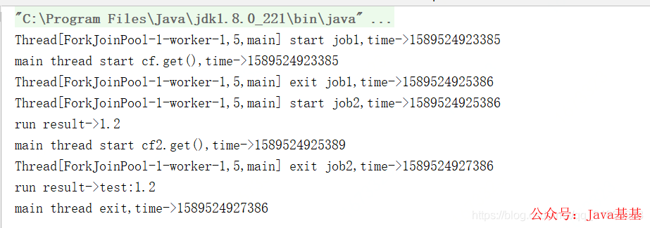

job1 执行结束后，将 job1 的方法返回值作为入参传递到 job2 中并立即执行 job2。

thenApplyAsync 与 thenApply 的区别在于，前者是将 job2 提交到线程池中异步执行，实际执行 job2 的线程可能是另外一个线程，后者是由执行 job1 的线程立即执行 job2，即两个 job 都是同一个线程执行的。将上述测试用例中 thenApply 改成 thenApplyAsync 后，执行结果如下：

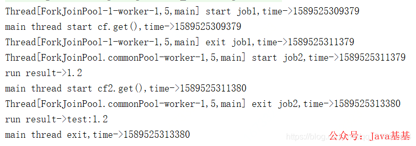

从输出可知，执行 job1 和 job2 是两个不同的线程。thenApplyAsync 有一个重载版本，可以指定执行异步任务的 Executor 实现，如果不指定，默认使用`ForkJoinPool.commonPool()`。

下述的多个方法，每个方法都有两个以 Async 结尾的方法，**一个使用默认的 Executor 实现，一个使用指定的 Executor 实现，不带 Async 的方法是由触发该任务的线程执行该任务**，带 Async 的方法是由触发该任务的线程将任务提交到线程池，执行任务的线程跟触发任务的线程不一定是同一个。

### 2、thenAccept /thenAcceptAsync

```java
public CompletionStage<Void> thenAccept(Consumer<? super T> action);
public CompletionStage<Void> thenAcceptAsync(Consumer<? super T> action);
public CompletionStage<Void> thenAcceptAsync(Consumer<? super T> action,Executor executor);
```

　**功能:** 当前任务正常完成以后执行, 当前任务的`执行结果`可以作为下一任务的输入参数, `无返回值.`

　**场景:** 执行任务 A, 同时异步执行任务 B, 待任务 B 正常返回之后, 用 B 的返回值执行任务 C, 任务 C 无返回值

```java
CompletableFuture<String> futureA = CompletableFuture.supplyAsync(() -> "任务A");
CompletableFuture<String> futureB = CompletableFuture.supplyAsync(() -> "任务B");
CompletableFuture<String> futureC = futureB.thenApply(b -> {
      System.out.println("执行任务C.");
      System.out.println("参数:" + b);//参数:任务B
      return "a";
});
```


### 3、 thenRun/thenRunAsync

```java
public CompletionStage<Void> thenRun(Runnable action);
public CompletionStage<Void> thenRunAsync(Runnable action);
public CompletionStage<Void> thenRunAsync(Runnable action,Executor executor);
```

　**功能:** 对不关心上一步的计算结果，执行下一个操作

　　**场景:** 执行任务 A, 任务 A 执行完以后, 执行任务 B, 任务 B 不接受任务 A 的返回值 (不管 A 有没有返回值), 也无返回值

```java
CompletableFuture<String> futureA = CompletableFuture.supplyAsync(() -> "任务A");
futureA.thenRun(() -> System.out.println("执行任务B"));
```


thenAccept 同 thenApply 接收上一个任务的返回值作为参数，但是无返回值；thenRun 的方法没有入参，也买有返回值，测试用例如下：

```java
@Test
public void test6() throws Exception {
    ForkJoinPool pool=new ForkJoinPool();
    // 创建异步执行任务:
    CompletableFuture<Double> cf = CompletableFuture.supplyAsync(()->{
        System.out.println(Thread.currentThread()+" start job1,time->"+System.currentTimeMillis());
        try {
            Thread.sleep(2000);
        } catch (InterruptedException e) {
        }
        System.out.println(Thread.currentThread()+" exit job1,time->"+System.currentTimeMillis());
        return 1.2;
    },pool);
    //cf关联的异步任务的返回值作为方法入参，传入到thenApply的方法中
    CompletableFuture cf2=cf.thenApply((result)->{
        System.out.println(Thread.currentThread()+" start job2,time->"+System.currentTimeMillis());
        try {
            Thread.sleep(2000);
        } catch (InterruptedException e) {
        }
        System.out.println(Thread.currentThread()+" exit job2,time->"+System.currentTimeMillis());
        return "test:"+result;
    }).thenAccept((result)-> { //接收上一个任务的执行结果作为入参，但是没有返回值
        System.out.println(Thread.currentThread()+" start job3,time->"+System.currentTimeMillis());
        try {
            Thread.sleep(2000);
        } catch (InterruptedException e) {
        }
        System.out.println(result);
        System.out.println(Thread.currentThread()+" exit job3,time->"+System.currentTimeMillis());
    }).thenRun(()->{ //无入参，也没有返回值
        System.out.println(Thread.currentThread()+" start job4,time->"+System.currentTimeMillis());
        try {
            Thread.sleep(2000);
        } catch (InterruptedException e) {
        }
        System.out.println("thenRun do something");
        System.out.println(Thread.currentThread()+" exit job4,time->"+System.currentTimeMillis());
    });
    System.out.println("main thread start cf.get(),time->"+System.currentTimeMillis());
    //等待子任务执行完成
    System.out.println("run result->"+cf.get());
    System.out.println("main thread start cf2.get(),time->"+System.currentTimeMillis());
    //cf2 等待最后一个thenRun执行完成
    System.out.println("run result->"+cf2.get());
    System.out.println("main thread exit,time->"+System.currentTimeMillis());
}
```

其执行结果如下：

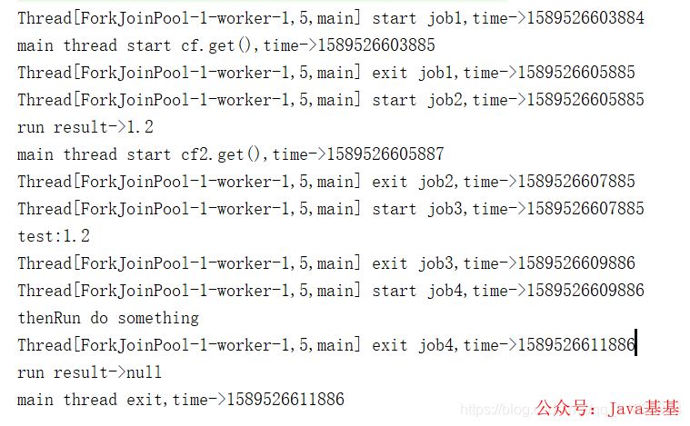

### 4、 exceptionally

```java
public CompletionStage<T> exceptionally(Function<Throwable, ? extends T> fn);
```

**功能:** 当运行出现异常时, 调用该方法可进行一些补偿操作, 如设置默认值.

　**场景:** 异步执行任务 A 获取结果, 如果任务 A 执行过程中抛出异常, 则使用默认值 100 返回.


```java
CompletableFuture<String> futureA = CompletableFuture.
                supplyAsync(() -> "执行结果:" + (100 / 0))
                .thenApply(s -> "futureA result:" + s)
                .exceptionally(e -> {
                    System.out.println(e.getMessage()); //java.lang.ArithmeticException: / by zero
                    return "futureA result: 100";
                });
CompletableFuture<String> futureB = CompletableFuture.
                supplyAsync(() -> "执行结果:" + 50)
                .thenApply(s -> "futureB result:" + s)
                .exceptionally(e -> "futureB result: 100");
System.out.println(futureA.join());//futureA result: 100
System.out.println(futureB.join());//futureB result:执行结果:50
```

　上面代码展示了正常流程和出现异常的情况, 可以理解成 catch, 根据返回值可以体会下.


exceptionally 方法指定某个任务执行异常时执行的回调方法，会将抛出异常作为参数传递到回调方法中，如果该任务正常执行则会 exceptionally 方法返回的 CompletionStage 的 result 就是该任务正常执行的结果，测试用例如下：

```java
@Test
public void test2() throws Exception {
    ForkJoinPool pool=new ForkJoinPool();
    // 创建异步执行任务:
    CompletableFuture<Double> cf = CompletableFuture.supplyAsync(()->{
        System.out.println(Thread.currentThread()+"job1 start,time->"+System.currentTimeMillis());
        try {
            Thread.sleep(2000);
        } catch (InterruptedException e) {
        }
        if(true){
            throw new RuntimeException("test");
        }else{
            System.out.println(Thread.currentThread()+"job1 exit,time->"+System.currentTimeMillis());
            return 1.2;
        }
    },pool);
    //cf执行异常时，将抛出的异常作为入参传递给回调方法
    CompletableFuture<Double> cf2= cf.exceptionally((param)->{
         System.out.println(Thread.currentThread()+" start,time->"+System.currentTimeMillis());
        try {
            Thread.sleep(2000);
        } catch (InterruptedException e) {
        }
        System.out.println("error stack trace->");
        param.printStackTrace();
        System.out.println(Thread.currentThread()+" exit,time->"+System.currentTimeMillis());
         return -1.1;
    });
    //cf正常执行时执行的逻辑，如果执行异常则不调用此逻辑
    CompletableFuture cf3=cf.thenAccept((param)->{
        System.out.println(Thread.currentThread()+"job2 start,time->"+System.currentTimeMillis());
        try {
            Thread.sleep(2000);
        } catch (InterruptedException e) {
        }
        System.out.println("param->"+param);
        System.out.println(Thread.currentThread()+"job2 exit,time->"+System.currentTimeMillis());
    });
    System.out.println("main thread start,time->"+System.currentTimeMillis());
    //等待子任务执行完成,此处无论是job2和job3都可以实现job2退出，主线程才退出，如果是cf，则主线程不会等待job2执行完成自动退出了
    //cf2.get时，没有异常，但是依然有返回值，就是cf的返回值
    System.out.println("run result->"+cf2.get());
    System.out.println("main thread exit,time->"+System.currentTimeMillis());
}
```

其输出如下：

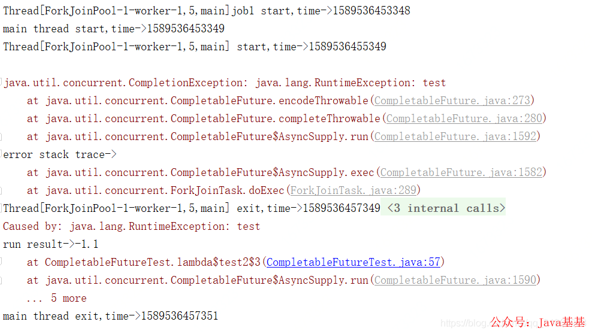

抛出异常后，只有 cf2 执行了，cf3 没有执行。将上述示例中的 if(true) 改成 if(false)，其输出如下：

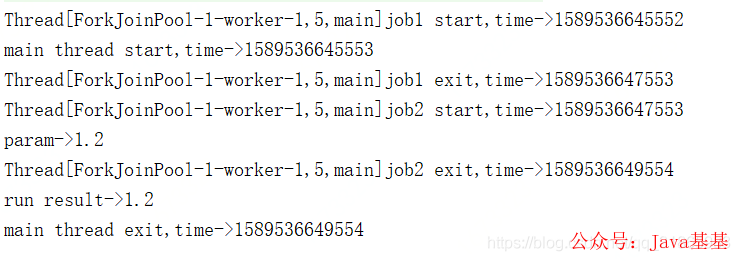

cf2 没有指定，其 result 就是 cf 执行的结果，理论上 cf2.get 应该立即返回的，此处是等待了 cf3，即 job2 执行完成后才返回，具体原因且待下篇源码分析时再做探讨。

### 5、whenComplete

```java
public CompletionStage<T> whenComplete(BiConsumer<? super T, ? super Throwable> action);

public CompletionStage<T> whenCompleteAsync(BiConsumer<? super T, ? super Throwable> action);

public CompletionStage<T> whenCompleteAsync(BiConsumer<? super T, ? super Throwable> action,Executor executor);
```

功能:**当CompletableFuture的计算结果完成，或者抛出异常的时候，都可以进入whenComplete方法执行**,举个栗子

```java
CompletableFuture<String> futureA = CompletableFuture.
                supplyAsync(() -> "执行结果:" + (100 / 0))
                .thenApply(s -> "apply result:" + s)
                .whenComplete((s, e) -> {
                    if (s != null) {
                        System.out.println(s);//未执行
                    }
                    if (e == null) {
                        System.out.println(s);//未执行
                    } else {
                        System.out.println(e.getMessage());//java.lang.ArithmeticException: / by zero
                    }
                })
                .exceptionally(e -> {
                    System.out.println("ex"+e.getMessage()); //ex:java.lang.ArithmeticException: / by zero
　　　　　　　　　　　  return "futureA result: 100"; }); 
System.out.println(futureA.join());//futureA result: 100
```

　　根据控制台,我们可以看出执行流程是这样,supplyAsync->whenComplete->exceptionally,可以看出并没有进入thenApply执行,原因也显而易见,在supplyAsync中出现了异常,thenApply只有当正常返回时才会去执行.而whenComplete不管是否正常执行,还要注意一点,whenComplete是没有返回值的.

　　上面代码我们使用了函数式的编程风格并且先调用whenComplete再调用exceptionally,如果我们先调用exceptionally,再调用whenComplete会发生什么呢,我们看一下:

```java
CompletableFuture<String> futureA = CompletableFuture.
                supplyAsync(() -> "执行结果:" + (100 / 0))
                .thenApply(s -> "apply result:" + s)
                .exceptionally(e -> {
                    System.out.println("ex:"+e.getMessage()); //ex:java.lang.ArithmeticException: / by zero
                    return "futureA result: 100";
                })
                .whenComplete((s, e) -> {
                    if (e == null) {
                        System.out.println(s);//futureA result: 100
                    } else {
                        System.out.println(e.getMessage());//未执行
                    }
                })
                ;
System.out.println(futureA.join());//futureA result: 100
```

代码先执行了**exceptionally后执行whenComplete**,可以发现,由于在exceptionally中对异常进行了处理,并返回了默认值,whenComplete中接收到的结果是一个正常的结果,被exceptionally美化过的结果,这一点需要留意一下.


whenComplete 是当某个任务执行完成后执行的回调方法，会将执行结果或者执行期间抛出的异常传递给回调方法，如果是正常执行则异常为 null，回调方法对应的 CompletableFuture 的 result 和该任务一致，如果该任务正常执行，则 get 方法返回执行结果，如果是执行异常，则 get 方法抛出异常。测试用例如下：

```java
@Test
public void test10() throws Exception {
    // 创建异步执行任务:
    CompletableFuture<Double> cf = CompletableFuture.supplyAsync(()->{
        System.out.println(Thread.currentThread()+"job1 start,time->"+System.currentTimeMillis());
        try {
            Thread.sleep(2000);
        } catch (InterruptedException e) {
        }
        if(false){
            throw new RuntimeException("test");
        }else{
            System.out.println(Thread.currentThread()+"job1 exit,time->"+System.currentTimeMillis());
            return 1.2;
        }
    });
    //cf执行完成后会将执行结果和执行过程中抛出的异常传入回调方法，如果是正常执行的则传入的异常为null
    CompletableFuture<Double> cf2=cf.whenComplete((a,b)->{
        System.out.println(Thread.currentThread()+"job2 start,time->"+System.currentTimeMillis());
        try {
            Thread.sleep(2000);
        } catch (InterruptedException e) {
        }
        if(b!=null){
            System.out.println("error stack trace->");
            b.printStackTrace();
        }else{
            System.out.println("run succ,result->"+a);
        }
        System.out.println(Thread.currentThread()+"job2 exit,time->"+System.currentTimeMillis());
    });
    //等待子任务执行完成
    System.out.println("main thread start wait,time->"+System.currentTimeMillis());
    //如果cf是正常执行的，cf2.get的结果就是cf执行的结果
    //如果cf是执行异常，则cf2.get会抛出异常
    System.out.println("run result->"+cf2.get());
    System.out.println("main thread exit,time->"+System.currentTimeMillis());
}
```

执行结果如下：

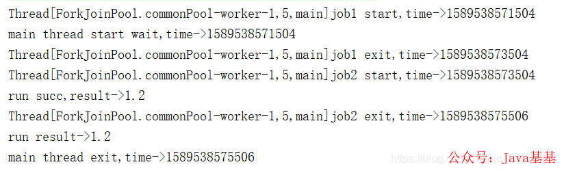

将上述示例中的 if(false) 改成 if(true)，其输出如下：

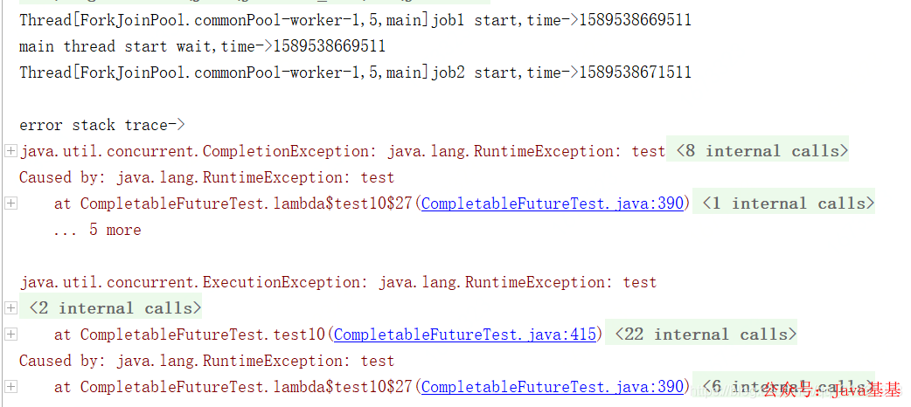

### 6、handle

```java
public <U> CompletionStage<U> handle(BiFunction<? super T, Throwable, ? extends U> fn);
public <U> CompletionStage<U> handleAsync(BiFunction<? super T, Throwable, ? extends U> fn);
public <U> CompletionStage<U> handleAsync(BiFunction<? super T, Throwable, ? extends U> fn,Executor executor);
```

　　功能: 当 CompletableFuture 的计算结果完成，或者抛出异常的时候，可以通过 handle 方法对结果进行处理; handle 有返回值, whenComplete 没有返回值

```java
CompletableFuture<String> futureA = CompletableFuture.
                supplyAsync(() -> "执行结果:" + (100 / 0))
                .thenApply(s -> "apply result:" + s)
                .exceptionally(e -> {
                    System.out.println("ex:" + e.getMessage()); //java.lang.ArithmeticException: / by zero
                    return "futureA result: 100";
                })
                .handle((s, e) -> {
                    if (e == null) {
                        System.out.println(s);//futureA result: 100
                    } else {
                        System.out.println(e.getMessage());//未执行
                    }
                    return "handle result:" + (s == null ? "500" : s);
                });
System.out.println(futureA.join());//handle result:futureA result: 100
```

　　通过控制台, 我们可以看出, 最后打印的是 handle result:futureA result: 100, 执行 exceptionally 后对异常进行了 "美化", 返回了默认值, 那么 handle 得到的就是一个正常的返回, 我们再试下, 先调用 handle 再调用 exceptionally 的情况.


```java
CompletableFuture<String> futureA = CompletableFuture.
                supplyAsync(() -> "执行结果:" + (100 / 0))
                .thenApply(s -> "apply result:" + s)
                .handle((s, e) -> {
                    if (e == null) {
                        System.out.println(s);//未执行
                    } else {
                        System.out.println(e.getMessage());//java.lang.ArithmeticException: / by zero
                    }
                    return "handle result:" + (s == null ? "500" : s);
                })
                .exceptionally(e -> {
                    System.out.println("ex:" + e.getMessage()); //未执行
                    return "futureA result: 100";
                });
System.out.println(futureA.join());//handle result:500
```


　　根据控制台输出, 可以看到先执行 handle, 打印了异常信息, 并对接过设置了默认值 500,exceptionally 并没有执行, 因为它得到的是 handle 返回给它的值, 由此我们大概推测 handle 和 whenComplete 的区别

   　　　1. 都是对结果进行处理, handle 有返回值, whenComplete 没有返回值

   　　　2. 由于 1 的存在, 使得 handle 多了一个特性, 可在 handle 里实现 exceptionally 的功能


跟 whenComplete 基本一致，区别在于 handle 的回调方法有返回值，且 handle 方法返回的 CompletableFuture 的 result 是回调方法的执行结果或者回调方法执行期间抛出的异常，与原始 CompletableFuture 的 result 无关了。测试用例如下：

```java
@Test
public void test10() throws Exception {
    // 创建异步执行任务:
    CompletableFuture<Double> cf = CompletableFuture.supplyAsync(()->{
        System.out.println(Thread.currentThread()+"job1 start,time->"+System.currentTimeMillis());
        try {
            Thread.sleep(2000);
        } catch (InterruptedException e) {
        }
        if(true){
            throw new RuntimeException("test");
        }else{
            System.out.println(Thread.currentThread()+"job1 exit,time->"+System.currentTimeMillis());
            return 1.2;
        }
    });
    //cf执行完成后会将执行结果和执行过程中抛出的异常传入回调方法，如果是正常执行的则传入的异常为null
    CompletableFuture<String> cf2=cf.handle((a,b)->{
        System.out.println(Thread.currentThread()+"job2 start,time->"+System.currentTimeMillis());
        try {
            Thread.sleep(2000);
        } catch (InterruptedException e) {
        }
        if(b!=null){
            System.out.println("error stack trace->");
            b.printStackTrace();
        }else{
            System.out.println("run succ,result->"+a);
        }
        System.out.println(Thread.currentThread()+"job2 exit,time->"+System.currentTimeMillis());
        if(b!=null){
            return "run error";
        }else{
            return "run succ";
        }
    });
    //等待子任务执行完成
    System.out.println("main thread start wait,time->"+System.currentTimeMillis());
    //get的结果是cf2的返回值，跟cf没关系了
    System.out.println("run result->"+cf2.get());
    System.out.println("main thread exit,time->"+System.currentTimeMillis());
}
```

其执行结果如下：

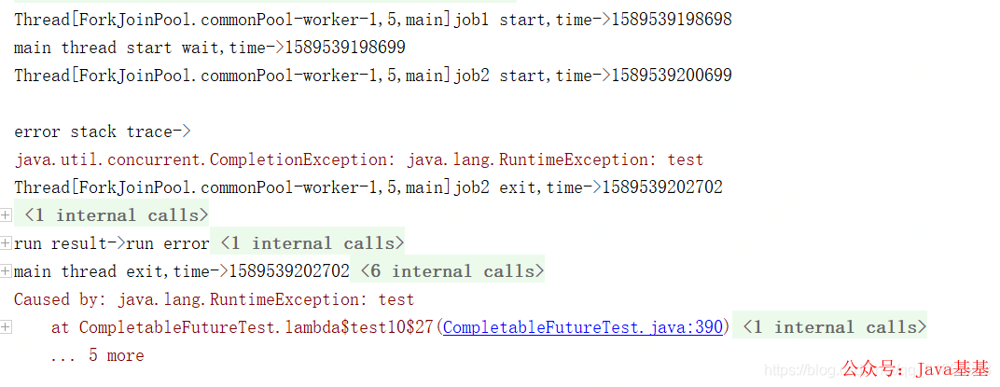

将上述示例中的 if(true) 改成 if(false)，其输出如下：

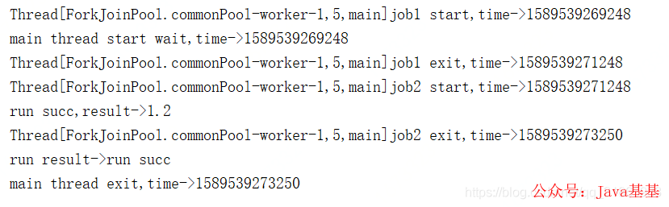


三、组合处理
---------------------------------------------------------------------------------------------------------------------------------------------

### 1、thenCombine / thenAcceptBoth / runAfterBoth

```java
public <U,V> CompletableFuture<V>     thenCombine(CompletionStage<? extends U> other, BiFunction<? super T,? super U,? extends V> fn)
public <U,V> CompletableFuture<V>     thenCombineAsync(CompletionStage<? extends U> other, BiFunction<? super T,? super U,? extends V> fn)
public <U,V> CompletableFuture<V>     thenCombineAsync(CompletionStage<? extends U> other, BiFunction<? super T,? super U,? extends V> fn, Executor executor)
```

　　功能: 结合两个 CompletionStage 的结果，进行转化后返回

　　场景: 需要根据商品 id 查询商品的当前价格, 分两步, 查询商品的原始价格和折扣, 这两个查询相互独立, 当都查出来的时候用原始价格乘折扣, 算出当前价格. 使用方法: thenCombine(..)

```java
CompletableFuture<Double> futurePrice = CompletableFuture.supplyAsync(() -> 100d);
 CompletableFuture<Double> futureDiscount = CompletableFuture.supplyAsync(() -> 0.8);
 CompletableFuture<Double> futureResult = futurePrice.thenCombine(futureDiscount, (price, discount) -> price * discount);
 System.out.println("最终价格为:" + futureResult.join()); //最终价格为:80.0
```

　　thenCombine(..) 是结合两个任务的返回值进行转化后再返回, 那如果不需要返回呢, 那就需要 **thenAcceptBoth**(..), 同理, 如果连两个任务的返回值也不关心呢, 那就需要 runAfterBoth 了, 如果理解了上面三个方法, thenApply,thenAccept,thenRun, 这里就不需要单独再提这两个方法了, 只在这里提一下.


这三个方法都是将两个 CompletableFuture 组合起来，只有这两个都正常执行完了才会执行某个任务，区别在于，thenCombine 会将两个任务的执行结果作为方法入参传递到指定方法中，且该方法有返回值；

thenAcceptBoth 同样将两个任务的执行结果作为方法入参，但是无返回值；runAfterBoth 没有入参，也没有返回值。注意两个任务中只要有一个执行异常，则将该异常信息作为指定任务的执行结果。测试用例如下：

```java
@Test
public void test7() throws Exception {
    ForkJoinPool pool=new ForkJoinPool();
    // 创建异步执行任务:
    CompletableFuture<Double> cf = CompletableFuture.supplyAsync(()->{
        System.out.println(Thread.currentThread()+" start job1,time->"+System.currentTimeMillis());
        try {
            Thread.sleep(2000);
        } catch (InterruptedException e) {
        }
        System.out.println(Thread.currentThread()+" exit job1,time->"+System.currentTimeMillis());
        return 1.2;
    });
    CompletableFuture<Double> cf2 = CompletableFuture.supplyAsync(()->{
        System.out.println(Thread.currentThread()+" start job2,time->"+System.currentTimeMillis());
        try {
            Thread.sleep(1500);
        } catch (InterruptedException e) {
        }
        System.out.println(Thread.currentThread()+" exit job2,time->"+System.currentTimeMillis());
        return 3.2;
    });
    //cf和cf2的异步任务都执行完成后，会将其执行结果作为方法入参传递给cf3,且有返回值
    CompletableFuture<Double> cf3=cf.thenCombine(cf2,(a,b)->{
        System.out.println(Thread.currentThread()+" start job3,time->"+System.currentTimeMillis());
        System.out.println("job3 param a->"+a+",b->"+b);
        try {
            Thread.sleep(2000);
        } catch (InterruptedException e) {
        }
        System.out.println(Thread.currentThread()+" exit job3,time->"+System.currentTimeMillis());
        return a+b;
    });

    //cf和cf2的异步任务都执行完成后，会将其执行结果作为方法入参传递给cf3,无返回值
    CompletableFuture cf4=cf.thenAcceptBoth(cf2,(a,b)->{
        System.out.println(Thread.currentThread()+" start job4,time->"+System.currentTimeMillis());
        System.out.println("job4 param a->"+a+",b->"+b);
        try {
            Thread.sleep(1500);
        } catch (InterruptedException e) {
        }
        System.out.println(Thread.currentThread()+" exit job4,time->"+System.currentTimeMillis());
    });

    //cf4和cf3都执行完成后，执行cf5，无入参，无返回值
    CompletableFuture cf5=cf4.runAfterBoth(cf3,()->{
        System.out.println(Thread.currentThread()+" start job5,time->"+System.currentTimeMillis());
        try {
            Thread.sleep(1000);
        } catch (InterruptedException e) {
        }
        System.out.println("cf5 do something");
        System.out.println(Thread.currentThread()+" exit job5,time->"+System.currentTimeMillis());
    });

    System.out.println("main thread start cf.get(),time->"+System.currentTimeMillis());
    //等待子任务执行完成
    System.out.println("cf run result->"+cf.get());
    System.out.println("main thread start cf5.get(),time->"+System.currentTimeMillis());
    System.out.println("cf5 run result->"+cf5.get());
    System.out.println("main thread exit,time->"+System.currentTimeMillis());
}
```

其运行结果如下：

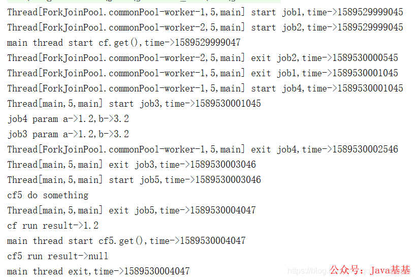

job1 和 job2 几乎同时运行，job2 比 job1 先执行完成，等 job1 退出后，job3 和 job4 几乎同时开始运行，job4 先退出，等 job3 执行完成，job5 开始了，等 job5 执行完成后，主线程退出。

### 2、applyToEither / acceptEither / runAfterEither

```java
public <U> CompletionStage<U> applyToEither(CompletionStage<? extends T> other,Function<? super T, U> fn);
public <U> CompletionStage<U> applyToEitherAsync(CompletionStage<? extends T> other,Function<? super T, U> fn);
public <U> CompletionStage<U> applyToEitherAsync(CompletionStage<? extends T> other,Function<? super T, U> fn,Executor executor);
```

　　功能: 执行两个 CompletionStage 的结果, 那个先执行完了, 就是用哪个的返回值进行下一步操作  
　　场景: 假设查询商品 a, 有两种方式, A 和 B, 但是 A 和 B 的执行速度不一样, 我们希望哪个先返回就用那个的返回值.

```java
CompletableFuture<String> futureA = CompletableFuture.supplyAsync(() -> {
            try {
                Thread.sleep(1000);
            } catch (InterruptedException e) {
                e.printStackTrace();
            }
            return "通过方式A获取商品a";
        });
CompletableFuture<String> futureB = CompletableFuture.supplyAsync(() -> {
            try {
                Thread.sleep(2000);
            } catch (InterruptedException e) {
                e.printStackTrace();
            }
            return "通过方式B获取商品a";
        });
CompletableFuture<String> futureC = futureA.applyToEither(futureB, product -> "结果:" + product);
System.out.println(futureC.join()); //结果:通过方式A获取商品a
```

　　同样的道理, applyToEither 的兄弟方法还有 acceptEither(),runAfterEither(), 我想不需要我解释你也知道该怎么用了.


这三个方法都是将两个 CompletableFuture 组合起来，只要其中一个执行完了就会执行某个任务，其区别在于 applyToEither 会将已经执行完成的任务的执行结果作为方法入参，并有返回值；

acceptEither 同样将已经执行完成的任务的执行结果作为方法入参，但是没有返回值；

runAfterEither 没有方法入参，也没有返回值。注意两个任务中只要有一个执行异常，则将该异常信息作为指定任务的执行结果。测试用例如下：

```java
@Test
public void test8() throws Exception {
    // 创建异步执行任务:
    CompletableFuture<Double> cf = CompletableFuture.supplyAsync(()->{
        System.out.println(Thread.currentThread()+" start job1,time->"+System.currentTimeMillis());
        try {
            Thread.sleep(2000);
        } catch (InterruptedException e) {
        }
        System.out.println(Thread.currentThread()+" exit job1,time->"+System.currentTimeMillis());
        return 1.2;
    });
    CompletableFuture<Double> cf2 = CompletableFuture.supplyAsync(()->{
        System.out.println(Thread.currentThread()+" start job2,time->"+System.currentTimeMillis());
        try {
            Thread.sleep(1500);
        } catch (InterruptedException e) {
        }
        System.out.println(Thread.currentThread()+" exit job2,time->"+System.currentTimeMillis());
        return 3.2;
    });
    //cf和cf2的异步任务都执行完成后，会将其执行结果作为方法入参传递给cf3,且有返回值
    CompletableFuture<Double> cf3=cf.applyToEither(cf2,(result)->{
        System.out.println(Thread.currentThread()+" start job3,time->"+System.currentTimeMillis());
        System.out.println("job3 param result->"+result);
        try {
            Thread.sleep(2000);
        } catch (InterruptedException e) {
        }
        System.out.println(Thread.currentThread()+" exit job3,time->"+System.currentTimeMillis());
        return result;
    });

    //cf和cf2的异步任务都执行完成后，会将其执行结果作为方法入参传递给cf3,无返回值
    CompletableFuture cf4=cf.acceptEither(cf2,(result)->{
        System.out.println(Thread.currentThread()+" start job4,time->"+System.currentTimeMillis());
        System.out.println("job4 param result->"+result);
        try {
            Thread.sleep(1500);
        } catch (InterruptedException e) {
        }
        System.out.println(Thread.currentThread()+" exit job4,time->"+System.currentTimeMillis());
    });

    //cf4和cf3都执行完成后，执行cf5，无入参，无返回值
    CompletableFuture cf5=cf4.runAfterEither(cf3,()->{
        System.out.println(Thread.currentThread()+" start job5,time->"+System.currentTimeMillis());
        try {
            Thread.sleep(1000);
        } catch (InterruptedException e) {
        }
        System.out.println("cf5 do something");
        System.out.println(Thread.currentThread()+" exit job5,time->"+System.currentTimeMillis());
    });

    System.out.println("main thread start cf.get(),time->"+System.currentTimeMillis());
    //等待子任务执行完成
    System.out.println("cf run result->"+cf.get());
    System.out.println("main thread start cf5.get(),time->"+System.currentTimeMillis());
    System.out.println("cf5 run result->"+cf5.get());
    System.out.println("main thread exit,time->"+System.currentTimeMillis());
}
```

其运行结果如下：

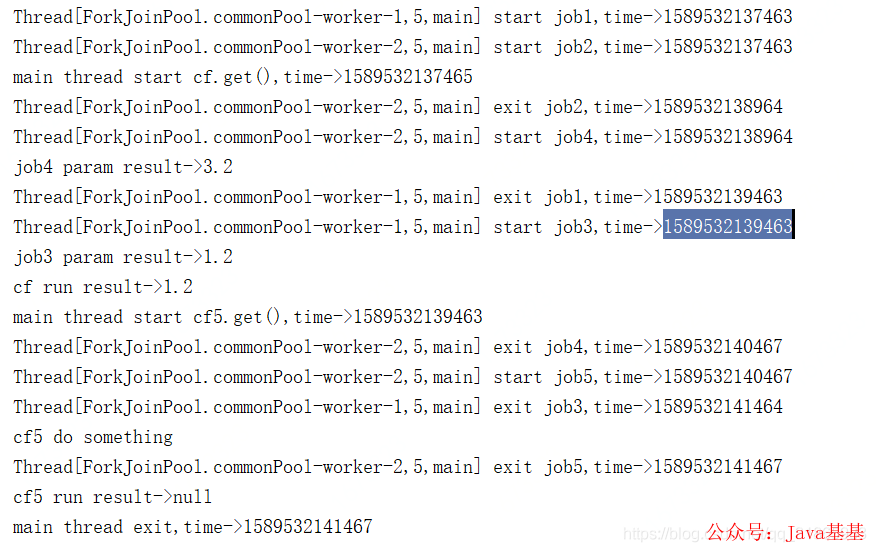

job1 和 job2 同时开始运行，job2 先执行完成，然后 job4 开始执行，理论上 job3 和 job4 应该同时开始运行，但是此时只有 job4 开始执行了，job3 是等待 job1 执行完成后才开始执行，job4 先于 job3 执行完成，然后 job5 开始执行，等 job5 执行完成后，主线程退出。上述差异且到下篇源码分析时再做探讨。

### 3、thenCompose

```java
public <U> CompletableFuture<U>     thenCompose(Function<? super T,? extends CompletionStage<U>> fn)
public <U> CompletableFuture<U>     thenComposeAsync(Function<? super T,? extends CompletionStage<U>> fn)
public <U> CompletableFuture<U>     thenComposeAsync(Function<? super T,? extends CompletionStage<U>> fn, Executor executor)
```

　　功能: 这个方法接收的输入是当前的 CompletableFuture 的计算值，返回结果将是一个新的 CompletableFuture

　　这个方法和 thenApply 非常像, 都是接受上一个任务的结果作为入参, 执行自己的操作, 然后返回. 那具体有什么区别呢?

　　thenApply(): 它的功能相当于将 `CompletableFuture<T>` 转换成 `CompletableFuture<U>`, 改变的是同一个 CompletableFuture 中的泛型类型

thenCompose(): 用来连接两个 CompletableFuture，返回值是一个新的 CompletableFuture


```java
CompletableFuture<String> futureA = CompletableFuture.supplyAsync(() -> "hello");

CompletableFuture<String> futureB = futureA.thenCompose(s -> CompletableFuture.supplyAsync(() -> s + "world"));

CompletableFuture<String> future3 = futureB.thenCompose(s -> CompletableFuture.supplyAsync(s::toUpperCase));

System.out.println(future3.join());
```


　　这段代码实现的和上面 thenApply 一样的效果, 在实际使用中, 我并没有很清楚两个在使用上的区别, 如果有大佬, 跪求告知.


thenCompose 方法会在某个任务执行完成后，将该任务的执行结果作为方法入参然后执行指定的方法，该方法会返回一个新的 CompletableFuture 实例，如果该 CompletableFuture 实例的 result 不为 null，则返回一个基于该 result 的新的 CompletableFuture 实例；如果该 CompletableFuture 实例为 null，则，然后执行这个新任务，测试用例如下：

```java
@Test
public void test9() throws Exception {
    // 创建异步执行任务:
    CompletableFuture<Double> cf = CompletableFuture.supplyAsync(()->{
        System.out.println(Thread.currentThread()+" start job1,time->"+System.currentTimeMillis());
        try {
            Thread.sleep(2000);
        } catch (InterruptedException e) {
        }
        System.out.println(Thread.currentThread()+" exit job1,time->"+System.currentTimeMillis());
        return 1.2;
    });
    CompletableFuture<String> cf2= cf.thenCompose((param)->{
        System.out.println(Thread.currentThread()+" start job2,time->"+System.currentTimeMillis());
        try {
            Thread.sleep(2000);
        } catch (InterruptedException e) {
        }
        System.out.println(Thread.currentThread()+" exit job2,time->"+System.currentTimeMillis());
        return CompletableFuture.supplyAsync(()->{
            System.out.println(Thread.currentThread()+" start job3,time->"+System.currentTimeMillis());
            try {
                Thread.sleep(2000);
            } catch (InterruptedException e) {
            }
            System.out.println(Thread.currentThread()+" exit job3,time->"+System.currentTimeMillis());
            return "job3 test";
        });
    });
    System.out.println("main thread start cf.get(),time->"+System.currentTimeMillis());
    //等待子任务执行完成
    System.out.println("cf run result->"+cf.get());
    System.out.println("main thread start cf2.get(),time->"+System.currentTimeMillis());
    System.out.println("cf2 run result->"+cf2.get());
    System.out.println("main thread exit,time->"+System.currentTimeMillis());
}
```

其输出如下：

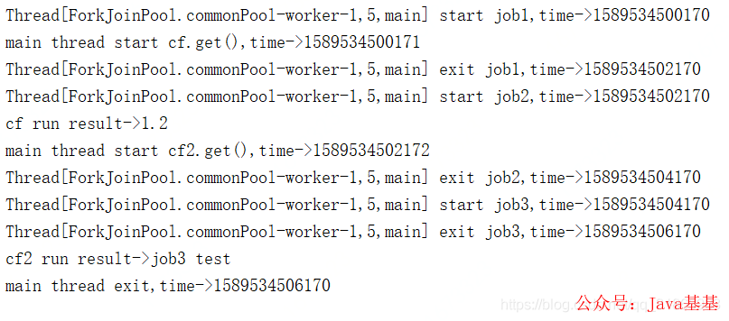

job1 执行完成后 job2 开始执行，等 job2 执行完成后会把 job3 返回，然后执行 job3，等 job3 执行完成后，主线程退出。

### 4、allOf / anyOf

```java
public static CompletableFuture<Void>  allOf(CompletableFuture<?>... cfs)
public static CompletableFuture<Object>  anyOf(CompletableFuture<?>... cfs)
```

　　allOf: 当所有的`CompletableFuture`都执行完后执行计算

　　anyOf: 最快的那个 CompletableFuture 执行完之后执行计算

　　场景二: 查询一个商品详情, 需要分别去查商品信息, 卖家信息, 库存信息, 订单信息等, 这些查询相互独立, 在不同的服务上, 假设每个查询都需要一到两秒钟, 要求总体查询时间小于 2 秒.


```java
public static void main(String[] args) throws Exception {

        ExecutorService executorService = Executors.newFixedThreadPool(4);

        long start = System.currentTimeMillis();
        CompletableFuture<String> futureA = CompletableFuture.supplyAsync(() -> {
            try {
                Thread.sleep(1000 + RandomUtils.nextInt(1000));
            } catch (InterruptedException e) {
                e.printStackTrace();
            }
            return "商品详情";
        },executorService);

        CompletableFuture<String> futureB = CompletableFuture.supplyAsync(() -> {
            try {
                Thread.sleep(1000 + RandomUtils.nextInt(1000));
            } catch (InterruptedException e) {
                e.printStackTrace();
            }
            return "卖家信息";
        },executorService);

        CompletableFuture<String> futureC = CompletableFuture.supplyAsync(() -> {
            try {
                Thread.sleep(1000 + RandomUtils.nextInt(1000));
            } catch (InterruptedException e) {
                e.printStackTrace();
            }
            return "库存信息";
        },executorService);

        CompletableFuture<String> futureD = CompletableFuture.supplyAsync(() -> {
            try {
                Thread.sleep(1000 + RandomUtils.nextInt(1000));
            } catch (InterruptedException e) {
                e.printStackTrace();
            }
            return "订单信息";
        },executorService);

        CompletableFuture<Void> allFuture = CompletableFuture.allOf(futureA, futureB, futureC, futureD);
        allFuture.join();

        System.out.println(futureA.join() + futureB.join() + futureC.join() + futureD.join());
        System.out.println("总耗时:" + (System.currentTimeMillis() - start));
    }
```


---

allOf 返回的 CompletableFuture 是多个任务都执行完成后才会执行，只有有一个任务执行异常，则返回的 CompletableFuture 执行 get 方法时会抛出异常，如果都是正常执行，则 get 返回 null。

```java
@Test
public void test11() throws Exception {
    // 创建异步执行任务:
    CompletableFuture<Double> cf = CompletableFuture.supplyAsync(()->{
        System.out.println(Thread.currentThread()+" start job1,time->"+System.currentTimeMillis());
        try {
            Thread.sleep(2000);
        } catch (InterruptedException e) {
        }
        System.out.println(Thread.currentThread()+" exit job1,time->"+System.currentTimeMillis());
        return 1.2;
    });
    CompletableFuture<Double> cf2 = CompletableFuture.supplyAsync(()->{
        System.out.println(Thread.currentThread()+" start job2,time->"+System.currentTimeMillis());
        try {
            Thread.sleep(1500);
        } catch (InterruptedException e) {
        }
        System.out.println(Thread.currentThread()+" exit job2,time->"+System.currentTimeMillis());
        return 3.2;
    });
    CompletableFuture<Double> cf3 = CompletableFuture.supplyAsync(()->{
        System.out.println(Thread.currentThread()+" start job3,time->"+System.currentTimeMillis());
        try {
            Thread.sleep(1300);
        } catch (InterruptedException e) {
        }
          throw new RuntimeException("test");
        System.out.println(Thread.currentThread()+" exit job3,time->"+System.currentTimeMillis());
        return 2.2;
    });
    //allof等待所有任务执行完成才执行cf4，如果有一个任务异常终止，则cf4.get时会抛出异常，都是正常执行，cf4.get返回null
    //anyOf是只有一个任务执行完成，无论是正常执行或者执行异常，都会执行cf4，cf4.get的结果就是已执行完成的任务的执行结果
    CompletableFuture cf4=CompletableFuture.allOf(cf,cf2,cf3).whenComplete((a,b)->{
       if(b!=null){
           System.out.println("error stack trace->");
           b.printStackTrace();
       }else{
           System.out.println("run succ,result->"+a);
       }
    });

    System.out.println("main thread start cf4.get(),time->"+System.currentTimeMillis());
    //等待子任务执行完成
    System.out.println("cf4 run result->"+cf4.get());
    System.out.println("main thread exit,time->"+System.currentTimeMillis());
}
```

其输出如下：

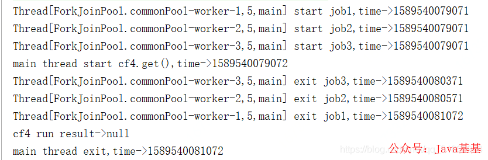

主线程等待最后一个 job1 执行完成后退出。anyOf 返回的 CompletableFuture 是多个任务只要其中一个执行完成就会执行，其 get 返回的是已经执行完成的任务的执行结果，如果该任务执行异常，则抛出异常。将上述测试用例中 allOf 改成 anyOf 后，其输出如下：

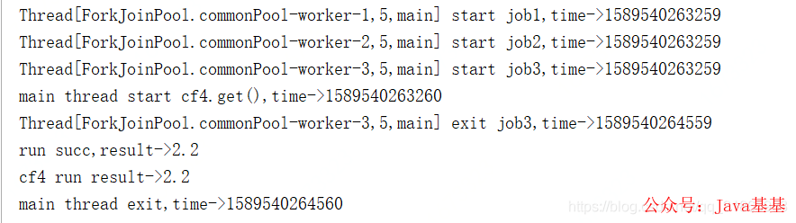

* * *


## 参考资料:

　　[https://colobu.com/2016/02/29/Java-CompletableFuture/#Either](https://colobu.com/2016/02/29/Java-CompletableFuture/#Either)

　　[https://blog.csdn.net/qq_36597450/article/details/81232051](https://blog.csdn.net/qq_36597450/article/details/81232051)

​	https://www.cnblogs.com/fingerboy/p/9948736.html
