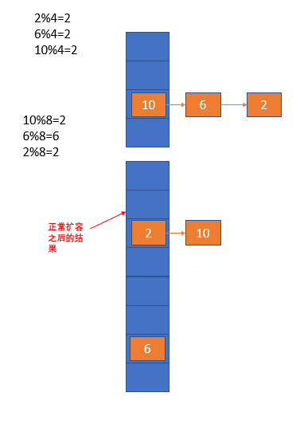
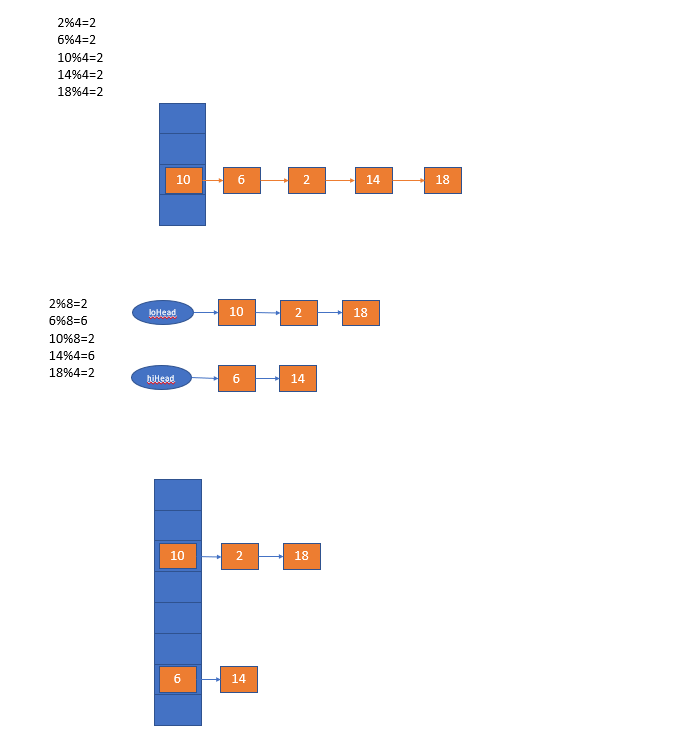
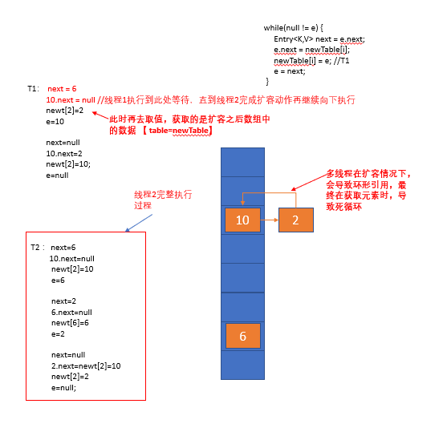

# 基础知识

## 位运算

```
位 与：都为1，才为1

	10&5
	
	00000000000000000000000000001010
&	00000000000000000000000000000101
---------------------------------------------
	00000000000000000000000000000000


位 或：只要有个一个为1，就为1

	10|5
	00000000000000000000000000001010
|	00000000000000000000000000000101
---------------------------------------------	
	00000000000000000000000000001111  === 15

位 异或：两个数不一样，才为1

	10^5
	00000000000000000000000000001010
^	00000000000000000000000000000101
--------------------------------------------
	00000000000000000000000000001111  === 15
```

## 哈希值


	哈希值
		通过一定的散列算法，把一个不固定长度的输入，转成一个固定长度的输出，输出的结果我们称之为哈希
		map中，hash就是一个int值
		
	哈希表：存储哈希值的数组 -- 存取散列值（哈希值）的一个容器
		哈希值到底该如何存，该如何取呢？？？ -- 通过数组的角标实现数据的存取
		
		需要有一个映射：不同的hash值存在对应角标位
			hash值 ----运算---》 index
	
	哈希函数：将哈希值通过某种运算规则得到对应index

## hash冲突

两个元素通过哈希函数运算后，得到的**地址相同**的现象叫做 —— **hash冲突**

解决 hash 冲突的常见方法有：

- **重哈希（再哈希法）**
- **开放地址法**
- **溢出区**
- **链地址法（拉链法）**


1. **重哈希（Rehashing）**
   当发生冲突时，使用另一个哈希函数计算新的地址，直到没有冲突为止。
   缺点：需要设计多个哈希函数，增加计算量。
2. **开放地址法（Open Addressing）**
   当发生冲突时，根据某种探查序列寻找下一个空闲位置。
   - 线性探测（+1 逐步探测）
   - 二次探测（平方序列探测）
   - 双重散列（使用第二个哈希函数确定步长）
3. **溢出区（Overflow Area）**
   给哈希表单独开辟一个溢出区，用来存放所有发生冲突的元素。
   优点：简单；缺点：查询效率可能降低。
4. **链地址法（Chaining）**
   将同一个哈希地址上的元素组织成一个链表，冲突元素依次插入链表。
   优点：实现简单，冲突处理灵活；缺点：需要额外存储指针


## 面试点


> 为什么长度时2的幂次?
>
> 当一个整数与2 的一个指数（即`2^n`）进行取余运算时，可以使用位运算来提高效率。如果除数是2^n，那么取余运算就等同于用数字的低n 位来表示。具体来说，`x mod 2^n` 可以通过 `x & (2^n - 1)` 来计算，因为 `2^n - 1` 在二进制中表示为n 个 1
>

> 扩容优化点，每次扩容位原来的两倍，且长度始终为2的倍数，**数据迁移时，数据要么在原来位置，要么在原来位置+扩容长度**
> 				不需要重新hash--效率更好
>
> 具体放在那个hash槽，都是通过hash值对长度取余得到具体索引，其中取余利用除以2的幂次特性转换为 & n-1
>
> 头插法 ：链表逆序
>
> 尾插法：数据丢失

```
如何让存取效率是最高的？？？ -- 如果元素都是均匀存储在数据的角标位，而不产生冲突，就是最好的
	
	① 尽可能少的产生hash冲突
		hash函数计算出来的角标要尽可以能均匀
			static int indexFor(int h, int length) {
				return h & (length-1); //length是map中数组的长度   length为2的幂次，可以用位运算优化取余
			}
			
		length长度的规则是什么？？ -- 要求是2的幂次方数，为啥？？？
			
			假设长度是8 -1  === 7
			
				00000000000000000000000000000111  --- 长度8，参与hash运算是7
				00000000000000000000000000001111  --- 长度16，参与hash运算是15
				00000000000000000000000000011111  --- 长度32，参与hash运算是31
				
				00110011000111111001110111101111
			&	00000000000000000000000000001111
			--------------------------------------------
				00000000000000000000000000000000 -- 00000000000000000000000000001111
				【得到的值，正好是0-15的范围，该范围正好是长度为16的数组的角标】
				
				
		假设长度不是2的幂次方：
			奇数  -- 长度5
					00101001001001011111111111100111
				&	00000000000000000000000000000100   -- 长度5，参与hash运算是4
				------------------------------------------
					得到的结果永远是一个偶数，代表获取的角标永远是偶数，奇数位的角标永远会都没有值
					【数组的就浪费掉了一半】
			
			偶数  -- 长度6
					00101001001001011111111111100111
				&	00000000000000000000000000000101   -- 长度6，参与hash运算是5
				-------------------------------------------------
					第二位永远是0，导致2，3角标位都不可能有值
					【数组的就浪费掉了一半】
					
		2的幂次方，在扩容时，扩容后的数组长度是原数组长度的2倍，结果还是2的幂次方
		有啥好处？？？
			假设原来是8
				00000000000000000000000000000111  
			扩容后是16
				00000000000000000000000000001111
				
				
			在扩容时，数据要从原数组中迁移到新数组中
			
				00000000000000000000000000001101
				00000000000000000000000000000111 
				-------------------------------------
											 101  === 5 原数组的角标位
											 
				00000000000000000000000000001101
				00000000000000000000000000001111
				--------------------------------------
											1101  ==== 13（原角标位+扩容长度） 新数组的角标位
			
				【扩容后，数据迁移时，数据要么在原来位置，要么在原来位置+扩容长度
				不需要重新hash--效率更好】

Hashmap扩容：hash值对数组长度（2的幂次）取余计算索引位置
	扩容前：长度为b，hash % b = a；	即hash =  n * b + a
	扩容后：长度为2b：计算 (n * b + a ) % 2b 
		当n为偶数时  余数 = a，		索引 a
		当n为奇数时  余数 = a + b，	索引 a+b

结论：扩容2倍后的位置为如下两个位置
		当前位置 a  或者 a+b

源码如下：
if (loTail != null) {
	loTail.next = null;
	newTab[j] = loHead;
}
if (hiTail != null) {
	hiTail.next = null;
	newTab[j + oldCap] = hiHead;
}


	② 确实产生了hash冲突 -- 扩容+数据结构
		扩容
			什么时候扩容
				jdk1.7
					判断是否到达阈值（0.75*数组长度）
					同时是否产生hash冲突
					
					扩容后，再添加元素
				
				jdk1.8
					先添加元素
			
					判断是否达到阈值
				
			
			怎么扩容
				jdk1.7	
					添加元素使用头插法
					
					将单向链表的数据进行迁移
				
				jdk1.8
					添加元素使用尾插法
					
					如果对应角标位是单向链表，将单向链表进行数据迁移
					如果对应角标位是红黑树，将双向链表进行数据迁移
						如果发现迁移完数据后，双向链表的结构小于/等于6，会将红黑树重新转回单向链表的结构
					
			
			扩容后有什么问题（多线程环境）
				jdk1.7
					多线程环境下会形成环形链表,死循环cpu占用率高
					
				jdk1.8
					多线程环境下会有数据丢失的问题
		
		数据结构解决
			jdk1.7产生冲突后，会形成单向链表
			
			jdk1.8产生冲突后
				会形成单向链表
					如果单向链表的长度大于/等于8，会转成红黑树+双向链表（扩容时使用）
					
				
	
```


# HashMap源码分析

## 1、HashMap存取值的原理

### 1、存值分析：

#### jdk1.7存值分析

```java
public V put(K key, V value) {
    //HashMap允许存储null键，存储在数组的0索引位置
    if (key == null)
        return putForNullKey(value);
    //内部通过一个扰乱算法获得一个hash值，用于计算数组索引
    int hash = hash(key);
    //计算数组索引
    int i = indexFor(hash, table.length);
    //判断是否是重复键
    for (Entry<K,V> e = table[i]; e != null; e = e.next) {
        Object k;
        if (e.hash == hash && ((k = e.key) == key || key.equals(k))) {
            V oldValue = e.value;
            e.value = value;
            e.recordAccess(this);
            return oldValue;
        }
    }

    modCount++;
    //添加元素
    addEntry(hash, key, value, i);
    return null;
}
```

```java
void addEntry(int hash, K key, V value, int bucketIndex) {
    //元素个数大于阈值，同时当前索引位有值，就会执行扩容操作
    if ((size >= threshold) && (null != table[bucketIndex])) {
        //2倍扩容
        resize(2 * table.length);
        hash = (null != key) ? hash(key) : 0;
        //重新计算索引位置
        bucketIndex = indexFor(hash, table.length);
    }
	//基于键值创建Entry节点，并以头插法存入对应位置
    createEntry(hash, key, value, bucketIndex);
}
```

#### jdk1.8存值分析

```java
public V put(K key, V value) {
    //hash(key)计算hash值，用于计算索引
    return putVal(hash(key), key, value, false, true);
}
```

```java
final V putVal(int hash, K key, V value, boolean onlyIfAbsent,
               boolean evict) {
    Node<K,V>[] tab; Node<K,V> p; int n, i;
    //完成初始化容器
    if ((tab = table) == null || (n = tab.length) == 0)
        n = (tab = resize()).length;
    //得到的索引位没有元素，直接存入
    if ((p = tab[i = (n - 1) & hash]) == null)
        tab[i] = newNode(hash, key, value, null);
    else {
        //索引位有元素
        Node<K,V> e; K k;
        //重复键
        if (p.hash == hash &&
            ((k = p.key) == key || (key != null && key.equals(k))))
            e = p;
        //红黑树节点
        else if (p instanceof TreeNode)
            //入树
            e = ((TreeNode<K,V>)p).putTreeVal(this, tab, hash, key, value);
        else {
            //遍历链表依次比较键
            for (int binCount = 0; ; ++binCount) {
                //没有重复键
                if ((e = p.next) == null) {
                    //尾插法，添加元素，形成单向链表
                    p.next = newNode(hash, key, value, null);
                    //树化
                    if (binCount >= TREEIFY_THRESHOLD - 1) // -1 for 1st
                        treeifyBin(tab, hash);
                    break;
                }
                //有重复键
                if (e.hash == hash &&
                    ((k = e.key) == key || (key != null && key.equals(k))))
                    break;
                p = e;
            }
        }
        if (e != null) { // existing mapping for key
            V oldValue = e.value;
            //键重复，更新值
            if (!onlyIfAbsent || oldValue == null)
                e.value = value;
            afterNodeAccess(e);
            return oldValue;
        }
    }
    ++modCount;
    //容量超过阈值，扩容
    if (++size > threshold)
        resize();
    afterNodeInsertion(evict);
    return null;
}
```

### 2、取值分析

#### jdk1.7取值

```java
public V get(Object key) {
	//取空键对应的值
    if (key == null)
        return getForNullKey();
    //取非空键对应的值
    Entry<K,V> entry = getEntry(key);

    return null == entry ? null : entry.getValue();
}
```

```java
final Entry<K,V> getEntry(Object key) {
    int hash = (key == null) ? 0 : hash(key);
    //遍历链表获取值
    for (Entry<K,V> e = table[indexFor(hash, table.length)];
         e != null;
         e = e.next) {
        Object k;
        if (e.hash == hash &&
            ((k = e.key) == key || (key != null && key.equals(k))))
            return e;
    }
    return null;
}
```

#### jdk1.8取值分析

```java
public V get(Object key) {
    Node<K,V> e;
    return (e = getNode(hash(key), key)) == null ? null : e.value;
}
```

```java
final Node<K,V> getNode(int hash, Object key) {
    Node<K,V>[] tab; Node<K,V> first, e; int n; K k;
    if ((tab = table) != null && (n = tab.length) > 0 &&
        (first = tab[(n - 1) & hash]) != null) {
        //检查头部元素是否是要找的元素
        if (first.hash == hash && // always check first node
            ((k = first.key) == key || (key != null && key.equals(k))))
            return first;
        if ((e = first.next) != null) {
            //红黑树查找
            if (first instanceof TreeNode)
                return ((TreeNode<K,V>)first).getTreeNode(hash, key);
            do {
                //链表查找
                if (e.hash == hash &&
                    ((k = e.key) == key || (key != null && key.equals(k))))
                    return e;
            } while ((e = e.next) != null);
        }
    }
    return null;
}
```

## 2、HashMap如何防止碰撞

解决hash碰撞的方式有很多，比如开放地址法，重哈希，链地址法，公共溢出区等等。

HashMap中防止碰撞的方式主要有两个：**哈希值扰动+链地址法（当扰动后，还是hash碰撞，使用链表/红黑树存储元素）**

#### jdk1.7扰动

```java
final int hash(Object k) {
    int h = 0;
    h ^= k.hashCode();
    //充分利用高低位
    h ^= (h >>> 20) ^ (h >>> 12);
    return h ^ (h >>> 7) ^ (h >>> 4);
}


 01100011 00001110 11000110 00011001
 00000000 01101010 11001100 00011001
```

#### jdk1.8扰动

```java
 static final int hash(Object key) {
     int h;
     //充分利用高低位
     return (key == null) ? 0 : (h = key.hashCode()) ^ (h >>> 16);
 }
```

## 3、HashMap容量取值问题

#### jdk1.7默认容量

```java
public HashMap() {
    //默认容量16
    this(DEFAULT_INITIAL_CAPACITY, DEFAULT_LOAD_FACTOR);
}
```

#### jdk1.7自定义容量

```java
public HashMap(int initialCapacity) {
    this(initialCapacity, DEFAULT_LOAD_FACTOR);
}
```

```java
public HashMap(int initialCapacity, float loadFactor) {
    if (initialCapacity < 0)
        throw new IllegalArgumentException("Illegal initial capacity: " +
                                           initialCapacity);
    //超过最大容纳量，取最大容量
    if (initialCapacity > MAXIMUM_CAPACITY)
        initialCapacity = MAXIMUM_CAPACITY;
    //负载因子容错处理
    if (loadFactor <= 0 || Float.isNaN(loadFactor))
        throw new IllegalArgumentException("Illegal load factor: " +
                                           loadFactor);

    //通过1左移运算，找到一个大于/等于自定义容量的最小2的幂次方数
    int capacity = 1;
    while (capacity < initialCapacity)
        capacity <<= 1;

    this.loadFactor = loadFactor;
    threshold = (int)Math.min(capacity * loadFactor, MAXIMUM_CAPACITY + 1);
    //基于容量，创建数组
    table = new Entry[capacity];
    useAltHashing = sun.misc.VM.isBooted() &&
            (capacity >= Holder.ALTERNATIVE_HASHING_THRESHOLD);
    init();
}
```

```reStructuredText
int capacity = 1;
while (capacity < initialCapacity)
	capacity <<= 1;
	
例：
	假设自定义容量取值为10
	
	1<10
	1进行左移运算
	0000 0000 0000 0000 0000 0000 0000 0001  -- 新容量等于1
	<<  
	0000 0000 0000 0000 0000 0000 0000 0010  -- 新容量等于2
	2<10
	2进行左移运算
	0000 0000 0000 0000 0000 0000 0000 0010
	<< 
	0000 0000 0000 0000 0000 0000 0000 0100  -- 新容量等于4
	4<10
	4进行左移运算
	0000 0000 0000 0000 0000 0000 0000 0100
	<< 
	0000 0000 0000 0000 0000 0000 0000 1000  -- 新容量等于8
	8<10
	8进行左移运算
	0000 0000 0000 0000 0000 0000 0000 1000
	<< 
	0000 0000 0000 0000 0000 0000 0001 0000  -- 新容量等于16
```

> **为什么`容量必须是2的幂次方数`呢？**
>
> **① 以上那些2的幂次方数有一个特点，高位为1，后续全部为0，这样的数减一，就会变成刚才为1的位置为0，后续所有值都为1，这样减一之后的数，和任何数进行与运算，得到的结果，永远是0-2的幂次方减一，正好符合数组角标的范围。**
>
> **② 同时减一后，一定是一个奇数，末位一定是1，那么和其他数进行与运算后，得到的结果可能是奇数，也可能是偶数，那么可以充分利用数组的容量。**
>
> **③ 2的幂次方数减一后，低位都是1，这样数组的索引位都有可能存入元素，如果低位不都是1，就会导致有些数组的索引位永远空缺，不利于数组的充分利用**
>
> **④ 便于扩容时，重新定位元素的索引位，`我们知道扩容的原则是原来数组的2倍，那么扩容后，数组容量还是一个2的幂次方数，原数组中的元素在新数组中，要么在原始索引位，要么在原始索引位+扩容值的位置，避免了重新hash的效率问题`**

#### jdk1.8容量赋值

> 注意，jdk1.8的容量计算动作，在resize()扩容方法中完成。

```java
final Node<K,V>[] resize() {
    Node<K,V>[] oldTab = table;
    int oldCap = (oldTab == null) ? 0 : oldTab.length;
    int oldThr = threshold;
    int newCap, newThr = 0;
    if (oldCap > 0) {
        if (oldCap >= MAXIMUM_CAPACITY) {
            threshold = Integer.MAX_VALUE;
            return oldTab;
        }
        else if ((newCap = oldCap << 1) < MAXIMUM_CAPACITY &&
                 oldCap >= DEFAULT_INITIAL_CAPACITY)
            newThr = oldThr << 1; // double threshold
    }
    else if (oldThr > 0) // initial capacity was placed in threshold
        newCap = oldThr;
    else {               // zero initial threshold signifies using defaults
        newCap = DEFAULT_INITIAL_CAPACITY;
        newThr = (int)(DEFAULT_LOAD_FACTOR * DEFAULT_INITIAL_CAPACITY);
    }
    if (newThr == 0) {
        float ft = (float)newCap * loadFactor;
        newThr = (newCap < MAXIMUM_CAPACITY && ft < (float)MAXIMUM_CAPACITY ?
                  (int)ft : Integer.MAX_VALUE);
    }
    threshold = newThr;
    @SuppressWarnings({"rawtypes","unchecked"})
        Node<K,V>[] newTab = (Node<K,V>[])new Node[newCap];
    table = newTab;
```

#### jdk1.8中容量计算：

```java
static final int tableSizeFor(int cap) {
    int n = cap - 1;
    n |= n >>> 1;
    n |= n >>> 2;
    n |= n >>> 4;
    n |= n >>> 8;
    n |= n >>> 16;
    return (n < 0) ? 1 : (n >= MAXIMUM_CAPACITY) ? MAXIMUM_CAPACITY : n + 1;
}
```

```java
int n = cap - 1;
n |= n >>> 1;
n |= n >>> 2;
n |= n >>> 4;
n |= n >>> 8;
n |= n >>> 16;
return (n < 0) ? 1 : (n >= MAXIMUM_CAPACITY) ? MAXIMUM_CAPACITY : n + 1;
	
假设初始容量设置为10：

n = 10-1     
    0000 0000 0000 0000 0000 0000 0000 1001  //9
n右移1位
    0000 0000 0000 0000 0000 0000 0000 0100  //4
|   0000 0000 0000 0000 0000 0000 0000 1001  //9
-----------------------------------------------------
	0000 0000 0000 0000 0000 0000 0000 1101  //13
n右移2位
	0000 0000 0000 0000 0000 0000 0000 0011
|	0000 0000 0000 0000 0000 0000 0000 1101
---------------------------------------------------
	0000 0000 0000 0000 0000 0000 0000 1111  //15
n右移4位
	0000 0000 0000 0000 0000 0000 0000 0000
|	0000 0000 0000 0000 0000 0000 0000 1111
----------------------------------------------------
	0000 0000 0000 0000 0000 0000 0000 1111  //15
```

> 通过一系列右移+或运算后，能够将初始值减一得到的值，后面的所有0变成1，最终返回的是得到的值+1的结果作为容量，正好就是大于等于给定容量的2的幂次方数

## 4、HashMap数据结构（1.7和1.8对比）

- jdk1.7数据结构：数组+单向链表

```java
void createEntry(int hash, K key, V value, int bucketIndex) {
    //取出索引位置的元素
    Entry<K,V> e = table[bucketIndex];
    //将新的元素放置到索引位，同时将原来的作为新元素的下一个保存，形成单向链表
    //头插法
    table[bucketIndex] = new Entry<>(hash, key, value, e);
    size++;
}
```

- jdk1.8数据结构：数组+单向链表+红黑树+双向链表

> 数组和单向链表的结构，在这里就不再赘述了，前面存取元素的过程中已经分析
>
> 这里我们来看下红黑树和双向链表结构

```java
//当添加元素后，单向链表长度达到8个会执行该方法
final void treeifyBin(Node<K,V>[] tab, int hash) {
    int n, index; Node<K,V> e;
    //如果此时数组长度小于64，会通过扩容数组的方式，来避免单向链表过长
    if (tab == null || (n = tab.length) < MIN_TREEIFY_CAPACITY)
        resize();
    //通过转成红黑树，来避免单向链表过长
    else if ((e = tab[index = (n - 1) & hash]) != null) {
        TreeNode<K,V> hd = null, tl = null;
        do {
            //把所有Node节点，转成TreeNode节点，并形成双向链表
            TreeNode<K,V> p = replacementTreeNode(e, null);
            if (tl == null)
                hd = p;
            else {
                p.prev = tl;
                tl.next = p;
            }
            tl = p;
        } while ((e = e.next) != null);
        if ((tab[index] = hd) != null)
            //将双向链表中的元素形成红黑树结构
            hd.treeify(tab);
    }
}
```

```java
//当添加元素时，对应的索引位置为TreeNode节点，会执行该方法
final TreeNode<K,V> putTreeVal(HashMap<K,V> map, Node<K,V>[] tab,
                               int h, K k, V v) {
    Class<?> kc = null;
    boolean searched = false;
    TreeNode<K,V> root = (parent != null) ? root() : this;
    for (TreeNode<K,V> p = root;;) {
        int dir, ph; K pk;
        if ((ph = p.hash) > h)
            dir = -1;
        else if (ph < h)
            dir = 1;
        else if ((pk = p.key) == k || (k != null && k.equals(pk)))
            return p;
        else if ((kc == null &&
                  (kc = comparableClassFor(k)) == null) ||
                 (dir = compareComparables(kc, k, pk)) == 0) {
            if (!searched) {
                TreeNode<K,V> q, ch;
                searched = true;
                if (((ch = p.left) != null &&
                     (q = ch.find(h, k, kc)) != null) ||
                    ((ch = p.right) != null &&
                     (q = ch.find(h, k, kc)) != null))
                    return q;
            }
            dir = tieBreakOrder(k, pk);
        }
		//以上逻辑，就是在遍历红黑树，决定新元素放置的位置
        TreeNode<K,V> xp = p;
        if ((p = (dir <= 0) ? p.left : p.right) == null) {
            Node<K,V> xpn = xp.next;
            TreeNode<K,V> x = map.newTreeNode(h, k, v, xpn);
            //找到新元素放置的位置，并将其添加进红黑树结构
            if (dir <= 0)
                xp.left = x;
            else
                xp.right = x;
            //同时维护双向链表结构
            xp.next = x;
            x.parent = x.prev = xp;
            if (xpn != null)
                ((TreeNode<K,V>)xpn).prev = x;
            //通过变色+旋转达到红黑树的自平衡
            moveRootToFront(tab, balanceInsertion(root, x));
            return null;
        }
    }
}
```

> **你可能会有疑问，为什么在维护红黑树的同时，需要再维护一种双向链表的结构呢？其实主要是为了扩容方便的**

## 5、HashMap扩容时机及扩容机制

#### jdk1.7扩容：**先扩容，在添加值**

```java
void addEntry(int hash, K key, V value, int bucketIndex) {
    //当元素个数达到了扩容阈值，同时元素该放置的位置有元素时，会执行扩容
    if ((size >= threshold) && (null != table[bucketIndex])) {
        //扩容为原来的两倍
        resize(2 * table.length);
        hash = (null != key) ? hash(key) : 0;
        bucketIndex = indexFor(hash, table.length);
    }
    //扩容之后，在将新元素添加进集合
    createEntry(hash, key, value, bucketIndex);
}
```

```java
void resize(int newCapacity) {
    Entry[] oldTable = table;
    int oldCapacity = oldTable.length;
    //达到最大容量，不扩容
    if (oldCapacity == MAXIMUM_CAPACITY) {
        threshold = Integer.MAX_VALUE;
        return;
    }
    //根据新容量创建数组
    Entry[] newTable = new Entry[newCapacity];
    boolean oldAltHashing = useAltHashing;
    useAltHashing |= sun.misc.VM.isBooted() &&
            (newCapacity >= Holder.ALTERNATIVE_HASHING_THRESHOLD);
    //计算是否需要重新计算hash
    boolean rehash = oldAltHashing ^ useAltHashing;
    //将旧数组中的元素迁移到新的数组中
    transfer(newTable, rehash);
    //保存新数组
    table = newTable;
    threshold = (int)Math.min(newCapacity * loadFactor, MAXIMUM_CAPACITY + 1);
}
```

```java
void transfer(Entry[] newTable, boolean rehash) {
    int newCapacity = newTable.length;
    for (Entry<K,V> e : table) {
        while(null != e) {
            //记录遍历到的元素的下一个元素
            Entry<K,V> next = e.next;
            if (rehash) {
                e.hash = null == e.key ? 0 : hash(e.key);
            }
            //计算新数组的角标位置
            int i = indexFor(e.hash, newCapacity);
            //把当前元素的下一个改为新数组对应位置的元素--头插法
            e.next = newTable[i];
            //将当前元素放置在数组对应索引位置
            newTable[i] = e;
            //再次迁移下一个元素
            e = next;
        }
    }
}
```



#### jdk1.8扩容：**先添加值，再扩容**

```java
//元素个数，达到扩容阈值，就扩容
//这个方法前半部分初始化数组的逻辑之前已经分析过了
final Node<K,V>[] resize() {
    Node<K,V>[] oldTab = table;
    int oldCap = (oldTab == null) ? 0 : oldTab.length;
    int oldThr = threshold;
    int newCap, newThr = 0;
    if (oldCap > 0) {
        //数组容量达到最大值，不扩容
        if (oldCap >= MAXIMUM_CAPACITY) {
            threshold = Integer.MAX_VALUE;
            return oldTab;
        }
        //新的数组容量为原来的2倍
        else if ((newCap = oldCap << 1) < MAXIMUM_CAPACITY &&
                 oldCap >= DEFAULT_INITIAL_CAPACITY)
            newThr = oldThr << 1; // double threshold
    }
    else if (oldThr > 0) // initial capacity was placed in threshold
        newCap = oldThr;
    else {               // zero initial threshold signifies using defaults
        newCap = DEFAULT_INITIAL_CAPACITY;
        newThr = (int)(DEFAULT_LOAD_FACTOR * DEFAULT_INITIAL_CAPACITY);
    }
    if (newThr == 0) {
        float ft = (float)newCap * loadFactor;
        newThr = (newCap < MAXIMUM_CAPACITY && ft < (float)MAXIMUM_CAPACITY ?
                  (int)ft : Integer.MAX_VALUE);
    }
    threshold = newThr;
    @SuppressWarnings({"rawtypes","unchecked"})
        Node<K,V>[] newTab = (Node<K,V>[])new Node[newCap];
    table = newTab;
    if (oldTab != null) {
        for (int j = 0; j < oldCap; ++j) {
            Node<K,V> e;
            if ((e = oldTab[j]) != null) {
                oldTab[j] = null;
                //数组角标位置只有一个元素，直接将数据迁移到新数组
                if (e.next == null)
                    newTab[e.hash & (newCap - 1)] = e;
                //数组角标位置为TreeNode，迁移红黑树数据
                else if (e instanceof TreeNode)
                    ((TreeNode<K,V>)e).split(this, newTab, j, oldCap);
                else { // preserve order
                    //迁移单向链表数据
                    Node<K,V> loHead = null, loTail = null;
                    Node<K,V> hiHead = null, hiTail = null;
                    Node<K,V> next;
                    //先遍历整个单向链表，元素放置的位置，要么是原来的位置lohead，要么是原来位置+扩容容量的位置 hiHead
                    do {
                        next = e.next;
                        //放置在原来角标位置的元素
                        if ((e.hash & oldCap) == 0) {
                            if (loTail == null)
                                loHead = e;
                            else
                                //尾插法
                                loTail.next = e;
                            loTail = e;
                        }
                        //放置在原来角标+扩容容量 位置的元素
                        else {
                            if (hiTail == null)
                                hiHead = e;
                            else
                                //尾插法
                                hiTail.next = e;
                            hiTail = e;
                        }
                    } while ((e = next) != null);
                    //将放置在原角标位的元素存入数组
                    if (loTail != null) {
                        loTail.next = null;
                        newTab[j] = loHead;
                    }
                    //将放置在新角标位的元素存入数组
                    if (hiTail != null) {
                        hiTail.next = null;
                        newTab[j + oldCap] = hiHead;
                    }
                }
            }
        }
    }
    return newTab;
}
```

##### 红黑树数据的迁移

```java
final void split(HashMap<K,V> map, Node<K,V>[] tab, int index, int bit) {
    TreeNode<K,V> b = this;
    // Relink into lo and hi lists, preserving order
    TreeNode<K,V> loHead = null, loTail = null;
    TreeNode<K,V> hiHead = null, hiTail = null;
    int lc = 0, hc = 0;
    //通过遍历双向链表，实现数据迁移
    for (TreeNode<K,V> e = b, next; e != null; e = next) {
        next = (TreeNode<K,V>)e.next;
        e.next = null;
        //原角标位置
        if ((e.hash & bit) == 0) {
            //记录前一个
            if ((e.prev = loTail) == null)
                loHead = e;
            else
                //记录下一个 -- 尾插法
                loTail.next = e;
            loTail = e;
            //该标记累计，用于判断是否需要转会单向链表
            ++lc;
        }
        //原角标+扩容容量 位置
        else {
            //记录前一个
            if ((e.prev = hiTail) == null)
                hiHead = e;
            else
                //记录下一个 -- 尾插法
                hiTail.next = e;
            hiTail = e;
            //该标记累计，用于判断是否需要转会单向链表
            ++hc;
        }
    }

    if (loHead != null) {
        //元素个数小于等于6，转成单向链表
        if (lc <= UNTREEIFY_THRESHOLD)
            tab[index] = loHead.untreeify(map);
        else {
            //存入新的数组
            tab[index] = loHead;
            if (hiHead != null) // (else is already treeified)
                //树化
                loHead.treeify(tab);
        }
    }
    if (hiHead != null) {
        //元素个数小于等于6，转成单向链表
        if (hc <= UNTREEIFY_THRESHOLD)
            tab[index + bit] = hiHead.untreeify(map);
        else {
            //存入新的数组
            tab[index + bit] = hiHead;
            if (loHead != null)
                //树化
                hiHead.treeify(tab);
        }
    }
}
```

```java
//将红黑树转成单向链表
final Node<K,V> untreeify(HashMap<K,V> map) {
    Node<K,V> hd = null, tl = null;
    for (Node<K,V> q = this; q != null; q = q.next) {
        Node<K,V> p = map.replacementNode(q, null);
        if (tl == null)
            hd = p;
        else
            //尾插法，形成单向链表
            tl.next = p;
        tl = p;
    }
    return hd;
}
```



## 6、多线程下HashMap扩容的问题（1.7和1.8对比）

#### jdk1.7，**多线程扩容情况下，会导致循环引用**



#### jdk1.8，**多线程环境下，会导致数据丢失问题**

```java
// 添加元素时，会有数据覆盖丢失数据
final V putVal(int hash, K key, V value, boolean onlyIfAbsent,
               boolean evict) {
    Node<K,V>[] tab; Node<K,V> p; int n, i;
    if ((tab = table) == null || (n = tab.length) == 0)
        n = (tab = resize()).length;
    //此处，如果多个线程向同一个位置存入元素，会有值覆盖的问题，导致数丢失
    if ((p = tab[i = (n - 1) & hash]) == null)
        tab[i] = newNode(hash, key, value, null);
    
    //下面代码省略
```

```java
// 扩容时，迁移数据的情况下，会有数据覆盖丢失的问题
// 多线程环境下，给同一个数组的相同位置赋值，会有数据覆盖的风险
if (loTail != null) {
    loTail.next = null;
    newTab[j] = loHead;  //将原始索引位的数据迁移到新数组
}
if (hiTail != null) {
    hiTail.next = null;
    newTab[j + oldCap] = hiHead; //将新索引位的数据迁移到新数组
}
```

> 当然，jdk1.8中的HashMap本身是线程不安全的，在多线程环境下，应该还会有更多其他问题，有待大家一起去探究。

