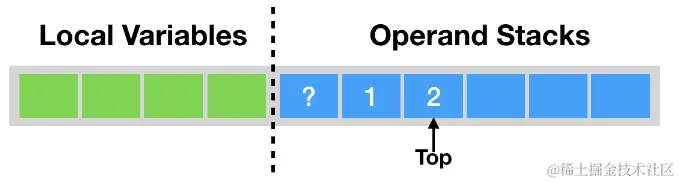
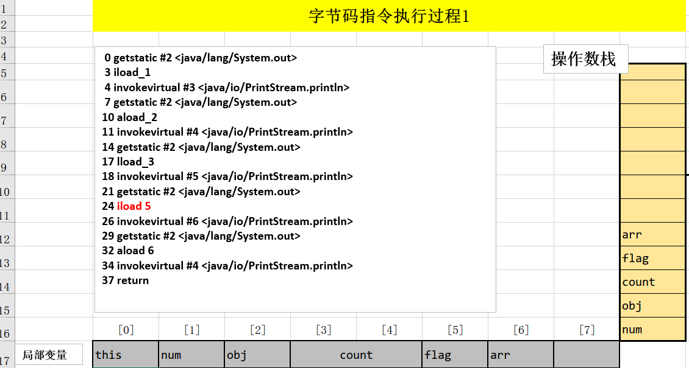
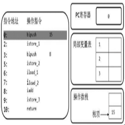
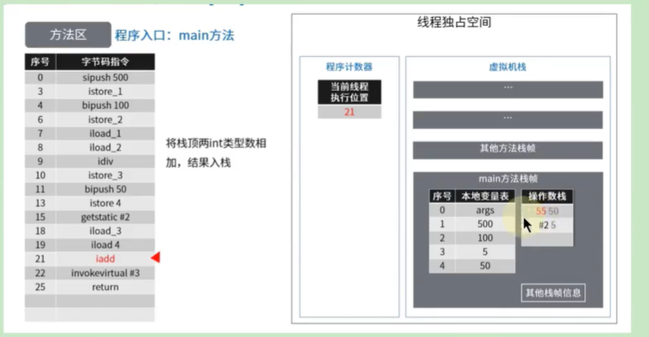
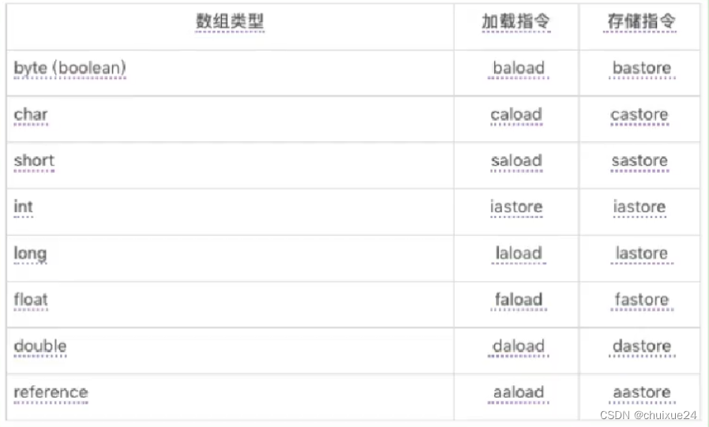
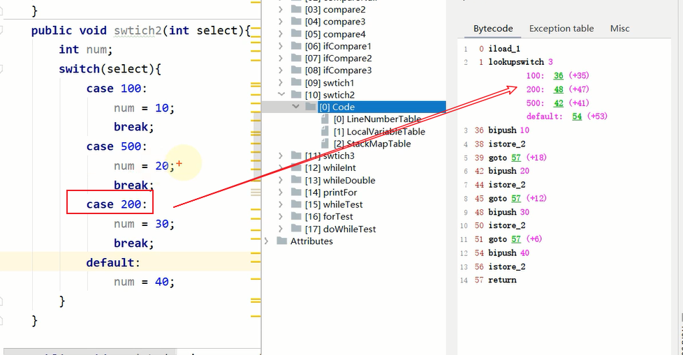
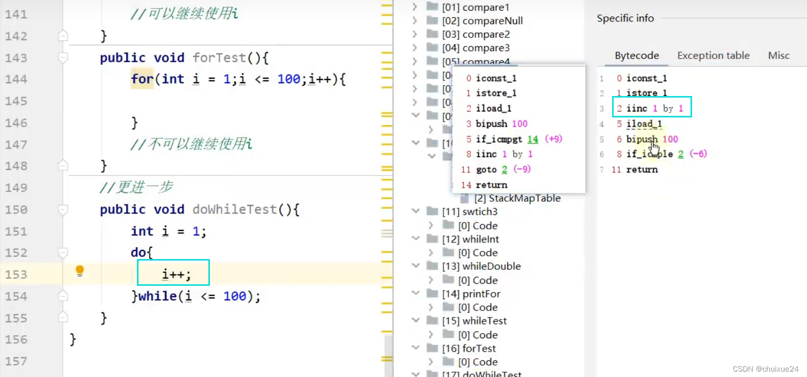

## 1. 概述


+ Java字节码对于虚拟机，就好像汇编语言对于计算机，属于基本执行指令。
+ Java 虚拟机的指令由`一个字节长度`的、代表着某种特定操作含义的数字（称为`操作码，Opcode`）以及跟随其后的零至多个代表此操作所需参数（称为`操作数，Operands`）而构成。由于 Java 虚拟机采用面向操作数栈而不是寄存器的结构，所以大多数的指令都不包含操作数，只有一个操作码。
+ 由于限制了 Java 虚拟机操作码的长度为一个字节（即0～255），这意味着指令集的操作码总数不可能超过256条。
+ 官方文档：`https://docs.oracle.com/javase/specs/jvms/se8/html/jvms-6.html`
+ 熟悉虚拟机的指令对于动态字节码生成、反编译Class文件、Class文件修补都有着非常重要的价值。因此，阅读字节码作为了解 Java 虚拟机的基础技能，需要熟练掌握常见指令。

> **执行模型**


> **字节码与数据类型**


> 指令分类


## 2. 加载与存储指令

 **1、作用**

加载和存储指令用于将数据从栈帧的局部变量表和操作数栈之间来回传递。

**2、常用指令**

```
1、【局部变量压栈指令】将一个局部变量加载到操作数栈：xload、xload_<n>（其中x为i、l、f、d、a，n 为 0 到 3）
2、【常量入栈指令】将一个常量加载到操作数栈：bipush、sipush、ldc、ldc_w、ldc2_w、aconst_null、iconst_m1、iconst_<i>、lconst_<l>、fconst_<f>、dconst_<d>
3、【出栈装入局部变量表指令】将一个数值从操作数栈存储到局部变量表：xstore、xstore_<n>（其中x为i、l、f、d、a，n 为 0 到 3）
4、扩充局部变量表的访问索引的指令：wide 。
```


上面所列举的指令助记符中，有一部分是以尖括号结尾的（例如iload_）。这些指令助记符实际上代表了一组指令（例如 iload_代表了iload_0、iload_1、iload_2和iload_3这几个指令）。这几组指令都是某个带有一个操作数的通用指令（例如 iload）的特殊形式，**对于这若干组特殊指令来说，它们表面上没有操作数，不需要进行取操作数的动作，但操作数都隐含在指令中。**

比如：

- `iload_0`:将局部变量表中索引为0位置上的数据压入操作数栈中。
- `iload 0`:将局部变量表中索引为0位置上的数据压入操作数栈中，等价于上面。
- `iload 4`:将局部变量表中索引为4位置上的数据+压入操作数栈中。

> `iload_0` 占 1 个字节。`iload 0` 占 3 个字节。  
> **因为操作码数量有限，只有 256 个**，所以只把常用的 0-3 设置成了操作码。


除此之外，它们的语义与原生的通用指令完全一致（例如 iload_0的语义与操作数为0时的 iload 指令语义完全一致）。在尖括号之间的字母指定了指令隐含操作数的数据类型，`<n>`代表非负的整数， `<i>` 代表是int类型数据，`<l>` 代表long类型，`<f>`代表float类型，`<d>` 代表double类型。

操作byte、char、short和boolean类型数据时，经常用int类型的指令来表示。


#### 2.1 复习操作数栈与局部变量表

**1、操作数栈(Operand Stacks)**

我们知道，Java字节码是Java虚拟机所使用的指令集。因此，它与Java虚拟机基于栈的计算模型是密不可分的。 在解释执行过程中，每当为Java方法分配栈桢时，Java虚拟机往往需要开辟一块额外的空间作为操作数栈，来存放计算的操作数以及返回结果。 具体来说便是：`执行每一条指令之前，Java 虚拟机要求该指令的操作数已被压入操作数栈中。在执行指令时，Java 虚拟机会将该指令所需的操作数弹出，并且将指令的结果重新压入栈中。`

 以加法指令 iadd 为例。假设在执行该指令前，栈顶的两个元素分别为 int 值 1 和 int 值 2，那么 iadd 指令将弹出这两个 int，并将求得的和 int 值 3 压入栈中。


由于iadd 指令只消耗栈顶的两个元素，因此，对于离栈顶距离为2的元素，即图中的问号，iadd 指令并不关心它是否存在，更加不会对其进行修改。

**2、局部变量表(Local Variables)**

Java 方法栈桢的另外一个重要组成部分则是局部变量区，**字节码程序可以将计算的结果缓存在局部变量区之中**。

实际上，Java 虚拟机将局部变量区当成**一个数组**，依次存放 `this 指针（`仅非静态方法），所`传入的参数`，以及`字节码中的局部变量。` 和操作数栈一样，long 类型以及 double 类型的值将占据两个单元，其余类型仅占据一个单元。


举例：

```java
public void foo(long l, float f) {
    {
        int i = 0;
    }
    {
        String s = "Hello, World";
    }
}
```

对应的图示：

>  **i和s 涉及到槽位复用**

 

在栈帧中，与性能调优关系最为密切的部分就是局部变量表。局部变量表中的变量也是重要的垃圾回收根节点，只要被局部变量表中直接或间接引用的对象都不会被回收。

在方法执行时，虚拟机使用局部变量表完成方法的传递。

#### 2.2 局部变量压栈指令

**局部变量压栈指令将给定的局部变量表中的数据压入操作数栈**。

这类指令大体可以分为：

```js
> xload_<n> (x为i、l、f、d、a，n为 0 到 3)
> xload (x为i、l、f、d、a)  
```

说明：在这里，x的取值表示数据类型。

指令xload_n表示将第n个局部变量压入操作数栈，比如iload_1、fload_0、aload_0等指令。其中aload_n表示将一个对象引用压栈。

指令xload通过指定参数的形式，把局部变量压入操作数栈，当使用这个命令时，表示局部变量的数量可能超过了4个，比如指令iload、fload等。


```java
    //1.局部变量压栈指令
    public void load(int num, Object obj,long count,boolean flag,short[] arr) {
        System.out.println(num);
        System.out.println(obj);
        System.out.println(count);
        System.out.println(flag);
        System.out.println(arr);
    }
```




#### 2.3 常量入栈指令

常量入栈指令的功能是将常数压入操作数栈，根据数据类型和入栈内容的不同，又可以分为**const系列**、**push系列**和**ldc指令**。依次对应的值范围越大

`指令const系列`：用于对特定的常量入栈，入栈的常量隐含在指令本身里。指令有：iconst_ *(i从-1到5)、lconst_ (l从0到1)、fconst_ (f从0到2)、dconst_ (d从0到1)、aconst_null。*

比如，

- iconst_m1将-1压入操作数栈；
- iconst_x（x为0到5）将x压入栈：
- lconst_0、lconst_1分别将长整数0和1压入栈；
- fconst_0、fconst_1、fconst_2分别将浮点数0、1、2压入栈；
- dconst_0和dconst_1分别将double型0和1压入栈。
- aconst_null将null压入操作数栈；

从指令的命名上不难找出规律，指令助记符的第一个字符总是喜欢表示数据类型，i表示整数，l表示长整数，f表示浮点数，d表示双精度浮点，习惯上用a表示对象引用。如果指令隐含操作的参数，会以下划线形式给出。

```js
int i = 3;   iconst_3
int j = 6;   iconst 6? bipush 6?
int k = 32768 ldc ?
```

`指令push系列`：主要包括bipush和sipush。它们的区别在于接收数据类型的不同，bipush接收8位整数作为参数，sipush接收16位整数，它们都将参数压入栈。

`指令ldc系列`：如果以上指令都不能满足需求，那么可以使用万能的ldc指令，它可以接收一个8位的参数，该参数指向常量池中的int、float或者String的索引，将指定的内容压入堆栈。

类似的还有`ldc_w`，它接收两个8位参数，能支持的索引范围大于ldc。 如果要压入的元素是long或者double类型的,则使用ldc2_w指令，使用方式都是类似的。

总结如下：


   

#### 2.4 出栈装入局部变量表指令

出栈装入局部变量表指令用于将操作数栈中栈顶元素弹岀后，装入局部变量表的指定位置，用于给局部变量赋值。

这类指令主要以store的形式存在，比如xstore （x为i、l、f、d、a）、 xstore_n （x 为 i、l、f、d、a, n 为 0 至 3）。

- 其中，指令istore_n将从操作数栈中弹出一个整数，并把它赋值给**局部变量索引n位置**。
- 指令xstore由于没有隐含参数信息，故需要提供一个byte类型的参数类指定目标局部变量表的位置。

说明： `一般说来，类似像store这样的命令需要带一个参数，用来指明将弹出的元素放在局部变量表的第几个位置。` 但是，为了尽可能压缩指令大小，使用专门的istore_1指令表示将弹出的元素放置在局部变量表第1个位置。类似的还有istore_0、istore_2、istore_3,它们分别表示从操作数栈顶弹出一个元素，存放在局部变量表第0、2、3个位置。

由于局部变量表前几个位置总是非常常用，因此`这种做法虽然增加了指令数量，但是可以大大压缩生成的字节码的体积`。如果局部变量表很大，需要存储的槽位大于3,那么可以使用istore指令，外加一个参数，用来表示需要存放的槽位位置。

举例1


举例2

```java
    public void foo(long l, float f) {
        {
            int i = 0;
        }
        {
            String s = "Hello, World";
        }
    }
```


##    3. 算术指令

**1、作用：**

算术指令用于对两个操作数栈上的值进行某种特定运算，并把结果重新压入操作数栈。

**2、分类：**

大体上算术指令可以分为两种：对`整型数据`进行运算的指令与对`浮点类型数据`进行运算的指令。

**3、byte、short、char和boolean类型说明**

在每一大类中，都有针对Java虚拟机具体数据类型的专用算术指令。但没有直接支持byte、short、char和boolean类型的算术指令，对于这些数据的运算，都使用int类型的指令来处理。此外，在处理boolean、byte、short和char类型的数组时，也会转换为使用对应的int类型的字节码指令来处理。


**4、运算时的溢出**

数据运算可能会导致溢出，例如两个很大的正整数相加，结果可能是一个负数。其实Java虚拟机规范并无明确规定过整型数据溢出的具体结果，仅规定了在处理整型数据时，只有除法指令以及求余指令中当出现除数为0时会导致虚拟机抛出异常ArithmeticException。

**5、运算模式**

+ 向最接近数舍入模式：JVM要求在进行浮点数计算时，所有的运算结果都必须舍入到适当的精度，非精确结果必须舍入为可被表示的最接近的精确值，如果有两种可表示的形式与该值一样接近，将优先选择最低有效位为零的； 
+ 向零舍入模式：将浮点数转换为整数时，采用该模式，该模式将在目标数值类型中选择一个最接近但是不大于原值的数字作为最精确的舍入结果；

**6、NaN值使用**

当一个操作产生溢出时，将会使用有符号的无穷大表示，如果某个操作结果没有明确的数学定义的话，将会使用 NaN值来表示。而且所有使用NaN值作为操作数的算术操作，结果都会返回 NaN；

```java
    @Test
    public void method1(){
        int i = 10;
        double j = i / 0.0;
        System.out.println(j);//Infinity 无穷大


        double d1 = 0.0;
        double d2 = d1 / 0.0;
        System.out.println(d2);//NaN: not a number
    }
```


### **所有的算术指令包括：**

- 加法指令：iadd、ladd、fadd、dadd
- 减法指令：isub、lsub、fsub、dsub
- 乘法指令:imul、lmul、 fmul、dmul
- 除法指令：idiv、ldiv、fdiv、ddiv
- 求余指令：irem、lrem、frem、drem    `//remainder:余数`
- 取反指令：ineg、lneg、fneg、dneg    `//negation:取反`
- 自增指令：iinc
- 位运算指令，又可分为：
  - 位移指令：ishl、ishr、iushr、lshl、lshr、lushr
  - 按位或指令：ior、lor
  - 按位与指令：iand、land
  - 按位异或指令：ixor、lxor
- 比较指令：dcmpg、dcmpl、fcmpg、fcmpl、lcmp


#### 入门举例

##### **i=i+10 与 i+=10 的区别**

> 
> 
> 
> 
> 

 

##### 基础运算


##### 举例完整

```java
public void add() {
	byte i = 15;
	int j = 8;
	int k = i + j;
}
```




##### 方法调用 开启栈帧

```java
public static void main(String[] args) {
	int x = 500;
	int y = 100;
	int a = x / y;
	int b = 50;
	System.out.println(a + b);//调用方法 开启新栈帧
}
```




<hr/>

### **i++ 与 ++i 的问题**

> 对于不涉及赋值操作的 i++ 和 ++i 并无区别，字节码一模一样
>
> 
>


> 涉及赋值操作的 i++ 和 ++i
>
> `iinc 1 by 1`： 将局部变量中索引为1位置的值自增1并存回索引为1的位置【**iinc 是在局部变量表上直接做自增的操作**】
>
> 

验证 java 基础所学的 ++ 在前，先 ++ 后赋值；++ 在后，先赋值，后 ++。

`i++ 先入栈再局部变量表中自增`

`++j  先局部变量表中自增再入栈`

> 根据字节码理解
>
> iinc (**注意该指令只针对 int 类型的数据, 其它类型的数据自增不使用 iinc 指令, 使用的与常数 1 相加的操作, iinc 是在局部变量表上直接做自增的操作, 并不是在操作数栈上做自增的操作**)
>
>
> 先把 10 压入操作数栈，然后把 10 放入局部变量表 1 的位置，然后把局部变量表 1 的位置的元素加载到操作数栈，然后对局部变量表 1 的位置的元素加一，然后把操作数栈中的元素保存到局部变量表 2 的位置。
>
> 先把 20 压入操作数栈，然后把 20 放入局部变量表 3 的位置，然后对局部变量表 3 的位置的元素加一，然后把局部变量表 3 的位置的元素加载到操作数栈，然后把操作数栈中的元素保存到局部变量表 4 的位置。

面试题：

> 
> 
>  为啥打印出来是 10？局部变量表中变为了 11，但随后又被覆盖了成了 10。

### 比较指令

**比较指令的说明**

- 比较指令的作用是**比较栈顶两个元素的大小，并将比较结果入栈**。
- 比较指令有：dcmpg, dcmpl、fcmpg、fcmpl、lcmp。
  - 与前面讲解的指令类似，首字符d表示double类型，f表示float,l表示long。
- 对于double和float类型的数字，由于NaN的存在，各有两个版本的比较指令。以float为例，有fcmpg和fcmpl两个指令，它们的区别在于在数字比较时，若遇到NaN值，处理结果不同。
- 指令dcmpl和dcmpg也是类似的，根据其命名可以推测其含义，在此不再赘述。
- 指令lcmp针对long型整数，由于long型整数没有NaN值，故无需准备两套指令。

举例：

指令fcmpg和fcmpl都从栈中弹出两个操作数，并将它们做比较，设栈顶的元素为v2,栈顶顺位第2位的元素为v1,若v1=v2,则压入0；若v1>v2则压入1；若v1<v2则压入-1。 两个指令的不同之处在于，如果遇到NaN值，fcmpg会压入1,而fcmpl会压入-1。


数值类型的数据，才可以谈大小！（byte\short\char\int；long\float\double)

boolean、引用数据类型不能比较大小。


## 4、类型转换指令

**类型转换指令说明**  

1. 类型转换指令可以将两种不同的数值类型进行相互转换。  

2. 这些转换操作一般用于实现用户代码中的**显式类型转换操作**，或者用来处理字节码指令集中数据类型相关指令无法与数据类型一一对应的问题。


#### 4.1 宽化类型转换（widening Numeric Conversions）

**4.1.1 转换规则**

Java虚拟机直接支持以下数值的宽化类型转换（widening numeric conversion，小范围类型向大范围类型的安全转换）。也就是说，并不需要指令执行，包括：

- 从int类型到long、float或者double类型。对应的指令为：i2l、i2f、i2d
- 从long类型到float、double类型。对应的指令为：l2f、l2d
- 从float类型到double类型。对应的指令为：f2d

```
简化为：int --> long --> float --> double
```


**4.1.2 精度损失问题**

1. 宽化类型转换是**不会因为超过目标类型最大值而丢失信息**的，例如，从int转换到 long，或者从int转换到double，都不会丢失任何信息，转换前后的值是精确相等的。


2. **从int、long类型数值转换到float，或者long类型数值转换到double时，将可能发生精度丢失**——可能丢失掉几个最低有效位上的值，转换后的浮点数值是根据IEEE754最接近舍入模式所得到的正确整数值。

尽管宽化类型转换实际上是可能发生精度丢失的，但是这种转换永远不会导致Java虚拟机抛出运行时异常

```java
//举例：精度损失的问题
@Test
public void upCast2(){
  int i = 123123123;
  float f = i;
  System.out.println(f);//123123120
 
  long l = 123123123123L;
  l = 123123123123123123L;
  double d = l;
  System.out.println(d);//123123123123123120
}
```


**4.1.3 补充说明**

`从byte、char和short类型到int类型的宽化类型转换实际上是不存在的`。对于byte类型转为int,虚拟机并没有做实质性的转化处理，只是简单地通过操作数栈交换了两个数据。而将byte转为long时，使用的是i2l,可以看到在内部byte在这里已经等同于int类型处理，类似的还有short类型，这种处理方式有两个特点：

一方面可以减少实际的数据类型，如果为short和byte都准备一套指令，那么指令的数量就会大增，而`虚拟机目前的设计上，只愿意使用一个字节表示指令，因此指令总数不能超过256个，为了节省指令资源，将short和byte当做int处理也在情理之中。`

另一方面，由于局部变量表中的槽位固定为32位，无论是byte或者short存入局部变量表，都会占用32位空间。从这个角度说，也没有必要特意区分这几种数据类型。


举例：

```java
    //针对于byte、short等转换为容量大的类型时，将此类型看做int类型处理。
    public void upCast3(byte b){
        int i = b;
        long l = b;
        double d = b;
    }
```

局部变量表


字节码：

```sh
0 iload_1    # load b到栈
1 istore_2   # 存储给局部变量序号2【l】
2 iload_1	# load b到栈
3 i2l		# 栈顶数字 int转换long 
4 lstore_3	# 存储给局部变量序号3【l】
5 iload_1	# load b到栈
6 i2d		# 栈顶数字 int转换double
7 dstore 5  # 存储给局部变量序号5【d】
9 return
```


#### 4.2 窄化类型转换（Narrowing Numeric Conversion）  


**4.2.1 转换规则**

Java虚拟机也直接支持以下窄化类型转换：

- 从int类型至byte、short或者char类型。对应的指令有：i2b、i2s、i2c
- 从long类型到int类型。对应的指令有：l2i
- 从float类型到int或者long类型。对应的指令有：f2i、f2l
- 从double类型到int、long或者float类型。对应的指令有：d2i、d2l、d2f

**4.2. 2 精度损失问题**

窄化类型转换可能会导致转换结果具备不同的正负号、不同的数量级，因此，转换过程很可能会导致数值丢失精度。

尽管数据类型窄化转换可能会发生上限溢出、下限溢出和精度丢失等情况，但是Java虚拟机规范中明确规定数值类型的窄化转换指令永远不可能导致虚拟机抛出运行时异常

```java
    //窄化类型转换的精度损失
    @Test
    public void downCast4(){
        int i = 128;
        byte b = (byte)i;
        System.out.println(b);//-128
    }
```


**4.2.3 补充说明**

1. 当将一个浮点值窄化转换为整数类型T（T限于int或long类型之一）的时候，将遵循以下转换规则：

   - 如果浮点值是NaN，那转换结果就是int或long类型的0。

   - 如果浮点值不是无穷大的话，浮点值使用IEEE 754的向零舍入模式取整，获得整数值v，如果v在目标类型T（int或long）的表示范围之内，那转换结果就是v。否则，将根据v的符号，转换为T所能表示的最大或者最小正数

2. 当将一个 double 类型窄化转换为 float 类型时，将遵循以下转换规则： 通过向最接近数舍入模式舍入一个可以使用float类型表示的数字。最后结果根据下面这3条规则判断：

   - 如果转换结果的绝对值太小而无法使用 float来表示，将返回 float类型的正负零。

   - 如果转换结果的绝对值太大而无法使用 float来表示，将返回 float类型的正负无穷大。

   - 对于double 类型的 NaN值将按规定转换为 float类型的 NaN值。

```java
    public void downCast5(){
        double d1 = Double.NaN; //0.0 / 0.0
        int i = (int)d1;
        System.out.println(d1);
        System.out.println(i);

        double d2 = Double.POSITIVE_INFINITY;
        long l = (long)d2;
        int j = (int)d2;
        System.out.println(l);
        System.out.println(Long.MAX_VALUE);
        System.out.println(j);
        System.out.println(Integer.MAX_VALUE);

        float f = (float)d2;
        System.out.println(f);

        float f1 = (float)d1;
        System.out.println(f1);
    }
```


## 5. 对象的创建与访问指令

Java是面向对象的程序设计语言，虚拟机平台从字节码层面就对面向对象做了深层次的支持。有一系列指令专门用于对象操作，可进一步细分为创建指令、字段访问指令、数组操作指令、类型检查指令。

#### 5.1 创建指令

虽然类实例和数组都是对象，但Java虚拟机对类实例和数组的创建与操作使用了不同的字节码指令：

**1. 创建类实例的指令：**

- 创建类实例的指令：new
  - 它接收一个操作数，为指向常量池的索引，表示要创建的类型，执行完成后，将对象的引用压入栈。

**2. 创建数组的指令：**

- 创建数组的指令：newarray、anewarray、multianewarray。
  - newarray：创建基本类型数组
  - anewarray：创建引用类型数组
  - multianewarray：创建多维数组

上述创建指令可以用于创建对象或者数组，由于对象和数组在Java中的广泛使用，这些指令的使用频率也非常高。


#### 5.2 字段访问指令

对象创建后，就可以通过对象访问指令获取对象实例或数组实例中的字段或者数组元素。

- 访问类字段（static字段，或者称为类变量）的指令：getstatic、putstatic
- 访问类实例字段（非static字段，或者称为实例变量）的指令：getfield、putfield

举例：

以getstatic指令为例，它含有一个操作数，为指向常量池的Fieldref索引，它的作用就是获取Fieldref指定的对象或者值，并将其压入操作数栈。

```java
public void sayHello() {
    System.out.println("hello");
}
```

对应的字节码指令：

```js
0 getstatic #8 <java/lang/System.out>
3 ldc #9 <hello>
5 invokevirtual #10 <java/io/PrintStream.println>
8 return
```

图示：


图示:  

```java
    public void setOrderId(){
        Order order = new Order();
        order.id = 1001;
        System.out.println(order.id);

        Order.name = "ORDER";
        System.out.println(Order.name);
    }
        
 class Order{
    int id;
    static String name;
}
```


注意：get 是入栈，而 put 是出栈


#### 5.3 数组操作指令

数组创建

```java
newarray  atype 创建数组
 
长度的类型必须是int。它从操作数堆栈中弹出。计数表示要创建的数组中的元素数量。
atype是指示要创建的数组类型的代码。它必须采用以下值之一：https://docs.oracle.com/javase/specs/jvms/se19/html/jvms-6.html#jvms-6.5.newarray
    

double[] arr = new double[10];

0 bipush 10  # 入栈 10
2 newarray 7 (double)  # 创建一个double数组【type：7 】，长度从栈顶弹出 10   
```


数组操作指令主要有：xastore和xaload指令。具体为：

- 把一个数组元素加载到操作数栈的指令：baload、caload、saload、iaload、laload、faload、daload、aaload
- 将一个操作数栈的值存储到数组元素中的指令：bastore、 castore、 sastore、iastore、 lastore、fastore、dastore、aastore 即：




>   **说明**  
>
>  + 指令 xaload 表示将数组的元素压栈，比如 saload、caload 分别表示压入 short 数组和 char 数组。指令  xaload 在执行时，要求操作数中栈顶元素为数组索引 i, 栈顶顺位第 2 个元素为数组引用 a, 该指令会弹出栈顶这两个元素，并将 a[i] 重新压入堆栈。 
>  + xastore 则专门针对数组操作，以 iastore 为例，它用于给一个 int 数组的给定索引赋值。在 iastore 执行前，操作数栈顶需要以此准备 3 个元素: 值、索引、数组引用，iastore 会弹出这 3 个值，并将值赋给数组中指定索引的位置。
>
>  

验证：boolean使用bastore


取数组长度的指令：arraylength

- 该指令弹出栈顶的数组元素，获取数组的长度，将长度压入栈。


 

#### 5.4 类型检查指针

**类型检查指令**  

检查类实例或数组类型的指令：instanceof、checkcast。

- 指令checkcast用于检查类型强制转换是否可以进行。如果可以进行，那么checkcast指令不会改变操作数栈，否则它会抛出ClassCastException异常。
- 指令instanceof用来判断给定对象是否是某一个类的实例，它会将判断结果压入操作数栈。


## 6.方法调用与返回指令

###  6.1 方法调用指令

**方法调用指令:**

**invokevirtual、invokeinterface、invokespecial、invokestatic 、 invokedynamic**

以下 5 条指令用于方法调用:  

+ invokevirtual 指令用于调用对象的实例方法，根据对象的实际类型进行分派（虚方法分派），支持多态。这也是 Java 语言中`最常见的方法分派方式`。

+ invokeinterface 指令用于`调用接口方法`，它会在运行时搜索由特定对象所实现的这个接口方法，并找出适合的方法进行调用。

+ invokespecial 指令用于调用一些需要特殊处理的实例方法，包括`实例初始化方法（构造器）`、`私有方法`和`父类方法`。这些方法都是**静态类型绑定**的，不会在调用时进行动态派发【非重写】。

+ invokestatic 指令用于调用命名类中的`类方法（static 方法）`。这是静态绑定的。

+ invokedynamic: 调用动态绑定的方法，这个是 DK 1.7 后新加入的指令。用于在运行时动态解析出调用点限定符所引用的方法，并执行该方法。


前面 4 条调用指令的分派逻辑都固化在 java 虚拟机内部，而 invokedynamic 指令的分派逻辑是由用户所设定的引导方法决定的。


#### **6.1.1 invokespecial**

静态分派：方法都不能被重写（父类方法也是确定的）

  

#### **6.1.2 invokestatic**

静态分派


#### **6.1.3 invokeinterface**

```java
/**补充：方法调用指令的补充说明 */
public class InterfaceMethodTest {
    public static void main(String[] args) {
        AA aa = new BB();
        aa.method2();
        AA.method1();
    }
}
 
interface AA{
    public static void method1(){}
    public default void method2(){}
}
 
class BB implements AA{
}
```


### 6.2 方法返回指令

方法调用结束前，需要进行返回。方法返回指令是根据`返回值的类型区分`的。

- 包括ireturn（当返回值是 boolean、byte、char、short和int 类型时使用）、lreturn、freturn、dreturn和areturn
- 另外还有一条return 指令供声明为 void的方法、实例初始化方法以及类和接口的类初始化方法使用。


> 返回指令类型看方法的返回值类型。
>
> ireturn指令是方法返回指令之一，它将结束方法执行并将操作数栈顶的整型值返回给该方法的调用者


举例：

通过ireturn指令,将当前函数操作数栈的顶层元素弹出，并将这个元素压入调用者函数的操作数栈中（因为调用者非常关心函数的返回值），所有在当前函数操作数栈中的其他元素都会被丢弃。

如果当前返回的是synchronized方法，那么还会执行一个隐含的monitorexit指令，退出临界区。

最后，会丢弃当前方法的整个帧，恢复调用者的帧，并将控制权转交给调用者。

对应的代码：

```java
public int methodReturn(){
    int i = 500;
    int j = 200;
    int k = 50;
    return (i + j) / k;
}
```


举例：


## 7. 操作数栈管理指令

如同操作一个普通数据结构中的堆栈那样，JVM 提供的操作数栈管理指令，可以用于直接操作操作数栈的指令。  

这类指令包括如下内容:  

+ 将一个或两个元素从栈顶弹出，并且直接废弃: pop，pop2;  
+ 复制栈顶一个或两个数值并将复制值或双份的复制值重新压入栈顶: dup，dup2，dup_x1,dup2_x1, dup_x2，dup2_x2;  
+ 将栈最顶端的两个 Slot 数值位置交换: swap。Java 虚拟机没有提供交换两个 64 位数据类型（long、double）数值的指令。
+ 指令 nop, 是一个非常特殊的指令，它的字节码为 0x00。和汇编语言中的 nop 一样，它表示什么都不做。这条指令一般可用于调试、占位等。  

这些指令属于通用型，对栈的压入或者弹出无需指明数据类型。


**说明:**  

+ 不带_x 的指令是复制栈顶数据并压入栈顶。包括两个指令，dup 和 dup2  ，dup 的系数代表要复制的 slot 个数。 

  + dup 开头的指令用于复制 1 个 Slot 【4字节】的数据。例如 1 个 int 或 1 个 reference 类型数据 
  + dup2 开头的指令用于复制 2 个 Slot 的数据。例如 1 个 long，或 2 个 int，或 1 个 int+1 个 float 类型数据  

+ 带_x 的指令是复制栈顶数据并插入栈顶以下的某个位置。共有 4 个指令, dup_x1,dup2_x1,dup_x2,dup2_x2。对于带_x 的复制插入指令，只要将指令的 dup 和 x 的系数相加，结果即为需要插入的位置。  因此 、

  + dup_x1 插入位置: 1+1=2，即栈顶 2 个 slot 下面 

  + dup_x2 插入位置: 1+2=3，即栈顶 3 个 slot 下面 

  + dup2_x1 插入位置: 2+1=3，即栈顶 3 个 slot 下面.

  + dup2_x2 插入位置: 2+2=4，即栈顶 4 个 S1ot 下面  

    > 

+ pop:, 将栈顶的 1 个 Slot 数值出栈。例如 1 个 short 类型数值  

+ pop2 将栈顶的 2 个 Slot 数值出栈。例如 1 个 double 类型数值，或者 2 个 int 类型数值

  

> 
>
> ```bash
> new: #创建对象  
> dup: #复制栈顶的对象引用   原因：下面需要用两次
> invokespecial：#调用对象的初始化方法  
> astore_1: #将对象引用保存到局部变量表下标为 1 的位置  
> aload_1: #将局部变量表下标为 1 的数据加载到操作数栈  
> invokevirtual：#调用对象的 toString 方法  
> astore_2: #将 info 对象引用保存到局部变量表下标为 2 的位置  
> return: #结束方法
> ```

观察与上面差异


有难度例题：

```java
    public long nextIndex() {
        return index++;
    }

    private long index = 0;
```

字节码：

```bash
 
 0 aload_0  # 加载this地址   栈：【this[0x1212]】  slot = 1
 1 dup    # 复制一份this   栈：【this[0x1212]、this[0x1212]】  slot = 2
 2 getfield #2 <com/atguigu/java/StackOperateTest.index : J>  #消耗栈顶一个this，获取this的index字段，并压入栈顶    栈：【index[0L]  、this[0x1212]】  slot = 3 注意：(long占用两个slot)
 5 dup2_x1 # 复制栈顶两个slot的，也就是index的值，并插入到栈顶3下个slot，此时栈顶没有因复制数据而发生改变  栈：【index[0]  、this[0x1212]，index[0L]】  slot = 5
 6 lconst_1 # 加载1到栈顶
 7 ladd  # long型求和  0+1 并压入栈顶  栈：【1L  、this[0x1212]，【、index[0L]】  slot = 5
 8 putfield #2 <com/atguigu/java/StackOperateTest.index : J> # 将栈顶数据赋值给this.index  栈：【index[0L]】  slot = 2
11 lreturn # 返回栈顶的0
```


## 8. 控制转移指令

程序流程离不开条件控制，为了支持条件跳转，虚拟机提供了大量字节码指令，大体上可以分为  

1)比较指令、2) 条件跳转指令、3) 比较条件跳转指令、4) 多条件分支跳转指令、5) 无条件跳转指令等。


数值类型的数据，才可以谈大小!(`byte\short\char\int; long\float \double`)  
boolean、引用数据类型不能比较大小。


#### 8.1 条件跳转指令

条件跳转指令通常和比较指令结合使用。在条件跳转指令执行前，一般可以先用比较指令进行栈顶元素的准备，然后进行条件跳转。  

条件跳转指令有: ifeq， iflt, ifle， ifne，ifgt，ifge，ifnull，ifnonnull。这些指令都接收两个字节的操作数，用于计算跳转的位置 (16 位符号整数作为当前位置的 offset)。  

它们的统一含义为: `弹出栈顶元素，测试它是否满足某一条件，如果满足条件，则跳转到给定位置`。


> 注意:  
>
> 1）与前面运算规则一致:  
>
> + 对于 boolean、byte、char、short 类型的条件分支比较操作，都是使用 int 类型的比较指令完成  
> + 对于 long、float、double 类型的条件分支比较操作，则会先执行相应类型的比较运算指令，运算指令会返回一个整型值到操作数栈中，随后再执行 int 类型的条件分支比较操作来完成整个分支跳转  
>
> 2）由于各类型的比较最终都会转为 int 类型的比较操作，所以 Java 虚拟机提供的 int 类型的条件分支指令是最为丰富和强大的。


> 特别说明：字节码第19行压入一个0，第20行打印调用`<println : (Z)V>`  Z代表boolean类型【参考第一章  字段描述符索引】

#### 8.2 比较条件跳转指令

比较条件跳转指令  

比较条件跳转指令类似于比较指令和条件跳转指令的结合体，它将比较和跳转两个步骤合二为一。  

这类指令有: if_icmpeq、if_icmpne、if_icmplt、if_icmpgt、if_icmple、if_icmpge、if_acmpeq 和 if_acmpne.。其中指令助记符加上 “if_” 后，以字符 “i” 开头的指令针对 int 型整数操作 (也包括 short 和 byte 类型)，以字符“a” 开头的指令表示对象引用的比较。 

这些指令都接收两个字节的操作数作为参数，用于计算跳转的位置。同时在执行指令时，栈顶需要准备两个元素进行比较。指令执行完成后，栈顶的这两个元素被清空，且没有任何数据入栈。如果预设条件成立，则执行跳转，否则，继续执行下一条语句。


#### 8.3 多条件分支跳转

> 多条件分支跳转指令是专为 switch-case 语句设计的，主要有 tableswitch 和 lookupswitch。


从助记符上看，两者都是 switch 语句的实现，它们的区别:  

+ tableswitch 要求**多个条件分支值是连续的**，它内部只存放起始值和终止值，以及若干个跳转偏移量，通过给定的操作数 index，可以立即定位到跳转偏移量位置，因此效率比较高。
+ 指令 lookupswitch 内部**存放着各个离散的 case-offset 对**，每次执行都要搜索全部的 case-offset 对，找到匹配的 case 值，并根据对应的 offset 计算跳转地址，因此**效率较低**。

指令 tableswitch 的示意图如下图所示。由于 tableswitch 的 case 值是连续的，因此只需要记录最低值和最高值，以及每项对应的 offset 偏移量，根据给定的 index 值通过简单的计算即可直接定位到 offset。


指令 lookupswitch 处理的是离散的 case 值，但是出于效率考虑，将 case-offset 对按照 case 值大小排序，给定 index 时，需要查找与 index 相等的 case, 获得其 offset, 如果找不到则跳转到 default。指令 lookupswitch 如下图所示。


对比缺少break字节码差异：istore后无goto跳转


离散值



String优化


#### 8.4 无条件跳转指令

**目前主要的无条件跳转指令为 goto。**指令 goto 接收两个字节的操作数，共同组成一个带符号的整数，用于指定指令的偏移量，**指令执行的目的就是跳转到偏移量给定的位置处**。  

如果指令偏移量太大，超过双字节的带符号整数的范围，则可以使用指令 goto_w, 它和 goto 有相同的作用，但是它接收 4 个字节的操作数，可以表示更大的地址范围。  


指令 jsr、jsr_w、 ret 虽然也是无条件跳转的，但主要用于 try-finally 语句，且已经被虚拟机逐渐废弃，故不在这里介绍这两个指令。


**while循环**


**for 循环与 while 循环的字节码比较**  


 **do while 的字节码**




## 9.异常处理指令


#### 9.1 抛出异常指令:

(1) athrow 指令  

在 Java 程序中显示抛出异常的操作（throw 语句）都是由 athrow 指令来实现。  

除了使用 throw 语句显示抛出异常情况之外，**JVM 规范还规定了许多运行时异常会在其他Java虚拟机指令检测到异常状况是自动抛出**。例如，在之前介绍的整数运算时，当除数为零时，虚拟机会在 idiv 或 ldiv 指令中抛出 ArithmeticException 异常。  

(2)注意  ：

**正常情况下，操作数栈的压入弹出都是一条条指令完成的。唯一的例外情况是在抛异常时，Java 虚拟机会清除操作数栈上的所有内容，而后将异常实例压入调用者操作数栈上。**

异常及异常的处理:  

过程一: 异常对象的生成过程 —> throw(手动 / 自动)—> 指令: athrow 
过程二: 异常的处理: 抓抛模型。try-catch-finally—> 使用异常表

  


#### 9.2 异常处理与异常表

1）处理异常:  

在 Java 虚拟机中，**处理异常**（catch 语句）不是由字节码指令来实现的（早期使用 jsr、ret 指令），而是**采用异常表来完成**的。  

2）异常表  

如果一个方法定义了一个 try-catch 或者 try-finally 的异常处理，就会创建一个异常表。它包含了每个异常处理或者 finally 块的信息。异常表保存了每个异常处理信息。比如:  

+ 起始位置  

+ 结束位置  

+ 程序计数器记录的代码处理的偏移地址 

+ 被捕获的异常类在常量池中的索引

  

**当一个异常被抛出时，JVM 会在当前的方法里寻找一个匹配的处理，如果没有找到，这个方法会强制结束并弹出当前栈帧**，并且异常会重新抛给上层调用的方法 (在调用方法栈帧)。如果在所有栈帧弹出前仍然没有找到合适的异常处理，这个线程将终止。如果这个异常在最后一个非守护线程里抛出，将会导致 JVM 自己终止，比如这个线程是个 main 线程。  

**不管什么时候抛出异常，如果异常处理最终匹配了所有异常类型，代码就会继续执行**。在这种情况下，如果方法结束后没有  抛出异常，仍然执行 finally 块，在 return 前，它直接跳到 finally 块来完成目标

> **try catch：**
>
> 
>
> 解释：如果在0-22行里出现FileNotFoundException异常，代码调整到25行开始处理，asotre1将FileNotFoundException存储到局部变量中索引为1的位置，加载到栈中，执行printStack方法并goto到return

> 面试题：
>
> **try finally：**
>
> 运行结果hello
>
> 


## 10. 同步指令

#### 10.1 方法级别的同步

java 虚拟机支持两种同步结构: 方法级的同步和方法内部一段指令序列的同步，这两种同步都是使用 monitor 来支持的。


方法级的同步: 是**隐式的**，即无须通过字节码指令来控制，它实现在方法调用和返回操作之中。虚拟机可以从方法常量池的方法表结构中的 ACC_SYNCHRONIZED 访问标志得知一个方法是否声明为同步方法;  

当调用方法时，调用指令将会检查方法的 ACC_SYNCHRONIZED 访问标志是否设置。  

+ 如果设置了，执行线程将先持有同步锁，然后执行方法。最后在方法完成（无论是正常完成还是非正常完成）时释放同步锁。  

+ 在方法执行期间，执行线程持有了同步锁，其他任何线程都无法再获得同一个锁.  

+ 如果一个同步方法执行期间抛出了异常，并且在方法内部无法处理此异常，那这个同步方法所持有的锁将在异常抛到同步方法之外时自动释放。


同步方法与非同步方法的字节码都是一样的，区别在于访问标识。


> 这段代码和普通的无同步操作的代码没有什么不同，没有使用 monitorenter 和 monitorexit 进行同步区控制。这是因为，对于同步方法而言，当虚拟机通过方法的访问标示符判断是一个同步方法时，会自动在方法调用前进行加锁，当同步方法执行完毕后，不管方法是正常结束还是有异常抛出，均会由虚拟机释放这个锁。因此，**对于同步方法而言，monitorenter 和 monitorexit 指令是隐式存在的，并未直接出现在字节码中**。

#### 10.2 方法内指定指令序列的同步

同步一段指令集序列: 通常是由 java 中的 synchronized 语句块来表示的。jvm 的指令集有 monitorenter 和 monitorexit 两条指令来支持 synchronized 关键字的语义。  

当一个线程进入同步代码块时，它使用 monitorenter 指令请求进入。如果当前对象的监视器计数器为 0, 则它会被准许进入，若为 1, 则判断持有当前监视器的线程是否为自己，如果是，则进入，否则进行等待，直到对象的监视器计数器为 0, 才会被允许进入同步块。 


当线程退出同步块时，需要使用 monitorexit 声明退出。**在 Java 虚拟机中，任何对象都有一个监视器与之相关联，用来判断对象是否被锁定**，当监视器被持有后，对象处于锁定状态。  


指令 monitorenter 和 monitorexit 在执行时，都需要在操作数栈顶压入对象, 之后 monitorenter 和 monitorexit 的锁定和释放都是针对这个对象的监视器进行的。


下图展示了监视器如何保护临界区代码不同时被多个线程访问，只有当线程 4 离开临界区后，线程 1、2、3 才有可能进入。


编译器必须确保无论方法通过何种方式完成，方法中调用过的每条monitorenter指令都必须执行其对应的monitorexit指令，而无论这个方法是正常结束还是异常结束。

为了保证在方法异常完成时monitorenter和monitorexit指令依然可以正确配对执行，**编译器会自动产生一个异常处理器，这个异常处理器声明可处理所有的异常**，它的目的就是用来执行monitorexit指令


异常表JVM自动生成，防止7-19出现异常锁没有释放

7-19行出现任何异常，处理代码从22行开始执行，执行到24行一定会释放锁，防止死锁

**分为正常退出和异常退出均会执行monitorexit**
