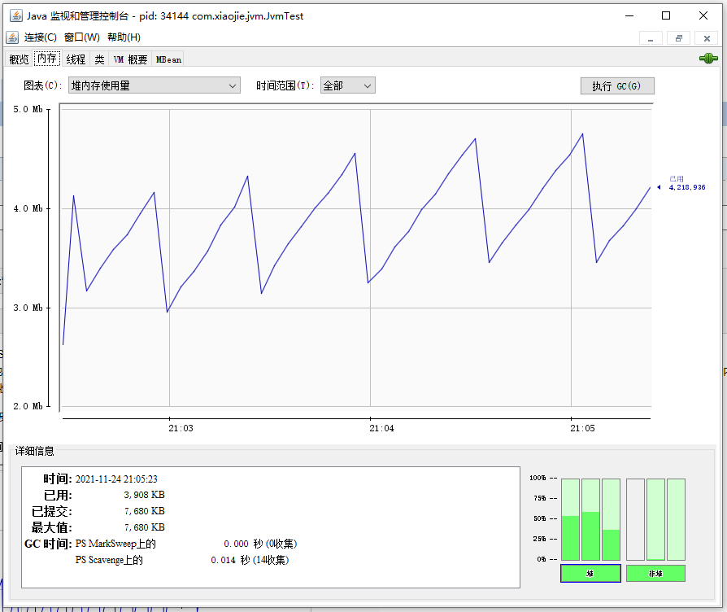
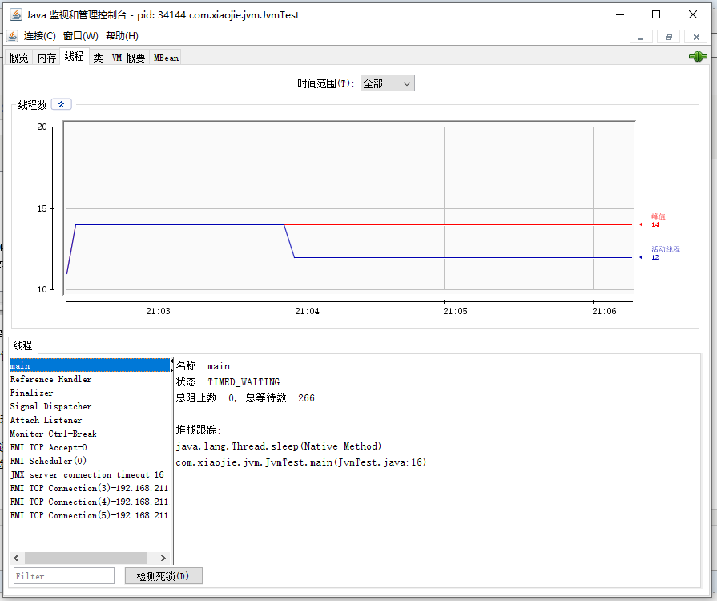
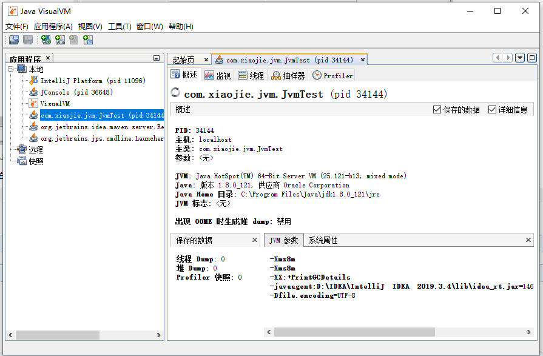
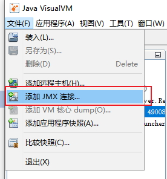
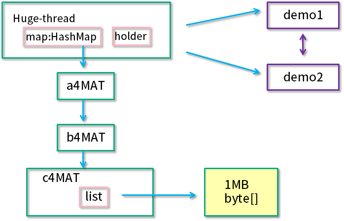
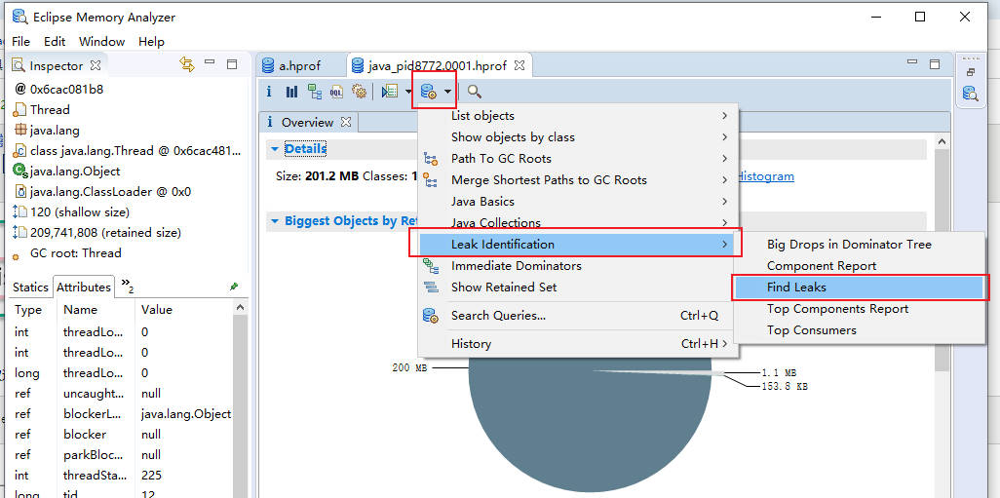
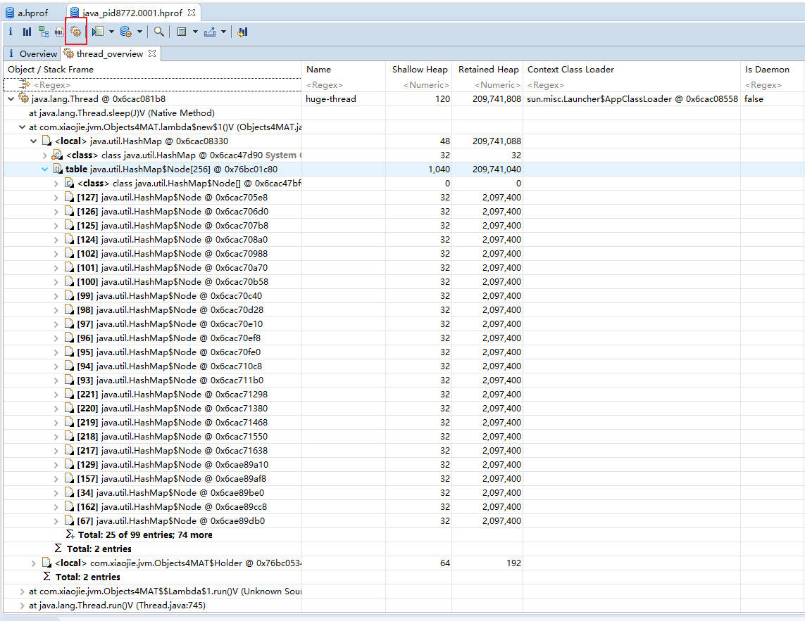
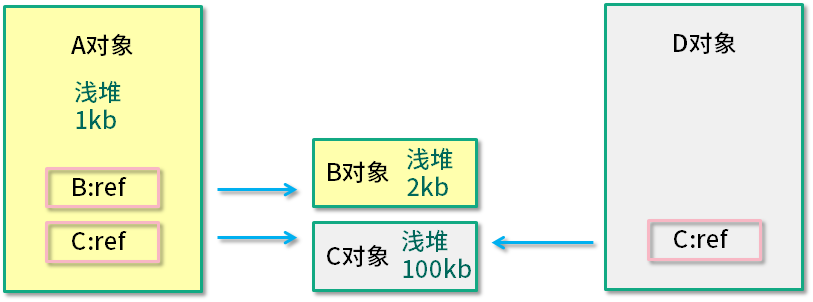

> 笔记来源：[尚硅谷 JVM 全套教程，百万播放，全网巅峰（宋红康详解 java 虚拟机）](https://www.bilibili.com/video/BV1PJ411n7xZ "尚硅谷JVM全套教程，百万播放，全网巅峰（宋红康详解java虚拟机）")
>
> 同步更新：https://gitee.com/vectorx/NOTE_JVM
>
> https://codechina.csdn.net/qq_35925558/NOTE_JVM
>
> https://github.com/uxiahnan/NOTE_JVM

[toc]

# 3. JVM 监控及诊断工具-GUI 篇


## 3.1. 工具概述

使用上一章命令行工具或组合能帮您获取目标 Java 应用性能相关的基础信息，但它们存在下列局限：

- 1．无法获取方法级别的分析数据，如方法间的调用关系、各方法的调用次数和调用时间等（这对定位应用性能瓶颈至关重要）。
- 2．要求用户登录到目标 Java 应用所在的宿主机上，使用起来不是很方便。
- 3．分析数据通过终端输出，结果展示不够直观。

为此，JDK 提供了一些内存泄漏的分析工具，如 jconsole，jvisualvm 等，用于辅助开发人员定位问题，但是这些工具很多时候并不足以满足快速定位的需求。所以这里我们介绍的工具相对多一些、丰富一些。

**图形化诊断工具**

**JDK 自带的工具**

- **jconsole**：JDK 自带的可视化监控工具。查看 Java 应用程序的运行概况、监控堆信息、永久区（或元空间）使用情况、类加载情况等
  - 位置：jdk\bin\jconsole.exe

- **Visual VM**：Visual VM 是一个工具，它提供了一个可视界面，用于查看 Java 虚拟机上运行的基于 Java 技术的应用程序的详细信息。
  - 位置jdk\bin\jvisualvm.exe

- JMC：Java Mission Control，内置 Java Flight Recorder。能够以极低的性能开销收集 Java 虚拟机的性能数据。

**第三方工具**

- **MAT**：MAT（Memory Analyzer Tool）是基于 Eclipse 的内存分析工具，是一个快速、功能丰富的 Java heap 分析工具，它可以帮助我们查找内存泄漏和减少内存消耗

- **JProfiler**：商业软件，需要付费。功能强大。

- **Arthas**：阿里提供的开源Java诊断工具

- **Btrace**：java运行时追踪工具，可以在不停机的情况下，跟踪指定的方法调用、构造函数调用和系统内存等信息

## 3.2. JConsole

### 1、基本概述

jconsole：

+ 从 Java5 开始，在 JDK 中自带的 java 监控和管理控制台。
+ 用于对 JVM 中内存、线程和类等的监控，是一个基于 JMX（java management extensions）的 GUI 性能监控工具。

官方地址：[https://docs.oracle.com/javase/7/docs/technotes/guides/management/jconsole.html](https://docs.oracle.com/javase/7/docs/technotes/guides/management/jconsole.html)

### 2、启动

直接在cmd中输入jconsole，或者在bin下执行exe文件。

### 3、三种链接方式

- **Local：**使用JConsole连接一个正在本地系统运行的JVM，并且执行程序的和运行JConsole的需要是同一个用户。JConsole使用文件系统的授权通过RMI连接器连接到平台的MBean服务器上。这种从本地连接的监控能力只有Sun的JDK具有。
- **Remote：**使用下面的URL通过RMI连接器连接到一个JMX代理，service:jmx:rmi:///jndi/rmi://hostName:portNum/jmxrmi。JConsole为建立连接，需要在环境变量中设置mx.remote.credentials来指定用户名和密码，从而进行授权。
- **Advanced：**使用一个特殊的URL连接JMX代理。一般情况使用自己定制的连接器而不是RMI提供的连接器来连接JMX代理，或者是一个使用JDK1.4的实现了JMX和JMX Rmote的应用。

### 4、主要作用

 Windows 或 macOS 的运行窗口或命令行输入 jconsole，然后回车，可以看到如下界面：


 本地进程列表列出了本机的所有 Java 进程（远程进程后续讲解），选择一个要连接的 Java 进程，点击连接，然后可以看到如下界面：


 注意，点击右上角的绿色连接图标，即可连接或断开这个 Java 进程。

上图中显示了总共 6 个标签页，每个标签页对应一个监控面板，分别为：

- 概览：以图表方式查看 Java 进程的堆内存、线程、类、CPU 占用率四项指标和历史。
- 内存：JVM 的各个内存池的使用情况以及明细。
- 线程：JVM 内所有的线程列表和具体的状态信息。
- 类：JVM 加载和卸载的类数量汇总信息。
- VM 概要：JVM 的供应商、运行时间、JVM 参数，以及其他数据的摘要。
- MBean：跟 JMX 相关的 MBean，后续讲解。

#### 概览

概览信息见上图，四项指标具体为：

1. 堆内存使用量：此处展示的就是前面 Java 内存模型课程中提到的堆内存使用情况，从图上可以看到，堆内存使用了 4MB 左右，并且一直在增长。
2. 线程：展示了 JVM 中活动线程的数量，当前时刻共有 14 个活动线程。
3. 类：JVM 一共加载了 1744 个类，没有卸载类。
4. CPU 占用率：目前 CPU 使用率为 0.0%，这个数值非常低，且最高的时候也不到 2%，初步判断系统当前并没有什么负载和压力。

在概览面板中，我们可以看到从 JConsole 连接到 Java 进程之后的所有数据。但是如果从连接进程到现在的时间很长，比如 2 天，那么这里的图表就因为要在一个界面展示而挤压到一起，历史的数据被平滑处理了，当前的变化细节就看不清楚。

所以，JConsole 提供了多个时间范围供我们选择，点击时间范围后面的下拉列表，即可查看不同区间的数据。有如下几个时间维度可供选择：1 分钟、5 分钟、10 分钟、30 分钟、1 小时、2 小时、3 小时、6小时、12 小时、1 天、7 天、1 个月、3 个月、6 个月、1 年、全部，一共是 16 档。

当我们想关注最近 1 小时或者 1 分钟的数据，就可以选择对应的档。旁边的 3 个标签页（内存、线程、类），也都支持选择时间范围。

#### 内存

 

内存监控，是 JConsole 中最常用的面板。内存面板的主区域中展示了内存占用量随时间变化的图像，可以通过这个图表，非常直观地判断内存的使用量和变化趋势。

同时在左上方，我们可以在图表后面的下拉框中选择不同的内存区：


本例中，我们使用的是 JDK 8，默认不配置 GC 启动参数。可以看到，这个 JVM 提供的内存图表包括：

- 堆内存使用量，主要包括老年代（内存池“PS Old Gen”）、新生代（“PS Eden Space”）、存活区（“PS Survivor Space”）；
- 非堆内存使用量，主要包括内存池“Metaspace”、“Code Cache”、“Compressed Class Space”等；
- 可以分别选择对应的 6 个内存池。

通过内存面板，我们可以看到各个区域的内存使用和变化情况，并且可以：

1. 手动执行 GC，点击按钮即可执行 JDK 中的 System.gc()，直接触发 GC 操作，一般来说，除非启动时明确指定了禁止手动 GC，否则 JVM 都会立刻执行 FullGC；
2. 通过图中右下角的界面，可以看到各个内存池的百分比使用率，以及堆/非堆空间的汇总使用情况，这个图会实时变化，同时可以直接点击这里的各个部分快速切换上方图表，显示对应区域的内存使用情况；
3. 从左下角的界面，可以看到 JVM 使用的垃圾收集器，以及执行垃圾收集的次数，以及相应的时间消耗。

打开一段时间以后，我们可以看到内存使用量出现了波峰曲线，只要曲线出现了下降就表明经过了一次 GC，也就是 JVM 执行了垃圾回收。



其实我们可以注意到，内存面板其实相当于是 `jstat -gc` 或 `jstat -gcutil` 命令的图形化展示，它们的本质是一样的，都是通过采样的方式拿到JVM各个内存池的数据进行统计，并展示出来。

其实图形界面存在一个问题，如果 GC 特别频繁，每秒钟执行了很多次 GC，实际上图表方式就很难反应出每一次的变化信息。

#### 线程

线程面板展示了线程数变化信息，以及监测到的线程列表。

- 我们可以常根据名称直接查看线程的状态（运行还是等待中）和调用栈（正在执行什么操作）。
- 特别地，我们还可以直接点击“检测死锁”按钮来检测死锁，如果没有死锁则会提示“未检测到死锁”。



#### 类

类监控面板，可以直接看到 JVM 加载和卸载的类数量汇总信息。


#### VM 概要


VM 概要的数据也很有用，可以看到总共有五个部分：

- 第一部分是虚拟机的信息；
- 第二部分是线程数量，以及类加载的汇总信息；
- 第三部分是堆内存和 GC 统计；
- 第四部分是操作系统和宿主机的设备信息，比如 CPU 数量、物理内存、虚拟内存等等；
- 第五部分是 JVM 启动参数和几个关键路径，这些信息其实跟 jinfo 命令看到的差不多。


## 3.3. Visual VM

### 基本概述

+ Visual VM 是一个功能强大的多合一故障诊断和性能监控的可视化工具。
+ 它集成了多个 JDK 命令行工具，使用 Visual VM 可用于显示虚拟机进程及进程的配置和环境信息（jps，jinfo），监视应用程序的 CPU、GC、堆、方法区及线程的信息（jstat、jstack）等，甚至代替 JConsole。
+ 在 JDK 6 Update 7 以后，Visual VM 便作为 JDK 的一部分发布（VisualVM 在 JDK／bin 目录下）即：它完全免费。
+ 此外，Visual VM也可以作为独立的软件安装。

官方地址：[https://visualvm.github.io/index.html](https://visualvm.github.io/index.html)

### 插件安装


插件市场安装：https://visualvm.github.io/pluginscenters.html

**图形化安装**


**IDEA快捷启动**

idea中安装VisualVM Launcher快捷启动VisualVM 【替换命令行】，安装后设置如下


### 连接方式

- 本地连接：监控本地Java进程的CPU、类、线程等
- 远程连接：
  1. 确定远程服务器的ip地址
  2. 添加JMX（通过JMX技术具体监控远端服务器的某个Java进程）
  3. 修改bin/catalina.sh文件，连接远程的tomcat
  4. 在…/conf中添加jmxremote.access和jmxremote.password文件
  5. 将服务器地址改成公网ip地址
  6. 设置阿里云安全策略和防火墙策略
  7. 启动tomcat，查看tomcat启动日志和端口监听
  8. JMX中输入端口号、用户名、密码登录　


### **主要功能：**

- 1.生成/读取堆内存/线程快照
- 2.查看 JVM 参数和系统属性
- 3.查看运行中的虚拟机进程
- 4.程序资源的实时监控
- 5.JMX 代理连接、远程环境监控、CPU 分析和内存分析


在命令行或者运行窗口直接输入 jvisualvm 即可启动，JVisualVM 启动后的界面大致如下：


在其中可以看到本地的 JVM 实例。

通过双击本地进程或者右键打开，就可以连接到某个 JVM，此时显示的基本信息如下图所示：

#### **概述标签页**

可以看到，在概述页签中有 PID、启动参数、系统属性等信息。




**切换到监视页签：**

如果没有监视页签选项，需要安装插件，但是默认的下载地址不对，需要配置，修改的具体地址可以在下面的地址中找到https://visualvm.github.io/pluginscenters.html


 修改以后，就可以看见能安装的插件列表


####  **监视页签**

在监视页签中可以看到 JVM 整体的运行情况。比如 CPU、堆内存、类、线程等信息。还可以执行一些操作，比如“强制执行垃圾回收”、“堆 Dump”等。


#### 线程页签

**"线程"页签则展示了 JVM 中的线程列表。**

 与 JConsole 只能看线程的调用栈和状态信息相比，这里可以直观看到所有线程的状态颜色和运行时间，从而帮助我们分析过去一段时间哪些线程使用了较多的 CPU 资源。

检测死锁


#### dump生成和读取

**生成：**

文件需要另存为持久化保存


**读取**


**实例数和dump差异分析**

如果两个时间点分析对象数量剧增，可能存在OOM问题


**OQL**分析


#### 抽样器与 Profiler

JVisualVM 默认情况下，比 JConsole 多了抽样器和 Profiler 这两个工具。

例如抽样，可以配合我们在性能压测的时候，看压测过程中，各个线程发生了什么、或者是分配了多少内存，每个类直接占用了多少内存等等。


**cpu采样**


 

 

**内存采样**

 使用 Profiler 时，需要先校准分析器。


 然后可以像抽样器一样使用了。

Profiler 面板直接能看到热点方法与执行时间、占用内存以及比例，还可以设置过滤条件。

同时我们可以直接把当前的数据和分析，作为快照保存，或者将数据导出，以后可以继续加载和分析。

#### VisualGC 页签：


在其中可以看到各个内存池的使用情况，以及类加载时间、GC 总次数、GC 总耗时等信息。比起命令行工具要简单得多。

####  MBeans 标签：


主要看 java.lang 包下面的 MBean。比如内存池或者垃圾收集器等。

从图中可以看到，Metaspace 内存池的 Type 是 NON_HEAP。

当然，还可以看垃圾收集器（GarbageCollector）。

对所有的垃圾收集器，通过 JMX API 获取的信息包括：

- CollectionCount：垃圾收集器执行的 GC 总次数。
- CollectionTime：收集器运行时间的累计，这个值等于所有 GC 事件持续时间的总和。
- LastGcInfo：最近一次 GC 事件的详细信息。包括 GC 事件的持续时间（duration）、开始时间（startTime）和结束时间（endTime），以及各个内存池在最近一次 GC 之前和之后的使用情况。
- MemoryPoolNames：各个内存池的名称。
- Name：垃圾收集器的名称。
- ObjectName：由 JMX 规范定义的 MBean 的名字。
- Valid：此收集器是否有效。本人只见过 "true" 的情况。

这些信息对分析GC性能来说，不能得出什么结论。只有编写程序，获取GC相关的 JMX 信息来进行统计和分析。

#### 远程实时监控

下面看怎么执行远程实时监控。



 

如上图所示，从文件菜单中，我们可以选择“添加远程主机”，以及“添加 JMX 连接”。

比如“添加 JMX 连接”，填上 IP 和端口号之后，勾选“不要求 SSL 连接”，点击“确定”按钮即可。

关于目标 JVM 怎么启动 JMX 支持，后续再讨论。

远程主机则需要 JStatD 的支持，后续再讨论。


## 3.4. Eclipse MAT

MAT（Memory Analyzer Tool）工具是一款功能强大的 Java 堆内存分析器。可以用于查找内存泄漏以及查看内存消耗情况。MAT 是基于 Eclipse 开发的，不仅可以单独使用，还可以作为插件的形式嵌入在 Eclipse 中使用。是一款免费的性能分析工具，使用起来非常方便。

官方下载地址：https://eclipse.dev/mat/downloads.php，解压后直接使用


### 获取堆dump文件

MAT 可以分析 heap dump 文件。在进行内存分析时，只要获得了反映当前设备内存映像的 hprof 文件，通过 MAT 打开就可以直观地看到当前的内存信息。一般说来，这些内存信息包含：

- 所有的对象信息，包括对象实例、成员变量、存储于栈中的基本类型值和存储于堆中的其他对象的引用值。
- 所有的类信息，包括 classloader、类名称、父类、静态变量等
- GCRoot 到所有的这些对象的引用路径
- 线程信息，包括线程的调用栈及此线程的线程局部变量（TLS）


#### 两点说明：

说明1缺点：

MAT 不是一个万能工具，它并不能处理所有类型的堆存储文件。但是比较主流的厂家和格式，例如 Sun，HP，SAP 所采用的 HPROF 二进制堆存储文件，以及 IBM 的 PHD 堆存储文件等都能被很好的解析。

说明2：

最吸引人的还是能够快速为开发人员生成**「内存泄漏报表 Leak suspects」**，方便定位问题和分析问题。虽然 MAT 有如此强大的功能，但是内存分析也没有简单到一键完成的程度，很多内存问题还是需要我们从 MAT 展现给我们的信息当中通过经验和直觉来判断才能发现。


#### **获取dump文件**

- 方法一：通过前文介绍的jmap工具生成，可以生成任意-一个java进程的dump文件;

  - ```sh
    jmap -dump:format=b,file=<filename.hprof> <pid>
    jmap -dump:live,format=b,file=<filename.hprof> <pid>
    
    例子：
    jps
    jmap -dump:live,format=b,file=D:\2024-3-39-OOM.hprof 31596
    ```

- 方法二：通过配置JVM参数生成。

  - 选项"`-XX:+HeapDumpOnOutOfMemoryError`"或"`-XX:+HeapDumpBeforeFullGC`"
  - 选项"`-XX:HeapDumpPath`"所代表的含义就是当程序出现0utofMemory时，将会在相应的目录下 生成一份dump文件。如果不指定选项“-XX:HeapDumpPath" 则在当前目录下生成dump文件。
  - 对比:考虑到**生产环境**中几乎不可能在线对其进行分析，**大都是采用离线分析，因此使用`jmap+MAT`工具是最常见的组合。**

- 方法三：使用VisualVM可以导出堆dump文件,点击按钮

  - 

- 方法四：使用MAT既可以打开一个已有的堆快照，也可以通过MAT直接从活动Java程序中导出堆快照。 该功能将借助jps列出当前正在运行的Java 进程，以供选择并获取快照。

  - 


#### **案例 堆dump文件**

如果dump文件过大，可以修改 MAT 的配置参数。在 MAT 安装目录下，修改配置文件：MemoryAnalyzer.ini。默认的内存配置是 1024MB，修改如下部分：

```ini
-vmargs
-Xmx1024m
```

根据 Dump 文件的大小，适当增加最大堆内存设置，要求是 4MB 的倍数，例如改为：

```ini
-vmargs
-Xmx4g
```

**demo演示**

新建demo:

```java
public class Objects4MAT {
    static class A4MAT {
        B4MAT b4MAT = new B4MAT();
    }

    static class B4MAT {
        C4MAT c4MAT = new C4MAT();
    }

    static class C4MAT {
        List<String> list = new ArrayList<>();
    }

    static class DominatorTreeDemo1 {
        DominatorTreeDemo2 dominatorTreeDemo2;

        public void setValue(DominatorTreeDemo2 value) {
            this.dominatorTreeDemo2 = value;
        }
    }

    static class DominatorTreeDemo2 {
        DominatorTreeDemo1 dominatorTreeDemo1;

        public void setValue(DominatorTreeDemo1 value) {
            this.dominatorTreeDemo1 = value;
        }
    }

    static class Holder {
        DominatorTreeDemo1 demo1 = new DominatorTreeDemo1();
        DominatorTreeDemo2 demo2 = new DominatorTreeDemo2();

        Holder() {
            demo1.setValue(demo2);
            demo2.setValue(demo1);
        }

        private boolean aBoolean = false;
        private char aChar = '\0';
        private short aShort = 1;
        private int anInt = 1;
        private long aLong = 1L;
        private float aFloat = 1.0F;
        private double aDouble = 1.0D;
        private Double aDouble_2 = 1.0D;
        private int[] ints = new int[2];
        private String string = "1234";
    }

    Runnable runnable = () -> {
        Map<String, A4MAT> map = new HashMap<>();

        IntStream.range(0, 100).forEach(i -> {
            byte[] bytes = new byte[1024 * 1024];
            String str = new String(bytes).replace('\0', (char) i);
            A4MAT a4MAT = new A4MAT();
            a4MAT.b4MAT.c4MAT.list.add(str);

            map.put(i + "", a4MAT);
        });

        Holder holder = new Holder();

        try {
            //sleep forever , retain the memory
            Thread.sleep(Integer.MAX_VALUE);
        } catch (InterruptedException e) {
            e.printStackTrace();
        }
    };

    void startHugeThread() throws Exception {
        new Thread(runnable, "huge-thread").start();
    }

    public static void main(String[] args) throws Exception {
        Objects4MAT objects4MAT = new Objects4MAT();
        objects4MAT.startHugeThread();
    }
}
```

代码创建了一个新的线程 "huge-thread"，并建立了一个引用的层级关系，总的内存大约占用 100 MB。同时，demo1 和 demo2 展示了一个循环引用的关系。最后，使用 sleep 函数，让线程永久阻塞住，此时整个堆处于一个相对“静止”的状态。



 

**得到dump文件**

运行上面代码，并通过jps获取进程号，接着执行以下命令行获取dump文件。

```sh
jmap -dump:format=b,file=d:\test\a.hprof 25876
```

通过MAT打开a.hprof文件。


这种方式对应的是获取dump文件的方法一。

也可以通过方法四获取：


选择指定进程生成dump文件

 


如果问题特别突出，则可以通过 Find Leaks 菜单快速找出问题。



如下图所示，展示了名称叫做 huge-thread 的线程，持有了超过 99% 的对象，数据被一个 HashMap 所持有。


 

### 打开dump后选项-入门向导


> + Leak Suspects Report疑似泄漏报告
>   Automatically check the heap dump for leak suspects. Report what objects are kept alive and why they are not garbage collected.
>   自动检查堆转储中是否存在泄漏嫌疑。报告哪些对象保持活动状态，以及为什么不进行垃圾收集。
>
> + Component Report组件报告
>   Analyze a set of objects for suspected memory issues: duplicate strings, empty collections, finalizer, weak references, etc.
>   分析一组对象的可疑内存问题：重复字符串、空集合、终结器、弱引用等。
>
> + Re-open previously run reports重新打开以前运行的报告
>   Existing reports are stored in ZIP files next to the heap dump.
>   现有报告存储在堆转储旁边的ZIP文件中。


### 0. **「overview概述」**


```txt
功能说明：
Actions：
	Histogram 柱状图
	: Lists number of instances per class
	列出每个类的实例数

	Dominator Tree支配树
	: List the biggest objects and what they keep alive.
	列出最大的物体以及它们能保存的东西。

	Top Consumers
	: Print the most expensive objects grouped by class and by package.
	打印按类和包分组的最大的对象。


	Duplicate Classes重复类
	: Detect classes loaded by multiple class loaders.
	检测由多个类加载器加载的类 
	不同类判断依据：类加载器+全限定鸣雏


reports
	Leak Suspects疑似泄漏
	: includes leak suspects and a system overview.
	包括可疑泄漏和系统概述。

	Top Components顶级组件
	: list reports for components bigger than 1 percent of the total heap.
	：列出大于总堆的1%的组件的报告

	Leak Suspects by Snapshot Comparison快照比较的疑似泄漏
	: includes leak suspects and a system overview from comparing two snapshots.
	包括泄漏嫌疑和比较两个快照的系统概述

step by step

	Component Report组件报告
	: Analyze objects which belong to a common root package or class loader.
	：分析属于通用根包或类加载器的对象。

```


### **1.histogram 直方图：**

展示了各个类的实例数目以及这些实例的「Shallow Heap 浅堆」或者「Retained Heap 深堆」的总和，并支持基于实例数目或 Retained heap 的排序方式（默认为 Shallow heap）。此外，还可以将直方图中的类按照超类、类加载器或者包名分组。


#### **显示类的基础信息 分组显示**

可以根据包名group by


#### **显示排序：**


#### **regex筛选**


#### 显示GCRoos路径 查看引用


#### **两个dump文件差异对比：分析类的差异**


看一下柱状图视图，可以看到除了对象的大小，还有类的实例个数。结合 MAT 提供的不同显示方式，往往能够直接定位问题。也可以通过正则过滤一些信息，我们在这里输入 MAT，过滤猜测的、可能出现问题的类，可以看到，创建的这些自定义对象，不多不少正好一百个。

****

右键点击类，然后选择 incoming，这会列出所有的引用关系。


再次选择某个引用关系，然后选择菜单“Path To GC Roots”，即可显示到 GC Roots 的全路径。通常在排查内存泄漏的时候，会选择排除虚弱软等引用。使用这种方式，即可在引用之间进行跳转，方便的找到所需要的信息。


再介绍一个比较高级的功能。

我们对于堆的快照，其实是一个“瞬时态”，有时候仅仅分析这个瞬时状态，并不一定能确定问题，这就需要对两个或者多个快照进行对比，来确定一个增长趋势。


可以将代码中的 100 改成 10 或其他数字，再次 dump 一份快照进行比较。


### **2.thread overview 线程概述：**

##### 查看系统中的Java线程

如图展示了**线程内对象的引用关系**，以及**方法调用关系  [方法栈]**，相对比 jstack 获取的栈 dump，我们能够更加清晰地看到内存中具体的数据。而且，我们找到了 huge-thread，依次展开找到 holder 对象，可以看到循环依赖已经陷入了无限循环的状态。这在查看一些 Java 对象的时候，经常发生。



线程堆栈信息：


##### 查看局部变量的信息


### **3.对象相互引用的关系 In out references**

基于对象的出引用与入引用分析内存泄漏

with outgoing references(对象的引出) 和 with incoming reference(对象的引入  谁引用该对象)

path to GC Roots 显示和 GC Roots 之间的路径。


 **with outgoing references查看该对象引用了谁**

可以看到0x746da0020对象引用了name、elementData，elementData数组中又包含很多引用


 **with incoming reference谁引用该对象**

可以看到0x746e3d0b8对象被0x746e37ac0、0x746e2db38、0x746e3d160三个对象引用


### **4.浅堆和深堆**

MAT 计算对象占据内存的两种方式。shallow heap和retained heap。【类比浅拷贝和深拷贝】

#### **浅堆（shallow heap）**

是指一个对象所消耗的内存，包括对象自身的内存占用，以及“为了引用”其他对象所占用的内存。。

（1）在 32 位系统中，一个对象引用会占据 4 个字节，一个 int 类型会占据 4 个字节，long 型变量会占据 8 个字节，每个对象头需要占用 8 个字节

（2）根据堆快照格式不同，对象的大小可能会同 8 字节进行对齐


一个对象占用的内存大小可以分为下面三部分：

1. 对象头

   > 其中：对象头主要分为三部分
   >
   > 1. Mark word运行时元数据：这个主要保存了对象的哈希值、GC分代年龄、锁信息等等占用8个字节。
   > 2. 类型指针：指向方法区该类的Class，开启压缩指针后4个字节，不开启8字节
   >
   > 3. 数组长度：如果当前对象是数组类型的，那么还会拥有4字节的数组长度
   >
   > 那么对象头的大小=Mark word 8 + 指针大小4 + [4:如果是数组的话]
2. 对象成员占用内存
3. 内存对齐


在内存小于32G的情况下，我们默认采用了**压缩指针**，指针长度为32位。我们也可以禁用压缩指针，那么指针长度将为64位。一般我们个人开发的情况下，内存基本都小于32G，所以我们可以认**为普通对象的对象头大小为12字节**，**数组为16字节**。

在32位系统中，一个对象引用会占用4个字节，一个int类型会占用4个字节，long类型会占用8个字节，每个对象头会占用12或16个字节。根据堆快照格式不同，对象的大小可能会向8字节进行对齐。对象头除去类型指针的大小为8字节，然后类型指针看是否启用了引用压缩，如果启用了，对象头总共就是12字节，否则就是16字节。


**以String为例**：1个int值共占4个字节，对象引用占用4个字节，对象头12个字节，合计20个字节。向8字节对齐，故占24字节。这24 字节为String对象的浅堆大小。它与String的value实际取值无关，无论字符串长度如何，浅堆大小始终是24字节。


 

#### **保留集（Retained Set）**：

对象A的保留集指当对象A被垃圾回收后，可以被释放的所有的对象集合（包括对象A本身），即对象A的保留集可以被认为是只能通过对象A被直接或间接访问到的所有对象的集合。通俗地说，就是指仅被对象A所持有的的对象的集合。


#### **深堆（Retained Heap）**

是指对象的保留集中所有的对象的浅堆大小之和。


注意：浅堆指对象本身占有的内存，不包括其内部引用对象的大小，一个对象的深堆指只能通过该对象访问到的（直接或间接）所有对象的浅堆之和，即对象被回收，可以释放的总内存，

包括对象自身所占据的内存，以及仅能够通过该对象引用到的其他对象所占据的内存，这些其他对象集合，叫做保留集（Retained Set）。


#### **对象的实际大小**

1、定义：一个对象能触及的所有对象的浅堆大小之和，即通常意义上对象大小

2、实际上该概念和垃圾回收无关

3、对象引用关系（例）：对象 A 引用 C、D，对象 B 引用 C、E


（1）对象 A 浅堆大小只是 A 本身，不含 C、D

（2）A 实际大小为 A、C、D 三者之和

（3）A 深堆大小为 A、D 之和，由于对象 C 还可以通过对象 B 访问，因此不在对象 A 的深堆范围内


#### 案例分析入门



如上图所示，A 对象浅堆大小 1 KB，B 对象 2 KB，C 对象 100 KB。A 对象同时引用了 B 对象和 C 对象，但由于 C 对象也被 D 引用，所以 A 对象的深堆大小为 3 KB（1 KB + 2 KB）。

A 对象大小（1 KB + 2 KB + 100 KB）> A 对象深堆 > A 对象浅堆。


#### **对象深堆、浅堆和实际大小计算案例**

**代码**

```java
/**
 * 有一个学生浏览网页的记录程序，它将记录 每个学生访问过的网站地址。
 * 它由三个部分组成：Student、WebPage和StudentTrace三个类
 *
 *  -XX:+HeapDumpBeforeFullGC -XX:HeapDumpPath=d:\student.hprof
 */
public class StudentTrace {
    static List<WebPage> webpages = new ArrayList<WebPage>();


    public static void createWebPages() {
        for (int i = 0; i < 100; i++) {
            WebPage wp = new WebPage();
            wp.setUrl("http://www." + Integer.toString(i) + ".com");
            wp.setContent(Integer.toString(i));
            webpages.add(wp);
        }
    }

    public static void main(String[] args) {
        createWebPages();//创建了100个网页
        //创建3个学生对象
        Student st3 = new Student(3, "Tom");
        Student st5 = new Student(5, "Jerry");
        Student st7 = new Student(7, "Lily");

        for (int i = 0; i < webpages.size(); i++) {
            if (i % st3.getId() == 0)
                st3.visit(webpages.get(i));
            if (i % st5.getId() == 0)
                st5.visit(webpages.get(i));
            if (i % st7.getId() == 0)
                st7.visit(webpages.get(i));
        }
        webpages.clear();
        System.gc();

    }
}

class Student {
    private int id;
    private String name;
    private List<WebPage> history = new ArrayList<>();

    public Student(int id, String name) {
        super();
        this.id = id;
        this.name = name;
    }

    public int getId() {
        return id;
    }

    public void setId(int id) {
        this.id = id;
    }

    public String getName() {
        return name;
    }

    public void setName(String name) {
        this.name = name;
    }

    public List<WebPage> getHistory() {
        return history;
    }

    public void setHistory(List<WebPage> history) {
        this.history = history;
    }

    public void visit(WebPage wp) {
        if (wp != null) {
            history.add(wp);
        }
    }
}


class WebPage {
    private String url;
    private String content;

    public String getUrl() {
        return url;
    }

    public void setUrl(String url) {
        this.url = url;
    }

    public String getContent() {
        return content;
    }

    public void setContent(String content) {
        this.content = content;
    }
}

```


利用MAT打开student.hprof


 

分析：

> 补充知识：
>
> 对象头包括 Mark Word  8字节
>
> class Point 类型指针占了 8 个字节，开启`-XX:-UseCompressedClassPointers`类型指针的压缩为4字节
>
> 数组包含长度 4字节
>
> 


**浅堆数据分析**

 三个对象的浅堆大小为24字节，因为两个引用name、history占用4*2 = 8字节，id一个int占用4字节，对象头8字节，类型指针4字节，总共24字节。


**深堆计算分析**

 

 每个student对象的网页集合字段中的每个对象所占用的深堆大小为152和144。

**1.为什么有152字节和144字节：因为我们的URL和content存在两种情况**

URL:"http://www.7.com"、content:"7"

URL:"http://www.14.com"、content:"14"

第一种URL长度为16，底层的char数组的占用空间为(【】方括号里面整个都属于对象头，分开写方便大家理解)
【普通对象头和类型指针(12) + 数组长度(4)】 + 16个字符(32) = 48字节，符合8字节对齐
同理content 占用 【普通对象头(12) +数组长度(4)】+ 一个字符(2) = 18字节,八字节对齐=24字节

第二种URL长度为17，底层的插入数组的占用空间为
【普通对象头和对齐字节(12) + 数组长度(4)】 + 17个字符(34) = 50字节，不符合8字节对齐，对齐为56
同理content 占用 【普通对象头和对齐字节(12) +数组长度(4)】+ 两个字符(4) = 20字节,八字节对齐=24字节

所以第一种总字节为48 + 24 = 72,第二种总字节为56 + 24 = 80。因此第二种比第一种多了8字节，所以是152和144。

(为什么总大小是152而不是72是因为我们只计算了String底层的char数组的区别没有计算各变量本身的浅堆,
因为结构都想相同，所以差别就差在内容的占用上)

**2.为什么最终结果是1288**

【普通对象头(12) + 数组长度(4)】 + 数组内容【15个Obejct引用=16*4】 = 76,对齐填充4字节对齐=80字节
15个Object分为13个152字节+2个144字节，总大小为=2264字节
7号和其他student重复的有0、21、42、63、84、35、70总计6个152和1一个144

首先ElementData数组本身的浅堆大小为 
【普通对象头和类型指针(12) +  数组长度(4)】 + 数组内容【15个Obejct引用=15*4】 = 76+对齐填充4字节 =80字节

15个Object分为13个152字节+2个144字节，总大小为=2264字节
7号和其他student【3,5】重复的有0、21、42、63、84、35、70总计6个152和1一个144
所以2264 - 6 * 152 - 144 = `1208`字节
所以ElementData本身的浅堆80 + 仅能通过它到达的浅堆1208 = 1288


**MAT 包括了两个比较重要的视图，分别是直方图（histogram）和支配树（dominator tree）。**

### 5、**支配树（Dominator Tree）**

#### 概念

支配树的概念源自图论

MAT提供了一个称为支配树的对象图。支配树视图对数据进行了归类，体现了对象实例间的支配关系。在对象引用图中，所有指向对象B的路径都经过对象A ，则认为**对象A支配了对象B**。如果对象A时离对象B最近的一个支配对象，则认为对象**A为对象B的直接支配者**，支配树是基于对象间的引用图所建立的，它有以下基本性质：

- 对象A的子树（所有被对象A支配的对象集合）表示对象A的保留集（retained set），即深堆。
- 如果对象A支配对象B，那么对象A的直接支配者也支配对象B。
- 支配树的边与对象引用图的边不直接对应。

如下图所示：**左图表示对象引用图**，**右图表示左图所对应的支配树**。

> 对象A和B由根对象直接支配，由于在到对象C的路径中，可以经过A，也可以经过B，因此对象C的直接支配者也是根对象。对象F与对象D相互引用，因为到对象F的所有路径必然经过对象D，因此，对象D时对象F的直接支配者。而到对象D的所有路径中，必然经过对象C，即使是从对象F到对象D的引用，从根节点触发，也是经过对象C的，所以，对象D的直接支配者为对象C。
>
>  同理，对象E支配对象G，支配关系是可传递的，因为 C 支配 E，所以 C 也支配 G。到达对象H可以通过对象D，也可以通过对象E，因此对象D和E都不能支配对象H，而经过对象C既可以到达D也可以到达E，因此对象C为对象H的直接支配者。


 

作用：如果回收了C，FGDEH都需要回收


#### **打开支配树视图**

在MAT中，单击工具栏的对象支配树按钮，可以打开对象支配树制图


#### 接着深堆浅堆案例分析：

分析Lily【`0x746da0050`】的支配图，数组中只有8个元素


与thread overview视图中16个元素不一致，因为有部分元素被其他对象引用，被`0x746da0050支配的只有8个


#### **MAT支配树视图**


如图，我们通常会根据“深堆”进行倒序排序，可以很容易的看到占用内存比较高的几个对象，点击前面的箭头，即可一层层展开支配关系。

图中显示的是其中的 2 MB 数据，从左侧的 inspector 视图，可以看到这 2 MB 的 byte 数组具体内容。

从支配树视图同样能够找到我们创建的两个循环依赖，但它们并没有显示这个过程。


### 6、OQL

MAT 支持一种类似于 SQL 的查询语言 OQL（Object Query Language），这个查询语言 VisualVM 工具也支持。


以下是几个例子

查询 A4MAT 对象：

```
SELECT * FROM  com.xiaojie.jvm.Objects4MAT$A4MAT
```

正则查询 MAT 结尾的对象：

```
SELECT * FROM ".*MAT"
```

查询包含 java 字样的所有字符串：

```
SELECT * FROM java.lang.String s WHERE toString(s) LIKE ".*java.*"
```

查找所有深堆大小大于 1 万的对象：

```
SELECT * FROM INSTANCEOF java.lang.Object o WHERE o.@retainedHeapSize>10000
```

 

### Eclipse-MAT 案例：Tomcat堆溢出分析

> 定位思路;
>
> 直方图查看占用内存 （深堆浅堆）最多的对象  分析引用  （泄露or溢出） 引用路径
>
> 线程 占用内存大小   查看堆栈  定位
>
> 系统自动生成泄露报告


#### 说明

Tomcat是最常用的Java Servlet容器之一，同时也可以当做单独的Web服务器使用。Tomcat本身使用Java实现，并运行于Java虚拟机之上。在大规模请求时，Tomcat有可能会因为无法承受压力而发生内存溢出错误。这里根据一个被压垮的Tomcat的堆快照文件，来分析Tomcat在崩溃时的内部情况。

#### 分析过程

图7.22显示了Tomcat溢出时的总体信息，可以看到堆的大小为29.7MB。从统计饼图中得知，当前深堆最大的对象为StandardManager，它持有大约16.4MB的对象。


一般来说，我们总是会对占用空间最大的对象特别感兴趣，如果可以查看StandardManager内部究竟引用了哪些对象，对于分析问题可能会起到很大的帮助。因此，在饼图中单击StandardManager所在区域，在弹出菜单中选择“with outgoing references”命令，如图7.23所示。这样将会列出被StandardManager引用的所有对象。


图7.24显示了被StandardManager引用的对象，其中特别显眼的就是sessions对象，它占用了约17MB空间。


继续查找，打开sessions对象，查看被它引用的对象，如图7.25所示。可以看到sessions对象为ConcurrentHashMap，其内部分为16个Segment。从深堆大小看，每个Segment都比较平均，大约为1MB,合计17MB。继续打开Segment,查看存储在sessions中的真实对象。如图7.26所示，可以找到内部存放的为StandardSession对象。


通过OQL命令，查找所有的StardardSession，如图7.27所示。可以看到当前堆中含有9941个session,并且每一个session的深堆为1592字节，合计约15MB，达到当前堆大小的50%。由此，可以知道，当前Tomcat发生内存溢出的原因，极可能是由于在短期内接收大量不同客户端的请求，从而创建大量session导致。


为了获得更为精确的信息，可以查看每一个session的内部数据，如图7.28所示，在左侧的对象属性表中，可以看到所选中的session的最后访问时间和创建时间。


通过OQL命令和MAT的排序功能，如图7.29所示，可以找到当前系统中最早创建的session和最后创建的session。再根据当前的session总数，可以计算每秒的平均压力为：9941/(1403324677648-1403324645728)*1000=311次/秒。

由此推断，在发生Tomcat堆溢出时，Tomcat在连续30秒的时间内，平均每秒接收了约311次不同客户端的请求，创建了合计9941个session。


### CPU飙升分析

测试代码：

```java
/**
 * -Xmx100m -Xms100m -XX:MetaspaceSize=64m -XX:MaxMetaspaceSize=128m -Xss256k
 * -XX:+UseG1GC
 * -XX:SurvivorRatio=8
 * -XX:MaxGCPauseMillis=200
 * -XX:G1ReservePercent=10
 * -XX:InitiatingHeapOccupancyPercent=40
 * -XX:ParallelGCThreads=8
 * -Xloggc:/Users/guoyanfei/logs/shm/gc.log
 * -XX:+PrintGCApplicationStoppedTime
 * -XX:+PrintGCDateStamps
 * -XX:+PrintGCDetails
 * -XX:+PrintCodeCache
 * -XX:+UseGCLogFileRotation
 * -XX:NumberOfGCLogFiles=2
 * -XX:GCLogFileSize=10m
 * -XX:+HeapDumpOnOutOfMemoryError
 * -XX:HeapDumpPath=/Users/guoyanfei/logs/
 * -XX:MaxDirectMemorySize=50M
 * Created by guoyanfei .
 * 2021/9/6 .
 */
@RestController
@RequestMapping("/test/jvm")
public class TestJvmController {

    private Queue<byte[]> bss = new LinkedList<>();

    /**
     * 每个1秒往bss的queue中加入1M数据，该数据无法被垃圾回收
     * 超过20M后，开始出队列，模拟一直FGC的情况
     * @return
     */
    @SneakyThrows
    @GetMapping("/cpu")
    public String cpu() {
        int i = 0;
        while (true) {
            Thread.sleep(10);
            if (i++ > 20) {
                bss.poll();
            }
            byte[] bs = new byte[1 * 1024 * 1024];
            bss.add(bs);
        }
    }

}
```

以上测试代码，在部署完成后，访问此Controller接口，可以发现CPU飙升，通过[[Java应用CPU使用率高一般排查思路(centos)]]进行排查，可以发现JVM一直在进行FGC，然后dump堆快照，通过MAT进行排查

观察 Histogram ，可以发现byte[]的 Retained Heap >= 23729680 Byte = 22.63MB，而JVM的堆内存总大小只有100MB，所以考虑byte[]存在问题


右键点击 byte[] -> List objects -> with incoming references (谁引用了我)


可以看到有一堆(20多个)1MB大小的byte[]对象，而这些对象无法被回收，一般都会有GC Roots可以触达这些对象，所以我们需要找到这些对象到GC Roots的路径，选择任意一个右键 Path To GC Roots -> with all references


可以发现，cn.com.duiba.duiba.test.web.controller.TestJvmController bss对象，是我们自己写的代码，再简单看下代码实现，即可发现问题所在

------

以上只是一种排查方式，其实使用支配树视图，可以更加清晰明了地发现该问题：


## 3.5. JProfiler

在运行 Java 的时候有时候想测试运行时占用内存情况，这时候就需要使用测试工具查看了。在 eclipse 里面有 Eclipse Memory Analyzer tool（MAT）插件可以测试，而在 IDEA 中也有这么一个插件，就是 JProfiler。

JProfiler 是由 ej-technologies 公司开发的一款 Java 应用性能诊断工具。功能强大，但是收费。


### **特点：**

- 使用方便、界面操作友好（简单且强大）

- 对被分析的应用影响小（提供模板）

- CPU，Thread，Memory 分析功能尤其强大

- 支持对 jdbc，noSql，jsp，servlet，socket 等进行分析

- 支持多种模式（离线，在线）的分析

- 支持监控本地、远程的 JVM

- 跨平台，拥有多种操作系统的安装版本

  


### **主要功能：**

- **1-方法调用**：对方法调用的分析可以帮助您了解应用程序正在做什么，并找到提高其性能的方法
- **2-内存分配**：通过分析堆上对象、引用链和垃圾收集能帮您修复内存泄露问题，优化内存使用
- **3-线程和锁**：JProfiler 提供多种针对线程和锁的分析视图助您发现多线程问题
- **4-高级子系统**：许多性能问题都发生在更高的语义级别上。例如，对于 JDBC 调用，您可能希望找出执行最慢的 SQL 语句。JProfiler 支持对这些子系统进行集成分析

### **下载安装与配置**

官网地址：[https://www.ej-technologies.com/products/jprofiler/overview.html](https://www.ej-technologies.com/products/jprofiler/overview.html)


**设置一：JProfier集成idea**


**设置二：idea中集成JProfier**

插件市场下载JProfier插件


### **数据两种采集方式：**

JProfier 数据采集方式分为两种：Sampling（样本采集）和 Instrumentation（重构模式）


+ **Instrumentation**：这是 `JProfiler 全功能模式`。在 class 加载之前，JProfier 把相关功能代码写入到需要分析的 class 的 bytecode 中，对正在运行的 jvm 有一定影响。

  - 优点：功能强大。在此设置中，调用堆栈信息是准确的。

  - 缺点：若要分析的 class 较多，则对应用的性能影响较大，CPU 开销可能很高（取决于 Filter 的控制）。因此使用此模式一般配合 Filter 使用，只对特定的类或包进行分析


+ **Sampling**：类似于样本统计，`每隔一定时间（5ms）将每个线程栈中方法栈`中的信息统计出来。

  - 优点：对 CPU 的开销非常低，对应用影响小（即使你不配置任何 Filter）

  - 缺点：一些数据／特性不能提供（例如：方法的调用次数、执行时间）


注：JProfiler 本身没有指出数据的采集类型，这里的采集类型是针对方法调用的采集类型。因为 JProfiler 的绝大多数核心功能都依赖方法调用采集的数据，所以可以直接认为是 JProfiler 的数据采集类型。


### **遥感监测 Telemetries**


**overview**：显示下述的参数的总览。

+ **Memory(内存)：**显示堆栈的使用状况和堆栈尺寸大小活动时间表。
+ **Recorded Objects（记录的对象）：**显示一张关于活动对象与数组的图表的活动时间表。
+ **Recorded Throughput （记录的生产量）：**显示一段时间累计的JVM生产和释放的活动时间表。
+ **GC Activity（垃圾回收活动）：**显示一张关于垃圾回收活动的活动时间表。
+ **Classes （类）：**显示一个与已装载类的图表的活动时间表。
+ **Threads （线程）：**显示一个与动态线程图表的活动时间表。
+ **CPU Load （CPU负载）：**显示一段时间中CPU的负载图表。

概述：


内存情况：


对象情况：


吞吐量：


GC情况：


类情况：


线程情况：


CPU负载情况：


### **内存视图 Live Memory**

Live memory 内存剖析：class／class instance 的相关信息。例如对象的个数，大小，对象创建的方法执行栈，对象创建的热点。

- **所有对象 All Objects**：显示所有加载的类的列表和在堆上分配的实例数。只有 Java 1.5（JVMTI）才会显示此视图。
- **记录对象 Record Objects**：查看特定时间段对象的分配，并记录分配的调用堆栈。
- **分配访问树 Allocation Call Tree**：显示一棵请求树或者方法、类、包或对已选择类有带注释的分配信息的 J2EE 组件。
- **分配热点 Allocation Hot Spots**：显示一个列表，包括方法、类、包或分配已选类的 J2EE 组件。你可以标注当前值并且显示差异值。对于每个热点都可以显示它的跟踪记录树。
- **类追踪器 Class Tracker**：类跟踪视图可以包含任意数量的图表，显示选定的类和包的实例与时间。


> 注意：
>
> 1. All Objects后面的Size大小是浅堆大小
> 2. Record Objects在判断内存泄露的时候使用，可以通过观察Telemetries中的Memory，如果里面出现垃圾回收之后的内存占用逐步提高，这就有可能出现内存泄露问题，所以可以使用Record Objects查看，但是该分析默认不开启，毕竟占用CPU性能太多。

分析内存中的对象情况

1. 频繁创建的对象：死循环、循环次数过多
2. 存在大对象：读取文件时，byte数组应该边读边写  --> 如果长时间不写出，导致byte[]过大
3. 存在内存泄漏：每次垃圾回收后，内存占用折现底部逐渐上升


通过Record Objects分析出哪个类的对象不能进行垃圾回收


### **堆遍历 heap walker**

如果通过内存视图 Live Memory已经分析出哪个类的对象不能进行垃圾回收，并且有可能导致内存溢出，如果想进一步分析，我们可以在该对象上点击右键，选择Show Selection In Heap Walker，如下图：


之后进行溯源，操作如下：

在Picture上双击左键，或者单击右键之后选择 Select Object，之后选择reference，里面我们用到outgoing reference，这个就是找我们会用到谁；而incoming reference 是找谁用了我们。


查看结果，并根据结果去看对应的图表：


也可以点击show inGraph 查看图表

以下是图表的展示情况：右键 show paths to GC Root查看更多引用路径


### **cpu 视图 cpu views**

JProfiler 提供不同的方法来记录访问树以优化性能和细节。线程或者线程组以及线程状况可以被所有的视图选择。所有的视图都可以聚集到方法、类、包或 J2EE 组件等不同层上。

- **访问树 Call Tree**：显示一个积累的自顶向下的树，树中包含所有在 JVM 中已记录的访问队列。JDBC，JMS 和 JNDI 服务请求都被注释在请求树中。请求树可以根据 Servlet 和 JSP 对 URL 的不同需要进行拆分。
- **热点 Hot Spots**：显示消耗时间最多的方法的列表。对每个热点都能够显示回溯树。该热点可以按照方法请求，JDBC，JMS 和 JNDI 服务请求以及按照 URL 请求来进行计算。
- **访问图 Call Graph**：显示一个从已选方法、类、包或 J2EE 组件开始的访问队列的图。
- **方法统计 Method Statistis**：显示一段时间内记录的方法的调用时间细节。


**方法统计**

****

 

**具体分析**


 

 可以用来查看方法直接的调用情况，上面的100.0%代表该方法会100.0%调用下面方法，637ms代表调用时间花费637ms，1inv代表调用下面方法1次。

### **线程视图 threads**

JProfiler 通过对线程历史的监控判断其运行状态，并监控是否有线程阻塞产生，还能将一个线程所管理的方法以树状形式呈现。对线程剖析。

- **线程历史 Thread History**：显示一个与线程活动和线程状态在一起的活动时间表。
- **线程监控 Thread Monitor**：显示一个列表，包括所有的活动线程以及它们目前的活动状况。
- **线程转储 Thread Dumps**：显示所有线程的堆栈跟踪。

线程分析主要关心三个方面：

- 1．web 容器的线程最大数。比如：Tomcat 的线程容量应该略大于最大并发数。
- 2．线程阻塞
- 3．线程死锁


### **监控和锁 Monitors ＆Locks**

所有线程持有锁的情况以及锁的信息。观察 JVM 的内部线程并查看状态：

- **死锁探测图表 Current Locking Graph**：显示 JVM 中的当前死锁图表。
- **目前使用的监测器 Current Monitors**：显示目前使用的监测器并且包括它们的关联线程。
- **锁定历史图表 Locking History Graph**：显示记录在 JVM 中的锁定历史。
- **历史检测记录 Monitor History**：显示重大的等待事件和阻塞事件的历史记录。
- **监控器使用统计 Monitor Usage Statistics**：显示分组监测，线程和监测类的统计监测数据


### 案例分析：

#### 案例1：内存正常回收

```java
/**
 * 功能演示测试
 */
public class JProfilerTest {
    public static void main(String[] args) {
        while (true){
            ArrayList list = new ArrayList();//局部变量 每次销毁
            for (int i = 0; i < 500; i++) {
                Data data = new Data();
                list.add(data);
            }
            try {
                TimeUnit.MILLISECONDS.sleep(500);
            } catch (InterruptedException e) {
                e.printStackTrace();
            }
        }
    }
}
class Data{
    private int size = 10;
    private byte[] buffer = new byte[1024 * 1024];//1mb
    private String info = "hello,atguigu";
}
```


启动


**观察内存**：每次GC内存回收的比较完全，底部基本持平

如果底部呈现上升趋势，可以怀疑内存存在泄漏


**观察GC情况**：正常垃圾回收


**内存分析**

标记前后内存基本变化，使用完基本都被释放


#### 案例2：内存泄漏分析

```java
/**

 */
public class MemoryLeak {

    public static void main(String[] args) {
        while (true) {
            ArrayList beanList = new ArrayList();//局部变量 每次销毁
            for (int i = 0; i < 500; i++) {
                Bean data = new Bean();
                data.list.add(new byte[1024 * 10]);//10kb 但是静态变量不会销毁
                beanList.add(data);
            }
            try {
                TimeUnit.MILLISECONDS.sleep(500);
            } catch (InterruptedException e) {
                e.printStackTrace();
            }
        }
    }

}

class Bean {
    int size = 10;
    String info = "hello,atguigu";
    // ArrayList list = new ArrayList();
    static ArrayList list = new ArrayList();
}
```


分析对象

查看allObjects，标记后byte数组数量持续上升，垃圾回收正常进行，堆占用持续上升，怀疑泄露


右键查看heap walker堆视图，选择该对象use selected Objects，查看引用 incoming references


具体引用关系如下，在Bean中static List引用


查看引用关系和gcroot，一直关联到Bean.list：静态类成员引用链一直存在，导致byte[]不能回收


## 3.6. Arthas

### 基本概述

#### 背景

前面，我们介绍了jdk自带的jvisualvm等免费工具，以及商业化工具Jprofiler。

这两款工具在业界知名度也比较高，他们的优点是可以图形界面上看到各维度的性能数据，使用者根据这些数据进行综合分析，然后判断哪里出现了性能问题。

但是这两款工具也有个缺点，都必须在服务端项目进程中配置相关的监控参数。然后工具通过远程连接到项目进程，获取相关的数据。这样就会带来一些不便，比如线上环境的网络是隔离的，本地的监控工具根本连不上线上环境。并且类似于Jprofiler这样的商业工具，是需要付费的。

那么有没有一款工具**不需要远程连接**，也不需要配置监控参数，同时也提供了丰富的性能**监控数据**呢？

今天跟大家介绍一款**阿里巴巴开源的性能分析神器Arthas（阿尔萨斯）**

#### 概述

Arthas 是 Alibaba 开源的 Java 诊断工具，深受开发者喜爱。在线排查问题，无需重启；动态跟踪 Java 代码；实时监控 JVM 状态。

Arthas 支持 JDK 6 ＋，支持 Linux／Mac／Windows，采用命令行交互模式，同时提供丰富的 Tab 自动补全功能，进一步方便进行问题的定位和诊断。当你遇到以下类似问题而束手无策时，Arthas 可以帮助你解决：

- 这个类从哪个 jar 包加载的？为什么会报各种类相关的 Exception？
- 我改的代码为什么没有执行到？难道是我没 commit？分支搞错了？
- 遇到问题无法在线上 debug，难道只能通过加日志再重新发布吗？
- 线上遇到某个用户的数据处理有问题，但线上同样无法 debug，线下无法重现！
- 是否有一个全局视角来查看系统的运行状况？
- 有什么办法可以监控到 JVM 的实时运行状态？
- 怎么快速定位应用的热点，生成火焰图？

#### 基于哪些工具开发而来

- greys-anatomy：Arthas代码基于Greys二次开发而来，非常感谢Greys之前所有的工作，以及Greys原作者对Arthas提出的意见和建议！
- termd：Arthas的命令行实现基于termd开发，是一款优秀的命令行程序开发框架，感谢termd提供了优秀的框架。
- crash：Arthas的文本渲染功能基于crash中的文本渲染功能开发，可以从这里看到源码，感谢crash在这方面所做的优秀工作。
- cli：Arthas的命令行界面基于vert.x提供的cli库进行开发，感谢vert.x在这方面做的优秀工作。
- compiler：Arthas里的内存编译器代码来源
- Apache Commons Net Arthas里的Telnet Client代码来源
- JavaAgent：运行在main方法之前的拦截器，它内定的方法名叫premain,也就是说先执行premain方法然后再执行main方法
- ASM：一个通用的Java字节码操作和分析框架。它可以用于修改现有的类或直接以二进制形式动态生成类。ASM提供了一些常见的字节码转换和分析算法，可以从它们构建定制的复杂转换和代码分析工具。ASM提供了与其他Java字节码框架类似的功能，但是主要关注性能。因为它被设计和实现得尽可能小和快，所以非常适合在动态系统中使用（当然也可以以静态方式使用，例如在编译器中）

#### 官方使用文档

https://arthas.aliyun.com/zh-cn/

### 安装与使用

官方地址：[https://arthas.aliyun.com/doc/quick-start.html](https://arthas.aliyun.com/doc/quick-start.html)

#### 安装

**安装方式一：可以直接在Linux上通过命令下载**

可以在官方 Github 上进行下载，如果速度较慢，可以尝试国内的码云 Gitee 下载。

**github下载**

```bash
wget https://alibaba.github.io/arthas/arthas-boot.jar
```

**Gitee下载**

```bash
wget https://arthas.gitee.io/arthas-boot.jar
```

**安装方式二：**


也可以在浏览器直接访问https://alibaba.github.io/arthas/arthas-boot.jar，等待下载成功后，上传到Linux服务器上。

**卸载：**

在Linux/Unix/Mac平台

删除下面文件：

```bash
rm -rf ~/.arthas/I
rm -rf ~/logs/arthas
```

Windows平台直接删除user home下面的.arthas和logs/arthas目录

#### 工程目录


#### 启动


Arthas 只是一个 java 程序，所以可以直接用`java -jar`运行。

执行成功后，arthas提供了一种命令行方式的交互方式，arthas会检测当前服务器上的Java进程，并将进程列表展示出来，用户输入对应的编号（1、2、3、4…）进行选择，然后回车。

方式1：

```bash
>>> java -jar arthas-boot.jar 
[INFO] arthas-boot version: 3.4.5
[INFO] Found existing java process, please choose one and input the serial number of the process, eg : 1. Then hit ENTER.
* [1]: 545 nutstore.client.gui.NutstoreGUI
  [2]: 1428 
  [3]: 1449 org.jetbrains.kotlin.daemon.KotlinCompileDaemon
  [4]: 2509 org.jetbrains.jps.cmdline.Launcher
  [5]: 2510 com.atguigu.java.OOMTest
  [6]: 479 
```

方式2：运行时选择 Java 进程 PID

```bash
java -jar arthas-boot.jar [PID]
```

#### 查看进程


#### 查看日志

```bash
cat ~/logs/arthas/arthas.log
```


#### 查看帮助

```bash
java -jar arthas-boot.jar -h
```


#### Web Console

> [http://localhost:8563](http://localhost:8563/)

除了在命令行查看外，`Arthas`目前还支持`Web Console`。在成功启动连接进程之后就已经自动启动，可以直接访问`http://127.0.0.1:8563/`访问，页面上的操作模式和控制台完全一样。


#### 退出

`quit/exit` 退出当前 Arthas客户端，其他 Arthas客户端不受影响
`stop/shutdown` 关闭 Arthas服务端，所有 Arthas客户端全部退出

### 相关诊断命令


#### **基础指令**

- [base64](https://arthas.aliyun.com/doc/base64.html) - base64 编码转换，和 linux 里的 base64 命令类似
- [cat](https://arthas.aliyun.com/doc/cat.html) - 打印文件内容，和 linux 里的 cat 命令类似
- [cls](https://arthas.aliyun.com/doc/cls.html) - 清空当前屏幕区域
- [echo](https://arthas.aliyun.com/doc/echo.html) - 打印参数，和 linux 里的 echo 命令类似
- [grep](https://arthas.aliyun.com/doc/grep.html) - 匹配查找，和 linux 里的 grep 命令类似
- [help](https://arthas.aliyun.com/doc/help.html) - 查看命令帮助信息
- [history](https://arthas.aliyun.com/doc/history.html) - 打印命令历史
- [keymap](https://arthas.aliyun.com/doc/keymap.html) - Arthas 快捷键列表及自定义快捷键
- [pwd](https://arthas.aliyun.com/doc/pwd.html) - 返回当前的工作目录，和 linux 命令类似
- [quit](https://arthas.aliyun.com/doc/quit.html) - 退出当前 Arthas 客户端，其他 Arthas 客户端不受影响
- [reset](https://arthas.aliyun.com/doc/reset.html) - 重置增强类，将被 Arthas 增强过的类全部还原，Arthas 服务端关闭时会重置所有增强过的类
- [session](https://arthas.aliyun.com/doc/session.html) - 查看当前会话的信息
- [stop](https://arthas.aliyun.com/doc/stop.html) - 关闭 Arthas 服务端，所有 Arthas 客户端全部退出
- [tee](https://arthas.aliyun.com/doc/tee.html) - 复制标准输入到标准输出和指定的文件，和 linux 里的 tee 命令类似
- [version](https://arthas.aliyun.com/doc/version.html) - 输出当前目标 Java 进程所加载的 Arthas 版本号

```shell
quit/exit 退出当前 Arthas客户端，其他 Arthas客户端不受影响
stop/shutdown 关闭 Arthas服务端，所有 Arthas客户端全部退出
help 查看命令帮助信息
cat 打印文件内容，和linux里的cat命令类似
echo 打印参数，和linux里的echo命令类似
grep 匹配查找，和linux里的gep命令类似
tee 复制标隹输入到标准输出和指定的文件，和linux里的tee命令类似
pwd 返回当前的工作目录，和linux命令类似
cls 清空当前屏幕区域
session 查看当前会话的信息
reset 重置增强类，将被 Arthas增强过的类全部还原, Arthas服务端关闭时会重置所有增强过的类
version 输出当前目标Java进程所加载的 Arthas版本号
history 打印命令历史
keymap Arthas快捷键列表及自定义快捷键
```

#### **jvm 相关**

- [**dashboard**](https://arthas.aliyun.com/doc/dashboard.html) - 当前系统的实时数据面板 间隔时间打印
- [getstatic](https://arthas.aliyun.com/doc/getstatic.html) - 查看类的静态属性
- [**heapdump**](https://arthas.aliyun.com/doc/heapdump.html) - dump java heap, 类似 jmap 命令的 heap dump 功能
- [jvm](https://arthas.aliyun.com/doc/jvm.html) - 查看当前 JVM 的信息
- [logger](https://arthas.aliyun.com/doc/logger.html) - 查看和修改 logger
- [mbean](https://arthas.aliyun.com/doc/mbean.html) - 查看 Mbean 的信息
- [memory](https://arthas.aliyun.com/doc/memory.html) - 查看 JVM 的内存信息
- [ognl](https://arthas.aliyun.com/doc/ognl.html) - 执行 ognl 表达式
- [perfcounter](https://arthas.aliyun.com/doc/perfcounter.html) - 查看当前 JVM 的 Perf Counter 信息
- [sysenv](https://arthas.aliyun.com/doc/sysenv.html) - 查看 JVM 的环境变量
- [sysprop](https://arthas.aliyun.com/doc/sysprop.html) - 查看和修改 JVM 的系统属性
- **[thread](https://arthas.aliyun.com/doc/thread.html)** - 查看当前 JVM 的线程堆栈信息
- [vmoption](https://arthas.aliyun.com/doc/vmoption.html) - 查看和修改 JVM 里诊断相关的 option
- [vmtool](https://arthas.aliyun.com/doc/vmtool.html) - 从 jvm 里查询对象，执行 forceGc

##### dashboard

当运行在Ali-tomcat时，会显示当前tomcat的实时信息，如HTTP请求的qps, rt, 错误数, 线程池信息等等。

| 参数名称 | 参数说明                                |
| -------- | --------------------------------------- |
| [i:]     | 刷新实时数据的时间间隔 (ms)，默认5000ms |
| [n:]     | 刷新实时数据的次数                      |


##### thread

查看当前线程信息，查看线程的堆栈

| 参数名称      | 参数说明                                             |
| ------------- | ---------------------------------------------------- |
| *id*          | 线程id                                               |
| [n:]          | 指定最忙的前N个线程并打印堆栈                        |
| [b]           | 找出当前阻塞其他线程的线程                           |
| [i `<value>`] | 指定cpu使用率统计的采样间隔，单位为毫秒，默认值为200 |
| [--all]       | 显示所有匹配的线程                                   |


#### heapdump

[`heapdump`在线教程在新窗口打开](https://arthas.aliyun.com/doc/arthas-tutorials.html?language=cn&id=command-heapdump)

提示

dump java heap, 类似 jmap 命令的 heap dump 功能。

##### [#](https://arthas.aliyun.com/doc/heapdump.html#使用参考)使用参考

###### [#](https://arthas.aliyun.com/doc/heapdump.html#dump-到指定文件)dump 到指定文件


```bash
[arthas@58205]$ heapdump arthas-output/dump.hprof
Dumping heap to arthas-output/dump.hprof ...
Heap dump file created
```

提示

生成文件在`arthas-output`目录，可以通过浏览器下载： http://localhost:8563/arthas-output/

###### 只 dump live 对象


```bash
[arthas@58205]$ heapdump --live /tmp/dump.hprof
Dumping heap to /tmp/dump.hprof ...
Heap dump file created
```

###### dump 到临时文件


```bash
[arthas@58205]$ heapdump
Dumping heap to /var/folders/my/wy7c9w9j5732xbkcyt1mb4g40000gp/T/heapdump2019-09-03-16-385121018449645518991.hprof...
Heap dump file created
```

#### **class/classloader 相关**

- **[classloader](https://arthas.aliyun.com/doc/classloader.html) - 查看 classloader 的继承树，urls，类加载信息，使用 classloader 去 getResource**
- [dump](https://arthas.aliyun.com/doc/dump.html) - dump 已加载类的 byte code 到特定目录
- **[jad](https://arthas.aliyun.com/doc/jad.html) - 反编译指定已加载类的源码**
- **[mc](https://arthas.aliyun.com/doc/mc.html) - 内存编译器，内存编译`.java`文件为`.class`文件**
- **[redefine](https://arthas.aliyun.com/doc/redefine.html) - 加载外部的`.class`文件，redefine 到 JVM 里**
- **[retransform](https://arthas.aliyun.com/doc/retransform.html) - 加载外部的`.class`文件，retransform 到 JVM 里**
- **[sc](https://arthas.aliyun.com/doc/sc.html) - 查看 JVM 已加载的类信息**
- **[sm](https://arthas.aliyun.com/doc/sm.html) - 查看已加载类的方法信息**


```shell
sc 查看JVM已加载的类信息
	-d 输出当前类的详细信息，包括这个类所加载的原始文件来源、类的声明、加载的Classloader等详细信息。如果一个类被多个Classloader所加载，则会出现多次
	-E 开启正则表达式匹配，默认为通配符匹配
	-f 输出当前类的成员变量信息（需要配合参数-d一起使用）
	-X 指定输出静态变量时属性的遍历深度，默认为0，即直接使用toString输出

sm 查看已加载类的方法信息
	-d 展示每个方法的详细信息
	-E 开启正则表达式匹配,默认为通配符匹配
jad 反编译指定已加载类的源码
mc 内存编译器，内存编译.java文件为.class文件
retransform 加载外部的.class文件, retransform到JVM里
redefine 加载外部的.class文件，redefine到JVM里
dump dump已加载类的byte code到特定目录
classloader 查看classloader的继承树，urts，类加载信息，使用classloader去getResource
	-t 查看classloader的继承树
	-l 按类加载实例查看统计信息
	-c 用classloader对应的hashcode来查看对应的 Jar urls
```


##### mc、redefind

> https://arthas.gitee.io/mc.html

Memory Compiler/内存编译器，编译`.java`文件生成`.class`

> https://arthas.gitee.io/redefine.html

推荐使用 [retransform](https://arthas.gitee.io/retransform.html) 命令

加载外部的`.class`文件，redefine jvm已加载的类。

| 参数名称              | 参数说明                                   |
| --------------------- | ------------------------------------------ |
| [c:]                  | ClassLoader的hashcode                      |
| `[classLoaderClass:]` | 指定执行表达式的 ClassLoader 的 class name |

##### sc

> https://arthas.gitee.io/sc.html

查看JVM已加载的类信息

| 参数名称              | 参数说明                                                     |
| --------------------- | ------------------------------------------------------------ |
| *class-pattern*       | 类名表达式匹配                                               |
| *method-pattern*      | 方法名表达式匹配                                             |
| [d]                   | 输出当前类的详细信息，包括这个类所加载的原始文件来源、类的声明、加载的ClassLoader等详细信息。 如果一个类被多个ClassLoader所加载，则会出现多次 |
| [E]                   | 开启正则表达式匹配，默认为通配符匹配                         |
| [f]                   | 输出当前类的成员变量信息（需要配合参数-d一起使用）           |
| [x:]                  | 指定输出静态变量时属性的遍历深度，默认为 0，即直接使用 `toString` 输出 |
| `[c:]`                | 指定class的 ClassLoader 的 hashcode                          |
| `[classLoaderClass:]` | 指定执行表达式的 ClassLoader 的 class name                   |
| `[n:]`                | 具有详细信息的匹配类的最大数量（默认为100）                  |

补充：

1. class-pattern支持全限定名，如com.taobao.test.AAA，也支持com/taobao/test/AAA这样的格式，这样，我们从异常堆栈里面把类名拷贝过来的时候，不需要在手动把`/`替换为`.`啦。
2. sc 默认开启了子类匹配功能，也就是说所有当前类的子类也会被搜索出来，想要精确的匹配，请打开`options disable-sub-class true`开关


##### sm

> https://arthas.gitee.io/sm.html

查看已加载类的方法信息

| 参数名称              | 参数说明                                    |
| --------------------- | ------------------------------------------- |
| *class-pattern*       | 类名表达式匹配                              |
| *method-pattern*      | 方法名表达式匹配                            |
| [d]                   | 展示每个方法的详细信息                      |
| [E]                   | 开启正则表达式匹配，默认为通配符匹配        |
| `[c:]`                | 指定class的 ClassLoader 的 hashcode         |
| `[classLoaderClass:]` | 指定执行表达式的 ClassLoader 的 class name  |
| `[n:]`                | 具有详细信息的匹配类的最大数量（默认为100） |


##### jad

反编译指定已加载类的源码

| 参数名称              | 参数说明                                   |
| --------------------- | ------------------------------------------ |
| *class-pattern*       | 类名表达式匹配                             |
| `[c:]`                | 类所属 ClassLoader 的 hashcode             |
| `[classLoaderClass:]` | 指定执行表达式的 ClassLoader 的 class name |
| [E]                   | 开启正则表达式匹配，默认为通配符匹配       |


##### Classloader

> https://arthas.gitee.io/classloader.html

查看classloader的继承树，urls，类加载信息

| 参数名称              | 参数说明                                   |
| --------------------- | ------------------------------------------ |
| [l]                   | 按类加载实例进行统计                       |
| [t]                   | 打印所有ClassLoader的继承树                |
| [a]                   | 列出所有ClassLoader加载的类，请谨慎使用    |
| `[c:]`                | ClassLoader的hashcode                      |
| `[classLoaderClass:]` | 指定执行表达式的 ClassLoader 的 class name |
| `[c: r:]`             | 用ClassLoader去查找resource                |
| `[c: load:]`          | 用ClassLoader去加载指定的类                |


#### **monitor/watch/trace 相关**

注意

请注意，这些命令，都通过字节码增强技术来实现的，会在指定类的方法中插入一些切面来实现数据统计和观测，因此在线上、预发使用时，请尽量明确需要观测的类、方法以及条件，诊断结束要执行 `stop` 或将增强过的类执行 `reset` 命令。

- [monitor](https://arthas.aliyun.com/doc/monitor.html) - 方法执行监控
- [stack](https://arthas.aliyun.com/doc/stack.html) - 输出当前方法被调用的调用路径
- [trace](https://arthas.aliyun.com/doc/trace.html) - 方法内部调用路径，并输出方法路径上的每个节点上耗时
- [tt](https://arthas.aliyun.com/doc/tt.html) - 方法执行数据的时空隧道，记录下指定方法每次调用的入参和返回信息，并能对这些不同的时间下调用进行观测
- [watch](https://arthas.aliyun.com/doc/watch.html) - 方法执行数据观测

```
monitor 方法执行监控，调用次数、执行时间、失败率
	-c 统计周期，默认值为120秒
watch 方法执行观测，能观察到的范围为：返回值、抛出异常、入参，通过编写groovy表达式进行对应变量的查看
	-b 在方法调用之前观察(默认关闭)
	-e 在方法异常之后观察(默认关闭)
	-s 在方法返回之后观察(默认关闭)
	-f 在方法结束之后(正常返回和异常返回)观察(默认开启)
	-x 指定输岀结果的属性遍历深度,默认为0
trace 方法内部调用路径,并输出方法路径上的每个节点上耗时
	-n 执行次数限制
stack 输出当前方法被调用的调用路径
tt 方法执行数据的时空隧道,记录下指定方法每次调用的入参和返回信息,并能对这些不同的时间下调用进行观测
```

##### stack方法被调用的路径

输出当前方法被调用的调用路径

| 参数名称            | 参数说明                             |
| ------------------- | ------------------------------------ |
| *class-pattern*     | 类名表达式匹配                       |
| *method-pattern*    | 方法名表达式匹配                     |
| *condition-express* | 条件表达式                           |
| [E]                 | 开启正则表达式匹配，默认为通配符匹配 |
| `[n:]`              | 执行次数限制                         |


##### monitor方法执行监控

> https://arthas.gitee.io/monitor.html

方法执行监控

**参数说明**

| 参数名称            | 参数说明                                |
| ------------------- | --------------------------------------- |
| *class-pattern*     | 类名表达式匹配                          |
| *method-pattern*    | 方法名表达式匹配                        |
| *condition-express* | 条件表达式                              |
| [E]                 | 开启正则表达式匹配，默认为通配符匹配    |
| `[c:]`              | 统计周期，默认值为120秒                 |
| [b]                 | 在**方法调用之前**计算condition-express |

**监控的维度说明**

| 监控项    | 说明                       |
| --------- | -------------------------- |
| timestamp | 时间戳                     |
| class     | Java类                     |
| method    | 方法（构造方法、普通方法） |
| total     | 调用次数                   |
| success   | 成功次数                   |
| fail      | 失败次数                   |
| rt        | 平均RT                     |
| fail-rate | 失败率                     |


##### trace方法内部调用路径、耗时

> https://arthas.gitee.io/trace.html

方法内部调用路径，并输出方法路径上的每个节点上耗时

| 参数名称            | 参数说明                             |
| ------------------- | ------------------------------------ |
| *class-pattern*     | 类名表达式匹配                       |
| *method-pattern*    | 方法名表达式匹配                     |
| *condition-express* | 条件表达式                           |
| [E]                 | 开启正则表达式匹配，默认为通配符匹配 |
| `[n:]`              | 命令执行次数                         |
| `#cost`             | 方法执行耗时                         |


##### watch方法执行数据观测

> https://arthas.gitee.io/watch.html

方法执行数据观测

让你能方便的观察到指定方法的调用情况。能观察到的范围为：`返回值`、`抛出异常`、`入参`，通过编写 OGNL 表达式进行对应变量的查看。

**参数说明**

watch 的参数比较多，主要是因为它能在 4 个不同的场景观察对象

| 参数名称            | 参数说明                                   |
| ------------------- | ------------------------------------------ |
| *class-pattern*     | 类名表达式匹配                             |
| *method-pattern*    | 方法名表达式匹配                           |
| *express*           | 观察表达式                                 |
| *condition-express* | 条件表达式                                 |
| [b]                 | 在**方法调用之前**观察                     |
| [e]                 | 在**方法异常之后**观察                     |
| [s]                 | 在**方法返回之后**观察                     |
| [f]                 | 在**方法结束之后**(正常返回和异常返回)观察 |
| [E]                 | 开启正则表达式匹配，默认为通配符匹配       |
| [x:]                | 指定输出结果的属性遍历深度，默认为 1       |

**说明**

这里重点要说明的是观察表达式，观察表达式的构成主要由 ognl 表达式组成，所以你可以这样写`"{params,returnObj}"`，只要是一个合法的 ognl 表达式，都能被正常支持。

观察的维度也比较多，主要体现在参数 `advice` 的数据结构上。`Advice` 参数最主要是封装了通知节点的所有信息。请参考[表达式核心变量](https://arthas.gitee.io/advice-class.html)中关于该节点的描述。


##### tt方法执行数据的时空隧道

> https://arthas.gitee.io/tt.html

方法执行数据的时空隧道，记录下指定方法每次调用的入参和返回信息，并能对这些不同的时间下调用进行观测


#### **其他**

```shell
jobs 列出所有job
kill 强制终止任务
fg 将暂停的任务拉到前台执行
bg 将暂停的任务放到后台执行
grep 搜索满足条件的结果
plaintext 将命令的结果去除ANSI颜色
wc 按行统计输出结果
options 查看或设置Arthas全局开关
profiler 使用async-profiler对应用采样，生成火焰图
```

## 3.7. Java Misssion Control

### 历史

在Oracle收购Sun之前，Oracle的JRockit虚拟机提供了一款叫做JRockit Mission Control 的虚拟机诊断工具。

在Oracle收购Sun之后，Oracle公司同时拥有了Sun Hotspot和JRockit两款虚拟机。根据Oracle对于Java的战略，在今后的发展中，会将JRockit的优秀特性移植到Hotspot上。其中，一个重要的改进就是在Sun的JDK中加入了JRockit的支持。

在Oracle JDK 7u40之后，Mission Control这款工具已经绑定在Oracle JDK中发布。

自Java11开始，本节介绍的JFR已经开源。但在之前的Java版本，JFR属于Commercial Feature,需要通过 Java 虚拟机参数-XX:+UnlockCommercialFeatures开启

如果你有兴趣请可以查看OpenJDK的Mission Control项目：https://github.com/JDKMissionControl/jmc

### 启动

`D:\Java\SDK\jdk1.8\jdk1.8.0_241\bin\jmc.exe`


### 概述

`Java Mission Control`（简称JMC），Java官方提供的性能强劲的工具。是一个用于对 Java应用程序进行管理、监视、概要分析和故障排除的工具套件。

它包含一个GUI客户端，以及众多用来收集Java虚拟机性能数据的插件，如`JMX Console`（能够访问用来存放虚拟机各个子系统运行数据的MXBeans），以及虚拟机内置的高效`profiling`工具`Java Flight Recorder`（JFR）。

JMC 的另一个优点就是：采用取样，而不是传统的代码植入技术，对应用性能的影响非常非常小 , 完全可以开着JMC来做压测（唯一影响可能是fullgc多了）。

### 功能：实时监控JVM运行时的状态

如果是远程服务器，使用前要开JMX。

- Dcom.sun.management.jmxremote.port = $
- Dcom.sun.management.jmxremote
- Dcom.sun.management.jmxremote.authenticate=false
- Dcom.sun.management.jmxremote.ssl=false
- Djava.rmi.server.hostname=$

文件 -> 连接 -> 创建新连接，填入上面JMX参数的host和port


### Java Flight Recorder 飞行记录仪

Java Flight Recorder 是 JMC 的其中一个组件。

Java Flight Recorder能够以极低的性能开销收集 Java 虚拟机的性能数据。

JFR的性能开销很小，在默认配置下平均低于1%。与其他工具相比，JFR能够直接访问虚拟机内的数据，并且不会影响虚拟机的优化。因此，它非常适用于生产环境下满负荷运行的Java程序。

Java Flight Recorder和JDK Mission Control共同创建了一个完整的工具链。JDK Mission Control可对Java Flight Recorder连续收集低水平和详细的运行时信息进行高效 , 详细的分析。

#### 事件类型

当启用时，JFR将记录运行过程中发生的一系列事件。其中包括Java层面的事件，如线程事件、锁事件，以及Java虚拟机内部的事件，如新建对象、垃圾回收和即时编译事件。

按照发生时机以及持续时间来划分，JFR的事件共有四种类型，它们分别为以下四种。

1. 瞬时事件（Instant Event），用户关心的是它们发生与否，例如异常、线程启动事件。
2. 持续事件（Duration Event），用户关心的是它们的持续时间，例如垃圾回收事件。
3. 计时事件（Timed Event），是时长超出指定阙值的持续事件。
4. 取样事件（Sample Event）是周期性取样的事件。

取样事件的其中一个常见例子便是方法抽样（Method Sampling），即每隔一段时间统计各个线程的栈轨迹。如果在这些抽样取得的栈轨迹中存在一个反复出现的方法，那么我们可以推测该方法是热点方法。

#### 启动方式

**方式1：使用`-XX:StartFlightRecording=`参数**

第一种是在运行目标 Java 程序时添加`-XX:StartFlightRecording=`参数。

比如：下面命令中，JFR将会在Java虚拟机启动5s后（对应delay=5s)收集数据，持续 20s(对应duration=20s)。当收集完毕后，JFR会将收集得到的数据保存至指定的文件中（对应 filename=myrecording.jfr)

```bash
java -XX:StartFlightRecording=delay=5s,duration=20s,filename=myrecording.jfr,settings=profile MyApp
```

由于JFR将持续收集数据，如果不加以限制，那么JFR可能会填满硬盘的所有空间。因此，我们有必要对这种模式下所收集的数据进行限制。

比如：

```bash
java -XX:StartFlightRecording=maxage=10m,maxsize=100m,name=SomeLabel MyApp
```

**方式2:使用jcmd的JFR**

子命令

通过jcmd来让JFR开始收集数据、停止收集数据，或者保存所收集的数据，对应的子命令分别为`JFR.start`、`JFR.stop`以及`JFR.dump`。

```bash
$ jcmd <PID> JFR.start settings=profile maxage=10m maxsize=150m name=SomeLabel
```

上述命令运行过后，目标进程中的JFR已经开始收集数据。此时，我们可以通过下述命令来导出己经收集到的数据：

```bash
$ jcmd <PID> JFR. dump name=SomeLabel filename=myrecording.jfr
```

最后，我们可以通过下述命令关闭目标进程中的JFR :

```bash
$ jcmd <PID> JFR.stop name=SomeLabel
```

**方式3：JMC的JFR插件**


#### Java Flight Recorder 取样分析


要采用取样，必须先添加参数：启用商业特性

```sh
-XX:+UnlockCommercialFeatures
-XX:+FlightRecorder
```

取样时间默认1分钟，可自行按需调整，事件设置选为profiling,然后可以设置取样 profile哪些信息，比如：

- 加上对象数量的统计：Java Virtual Machine->GC->Detailed->Object Count/Object Count after GC
- 方法调用采样的间隔从10ms改为1ms（但不能低于1ms,否则会影响性能了）：Java Virtual Machine -> Profiling - > Method Profiling Sample/Method Sampling Information
- Socket与File采样，10ms太久，但即使改为1ms也未必能抓住什么，可以干脆取消掉：Java Application -> File Read/Filewrite/Socket Read/Socket Write


然后就开始Profile , 到时间后Profile结束，会自动把记录下载回来，在JMC中展示。


从展示信息中，我们大致可以读到内存和CPU信息、代码、线程和IO等比较重要的信息展示。其他工具


## 3.8. 其他工具

**Flame Graphs（火焰图）**

在追求极致性能的场景下，了解你的程序运行过程中 cpu 在干什么很重要，火焰图就是一种非常直观的**展示 CPU 在程序整个生命周期过程中时间分配的工具**。

火焰图对于现代的程序员不应该陌生，这个工具可以非常直观的显示出**调用栈**中的CPU消耗瓶颈。

网上的关于 Java 火焰图的讲解大部分来自于 Brenden Gregg 的博客 [http://new.brendangregg.com/flamegraphs.html ](http://new.brendangregg.com/flamegraphs.html)


火焰图，简单通过 x 轴横条宽度来度量时间指标，y 轴代表线程栈的层次。

**Tprofiler**

案例： 使用 JDK 自身提供的工具进行 JVM 调优可以将下 TPS 由 2.5 提升到 20（提升了 7 倍），并准确 定位系统瓶颈。

系统瓶颈有：应用里静态对象不是太多、有大量的业务线程在频繁创建一些生命周期很长的临时对象 , 代码里有问题。

那么，如何在海量业务代码里边准确定位这些性能代码？这里使用阿里开源工具 Tprofiler 来定位 这些性能代码，成功解决掉了 GC 过于频繁的性能瓶预，并最终在上次优化的基础上将 TPS 再提升了 4 倍，即提升到 100。

- Tprofiler 配置部署、远程操作、 日志阅谈都不太复杂，操作还是很简单的。但是其却是能够 起到一针见血、立竿见影的效果，帮我们解决了 GC 过于频繁的性能瓶预。
- TProfiler最重要的特性就是能够**统计出你指定时间段内JVM的top method**,这些top method 极有可能就是造成你JVM性能瓶颈的元凶。这是其他大多数JVM调优工具所不具备的，包括JRockit Mission Control。JRokit首席开发者Marcus Hirt在其私人博客*Low Overhead Method Profiling with Java Mission Control*下的评论中曾明确指出 JRMC并不支持TOP方法的统计。

官方地址：[http://github.com/alibaba/Tprofiler](http://github.com/alibaba/Tprofiler)

**Btrace**

Java运行时追踪工具

常见的动态追踪工具有BTrace、HouseMD(该项目已经停止开发）、Greys-Anatomy(国人开发，个人开发者）、Byteman（JBoss出品），注意Java运行时追踪工具并不限于这几种，但是这几个是相对比较常用的。

BTrace是SUN Kenai云计算开发平台下的一个开源项目，旨在为java提供安全可靠的动态跟踪分析工具。先看一下BTrace的官方定义：

BTrace is a safe, dynamic tracing tool for the Java platform. BTrace can be used to dynamically trace a running Java program (similar to DTrace for OpenSolaris applications and OS). BTrace dynamically instruments the classes of the target application to inject tracing code ("bytecode tracing")。

简洁明了，大意是一个Java平台的安全的动态追踪工具。可以用来动态地追踪一个运行的Java程序。

BTrace动态调整目标应用程序的类以注入跟踪代码（“字节码跟踪”）。


**YourKit**

**JProbe**

**Spring Insight**

