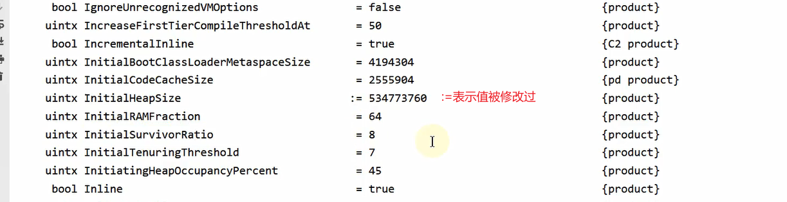
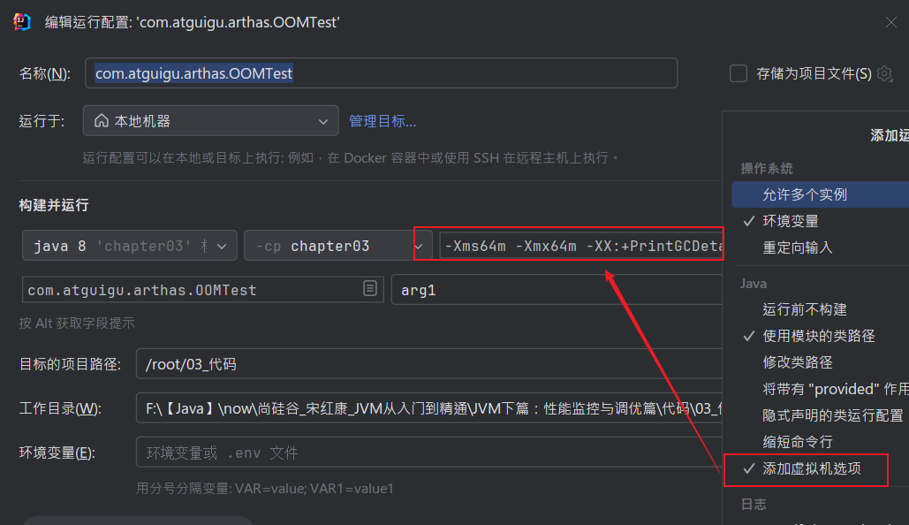
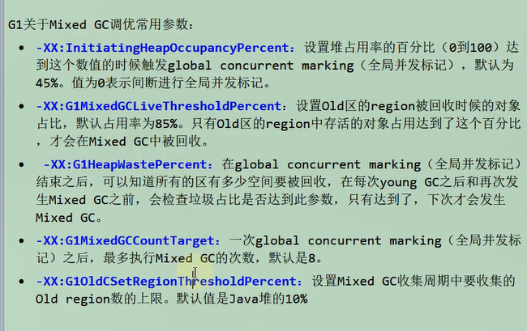

> 笔记来源：[尚硅谷 JVM 全套教程，百万播放，全网巅峰（宋红康详解 java 虚拟机）](https://www.bilibili.com/video/BV1PJ411n7xZ "尚硅谷JVM全套教程，百万播放，全网巅峰（宋红康详解java虚拟机）")
>
> 同步更新：https://gitee.com/vectorx/NOTE_JVM
>
> https://codechina.csdn.net/qq_35925558/NOTE_JVM
>
> https://github.com/uxiahnan/NOTE_JVM

[toc]

# 4. JVM 运行时参数

## 4.1. JVM 参数选项

官网地址：[https://docs.oracle.com/javase/8/docs/technotes/tools/windows/java.html](https://docs.oracle.com/javase/8/docs/technotes/tools/windows/java.html)

### 4.1.1. 类型一：标准参数选项

#### 特点

1. 比较稳定，后续版本基本不会变化
2. **以-开头**

#### 各种选项

运行java或者java -help可以看到所有的标准选项

```shell
PS C:\Users\gouwe> Java -help
用法：java [options] <主类> [args...]
           （执行类）
   或  java [options] -jar <jar 文件> [args...]
           （执行 jar 文件）
   或  java [options] -m <模块>[/<主类>] [args...]
       java [options] --module <模块>[/<主类>] [args...]
           （执行模块中的主类）
   或  java [options] <源文件> [args]
           （执行单个源文件程序）

 将主类、源文件、-jar <jar 文件>、-m 或
 --module <模块>/<主类> 后的参数作为参数
 传递到主类。

 其中，选项包括：

    -cp <目录和 zip/jar 文件的类搜索路径>
    -classpath <目录和 zip/jar 文件的类搜索路径>
    --class-path <目录和 zip/jar 文件的类搜索路径>
                  使用 ; 分隔的, 用于搜索类文件的目录, JAR 档案
                  和 ZIP 档案列表。
    -p <模块路径>
    --module-path <模块路径>...
                  用 ; 分隔的目录列表, 每个目录
                  都是一个包含模块的目录。
    --upgrade-module-path <模块路径>...
                  用 ; 分隔的目录列表, 每个目录
                  都是一个包含模块的目录, 这些模块
                  用于替换运行时映像中的可升级模块
    --add-modules <模块名称>[,<模块名称>...]
                  除了初始模块之外要解析的根模块。
                  <模块名称> 还可以为 ALL-DEFAULT, ALL-SYSTEM,
                  ALL-MODULE-PATH.
    --list-modules
                  列出可观察模块并退出
    -d <module name>
    --describe-module <模块名称>
                  描述模块并退出
    --dry-run     创建 VM 并加载主类, 但不执行 main 方法。
                  此 --dry-run 选项对于验证诸如
                  模块系统配置这样的命令行选项可能非常有用。
    --validate-modules
                  验证所有模块并退出
                  --validate-modules 选项对于查找
                  模块路径中模块的冲突及其他错误可能非常有用。
    -D<名称>=<值>
                  设置系统属性
    -verbose:[class|module|gc|jni]
                  为给定子系统启用详细输出
    -version      将产品版本输出到错误流并退出
    --version     将产品版本输出到输出流并退出
    -showversion  将产品版本输出到错误流并继续
    --show-version
                  将产品版本输出到输出流并继续
    --show-module-resolution
                  在启动过程中显示模块解析输出
    -? -h -help
                  将此帮助消息输出到错误流
    --help        将此帮助消息输出到输出流
    -X            将额外选项的帮助输出到错误流
    --help-extra  将额外选项的帮助输出到输出流
    -ea[:<程序包名称>...|:<类名>]
    -enableassertions[:<程序包名称>...|:<类名>]
                  按指定的粒度启用断言
    -da[:<程序包名称>...|:<类名>]
    -disableassertions[:<程序包名称>...|:<类名>]
                  按指定的粒度禁用断言
    -esa | -enablesystemassertions
                  启用系统断言
    -dsa | -disablesystemassertions
                  禁用系统断言
    -agentlib:<库名>[=<选项>]
                  加载本机代理库 <库名>, 例如 -agentlib:jdwp
                  另请参阅 -agentlib:jdwp=help
    -agentpath:<路径名>[=<选项>]
                  按完整路径名加载本机代理库
    -javaagent:<jar 路径>[=<选项>]
                  加载 Java 编程语言代理, 请参阅 java.lang.instrument
    -splash:<图像路径>
                  使用指定的图像显示启动屏幕
                  自动支持和使用 HiDPI 缩放图像
                  (如果可用)。应始终将未缩放的图像文件名 (例如, image.ext)
                  作为参数传递给 -splash 选项。
                  将自动选取提供的最合适的缩放
                  图像。
                  有关详细信息, 请参阅 SplashScreen API 文档
    @argument 文件
                  一个或多个包含选项的参数文件
    -disable-@files
                  阻止进一步扩展参数文件
    --enable-preview
                  允许类依赖于此发行版的预览功能
要为长选项指定参数, 可以使用 --<名称>=<值> 或--<名称> <值>。

有关详细信息, 请参阅 http://www.oracle.com/technetwork/java/javase/documentation/index.html。
```

#### 补充内容：-server和-client

Hotspot JVM有两种模式，分别是server和client，分别通过-server和-client模式设置

1. 在32位Windows系统上，默认使用client类型的JVM。要想使用Server模式，则机器配置至少有2个以上的CPU和2G以上的物理内存。client模式适用于对内存要求较小的桌面应用程序，默认使用Serial串行垃圾收集器
2. 64位机器上只支持server模式的JVM,适用于需要大内存的应用程序，默认使用并行垃圾收集器

关于server和client的官网介绍为：https://docs.oracle.com/javase/8/docs/technotes/guides/vm/server-class.html


如何知道系统默认使用的是那种模式呢？

通过 java -version 命令：可以看到 Server VM 字样，代表当前系统使用是 Server 模式

```shell
> java -version
java version "1.8.0_201"
Java(TM) SE Runtime Environment (build 1.8.0_201-b09)
Java HotSpot(TM) 64-Bit Server VM (build 25.201-b09, mixed mode)
```

### 4.1.2. 类型二：-X 参数选项

#### 特点

- 非标准化参数
- 功能还是比较稳定的。但官方说后续版本可能会变更
- 以`-X`开头

#### 各种选项

```shell
> java -X
    -Xmixed           混合模式执行 (默认)
    -Xint             仅解释模式执行
    -Xbootclasspath:<用 ; 分隔的目录和 zip/jar 文件>
                      设置搜索路径以引导类和资源
    -Xbootclasspath/a:<用 ; 分隔的目录和 zip/jar 文件>
                      附加在引导类路径末尾
    -Xbootclasspath/p:<用 ; 分隔的目录和 zip/jar 文件>
                      置于引导类路径之前
    -Xdiag            显示附加诊断消息
    -Xnoclassgc       禁用类垃圾收集
    -Xincgc           启用增量垃圾收集
    -Xloggc:<file>    将 GC 状态记录在文件中 (带时间戳)
    -Xbatch           禁用后台编译
    -Xms<size>        设置初始 Java 堆大小
    -Xmx<size>        设置最大 Java 堆大小
    -Xss<size>        设置 Java 线程堆栈大小
    -Xprof            输出 cpu 配置文件数据
    -Xfuture          启用最严格的检查, 预期将来的默认值
    -Xrs              减少 Java/VM 对操作系统信号的使用 (请参阅文档)
    -Xcheck:jni       对 JNI 函数执行其他检查
    -Xshare:off       不尝试使用共享类数据
    -Xshare:auto      在可能的情况下使用共享类数据 (默认)
    -Xshare:on        要求使用共享类数据, 否则将失败。
    -XshowSettings    显示所有设置并继续
    -XshowSettings:all
                      显示所有设置并继续
    -XshowSettings:vm 显示所有与 vm 相关的设置并继续
    -XshowSettings:properties
                      显示所有属性设置并继续
    -XshowSettings:locale
                      显示所有与区域设置相关的设置并继续

-X 选项是非标准选项, 如有更改, 恕不另行通知。
```

#### JVM的JIT编译模式相关的选项

`-Xint`：禁用JIT，所有字节码都被解释执行，这个模式的速度最慢的

`-Xcomp`：所有字节码第一次使用就都被编译成本地代码，然后再执行

`-Xmixed`：混合模式，默认模式，让JIT根据程序运行的情况，有选择地将某些代码编译


如何知道 JVM 默认使用的是混合模式呢？

同样地，通过 `java -version` 命令：可以看到 mixed mode 字样，代表当前系统使用的是混合模式

#### 特别地

> -Xmx-Xms-Xss属于XX参数？


`-Xms<size>`：设置初始Java堆大小，等价于`-XX:InitialHeapSize`

`-Xmx<size> `：设置最大Java堆大小，等价于`-XX:MaxHeapSize`

`-Xss<size>`：设置Java线程堆栈大小，`-XX:ThreadStackSize`

### 4.1.3. 类型三：-XX 参数选项

#### 特点

- 非标准化参数
- 使用的最多的参数类型
- 这类选项属于实验性，不稳定
- **以`-XX`开头**

#### 作用

用于开发和调试JVM

#### 分类

##### Boolean类型格式

`-XX:+<option>`表示启用option属性
`-XX:-<option>`表示禁用option属性

> **举例**
>
> - **-XX:+UseParallelGC**选择垃圾收集器为并行收集器
> - **-XX:+UseG1GC**表示启用G1收集器
> - **-XX:+UseAdaptiveSizePolicy**自动选择年轻代区大小和相应的Survivor区比例

说明：因为有的指令默认是开启的，所以可以使用-关闭

##### 非Boolean类型格式（key-value类型）

###### **子类型1:数值型格式`-XX:<option>=<number>`**

number表示数值，number可以带上单位，比如：'m'、'M'表示兆，'I'、'K'表示Kb，'g'、'G'表示g（例如32k和32768是一样的效果）

> 例如：
>
> - **`-XX:NewSize=1024m`**表示设置新生代初始大小为1024兆
> - **`-XX:MaxGCPauseMillis=500`**表示设置GC停顿时间：500毫秒
> - **`-XX:GCTimeRatio=19`**表示设置吞吐量
> - **`-XX:NewRatio=2`**表示新生代与老年代的比例

###### **子类型2:非数值型格式`-XX:<name>=<string>`**

> **例如**：
>
> `-XX:HeapDumpPath=/usr/local/heapdump.hprof`用来指定heap转存文件的存储路径。

#### 特别地  输出所有参数的名称和默认值

**`-XX:+PrintFlagsFinal`**

+ 输出所有参数的名称和默认值
+ 默认不包括Diagnostic【诊断】和Experimental【实验性】的参数
+ 可以配合-XX:+UnlockDiagnosticVMOptions和-XX:UnlockExperimentalVMOptions使用




## 4.2. 添加 JVM 参数选项

eclipse 和 idea 中配置不必多说，在 Run Configurations 中 VM Options 中配置即可，大同小异

### Eclipse


### IDEA



### 运行jar包

```bash
java -Xms50m -Xmx50m -XX:+PrintGCDetails -XX:+PrintGCTimeStamps -jar demo.jar
```

### 通过Tomcat运行war包

```sh
# Linux系统下可以在tomcat/bin/catalina.sh中添加类似如下配置
JAVA_OPTS="-Xms512M -Xmx1024M"
#Windows系统下在catalina.bat中添加类似如下配置
set "JAVA_OPTS=-Xms512M -Xmx1024M"
```


### 程序运行过程中

```shell
# 设置Boolean类型参数
jinfo -flag [+|-]<name> <pid>
# 设置非Boolean类型参数
jinfo -flag <name>=<value> <pid>

# 查看
jinfo -flags pid    #查看曾经赋过值的一些参数
jinfo -flag 具体参数 pid    #查看某个Java进程的具体参数的值
```

## 4.3. 常用的 JVM 参数选项

### 4.3.1. 打印设置的 -XX 选项及值

```shell
-XX:+PrintCommandLineFlags 程序运行时JVM默认设置或用户手动设置的XX选项
-XX:+PrintFlagsInitial 打印所有XX选项的默认值
-XX:+PrintFlagsFinal 打印所有XX选项的实际值  :=表示重新赋过值  =表示默认值，未修改过
-XX:+PrintVMOptions 打印JVM的参数
```

### 4.3.2. 堆、栈、方法区等内存大小设置

```shell
# 栈
-Xss128k <==> -XX:ThreadStackSize=128k 设置每个线程栈的大小为128K

# 堆
-Xms2048m <==> -XX:InitialHeapSize=2048m 设置 JVM 初始堆内存为2048M
-Xmx2048m <==> -XX:MaxHeapSize=2048m 设置 JVM 最大堆内存为2048M
-Xmn2g <==> -XX:NewSize=2g -XX:MaxNewSize=2g 设置年轻代大小为2G，官方推荐配置为整堆的3/8
-XX:NewSize=2g 设置年轻代的初始值为 2g
-XX:MaxNewSize=2g 设置年轻代的最大值为 2g
-XX:SurvivorRatio=8 设置 Eden 区与 两个Survivor 区的比值，默认为8 即8:1:1，与UseAdaptiveSizePolicy参数开启影响
-XX:NewRatio=2 设置老年代与年轻代（包括一个Eden和两个Survivor区）比例，默认为 2 即2:1
-XX:+UseAdaptiveSizePolicy 设置大小比例自适应，默认开启  现象：伊甸园区：0：S1不满足8:1:1，导致-XX:SurvivorRatio=8参数失效
-XX:PretenureSizeThreadshold=1024 设置让大于此阈值的对象直接分配在老年代，只对 Serial、ParNew 收集器有效
-XX:MaxTenuringThreshold=15 设置新生代晋升老年代的年龄限制，默认为 15
-XX:PrintTenuringDistribution 让 JVM 在每次 MinroGC 结束后打印出当前使用的 Survivor 中对象的年龄分布
-XX:TargetSurvivorRatio 设置 MinorGC 结束后 Survivor 区占用空间的期望比例

# 方法区
-XX:MetaspaceSize / -XX:PermSize=256m 设置元空间/永久代初始值为256M
-XX:MaxMetaspaceSize / -XX:MaxPermSize=256m 设置元空间/永久代最大值为256M
-XX:+UseCompressedOops 使用压缩对象指针
-XX:+UseCompressedClassPointers 使用压缩类指针
-XX:CompressedClassSpaceSize 设置 Klass Metaspace 的大小，默认1G

# 直接内存
-XX:MaxDirectMemorySize 指定 DirectMemory 容量，默认等于 Java 堆最大值
```

#### `-XX:+UseAdaptiveSizePolicy` 设置大小比例自适应的说明如下

```java
/**
 * -XX:+PrintFlagsFinal -Xms600m -Xmx600m
 *  -XX:SurvivorRatio=8
 * 默认情况下，新生代占 1/3 ： 200m，老年代占2/3 : 400m
 *   其中，Eden默认占新生代的8/10 : 160m ,Survivor0，Survivor1各占新生代的1/10 ： 20m
 *
 */
public class OOMTest {
    public static void main(String[] args) {
        ArrayList<Picture> list = new ArrayList<>();
        while(true){
            try {
                Thread.sleep(5);
            } catch (InterruptedException e) {
                e.printStackTrace();
            }
            list.add(new Picture(new Random().nextInt(100 * 50)));
        }
    }
}

class Picture{
    private byte[] pixels;

    public Picture(int length) {
        this.pixels = new byte[length];
    }

    public byte[] getPixels() {
        return pixels;
    }

    public void setPixels(byte[] pixels) {
        this.pixels = pixels;
    }
}
```

**2 开启UseAdaptiveSizePolicy参数**


当参数选项配置为 -Xms600m -Xmx600m

> 老年代400    年轻代200  = 2:1
> 年轻代 150:25:25 = 6:1:1 
> 默认开启了自适应-XX:+UseAdaptiveSizePolicy


**3关闭UseAdaptiveSizePolicy **

当参数选项配置为 -Xms600m -Xmx600m -XX:-UseAdaptiveSizePolicy

> 老年代400    年轻代200  = 2:1
> 年轻代 150:25:25 = 6:1:1 
> 默认开启了自适应-XX:+UseAdaptiveSizePolicy  
>
> 依旧不是8:1:1


**4 当参数选项配置为 -Xms600m -Xmx600m -XX:-UseAdaptiveSizePolicy -XX:SurvivorRatio=8**

新生代满足8:1:1


**5 当选项配置为 -Xms600m -Xmx600m -XX:+UseAdaptiveSizePolicy -XX:SurvivorRatio=8**

新生代满足8:1:1


**6 结论**

-XX:SurvivorRatio 优先级高于 -XX:+UseAdaptiveSizePolicy，如果显式指定了SurvivorRatio ，以显式设置为准

但建议将 UseAdaptiveSizePolicy 开启，但不设置 -XX:SurvivorRatio

### 4.3.3. OutOfMemory 相关的选项

```shell
-XX:+HeapDumpOnOutOfMemoryError：表示在内存出现OOM的时候，把Heap转存（Dump)到文件以便后续分析  两者互斥
-XX:+HeapDumpBeforeFullGC 表示在出现FullGC之前，生成Heap转储文件    两者互斥

-XX:HeapDumpPath=<path>：指定heap转存文件的存储路径

-XX:OnOutOfMemoryError：指定一个可行性程序或者脚本的路径，当发生OOM的时候，去执行这个脚本
```

**演示HeapDumpOnOutOfMemoryError 和 HeapDumpBeforeFullGC 区别**

```java
/**
 * -XX:+HeapDumpOnOutOfMemoryError  出现OOM的时候生成Dump文件
 * -XX:+HeapDumpBeforeFullGC  FullGC之前，生成Dump文件
 * -XX:HeapDumpPath=d:\heapdumpinstance.hprof
 */
public class HeapDumpInstance {
    private static int _1MB = 1024 * 1024;
    byte[] buffer = new byte[10 * _1MB];

    public static void main(String[] args) {
        try {
            Thread.sleep(2000);
        } catch (InterruptedException e) {
            e.printStackTrace();
        }
        ArrayList<HeapDumpInstance> list = new ArrayList<HeapDumpInstance>();
        for(int i = 0;i < 500;i++){
            list.add(new HeapDumpInstance());
            try {
                Thread.sleep(10);
            } catch (InterruptedException e) {
                e.printStackTrace();
            }
        }
        System.out.println("程序执行结束");
    }
}
```


**对OnOutOfMemoryError的运维处理**

以部署在Linux系统/opt/Server目录下的Server.jar为例

**在run.sh启动脚本中添加jvm参数**：`-XX:OnOutOfMemoryError=/opt/Server/restart.sh`   当发生oom时对启动服务器重启脚本

**restart.sh脚本：**

linux环境：

```sh
#!/bin/bash
pid=$(ps -ef|grlep Server.jar|awk'{if($8=="java"){print $2}}')
kill -9 $pid
cd /opt/Server/;sh run.sh
```

Windows环境：

```bash
echo off
wmic process where Name='java.exe'delete
cd D:\Server
start run . bat
```

### 4.3.4. 垃圾收集器相关选项

7 款经典垃圾收集器与垃圾分代之间的关系：


垃圾收集器的组合关系：


首先需了解垃圾收集器之间的搭配使用关系

- <span style="color: red;">红色</span>虚线表示在 jdk8 时被 Deprecate，jdk9 时被删除
- <span style="color: green;">绿色</span>虚线表示在 jdk14 时被 Deprecate
- <span style="color: #79d9dc;">蓝色</span>虚框表示在 jdk9 时被 Deprecate，jdk14 时被删除

#### 查看默认垃圾收集器

1. **-XX:+PrintCommandLineFlags：**查看命令行相关参数（包含使用的垃圾收集器）

2. **使用命令行指令：**jinfo -flag 相关垃圾回收器参数 进程ID


#### Serial回收器

Seria收集器作为HotSpot中client模式下的默认新生代垃圾收集器。Serial Old是运行在Client模式下默认的老年代的垃圾回收器。

**-XX:+UseSerialGC：**

指定年轻代和老年代都使用串行收集器。等价于新生代用Serial GC，且老年代用Serial Old GC。可以获得最高的单线程收集效率。

#### ParNew回收器

Serial的并行版本

**-XX:+UseParNewGC：**

手动指定使用ParNew收集器执行内存回收任务。它表示年轻代使用并行收集器，不影响老年代。

**-XX:ParallelGCThreads=N：**

限制线程数量，默认开启和CPU数据相同的线程数。

#### Parallel回收器

主打吞吐量、JDK8默认垃圾回收器


**-XX:+UseParallelGC：**

手动指定年轻代使用Parallel并行收集器执行内存回收任务。

**-XX:+UseParallelOldGC：**

手动指定老年代都是使用并行回收收集器。

- 分别适用于新生代和老年代。默认jdk8是开启的。
- 上面两个参数，默认开启一个，另一个也会被开启。**（互相激活）**

**-XX:ParallelGCThreads：**

设置年轻代并行收集器的线程数。一般地，最好与CPU数量相等，以避免过多的线程数影响垃圾收集性能。

- 在默认情况下，当CPU数量小于8个，Paralle1GCThreads的值等于CPU数量。
- 当CPU数量大于8个，ParallelGCThreads的值等于3+[5*CPU_Count]/8]。

**-XX:MaxGCPauseMillis：**

设置垃圾收集器最大停顿时间（即STW的时间）。单位是毫秒。

- 为了尽可能地把停顿时间控制在MaxGCPauseMills以内，收集器在工作时会调整Java堆大小或者其他一些参数。
- 对于用户来讲，停顿时间越短体验越好。但是在服务器端，我们注重高并发，整体的吞吐量。所以服务器端适合Parallel，进行控制。
- **该参数使用需谨慎。**

**-XX:GCTimeRatio：**

垃圾收集时间占总时间的比例（=1/(N+1))。用于衡量吞吐量的大小。

- 取值范围（0,100)。默认值99,也就是垃圾回收时间不超过1%。
- 与前一个-XX:MaxGCPauseMillis参数有一定矛盾性。暂停时间越长，Ratio参数就容易超过设定的比例。

**-XX:+UseAdaptiveSizePolicy：**

设置Parallel Scavenge收集器具有自适应调节策略

+ 在这种模式下,年轻代的大小、Eden和Survivor的比例、晋升老年代的对象年龄等参数会被 自动调整,已达到在堆大小、吞吐量和停顿时间之间的平衡点。 
+ 在手动调优比较困难的场合,可以直接使用这种自适应的方式,仅指定虚拟机的最大堆、目 标的吞吐量(GCTimeRatio)和停顿时间(MaxGCPauseMills).让虚拟机自己完成调优工 作。

#### CMS回收器

并发    垃圾回收线程和用户线程同时执行，用户体验好    jdk1.5引入

使用标记清除算法  不会整理碎片


**-XX:+UseConcMarkSweepGC：**

手动指定使用CMS收集器执行内存回收任务。

- 开启该参数后会自动将-XX:+UseParNewGC打开。即：ParNew(Young区用）+CMS(Old区用)+Serial old的组合。

**-XX:CMSInitiatingoccupanyFraction：**

设置堆内存使用率的阀值，一旦达到该阀值，便开始进行回收。

- JDK5及以前版本的默认值为68，即当老年代的空间使用率达到68%时，会执行一次CMS回收。J**DK6及以上版本默认值为92%**
- 如果内存增长缓慢，则可以设置一个稍大的值，大的阙值可以有效降低CMS的触发频率，减少老年代回收的次数可以较为明显地改善应用程序性能。反之，如果应用程序内存使用率增长很快，则应该降低这个阙值，以避免频繁触发老年代串行收集器。因此**通过该选项便可以有效降低Full GC的执行次数**。

**-XX:+UseCMSCompactAtFullcollection：**

用于指定在执行完Full GC后对内存空间进行压缩整理，以此避免内存碎片的产生。不过由于内存压缩整理过程无法并发执行，所带来的问题就是停顿时间变得更长了。

**-XX: CMSFul1GCsBeforeCompaction：**

设置在执行多少次Full GC后对内存空间进行压缩整理。

**-XX:ParallelCMSThreads：**

设置CMS的线程数量。

- CMS默认启动的线程数是（ParallelGCThreads+3)/4,ParallelGCThreads是年轻代并行收集器的线程数。当CPU资源比较紧张时，受到CMS收集器线程的影响，应用程序的性能在垃圾回收阶段可能会非常糟糕

##### 补充参数

另外，CMS收集器还有如下常用参数：

**-XX:ConcGCThreads：**

设置并发垃圾收集的线程数，默认该值是基于ParallelGCThreads计算出来的；

**-XX:+UseCMSInitiatingoccupancyOnly：**

是否动态可调，用这个参数可以使CMS一直按CMSInitiatingOccupancyFraction设定的值启动

**-XX:+CMSScavengeBeforeRemark：**

强制hotspot虚拟机在cms remark阶段之前做一次minor gc,用于提高remark阶段的速度；

**-XX:+CMSClassUnloadingEnable：**

如果有的话，启用回收Perm区（JDK8之前）

**-XX:+CMSParallelInitialEnabled：**

用于开启CMS initial-mark阶段采用多线程的方式进行标记，用于提高标记速度，在Java8开始已经默认开启；

**-XX:+CMSParallelRemarkEnabled：**

用户开启CMS remark阶段采用多线程的方式进行重新标记，默认开启；

**-XX:+ExplicitGCInvokesConcurrent、-XX:+ExplicitGCInvokesConcurrentAndUnloadsClasses：**

这两个参数用户指定hotspot虚拟在执行System.gc()时使用CMS周期；

**-XX:+CMSPrecleaningEnabled：**

指定CMS是否需要进行Pre cleaning这个阶段

##### 特别说明

**JDK9新特性：CMS被标记为Deprecate了（JEP291）**

- 如果对JDK9及以上版本的HotSpot虚拟机使用参数-XX:+UseConcMarkSweepGC来开启CMS收集器的话，I用户会收到一个警告信息，提示CMS未来将会被废弃。

**JDK14新特性：删除CMS垃圾回收器（JEP363）**

- 移除了CMS垃圾收集器，如果在JDK14中使用-XX:+UseConcMarkSweepGC的话，JVM不会报错，只是给出一个warning信息，但是不会exit。JVM会自动回退以默认GC方式启动JVM

```java
OpenJDK 64-Bit Server VM warning: Ignoring option UseConcMarkSweepGC; support was removed in 14.0 and the VM will continue execution using the default collector.
```

#### G1回收器

区域分代化

**-XX:+UseG1GC** 
手动指定使用G1收集器执行内存回收任务。

**-XX:G1HeapRegionSize** 
设置每个Region的大小。值是2的幂，范围是1MB到32MB之间，目标是根据最小的Java堆大小划分出约2048个区域。默认是堆内存的1/2000。

**-XX:MaxGCPauseMillis：**

设置期望达到的最大GC停顿时间指标（JVM会尽力实现，但不保证达到）。默认值是200ms

**-XX:ParallelGCThread：**

设置STW时GC线程数的值。最多设置为8

**-XX: ConcGCThreads：**

设置并发标记的线程数。将n设置为并行垃圾回收线程数（Paralle1GCThreads)的1/4左右。

**-XX:InitiatingHeapOccupancyPercent：**

设置触发并发GC周期的Java堆占用率罔值。超过此值，就触发GC。默认值是45。

**-XX:G1NewSizePercent、-XX:G1MaxNewSizePercent：**

新生代占用整个堆内存的最小百分比（默认5%)、最大百分比（默认60%)

**-XX:G1ReservePercent=10：**

保留内存区域，防止to space(Survivor中的to区）溢出

Mixed GC 调优参数

**注意:** G1 收集器主要涉及Mixed GC，它将回收young区和部分old代。

```java
-XX:InitiatingHeapOccupancyPercent
-XX:G1MixedGCLiveThresholdPercent
-XX:G1HeapWastePercent
-XX:G1MixedGCCountTarget
-XX:G1OldCSetRegionThresholdPercent
```





#### 怎么选择垃圾回收器？

- 优先让 JVM 自适应，调整堆的大小
- 串行收集器：内存小于 100M；单核、单机程序，并且没有停顿时间的要求
- 并行收集器：多 CPU、高吞吐量、允许停顿时间超过 1 秒
- 并发收集器：多 CPU、追求低停顿时间、快速响应（比如延迟不能超过 1 秒，如互联网应用）
- 官方推荐 G1，性能高。**现在互联网的项目，基本都是使用 G1**

特别说明：

- 没有最好的收集器，更没有万能的收集器
- 调优永远是针对特定场景、特定需求，不存在一劳永逸的收集器

### 4.3.5. GC 日志相关选项

#### 常用参数

**-verbose:gc**

输出gc日志信息，默认输出到标准输出   ；可以独立使用

**-XX:+PrintGC**

等同于-verbose:gc；表示打开简化的GC日志  ；可以独立使用

**-XX:+PrintGCDetails**

在发生垃圾回收时打印内存回收**详细的日志**，并**在进程退出时输出当前内存各区域分配情况**   ；可以独立使用

**-XX:+PrintGCTimeStamps**  

输出GC发生时的时间戳  ；不能独立使用；配合PrintGCDetails使用

**-XX:+PrintGCDateStamps**

输出GC发生时的时间截（以日期的形式，如-XX:+PrintGCDateStamps 2013-05-04T21:53:59.234+0800)  ；不能独立使用，配合PrintGCDetails使用

**-XX:+PrintHeapAtGC**

每一次GC前和GC后，都打印堆信息

**-Xloggc:<file>**

把GC日志写入到一个文件中去，而不是打印到标准输出中


```sh

###############-verbose:gc 或 -XX:+PrintGC ####################
[GC (Allocation Failure)  16303K->14194K(59392K), 0.0040576 secs]
[GC (Allocation Failure)  30519K->30520K(59392K), 0.0037994 secs]
[Full GC (Ergonomics)  30520K->30298K(59392K), 0.0160108 secs]
[Full GC (Ergonomics)  46642K->46301K(59392K), 0.0061445 secs]

########################## -XX:+PrintGCDetails ###########################
[GC (Allocation Failure) [PSYoungGen: 16303K->2016K(18432K)] 16303K->14198K(59392K), 0.0040885 secs] [Times: user=0.00 sys=0.00, real=0.00 secs] 
[GC (Allocation Failure) [PSYoungGen: 18341K->2024K(18432K)] 30523K->30524K(59392K), 0.0042607 secs] [Times: user=0.00 sys=0.00, real=0.00 secs] 
[Full GC (Ergonomics) [PSYoungGen: 2024K->0K(18432K)] [ParOldGen: 28500K->30298K(40960K)] 30524K->30298K(59392K), [Metaspace: 3993K->3993K(1056768K)], 0.0354285 secs] [Times: user=0.08 sys=0.00, real=0.04 secs] 
[Full GC (Ergonomics) [PSYoungGen: 16344K->5500K(18432K)] [ParOldGen: 30298K->40800K(40960K)] 46642K->46301K(59392K), [Metaspace: 3993K->3993K(1056768K)], 0.0064641 secs] [Times: user=0.00 sys=0.00, real=0.00 secs] 

Heap  #并**在进程退出时输出当前内存各区域分配情况**
 PSYoungGen      total 18432K, used 10379K [0x00000000fec00000, 0x0000000100000000, 0x0000000100000000)
  eden space 16384K, 63% used [0x00000000fec00000,0x00000000ff622d10,0x00000000ffc00000)
  from space 2048K, 0% used [0x00000000ffe00000,0x00000000ffe00000,0x0000000100000000)
  to   space 2048K, 0% used [0x00000000ffc00000,0x00000000ffc00000,0x00000000ffe00000)
 ParOldGen       total 40960K, used 40800K [0x00000000fc400000, 0x00000000fec00000, 0x00000000fec00000)
  object space 40960K, 99% used [0x00000000fc400000,0x00000000febd82d8,0x00000000fec00000)
 Metaspace       used 4000K, capacity 4568K, committed 4864K, reserved 1056768K
  class space    used 447K, capacity 460K, committed 512K, reserved 1048576K


##########################-XX:+PrintGCTimeStamps -XX:+PrintGCDetails#########################################

4.364: [GC (Allocation Failure) [PSYoungGen: 16303K->2040K(18432K)] 16303K->14270K(59392K), 0.0033008 secs] [Times: user=0.00 sys=0.00, real=0.00 secs] 
9.614: [GC (Allocation Failure) [PSYoungGen: 18365K->1948K(18432K)] 30595K->30588K(59392K), 0.0043835 secs] [Times: user=0.00 sys=0.00, real=0.00 secs] 
9.619: [Full GC (Ergonomics) [PSYoungGen: 1948K->0K(18432K)] [ParOldGen: 28640K->30298K(40960K)] 30588K->30298K(59392K), [Metaspace: 3996K->3996K(1056768K)], 0.0111210 secs] [Times: user=0.16 sys=0.00, real=0.02 secs] 
14.934: [Full GC (Ergonomics) [PSYoungGen: 16344K->5500K(18432K)] [ParOldGen: 30298K->40800K(40960K)] 46642K->46301K(59392K), [Metaspace: 3996K->3996K(1056768K)], 0.0117331 secs] [Times: user=0.16 sys=0.00, real=0.01 secs] 
Heap
 PSYoungGen      total 18432K, used 10379K [0x00000000fec00000, 0x0000000100000000, 0x0000000100000000)
  eden space 16384K, 63% used [0x00000000fec00000,0x00000000ff622d10,0x00000000ffc00000)
  from space 2048K, 0% used [0x00000000ffe00000,0x00000000ffe00000,0x0000000100000000)
  to   space 2048K, 0% used [0x00000000ffc00000,0x00000000ffc00000,0x00000000ffe00000)
 ParOldGen       total 40960K, used 40800K [0x00000000fc400000, 0x00000000fec00000, 0x00000000fec00000)
  object space 40960K, 99% used [0x00000000fc400000,0x00000000febd8350,0x00000000fec00000)
 Metaspace       used 4003K, capacity 4568K, committed 4864K, reserved 1056768K
  class space    used 447K, capacity 460K, committed 512K, reserved 1048576K


###########################-XX:+PrintGCDateStamps -XX:+PrintGCDetails#################################
2021-01-30T15:01:12.596+0800: [GC (Allocation Failure) [PSYoungGen: 16303K->2020K(18432K)] 16303K->14154K(59392K), 0.0051686 secs] [Times: user=0.00 sys=0.00, real=0.01 secs] 
2021-01-30T15:01:17.856+0800: [GC (Allocation Failure) [PSYoungGen: 18345K->2036K(18432K)] 30479K->30480K(59392K), 0.0037044 secs] [Times: user=0.00 sys=0.00, real=0.00 secs] 
2021-01-30T15:01:17.856+0800: [Full GC (Ergonomics) [PSYoungGen: 2036K->0K(18432K)] [ParOldGen: 28444K->30303K(40960K)] 30480K->30303K(59392K), [Metaspace: 3993K->3993K(1056768K)], 0.0161352 secs] [Times: user=0.02 sys=0.00, real=0.02 secs] 
2021-01-30T15:01:23.406+0800: [Full GC (Ergonomics) [PSYoungGen: 16316K->6000K(18432K)] [ParOldGen: 30303K->40600K(40960K)] 46619K->46601K(59392K), [Metaspace: 3993K->3993K(1056768K)], 0.0113074 secs] [Times: user=0.00 sys=0.00, real=0.01 secs] 
Heap
 PSYoungGen      total 18432K, used 10909K [0x00000000fec00000, 0x0000000100000000, 0x0000000100000000)
  eden space 16384K, 66% used [0x00000000fec00000,0x00000000ff6a7530,0x00000000ffc00000)
  from space 2048K, 0% used [0x00000000ffe00000,0x00000000ffe00000,0x0000000100000000)
  to   space 2048K, 0% used [0x00000000ffc00000,0x00000000ffc00000,0x00000000ffe00000)
 ParOldGen       total 40960K, used 40600K [0x00000000fc400000, 0x00000000fec00000, 0x00000000fec00000)
  object space 40960K, 99% used [0x00000000fc400000,0x00000000feba63c0,0x00000000fec00000)
 Metaspace       used 4000K, capacity 4568K, committed 4864K, reserved 1056768K
  class space    used 447K, capacity 460K, committed 512K, reserved 1048576K


############################# -XX:+PrintHeapAtGC ###################################
{Heap before GC invocations=1 (full 0):
 PSYoungGen      total 18432K, used 16303K [0x00000000fec00000, 0x0000000100000000, 0x0000000100000000)
  eden space 16384K, 99% used [0x00000000fec00000,0x00000000ffbebca0,0x00000000ffc00000)
  from space 2048K, 0% used [0x00000000ffe00000,0x00000000ffe00000,0x0000000100000000)
  to   space 2048K, 0% used [0x00000000ffc00000,0x00000000ffc00000,0x00000000ffe00000)
 ParOldGen       total 40960K, used 0K [0x00000000fc400000, 0x00000000fec00000, 0x00000000fec00000)
  object space 40960K, 0% used [0x00000000fc400000,0x00000000fc400000,0x00000000fec00000)
 Metaspace       used 3996K, capacity 4568K, committed 4864K, reserved 1056768K
  class space    used 446K, capacity 460K, committed 512K, reserved 1048576K
Heap after GC invocations=1 (full 0):
 PSYoungGen      total 18432K, used 2016K [0x00000000fec00000, 0x0000000100000000, 0x0000000100000000)
  eden space 16384K, 0% used [0x00000000fec00000,0x00000000fec00000,0x00000000ffc00000)
  from space 2048K, 98% used [0x00000000ffc00000,0x00000000ffdf8100,0x00000000ffe00000)
  to   space 2048K, 0% used [0x00000000ffe00000,0x00000000ffe00000,0x0000000100000000)
 ParOldGen       total 40960K, used 12129K [0x00000000fc400000, 0x00000000fec00000, 0x00000000fec00000)
  object space 40960K, 29% used [0x00000000fc400000,0x00000000fcfd8740,0x00000000fec00000)
 Metaspace       used 3996K, capacity 4568K, committed 4864K, reserved 1056768K
  class space    used 446K, capacity 460K, committed 512K, reserved 1048576K
}
{Heap before GC invocations=2 (full 0):
 PSYoungGen      total 18432K, used 18341K [0x00000000fec00000, 0x0000000100000000, 0x0000000100000000)
  eden space 16384K, 99% used [0x00000000fec00000,0x00000000ffbf1538,0x00000000ffc00000)
  from space 2048K, 98% used [0x00000000ffc00000,0x00000000ffdf8100,0x00000000ffe00000)
  to   space 2048K, 0% used [0x00000000ffe00000,0x00000000ffe00000,0x0000000100000000)
 ParOldGen       total 40960K, used 12129K [0x00000000fc400000, 0x00000000fec00000, 0x00000000fec00000)
  object space 40960K, 29% used [0x00000000fc400000,0x00000000fcfd8740,0x00000000fec00000)
 Metaspace       used 3998K, capacity 4568K, committed 4864K, reserved 1056768K
  class space    used 446K, capacity 460K, committed 512K, reserved 1048576K
Heap after GC invocations=2 (full 0):
 PSYoungGen      total 18432K, used 1996K [0x00000000fec00000, 0x0000000100000000, 0x0000000100000000)
  eden space 16384K, 0% used [0x00000000fec00000,0x00000000fec00000,0x00000000ffc00000)
  from space 2048K, 97% used [0x00000000ffe00000,0x00000000ffff3100,0x0000000100000000)
  to   space 2048K, 0% used [0x00000000ffc00000,0x00000000ffc00000,0x00000000ffe00000)
 ParOldGen       total 40960K, used 28540K [0x00000000fc400000, 0x00000000fec00000, 0x00000000fec00000)
  object space 40960K, 69% used [0x00000000fc400000,0x00000000fdfdf180,0x00000000fec00000)
 Metaspace       used 3998K, capacity 4568K, committed 4864K, reserved 1056768K
  class space    used 446K, capacity 460K, committed 512K, reserved 1048576K
}
{Heap before GC invocations=3 (full 1):
 PSYoungGen      total 18432K, used 1996K [0x00000000fec00000, 0x0000000100000000, 0x0000000100000000)
  eden space 16384K, 0% used [0x00000000fec00000,0x00000000fec00000,0x00000000ffc00000)
  from space 2048K, 97% used [0x00000000ffe00000,0x00000000ffff3100,0x0000000100000000)
  to   space 2048K, 0% used [0x00000000ffc00000,0x00000000ffc00000,0x00000000ffe00000)
 ParOldGen       total 40960K, used 28540K [0x00000000fc400000, 0x00000000fec00000, 0x00000000fec00000)
  object space 40960K, 69% used [0x00000000fc400000,0x00000000fdfdf180,0x00000000fec00000)
 Metaspace       used 3998K, capacity 4568K, committed 4864K, reserved 1056768K
  class space    used 446K, capacity 460K, committed 512K, reserved 1048576K
Heap after GC invocations=3 (full 1):
 PSYoungGen      total 18432K, used 0K [0x00000000fec00000, 0x0000000100000000, 0x0000000100000000)
  eden space 16384K, 0% used [0x00000000fec00000,0x00000000fec00000,0x00000000ffc00000)
  from space 2048K, 0% used [0x00000000ffe00000,0x00000000ffe00000,0x0000000100000000)
  to   space 2048K, 0% used [0x00000000ffc00000,0x00000000ffc00000,0x00000000ffe00000)
 ParOldGen       total 40960K, used 30303K [0x00000000fc400000, 0x00000000fec00000, 0x00000000fec00000)
  object space 40960K, 73% used [0x00000000fc400000,0x00000000fe197cb0,0x00000000fec00000)
 Metaspace       used 3998K, capacity 4568K, committed 4864K, reserved 1056768K
  class space    used 446K, capacity 460K, committed 512K, reserved 1048576K
}
{Heap before GC invocations=4 (full 2):
 PSYoungGen      total 18432K, used 16316K [0x00000000fec00000, 0x0000000100000000, 0x0000000100000000)
  eden space 16384K, 99% used [0x00000000fec00000,0x00000000ffbef198,0x00000000ffc00000)
  from space 2048K, 0% used [0x00000000ffe00000,0x00000000ffe00000,0x0000000100000000)
  to   space 2048K, 0% used [0x00000000ffc00000,0x00000000ffc00000,0x00000000ffe00000)
 ParOldGen       total 40960K, used 30303K [0x00000000fc400000, 0x00000000fec00000, 0x00000000fec00000)
  object space 40960K, 73% used [0x00000000fc400000,0x00000000fe197cb0,0x00000000fec00000)
 Metaspace       used 3998K, capacity 4568K, committed 4864K, reserved 1056768K
  class space    used 446K, capacity 460K, committed 512K, reserved 1048576K
Heap after GC invocations=4 (full 2):
 PSYoungGen      total 18432K, used 6000K [0x00000000fec00000, 0x0000000100000000, 0x0000000100000000)
  eden space 16384K, 36% used [0x00000000fec00000,0x00000000ff1dc3c0,0x00000000ffc00000)
  from space 2048K, 0% used [0x00000000ffe00000,0x00000000ffe00000,0x0000000100000000)
  to   space 2048K, 0% used [0x00000000ffc00000,0x00000000ffc00000,0x00000000ffe00000)
 ParOldGen       total 40960K, used 40600K [0x00000000fc400000, 0x00000000fec00000, 0x00000000fec00000)
  object space 40960K, 99% used [0x00000000fc400000,0x00000000feba63d8,0x00000000fec00000)
 Metaspace       used 3998K, capacity 4568K, committed 4864K, reserved 1056768K
  class space    used 446K, capacity 460K, committed 512K, reserved 1048576K
}
```


#### 其他参数

**-XX:+TraceClassLoading：**监控类的加载

**-XX:+PrintGCApplicationStoppedTime：**打印GC时线程的停顿时间

**-XX:+PrintGCApplicationConcurrentTime：**垃圾收集之前打印出应用未中断的执行时间

**-XX:+PrintReferenceGC：**记录回收了多少种不同引用类型的引用

**-XX+UseGCLogFileRotation：**启用GC日志文件的自动转储

**-XX:NumberOfGClogFiles=1：**GC日志文件的循环数目

**-XX:GCLogFileSize=1M：**控制GC日志文件的大小

### 4.3.6. 其他参数

```shell
-XX:+DisableExplicitGC  禁用hotspot执行System.gc()，默认禁用
-XX:ReservedCodeCacheSize=<n>[g|m|k]、-XX:InitialCodeCacheSize=<n>[g|m|k]  指定代码缓存的大小
-XX:+UseCodeCacheFlushing  放弃一些被编译的代码，避免代码缓存被占满时JVM切换到interpreted-only的情况
-XX:+DoEscapeAnalysis  开启逃逸分析
-XX:+UseBiasedLocking  开启偏向锁
-XX:+UseLargePages  开启使用大页面
-XX:+PrintTLAB  打印TLAB的使用情况
-XX:TLABSize  设置TLAB大小
```

## 4.4. 通过 Java 代码获取 JVM 参数

Java 提供了 java.lang.management 包用于监视和管理 Java 虚拟机和 Java 运行时中的其他组件，它允许本地或远程监控和管理运行的 Java 虚拟机。其中 ManagementFactory 类较为常用，另外 Runtime 类可获取内存、CPU 核数等相关的数据。通过使用这些 api，可以监控应用服务器的堆内存使用情况，设置一些阈值进行报警等处理。

```java
public class MemoryMonitor {
    public static void main(String[] args) {
        MemoryMXBean memorymbean = ManagementFactory.getMemoryMXBean();
        MemoryUsage usage = memorymbean.getHeapMemoryUsage();
        System.out.println("INIT HEAP: " + usage.getInit() / 1024 / 1024 + "m");
        System.out.println("MAX HEAP: " + usage.getMax() / 1024 / 1024 + "m");
        System.out.println("USE HEAP: " + usage.getUsed() / 1024 / 1024 + "m");
        System.out.println("\nFull Information:");
        System.out.println("Heap Memory Usage: " + memorymbean.getHeapMemoryUsage());
        System.out.println("Non-Heap Memory Usage: " + memorymbean.getNonHeapMemoryUsage());

        System.out.println("=======================通过java来获取相关系统状态============================ ");
        System.out.println("当前堆内存大小totalMemory " + (int) Runtime.getRuntime().totalMemory() / 1024 / 1024 + "m");// 当前堆内存大小
        System.out.println("空闲堆内存大小freeMemory " + (int) Runtime.getRuntime().freeMemory() / 1024 / 1024 + "m");// 空闲堆内存大小
        System.out.println("最大可用总堆内存maxMemory " + Runtime.getRuntime().maxMemory() / 1024 / 1024 + "m");// 最大可用总堆内存大小

    }
}
```
