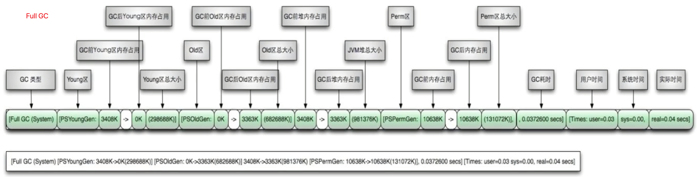
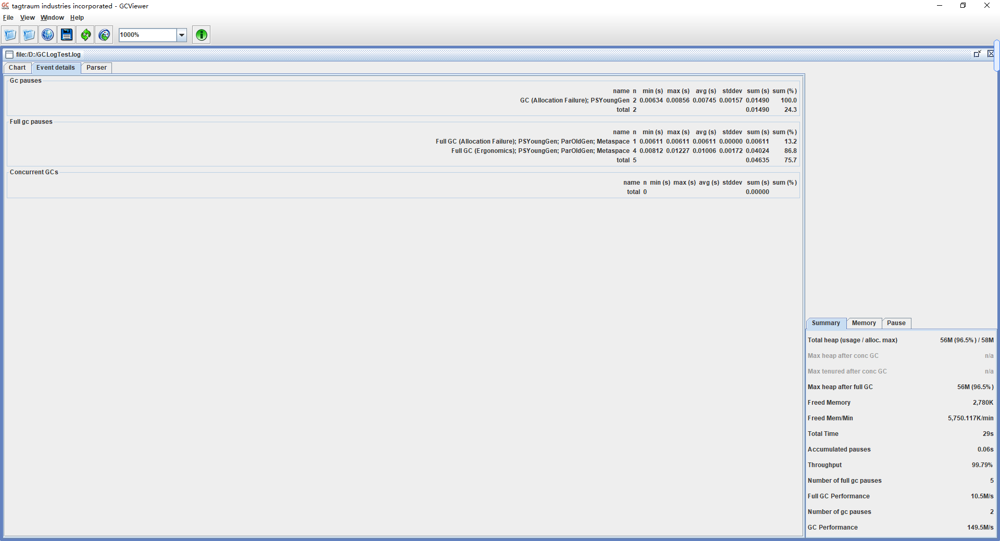
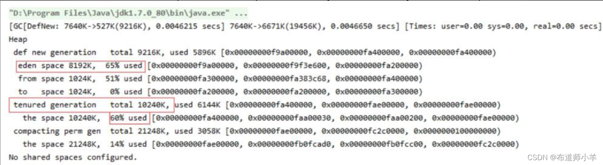

> 笔记来源：[尚硅谷 JVM 全套教程，百万播放，全网巅峰（宋红康详解 java 虚拟机）](https://www.bilibili.com/video/BV1PJ411n7xZ "尚硅谷JVM全套教程，百万播放，全网巅峰（宋红康详解java虚拟机）")
>
> 同步更新：https://gitee.com/vectorx/NOTE_JVM
>
> https://codechina.csdn.net/qq_35925558/NOTE_JVM
>
> https://github.com/uxiahnan/NOTE_JVM

[toc]

# 5. 分析 GC 日志

1、概述
----

GC 日志主要用于快速[定位系统](https://so.csdn.net/so/search?q=%E5%AE%9A%E4%BD%8D%E7%B3%BB%E7%BB%9F&spm=1001.2101.3001.7020)潜在的内存故障和性能瓶颈，通过阅读 GC 日志，我们可以了解 JVM 的内存分配与回收策略。GC 日志根据垃圾收集器分类可以分为 Parallel 垃圾收集器日志、G1 垃圾收集器日志和 CMS 垃圾收集器日志。垃圾收集分为部分收集和整堆收集，所以也可以把 GC 日志分为 Minor GC 日志、Major GC 日志和 Full GC 日志。下面开始解析不同垃圾收集器的 GC 日志。

2、生成 GC 日志
----------

解析日志之前，我们需要先生成日志，打印[内存分配](https://so.csdn.net/so/search?q=%E5%86%85%E5%AD%98%E5%88%86%E9%85%8D&spm=1001.2101.3001.7020)与垃圾收集日志信息的相关参数如下：

**1)-XX:+PrintGC**  
该参数表示输出 GC 日志，和参数 - verbose:gc 效果一样。

**2)-XX:+PrintGCDetails**  
该参数表示输出 GC 的详细日志。

**3)-XX:+PrintGCTimeStamps**  
该参数表示输出 GC 的时间戳（以基准时间的形式）。

**4)-XX:+PrintGCDateStamps**  
该参数表示输出 GC 的时间戳（以日期的形式，如 2013-05-04T21:53:59.234+0800）。

**5)-XX:+PrintHeapAtGC**  
该参数表示在进行 GC 的前后打印出堆的信息。

**6)-Xloggc:…/logs/gc.log**  
该参数表示日志文件的输出路径。

7)**-verbose:gc：**输出gc日志信息，默认输出到标准输出

使用代码清单如下演示不同的 GC 日志参数打印出来的日志效果：

```java
import java.util.ArrayList;

/**
 * @title GCLogTest
 * @description GC日志演示
 * @author: yangyongbing
 * @date: 2024/4/11 8:30
 */
public class GCLogTest {
    public static void main(String[] args) {
        ArrayList<byte[]> list=new ArrayList<>();
        for (int i = 0; i < 500; i++) {
            byte[] arr=new byte[1024*100];// 100kb
            list.add(arr);
            try {
                Thread.sleep(50);
            } catch (InterruptedException e) {
                e.printStackTrace();
            }
        }
    }
}
```

配置 JVM 参数如下：

```
-Xms60m -Xmx60m -XX:SurvivorRatio=8
```

**(1) 增加输出 GC 日志参数如下：**

```
-verbose:gc
```

这个参数只会显示总的 GC 堆的变化，结果如下：  


**(2) 在控制台输出 GC 日志详情命令如下：**

```
-verbose:gc -XX:+PrintGCDetails
```

输出日志信息如下：  
  
可以发现较之前的日志信息更加详细了，可以明确看到每个区域的内存变化，这使得对日志的分析更加精确了。

**(3) 增加 GC 日志打印时间命令如下：**

```
-verbose:gc -XX:+PrintGCDetails -XX:+PrintGCTimeStamps
-XX:+PrintGCDateStamps
```

输出日志信息如下：

```
> Task :GCLogTest.main()
2024-04-11T08:41:16.064+0800: 9.493: [GC (Allocation Failure) [PSYoungGen: 16313K->2032K(18432K)] 16313K->15706K(59392K), 0.0054594 secs] [Times: user=0.00 sys=0.00, real=0.01 secs] 
2024-04-11T08:41:26.262+0800: 19.690: [GC (Allocation Failure) [PSYoungGen: 18355K->2016K(18432K)] 32029K->31984K(59392K), 0.0038027 secs] [Times: user=0.00 sys=0.06, real=0.00 secs] 
2024-04-11T08:41:26.266+0800: 19.694: [Full GC (Ergonomics) [PSYoungGen: 2016K->0K(18432K)] [ParOldGen: 29968K->31926K(40960K)] 31984K->31926K(59392K), [Metaspace: 2671K->2671K(1056768K)], 0.0049717 secs] [Times: user=0.00 sys=0.00, real=0.00 secs] 
2024-04-11T08:41:36.466+0800: 29.894: [Full GC (Ergonomics) [PSYoungGen: 16324K->7601K(18432K)] [ParOldGen: 31926K->40629K(40960K)] 48251K->48230K(59392K), [Metaspace: 2671K->2671K(1056768K)], 0.0042181 secs] [Times: user=0.00 sys=0.00, real=0.00 secs] 
Heap
 PSYoungGen      total 18432K, used 10350K [0x00000000fec00000, 0x0000000100000000, 0x0000000100000000)
  eden space 16384K, 63% used [0x00000000fec00000,0x00000000ff61bae8,0x00000000ffc00000)
  from space 2048K, 0% used [0x00000000ffe00000,0x00000000ffe00000,0x0000000100000000)
  to   space 2048K, 0% used [0x00000000ffc00000,0x00000000ffc00000,0x00000000ffe00000)
 ParOldGen       total 40960K, used 40629K [0x00000000fc400000, 0x00000000fec00000, 0x00000000fec00000)
  object space 40960K, 99% used [0x00000000fc400000,0x00000000febad418,0x00000000fec00000)
 Metaspace       used 2678K, capacity 4486K, committed 4864K, reserved 1056768K
  class space    used 284K, capacity 386K, committed 512K, reserved 1048576K
```

可以看到日志信息中带上了日期，方便在生产环境中根据日期去定位 GC 日志 2024-04-11T08:41:16.064+0800 表示的日志打印时间，该信息是参数 “-XX:+PrintGCDateStamps” 起的作用；后面的 9.493 表示虚拟机启动以来到目前打印日志经历的时间，该信息由参数 “-XX:+PrintGCTimeStamps” 起作用。

**(4) 在生产环境中，一般都会把日志存放到某个文件中，如果想要达到这一效果可以使用下面的参数：**

```
-Xloggc:path/gc.log
```

这里依然使用上面的代码，执行代码清单之前，增加配置参数如下：

```
-Xloggc:log/gc.log
```

其中 log 表示当前目录下的 log 文件夹，所以首先需要创建 log 目录，之后执行代码即可生成日志文件。


## 3. GC 分类

针对 HotSpot VM 的实现，它里面的 GC 按照回收区域又分为两大种类型：一种是部分收集（Partial GC），一种是整堆收集（Full GC）

- 部分收集（Partial GC）：不是完整收集整个 Java 堆的垃圾收集。其中又分为：

  - 新生代收集（Minor GC / Young GC）：只是新生代（Eden / S0, S1）的垃圾收集
  - 老年代收集（Major GC / Old GC）：只是老年代的垃圾收集。目前，只有 CMS GC 会有单独收集老年代的行为。<mark>注意，很多时候 Major GC 会和 Full GC 混淆使用，需要具体分辨是老年代回收还是整堆回收。</mark>
  - 混合收集（Mixed GC）：收集整个新生代以及部分老年代的垃圾收集。目前，只有 G1 GC 会有这种行为

- 整堆收集（Full GC）：收集整个 java 堆和方法区的垃圾收集。

  > 1. 老年代空间不足
  > 2. 方法区空间不足
  > 3. 显式调用System.gc()
  > 4. Minor GC进入老年代数据的平均大小大于老年代的可用内存
  > 5. 大对象直接进入老年代，而老年代的可用空间不足


## 4. GC 日志分类

**MinorGC**

MinorGC（或 young GC 或 YGC）日志：

```java
[GC (Allocation Failure) [PSYoungGen: 31744K->2192K (36864K) ] 31744K->2200K (121856K), 0.0139308 secs] [Times: user=0.05 sys=0.01, real=0.01 secs]
```


**FullGC**

```java
[Full GC (Metadata GC Threshold) [PSYoungGen: 5104K->0K (132096K) ] [Par01dGen: 416K->5453K (50176K) ]5520K->5453K (182272K), [Metaspace: 20637K->20637K (1067008K) ], 0.0245883 secs] [Times: user=0.06 sys=0.00, real=0.02 secs]
```




## 5. GC 日志结构剖析

**透过日志看垃圾收集器**

- Serial 收集器：新生代显示 "[DefNew"，即 Default New Generation

- ParNew 收集器：新生代显示 "[ParNew"，即 Parallel New Generation

- Parallel Scavenge 收集器：新生代显示"[PSYoungGen"，JDK1.7 使用的即 PSYoungGen

- Parallel Old 收集器：老年代显示"[ParoldGen"

- G1 收集器：显示”garbage-first heap“

```java
/**
查看使用的垃圾收集器
 *  -XX:+PrintCommandLineFlags
 *
 *  -XX:+UseSerialGC:表明新生代使用Serial GC ，同时老年代使用Serial Old GC
 *
 *  -XX:+UseParNewGC：标明新生代使用ParNew GC
 *
 *  -XX:+UseParallelGC:表明新生代使用Parallel GC
 *  -XX:+UseParallelOldGC : 表明老年代使用 Parallel Old GC
 *  说明：二者可以相互激活
 *
 *  -XX:+UseConcMarkSweepGC：表明老年代使用CMS GC。同时，年轻代会触发对ParNew 的使用
 */
public class GCUseTest {
    public static void main(String[] args) {
        ArrayList<byte[]> list = new ArrayList<>();

        while(true){
            byte[] arr = new byte[1024 * 10];//10kb
            list.add(arr);
//            try {
//                Thread.sleep(5);
//            } catch (InterruptedException e) {
//                e.printStackTrace();
//            }
        }
    }
}
```


**透过日志看 GC 原因**

- Allocation Failure：表明本次引起 GC 的原因是因为新生代中没有足够的区域存放需要分配的数据
- Metadata GCThreshold：Metaspace 区不够用了
- FErgonomics：JVM 自适应调整导致的 GC
- System：调用了 System.gc()方法

**透过日志看 GC 前后情况**

通过图示，我们可以发现 GC 日志格式的规律一般都是：GC 前内存占用-＞ GC 后内存占用（该区域内存总大小）

```java
[PSYoungGen: 5986K->696K (8704K) ] 5986K->704K (9216K)
```

- 中括号内：GC 回收前年轻代堆大小，回收后大小，（年轻代堆总大小）

- 括号外：GC 回收前年轻代和老年代大小，回收后大小，（年轻代和老年代总大小）

<mark>注意</mark>：Minor GC 堆内存总容量 = 9/10 年轻代 + 老年代。原因是 Survivor 区只计算 from 部分，而 JVM 默认年轻代中 Eden 区和 Survivor 区的比例关系，Eden:S0:S1=8:1:1。

**透过日志看 GC 时间**

GC 日志中有三个时间：user，sys 和 real

- user：进程执行用户态代码（核心之外）所使用的时间。这是执行此进程所使用的实际 CPU 时间，其他进程和此进程阻塞的时间并不包括在内。在垃圾收集的情况下，表示 GC 线程执行所使用的 CPU 总时间。
- sys：进程在内核态消耗的 CPU 时间，即在内核执行系统调用或等待系统事件所使用的 CPU 时间
- real：程序从开始到结束所用的时钟时间。这个时间包括其他进程使用的时间片和进程阻塞的时间（比如等待 I/O 完成）。对于并行 gc，这个数字应该接近（用户时间＋系统时间）除以垃圾收集器使用的线程数。

由于多核的原因，一般的 GC 事件中，real time 是小于 sys time ＋ user time 的，因为一般是多个线程并发的去做 GC，所以 real time 是要小于 sys ＋ user time 的。如果 real ＞ sys ＋ user 的话，则你的应用可能存在下列问题：IO 负载非常重或 CPU 不够用。

### Minor GC日志解析

```java
2020-11-20T17:19:43.265-0800:0.822:[GC(ALLOCATION FAILURE)[PSYOUNGGEN:76800K-8433K(89600K)]76800K-8449K(294400K),0.0088371 SECS][TIMES:USER=0.02 SYS=0.01,REAL=0.01 SECS]
```

**2020-11-20T17:19:43265-0800：**

日志打印时间日期格式如2013-05-04T21:53:59.234+0800

**0.822：**

GC发生时，Java虚拟机启动以来经过的秒数

**[GC(ALLOCATION FAILURE)：**

发生了一次垃圾回收，这是一次Minor GC，它不区分新生代GC还是老年代GC,括号里的内容是gc发生的原因，这里的AllocationFailure的原因是新生代中没有足够区域能够存放需要分配的数据而失败。

**[PSYOUNGGEN:76800K-8433K(89600K)]：**

- PSYoungGen：

  表示GC发生的区域，区域名称与使用的GC收集器是密切相关的

  - Serial收集器：Default New Generation显示DefNew
  - ParNew收集器：ParNew
  - Parallel Scanvenge收集器：PSYoung
  - 老年代和新生代同理，也是和收集器名称相关

- 76800K->8433K(89600K)：

  GC前该内存区域已使用容量->GC后该区域容量（该区域总容量）

  - 如果是新生代，总容量则会显示整个新生代内存的9/10，即eden+from/to区
  - 如果是老年代，总容量则是全部内存大小，无变化

**76800K-8449K(294400K)：**

在显示完区域容量GC的情况之后，会接着显示整个堆内存区域的GC情况：GC前堆内存已使用容量->GC堆内存容量（堆内存总容量）堆内存总容量=9/10新生代+老年代<初始化的内存大小

**,0.0088371 SECS]：**

整个GC所花费的时间，单位是秒

**[TIMES:USER=0.02 SYS=0.01,REAL=0.01 SECS]：**

user：指的是CPU工作在用户态所花费的时间

sys：指的是CPU工作在内核态所花费的时间

real：指的是在此次GC事件中所花费的总时间

### Full GC日志解析

```java
2020-11-20T17:19:43.794-0800:1.351:[FULL GC(METADATA GC THRESHOLD)[PSYOUNGGEN: 10082K->0K(89600K)][PAROLDGEN: 32K->9638K(204800K)]10114K->9638K(294400K),[METASPACE: 20158K->;20156K(1067008K)],0.0285388 SECS][TIMES:USER=0.11 SYS=0.00,REAL=0.03 SECS]
```

**2020-11-20T17:19:43.794-0800：**

日志打印时间日期格式如2013-05-04T21:53:59.234+0800

**1.351：**

GC发生时，Java虚拟机启动以来经过的秒数

**FULL GC(METADATA GC THRESHOLD)：**

发生了一次垃圾回收，这是一次FULLGC。它不区分新生代GC还是老年代GC

括号里的内容是gc发生的原因，这里的Metadata GC Threshold的原因是Metaspace区不够用了。

- Full GC(Ergonomics)：JVM自适应调整导致的GC
- FullGC(System)：调用了System.gc()方法

**[PSYOUNGGEN: 10082K->0K(89600K)]：**

- PSYOUNGGEN：

  表示GC发生的区域，区域名称与使用的GC收集器是密切相关的

  - Serial收集器：Default New Generation显示DefNew
  - ParNew收集器：ParNew
  - Parallel Scanvenge收集器：PSYoung
  - 老年代和新生代同理，也是和收集器名称相关

- 10082K->0K(89600K)：

  GC前该内存区域已使用容量->GC后该区域容量（该区域总容量）

  - 如果是新生代，总容量则会显示整个新生代内存的9/10，即eden+from/to区
  - 如果是老年代，总容量则是全部内存大小，无变化

**[PAROLDGEN: 32K->9638K(204800K)]：**

老年代区域没有发生GC，因为本次GC是metaspace引起的

**[METASPACE: 20158K->;20156K(1067008K)]：**

metaspace GC 回收2K空间

**0.0285388 SECS：**

整个GC所花费的时间，单位是秒

**[TIMES:USER=0.11 SYS=0.00,REAL=0.03 SECS]：**

user：指的是CPU工作在用户态所花费的时间

sys：指的是CPU工作在内核态所花费的时间

real：指的是在此次GC事件中所花费的总时间

6、Parallel [垃圾收集器](https://so.csdn.net/so/search?q=%E5%9E%83%E5%9C%BE%E6%94%B6%E9%9B%86%E5%99%A8&spm=1001.2101.3001.7020)日志解析
-----------------------------------------------------------------------------------------------------------------------------

### 6.1、Minor GC

下面是一段 Parallel 垃圾收集器在新生代产生的 Minor GC 日志，接下来逐步展开解析：

```
2020-11-20T17:19:43.265-0800:0.822:[GC(ALLOCATION FAILURE)
[PSYOUNGGEN:76800K->8433K(89600K)] 76800K->8449K(294400K),0.0088371 SECS]
[TIMES:USER=0.02 SYS=0.01,REAL=0.01 SECS]
```

日志解析如下表所示：  


### 6.2、FULL GC

下面解析一段 Parallel 垃圾收集器产生的 FULL GC 日志：  
  
日志解析如下表所示：  
  
通过日志分析可以总结出 Parallel 垃圾收集器输出日志的规律，如下图所示：  


7、G1 垃圾收集器日志解析
--------------

G1 垃圾收集器的垃圾收集过程在前面的章节已经讲过了，它是区域化分代式垃圾收集器。G1 垃圾收集器的垃圾收集包含四个环节，分别是 Minor GC、并发收集、混合收集 (Mixed GC) 和 Full GC，下面针对每个环节的 GC 日志进行解析。

### 7.1、Minor GC

下面解析 G1 垃圾收集器产生的 Minor GC 日志：  
  
日志解析如下表所示：  
  


### 7.2、并发收集

经过 Minor GC 之后就会来到 G1 垃圾收集的下一个阶段：并发收集，以下面一段 G1 垃圾收集器并发收集为案例进行解析。  
  
**1、并发垃圾收集阶段的开始**  
GC pause(G1 Evacuation Pause)(young)(initial-mark) 标志着并发垃圾收集阶段的初始标记开始，该阶段会伴随一次 Minor GC。

**2、根分区扫描**  
GC concurrent-root-region-scan-start：根分区扫描开始，根分区扫描主要扫描新的 Survivor 分区，找到这些分区内的对象指向当前分区的引用，如果发现有引用，则做个记录。

GC concurrent-root-region-scan-start：根分区扫描开始，根分区扫描主要扫描新的 Survivor 分区，找到这些分区内的对象指向当前分区的引用，如果发现有引用，则做个记录。

**3、并发标记阶段**  
GC Concurrent-mark-start：并发标记阶段开始。并发标记阶段的线程是跟应用线程一起运行的，不会 STW，所以称为并发，此过程可能被 Minor GC 中断。在并发标记阶段，若发现区域对象中的所有对象都是垃圾，那这个区域会被立即收集。

GC concurrent-mark-reset-for-overflow：表示全局标记栈已满，发生了栈溢出。并发标记检测到该溢出并重置数据结构，之后重新启动标记。

GC Concurrent-mark-end：并发标记阶段结束，耗时 2.3018752 s。

**4、重新标记阶段**  
Finalize Marking:Finalizer 列表里的 Finalizer 对象处理，耗时 0.0002438 s；

GC ref-proc：引用（soft、weak、final、phantom、JNI 等）处理，耗时 0.0018184 s；

Unloading：类卸载，耗时 0.0042254 s。

除了前面这几个事情，这个阶段最关键的结果是绘制出当前并发周期中整个堆的最后面貌，剩余的 SATB 缓冲区会在这里被处理，所有存活的对象都会被标记。

**5、清理阶段**  
[GC cleanup 1912M->1753M(2000M),0.0019143 secs]：清理阶段会发生 STW。它遍历所有区域的标记信息，计算每个区域的活跃数据信息，重置标记数据结构，根据垃圾收集效率对区域进行排序。总堆大小是 2000M，计算活跃数据之后，发现总活跃数据大小从 1912M 降到了 1753M，耗时 0.0019143secs。

**6、并发清理阶段**  
2021-06-08T20:18:26.024-0800:12.431:[GC concurrent-cleanup-start]：表示并发清理阶段开始，它释放在上一个 STW 阶段期间被发现为空的 regions（不包含任何的活跃数据的区域）。

GC concurrent-cleanup-end：并发清理阶段结束，耗时 0.0012954s。

### 7.3、混合收集

在并发收集阶段结束后，会看到混合收集阶段的日志。该日志的大部分内容跟之前讨论的新生代收集相同，只有第 1 部分不一样，即 GC pause(G1Evacuation Pause)(mixed),0.0129474s，这一行表示垃圾混合收集。在混合垃圾收集处理的 CSet 不仅包括新生代的分区，还包括并发标记阶段标记出来的那些老年代分区。

### 7.4、Full GC

如果堆内存空间不足以分配新的对象，或者是 Metasapce 空间使用率达到了设定的阈值，那么就会触发 Full GC，在使用 G1 的时候应该尽量避免这种情况发生，因为 G1 的 Full GC 是单线程，会发生 STW，代价非常高。Full GC 的日志如下所示：  
  
Full GC(Allocation Failure)，表示 Full GC 的原因，这里是 Allocation Failure，表示空间不足，1852M->1615M(2000M) 表示内存区域收集，和之前讲解的含义一样，不再赘述，可以看到 GC 的原因是由堆内存不足导致的。4.1360525 secs 表示 Full GC 的耗时。Full GC 频率不能太快，每隔几天发生一次 Full GC 暂且可以接受，但是每隔 1 小时发生一次 Full GC 则不可接受。

8、CMS 垃圾收集器日志解析
---------------

### 8.1、Minor GC

选择了 CMS 垃圾收集器之后，新生代默认选择了 ParNew 垃圾收集器，以下面一段 ParNew 垃圾收集器 GC 日志案例进行解析。  
  
日志解析如下表所示：  


### 8.2、Major GC

CMS 垃圾收集器主要收集老年代的垃圾，所以产生的日志称为 Major GC。CMS 垃圾收集器的垃圾收集过程分为 7 个阶段，分别是初始标记、并发标记、并发预清除、可终止的并发预清理、最终标记、并发清除和并发重置，其中初始标记和最终标记阶段是需要暂停用户线程的，其他阶段垃圾收集线程与用户线程并发执行。下面解析 CMS 垃圾收集器的 GC 日志。  


**1、初始标记 (Initial Mark)**  
  
初始标记是 CMS 中两次 STW 事件中的一次。它有两个目标，一是标记老年代中所有的 GC Roots；二是标记被年轻代中活着的对象引用的对象。各段日志表示的含义如下，前面的日期和上面讲述的是一样的，此处不再赘述：

*   (1)1 CMS-initial-mark：收集阶段，开始收集所有的 GC Roots 和直接引用到的对象。
*   (2)1366463K(1366464K)：当前老年代的使用情况，括号中表示老年代可用容量。
*   (3)1664869K(1979904K)：当前整个堆的使用情况，括号中表示整个堆的容量，所以新生代容量 = 整个堆 (1979904K)- 老年代 (1366464K)=613440K。

**2、并发标记 (Concurrent Mark)**  
  
这个阶段会遍历整个老年代并且标记所有存活的对象，从 “初始化标记” 阶段找到的 GC Roots 开始。并发标记的特点是和应用程序线程同时运行，并不是老年代的所有存活对象都会被标记，因为标记的同时应用程序会改变一些对象的引用。

(1)CMS-concurrent-mark：进入并发收集阶段，这个阶段会遍历老年代并且标记活着的对象。

(2)0.014/0.014 secs：该阶段持续的时间。

**3、并发预清除 (Concurrent Preclean)**  
  
这个阶段也是一个并发的过程，即垃圾收集线程和应用线程并行运行，不会中断应用线程。在并发标记的过程中，一些对象的引用也在发生变化，此时 JVM 会标记堆的这个区域为 Dirty Card（包含被标记但是改变了的对象，被认为 “dirty”），这就是 Card Marking。

在 pre-clean 阶段，那些能够从 Dirty Card 对象到达的对象也会被标记，这个标记做完之后，Dirty Card 标记就会被清除了。

一些必要的清扫工作也会做，还会做一些 Final Remark 阶段需要的准备工作。

CMS-concurrent-preclean 在这个阶段负责前一个阶段标记了又发生改变的对象标记。

**4、可终止的并发预清理 (Concurrent Abortable Preclean)**  
  
该阶段依然不会停止应用程序线程。该阶段尝试着去承担 STW 的 Final Remark 阶段足够多的工作。这个阶段持续的时间依赖很多因素，由于这个阶段是重复的做相同的事情直到发生 aboart 的条件（比如重复的次数、多少量的工作、持续的时间等）之一才会停止。

这个阶段很大程度地影响着即将来临的 Final Remark 的停顿，有相当一部分重要的 configuration options 和失败的模式。

**5、最终标记 (Final Remark)**  
  
这个阶段是 CMS 中第二个并且是最后一个 STW 的阶段。该阶段的任务是完成标记整个老年代的所有的存活对象。由于之前的预处理是并发的，它可能跟不上应用程序改变的速度，这个时候，是很有必要通过 STW 来完成最终标记阶段。

通常 CMS 运行 Final Remark 阶段是在年轻代足够干净的时候，目的是消除紧接着的连续的几个 STW 阶段。CMS Final Remark 收集阶段，会标记老年代全部的存活对象，包括那些在并发标记阶段更改的或者新创建的引用对象。

YG occupancy:298405 K(613440 K) 年轻代当前占用的情况和容量；

Rescan(parallel)：这个阶段在应用停止的阶段完成存活对象的标记工作；

weak refs processing：第一个子阶段，随着这个阶段的进行处理弱引用；

class unloading：第二个子阶段，类的卸载；

scrub symbol table：最后一个子阶段，清理字符引用等；

[1 CMS-remark:1366463K(1366464K)]：在这个阶段之后老年代占有的内存大小和老年代的容量；

1664869K(1979904K)：在这个阶段之后整个堆的内存大小和整个堆的容量。

**6、并发清除 (Concurrent Sweep)**  
通过以上 5 个阶段的标记，老年代所有存活的对象已经被标记并且清除那些没有标记的对象并且收集空间。该阶段和应用线程同时进行，不需要 STW。并发清除阶段的日志如下所示：  


**7、并发重置 (Concurrent Reset)**  
CMS-concurrent-reset 阶段重新设置 CMS 算法内部的数据结构，为下一个收集阶段做准备。并发重置阶段的日志如下所示：  


### 8.3、浮动垃圾

标记阶段是从 GCRoots 开始标记可达对象，那么在并发标记阶段可能产生两种变动。

**(1) 本来可达的对象，变得不可达**：  
由于应用线程和垃圾收集线程是同时运行或者交叉运行的，那么在并发标记阶段如果产生新的垃圾对象，CMS 将无法对这些垃圾对象进行标记。最终会导致这些新产生的垃圾对象没有被及时收集，从而只能在下一次执行垃圾收集时释放这些之前未被收集的内存空间。这些没有被及时收集的对象称为浮动垃圾。

**(2) 本来不可达的对象，变得可达：**  
如果并发标记阶段应用线程创建了一个对象，而它在初始标记和并发标记中是不能被标记的，也就是遗漏了该对象。如果没有最终标记阶段来将这个对象标记为可达，那么它会在清理阶段被收集，这是很严重的错误。所以这也是为什么需要最终标记阶段的原因。

这两种变动相比，浮动垃圾是可容忍的问题，而不是错误。那么为什么最终标记阶段不处理第一种变动呢？由可达变为不可达这样的变化需要重新从 GC Roots 开始遍历，相当于再完成一次初始标记和并发标记的工作，这样不仅前两个阶段变成多余，造成了开销浪费，还会大大增加重新标记阶段的开销，所带来的暂停时间是追求低延迟的 CMS 所不能容忍的。

## 5.4. GC日志分析工具

```java
package com.atguigu.java;

import jdk.internal.org.objectweb.asm.ClassWriter;

import static jdk.internal.org.objectweb.asm.Opcodes.ACC_PUBLIC;
import static jdk.internal.org.objectweb.asm.Opcodes.V1_8;

/**
模拟元空间OOM
 * -Xms60m -Xms60m -XX:MetaspaceSize=10m -XX:MaxMetaspaceSize=10m -XX:SurvivorRatio=8 -XX:+PrintGCDetails -XX:+PrintGCTimeStamp -XX:PrintGCDateStamps -XX:+PrintHeapAtGC -Xloggc:D:/MetaspacecOOM.log
 */
public class MetaspaceOOM extends ClassLoader {
    public static void main(String[] args) {
        int j = 0;
        try {
            MetaspaceOOM test = new MetaspaceOOM();
            for (int i = 0; i < 10000; i++) {
                // 创建ClassWriter对象，用于生成类的二进制字节码
                ClassWriter classWriter = new ClassWriter(0);
                // 指明版本号，修饰符，类名，报名，父类，接口
                classWriter.visit(V1_8, ACC_PUBLIC, "Class" + i, null, "java/lang/Object", null);
                // 返回byte[]
                byte[] code = classWriter.toByteArray();
                // 类的加载
                test.defineClass("Class" + i, code, 0, code.length);
                j++;
            }
        } finally {
            System.out.println(j);
        }
    }
}
```


### GCEasy


一款超好用的在线分析GC日志的网站

官网地址：https://gceasy.io/，GCeasy是一款在线的GC日志分析器，可以通过GC日志分析运行内存泄漏检测、GC暂停原因分析、JVM配置建议优化等功能，而且是可以免费使用的（有一些务是收费的）。

代码示例1：

通过如下代码清单生成日志文件：

```java
public class GCLogTest {
    public static void main(String[] args) {
        ArrayList<byte[]> list=new ArrayList<>();
        for (int i = 0; i < 10000; i++) {
            byte[] arr=new byte[1024*100];// 100kb
            list.add(arr);
            try {
                Thread.sleep(50);
            } catch (InterruptedException e) {
                e.printStackTrace();
            }
        }
    }
}
```

JVM 参数配置如下，其中 log 表示在工作目录下的 log 文件夹，所以首先需要创建 log 目录，之后执行代码即可生成日志文件 gc.log。

```
-Xms600m -Xmx600m -XX:SurvivorRatio=8 -Xloggc:log/gc.log
-XX:+PrintGCDetails -XX:+PrintGCTimeStamps -XX:+PrintGCDateStamps
```

内存的分析报告如下图所示：  


其中新生代内存大小为 180M，最多使用了 179.91M。老年代内存大小为 400M，最多使用了 400M。

吞吐量和停顿时间分析结果如下图所示：  


其中吞吐量为 99.915%，平均停顿时间为 27.5ms，最长停顿时间为 60ms。

垃圾收集报告如下图所示：  


可以看到 GC 的次数、收集的内存空间、总时间、平均时间、最短时间和最长时间等相关信息。

代码示例2：


### GCViewer

#### 基本概述

上面介绍了一款在线的GC日志分析器，下面介绍一个离线版的GCViewer。

GCViewer是一个免费的、开源的分析小工具，用于可视化查看由SUN/Oracle、IBM、HP和BEA Java虚拟机产生的垃圾收集器的日志。

GCViewer用于可视化Java VM选项-verbose:gc和.NET生成的数据-Xloggc:<file>。它还计算与垃圾回收相关的性能指标（吞吐量，累积的暂停，最长的暂停等）。当通过更改世代大小或设置

初始堆大小来调整特定应用程序的垃圾回收时，此功能非常有用。

#### 安装

1. 下载GCViewer工具

   源码下载：https://github.com/chewiebug/GCViewer

   运行版本下载：https://github.com/chewiebug/GCViewer/wiki/Changelog

2. 只需双击gcviewer-1.3x.jar或运行java-jar gcviewer-1.3x.jar（它需要运行java1.8 vm），即可启动GCViewer（gui）




### 其他工具

#### GChisto

GChisto 也是一款专业分析垃圾收集器日志的工具，可以通过垃圾收集器日志来分析 Minor GC、Full GC 的次数、频率、持续时间等。最后通过列表、报表、图表等不同形式来反映垃圾收集器的情况。

另外还有 HPjmeter，该工具很强大，但只能打开由 - verbose:gc 和 - Xloggc:gc.log 参数生成的 GC 日志。添加其他参数生成的 gc.log 无法打开。

#### HPjmeter

工具很强大，但只能打开由以下参数生成的GC log，-verbose:gc -Xloggc:gc.log.添加其他参数生成的gc.log无法打开

HPjmeter集成了以前的HPjtune功能，可以分析在HP机器上产生的垃圾回收日志文件


9、根据日志信息解析堆空间数据分配
-----------------

请看如下代码清单：  
  
运行代码的时候加入以下 JVM 参数配置，该参数可以使得老年代和新生代的内存分别是 10M，垃圾收集器使用 Serial GC。首先在 JDK7 中测试。

```
-verbose:gc -Xms20M -Xmx20M -Xmn10M -XX:+PrintGCDetails
     -XX:SurvivorRatio=8 -XX:+UseSerialGC
```

当堆内存中存储 allocation4 对象时发现 Eden 区中的内存不足，S0 区和 S1 区的空间也不足以存下新对象，如下图所示：  
  
这时进行 GC 把 Eden 区中的数据转移到老年代，再把新对象的数据存放到 Eden 区，结果如下图所示。Eden 区放入对象 allocation4，老年代放入另外三个数组对象，内存大小总和为 6M，占比 60%。  
  
其日志输出结果如下图所示。可以看到 Eden 区占比为 65%，老年代占比为 60%，正好对应了前面的说法。  
  
需要注意的是在 JDK 1.8 中，可能出现两种结果，一种是老年代占比为 60%，和 JDK 1.7 中内存分配是一样的，还有一种情况是老年代占比为 40%，这是由于 JDK 1.8 小版本号的不同导致的，这里的 40% 指的是 allocation1 和 allocation2 的内存之和，allocation3 并没有转移到老年代，这只是小版本号之间的差异，大家只要能够根据 GC 日志分析清楚哪些对象在哪个区域即可。

如果使用的是 ParallelGC，也可能出现直接把 allocation4 放入老年代的情况，占比为 50%，其日志输出结果如下图所示：  


10、小结
----

讲解了 GC 日志分析，主要针对三种垃圾收集器产生日志进行分析，分别是 Parallel 垃圾收集器日志解析、G1 垃圾收集器日志解析和 CMS 垃圾收集器日志解析，讲述了每一段日志的含义以及垃圾收集器在不同阶段产生的日志信息。

在工作中，GC 日志文件往往会比较大，我们手动翻阅查看很容易忽略掉关键信息，接下来介绍了常用的日志分析工具，通过日志分析工具可以获得很多关键信息，比如堆内存分析、GC 吞吐量和 GC 时间等信息。根据这些信息调整 JVM 参数进而观察应用的表现，最终达到比较理想的程度。
