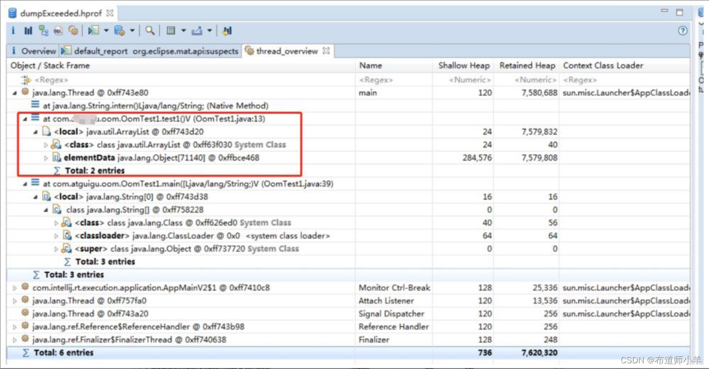

> 本文由 [简悦 SimpRead](http://ksria.com/simpread/) 转码， 原文地址 [blog.csdn.net](https://blog.csdn.net/YYBDESHIJIE/article/details/137713923)

#### 文章目录

*   [1、概述](#1_2)
*   [2、OOM 案例 1：堆内存溢出](#2OOM1_5)
*   [3、OOM 案例 2：元空间溢出](#3OOM2_29)
*   [4、OOM 案例 3:GC overhead limit exceeded](#4OOM3GC_overhead_limit_exceeded_93)
*   [5、OOM 案例 4：线程溢出](#5OOM4_123)
*   [6、小结](#6_177)

在工作中会经常遇到内存溢出 (Out Of Memory,OOM) 异常的情况，每当遇到 OOM，总是让人头疼不已，不知如何下手解决。本帖汇总了 OOM 产生的不同场景，从案例出发，模拟产生不同类型的 OOM，针对不同类型的 OOM 给出相应的解决方案。

1、概述
----

当 JVM 没有足够的内存来为对象分配空间，并且[垃圾回收器](https://so.csdn.net/so/search?q=%E5%9E%83%E5%9C%BE%E5%9B%9E%E6%94%B6%E5%99%A8&spm=1001.2101.3001.7020)也已经没有空间可回收时，就会抛出 OOM 异常。OOM 可以分为四类，分别是堆内存溢出、元空间溢出、GC overhead limit exceeded 和线程溢出。

2、[OOM](https://so.csdn.net/so/search?q=OOM&spm=1001.2101.3001.7020) 案例 1：堆内存溢出
-------------------------------------------------------------------------------

模拟线上环境产生 OOM，代码清单如下所示：  
  
JVM 参数配置如下：

  
运行结果如下所示：  
  
运行程序得到 heapdump.hprof 文件，在设置的 heap 目录下，如下图所示：  
  
由于我们当前设置的内存比较小，所以该文件比较小，但是正常在线上环境，该文件是比较大的，通常以 G 为单位。

下面使用工具分析堆内存文件 heapdump.hprof，通过 Java VisualVM 工具查看哪个类的实例占用内存最多，这样就可以初步定位到问题所在。如下图所示，可以看到在堆内存中存在大量的 People 类对象，占用了 99.9% 内存，基本上就可以定位问题所在了。当然这里的代码比较简单，在工作中，定位问题的思路基本一致。  
  
[内存溢出](https://so.csdn.net/so/search?q=%E5%86%85%E5%AD%98%E6%BA%A2%E5%87%BA&spm=1001.2101.3001.7020)的原因有很多，比如代码中存在大对象分配，导致没有足够的内存空间存放该对象；再比如应用存在内存泄漏，导致在多次垃圾收集之后，依然无法找到一块足够大的内存容纳当前对象。

对于堆溢出的解决方法，这里提供如下思路：

*   (1) 检查是否存在大对象的分配，最有可能的是大数组分配。
*   (2) 通过 jmap 命令，把堆内存 dump 下来，使用内存分析工具分析导出的堆内存文件，检查是否存在内存泄漏的问题。
*   (3) 如果没有找到明显的内存泄漏，考虑加大堆内存-Xmx。
*   (4) 检查是否有大量的自定义的 Finalizable 对象，也有可能是框架内部提供的，考虑其存在的必要性。

3、OOM 案例 2：元空间溢出
----------------

方法区与堆一样，是各个线程共享的内存区域，它用于存储已被 JVM 加载的类信息、常量、静态变量、即时编译器编译后的代码等数据。JDK 8 后，元空间替换了永久代来作为方法区的实现，元空间使用的是本地内存。

Java 虚拟机规范对方法区的限制非常宽松，除了和堆一样不需要连续的内存和可以选择固定大小或者可扩展外，还可以选择不实现垃圾收集。垃圾收集行为在这个区域是比较少出现的，其内存回收目标主要是针对常量池的回收和对类型的卸载。当元空间无法满足内存分配需求时，将抛出 OOM 异常。元空间溢出报错信息如下：

```
java.lang.OutOfMemoryError:Metaspace
```

元空间溢出可能有如下几种原因：

*   (1) 运行期间生成了大量的代理类，导致元空间被占满，无法卸载。
*   (2) 应用长时间运行，没有重启。
*   (3) 元空间内存设置过小。

该类型内存溢出解决方法有如下几种：

*   (1) 检查是否永久代空间或者元空间设置得过小。
*   (2) 检查代码中是否存在大量的反射操作。
*   (3)dump 之后通过 mat 检查是否存在大量由于反射生成的代理类。

代码清单如下所示，代码含义是使用动态代理产生类使得元空间溢出。  
  
JVM 参数配置如下：  
  
浏览器发送如下请求：

```
http://localhost:8080/metaSpaceOom
```

运行结果如下所示：  
  
查看监控，如下图所示：  
  
可以看到，Full GC 非常频繁，而且元空间占用了 59190KB 即 57.8MB 空间，几乎把整个元空间占用。所以得出的结论是方法区空间设置过小，或者存在大量由于反射生成的代理类。查看 GC 日志如下：  
  
  
可以看到 Full GC 是由于元空间不足引起的，那么接下来分析到底是什么数据占用了大量的方法区。导出 dump 文件，使用 Java VisualVM 分析。

首先确定是哪里的代码发生了问题，可以通过线程来确定，因为在实际生产环境中，有时候无法确定是哪块代码引起的 OOM，那么就需要先定位问题线程，然后定位代码，如下图所示：  
  
定位到问题线程之后，使用 MAT 工具打开继续分析，如下图所示，先打开线程视图，然后根据线程名称打开对应线程的栈信息，最后找到对应的代码块。  


定位到代码以后，发现有使用到 cglib 动态代理，那么猜想问题是由于产生了很多代理类。接下来，可以通过包看一下类加载情况。由于代码是代理的 People 类，所以在直方图直接打开该类所在的包，如下图所示：  
  
可以看到确实加载了很多的代理类，想一下解决方案，是不是可以只加载一个代理类以及控制循环的次数，当然如果业务上确实需要加载很多类的话，就要考虑增大方法区大小和控制循环的次数，所以这里修改代码如下：

```
enhancer.setUseCache(true);
```

修改代码 enhancer.setUseCache(false)。当设置为 true 的话，表示开启 cglib 静态缓存，这样每次动态代理的结果是生成同一个类。再看程序运行结果如下：

```
…
     我是print本人
     class com.yang.jvmdemo.bean.People$$EnhancerByCGLIB$$65398cd
     totalClass:6872
     activeClass:6872
     unloadedClass:0
     我是加强类哦，输出print之前的加强方法
     …
```

可以看到，生成代理类的数量几乎不变，元空间也没有溢出。到此，问题解决。如果需要生成不同的类，调整代码更改循环次数即可。


**原因及解决方案：**

JDK8后，元空间替换了永久代，元空间使用的是本地内存

**原因：**

1．运行期间生成了大量的代理类，导致方法区被撑爆，无法卸载
2．应用长时间运行，没有重启
3．元空间内存设置过小


**解决方法：**

因为该OOM原因比较简单，解决方法有如下几种：

1．检查是否永久代空间或者元空间设置的过小
2．检查代码中是否存在大量的反射操作
3．dump之后通过mat检查是否存在大量由于反射生成的代理类

4、OOM 案例 3:GC overhead limit exceeded
-------------------------------------

出现 GC overhead limit exceeded 这个错误是由于 JVM 花费太长时间执行 GC，且只能回收很少的堆内存。根据 Oracle 官方文档表述，默认情况下，**如果 Java 进程花费 98% 以上的时间执行 GC，并且每次只有不到 2% 的堆被恢复，则 JVM 抛出 GC overhead limit exceeded 错误**。换句话说，这意味着应用程序几乎耗尽了所有可用内存，垃圾收集器花了太长时间试图清理它，并多次失败。这本质是一个预判性的异常，抛出该异常时系统没有真正的内存溢出，GC overhead limit exceeded 异常的最终结果是 Java heap space。

在这种情况下，用户会体验到应用程序响应非常缓慢，通常只需要几毫秒就能完成的某些操作，此时则需要更长的时间来完成，这是因为所有的 CPU 正在进行垃圾收集，因此无法执行其他任务。使用代码清如下演示 GC overhead limit exceeded 异常。  
  
JVM 配置如下所示：  
  
test1() 方法的含义是运行期间将内容放入常量池，运行结果是 GC overhead limit exceeded 错误。

test2() 方法的含义是不停地追加字符串 str，运行结果是 Java heap space 错误。


大家可能会疑惑，看似 test1() 方法和 test2() 方法也没有太大的差别，为什么 test2() 方法没有报 GC overhead limit exceeded 呢？以上两个方法的区别在于发生 Java heap space 的 test2() 方法每次都能回收大部分的对象（中间产生的 UUID），只不过有一个对象是无法回收的，慢慢长大，直到内存溢出。发生 GC overhead limit exceeded 的 test1() 方法由于每个字符串都在被 list 引用，所以无法回收，很快就用完内存，触发不断回收的机制。

需要注意的是，有些版本的 JDK，有可能不会发生 GC overhead limit exceeded，各位知道即可。该案例报错信息如下：  
  
通过查看 GC 日志可以发现，系统在频繁地做 Full GC，但是却没有回收多少空间，那么引起的原因可能是内存不足，也可能是存在内存泄漏的情况，接下来我们要根据堆内存文件具体分析 GC overhead limit exceeded 的原因。

**1、定位问题代码块：**  
通过线程分析，可以定位发生 OOM 的代码块，如下图所示：  
  
**2、分析堆内存文件：**  
可以看到发生 OOM 是因为死循环，不停地往 ArrayList 存放字符串常量，JDK 1.7 以后，字符串常量池移到了堆中存储，所以最终导致内存不足发生了 OOM。

打开 “Histogram” 选项，如下图所示。可以看到，String 类型的字符串占用了大概 7.5M 的空间，几乎把堆占满，但是还没有占满，所以这也符合官方对此异常的定义。  
  
右击选择 “List objects”，列出上中对象下面的所有引用对象，如下图所示，可以看到所有 String 对象。  
  
**3、解决方案**  
这个是 JDK 6 新加的错误类型，一般都是堆空间不足导致的。针对该问题的解决方法如下：

*   (1) 检查项目中是否有大量的死循环或有使用大内存的代码，优化代码。
*   (2) 添加 JVM 参数 - XX:-UseGCOverheadLimit 禁用这个检查，其实这个参数解决不了内存问题，只是把错误的信息延后，最终出现 java.lang.OutOfMemoryError:Java heap space。
*   (3) 导出堆内存文件，如果没有发生内存泄漏，加大内存即可。

5、OOM 案例 4：线程溢出
---------------

线程溢出报错信息如下：

```
java.lang.OutOfMemoryError :unable to create new native Thread
```

线程溢出是因为创建的了大量的线程。出现此种情形之后，可能造成系统崩溃。代码清单如下模拟了线程溢出。  
  
结果如下：  
  
JDK 5.0 以后栈默认为 1MB，以前栈默认为 256KB。根据应用的线程所需内存大小进行调整，通过参数 - Xss 设置栈内存。在相同物理内存下，减小这个值能生成更多的线程。但是操作系统对一个进程内的线程数还是有限制的，不能无限生成，经验值是 3000～5000。

操作系统能创建的线程数的具体计算公式如下：

```
(MaxProcessMemory - JVMMemory - ReservedOsMemory)/(ThreadStackSize)=
Number of threads
```

其中各项代表含义如下：

*   (1)MaxProcessMemory 表示进程可寻址的最大空间。
*   (2)JVMMemory 表示 JVM 内存。
*   (3)ReservedOsMemory 表示保留的操作系统内存。
*   (4)ThreadStackSize 表示线程栈的大小。

在 Java 语言里，JVM 在创建一个 Thread 对象的同时创建一个操作系统线程，而这个系统线程的内存用的不是 JVMMemory，而是系统中剩下的内存 (RemainMemory)，计算公式如下：

```
MaxProcessMemory - JVMMemory – ReservedOsMemory = RemainMemory
```

由公式得出：JVM 分配内存越多，那么能创建的线程越少，越容易发生 java.lang.OutOfMemoryError:unable to create new native thread。

针对该问题的解决方案如下：

*   (1) 如果程序中有 bug，导致创建大量不需要的线程或者线程没有及时回收，那么必须解决这个 bug，修改参数是不能解决问题的。
*   (2) 如果程序确实需要大量的线程，现有的设置不能达到要求，那么可以通过修改 MaxProcessMemory、JVMMemory 和 ThreadStackSize 三个因素，来增加能创建的线程数。比如使用 64 位操作系统可以增大 MaxProcessMemory、减少 JVMMemory 的分配或者减小单个线程的栈大小。

在实验过程中，64 位操作系统下调整 Xss 的大小并没有对产生线程的总数产生影响，程序执行到极限的时候，操作系统会死机，无法看出效果。

在 32 位 Win7 操作系统下测试，发现调整 Xss 的大小会对线程数量有影响，随着 Xss 值的变大，线程数量越来越少。如下表所示，其中 JDK 版本是 1.8（适配 32 位操作系统）。  
  
Xss 参数的调整对于 64 位操作系统的实验结果是不明显的，但是对于 32 位操作系统的实验结果却是非常明显的，为什么会有这样的区别呢？上面讲到过线程数量的计算公式如下所示：

```
(MaxProcessMemory - JVMMemory - ReservedOsMemory)/(ThreadStackSize)=
Number of threads
```

MaxProcessMemory 表示最大寻址空间，在 32 位系统中，CPU 的寻址范围就受到 32 个二进制位的限制。32 位二进制数最大值是 11111111 11111111 11111111 11111111,2 的 32 次方 = 4294967296B = 4194304KB = 4096M =4GB。也就是说 32 位 CPU 只能访问 4GB 的内存。再减去显卡上的显存等内存，可用内存要小于 4GB，所以 32 位操作系统可用线程数量是有限的。

64 位二进制数的最大值是 11111111 11111111 1111111111111111 11111111 11111111 11111111 11111111,2 的 64 次方 = 17179869184GB，大家可以看看 64 位操作的寻址空间大小比 32 位操作系统多了太多，所以这也是我们总是无法测试出很好效果的原因。

综上，在生产环境下如果需要更多的线程数量，建议使用 64 位操作系统，如果必须使用 32 位操作系统，可以通过调整 Xss 的大小来控制线程数量。除此之外，线程总数也受到系统空闲内存和操作系统的限制。


6、小结
----

讲解了常见的内存溢出场景，针对不同的场景分析了出现异常的原因，并给出了不同的解决方案。本帖重点讲解了遇到问题时，对问题的解决思路。在工作中，业务场景会更加复杂，内存溢出问题也更加难以解决，这就需要花更多的精力和时间去认真分析问题。