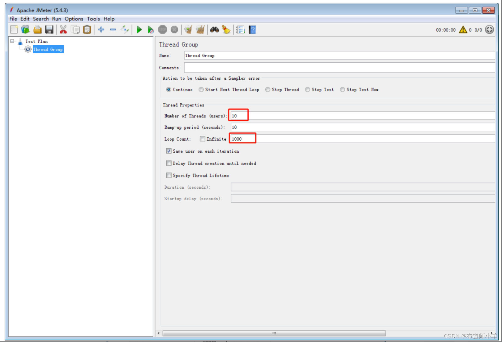

> 本文由 [简悦 SimpRead](http://ksria.com/simpread/) 转码， 原文地址 [blog.csdn.net](https://blog.csdn.net/YYBDESHIJIE/article/details/137716173)

[TOC]

正所谓实践出真知，学习完理论知识，接下来就要在 Java 应用中检验 JVM 知识的使用。本帖将从案例出发，从不同的方面优化应用的性能。

1、概述
----

JVM 性能调优的目标就是减少 GC 的频率和 Full GC 的次数，使用较小的内存占用来获得较高的吞吐量或者较低的延迟。程序在运行过程中多多少少会出现一些与 JVM 相关的问题，比如 CPU 负载过高、请求延迟过长、tps 降低等。更甚至系统会出现内存泄漏、内存溢出等问题进而导致系统崩溃，因此需要对 JVM 进行调优，使得程序在正常运行的前提下，用户可以获得更好的使用体验。一般来说，针对 JVM 调优有以下几个比较重要的指标。

*   (1) 内存占用：程序正常运行需要的内存大小。
*   (2) 延迟：由于垃圾收集而引起的程序停顿时间。
*   (3) 吞吐量：用户程序运行时间占用户程序和垃圾收集占用总时间的比值，这里针对的是 JVM 层面的吞吐量，需要区别于后面讲到的 Apache JMeter 的吞吐量，JMeter 中的吞吐量表示服务器每秒处理的请求数量。

当然，调优时所考虑的方向也不同，在调优之前，必须要结合实际场景，有明确的优化目标，找到性能瓶颈，对瓶颈有针对性的优化，最后测试优化后的结果，通过各种监控工具确认调优后的结果是否符合目标。


2、性能测试工具：Apache JMeter
----------------------

Apache JMeter（简称 JMeter）是 Apache 组织开发的基于 Java 的压力测试工具，用于对软件做压力测试。它最初用于 Web 应用测试，后来也扩展到其他测试领域。JMeter 可以用于对服务器、网络或对象模拟巨大的负载，来自不同压力类别下测试它们的强度和分析整体性能。本章使用 JMeter 测试不同的虚拟机配置对性能的影响结果，下面介绍 JMeter 的基本使用流程。

**(1) 启动 JMeter 后一般会默认生成一个测试计划，如下图所示：**  
  
**(2) 在测试计划下添加线程组。线程组有以下几种重要的参数：**

*   线程数：虚拟用户数，用于并发测试。
*   Ramp-Up 时间（秒）：这个参数表示准备时长，即设置的虚拟用户数需要多长时间全部启动。如果线程数为 10，准备时长为 2，那么需要 2 秒启动 10 个线程，也就是每秒启动 5 个线程。
*   循环次数：每个线程发送请求的次数。如果线程数为 10，循环次数为 1000，那么每个线程发送 1000 次请求。总请求数为 10×1000=10000。如果勾选了 “永远”，那么所有线程会一直发送请求，直到选择停止运行脚本，如下图所示：  
      
    **(3) 新增 HTTP 采样器：**  
    采样器用于对具体的请求进行性能数据的采样，如下图所示，本帖案例添加 HTTP 请求的采样。  
      
    添加完 HTTP 采样器之后需要对请求的具体目标进行设置，比如目标服务器地址，端口号，路径等信息，具体含义如下：
*   协议：向目标服务器发送 HTTP 请求协议，可以是 HTTP 或 HTTPS，默认为 HTTP。
*   服务器名称或 IP:HTTP 请求发送的目标服务器名称或 IP。
*   端口号：目标服务器的端口号，默认值为 80。
*   方法：发送 HTTP 请求的方法，包括 GET、POST、HEAD、PUT、OPTIONS、TRACE、DELETE 等。
*   路径：目标 URL 路径（URL 中去掉服务器地址、端口及参数后剩余部分）。
*   内容编码：编码方式，默认为 ISO-8859-1 编码，这里配置为 utf-8。

如下图所示，JMeter 会按照设置对目标进行批量的请求：  
  
**(4) 添加监听器。**  
对于批量请求的访问结果，JMeter 会以报告的形式展现出来，在监听器中，添加聚合报告，如下图所示：  
  
调试运行，分析指标数据、挖掘性能瓶颈、评估系统性能状态，主要查看聚合报告的结果，聚合报告中各个指标详解如下：

*   Label：每个 JMeter 的元素（例如 HTTP Request）都有一个 Name 属性，这里显示的就是 Name 属性的值。
*   #Samples：这次测试中一共发出了多少个请求，如果模拟 10 个用户，每个用户迭代 10 次，那么这里显示 100。
*   Average：平均响应时间。默认情况下是单个请求的平均响应时间 (ms)，当使用 Transaction Controller 时，以 Transaction 为单位显示平均响应时间。
*   Median：中位数，也就是 50% 用户的响应时间。
*   90% Line:90% 用户的响应时间。
*   Min：最小响应时间。
*   Max：最大响应时间。
*   Error%：错误率，即错误请求数／请求总数。
*   throughput：吞吐量。默认情况下表示每秒完成的请求数 (Request per Second)。
*   KB/Sec：每秒从服务器端接收到的数据量。

3、性能优化案例 1：调整堆大小提高服务的吞吐量
------------------------

案例创建 Spring Boot 项目，以便可以通过 Web 访问。这里使用 JMeter 模拟批量请求，代码清单如下所示：  
  
JVM 配置如下：

```
-XX:+PrintGCDetails -XX:MetaspaceSize=64m -XX:+PrintGCDateStamps
     –Xms40M  -Xmx40M -Xloggc:log/gc.log
```

JMeter 线程组配置如图 26-6 所示，这里大家可以根据自己机器自行设置。  
  
JMeter 设置 HTTP 采样器，如下图所示：  
  
启动 Spring Boot 工程，运行 JMeter，查看 JMeter 吞吐量，如下表所示，这里测试三次数据，最后取平均值。  
  
修改 JVM 配置，增加初始化内存和最大内存配置，如下所示：

```
-XX:+PrintGCDetails -XX:MetaspaceSize=64m -XX:+PrintGCDateStamps –
Xms90M  -Xmx90M -Xloggc:log/gc.log
```

重启 Spring Boot 工程，运行 JMeter，查看 JMeter 吞吐量，如下表所示：  
  
对比发现，在增大内存之后，吞吐量明显增强。通过 jstat 命令查看 GC 状态，下图展示了增大内存之前的 GC 状态，其中 Full GC 次数高达 221 次，Full GC 时间为 6.037s。  
  
下图展示了增大内存之后的 Full GC 状态，其中 Full GC 次数为 2 次，GC 时间为 0.087s。发现增大内存之后，Full GC 的次数明显减少，这样系统暂停时间就会减少，所以每秒处理的请求数量就会增多。  


4、性能优化案例 2：调整垃圾收集器提高服务的吞吐量
--------------------------

本次测试环境中 JDK 版本为 1.8.0_141,Tomcat 版本为 8.5,Linux 配置为 4 核、4G 物理内存。生产环境下，Tomcat 并不建议直接在 catalina.sh 里配置变量，而是配置在与 catalina 同级目录（bin 目录）下的 setenv.sh 里，所以 JVM 配置信息也配置到 setenv.sh 中，如下图所示：

  
代码清单如下所示：  
  
将该工程打包为 war 包部署到 Tomcat 服务器中，如下所示：

```
[root@linux1 webapps]#ls
     docs  examples  yang_web  yang_web.war  host-manager  manager  ROOT
```

JMeter 线程组配置如下图所示，这里读者可以根据自己机器自行设置，保证请求不出现错误即可。  
  
JMeter 设置 HTTP 采样器如图 26-12 所示，这里大家需要根据自己的项目路径进行设置：  
  
使用串行垃圾收集器，服务器 JVM 配置如下：  
  
可以看到 GC 日志显示 DefNew，如下图所示，说明用的是串行收集器 Serial GC。  
  
启动 Tomcat 服务器，运行 JMeter，查看 JMeter 吞吐量如下表所示，这里测试三次数据，最后取平均值。  
  
修改垃圾收集器，新生代和老年代全部使用并行收集器，JVM 配置如下：  
  
重启 Tomcat 服务器，运行 JMeter，查看 JMeter 吞吐量，如下表所示：  
  
比发现，在改为并行垃圾收集器之后，吞吐量明显增强。这是因为并行垃圾收集器在串行垃圾收集器的基础上做了优化，垃圾收集由单线程变成了多线程，这样可以缩短垃圾收集的时间。虽然并行垃圾收集器在收集过程中也会暂停应用程序，但是多线程并行执行速度更快，暂停时间也就更短，系统的吞吐量随之提升。

接下来我们改为 G1 收集器看看效果，修改 JVM 参数配置，将垃圾收集器改为 G1，配置参数如下：  
  
启动 Tomcat 服务器，运行 JMeter，查看 JMeter 吞吐量，如下表所示，这里测试三次数据，最后取平均值。  
  
查看压测效果，吞吐量比并行收集器效果更佳，平均值由原来的 240.6/s 增加为 296.7/s。

综上，当大家在工作中如果服务器的垃圾收集时间较长，或者对请求的处理性能没有达到目标要求的时候，可以考虑使用不同的垃圾收集器来做优化。

5、性能优化案例 3:JIT 优化
-----------------

从 JVM 的执行机制层面来优化 JVM。Java 为了提高 JVM 的执行效率，提出了一种叫作即时编译 (JIT) 的技术。即时编译的目的是避免函数被解释执行，而是将整个函数体编译成机器码，每次函数执行时，只执行编译后的机器码即可，这种方式可以使执行效率大幅度提升。根据二八定律（百分之二十的代码占据百分之八十的系统资源），对于大部分不常用的代码，我们无须耗时将之编译为机器码，而是采用解释执行的方式，用到就去逐条解释运行。对于一些仅占据较少系统资源的热点代码（可认为是反复执行的重要代码），则可将之翻译为符合机器的机器码高效执行，提高程序的执行效率。

**1、即时编译的时间开销**  
通常说 JIT 比解释快，其实说的是 “执行编译后的代码” 比“解释器解释执行”要快，并不是说 “编译” 这个动作比 “解释” 这个动作快。JIT 编译再怎么快，至少也比解释执行一次略慢一些，而要得到最后的执行结果还得再经过一个 “执行编译后的代码” 的过程。所以，对 “只执行一次” 的代码而言，解释执行其实总是比 JIT 编译执行要快。只有频繁执行的代码（热点代码），JIT 编译才能保证有正面的收益。

**2、即时编译的空间开销**  
对一般的 Java 方法而言，编译后代码的大小相对于字节码的大小，膨胀比达到 10 倍是很正常的。同上面说的时间开销一样，这里的空间开销也是，只有执行频繁的代码才值得编译，如果把所有代码都编译则会显著增加代码所占空间，导致代码爆炸。这也就解释了为什么有些 JVM 会选择不总是做 JIT 编译，而是选择用解释器和 JIT 编译器的混合执行引擎。


**见上篇 《堆》篇章**


### 优化一：栈上分配优化

JIT 编译器在编译期间根据逃逸分析的结果，发现如果一个对象并**没有逃逸出方法**的话，就可能被优化成栈上分配。分配完成后，继续在调用栈内执行，最后线程结束，栈空间被回收，局部变量对象也被回收。这样就无须进行垃圾回收了。

在 JDK 6u23 版本之后，HotSpot 中默认就已经开启了逃逸分析

如果使用的是较早的版本，开发人员则可以通过：

- 选项“`-XX:+DoEscapeAnalysis`"显式开启逃逸分析
- 通过选项“`-XX:+PrintEscapeAnalysis`"查看逃逸分析的筛选结果

**结论**：<mark>开发中能使用局部变量的，就不要使用在方法外定义。</mark>


> -XX:+DoEscapeAnalysis 关闭逃逸分析后对中可以查看很多User
>
> 开启后查看不到

```java
public class OomTest {

    public static void main(String[] args) throws InterruptedException {

        long start = System.currentTimeMillis();
        for (int i = 0; i < 10000000; i++) {
            test();
        }
        long end = System.currentTimeMillis();
        System.out.println("耗时" +(end - start));

        Thread.sleep(300000);
    }

    public static void test() {

        User o = new User();
    }
}

class User{

}
```


### 优化二 标量替换

<mark>标量（scalar）</mark>是指一个无法再分解成更小的数据的数据。Java 中的原始数据类型就是标量。

相对的，那些还可以分解的数据叫做<mark>聚合量（Aggregate）</mark>，Java 中的对象就是聚合量，因为他可以分解成其他聚合量和标量。

在 JIT 阶段，如果经过逃逸分析，发现一个对象不会被外界访问的话，那么经过 JIT 优化，就会把这个对象拆解成若干个其中包含的若干个成员变量来代替。这个过程就是标量替换。

**举例**

```java
public static void main(String args[]) {
    alloc();
}
private static void alloc() {
    Point point = new Point(1,2);
    System.out.println("point.x" + point.x + ";point.y" + point.y);
}
class Point {
    private int x;
    private int y;
}
```

以上代码，经过标量替换后，就会变成

```java
private static void alloc() {
    int x = 1;
    int y = 2;
    System.out.println("point.x = " + x + "; point.y=" + y);
}
```

可以看到，Point 这个聚合量经过逃逸分析后，发现他并没有逃逸，就被替换成两个标量了。那么标量替换有什么好处呢？就是可以大大减少堆内存的占用。因为一旦不需要创建对象了，那么就不再需要分配堆内存了。 标量替换为栈上分配提供了很好的基础。

**标量替换参数设置**

参数`-XX:EliminateAllocations`：开启了标量替换（默认打开），允许将对象打散分配到栈上。


上述代码在主函数中进行了 1 亿次 alloc。调用进行对象创建，由于 User 对象实例需要占据约 16 字节的空间，因此累计分配空间达到将近 1.5GB。如果堆空间小于这个值，就必然会发生 GC。使用如下参数运行上述代码：

```shell
-server -Xmx100m -Xms100m -XX:+DoEscapeAnalysis -XX:+PrintGC -XX:+EliminateAllocations
```

这里设置参数如下：

- 参数`-server`：启动 Server 模式，因为在 server 模式下，才可以启用逃逸分析。
- 参数`-XX:+DoEscapeAnalysis`：启用逃逸分析
- 参数`-Xmx10m`：指定了堆空间最大为 10MB
- 参数`-XX:+PrintGC`：将打印 Gc 日志
- 参数`-XX:+EliminateAllocations`：开启了标量替换（默认打开），允许将对象打散分配在栈上，比如对象拥有 id 和 name 两个字段，那么这两个字段将会被视为两个独立的局部变量进行分配

### 优化三 锁消除

线程同步的代价是相当高的，同步的后果是降低并发性和性能。

在动态编译同步块的时候，JIT 编译器可以<mark>借助逃逸分析来判断同步块所使用的锁对象是否只能够被一个线程访问而没有被发布到其他线程</mark>。如果没有，那么 JIT 编译器在编译这个同步块的时候就会取消对这部分代码的同步。这样就能大大提高并发性和性能。这个取消同步的过程就叫同步省略，也叫<mark>锁消除</mark>。

**举例**

```java
public void f() {
    Object hellis = new Object();
    synchronized(hellis) {
        System.out.println(hellis);
    }
}
```

代码中对 hellis 这个对象加锁，但是 hellis 对象的生命周期只在 f()方法中，并不会被其他线程所访问到，所以在 JIT 编译阶段就会被优化掉，优化成：

```java
public void f() {
    Object hellis = new Object();
	System.out.println(hellis);
}
```


6、性能优化案例 4:`G1 并发执行的线程数对性能的影响`
----------------------------

将 Linux 服务器更换为 8 核。依然使用如下代码清单的代码：  
  
初始化内存和最大内存调整小一些，目的是让程序发生 Full GC，关注点是 GC 次数、GC 时间，以及 JMeter 的平均响应时间。

JMeter 线程组配置如下图所示，这里读者可以根据自己机器配置自行设置，保证请求不出现错误即可。  


JVM 配置如下，并发线程数量为 2：  
  
启动 Tomcat，查看 JVM 统计信息，命令如下：

```
jstat -gc pid
```

JVM 统计信息如下图所示：  
  
从上图中可以得出如下信息：

```
YGC:youngGC次数是48次
     FGC:Full GC次数是0次
     GCT:GC总时间是0.836s
```

JMeter 压测之后的 JVM 统计信息如下图所示：  
  
从上图中可以得出如下信息：

```
YGC:youngGC次数是2475次
     FGC:Full GC次数是0次
     GCT:GC总时间是48.133s
```

由此可以计算出压测过程中，发生的 GC 次数和 GC 时间差。

压测过程 GC 状态如下所示：

```
YGC:youngGC次数是 2475- 48= 2427次
     FGC:Full GC次数是 0 - 0 = 0次
     GCT:GC总时间是 48.133 - 0.836 = 47.297s
```

JMeter 聚合报告如下图所示：  
  
从上图中可以看到 95% 的请求响应时间为 138ms,99% 的请求响应时间为 190ms。


下面我们设置并发线程数量为 1，如下所示：

```
export CATALINA_OPTS="$CATALINA_OPTS -XX:ConcGCThreads=1"
```

为了让服务器保持状态一致性，每次实验完成以后重启服务器，Tomcat 启动之后的 JVM 统计信息如下图所示：  
  
从上图中可以得出如下信息：

```
YGC:youngGC次数是 48 次
     FGC:Full GC次数是 0 次
     GCT:GC总时间是 1.213s
```

JMeter 压测之后的 JVM 统计信息如下图所示：  
  
从上图中可以得出如下信息：

```
YGC:youngGC次数是 48 次
     FGC:Full GC次数是 0 次
     GCT:GC总时间是 1.213s
```

JMeter 压测之后的 JVM 统计信息如下图所示：  
  
从上图中可以得出如下信息：

```
YGC:youngGC次数是 3160 次
     FGC:Full GC次数是 162 次
     GCT:GC总时间是 85.812s
```

压测结果如下图所示：  
  
从上图可知，95% 的请求响应时间为 290ms,99% 的请求响应时间为 421ms。


结论：通过对比发现设置线程数为 1 之后，服务请求的平均响应时间和 GC 时间都有一个明显的增加。仅从效果上来看，这次的优化是有一定效果的。大家在工作中对于线上项目进行优化的时候，可以考虑到这方面的优化。

7、性能优化案例 5：`合理配置堆内存`
------------------

增加内存可以提高系统的性能而且效果显著，那么随之带来的一个问题就是，增加多少内存比较合适？如果内存过大，那么产生 Full GC 的时候，GC 时间会相对比较长；如果内存较小，那么就会频繁的触发 GC，在这种情况下，我们该如何合理配置堆内存大小呢？可以根据 Java Performance 里面的推荐公式来进行设置，如下图所示：  
  

> 公式的意思是 
>
> + Java 中整个堆大小设置原则是 Xmx 和 Xms 设置为老年代存活对象的 3～4 倍，即 Full GC 之后堆内存是老年代内存的 3～4 倍。
> + 方法区（永久代 PermSize 和 MaxPermSize)设置为老年代存活对象的 1.2～1.5 倍。
> + 新生代 Xmn 的设置为老年代存活对象的 1～1.5 倍。
> + 老年代的内存大小设置为老年代存活对象的 2～3 倍。

但是，上面的说法也不是绝对的，也就是说这给的是一个参考值，根据多次调优之后得出的一个结论，大家可以根据这个值来设置初始化内存。在保证程序正常运行的情况下，我们还要去查看 GC 的回收率，GC 停顿耗时，内存里的实际数据来判断，Full GC 是基本上不能太频繁的，如果频繁就要做内存分析，然后再去做一个合理的内存分配。还要注意到一点就是，老年代存活对象怎么去判定。计算老年代存活对象的方式有以下 2 种：

*   方式 1:JVM 参数中添加 GC 日志，GC 日志中会记录每次 Full GC 之后各代的内存大小，观察老年代 GC 之后的空间大小。可观察一段时间内（比如 2 天）的 Full GC 之后的内存情况，根据多次的 Full GC 之后的老年代的空间大小数据来预估 Full GC 之后老年代的存活对象大小（可根据多次 Full GC 之后的内存大小取平均值）。
*   方式 2：方式 1 的方案虽然可行，但需要更改 JVM 参数，并分析日志。同时，在使用 CMS 收集器的时候，有可能无法触发 Full GC（只发生 CMS GC），所以日志中并没有记录 Full GC 的日志，在分析的时候就比较难处理。所以，有时候需要强制触发一次 Full GC，来观察 Full GC 之后的老年代存活对象大小。需要注意的是强制触发 Full GC，会造成线上服务停顿 (STW)，要谨慎。我们建议在强制 Full GC 前先把服务节点摘除，Full GC 之后再将服务挂回可用节点，使之对外提供服务。在不同时间段触发 Full GC，根据多次 Full GC 之后的老年代内存情况来预估 Full GC 之后的老年代存活对象大小，触发 Full GC 的方式有下面三种。

​	(1) 使用如下命令将当前的存活对象 dump 到文件，此时会触发 Full GC：

```sh
jmap -dump:live,format=b,file=heap.bin <pid>
```

​	(2) 使用如下命令打印每个 class 的实例数目、内存占用和类全名信息，此时会触发 Full GC：

```
jmap -histo:live <pid>
```

​	(3) 在性能测试环境，可以通过 Java 监控工具来触发 Full GC，比如使用 VisualVM 和 JConsole，这些工具在最新的 JDK 的 bin 目录下可以找到。VisualVM 或者 JConsole 上面有一个触发 GC 的按钮。


> 估算GC频率
>
> 正常情况我们应该根据我们的系统来进行一个内存的估算，这个我们可以在测试环境进行测试，最开始可以将内存设置的大一些，比如4G这样，当然这也可以根据业务系统估算来的。
>
> 
>
> 比如从数据库获取一条数据占用 128 字节，每次需要获取 1000 条数据，那么一次读取到内存的大小就是 (128/1024/1024)×1000=0.122MB，程序可能需要并发读取，比如每秒读取 1000 次，那么内存占用就是 0.122×1000=12MB，如果堆内存设置为 1GB，新生代大小大约（1/3）就是 （1024/3=341M），伊甸园区341M*0.8 =273M ，那么每 273/12=22.38s 就会把新生代内存填满，也就是说我们的程序几乎每分钟进行两次 Young GC。


现在我们通过 IDEA 启动 Spring Boot 工程，将内存初始化为 1024MB。这里就从 1024MB 的内存开始分析系统的 GC 日志，根据上面的一些知识来进行一个合理的内存设置。

JVM 设置如下：

```sh
-XX:+PrintGCDetails -XX:MetaspaceSize=64m -Xss512K -XX:+HeapDumpOnOutOfMemoryError    -XX:HeapDumpPath=heap/heapdump.hprof  -XX:SurvivorRatio=8  -XX:+PrintGCDateStamps  -Xms1024M  -Xmx1024M -Xloggc:log/gc-oom.log
```

系统代码如下所示，这里只是从数据库中获取数据列表返回到前端，没有做过多的业务处理。

controller 层代码如下所示：  
  
service 层代码如下所示：  
  
mapper 层代码如下所示：  
  
bean 层代码如下所示：  
  
xml 配置文件如下所示：  
  
通过 JMeter 访问一段时间后，主要是看项目是否可以正常运行，使用下面的命令查看 JVM 统计信息状态。

```sh
jstat -gc pid
```

JVM 统计信息如下图所示：  
  
从上图中可以得出如下信息：

```
YGC平均耗时：0.12s * 1000/7 = 17.14ms
     FGC未产生
```

看起来似乎不错，YGC 触发的频率不高，FGC 也没有产生，但这样的内存设置是否还可以继续优化呢？是不是有一些空间是浪费的呢？

为了快速看数据，我们使用了方式 2，通过命令 jmap -histo:live pid 产生几次 Full GC,Full GC 之后，使用 jmap -heap 来查看当前的堆内存情况。

通过以下命令观察老年代存活对象大小：

```
jmap -heap pid
```

查看一次 Full GC 之后剩余的空间大小，如下图所示：  
  
可以看到老年代存活对象占用内存空间大概为 13.36MB，老年代的内存分配为 683MB 左右。按照整个堆大小是老年代 Full GC 之后的 3～4 倍计算的话，设置堆内存在 Xmx=14×3 = 42MB 至 14×4 = 56MB 之间。

我们修改堆内存大小为 60MB,JVM 参数设置如下所示：  
  
修改完之后，查看 JVM 统计信息，如下图所示：  
  
修改完之后 YGC 平均耗时为 0.195s×1000/68 = 2.87ms，没有产生 Full GC。整体的 GC 耗时减少。但 GC 频率比之前的 1024M 时要多一些。依然未产生 Full GC，所以我们内存设置为 60MB 也是比较合理的，相对之前节省了很大一块内存空间，所以本次内存调整是比较合理的。

再次手动触发 Full GC，查看堆内存结构，如下图所示，可以发现堆内存足够使用。  
  


**结论：**

从以上试验得知在内存相对紧张的情况下，可以按照上述的方式来进行内存的调优，找到一个在 GC 频率和 GC 耗时上都可接受的内存设置，用较小的内存满足当前的服务需要。

但当内存相对宽裕的时候，可以相对给服务多增加一点内存，减少 GC 的频率。一般要求低延时的可以考虑多设置一点内存，对延时要求不高的，可以按照上述方式设置较小内存。

如果在垃圾收集日志中观察到堆内存发生 OOM，尝试把堆内存扩大到物理内存的 80%～90%。在扩大了内存之后，再检查垃圾收集日志，直到没有 OOM 为止。如果应用运行在稳定状态下没有 OOM 就可以进入下一步了，计算活动对象的大小。


### JVM参数之UseAdaptiveSizePolicy

#### 1、AdaptiveSizePolicy(自适应大小策略) ：

   JDK 1.8 默认使用 UseParallelGC 垃圾回收器，该垃圾回收器默认启动了 AdaptiveSizePolicy，会根据GC的情况自动计算计算 Eden、From 和 To 区的大小；

#### 2、配置：

​    开启：-XX:+UseAdaptiveSizePolicy
​    关闭：-XX:-UseAdaptiveSizePolicy

#### 3、注意事项：

​    1、在 JDK 1.8 中，如果使用 CMS，无论 UseAdaptiveSizePolicy 如何设置，都会将 UseAdaptiveSizePolicy 设置为 false；不过不同版本的JDK存在差异；
​    2、**UseAdaptiveSizePolicy不要和SurvivorRatio参数显示设置搭配使用，一起使用会导致参数失效**；
​    3、由于AdaptiveSizePolicy会动态调整 Eden、Survivor 的大小，有些情况存在Survivor 被自动调为很小，比如十几MB甚至几MB的可能，这个时候YGC回收掉 Eden区后，还存活的对象进入Survivor 装不下，就会直接晋升到老年代，导致老年代占用空间逐渐增加，从而触发FULL GC，如果一次FULL GC的耗时很长（比如到达几百毫秒），那么在要求高响应的系统就是不可取的。

 

> **附：对于面向外部的大流量、低延迟系统，不建议启用此参数，建议关闭该参数。**

如果不想动态调整内存大小，以下是解决方案：

1、保持使用 UseParallelGC，显式设置`-XX:SurvivorRatio＝8`。 

2、使用 CMS垃圾回收器。CMS 默认关闭 AdaptiveSizePolicy。配置参数 `-XX:+UseConcMarkSweepGC`

8、性能优化案例 6:`CPU占用很高排查方案`
--------------------------------------------------------------------------------------

当系统出现卡顿或者应用程序的响应速度非常慢，就可能要考虑到服务器上排查一番，作为应用负责人，都希望自己负责的应用能够在线上环境运行顺畅，不出任何错误，也不产生任何告警，当然这是最理想的结果。可实际上应用总会在不经意间发生一些意外的情况，例如 CPU 偏高、内存占用偏高、应用没有响应、应用自动挂掉等。这里分享的案例是关于如何排查 CPU 偏高的问题。代码清单如下用于模拟应用 CPU 占用偏高。  


把代码上传到 Linux 系统执行，用于模拟线上环境，运行结果如下所示：

```
[root@linux1 ～]# java HighCpuTest
     threadTest2 is runninng
```

可以看到，程序依然处于运行状态。现在我们知道错误是线程执行期间无限循环造成的，那么如果是生产环境的话，怎么样才能发现目前程序有问题呢？如果线程一直处于无限循环状态，那么线程一直在占用 CPU，这样就会导致 CPU 一直处于一个比较高的占用率。通过 top 命令查看，可以发现 PID 为 2100 的进程占用 CPU 较高，如下图所示：  
  
解决问题的步骤如下所示：

*   (1) 使用 top 命令定位到占用 CPU 高的**进程 PID**。
*   (2) `top -Hp`根据进程 PID 检查当前异常**线程的 PID**。
*   (3) 把十进制**线程 PID** 转为十六进制，例如，31695 转为十六进制结果为 7bcf，然后得到线程 PID 为 0x7bcf。
*   (4)jstack 进程的 pid|grep-A20 0x7bcf 得到相关进程的代码，鉴于当前代码量比较小，线程也比较少，所以就把所有的线程信息全部导出来。

从上图可以得到 PID 为 2100 的进程占用 CPU 较高，接下来根据进程 ID 查看当前使用异常线程的 PID。

```sh
top -Hp 2100
```

结果如下图所示：  
  
从上图可以看出，当前占用 CPU 比较高的线程 PID 是 2133。接下来把线程 PID 转换为十六进制，转换结果为 855，在计算机中显示为 0x855。

```
# 10 进制线程PId 转换为 16 进制
     2133------->855
     #855在计算机中显示为 0x855
```

最后使用 jstack 命令把线程信息输入到文件中，如下所示：

```sh
#注意：这里是进程的PID，不是线程PID
jstack  2100 >jstack.log
```

所有的准备工作已经完成，接下来分析日志中的信息，来定位问题出在哪里。打开 jstack.log 文件，查找刚刚转换完的十六进制 PID 是否存在，如图下图所示：  
  
jstack 命令生成的线程信息包含了 JVM 中所有存活的线程，里面确实是存在定位到的线程 PID，在线程信息中每个线程都有一个 nid，在 nid=0x855 的线程调用栈中，可以定位到线程异常的代码块（HighCpuTest.java 文件中的第 8 行代码，正好是代码中的死循环处的代码）和出现问题的线程名称 (threadTest1)。到此就可以定位到问题出现的原因了，针对不同的业务情况做出不同的修改方案。


延伸：大厂排查问题步骤

> 1、`ps aux｜grep java` 查看到当前java进程使用cpu、内存、磁盘的情况获取使用量异常的进程
>
> 2、`top -Hp`进程pid 检查当前使用异常线程的pid
>
> 3、把线程pid变为16进制如31695—》7bcf 然后得到0x7bcf
>
> 4、jstack 进程的pid｜grep -A20 0x7bcf 得到相关进程的代码 

9、性能优化案例 7：日均百万级订单交易系统设置 JVM 参数
-------------------------------

每天百万级订单绝对是现在顶尖电商公司的交易量级。百万级订单一般在 4 小时内产生，我们计算一下每秒产生多少订单：3000000/4/3600 = 208 单 / s，为了方便计算，我们按照每秒 300 单来计算。

这种系统一般至少需要三四台机器去支撑，假设我们部署了三台机器，也就是每台机器每秒大概处理 100 单，也就是每秒大概有 100 个订单对象在堆空间的新生代内生成，一个订单对象的大小跟里面的字段多少及类型有关，比如 int 类型的订单 id 和用户 id 等字段，double 类型的订单金额等，int 类型占用 4 字节，double 类型占用 8 字节，粗略估计一个订单对象大概是 1KB，也就是说每秒会有 100KB 的订单对象分配在新生代内，如下图所示：  
  
真实的订单交易系统肯定还有大量的其他业务对象，比如购物车、优惠券、积分、用户信息、物流信息等，实际每秒分配在新生代内的对象大小应该要再扩大几十倍，假设是 20 倍，也就是每秒订单系统会往新生代内分配近 2MB 的对象数据，这些数据在订单提交的操作做完之后，基本都会成为垃圾对象，如下图所示：  


假设我们选择 4 核 8G 的服务器，JVM 堆内存分到 4GB 左右，于是给新生代分配（1/3） 1333MB，这样差不多需要 650 秒可以把新生代占满，进而触发 Minor GC，这样的 GC 频率是可以接受的，如下图所示：  
  
另外，也**可以继续调整新生代大小，新生代和老年代比例不一定必须是 1:2，这样也可以降低YGC 频率，进入老年代的对象也会降低，减少 Full GC 频率**。


如果系统业务量继续增长，那么可以水平扩容增加更多的机器，比如 5 台甚至 10 台机器，这样每台机器的 JVM 处理请求可以保证在合适范围，不致因压力过大导致大量的 GC。

假设业务量暴增几十倍，在不增加机器的前提下，整个系统每秒要生成几千个订单，之前每秒往新生代里分配的 2MB 对象数据可能增长到几十兆，而且因为系统压力骤增，一个订单的生成不一定能在 1 秒内完成，可能要几秒甚至几十秒，那么就有很多对象会在新生代里存活几十秒之后才会变为垃圾对象，如果新生代只分配了几百兆，意味着一二十秒就会触发一次 Minor GC，那么很有可能部分对象就会被挪到老年代，这些对象到了老年代后因为对应的业务操作执行完毕，马上又变为了垃圾对象，随着系统不断运行，被挪到老年代的对象会越来越多，最终可能又会导致 Full GC，如下图所示：  


10、性能优化案例 8：综合性能优化
------------------

本案例将模拟生产环境中出现的高占用 CPU 和 OOM 问题的出现对系统进行优化，程序代码清单如下所示：  
  
案例中模拟一个 Web 网站请求后台数据的接口，当用户访问一个页面时，后台有可能调用多个服务，比如请求商品详情页面，需要调用商品信息、商品价格，以及商品分类等信息。如果在该服务中，对上面几个服务进行串行调用，无疑会增加服务的响应时间，造成用户体验非常差，所以这里采用了异步编排技术 (CompletableFuture) 和线程池来对各个服务进行异步调用，这样可以最大程度提升系统响应时间。

代码中，“模拟获取商品信息服务”使用了死循环代码，这里只是为了模拟在服务调用过程中出现的线程长时间占用 CPU 的情况，和前面讲到的案例 6 一样。模拟 “获取商品价格服务” 中线程每次休眠 20 ms，是用于模拟 I/O 等待、切换。模拟 “获取商品分类信息” 服务中使用了有限的循环次数，这样做是为了保证服务最终可以被正常调用，不会出现请求一直等待的状态。

将 Web 服务部署到 Tomcat 服务器，JVM 配置如下：  
  
启动 Tomcat，通过 top 命令查看机器状态，机器负载以及 CPU 占用率均正常，如下图所示：  
  
可以看到此时机器运行状态无异常，通过请求访问服务，浏览器输入以下地址 http://172.16.210.10:8080/yang_web-1.1-SNAPSHOT/getData。其中 “172.16.210.10” 为服务器 IP 地址。再次通过 top 命令查看机器状态，如下图所示：  
  
可以发现，其中只有 Cpu1 处于 100% 的状态，但是如果 “获取商品价格服务” 中线程删除每次休眠 50 ms，不再用于模拟 I/O 等待、切换，那么此时就会有两个 CPU 处于 100% 的状态，为了验证 “获取商品价格服务” 一直处于运行状态，可以查看日志信息，如下所示：

```
商品价格为：10元
     商品价格为：10元
     商品价格为：10元
     商品价格为：10元
     商品价格为：10元
     商品价格为：10元
     商品价格为：10元
     商品价格为：10元
     商品价格为：10元
     商品价格为：10元
     商品价格为：10元
     商品价格为：10元
```

可以发现，日志一直处于打印状态，说明线程一直在运行。这两段代码说明了一个问题，一个满载运行的线程（不停执行 “计算” 型操作时）可以把单个核心的利用率全部占用，多核心 CPU 最多只能同时执行等于核心数的满载线程数，在本机器中，最多只能同时执行 4 个线程。当项目中存在 I/O 等暂停类操作时，CPU 处于空闲状态，操作系统调度 CPU 执行其他线程，可以提高 CPU 利用率，同时执行更多的线程。本案例使用线程休眠来模拟该操作，其他的 I/O 操作例如在项目中需要大量数据插入数据库，或者打印了大量的日志信息等操作（注意，如果打印日志信息过多，会造成服务运行时间加长，但是机器的负载不会增加，工作中还是要尽量打印简洁明了的日志信息）。

进行多次请求，此时再通过 top 命令查看机器性能，每多一次请求，就多一个 CPU 核心利用率被占满，如下图所示：  


使用案例 6 中的解决方案进行问题定位：

```
# 查看所有Java进程 ID
     jps -l
```

结果如下：

```
[root@localhost bin]# jps -l
     2057 sun.tools.jps.Jps
     1963 org.apache.catalina.startup.Bootstrap
```

根据进程 PID 检查当前使用异常线程的 PID：

```
top -Hp 1963
```

结果如下图所示：  
  
从上图可以看出，当前占用 CPU 比较高的线程 PID 是 2021、2031、2034 和 2037。接下来把线程 PID 转换为十六进制，如下所示：

```
# 10 进制线程PID 转换为十六进制
     2021-------> 0x7e5
     2031-------> 0x7ef
     2034-------> 0x7f2
     2037-------> 0x7f5
```

最后我们使用 jstack 命令将线程信息存储到日志文件中，如下所示，注意，这里是进程的 PID，不是线程 ID。

```
jstack  1963 > jstack.log
```

打开 jstack.log 文件，查找一下刚刚转换完的十六进制 ID,0x7e5 对应的线程信息如下图所示：  
  
0x7ef 对应的线程信息如下图所示：  
  
0x7f2 对应的线程信息如下图所示：  
  
0x7f5 对应的线程信息如下图所示：  
  
线程信息中虽然线程名称相同，但是各位要注意，这里并不是同一个线程，tid 表示 JVM 内部线程的唯一标识。之所以线程名称相同是因为每次请求都会创建新的线程池。

通过堆栈信息可以发现定位的问题代码都是 MemoryTestController 类中的第 145 行代码，即无限循环的代码块，如下图所示：  
  
到此线程占用 CPU 较高的原因以及问题代码定位完成。修改代码如下，修改死循环为有限循环，如下所示：  
  
重新部署服务到 Tomcat，再次发送请求，通过 top 命令查看机器状态，机器负载以及 CPU 占用率均正常，如下图所示：  
  
通过 jstat 查看 JVM 的统计信息，4 次 young GC，无 Full GC，目前效果可以接受，如下图所示：  
  
通过 JMeter 进行压力测试，设置线程组并发数为 30，如下图所示：  
  
开始运行 JMeter，此时机器未发生异常。当项目运行一段时间之后，用户数增加，设置线程组并发数为 800，如下图所示：  
  
此时系统发生 “java.lang.OutOfMemoryError:Java heap space” 异常，如下所示：

```
商品信息：华为Mate40
     java.lang.OutOfMemoryError:Java Heap space
     商品信息：华为Mate40
     java.lang.OutOfMemoryError:Java Heap space
     商品价格为：10元
     java.lang.OutOfMemoryError:Java Heap space
```

在 JVM 配置文件中，当发生堆内存溢出异常时，会自动生成堆 dump 文件到 / opt/apache-tomcat-8.5.41/heap / 目录下，如下所示：

```
[root@localhost bin]# ls
     java_pid24612.hprof
```

通过内存分析工具 Mat 打开 java_pid24612.hprof，如下图所示：  
  
打开 “Histogram” 选项，如下图所示，可以看到这个 byte[]数组占用了 534.87M，而我们设置的最大堆内存为 600M，可以确定就是这个 byte[]数组导致了内存溢出。  
  
选中 byte[]数组行，右击 “Merge Shortest Paths to GC Roots”→“with all references” 选项，查看所有的对象引用，如下图所示：  
  
结果如下图所示，从图中可以发现存在占用内存较大的对象为 Tomcat 中的线程，每个线程占用内存 76.3MB。  
  
打开其中一个线程继续跟踪，可以看到存在 org.apache.coyote.http11.Http11InputBuffer 类型的对象 inputBuffer 和 org.apache.coyote.http11.Http11OutputBuffer 类型的对象 outputBuffer，分别占用大约 39MB 的内存空间，如下图所示：  
  
追踪 Tomcat 源代码，如下图所示，可以发现在创建 Http11Processor 对象的时候，创建了 Http11InputBuffer 和 Http11OutputBuffer 类型的对象，里面传入了参数 maxHttpHeaderSize，该参数会影响对象的大小。因为每一次请求都要创建 Http11OutputBuffer 对象，不断占用内存，最终导致了 OOM。  
  
打开 Tomcat 中 server.xml 配置文件，如下图所示，本次案例中配置的请求头长度大小为 40000000 字节，大约为 38MB，一个线程中包含 inputBuffer 和 outputBuffer 两个对象，正好为 76MB。本案例将 maxHttpHeaderSize 去掉（默认值为 4KB），再次测试，未出现 OOM 现象。  


11、小结
-----

在对 JVM 进行调优的过程中，首先要发现问题，这也要求我们需要使用一些监控工具，比如当机器负载过高时告警通知技术人员。然后就需要依托一些工具去定位问题原因，比如使用 GCeasy 分析 GC 日志，或者 JDK 自带的 jstack 等工具。最后就需要根据学习到的知识和经验去解决问题，比如通过调整 JVM 参数，优化源代码等。


