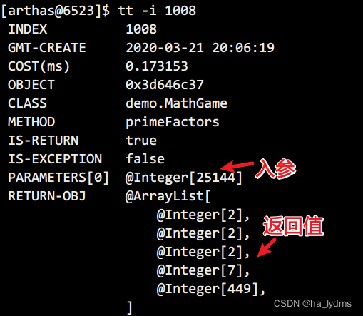
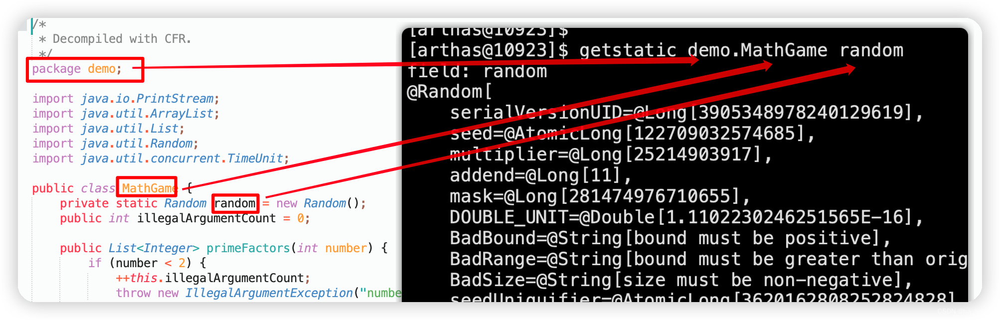
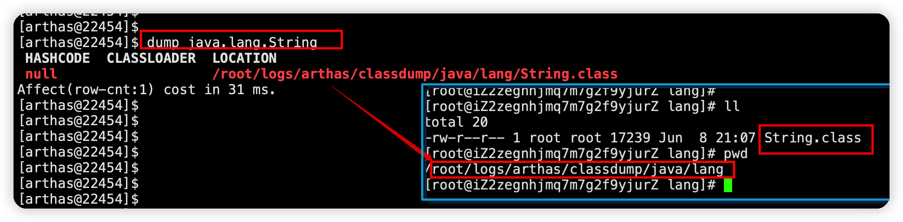

> 本文由 [简悦 SimpRead](http://ksria.com/simpread/) 转码， 原文地址 [blog.csdn.net](https://blog.csdn.net/lydms/article/details/125238249)

#### 文章目录

*   *   [一、简介](#_3)
    *   *   [1、简介](#1_4)
        *   [2、项目所在位置](#2_28)
    *   [二、安装 Arthas](#Arthas_44)
    *   *   [1、安装 Arthas](#1Arthas_46)
        *   [2、卸载 Arthas](#2Arthas_65)
        *   [3、首次启动。](#3_74)
    *   [三、核心监视功能](#_80)
    *   *   [1、`monitor`：监控方法的执行情况](#1monitor_84)
        *   [2、`watch`：检测函数返回值](#2watch_122)
        *   [3、`trace`：根据路径追踪，并记录消耗时间](#3trace_211)
        *   [4、`stack`：输出当前方法被调用的调用路径](#4stack_281)
        *   [5、`tt`：时间隧道，记录多个请求](#5tt_320)
        *   *   [5.1 `tt` 对重载的支持](#51_tt_409)
            *   [5.2 `tt` 发起重新请求](#52_tt_437)
    *   [四、项目中使用](#_453)
    *   *   [9.1 `trace`：查询最耗时应用](#91_trace_457)
        *   [9.2 `jad`：反编译耗时代码](#92_jad_473)
        *   [9.3 `trace`：查询最耗时应用](#93_trace_483)
        *   [9.4 `watch`：捕获耗时应用入参、返回值](#94_watch_491)
    *   [五、基础命令](#_510)
    *   *   [1、`help`：显示 `Arthas` 命令介绍](#1helpArthas_529)
        *   [2、`cat`：显示文件下，文本内容](#2cat_535)
        *   [3、`grep`： 管道命令](#3grep__543)
        *   [4、`pwd`：打印当前的工作目录](#4pwd_565)
        *   [5、`session`：查看当前会话的信息](#5session_571)
        *   [6、`reset`：重置增强后类](#6reset_577)
        *   [7、`version`：查看当前 `Arthas` 版本](#7versionArthas_589)
        *   [8、`history`：查看历史命令](#8history_595)
        *   [9、`quit`：退出 `Arthas` 客户端](#9quitArthas_599)
        *   [10、`stop`：关闭 Arthas 服务端](#10stop_Arthas__623)
        *   [11、`keymap`：查看 `Arthas` 快捷键](#11keymapArthas_629)
    *   [六、Jvm 相关命令](#Jvm_666)
    *   *   [1、`dashboard`：实时数据面板](#1dashboard_679)
        *   [2、`Thread`：线程相关堆栈信息](#2Thread_703)
        *   [3、`jvm`](#3jvm_750)
        *   [4、`sysprop`：查看 / 修改属性](#4sysprop_769)
        *   [5、`sysenv`：查看 JVM 环境属性](#5sysenvJVM_783)
        *   [6、`vmpotion`：查看 JVM 中选项](#6vmpotionJVM_796)
        *   [7、`getstatic`：获取静态成员变量](#7getstatic_815)
        *   [8、`ognl`：执行 ognl 表达式](#8ognlognl_832)
    *   [七、类和类加载器 (class/classLoader)](#classclassLoader_865)
    *   *   [1、`sc`：查看类信息](#1sc_875)
        *   [2、`sm`：查看已加载方法信息](#2sm_904)
        
        *   [3、编译与反编译 `jad`、`mc`、`redefine`](#3jadmcredefine_934)
        *   *   [3.1 `jad`：反编译已加载类源码](#31_jad_942)
            *   [3.2 `mc`：编译 Java 代码](#32_mcJava_974)
            *   [3.3 `redefine`：加载外部 `.class` 文件](#33_redefineclass_991)
        *   [4、`dump`：保存已加载字节码文件到本地](#4dump_1025)
        *   [5、`classloader`：获取类加载器的信息](#5classloader_1058)
    *   [八、`option` 全局选项](#option_1141)
    *   [九、`profiler` 火焰图](#profiler_1178)
    *   [十、相关文件](#_1256)
    *   *   [1、配套资料](#1_1258)
        *   [2、Xmind 整理资料](#2Xmind_1266)

### 一、简介

#### 1、简介


[GitHub 地址](https://github.com/alibaba/arthas)

```
https://github.com/alibaba/arthas
```

[码云地址](http://arthas.gitee.io/)

```
http://arthas.gitee.io/
```

`Arthas` 是`Alibaba`开源的 Java 诊断工具，深受开发者喜爱。  
当你遇到以下类似问题而束手无策时， [Arthas](https://so.csdn.net/so/search?q=Arthas&spm=1001.2101.3001.7020) 可以帮助你解决：

1.  这个类从哪个 jar 包加载的？为什么会报各种类相关的 `Exception`？
2.  我改的代码为什么没有执行到？难道是我没 `commit`？分支搞错了？
3.  遇到问题无法在线上 debug，难道只能通过加日志再重新发布吗？
4.  线上遇到某个用户的数据处理有问题，但线上同样无法 debug，线下无法重现！
5.  是否有一个全局视角来查看系统的运行状况？
6.  有什么办法可以监控到`JVM`的实时运行状态？
7.  怎么快速定位应用的热点，生成火焰图？

`Arthas` 支持 JDK 6+，支持`Linux/Mac/Winodws`，采用命令行交互模式，同时提供丰富的 Tab 自动补  
全功能，进一步方便进行问题的定位和诊断。

#### 2、项目所在位置

<table><thead><tr><th>所在目录</th><th>命令</th><th>说明</th></tr></thead><tbody><tr><td></td><td>dump</td><td>将已加载类的字节码文件保存到特定的目录中</td></tr><tr><td></td><td>classloader</td><td>获取类加载器的信息</td></tr><tr><td></td><td>monitor</td><td>监控指定类中方法的执行情况</td></tr><tr><td></td><td>watch</td><td>观察到指定方法的调用情况</td></tr><tr><td></td><td>trace</td><td>对方法内部调用路径进行追踪，并输出方法路径上每个节点上耗时</td></tr><tr><td></td><td>stack</td><td>输出当前方法被调用的路径</td></tr><tr><td></td><td>tt</td><td>记录指定方法每次调用的入参和返回信息</td></tr><tr><td></td><td>options</td><td>全局开关</td></tr><tr><td></td><td>profiler</td><td>生成火焰图</td></tr></tbody></table>

### 二、安装 Arthas

#### 1、安装 Arthas

1.  下载`arthas-boot.jar`

```
wget https://arthas.aliyun.com/arthas-boot.jar;
java -jar arthas-boot.jar
```

选择进程


#### 2、卸载 Arthas

因为文件是绿色版本，直接删除安装目录既可

```
rm -rf ./arthas			#	隐藏目录
rm -rf logs/			#	日志目录
```

#### 3、首次启动。

> 首先要启动 jar 包，然后才能启动 Arthas。

### 三、核心监视功能

#### 1、`monitor`：监控方法的执行情况

> 监控指定类中方法的执行情况  
> 用来监视一个时间段中指定方法的执行次数，成功次数，失败次数，耗时等这些信息

**参数说明**

方法拥有一个命名参数 `[c:]`，意思是统计周期（cycle of output），拥有一个整型的参数值

<table><thead><tr><th>参数名称</th><th>参数说明</th></tr></thead><tbody><tr><td><em>class-pattern</em></td><td>类名表达式匹配</td></tr><tr><td><em>method-pattern</em></td><td>方法名表达式匹配</td></tr><tr><td>[E]</td><td>开启正则表达式匹配，默认为通配符匹配</td></tr><tr><td><code>[c:]</code></td><td>统计周期，默认值为 120 秒</td></tr></tbody></table>

监控`demo.MathGame`类，并且每 5S 更新一次状态。

```
monitor demo.MathGame primeFactors -c 5
```


**监控的维度说明**

<table><thead><tr><th>监控项</th><th>说明</th></tr></thead><tbody><tr><td>timestamp</td><td>时间戳</td></tr><tr><td>class</td><td>Java 类</td></tr><tr><td>method</td><td>方法（构造方法、普通方法）</td></tr><tr><td>total</td><td>调用次数</td></tr><tr><td>success</td><td>成功次数</td></tr><tr><td>fail</td><td>失败次数</td></tr><tr><td>rt</td><td>平均耗时</td></tr><tr><td>fail-rate</td><td>失败率</td></tr></tbody></table>

#### 2、`watch`：检测函数返回值

> 方法执行数据观测，让你能方便的观察到指定方法的调用情况。
> 
> 能观察到的范围为：`返回值`、`抛出异常`、`入参`，通过编写 OGNL 表达式进行对应变量的查看。

**参数说明：**

watch 的参数比较多，主要是因为它能在 4 个不同的场景观察对象

<table><thead><tr><th>参数名称</th><th>参数说明</th></tr></thead><tbody><tr><td><em>class-pattern</em></td><td>类名表达式匹配</td></tr><tr><td><em>method-pattern</em></td><td>方法名表达式匹配</td></tr><tr><td><em>express</em></td><td>观察表达式</td></tr><tr><td><em>condition-express</em></td><td>条件表达式</td></tr><tr><td>[b]</td><td>在<strong>方法调用之前</strong>观察<code>before</code></td></tr><tr><td>[e]</td><td>在<strong>方法异常之后</strong>观察 <code>exception</code></td></tr><tr><td>[s]</td><td>在<strong>方法返回之后</strong>观察 <code>success</code></td></tr><tr><td>[f]</td><td>在<strong>方法结束之后</strong> (正常返回和异常返回) 观察 <code>finish</code></td></tr><tr><td>[E]</td><td>开启正则表达式匹配，默认为通配符匹配</td></tr><tr><td>[x:]</td><td>指定输出结果的属性遍历深度，默认为 1</td></tr></tbody></table>

这里重点要说明的是观察表达式，观察表达式的构成主要由 ognl 表达式组成，所以你可以这样写`"{params,returnObj}"`，只要是一个合法的 ognl 表达式，都能被正常支持。

**特别说明**

*   watch 命令定义了 4 个观察事件点，即 `-b` 方法调用前，`-e` 方法异常后，`-s` 方法返回后，`-f` 方法结束后
*   4 个观察事件点 `-b`、`-e`、`-s` 默认关闭，`-f` 默认打开，当指定观察点被打开后，在相应事件点会对观察表达式进行求值并输出
*   这里要注意`方法入参`和`方法出参`的区别，有可能在中间被修改导致前后不一致，除了 `-b` 事件点 `params` 代表方法入参外，其余事件都代表方法出参
*   当使用 `-b` 时，由于观察事件点是在方法调用前，此时返回值或异常均不存在

通过`watch`命令可以查看函数的参数 / 返回值 / 异常信息。

**案例：**

```
#	查看方法执行的返回值
watch demo.MathGame primeFactors returnObj
#	观察demo.MathGame类中primeFactors方法出参和返回值，结果属性遍历深度为2。
#	params：表示所有参数数组(因为不确定是几个参数)。
#	returnObject：表示返回值
watch demo.MathGame primeFactors "{params,returnObj}" -x 2
```


查看执行前参数：

```
# -b 方法执行前的参数
watch demo.MathGame primeFactors "{params,returnObj}" -x 2 -b
```


```
#	查看方法中的属性
watch demo.MathGame primeFactors "{target}" -x 2 -b
```


查看某一属性的值

```
watch demo.MathGame primeFactors "{target.illegalArgumentCount}" -x 2 -b
```


检测方法在执行前`-b`、执行后`-s`的入参`params`、属性`target`和返回值`returnObj`

```
watch demo.MathGame primeFactors "{params,target,returnObj}" -x 2 -b -s -n 2
```


输入参数小于 0 的情况：

```
watch demo.MathGame primeFactors "{params[0],target}" "params[0]<0"
```


#### 3、`trace`：根据路径追踪，并记录消耗时间

> 对方法内部调用路径进行追踪，并输出方法路径上的每个节点上耗时。

简介：

> `trace` 命令能主动搜索 `class-pattern`／`method-pattern` 对应的方法调用路径，渲染和统计整个调用链路上的所有性能开销和追踪调用链路。
> 
> 观察表达式的构成主要由 ognl 表达式组成，所以你可以这样写`"{params,returnObj}"`，只要是一个合法的 ognl 表达式，都能被正常支持。
> 
> 很多时候我们只想看到某个方法的 rt 大于某个时间之后的 trace 结果，现在 Arthas 可以按照方法执行的耗时来进行过滤了，例如`trace *StringUtils isBlank '#cost>100'`表示当执行时间超过 100ms 的时候，才会输出 trace 的结果。
> 
> watch/stack/trace 这个三个命令都支持`#cost`耗时条件过滤。

**参数说明：**

<table><thead><tr><th>参数名称</th><th>参数说明</th></tr></thead><tbody><tr><td><em>class-pattern</em></td><td>类名表达匹配</td></tr><tr><td><em>method-pattern</em></td><td>方法名表达式匹配</td></tr><tr><td><em>condition-express</em></td><td>条件表达式，使用 OGNL 表达式</td></tr><tr><td>[E]</td><td>开启正则表达式匹配，默认是通配符匹配</td></tr><tr><td><code>[n:]</code></td><td>设置命令执行次数</td></tr><tr><td><code>#cost</code></td><td>方法执行耗时，单位是毫秒</td></tr></tbody></table>

<table><thead><tr><th>参数名称</th><th>参数说明</th></tr></thead><tbody><tr><td>class-pattern</td><td>类名表达式匹配</td></tr><tr><td>method-pattern</td><td>方法名表达式匹配</td></tr><tr><td>condition-express</td><td>条件表达式</td></tr><tr><td>#cost</td><td>过滤条件，只追踪满足的耗时方法</td></tr></tbody></table>

**案例：**

```
#	trace函数指定类的指定方法
trace demo.MathGame run
```


```
#	执行1次后退出
trace demo.MathGame run -n 1
```


```
#	默认情况下，trace不会包含jdk里的函数调用，如果希望trace jdk里的函数。
#	需要显式设置--skipJDKMethod false。
trace --skipJDKMethod false demo.MathGame run
```


```
#	据调用耗时过滤，trace大于0.5ms的调用路径
trace demo.MathGame run '#cost > .5'
```


```
#	可以用正则表匹配路径上的多个类和函数，一定程度上达到多层trace的效果。
trace -E com.test.ClassA|org.test.ClassB method1|method2|method3
```

#### 4、`stack`：输出当前方法被调用的调用路径

> 输出当前方法被调用的调用路径
> 
> 很多时候我们都知道一个方法被执行，但这个方法被执行的路径非常多，或者你根本就不知道这个方法是从那里被执行了，此时你需要的是 stack 命令。

**参数说明**

<table><thead><tr><th>参数名称</th><th>参数说明</th></tr></thead><tbody><tr><td><em>class-pattern</em></td><td>类名表达式匹配</td></tr><tr><td><em>method-pattern</em></td><td>方法名表达式匹配</td></tr><tr><td><em>condition-express</em></td><td>条件表达式，OGNL</td></tr><tr><td>[E]</td><td>开启正则表达式匹配，默认为通配符匹配</td></tr><tr><td><code>[n:]</code></td><td>执行次数限制</td></tr></tbody></table>

**案例：**

```
#	获取primeFactors的调用路径
stack demo.MathGame primeFactors
```


```
#	条件表达式来过滤，第0个参数的值小于0，-n表示获取2次
stack demo.MathGame primeFactors 'params[0]<0' -n 2
```


```
#	据执行时间来过滤，耗时大于0.5毫秒
stack demo.MathGame primeFactors '#cost>0.5'
```


#### 5、`tt`：时间隧道，记录多个请求

> time-tunnel 时间隧道。
> 
> 记录下指定方法每次调用的入参和返回信息，并能对这些不同时间下调用的信息进行观测

**简介：**

> `watch` 虽然很方便和灵活，但需要提前想清楚观察表达式的拼写，这对排查问题而言要求太高，因为很多时候我们并不清楚问题出自于何方，只能靠蛛丝马迹进行猜测。
> 
> 这个时候如果能记录下当时方法调用的所有入参和返回值、抛出的异常会对整个问题的思考与判断非常有帮助。
> 
> 于是乎，TimeTunnel 命令就诞生了。
> 
> 作用：记录指定方法每次调用的入参和返回值，并后期还可以对这些信息进行观测

**参数解析：**

<table><thead><tr><th>tt 的参数</th><th>说明</th></tr></thead><tbody><tr><td>-t</td><td>记录某个方法在一个时间段中的调用</td></tr><tr><td>-l</td><td>显示所有已经记录的列表</td></tr><tr><td>-n 次数</td><td>只记录多少次</td></tr><tr><td>-s 表达式</td><td>搜索表达式</td></tr><tr><td>-i 索引号</td><td>查看指定索引号的详细调用信息</td></tr><tr><td>-p</td><td>重新调用：指定的索引号时间碎片</td></tr></tbody></table>

*   `-t`
    
    tt 命令有很多个主参数，`-t` 就是其中之一。这个参数表明希望记录下类 `*Test` 的 `print` 方法的每次执行情况。
    
*   `-n 3`
    
    当你执行一个调用量不高的方法时可能你还能有足够的时间用 `CTRL+C` 中断 tt 命令记录的过程，但如果遇到调用量非常大的方法，瞬间就能将你的 JVM 内存撑爆。
    
    此时你可以通过 `-n` 参数指定你需要记录的次数，当达到记录次数时 Arthas 会主动中断 tt 命令的记录过程，避免人工操作无法停止的情况。
    

**案例：**

```
#	最基本的使用来说，就是记录下当前方法的每次调用环境现场。
tt -t demo.MathGame primeFactors
```


字段说明：

<table><thead><tr><th>表格字段</th><th>字段解释</th></tr></thead><tbody><tr><td>INDEX</td><td>时间片段记录编号，每一个编号代表着一次调用，后续 tt 还有很多命令都是基于此编号指定记录操作，非常重要。</td></tr><tr><td>TIMESTAMP</td><td>方法执行的本机时间，记录了这个时间片段所发生的本机时间</td></tr><tr><td>COST(ms)</td><td>方法执行的耗时</td></tr><tr><td>IS-RET</td><td>方法是否以正常返回的形式结束</td></tr><tr><td>IS-EXP</td><td>方法是否以抛异常的形式结束</td></tr><tr><td>OBJECT</td><td>执行对象的<code>hashCode()</code>，注意，曾经有人误认为是对象在 JVM 中的内存地址，但很遗憾他不是。但他能帮助你简单的标记当前执行方法的类实体</td></tr><tr><td>CLASS</td><td>执行的类名</td></tr><tr><td>METHOD</td><td>执行的方法名</td></tr></tbody></table>

```
#	对现有记录进行检索
tt -l
```


```
#	需要筛选出 `primeFactors` 方法的调用信息
tt -s 'method.'
```


```
#	查看某条记录详细信息
tt -i 1002
```



##### 5.1 `tt`对重载的支持

不知道大家是否有在使用过程中遇到以下困惑

*   Arthas 似乎很难区分出重载的方法
*   我只需要观察特定参数，但是 tt 却全部都给我记录了下来

条件表达式也是用 `OGNL` 来编写，核心的判断对象依然是 `Advice` 对象。除了 `tt` 命令之外，`watch`、`trace`、`stack` 命令也都支持条件表达式。

*   解决方法重载

```
#	指定入参的长度=1
tt -t *Test print params.length==1`
```

```
#	指定入参的类型
tt -t *Test print 'params[1] instanceof Integer
```

```
#	指定固定的入参值
tt -t *Test print params[0].mobile=="13989838402
```

##### 5.2 `tt`发起重新请求

`tt` 命令由于保存了当时调用的所有现场信息，所以我们可以自己主动对一个 `INDEX` 编号的时间片自主发起一次调用，从而解放你的沟通成本。此时你需要 `-p` 参数。通过 `--replay-times` 指定 调用次数，通过 `--replay-interval` 指定多次调用间隔 (单位 ms, 默认 1000ms)。

```
tt -i 1002 -p
#	再重新调用3次
tt -i 1002 -p --replay-interval 3
#	再重新调用3次,并且间隔2S
tt -i 1008 -p --replay-times 3 --replay-interval 2000
```


### 四、项目中使用


#### 9.1 `trace`：查询最耗时应用

```
#	在浏览器上进行登录操作，检查最耗时的方法
trace *.DispatcherServlet *
```


```
#	可以分步trace，请求最终是被DispatcherServlet#doDispatch()处理了
trace *.FrameworkServlet doService
```


#### 9.2 `jad`：反编译耗时代码

```
#	trace结果里把调用的行号打印出来了，我们可以直接在IDE里查看代码（也可以用jad命令反编译）
jad --source-only *.DispatcherServlet doDispatch
```


#### 9.3 `trace`：查询最耗时应用

```
watch *.DispatcherServlet getHandler 'returnObj'
查看返回的结果，得到使用到了2个控制器的方法
```


#### 9.4 `watch`：捕获耗时应用入参、返回值

```
watch com.itleima.controller.* * {params,returnObj} -x 2
```


**结论**

通过 trace, jad, watch 最后得到这个操作由 2 个控制器来处理，分别是：

```
com.itheima.controller.UserController.login()
com.itheima.controller.StudentController.findAll()
```

### 五、基础命令

<table><thead><tr><th></th><th>基础命令</th><th>功能</th></tr></thead><tbody><tr><td>1</td><td>help</td><td>显示所有 arthas 命令，每个命令都可以使用 - h 的参数，显示它的参数信息</td></tr><tr><td>2</td><td>cat</td><td>显示文本文件内容</td></tr><tr><td>3</td><td>grep</td><td>对内容进行过滤，只显示关心的行</td></tr><tr><td>4</td><td>pwd</td><td>显示当前的工作路径</td></tr><tr><td>5</td><td>session</td><td>显示当前连接的会话 ID</td></tr><tr><td>6</td><td>reset</td><td>重置 arthas 增强的类</td></tr><tr><td>7</td><td>version</td><td>显示当前 arthas 的版本号</td></tr><tr><td>8</td><td>history</td><td>查看历史命令</td></tr><tr><td></td><td>cls</td><td>清除屏幕</td></tr><tr><td>9</td><td>quit</td><td>退出当前的会话</td></tr><tr><td>10</td><td>stop</td><td>结束 arthas 服务器，退出所有的会话</td></tr><tr><td>11</td><td>keymap</td><td>显示所有的快捷键</td></tr></tbody></table>

#### 1、`help`：显示`Arthas`命令介绍

> 显示`Arthas`命令介绍


#### 2、`cat`：显示文件下，文本内容

> 显示文件下，文本内容。
> 
> 如果没有写路径，则显示当前目录下的文件


#### 3、`grep`： 管道命令

> 管道命令，过滤与 Java 相关

参数

<table><thead><tr><th>参数列表</th><th>作用</th></tr></thead><tbody><tr><td>-n</td><td>显示行号</td></tr><tr><td>-i</td><td>忽略大小写查找</td></tr><tr><td>-m 行数</td><td>最大显示行数，要与查询字符串一起使用</td></tr><tr><td>-e “正则表达式”</td><td>使用正则表达式查找</td></tr></tbody></table>

案例：

```
sysprop |grep "java"	#	只显示包含java字符串的行系统属性
sysprop |grep "java" -n 	# 显示行号
sysprop |grep "java" -n -m10	#	显示行号，只显示10行
thread | grep -e "o+"	#	使用正则表达式，显示包含2个o字符的线程信息
```

#### 4、`pwd`：打印当前的工作目录

> 打印当前的工作目录
> 
> pwd: Print Work Directory 打印当前工作目录

#### 5、`session`：查看当前会话的信息

> 查看当前会话的信息。


#### 6、`reset`：重置增强后类

> 重置增强类，将被 Arthas 增强过的类全部还原，Arthas 服务端关闭时会重置所有增强过的类。

```
reset Test	#	还原指定类
reset *List	#	还原所有以List结尾的类
reset		#	还原所有的类
```


#### 7、`version`：查看当前`Arthas`版本

> 查看当前`Arthas`版本


#### 8、`history`：查看历史命令

> 查看历史命令

#### 9、`quit`：退出`Arthas`客户端

> 退出当前`Arthas`客户端，其它客户端不受影响。
> 
> 用 `exit` 或者 `quit` 命令可以退出 Arthas。

```
exit
```

退出 Arthas 之后，还可以再次用 `java -jar arthas-boot.jar` 来连接。

```
java -jar arthas-boot.jar
```

`exit/quit`命令只是退出当前 session，arthas server 还在目标进程中运行。

想完全退出 Arthas，可以执行 `stop` 命令。

```
stop
```

#### 10、`stop`：关闭 Arthas 服务端

> 关闭 Arthas 服务端，所有 Arthas 客户端全部退出


#### 11、`keymap`：查看`Arthas`快捷键

> `Arthas`快捷键


**Arthas 命令行快捷键**

<table><thead><tr><th>快捷键说明</th><th>命令说明</th></tr></thead><tbody><tr><td>ctrl + a</td><td>跳到行首</td></tr><tr><td>ctrl + e</td><td>跳到行尾</td></tr><tr><td>ctrl + f</td><td>向前移动一个单词</td></tr><tr><td>ctrl + b</td><td>向后移动一个单词</td></tr><tr><td>键盘左方向键</td><td>光标向前移动一个字符</td></tr><tr><td>键盘右方向键</td><td>光标向后移动一个字符</td></tr><tr><td>键盘下方向键</td><td>下翻显示下一个命令</td></tr><tr><td>键盘上方向键</td><td>上翻显示上一个命令</td></tr><tr><td>ctrl + h</td><td>向后删除一个字符</td></tr><tr><td>ctrl + shift + /</td><td>向后删除一个字符</td></tr><tr><td>ctrl + u</td><td>撤销上一个命令，相当于清空当前行</td></tr><tr><td>ctrl + d</td><td>删除当前光标所在字符</td></tr><tr><td>ctrl + k</td><td>删除当前光标到行尾的所有字符</td></tr><tr><td>ctrl + i</td><td>自动补全，相当于敲<code>TAB</code></td></tr><tr><td>ctrl + j</td><td>结束当前行，相当于敲回车</td></tr><tr><td>ctrl + m</td><td>结束当前行，相当于敲回车</td></tr></tbody></table>

*   任何时候 `tab` 键，会根据当前的输入给出提示
*   命令后敲 `-` 或 `--` ，然后按 `tab` 键，可以展示出此命令具体的选项

**后台异步命令相关快捷键**

*   ctrl + c: 终止当前命令
*   ctrl + z: 挂起当前命令，后续可以 bg/fg 重新支持此命令，或 kill 掉
*   ctrl + a: 回到行首
*   ctrl + e: 回到行尾

### 六、Jvm 相关命令

<table><thead><tr><th>jvm 相关命令</th><th>说明</th></tr></thead><tbody><tr><td>dashboard</td><td>仪表板，可以显示：线程，内存，堆栈，GC，Runtime 等信息</td></tr><tr><td>thread</td><td>显示线程信息</td></tr><tr><td>jvm</td><td>与 JVM 相关的信息</td></tr><tr><td>sysprop</td><td>显示系统属性信息，也可以修改某个属性</td></tr><tr><td>sysenv</td><td>查看 JVM 环境变量的值</td></tr><tr><td>vmoption</td><td>查看 JVM 中选项，可以修改</td></tr><tr><td>getstatic</td><td>获取静态成员变量</td></tr><tr><td>ognl</td><td>执行一条 ognl 表达式，对象图导航语言</td></tr></tbody></table>

#### 1、`dashboard`：实时数据面板

> 查看当前系统的实时数据面板。

```
dashboard
```

输入 `q` 或者 `Ctrl+C` 可以退出 dashboard 命令


数据说明：

*   `ID`：Java 级别的线程 ID，注意这个 ID 不能跟 jstack 中的 nativeID 一一对应
*   `NAME`：线程名
*   `GROUP`：线程组名
*   `PRIORITY`：线程优先级, 1~10 之间的数字，越大表示优先级越高
*   `STATE`：线程的状态
*   `CPU%`：线程消耗的 cpu 占比，采样 100ms，将所有线程在这 100ms 内的 cpu 使用量求和，再算出每个线程的 cpu 使用占比。
*   `TIME`：线程运行总时间，数据格式为`分：秒`
*   `INTERRUPTED`：线程当前的中断位状态
*   `DAEMON`：是否是 daemon 线程

#### 2、`Thread`：线程相关堆栈信息

> 线程相关堆栈信息。

参数说明

<table><thead><tr><th>参数名称</th><th>参数说明</th></tr></thead><tbody><tr><td>数字</td><td>线程 id</td></tr><tr><td>[n:]</td><td>指定最忙的前 N 个线程并打印堆栈</td></tr><tr><td>[b]</td><td>找出当前阻塞其他线程的线程</td></tr><tr><td>[i &lt;value&gt;]</td><td>指定 cpu 占比统计的采样间隔，单位为毫秒</td></tr></tbody></table>

Arthas 支持管道，可以用 `thread 1 | grep 'main('` 查找到`main class`。

```
thread 1 | grep 'main('
```

```
thread				#	显示所有线程的信息
thread 1			#	显示1号线程的运行堆栈
thread -b			#	查看阻塞的线程信息
thread -n 3			#	查看最忙的3个线程，并打印堆栈
thread -i 1000 -n 3	#	指定采样时间间隔，每过1000毫秒采样，显示最占时间的3个线程
```

```
查看处于等待状态的线程（WAITING、BLOCKED）
thread --state WAITING
```


**死锁线程查看**

```
thread		# 查看线程状态
thread -b	#	查看阻塞的线程信息
```


#### 3、`jvm`


**THREAD 相关**

*   `COUNT`：JVM 当前活跃的线程数
*   `DAEMON-COUNT`： JVM 当前活跃的守护线程数
*   `PEAK-COUNT`：从 JVM 启动开始曾经活着的最大线程数
*   `STARTED-COUNT`：从 JVM 启动开始总共启动过的线程次数
*   `DEADLOCK-COUNT`：JVM 当前死锁的线程数

**文件描述符相关**

*   `MAX-FILE-DESCRIPTOR-COUNT`：JVM 进程最大可以打开的文件描述符数
*   `OPEN-FILE-DESCRIPTOR-COUNT`：JVM 当前打开的文件描述符数

#### 4、`sysprop`：查看 / 修改属性

```
sysprop						#	查看所有属性
sysprop java.version		#	查看单个属性，支持通过tab补全
```

修改某个属性

```
sysprop user.country
user.country=US
```

#### 5、`sysenv`：查看 JVM 环境属性

> 查看当前 JVM 的环境属性 (`System Environment Variables`)

```
# 查看所有环境变量
sysenv
# 查看单个环境变量
sysenv USER
```

#### 6、`vmpotion`：查看 JVM 中选项

> 查看 JVM 中选项，可以修改

```
#	查看所有的选项
vmoption
#	查看指定的选项
vmoption PrintGCDetails
#	更新指定的选项
vmoption PrintGCDetails true
```


更新某一个值


#### 7、`getstatic`：获取静态成员变量

> 获取静态成员变量

实例：

```
#	语法
getstatic 类名 属性名
#	显示demo.MathGame类中静态属性random
getstatic demo.MathGame random
```



#### 8、`ognl`：执行 ognl 表达式

> 执行 ognl 表达式，这是从 3.0.5 版本新增的功能。

参数说明

<table><thead><tr><th>参数名称</th><th>参数说明</th></tr></thead><tbody><tr><td><em>express</em></td><td>执行的表达式</td></tr><tr><td><code>[c:]</code></td><td>执行表达式的 ClassLoader 的 hashcode，默认值是 SystemClassLoader</td></tr><tr><td>[x]</td><td>结果对象的展开层次，默认值 1</td></tr></tbody></table>

举例：  
调用静态函数

```
#	获取系统变量中值，并且打印(只会打印有返回值函数)
ognl '@java.lang.System@out.println("hello")'
```

获取静态类的静态字段

```
#	获取代码中的运行返回值
ognl '@demo.MathGame@random'
```

执行多行表达式，赋值给临时变量，返回一个 List

```
#	计算value1、value2值，并存在List集合中
ognl '#value1=@System@getProperty("java.home"), #value2=@System@getProperty("java.runtime.name"), {#value1, #value2}'
```


### 七、类和类加载器 (class/classLoader)

<table><thead><tr><th>类，类加载相关的命令</th><th>说明</th></tr></thead><tbody><tr><td>sc</td><td>Search Class 查看运行中的类信息</td></tr><tr><td>sm</td><td>Search Method 查看类中方法的信息</td></tr><tr><td>jad</td><td>反编译字节码为源代码</td></tr><tr><td>mc</td><td>Memory Compile 将源代码编译成字节码</td></tr><tr><td>redefine</td><td>将编译好的字节码文件加载到 jvm 中运行</td></tr></tbody></table>

#### 1、`sc`：查看类信息

> 查看类的信息 (sc: Search Class)
> 
> 查看 JVM 已加载的类信息，“Search-Class” 的简写，这个命令能搜索出所有已经加载到 JVM 中的 Class 信息
> 
> sc 默认开启了子类匹配功能，也就是说所有当前类的子类也会被搜索出来，想要精确的匹配，请打开`options disable-sub-class true`开关。

参数说明：

<table><thead><tr><th>参数名称</th><th>参数说明</th></tr></thead><tbody><tr><td><em>class-pattern</em></td><td>类名表达式匹配，支持全限定名，如 com.taobao.test.AAA，也支持 com/taobao/test/AAA 这样的格式，这样，我们从异常堆栈里面把类名拷贝过来的时候，不需要在手动把<code>/</code>替换为<code>.</code>啦。</td></tr><tr><td><em>method-pattern</em></td><td>方法名表达式匹配</td></tr><tr><td>[d]</td><td>输出当前类的详细信息，包括这个类所加载的原始文件来源、类的声明、加载的 ClassLoader 等详细信息。 如果一个类被多个 ClassLoader 所加载，则会出现多次</td></tr><tr><td>[E]</td><td>开启正则表达式匹配，默认为通配符匹配</td></tr><tr><td>[f]</td><td>输出当前类的成员变量信息（需要配合参数 - d 一起使用）</td></tr></tbody></table>

```
#	模糊搜索，demo包下所有的类
sc demo.*
#	打印类的详细信息
sc -d demo.MathGame
```


#### 2、`sm`：查看已加载方法信息

> 查看已加载方法信息 (“Search-Method” )
> 
> 查看已加载类的方法信息 “Search-Method” 的简写，这个命令能搜索出所有已经加载了 Class 信息的方法信息。
> 
> `sm` 命令只能看到由当前类所声明 (declaring) 的方法，父类则无法看到。

参数配置

<table><thead><tr><th>参数名称</th><th>参数说明</th></tr></thead><tbody><tr><td><em>class-pattern</em></td><td>类名表达式匹配</td></tr><tr><td><em>method-pattern</em></td><td>方法名表达式匹配</td></tr><tr><td>[d]</td><td>展示每个方法的详细信息</td></tr><tr><td>[E]</td><td>开启正则表达式匹配，默认为通配符匹配</td></tr></tbody></table>

```
#	显示String类加载的方法
sm java.lang.String
# 	查看方法信息
sm demo.MathGame
# 	查看方法信息(详细信息-d)
sm -d demo.MathGame
```


#### 3、编译与反编译`jad`、`mc`、`redefine`

<table><thead><tr><th>类相关的命令</th><th>说明</th></tr></thead><tbody><tr><td>jad</td><td>反编译字节码文件得到 java 的源代码</td></tr><tr><td>mc</td><td>在内存中将源代码编译成字节码</td></tr><tr><td>redefine</td><td>将字节码文件重新加载到内存中执行</td></tr></tbody></table>

##### 3.1 `jad`：反编译已加载类源码

> 反编译指定已加载类源码
> 
> `jad` 命令将 JVM 中实际运行的 class 的 byte code 反编译成 java 代码，便于你理解业务逻辑；
> 
> 在 Arthas Console 上，反编译出来的源码是带语法高亮的，阅读更方便
> 
> 当然，反编译出来的 java 代码可能会存在语法错误，但不影响你进行阅读理解

<table><thead><tr><th>参数名称</th><th>参数说明</th></tr></thead><tbody><tr><td><em>class-pattern</em></td><td>类名表达式匹配</td></tr><tr><td>[E]</td><td>开启正则表达式匹配，默认为通配符匹配</td></tr></tbody></table>

```
#	反编译MathGame方法
jad demo.MathGame
#	反编绎时只显示源代码(排除ClassLoader信息)。
#	默认情况下，反编译结果里会带有ClassLoader信息，通过--source-only选项，可以只打印源代码。方便和mc/redefine命令结合使用。
jad --source-only demo.MathGame
#	反编译到指定文件中
jad --source-only demo.MathGame > Hello.java
#	只反编译mathGame类型中main方法
jad demo.MathGame main
```


##### 3.2 `mc`：编译 Java 代码

> 内存编译
> 
> Memory Compiler / 内存编译器，编译`.java`文件生成`.class`

案例：

```
#	在内存中编译Hello.java为Hello.class
mc /root/Hello.java
#	可以通过-d命令指定输出目录
mc -d /root/bbb /root/Hello.java
```


##### 3.3 `redefine`：加载外部`.class`文件

> 加载外部的`.class`文件，redefine 到 JVM 里
> 
> 注意， redefine 后的原来的类不能恢复，redefine 有可能失败（比如增加了新的 field）。  
> `reset`命令对`redefine`的类无效。如果想重置，需要`redefine`原始的字节码。  
> `redefine`命令和`jad`/`watch`/`trace`/`monitor`/`tt`等命令会冲突。执行完`redefine`之后，如果再执行上面提到的命令，则会把`redefine`的字节码重置。

**redefine 的限制**

*   不允许新增加 field/method
*   正在跑的函数，没有退出不能生效，比如下面新增加的`System.out.println`，只有`run()`函数里的会生效。

**使用步骤：**

```
#	1. 使用jad反编译demo.MathGame输出到/root/MathGame.java
jad --source-only demo.MathGame > /root/MathGame.java
```

```
#	2.按上面的代码编辑完毕以后，使用mc内存中对新的代码编译
mc /root/MathGame.java -d /root
```

```
#	3.使用redefine命令加载新的字节码
redefine /root/demo/MathGame.class
```


#### 4、`dump`：保存已加载字节码文件到本地

> 将已加载类的字节码文件保存在特定目录:`logs/arthas/classdump`
> 
> 不同的类加载器放在不同的目录下。
> 
> dump 作用：将正在 JVM 中运行的程序的字节码文件提取出来，保存在 logs 相应的目录下

**参数：**

<table><thead><tr><th>数名称</th><th>参数说明</th></tr></thead><tbody><tr><td><em>class-pattern</em></td><td>类名表达式匹配</td></tr><tr><td><code>[c:]</code></td><td>类所属 ClassLoader 的 hashcode</td></tr><tr><td>[E]</td><td>开启正则表达式匹配，默认为通配符匹配</td></tr></tbody></table>

```
#	把String类的字节码文件保存到~/logs/arthas/classdump/目录下
dump java.lang.String
#	把demo包下所有的类的字节码文件保存到~/logs/arthas/classdump/目录下
dump demo.*
```



#### 5、`classloader`：获取类加载器的信息

> 获取类加载器的信息

**作用：**

1.  `classloader` 命令将 JVM 中所有的 classloader 的信息统计出来，并可以展示继承树，urls 等。
    
2.  可以让指定的 classloader 去 getResources，打印出所有查找到的 resources 的 url。对于`ResourceNotFoundException`异常比较有用。
    

**参数说明**

<table><thead><tr><th>参数名称</th><th>参数说明</th></tr></thead><tbody><tr><td>[l]</td><td>按类加载实例进行统计</td></tr><tr><td>[t]</td><td>打印所有 ClassLoader 的继承树</td></tr><tr><td>[a]</td><td>列出所有 ClassLoader 加载的类，请谨慎使用</td></tr><tr><td><code>[c:]</code></td><td>ClassLoader 的 hashcode</td></tr><tr><td><code>[c: r:]</code></td><td>用 ClassLoader 去查找 resource</td></tr><tr><td><code>[c: load:]</code></td><td>用 ClassLoader 去加载指定的类</td></tr></tbody></table>

**案例：**

```
#	默认按类加载器的类型查看统计信息
classloader
```


```
#	按类加载器的实例查看统计信息，可以看到类加载的hashCode
classloader -l
```


```
#	查看ClassLoader的继承树
classloader -t
```


```
#	通过类加载器的hash，查看此类加载器实际所在的位置
classloader -c 680f2737
```


```
#	使用ClassLoader去查找指定资源resource所在的位置
classloader -c 680f2737 -r META-INF/MANIFEST.MF
```


```
#	使用ClassLoader去查找类的class文件所在的位置
classloader -c 680f2737 -r java/lang/String.class
```


```
#	使用ClassLoader去加载类
classloader -c 70dea4e --load java.lang.String
```


**classloader 命令主要作用有哪些？**

1.  显示所有类加载器的信息
2.  获取某个类加载器所在的 jar 包
3.  获取某个资源在哪个 jar 包中
4.  加载某个类

### 八、`option`全局选项

> ：查看或设置 arthas 全局环境变量

<table><thead><tr><th>名称</th><th>默认值</th><th>描述</th></tr></thead><tbody><tr><td>unsafe</td><td>false</td><td>是否支持对系统级别的类进行增强，打开该开关可能导致把 JVM 搞挂，请慎重选择！</td></tr><tr><td>dump</td><td>false</td><td>是否支持被增强了的类 dump 到外部文件中，如果打开开关，class 文件会被 dump 到<code>/${application dir}/arthas-class-dump/</code>目录下，具体位置详见控制台输出</td></tr><tr><td>batch-re-transform</td><td>true</td><td>是否支持批量对匹配到的类执行 retransform 操作</td></tr><tr><td>json-format</td><td>false</td><td>是否支持 json 化的输出</td></tr><tr><td>disable-sub-class</td><td>false</td><td>是否禁用子类匹配，默认在匹配目标类的时候会默认匹配到其子类，如果想精确匹配，可以关闭此开关</td></tr><tr><td>debug-for-asm</td><td>false</td><td>打印 ASM 相关的调试信息</td></tr><tr><td>save-result</td><td>false</td><td>是否打开执行结果存日志功能，打开之后所有命令的运行结果都将保存到<code>~/logs/arthas-cache/result.log</code>中</td></tr><tr><td>job-timeout</td><td>1d</td><td>异步后台任务的默认超时时间，超过这个时间，任务自动停止；比如设置 1d, 2h, 3m, 25s，分别代表天、小时、分、秒</td></tr><tr><td>print-parent-fields</td><td>true</td><td>是否打印在 parent class 里的 filed</td></tr></tbody></table>

查看所有`options`值

```
options
```


查询 / 更新单个 option 值

```
#	查看默认值
options save-result
#	更新默认值
options save-result true
#	查看更新后值
options save-result
```


### 九、`profiler`火焰图

> `profiler` 命令支持生成应用热点的火焰图。本质上是通过不断的采样，然后把收集到的采样结果生成火焰图。

**常用命令**

<table><thead><tr><th>profiler</th><th>命令作用</th></tr></thead><tbody><tr><td>profiler start</td><td>启动 profiler，默认情况下，生成 cpu 的火焰图</td></tr><tr><td>profiler list</td><td>显示所有支持的事件</td></tr><tr><td>profiler getSamples</td><td>获取已采集的 sample 的数量</td></tr><tr><td>profiler status</td><td>查看 profiler 的状态，运行的时间</td></tr><tr><td>profiler stop</td><td>停止 profiler，生成火焰图的结果，指定输出目录和输出格式：svg 或 html</td></tr></tbody></table>

**启动`profiler`**

```
profiler start
```

> 默认情况下，生成的是 cpu 的火焰图，即 event 为`cpu`。可以用`--event`参数来指定。

**显示支持的事件**

```
profiler list
```

**获取已采集的`sample`的数量**

```
profiler getSamples
```

**查看`profiler`状态** (可以查看当前`profiler`在采样哪种`event`和采样时间。)

```
profiler status
```

**停止`profiler`，并同步生成文件**（默认在`工作目录`下的`arthas-output`目录。）

```
$ profiler stop
profiler output file: /tmp/demo/arthas-output/20191125-135546.svg
```

**通过 `--file`参数来指定输出结果路径**

```
# 指定生成的文件名以及路径
profiler stop --file /tmp/result.svg
```

**可以用`--format`指定生成格式**

```
profiler stop --format html
```

生成的图


**火焰图的含义**

火焰图是基于 perf 结果产生的 SVG 图片，用来展示 CPU 的调用栈。

> y 轴表示调用栈，每一层都是一个函数。调用栈越深，火焰就越高，顶部就是正在执行的函数，下方都是它的父函数。
> 
> x 轴表示抽样数，如果一个函数在 x 轴占据的宽度越宽，就表示它被抽到的次数多，即执行的时间长。注意，x 轴不代表时间，而是所有的调用栈合并后，按字母顺序排列的。
> 
> **火焰图就是看顶层的哪个函数占据的宽度最大。只要有 "平顶"（plateaus），就表示该函数可能存在性能问题。**
> 
> 颜色没有特殊含义，因为火焰图表示的是 CPU 的繁忙程度，所以一般选择暖色调。

### 十、相关文件

#### 1、配套资料

[CSDN](https://download.csdn.net/download/weixin_44624117/85612648)

```
https://download.csdn.net/download/weixin_44624117/85612648
```

#### 2、Xmind 整理资料

[Xmind](https://download.csdn.net/download/weixin_44624117/85612661)

```
https://download.csdn.net/download/weixin_44624117/85612661
```