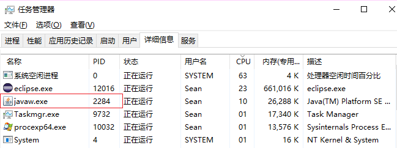

> 本文由 [简悦 SimpRead](http://ksria.com/simpread/) 转码， 原文地址 [blog.csdn.net](https://blog.csdn.net/wzngzaixiaomantou/article/details/124766869)

[TOC]


一、线程快照的获取
---------

        目前我司拉取线程快照一般都通过云平台提供的功能了，简单好用，不过原生的方法还是要掌握的，下面我简单展示下。需要注意的时，线程快照展示的是某一时刻的线程状况，我们一般需要连续获取三到五次线程快照才能得到完整的运行状况。

###         1、linux 环境

        这里以使用 jstack分析 CPU 占用率过高的问题为例，我们进入服务器，**使用 `top` 指令按 CPU 或内存使用率排序，找到使用率最高的进程（即第一列的 PID）**。（`ps –ef | grep java` 也可以用来查找进程 id，不过这个场景下 top 要合适些同样效果命令还有 jps，不过个人没怎么用过）。

         

         **然后使用 `top -Hp PID` 查看具体的线程。**         

 **使用 printf "%x\n" PID（这里的 PID 是上图中的线程号）得到 16 进制的线程号**。


       然后我们使用 jsatck PID 将该进程下的线程快照导出即可，也可以直接在服务器环境下使用 **jstack PID | grep 9a7a 查找刚才转换出的 16 进制的线程号（更多的时候我们会将线程日志打出来 jstack pid > pid.txt 拉取到本地分析）来查看**造成 CPU 消耗的代码，大部分情况下为死循环造成。

        **需要注意的是，服务器上安装的只有 jre，是没有 stack 的，需要放 JDK 才行（只要放上去解压即可）。同时，尽量不要在生产环境下安装 JDK。**

###         2、windos 环境

        如果是 windos 环境的话（虽然少，不过也确实遇到过部署在 windows 上的老项目），这里引用下[《JAVA 线程状态梳理以及 Jstack 命令使用》](https://segmentfault.com/a/1190000008506752 "《JAVA线程状态梳理以及Jstack命令使用》")中的截图。

        首先查看任务管理器，找到 PID。



        使用 Process Explorer 工具，找到 2284 进程并查看属性。找到 CPU 占用最高线程 TID，8840。


        将 8840 换算为 16 进制，即为 2288，记下这个 16 进制数字，然后在 cmd 下执行 jstack -l PID 命令，即 jstack -l 2284。可以看到 nid=0x2288 线程堆栈信息。


二、状态信息
------

        线程快照基本信息如下图所示，我们将其关键信息拆分出来，分别在本章的第 1，3，4 小节介绍。


###         1、JVM 线程状态

        jstack 中输出的 jvm 线程的状态共有 6 种，出现在线程信息的第二行，**在 JVM 中线程状态使用枚举 java.lang.Thread.State 来表示**，State 的定义如下：

```
    public enum State {
        NEW,
        RUNNABLE,
        BLOCKED,
        WAITING,
        TIMED_WAITING,
        TERMINATED;
    }
```

        这几种状态的转换关系如下图


         有了上面的转换关系图，我们再来逐个介绍每种状态

*   **NEW, 未启动的。不会出现在 Dump 中。**
*   **RUNNABLE, 在虚拟机内执行的。运行中状态，可能里面还能看到 locked 字样，表明它获得了某把锁（注意，state 中没有 running 状态）。**
*   **BLOCKED, 受阻塞并等待监视器锁。被某个锁 (synchronizers) 給 block 住了。**
*   **WATING, 无限期等待另一个线程执行特定操作。等待某个 condition 或 monitor 发生，一般停留在 park(), wait(),join() 等语句里（注意没有 sleep()）。**
*   **TIMED_WATING, 有时限的等待另一个线程的特定操作。和 WAITING 的区别是 wait() 等（如 sleep()）语句加上了时间限制 wait(timeout)。**
*   **TERMINATED, 已退出的，结束的进程。**

        注意，这里只是状态的基本信息，实际上线程快照打印出来状态的信息是很丰富的，这一点我们会在本章结束的时候介绍。

###         2、Monitor

        在多线程的 JAVA 程序中，实现线程之间的同步，就要说说 Monitor。 Monitor 是 Java 中用以实现线程之间的互斥与协作的主要手段，它可以看成是对象或者 Class 的锁。每一个对象都有，也仅有一个 monitor。下 面这个图，描述了线程和 Monitor 之间关系，以 及线程的状态转换图：


*   **进入区 (Entrt Set): 表示线程通过 synchronized 要求获取对象的锁。如果对象未被锁住, 则迚入拥有者; 否则则在进入区等待。一旦对象锁被其他线程释放, 立即参与竞争。**
*   **拥有者 (The Owner): 表示某一线程成功竞争到对象锁。**
*   **等待区 (Wait Set): 表示线程通过对象的 wait 方法, 释放对象的锁, 并在等待区等待被唤醒。**

        从图中可以看出，**一个 Monitor 在某个时刻，只能被一个线程拥有，该线程就是 “Active Thread”，而其它线程都是 “Waiting Thread”，分别在两个队列 “ Entry Set”和 “Wait Set”里面等候。在 “Entry Set”中等待的线程状态是 “Waiting for monitor entry”，而在 “Wait Set” 中等待的线程状态是 “in Object.wait()”。 先看 “Entry Set”里面的线程。我们称被 synchronized 保护起来的代码段为临界区。当一个线程申请进入临界区时，它就进入了 “Entry Set”队列。**对应的 code 就像：

```
synchronized(obj) {
.........
 
}
```

###         3、调用修饰

        调用修饰表示线程在方法调用时, 额外的重要的操作，一般出现在线程内容中，用来协助分析线程的状态。

*   **locked <对象地址> 对象名：使用 synchronized 申请对象锁成功, 监视器的拥有者。**
*   **waiting to lock <对象地址> 对象名：使用 synchronized 申请对象锁未成功, 在迚入区等待。**
*   **waiting on <对象地址> 对象名：使用 synchronized 申请对象锁成功后, 释放锁幵在等待区等待。**
*   **parking to wait for <对象地址> 对象名（parking 比较特殊）**

####         （1）locked

        表示当前线程通过 synchronized 关键字成功获取到了目标对象的监视器，拥有了在临界区操作的权限，状态一般为 runnable。注意对象锁是可重入的，所以这里有 2 次锁住了同一个对象。

```
"BLOCKED_TEST pool-1-thread-1" prio=6 tid=0x0000000006904800 nid=0x28f4 runnable [0x000000000785f000]
   java.lang.Thread.State: RUNNABLE
                at java.io.FileOutputStream.writeBytes(Native Method)
                at java.io.FileOutputStream.write(FileOutputStream.java:282)
                at java.io.BufferedOutputStream.flushBuffer(BufferedOutputStream.java:65)
                at java.io.BufferedOutputStream.flush(BufferedOutputStream.java:123)
                - locked <0x0000000780a31778> (a java.io.BufferedOutputStream)
                at java.io.PrintStream.write(PrintStream.java:432)
                - locked <0x0000000780a04118> (a java.io.PrintStream)
```

####         （2）**waiting to lock**

 表示当前线程未能通过 synchronized 关键字获取到目标对象的监视器，状态一般为 blocked。

```
"DEADLOCK_TEST-1" daemon prio=6 tid=0x000000000690f800 nid=0x1820 waiting for monitor entry [0x000000000805f000]
   java.lang.Thread.State: BLOCKED (on object monitor)
                at com.nbp.theplatform.threaddump.ThreadDeadLockState$DeadlockThread.goMonitorDeadlock(ThreadDeadLockState.java:197)
                - waiting to lock <0x00000007d58f5e60> (a com.nbp.theplatform.threaddump.ThreadDeadLockState$Monitor)
                at com.nbp.theplatform.threaddump.ThreadDeadLockState$DeadlockThread.monitorOurLock(ThreadDeadLockState.java:182)
                - locked <0x00000007d58f5e48> (a com.nbp.theplatform.threaddump.ThreadDeadLockState$Monitor)
                at com.nbp.theplatform.threaddump.ThreadDeadLockState$DeadlockThread.run(ThreadDeadLockState.java:135)
```

####  **（3）waiting on**

        表示当前线程通过 synchronized 关键字成功获取到了目标对象的监视器，但调用了 wait 方法, 进入对象的等待区等待。在调用栈顶出现, 线程状态为 WAITING 或 TIMED_WATING。

```
"RMI RenewClean-[172.16.5.19:28475]" daemon prio=10 tid=0x0000000041428800 nid=0xb09 in Object.wait() [0x00007f34f4bd0000]
java.lang.Thread.State: TIMED_WAITING (on object monitor)
                at java.lang.Object.wait(Native Method)
                - waiting on <0x00000000aa672478> (a java.lang.ref.ReferenceQueue$Lock)
                at java.lang.ref.ReferenceQueue.remove(ReferenceQueue.java:118)
                - locked <0x00000000aa672478> (a java.lang.ref.ReferenceQueue$Lock)
                at sun.rmi.transport.DGCClient$EndpointEntry$RenewCleanThread.run(DGCClient.java:516)
                at java.lang.Thread.run(Thread.java:662)    
```

####  **（4）**parking to wait for

        park 是基本的线程阻塞原语, 不通过监视器在对象上阻塞。随 concurrent 包会出现的新的机制, 不 synchronized 体系不同，具体介绍可以看 stackoverflow 上的回答[传送门](https://stackoverflow.com/questions/11337384/java-thread-dump-difference-between-waiting-to-lock-and-parking-to-wait-for "传送门")

```
"My thread" prio=10 tid=0x00007fffec082800 nid=0x17e8 waiting on condition [0x00007ffff14eb000]
   java.lang.Thread.State: WAITING (parking)
    at sun.misc.Unsafe.park(Native Method)
    - parking to wait for  <0x00000007d6a33d30> (a java.util.concurrent.locks.ReentrantLock$FairSync)
    at java.util.concurrent.locks.LockSupport.park(LockSupport.java:156)
    at java.util.concurrent.locks.AbstractQueuedSynchronizer.parkAndCheckInterrupt(AbstractQueuedSynchronizer.java:811)
    at java.util.concurrent.locks.AbstractQueuedSynchronizer.acquireQueued(AbstractQueuedSynchronizer.java:842)
    at java.util.concurrent.locks.AbstractQueuedSynchronizer.acquire(AbstractQueuedSynchronizer.java:1178)
    at java.util.concurrent.locks.ReentrantLock$FairSync.lock(ReentrantLock.java:201)
    at java.util.concurrent.locks.ReentrantLock.lock(ReentrantLock.java:262)
    at LockTest.reentrantLock(LockTest.java:22)
    at LockTest$2.run(LockTest.java:25)
    at java.lang.Thread.run(Thread.java:662)
```

###         4、系统线程状态

        系统线程状态出现在线程信息第一行的末尾。

*   **deadlock：死锁线程**
*   **runnable：表示线程运行中或 I/O 等待，线程状态一般为 RUNNABLE。**
*   **in Object.wait()：进入临界区之后，又调用了 java.lang.Object.wait() 方法等待, jvm 线程状态一般为 WAITING 或 TIMED_WAITING。**
*   **waiting for monitor entry：在等待进入一个临界区, 线程状态一般状态为 BLOCKED。**
*   **waiting on condition：**
    
    **线程正处于等待资源或等待某个条件的发生，具体的原因需要结合下面堆栈信息进行分析。**
    
    **（1）如果堆栈信息明确是应用代码，则证明该线程正在等待资源，一般是大量读取某种资源且该资源采用了资源锁的情况下，线程进入等待状态，等待资源的读取，或者正在等待其他线程的执行等。**
    
    **（2）如果发现有大量的线程都正处于这种状态，并且堆栈信息中得知正等待网络读写，这是可能因为网络阻塞导致线程无法执行。**
    
    **（3）还有一种常见的情况是该线程在 sleep，等待 sleep 的时间到了，将被唤醒。**
    

        将 JVM 线程状态信息与系统线程状态信息整合后，得出完整的线程状态信息

<table border="1" cellpadding="1" cellspacing="1"><tbody><tr><th>thread dump 线程状态详细信息</th><th>解释</th><th>对应的方法调用</th></tr><tr><td>java.lang.Thread.State: RUNNABLE</td><td>线程运行中或 I/O 等待</td><td>无</td></tr><tr><td>java.lang.Thread.State: BLOCKED (on object monitor)</td><td>等待进入一个临界区</td><td>synchronized</td></tr><tr><td>java.lang.Thread.State: TIMED_WAITING (parking)</td><td>线程等待唤醒，并且设置等待时长</td><td>LockSupport.parkNanos(等待时长)、LockSupport.parkUntil(等待时长)</td></tr><tr><td>java.lang.Thread.State: TIMED_WAITING (sleeping)</td><td>线程等待唤醒，并且设置等待时长</td><td>Thread.sleep(等待时长)，Thread.join(等待时长)</td></tr><tr><td>java.lang.Thread.State: TIMED_WAITING (on object monitor)</td><td>线程在等待唤醒，并且设置等待时长</td><td>Object.wait(等待时长)</td></tr><tr><td>java.lang.Thread.State: WAITING (parking)</td><td>线程等待唤醒，没有设置等待时长</td><td>LockSupport.park()</td></tr><tr><td>java.lang.Thread.State: WAITING (on object monitor)</td><td>线程等待唤醒，并且没有设置等待时长</td><td>Object.wait()</td></tr><tr><td>java.lang.Thread.State: WAITING (on object monitor)</td><td>线程等待唤醒，没有设置等待时长</td><td>Thread.join()</td></tr></tbody></table>

三、[日志分析](https://so.csdn.net/so/search?q=%E6%97%A5%E5%BF%97%E5%88%86%E6%9E%90&spm=1001.2101.3001.7020)
------------------------------------------------------------------------------------------------------

###         1、基本信息介绍

        线程状态信息我们上一章已经介绍过了，这一章我们介绍下其余信息

```
"Log4j2-TF-3-AsyncLoggerConfig--1" #67 daemon prio=5 os_prio=0 tid=0x00007fc511a40000 nid=0x316c waiting on condition [0x00007fc4cbbfa000]
   java.lang.Thread.State: TIMED_WAITING (parking)
	at sun.misc.Unsafe.park(Native Method)
	- parking to wait for  <0x000000008a0a5428> (a java.util.concurrent.locks.AbstractQueuedSynchronizer$ConditionObject)
	at java.util.concurrent.locks.LockSupport.parkNanos(LockSupport.java:215)
	at java.util.concurrent.locks.AbstractQueuedSynchronizer$ConditionObject.awaitNanos(AbstractQueuedSynchronizer.java:2078)
	at com.lmax.disruptor.TimeoutBlockingWaitStrategy.waitFor(TimeoutBlockingWaitStrategy.java:38)
	at com.lmax.disruptor.ProcessingSequenceBarrier.waitFor(ProcessingSequenceBarrier.java:56)
	at com.lmax.disruptor.BatchEventProcessor.run(BatchEventProcessor.java:128)
	at java.lang.Thread.run(Thread.java:745)
```

*   **"Log4j2-TF-3-AsyncLoggerConfig--1"： 线程名**
*   **#67： 表示当前线程 ID，从 main 线程开始，JVM 根据线程创建的顺序为线程编号。**
*   **prio：是 priority 优先级的缩写，表名了当前线程的优先级，取值范围为 [1-10]，默认为 5。在虚拟机进行线程调度的时候会参考该优先级为线程分配计算资源，这个数值越低越有优先获取到计算资源，一般不设置直接使用默认的优先级。**
*   **os_prio：是该线程在操作系统中的优先级。**
*   **nid：是 Native thread ID，本地操作系统相关的线程 id, 对应 JVM 虚拟机中线程映射在操作系统中的线程编号。（这个 nid 就是我们用 top -Hp pid 查看到的线程号，不过要用 printf "%x\n" 转换一下进制）。**

###         2、常见案例

####         （1）锁争用

```
"DB-Processor-13" daemon prio=5 tid=0x003edf98 nid=0xca waiting for monitor entry [0x000000000825f000]
java.lang.Thread.State: BLOCKED (on object monitor)
                at beans.ConnectionPool.getConnection(ConnectionPool.java:102)
                - waiting to lock <0xe0375410> (a beans.ConnectionPool)
                at beans.cus.ServiceCnt.getTodayCount(ServiceCnt.java:111)
                at beans.cus.ServiceCnt.insertCount(ServiceCnt.java:43)
 
"DB-Processor-14" daemon prio=5 tid=0x003edf98 nid=0xca waiting for monitor entry [0x000000000825f020]
java.lang.Thread.State: BLOCKED (on object monitor)
                at beans.ConnectionPool.getConnection(ConnectionPool.java:102)
                - waiting to lock <0xe0375410> (a beans.ConnectionPool)
                at beans.cus.ServiceCnt.getTodayCount(ServiceCnt.java:111)
                at beans.cus.ServiceCnt.insertCount(ServiceCnt.java:43)
 
"DB-Processor-3" daemon prio=5 tid=0x00928248 nid=0x8b waiting for monitor entry [0x000000000825d080]
java.lang.Thread.State: RUNNABLE
                at oracle.jdbc.driver.OracleConnection.isClosed(OracleConnection.java:570)
                - waiting to lock <0xe03ba2e0> (a oracle.jdbc.driver.OracleConnection)
                at beans.ConnectionPool.getConnection(ConnectionPool.java:112)
                - locked <0xe0386580> (a java.util.Vector)
                - locked <0xe0375410> (a beans.ConnectionPool)
                at beans.cus.Cue_1700c.GetNationList(Cue_1700c.java:66)
                at org.apache.jsp.cue_1700c_jsp._jspService(cue_1700c_jsp.java:120)
```

        上图中，我们可以看到线程”DB-Processor-3“获取到了 < 0xe0375410> 对象的锁，进入了临界区，另外 2 个线程”DB-Processor-13“、”DB-Processor-14“无法获取到锁，停留在 Entry Set 种，输出 waiting to lock <0xe0375410>。

        如果线程中出现大量的锁争用，可能是否个线程阻塞了，需要引起重视，轻则引发性能问题，重则是线上事故。

####         （2）死锁

        如果两个线程相互都被对方的线程锁锁住，这样就造成了 死锁。

```
"MyThread-2" daemon prio=5 tid=0x00007f1d3825f800 nid=0x2142 waiting for monitor entry [0x00007f1d16eeb000]
java.lang.Thread.State: BLOCKED (on object monitor)
	at com.jvm.study.threaddump.deadlock.DeadLockMock$2.run(DeadLockMock.java:31)
	- waiting to lock <0x00000000d8251168> (a java.lang.String)
	- locked <0x00000000d8251198> (a java.lang.String)
 
 
"MyThread-1" daemon prio=5 tid=0x00007f1d3825e000 nid=0x2141 waiting for monitor entry [0x00007f1d16fec000]
ava.lang.Thread.State: BLOCKED (on object monitor)
	at com.jvm.study.threaddump.deadlock.DeadLockMock$1.run(DeadLockMock.java:16)
	- waiting to lock <0x00000000d8251198> (a java.lang.String)
	- locked <0x00000000d8251168> (a java.lang.String)
```

        上图中，我们可以看到 MyThread-1 与 MyThread-2 在获取到了一个锁后，又尝试去获取另一个锁，但此时该锁已被对方获取，除非某一方先释放锁，否则这两个锁将无限等待下去。

####         （3）等待区等待

```
"RMI RenewClean-[172.16.5.19:28475]" daemon prio=10 tid=0x0000000041428800 nid=0xb09 in Object.wait() [0x00007f34f4bd0000]
java.lang.Thread.State: TIMED_WAITING (on object monitor)
                at java.lang.Object.wait(Native Method)
                - waiting on <0x00000000aa672478> (a java.lang.ref.ReferenceQueue$Lock)
                at java.lang.ref.ReferenceQueue.remove(ReferenceQueue.java:118)
                - locked <0x00000000aa672478> (a java.lang.ref.ReferenceQueue$Lock)
                at sun.rmi.transport.DGCClient$EndpointEntry$RenewCleanThread.run(DGCClient.java:516)
                at java.lang.Thread.run(Thread.java:662)  
```

        上图中 JVM 线程的状态是 java.lang.Thread.State: TIMED_WAITING (on object monitor)，说明线程调用了 java.lang.Object.wait(long timeout) 方法而进入了等待状态。

        "Wait Set" 中等待的线程状态就是 in Object.wait()，当线程获得了 Monitor 进入临界区之后，如果发现线程继续运行的条件没有满足，它就调用对象（通常是被 synchronized 的对象）的 wait() 方法，放弃了 Monitor，进入 "Wait Set" 队列中。只有当别的线程在该对象上调用了 notify() 或 notifyAll() 方法， "Wait Set" 队列中线程才得到机会去竞争，但是只有一个线程获得对象的 Monitor，恢复到的运行态。

四、JCA 工具
--------

        jca 是 IBM 提供的线程快照的一个图形化分析工具，下载地址及使用方式都有介绍[《传送门》](https://www.ibm.com/support/pages/ibm-thread-and-monitor-dump-analyzer-java-tmda "《传送门》")

        我下载的是 jca4611.jar，使用方式为 java -jar jca4611.jar。


         导入线程快照


 然后我们就可以看到整改线程快照的基本情况，主要分为 2 个部门，Thread Status Analysis 与 Thread Method Analysis，分别从线程状态与线程执行的方法的角度来将线程分类。


         在 Analysis 菜单里，jca 提供了 Thread Status Analysis 与 Method Analysis 的详细信息，以饼状图的形式将他们展示出来。


        Thread Status Analysis 中以不同的颜色区分不同的线程状态，点击左侧线程后，右侧会展示该线程的详细信息。


        Method Analysis 与上面类似。


        最后是 Monitor Detail，会展示哪个线程持有锁，哪些线程在等待该锁的具体信息。


五、常见问题思路
--------

###         1、CPU 占用率很高

        使用开头我们介绍的打出线程快照的方法，利用 top 定位到问题线程，然后排查代码，根据过往经验，一般是代码中循环有问题导致的，比如死循环等。

###         2、CPU 占用率不高，但响应很慢

        导致这个现象的可能原因非常多，典型的如同上文 jca 分析中的 Monitor Detail 部分，一个持有锁的线程执行缓慢导致大量线程无法获取到锁而进入阻塞状态，需要多次打印线程快照后进行比对后定位，个人经验往往是数据库慢 sql 或者 I/O、网络原因导致。