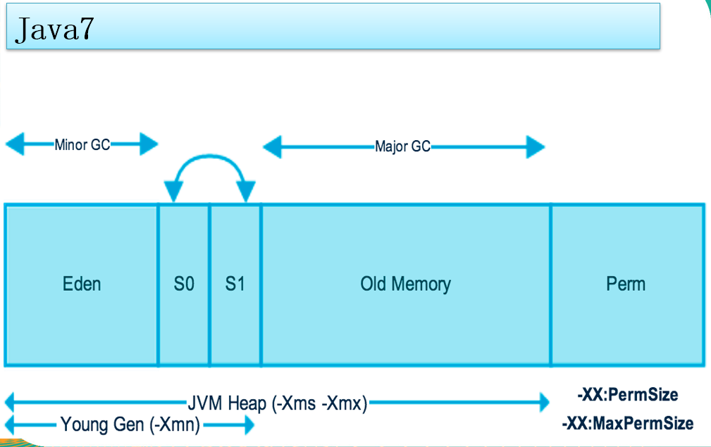
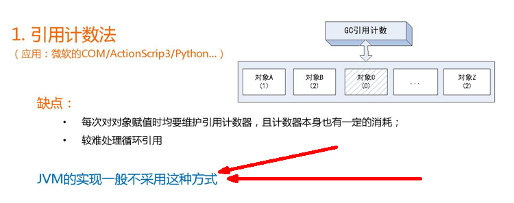
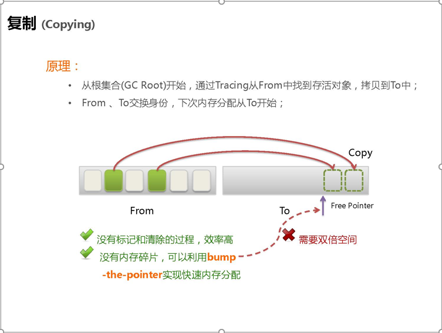
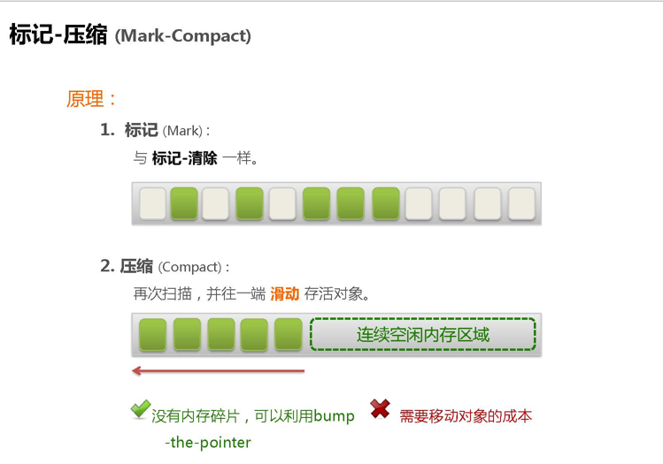

# JVM体系结构概览


灰色线程独占 

亮色线程共享：方法区、堆

# 类装载器ClassLoader

## 概念


 负责加载class文件，class文件在**文件开头有特定的文件标示**【cafe bade...】，将class文件字节码内容加载到内存中，并将这些内容转换成方法区中的运行时数据结构并且ClassLoader只负责class文件的加载，至于它是否可以运行，则由Execution Engine决定 


## 类加载器分类：

Java虚拟机自带的加载器 有 3 + 1

- 加载祖宗的是 **`Bootstrap`（启动类加载器）** 最顶层 （打印为null,因为是cpp写的,是祖宗最高级别）`$JAVAHOME/jre/lib/rt.jar` (rt:runtime)
- 加载java扩展的**`extension`（扩展类加载器）** `$JAVAHOME/jre/lib/ext/*.jar` javax(x:extend)
- 加载我们写的类 **`AppClassLoader`（应用类加载器)**

sum.misc.Launcher 是jvm的入口程序

- 自定义类加载器 继承抽象类ClassLoader


```java
    public static void main(String[] args) {
        Object o = new Object();//被Bootstrap加载器加载rt.jar[runtime]里面有Object.class ArrayList.class等
        System.out.println(o.getClass().getClassLoader());//null   Bootstrap加载器是c++，返回null

        MyObject myObject = new MyObject();
        System.out.println(myObject.getClass().getClassLoader().getParent().getParent());//null
        System.out.println(myObject.getClass().getClassLoader().getParent());//sun.misc.Launcher$ExtClassLoader@2626b418
        System.out.println(myObject.getClass().getClassLoader());//sun.misc.Launcher$AppClassLoader@18b4aac2

    }
```

## 双亲委派

**双亲委派机制**（parent delegation）就是每一个类加载器收到类加载请求时，他会先去找他的父类加载器，而不是自己先处理，即**往上捅**，只有父类反馈说没有的时候，子类才会尝试自己加载，从而能够保护恶意代码污染源代码，即**沙箱安全**。


当一个类收到了类加载请求，他首先不会尝试自己去加载这个类，而是把这个请求委派给父类去完成，每一个层次类加载器都是如此，因此所有的加载请求都应该传送到启动类加载其中，只有当父类加载器反馈自己无法完成这个请求的时候（在它的加载路径下没有找到所需加载的Class），子类加载器才会尝试自己去加载。


采用双亲委派的一个好处是比如加载位于 rt.jar 包中的类 java.lang.Object，不管是哪个加载器加载这个类，最终都是委托给顶层的启动类加载器进行加载，这样就保证了使用不同的类加载器最终得到的都是同样一个 Object对象。 


示例：


解释：1.创建这个对象时，不会首先加载这个类，先去systemclassloader去找，是否有String类

2.Systemclassloader类会优先去ExtensionClassLoader中区找String类

3.ExtensionClassLoader去BootStrapClassLoader中去找是否已经存在String

4.BootStrapClassLoader类加载器返回已经找到，返回找到


> 防止恶意代码去污染源代码


执行引擎(Execution Engine)：视频没有详细说，ppt就一行字：负责解释命令，提交操作系统执行

# Native 

## **Native Interface**本地接口

 本地接口的作用是融合不同的编程语言为 Java 所用，它的初衷是融合 C/C++程序，Java 诞生的时候是 C/C++横行的时候，要想立足，必须有调用 C/C++程序，于是就在内存中专门开辟了一块区域处理标记为native的代码，它的具体做法是 Native Method Stack中登记 native方法，在Execution Engine 执行时加载native libraies。

 目前该方法使用的越来越少了，除非是与硬件有关的应用，比如通过Java程序驱动打印机或者Java系统管理生产设备，在企**业级应用中已经比较少见**。因为现在的异构领域间的通信很发达，比如可以使用 Socket通信，也可以使用Web Service等等，不多做介绍。

## **Native Method Stack**本地方法栈

它的具体做法是Native Method Stack中登记native方法，在Execution Engine 执行时加载本地方法库。

# **PC**寄存器 | 程序计数器

 每个线程都有一个程序计数器，是线程私有的,就是一个指针，指向方法区中的方法字节码（**用来存储指向下一条指令的地址,也即将要执行的指令代码**），由执行引擎读取下一条指令，是一个非常小的内存空间，几乎可以忽略不记。


这块内存区域很小，**它是当前线程所执行的字节码的行号指示器**，字节码解释器通过改变这个计数器的值来选取下一条需要执行的字节码指令。


如果执行的是一个Native方法，那这个计数器是空的。


用以完成分支、循环、跳转、异常处理、线程恢复等基础功能。不会发生内存溢出(OutOfMemory=OOM)错误

# **Method Area** 方法区

供各**线程共享**的运行时内存区域。**它存储了每一个类的结构信息**，例如运行时常量池（Runtime Constant Pool）、字段和方法数据、构造函数和普通方法的字节码内容。上面讲的是规范，在不同虚拟机里头实现是不一样的，最典型的就是永久代(PermGen space)和元空间(Metaspace)。

但是：

**实例变量存在堆内存中,和方法区无关**


# **Stack**栈

栈管运行，堆管存储

队列（FIFO先进先出）

栈：FILO先进后出

 栈也叫栈内存，主管Java程序的运行，是在线程创建时创建，它的**生命期是跟随线程的生命期**，线程结束栈内存也就释放，**对于栈来说不存在垃圾回收问题**，只要线程一结束该栈就Over，生命周期和线程一致，是线程私有的。**8种基本类型的变量+对象的引用变量+实例方法都是在函数的栈内存中分配。**

## 栈存储什么？

栈帧中主要保存3 类数据：

+ 本地变量（Local Variables）:输入参数和输出参数以及方法内的变量；
+ 栈操作（Operand Stack）:记录出栈、入栈的操作；
+ 栈帧数据（Frame Data）:包括类文件、方法等等。


栈满会报StackOverflow错误 ，是error级别


## 栈运行原理：

栈中的数据都是以栈帧（Stack Frame）的格式存在，栈帧是一个内存区块，是一个数据集，是一个有关方法(Method)和运行期数据的数据集，当一个方法A被调用时就产生了一个栈帧 F1，并被压入到栈中，

A方法又调用了 B方法，于是产生栈帧 F2 也被压入栈，

B方法又调用了 C方法，于是产生栈帧 F3 也被压入栈，

……

执行完毕后，先弹出F3栈帧，再弹出F2栈帧，再弹出F1栈帧……


遵循“先进后出”/“后进先出”原则。


**每个方法执行的同时都会创建一个栈帧，用于存储局部变量表、操作数栈、动态链接、方法出口等信息**，每一个方法从调用直至执行完毕的过程，就对应着一个栈帧在虚拟机中入栈到出栈的过程。**栈的大小和具体JVM的实现有关，通常在256K~756K之间,与等于1Mb左右。**


> **方法递归调用一次就会在栈顶压入一个栈帧，无限递归会造成栈溢出**


> 从变量栈指向堆的地址分析，方法形参和返回值也会产生栈变量    第三个String会将方法的形参指向新的地址"XXX"，而main方法中的仍然指向“abc‘

```java
public class TestTransferValue {
    public void changeValue1(int age) {
        age = 30;
    }

    public void changeValue2(Person person) {
        person.setPersonName("xxx");
    }

    public void changeValue3(String str) {
        str = "xxx";
    }

    public static void main(String[] args) {
        TestTransferValue test = new TestTransferValue();
        int age = 20;
        test.changeValue1(age);
        System.out.println(age);//20

        Person z3 = new Person("Z3");
        test.changeValue2(z3);
        System.out.println(z3.getPersonName());//xxx


        String str = "abc";
        test.changeValue3(str);
        System.out.println( str);//abc
    }
}
```


## 栈+堆+方法区的交互关系


# Heap 堆

```
逻辑分三种：

	新生代
	老年代
	永久代/ 元空间（方法区的一种实现）如rt.jar放进永久代
永久代的空间是在虚拟机中，元空间是在物理内存中

物理分两种：

	新生代
	老年代
新生代又分 伊甸区→幸存者0区→幸存者1区
伊甸区是GC = YGC

幸存者0区和幸存者1区又可以理解成from to区，gc清空伊甸区和from区，留存的对象去to区并生命周期+1，swap from and to，如果生命周期到了15还是存活，就进入老年代
from区和to区，他们的位置和名分，不是固定的，每次G后会交换GC之后有交换，谁空谁是to

养老区是 Full GC =FGC

Full GC多次，发现养老区没空间腾出来，就会报OOM错误(Out Of Memory)

内存空间的分配
Java虚拟机默认占本机物理空间的1/4

新生代占1/3堆空间 老年代占2/3堆空间

堆内存调优+日志信息解读
-Xmx 默认物理内存的1/4 -Xms 默认物理内存的1/64 -XX:+PrintGCDetails

我们也可以在idea中手动调参，实践中工程经验必须把初始值和最大值设置成一样，避免内存忽高忽低，jvm和系统争抢内存，产生停顿
```

## 堆内存运行机制

一个JVM实例只存在一个堆内存，堆内存的大小是可以调节的。类加载器读取了类文件后，需要把类、方法、常变量放到堆内存中，保存所有引用类型的真实信息，以方便执行器执行，堆内存分为三部分：


java7之前  

java8将永久区改名为元空间 


## 堆参数调优入门




在Java8中，永久代已经被移除，被一个称为**元空间**的区域所取代。元空间的本质和永久代类似。


元空间与永久代之间最大的区别在于：

永久带使用的JVM的堆内存，但是java8以后的**元空间并不在虚拟机中而是使用本机物理内存**。


因此，默认情况下，元空间的大小仅受本地内存限制。类的元数据放入 native memory, 字符串池和类的静态变量放入 java 堆中，这样可以加载多少类的元数据就不再由MaxPermSize 控制, 而由系统的实际可用空间来控制。


## 堆内存调优简介


```java
public static void main(String[] args){
     System.out.println("CPU核数:" + runtime.availableProcessors());
    
    //返回 Java 虚拟机试图使用的最大内存量。
	long maxMemory = Runtime.getRuntime().maxMemory() ;
    //返回 Java 虚拟机中的内存总量。
	long totalMemory = Runtime.getRuntime().totalMemory() ;
System.out.println("MAX_MEMORY = " + maxMemory + "（字节）、" + (maxMemory / (double)1024 / 1024) + "MB");
System.out.println("TOTAL_MEMORY = " + totalMemory + "（字节）、" + (totalMemory / (double)1024 / 1024) + "MB");
}
```

> 发现默认的情况下分配的内存是总内存的“1 / 4”、而初始化的内存为“1 / 64”

演示JVM分为三个区

VM参数： `-Xms1024m -Xmx1024m -XX:+PrintGCDetails`


运行结果：


**触发GC、FullGC和OOM**


## GC日志解读


GC【Minor GC】


FullGC【Major GC】


## 垃圾回收算法


GC算法总体概述


JVM在进行GC时，并非每次都对上面三个内存区域一起回收的，大部分时候回收的都是指新生代。
因此GC按照回收的区域又分了两种类型，一种是普通GC（minor GC），一种是全局GC（major GC or Full GC）

**Minor GC和Full GC的区别**
　　普通GC（minor GC）：**只针对新生代区域的GC**,指发生在新生代的垃圾收集动作，因为大多数Java对象存活率都不高，所以Minor GC非常频繁，一般回收速度也比较快。 
　　全局GC（major GC or Full GC）：指**发生在老年代的垃圾收集动**作，出现了**Major GC，经常会伴随至少一次的Minor GC（但并不是绝对的）**。Major GC的速度一般要比Minor GC慢上10倍以上 


### 引用计数



```java
/**@Description:-verbose:gc
	循环引用不会被GC回收
*/
public class RefCountGC
{
  private byte[] bigSize = new byte[2 * 1024 * 1024];//这个成员属性唯一的作用就是占用一点内存
  Object instance = null;
 
  public static void main(String[] args)
  {
    RefCountGC objectA = new RefCountGC();
    RefCountGC objectB = new RefCountGC();
    objectA.instance = objectB;
    objectB.instance = objectA;
    objectA = null;
    objectB = null;
 
    System.gc();
  }
}
```

### 复制算法(Copying)

**年轻代中**使用的是**Minor GC**，这种GC算法**采用的是复制算法(Copying)**


#### 原理

Minor GC会把Eden中的所有活的对象都移到Survivor区域中，如果Survivor区中放不下，那么剩下的活的对象就被提前移到Old  generation中，也**即一旦收集后，Eden是就变成空的了**。
  当对象在 Eden ( 包括一个 Survivor 区域，这里假设是 from 区域 ) 出生后，在经过一次 Minor GC 后，如果对象还存活，并且能够被另外一块 Survivor 区域所容纳( 上面已经假设为 from 区域，这里应为 to 区域，即 to 区域有足够的内存空间来存储 Eden 和 from 区域中存活的对象 )，则使用复制算法将这些仍然还存活的对象复制到另外一块 Survivor 区域 ( 即 to 区域 ) 中，然后清理所使用过的 Eden 以及 Survivor 区域 ( 即 from 区域 )，并且将这些对象的年龄设置为1，以后对象在 Survivor 区每熬过一次 Minor GC，就将对象的年龄 + 1，当对象的年龄达到某个值时 ( 默认是 15 岁，通过`-XX:MaxTenuringThreshold` 来设定参数)，这些对象就会成为老年代。


> `-XX:MaxTenuringThreshold` — 设置对象在新生代中存活的次数

 

 年轻代中的GC,主要是复制算法（Copying）

 `HotSpot JVM`把年轻代分为了三部分：1个Eden区和2个Survivor区（分别叫from和to）。**默认比例为8:1:1**,一般情况下，新创建的对象都会被分配到Eden区(一些大对象特殊处理),这些对象经过第一次Minor GC后，如果仍然存活，将会被移到Survivor区。对象在Survivor区中每熬过一次Minor GC，年龄就会增加1岁，当它的年龄增加到一定程度时，就会被移动到年老代中。因为年轻代中的对象基本都是朝生夕死的(90%以上)，所以在年轻代的垃圾回收算法使用的是复制算法，复制算法的基本思想就是将内存分为两块，每次只用其中一块，当这一块内存用完，就将还活着的对象复制到另外一块上面。**复制算法不会产生内存碎片，但是会使用额外空间**。



在GC开始的时候，对象只会存在于Eden区和名为“From”的Survivor区，Survivor区“To”是空的。紧接着进行GC，Eden区中所有存活的对象都会被复制到“To”，而在“From”区中，仍存活的对象会根据他们的年龄值来决定去向。年龄达到一定值(年龄阈值，可以通过`-XX:MaxTenuringThreshold`来设置)的对象会被移动到年老代中，没有达到阈值的对象会被复制到“To”区域。经过这次GC后，Eden区和From区已经被清空。这个时候，“From”和“To”会交换他们的角色，也就是新的“To”就是上次GC前的“From”，新的“From”就是上次GC前的“To”。不管怎样，都会保证名为To的Survivor区域是空的。Minor GC会一直重复这样的过程，直到“To”区被填满，“To”区被填满之后，会将所有对象移动到年老代中。


因为Eden区对象一般存活率较低，一般的，使用两块10%的内存作为空闲和活动区间，而另外80%的内存，则是用来给新建对象分配内存的。一旦发生GC，将10%的from活动区间与另外80%中存活的eden对象转移到10%的to空闲区间，接下来，将之前90%的内存全部释放，以此类推。 

#### **劣势**

复制算法它的缺点也是相当明显的。 
　　1、它浪费了一半的内存，这太要命了。 
　　2、如果对象的存活率很高，我们可以极端一点，假设是100%存活，那么我们需要将所有对象都复制一遍，并将所有引用地址重置一遍。复制这一工作所花费的时间，在对象存活率达到一定程度时，将会变的不可忽视。 所以从以上描述不难看出，复制算法要想使用，**最起码对象的存活率要非常低才行**，而且最重要的是，我们必须要克服50%内存的浪费。

### 标记清除(Mark-Sweep)

**老年代**一般是由**标记清除**或者是**标记清除与标记整理**的混合实现


#### 原理


用通俗的话解释一下标记清除算法，就是当程序运行期间，若可以使用的内存被耗尽的时候，GC线程就会被触发并将程序暂停，随后将要回收的对象标记一遍，最终统一回收这些对象，完成标记清理工作接下来便让应用程序恢复运行。

主要进行两项工作，第一项则是标记，第二项则是清除。  
  **标记**：从引用根节点开始标记遍历所有的**GC Roots**， 先标记出要回收的对象。
  清除：遍历整个堆，把标记的对象清除。


缺点：此算法需要**暂停整个应用**，会产生内存碎片


#### 劣势

1、首先，它的缺点就是效率比较低（递归与全堆对象遍历），而且在进行GC的时候，需要停止应用程序，这会导致用户体验非常差劲
2、其次，主要的缺点则是这种方式清理出来的**空闲内存是不连续的**，这点不难理解，我们的死亡对象都是随即的出现在内存的各个角落的，现在把它们清除之后，内存的布局自然会乱七八糟。而为了应付这一点，JVM就不得不维持一个内存的空闲列表，这又是一种开销。而且在分配数组对象的时候，寻找连续的内存空间会不太好找。 

 

### 标记压缩(Mark-Compact)

**老年代**一般是由**标记清除或者是标记清除与标记整理的混合实现**

#### 原理



在整理压缩阶段，不再对标记的对像做回收，而是通过所有存活对像都向一端移动，然后直接清除边界以外的内存。
可以看到，标记的存活对象将会被整理，按照内存地址依次排列，而未被标记的内存会被清理掉。如此一来，当我们需要给新对象分配内存时，JVM只需要持有一个内存的起始地址即可，这比维护一个空闲列表显然少了许多开销。 

　　标记/整理算法不仅可以弥补标记/清除算法当中，内存区域分散的缺点，也消除了复制算法当中，内存减半的高额代价


#### 劣势

**标记/整理算法唯一的缺点就是效率也不高【耗时长】**，不仅要标记所有存活对象，还要整理所有存活对象的引用地址。
从效率上来说，标记/整理算法要低于复制算法。

#### 标记清除压缩(Mark-Sweep-Compact)


### 小总结

1. 内存效率：复制算法>标记清除算法>标记整理算法（此处的效率只是简单的对比时间复杂度，实际情况不一定如此）。 
2. 内存整齐度：复制算法=标记整理算法>标记清除算法。
3. 内存利用率：标记整理算法=标记清除算法>复制算法。 

可以看出，效率上来说，复制算法是当之无愧的老大，但是却浪费了太多内存，而为了尽量兼顾上面所提到的三个指标，标记/整理算法相对来说更平滑一些，但效率上依然不尽如人意，它比复制算法多了一个标记的阶段，又比标记/清除多了一个整理内存的过程


难道就没有一种最优算法吗？ 猜猜看，下面还有


 回答：无，没有最好的算法，只有最合适的算法。==========>**分代收集算法**。

+ **年轻代(Young Gen)**  

  **年轻代特点是区域相对老年代较小，对像存活率低。**

  这种情况复制算法的回收整理，速度是最快的。复制算法的效率只和当前存活对像大小有关，因而很适用于年轻代的回收。而复制算法内存利用率不高的问题，通过hotspot中的两个survivor的设计得到缓解。

+ **老年代(Tenure Gen)**

  **老年代的特点是区域较大，对像存活率高。**

  这种情况，存在大量存活率高的对像，复制算法明显变得不合适。一般是由标记清除或者是标记清除与标记整理的混合实现。

+ **Mark阶段的开销与存活对像的数量成正比**，这点上说来，对于老年代，标记清除或者标记整理有一些不符，但可以通过多核/线程利用，对并发、并行的形式提标记效率。

  Sweep阶段的开销与所管理区域的大小形正相关，但Sweep“就地处决”的特点，回收的过程没有对像的移动。使其相对其它有对像移动步骤的回收算法，仍然是效率最好的。但是需要解决内存碎片问题。

  +**Compact阶段的开销与存活对像的数据成开比**，如上一条所描述，对于大量对像的移动是很大开销的，做为老年代的第一选择并不合适。

基于上面的考虑，**老年代一般是由标记清除或者是标记清除与标记整理的混合实现**。以hotspot中的CMS回收器为例，CMS是基于Mark-Sweep实现的，对于对像的回收效率很高，而对于碎片问题，CMS采用基于Mark-Compact算法的Serial Old回收器做为补偿措施：当内存回收不佳（碎片导致的Concurrent Mode Failure时），将采用Serial Old执行Full GC以达到对老年代内存的整理。


# JMM

java内存模型


volatile是Java虚拟机提供的轻量级的同步机制

JMM特性：可见性、原子性、有序性


volatile不保证原子性    确保每一次都是读取的主内存的数据


JMM机制：

JMM（Java内存模型Java Memory Model，简称JMM）本身是一种抽象的概念**并不真实存在**，它描述的是一组规则或规范，通过这组规范定义了程序中各个变量（包括实例字段，静态字段和构成数组对象的元素）的访问方式。

JMM关于同步的规定：

1. 线程解锁前，必须把共享变量的值刷新回主内存

2. 线程加锁前，必须读取主内存的最新值到自己的工作内存

3. 加锁解锁是同一把锁


由于JVM运行程序的实体是线程，而每个线程创建时JVM都会为其创建一个工作内存（有些地方称为**栈空间**），工作内存是每个线程的私有数据区域，而Java内存模型中规定所有变量都存储在**主内存**，主内存是共享内存区域，所有线程都可以访问，**但线程对变量的操作（读取赋值等）必须在工作内存中进行，首先要将变量从主内存拷贝到的线程自己的工作内存空间，然后对变量进行操作，*操作完成后再将变量写回主内存***，不能直接操作主内存中的变量，各个线程中的工作内存中存储着主内存中的*变量副本拷贝*，因此不同的线程间无法访问对方的工作内存，线程间的通信（传值）必须通过主内存来完成，其简要访问过程如下图：


JMM代码验证

```java
class MyNumber {
    int number = 10;

    public void addTo1025() {
        this.number = 1025;
    }
}

public class GcAndOom {

    public static void main(String[] args) {
        MyNumber myNumber = new MyNumber();
        new Thread(() -> {
            try {
                //暂停一会
                TimeUnit.SECONDS.sleep(3);
            } catch (InterruptedException e) {
                e.printStackTrace();
            }
            myNumber.addTo1025();//将10修改为1025
            System.out.println(Thread.currentThread().getName() + "\tmissionid over");
        }, "A").start();

        while (myNumber.number == 10) {
            //需要有一种通知机制告诉main线程，number已经修改为1205，跳出while
        }
        System.out.println(Thread.currentThread().getName() + "\tmissionid over");
    }
}

```

运行结果：证明每一个线程存在一个变量副本，


# 加载顺序代码练习

```java
class CodeZy {
    public CodeZy() {
        System.out.println("code 的构造方法111");
    }

    {
        System.out.println("code 的构造块222");
    }

    static {
        System.out.println("code 的静态构造块333");
    }

}


public class CodeSort  {

    public CodeSort() {
        System.out.println("CodeSort 的构造方法444");
    }

    {
        System.out.println("CodeSort 的构造块555");
    }

    static {
        System.out.println("CodeSort 的静态构造块666");
    }

    public static void main(String[] args) {
        System.out.println("CodeSort==main===77777");
        new CodeZy();
        System.out.println("-------------");
        new CodeZy();
        System.out.println("-------------");
        new CodeZy();
        System.out.println("-------------");
    }

}
/*

CodeSort 的静态构造块666
CodeSort==main===77777
code 的静态构造块333
code 的构造块222
code 的构造方法111
-------------
code 的构造块222
code 的构造方法111
-------------
code 的构造块222
code 的构造方法111
-------------

解析：
首先需要将类编译成.class文件，类加载器先加载class文件近方法区，
CodeSort.clas被加载是会执行静态代码块的内容，然后再从main方法入口进入开始执行
*/
```

# jvm四大引用

## **1.** **强引用**

默认的`Object object=new Object()`的形式中,object即是对象new Object()的强引用，只有在object这个引用被释放后，对象才会被释放掉。这也是我们最常用的编码方式。

如果一个引用是强引用，**即使内存不足，GC也绝对不会回收它**，而是宁可抛出OutOfMemoryError错误。

## **2.** **软引用**

如果一个对象仅有软引用，**那么当内存充足时，GC不会回收它，当内存不足时，GC会对其回收**。此时，需要通过sf.get()方法可以取到这个对象，当然，当这个对象被标记为需要回收的对象时，则返回null；

软引用**主要用户实现类似缓存的功能**，在内存足够的情况下直接通过软引用取值，无需从繁忙的真实来源查询数据，提升速度；当内存不足时，自动删除这部分缓存数据，从真正的来源查询这些数据。

通常情况下，软引用可以和一个引用队列共同使用。即当软引用的对象被GC回收后，JVM把这个软引用加入与之关联的队列中。

软引用实例如下：

```java
ReferenceQueue referenceQueue=new ReferenceQueue();
SoftReference<Integer> softReference=new SoftReference<Integer>(new Integer(3),referenceQueue);
System.out.println("softReference.get(): "+softReference.get());//通过此方法获取软引用对象，可能会失败
System.out.println("softReference.isEnqueued(): "+softReference.isEnqueued());//返回是否被标记为即将回收的垃圾
```

运行结果如下

```
softReference.get(): 3
softReference.isEnqueued(): false
```

## **3.** **弱引用**

弱引用相较于软引用有更短的生命周期，**一旦GC发现只具有弱引用的对象，无论当前内存是否不足，都会对其进行回收**。GC是一个优先级（优先级的内容可以参考[Java多线程：生命周期，实现与调度](http://www.cnblogs.com/cielosun/p/6655679.html)中3.4节：线程的优先级）很低的线程，不一定很快发现只具有弱引用的对象。弱引用的使用方法和软引用类似：

```java
WeakReference<Integer> weakReference=new WeakReference<Integer>(new Integer(4),referenceQueue);

System.out.println("weakReference.get(): "+weakReference.get());//通过此方法获取软引用对象，可能会失败

System.out.println("weakReference.isEnqueued(): "+weakReference.isEnqueued());//返回是否被标记为即将回收的垃圾
```

运行结果如下，可以看出，GC并不会立即执行。

```
weakReference.get(): 4

weakReference.isEnqueued(): false
```

弱引用主要用于监控对象是否被标记为即将被回收的垃圾。与软引用类似，弱引用也可以和引用队列共同使用。

## **4.** **虚引用**

虚引用又称幽灵引用，不会决定对象的生命周期。如果一个对象仅存在一个虚引用，那么就和没有引用相同，任何时候都可能被GC回收。虚引用主要用于跟踪GC的活动。虚引用必须和引用队列联合使用，GC回收一个对象时如果发现有其虚引用就会先把虚引用置于引用队列中。此外，**与弱引用的区别是，无法通过虚引用获取对象实例。**

```java
PhantomReference phantomReference = new PhantomReference (new Integer(5), referenceQueue);

System.out.println("phantomReference.get(): "+phantomReference.get());//通过此方法获取软引用对象，可能会失败

System.out.println("phantomReference.isEnqueued(): "+phantomReference.isEnqueued());//返回是否被标记为即将回收的垃圾
```

运行结果如下，可见，虚引用会立刻被GC回收，相当于没有引用。

```
phantomReference.get(): null

phantomReference.isEnqueued(): false
```

