[TOC]


# Linux开山篇

## 本套Linux课程内容

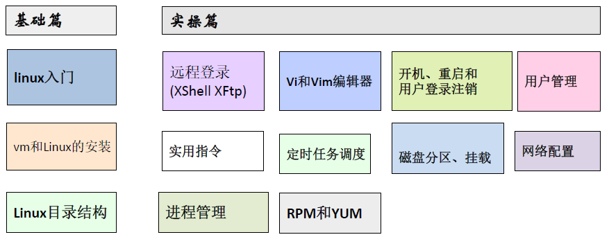


## Linux学习方向

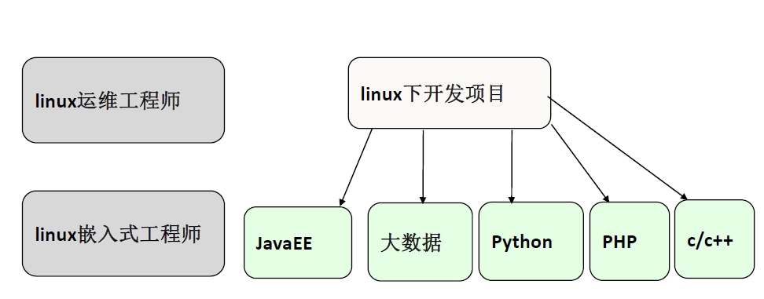

Linux入式开发工程师、Linux嵌入式开发工程师、在linux下做各种程序开发

## Linux 的应用领域

### 个人桌面应用领域

此领域是传统linux 应用最薄弱的环节，传统linux 由于界面简单、操作复杂、应用软件少的缺点，一直被windows 所压制，但近些年来随着 ubuntu、fedora [fɪˈdɔ:rə] 等优秀桌面环境的兴起，同时各大硬件厂商对其支持的加大，linux 在个人桌面领域的占有率在逐渐的提高。


### 服务器应用领域

linux 在服务器领域的应用是最强的。

linux 免费、稳定、高效等特点在这里得到了很好的体现，近些年来 linux 服务器市场得到了飞速的提升，尤其在一些高端领域尤为广泛。

### 嵌入式应用领域

近些年来linux 在嵌入式领域的应用得到了飞速的提高

linux 运行稳定、对网络的良好支持性、低成本，且可以根据需要进行软件裁剪，内核最小可以达到几百KB 等特点，使其近些年来在嵌入式领域的应用得到非常大的提高

主要应用：机顶盒、数字电视、网络电话、程控交换机、手机、PDA、智能家居、智能硬件等都是其应用领域。以后再物联网中应用会更加广泛

## 学习 Linux 的阶段（高手进阶过程）

**linux 是一个开源、免费的操作系统**，其稳定性、安全性、处理多并发已经得到业界的认可，目前很多中型，大型甚至是集群项目都在使用linux,很多软件公司考虑到开发成本都首选linux,在中国软件公司得到广泛的使用。

我个人认为学习linux 流程为:

第1 阶段：linux 环境下的基本操作命令，包括 文件操作命令(rm mkdir chmod, chown) 编辑工具使用（vi vim）linux 用户管理(useradd userdel usermod)等
第2 阶段：linux 的各种配置（环境变量配置，网络配置，服务配置）
第3 阶段：linux 下如何搭建对应语言的开发环境（大数据，JavaEE, Python 等）
第4 阶段：能编写shell 脚本，对Linux 服务器进行维护。
第5 阶段：能进行安全设置，防止攻击，保障服务器正常运行，能对系统调优。
第6 阶段：深入理解Linux 系统（对内核有研究），熟练掌握大型网站应用架构组成、并熟悉各个环节的部署和维护方法。

## Linux 的学习方法和建议

1) 高效而愉快的学习
2) 先建立一个整体框架，然后细节
3) **不需要掌握所有的Linux 指令，要学会查询手册和百度**
4) 先know how ,再know why
5) 计算机是一门”做中学” 的学科 ,不是会了再做，而是做了才会.
6) 适当的囫囵吞枣
7) Linux 不是编程，重点是实际操作，各种常用指令要玩的溜

# 基础篇  Linux 入门

## Linux介绍

1）Linux怎么读【里纽克斯，利尼克斯，里纳克斯】
2）Linux是一款操作系统，免费，开源，安全，高效，稳定，处理高并发非常强悍，现在很多的企业级的项目都部署到Linuxiunix服务器运行。
3）Linux创始入linux林纳斯


4）Linux的吉祥物


5）Linux 的主要发行版


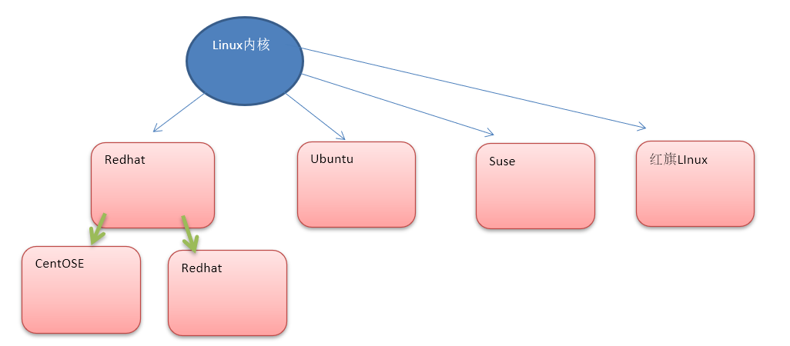

6）目前主要的操作系统有
windows，android，车载系统1inux等。

## unix 是怎么来的

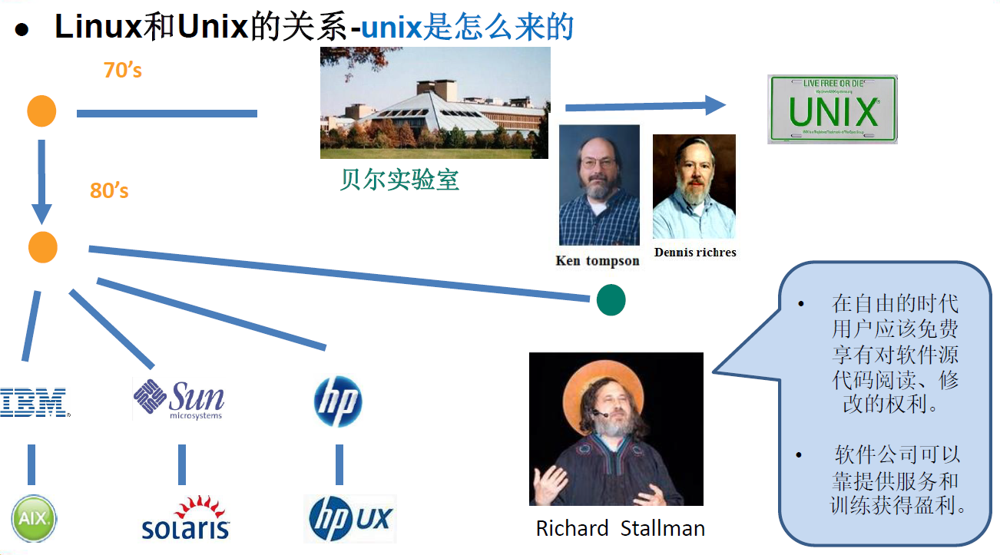

## Linux 是怎么来的

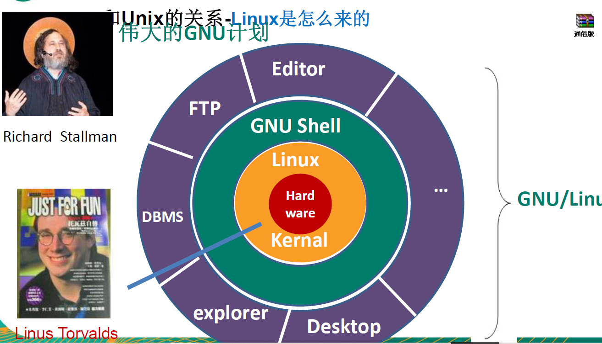

## linux 和 unix 关系一览图

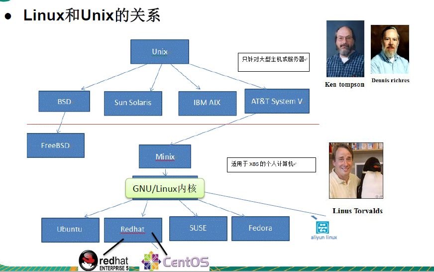

## linux 和 Windows 比较

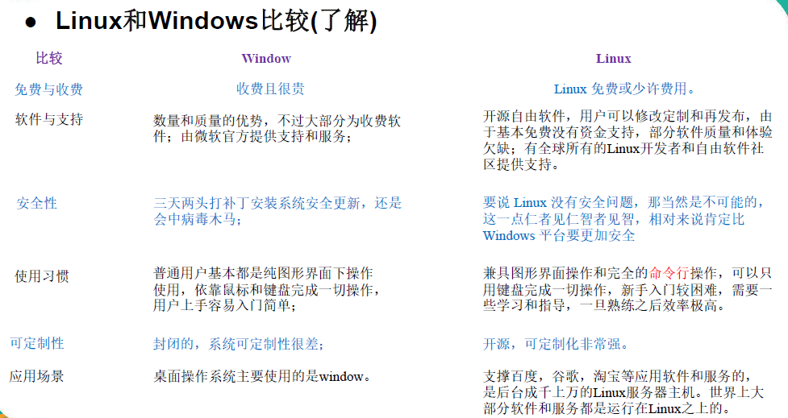

# 基础篇 VM 和 Linux 系统(CentOS)安装

## 安装vm 和Centos

学习Linux 需要一个环境，我们需要创建一个虚拟机，然后在虚拟机上安装一个 Centos 系统来学习。

1) 先安装virtual machine ,vm12
2) 再安装Linux (CentOS 6.8)
3) 原理示意图，这里我们画图说明一下 VM 和 CentOS 的关系。

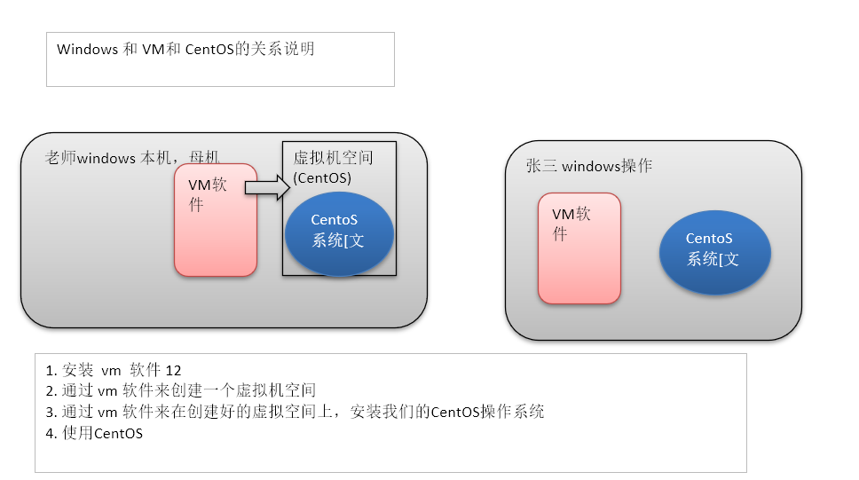

## vm 软件和CentOS 的安装软件


## VM 安装的步骤

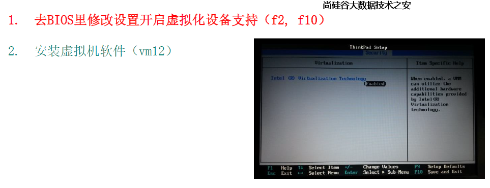

## 安装vm和Centos

1）创建虚拟机

这里在配置网络连接时，有三种形式，需要大家伙注意 ：

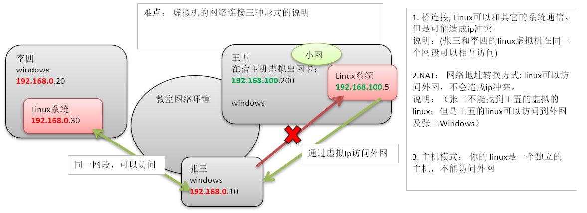

2）开始安装系统（CentOS6.8）

参考word文档

## CentOS 的终端使用和联网

1) 终端的使用，点击鼠标右键，即可选择打开终端

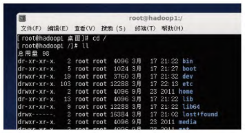

2) 配置网络，可以上网。

点击上面右侧的；两个计算机图片，选择启用eth0,即可成功连接到网络，就可以上网。

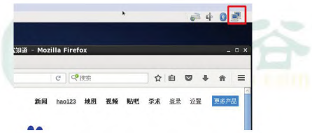

## vmtools 安装

### 介绍

1) 可以直接粘贴命令在windows 和 centos 系统之间
2) 可以设置windows 和centos 的共享文件夹
3) 示意图

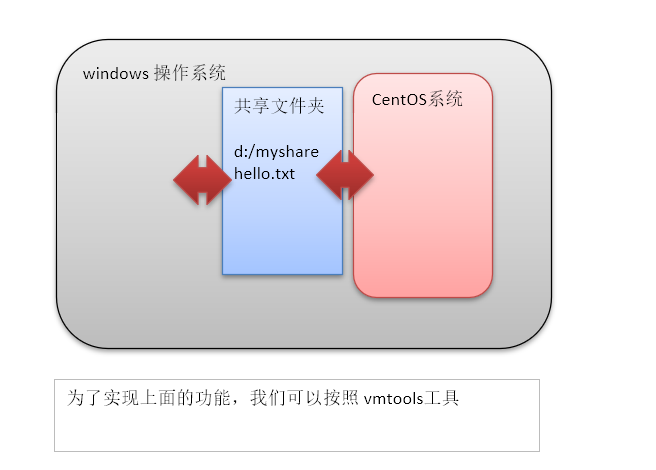

## vmtools 的安装和使用

安装vmtools的步骤:

1. 进入centos
2. 点击vm菜单的->install vmware tools
3. centos会出现一个vm的安装包
4. 点击右键解压, 得到一个安装文件
5. 进入该vm解压的目录，该文件在 /root/桌面/vmware-tools-distrib/下
6. 安装 `./vmware-install.pl`
7. 全部使用默认设置即可
8. 需要reboot重新启动即可生效

> 需要gcc   通过 `gcc -v`查看

## 设置共享 文件夹

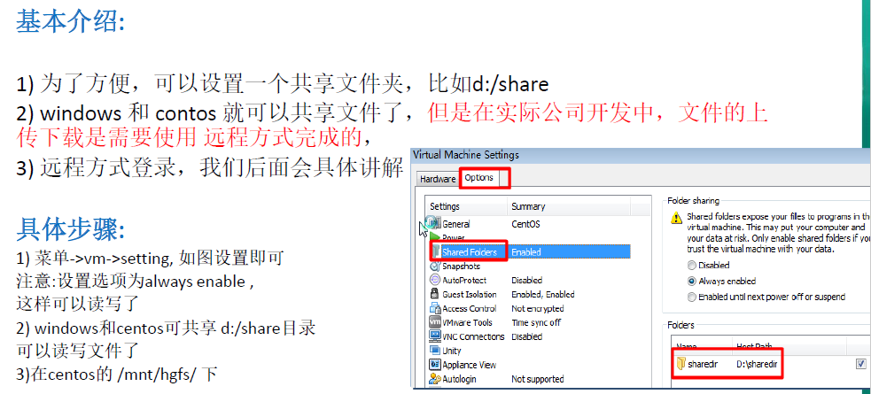

映射到 `cd /mnt/hgfs` 目录下

## 虚拟机克隆步骤

https://blog.csdn.net/qq_35024768/article/details/121196596

# 基础篇  Linux目录结构

## 基本介绍:

linux的文件系统是采用级层式的树状目录结构，在此 `结构中的最上层是根目录“/”`，然后在此目录下再创建其他的目录。
深刻理解linux树状文件目录是非常重要的，这里我给大家说明一下。

记住一句经典的话：`在Linux世界里，一切皆文件`

## 具体的目录结构

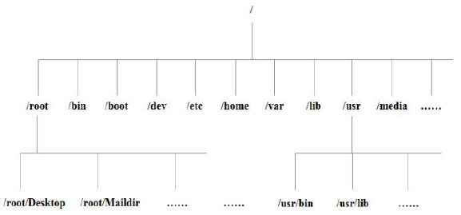

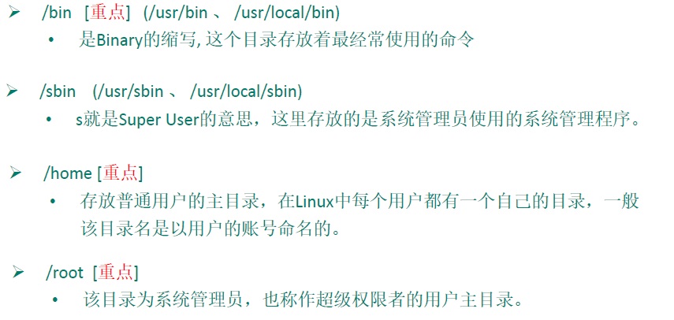

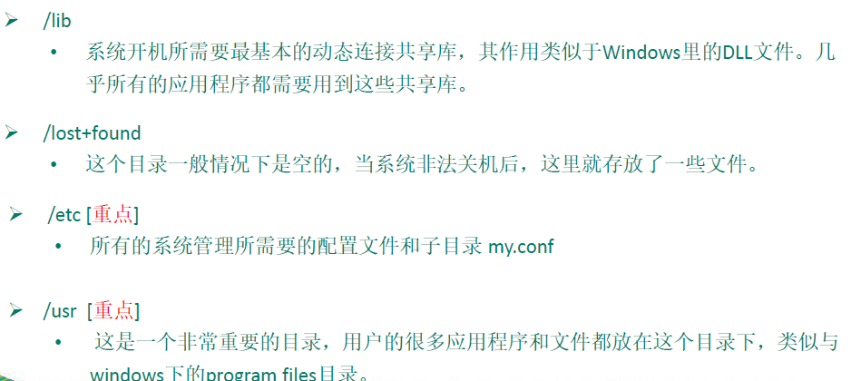

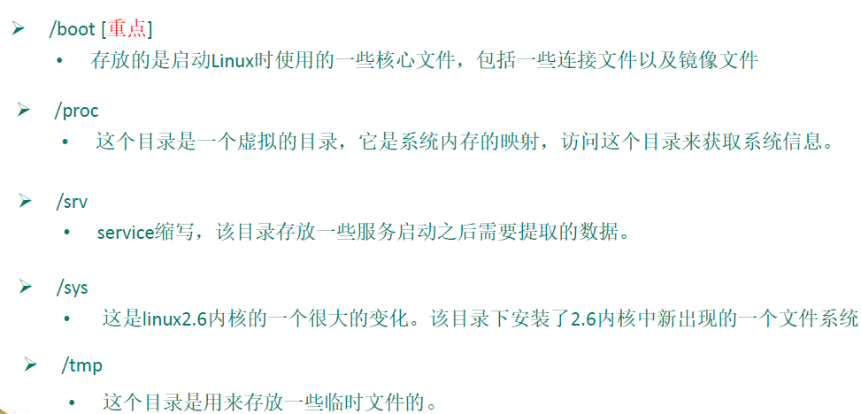

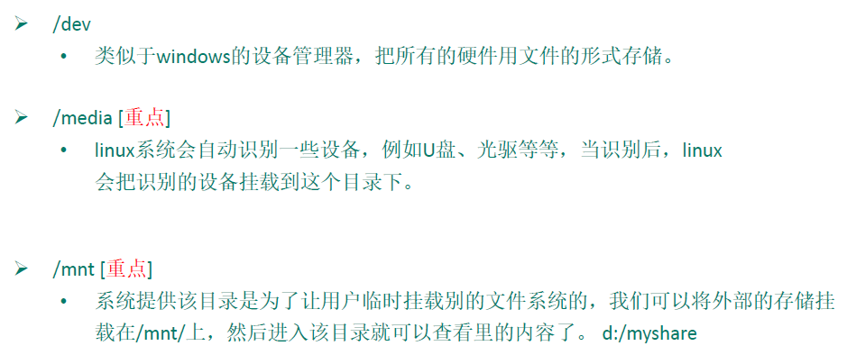

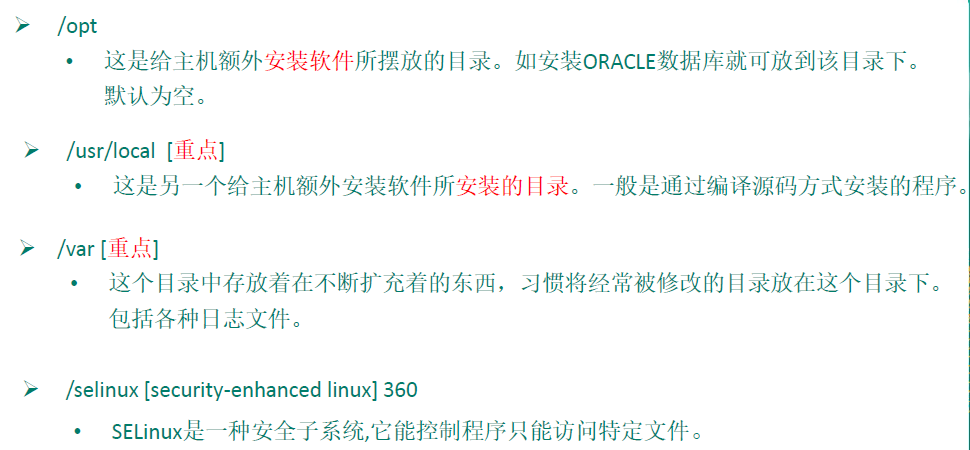

说明：

1) linux 的目录中有且只要一个根目录 /
2) linux 的各个目录存放的内容是规划好，不用乱放文件。
3) linux 是以文件的形式管理我们的设备，因此linux 系统，一切皆为文件。
4) linux 的各个文件目录下存放什么内容，大家必须有一个认识。
5) 学习后，你脑海中应该有一颗linux 目录树

# 实操篇 远程登录 Linux 系统

## 为什么需要远程登录Linux

### 示意图

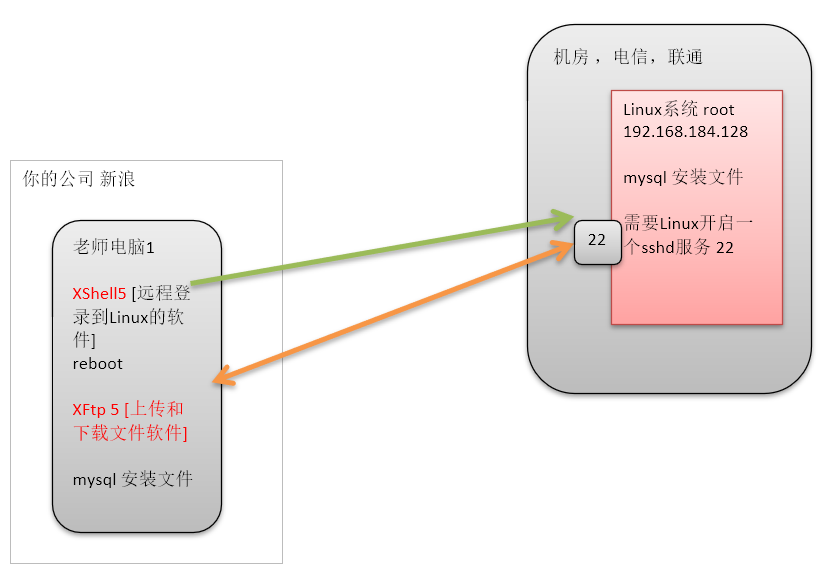

### 说明

说明: 公司开发时候， 具体的情况是这样的

1) linux 服务器是开发小组共享的.
2) 正式上线的项目是运行在公网的.
3) 因此程序员需要远程登录到centos 进行项目管理或者开发.
4) 画出简单的网络拓扑示意图(帮助理解)
5) 远程登录客户端有 Xshell5， Xftp5 , 我们学习使用 Xshell5 和 Xftp , 其它的远程工具大同

命令：

```sh	
ssh [-l login_name] [-p port] [user@]hostname

ssh root@192.168.64.4
```


## 远程登录Linux-Xshell5

说明: Xshell 是目前最好的远程登录到 Linux 操作的软件，流畅的速度并且完美解决了**中文乱码**的问题， 是目前程序员首选的软件。
Xshell [1] 是一个强大的安全终端模拟软件，它支持 SSH1, SSH2, 以及 Microsoft Windows 平台的TELNET 协议。
Xshell 可以在Windows 界面下用来访问远端不同系统下的服务器，从而比较好的达到远程控制终端的目的。

**特别说明**：如果希望安装好 XShell 5 就可以远程访问 Linux 系统的话，需要有一个**前提**，就是 `Linux 启用了SSHD 服务`，该 `服务会监听22 号端口`。

### 查看方式是否开启SSHD服务

终端输入     `setup`

选择System services   进行查看SSHD服务

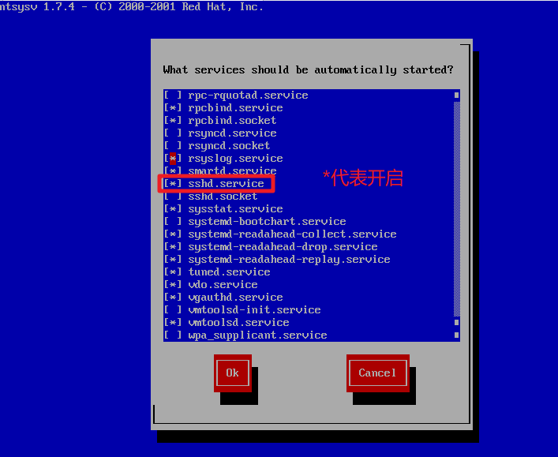

## 安装 XShell5 并使用

### XShell5 的关键配置

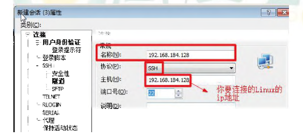

## 远程上传下载文件Xftp5

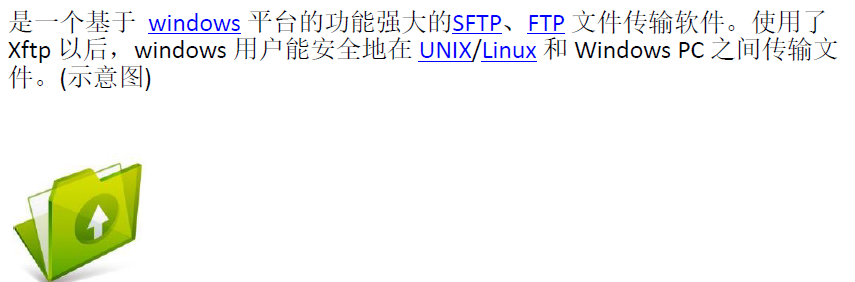

连接

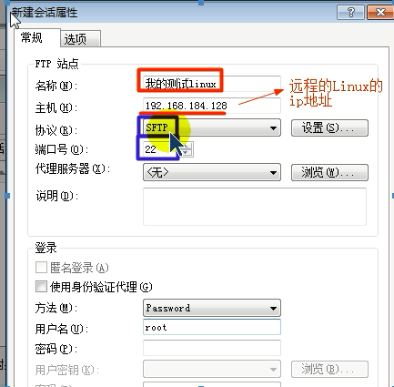

# Linux实操篇 Vi和Vim编辑器

## vi和vim的基本介绍

所有的Linux系統都会**内建vi文本編辑器**。
**Vim**具有程序编辑的能力，可以看做是**Vi的增强版本**，可以主动的以字体颜色辨别语法的正确性，方便程序设计。代码补完、编译及错误跳转等方便编程的功能特别丰富，在程序员中被广泛使用。

## vi和vim常用的三种模式

+ 正常模式:

  **在正常模式下，我们可以使用快捷键。**
  以vim 打开一个档案就直接进入一般模式了(这是默认的模式)。在这个模式中， 你可以使用『上下左右』按键来移动光标，你可以使用『删除字符』或『删除整行』来处理档案内容，也可以使用『复制、贴上』来处理你的文件数据。
+ 插入模式:
  按下i, I, o, O, a, A, r, R等任何一个字母之后才会进入编辑模式, 一般来说按i即可.
+ 命令行模式
  在这个模式当中，可以提供你相关指令，完成读取、存盘、替换、离开vim 、显示行号等的动作则是在此模式中达成的！

## vi和vim模式的相互切换

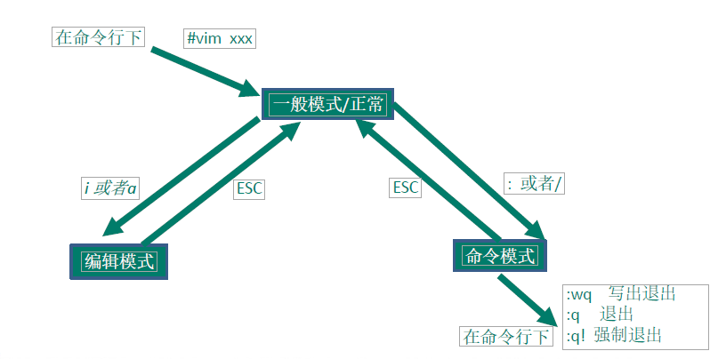

## 快捷键的使用案例

1)【复制】**拷贝当前行 `yy`** , **拷贝当前行至向下的5行 `5yy`**，并**粘贴 `p`**。

2)【删除】**删除当前行 `dd`**  , **删除当前行至向下的5行 `5dd`**

3)【查找】在文件中**查找某个单词**[**命令行下 `/关键字，回车查找`,  `输入n 就是查找下一个`**] ,查询 `/word `   `n下一个`

4)【行号】设置文件的**行号**，取消文件的行号.[命令行下 **`: set nu` 和 `:set nonu`**]

5)【首尾】编辑/etc/profile 文件，使用快捷键到底文档的**最末行[G]**和**最首行[gg]**

6)【撤销】在一个文件中输入"hello" ,然后又**撤销**这个动作 **u**

7)【跳转】编辑 /etc/profile 文件，并将光标移动到 第20行**【shift+g】**

    第一步：显示行号 ：set nu      第二步：输入20         第三步：输入`shift+g`

8）替换

```bash
:s/old/new      	#用new替换行中首次出现的old 
:s/old/new/g       #用new替换行中所有的old 
:n,m s/old/new/g   #用new替换从n到m行里所有的old 
:%s/old/new/g      #用new替换当前文件里所有的old
```

## vim和vi的快捷键键盘一览图


# 实操篇 开机、重启和用户登录注销

## 关机&重启命令

```sh
sync 				#把内存的数据同步到磁盘

shutdown –h now 	#立该进行关机
shutdown -h  1  	#"hello, 1 分钟后会关机了" 
shutdown –r now 	#现在重新启动计算机
halt				#关机，作用和上面一样.
reboot        		#现在重新启动计算机
```

> 注意世界：不管是重启系统还是关闭系统，首先要运行sync命令，把内存中的数据写到磁盘中，防止数据丢失

## 用户登录和注销

基本介绍

1) 登录时尽量少用root帐号登录，因为它是系统管理员，最大的权限，避免操作失误。可以利用普通用户登录，登录后再用**”su - 用户名’**命令 `【su root】`来切换成系统管理员身份.
2) 在提示符下输入**logout 即可注销用户**

```shell
[root@hadoop1 linux-share]$ logout
```

> 注意：
>
> 1) logout 注销指令在图形运行级别无效，在 运行级别3下有效.
> 2) 运行级别这个概念，后面给大家介绍

# 实操篇 用户管理

## 基本介绍

Linux系统是一个多用户多任务的操作系统，任何一个要使用系统资源的用户，都必须首先向系统管理员申请一个账号，然后以这个账号的身份进入系统。

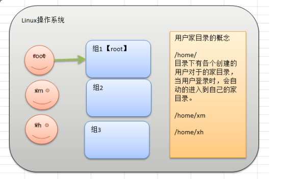

说明
1）Linux系统是一个多用户多任务的操作系统，任何一个要使用系统资源的用户，都必须首先向系统管理员申请一个账号，然后以这个账号的身份进入系统。
2）Linux的用户需要至少要属于一个组。

## 添加用户

基本语法:

`useradd [选项]  用户名`
应用案例
1)案例1:添加一个用户xiaoming

```sh
[root@hadoop1 xm]$ useradd xm  # 添加xm用户，添加到名称为xm的组，并且添加到xm组内

# 添加用户后会自动创建家目录
[root@hadoop1 xm]$ cd /home/
[root@hadoop1 home]$ ls
xm
```

> 细节说明
>
> 1) 当创建用户成功后，会自动的创建和用户同名的家目录
> 2) 也可以通过useradd -d  指定目录 新的用户名，给新创建的用户指定家目录，（PS：这个目录不能手动创建，自动创建）

特别说明：
cd 表示change directory, 切换目录.

## 指定/修改密码

`passwd    用户名`

应用案例

```sh
# 给xm用户指定密码，输入密码时界面不显示
[root@hadoop1 home]$ passwd xm
更改用户 xm 的密码 。
新的 密码：
无效的密码： WAY 过短
无效的密码： 过于简单
重新输入新的 密码：
passwd： 所有的身份验证令牌已经成功更新。
```

## 删除用户

基本语法

`userdel   用户名`

应用案例

1) 删除用户xiaoming，但是要保留家目录

```sh
[root@hadoop1 home]$ userdel xm
[root@hadoop1 home]$ ls /home/
xm
```

2) 删除用户以及用户主目录

```sh
[root@hadoop1 home]$ useradd xh 
[root@hadoop1 home]$ ls /home/
xh  xm
[root@hadoop1 home]$ userdel -r xh   # -r 表示删除删除用户及家目录
[root@hadoop1 home]$ ls /home/
xm
```

## 查询用户信息指令

基本语法
`id  用户名`
应用实例
案例1：请查询root 信息

```sh
[root@hadoop1 home]$ id root
uid=0(root) gid=0(root) 组=0(root)   # uid：用户id	gid：所在组的id号   组：组名称
[root@hadoop1 home]$ id xm
uid=500(xm) gid=500(xm) 组=500(xm)
```

细节说明

1) 当用户不存在时，返回无此用户

## 切换用户

介绍
在操作Linux中，如果当前用户的权限不够，可以通过 `su - 指令`，切换到高权限用户，比如root

基本语法
`su  – 切换用户名`
应用实例

1) 创建一个用户zf, ，指定密码，然后切换到zf.

```sh
[root@hadoop1 home]$ useradd zf   	#创建用户
[root@hadoop1 home]$ passwd zf		# 设置密码
更改用户 zf 的密码 。
新的 密码：
无效的密码： WAY 过短
无效的密码： 过于简单
重新输入新的 密码：
passwd： 所有的身份验证令牌已经成功更新。
[root@hadoop1 home]$ su zf  	# 切换到zf用户   root -> zf
[zf@hadoop1 home]$ cd /root
bash: cd: /root: 权限不够  		# 当用户权限不足时会给提示
[zf@hadoop1 home]$ exit			# 返回到原来的用户  zf->root
exit
[root@hadoop1 home]$
```

细节说明

1) **从权限高的用户切换到权限低的用户，不需要输入密码**，反之需要。
2) 当需要返回到原来用户时，使用exit指令

## 查看当前用户/登录用户

基本语法：`whoami/ who am I`

```sh
[root@hadoop1 home]$ whoami
root
[root@hadoop1 home]$ who am i
root     pts/0        2021-04-28 07:48 (192.168.64.1)
```

## 用户组

### 新增组

指令：`groupadd 组名`

```sh
[root@hadoop1 home]$ groupadd def_group
```

### 删除组

指令(基本语法)

`groupdel 组名`

```sh
[root@hadoop1 home]$ groupdel def_group
```

### 增加用户时直接加上组

指令(基本语法)

`useradd  –g 用户组 用户名`

案例：增加一个用户zwj, 直接将他指定到wudang

```sh
[root@hadoop1 home]$ groupadd wudang		#创建一个组
[root@hadoop1 home]$ useradd -g wudang zwj	#创建zwj用户，并指定到wudang组
[root@hadoop1 home]$ id zwj					#查询zwj信息
uid=502(zwj) gid=502(wudang) 组=502(wudang)
[root@hadoop1 home]$ ls /home/				#自动创建home目录下用户目录
xm  zf  zwj
```

### 修改用户的组

指令（基本语法）
`usermod -g 用户组 用户名`

案例演示：创建一个shaolin 组，让将zwj 用户修改到shaolin

```sh
[root@hadoop1 home]$ groupadd shaolin
[root@hadoop1 home]$ usermod -g shaolun zwj
usermod：“shaolun”组不存在
[root@hadoop1 home]$ usermod -g shaolin zwj
[root@hadoop1 home]$ id zwj
uid=502(zwj) gid=503(shaolin) 组=503(shaolin)
```

## 用户和组的相关文件

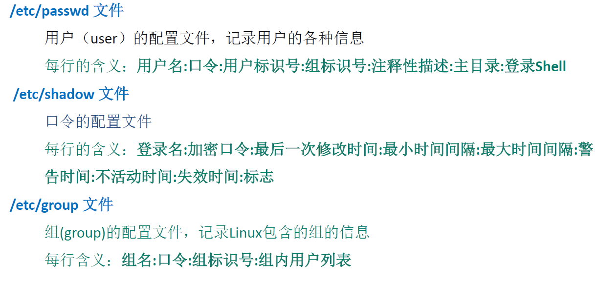

+ `/etc/passwd`文件
  用户**（user）的配置文件**，记录用户的各种信息
  每行的含义：`用户名：口令：用户标识号：组标识号：注释性描述：主目录：登录Shell`

  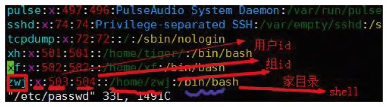
+ `/etc/shadow`文件
  口令的配置文件
  每行的含义：`登录名：加密口令：最后一次修改时间：最小时间间隔：最大时间间隔：警 告时间：不活动时间：失效时间：标志`
+ `/etc/group`文件
  **组（group）的配置文件**，记录Linux包含的组的信息
  每行含义：`组名：口令组标识号：组内用户列表`

  

# 实操篇 实用指令

## 指定运行级别

基本介绍:
运行级别说明：【7种】
0：关机
1：单用户【找回丢失密码】
2：多用户状态没有网络服务
3：**多用户状态有网络服务**
4：系统未使用保留给用户
5：图形界面
6：系统重启
常用运行级别是**3和5** ，要修改默认的运行级别可改文件
**/etc/inittab**的id:5:initdefault:这一行中的数字

```sh
[root@hadoop1 etc]$ vim /etc/inittab 

# inittab is only used by upstart for the default runlevel.
#
# ADDING OTHER CONFIGURATION HERE WILL HAVE NO EFFECT ON YOUR SYSTEM.
#
# System initialization is started by /etc/init/rcS.conf
#
# Individual runlevels are started by /etc/init/rc.conf
#
# Ctrl-Alt-Delete is handled by /etc/init/control-alt-delete.conf
#
# Terminal gettys are handled by /etc/init/tty.conf and /etc/init/serial.conf,
# with configuration in /etc/sysconfig/init.
#
# For information on how to write upstart event handlers, or how
# upstart works, see init(5), init(8), and initctl(8).
#
# Default runlevel. The runlevels used are:
#   0 - halt (Do NOT set initdefault to this)
#   1 - Single user mode
#   2 - Multiuser, without NFS (The same as 3, if you do not have networking)
#   3 - Full multiuser mode
#   4 - unused
#   5 - X11
#   6 - reboot (Do NOT set initdefault to this)
# 
id:5:initdefault:
```

### 切换指定运行级别指令：

基本语法：`init [012356]`
应用实例：
案例1：通过init 来切换不同的运行级别，比如动 5 -> 3 ，然后关机。

```sh
[root@hadoop1 etc]$ init 3   # 图形化界面自动切换到命令行
[root@hadoop1 etc]$ init 5   # 命令行自动切换到图形化界面
[root@hadoop1 etc]$ init 0   # 关机
```

**CentOS7后运行级别说明**
在/etc/initab进行了简化，如下：

`multi-user.targe：analogous to runlevel 3`   命令行界面
`graphical.targe：analogous to runlevel 5 `     图形化界面

```sh
#查看当前运行级别，run：
systemctl get-default

#设置当前运行级别，run：
systemctl set-default TARGET.target    # 3
systemctl set-default graphical.targe  # 5
```

> 如何找回root密码

思路：进入到单用户模式，然后修改root密码。因为进入单用户模式，root不需要密码就可以登录。

开机引导时【按回车】-> 看到一个界面按e -> 进入新的界面高亮选中第二行（编辑内核kenor，输入1） 回车退出  -> 再次输入b，进入单用户模式 ，使用passwd root  来修改root用户的密码    -> 重启登陆      【该操作不能远程】

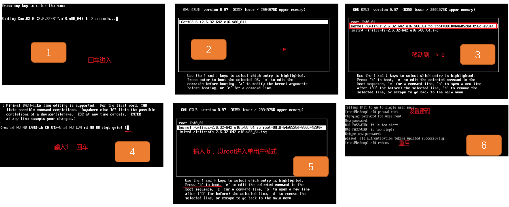

请设置我们的运行级别，linux 运行后，**直接进入到命令行界面，【即进入到3 运行级别】**
vim /etc/inittab
将id:5:initdefault:这一行中的数字, 5 这个数字改成对应的运行级别即可。

## 帮助指令

### 介绍

### man 获得帮助信息

•基本语法
`man [命令或配置文件]`（功能描述：获得帮助信息）
•应用实例
案例：查看ls命令的帮助信息

```sh
[root@hadoop1 ~]$ man ls   # 查看ls命令
```

### help 指令

•基本语法
`help 命令`（功能描述：获得shell内置命令的帮助信息）
•应用实例
案例：查看cd命令的帮助信息

```sh
[root@hadoop1 ~]$ help cd
cd: cd [-L|-P] [dir]
    Change the shell working directory.
```

百度帮助更直接
虽然上面两个都可以来获取指令帮助，但是需要英语功底，如果英语不太好的，我还是推荐大家直接百度靠谱。

## 文件目录类

### pwd 指令

•	基本语法
`pwd` (功能描述：显示当前工作目录的绝对路径)
•	应用实例
案例：显示当前工作目录的绝对路径

```sh
[root@hadoop1 ~]$ cd /
[root@hadoop1 /]$ pwd
/
[root@hadoop1 /]$ cd /root
[root@hadoop1 ~]$ pwd
/root
```

### ls 指令

基本语法
ls [选项] [目求或是文件]
常用选项
	`-a`：显示当前目录所有的文件和目录，包括隐藏的。
	`-1`：以列表的方式显示信息应用实例
案例：查看当前目录的所有内容信息

```sh
[root@hadoop1 ~]$ ls -al 桌面
总用量 8
drwxr-xr-x.  2 root root 4096 4月  27 08:54 .
dr-xr-x---. 27 root root 4096 4月  29 07:20 ..
[root@hadoop1 ~]$ ls -l
总用量 96
-rw-------. 1 root root  1246 4月  26 09:28 anaconda-ks.cfg
-rw-r--r--. 1 root root 41954 4月  26 09:28 install.log
-rw-r--r--. 1 root root  9154 4月  26 09:26 install.log.syslog
drwxr-xr-x. 2 root root  4096 4月  26 09:30 公共的
drwxr-xr-x. 2 root root  4096 4月  26 09:30 模板
drwxr-xr-x. 2 root root  4096 4月  26 09:30 视频
drwxr-xr-x. 2 root root  4096 4月  26 09:30 图片
drwxr-xr-x. 2 root root  4096 4月  26 09:30 文档
drwxr-xr-x. 2 root root  4096 4月  26 09:30 下载
drwxr-xr-x. 2 root root  4096 4月  26 09:30 音乐
drwxr-xr-x. 2 root root  4096 4月  27 08:54 桌面
[root@hadoop1 ~]$ ls 
```

### cd 指令

•基本语法

`cd  [参数]`  (功能描述：切换到指定目录)
•常用参数
	**绝对路径**和**相对路径**

    `cd ~` 或者cd ：回到自己的家目录
    `cd ..` 回到当前目录的上一级目录

> 如何理解绝对路径和相对路径
>
> 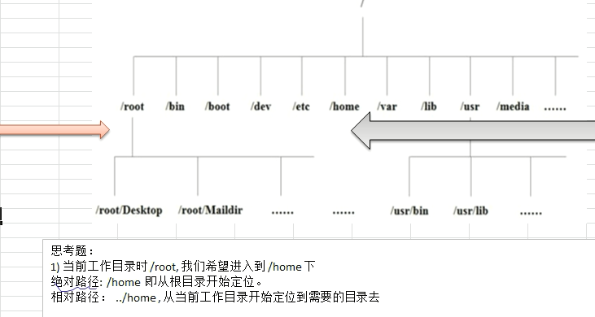

•	应用实例
案例1：使用绝对路径切换到root目录

```sh
[root@hadoop1 /]$ cd /root/  #绝对路径
```

案例2:  使用相对路径到/root 目录

```sh
[root@hadoop1 ~]$ cd ./			#相对路径
[root@hadoop1 ~]$ cd ../root
```

案例3：表示回到当前目录的上一级目录

```sh
[root@hadoop1 ~]$ cd ..
```

案例4：回到家目录

```sh
[root@hadoop1 /]$ cd ~
```

### mkdir 指令

mkdir指令用于创建目录

•基本语法
`mkdir  [选项] 要创建的目录`
•常用选项

- `-p` ：创建多级目录

应用实例
  案例1:创建一个目录/home/dog
  案例2:创建多级目录/home/animal/tiger

```sh
[root@hadoop1 ~]$ mkdir /home/dog
[root@hadoop1 ~]$ mkdir -p /home/animal/tiger   # 创建多级目录
[root@hadoop1 ~]$ ls -l /home/
总用量 20
drwxr-xr-x. 3 root root   4096 4月  29 07:47 animal
drwxr-xr-x. 2 root root   4096 4月  29 07:47 dog
drwx------. 4 xm   xm     4096 4月  28 07:58 xm
drwx------. 4 zf   zf     4096 4月  28 08:27 zf
drwx------. 4 zwj  wudang 4096 4月  28 08:39 zwj
```

### rmdir 指令

rmdir指令 **删除空目录**

•基本语法
`rmdir  [选项] 要删除的空目录`
•应用实例
案例1:删除一个目录/home/dog

```sh
[root@hadoop1 ~]$ rmdir /home/dog/
```

> 使用细节
> rmdir 删除的是空目录，如果目录下有内容时无法删除的。
> 提示：如果需要删除非空目录，需要使用 rm -rf 要删除的目录

```sh
[root@hadoop1 ~]$ mkdir /home/dog		# 删除空目录
[root@hadoop1 ~]$ cd /home/dog/
[root@hadoop1 dog]$ touch test.txt
[root@hadoop1 dog]$ rmdir /home/dog/
rmdir: 删除 "/home/dog/" 失败: 目录非空
[root@hadoop1 dog]$ rm -rf /home/dog/   # 删除非空目录  rm -rf dest_dir
```

### touch 指令

touch指令创建空文件

•基本语法
	`touch 文件名称`
•应用实例
案例1: 创建一个空文件hello.txt

```sh
[root@hadoop1 home]$ touch ./hello.txt
[root@hadoop1 home]$ ls -l
总用量 16
drwxr-xr-x. 3 root root   4096 4月  29 07:47 animal
-rw-r--r--. 1 root root      0 4月  29 07:57 hello.txt
drwx------. 4 xm   xm     4096 4月  28 07:58 xm
drwx------. 4 zf   zf     4096 4月  28 08:27 zf
drwx------. 4 zwj  wudang 4096 4月  28 08:39 zwj

[root@hadoop1 home]$ touch ok1.txt ok2.txt   # 一次性创建多个文件
[root@hadoop1 home]$ ls -l
总用量 16
drwxr-xr-x. 3 root root   4096 4月  29 07:47 animal
-rw-r--r--. 1 root root      0 4月  29 07:57 hello.txt
-rw-r--r--. 1 root root      0 4月  29 07:58 ok1.txt
-rw-r--r--. 1 root root      0 4月  29 07:58 ok2.txt
drwx------. 4 xm   xm     4096 4月  28 07:58 xm
drwx------. 4 zf   zf     4096 4月  28 08:27 zf
drwx------. 4 zwj  wudang 4096 4月  28 08:39 zwj
```

### cp 指令

cp 指令拷贝文件到指定目录

•基本语法
	`cp [选项] source dest`
•常用选项
	-r ：递归复制整个文件夹

•应用实例
案例1: 将/home/aaa.txt 拷贝到 /home/bbb 目录下[拷贝单个文件]

```sh
[root@hadoop1 home]$ touch aaa.txt
[root@hadoop1 home]$ ls
aaa.txt  animal  hello.txt  ok1.txt  ok2.txt  xm  zf  zwj
[root@hadoop1 home]$ rm -rf animal/ hello.txt  ok* xm zf zwj
[root@hadoop1 home]$ mkdir bbb
[root@hadoop1 home]$ ls
aaa.txt  bbb
[root@hadoop1 home]$ cp aaa.txt bbb/   # 表示将当前目录下的aaa.txt拷贝到当前bbb目录下
[root@hadoop1 home]$ ls -l ./bbb
总用量 0
-rw-r--r--. 1 root root 0 4月  29 08:04 aaa.txt
```

案例2: 递归复制整个文件夹，举例

```sh
[root@hadoop1 home]$ cp -r bbb/ a/   # 将bbb整个目录递归拷贝到a下面
[root@hadoop1 a]$ ls -l /home/a
总用量 4
drwxr-xr-x. 2 root root 4096 4月  29 08:07 bbb
```

> 使用细节
> 强制覆盖不提示的方法：\cp

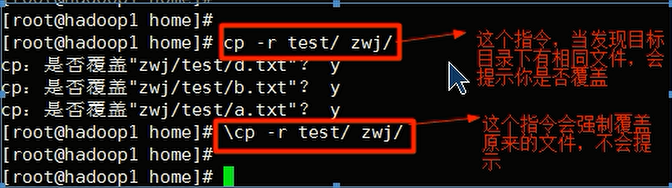

技术小技巧：可以通过 上下箭头 调出之前使用过的指令

### rm 指令

rm 指令移除文件或目录

•基本语法
	`rm  [选项] 要删除的文件或目录`
•常用选项
	-r ：递归删除整个文件夹
	-f ：强制删除不提示
•应用实例
案例1: 将/home/aaa.txt 删除
案例2: 递归删除整个文件夹 /home/bbb

```sh
[root@hadoop1 a]$ rm /home/aaa.txt 	#删除文件 带-f不提示删除
rm：是否删除普通空文件 "/home/aaa.txt"？y
[root@hadoop1 a]$ rm /home/bbb/
rm: 无法删除"/home/bbb/": 是一个目录
[root@hadoop1 a]$ rm -rf /home/bbb/   # 强制递归删除
```

•使用细节
强制删除不提示的方法：带上 -f参数即可

### mv 指令

mv 移动文件与目录或重命名

•基本语法
	`mv  oldNameFile newNameFile `   (功能描述：重命名)
	`mv /temp/movefile /targetFolder` (功能描述：移动文件)
•应用实例
案例1: 将/home/aaa.txt 文件重新命名为pig.txt

```sh
[root@hadoop1 home]$ touch aaa.txt
[root@hadoop1 home]$ ls
aaa.txt
[root@hadoop1 home]$ mv aaa.txt pig.txt   #重命名文件
[root@hadoop1 home]$ ls
pig.txt
```

案例2:将/home/pig.txt  文件移动到/root 目录下

```sh
[root@hadoop1 home]$ mv /home/pig.txt /root/
[root@hadoop1 home]$ ls /home/
[root@hadoop1 home]$ ls /root/
anaconda-ks.cfg  install.log.syslog  公共的  视频  文档  音乐
install.log      pig.txt             模板    图片  下载  桌面
```

### cat 指令

cat 查看文件内容

•基本语法
	`cat  [选项] 要查看的文件`
•常用选项
	-n ：显示行号
•应用实例
案例1:  /etc/profile 文件内容，并显示行号

```sh
[root@hadoop1 home]$ cat /etc/profile		# 不显示行号只读查看文件
[root@hadoop1 home]$ cat -n  /etc/profile	 # 显示行号只读查看文件
```

•使用细节
cat 只能浏览文件，而不能修改文件，为了浏览方便，一般会带上 管道命令| more

```sh
[root@hadoop1 home]$ cat -n  /etc/profile | more  # 以cat指令打开文件，并分页显示及行号查看，按空格继续
```

### more 指令

more指令是一个基于VI编辑器的文本过滤器，它以全屏幕的方式按页显示文本文件的内容。 more指令中内置了若干快捷键，详见操作说明

•基本语法
	`more 要查看的文件`
•操作说明

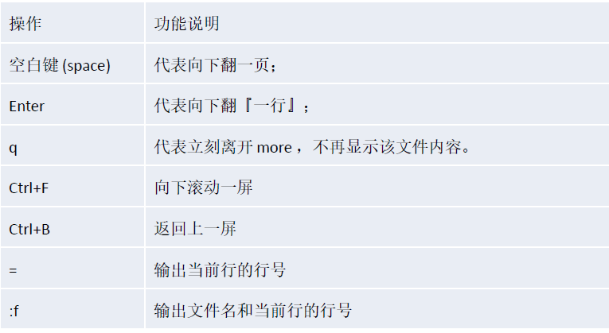•应用实例
案例: 采用more查看文件 /etc/profile

```sh
[root@hadoop1 home]$ more /etc/profile
```

### less 指令

less指令用来分屏查看文件内容，它的功能与more指令类似，但是比more指令更加强大，支持各种显示终端。less指令在显示文件内容时，**并不是一次将整个文件加载之后才显示，而是根据显示需要加载内容**，**对于显示大型文件具有较高的效率**。

•基本语法
	`less 要查看的文件`
•操作说明

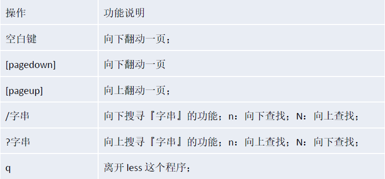

案例: 采用less查看一个【懒加载模式】

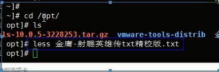

### echo 指令

echo输出内容到控制台。

•基本语法
	`echo  [选项] [输出内容]`
•应用实例
案例: 使用echo 指令输出环境变量

```sh
[root@hadoop1 home]$ echo $PATH  #输出$PATH环境变量
/usr/lib64/qt-3.3/bin:/usr/local/sbin:/usr/local/bin:/sbin:/bin:/usr/sbin:/usr/bin:/root/bin
```

案例: 使用echo 指令输出hello,world!

```sh
[root@hadoop1 home]$ echo "Hello world"
Hello world
```

### head 指令

head用于显示**文件的开头部分内容**，默认情况下head指令显示文件的前10行内容

•基本语法
	`head 文件` (功能描述：查看文件头10行内容)
	`head -n 5` 文件 (功能描述：查看文件头5行内容，5可以是任意行数)
•应用实例
案例: 查看/etc/profile 的前面5行代码

```sh
[root@hadoop1 home]$ head -n 5 /etc/profile
# /etc/profile

# System wide environment and startup programs, for login setup
# Functions and aliases go in /etc/bashrc

[root@hadoop1 home]$ 
```

### tail 指令

tail用于**输出文件中尾部的内容**，默认情况下tail指令显示文件的前10行内容。
基本语法
1）`tail 文件`（功能描述：查看文件头10行内容）
2）`tail -n 5 文件`（功能描述：查看文件头5行内容，5可以是任意行数）
3）`tail -f 文件`（功能描述：实时追踪该文档的所有更新）
应用实例
案例1：查看/etc/profile最后5行的代码

```sh
[root@hadoop1 home]$ tail -n 5 /etc/profile
    fi
done

unset i
unset -f pathmunge
[root@hadoop1 home]$ 
```

案例2：实时监控mydate.txt，看看到文件有变化时，是否看到，实时的追加日期

```sh
[root@hadoop1 home]$ tail -f mydate.txt 


# 开启另一个窗口,将ls的结果写入到mydate.txt中，执行tail -f mydate.txt 的窗口可以看到更新
ls -l >> /home/mydate.txt
```

### '>'  指令和'>>' 指令

'>'输出重定向和'>>'追加

'>'输出重定向：会将原来的文件的内容覆盖
'>>'追加：不会覆盖原来文件的内容，而是追加到文件的尾部。

基本语法
	1）`ls -l > 文件`		 （功能描述：列表的内容写入文件a.txt中（**覆盖写**）)
	2）`ls -al >> 文件`		（功能描述：列表的内容**追加**到文件aa.txt的末尾）
	3）`cat 文件1 > 文件2`	（功能描述：将文件1的内容覆盖到文件2）
	4）`echo "内容" >> 文件`
应用实例
案例1：将/home目录下的文件列表覆盖写入到/home/a.txt中

```sh
[root@hadoop1 home]$ ls -l > a.txt  # 将ls -l的打印内容 覆盖写入到a.txt，写出文件不存在会自动创建
[root@hadoop1 home]$ ls
a.txt  mydate.txt
[root@hadoop1 home]$ more a.txt 
总用量 4
-rw-r--r--. 1 root root    0 4月  29 09:10 a.txt
-rw-r--r--. 1 root root 1347 4月  29 08:56 mydate.txt
[root@hadoop1 home]$ 
```

案例2：将当前日历信息追加到/home/mycal.txt文件中

```sh
[root@hadoop1 home]$ cal >> mycal.txt   # cal 查询日历  ，并追加写入到mycal.txt
[root@hadoop1 home]$ more mycal.txt 
      四月 2021   
日 一 二 三 四 五 六
             1  2  3
 4  5  6  7  8  9 10
11 12 13 14 15 16 17
18 19 20 21 22 23 24
25 26 27 28 29 30

[root@hadoop1 home]$ cal >> mycal.txt  	# 再次 追加写入到mycal.txt
[root@hadoop1 home]$ more mycal.txt 
      四月 2021   
日 一 二 三 四 五 六
             1  2  3
 4  5  6  7  8  9 10
11 12 13 14 15 16 17
18 19 20 21 22 23 24
25 26 27 28 29 30

      四月 2021   
日 一 二 三 四 五 六
             1  2  3
 4  5  6  7  8  9 10
11 12 13 14 15 16 17
18 19 20 21 22 23 24
25 26 27 28 29 30

[root@hadoop1 home]$ 
```

### ln 指令

软链接也成为符号链接，类似于**windows里的快捷方式**，主要存放了链接其他文件的路径

•基本语法
`ln -s [原文件或目录] [软链接名]` （功能描述：给原文件创建一个软链接）
•应用实例
案例1: 在/home 目录下创建一个软连接 linkToRoot，连接到/root 目录

```sh
[root@hadoop1 ~]$ ln -s /root/ /home/linkToRoot   #创建链接   源   链接位置
[root@hadoop1 ~]$ cd /home/
[root@hadoop1 home]$ ls -l
总用量 12
-rw-r--r--. 1 root root  117 4月  29 09:10 a.txt
lrwxrwxrwx. 1 root root    6 4月  29 20:41 linkToRoot -> /root/   # 指向/root
-rw-r--r--. 1 root root  308 4月  29 09:16 mycal.txt
-rw-r--r--. 1 root root 1347 4月  29 08:56 mydate.txt

[root@hadoop1 home]$ ls -l linkToRoot/   		# 查看连接
总用量 12
-rw-r--r--. 1 root root  117 4月  29 09:10 a.txt
lrwxrwxrwx. 1 root root    6 4月  29 20:41 linkToRoot -> /root/
-rw-r--r--. 1 root root  308 4月  29 09:16 mycal.txt
-rw-r--r--. 1 root root 1347 4月  29 08:56 mydate.txt
-rw-------. 1 root root  1246 4月  26 09:28 anaconda-ks.cfg
-rw-r--r--. 1 root root 41954 4月  26 09:28 install.log
-rw-r--r--. 1 root root  9154 4月  26 09:26 install.log.syslog
-rw-r--r--. 1 root root     0 4月  29 08:22 pig.txt
drwxr-xr-x. 2 root root  4096 4月  26 09:30 公共的
drwxr-xr-x. 2 root root  4096 4月  26 09:30 模板
drwxr-xr-x. 2 root root  4096 4月  26 09:30 视频
drwxr-xr-x. 2 root root  4096 4月  26 09:30 图片
drwxr-xr-x. 2 root root  4096 4月  26 09:30 文档
drwxr-xr-x. 2 root root  4096 4月  26 09:30 下载
drwxr-xr-x. 2 root root  4096 4月  26 09:30 音乐
drwxr-xr-x. 2 root root  4096 4月  27 08:54 桌面
```

案例2: 删除软连接linkToRoot

```sh
[root@hadoop1 home]$ rm -rf linkToRoot/			 # 不能带最后的/
rm: 无法删除"linkToRoot/.gvfs": 设备或资源忙
[root@hadoop1 home]$ rm -rf linkToRoot
```

细节说明
当我们使用pwd指令查看目录时，仍然看到的是软链接所在目录。

### history 指令

查看已经执行过历史命令,也可以执行历史指令

•基本语法
`history` （功能描述：查看已经执行过历史命令）
•应用实例
案例1: 显示所有的历史命令

```sh
[root@hadoop1 home]$ history 
    1  ll
    2  cd /opt/
    3  ls
    4  tar -zxvf VMwareTools-10.3.22-15902021.tar.gz 
    5  ls
    6  cd vmware-tools-distrib/
    7  ./vmware-install.pl 
```

案例2: 显示最近使用过的10个指令。

```sh
[root@hadoop1 home]$ history 10
   45  ln -s /root linkToRoot
   46  ls
   47  ls -l
   48  rm -rf linkToRoot/
   49  rm -rf linkToRoot
   50  history 
   51  history -n 10
   52  history |more 10
   53  history 
   54  history 10
```

案例3：执行历史编号为47的指令

```sh
[root@hadoop1 home]$ !47    # 执行历史编号为47的指令
ls -l
总用量 12
-rw-r--r--. 1 root root  117 4月  29 09:10 a.txt
-rw-r--r--. 1 root root  308 4月  29 09:16 mycal.txt
-rw-r--r--. 1 root root 1347 4月  29 08:56 mydate.txt
```

## 时间日期类

### date 指令-显示当前日期

+ 基本语法
  1）`date`（功能描述：显示当前时间）
  2）`date +%Y`（功能描述：显示当前年份）
  3）`date +%m`（功能描述：显示当前月份）
  4）`date +%d`（功能描述：显示当前是哪一天）
  5）`date"+%Y-%m-%d%H:%M:%S"`（功能描述：显示年月日时分秒）
+ 应用实例
  案例1：显示当前时间信息
  案例2：显示当前时间年月日
  案例3：显示当前时间年月日时分秒

```sh
[root@hadoop1 home]$ date
2021年 04月 29日 星期四 20:57:46 CST
[root@hadoop1 home]$ date "+%Y- %m %d日"    # 
2021- 04 29日
[root@hadoop1 home]$ date "+%Y-%m-%m %H:%M:%S"
2021-04-04 20:59:28
```

### date 指令-设置日期

•基本语法
	`date  -s 字符串时间`
•应用实例
案例1: 设置系统当前时间，比如设置成2020-11-11 11:22:22

```sh
[root@hadoop1 home]$ date -s "2020-11-11 11:22:11"
2020年 11月 11日 星期三 11:22:11 CST
[root@hadoop1 home]$ date
2020年 11月 11日 星期三 11:22:16 CST
```

### cal 指令

查看日历指令

+ 基本语法
  `cal[选项]`   （功能描述：不加选项，显示本月日历）
+ 应用实例
  案例1：显示当前日历

  案例2：显示2020年日历

```sh
[root@hadoop1 home]$ cal   # 查看本月日历
      四月 2021   
日 一 二 三 四 五 六
             1  2  3
 4  5  6  7  8  9 10
11 12 13 14 15 16 17
18 19 20 21 22 23 24
25 26 27 28 29 30

[root@hadoop1 home]$ cal 2020		# 查看2020年日历
                               2020                             

        一月                   二月                   三月      
日 一 二 三 四 五 六  	 日 一 二 三 四 五 六   日 一 二 三 四 五 六
          1  2  3  4                      1    1  2  3  4  5  6  7
 5  6  7  8  9 10 11    2  3  4  5  6  7  8    8  9 10 11 12 13 14
12 13 14 15 16 17 18    9 10 11 12 13 14 15   15 16 17 18 19 20 21
19 20 21 22 23 24 25   16 17 18 19 20 21 22   22 23 24 25 26 27 28
26 27 28 29 30 31      23 24 25 26 27 28 29   29 30 31

        四月                   五月                   六月      
日 一 二 三 四 五 六   	日 一 二 三 四 五 六   日 一 二 三 四 五 六
          1  2  3  4                   1  2       1  2  3  4  5  6
 5  6  7  8  9 10 11    3  4  5  6  7  8  9    7  8  9 10 11 12 13
12 13 14 15 16 17 18   10 11 12 13 14 15 16   14 15 16 17 18 19 20
19 20 21 22 23 24 25   17 18 19 20 21 22 23   21 22 23 24 25 26 27
26 27 28 29 30         24 25 26 27 28 29 30   28 29 30
                       31
        七月                   八月                   九月      
日 一 二 三 四 五 六   	日 一 二 三 四 五 六   日 一 二 三 四 五 六
          1  2  3  4                      1          1  2  3  4  5
 5  6  7  8  9 10 11    2  3  4  5  6  7  8    6  7  8  9 10 11 12
12 13 14 15 16 17 18    9 10 11 12 13 14 15   13 14 15 16 17 18 19
19 20 21 22 23 24 25   16 17 18 19 20 21 22   20 21 22 23 24 25 26
26 27 28 29 30 31      23 24 25 26 27 28 29   27 28 29 30
                       30 31
        十月                  十一月                 十二月     
日 一 二 三 四 五 六   	日 一 二 三 四 五 六   日 一 二 三 四 五 六
             1  2  3    1  2  3  4  5  6  7          1  2  3  4  5
 4  5  6  7  8  9 10    8  9 10 11 12 13 14    6  7  8  9 10 11 12
11 12 13 14 15 16 17   15 16 17 18 19 20 21   13 14 15 16 17 18 19
18 19 20 21 22 23 24   22 23 24 25 26 27 28   20 21 22 23 24 25 26
25 26 27 28 29 30 31   29 30                  27 28 29 30 31
```

## 搜索查找类

### find 指令

find指令将从指定目录向下递归地遍历其各个子目录，将满足条件的文件或者目录显示在终端。

•基本语法
  `find  [搜索范围] [选项]`
•选项说明


应用实例
案例1: 按文件名：根据名称查找/home 目录下的hello.txt文件

```sh
# find 					  [查找范围] [文件名查找] [文件名]
[root@hadoop1 home]$ find /home/ -name hello.txt  
/home/hello.txt
```

案例2：按拥有者：查找/opt目录下，用户名称为 nobody的文件

```sh
[root@hadoop1 home]$ find /opt/ -user nobody	# 查找opt目录下属于nobody用户的文件
[root@hadoop1 home]$ find /opt/ -user root		# 查找opt目录下属于root用户的文件
```

案例3：查找整个linux系统下大于200m的文件（+n 大于 -n小于 n等于  n代表容量大小）   容量单位 `k M G 区分大小写`

```sh
[root@hadoop1 home]$ find / -size +200M   # 从根目录下查找大于200M的文件   
/opt/VMwareTools-10.3.22-15902021.tar.gz
/usr/lib64/firefox/libxul.so
/usr/lib64/libLLVM-3.6-mesa.so

[root@hadoop1 home]$ find / -size -1k  # 从根目录下查找小于1kb的文件  
[root@hadoop1 home]$ find / -size 1k  # 从根目录下查找等于1kb的文件  
```

### locate 指令

locaate指令可以**快速定位文件路径**。locate指令利用事先建立的系统中所有文件名称及路径的**locate数据库实现快速定位给定的文件**。Locate指令**无需遍历整个文件系统**，查询速度较快。为了保证查询结果的准确度，管理员必须定期更新locate时刻。

•基本语法

`locate 搜索文件`
•特别说明

由于locate指令基于数据库进行查询，**所以第一次运行前，必须使用updatedb指令创建locate数据库**。

应用实例
案例1: 请使用locate 指令快速定位hello.txt 文件所在目录

```sh
[root@hadoop1 home]$ updatedb     		#第一次运行前，必须使用updatedb指令创建locate数据库
[root@hadoop1 home]$ locate hello.txt   # 查找名字为hello.txt文件的目录
/home/hello.txt
```

### grep 指令和管道符号 |

grep 过滤查找，管道符，“|”，表示将**前一个命令的处理结果输出传递给后面的命令处理**。

•基本语法:  

​	`grep [选项] '搜索字符串' 文件名`	


•常用选项

```
-i：忽略大小写进行匹配。
-n：显示匹配行的行号。
-r：递归查找子目录中的文件。
-E:（扩展正则表达式）
-v：反向查找，只打印不匹配的行。反向过滤：及返回不匹配的行

-l：只打印匹配的文件名。
-c：只打印匹配的行数。
```


#### 应用实例

案例1: 请在hello.txt 文件中，查找 "yes"  所在行，并且显示行号

```sh
 # cat将浏览的内容（即cat返回到控制台的内容）  ->  交给grep过滤      -n 显示行号  -i 忽略大小写，默认区分大小写
[root@hadoop1 home]$ cat /home/hello.txt | grep -n yes  
7:yes
9:yes1
11:yes2
```

#### **例子**

1. **搜索特定字符串**： 查找文件中包含 "hello" 的行。

   ```bash
   grep 'hello' filename.txt
   ```

2. **忽略大小写**： 忽略大小写查找字符串 "hello"。

   ```bash
   grep -i 'hello' filename.txt
   ```

3. **递归搜索文件夹中的文件**： 递归查找目录中的所有文件，寻找 "hello" 字符串。

   ```bash
   grep -r 'hello' /path/to/directory
   ```

4. **显示行号**： 输出匹配字符串所在的行号。

   ```bash
   grep -n 'hello' filename.txt
   ```

5. **显示匹配行的上下文**： 显示匹配行前后 3 行的内容。

   ```bash
   grep -C 3 'hello' filename.txt
   ```

6. **仅显示文件名**： 只输出包含匹配字符串的文件名，而不显示具体内容。

   ```bash
   grep -l 'hello' *
   ```

7. **反向匹配**： 查找不包含 "hello" 的行。

   ```bash
   grep -v 'hello' filename.txt
   ```

8. **统计匹配的次数**： 统计包含 "hello" 的行数。

   ```bash
   grep -c 'hello' filename.txt
   ```


#### 常见通配符及其作用

在 Linux 中，`grep` 本身并不直接支持文件名中的通配符匹配，但可以通过使用 shell 通配符（如 `*`、`?` 和 `[]`）配合 `grep` 来达到通配符匹配的效果。

1. **`*` （匹配任意长度的字符，包括 0 个字符）**： `*` 通配符可以用来匹配文件名中任意数量的字符。

   例如，查找所有 `.txt` 文件中包含 "hello" 的行：

   ```bash
   grep 'hello' *.txt
   ```

   这会在当前目录下所有 `.txt` 文件中搜索 "hello"。

2. **`?` （匹配任意单个字符）**： `?` 通配符用于匹配文件名中的单个字符。

   例如，查找文件名为 `file1.txt`、`file2.txt` 等文件中的 "hello"：

   ```bash
   grep 'hello' file?.txt
   ```

3. **`[]` （匹配指定范围内的字符）**： `[]` 通配符用于匹配文件名中的任意一个字符，可以是字母范围或数字范围。

   例如，查找文件名为 `file1.txt` 到 `file3.txt` 中的 "hello"：

   ```bash
   grep 'hello' file[1-3].txt
   ```

   这会在 `file1.txt`、`file2.txt` 和 `file3.txt` 文件中查找。

**注意事项**

1. **Shell 通配符匹配**： 通配符匹配并不是 `grep` 本身的功能，而是由 shell 提供的。例如，`*` 会由 shell 扩展为匹配的文件名，然后再传递给 `grep`。

2. **递归搜索和通配符**： 如果想要递归搜索所有目录中的匹配文件，可以结合 `grep -r` 和通配符来实现：

   ```bash
   grep -r 'hello' *.txt
   ```

   这将递归地搜索当前目录及其子目录中所有 `.txt` 文件里的 "hello"。

**使用 `find` 配合 `grep`**

当需要更复杂的文件名通配符匹配时，可以结合 `find` 和 `grep` 来实现。

例如，查找目录中所有文件名以 `.log` 结尾的文件，并在这些文件中搜索 "error"：

```bash
find . -name "*.log" -exec grep 'error' {} \;
```

总结

- `grep` 本身并不处理文件名的通配符，而是依赖于 shell 来进行文件匹配。
- 使用 `*`、`?` 和 `[]` 通配符可以匹配不同模式的文件名。
- 如果需要更复杂的通配符匹配，可以结合 `find` 命令。


#### 常见的模糊搜索方式

1. **匹配任意字符** (`.`): `.` 可以匹配任意一个字符。

   ```bash
   grep 'h.llo' filename.txt
   ```

   这将匹配 "hello"、"hallo"、"hillo" 等。

2. **匹配多个字符** (`*`): `*` 表示匹配任意长度（包括 0 个）的前一个字符。

   ```
   grep 'hel*o' filename.txt
   ```

   这将匹配 "heo"、"hello"、"helllooo" 等。

3. **匹配多个字符中的一个** (`[]`): `[]` 用于指定字符类，可以匹配括号中的任意一个字符。

   ```
   grep 'h[aeiou]llo' filename.txt
   ```

   这将匹配 "hallo"、"hello"、"hollo" 等。

4. **匹配开头和结尾** (`^` 和 `$`): `^` 表示行的开头，`$` 表示行的结尾。

   ```
   grep '^hello' filename.txt  # 匹配以 "hello" 开头的行
   grep 'world$' filename.txt  # 匹配以 "world" 结尾的行
   ```

5. **匹配字符串的可选部分** (`?`): `?` 表示前一个字符是可选的（0 或 1 次）。

   ```
   grep 'colou?r' filename.txt
   ```

   这将匹配 "color" 或 "colour"。

6. **匹配重复的字符** (`{}`): `{n,m}` 用来匹配前面的字符至少 `n` 次，最多 `m` 次。

   ```
   grep 'o{2,4}' filename.txt
   ```

   这将匹配包含 2 到 4 个连续 "o" 的字符串，如 "foo", "fooo", "foooo" 等。

## 压缩和解压类

### gzip/gunzip 指令

    gzip用于压缩文件，gunzip用于解压的

+ 基本语法
  `gzip 文件`    （功能描述：压缩文件，只能将文件压缩为*.gz文件）
  `gunzip 文件.gz`（功能描述：解压缩文件命令）
+ 应用实例
  案例1：gzip压缩，将/home下的hello.txt文件进行压缩

  ```sh
  [root@hadoop1 home]$ gzip /home/hello.txt    # 压缩完hello.txt.gz
  [root@hadoop1 home]$ ls -l
  总用量 16
  -rw-r--r--. 1 root root  117 4月  29 2021 a.txt
  -rw-r--r--. 1 root root   54 4月   9 22:02 hello.txt.gz
  -rw-r--r--. 1 root root  308 4月  29 2021 mycal.txt
  -rw-r--r--. 1 root root 1347 4月  29 2021 mydate.txt
  ```

  > 细节说明：当我们使用gzip对文件进行压缩后，不会保留原来的文件
  >
+ 案例2：gunzip压缩，将/home下的hello.txt.gz文件进行解压缩

  ```sh
  [root@hadoop1 home]$ gunzip hello.txt.gz 
  [root@hadoop1 home]$ ls
  a.txt  hello.txt  mycal.txt  mydate.txt
  ```

  > 细节说明：当我们使用gunzip对文件进行解压后，压缩文件会删除
  >

### zip/unzip 指令

zip 用于压缩文件，unzip 用于解压的，这个在项目打包发布中很有用的

•基本语法
	`zip [选项]   XXX.zip  将要压缩的内容`（功能描述：压缩文件和目录的命令）
	`unzip [选项]  XXX.zip `（功能描述：解压缩文件）

•zip常用选项
	`-r`：递归压缩，即压缩目录

•unzip的常用选项
	`-d<目录>` ：指定解压后文件的存放目录

•应用实例
案例1: 将/home下的所有文件进行压缩成 home.zip

```sh
[root@hadoop1 home]$ zip -r home.zip /home/
  adding: home/ (stored 0%)
  adding: home/mycal.txt (deflated 63%)
  adding: home/a.txt (deflated 34%)
  adding: home/hello.txt (deflated 16%)
  adding: home/mydate.txt (deflated 82%)
[root@hadoop1 home]$ ls
a.txt  hello.txt  home.zip  mycal.txt  mydate.txt
```

案例2:  将home.zip 解压到/opt/temp目录下

```sh
[root@hadoop1 home]$ unzip -d /opt/temp home.zip 
Archive:  home.zip
   creating: /opt/temp/home/
  inflating: /opt/temp/home/mycal.txt  
  inflating: /opt/temp/home/a.txt  
  inflating: /opt/temp/home/hello.txt  
  inflating: /opt/temp/home/mydate.txt  
[root@hadoop1 home]$ ls -l /opt/temp/
总用量 4
drwxr-xr-x. 2 root root 4096 4月   9 22:16 home
```

### tar 指令

tar 指令是打包指令，最后打包后的文件是 .tar.gz 的文件。

•基本语法
	`tar  [选项]  XXX.tar.gz  打包的内容` (功能描述：打包目录，压缩后的文件格式.tar.gz)
•选项说明


应用实例
案例1: 压缩多个文件，将/home/a1.txt 和/home/a2.txt 压缩成 a.tar.gz

```sh
[root@hadoop1 home]$ tar -zcvf a.tar.gz a1.txt a2.txt # 将a1.txt a2.txt 压缩成a.tar。gz
a1.txt
a2.txt
[root@hadoop1 home]$ ls -l
总用量 20
-rw-r--r--. 1 root root    0 4月   9 22:23 a1.txt
-rw-r--r--. 1 root root    0 4月   9 22:23 a2.txt
-rw-r--r--. 1 root root  118 4月   9 23:16 a.tar.gz
```

案例2:  将/home 的文件夹压缩成myhome.tar.gz

```sh
[root@hadoop1 home]$ tar -zcvf myhome.tar.gz /home/
tar: 从成员名中删除开头的“/”
/home/
/home/a1.txt
/home/a2.txt
/home/mycal.txt
/home/a.txt
/home/a.tar.gz
/home/hello.txt
/home/mydate.txt
/home/a3.txt
tar: /home: 在我们读入文件时文件发生了变化
[root@hadoop1 home]$ ls
a1.txt  a2.txt  a3.txt  a.tar.gz  a.txt  hello.txt  mycal.txt  mydate.txt  myhome.tar.gz
```

案例3:   将a.tar.gz  解压到当前目录

```sh
[root@hadoop1 home]$ tar -zxvf a.tar.gz    # 解压到当前目录
a1.txt
a2.txt
[root@hadoop1 home]$ ls
a1.txt  a2.txt  a.tar.gz  hello.txt  mycal.txt  mydate.txt  myhome.tar.gz
```

案例4：将myhome.tar.gz 解压到/opt/tmp2目录下

> 指定解压的目录需要已存在，否则会报错

```sh
[root@hadoop1 home]$ tar -zxvf myhome.tar.gz -C /opt/temp2
tar: /opt/temp2：无法 chdir: 没有那个文件或目录
tar: Error is not recoverable: exiting now
[root@hadoop1 home]$ tar -zxvf myhome.tar.gz -C /opt/
home/
home/a1.txt
home/a2.txt
home/mycal.txt
tar: home/mycal.txt：时间戳 2021-04-29 09:16:41 是未来的 1676314.319616876 秒之后
home/a.txt
tar: home/a.txt：时间戳 2021-04-29 09:10:58 是未来的 1675971.319427966 秒之后
home/a.tar.gz
home/hello.txt
home/mydate.txt
tar: home/mydate.txt：时间戳 2021-04-29 08:56:38 是未来的 1675111.31932431 秒之后
home/a3.txt
[root@hadoop1 home]$ ls -l /opt/
总用量 55112
drwxr-xr-x. 2 root root     4096 4月   9 23:18 home
drwxr-xr-x. 2 root root     4096 3月  26 2015 rh
drwxr-xr-x. 3 root root     4096 4月   9 22:19 temp
-rw-r--r--. 1 root root 56414224 3月  25 2020 VMwareTools-10.3.22-15902021.tar.gz
drwxr-xr-x. 9 root root     4096 3月  25 2020 vmware-tools-distrib
```

# 实操篇 组管理和权限管理

## Linux组基本介绍

在linux中的**每个用户必须属于一个组，不能独立于组外**。在linux中**每个文件有所有者、所在组、其它组**的概念。

1) 所有者
2) 所在组
3) 其它组
4) 改变用户所在的组

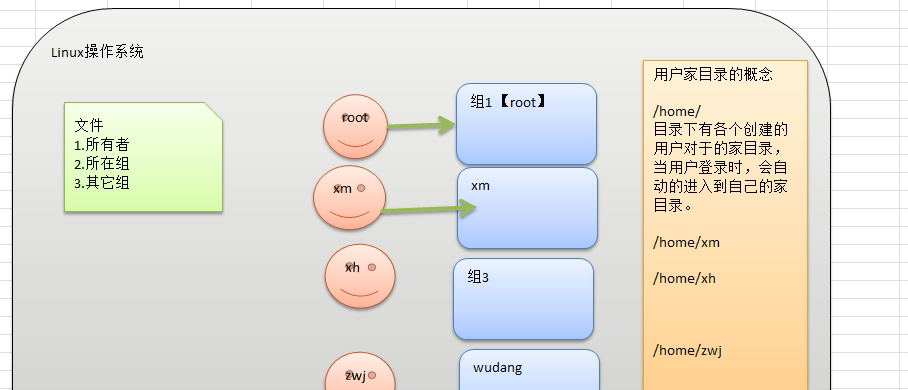

## 文件/目录 所有者

一般为文件的创建者,谁创建了该文件，就自然的成为该文件的所有者。

### 查看文件的所有者

1) 指令：`ls –ahl`

2）应用实例：创建一个组police，再创建一个用户tom，将tom放在police组然后使用tom来创建一个文件ok.txt，看看情况如何

```sh
[root@hadoop1 home]$ groupadd police
[root@hadoop1 home]$ useradd -g police tom
[root@hadoop1 home]$ id tom
uid=503(tom) gid=504(police) 组=504(police)

# 另外一个窗口
[tom@hadoop1 ~]$ touch ok.txt
[tom@hadoop1 ~]$ ls -lah
总用量 32K
drwx------. 4 tom  police 4.0K 4月  10 00:01 .
drwxr-xr-x. 3 root root   4.0K 4月   9 23:50 ..
-rw-------. 1 tom  police   29 4月   9 23:52 .bash_history
-rw-r--r--. 1 tom  police   18 5月  11 2016 .bash_logout
-rw-r--r--. 1 tom  police  176 5月  11 2016 .bash_profile
-rw-r--r--. 1 tom  police  124 5月  11 2016 .bashrc
drwxr-xr-x. 2 tom  police 4.0K 11月 12 2010 .gnome2
drwxr-xr-x. 4 tom  police 4.0K 4月  26 2021 .mozilla
-rw-r--r--. 1 tom  police    0 4月  10 00:01 ok.txt     # ok.txt 的所有者是tom用户   属于police组
```

### 修改文件所有者

•	指令：`chown 用户名 文件名`
•	应用案例
要求：使用root 创建一个文件apple.txt ，然后将其所有者修改成tom

```sh
[root@hadoop1 home]$ touch apple.txt
[root@hadoop1 home]$ ls -ahl
总用量 32K
drwxr-xr-x.  3 root root   4.0K 4月  10 00:06 .
dr-xr-xr-x. 24 root root   4.0K 4月  29 2021 ..
-rw-r--r--.  1 root root      0 4月  10 00:06 apple.txt
drwx------.  4 tom  police 4.0K 4月  10 00:01 tom
[root@hadoop1 home]$ chown tom apple.txt 
[root@hadoop1 home]$ ls -ahl   # -a 可以查看隐藏文件，linux已.开头的文件为隐藏文件
总用量 32K
drwxr-xr-x.  3 root root   4.0K 4月  10 00:06 .   
dr-xr-xr-x. 24 root root   4.0K 4月  29 2021 ..
-rw-r--r--.  1 tom  root      0 4月  10 00:06 apple.txt
drwx------.  4 tom  police 4.0K 4月  10 00:01 tom    # 所有者由上面的root修改为tom，文件所在组没有改变还是root组
```

> -a 可以查看隐藏文件，linux已 . 开头的文件为隐藏文件

### 组的创建

基本指令
	`groupadd 组名`
应用实例:
创建一个组monster ，创建一个用户fox ，并放入到 monster组中

```sh
[root@hadoop1 home]$ groupadd monster
[root@hadoop1 home]$ useradd -g monster fox
[root@hadoop1 home]$ id fox   # 查看用户
uid=504(fox) gid=505(monster) 组=505(monster)
```

## 文件/目录 所在组

当某个用户创建了一个文件后，默认这个文件的所在组就是该用户所在的组。

### 查看文件/目录所在组

•	基本指令
     `ls –ahl`
•	应用实例

### 修改文件所在的组

•	基本指令
		`chgrp 组名 文件名`
•	应用实例

使用root用户创建文件orange.txt ,看看当前这个文件属于哪个组，然后将这个文件所在组，修改到police组。

```sh
[root@hadoop1 test]$ touch orange.txt
[root@hadoop1 test]$ ls -ahl
总用量 8.0K
drwxr-xr-x. 2 root root 4.0K 4月  10 00:18 .
drwxr-xr-x. 5 root root 4.0K 4月  10 00:17 ..
-rw-r--r--. 1 root root    0 4月  10 00:18 orange.txt
[root@hadoop1 test]$ chgrp police orange.txt   # 将orange.txt由root组修改为police组
[root@hadoop1 test]$ ls -ahl
总用量 8.0K
drwxr-xr-x. 2 root root   4.0K 4月  10 00:18 .
drwxr-xr-x. 5 root root   4.0K 4月  10 00:17 ..
-rw-r--r--. 1 root police    0 4月  10 00:18 orange.txt  
```

## 其它组

除文件的所有者和文件所在组的用户外，系统的其它用户都是文件的其它组。

## 改变用户所在组

在添加用户时，可以指定将该用户添加到哪个组中，同样的用**root的管理权限可以改变某个用户所在的组**。

### 改变用户所在组

1) `usermod  –g  组名 用户名`
2) `usermod  –d  目录名 用户名` 改变该用户登陆的初始目录。

应用实例
创建一个土匪组（bandit）将tom这个用户从原来所在的police组，修改到bandit（土匪）组。

```sh
[root@hadoop1 test]$ id tom
uid=503(tom) gid=504(police) 组=504(police)
[root@hadoop1 test]$ groupadd bandit
[root@hadoop1 test]$ usermod -g bandit tom         # tom用户 由police 组 -> bandit组
[root@hadoop1 test]$ id tom
uid=503(tom) gid=506(bandit) 组=506(bandit)
```

## 权限的基本介绍

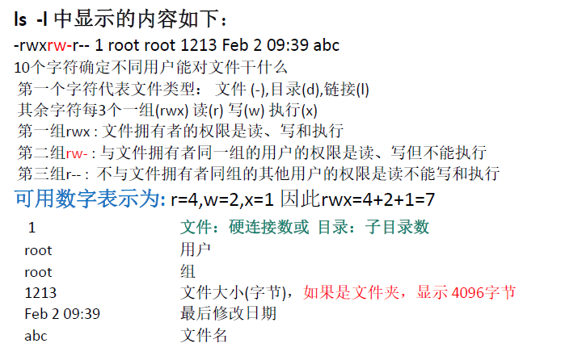

0-9位说明

1) 第0位【-】确定文件类型(`d 目录`, `- 文件` , `l 软连接文件` , `c  字符设备【键盘鼠标】`, `b 块文件【硬盘】`  )
2) 第1-3位【rw-】确定所有者（该文件的所有者）拥有该文件的权限。---User
3) 第4-6位确定所属组（同用户组的）拥有该文件的权限，---Group
4) 第7-9位确定其他用户拥有该文件的权限 ---Other

## rwx权限详解

### rwx 作用到文件

1) **[  r  ]**    代表可读(read): 可以**读取,查看**
2) **[ w ]**    代表可写(write): 可**以修改,但是不代表可以删除该文件**,**删除一个文件**的前提条件是**对该文件所在的目录有写权限，才能删除该文件.**
3) **[ x ]**    代表可执行(execute):可以被**执行**

### rwx作用到目录

1) **[  r ]    **代表可读(read): 可以读取，ls查看目录内容
2) **[ w ]**    代表可写(write): 可以修改,目录内创建+删除+重命名目录
3) **[ x ]**    代表可执行(execute):可以**进入该目录**

## 权限管理

### 修改权限-chmod

+ 基本说明：
  通过chmod指令，可以修改文件或者目录的权限。
+ 第一种方式：**+ 、-、=** 变更权限
  u:所有者 g:所有组 o:其他人 a:所有人(u、g、o的总和)

  1) `chmod   u=rwx,g=rx,o=x   文件目录名`
  2) `chmod   o+w    文件目录名`    为其他用户组添加W【写】权限
  3) `chmod   a-x    文件目录名`    为所有用户去掉X【执行】权限

  案例演示

  1) 给abc文件的所有者读写执行的权限，给所在组读执行权限，给其它组读执行权限。

  ```sh
  [root@hadoop1 home]$ touch abc
  [root@hadoop1 home]$ chmod u=rwx,g=rx,o=rx abc
  [root@hadoop1 home]$ ls -l abc
  -rwxr-xr-x. 1 root root 0 5月   7 23:19 abc
  ```

  2) 给abc文件的所有者除去执行的权限，增加组写的权限

  ```sh
  [root@hadoop1 home]$ chmod u-x,g+w abc
  [root@hadoop1 home]$ ls -l abc
  -rw-rwxr-x. 1 root root 0 5月   7 23:19 abc
  ```

  3) 给abc文件的所有用户添加读的权限

  ```sh
  [root@hadoop1 home]$ chmod  a+r abc
  [root@hadoop1 home]$ ls -l abc
  -rw-rwxr-x. 1 root root 0 5月   7 23:19 abc
  ```
+ 第二种方式：通过数字变更权限
  r=4 w=2 x=1        rwx=4+2+1=7

      `chmod u=rwx,g=rx,o=x    文件目录名`

  相当于 `chmod   751  文件目录名`

  案例演示
  要求：将/home/abc.txt 文件的权限修改成 rwxr-xr-x, 使用给数字的方式实现：

  ```sh
  [root@hadoop1 home]$ touch /home/abc.txt
  [root@hadoop1 home]$ chmod 733 abc.txt
  [root@hadoop1 home]$ ls -l abc.txt
  -rwx-wx-wx. 1 root root 0 5月   7 23:25 abc.txt
  [root@hadoop1 home]$ chmod 755 abc.txt
  [root@hadoop1 home]$ ls -l abc.txt
  -rwxr-xr-x. 1 root root 0 5月   7 23:25 abc.txt
  ```

### 修改文件所有者-chown

+ 基本介绍
  `chown  newowner  file`  改变文件的所有者
  `chown newowner:newgroup  file`  改变用户的所有者和所有组
+ 常用参数

  -R   如果是目录则使其下所有子文件或目录递归生效
+ 案例演示：

  1) 请将/home/abc .txt 文件的所有者修改成tom

  ```sh
  [root@hadoop1 home]$ ls -l abc.txt
  -rwxr-xr-x. 1 root root 0 5月   7 23:25 abc.txt
  [root@hadoop1 home]$ chown tom abc.txt 
  [root@hadoop1 home]$ ls -l abc.txt
  -rwxr-xr-x. 1 tom root 0 5月   7 23:25 abc.txt
  ```

  2) 请将/home/kkk 目录下所有的文件和目录的所有者都修改成tom

  ```sh
  [root@hadoop1 kkk]$ ll
  总用量 4
  drwxr-xr-x. 3 root root 4096 5月   7 23:38 a
  -rw-r-xr-x. 1 root root    0 5月   7 23:37 abc
  -rwxr-xr-x. 1 root root    0 5月   7 23:37 abc.txt
  [root@hadoop1 kkk]$ chown -R tom ./    # -R目录则使其下所有子文件或目录递归生效
  [root@hadoop1 kkk]$ ll
  总用量 4
  drwxr-xr-x. 3 tom root 4096 5月   7 23:38 a
  -rw-r-xr-x. 1 tom root    0 5月   7 23:37 abc
  -rwxr-xr-x. 1 tom root    0 5月   7 23:37 abc.txt
  ```

### 修改文件所在组-chgrp

+ 基本介绍
  `chgrp newgroup file`  改变文件的所有组
+ 常用参数

  -R   如果是目录则使其下所有子文件或目录递归生效
+ 案例演示：

  1) 请将/home/abc .txt 文件的所在组修改成bandit

  ```sh
  [root@hadoop1 kkk]$ chgrp bandit /home/abc.txt 
  [root@hadoop1 kkk]$ ll /home/abc.txt 
  -rwxr-xr-x. 1 tom bandit 0 5月   7 23:25 /home/abc.txt
  ```

  2) 请将/home/kkk 目录下所有的文件和目录的所在组都修改成 bandit

  ```sh
  [root@hadoop1 kkk]$ chgrp -R bandit ./
  [root@hadoop1 kkk]$ ll
  总用量 4
  drwxr-xr-x. 3 tom bandit 4096 5月   7 23:38 a
  -rw-r-xr-x. 1 tom bandit    0 5月   7 23:37 abc
  -rwxr-xr-x. 1 tom bandit    0 5月   7 23:37 abc.txt
  ```

### 最佳实践

police ，bandit
jack, jerry: 警察
xh, xq: 土匪

(1)	创建组

```sh
bash> groupadd police 
bash> groupadd bandit
```

(2)	创建用户

```sh
[root@hadoop1 kkk]$ useradd -g police jack
[root@hadoop1 kkk]$ useradd -g police jerry
[root@hadoop1 kkk]$ useradd -g bandit xh
[root@hadoop1 kkk]$ useradd -g bandit xq
```

(3)	jack 创建一个文件，自己可以读写，本组人可以读，其它组没人任何权限【su 切换用户   前提 需要设置用户密码】

```sh
[jack@hadoop1 ~]$ vim jack01.txt
[jack@hadoop1 ~]$ ll
总用量 4

# 方式1
-rw-r--r--. 1 jack police 11 5月   7 23:49 jack01.txt
[jack@hadoop1 ~]$ chmod u=rw,g=r,o= jack01.txt 
[jack@hadoop1 ~]$ ll
总用量 4
-rw-r-----. 1 jack police 11 5月   7 23:49 jack01.txt

# 方式2
[jack@hadoop1 ~]$ chmod u=rw,g=r,o-r jack01.txt 
[jack@hadoop1 ~]$ ll
总用量 4
-rw-r-----. 1 jack police 11 5月   7 23:49 jack01.txt
```

(4)	jack 修改该文件，让其它组人可以读, 本组人可以读写

```sh
[jack@hadoop1 ~]$ chmod o=r,g=rw jack01.txt 
[jack@hadoop1 ~]$ ll
总用量 4
-rw-rw-r--. 1 jack police 11 5月   7 23:49 jack01.txt
```

(5)	xh 投靠警察，看看是否可以读写.

```sh
[xh@hadoop1 jack]$ su root
密码：
# 修改xh为police组
[root@hadoop1 jack]$ usermod -g police xh
[root@hadoop1 jack]$ id xh
uid=507(xh) gid=504(police) 组=504(police)

# 查看/home/jack目录，的权限，该目录所在组和其他组都该目录不具有任何权限
[root@hadoop1 home]$ ls -l /home |grep 'jack'
drwx------. 4 jack  police  4096 5月   7 23:49 jack

# 为/home/jack/目录所在组增加rx权限
[root@hadoop1 home]$ chmod g=rx /home/jack/
[root@hadoop1 home]$ ls -l /home |grep 'jack'
drwxr-x---. 4 jack  police  4096 5月   7 23:49 jack

# xh需要重新登录后可以进入jack的家目录【xh未修改/home/jack之前不能进入该目录】
[tom@hadoop1 /]$ su xh
密码：
[xh@hadoop1 /]$ cd /home/jack/
[xh@hadoop1 jack]$ ls
jack01.txt
[xh@hadoop1 jack]$ ll
总用量 4
-rw-rw-r--. 1 jack police 11 5月   7 23:49 jack01.txt
[xh@hadoop1 jack]$ vim jack01.txt   # 具有读和写的权限
```

# 实操篇 定时任务调度

## crond 任务调度

    crontab 进行定时任务的设置。

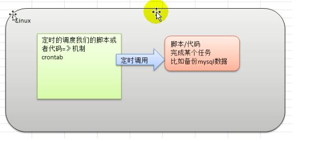

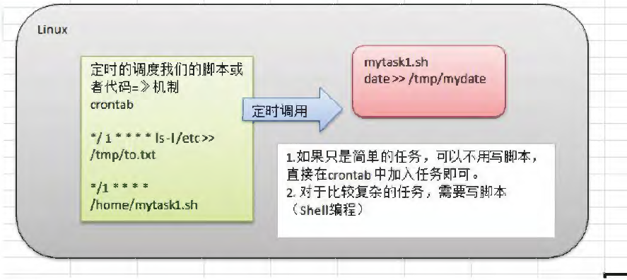

### 概述

任务调度：是指系统在某个时间执行的特定的命令或程序。
任务调度分类：

1.系统工作：有些重要的工作必须周而复始地执行。如病毒扫描等

2.个别用户工作：个别用户可能希望执行某些程序，比如对mysql数据库的备份。

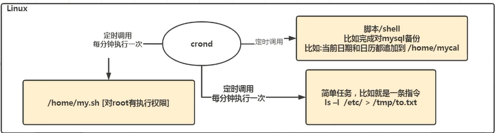

+ 基本语法
  `crontab [选项]`
+ 常用选项
  

### crontab快速入门

设置任务调度文件：`/etc/crontab`
设置个人任务调度步骤：

1. 执行 `crontab –e 命令`。
2. 接着输入任务到调度文件
   如：`*/1 * * * * ls –l  /etc/ > /tmp/to.txt`
   意思说每小时的每分钟执行 `ls –l /etc/ > /tmp/to.txt`

```sh
# 1.执行crontab -e   按i编辑任务，输入*/1 * * * * ls –l  /etc/ > /tmp/to.txt，后显示如下，去ls -l /tmp | grep 'to.*'查看结果
[root@hadoop1 tmp]$ crontab -e
no crontab for root - using an empty one
crontab: installing new crontab
```

### **时间命令参数细节说明**

**`五个占位符`的说明**


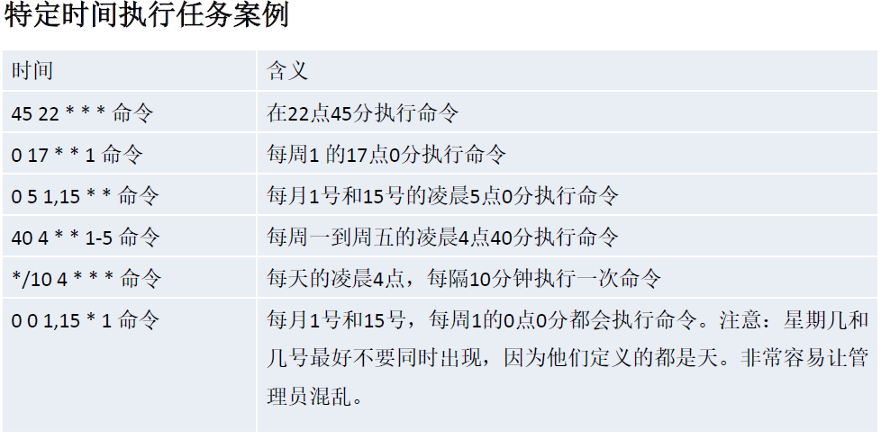

### 任务调度应用实例

**案例1：每隔1分钟，就将当前的日期信息，追加到 /tmp/mydate 文件中**

①创建 ` touch  /home/mytask1.sh`
写入内容：`date >> /tmp/mydate`
并赋予可执行权限 `chmod 744 /home/mytask1.sh`

②`crontab –e`

③添加内容：`*/1 * * * * /home/mytask1.sh`

**案例2：每隔1分钟，将当前日期和日历都追加到/home/mycal 文件中**

①创建 ` touch /home/mytask2.sh`
写入内容：`vim /home/mytask2.sh`

```sh
 date >> /tmp/mycal 
 cal>> /tmp/mycal 
```

并赋予可执行权限 `chmod 744 /home/mytask2.sh`

②`crontab –e`

③添加内容：`*/1 * * * * /home/mytask2.sh`

**案例3:    每天凌晨2:00 将mysql数据库testdb ，备份到文件mydb.bak中。**

①创建 ` touch /home/mytask3.sh`
写入内容：`vim /home/mytask3.sh`

```sh
/usr/local/mysql/bin/mysqldump -u root -p root testdb > /tmp/mybd.bak
```

并赋予可执行权限 `chmod 744 /home/mytask3.sh`

②`crontab –e`

③添加内容：`0 2 * * * /home/mytask3.sh`

### crond 相关指令:

1) `crontab –r`：终止任务调度。
2) `crontab –l`：列出当前有那些任务调度
3) `service crond restart`   [重启任务调度]

## at定时任务

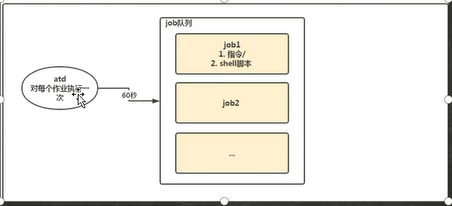

### 基本介绍

1、`at命令是一次性定时计划任务`，at的守护进程atd会以后台模式运行，检查作业队列来运行
2、默认情况下，atd守护进程每60秒检查作业队列，有作业时，会检查作业运行时间，如果时间与当前时间匹配，则运行此作业【*运行完毕即从队列中删除*】
3、at命令是一次性定时计划任务，执行完一个任务后不再执行此任务了
4、在使用at命令的时候，一定要保证atd进程的启动，可以使用相关指令来查看[`ps -ef | grep atd`]

### at命令格式

`at [选项] [时间]`
Ctrl +D结束at命令的输入，注意 输入两次

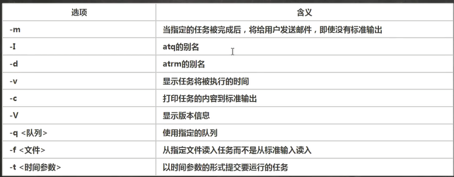

### at时间定义

at指定时间的方法：
1、接受在当天的hh:mm（小时：分钟）式的时间指定。假如该时间已过去，那么就放在第二天执行。例如：04：00

2、使用midnight（深夜），noon（中午），teatime（饮茶时间，一般是下午4点）等比较模糊的词语来指定时间
3、采用12小时计时制，即在时间后面加上AM（上午）或PM（下午）来说明是上午还是下午。例如：12pm
4、指定命令执行的具体日期，指定格式为month day（月日）或mm/dd/yy（月/日/年）或dd.mm.yy日.月年），指定的日期必须跟在指定时间的后面。例如：04：00 2021-03-1

5、使用相对计时法。指定格式为：now + count time-units，now就是当前时间，time-units是时间单位，这里能够是minutes（分钟），hours（小时）、days（天），weeks（星期）.count是时间的数量几天，几小时。例如：now + 5 minutes
6、直接使用today（今天）、tomorrow（明天）来指定完成命令的时间。

### 应用实例

案例1：2天后的下午5点执行/bin/ls/home

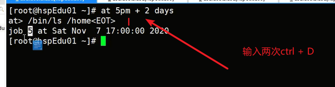

案例2：atq命令来查看系统中没有执行的工作任务

```sh
[root@localhost ~]$ atq
1	Fri May 14 17:00:00 2021 a root
```

案3：明天17点钟，输出时间到指定文件内比如/root/date100.log


案例4：2分钟后，输出时间到指定文件内比如/root/date200.log


案例5：删除已经设置的任务，`atrm 编号`

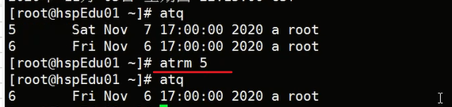

# 实操篇 Linux磁盘分区、挂载

## 分区基础知识

### 分区的方式：

+ 1）mbr分区：

  + 1 、最多支持四个主分区
  + 2 、系统只能安装在主分区
  + 3 、扩展分区要占一个主分区
  + 4 、MBR最大只支持2TB，但拥有最好的兼容性
+ 2）gtp分区：

  + 1.支持无限多个主分区（但操作系统可能限制，比如windows下最多128个分区）
  + 2最大支持18EB的大容量（EB-1024 PB，PB=1024 TB）
  + 3.windows7 64位以后支持gtp

### windows下的磁盘分区

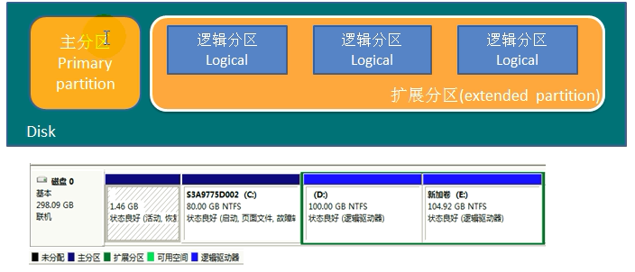

## Linux分区

### 原理介绍

1）Linux来说无论有几介分区，分给哪一目录使用，它归根结底就只有一个根目录，一个独立且唯一的文件结构，Linux中每个分区都是用来组成整个文件系统的一部分。

2）Linux 采用了一种叫“载入”的处理方法，它的整个文件系统中包含了一整套的文件和目录，且将一个分区和一个目录联系起来。这时要载入的一个分区将使它的存储空间在一个目录下获得。

3）示意图

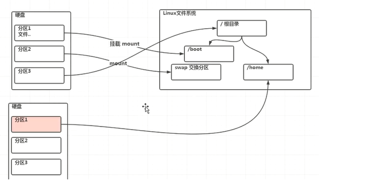

### 硬盘说明

1) Linux 硬盘分IDE 硬盘和SCSI 硬盘，目前**基本上是SCSI 硬盘**
2) 对于IDE 硬盘，驱动器标识符为“hdx~”,其中“hd”表明分区所在设备的类型，这里是指IDE 硬盘了。“x”为盘号（a 为基本盘，b 为基本从属盘，c 为辅助主盘，d 为辅助从属盘）,“~”代表分区，前四个分区用数字1 到4 表示，它们是主分区或扩展分区，从5 开始就是逻辑分区。例，`hda3` 表示为第一个IDE 硬盘上的第三个主分区或扩展分区,hdb2 表示为第二个IDE 硬盘上的第二个主分区或扩展分区。

3)对于 SCSI 硬盘则标识为“sdx~”，SCSI 硬盘是用“sd”来表示分区所在设备的类型的，其余则和IDE 硬盘的表示方法一样。

### 查看所有设备挂载情况

命令：`lsblk`  或者 `lsblk -f`

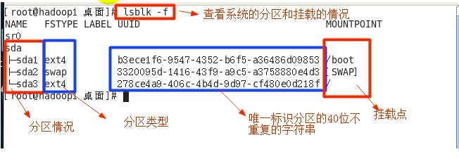

```sh
[root@hadoop1 ~]$ lsblk
NAME   MAJ:MIN RM  SIZE RO TYPE MOUNTPOINT
sr0     11:0    1  3.7G  0 rom  /media/CentOS_6.8_Final
sda      8:0    0   20G  0 disk 
├─sda1   8:1    0  200M  0 part /boot
├─sda2   8:2    0  200M  0 part [SWAP]
└─sda3   8:3    0 19.6G  0 part /
sdb      8:16   0    2G  0 disk 
└─sdb1   8:17   0  7.8M  0 part /home/newdisk
[root@hadoop1 ~]$ lsblk -f
NAME   FSTYPE  LABEL            UUID                                 MOUNTPOINT
sr0    iso9660 CentOS_6.8_Final                                      /media/CentOS_6.8_Final
sda                                                                
├─sda1 ext4                     9f45dd0f-024d-44ac-a9df-38997502b644 /boot
├─sda2 swap                     d064d64b-3707-423c-8e56-a49641b8da28 [SWAP]
└─sda3 ext4                     b4a0528d-056c-4294-a462-d1c5c10cadc1 /
sdb                                                                
└─sdb1 ext4                     a00e0f34-f5a9-49d9-91f9-d568ce722731 /home/newdisk
```

### 挂载文件的经典案例

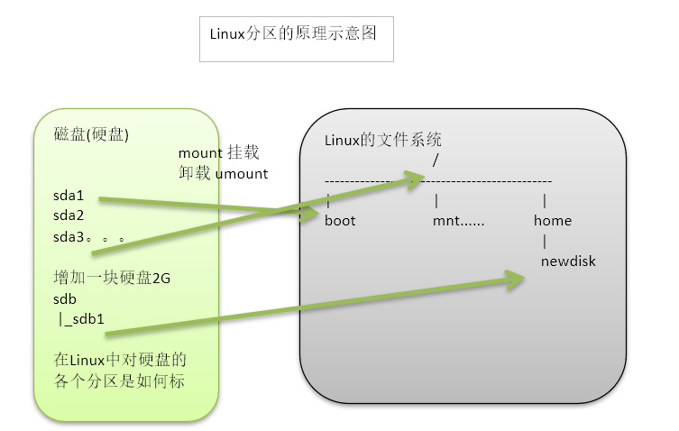

1) 虚拟机添加硬盘
2) 分区
3) 格式化
4) 挂载
5) 设置可以自动挂载。

> 描述：添加一块硬盘，分成两个区，分别挂载到/mnt/boot、/mnt/sysroot

#### 虚拟机增加硬盘步骤1   添加硬盘

在【虚拟机】菜单中，选择【设置】，然后设备列表里添加硬盘，然后一路【下一步】，中间只有选择磁盘大小的地方需要修改，至到完成。然后**重启系统（才能识别）！**

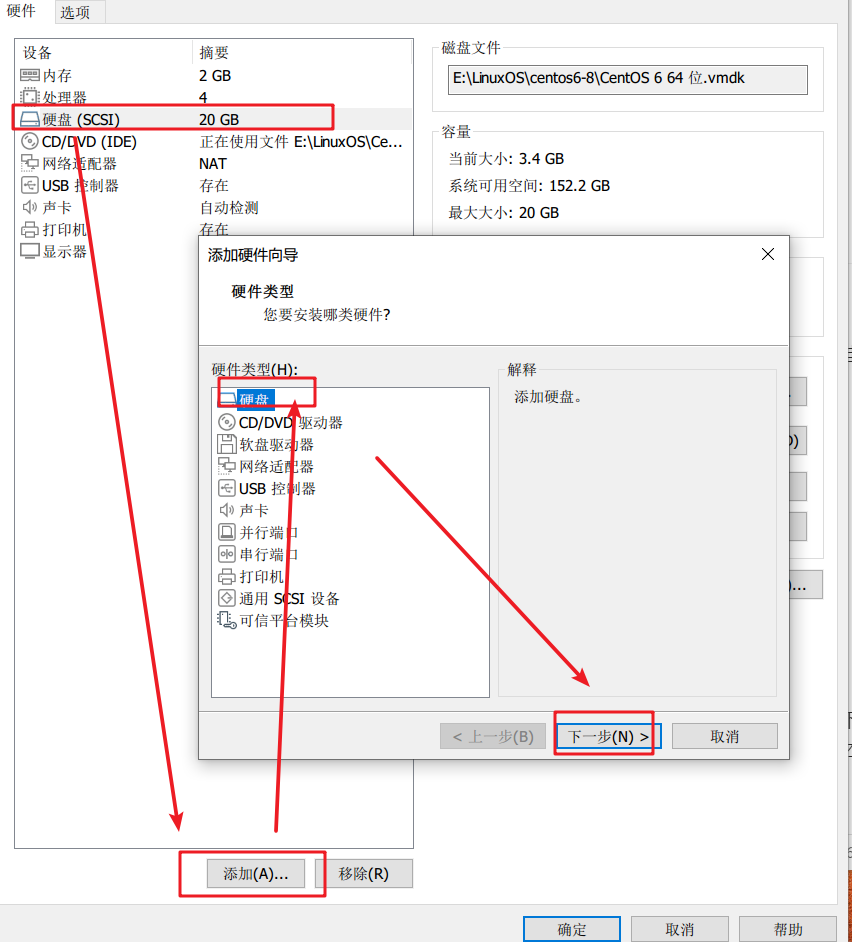

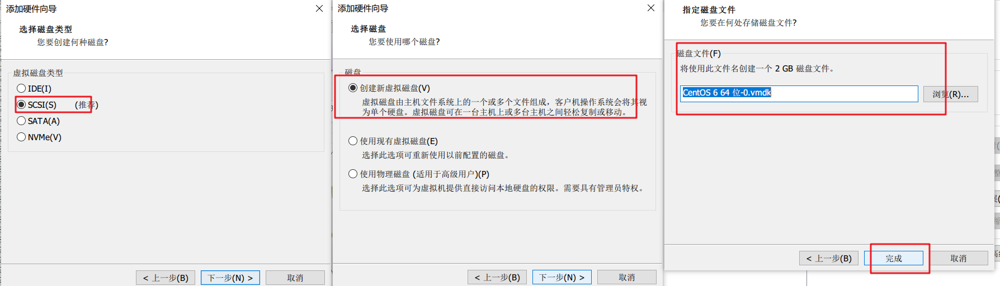

```sh
[root@localhost ~]# lsblk
NAME            MAJ:MIN RM SIZE RO TYPE MOUNTPOINT
sda               8:0    0  20G  0 disk 
├─sda1            8:1    0   1G  0 part /boot
└─sda2            8:2    0  19G  0 part 
  ├─centos-root 253:0    0  17G  0 lvm  /
  └─centos-swap 253:1    0   2G  0 lvm  [SWAP]
sdb               8:16   0  20G  0 disk   # 新添加的硬盘名称
```

#### 虚拟机增加硬盘步骤2  --分区

分区命令 `fdisk /dev/sdb`

开始对 `/sdb`分区

    •	m   显示命令列表
    •	p    显示磁盘分区同`fdisk  –l`
    •	n    新增分区
    •	d     删除分区
    •	w   写入并退出

说明：开始分区后输入n，新增分区，然后选择p ，分区类型为主分区。两次回车默认剩余全部空间。最后输入w写入分区并退出，若不保存退出输入q。

```sh
# 对新添加的硬盘sdb进行
[root@hadoop1 ~]$ fdisk /dev/sdb
Device contains neither a valid DOS partition table, nor Sun, SGI or OSF disklabel
Building a new DOS disklabel with disk identifier 0xe0f7e259.
Changes will remain in memory only, until you decide to write them.
After that, of course, the previous content won't be recoverable.

Warning: invalid flag 0x0000 of partition table 4 will be corrected by w(rite)

WARNING: DOS-compatible mode is deprecated. It's strongly recommended to
         switch off the mode (command 'c') and change display units to
         sectors (command 'u').

Command (m for help): m  # 显示帮助
Command action
   a   toggle a bootable flag
   b   edit bsd disklabel
   c   toggle the dos compatibility flag
   d   delete a partition
   l   list known partition types
   m   print this menu
   n   add a new partition
   o   create a new empty DOS partition table
   p   print the partition table
   q   quit without saving changes
   s   create a new empty Sun disklabel
   t   change a partition's system id
   u   change display/entry units
   v   verify the partition table
   w   write table to disk and exit
   x   extra functionality (experts only)

Command (m for help): n
Command action
   e   extended
   p   primary partition (1-4)
p   # 输入p
Partition number (1-4): 1
First cylinder (1-261, default 1): 
Using default value 1
Last cylinder, +cylinders or +size{K,M,G} (1-261, default 261): 
Using default value 261

Command (m for help): w   # write table to disk and exit
The partition table has been altered!

Calling ioctl() to re-read partition table.
Syncing disks.
```

```sh
[root@localhost ~]$ lsblk
NAME            MAJ:MIN RM  SIZE RO TYPE MOUNTPOINT
sda               8:0    0   20G  0 disk 
├─sda1            8:1    0    1G  0 part /boot
└─sda2            8:2    0   19G  0 part 
  ├─centos-root 253:0    0   17G  0 lvm  /
  └─centos-swap 253:1    0    2G  0 lvm  [SWAP]
sdb               8:16   0   20G  0 disk 
├─sdb1            8:17   0 19.5G  0 part 
└─sdb2            8:18   0  499M  0 part 
# 将sdb硬盘分成sdb1  sdb2两个分区
```

#### 虚拟机增加硬盘步骤3  --格式化

格式化磁盘
分区命令:`mkfs -t  ext4   /dev/sdb1`

其中ext4是分区类型

```sh
# 对sdb1分区格式化
[root@localhost ~]$ mkfs -t  ext4   /dev/sdb1
mke2fs 1.42.9 (28-Dec-2013)
文件系统标签=
OS type: Linux
块大小=4096 (log=2)
分块大小=4096 (log=2)
Stride=0 blocks, Stripe width=0 blocks
1281120 inodes, 5114880 blocks
255744 blocks (5.00%) reserved for the super user
第一个数据块=0
Maximum filesystem blocks=2153775104
157 block groups
32768 blocks per group, 32768 fragments per group
8160 inodes per group
Superblock backups stored on blocks: 
	32768, 98304, 163840, 229376, 294912, 819200, 884736, 1605632, 2654208, 
	4096000

Allocating group tables: 完成                          
正在写入inode表: 完成                          
Creating journal (32768 blocks): 完成
Writing superblocks and filesystem accounting information: 完成   
# 对sdb2分区格式化
[root@localhost ~]$ mkfs -t  ext4   /dev/sdb2
mke2fs 1.42.9 (28-Dec-2013)
文件系统标签=
OS type: Linux
块大小=1024 (log=0)
分块大小=1024 (log=0)
Stride=0 blocks, Stripe width=0 blocks
128016 inodes, 510976 blocks
25548 blocks (5.00%) reserved for the super user
第一个数据块=1
Maximum filesystem blocks=34078720
63 block groups
8192 blocks per group, 8192 fragments per group
2032 inodes per group
Superblock backups stored on blocks: 
	8193, 24577, 40961, 57345, 73729, 204801, 221185, 401409

Allocating group tables: 完成                          
正在写入inode表: 完成                          
Creating journal (8192 blocks): 完成
Writing superblocks and filesystem accounting information: 完成 
[root@hadoop1 ~]$ 
```

校验格式化成功：生成uuid

```sh
[root@hadoop1 home]$ lsblk -f

NAME            FSTYPE      LABEL UUID                                   MOUNTPOINT
sda                                                                    
├─sda1          xfs               ddfa3e72-23ae-4fcc-b6f9-227a4fc80e55   /boot
└─sda2          LVM2_member       C8E352-asFy-tsKh-3HvL-ys83-023e-33bOWz 
  ├─centos-root xfs               1ef423ff-a5fe-4e54-bf3a-0c3fe707ca6a   /
  └─centos-swap swap              a61c857f-d418-4041-846b-059dd5c96f06   [SWAP]
sdb                                                                    
├─sdb1          ext4              f6fe40a2-9912-4bc3-a034-22f06992af36   
└─sdb2          ext4              2efa9170-bafb-4cb1-8faa-f9d88d4bd195  
```

#### 虚拟机增加硬盘步骤4  --挂载

挂载: 将一个分区与一个目录联系起来，

•	mount    设备名称 挂载目录
			例如：`mount  /dev/sdb1  /newdisk`
•	umount 设备名称或者 挂载目录
			例如： `umount /dev/sdb1 或者umount /newdisk`
用命令行挂载重启后会失效

```sh
[root@hadoop1 home]$ mkdir -p /mnt/boot /mnt/sysroot   #创建文件
[root@localhost ~]$ mount  /dev/sdb2  /mnt/boot  #将sdb2分区挂载到/mnt/boot
[root@localhost ~]$ mount  /dev/sdb1  /mnt/sysroot #将sdb1分区挂载到/mnt/sysroot
[root@localhost ~]$ lsblk
NAME            MAJ:MIN RM  SIZE RO TYPE MOUNTPOINT
sda               8:0    0   20G  0 disk 
├─sda1            8:1    0    1G  0 part /boot
└─sda2            8:2    0   19G  0 part 
  ├─centos-root 253:0    0   17G  0 lvm  /
  └─centos-swap 253:1    0    2G  0 lvm  [SWAP]
sdb               8:16   0   20G  0 disk 
├─sdb1            8:17   0 19.5G  0 part /mnt/sysroot
└─sdb2            8:18   0  499M  0 part /mnt/boot
```

#### 虚拟机增加硬盘步骤5  --永久挂载

永久挂载: 通过 `修改/etc/fstab`实现挂载添加完成后执行 `mount –a` 即刻生效

`vim /etc/fstab`

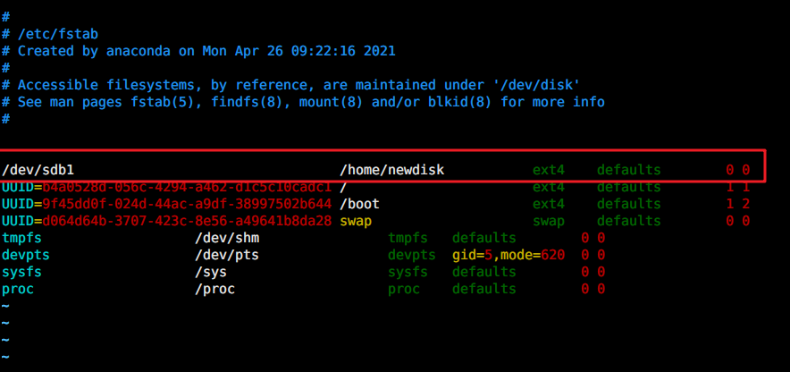

`mount   –a `

## 磁盘情况查询

### 查询系统整体磁盘使用情况

•	基本语法 `df -h`
•	应用实例

查询系统整体磁盘使用情况

```sh
[root@hadoop1 home]$ df -h
Filesystem      Size  Used Avail Use% Mounted on
/dev/sda3        20G  3.7G   15G  20% /
tmpfs           931M   72K  931M   1% /dev/shm
/dev/sda1       190M   75M  105M  42% /boot
.host:/          50G   21G   30G  41% /mnt/hgfs
/dev/sdb1       2.0G  3.0M  1.9G   1% /home/newdisk
```

### 查询指定目录的磁盘占用情况

基本语法

`du -h  /目录`
查询指定目录的磁盘占用情况，默认为当前目录

```
-s 指定目录占用大小汇总
-h 带计量单位
-a 含文件
--max-depth=1  子目录深度
-c 列出明细的同时，增加汇总值
```

+ 应用实例
  查询/opt 目录的磁盘占用情况，深度为1

```sh
[root@hadoop1 home]$ du -axh --max-depth=1 /opt
24K	/opt/temp
163M	/opt/vmware-tools-distrib
74M	/opt/firefox-45.0.1-1.el6.centos.x86_64.rpm
4.0K	/opt/rh
24K	/opt/home
54M	/opt/VMwareTools-10.3.22-15902021.tar.gz
290M	/opt
```

### 磁盘情况-工作实用指令

1) 统计/home文件夹下文件的个数

[ grep   匹配到开头是- 表示文件]      [`wc -l` 统计个数]

```sh
[root@hadoop1 home]$ ls -l /home |grep '^-' |wc -l
12
```

2) 统计/home文件夹下目录的个数

```sh
ls -l /home |grep '^d' |wc -l
```

3) 统计/home文件夹下文件的个数，包括子文件夹里的

```sh
ls -lR /home |grep '^-' |wc -l
```

4) 统计文件夹下目录的个数，包括子文件夹里的

```sh
ls -lR /home |grep '^d' |wc -l
```

5) 以树状显示目录结构

【https://segmentfault.com/a/1190000039199938】yum命令报错参考

```sh
[root@hadoop1 home]$ yum install tree

tree
```

# 实操篇 网络配置

## Linux 网络配置原理图(含虚拟机)

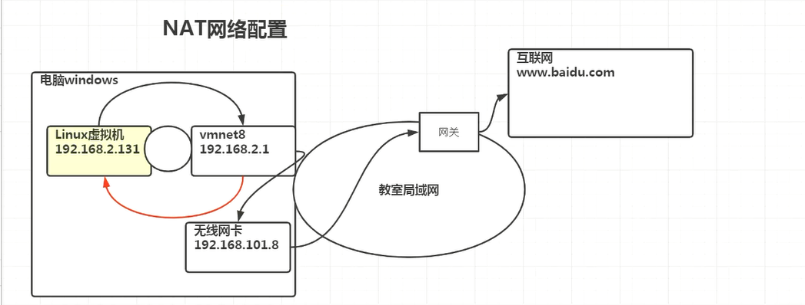

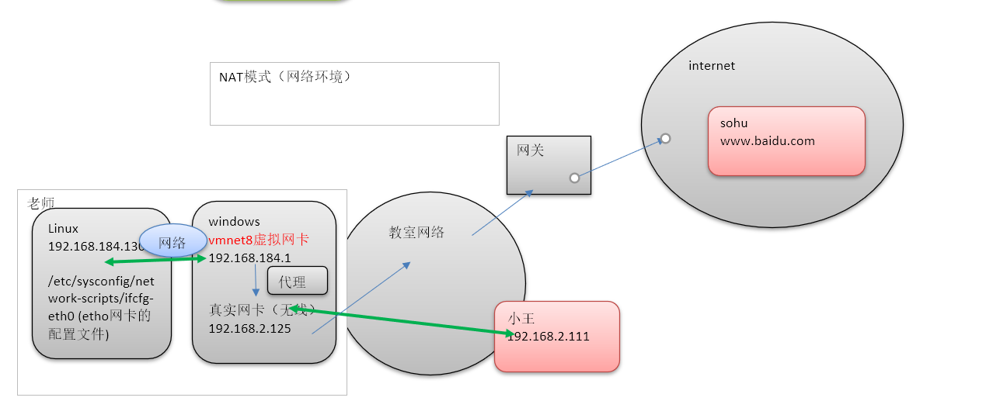

## 查看ip和网关

### 查看虚拟网络编辑器

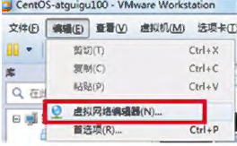

### 修改ip 地址(修改虚拟网络的ip)

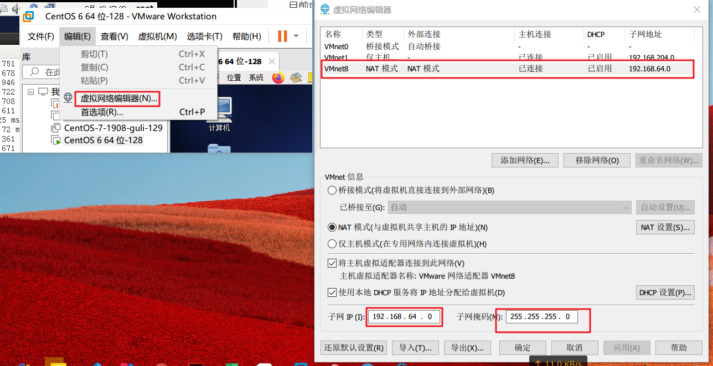

### 查看网关

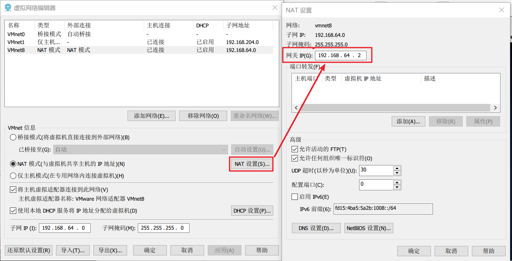

### 查看windows环境的中VMnet8网络配置(`ipconfig`指令)

界面查看

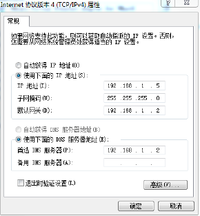

命令查看

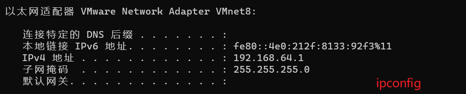

### linux 中ip查看 `ifconfig`

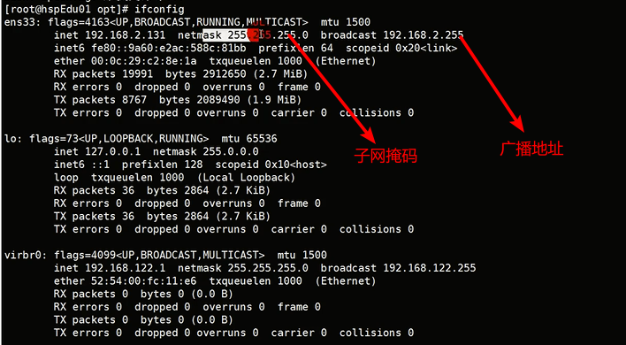

## ping 测试主机之间网络连通性

基本语法
`ping 目的主机` （功能描述：测试当前服务器是否可以连接目的主机）
应用实例
测试当前服务器是否可以连接百度

```
[root@hadoop100 桌面]# ping www.baidu.com
```

## linux网络环境配置

### 第一种方法(自动获取)：

说明：登陆后，通过界面的来设置自动获取ip

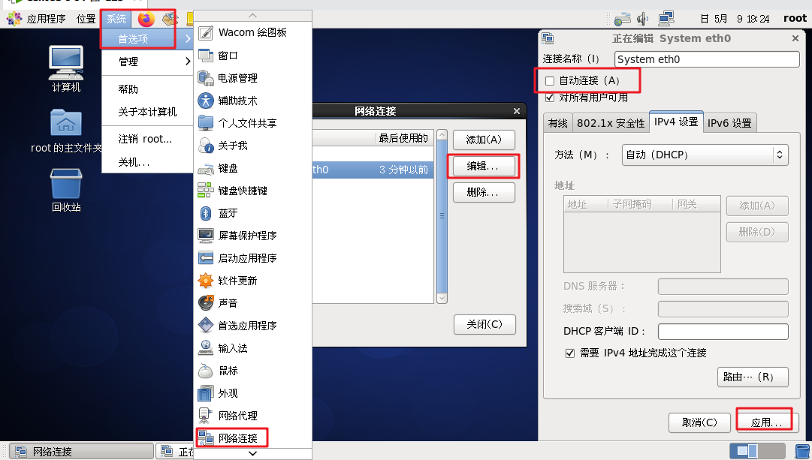

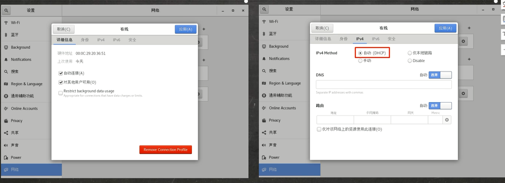

缺点: linux 启动后会自动获取 IP,缺点是每次自动获取的 ip 地址可能不一样。这个不适用于做服务器，因为我们的服务器的 ip 需要时固定的。

### 第二种方法(指定固定的ip)

说明
直接修改配置文件来指定IP,并可以连接到外网(程序员推荐)，编辑

```sh
#centos6
vi /etc/sysconfig/network-scripts/ifcfg-eth0

#centos7
vim /etc/sysconfig/network-scripts/ifcfg-ens33
```

要求：将ip地址配置的静态的，ip地址为192.168.184.130    【前提：修改虚拟机虚拟的网卡网段】

```sh
vi /etc/sysconfig/network-scripts/ifcfg-eth0
```

•	ifcfg-eth0文件说明

```sh
DEVICE=eth0                #接口名（设备,网卡）
HWADDR=00:0C:2x:6x:0x:xx   #MAC地址
TYPE=Ethernet               #网络类型（通常是Ethemet）
UUID=926a57ba-92c6-4231-bacb-f27e5e6a9f44  #随机id
#系统启动的时候网络接口是否有效（yes/no）
ONBOOT=yes
# IP的配置方法[none|static|bootp|dhcp]（引导时不使用协议|静态分配IP|BOOTP协议|DHCP协议） 
BOOTPROTO=static
#IP地址
IPADDR=192.168.184.130
#网关
GATEWAY=192.168.184.2
#域名解析器
DNS1=192.168.184.2

```

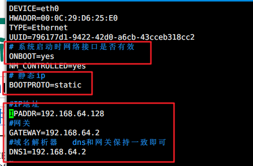

重启网络服务或者重启系统生效
`service  network restart` 【重启网络服务】 、`reboot`[重启]

### ip设置脚本

**ip-dhcp**脚本

```sh
cat <<EOF > /etc/sysconfig/network-scripts/ifcfg-ens33
OXY_METHOD=none
BROWSER_ONLY=no
DEFROUTE=yes
IPV4_FAILURE_FATAL=no
IPV6INIT=yes
IPV6_AUTOCONF=yes
IPV6_DEFROUTE=yes
IPV6_FAILURE_FATAL=no
IPV6_ADDR_GEN_MODE=stable-privacy
NAME=ens33
UUID=ca4c1b0d-43b5-465e-9240-a3dec871ce67
DEVICE=ens33

ONBOOT=yes

BOOTPROTO=dhcp
EOF

systemctl restart network
```

**ip-static**脚本

```sh
read -p "ip: " ip1

cat <<EOF > /etc/sysconfig/network-scripts/ifcfg-ens33
OXY_METHOD=none
BROWSER_ONLY=no
DEFROUTE=yes
IPV4_FAILURE_FATAL=no
IPV6INIT=yes
IPV6_AUTOCONF=yes
IPV6_DEFROUTE=yes
IPV6_FAILURE_FATAL=no
IPV6_ADDR_GEN_MODE=stable-privacy
NAME=ens33
UUID=ca4c1b0d-43b5-465e-9240-a3dec871ce67
DEVICE=ens33
# 开机自启
ONBOOT=yes

# BOOTPROTO=dhcp 静态ip
BOOTPROTO=static
IPADDR=$ip1
NETMASK=255.255.255.0
GATEWAY=192.168.64.2
DNS1=114.114.114.114
EOF

systemctl restart network
```

## 设置主机名和hosts映射

### 设置主机名

1，为了方便记忆，可以给linux系统 置主机名，也可以根据需要修改主机名

2，指令 `hostname`：查看主机名

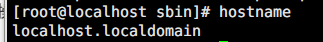

3·修改文件在 `vim /etc/hostname`指定

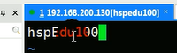

4，修改后，重启【`reboot`】生效

### 设置hosts射

思考：如何通过主机名能够找到（比如ping）某个linux系统？

+ windows

  + 在 `C:\Windows\System32\drivers\etc\hosts`文件指定即可
    案例：`192.168.200.130  hspedu100`
+ linux

  + 在 `/etc/hosts`文件指定
    案例：`192.168.200.1  ThinkPad-PC`【我的电脑  右键 管理  计算机名】

### 主机名解析过程分析（Hosts，DNS）

+ Hosts是什么
  一个文本文件，用来记录IP和Hostname（主机名）的映射关系
+ DNS

  1、DNS，就是Domain Name System的缩写，翻译过来就是**域名系统**

  2、是互联网上作为域名和IP地址相互映射的一个分布式数据库

**主机名解析机制分析（Hosts，DNS）**

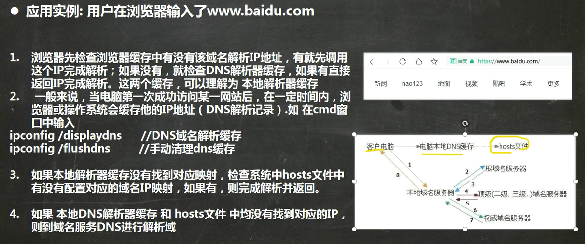

## 虚拟机网络问题排查

https://blog.csdn.net/qq_35024768/article/details/121196596

# 实操篇 进程管理(重点)

## 基本介绍

1) 在LINUX中，每个执行的程序（代码）都称为一个进程。每一个进程都分配一个ID号。
2) 每一个进程，都会对应一个父进程，而这个父进程可以复制多个子进程。例如www服务器。
3) 每个进程都可能以两种方式存在的。前台与后台，所谓前台进程就是用户目前的屏幕上可以进行操作的。后台进程则是实际在操作，但由于屏幕上无法看到的进程，通常使用后台方式执行。
4) 一般系统的服务都是以后台进程的方式存在，而且都会常驻在系统中。直到关机才才结束。

## 显示系统执行的进程 ps

### 基本介绍

`ps`命令是用来查看目前系统中，有哪些正在执行，以及它们执行的状况。可以不加任何参数.

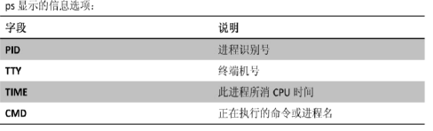


### ps详解

1) 指令：`ps –aux|grep xxx` ，比如我看看有没有sshd服务 `ps -aux | grep sshd`
2) 指令说明
   •	System V展示风格
   •	USER：用户名称
   •	PID：进程号
   •	%CPU：进程占用CPU的百分比
   •	%MEM：进程占用物理内存的百分比
   •	VSZ：进程占用的虚拟内存大小（单位：KB）
   •	RSS：进程占用的物理内存大小（单位：KB）
   •	TT：终端名称,缩写.
   •	STAT：进程状态，其中S-睡眠，s-表示该进程是会话的先导进程，N-表示进程拥有比普通优先级更低的优先级，R-正在运行，D-短期等待，Z-僵死进程，T-被跟踪或者被停止等等
   •	STARTED：进程的启动时间
   •	TIME：CPU时间，即进程使用CPU的总时间
   •	COMMAND：启动进程所用的命令和参数，如果过长会被截断显示

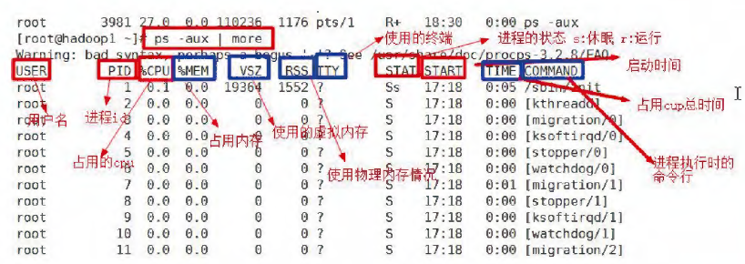

### 应用实例

要求：以全格式显示当前所有的进程，查看进程的父进程。

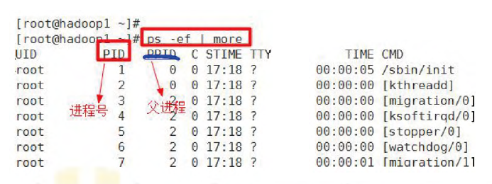•	`ps -ef`是以全格式显示当前所有的进程
•	`-e` 显示所有进程。`-f` 全格式。
•	`ps -ef|grep xxx`
	•	是BSD风格
	•	UID：用户ID
	•	PID：进程ID
	•	PPID：父进程ID
	•	C：CPU用于计算执行优先级的因子。数值越大，表明进程是CPU密集型运算，执行优先级会降低；数值越小，表明进程是I/O密集型运算，执行优先级会提高
	•	STIME：进程启动的时间
	•	TTY：完整的终端名称
	•	TIME：CPU时间
	•	CMD：启动进程所用的命令和参数

思考题，如果我们希望查看sshd 进程的父进程号是多少，应该怎样查询？

```sh
[root@hadoop1 home]$ ps -ef | grep sshd
UID         PID   PPID  C STIME TTY          TIME CMD
root      19276      1  0 21:56 ?        00:00:00 /usr/sbin/sshd
root      21303  19276  0 21:58 ?        00:00:00 sshd: root@pts/0 
root      21408  21307  0 22:44 pts/0    00:00:00 grep sshd
```

## 终止进程kill和killall

### 介绍:

若是某个进程执行一半需要停止时，或是已消了很大的系统资源时，此时可以考虑停止该进程。使用kill命令来完成此项任务。

### 基本语法：

`kill  [选项] 进程号`（功能描述：通过进程号杀死进程）
`killall 进程名称` （功能描述：通过进程名称杀死进程，也支持通配符，这在系统因负载过大而变得很慢时很有用）

+ 常用选项：
  `-9 :表示强迫进程立即停止`

### 最佳实践：

案例1：踢掉某个非法登录用户

```sh
[root@hadoop1 home]$ ps -ef | grep sshd
root      19276      1  0 21:56 ?        00:00:00 /usr/sbin/sshd
root      21303  19276  0 21:58 ?        00:00:00 sshd: root@pts/0 
root      21411  19276  2 22:46 ?        00:00:00 sshd: jack [priv]
jack      21415  21411  0 22:46 ?        00:00:00 sshd: jack@pts/1 
root      21440  21307  0 22:46 pts/0    00:00:00 grep sshd
[root@hadoop1 home]$ kill 21415
[root@hadoop1 home]$ kill 21415
-bash: kill: (21415) - 没有那个进程
[root@hadoop1 home]$ ps -ef | grep sshd
root      19276      1  0 21:56 ?        00:00:00 /usr/sbin/sshd
root      21303  19276  0 21:58 ?        00:00:00 sshd: root@pts/0 
root      21442  21307  0 22:47 pts/0    00:00:00 grep sshd
```

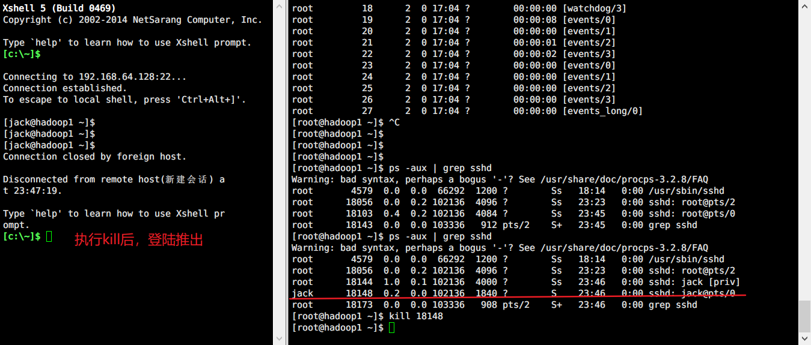

案例2: 终止远程登录服务sshd, 在适当时候再次重启sshd服务

```sh
bash-4.1$ ps -ef | grep sshd
root      21303      1  0 21:58 ?        00:00:00 sshd: root@pts/0 
root      21922  21919  0 22:49 pts/1    00:00:00 grep sshd
bash-4.1$ kill 21303
bash-4.1$ service sshd start  # 重启sshd服务
```

案例3: 终止多个gedit 编辑器

```sh
killall gedit 
```

案例4：强制杀掉一个终端

```sh
bash-4.1# ps -ef | grep bash
root      21919  21917  0 22:49 pts/1    00:00:00 /bin/bash
root      21963  21959  0 22:50 pts/0    00:00:00 -bash
root      21987  21917  0 22:52 pts/2    00:00:00 /bin/bash
root      21989  21919  0 22:52 pts/1    00:00:00 grep bash
bash-4.1# kill -9 21919

```

### 查看进程树pstree

+ 基本语法：
  `pstree [选项]` ,可以更加直观的来看进程信息
+ 常用选项：

```
-p :显示进程的PID
-u :显示进程的所属用户
```

应用实例：

案例1：请你树状的形式显示进程的pid

```sh
[root@hadoop1 ~]$ pstree
init─┬─NetworkManager
     ├─VGAuthService
   
     ├─abrtd
     ├─acpid
     ├─atd
     ├─auditd───{auditd}
     ├─bonobo-activati───{bonobo-activat}
     ├─clock-applet
     ├─console-kit-dae───63*[{console-kit-da}]
     ├─crond
     ├─cupsd
     ├─2*[dbus-daemon───{dbus-daemon}]
     ├─2*[dbus-launch]
```

案例2：请你树状的形式进程的用户id

`pstree -u`

## 服务(service)管理

### 介绍:

服务(service) 本质就是进程，但是是运行在后台的，通常都会监听某个端口，等待其它程序的请求，比如(mysql , sshd  防火墙等)，因此我们又称为守护进程，是Linux中非常重要的知识点。【原理图】

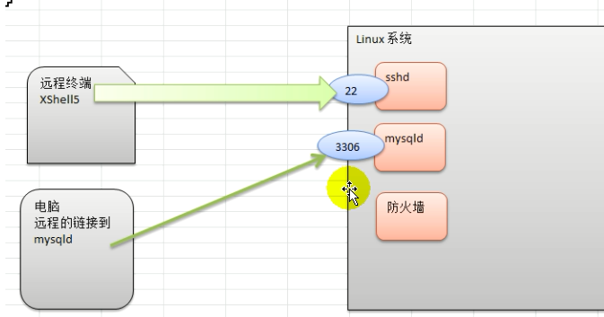

### service管理指令：

`service  服务名 [start | stop | restart | reload | status]`

> 在CentOS7.0后不再使用service ,而是systemctl，后面专门讲

> service指令管理的服务在 `/etc/init.d`查看
>
> 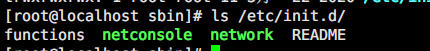

使用案例：

1) （centos6     7以后防火墙被systemctl管理）查看当前防火墙的状况，关闭防火墙和重启防火墙。[防火墙服务名：iptables]

```sh
[root@hadoop1 ~]$ service iptables status
表格：filter
Chain INPUT (policy ACCEPT)
num  target     prot opt source               destination       
1    ACCEPT     all  --  0.0.0.0/0            0.0.0.0/0           state RELATED,ESTABLISHED 
2    ACCEPT     icmp --  0.0.0.0/0            0.0.0.0/0         
3    ACCEPT     all  --  0.0.0.0/0            0.0.0.0/0         
4    ACCEPT     tcp  --  0.0.0.0/0            0.0.0.0/0           state NEW tcp dpt:22 
5    REJECT     all  --  0.0.0.0/0            0.0.0.0/0           reject-with icmp-host-prohibited 

Chain FORWARD (policy ACCEPT)
num  target     prot opt source               destination       
1    REJECT     all  --  0.0.0.0/0            0.0.0.0/0           reject-with icmp-host-prohibited 

Chain OUTPUT (policy ACCEPT)
num  target     prot opt source               destination       

[root@hadoop1 ~]$ service iptables stop
iptables：将链设置为政策 ACCEPT：filter                    [确定]
iptables：清除防火墙规则：                                 [确定]
iptables：正在卸载模块：                                   [确定]
[root@hadoop1 ~]$ service iptables status
iptables：未运行防火墙。
[root@hadoop1 ~]$ service iptables start
iptables：应用防火墙规则：                                 [确定]
[root@hadoop1 ~]$ service iptables status
表格：filter
Chain INPUT (policy ACCEPT)
num  target     prot opt source               destination       
1    ACCEPT     all  --  0.0.0.0/0            0.0.0.0/0           state RELATED,ESTABLISHED 
2    ACCEPT     icmp --  0.0.0.0/0            0.0.0.0/0         
3    ACCEPT     all  --  0.0.0.0/0            0.0.0.0/0         
4    ACCEPT     tcp  --  0.0.0.0/0            0.0.0.0/0           state NEW tcp dpt:22 
5    REJECT     all  --  0.0.0.0/0            0.0.0.0/0           reject-with icmp-host-prohibited 

Chain FORWARD (policy ACCEPT)
num  target     prot opt source               destination       
1    REJECT     all  --  0.0.0.0/0            0.0.0.0/0           reject-with icmp-host-prohibited 

Chain OUTPUT (policy ACCEPT)
num  target     prot opt source               destination       

[root@hadoop1 ~]$ 
```

centos7演示

请使用service指令，查看，关闭，启动network[注意：在虚拟系统演示，因为网络连接会关闭]

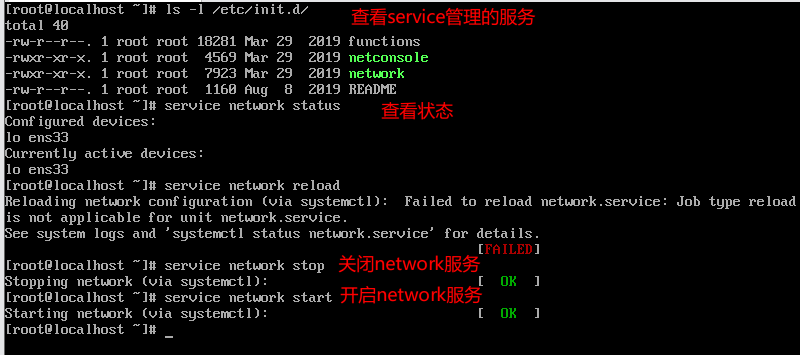

细节讨论：

1) 关闭或者启用防火墙后，立即生效。[`telnet 测试 某个端口即可`]

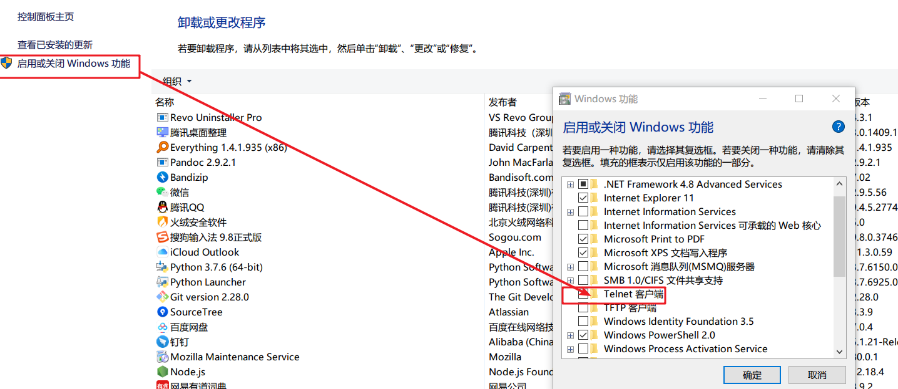

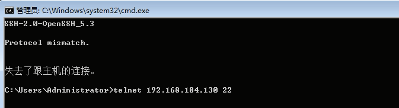

2) 这种方式只是临时生效，当重启系统后，还是回归以前对服务的设置。
3) 如果希望设置某个服务自启动或关闭永久生效，要使用chkconfig指令，马上讲。

### 查看服务名:

+ 方式1：使用setup -> 系统服务就可以看到。

  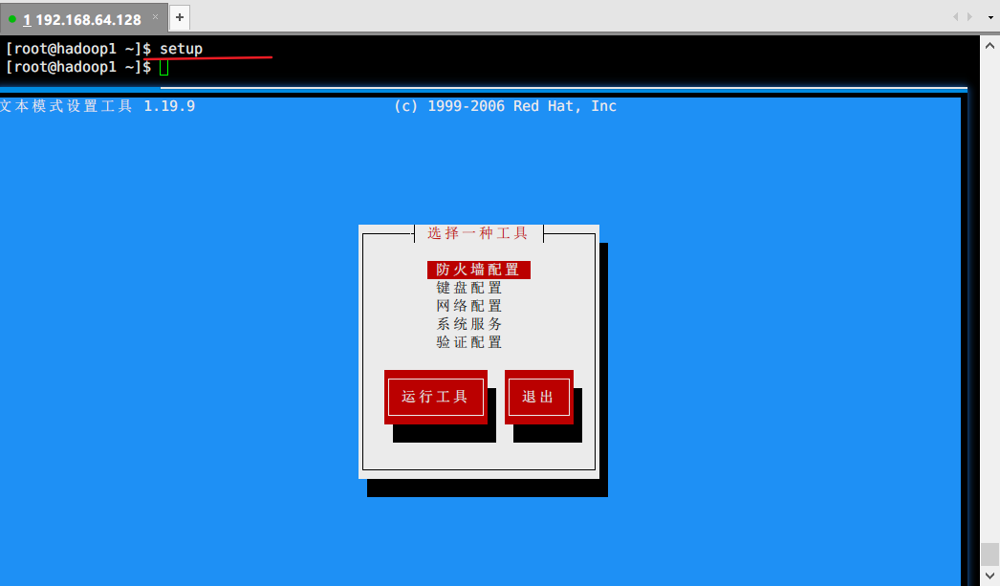

  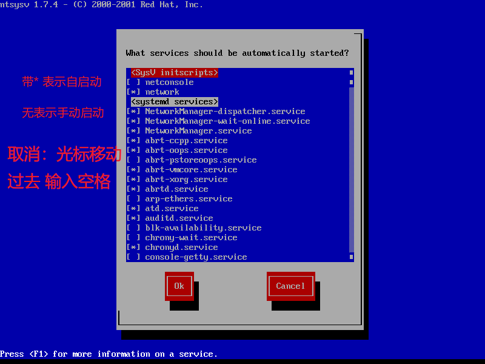
+ 方式2:   /etc/init.d/服务名称   在7.0中只能查看部分

  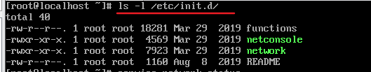

### 服务的运行级别(runlevel):

查看或者修改默认级别： `vi /etc/inittab`
Linux系统有7种运行级别(runlevel)：`常用的是级别3和5`

•	运行级别0：系统停机状态，系统默认运行级别不能设为0，否则不能正常启动
•	运行级别1：单用户工作状态，root权限，用于系统维护，禁止远程登陆
•	运行级别2：多用户状态(没有NFS)，不支持网络
•	运行级别3：完全的多用户状态(有NFS)，无界面，登陆后进入控制台命令行模式
•	运行级别4：系统未使用，保留
•	运行级别5：X11控制台，登陆后进入图形GUI模式
•	运行级别6：系统正常关闭并重启，默认运行级别不能设为6，否则不能正常启动

开机的流程说明：


> 思考题
> 如果不小心将默认的运行级别设置成 0 或者7 ，怎么处理？进入单用户模式，修改成正常的即可。。。

**CentOS7后运行级别说明**
在/etc/initab进行了简化，如下：

`multi-user.targe：analogous to runlevel 3`   命令行界面
`graphical.targe：analogous to runlevel 5 `     图形化界面

```sh
#查看当前运行级别，run：
systemctl get-default

#设置当前运行级别，run：
systemctl set-default TARGET.target    # 3
systemctl set-default graphical.targe  # 5
```

### chkconfig指令

•	介绍

+ 通过chkconfig命令可以给服务的各个运行级别设置自启动/关闭
+ chkconfig指令管理的服务在 `/etc/init.d`查看
+ 注意：Centos7.0后，很多服务 `使用systemctl` 管理（后面马上讲）

•	基本语法

1) 查看服务 `chkconfig --list|grep  xxx`

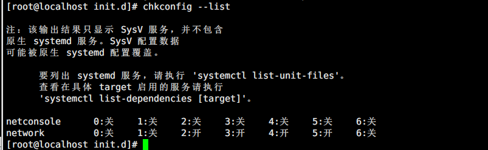

2) `chkconfig   服务名 --list`


3) `chkconfig   --level  5   服务名   on/off`

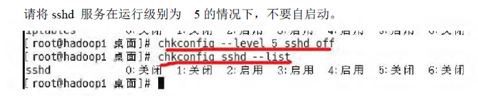

•	应用实例：

1) 案例1： 请显示当前系统所有服务的各个运行级别的运行状态

`chkconfig --list`

2) 案例2 ：请查看sshd服务的运行状态

`service sshd status`

3) 案例3： 将sshd 服务在运行级别5下设置为不自动启动，看看有什么效果？

`chkconfig --level 5 sshd off`

4) 案例4： 当运行级别为5时，关闭防火墙。

`chkconfig --level 5 iptables off`

5) 案例5： 在所有运行级别下，关闭防火墙

`chkconfig iptables off`

6) 案例6： 在所有运行级别下，开启防火墙

`chkconfig iptables on`

> 使用细节

> 1) chkconfig重新设置服务后自启动或关闭，需要重启机器reboot才能生效.

### systemctl管理指令

1、基本语法：`systemctl [start | stop | restart | status] 服务名`

2、systemctl指令**管理的服务**在 `/usr/lib/systemd/system`**查看**

**systemctl设置服务的自启动状态**
1.`systemctl list-unit-files [| grep 服务名]`（查看服务开机启动状态，grep可以进行过滤
2.`systemctl enable 服务名`（设置服务开机启动）【默认控制3.5级别】
3.`systemctl disable 服务名`（关闭服务开机启动）
4.`systemctl is-enabled 服务名`（查询某个服务是否是自启动的）
应用案例：查看当前防火墙的状况，关闭防火墙和重启防火墙。

```sh
# 查询防火墙的开机启动状态
[root@localhost system]$ systemctl list-unit-files | grep fire
firewalld.service                             enabled 

# 关闭防火墙
[root@localhost system]$ systemctl stop firewalld.service
# 开启防火墙
[root@localhost system]$ systemctl start firewalld.service

#查看防火墙服务状态
[root@localhost system]$ systemctl status firewalld.service
```

细节讨论：
1，关闭或者启用防火墙后，立即生效。[`telnet  测试某个端口`即可]，

2，这种方式只是临时生效，当重启系统后，还是回归以前对服务的设置。

3，如果希望设置某个服务自启动或关闭永久生效，要使用 `systemctl [enable|disable] 服务名`.

### 打开或者关闭指定端口firewall

在真正的生产环境，往往需要将防火墙打开，但问题来了，如果我们把防火墙打开，那么外部请求数据包就不能跟服务器监听端口通讯。这时，需要打开指定的端口。比如80，22，8080等，这个又怎么做呢？老韩给给大家讲一讲。[示意图]

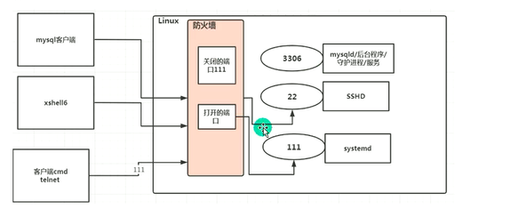

`firewall指令`：

```sh
# 打开端口：
firewall-cmd --permanent --add-port=端口号/协议

# 关闭端口：
firewall-cmd --permanent --remove-port=端口号/协议

# 重新载入，才能生效：
firewall-cmd --reload

# 查询端口是否开放：
firewall-cmd --query-port=端口/协议

# 补充 配置复杂规则
#开启防火墙
systemctl start firewalld
#重启防火墙
systemctl restart firewalld
#重载规则
firewall-cmd --reload
#查看已配置规则
firewall-cmd --list-all

#指定端口和ip访问  只允许指定ip访问 192.168.44.101 
firewall-cmd --permanent --add-rich-rule="rule family="ipv4" source address="192.168.44.101" port protocol="tcp" port="8080" accept"

#移除规则
firewall-cmd --permanent --remove-rich-rule="rule family="ipv4" source address="192.168.44.101" port port="8080" protocol="tcp" accept"
```

> 协议类型查询：`netstat -anp`
>
> 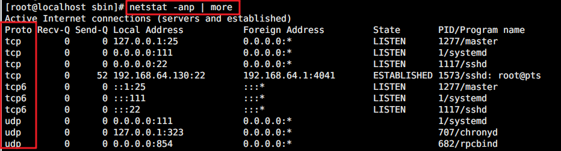

应用案例：

1.启用防火墙，测试111端口是否能telnet

```sh
# 查询防火墙服务,通过grep过滤出来
[root@localhost sbin]$ ls -l /usr/lib/systemd/system | grep fire
-rw-r--r--. 1 root root  657 8月   9 2019 firewalld.service

# 打开防火墙
[root@localhost sbin]$ systemctl start firewalld

# 查询防火墙服务状态
[root@localhost sbin]$ systemctl status firewalld
● firewalld.service - firewalld - dynamic firewall daemon
   Loaded: loaded (/usr/lib/systemd/system/firewalld.service; enabled; vendor preset: enabled)
   Active: active (running) since 三 2021-05-12 00:04:05 CST; 27min ago

# 查询111端口是否开发
[root@localhost sbin]$ firewall-cmd --query-port=111/tcp
no
```

Windows测试


2.开放111端口

```sh
# 开放111端口
[root@localhost sbin]$ firewall-cmd --permanent --add-port=111/tcp
success

# 未reload查询111端口no
[root@localhost sbin]$ firewall-cmd --query-port=111/tcp
no

# 重新载入，才能生效
[root@localhost sbin]$ firewall-cmd --reload
success

# 查询111端口
[root@localhost sbin]$ firewall-cmd --query-port=111/tcp
yes
```

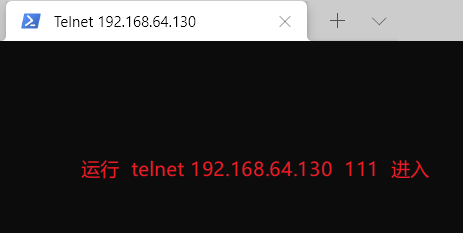

3.再次关闭111端口

```sh
# 关闭端口
[root@localhost sbin]$ firewall-cmd --permanent --remove-port=111/tcp
success
# 未reload查询状态
[root@localhost sbin]$ firewall-cmd --query-port=111/tcp
yes

# reload
[root@localhost sbin]$ firewall-cmd --reload
success

# 查询111端口
[root@localhost sbin]$ firewall-cmd --query-port=111/tcp
no
```


## 动态监控进程top

### 介绍：

top与ps命令很相似。它们都用来显示正在执行的进程。Top与ps最大的不同之处，在于top在执行一段时间可以更新正在运行的的进程。

### 基本语法：

`top [选项]`
选项说明：


交互操作说明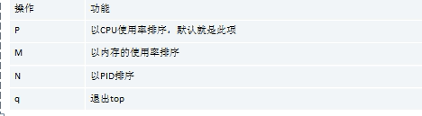

### 应用实例：

案例1.监视特定用户
**top：输入此命令，按回车键**，查看执行的进程。 u：**然后输入“u”回车，再输入用户名**，即可

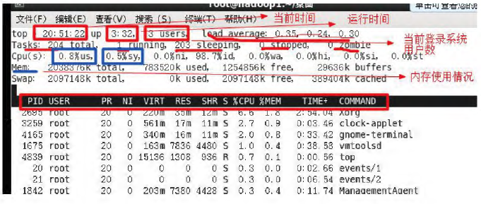

案例2：终止指定的进程。
top：输入此命令，按回车键，查看执行的进程。 k：然后输入“k”回车，再输入要结束的进程ID号

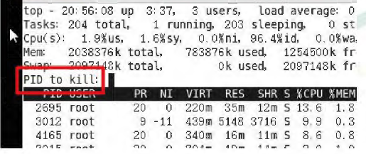

案例3:指定系统状态更新的时间(每隔10秒自动更新)：

`top -d 10`

## 监控网络状态netstat

### 查看系统网络情况netstat

•	基本语法
`netstat [选项]`
•	选项说明

```sh
-an  按一定顺序排列输出
-p  显示哪个进程在调用
```

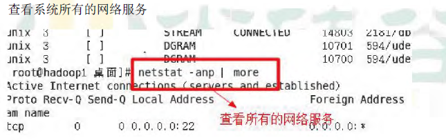

应用案例

请查看服务名为sshd 的服务的信息。

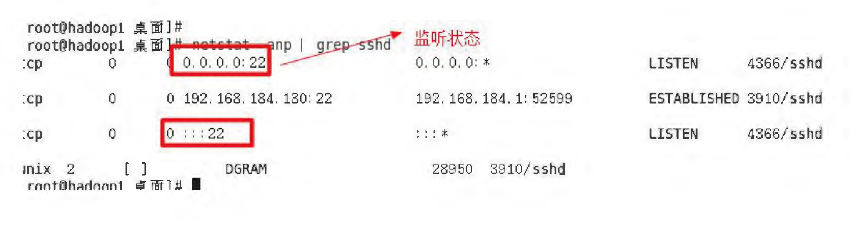

### 检测主机连接命令ping：

是一种网络检测检测工具，它主要是用阿检测远程主机是否正常，或是两部主机间的介质是否为断、网线是否脱落或网卡故障。
如: ping 对方ip地址

# 实操篇 RPM 与 YUM

## rpm包的管理

### 介绍：

一种用于互联网下载包的打包及安装工具，它包含在某些Linux分发版中。它生成具有.RPM扩展名的文件。RPM是RedHat Package Manager（RedHat软件包管理工具）的缩写，类似windows的setup.exe，这一文件格式名称虽然打上了RedHat的标志，但理念是通用的。
Linux的分发版本都有采用（suse,redhat, centos 等等），可以算是公认的行业标准了。

### rpm包的简单查询指令：

查询已安装的rpm列表 `rpm –qa | grep xx`
rpm包名基本格式：
一个rpm包名：firefox-45.0.1-1.el6.centos.x86_64.rpm

```
名称:firefox
版本号：45.0.1-1
适用操作系统: el6.centos.x86_64 
表示centos6.x的64位系统
如果是i686、i386表示32位系统，noarch表示通用。。
```

### rpm包的其它查询指令：

`rpm -qa` :【查询所安装的所有rpm软件包】
`rpm -qa | more`     【分页显示】
`rpm -qa | grep X`          [案例：`rpm -qa | grep firefox` ]


`rpm -q 软件包名`:【查询软件包是否安装】
`rpm -q firefox`

`rpm -qi 软件包名`：【查询软件包信息】
`rpm -qi firefox`

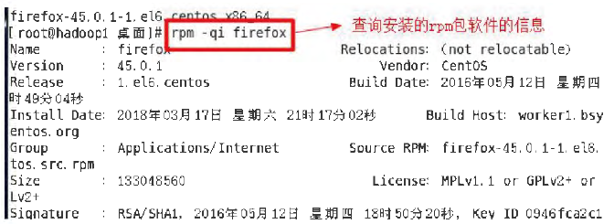

`rpm -ql 软件包名` :【查询软件包中的文件的位置】
`rpm -ql firefox`

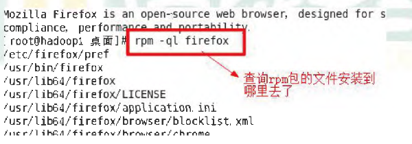

`rpm -qf 文件全路径名`  【 查询文件所属的软件包】
`rpm -qf /etc/passwd`

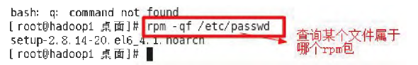

### 卸载rpm包：

+ 基本语法
  `rpm -e RPM包的名称`
+ 应用案例
  1）删除firefox软件包

  ```sh
  rpm -e  firefox
  ```
+ 细节讨论

  + 1）如果其它软件包依赖于您要卸载的软件包，卸载时则会产生错误信息。
    如：$rpm-e foo removing these packages would break dependencies:foo is needed by bar-1.0-1
  + 2）如果我们就是要删除foo这个rpm包，可以增加参数-nodeps，就可以 `强制删除`，但是一般不推荐这样做，因为依赖于该软件包的程序可能无法运行如：`rpm-e--nodeps foo`

### 安装rpm包：

+ 基本语法
  `rpm-ivh RPM包全路径名称`
+ 参数说明
  i=install安装
  v=verbose提示
  h-hash进度条
+ 应用实例
  1）演示卸载和安装firefox浏览器

步骤先找到firefox 的安装rpm 包,你需要挂载上我们安装centos 的iso 文件【centOS安装光盘】，然后到/media/下去找rpm 找。

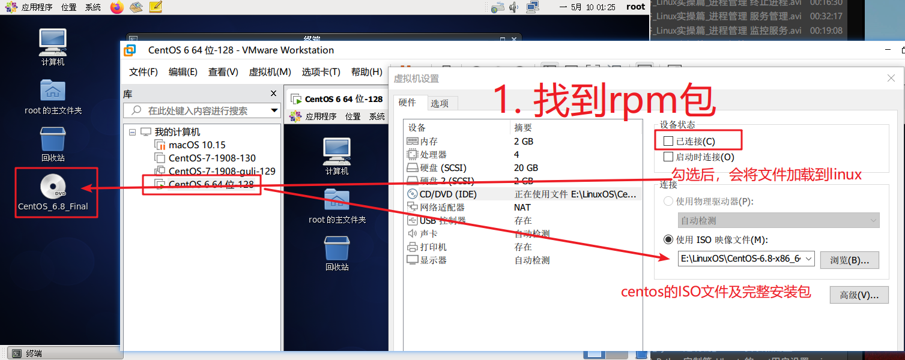

```sh
[root@hadoop1 media]$ ls -l /media/    # 光驱默认挂在/media目录下
总用量 4
dr-xr-xr-x. 7 root root 4096 5月  23 2016 CentOS_6.8_Final
[root@hadoop1 media]$ ls -l /media/CentOS_6.8_Final/Packages | grep fire   # rpm包位置
-r--r--r--. 2 root root 77493120 5月  12 2016 firefox-45.0.1-1.el6.centos.x86_64.rpm
-r--r--r--. 2 root root   121940 12月  8 2014 system-config-firewall-1.2.27-7.2.el6_6.noarch.rpm
-r--r--r--. 3 root root   444740 12月  8 2014 system-config-firewall-base-1.2.27-7.2.el6_6.noarch.rpm
-r--r--r--. 2 root root    40068 12月  8 2014 system-config-firewall-tui-1.2.27-7.2.el6_6.noarch.rpm

# 复制到opt目录下
[root@hadoop1 media]$ cp  /media/CentOS_6.8_Final/Packages/firefox-45.0.1-1.el6.centos.x86_64.rpm /opt/
```

安装

```sh
rpm-ivh /opt/firefox-45.0.1-1.el6.centos.x86_64.rpm 
```

## yum

### 介绍：

Yum 是一个Shell前端软件包管理器。基于RPM包管理，能够从指定的服务器自动下载RPM包并且安装，可以自动处理依赖性关系，并且一次安装所有依赖的软件包。

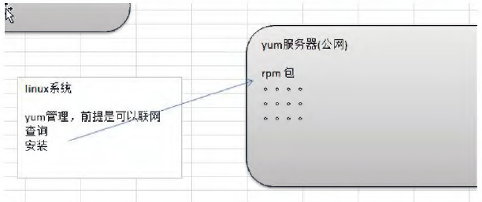

### yum的基本指令

+ 查询yum服务器是否有需要安装的软件
  `yum list|grep xx软件列表`
+ 安装指定的yum包
  `yum install xxx  `下载安装yum

  应用实例：
  案例：请使用yum的方式来安装firefox

1.先查看一下firefox rpm 在yum 服务器有没有

```sh
[root@hadoop1 media]$ yum list|grep firefox
firefox.x86_64                              78.5.0-1.el6.centos         @updates
firefox.i686                                78.5.0-1.el6.centos         updates 
```

2.安装【默认安装最新版本】

```sh
yum install firefox
```

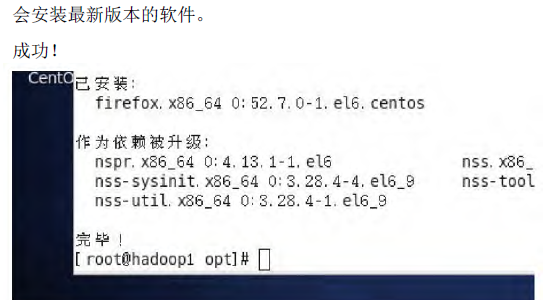

# JavaEE定制篇  搭建JavaEE环境

## 概述

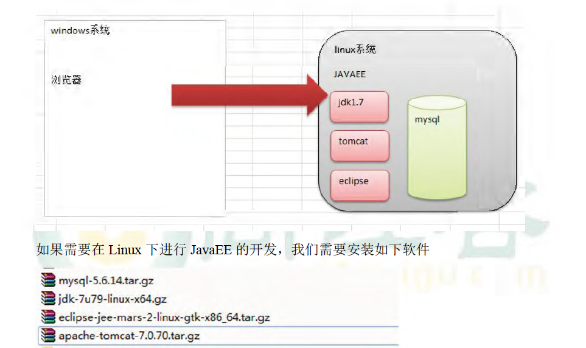

## 安装JDK

### 安装步骤

0) 先将软件通过xftp5 上传到 /opt 下

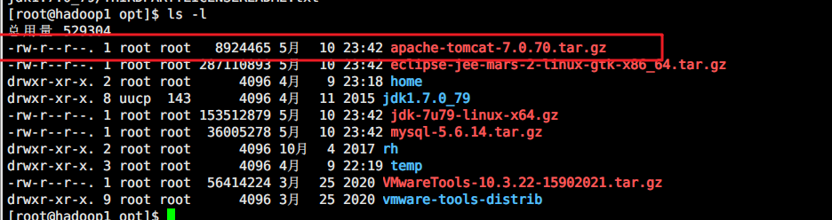1)	解压缩到 /opt

```sh
# 解压压缩包
[root@hadoop1 opt]$ tar -zxvf jdk-7u79-linux-x64.gz 
```

解压后文件目录  【最好修改文件夹名称】

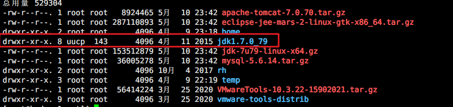

进入bin目录下执行 `./java`

2) 配置环境变量的配置文件 `vim  /etc/profile`  添加

> 快捷键G到文件末尾
> 进入jdk1.7.0_79/bin下   使用 `pwd`查询路径

在末尾添加

```sh
JAVA_HOME=/opt/jdk1.7.0_79   
PATH=$JAVA_HOME/bin:$PATH    # 或者PATH=/opt/jdk1.7.0_79/bin:$PATH
export JAVA_HOME PATH    # 输出变量，让环境变量剩下
```

打印环境变量

```sh
#windows
echo %JAVA_HOME%
echo   %PATH%

D:\Java\SDK\jdk11

#linux：
echo  $PATH
```

3) 需要注销用户，环境变量才能生效。

如果是在3 运行级别， `logout`

如果是在5 运行级别，

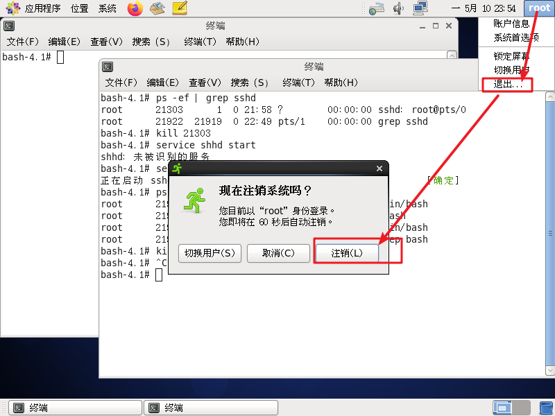

或者 `source /etc/profile`命令是配置生效

4) 在任何目录下就可以使用java 和javac

测试是否安装成功
编写一个简单的Hello.java 输出"hello,world!"

```sh
[root@hadoop1 opt]$ touch Hello.java
[root@hadoop1 opt]$ vim Hello.java 
[root@hadoop1 opt]$ javac Hello.java 
[root@hadoop1 opt]$ java Hello
```

```sh
public class Hello{
        public static void main(String[] args){
                System.out.println("hello----");
        }
}
```

## tomcat的安装

步骤:

1) 解压缩到/opt

```sh
[root@hadoop1 opt]$ tar -zxvf apache-tomcat-7.0.70.tar.gz 
```

2) 启动tomcat   ./startup.sh

```sh
#先进入到tomcat的bin目录
cd apache-tomcat-7.0.70
#运行启动脚本
./startup.sh
```

使用Linux 本地的浏览是可以访问到tomcat

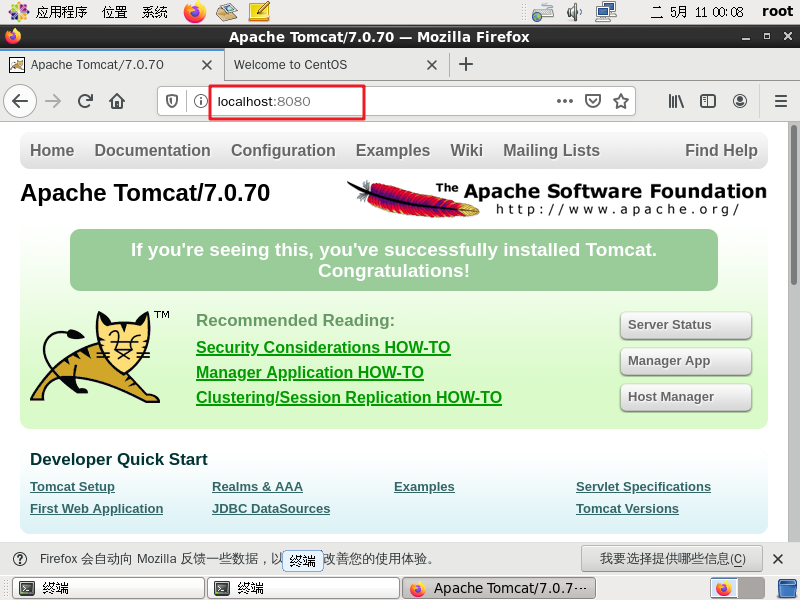


3) 开放端口 `vim /etc/sysconfig/iptables`    centOS6    7参考firewall指令

[]:

```sh
[root@hadoop1 bin]$ vim /etc/sysconfig/iptables   # 编辑防火墙配置
```

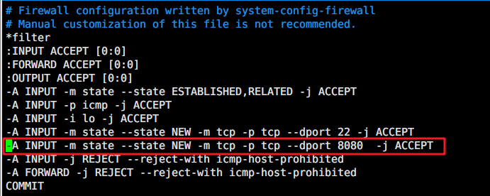

4) 重启防火墙

```sh
[root@hadoop1 bin]$ service iptables restart  # 重启防火墙服务

[root@hadoop1 bin]$ service iptables status   # 查看端口状态
```

测试是否安装成功：
在windows、Linux 下 访问 http://linuxip:8080

## Eclipse的安装步骤 :

1) 解压缩到/opt

```sh
tar - zxvf eclipse- j ee-mars -2- linux-gtk-x86_64. tar. gz
```

2) 启动eclipse，配置jre和server

    启动方法1: 创建一个快捷方式
     启动方式2: 进入到eclipse 解压后的文件夹，然后执行./eclipse 即可

3) 编写Hello world 程序并测试成功！
4) 编写jsp 页面,并测试成功!

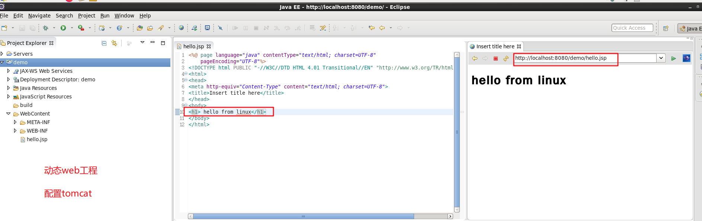

## mysql5.6的安装

安装的步骤和文档
[说明: 因为mysql安装时间很长，所以在授课时，可以考虑最先安装mysql]相关的安装软件在课件

> 注意: 先删除一下Mysql 相关的软件..

```sh
一：卸载旧版本

#使用下面的命令检查是否安装有MySQL Server

#有的话通过下面的命令来卸载掉
#目前我们查询到的是这样的：
[root@hsp ~]$ rpm -qa | grep mysql
mysql-libs-5.1.73-7.el6.x86_64
#如果查询到了，就删除吧

rpm -e mysql_libs  #普通删除模式
rpm -e --nodeps mysql_libs   # 强力删除模式，如果使用上面命令删除时，提示有依赖的其它文件，则用该命令可#以对其进行强力删除

```

二：安装MySQL

```sh
#安装编译代码需要的包
# 安装gcc
yum -y install make gcc-c++ cmake bison-devel  ncurses-devel

#下载MySQL 5.6.14 【这里我们已经下载好了,看软件文件夹】

tar -zxvf mysql-5.6.14.tar.gz
cd mysql-5.6.14
#编译安装[源码=》编译]

cmake -DCMAKE_INSTALL_PREFIX=/usr/local/mysql -DMYSQL_DATADIR=/usr/local/mysql/data -DSYSCONFDIR=/etc -DWITH_MYISAM_STORAGE_ENGINE=1 -DWITH_INNOBASE_STORAGE_ENGINE=1 -DWITH_MEMORY_STORAGE_ENGINE=1 -DWITH_READLINE=1 -DMYSQL_UNIX_ADDR=/var/lib/mysql/mysql.sock -DMYSQL_TCP_PORT=3306 -DENABLED_LOCAL_INFILE=1 -DWITH_PARTITION_STORAGE_ENGINE=1 -DEXTRA_CHARSETS=all -DDEFAULT_CHARSET=utf8 -DDEFAULT_COLLATION=utf8_general_ci

#编译并安装   # 先执行make在执行 make install
make && make install

#整个过程需要30分钟左右……漫长的等待
```

三：配置MySQL

```sh
#设置权限
#使用下面的命令查看是否有mysql用户及用户组

cat /etc/passwd 查看用户列表
cat /etc/group  查看用户组列表
#如果没有就创建

groupadd mysql
useradd -g mysql mysql
# 递归修改/usr/local/mysql权限  修改所有者mysql和所在组mysql
chown -R mysql:mysql /usr/local/mysql

#初始化配置，进入安装路径（在执行下面的指令），执行初始化配置脚本，创建系统自带的数据库和表
cd /usr/local/mysql
scripts/mysql_install_db --basedir=/usr/local/mysql --datadir=/usr/local/mysql/data --user=mysql    #[这是一条指令]
#注：在启动MySQL服务时，会按照一定次序搜索my.cnf，先在/etc目录下找，找不到则会搜索"$basedir/my.cnf"，在本例中就是 /usr/local/mysql/my.cnf，这是新版MySQL的配置文件的默认位置！

#注意：在CentOS 6.8版操作系统的最小安装完成后，在/etc目录下会存在一个my.cnf，需要将此文件更名为其他的名字，如：/etc/my.cnf.bak，否则，该文件会干扰源码安装的MySQL的正确配置，造成无法启动。
#修改名称，防止干扰：
mv /etc/my.cnf /etc/my.cnf.bak

#启动MySQL
#添加服务，拷贝服务脚本到init.d目录，并设置开机启动 
#[注意在 /usr/local/mysql 下执行]
cp support-files/mysql.server /etc/init.d/mysql
chkconfig mysql on   # 设置自启动
service mysql start  #启动MySQL

#执行下面的命令修改root密码
cd /usr/local/mysql/bin
./mysql -uroot  
mysql> SET PASSWORD = PASSWORD('root');

简单使用：
创建一个数据库 DB1
创建一张表 user
添加一个用户，如果成功，说明我们的数据库就安装成功了！
```

## centOS7.0防火墙

```sh
# firewall命令：查看已经开放的端口：
firewall-cmd --list-ports

#开启端口
firewall-cmd --zone=public --add-port=80/tcp --permanent

--命令含义：
–zone #作用域
–add-port=80/tcp #添加端口，格式为：端口/通讯协议
–permanent #永久生效，没有此参数重启后失效
```

```sh
firewall-cmd --reload #重启firewall
systemctl stop firewalld.service #停止firewall
systemctl disable firewalld.service #禁止firewall开机启动
firewall-cmd --state #查看默认防火墙状态（关闭后显示notrunning，开启后显示running）
```

# 定制篇 Shell 编程

## 为什么要学习Shell编程

1) Linux运维工程师在进行服务器集群管理时，需要编写Shell程序来进行服务器管理。
2) 对于JavaEE和Python程序员来说，工作的需要，你的老大会要求你编写一些Shell脚本进行程序或者是服务器的维护，比如编写一个定时备份数据库的脚本。
3) 对于大数据程序员来说，需要编写Shell程序来管理集群。

## Shell是什么

Shell是一个命令行解释器，它为用户提供了一个向Linux内核发送请求以便运行程序的界面系统级程序，用户可以用Shell来启动、挂起、停止甚至是编写一些程序。


## shell 编程快速入门-Shell 脚本的执行方式

### 脚本格式要求

1) 脚本以 `#!/bin/bash`开头
2) 脚本需要有可执行权限

### 编写第一个Shell脚本

需求说明：创建一个Shell脚本，输出hello world!

```sh
#!/bin/bash
# 像控制台输出'hello worls
echo 'hello world'
```

### 脚本的常用执行方式

•	方式1(输入脚本的绝对路径或相对路径)

1) 首先要赋予helloworld.sh 脚本的 `+x权限`
2) 执行脚本

```sh
[root@hadoop1 tmp]$ chmod u+x hell.sh    # 添加权限   或者chmod 744 myShell.sh
[root@hadoop1 tmp]$ ./hell.sh   # 执行脚本
```

•	方式2(sh+脚本)
说明：不用赋予脚本+x权限，直接执行即可。

```sh
[root@hadoop1 tmp]$ sh hell.sh 
```

## shell 的变量

### Shell的变量的介绍

1）	Linux Shell中的变量分为，系统变量和用户自定义变量。
2）	系统变量：$HOME、$PWD、$SHELL、$USER等等
比如：echo $HOME   等等..

```sh
#!/bin/bash
echo 'hello worls'
# 必须使用双引号
echo "path=$PATH"
echo "user=$USER"              
```

```sh
[root@hadoop1 tmp]$ sh hell.sh 
hello worls
path=/opt/jdk1.7.0_79/bin:/usr/lib64/qt-3.3/bin:/usr/local/sbin:/usr/local/bin:/sbin:/bin:/usr/sbin:/usr/bin
user=root
```

3）	显示当前shell中所有变量：`set`

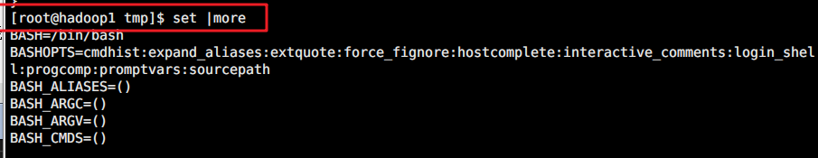

### shell变量的定义

+ 基本语法

  1) 定义变量：`变量=值`
  2) 撤销变量：`unset 变量`
  3) 声明静态变量：`readonly 变量`，注意：不能unset
+ 快速入门
  案例1：定义变量A

  案例2：撤销变量A

  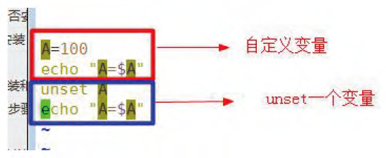

  案例3：声明静态的变量B=2，不能unset

  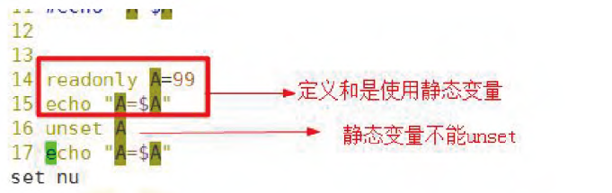

  案例4：可把变量提升为全局环境变量，可供其他shell程序使用

  export

### 定义变量的规则

1) 变量名称可以由字母、数字和下划线组成，但是不能以数字开头。
2) `等号两侧不能有空格`
3) 变量名称一般**习惯为大写**

### 将命令的返回值赋给变量

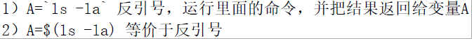

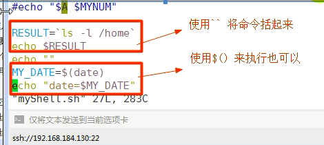

## 设置环境变量

### 基本语法

1) `export 变量名=变量值` （功能描述：将shell变量输出为环境变量）
2) `source 配置文件`   （功能描述：让修改后的配置信息立即生效）
3) `echo $变量名`  （功能描述：查询环境变量的值）

### 快速入门

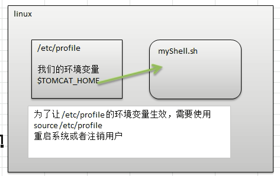

1) 在/etc/profile文件中定义TOMCAT_HOME环境变量
2) 查看环境变量TOMCAT_HOME的值
3) 在另外一个shell程序中使用TOMCAT_HOME

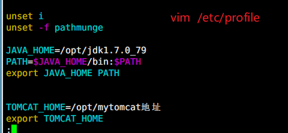

```sh
[root@hadoop1 tmp]$ source /etc/profile  #配置文件生效
[root@hadoop1 tmp]$ vim  myshell.sh #使用刚自定义环境变量
[root@hadoop1 tmp]$ sh myshell.sh # 运行脚本
```

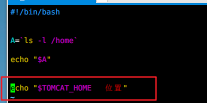

注意：在输出TOMCAt_HOME 环境变量前，需要让其生效 `source /etc/profile`

## 注释

```sh
:<<!
	多行注释内容
!

# 单行注释

```

## 位置参数变量

### 介绍

当我们执行一个shell脚本时，如果希望获取到命令行的参数信息，就可以使用到位置参数变量
比如：./myshell.sh 100 200 , 这个就是一个执行shell的命令行，可以在myshell  脚本中获取到参数信息（100 和200）

### 基本语法

```sh
$n 	#（功能描述：n为数字，$0代表命令本身，$1-$9代表第一到第九个参数，十以上的参数，十以上的参数需要用大括号包含，如${10}）
$* 	#功能描述：这个变量代表命令行中所有的参数，$*把所有的参数看成一个整体）
$@	#（功能描述：这个变量也代表命令行中所有的参数，不过$@把每个参数区分对待）
$# 	#（功能描述：这个变量代表命令行中所有参数的个数）
```

### 应用实例

案例：编写一个shell脚本 myshell.sh ， 在脚本中获取到命令行的各个

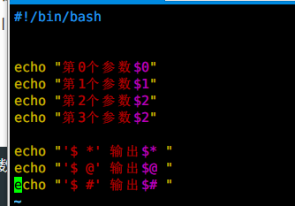

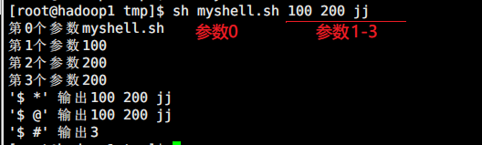

## 预定义变量

### 基本介绍

就是shell设计者事先已经定义好的变量，可以直接在shell）脚本中使用

### 基本语法

`$$`（功能描述：当前进程的进程号（PID））
`$！`（功能描述：后台运行的最后一个进程的进程号（PID））
`$？`（功能描述：最后一次执行的命令的返回状态。如果这个变量的值为0，证明上一个命令正确执行；如果这个变量的值为非0（具体是哪个数，由命令自己来决定），则证明上一个命令执行不正确了。

### 应用实例

在一个shell脚本中简单使用一下预定义变量

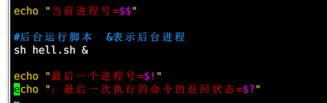


## 运算符

### 基本介绍

学习如何在she11中进行各种运算操作。

### 基本语法

1）`"$((运算式))"`或 `"$[运算式]"`
2）`expr m + n`注意expr运算符间要有空格
3）`expr m - n`
4）`expr \*，/，%`乘，除，取余

### 应用实例

案例1：计算（2+3）x4的值

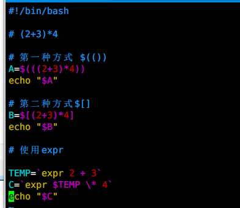

案例2：请求出命令行的两个参数[整数]的和

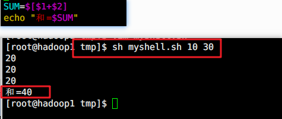

## 条件判断

### 判断语句

+ 基本语法
  `[  condition  ]`（注意condition前后要有空格）
  #非空返回true，可使用$?验证（0为true，>1为false）
+ 应用实例
  `[ atguigu ]`		返回true
  `[]`				返回false
  `[ condition ] && echo OK || echo notok`       条件满足，执行后面的语句

### 常用判断条件

```sh
1）
=字符串比较

2）两个整数的比较
-lt小于
-le小于等于little equal
-eq等于
-gt大于
-ge大于等于
-ne不等于

3）按照文件权限进行判断
-r有读的权限
-w有写的权限
-x有执行的权限

4）按照文件类型进行判断
-f文件存在并且是一个常规的文件
-e文件存在
-d文件存在并是一个目录
```

4）应用实例
案例1："ok"是否等于"ok"
判断语句：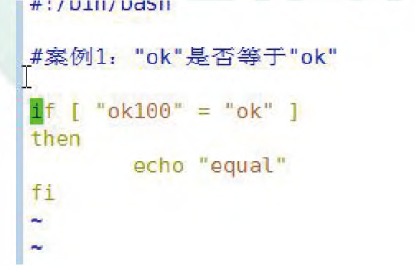
案例2：23是否大于等于22
判断语句：
案例3：/root/shell/aa.xt目录中的文件是否存在
判断语句：

## 流程控制

### if 判断

·基本语法

```sh
if[ 条件判断式 ]; then
	程序
fi
```

或者

```sh
if [ 条件判断式 ]
then
		程序
elif [ 条件判断式 ]
then
		程序
fi
```

注意事项：（1）`[ 条件判断式 ]`，中括号和条件判断式之间必须有空格（2）推荐使用第二种方式

应用实例

案例：请编写·个shell程序，如果输入的参数，大于等于60，则输出"及格了"，如果小于60，则输出"不及格

```sh
[root@hadoop1 tmp]$ vim test3shell.sh  #创建文件

[root@hadoop1 tmp]$ chmod u+x test3shell.sh #增加可执行权限

[root@hadoop1 tmp]$ ./test3shell.sh 70 #通过为止参数变量传值
及格
```

脚本内容

```shell
#!/bin/bash

if [ $1 -ge 60 ]
then
        echo "及格"

elif [ $1 -lt 60 ]
then
        echo "不及格"

fi
```

### case

语法格式

```sh
case $变量名 in
"值1")
    command1
    command2
    ...
    commandN
    ;;
"值2")
    command1
    command2
    ...
    commandN
    ;;
 *)
	如果变量的值都不是以上的值，则执行此程序
	;;
esac
```

case 工作方式如上所示，取值后面必须为单词 **in**，每一模式必须以右括号结束。取值可以为变量或常数，匹配发现取值符合某一模式后，其间所有命令开始执行直至 **;;**。

取值将检测匹配的每一个模式。一旦模式匹配，则执行完匹配模式相应命令后不再继续其他模式。如果无一匹配模式，使用星号 `*` 捕获该值，再执行后面的命令。

实例：

```sh
echo '输入 1 到 4 之间的数字:'
echo '你输入的数字为:'
read aNum
case $aNum in
    1)  echo '你选择了 1'
    ;;
    2)  echo '你选择了 2'
    ;;
    3)  echo '你选择了 3'
    ;;
    4)  echo '你选择了 4'
    ;;
    *)  echo '你没有输入 1 到 4 之间的数字'
    ;;
esac
```

输入不同的内容，会有不同的结果，例如：

```
输入 1 到 4 之间的数字:
你输入的数字为:
3
你选择了 3
```

下面的脚本匹配字符串：

```sh
*#!/bin/sh*

site="runoob"

**case** "$site" **in**
  "runoob"**)** **echo** "菜鸟教程"
  **;;**
  "google"**)** **echo** "Google 搜索"
  **;;**
  "taobao"**)** **echo** "淘宝网"
  **;;**
**esac**
```

输出结果为：

```
菜鸟教程
```

### for循环

```sh
# 基本语法1
for变量in值1值2值3...
do
	程序/代码
done

```

应用实例testFor1.sh
案例1：打印命令行输入的参数[这里可以看出$*和$@的区别]

```sh
#!/bin/bash

# 注意$*是把输入的参数，当做一个整体，所以，只会输出一句
for i in "$*"
do
     echo " '$ *' num is $i"
done


echo "=========================================="

# 使用$@来获取输入的参数，注意，这时是分别对待，所以有几个参数，就输出几句

for i in "$@"
do
     echo "  '$ @' num is $i"
done

```

测试

```sh
chomd u+x test1.sh		# 增加可执行权限

运行结果：
[root@localhost ~]$ ./test1.sh 100 200 300  # 运行，通过为止参数传值
 '$ *' num is 100 200 300
==============================================
  '$ @' num is 100
  '$ @' num is 200
  '$ @' num is 300

```

```sh
# 基本语法2
for（（初始值：循环控制条件：变量化））
do
	程序/代码
done
```

案例

```sh
#!/bin/bash

#案例1：从1加到100的值输出显示，如何把100做成一个变量
SUM=0

for((i=1; i<=$1; i++))   #$1  从命令行获取参数
do
	SUM=$[$SUM+i]
done

echo "sum = $SUM"

```

```sh
# 测试
[root@localhost ~]$ sh test2.sh 50
sum = 1275
```

### while循环

```sh
while [ 条件判断式 ]
do
	程序
done
```

> 注意：while和[有空格，条件判断式和[也有空格

```sh
#!/bin/bash

#案例1：从命令行输入一个数n，统计从1+..+ n的值是多少？

# -le 表示 <=
SUM=0
i=0
while [ $i -le $1 ]
do
	SUM=$[$SUM+$i]  # 计算
	i=$[$i+1]   # 自增1
done

echo "sum = $SUM"
```

测试：

```sh
[root@localhost ~]$ sh test.sh 100 
sum = 5050
```

## read读取控制台输入

### 基本语法

`read （选项）（参数）`

+ 选项：
  `-p`：指定读取值时的提示符；
  `-t`：指定读取值时等待的时间（秒），如果没有在指定的时间内输入，就不再等待了。
+ 参数
  变量：指定读取值的变量名

### 应用实例

  testRead.sh

```sh
  #!/bin/bash
  
  #案例1：读取控制台输入一个num1值
  read -p "请输入一个数：" NUM1
  echo "NUM1=$NUM1"
  
  #案例2：读取控制台输入一个num2值，在10秒内输入。
  read -t 10 -p "请输入一个数：" NUM2
  echo "NUM2=$NUM2"
```

```sh
# 测试
[root@localhost ~]$ sh testRead.sh 
请输入一个数：10
NUM1=10
请输入一个数：20   # 超过10s未输入就结束阻塞继续运行下面代码
NUM2=20
```

## 函数

### 函数介绍

shell编程和其它编程语言一样，有系统函数，也可以自定义函数。系统函数中，我们这里就介绍两个。

### 系统函数

+ `basename`基本语法

  **功能**：返回完整路径最后 / 的部分，常用于**获取文件名**

  `basename [pathname] [suffix]`
  `basename [string] [suffix]`功能描述：basename命令会删掉所有的前缀包括最后一个（‘/’）字符，然后将字符串显示出来。

  **选项**：suffix为后缀，如果suffix被指定了，basename会将pathname或string中的suffix去掉。

应用实例
案例1：请返回/home/aaa/test.txt的"test.txt"部分

```sh
[root@localhost aaa]$ ls -l /home/aaa/test.txt 
-rw-r--r--. 1 root root 0 5月  12 23:26 /home/aaa/test.txt

[root@localhost aaa]$ basename /home/aaa/test.txt
test.txt

[root@localhost aaa]$ basename /home/aaa/test.txt .txt
test
```

+ `dirname`基本语法

  **功能**：返回完整路径最后/的前面的部分，常用于**返回路径部分**

  `dirname 文件绝对路径`（功能描述：从给定的包含绝对路径的文件名中去除文件名（非目录的部分），然后返回剩下的路径（目录的部分））

应用实例
案例1：请返回/home/aaa/test.txt的/home/aaa

```sh
[root@localhost aaa]$ dirname /home/aaa/test.txt 
/home/aaa
```

### 自定义函数

```sh
[function] funname[()]
{
	Action；
	[return int:]
}

# 用直接写函数名：funname [值]
```

> 1、可以带function fun() 定义，也可以直接fun() 定义,不带任何参数。
>
> 2、参数返回，可以显示加：return 返回，如果不加，将以最后一条命令运行结果，作为返回值。 return后跟数值n(0-255

应用实例
案例1：计算输入两个参数的和（动态获取），getSum

```sh
#!/bin/bash

#案例1：计算输入两个参数的和（动态的获取），getSum
#定义函数getsum
function getSum()
{
	SUM=$[$n1+$n2]
	echo "和=$SUM"
	return 10
} 

#输入两个值
read -p  "请输入一个数n1=" n1
read -p  "请输入一个数n2=" n2

# 调用自定义函数
A=`getSum $n1 $n1`
echo "函数返回值=$A"
```

```sh
# 测试
[root@localhost aaa]$ sh testFun.sh 
请输入一个数n1=10
请输入一个数n2=20
函数返回值=和=30
```

## Shell编程综合案例

需求分析

+ 每天凌晨2：30备份数据库hspEduDB到/data/backup/db
+ 备份开始和备份结束能够给出相应的提示信息
+ 备份后的文件要求以备份时间为文件名，并打包成.tar.gz的形式，比如：2021-03-12 230201.tar.gz
+ 在备份的同时，检查是否有10天前备份的数据库文件，如果有就将其删除。


shell脚本 `/usr/sbin/mysql_db_backup.sh`

```sh
#!/bin/bash

# 备份目录
BACKUP=/data/backup/db
#当前时间
DATETIME=$(date +%Y-%m-%d_%H%M%S)

echo $DATETIME

#数据库地址
HOST=192.168.64.1
#数据库用户名
DB_USER=root
#数据库密码
DB_PW=root
#备份的数据库名
DATABASE=gouwenyong

#创建备份目录，如果不存在，就创建
[ ! -d "${BACKUP}/${DATETIME}" ] && mkdir -p "${BACKUP}/${DATETIME}"


# 备份数据库
mysqldump -u${DB_USER} -p${DB_PW} --host=${HOST} -q -R --databases ${hspedu} | gzip > ${BACKUP}/${DATETIME}/${DATETIME}.sql.gz

# 将文件处理成tar.gz
cd $BACKUP
tar -zcvf ${DATETIME}.tar.gz ${DATETIME}
# 删除对应的备份目录
rm -rf ${BACKUP}/${DATETIME}


# 删除10天备份文件进行
find ${BACKUP} -atime +10 -name "*.tar.gz" -exec rm -rf {} \;

echo "备份数据库${DATABASE}成功"
```

crond定时运行：

```sh
crontab -e

# 添加任务
30 2 * * * ./usr/sbin/mysql_db_backup.sh

# 查询任务
crontab -l
```

# centOS8.1

## CentOS介绍及下载

CentOS 是基于 Red Hat Enterprise Linux (RHEL / 业界最知名的发行版) 源代码再编译出来的免费版，因此不仅继承 RHEL 优越的稳定性（与 Debian 不分上下），还提供免费更新，因此在服务器提供商、中小型公司中装机量几乎是最大最流行的 Linux 系统，现在也已正式加入红帽公司。从事互联网技术的同学，CentOS 应该是值得你深入了解学习研究的……

**CentOS Linux 和 CentOS Stream 区别**

在 CentOS 的官网上，你会看到有两个不同的版本 CentOS Linux 和 CentOS Stream。其中 CentOS Linux 就是我们传统使用的稳定版系统。那么 CentOS Stream 是什么版本呢？

其实 Centos Stream 是一个面向开发者的滚动发布的 Linux 发行版，它介于 Fedora Linux 的上游开发和 RHEL 的下游开发之间而存在。你可以把 CentOS Streams 当成是用来体验最新红帽系 Linux 特性的一个版本。

因此，如果你不是开发者，并打算将 CentOS 用于服务器，用于正式生产环境使用、追求稳定性，或者个人日常使用，都更推荐使用传统的 CentOS Linux 这个版本。

**镜像下载说明**

[阿里CentOS8下载](https://mirrors.aliyun.com/centos/8/isos/x86_64/)

[清华CentOS8下载](https://mirrors.tuna.tsinghua.edu.cn/centos/8/isos/x86_64/)

[CentOS8官网下载](https://www.centos.org/download/)

## 安装过程

1.开启CPU虚拟化

2.新建虚拟机，稍后安装系统

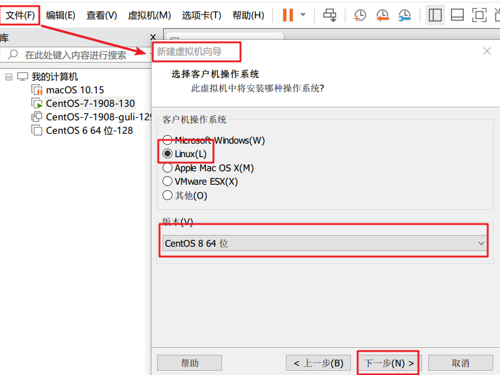

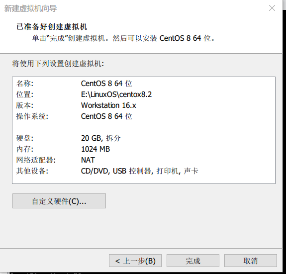

3.加载安装镜像

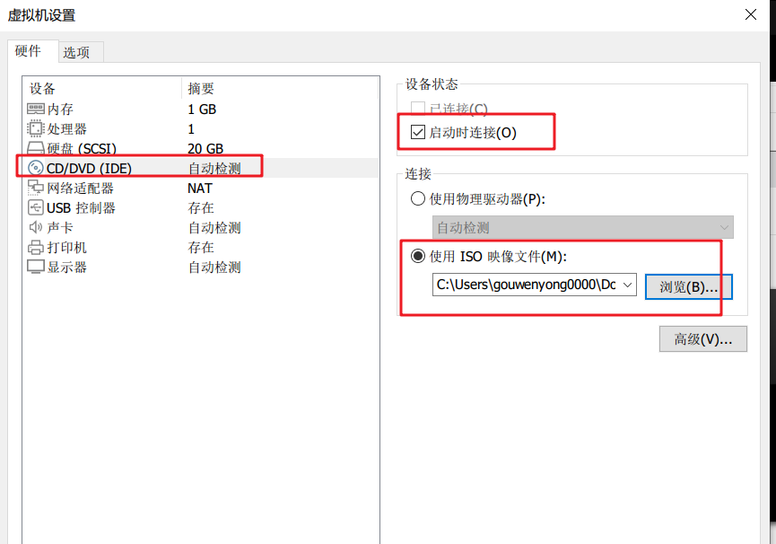

4.开启虚拟机进行引导安装

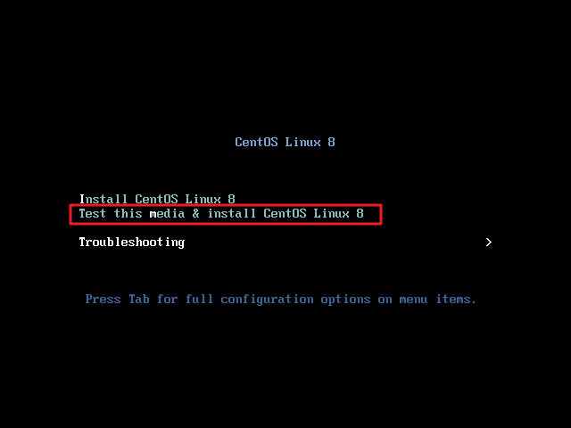

5.选择语言

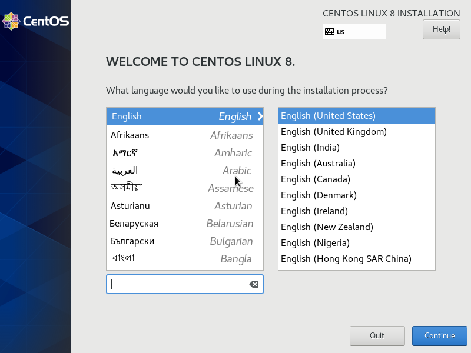

6.选择安装软件

带界面GUI     勾选【传统nuix兼容性   开发工具   性能工具】

> 生产环境：最小安装

7.分区操作

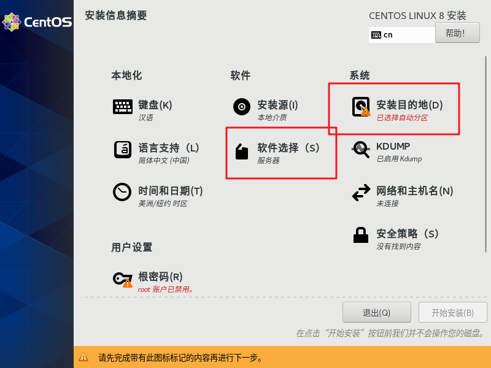

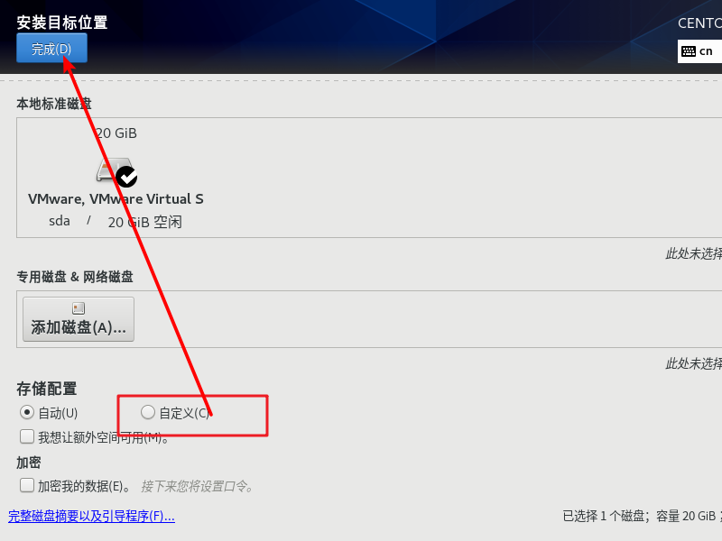


```
挂载点		期望容量	设备类型	文件系统
/boot 分区    1G    	标准分区 	ext4

swap 分区     2G    	标准分区  	swap

/ 分区        17g    	标准分区 	ext4
```

8.开启kdump

【内存崩溃转存机制】生产环境打开

9.设置root密码

10.设置新用户

## centos8网络配置【不同】

centos8更新后网络配置发生了变化，主要是在配置结束后网络重启这块。

变化1:网络配置文件名称改变，配置文件地址没有变化 `/etc/sysconfig/network-scripts`

```sh
[root@localhost network-scripts]$ pwd
/etc/sysconfig/network-scripts
[root@localhost network-scripts]$  ls
ifcfg-ens33
```

变化2:网络配置内容改变，相对centos7精简了不少配置，下面以配置静态ip为例

```bash
TYPE=Ethernet
PROXY_METHOD=none
BROWSER_ONLY=no

#改为static
BOOTPROTO=static

DEFROUTE=yes
IPV4_FAILURE_FATAL=no
IPV6INIT=yes
IPV6_AUTOCONF=yes
IPV6_DEFROUTE=yes
IPV6_FAILURE_FATAL=no
IPV6_ADDR_GEN_MODE=stable-privacy
NAME=ens33
UUID=8bbf70ef-1879-4d3d-aab4-17fd06b8e25c
DEVICE=ens33


#改为yes
ONBOOT=yes

#add by yuhua
IPADDR=192.168.64.128
NETMASK=255.255.255.0
GATEWAY=192.168.225.2
DNS1=114.114.114.114
DNS2=8.8.8.8
```

变化3:网络重启方法发生了改变，原来的network.service服务不再生效。改为了nmcli命令，详细介绍请查阅资料。

```bash
[root@localhost network-scripts]$ nmcli --help

用法：nmcli [选项] OBJECT 

选项：

  -o[verview]                                    概览模式（隐藏默认值）
  -t[erse]                                       简洁输出
  -p[retty]                                      整齐输出
  -m[ode] tabular|multiline                      输出模式
  -c[olors] auto|yes|no                          是否在输出中使用颜色
  -f[ields] |all|common       指定要输出的字段
  -g[et-values] |all|common   -m tabular -t -f 的快捷方式
  -e[scape] yes|no                               在值中转义列分隔符
  -a[sk]                                         询问缺少的参数
  -s[how-secrets]                                允许显示密码
  -w[ait]                                    为完成的操作设置超时等待时间
  -v[ersion]                                     显示程序版本
  -h[elp]                                        输出此帮助

对象：
  g[eneral]       网络管理器（NetworkManager）的常规状态和操作
  n[etworking]    整体联网控制
  r[adio]         网络管理器无线电开关
  c[onnection]    网络管理器的连接
  d[evice]        由网络管理器管理的设备
  a[gent]         网络管理器的密钥（secret）代理或 polkit 代理
  m[onitor]       监视网络管理器更改
```

centos8网卡默认是关闭的，在重启网络配置前需要先打开网卡（重点），再重启网络。

```bash


# 启动网卡
[root@localhost network-scripts]$ nmcli c up ens33
连接已成功激活（D-Bus 活动路径：/org/freedesktop/NetworkManager/ActiveConnection/2


#重启网络
[root@localhost network-scripts]$ nmcli c reload

[root@localhost network-scripts]$ ping www.baidu.com
PING www.a.shifen.com (180.101.49.12) 56(84) bytes of data.
64 bytes from 180.101.49.12 (180.101.49.12): icmp_seq=1 ttl=128 time=20.2 ms
64 bytes from 180.101.49.12 (180.101.49.12): icmp_seq=2 ttl=128 time=20.5 ms
...

到此ping外网可以通了，但是ping本机不通，重启一下虚拟机就可以。

--拓展：

#关闭网卡
nmcli c down ens33

#查看链接
nmcli connection

# 网络问题排查
nmcli networking //查看托管状态
如果显示 disabled 那么适用于下面的方法解决，如果不是就不是这里的问题

开启网卡托管
nmcli networking on

重启网络管理
systemctl restart NetworkManager
```

## 8.0与7.0区别

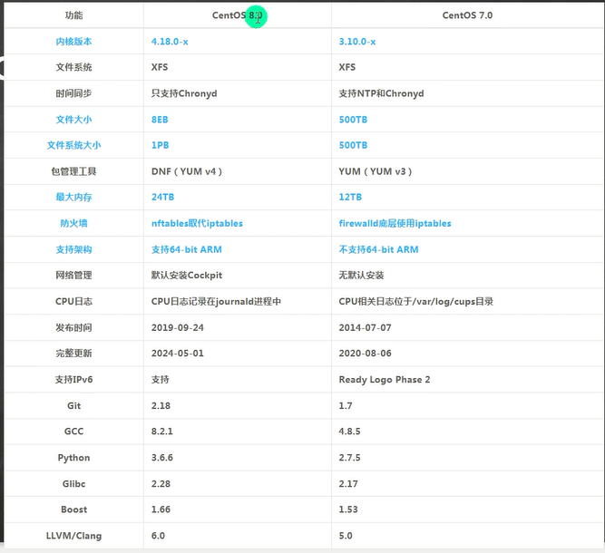

# 高级篇 日志管理

## 基本介绍

1、日志文件是重要的系统信息文件，其中记录了许多**重要的系统事件**，包括用户的登录信息、系统的启动信息、系统的安全信息、邮件相关信息、各种服务相关信息等。

2、日志对于**安全来说也很重要**，它记录了系统每天发生的各种事情，通过日志来检查错误发生的原因或者受到攻击时攻击者留下的痕迹。

3、可以这样理解日志是用来*记录重大事件的工具*

## 系统常用的日志

`/var/log/`目录就是系统日志文件的保存位置，看张图

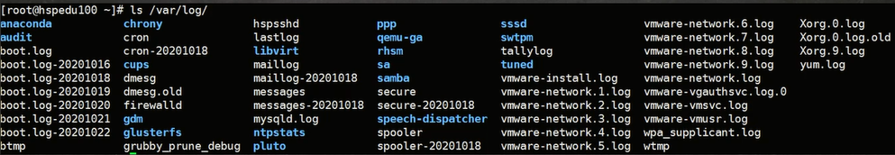

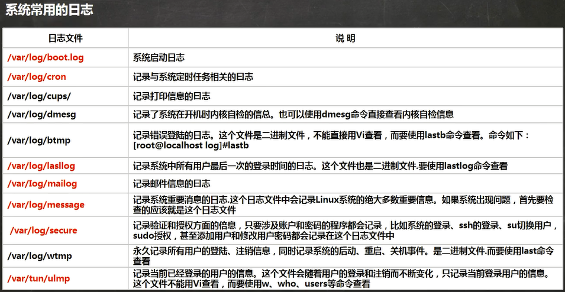

**应用案例**
使用root用户通过xshell6登陆，第一次使用错误的密码，第二次使用正确的密码登录成功看看在日志文件 `/var/log/secure`里有没有记录相关信息

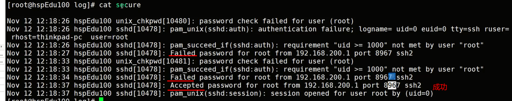

## 日志管理服务 `rsyslogd`

CentOS7.6日志服务是 `rsyslogd`，CentOS6.x日志服务是 `syslogd`；rsyslogd功能更强大。rsyslogd的使用、日志文件的格式，和syslogd服务兼容的。

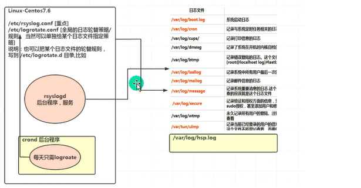

查询Linux中的rsyslogd服务**是否启动**
`ps -aux | grep "rsyslog" | grep -v "grep"`

> 【第二次是过滤掉 `grep -v`反向匹配】

查询rsyslogd服务的**自启动状态**
`systemctl list-unit-files | grep rsyslog`

### 日志配置文件

配置文件：`/etc/rsyslog.conf`

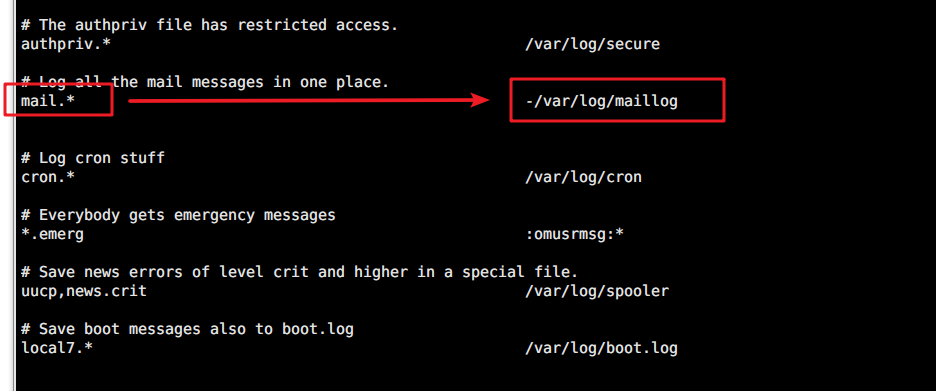

编辑文件时的格式为：`*.*`存放日志文件其中第一个 `*`代表日志类型，第二个 `*`代表日志级别
1.日志类型分为：

```
auth		##pam产生的日志
authpriv	##ssh，ftp等登录信息的验证信息
corn		#时间任务相关
kern		##内核
lpr			#打印
mail		##邮件
mark(syslog)-rsyslog	#服务内部的信息，时间标识
news		#新闻组
user		#用户程序产生的相关信息
uucp		##unix to nuix copy主机之间相关的通信
local 1-7	#自定义的日志设备
```

2，日志级别分为：

```
debug	##有调试信息的，日志通信最多
info	##一般信息日志，最常用
notice	#最具有重要性的普通条件的信息warning##警告级别
err		#错误级别，阻止某个功能或者模块不能正常工作的信息
crit	#并严重级别，阻止整个系统或者整个软件不能正常工作的信息
alert	##需要立刻修改的信息
emerg	##内核崩溃等重要信息
none	##什么都不记录
注意：从上到下，级别从低到高，记录信息越来越少
```

由日志服务rsyslogd记录的日志文件，日志文件的格式包含以下4列：

+ 事件产生的时间
+ 产生事件的服务器的主机名
+ 产生事件的服务名或程序名
+ 事件的具体信息

日志如何查看实例
查看一下/var/log/secure日志，这个日志中记录的是用户验证和授权方面的信息来分析如何查看

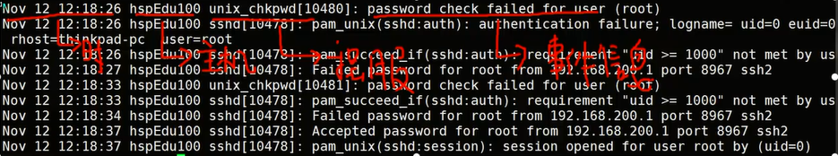

### 应用实例

在 `vim /etc/rsyslog.conf`中添加一个日志文件 `/var/og/hsp.log`，当有事件发送时（比如sshd服务相关事件），该文件会接收到信息并保存，给小伙伴演示，，看看是否有日志保存

在 `/etc/rsyslog.conf`增加一条规则记录所有日志【参考邮件服务】

```sh
*.*         -/var/og/hsp.log
```

过滤查看：`cat /var/og/hsp.log | grep sshd `

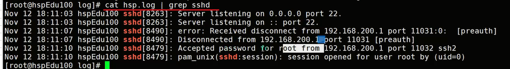

## 日志轮替

### 基本介绍

日志轮替就是把旧的日志文件移动并改名，同时建立新的空日志文件，当旧日志文件超出保存的范围之后，就会进行删除

### 日志轮替文件命名

1、**centos7使用logrotate进行日志轮替管理**，要想改变日志轮替文件名字，通过 `/etc/logrotate.conf`配置文件中"`dateext`"参数

2、如果配置文件中有"`dateext`"参数，那么日志会用**日期**来作为日志文件的后缀，例如"secure-20201010"。这样日志文件名不会重叠，也就不需要日志文件的改名，只需要指定保存日志个数，删除多余的日志文件即可

3，如果配置文件中**没有"`dateext`"参数**，日志文件就需要进行改名了。当第一次进行日志轮替时**，当前的secure"日志会目动改名为"secure.1"，然新建"secure"日志，用来保存新的日志**。当第二次进行日志轮替时，"secure.1"会自动改名为"secure.2"，当前的"secure"日志会自动改名为"secure.1"，然后也会新建"secure"日志，用来保存新的日志，以此类推。

### `logrotate`配置文件

`/etc/logrotate.conf`为logrotate的全局配置文件

```sh
[root@localhost ~]$ vim /etc/logrotate.conf 

# see "man logrotate" for details
# rotate log files weekly,每周对日志文件进行一次轮替
weekly

# keep 4 weeks worth of backlogs  共保存4份日志文件，当建立新的日志文件时，旧的将会被删除
rotate 4

# create new (empty) log files after rotating old ones 创建新的空的日志文件，在日志轮替后
create

# use date as a suffix of the rotated file  使用日期作为日志轮替文件的后缀
dateext

# uncomment this if you want your log files compressed
#compress

# 自定义规则1
# RPM packages drop log rotation information into this directory
#包含/etc/logrotate.d/目录中所有的子配置文件，也就是说会把这个目录中所有子配置文件读取进来

include /etc/logrotate.d

# 自定义规则2
# no packages own wtmp and btmp -- we'll rotate them here
#下面是【单独设置】，【优先级更改】  --针对wtmp和btmp自定义
/var/log/wtmp {
    monthly  #每月对日志文件进行一次轮替
    create 0664 root utmp #建立的新日志文件，权限是0664，所有者是root，所属组是utmp维
    minsize 1M  #日志文件最小轮替大小是1MB，也就是日志一定要超过1MB才会轮替，否则就算时间达到一个月，也不进行日志转储
    rotate 1  #仅保留一个日志备份。也就是只有wtmp和wtmp.1日志保留而已
}

/var/log/btmp {
    missingok  #如果日志不存在，则忽略该日志的警告信息
    monthly
    create 0600 root utmp
    rotate 1
}
```

**参数说明**


### 把自己的日志加入日志轮替

**第一种**方法是直接在 `/etc/logrotate.conf`配置文件中写入该日志的轮替策略

**第二种**方法是在 `/etc/logrotate.d/`目录中新建立该日志的轮替文件，在该轮替文件中写入正确的轮替策略，`因为该目录中的文件都会被"include"到主配置文件中`，所以也可以把日志加入轮替。

*推荐使用第二种方法*，因为系统中需要轮替的日志非常多，如果全都直接写入/etc/logrotate.conf配置文件，那么这个文件的可管理性就会非常差，不利于此文件的维护。在/etc/logrotate.d/配置轮替文件一览

### 应用实例

看一个案例，在 `/etc/logrotate.conf`进行配置，或者直接在 `/etc/logrotate.d/ 下创建文件hsplog`编写如下内容，具体轮替的效果可以参考**/var/log下的bopt.log**情况.

```sh
# 对hsp.log文件自定义轮替策略
/var/log/hsp.log{
	missingok 
	daily 
	copytruncate 
	rotate 7
	notifempty
}
```

### 日志轮替机制原理

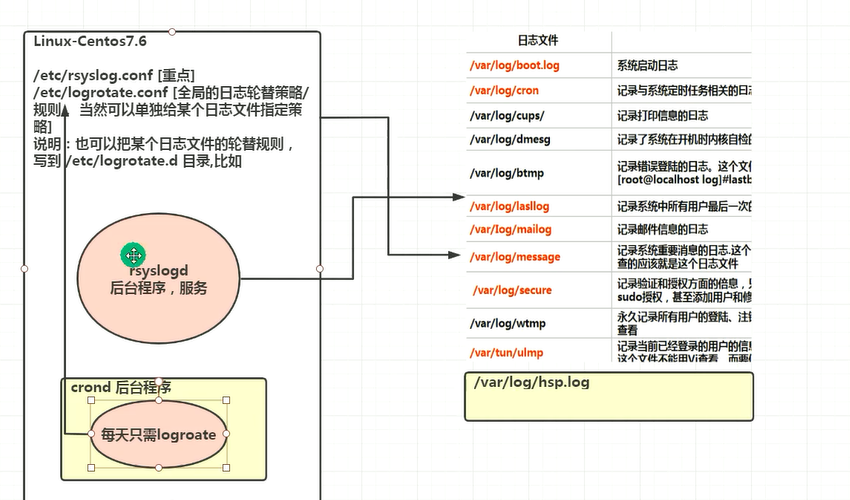

日志轮替之所以可以在指定的时间备份日志，是**依赖系统定时任务**。在 `/etc/cron.daily/`目录，就会发现这个目录中是有 `logrotate`文件（可执行），logrotate通过这个文件依赖定时任务执行的。

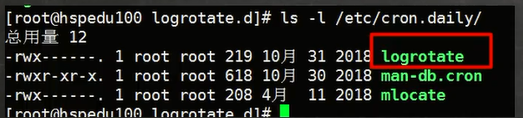

## 查看内存日志 `journalctl`

`journalctl` 可以查看内存日志，这里我们看看常用的指令 `journalctl`		##查看全部
`journalctl -n 3`		##查看最新3条
`journalctl --since 19:00--until 19:10:10`#查看起始时间到结束时间的日志可加日期

`journalctl -p err`	##报错日志
`journalctl -o verbose`	##日志详细内容
`journalctl -PID=1245 _COMM=sshd`#查看包含这些参数的日志（在详细日志查看）
或者 `journalctl | grep sshd`

注意：journalctl查看的是**内存日志**，重启清空

演示案例：使用 `journalctl | grep sshd`来看看用户登录清空，重启系统，再次查询，看看日志有什么变化没有.

# 高级篇-定制自己的Linux系统

## 基本介绍

通过裁剪现有Linux系统（CentOS7.6），创建属于自己的min Linux小系统，可以加深我们对tlinux的理解。
老韩利用centos7.6，搭建一个小小linux系统，很有趣。

## 基本原理

启动流程介绍：
制作Linux小系统之前，再了解一下Linux的启动流程：
1、首先Linux要通过自检，检查硬件设备有没有故障

2、如果有多块启动盘的话，需要在BIOS中选择启动磁盘

3、启动MBR中的bootloader引导程序

4、加载内核文件

5、执行所有进程的父进程、老祖宗systemd

6、欢迎界面

在Linux的启动流程中，加载内核文件时关键文件

1）kernel文件：vmlinuz-3.10.0-957.el7.x86 64

2）initrd文件：initramfs-3.10.0-957.el7.x8664.img

## 制作min linux思路分析

1，在现有的Linux系统（centos7.6）上加一块硬盘/dev/sdb，在硬盘上分两个分区，一个是/boot，一个是/，并将其格式化。需要明确的是，现在加的这个硬盘在现有的Linux系统中是/dev/sdb但是，当我们把东西全部设置好时，要把这个硬盘拔除，放在新系统上，此时，就是/dev/sda
2.在/dev/sdb硬盘上，将其打造成独立的Linux系统，里面的所有文件是需要拷贝进去的
3.作为能独立运行的Linux系统，内核是一定不能少，要把内核文件和initramfs文件也一起拷到/dev/sdb上

4.以上步骤完成，我们的自制Linux就完成，创建一个新的linux虚拟机，将其硬盘指向我们创建的硬盘，启动即可

# linux内核源码介绍&内核升级

## linux0.01内核源码

### 基本介绍

Linux的内核源代码可以从网上下载，解压缩后文件一般也都位于linux目录下。内核源代码有很多版本，可以从linux0.01内核入手，总共的代码1w行左右，最新版本5.9.8总共代码超过700w行，非常庞大

内核地址：https://www.kernel.org/

linux0.01内核源码目录&阅读

老韩提示阅读内核源码技巧

1、linuxo.01的阅读需要懂c语言
2、阅读源码前，应知道Linux内核源码的整体分布情况。现代的**操作系统一般由进程管理、内存管理、文件系统、驱动程序和网络**等组成。Linux内核源码的各个目录大致与此相对应
3、在阅读方法或顺序上，有纵向与横向之分。所谓纵向就是顺着程序的执行顺序逐步进行；所谓横向，就是按模块进行。它们经常结合在一起进行。
4、对于Linux启动的代码可顺着Linux的启动顺序一步步来阅读；对于像内存管理部分，可以单独拿出来进行阅读分析。实际上这是一个反复的过程，不可能读一遍就理解

linux内核源码阅读&目录介绍&main.c说明

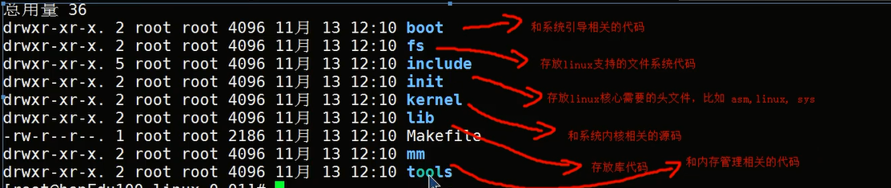

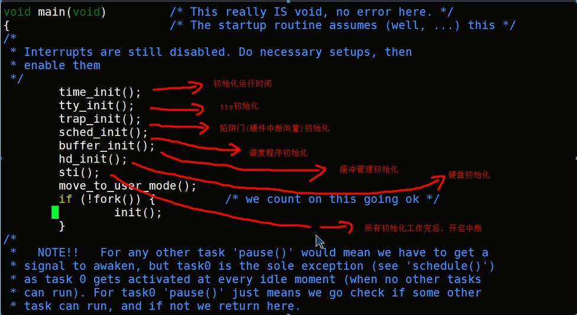

## linux内核最新版和内核升级

内核地址：https://www.kernel.org/查看

### 下载&解压最新版

```sh
wget ttps://cdn.kernel.org/pub/linux/kernel/v5.x/linux-5.8.16.tar.gz
tar-zxvf linux-5.8.16.tar.gz
```

### linux内核升级

将Centos系统从7.6内核升级到7.8版本内核（兼容性问题）


具体步骤

```sh
uname -a	#查看当前的内核版本
yum info kernel -q	#检测内核版本，显示可以升级的内核
yum update kernel	#升级内核
yum list kernel -q	#查看已经安装的内核
```

> 重启后，手动选择内核
>
> 

# linux系统备份与恢复

## 基本介绍

实体机无法做快照，如果系统出现异常或者数据损坏，后果严重，要重做系统，还会造成数据丢失。所以我们可以使用备份和恢复技术
linux的备份和恢复很简单，有两种方式：
1）把需要的文件（或者分区）用TAR打包就行，下次需要恢复的时候，再解压开覆盖即可

2）使用 `dump`和 `restore`命令

安装dump和restore

如果linux上没有dump和restore指令，需要先安装

```sh
yum -y install dump 
yum -y install restore
```

## 使用dump完成备份

### 基本介绍

**dump支持分卷和增量备份**（所谓增量备份是指备份上次备份后修改/增加过的文件，也称差异备份）

`dump [-cu] [-123456789] [-f<备份后文件名2] [-T<日期>] [目录或文件系统]`
`dump []-wW`

说明：

`-c`：创建新的归档文件，并将由一个或多个文件参数所指定的内容写入归档文件的开头。
`-0123456789`：备份的层级。0为最完整备份，会备份所有文件。若指定0以上的层级，则备份至上一次备份以来修改或新增的文件，到9后，可以再次轮替【**增量备份最多九次，然后全量备份再次循环**】
`-f<备份后文件名>`：指定备份后文件名
`-j`：**调用bzlib库压缩备份文件**，也就是将备份后的文件压缩成bz2格式，让文件更小
`-T<日期>`：指定开始备份的时间与日期
`-u`：备份完毕后，在 `/etc/umpdares`中记录备份的文件系统，层级，日期与时间等
`-t`：指定文件名，若该文件已存在备份文件中，则列出名称
`-W`：显示需要备份的文件及其最后一次备份的层级，时间，日期
`-w`：与 `-W`类似，但仅显示需要备份的文件。

### 应用实例

案例1：将/boot分区所有内容备份到/opt/boot.bak0.bz2文件中，备份层级为"0"**【全量】**
`dump -0uj -f /opt/boot.bak0.bz2 /boot`

案例2：在/boot目录下增加新文件，备份层级为"1"（只备份上次使用层次“0”备份后发生过改变的数据），注意比较看看这次生成的备份文件boo1.bak有多大**【增量】**

`dump -1uj -f /opt/boot.bak1.bz2 /boot`


老韩提醒：通过dump命令在配合crontab可以实现无人值守备份

### `dump -W`

显示需要备份的文件及其最后一次备份的层级，时间，日期

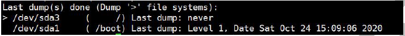

### 查看备份时间文件

`cat /etc/dumpdates`

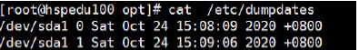

### dump备份文件或者目录

前面我们在备份**分区时，是可以支持增量备份的**，如果备份 `文件或者目录，不再支持增量备份，即只能使用0级别备份`

案例，使用dump备份/etc整个目录
`dump -0j -f /opt/etc.bak.bz2 /etc/`

> 下面这条语句会报错，提示DUMP：Only level 0 dumps are allowed on a subdirectory
> `dump -1j -f /opt/etc.bak.bz2 /etc/`

## 使用restore完成恢复

### 基本介绍

restore命令用来恢复已备份的文件，可以从dump生成的备份文件中恢复原文件

### restore基本语法

`restore [模式选项] [选项]`

+ 说明下面四个模式，不能混用，在一次命令中，只能指定一种
  `-C`：使用对比模式，将备份的文件与已存在的文件相互对比。
  `-i`：使用交互模式，在进行还原操作时，restors指令将依序询问用户
  `-r`：进行还原模式
  `-t`：查看模式，看备份文件有哪些文件
+ 选项
  `-f<备份设备>`：从指定的文件中读取备份数据，进行还原操作

### 应用案例

案例1：restore命令比较模式，比较备份文件和原文件的区别

测试
`mv /boot/hello.java /boot/hello100.java`

`restore -C -f /boot.bak1.bz2  `     //注意和最新的文件比较

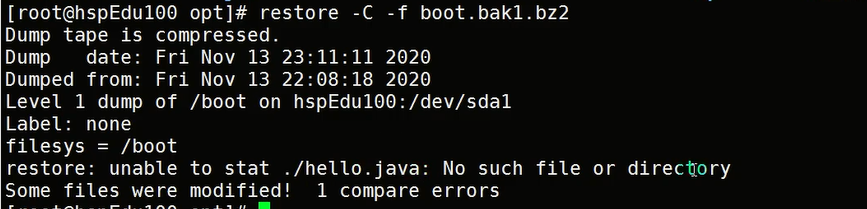

案例2：restore命令查看模式，看备份文件有哪些数据/文件

测试：`restore -t -f boot.bak0.bz2`

案例3：restore命令还原模式，**注意细节**：如果你有增量备份，需要把增量备份文件也进行恢复，有几个增量备份文件就要恢复几个，按顺序来恢复即可。

测试
`mkdir /opt/boottmp`
`cd /opt/boottmp`
`restore -r -f /opt/boot.bak0.bz2`  //恢复到第1次完全备份状态【0】
`restore -r -f /opt/boot.bak1.bz2`  //恢复到第2次增量备份状态【1】

案例4：restore命令恢复备份的文件，或者整个目录的文件
基本语法：`restore -r -f 备份好的文件`
测试   将文件恢复到etctmp目录下
`mkdir etctmp`
`cd etctmp/`
`restore -r -f/opt/etc.bak0.bz2`

# linux可视化管理工具

## webmin

### 基本介绍

Webmin是功能强大的基于Web的Unix/inux系统管理工具。管理员通过浏览器访问Webmin的各种管理功能并完成相应的管理操作。除了各版本的linux以外还可用于：AIX，HPUX，Solaris、Unixware、rix和FreeBSD等系统


### 安装webmin&配置

1. 下载地址：http://download.webmin.com/download/yum/

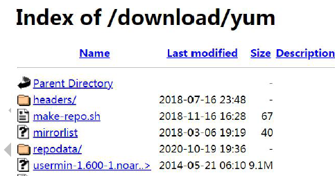

也可以使用

```sh
wget http://download.webmin.com/download/yum/webmin-1.700-1.noarch.rpm
```

2. 安装

```sh
nerpm -ivh webmin-1.700-1.noarch.rpm
```

3. 重置密码 `/usr/libexec/webmin/changepass.pl /etc/webmin root test`
   root是webmin的用户名，不是OS的，这里就是把webmin的root用户密码改成了test
4. 修改webmin服务的端口号（默认是10001出于安全目的）

   ```sh
   vim /etc/webmin/miniserv.conf   #修改端口
   ```
5. 将port-10000修改为其他端口号，如port-10001【避免使用浏览器保护的端口https://www.v2ex.com/t/696650】
6. 重启webmin

   ```sh
   /etc/webmin/restart		#重启
   /etc/webmin/start		#启动
   /etc/webmin/stop		#停止
   ```

7.防火墙放开6666端口

```sh
 #配置防火墙开放6666端
firewall-cmd --zone=public --add-port=10001/tcp --permanent   
#更新防火墙配置
firewall-cmd --reload
#查看已经开放的端口号
firewall-cmd --zone=public --list-ports

 #关闭端口
firewall-cmd --zone=public --remove-port=10001/tcp --permanent  
```

8. 登录webmin
   在浏览器中 `http://ip：10001` 访问了  或者在linux中 `curl http://ip：10001 `
   用root账号和重置的新密码test


### 简单使用

比如修改语言设置，IP访问控制，查看进程，修改密码，任务调度，mysql等.


## bt运维工具

### 基本介绍

bt宝塔Linux面板是提升运维效率的服务器管理软件，支持一键LAMP/LNMP/集群/监控/网站/FTP/数据库/JAVA等多项服务器管理功能。

### 安装和使用

1）安装：

```sh
yum install -y wget && wget -O install.sh http://download.bt.cn/install/install_6.0.sh && sh install.sh

# 解释
1. 安装wget下载工具
2.使用wget工具从网络地址http://download.bt.cn/install/instal1_6.0.sh下载文件并重命名为install.sh
3.运行install.sh
4.&&表示上一条命令执行完毕执行下一条
```

2）安装成功后控制台会显示登录地址，账户密码，复制浏览器打开登录，

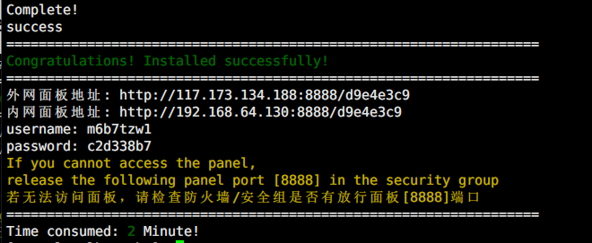

3）如果bt的用户名，密码忘记了，使用 `bt default`可以查看

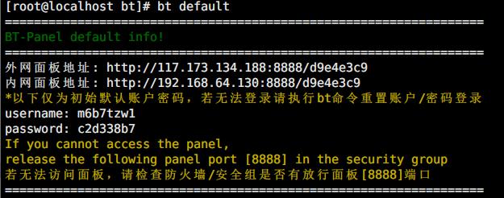

### 使用介绍

比如可以登录终端，配置，快捷安装运行环境和系统工具，添加计划任务脚本


# Linux面试题

#### 分析日志t.log（访问量），将各个ip地址截取，并统计出现次数，并按从大到小排序（腾讯）

```
http://192.168.200.10/index1.html
http://192.168.200.10/index2.html
http://192.168.200.20/index1.html
http://192.168.200.30/index1.html
http://192.168.200.40/index1.html 
http://192.168.200.30/order.html 
http://192.168.200.10/order.html
```

```sh
# 答案：				
cat t.log | cut -d "/" -f 3 | sort | uniq -c| sort -nr 
# 结果
      3 192.168.200.10
      2 192.168.200.30
      1 192.168.200.40
      1 192.168.200.20
# 解释
cat t.log \				# 显示内容
	| cut -d "/" -f 3 \  # cut每一行按/分割，取第三部分
	| sort \			# sort排序，统计前需要排序
	| uniq -c \			# uniq分组统计
	| sort -nr 			# -nr倒序
```

> cut命令不能使用空格分割，参考awk命令

#### 统计连接到服务器的各个ip情况，并按连接数从大到小排序（腾讯）

> state显示ESTABLISHED表示建立连接

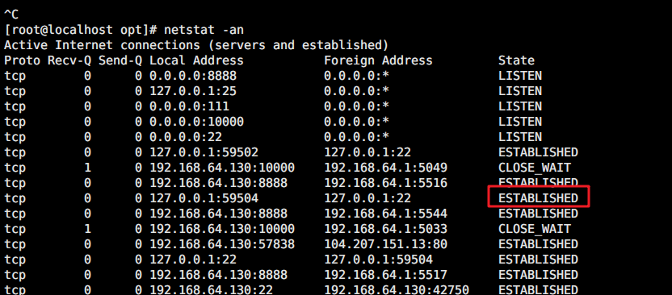

```sh
netstat -an | grep ESTABLISHED | awk -F " " '{print $5}' | cut -d ':' -f 1 | sort | uniq -c | sort -nr				   

     10 192.168.64.1
      4 127.0.0.1
      3 104.207.151.13
      2 192.168.64.130
# 解释
netstat -an \				    #查看网络连接
	| grep ESTABLISHED \		# 过滤出ESTABLISHED状态 表示连接
	| awk -F " " '{print $5}' \  # awk命令：按 空格分割  取第五块
	| cut -d ':' -f 1 \			# cut命令：按：分割，去第一块
	| sort \				   # 正序排序
	| uniq -c \				   # 统计数量
	| sort -nr				   # 倒序排序
```

#### 问题：如忘记了mysql5.7数据库的ROOT用户的密码，如何找回？（滴滴）

1. 在 `vim /etc/my.cnf` 配置部分添加 `skip-grant-tables`
2. 重启mysql服务 `service mysqld restart`
3. 使用空密码登入mysql，进入mysql数据库，

```mysql
# 更改mysql数据库中user表中root用户的authentication_string为新密码
update mysql.user set authentication_string=PASSWORD('root') where user='root';

# 刷新权限
flush privileges;
```

4. 删除 `/etc/my.cnf`  配置部分的 `skip-grant-tables`
5. 重启mysql服务 `service mysqld restart`
6. 使用新密码登入

#### 写出指令：统计ip访问情况，要求分析nginx访问目志（access.log），找出访问页面数量在前2位的ip（美团）

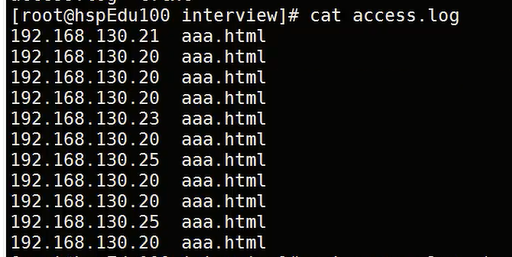

```sh
$ cat access.log | awk -F " " '{print $1}' | sort | uniq -c | sort -nr | head -2
#结果：
      7 192.168.130.20
      2 192.168.130.25


cat access.log \  # cat查看
	| awk -F " " '{print $1}' \ # 按空格分割取第一部分
	| sort \		# 统计前排序
	| uniq -c \		# 统计数量
	| sort -nr \ 	# 倒序排序
	| head -2 		# 从头显示2个
```

#### 使用tepdump监听本机，将来自ip 192.168.200.1，tcp端口为22的数据，保存输出到tcndumplog 用做将来数据分析（美团）【`>>`重定向】

```sh
# 监听ens33网卡 中来自192.168.64.1:22的访问包数据
tcpdump -i ens33 host 192.168.64.1 and port 22 >> /opt/interview/tcpdump.log
```

#### 常用的Nginx模块，用来做什么（头条）

```
rewrite模块，实现重写功能
access模块：来源控制
ssl模块：安全加密
ngx_htp_gzip_module：网络传输压缩模块划
ngx_http proxy_module 模块实现代理
ngx_http_upstream_module 模块实现定义后端服务器列表
ngx_cache_purge 实现缓存清除功能
```

#### 如果你是系统管理员，在进行Linux系统权限划分时，应考虑哪些因素？（腾讯）

1. 首先阐述Linux权限的主要对象
   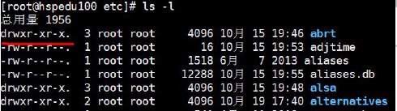
   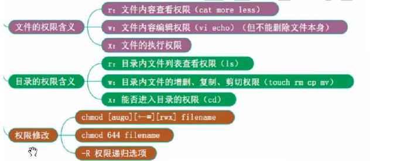
2. 根据自己实际经验谈考虑因素
   + 注意权限分离，比如；工作中，Linux系统权限和数据库权限不要在同一个部门
   + 权限最小原则（即：在满足使用的情况下最少优先）
   + 减少使用root用户，尽量用普通用户+sudo提权进行日常操作。
   + 重要的系统文件，比如/etc/passwd，/etc/shadow ，/etc/fstab，/etc/sudoers等，日常建议使用 `chattr`（change attribute）锁定，需要操作时再打开。【演示比如：锁定/etc/passwd 让任何用户都不能随意useradd，除非解除锁定】
     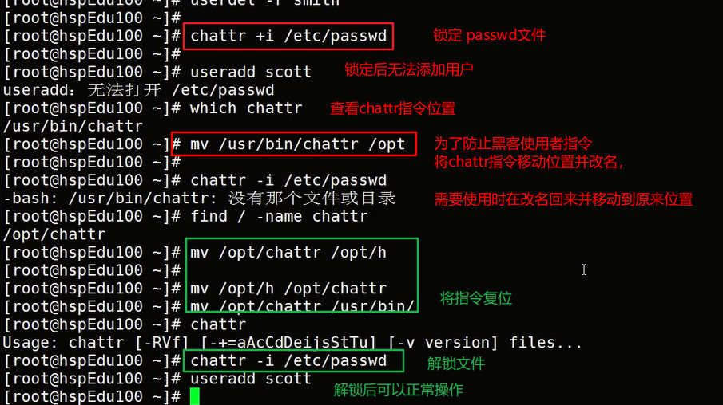
   + 使用SUID，SGID，Sticky 设置特殊权限。
   + 可以利用工具，比如**chkrootkit**/**rootkit hunter** 检测rootkit脚本（rootkit是入侵者使用工具，在不察觉的建立了入侵系统途径）[演示使用 `wget ftp://ftp.pangeia.com.br/pub/seg/pac/chkrootkit.tar.gz`]
   + 利用工具**Tripwire**检测**文件系统完整性**

#### 权限思考题

> 对test目录有写权限【w】就可以删除/目录下的文件/创建文件目录
>
> 对test有执行权限【x】可以进入目录

1. 用户tom对目录/home/test有执行x和读r写w权限，/home/test/hello.java是只读文件，问tom对hello.java文件能读吗（ok）？能修改吗（no）？**能删除吗？（ok）**

   ```sh
   /home/test				rwx
   /home/test/hello.java	 r--
   
   tom对hello.java
   读	 √
   修改	×
   删除	√
   ```
2. 用户tom对目录/home/test只有读写权限，/home/test/hello.java是只读文件，问tom对hello.java文件能读吗（no）？能修改吗（no）？能删除吗（no）？

   ```sh
   /home/test				rw-
   /home/test/hello.java	 r--
   
   tom对hello.java
   读	 ×
   修改	×
   删除	×
   ```
3. 用户tom对目录/home/test只有执行权限x，/home/test/hello.java是只读文件，问tom对hello.java文件能读吗（ok）？能修改吗（no）？能删除吗（no）？

   ```sh
   /home/test				--x
   /home/test/hello.java	 r--
   
   tom对hello.java
   读	 √
   修改	×
   删除	×
   ```
4. 用户tom对目录/home/tet只有执行和写权限，/home/test/hello.java是只读文件，问tom对hello.java文件能读吗（ok）？能修改吗（no）？能删除吗（ok）？

   ```sh
   /home/test				-wx
   /home/test/hello.java	 r--
   
   tom对hello.java
   读	 √
   修改	×
   删除	√
   ```

#### 说明Centos7启动流程，并说明和CentOS6相同和不同的地方（腾讯）

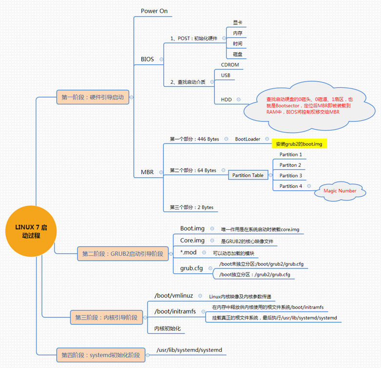

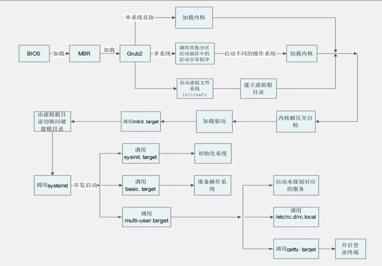

```sh
第一步、硬件启动阶段
　　这一步和CentOS6差不多，详细请看图
第二步、GRUB2引导阶段

　　从这一步开始，CentOS6和CentOS7的启动流程区别开始展现出来了。CentOS7的主引导程序使用的是grub2。

　　这一步的流程：显示加载两个镜像，再加载MOD模块文件，把grub2程序加载执行，接着解析配置文件/boot/grub2/grub.cfg，根据配置文件加载内核镜像到内存，之后构建虚拟根文件系统，最后转到内核。

　　在这里grub.cfg配置文件已经比较复杂了，但并不用担心，到了CentOS7中一般是使用命令进行配置，而不直接去修改配置文件了。不过我们可以看到grub.cfg配置文件开头注释部分说明了由/etc/grub.d/目录下文件和/etc/default/grub文件组成。

　　一般修改好配置后都需要使用命令grub2-mkconfig -o /boot/grub2/grub.cfg，将配置文件重新生成。
第三步、内核引导阶段

　　这一步与CentOS6也差不多，加载驱动，切换到真正的根文件系统，唯一不同的是执行的初始化程序变成了/usr/lib/systemd/systemd

第四步、systemed初始化阶段（又叫系统初始化阶段）
　　CentOS7中我们的初始化进程变为了systemd。执行默认target配置文件/etc/systemd/system/default.target（这是一个软链接，与默认运行级别有关）。然后执行sysinit.target来初始化系统和basic.target来准备操作系统。接着启动multi-user.target下的本机与服务器服务，并检查/etc/rc.d/rc.local文件是否有用户自定义脚本需要启动。最后执行multi-user下的getty.target及登录服务，检查default.target是否有其他的服务需要启动。

　　注意：/etc/systemd/system/default.target指向了/lib/systemd/system/目录下的graphical.target或multiuser.target。而graphical.target依赖multiuser.target，multiuser.target依赖basic.target，basic.target依赖sysinit.target，所以倒过来执行。

　　System概述（了解）：systemd即为system daemon，是Linux下的一种init软件，开发目标是提供更优秀的框架以表示系统服务间的以来关系，并依此实现系统初始化时服务的并行启动，同时达到降低Shell系统开销的效果，最终代替现在常用的System V与BSD风格的init程序。

　　与多数发行版使用的System V风格的init相比，systemd采用了以下的新技术：A.采用Socket激活式与总线激活式服务，以提高相互依赖的各服务的并行运行性能；B.用Cgroup代替PID来追踪进程，即使是两次fork之后生成的守护进程也不会脱离systemd的控制。

　　unit对象：unit表示不同类型的systemd对象，通过配置文件进行标识和配置；文件中主要包含了系统服务、监听socket、保存的系统快照以及其他与init相关的信息。（也就是CentOS6中的服务器启动脚本）

(1)./etc/systemd/system/default.target

　　这是一个软链接，和默认运行级别相关

# ll /etc/systemd/system/default.target
lrwxrwxrwx. 1 root root 36 12月  9 15:47 /etc/systemd/system/default.target -> /lib/systemd/system/graphical.target
我们可以到这个目录下看看
# cd /lib/systemd/system/
# ls *.target
anaconda.target            local-fs.target           runlevel2.target
basic.target               machines.target           runlevel3.target
bluetooth.target           multi-user.target         runlevel4.target
cryptsetup-pre.target      network-online.target     runlevel5.target
cryptsetup.target          network-pre.target        runlevel6.target
ctrl-alt-del.target        network.target            shutdown.target
default.target             nfs-client.target         sigpwr.target
emergency.target           nss-lookup.target         sleep.target
final.target               nss-user-lookup.target    slices.target
getty-pre.target           paths.target              smartcard.target
getty.target               poweroff.target           sockets.target
graphical.target           printer.target            sound.target
halt.target                rdma-hw.target            suspend.target
hibernate.target           reboot.target             swap.target
hybrid-sleep.target        remote-cryptsetup.target  sysinit.target
initrd-fs.target           remote-fs-pre.target      system-update.target
initrd-root-fs.target      remote-fs.target          timers.target
initrd-switch-root.target  rescue.target             time-sync.target
initrd.target              rpcbind.target            umount.target
iprutils.target            rpc_pipefs.target         virt-guest-shutdown.target
kexec.target               runlevel0.target
local-fs-pre.target        runlevel1.target
这里可以看到runlevel开头的target文件，对应着CentOS6的启动级别，不过一样是软链接，指向了同目录下的其他文件，也算一种向下兼容吧

# ll runlevel*.target
lrwxrwxrwx. 1 root root 15 4月   5 22:10 runlevel0.target -> poweroff.target
lrwxrwxrwx. 1 root root 13 4月   5 22:10 runlevel1.target -> rescue.target
lrwxrwxrwx. 1 root root 17 4月   5 22:10 runlevel2.target -> multi-user.target
lrwxrwxrwx. 1 root root 17 4月   5 22:10 runlevel3.target -> multi-user.target
lrwxrwxrwx. 1 root root 17 4月   5 22:10 runlevel4.target -> multi-user.target
lrwxrwxrwx. 1 root root 16 4月   5 22:10 runlevel5.target -> graphical.target
lrwxrwxrwx. 1 root root 13 4月   5 22:10 runlevel6.target -> reboot.target
可以看到我的default.target与runlevel5.target指向的是同一个文件，可以看出我的默认运行级别是5。

(2)./usr/lib/systemd/system/

这个目录存储每个服务的脚本，类似CentOS6的/etc/init.d/。

(2)./run/systemd/system/

系统执行过程中产生的脚本。

(3)./etc/systemd/system/

类似于CentOS6的/etc/rc.d/rc#.d/SXX类文件的功能，管理员建立的执行脚本，大部分是软链接

Over

```

#### 问题：列举Linux高级命令，至少6个（百度）

```
netstat	//网络状态监控
top//系统运行状态
lsblk//查看硬盘分区
find
ps-aux//查看运行进程
chkconfig//查看服务启动状态
systemctl//管理系统服务器
```

#### 问题：Linux查看内存[`top`]、io读写[`iotop`]、磁盘存储[`df -lh`]、端口占用[`netstat -tunlp`]、进程查看命令[`ps-aux | grep ps_name`]是什么？（瓜子）

#### 使用Linux命令计算t2.txt第二列的和并输出（美团）

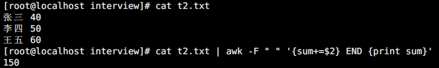

```sh
# 		   wak: 以空格分割，并将第二部分求和，打印sum
cat t2.txt | awk -F " " '{sum+=$2} END {print sum}'
```

#### Shell脚本里如何检查一个文件是否存在？并给出提示（百度）

```sh
if[ -f 文件名 ] then echo "存在" else  echo "不存在" fi
```

#### 用shell写一个脚本，对文本t3.txt中无序的一列数字排序，并将总和输出（百度）

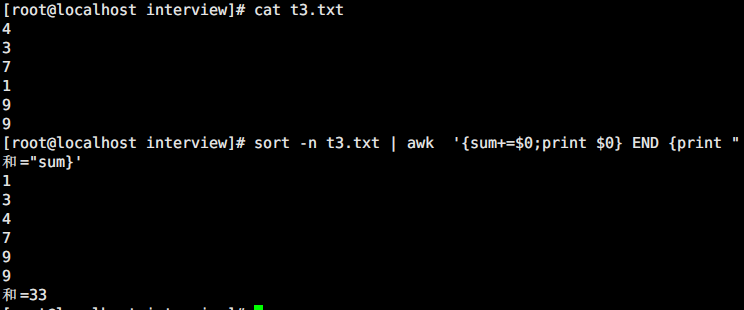

```sh
sort -n t3.txt | awk  '{sum+=$0;print $0} END {print "和="sum}'
```

#### 请用指令写出查找当前文件夹（/home）下所有的文本文件内容中包含有字符"cat"的文件名称（金山）

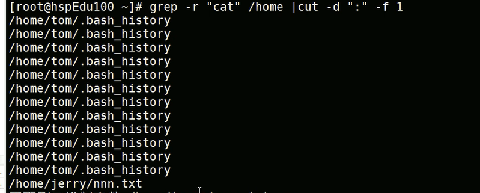

```sh
grep -r "cat" /home | cut -d ":" -f 1
```

#### 请写出统计/home目录下所有文件个数和所有文件总行数的指令（在金山面试题扩展）

```sh
find /home -name "*.*" |  wc -l		 # 统计每个目录下
find /home -name "*.*" | xargs wc -l # 显示每个文件的行数
```

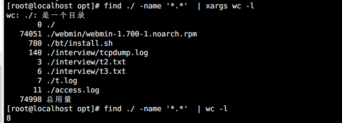

#### 列出你了解的web服务器负载架构（滴滴）

Nginx、Haproxy、Keepalived、LVS

#### 每天晚上10点30分，打包站点目录/var/spool/mail备份到/home目录下（每次备份按时间生成不同的备份包比如按照年月日时分秒）（滴滴）

1.编写脚本

```sh
#!/bin/bash

# `` 返回命令执行结果
FILE_NAME=`date +%Y-%m-%d_%H_%M_%S`

# 进入var目录后，执行打包，将mail目录下打包mail-date.tar.gz
cd /var && /bin/tar -zcf /home/mail-${FILE_NAME}.tar.gz mail/
```

2. 配置定时任务

`crontab -e` 编辑定时任务，添加如下内容

`30 22 * * * /bin/sh /root/mail.sh`

#### 如何优化Linux系统，说出你的方法（瓜子）

1）对Linux的架构的优化，和原则分析（示意图）


2）对linux系统本身的优化-规则
（1）不用root，使用sudo提示权限
（2）定时的自动更新服务时间，使用 `nptdate npt1.aliyun.com`，让croud定时更新
（3）配置yum源，指向国内镜像（清华，163）
（4）配置合理的防火墙策略，打开必要的端口，关闭不必要的端口
（5）打开最大文件数（调整文件的描述的数量）`vim/etc/profile ` 添加 `ulimit -SHn 65535`
（6）配置合理的监控策略
（7）配置合理的系统重要文件的备份策略
（8）对安装的软件进行优化，比如nginx，apache
（9）内核参数进行优化/etc/sysetl.conf
（10）锁定一些重要的系统文件 `chattr` /etc/passwd /ect/shadow /etc/inittab
（11）禁用不必要的服务 `setup`，`ntsysv`
