# docker
## Docker手册

中文免费手册 [Docker — 从入门到实践]  
[https://vuepress.mirror.docker-practice.com](https://vuepress.mirror.docker-practice.com)

docker 从入门到实践，离线版

```sh
docker pull dockerpracticecn/docker_practice
docker run -it --rm -p 4000:80 dockerpracticecn/docker_practice
```

## Docker简介

### 前提知识+课程定位

Linux git maven

### 是什么

- 问题：为什么会有docker出现

  一款产品从开发到上线，从操作系统，到运行环境，再到应用配置。作为开发+运维之间的协作我们需要关心很多东西，这也是很多互联网公司都不得不面对的问题，特别是各种版本的迭代之后，不同版本环境的兼容，对运维人员都是考验Docker之所以发展如此迅速，也是因为它对此给出了一个标准化的解决方案。环境配置如此麻烦，换一台机器，就要重来一次，费力费时。很多人想到，能不能从根本上解决问题，软件可以带环境安装？也就是说，安装的时候，把原始环境一模一样地复制过来。开发人员利用 Docker 可以消除协作编码时“在我的机器上可正常工作”的问题。  

  之前在服务器配置一个应用的运行环境，要安装各种软件，就拿尚硅谷电商项目的环境来说吧，Java/Tomcat/MySQL/JDBC驱动包等。安装和配置这些东西有多麻烦就不说了，它还不能跨平台。假如我们是在 Windows 上安装的这些环境，到了 Linux 又得重新装。况且就算不跨操作系统，换另一台同样操作系统的服务器，要移植应用也是非常麻烦的。 

  传统上认为，软件编码开发/测试结束后，所产出的成果即是程序或是能够编译执行的二进制字节码等(java为例)。而为了让这些程序可以顺利执行，开发团队也得准备完整的部署文件，让维运团队得以部署应用程式，开发需要清楚的告诉运维部署团队，用的全部配置文件+所有软件环境。不过，即便如此，仍然常常发生部署失败的状况。Docker镜像的设计，使得Docker得以打破过去「程序即应用」的观念。透过**镜像(images)**将作业系统核心除外，运作应用程式所需要的系统环境，由下而上打包**，达到应用程式跨平台间的无缝接轨运作。**
  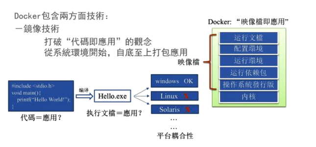

- docker理念

   Docker是基于Go语言实现的云开源项目。

   Docker的主要目标是“Build，Ship and Run Any App,Anywhere”，也就是通过对应用组件的封装、分发、部署、运行等生命周期的管理，使用户的APP（可以是一个WEB应用或数据库应用等等）及其运行环境能够做到**“一次封装，到处运行”。**
   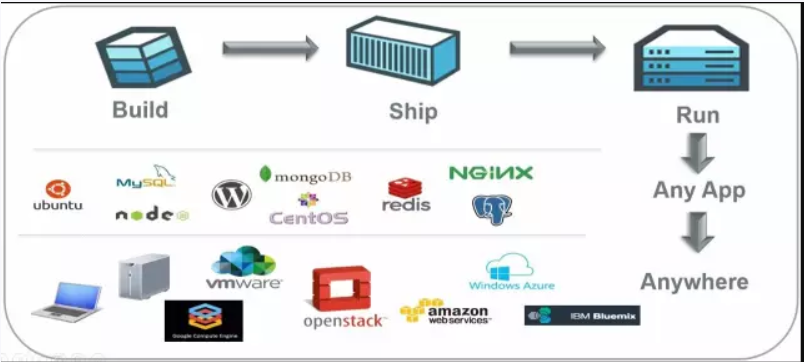

   Linux 容器技术的出现就解决了这样一个问题，而 Docker 就是在它的基础上发展过来的。将应用运行在 Docker 容器上面，而 Docker 容器在任何操作系统上都是一致的，这就实现了跨平台、跨服务器。**只需要一次配置好环境，换到别的机子上就可以一键部署好，大大简化了操作**

- 一句话

	- 解决了运行环境和配置问题软件容器，方便做持续集成并有助于整体发布的容器虚拟化技术。
	- docker 三要素：容器、镜像、仓库

### 能干嘛

- 之前的虚拟机技术

  虚拟机（virtual machine）就是带环境安装的一种解决方案。

  它可以在一种操作系统里面运行另一种操作系统，比如在Windows 系统里面运行Linux 系统。应用程序对此毫无感知，因为虚拟机看上去跟真实系统一模一样，而对于底层系统来说，虚拟机就是一个普通文件，不需要了就删掉，对其他部分毫无影响。这类虚拟机完美的运行了另一套系统，能够使应用程序，操作系统和硬件三者之间的逻辑不变。  
  虚拟机的缺点：1、资源占用多               2、冗余步骤多                 3 、启动慢

- 容器虚拟化技术

   由于前面虚拟机存在这些缺点，Linux 发展出了另一种虚拟化技术：Linux 容器（Linux Containers，缩写为 LXC）。Linux 容器不是模拟一个完整的操作系统，而是对进程进行隔离。有了容器，就可以将软件运行所需的所有资源打包到一个隔离的容器中。容器与虚拟机不同，不需要捆绑一整套操作系统，只需要软件工作所需的库资源和设置。系统因此而变得高效轻量并保证部署在任何环境中的软件都能始终如一地运行。 比较了 Docker 和


   传统虚拟化方式的不同之处：

   + 传统虚拟机技术是虚拟出一套硬件后，在其上运行一个完整操作系统，在该系统上再运行所需应用进程；
   + 而容器内的应用进程直接运行于宿主的内核，容器内没有自己的内核，**而且也没有进行硬件虚拟**。因此容器要比传统虚拟机更为轻便。
   + 每个容器之间互相隔离，每个容器有自己的文件系统 ，容器之间进程不会相互影响，能区分计算资源。

- 开发/运维（DevOps）

	- 一次构建、随处运行

		- 更快速的应用交付和部署

	    传统的应用开发完成后，需要提供一堆安装程序和配置说明文档，安装部署后需根据配置文档进行繁杂的配置才能正常运行。Docker化之后只需要交付少量容器镜像文件，在正式生产环境加载镜像并运行即可，应用安装配置在镜像里已经内置好，大大节省部署配置和测试验证时间。

	- 更便捷的升级和扩缩容

	  随着微服务架构和Docker的发展，大量的应用会通过微服务方式架构，应用的开发构建将变成搭乐高积木一样，每个Docker容器将变成一块“积木”，应用的升级将变得非常容易。当现有的容器不足以支撑业务处理时，可通过镜像运行新的容器进行快速扩容，使应用系统的扩容从原先的天级变成分钟级甚至秒级。

	- 更简单的系统运维

	  应用容器化运行后，生产环境运行的应用可与开发、测试环境的应用高度一致，容器会将应用程序相关的环境和状态完全封装起来，不会因为底层基础架构和操作系统的不一致性给应用带来影响，产生新的BUG。当出现程序异常时，也可以通过测试环境的相同容器进行快速定位和修复。

	- 更高效的计算资源利用

	  　Docker是内核级虚拟化，其不像传统的虚拟化技术一样需要额外的Hypervisor支持，所以在一台物理机上可以运行很多个容器实例，可大大提升物理服务器的CPU和内存的利用率。

- 企业级

	- 新浪 

	- 美团

	- 蘑菇街
- ......

### 去哪下

- 官网

	- docker官网：http://www.docker.com
	- docker中文网站：https://www.docker-cn.com/

- 仓库

	- Docker Hub官网: https://hub.docker.com/

## Docker安装

### 前提说明

**CentOS Docker 安装**

Docker支持以下的CentOS

版本：CentOS 7 (64-bit)

CentOS 6.5 (64-bit) 或更高的版本 

**前提条件**

目前，CentOS 仅发行版本中的内核支持 Docker。

Docker 运行在 CentOS 7 上，要求系统为64位、系统内核版本为 3.10 以上。

Docker 运行在 CentOS-6.5 或更高的版本的 CentOS 上，要求系统为64位、系统内核版本为 2.6.32-431 或者更高版本。 


**查看自己的内核**

uname命令用于打印当前系统相关信息（内核版本号、硬件架构、主机名称和操作系统类型等）。 

```sh
[root@localhost ~]$ uname -r
3.10.0-1062.el7.x86_64
```

**查看已安装的CentOS版本信息（CentOS6.8有，CentOS7无该命令）**          

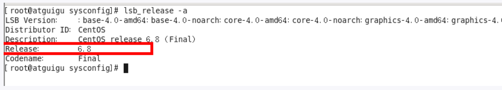

7.0版本查看

```sh
[root@localhost ~]$ cat /etc/redhat-release
CentOS Linux release 7.7.1908 (Core)
```

### Docker的基本组成

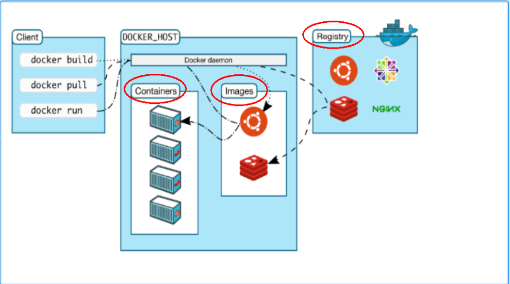

- 镜像（image）

  Docker 镜像（Image）就是一个**只读**的模板。镜像可以用来创建 Docker 容器，**一个镜像可以创建很多容器**。  
  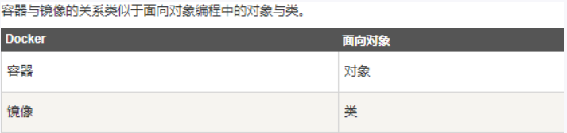

- 容器（container）

   Docker 利用容器（Container）独立运行的一个或一组应用。**容器是用镜像创建的运行实例。** 

   它可以被启动、开始、停止、删除。每个容器都是相互隔离的、保证安全的平台。 

   **可以把容器看做是一个简易版的 Linux 环境**（包括root用户权限、进程空间、用户空间和网络空间等）和运行在其中的应用程序。

   容器的定义和镜像几乎一模一样，也是一堆层的统一视角，唯一区别在于容器的最上面那一层是可读可写的。

- 仓库（repository）

   仓库（Repository）是集中**存放镜像文件**的场所。

   仓库(Repository)和仓库注册服务器（Registry）是有区别的。仓库注册服务器上往往存放着多个仓库，每个仓库中又包含了多个镜像，每个镜像有不同的标签（tag）。 

   仓库分为公开仓库（Public）和私有仓库（Private）两种形式。

   最大的公开仓库是 Docker Hub(https://hub.docker.com/)，存放了数量庞大的镜像供用户下载。国内的公开仓库包括阿里云 、网易云 等

- 小总结

  需要正确的理解仓储/镜像/容器这几个概念:  

  Docker 本身是一个容器运行载体或称之为管理引擎。我们把应用程序和配置依赖打包好形成一个可交付的运行环境，这个打包好的运行环境就似乎 image镜像文件。只有通过这个镜像文件才能生成 Docker 容器。image 文件可以看作是容器的模板。Docker 根据 image 文件生成容器的实例。同一个 image 文件，可以生成多个同时运行的容器实例。

   *  image 文件生成的容器实例，本身也是一个文件，称为镜像文件。
   *  一个容器运行一种服务，当我们需要的时候，就可以通过docker客户端创建一个对应的运行实例，也就是我们的容器 
   *  至于仓储，就是放了一堆镜像的地方，我们可以把镜像发布到仓储中，需要的时候从仓储中拉下来就可以了。 

### 安装步骤

- CentOS6.8安装Docker

  - `yum install -y epel-release`

    Docker使用EPEL发布，RHEL系的OS首先要确保已经持有EPEL仓库，否则先检查OS的版本，然后安装相应的EPEL包。

    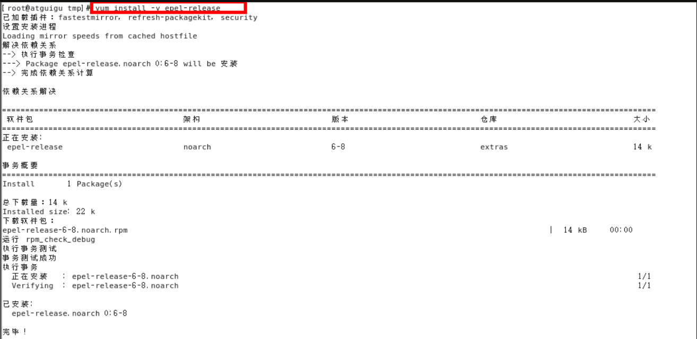

  - `yum install -y docker-io`
    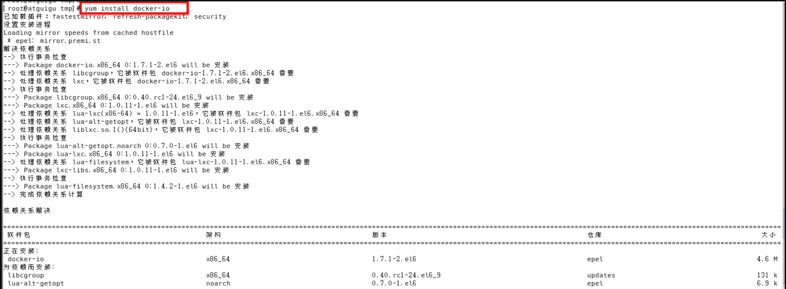

  - 安装后的配置文件：`/etc/sysconfig/docker`
    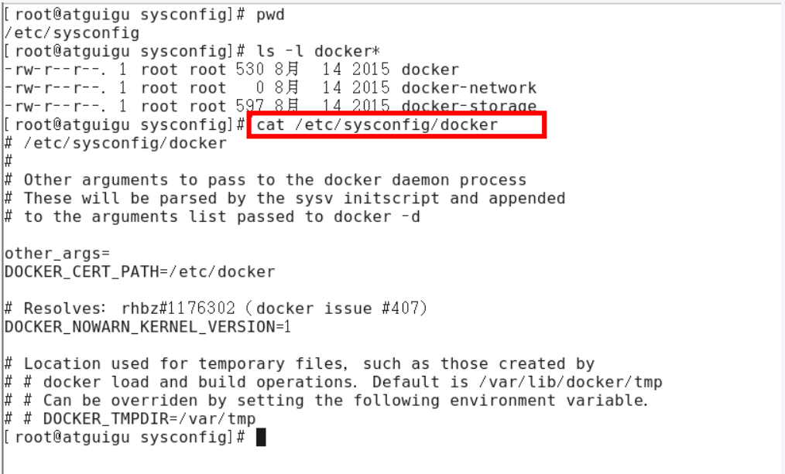

  - 启动Docker后台服务：`service docker start`

  - `docker version`验证
    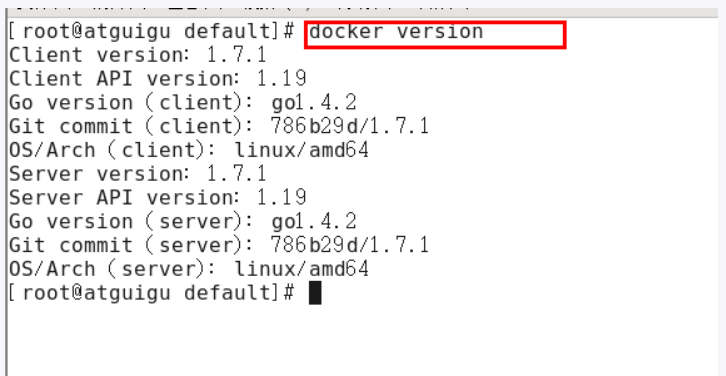

- CentOS7安装Docker


​	
- https://docs.docker.com/install/linux/docker-ce/centos/
- 安装步骤

	- 官网中文安装参考手册

		- https://docs.docker-cn.com/engine/installation/linux/docker-ce/centos/#prerequisites

	- 确定你是CentOS7及以上版本

		- `cat /etc/redhat-release`

	- yum安装gcc相关

		- CentOS7能上外网

			- Subtopic

		- `yum -y install gcc`
		- `yum -y install gcc-c++`

	- 卸载旧版本【二选一】

	  - `yum -y remove docker docker-common docker-selinux docker-engine`
	
	  - 2018.3官网版本
	
	    ```sh
	    yum remove docker \
	                      docker-client \
	                      docker-client-latest \
	                      docker-common \
	                      docker-latest \
	                      docker-latest-logrotate \
	                      docker-logrotate \
	                      docker-selinux \
	                      docker-engine-selinux \
	                      docker-engine
	    ```
	- 安装需要的软件包
	
		- `yum install -y yum-utils device-mapper-persistent-data lvm2`
	
	- 设置stable镜像仓库
	
		- > 大坑【国外速度慢】
	>
	>	> - `yum-config-manager --add-repo https://download.docker.com/linux/centos/docker-ce.repo`
	>		
	>	>    报错：
	>	1   [Errno 14] curl#35 - TCP connection reset by peer 
	>	2   [Errno 12] curl#35 - Timeout
	
	```sh
	# **推荐**
	
	yum-config-manager --add-repo http://mirrors.aliyun.com/docker-ce/linux/centos/docker-ce.repo
	```
	
	- 更新yum软件包索引
	
		- `yum makecache fast`
	
	- 安装DOCKER CE版本：社区版本免费
	
		- `yum -y install docker-ce`
	
	- 启动docker
	
		- `systemctl start docker`
	
	- 测试
	
		- `docker version`
		- `docker run hello-world`
	
	- 配置镜像加速
	
	  - `mkdir -p /etc/docker`
	
	  - `vim  /etc/docker/daemon.json`
	
	      ```json
	      # 网易云
	      {"registry-mirrors": ["http://hub-mirror.c.163.com"] }
	       # 阿里云
	      sudo tee /etc/docker/daemon.json <<-'EOF'
	      {
	        "registry-mirrors": ["https://3avp670w.mirror.aliyuncs.com"]
	      }
	      EOF
	      
	      ------或者执行如下命令
	      cat <<EOF > /etc/docker/daemon.json
	      {
	        "registry-mirrors": [
	          "https://dockerhub.azk8s.cn",
	          "https://hub-mirror.c.163.com"
	        ]
	      }
	      EOF
	      ```
	
	  - 重新加载docker配置`systemctl daemon-reload`
	
	  - 重启docker服务`systemctl restart docker`
	
	  - 查看镜像配置`docker info`
	
	      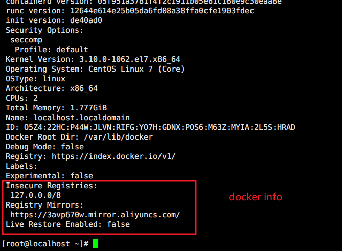
	
	- 开机自启`systemctl enable docker`
	
	- 卸载
	
		- `systemctl stop docker` 【停止】
		- `yum -y remove docker-ce`
		- `rm -rf /var/lib/docker`		  


​		  


​		      


### 永远的HelloWorld

- 阿里云镜像加速

  - 是什么

    - https://dev.aliyun.com/search.html
    - https://cr.console.aliyun.com/cn-hangzhou/instances/mirrors

  - 注册一个属于自己的阿里云账户(可复用淘宝账号)

  - 获得加速器地址连接

  	- 登陆阿里云开发者平台
  	- 获取加速器地址

  	   

  - 配置本机Docker运行镜像加速器

     鉴于国内网络问题，后续拉取 Docker 镜像十分缓慢，我们可以需要配置加速器来解决，我使用的是阿里云的本人自己账号的镜像地址(需要自己注册有一个属于你自己的)：   https://xxxx.mirror.aliyuncs.com 

     *  `vim /etc/sysconfig/docker`   将获得的自己账户下的阿里云加速地址配置进`other_args="--registry-mirror=https://你自己的账号加速信息.mirror.aliyuncs.com"` 【6.8版本】

  - 重新启动Docker后台服务：`service docker restart`

  - Linux 系统下配置完加速器需要检查是否生效

     如果从结果中看到了配置的--registry-mirror参数说明配置成功，如下所示: 
    
       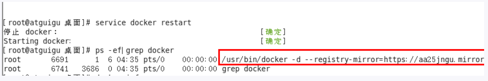

- 网易云加速

	- 基本同上述阿里云

	     配置Json串的地方不同了: `{ "registry-mirrors": ["http://hub-mirror.c.163.com"]}` 

- 启动Docker后台容器(测试运行 hello-world)

	- `docker run hello-world`
	  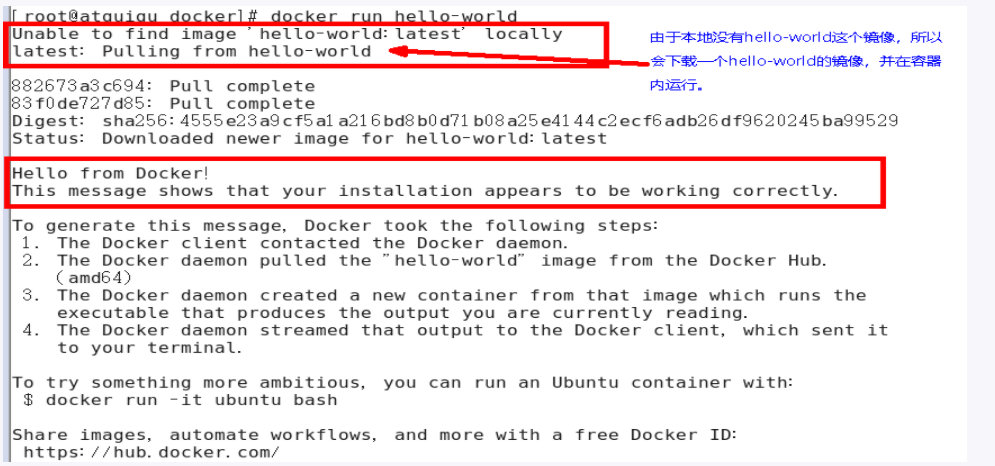
	
	  输出这段提示以后，hello world就会停止运行，容器自动终止。
	
	- run干了什么
	  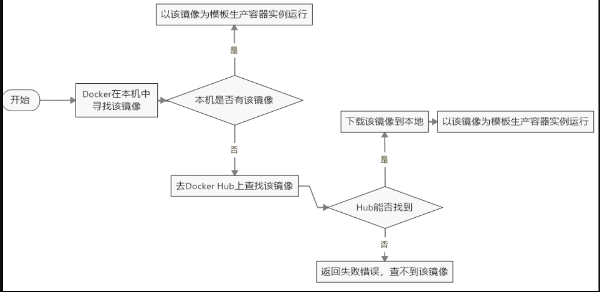

### 底层原理

- Docker是怎么工作的

  Docker是一个Client-Server结构的系统，Docker守护进程运行在主机上， 然后通过Socket连接从客户端访问，守护进程从客户端接受命令并管理运行在主机上的容器。 **容器，是一个运行时环境，就是我们前面说到的集装箱。**
  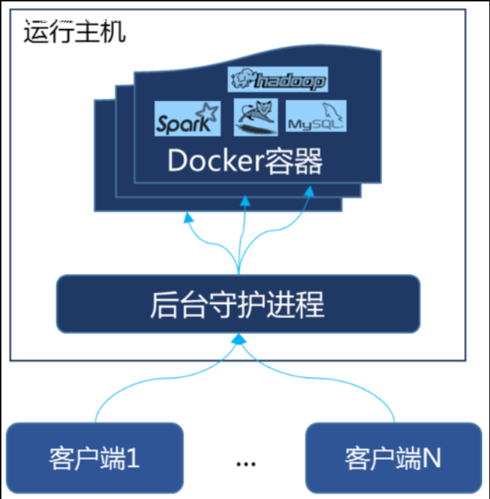

- 为什么Docker比较比VM快

  (1)docker有着比虚拟机更少的抽象层。由亍docker不需要Hypervisor实现硬件资源虚拟化,运行在docker容器上的程序直接使用的都是实际物理机的硬件资源。因此在CPU、内存利用率上docker将会在效率上有明显优势。 
  
  (2)docker利用的是宿主机的内核,而不需要Guest OS。因此,当新建一个容器时,docker不需要和虚拟机一样重新加载一个操作系统内核。仍而避免引寻、加载操作系统内核返个比较费时费资源的过程,当新建一个虚拟机时,虚拟机软件需要加载Guest OS,返个新建过程是分钟级别的。而docker由于直接利用宿主机的操作系统,则省略了返个过程,因此新建一个docker容器只需要几秒钟。     
  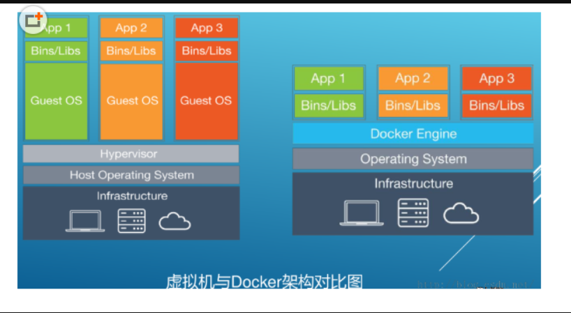
  
  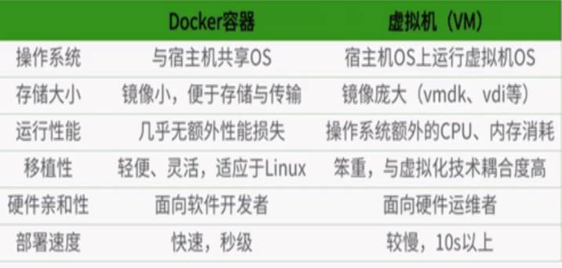

## Docker常用命令

### 帮助命令

- `docker version`

- `docker info`

- `docker --help`

  ```sh
  [root@localhost ~]$ docker --help
  
  Usage:  docker [OPTIONS] COMMAND
  
  A self-sufficient runtime for containers
  
  Options:
        --config string      Location of client config files (default "/root/.docker")
    -c, --context string     Name of the context to use to connect to the daemon (overrides DOCKER_HOST env
                             var and default context set with "docker context use")
    -D, --debug              Enable debug mode
    -H, --host list          Daemon socket(s) to connect to
    -l, --log-level string   Set the logging level ("debug"|"info"|"warn"|"error"|"fatal") (default "info")
        --tls                Use TLS; implied by --tlsverify
        --tlscacert string   Trust certs signed only by this CA (default "/root/.docker/ca.pem")
        --tlscert string     Path to TLS certificate file (default "/root/.docker/cert.pem")
        --tlskey string      Path to TLS key file (default "/root/.docker/key.pem")
        --tlsverify          Use TLS and verify the remote
    -v, --version            Print version information and quit
  
  Management Commands:
    app*        Docker App (Docker Inc., v0.9.1-beta3)
    builder     Manage builds
    buildx*     Build with BuildKit (Docker Inc., v0.5.1-docker)
    config      Manage Docker configs
    container   Manage containers
    context     Manage contexts
    image       Manage images
    manifest    Manage Docker image manifests and manifest lists
    network     Manage networks
    node        Manage Swarm nodes
    plugin      Manage plugins
    scan*       Docker Scan (Docker Inc.)
    secret      Manage Docker secrets
    service     Manage services
    stack       Manage Docker stacks
    swarm       Manage Swarm
    system      Manage Docker
    trust       Manage trust on Docker images
    volume      Manage volumes
  
  Commands:
    attach      Attach local standard input, output, and error streams to a running container
    build       Build an image from a Dockerfile
    commit      Create a new image from a container's changes
    cp          Copy files/folders between a container and the local filesystem
    create      Create a new container
    diff        Inspect changes to files or directories on a container's filesystem
    events      Get real time events from the server
    exec        Run a command in a running container
    export      Export a container's filesystem as a tar archive
    history     Show the history of an image
    images      List images
    import      Import the contents from a tarball to create a filesystem image
    info        Display system-wide information
    inspect     Return low-level information on Docker objects
    kill        Kill one or more running containers
    load        Load an image from a tar archive or STDIN
    login       Log in to a Docker registry
    logout      Log out from a Docker registry
    logs        Fetch the logs of a container
    pause       Pause all processes within one or more containers
    port        List port mappings or a specific mapping for the container
    ps          List containers
    pull        Pull an image or a repository from a registry
    push        Push an image or a repository to a registry
    rename      Rename a container
    restart     Restart one or more containers
    rm          Remove one or more containers
    rmi         Remove one or more images
    run         Run a command in a new container
    save        Save one or more images to a tar archive (streamed to STDOUT by default)
    search      Search the Docker Hub for images
    start       Start one or more stopped containers
    stats       Display a live stream of container(s) resource usage statistics
    stop        Stop one or more running containers
    tag         Create a tag TARGET_IMAGE that refers to SOURCE_IMAGE
    top         Display the running processes of a container
    unpause     Unpause all processes within one or more containers
    update      Update configuration of one or more containers
    version     Show the Docker version information
    wait        Block until one or more containers stop, then print their exit codes
  
  Run 'docker COMMAND --help' for more information on a command.
  
  To get more help with docker, check out our guides at https://docs.docker.com/go/guides/
  ```

### 镜像命令

- **列出本地主机上的镜像**

  - `docker images`

  - **列出本地主机上的镜像**
     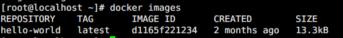

     各个选项说明:

     ```
     REPOSITORY：表示镜像的仓库源
     TAG：镜像的标签
     IMAGE ID：镜像ID
     CREATED：镜像创建时间
     SIZE：镜像大小
     ```

     同一仓库源可以有多个 TAG，代表这个仓库源的不同个版本，我们使用 *REPOSITORY:TAG* 来定义不同的镜像。

     如果你不指定一个镜像的版本标签，例如你只使用 ubuntu，docker 将默认使用 ubuntu:latest 镜像

  - OPTIONS说明：

    ```sh
    -a :列出本地所有的镜像（含中间映像层）
    -q :只显示镜像ID。
    --digests :显示镜像的摘要信息[更多信息部分显示]
    --no-trunc :显示完整的镜像信息[完整信息]
    ```

- **查询镜像**

  - 命令：`docker search 某个XXX镜像名字`

  - 查询的网站

    - https://hub.docker.com

  - 命令

    - `docker search [OPTIONS] 镜像名字`

    - OPTIONS说明：

      ```sh
      --no-trunc : 显示完整的镜像描述
      -s : 列出收藏数不小于指定值的镜像。
      --automated : 只列出 automated build类型的镜像；
      ```

- **下载镜像**

  - `docker pull 镜像名字[:TAG]`
  - 省略标签TAG时，默认标签`:latest`

- 删除镜像

  - `docker rmi 某个XXX镜像名字ID`
  - 删除单个

    - `docker rmi  -f 镜像ID`

  - 删除多个

    - `docker rmi -f 镜像名1:TAG 镜像名2:TAG` 

  - 删除全部[清库]

    - `docker rmi -f $(docker images -qa)`

- 思考

	- 结合我们Git的学习心得，大家猜猜是否会有
docker commit /docker push？？

### 容器命令

- > *有镜像才能创建容器*，这是根本前提(下载一个CentOS镜像演示)
  >
  > `docker pull centos`

- **新建并启动容器**

  - `docker run [OPTIONS] IMAGE [COMMAND] [ARG...]`

  	- OPTIONS说明

  	     OPTIONS说明（常用）：有些是一个减号，有些是两个减号 

  	 `--name="容器新名字"`: 为容器指定一个名称；
  	 `-d`: 后台运行容器，并返回容器ID，也即启动守护式容器；
  	 **`-i`：以交互模式运行容器，通常与 -t 同时使用；**
  	 **`-t`：为容器重新分配一个伪输入终端，通常与 -i 同时使用；**
  	 `-P`: 随机端口映射；【大写】
  	 **`-p:` 指定端口映射，有以下四种格式**
  	       ip:hostPort:containerPort
  	       ip::containerPort
  	       **hostPort:containerPort**
  	       containerPort
  	
  	- 启动交互式容器
  	
  	  使用镜像centos:latest以交互模式启动一个容器,在容器内执行/bin/bash命令。`docker run -it centos /bin/bash`  
  	  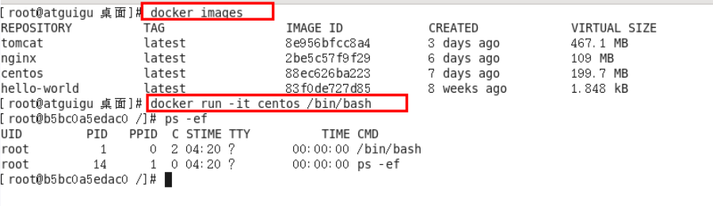

- **列出当前所有*正在运行*的容器**

  - `docker ps [OPTIONS]`

  	-  OPTIONS说明

  	  OPTIONS说明（常用）： 
  	
  	  `-a` :列出当前所有正在运行的容器+历史上运行过的【默认显示当前正在运行的容器】
  	
  	  `-l` :显示最近创建的容器。
  	
  	  `-n`：显示最近n个创建的容器。
  	
  	  **`-q` :静默模式，只显示容器编号。**
  	
  	  `--no-trunc` :不截断输出。

- **退出容器**

	- 两种退出方式

		- `exit`
		- 容器停止退出
		
	- `ctrl+P+Q`
		- 容器不停止退出

- **启动容器**

	- `docker start 容器ID或者容器名`

- **重启容器**

	- `docker restart 容器ID或者容器名`

- **停止容器**

	- `docker stop 容器ID或者容器名`

- **强制停止容器**

	- `docker kill 容器ID或者容器名`

- **删除*已停止*的容器**

	- `docker rm 容器ID`
		- 一次性删除多个容器
		
			- `docker rm -f $(docker ps -a -q)`
			- `docker ps -a -q | xargs docker rm`
	
- 重要

  - **启动守护式容器**

    - `docker run -d 容器名`

       使用镜像centos:latest以后台模式启动一个容器`docker run -d centos` 
      
         问题：然后`docker ps -a` 进行查看, *会发现容器已经退出*
      
         很重要的要说明的一点: **Docker容器后台运行,就必须有一个前台进程.**
      
         容器运行的命令**如果不是那些一直挂起的命令**（比如运行top，tail），就是会**自动退出**的。
    
        
    
       这个是**docker的机制**问题,比如你的web容器,我们以nginx为例，正常情况下,我们配置启动服务只需要启动响应的service即可。例如
    
       `service nginx start`
    
       但是,这样做,nginx为后台进程模式运行,就导致docker前台没有运行的应用,
    
       这样的容器后台启动后,会立即自杀因为他觉得他没事可做了.
    
       所以，最佳的解决方案是,将你要运行的程序以前台进程的形式运行

  - **查看容器日志**

    - `docker logs -f -t --tail 容器ID`

         参数

        ```sh
        -t 是加入时间戳
        -f 跟随最新的日志打印
        --tail 数字 显示最后多少条
        ```

        后台运行必须有前台进程，否则容器自动退出

        `docker run -d centos /bin/sh -c "while true;do echo hello zzyy;sleep 2;done"` 

        ```sh
        [root@localhost ~]$ docker ps
        CONTAINER ID   IMAGE     COMMAND   CREATED   STATUS    PORTS     NAMES
        # 以后台启动centos容器，并执行循环命令否则容器会自动退出
        [root@localhost ~]$ docker run -d centos /bin/sh -c "while true;do echo hello zzyy;sleep 2;done"
        0393f343e45069e12b12f97f04e44b7f1e98a5598364f7a79db92333e63098b3
        
        [root@localhost ~]$ docker ps # 查看正在运行的容器
        CONTAINER ID   IMAGE     COMMAND                  CREATED         STATUS         PORTS     NAMES
        0393f343e450   centos    "/bin/sh -c 'while t…"   3 seconds ago   Up 3 seconds             romantic_volhard
        
        # 查看id=0393f343e450容器的日志   -t 时间戳  -f跟随最新的日志  --tail显示最后的多少条
        [root@localhost ~]$ docker logs -t -f --tail 5 0393f343e450
        2021-05-19T16:27:29.557680820Z hello zzyy
        2021-05-19T16:27:31.562684799Z hello zzyy
        2021-05-19T16:27:33.567709759Z hello zzyy
        2021-05-19T16:27:35.573240862Z hello zzyy
        2021-05-19T16:27:37.575688003Z hello zzyy
        2021-05-19T16:27:39.581054622Z hello zzyy
        ```

  - 查看容器内运行的进程

    - `docker top 容器ID`

      ```sh
      [root@localhost ~]$ docker top 0393f343e450
      UID                 PID                 PPID                C                   STIME               TTY                 TIME                CMD
      root                36926               36906               0                   00:27               ?                   00:00:00            /bin/sh -c while true;do echo hello zzyy;sleep 2;done
      root                37094               36926               0                   00:30               ?                   00:00:00            /usr/bin/coreutils --coreutils-prog-shebang=sleep /usr/bin/sleep 2
      ```

  - **查看容器内部细节**

    - `docker inspect 容器ID`
      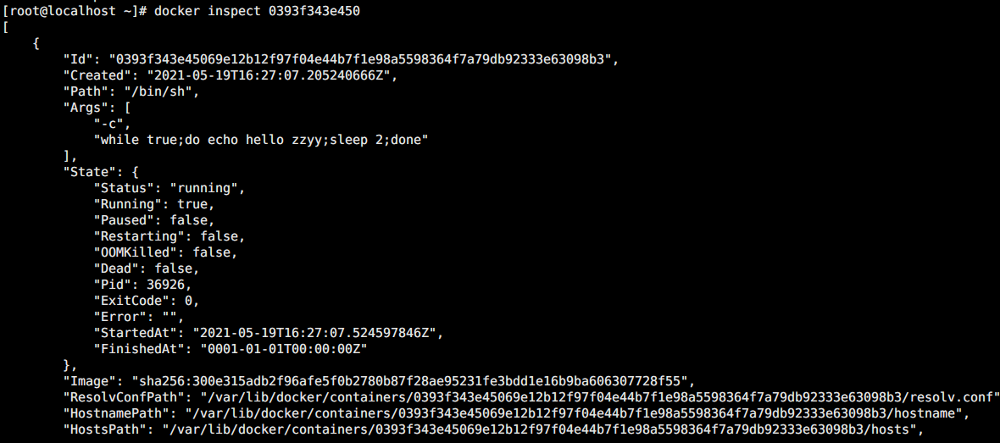

  - **进入正在运行的容器并以命令行交互**

    - `docker exec -it 容器ID bashShell`

    - 重新进入`docker attach 容器ID`

    - 上述两个区别

    	- attach 直接进入容器启动命令的终端，不会启动新的进程
    	- exec 是在容器中打开新的终端，并且可以启动新的进程
    	
    	```sh
    	[root@localhost ~]$ docker ps
    	CONTAINER ID   IMAGE     COMMAND                  CREATED          STATUS          PORTS     NAMES
    	0393f343e450   centos    "/bin/sh -c 'while t…"   15 minutes ago   Up 15 minutes             romantic_volhard
    	
    	# exec 直接在宿主机上输出结果
    	[root@localhost ~]$ docker exec -it 0393f343e450 ls -l /tmp
    	total 8
    	-rwx------ 1 root root 701 Dec  4 17:37 ks-script-esd4my7v
    	-rwx------ 1 root root 671 Dec  4 17:37 ks-script-eusq_sc5
    	
    	# 进入容器内部
    	[root@localhost ~]$ docker exec -it 0393f343e450 /bin/bash
    	[root@0393f343e450 /]# ls -l /tmp
    	total 8
    	-rwx------ 1 root root 701 Dec  4 17:37 ks-script-esd4my7v
    	-rwx------ 1 root root 671 Dec  4 17:37 ks-script-eusq_sc5
    	[root@0393f343e450 /]# read escape sequence    # ctrl+P+Q退出
    	
    	# 重新进入容器，进入后还会继续打印启动时的循环输出，等价于未启动新的进程终端
    	[root@localhost ~]$ docker attach 0393f343e450  
    	hello zzyy
    	hello zzyy
    	hello zzyy
    	^Chello zzyy
    	```

  - 从容器内拷贝文件到主机上

  	- `docker cp  容器ID:容器内路径 目的主机路径`

  	  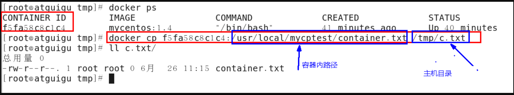


+ docker容器自动启动设置
  在运行docker容器时可以加如下参数来保证每次docker服务重启后容器也自动重启：
  `docker run --restart=always`
  如果已经启动了则可以使用如下命令：
  `docker update --restart=always <CONTAINER ID>`

### 小总结

- 常用命令

  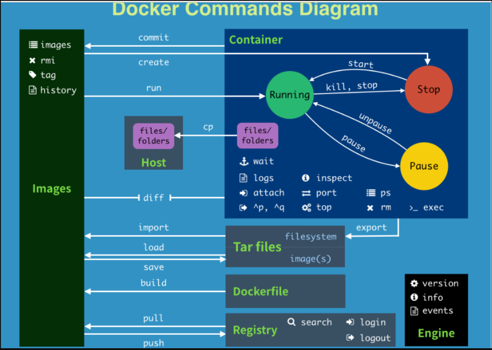
  
  ```sh
  attach    Attach to a running container                 # 当前 shell 下 attach 连接指定运行镜像
  
  build     Build an image from a Dockerfile              # 通过 Dockerfile 定制镜像
  
  commit    Create a new image from a container changes   # 提交当前容器为新的镜像
  
  cp        Copy files/folders from the containers filesystem to the host path   #从容器中拷贝指定文件或者目录到宿主机中
  
  create    Create a new container                        # 创建一个新的容器，同 run，但不启动容器
  
  diff      Inspect changes on a container's filesystem   # 查看 docker 容器变化
  
  events    Get real time events from the server          # 从 docker 服务获取容器实时事件
  
  exec      Run a command in an existing container        # 在已存在的容器上运行命令
  
  export    Stream the contents of a container as a tar archive   # 导出容器的内容流作为一个 tar 归档文件[对应 import ]
  
  history   Show the history of an image                  # 展示一个镜像形成历史
  
  images    List images                                   # 列出系统当前镜像
  
  import    Create a new filesystem image from the contents of a tarball # 从tar包中的内容创建一个新的文件系统映像[对应export]
  
  info      Display system-wide information               # 显示系统相关信息
  
  inspect   Return low-level information on a container   # 查看容器详细信息
  
  kill      Kill a running container                      # kill 指定 docker 容器
  
  load      Load an image from a tar archive              # 从一个 tar 包中加载一个镜像[对应 save]
  
  login     Register or Login to the docker registry server    # 注册或者登陆一个 docker 源服务器
  
  logout    Log out from a Docker registry server          # 从当前 Docker registry 退出
  
  logs      Fetch the logs of a container                 # 输出当前容器日志信息
  
  port      Lookup the public-facing port which is NAT-ed to PRIVATE_PORT    # 查看映射端口对应的容器内部源端口
  
  pause     Pause all processes within a container        # 暂停容器
  
  ps        List containers                               # 列出容器列表
  
  pull      Pull an image or a repository from the docker registry server   # 从docker镜像源服务器拉取指定镜像或者库镜像
  
  push      Push an image or a repository to the docker registry server    # 推送指定镜像或者库镜像至docker源服务器
  
  restart   Restart a running container                   # 重启运行的容器
  
  rm        Remove one or more containers                 # 移除一个或者多个容器
  
  rmi       Remove one or more images             # 移除一个或多个镜像[无容器使用该镜像才可删除，否则需删除相关容器才可继续或 -f 强制删除]
  
  run       Run a command in a new container              # 创建一个新的容器并运行一个命令
  
  save      Save an image to a tar archive                # 保存一个镜像为一个 tar 包[对应 load]
  
  search    Search for an image on the Docker Hub         # 在 docker hub 中搜索镜像
  
  start     Start a stopped containers                    # 启动容器
  
  stop      Stop a running containers                     # 停止容器
  
  tag       Tag an image into a repository                # 给源中镜像打标签
  
  top       Lookup the running processes of a container   # 查看容器中运行的进程信息
  
  unpause   Unpause a paused container                    # 取消暂停容器
  
  version   Show the docker version information           # 查看 docker 版本号
  
  wait      Block until a container stops, then print its exit code   # 截取容器停止时的退出状态值
  ```
  
  

## Docker 镜像

### 是什么

 镜像是一种轻量级、可执行的独立软件包，**用来打包软件运行环境和基于运行环境开发的软件**，它包含运行某个软件所需的所有内容，包括代码、运行时、库、环境变量和配置文件。  

- UnionFS（联合文件系统）

  UnionFS（联合文件系统）：Union文件系统（UnionFS）是一种分层、轻量级并且高性能的文件系统，它**支持对文件系统的修改作为一次提交来一层层的叠加**，同时可以将不同目录挂载到同一个虚拟文件系统下(unite several directories into a single virtual filesystem)。Union 文件系统是 Docker 镜像的基础。镜像可以通过分层来进行继承，基于基础镜像（没有父镜像），可以制作各种具体的应用镜像。 

  

  特性：一次同时加载多个文件系统，但从外面看起来，只能看到一个文件系统，联合加载会把各层文件系统叠加起来，这样最终的文件系统会包含所有底层的文件和目录

- Docker镜像加载原理

     Docker镜像加载原理：  

     docker的镜像实际上由一层一层的文件系统组成，这种层级的文件系统UnionFS。bootfs(boot file system)主要包含bootloader和kernel, bootloader主要是引导加载kernel, Linux刚启动时会加载bootfs文件系统，**在Docker镜像的最底层是bootfs**。这一层与我们典型的Linux/Unix系统是一样的，包含boot加载器和内核。当boot加载完成之后整个内核就都在内存中了，此时内存的使用权已由bootfs转交给内核，此时系统也会卸载bootfs。 

     

     rootfs (root file system) ，在bootfs之上。包含的就是典型 Linux 系统中的 /dev, /proc, /bin, /etc 等标准目录和文件。rootfs就是各种不同的操作系统发行版，比如Ubuntu，Centos等等。 。  

     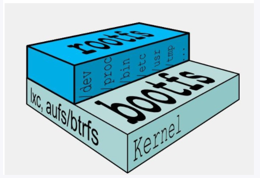

     *平时我们安装进虚拟机的CentOS都是好几个G，为什么docker这里才200M？？*

     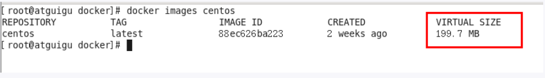

     对于一个精简的OS，rootfs可以很小，只需要包括最基本的命令、工具和程序库就可以了，因为底层直接用Host的kernel，自己只需要提供 rootfs 就行了。由此可见对于不同的linux发行版, bootfs基本是一致的, rootfs会有差别, 因此不同的发行版可以公用bootfs。 

- 分层的镜像

   以我们的pull为例，在下载的过程中我们可以看到docker的镜像好像是在一层一层的在下载  

   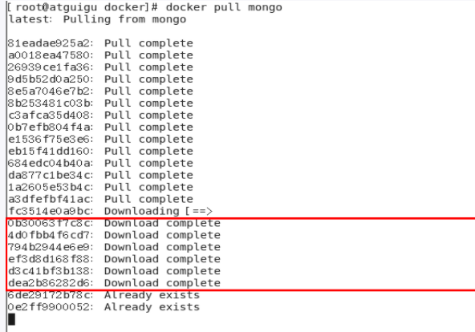

- 为什么 Docker 镜像要采用这种分层结构呢

    最大的一个好处就是 - 共享资源 
    
      比如：有多个镜像都从相同的 base 镜像构建而来，那么宿主机只需在磁盘上保存一份base镜像，同时内存中也只需加载一份 base 镜像，就可以为所有容器服务了。而且镜像的每一层都可以被共享。

### 特点

- Docker镜像都是只读的
当容器启动时，一个新的可写层被加载到镜像的顶部。
这一层通常被称作“容器层”，“容器层”之下的都叫“镜像层”。

### Docker镜像commit操作补充

- docker commit提交容器副本使之成为一个新的镜像
- `docker commit -m=“提交的描述信息” -a=“作者” 容器ID 要创建的目标镜像名:[标签名]`
- 案例演示

	- 从Hub上下载tomcat镜像到本地并成功运行

	   `docker run -it -p 8080:8080 tomcat`

	  - - -p 主机端口:docker容器端口
	    - 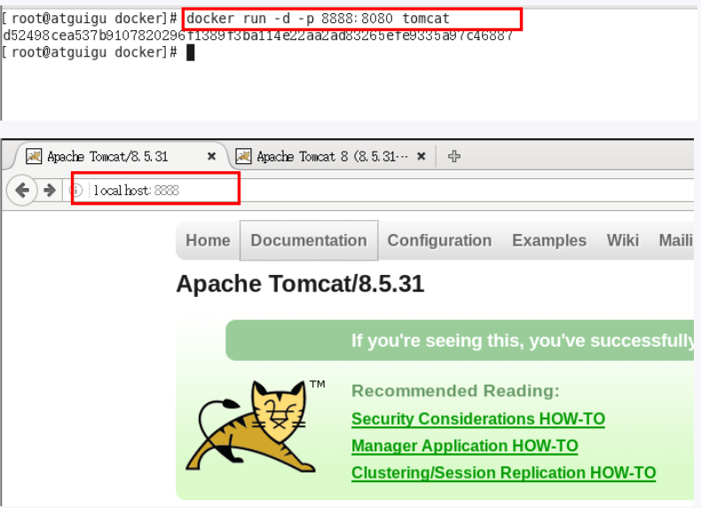
	      - -P 随机分配端口
	        
	      - -i:交互
	      - -t:终端

	

	- 故意删除上一步镜像生产tomcat容器的文档

	  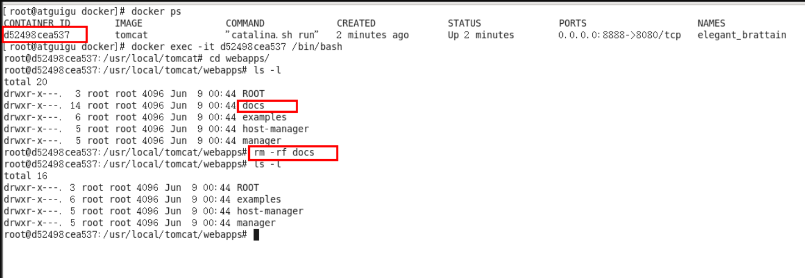
	
	- 也即当前的tomcat运行实例是一个没有文档内容的容器，
	  以它为模板commit一个没有doc的tomcat新镜像atguigu/tomcat02
	
	  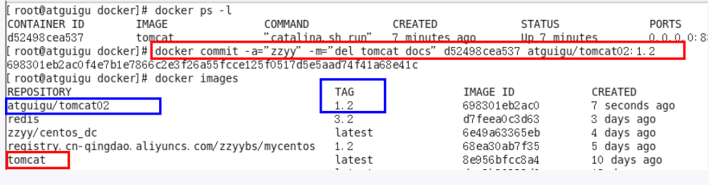
	
	- 启动我们的新镜像并和原来的对比
	
		- 启动atguigu/tomcat02，它没有docs
		  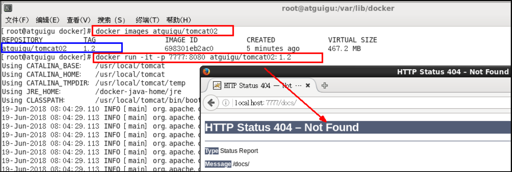
		- 新启动原来的tomcat，它有docs
		  s

## Docker容器数据卷

### 是什么

 先来看看Docker的理念：

* 将运用与运行的环境打包形成容器运行 ，运行可以伴随着容器，但是我们对数据的要求希望是持久化的
* 容器之间希望有可能共享数据  Docker容器产生的数据，如果不通过docker commit生成新的镜像，使得数据做为镜像的一部分保存下来，那么当容器删除后，数据自然也就没有了。
* 为了能保存数据在docker中我们使用卷。

- 一句话：有点类似我们Redis里面的rdb和aof文件

### 能干嘛

卷就是目录或文件，存在于一个或多个容器中，由docker挂载到容器，但不属于联合文件系统，因此能够绕过Union File System提供一些用于持续存储或共享数据的特性：  卷的设计目的就是数据的持久化，完全独立于容器的生存周期，因此Docker不会在容器删除时删除其挂载的数据卷

特点：

1：数据卷可在容器之间共享或重用数据

2：卷中的更改可以直接生效

3：数据卷中的更改不会包含在镜像的更新中

4：数据卷的生命周期一直持续到没有容器使用它为止

- 容器的持久化
- 容器间继承+共享数据

### 数据卷

- 容器内添加

  1. 直接命令添加

  - 命令

     `docker run -it -v /宿主机目录:/容器内目录 centos /bin/bash` 

     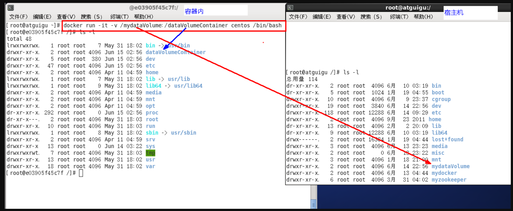

     -  `docker run -it -v /宿主机绝对路径目录:/容器内目录      镜像名`

  - 查看数据卷是否挂载成功

    `docker inspect 容器ID`

    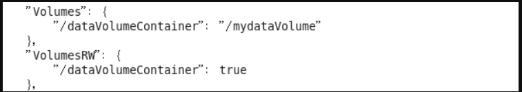

  - 容器和宿主机之间数据共享
     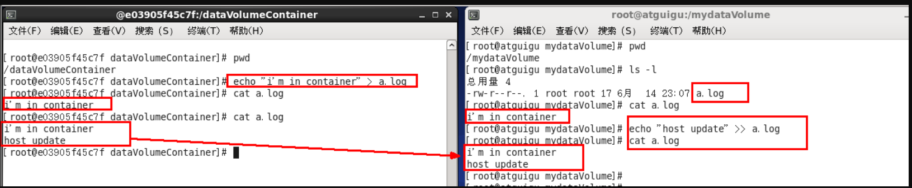

  - 容器停止退出后，主机修改后数据是否同步
     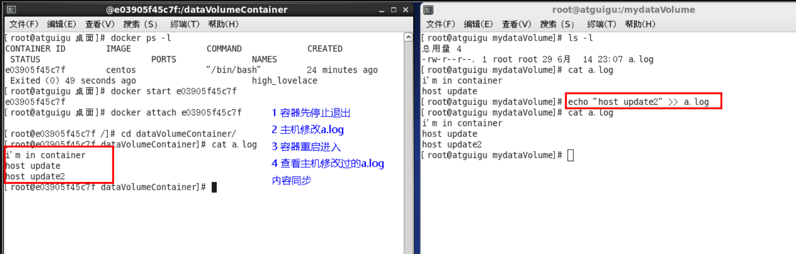

  - 命令(带权限)【容器内只读】

  	- `docker run -it -v /宿主机绝对路径目录:/容器内目录:ro 镜像名`
  	
  	  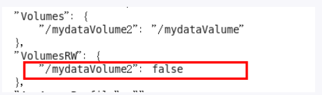
  	
  	  描述：
  	
  	  **容器内的映射文件夹：不能进行写操作，**
  	
  	  **宿主机内映射的文件夹：可以进行写操作**

  

  

  2. DockerFile添加

  - 根目录下新建mydocker文件夹并进入
     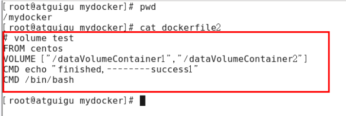
  
  - 可在Dockerfile中使用`VOLUME指令`来给镜像添加一个或多个数据卷
  
     `VOLUME["/dataVolumeContainer","/dataVolumeContainer2","/dataVolumeContainer3"]`
  
     说明：
  
     出于可移植和分享的考虑，用**-v 主机目录:容器目录这种方法不能够直接在Dockerfile中实现**。
  
     由于宿主机目录是依赖于特定宿主机的，并不能够保证在所有的宿主机上都存在这样的特定目录。
  
  - File构建
  
     【容器卷测试】
  
     ```dockerfile
     # volume test
     FROM centos
     VOLUME ["/dataVolumeContainer1","/dataVolumeContainer2"]
     CMD echo "finished,--------success1"
     CMD /bin/bash 
     ```

  - build后生成镜像 [`docker build -f /root/mydockerfile -t zzyy/centos .`]
    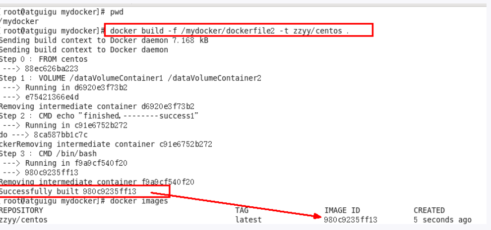
  
    - 获得一个新镜像zzyy/centos
  
  - run容器
  
     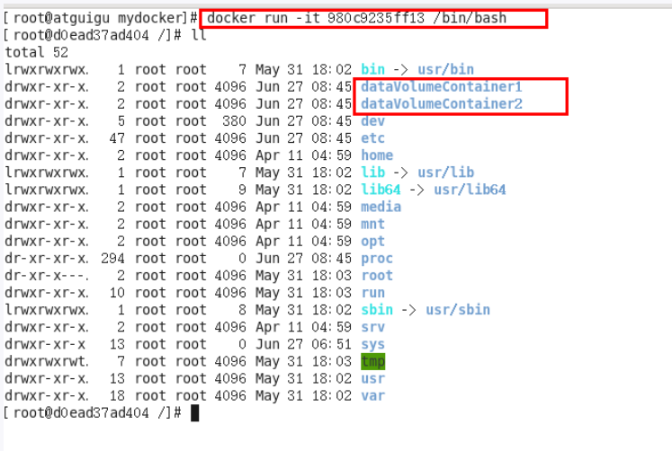
  
  - 通过上述步骤，容器内的卷目录地址已经知道
  对应的主机目录地址哪？？[`docker inspect ID`:返回有关Docker对象的详细信息]
  
     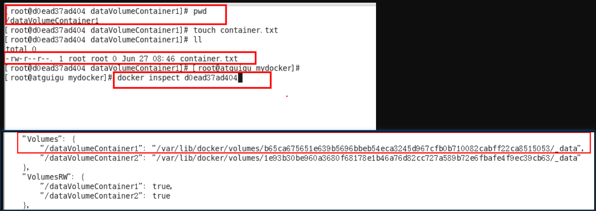
  
  - 主机对应默认地址
     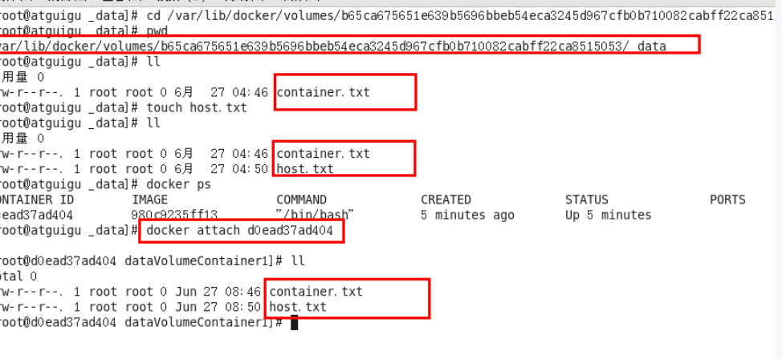
  
  - 备注
  
    Docker挂载主机目录Docker访问出现*cannot open directory .: Permission denied*
    
    解决办法：在挂载目录后多加一个`--privileged=true`参数即可

### 数据卷容器

- 是什么

  命名的容器挂载数据卷，其它容器通过挂载这个(父容器)实现数据共享，挂载数据卷的容器，称之为数据卷容器

- 总体介绍

	- 以上一步新建的镜像zzyy/centos为模板并运行容器dc01/dc02/dc03
	- 它们已经具有容器卷

		- /dataVolumeContainer1
		- /dataVolumeContainer2

- 容器间传递共享(`--volumes-from`)

	- 先启动一个父容器dc01

	  - 在dataVolumeContainer2新增内容

		  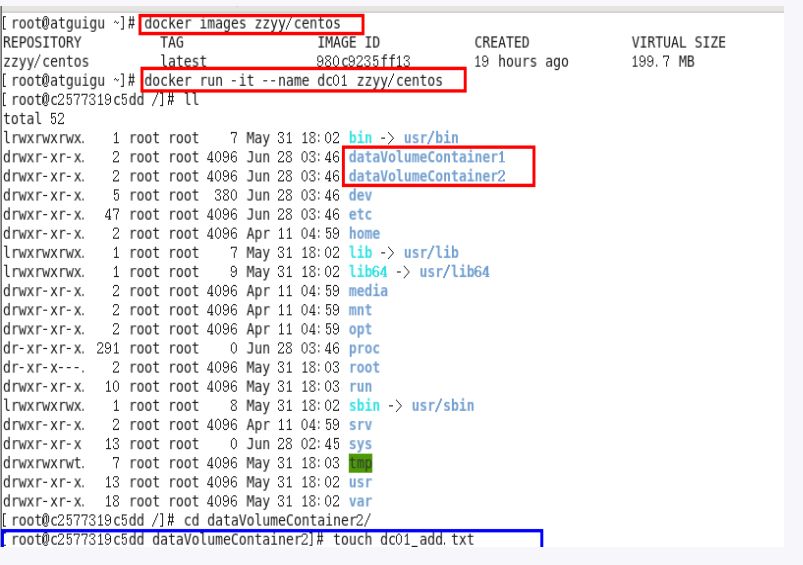

	- dc02/dc03继承自dc01

	  - -`-volumes-from`
	
	  - 命令
	
	     `docker run -it --name dc02 --volumes-from dc01 zzyy/centos` 
	
	  	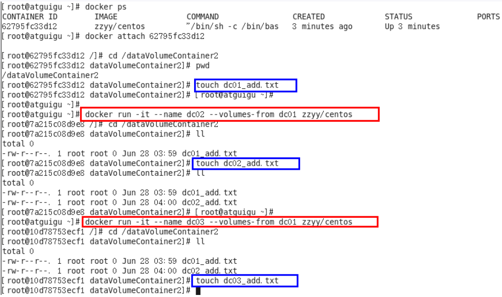
	  	
	  	- dc02/dc03分别在dataVolumeContainer2各自新增内容
	
	
	  ​	  
	
	- 回到dc01可以看到02/03各自添加的都能共享了
	
	  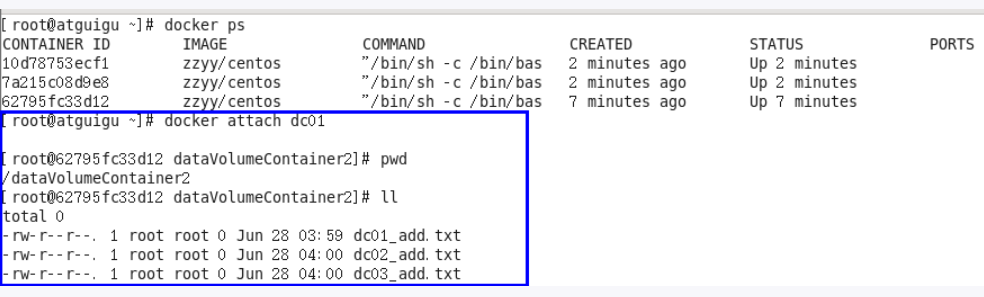
	
	- 删除dc01，dc02修改后dc03可否访问
	  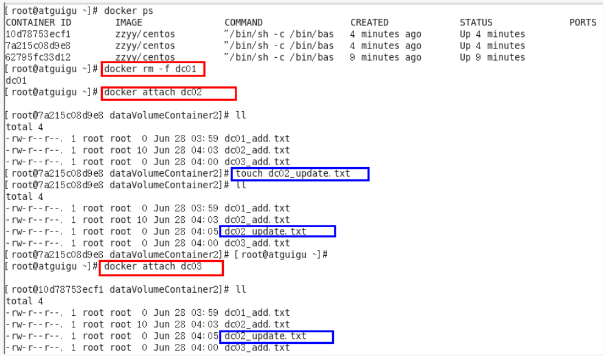
	
	- 删除dc02后dc03可否访问
	
	   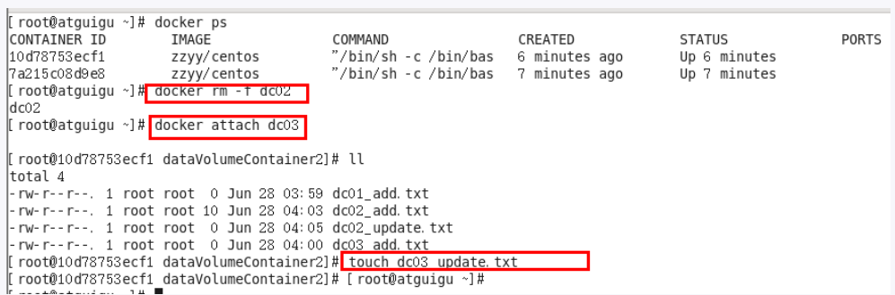
	
	  - 再进一步
	    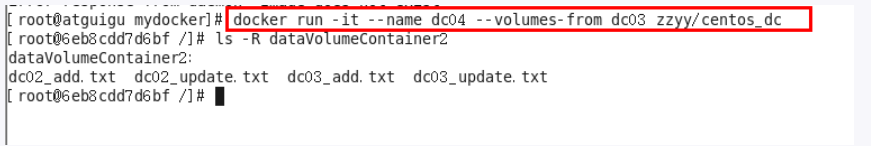
	
	- 新建dc04继承dc03后再删除dc03
	  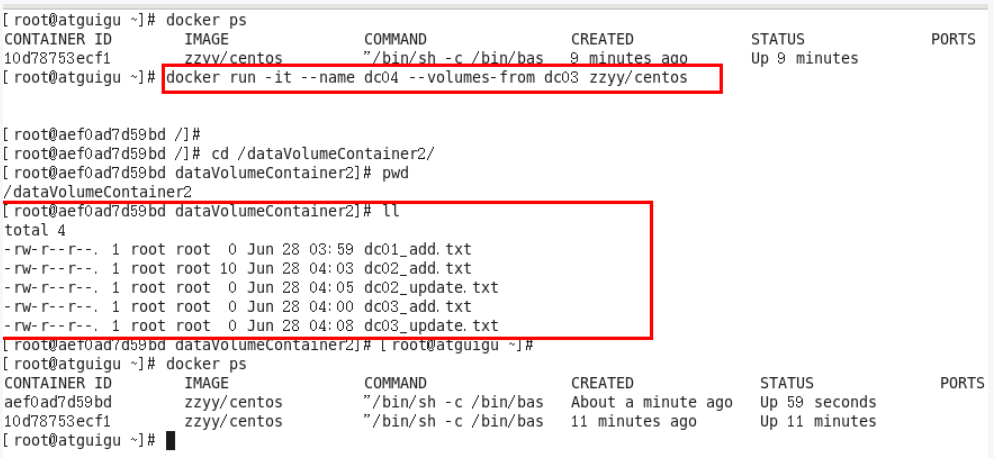
	
	  
	
	- 结论：容器之间配置信息的传递，**数据卷的生命周期一直持续到没有容器使用它为止**

## DockerFile解析

### 是什么

- Dockerfile是用来构建Docker镜像的构建文件，是由一系列命令和参数构成的脚本。
- 构建三步骤

	- `编写Dockerfile文件`

	- `docker build`

	- `docker run`

- 文件什么样？？？

	- 以我们熟悉的CentOS为例 

		- https://hub.docker.com/_/centos/
	-  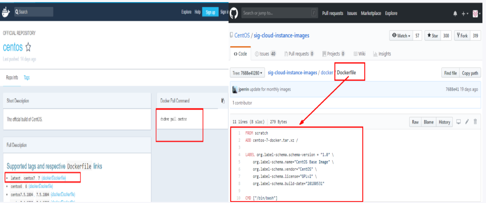
	
	

### DockerFile构建过程解析

- Dockerfile内容基础知识

	- 1：每条保留字**指令都必须为大写字母**且后面要*跟随至少一个参数*
	- 2：指令按照从上到下，顺序执行
	- 3：#表示注释
	- 4：每条指令都会创建一个新的镜像层，并对镜像进行提交

- Docker执行Dockerfile的大致流程

	- （1）docker从基础镜像运行一个容器
	- （2）执行一条指令并对容器作出修改
	- （3）执行类似docker commit的操作提交一个新的镜像层
	- （4）docker再基于刚提交的镜像运行一个新容器
	- （5）执行dockerfile中的下一条指令直到所有指令都执行完成

- 小总结

   从应用软件的角度来看，Dockerfile、Docker镜像与Docker容器分别代表软件的三个不同阶段，
  
     \*  Dockerfile是软件的原材料
  
     \*  Docker镜像是软件的交付品
  
     \*  Docker容器则可以认为是软件的运行态。
  
     Dockerfile面向开发，Docker镜像成为交付标准，Docker容器则涉及部署与运维，三者缺一不可，合力充当Docker体系的基石。
     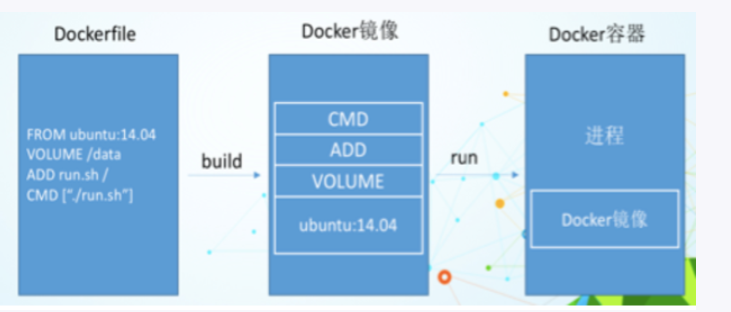

1 Dockerfile，需要定义一个Dockerfile，Dockerfile定义了进程需要的一切东西。Dockerfile涉及的内容包括执行代码或者是文件、环境变量、依赖包、运行时环境、动态链接库、操作系统的发行版、服务进程和内核进程(当应用进程需要和系统服务和内核进程打交道，这时需要考虑如何设计namespace的权限控制)等等;

 

2 Docker镜像，在用Dockerfile定义一个文件之后，docker build时会产生一个Docker镜像，当运行 Docker镜像时，会真正开始提供服务;

 

3 Docker容器，容器是直接提供服务的。

 

### DockerFile体系结构(保留字指令)

- `FROM`

	- 基础镜像，当前新镜像是基于哪个镜像的

- `MAINTAINER`

	- 镜像维护者的姓名和邮箱地址

- `RUN`

	- 容器构建时需要运行的命令

- `EXPOSE`

  - 当前容器对外暴露出的端口

- `WORKDIR`

	- 指定在创建容器后，终端默认登陆的进来工作目录，一个落脚点

- `ENV`

  - 用来在构建镜像过程中设置环境变量

     `ENV MY_PATH /usr/mytest`这个环境变量可以在后续的任何RUN指令中使用，这就如同在命令前面指定了环境变量前缀一样；也可以在其它指令中直接使用这些环境变量， 
       比如：`WORKDIR $MY_PATH`

- `ADD`

	- 将宿主机目录下的文件**拷贝**进镜像且ADD命令会自动处理URL和**解压**tar压缩包

- `COPY`

	- 类似ADD，拷贝文件和目录到镜像中。
		将从构建上下文目录中 <源路径> 的文件/目录复制到新的一层的镜像内的 <目标路径> 位置
		- `COPY src dest`
		- `COPY ["src", "dest"]`
	
- `VOLUME`

	- 容器数据卷，用于数据保存和持久化工作

- `CMD`

  - 指定**一个容器启动时要运行的命令**
    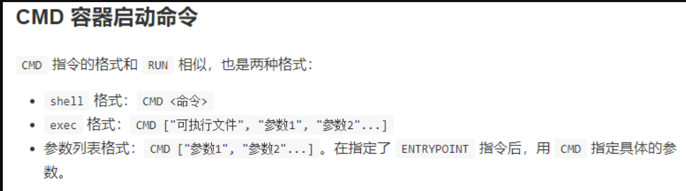
  - Dockerfile 中可以**有多个 CMD 指令，但只有最后一个生效**，CMD **会被 docker run 之后的参数替换**

- `ENTRYPOINT` 

	- 指定一个容器启动时要运行的命令
	- ENTRYPOINT 的目的和 CMD 一样，都是在指定容器启动程序及参数，docker run之后的参数体现为追加形式

- `ONBUILD`

  - 当构建一个被继承的Dockerfile时运行命令，父镜像在被子继承后父镜像的onbuild被触发---【触发器】
    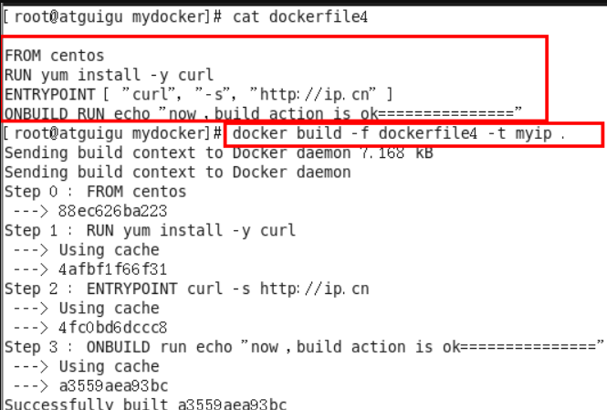
  - 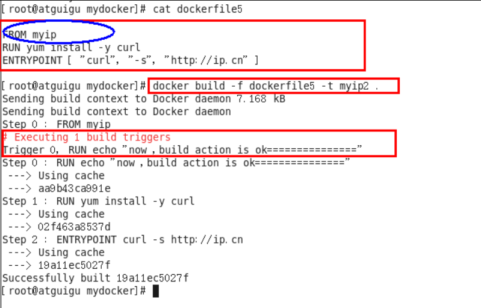

- 小总结
  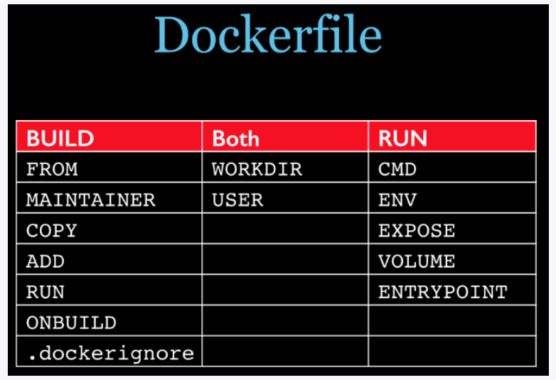

### dockerfile案例

- Base镜像(scratch)

	- Docker Hub 中 99% 的镜像都是通过在 base 镜像中安装和配置需要的软件构建出来的

	   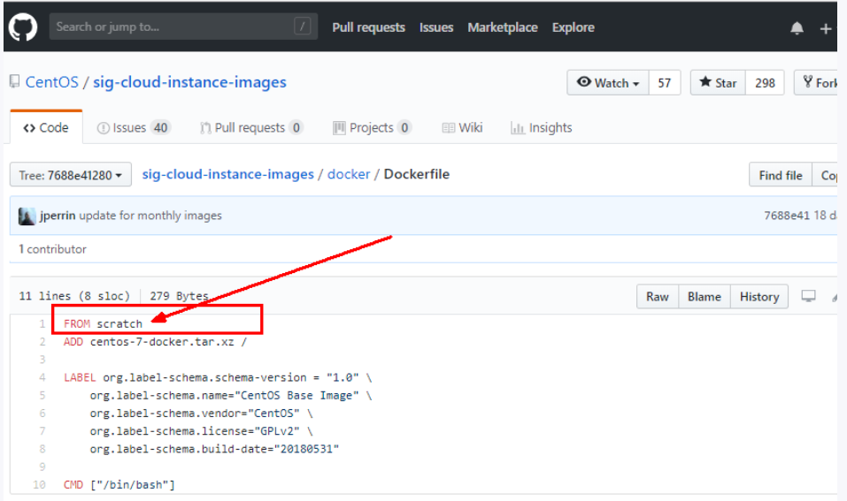

- 自定义镜像mycentos

  - 编写

    - Hub默认CentOS镜像什么情况
       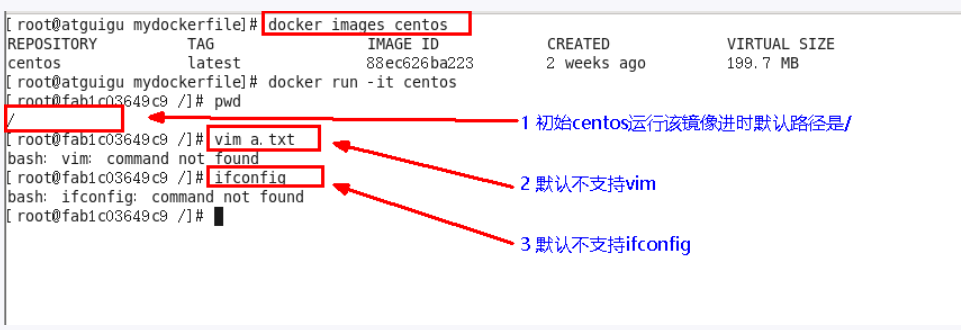

       自定义mycentos目的使我们自己的镜像具备如下：         

       ```
       登陆后的默认路径         
       vim编辑器         
       查看网络配置ifconfig支持
       ```

    - 准备编写DockerFile文件
       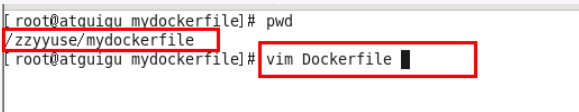

    - myCentOS内容DockerFile

      ```dockerfile
      # 以centos为基础镜像
      FROM centos
      # 作者信息及邮箱
      MAINTAINER zzyy<zzyy167@126.com>
      
      # 设置环境变量及默认登陆目录
      ENV MYPATH /usr/local
      WORKDIR $MYPATH
      
      # 安装vim和ifconfig工具
      RUN yum -y install vim
      RUN yum -y install net-tools
      
      # 当前容器对外暴露出的端口
      EXPOSE 80
      
      CMD echo $MYPATH
      CMD echo "success--------------ok"
      CMD /bin/bash
      ```

  - 构建

    - `docker build -f  dockerfile路径 -t 新镜像名字:TAG .`

      会看到 docker build 命令最后有一个 .                                   . 表示当前目录
      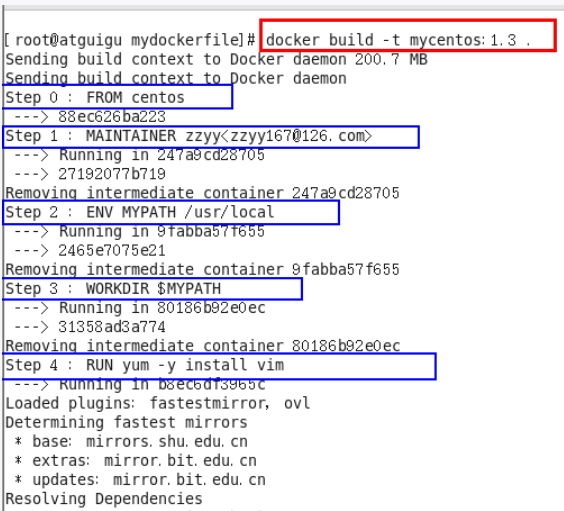
      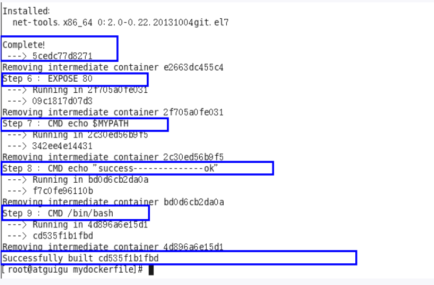

  - 运行

  	- `docker run -it 新镜像名字:TAG` 

  	   可以看到，我们自己的新镜像已经支持vim/ifconfig命令，扩展成功了。

  - 列出镜像的变更历史

  	- `docker history 镜像名`
  	
  	  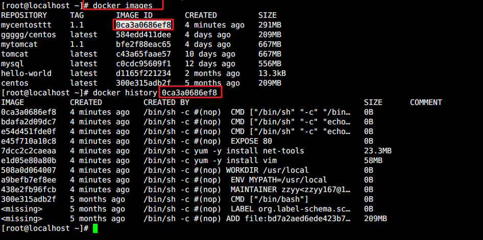

- `CMD/ENTRYPOINT` 镜像案例

  - 都是指定一个容器启动时要运行的命令
  - CMD

    - **Dockerfile 中可以有多个 CMD 指令，但只有最后一个生效**，**CMD 会被 docker run 之后的参数替换**
    - Case

    	- tomcat的讲解演示

    		- `docker run -it -p 8888:8080 tomcat ls -l`
    	
    		  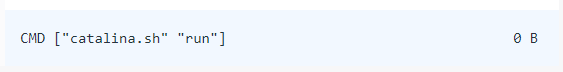
    		  tomcat 的启动脚本被替换成`ls -l`打印

  - ENTRYPOINT 

  	- docker run 之后的参数会被当做参数传递给 ENTRYPOINT，之后形成新的命令组合
  	- Case

  		- 制作CMD版可以查询IP信息的容器

  		   ```dockerfile
  		   FROM centos
  		   RUN yum install -y curl
  		   CMD [ "curl", "-s", "http://ip.cn" ]
  		```
		
  		   - crul命令解释
		
  		```
  		        curl命令可以用来执行下载、发送各种HTTP请求，指定HTTP头部等操作。
  		        如果系统没有curl可以使用yum install curl安装，也可以下载安装。
  		        curl是将下载文件输出到stdout
  		        
  		        使用命令：curl http://www.baidu.com
  		        执行后，www.baidu.com的html就会显示在屏幕上了
  		        
  		        这是最简单的使用方法。用这个命令获得了http://curl.haxx.se指向的页面，同样，如果这里的URL指向的是一个文件或者一幅图都可以直接下载到本地。如果下载的是HTML文档，那么缺省的将只显示文件头部，即HTML文档的header。要全部显示，请加参数 -i
  		     ```
  		
  		- 问题
  		
  			- 如果我们希望显示 HTTP 头信息，就需要加上 `-i` 参数
  		
  			  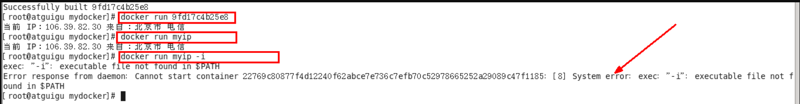 
  		
  		- 原因：
  		
  		    我们可以看到可执行文件找不到的报错，executable file not found。
  		
  		    之前我们说过，**跟在镜像名后面的是 command，运行时会替换 CMD 的默认值。因此这里的 `-i` 替换了原来的 CMD，而不是添加在原来的 `curl -s http://ip.cn` 后面。**而 -i 根本不是命令，所以自然找不到。 那么如果我们希望加入 -i 这参数，我们就必须重新完整的输入这个命令： `$ docker run myip curl -s http://ip.cn -i`
  		
  		- 制作ENTROYPOINT版查询IP信息的容器
  		
  		   ```dockerfile
  		     FROM centos
  		     RUN yum install -y curl
  		     ENTRYPOINT [ "curl", "-s", "http://ip.cn" ]
  		  ```
  		  
  		     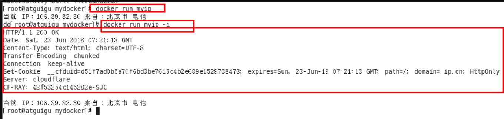

- ONBUILD测试

父镜像dockerfile文件【myip_father】

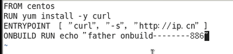


子镜像【myip_son】

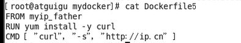


构建时触发onbuild

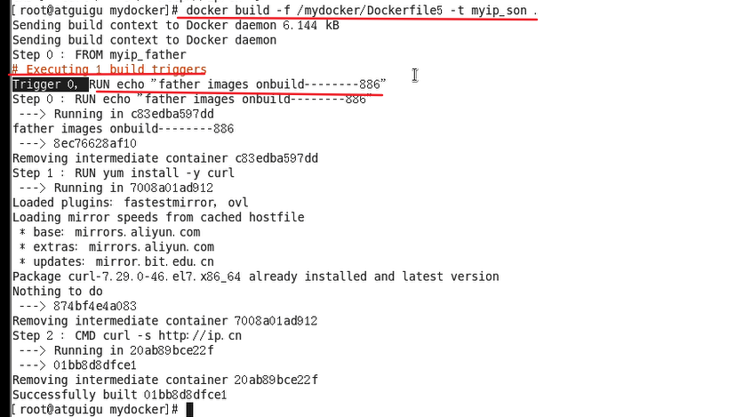

- 自定义镜像Tomcat9

	- `mkdir -p /zzyyuse/mydockerfile/tomcat9`
	
	- 在上述目录下`touch c.txt`

	- 将jdk和tomcat安装的压缩包拷贝进上一步目录
	
		- apache-tomcat-9.0.8.tar.gz
		- jdk-8u171-linux-x64.tar.gz

	- 在/zzyyuse/mydockerfile/tomcat9目录下新建Dockerfile文件

	   ```dockerfile
	   FROM         centos
	   MAINTAINER    zzyy<zzyybs@126.com>
	   #把宿主机当前上下文的c.txt拷贝到容器/usr/local/路径下
	   COPY c.txt /usr/local/cincontainer.txt
	   #把java与tomcat添加到容器中
	   ADD jdk-8u171-linux-x64.tar.gz /usr/local/
	   ADD apache-tomcat-9.0.8.tar.gz /usr/local/
	   #安装vim编辑器
	   RUN yum -y install vim
	   #设置工作访问时候的WORKDIR路径，登录落脚点
	   ENV MYPATH /usr/local
	   WORKDIR $MYPATH
	   #配置java与tomcat环境变量
	   ENV JAVA_HOME /usr/local/jdk1.8.0_171
	   ENV CLASSPATH $JAVA_HOME/lib/dt.jar:$JAVA_HOME/lib/tools.jar
	   ENV CATALINA_HOME /usr/local/apache-tomcat-9.0.8
	   ENV CATALINA_BASE /usr/local/apache-tomcat-9.0.8
	   ENV PATH $PATH:$JAVA_HOME/bin:$CATALINA_HOME/lib:$CATALINA_HOME/bin
	   #容器运行时监听的端口
	   EXPOSE  8080
	   #启动时运行tomcat
	   # ENTRYPOINT ["/usr/local/apache-tomcat-9.0.8/bin/startup.sh" ]
	   # CMD ["/usr/local/apache-tomcat-9.0.8/bin/catalina.sh","run"]
	   CMD /usr/local/apache-tomcat-9.0.8/bin/startup.sh && tail -F /usr/local/apache-tomcat-9.0.8/bin/logs/catalina.out
	    
	   ```

	   - 目录内容
	     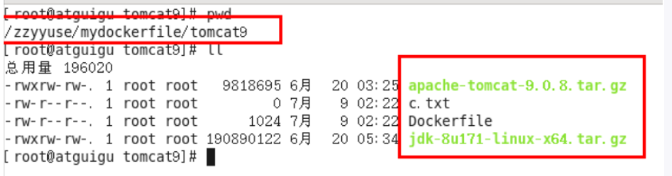
	
	- 构建`docker build -f /zzyyuse/mydockerfile/tomcat9/Dcokerfile -t zzyytomcat .`
	
	    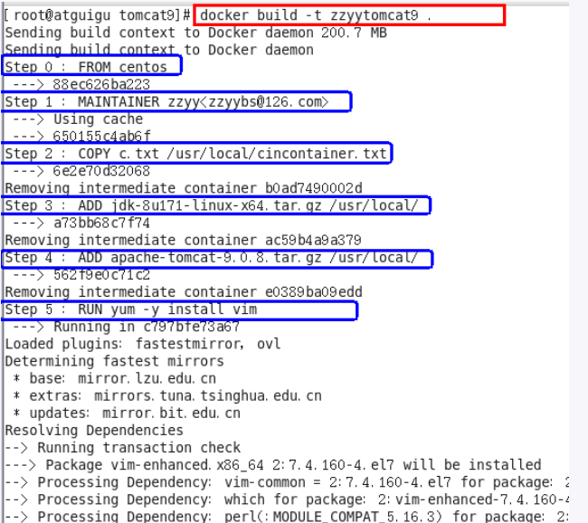
	
	  - 构建完成
	    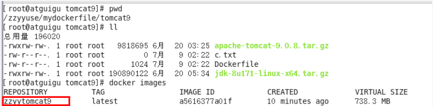
	
	- run
	
	    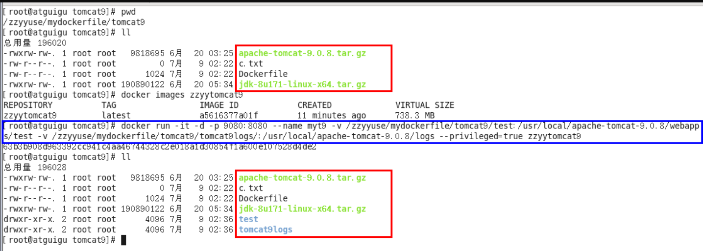
	
	    ```sh
	    docker run -d -p 9080:8080 --name myt9 \
	    -v /zzyyuse/mydockerfile/tomcat9/test:/usr/local/apache-tomcat-9.0.8/webapps/test \
	    -v /zzyyuse/mydockerfile/tomcat9/tomcat9logs/:/usr/local/apache-tomcat-9.0.8/logs \
	    --privileged=true zzyytomcat9  
	    ```
	
	    - 备注
	
	       Docker挂载主机目录Docker访问出现cannot open directory .: Permission denied
	         解决办法：在挂载目录后多加一个`--privileged=true`参数即可
	
	- 验证
	    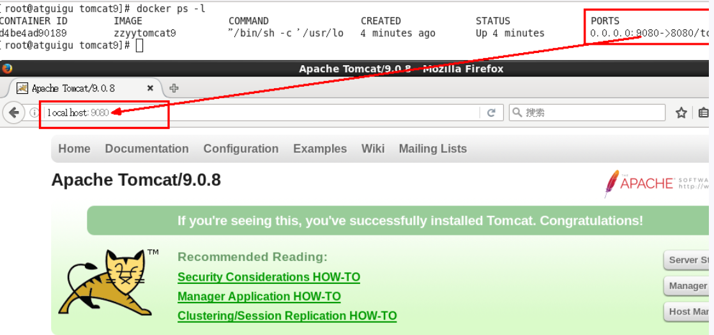
	
	- 结合前述的容器卷将测试的web服务test发布
	
		- 总体概述
		  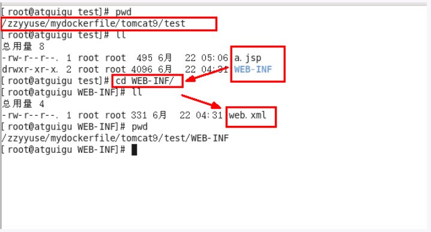
	
		- web.xml
	
		  ```xml
		  <?xml version="1.0" encoding="UTF-8"?>
		  
		  <web-app xmlns:xsi="http://www.w3.org/2001/XMLSchema-instance"
		  
		    xmlns="http://java.sun.com/xml/ns/javaee"
		  
		    xsi:schemaLocation="http://java.sun.com/xml/ns/javaee http://java.sun.com/xml/ns/javaee/web-app_2_5.xsd"
		  
		    id="WebApp_ID" version="2.5">
		  
		    <display-name>test</display-name>
		  </web-app>
		  ```
		
		- a.jsp
		
		  ```jsp
		  <%@ page language="java" contentType="text/html; charset=UTF-8" pageEncoding="UTF-8"%>
		  
		  <!DOCTYPE html PUBLIC "-//W3C//DTD HTML 4.01 Transitional//EN" "http://www.w3.org/TR/html4/loose.dtd">
		  
		  <html>
		  
		    <head>
		  
		      <meta http-equiv="Content-Type" content="text/html; charset=UTF-8">
		  
		      <title>Insert title here</title>
		  
		    </head>
		  
		    <body>
		  
		      -----------welcome------------
		  
		      <%="i am in docker tomcat self "%>
		  
		      <br>
		  
		      <br>
		  
		      <% System.out.println("=============docker tomcat self");%>
		  
		    </body>
		  
		  </html>
		  ```
		
		- 测试
		
		   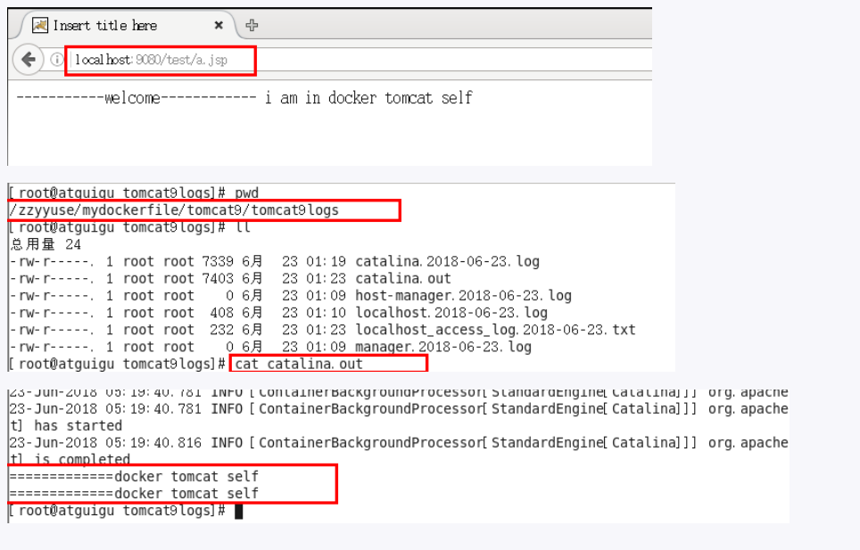

### 小总结

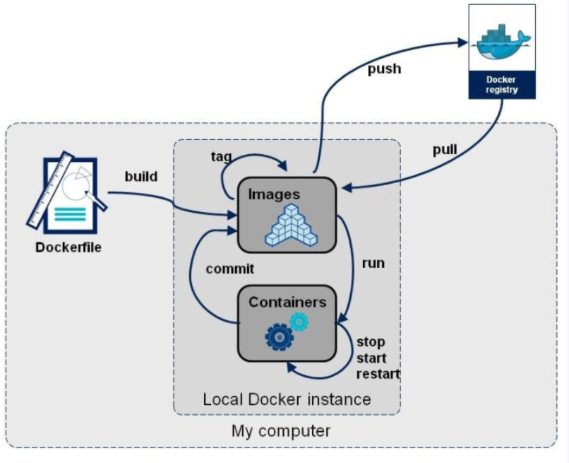

## Docker常用安装

### 总体步骤

- 搜索镜像
- 拉取镜像
- 查看镜像
- 启动镜像
- 停止容器
- 移除容器

### 安装tomcat

- docker hub上面查找tomcat镜像

  - `docker search tomcat`
    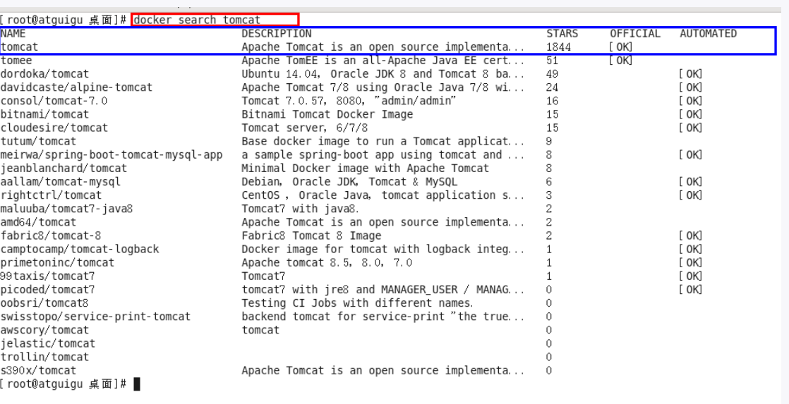

- 从docker hub上拉取tomcat镜像到本地

  - `docker pull tomcat`

  	- 1官网命令
  	
  	  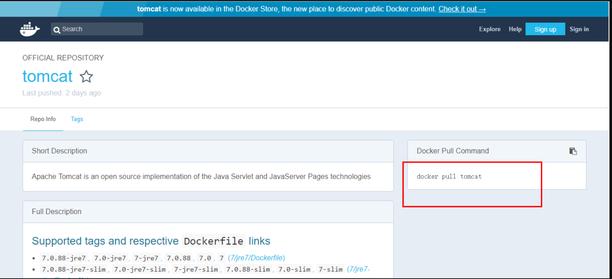
  	
  	- 2拉取完成
  	  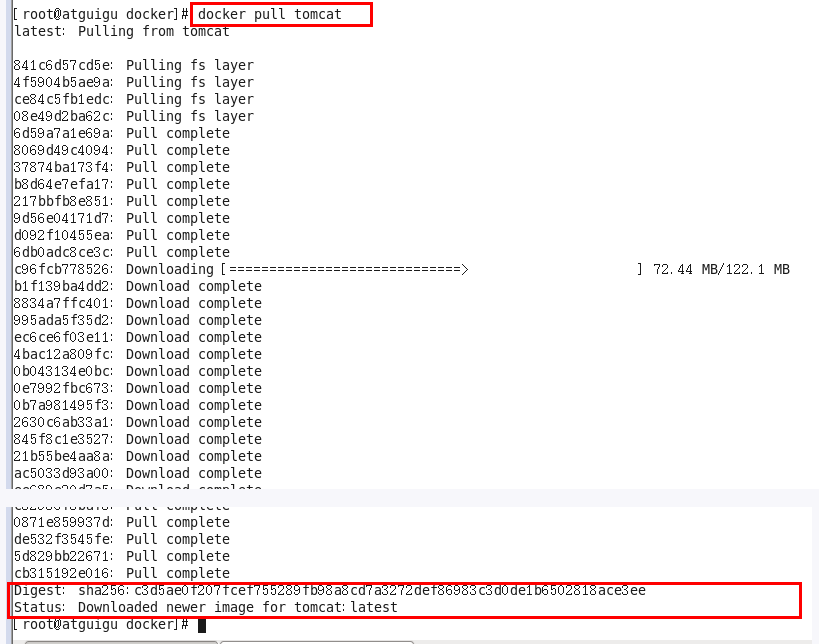

- `docker images`查看是否有拉取到的tomcat
  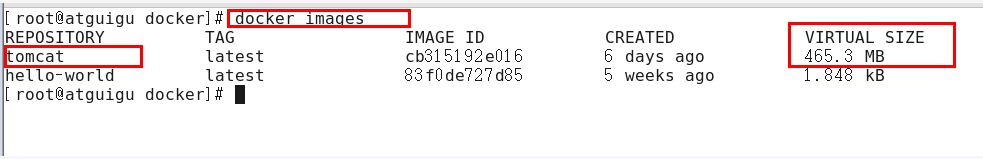
- 使用tomcat镜像创建容器(也叫运行镜像)

	- `docker run -it -p 8080:8080 tomcat`
		- `-p` 主机端口:docker容器端口
		- `-P` 随机分配端口
		  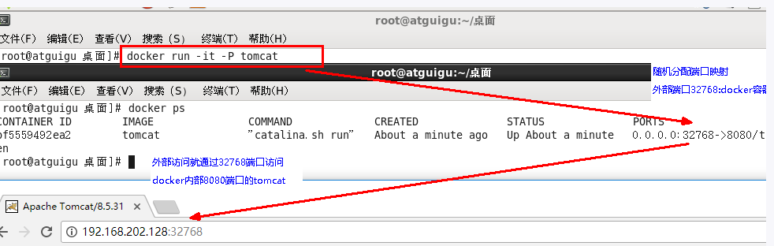
		- `-i`:交互
		- `-t`:终端

### 安装mysql

- docker hub上面查找mysql镜像
  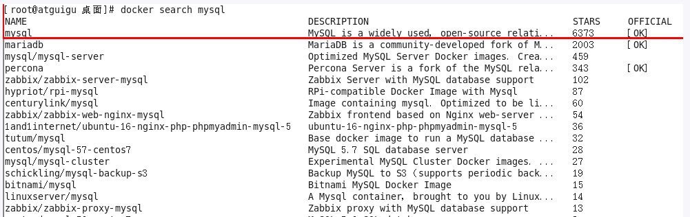
- 从docker hub上(阿里云加速器)拉取mysql镜像到本地标签为5.6
  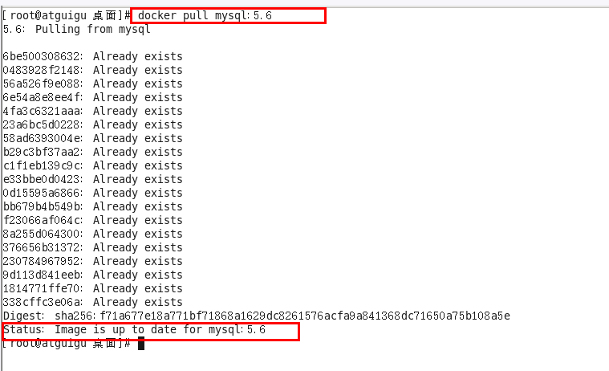

- 使用mysql5.6镜像创建容器(也叫运行镜像)

	- 使用mysql镜像

	    ```sh
	    docker run -p 12345:3306 \
	    	--name mysql \
	    	-v /zzyyuse/mysql/conf:/etc/mysql/conf.d \
	    	-v /zzyyuse/mysql/logs:/logs \
	    	-v /zzyyuse/mysql/data:/var/lib/mysql \
	    	-e MYSQL_ROOT_PASSWORD=123456 \
	    	-d mysql:5.6
	     
	   ```
	
	```sh
	# 命令说明：
	-p 12345:3306：将主机的12345端口映射到docker容器的3306端口。
	--name mysql：运行服务名字
	-v /zzyyuse/mysql/conf:/etc/mysql/conf.d ：将主机/zzyyuse/mysql录下的conf/my.cnf 挂载到容器的 /etc/mysql/conf.d
	-v /zzyyuse/mysql/logs:/logs：将主机/zzyyuse/mysql目录下的 logs 目录挂载到容器的 /logs。
	-v /zzyyuse/mysql/data:/var/lib/mysql ：将主机/zzyyuse/mysql目录下的data目录挂载到容器的 /var/lib/mysql 
	-e MYSQL_ROOT_PASSWORD=123456：初始化 root 用户的密码。
	-d mysql:5.6 : 后台程序运行mysql5.6
	```
	
	```sh
	docker exec -it MySQL运行成功后的容器ID     /bin/bash
	```
	
	
	
	- 外部Win10也来连接运行在dokcer上的mysql服务
	   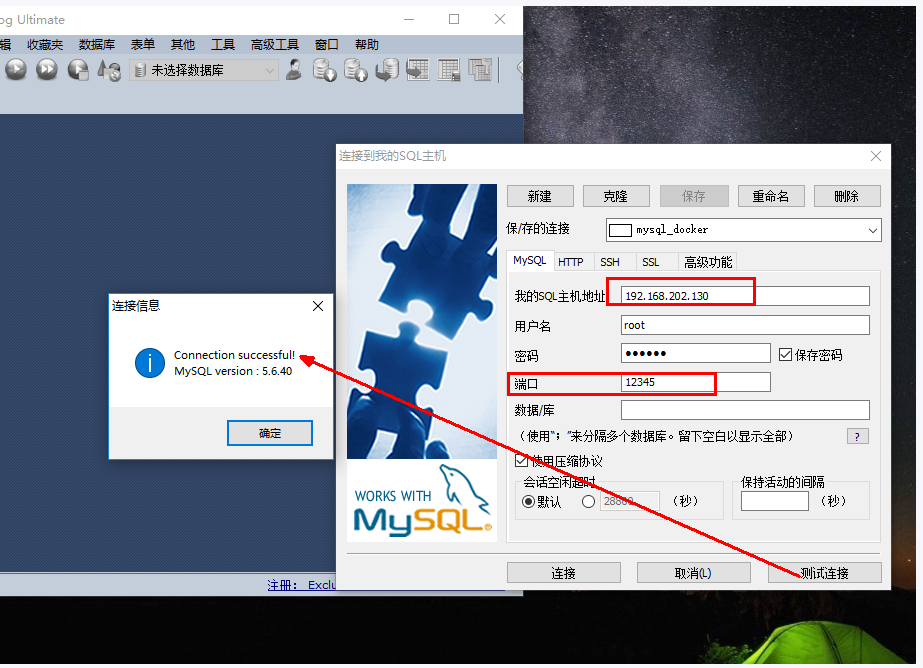
	
	- 数据备份小测试(可以不做)
	
	   ```sh
	     docker exec myql服务容器ID sh -c ' exec mysqldump --all-databases -uroot -p"123456" ' > /zzyyuse/all-databases.sql
	  ```

### 安装redis

- 从docker hub上(阿里云加速器)拉取redis镜像到本地标签为3.2

   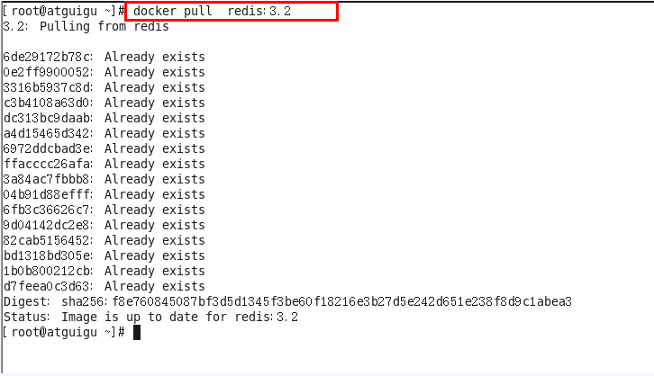

- 使用redis3.2镜像创建容器(也叫运行镜像)

	- 使用镜像

	   ```sh
	   docker run -p 6379:6379 \
	   	-v /zzyyuse/myredis/data:/data \
	   	-v /zzyyuse/myredis/conf/redis.conf:/usr/local/etc/redis/redis.conf  \
	   	-d redis:3.2 redis-server /usr/local/etc/redis/redis.conf \
	   	--appendonly yes
	   ```
	   
	   - 在主机/zzyyuse/myredis/conf/redis.conf目录下新建redis.conf文件
	   -   `vim /zzyyuse/myredis/conf/redis.conf/redis.conf`
	```sh
	  # Redis configuration file example.
	  #
	  # Note that in order to read the configuration file, Redis must be
	  # started with the file path as first argument:
	  #
	  # ./redis-server /path/to/redis.conf
	  # Note on units: when memory size is needed, it is possible to specify
	  # it in the usual form of 1k 5GB 4M and so forth:
	  #
	  # 1k => 1000 bytes
	  # 1kb => 1024 bytes
	  # 1m => 1000000 bytes
	  # 1mb => 1024*1024 bytes
	  # 1g => 1000000000 bytes
	  # 1gb => 1024*1024*1024 bytes
	  #
	  # units are case insensitive so 1GB 1Gb 1gB are all the same.
	  ################################## INCLUDES ###################################
	  # Include one or more other config files here.  This is useful if you
	  # have a standard template that goes to all Redis servers but also need
	  # to customize a few per-server settings.  Include files can include
	  # other files, so use this wisely.
	  #
	  # Notice option "include" won't be rewritten by command "CONFIG REWRITE"
	  # from admin or Redis Sentinel. Since Redis always uses the last processed
	  # line as value of a configuration directive, you'd better put includes
	  # at the beginning of this file to avoid overwriting config change at runtime.
	  #
	  # If instead you are interested in using includes to override configuration
	  # options, it is better to use include as the last line.
	  #
	  # include /path/to/local.conf
	  # include /path/to/other.conf
	  ################################## NETWORK #####################################
	  # By default, if no "bind" configuration directive is specified, Redis listens
	  # for connections from all the network interfaces available on the server.
	  # It is possible to listen to just one or multiple selected interfaces using
	  # the "bind" configuration directive, followed by one or more IP addresses.
	  #
	  # Examples:
	  #
	  # bind 192.168.1.100 10.0.0.1
	  # bind 127.0.0.1 ::1
	  #
	  # ~~~ WARNING ~~~ If the computer running Redis is directly exposed to the
	  # internet, binding to all the interfaces is dangerous and will expose the
	  # instance to everybody on the internet. So by default we uncomment the
	  # following bind directive, that will force Redis to listen only into
	  # the IPv4 lookback interface address (this means Redis will be able to
	  # accept connections only from clients running into the same computer it
	  # is running).
	  #
	  # IF YOU ARE SURE YOU WANT YOUR INSTANCE TO LISTEN TO ALL THE INTERFACES
	  # JUST COMMENT THE FOLLOWING LINE.
	  # ~~~~~~~~~~~~~~~~~~~~~~~~~~~~~~~~~~~~~~~~~~~~~~~~~~~~~~~~~~~~~~~~~~~~~~~~
	  #bind 127.0.0.1
	  # Protected mode is a layer of security protection, in order to avoid that
	  # Redis instances left open on the internet are accessed and exploited.
	  #
	  # When protected mode is on and if:
	  #
	  # 1) The server is not binding explicitly to a set of addresses using the
	  #    "bind" directive.
	  # 2) No password is configured.
	  #
	  # The server only accepts connections from clients connecting from the
	  # IPv4 and IPv6 loopback addresses 127.0.0.1 and ::1, and from Unix domain
	  # sockets.
	  #
	  # By default protected mode is enabled. You should disable it only if
	  # you are sure you want clients from other hosts to connect to Redis
	  # even if no authentication is configured, nor a specific set of interfaces
	  # are explicitly listed using the "bind" directive.
	  protected-mode yes
	  # Accept connections on the specified port, default is 6379 (IANA #815344).
	  # If port 0 is specified Redis will not listen on a TCP socket.
	  port 6379
	  # TCP listen() backlog.
	  #
	  # In high requests-per-second environments you need an high backlog in order
	  # to avoid slow clients connections issues. Note that the Linux kernel
	  # will silently truncate it to the value of /proc/sys/net/core/somaxconn so
	  # make sure to raise both the value of somaxconn and tcp_max_syn_backlog
	  # in order to get the desired effect.
	  tcp-backlog 511
	  # Unix socket.
	  #
	  # Specify the path for the Unix socket that will be used to listen for
	  # incoming connections. There is no default, so Redis will not listen
	  # on a unix socket when not specified.
	  #
	  # unixsocket /tmp/redis.sock
	  # unixsocketperm 700
	  # Close the connection after a client is idle for N seconds (0 to disable)
	  timeout 0
	  # TCP keepalive.
	  #
	  # If non-zero, use SO_KEEPALIVE to send TCP ACKs to clients in absence
	  # of communication. This is useful for two reasons:
	  #
	  # 1) Detect dead peers.
	  # 2) Take the connection alive from the point of view of network
	  #    equipment in the middle.
	  #
	  # On Linux, the specified value (in seconds) is the period used to send ACKs.
	  # Note that to close the connection the double of the time is needed.
	  # On other kernels the period depends on the kernel configuration.
	  #
	  # A reasonable value for this option is 300 seconds, which is the new
	  # Redis default starting with Redis 3.2.1.
	  tcp-keepalive 300
	  ################################# GENERAL #####################################
	  # By default Redis does not run as a daemon. Use 'yes' if you need it.
	  # Note that Redis will write a pid file in /var/run/redis.pid when daemonized.
	  #daemonize no
	  # If you run Redis from upstart or systemd, Redis can interact with your
	  # supervision tree. Options:
	  #   supervised no      - no supervision interaction
	  #   supervised upstart - signal upstart by putting Redis into SIGSTOP mode
	  #   supervised systemd - signal systemd by writing READY=1 to $NOTIFY_SOCKET
	  #   supervised auto    - detect upstart or systemd method based on
	  #                        UPSTART_JOB or NOTIFY_SOCKET environment variables
	  # Note: these supervision methods only signal "process is ready."
	  #       They do not enable continuous liveness pings back to your supervisor.
	  supervised no
	  # If a pid file is specified, Redis writes it where specified at startup
	  # and removes it at exit.
	  #
	  # When the server runs non daemonized, no pid file is created if none is
	  # specified in the configuration. When the server is daemonized, the pid file
	  # is used even if not specified, defaulting to "/var/run/redis.pid".
	  #
	  # Creating a pid file is best effort: if Redis is not able to create it
	  # nothing bad happens, the server will start and run normally.
	  pidfile /var/run/redis_6379.pid
	  # Specify the server verbosity level.
	  # This can be one of:
	  # debug (a lot of information, useful for development/testing)
	  # verbose (many rarely useful info, but not a mess like the debug level)
	  # notice (moderately verbose, what you want in production probably)
	  # warning (only very important / critical messages are logged)
	  loglevel notice
	  # Specify the log file name. Also the empty string can be used to force
	  # Redis to log on the standard output. Note that if you use standard
	  # output for logging but daemonize, logs will be sent to /dev/null
	  logfile ""
	  # To enable logging to the system logger, just set 'syslog-enabled' to yes,
	  # and optionally update the other syslog parameters to suit your needs.
	  # syslog-enabled no
	  # Specify the syslog identity.
	  # syslog-ident redis
	  # Specify the syslog facility. Must be USER or between LOCAL0-LOCAL7.
	  # syslog-facility local0
	  # Set the number of databases. The default database is DB 0, you can select
	  # a different one on a per-connection basis using SELECT <dbid> where
	  # dbid is a number between 0 and 'databases'-1
	  databases 16
	  ################################ SNAPSHOTTING  ################################
	  #
	  # Save the DB on disk:
	  #
	  #   save <seconds> <changes>
	  #
	  #   Will save the DB if both the given number of seconds and the given
	  #   number of write operations against the DB occurred.
	  #
	  #   In the example below the behaviour will be to save:
	  #   after 900 sec (15 min) if at least 1 key changed
	  #   after 300 sec (5 min) if at least 10 keys changed
	  #   after 60 sec if at least 10000 keys changed
	  #
	  #   Note: you can disable saving completely by commenting out all "save" lines.
	  #
	  #   It is also possible to remove all the previously configured save
	  #   points by adding a save directive with a single empty string argument
	  #   like in the following example:
	  #
	  #   save ""
	  save 120 1
	  save 300 10
	  save 60 10000
	  # By default Redis will stop accepting writes if RDB snapshots are enabled
	  # (at least one save point) and the latest background save failed.
	  # This will make the user aware (in a hard way) that data is not persisting
	  # on disk properly, otherwise chances are that no one will notice and some
	  # disaster will happen.
	  #
	  # If the background saving process will start working again Redis will
	  # automatically allow writes again.
	  #
	  # However if you have setup your proper monitoring of the Redis server
	  # and persistence, you may want to disable this feature so that Redis will
	  # continue to work as usual even if there are problems with disk,
	  # permissions, and so forth.
	  stop-writes-on-bgsave-error yes
	  # Compress string objects using LZF when dump .rdb databases?
	  # For default that's set to 'yes' as it's almost always a win.
	  # If you want to save some CPU in the saving child set it to 'no' but
	  # the dataset will likely be bigger if you have compressible values or keys.
	  rdbcompression yes
	  # Since version 5 of RDB a CRC64 checksum is placed at the end of the file.
	  # This makes the format more resistant to corruption but there is a performance
	  # hit to pay (around 10%) when saving and loading RDB files, so you can disable it
	  # for maximum performances.
	  #
	  # RDB files created with checksum disabled have a checksum of zero that will
	  # tell the loading code to skip the check.
	  rdbchecksum yes
	  # The filename where to dump the DB
	  dbfilename dump.rdb
	  # The working directory.
	  #
	  # The DB will be written inside this directory, with the filename specified
	  # above using the 'dbfilename' configuration directive.
	  #
	  # The Append Only File will also be created inside this directory.
	  #
	  # Note that you must specify a directory here, not a file name.
	  dir ./
	  ################################# REPLICATION #################################
	  # Master-Slave replication. Use slaveof to make a Redis instance a copy of
	  # another Redis server. A few things to understand ASAP about Redis replication.
	  #
	  # 1) Redis replication is asynchronous, but you can configure a master to
	  #    stop accepting writes if it appears to be not connected with at least
	  #    a given number of slaves.
	  # 2) Redis slaves are able to perform a partial resynchronization with the
	  #    master if the replication link is lost for a relatively small amount of
	  #    time. You may want to configure the replication backlog size (see the next
	  #    sections of this file) with a sensible value depending on your needs.
	  # 3) Replication is automatic and does not need user intervention. After a
	  #    network partition slaves automatically try to reconnect to masters
	  #    and resynchronize with them.
	  #
	  # slaveof <masterip> <masterport>
	  # If the master is password protected (using the "requirepass" configuration
	  # directive below) it is possible to tell the slave to authenticate before
	  # starting the replication synchronization process, otherwise the master will
	  # refuse the slave request.
	  #
	  # masterauth <master-password>
	  # When a slave loses its connection with the master, or when the replication
	  # is still in progress, the slave can act in two different ways:
	  #
	  # 1) if slave-serve-stale-data is set to 'yes' (the default) the slave will
	  #    still reply to client requests, possibly with out of date data, or the
	  #    data set may just be empty if this is the first synchronization.
	  #
	  # 2) if slave-serve-stale-data is set to 'no' the slave will reply with
	  #    an error "SYNC with master in progress" to all the kind of commands
	  #    but to INFO and SLAVEOF.
	  #
	  slave-serve-stale-data yes
	  # You can configure a slave instance to accept writes or not. Writing against
	  # a slave instance may be useful to store some ephemeral data (because data
	  # written on a slave will be easily deleted after resync with the master) but
	  # may also cause problems if clients are writing to it because of a
	  # misconfiguration.
	  #
	  # Since Redis 2.6 by default slaves are read-only.
	  #
	  # Note: read only slaves are not designed to be exposed to untrusted clients
	  # on the internet. It's just a protection layer against misuse of the instance.
	  # Still a read only slave exports by default all the administrative commands
	  # such as CONFIG, DEBUG, and so forth. To a limited extent you can improve
	  # security of read only slaves using 'rename-command' to shadow all the
	  # administrative / dangerous commands.
	  slave-read-only yes
	  # Replication SYNC strategy: disk or socket.
	  #
	  # -------------------------------------------------------
	  # WARNING: DISKLESS REPLICATION IS EXPERIMENTAL CURRENTLY
	  # -------------------------------------------------------
	  #
	  # New slaves and reconnecting slaves that are not able to continue the replication
	  # process just receiving differences, need to do what is called a "full
	  # synchronization". An RDB file is transmitted from the master to the slaves.
	  # The transmission can happen in two different ways:
	  #
	  # 1) Disk-backed: The Redis master creates a new process that writes the RDB
	  #                 file on disk. Later the file is transferred by the parent
	  #                 process to the slaves incrementally.
	  # 2) Diskless: The Redis master creates a new process that directly writes the
	  #              RDB file to slave sockets, without touching the disk at all.
	  #
	  # With disk-backed replication, while the RDB file is generated, more slaves
	  # can be queued and served with the RDB file as soon as the current child producing
	  # the RDB file finishes its work. With diskless replication instead once
	  # the transfer starts, new slaves arriving will be queued and a new transfer
	  # will start when the current one terminates.
	  #
	  # When diskless replication is used, the master waits a configurable amount of
	  # time (in seconds) before starting the transfer in the hope that multiple slaves
	  # will arrive and the transfer can be parallelized.
	  #
	  # With slow disks and fast (large bandwidth) networks, diskless replication
	  # works better.
	  repl-diskless-sync no
	  # When diskless replication is enabled, it is possible to configure the delay
	  # the server waits in order to spawn the child that transfers the RDB via socket
	  # to the slaves.
	  #
	  # This is important since once the transfer starts, it is not possible to serve
	  # new slaves arriving, that will be queued for the next RDB transfer, so the server
	  # waits a delay in order to let more slaves arrive.
	  #
	  # The delay is specified in seconds, and by default is 5 seconds. To disable
	  # it entirely just set it to 0 seconds and the transfer will start ASAP.
	  repl-diskless-sync-delay 5
	  # Slaves send PINGs to server in a predefined interval. It's possible to change
	  # this interval with the repl_ping_slave_period option. The default value is 10
	  # seconds.
	  #
	  # repl-ping-slave-period 10
	  # The following option sets the replication timeout for:
	  #
	  # 1) Bulk transfer I/O during SYNC, from the point of view of slave.
	  # 2) Master timeout from the point of view of slaves (data, pings).
	  # 3) Slave timeout from the point of view of masters (REPLCONF ACK pings).
	  #
	  # It is important to make sure that this value is greater than the value
	  # specified for repl-ping-slave-period otherwise a timeout will be detected
	  # every time there is low traffic between the master and the slave.
	  #
	  # repl-timeout 60
	  # Disable TCP_NODELAY on the slave socket after SYNC?
	  #
	  # If you select "yes" Redis will use a smaller number of TCP packets and
	  # less bandwidth to send data to slaves. But this can add a delay for
	  # the data to appear on the slave side, up to 40 milliseconds with
	  # Linux kernels using a default configuration.
	  #
	  # If you select "no" the delay for data to appear on the slave side will
	  # be reduced but more bandwidth will be used for replication.
	  #
	  # By default we optimize for low latency, but in very high traffic conditions
	  # or when the master and slaves are many hops away, turning this to "yes" may
	  # be a good idea.
	  repl-disable-tcp-nodelay no
	  # Set the replication backlog size. The backlog is a buffer that accumulates
	  # slave data when slaves are disconnected for some time, so that when a slave
	  # wants to reconnect again, often a full resync is not needed, but a partial
	  # resync is enough, just passing the portion of data the slave missed while
	  # disconnected.
	  #
	  # The bigger the replication backlog, the longer the time the slave can be
	  # disconnected and later be able to perform a partial resynchronization.
	  #
	  # The backlog is only allocated once there is at least a slave connected.
	  #
	  # repl-backlog-size 1mb
	  # After a master has no longer connected slaves for some time, the backlog
	  # will be freed. The following option configures the amount of seconds that
	  # need to elapse, starting from the time the last slave disconnected, for
	  # the backlog buffer to be freed.
	  #
	  # A value of 0 means to never release the backlog.
	  #
	  # repl-backlog-ttl 3600
	  # The slave priority is an integer number published by Redis in the INFO output.
	  # It is used by Redis Sentinel in order to select a slave to promote into a
	  # master if the master is no longer working correctly.
	  #
	  # A slave with a low priority number is considered better for promotion, so
	  # for instance if there are three slaves with priority 10, 100, 25 Sentinel will
	  # pick the one with priority 10, that is the lowest.
	  #
	  # However a special priority of 0 marks the slave as not able to perform the
	  # role of master, so a slave with priority of 0 will never be selected by
	  # Redis Sentinel for promotion.
	  #
	  # By default the priority is 100.
	  slave-priority 100
	  # It is possible for a master to stop accepting writes if there are less than
	  # N slaves connected, having a lag less or equal than M seconds.
	  #
	  # The N slaves need to be in "online" state.
	  #
	  # The lag in seconds, that must be <= the specified value, is calculated from
	  # the last ping received from the slave, that is usually sent every second.
	  #
	  # This option does not GUARANTEE that N replicas will accept the write, but
	  # will limit the window of exposure for lost writes in case not enough slaves
	  # are available, to the specified number of seconds.
	  #
	  # For example to require at least 3 slaves with a lag <= 10 seconds use:
	  #
	  # min-slaves-to-write 3
	  # min-slaves-max-lag 10
	  #
	  # Setting one or the other to 0 disables the feature.
	  #
	  # By default min-slaves-to-write is set to 0 (feature disabled) and
	  # min-slaves-max-lag is set to 10.
	  # A Redis master is able to list the address and port of the attached
	  # slaves in different ways. For example the "INFO replication" section
	  # offers this information, which is used, among other tools, by
	  # Redis Sentinel in order to discover slave instances.
	  # Another place where this info is available is in the output of the
	  # "ROLE" command of a masteer.
	  #
	  # The listed IP and address normally reported by a slave is obtained
	  # in the following way:
	  #
	  #   IP: The address is auto detected by checking the peer address
	  #   of the socket used by the slave to connect with the master.
	  #
	  #   Port: The port is communicated by the slave during the replication
	  #   handshake, and is normally the port that the slave is using to
	  #   list for connections.
	  #
	  # However when port forwarding or Network Address Translation (NAT) is
	  # used, the slave may be actually reachable via different IP and port
	  # pairs. The following two options can be used by a slave in order to
	  # report to its master a specific set of IP and port, so that both INFO
	  # and ROLE will report those values.
	  #
	  # There is no need to use both the options if you need to override just
	  # the port or the IP address.
	  #
	  # slave-announce-ip 5.5.5.5
	  # slave-announce-port 1234
	  ################################## SECURITY ###################################
	  # Require clients to issue AUTH <PASSWORD> before processing any other
	  # commands.  This might be useful in environments in which you do not trust
	  # others with access to the host running redis-server.
	  #
	  # This should stay commented out for backward compatibility and because most
	  # people do not need auth (e.g. they run their own servers).
	  #
	  # Warning: since Redis is pretty fast an outside user can try up to
	  # 150k passwords per second against a good box. This means that you should
	  # use a very strong password otherwise it will be very easy to break.
	  #
	  # requirepass foobared
	  # Command renaming.
	  #
	  # It is possible to change the name of dangerous commands in a shared
	  # environment. For instance the CONFIG command may be renamed into something
	  # hard to guess so that it will still be available for internal-use tools
	  # but not available for general clients.
	  #
	  # Example:
	  #
	  # rename-command CONFIG b840fc02d524045429941cc15f59e41cb7be6c52
	  #
	  # It is also possible to completely kill a command by renaming it into
	  # an empty string:
	  #
	  # rename-command CONFIG ""
	  #
	  # Please note that changing the name of commands that are logged into the
	  # AOF file or transmitted to slaves may cause problems.
	  ################################### LIMITS ####################################
	  # Set the max number of connected clients at the same time. By default
	  # this limit is set to 10000 clients, however if the Redis server is not
	  # able to configure the process file limit to allow for the specified limit
	  # the max number of allowed clients is set to the current file limit
	  # minus 32 (as Redis reserves a few file descriptors for internal uses).
	  #
	  # Once the limit is reached Redis will close all the new connections sending
	  # an error 'max number of clients reached'.
	  #
	  # maxclients 10000
	  # Don't use more memory than the specified amount of bytes.
	  # When the memory limit is reached Redis will try to remove keys
	  # according to the eviction policy selected (see maxmemory-policy).
	  #
	  # If Redis can't remove keys according to the policy, or if the policy is
	  # set to 'noeviction', Redis will start to reply with errors to commands
	  # that would use more memory, like SET, LPUSH, and so on, and will continue
	  # to reply to read-only commands like GET.
	  #
	  # This option is usually useful when using Redis as an LRU cache, or to set
	  # a hard memory limit for an instance (using the 'noeviction' policy).
	  #
	  # WARNING: If you have slaves attached to an instance with maxmemory on,
	  # the size of the output buffers needed to feed the slaves are subtracted
	  # from the used memory count, so that network problems / resyncs will
	  # not trigger a loop where keys are evicted, and in turn the output
	  # buffer of slaves is full with DELs of keys evicted triggering the deletion
	  # of more keys, and so forth until the database is completely emptied.
	  #
	  # In short... if you have slaves attached it is suggested that you set a lower
	  # limit for maxmemory so that there is some free RAM on the system for slave
	  # output buffers (but this is not needed if the policy is 'noeviction').
	  #
	  # maxmemory <bytes>
	  # MAXMEMORY POLICY: how Redis will select what to remove when maxmemory
	  # is reached. You can select among five behaviors:
	  #
	  # volatile-lru -> remove the key with an expire set using an LRU algorithm
	  # allkeys-lru -> remove any key according to the LRU algorithm
	  # volatile-random -> remove a random key with an expire set
	  # allkeys-random -> remove a random key, any key
	  # volatile-ttl -> remove the key with the nearest expire time (minor TTL)
	  # noeviction -> don't expire at all, just return an error on write operations
	  #
	  # Note: with any of the above policies, Redis will return an error on write
	  #       operations, when there are no suitable keys for eviction.
	  #
	  #       At the date of writing these commands are: set setnx setex append
	  #       incr decr rpush lpush rpushx lpushx linsert lset rpoplpush sadd
	  #       sinter sinterstore sunion sunionstore sdiff sdiffstore zadd zincrby
	  #       zunionstore zinterstore hset hsetnx hmset hincrby incrby decrby
	  #       getset mset msetnx exec sort
	  #
	  # The default is:
	  #
	  # maxmemory-policy noeviction
	  # LRU and minimal TTL algorithms are not precise algorithms but approximated
	  # algorithms (in order to save memory), so you can tune it for speed or
	  # accuracy. For default Redis will check five keys and pick the one that was
	  # used less recently, you can change the sample size using the following
	  # configuration directive.
	  #
	  # The default of 5 produces good enough results. 10 Approximates very closely
	  # true LRU but costs a bit more CPU. 3 is very fast but not very accurate.
	  #
	  # maxmemory-samples 5
	  ############################## APPEND ONLY MODE ###############################
	  # By default Redis asynchronously dumps the dataset on disk. This mode is
	  # good enough in many applications, but an issue with the Redis process or
	  # a power outage may result into a few minutes of writes lost (depending on
	  # the configured save points).
	  #
	  # The Append Only File is an alternative persistence mode that provides
	  # much better durability. For instance using the default data fsync policy
	  # (see later in the config file) Redis can lose just one second of writes in a
	  # dramatic event like a server power outage, or a single write if something
	  # wrong with the Redis process itself happens, but the operating system is
	  # still running correctly.
	  #
	  # AOF and RDB persistence can be enabled at the same time without problems.
	  # If the AOF is enabled on startup Redis will load the AOF, that is the file
	  # with the better durability guarantees.
	  #
	  # Please check http://redis.io/topics/persistence for more information.
	  appendonly no
	  # The name of the append only file (default: "appendonly.aof")
	  appendfilename "appendonly.aof"
	  # The fsync() call tells the Operating System to actually write data on disk
	  # instead of waiting for more data in the output buffer. Some OS will really flush
	  # data on disk, some other OS will just try to do it ASAP.
	  #
	  # Redis supports three different modes:
	  #
	  # no: don't fsync, just let the OS flush the data when it wants. Faster.
	  # always: fsync after every write to the append only log. Slow, Safest.
	  # everysec: fsync only one time every second. Compromise.
	  #
	  # The default is "everysec", as that's usually the right compromise between
	  # speed and data safety. It's up to you to understand if you can relax this to
	  # "no" that will let the operating system flush the output buffer when
	  # it wants, for better performances (but if you can live with the idea of
	  # some data loss consider the default persistence mode that's snapshotting),
	  # or on the contrary, use "always" that's very slow but a bit safer than
	  # everysec.
	  #
	  # More details please check the following article:
	  # http://antirez.com/post/redis-persistence-demystified.html
	  #
	  # If unsure, use "everysec".
	  # appendfsync always
	  appendfsync everysec
	  # appendfsync no
	  # When the AOF fsync policy is set to always or everysec, and a background
	  # saving process (a background save or AOF log background rewriting) is
	  # performing a lot of I/O against the disk, in some Linux configurations
	  # Redis may block too long on the fsync() call. Note that there is no fix for
	  # this currently, as even performing fsync in a different thread will block
	  # our synchronous write(2) call.
	  #
	  # In order to mitigate this problem it's possible to use the following option
	  # that will prevent fsync() from being called in the main process while a
	  # BGSAVE or BGREWRITEAOF is in progress.
	  #
	  # This means that while another child is saving, the durability of Redis is
	  # the same as "appendfsync none". In practical terms, this means that it is
	  # possible to lose up to 30 seconds of log in the worst scenario (with the
	  # default Linux settings).
	  #
	  # If you have latency problems turn this to "yes". Otherwise leave it as
	  # "no" that is the safest pick from the point of view of durability.
	  no-appendfsync-on-rewrite no
	  # Automatic rewrite of the append only file.
	  # Redis is able to automatically rewrite the log file implicitly calling
	  # BGREWRITEAOF when the AOF log size grows by the specified percentage.
	  #
	  # This is how it works: Redis remembers the size of the AOF file after the
	  # latest rewrite (if no rewrite has happened since the restart, the size of
	  # the AOF at startup is used).
	  #
	  # This base size is compared to the current size. If the current size is
	  # bigger than the specified percentage, the rewrite is triggered. Also
	  # you need to specify a minimal size for the AOF file to be rewritten, this
	  # is useful to avoid rewriting the AOF file even if the percentage increase
	  # is reached but it is still pretty small.
	  #
	  # Specify a percentage of zero in order to disable the automatic AOF
	  # rewrite feature.
	  auto-aof-rewrite-percentage 100
	  auto-aof-rewrite-min-size 64mb
	  # An AOF file may be found to be truncated at the end during the Redis
	  # startup process, when the AOF data gets loaded back into memory.
	  # This may happen when the system where Redis is running
	  # crashes, especially when an ext4 filesystem is mounted without the
	  # data=ordered option (however this can't happen when Redis itself
	  # crashes or aborts but the operating system still works correctly).
	  #
	  # Redis can either exit with an error when this happens, or load as much
	  # data as possible (the default now) and start if the AOF file is found
	  # to be truncated at the end. The following option controls this behavior.
	  #
	  # If aof-load-truncated is set to yes, a truncated AOF file is loaded and
	  # the Redis server starts emitting a log to inform the user of the event.
	  # Otherwise if the option is set to no, the server aborts with an error
	  # and refuses to start. When the option is set to no, the user requires
	  # to fix the AOF file using the "redis-check-aof" utility before to restart
	  # the server.
	  #
	  # Note that if the AOF file will be found to be corrupted in the middle
	  # the server will still exit with an error. This option only applies when
	  # Redis will try to read more data from the AOF file but not enough bytes
	  # will be found.
	  aof-load-truncated yes
	  ################################ LUA SCRIPTING  ###############################
	  # Max execution time of a Lua script in milliseconds.
	  #
	  # If the maximum execution time is reached Redis will log that a script is
	  # still in execution after the maximum allowed time and will start to
	  # reply to queries with an error.
	  #
	  # When a long running script exceeds the maximum execution time only the
	  # SCRIPT KILL and SHUTDOWN NOSAVE commands are available. The first can be
	  # used to stop a script that did not yet called write commands. The second
	  # is the only way to shut down the server in the case a write command was
	  # already issued by the script but the user doesn't want to wait for the natural
	  # termination of the script.
	  #
	  # Set it to 0 or a negative value for unlimited execution without warnings.
	  lua-time-limit 5000
	  ################################ REDIS CLUSTER  ###############################
	  #
	  # ++++++++++++++++++++++++++++++++++++++++++++++++++++++++++++++++++++++++++++
	  # WARNING EXPERIMENTAL: Redis Cluster is considered to be stable code, however
	  # in order to mark it as "mature" we need to wait for a non trivial percentage
	  # of users to deploy it in production.
	  # ++++++++++++++++++++++++++++++++++++++++++++++++++++++++++++++++++++++++++++
	  #
	  # Normal Redis instances can't be part of a Redis Cluster; only nodes that are
	  # started as cluster nodes can. In order to start a Redis instance as a
	  # cluster node enable the cluster support uncommenting the following:
	  #
	  # cluster-enabled yes
	  # Every cluster node has a cluster configuration file. This file is not
	  # intended to be edited by hand. It is created and updated by Redis nodes.
	  # Every Redis Cluster node requires a different cluster configuration file.
	  # Make sure that instances running in the same system do not have
	  # overlapping cluster configuration file names.
	  #
	  # cluster-config-file nodes-6379.conf
	  # Cluster node timeout is the amount of milliseconds a node must be unreachable
	  # for it to be considered in failure state.
	  # Most other internal time limits are multiple of the node timeout.
	  #
	  # cluster-node-timeout 15000
	  # A slave of a failing master will avoid to start a failover if its data
	  # looks too old.
	  #
	  # There is no simple way for a slave to actually have a exact measure of
	  # its "data age", so the following two checks are performed:
	  #
	  # 1) If there are multiple slaves able to failover, they exchange messages
	  #    in order to try to give an advantage to the slave with the best
	  #    replication offset (more data from the master processed).
	  #    Slaves will try to get their rank by offset, and apply to the start
	  #    of the failover a delay proportional to their rank.
	  #
	  # 2) Every single slave computes the time of the last interaction with
	  #    its master. This can be the last ping or command received (if the master
	  #    is still in the "connected" state), or the time that elapsed since the
	  #    disconnection with the master (if the replication link is currently down).
	  #    If the last interaction is too old, the slave will not try to failover
	  #    at all.
	  #
	  # The point "2" can be tuned by user. Specifically a slave will not perform
	  # the failover if, since the last interaction with the master, the time
	  # elapsed is greater than:
	  #
	  #   (node-timeout * slave-validity-factor) + repl-ping-slave-period
	  #
	  # So for example if node-timeout is 30 seconds, and the slave-validity-factor
	  # is 10, and assuming a default repl-ping-slave-period of 10 seconds, the
	  # slave will not try to failover if it was not able to talk with the master
	  # for longer than 310 seconds.
	  #
	  # A large slave-validity-factor may allow slaves with too old data to failover
	  # a master, while a too small value may prevent the cluster from being able to
	  # elect a slave at all.
	  #
	  # For maximum availability, it is possible to set the slave-validity-factor
	  # to a value of 0, which means, that slaves will always try to failover the
	  # master regardless of the last time they interacted with the master.
	  # (However they'll always try to apply a delay proportional to their
	  # offset rank).
	  #
	  # Zero is the only value able to guarantee that when all the partitions heal
	  # the cluster will always be able to continue.
	  #
	  # cluster-slave-validity-factor 10
	  # Cluster slaves are able to migrate to orphaned masters, that are masters
	  # that are left without working slaves. This improves the cluster ability
	  # to resist to failures as otherwise an orphaned master can't be failed over
	  # in case of failure if it has no working slaves.
	  #
	  # Slaves migrate to orphaned masters only if there are still at least a
	  # given number of other working slaves for their old master. This number
	  # is the "migration barrier". A migration barrier of 1 means that a slave
	  # will migrate only if there is at least 1 other working slave for its master
	  # and so forth. It usually reflects the number of slaves you want for every
	  # master in your cluster.
	  #
	  # Default is 1 (slaves migrate only if their masters remain with at least
	  # one slave). To disable migration just set it to a very large value.
	  # A value of 0 can be set but is useful only for debugging and dangerous
	  # in production.
	  #
	  # cluster-migration-barrier 1
	  # By default Redis Cluster nodes stop accepting queries if they detect there
	  # is at least an hash slot uncovered (no available node is serving it).
	  # This way if the cluster is partially down (for example a range of hash slots
	  # are no longer covered) all the cluster becomes, eventually, unavailable.
	  # It automatically returns available as soon as all the slots are covered again.
	  #
	  # However sometimes you want the subset of the cluster which is working,
	  # to continue to accept queries for the part of the key space that is still
	  # covered. In order to do so, just set the cluster-require-full-coverage
	  # option to no.
	  #
	  # cluster-require-full-coverage yes
	  # In order to setup your cluster make sure to read the documentation
	  # available at http://redis.io web site.
	  ################################## SLOW LOG ###################################
	  # The Redis Slow Log is a system to log queries that exceeded a specified
	  # execution time. The execution time does not include the I/O operations
	  # like talking with the client, sending the reply and so forth,
	  # but just the time needed to actually execute the command (this is the only
	  # stage of command execution where the thread is blocked and can not serve
	  # other requests in the meantime).
	  #
	  # You can configure the slow log with two parameters: one tells Redis
	  # what is the execution time, in microseconds, to exceed in order for the
	  # command to get logged, and the other parameter is the length of the
	  # slow log. When a new command is logged the oldest one is removed from the
	  # queue of logged commands.
	  # The following time is expressed in microseconds, so 1000000 is equivalent
	  # to one second. Note that a negative number disables the slow log, while
	  # a value of zero forces the logging of every command.
	  slowlog-log-slower-than 10000
	  # There is no limit to this length. Just be aware that it will consume memory.
	  # You can reclaim memory used by the slow log with SLOWLOG RESET.
	  slowlog-max-len 128
	  ################################ LATENCY MONITOR ##############################
	  # The Redis latency monitoring subsystem samples different operations
	  # at runtime in order to collect data related to possible sources of
	  # latency of a Redis instance.
	  #
	  # Via the LATENCY command this information is available to the user that can
	  # print graphs and obtain reports.
	  #
	  # The system only logs operations that were performed in a time equal or
	  # greater than the amount of milliseconds specified via the
	  # latency-monitor-threshold configuration directive. When its value is set
	  # to zero, the latency monitor is turned off.
	  #
	  # By default latency monitoring is disabled since it is mostly not needed
	  # if you don't have latency issues, and collecting data has a performance
	  # impact, that while very small, can be measured under big load. Latency
	  # monitoring can easily be enabled at runtime using the command
	  # "CONFIG SET latency-monitor-threshold <milliseconds>" if needed.
	  latency-monitor-threshold 0
	  ############################# EVENT NOTIFICATION ##############################
	  # Redis can notify Pub/Sub clients about events happening in the key space.
	  # This feature is documented at http://redis.io/topics/notifications
	  #
	  # For instance if keyspace events notification is enabled, and a client
	  # performs a DEL operation on key "foo" stored in the Database 0, two
	  # messages will be published via Pub/Sub:
	  #
	  # PUBLISH __keyspace@0__:foo del
	  # PUBLISH __keyevent@0__:del foo
	  #
	  # It is possible to select the events that Redis will notify among a set
	  # of classes. Every class is identified by a single character:
	  #
	  #  K     Keyspace events, published with __keyspace@<db>__ prefix.
	  #  E     Keyevent events, published with __keyevent@<db>__ prefix.
	  #  g     Generic commands (non-type specific) like DEL, EXPIRE, RENAME, ...
	  #  $     String commands
	  #  l     List commands
	  #  s     Set commands
	  #  h     Hash commands
	  #  z     Sorted set commands
	  #  x     Expired events (events generated every time a key expires)
	  #  e     Evicted events (events generated when a key is evicted for maxmemory)
	  #  A     Alias for g$lshzxe, so that the "AKE" string means all the events.
	  #
	  #  The "notify-keyspace-events" takes as argument a string that is composed
	  #  of zero or multiple characters. The empty string means that notifications
	  #  are disabled.
	  #
	  #  Example: to enable list and generic events, from the point of view of the
	  #           event name, use:
	  #
	  #  notify-keyspace-events Elg
	  #
	  #  Example 2: to get the stream of the expired keys subscribing to channel
	  #             name __keyevent@0__:expired use:
	  #
	  #  notify-keyspace-events Ex
	  #
	  #  By default all notifications are disabled because most users don't need
	  #  this feature and the feature has some overhead. Note that if you don't
	  #  specify at least one of K or E, no events will be delivered.
	  notify-keyspace-events ""
	  ############################### ADVANCED CONFIG ###############################
	  # Hashes are encoded using a memory efficient data structure when they have a
	  # small number of entries, and the biggest entry does not exceed a given
	  # threshold. These thresholds can be configured using the following directives.
	  hash-max-ziplist-entries 512
	  hash-max-ziplist-value 64
	  # Lists are also encoded in a special way to save a lot of space.
	  # The number of entries allowed per internal list node can be specified
	  # as a fixed maximum size or a maximum number of elements.
	  # For a fixed maximum size, use -5 through -1, meaning:
	  # -5: max size: 64 Kb  <-- not recommended for normal workloads
	  # -4: max size: 32 Kb  <-- not recommended
	  # -3: max size: 16 Kb  <-- probably not recommended
	  # -2: max size: 8 Kb   <-- good
	  # -1: max size: 4 Kb   <-- good
	  # Positive numbers mean store up to _exactly_ that number of elements
	  # per list node.
	  # The highest performing option is usually -2 (8 Kb size) or -1 (4 Kb size),
	  # but if your use case is unique, adjust the settings as necessary.
	  list-max-ziplist-size -2
	  # Lists may also be compressed.
	  # Compress depth is the number of quicklist ziplist nodes from *each* side of
	  # the list to *exclude* from compression.  The head and tail of the list
	  # are always uncompressed for fast push/pop operations.  Settings are:
	  # 0: disable all list compression
	  # 1: depth 1 means "don't start compressing until after 1 node into the list,
	  #    going from either the head or tail"
	  #    So: [head]->node->node->...->node->[tail]
	  #    [head], [tail] will always be uncompressed; inner nodes will compress.
	  # 2: [head]->[next]->node->node->...->node->[prev]->[tail]
	  #    2 here means: don't compress head or head->next or tail->prev or tail,
	  #    but compress all nodes between them.
	  # 3: [head]->[next]->[next]->node->node->...->node->[prev]->[prev]->[tail]
	  # etc.
	  list-compress-depth 0
	  # Sets have a special encoding in just one case: when a set is composed
	  # of just strings that happen to be integers in radix 10 in the range
	  # of 64 bit signed integers.
	  # The following configuration setting sets the limit in the size of the
	  # set in order to use this special memory saving encoding.
	  set-max-intset-entries 512
	  # Similarly to hashes and lists, sorted sets are also specially encoded in
	  # order to save a lot of space. This encoding is only used when the length and
	  # elements of a sorted set are below the following limits:
	  zset-max-ziplist-entries 128
	  zset-max-ziplist-value 64
	  # HyperLogLog sparse representation bytes limit. The limit includes the
	  # 16 bytes header. When an HyperLogLog using the sparse representation crosses
	  # this limit, it is converted into the dense representation.
	  #
	  # A value greater than 16000 is totally useless, since at that point the
	  # dense representation is more memory efficient.
	  #
	  # The suggested value is ~ 3000 in order to have the benefits of
	  # the space efficient encoding without slowing down too much PFADD,
	  # which is O(N) with the sparse encoding. The value can be raised to
	  # ~ 10000 when CPU is not a concern, but space is, and the data set is
	  # composed of many HyperLogLogs with cardinality in the 0 - 15000 range.
	  hll-sparse-max-bytes 3000
	  # Active rehashing uses 1 millisecond every 100 milliseconds of CPU time in
	  # order to help rehashing the main Redis hash table (the one mapping top-level
	  # keys to values). The hash table implementation Redis uses (see dict.c)
	  # performs a lazy rehashing: the more operation you run into a hash table
	  # that is rehashing, the more rehashing "steps" are performed, so if the
	  # server is idle the rehashing is never complete and some more memory is used
	  # by the hash table.
	  #
	  # The default is to use this millisecond 10 times every second in order to
	  # actively rehash the main dictionaries, freeing memory when possible.
	  #
	  # If unsure:
	  # use "activerehashing no" if you have hard latency requirements and it is
	  # not a good thing in your environment that Redis can reply from time to time
	  # to queries with 2 milliseconds delay.
	  #
	  # use "activerehashing yes" if you don't have such hard requirements but
	  # want to free memory asap when possible.
	  activerehashing yes
	  # The client output buffer limits can be used to force disconnection of clients
	  # that are not reading data from the server fast enough for some reason (a
	  # common reason is that a Pub/Sub client can't consume messages as fast as the
	  # publisher can produce them).
	  #
	  # The limit can be set differently for the three different classes of clients:
	  #
	  # normal -> normal clients including MONITOR clients
	  # slave  -> slave clients
	  # pubsub -> clients subscribed to at least one pubsub channel or pattern
	  #
	  # The syntax of every client-output-buffer-limit directive is the following:
	  #
	  # client-output-buffer-limit <class> <hard limit> <soft limit> <soft seconds>
	  #
	  # A client is immediately disconnected once the hard limit is reached, or if
	  # the soft limit is reached and remains reached for the specified number of
	  # seconds (continuously).
	  # So for instance if the hard limit is 32 megabytes and the soft limit is
	  # 16 megabytes / 10 seconds, the client will get disconnected immediately
	  # if the size of the output buffers reach 32 megabytes, but will also get
	  # disconnected if the client reaches 16 megabytes and continuously overcomes
	  # the limit for 10 seconds.
	  #
	  # By default normal clients are not limited because they don't receive data
	  # without asking (in a push way), but just after a request, so only
	  # asynchronous clients may create a scenario where data is requested faster
	  # than it can read.
	  #
	  # Instead there is a default limit for pubsub and slave clients, since
	  # subscribers and slaves receive data in a push fashion.
	  #
	  # Both the hard or the soft limit can be disabled by setting them to zero.
	  client-output-buffer-limit normal 0 0 0
	  client-output-buffer-limit slave 256mb 64mb 60
	  client-output-buffer-limit pubsub 32mb 8mb 60
	  # Redis calls an internal function to perform many background tasks, like
	  # closing connections of clients in timeout, purging expired keys that are
	  # never requested, and so forth.
	  #
	  # Not all tasks are performed with the same frequency, but Redis checks for
	  # tasks to perform according to the specified "hz" value.
	  #
	  # By default "hz" is set to 10. Raising the value will use more CPU when
	  # Redis is idle, but at the same time will make Redis more responsive when
	  # there are many keys expiring at the same time, and timeouts may be
	  # handled with more precision.
	  #
	  # The range is between 1 and 500, however a value over 100 is usually not
	  # a good idea. Most users should use the default of 10 and raise this up to
	  # 100 only in environments where very low latency is required.
	  hz 10
	  # When a child rewrites the AOF file, if the following option is enabled
	  # the file will be fsync-ed every 32 MB of data generated. This is useful
	  # in order to commit the file to the disk more incrementally and avoid
	  # big latency spikes.
	  aof-rewrite-incremental-fsync yes
	```
	
	- 测试redis-cli连接上来
	
	    `docker exec -it 运行着Rediis服务的容器ID redis-cli`
	    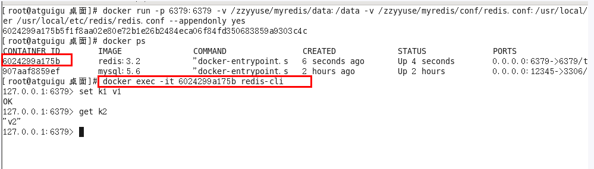
	
	- 测试持久化文件生成
	    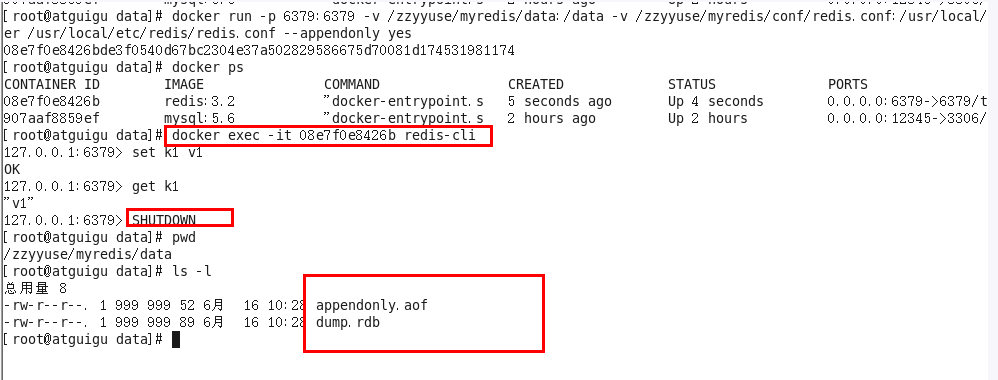

## 本地镜像发布到阿里云

### 本地镜像发布到阿里云流程

  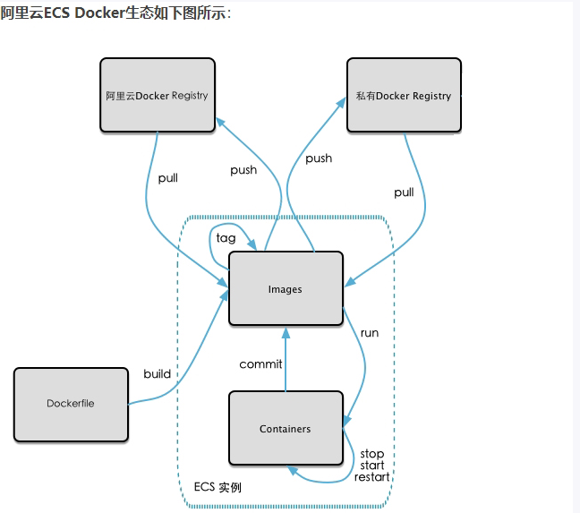

### 镜像的生成方法

- 前面的DockerFile
- 从容器创建一个新的镜像
  `docker commit [OPTIONS] 容器ID [REPOSITORY[:TAG]]`

  OPTIONS说明：`-a` :提交的镜像作者；`-m` :提交时的说明文字；
  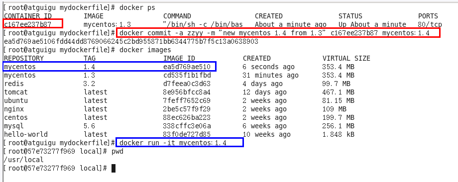

### 将本地镜像推送到阿里云

- 本地镜像素材原型
  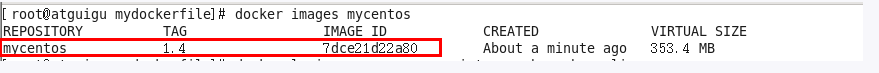
- 阿里云开发者平台

   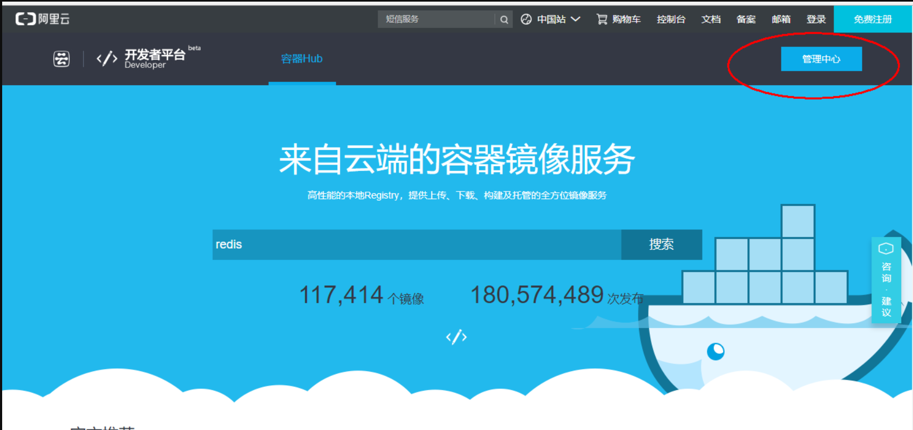

	- https://dev.aliyun.com/search.html

- 创建仓库镜像
  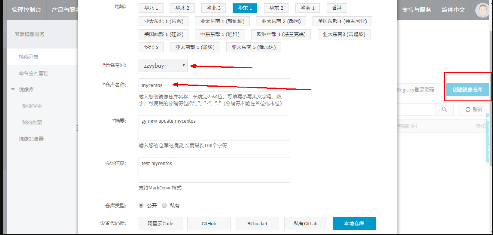

  - 命名空间
  - 仓库名称

- 将镜像推送到registry

    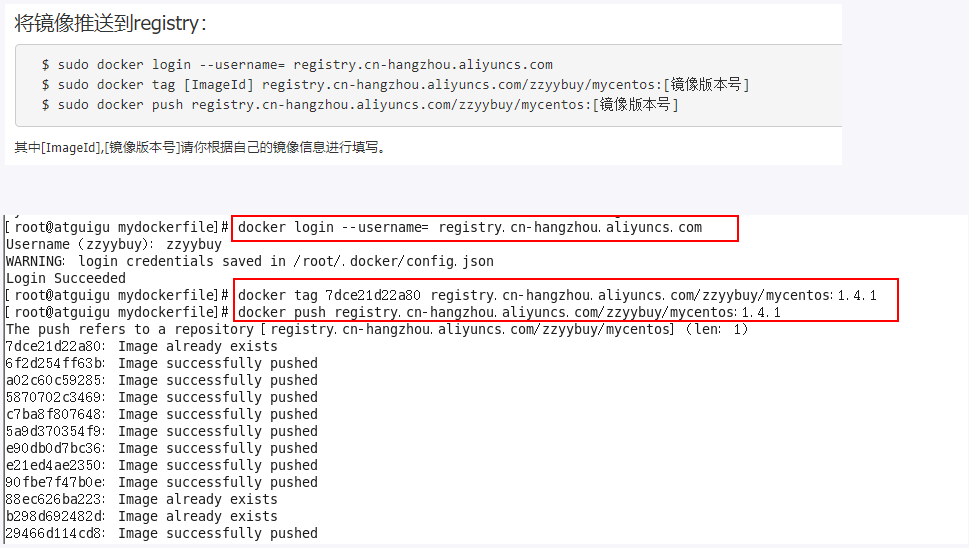

- 公有云可以查询到
  
- 查看详情

   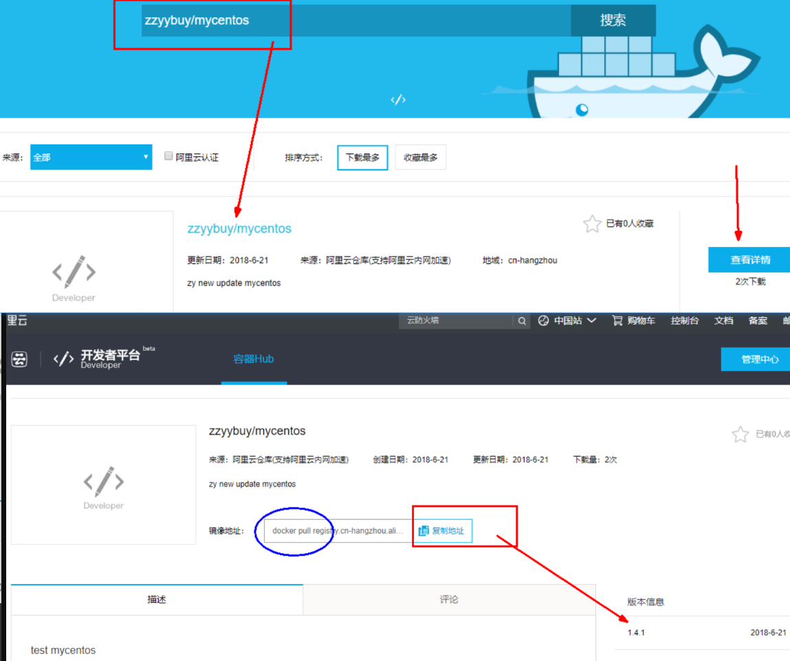

### 将阿里云上的镜像下载到本地

- 下载到本地

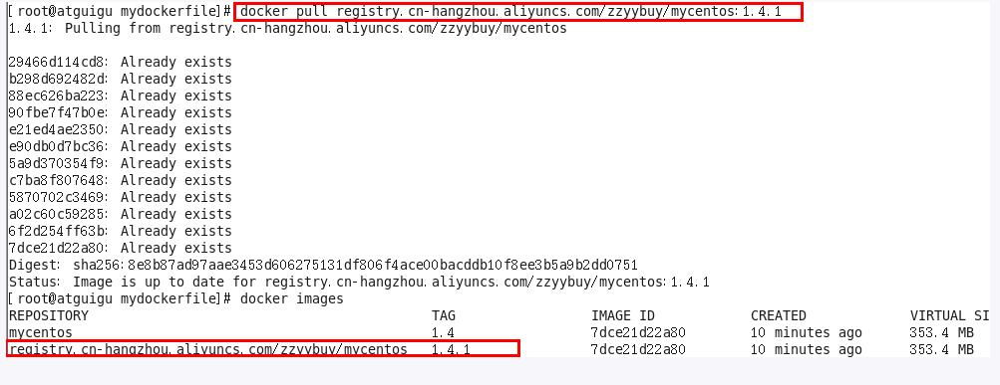