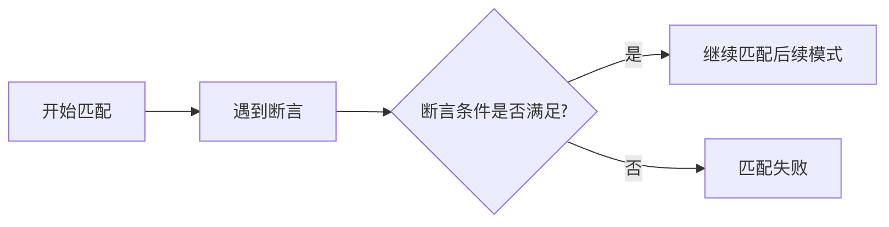

> 本文由 [简悦 SimpRead](http://ksria.com/simpread/) 转码， 原文地址 [www.runoob.com](https://www.runoob.com/regexp/regexp-assertions.html) [正则表达式 - 选择和分支](https://www.runoob.com/regexp/regexp-alternatives-branches.html "正则表达式 - 选择和分支")[正则表达式 – 示例](https://www.runoob.com/regexp/regexp-example.html "正则表达式 – 示例")

断言（Assertion）是正则表达式中用于指定匹配位置的元字符，它们不匹配任何实际字符，而是匹配字符之间的位置。

简单来说，断言就是 "条件"，它要求目标字符串必须满足某些条件，但不会消耗字符。

### 断言的特点

1.  **零宽度**：不占用匹配字符的位置
2.  **条件检查**：只检查是否满足特定条件
3.  **不影响匹配结果**：仅作为匹配的约束条件

```javascript
// 示例：匹配后面跟着"bar"的"foo"
const regex = /foo(?=bar)/;
console.log(regex.test("foobar"));  // true
console.log(regex.test("food"));    // false
```

断言的类型
-----

正则表达式中的断言主要分为两大类四种类型：

### 1. 先行断言（Lookahead Assertions）

检查当前位置之后是否匹配特定模式

#### 正向先行断言（Positive Lookahead）

语法：`` `(?=pattern)` ``

匹配后面跟着 **pattern** 的位置。

```javascript
// 匹配后面跟着数字的字母
const regex = /[a-z](?=\d)/;
console.log("a1".match(regex));  // ["a"]
```

#### 负向先行断言（Negative Lookahead）

语法：`` `(?!pattern)` ``

匹配后面不跟着 **pattern** 的位置。

```javascript
// 匹配后面不跟着数字的字母
const regex = /[a-z](?!\d)/;
console.log("ab".match(regex));  // ["a"]
```

### 2. 后行断言（Lookbehind Assertions）

检查当前位置之前是否匹配特定模式

#### 正向后行断言（Positive Lookbehind）

语法：`` `(?<=pattern)` ``

匹配前面是 **pattern** 的位置。

```javascript
// 匹配前面是$符号的数字
const regex = /(?<=\$)\d+/;
console.log("$100".match(regex));  // ["100"]
```

#### 负向后行断言（Negative Lookbehind）

语法：`` `(?<!pattern)` ``

匹配前面不是 **pattern** 的位置。

```javascript
// 匹配前面不是$符号的数字
const regex = /(?
```

断言的应用场景
-------

### 1. 密码强度验证

要求密码包含至少一个大写字母、一个小写字母和一个数字，但不以数字开头：

```javascript
const passwordRegex = /^(?=.*[a-z])(?=.*[A-Z])(?=.*\d)[A-Za-z]\w{7,}$/;
console.log(passwordRegex.test("Password1"));  // true
console.log(passwordRegex.test("password1"));  // false (缺少大写)
```

### 2. 提取特定格式的数据

从文本中提取不在引号内的数字：

```javascript
const text = '123 "456" 789 "101"';
const regex = /(?
```

### 3. 替换特定模式的文本

将不在 HTML 标签内的 "foo" 替换为 "bar"：

```javascript
const html = '
foo
 foo foo';
const regex = /foo(?![^<]*>)/g;
console.log(html.replace(regex, 'bar')); 
// "
foo
 bar foo"
```

断言的执行原理
-------

理解断言的工作原理有助于更好地使用它们：



1.  正则引擎遇到断言时，会暂停当前匹配
2.  检查断言指定的条件是否满足
3.  如果满足，继续匹配后续模式（不消耗字符）
4.  如果不满足，整个匹配失败

常见问题与解决方案
---------

### 问题 1：后行断言浏览器兼容性

**问题**：某些旧版浏览器不支持后行断言  
**解决方案**：

1.  使用 Babel 等工具转译代码
2.  改用其他正则表达式实现相同功能
3.  使用先行断言替代（如果逻辑允许）

```javascript
// 替代方案示例：不使用后行断言匹配前面是$的数字
const str = "$100 €200";
const matches = str.match(/\$(\d+)/g).map(m => m.substring(1));
console.log(matches);  // ["100"]
```

### 问题 2：断言性能问题

**问题**：复杂断言可能导致性能下降  
**优化建议**：

1.  尽量使断言模式具体化
2.  避免在长文本中使用多个复杂断言
3.  考虑将复杂断言拆分为多个简单正则表达式