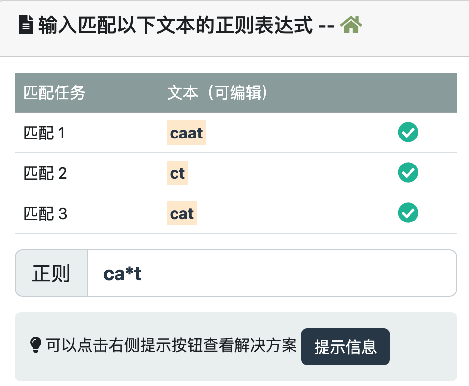
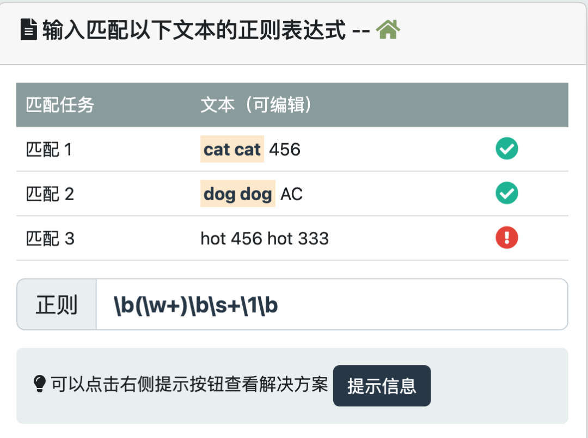

> 本文由 [简悦 SimpRead](http://ksria.com/simpread/) 转码， 原文地址 [www.runoob.com](https://www.runoob.com/regexp/regexp-usage-summary.html) [正则表达式在线测试](https://www.jyshare.com/front-end/854 "正则表达式在线测试")[正则表达式入门教程](https://www.runoob.com/regexp/regexp-wx-tutorial.html "正则表达式入门教程")

以下列出了一些常用正则表达式的使用总结：

### 匹配基本字符

*   使用普通字符匹配：普通字符（如字母、数字、符号）在正则表达式中表示自身，例如匹配 "runoob"：`` `/runoob/` ``。 [尝试一下 »](/try/try-regex.php?texts=runoob|runoobbb|runoooooob&tips=runoob)
    
    
    
*   使用元字符 `` `.` `` 匹配任意字符：`` `.` `` 表示匹配任意单个字符，例如匹配 "cat" 或 "cbt"：`/c.t/`。 [尝试一下 »](/try/try-regex.php?texts=cat|bat|hat&tips=c.t)
    
    
    

### 匹配字符集合

*   使用字符集合匹配：使用方括号 `` `[]` `` 表示字符集合，匹配集合中的任意字符，例如匹配 "cat"、"bat" 或 "hat"：`/[cbh]at/`。[尝试一下 »](/try/try-regex.php?texts=cat|bat|hat&tips=%5Bcbh%5Dat)
    
    
    
*   使用连字符 `` `-` `` 表示字符范围：在字符集合中使用连字符 `` `-` `` 表示匹配字符范围，例如匹配 "a" 到 "z" 的小写字母：`/[a-z]/`。[尝试一下 »](/try/try-regex.php?texts=abc|123|ABC&tips=%5Ba-z%5D)
    
    
    

### 匹配重复和数量

*   使用 `` `*` `` 匹配零个或多个：`` `*` `` 表示匹配前面的模式零次或多次，例如匹配 "caat"、"ct" 或 "cat"：`/ca*t/`。[尝试一下 »](/try/try-regex.php?texts=caat|ct|cat&tips=ca*t)
    
    
    
*   使用 `` `+` `` 匹配一个或多个：`` `+` `` 表示匹配前面的模式至少一次或多次，例如匹配 "cat"、"caat"、"caaat" 等：`/ca+t/`。[尝试一下 »](/try/try-regex.php?texts=caat|caat|caaat&tips=ca%2Bt)
    
    
    
*   使用 `` `?` `` 匹配零个或一个：`` `?` `` 表示匹配前面的模式零次或一次，例如匹配 "ct" 或 "cat"：`/ca?t/`。[尝试一下 »](/try/try-regex.php?texts=ct|cat|caat&tips=ca%3Ft)
    
    
    
*   使用花括号 `` `{n}` `` 匹配固定数量：使用花括号 `` `{n}` `` 表示匹配前面的模式恰好 n 次，例如匹配 "caat"、"caat123" 或 "caataaa"：`/ca{2}t/`。[尝试一下 »](/try/try-regex.php?texts=caat|caat123|caataaa&tips=ca%7B2%7Dt)
    
    
    

### 使用特殊字符和转义

*   转义特殊字符：使用反斜杠 `` `\` `` 来转义特殊字符，例如匹配 "2+2=4"：`/2\+2=4/`。[尝试一下 »](/try/try-regex.php?texts=2%2B2%3D4|22%3D4|2%3D4&tips=2%5C%2B2%3D4)
    
    
    
*   匹配边界和位置：使用特殊字符 `` `^` `` 和 `` `$` `` 分别表示行的开头和结尾，例如匹配以 "hello" 开头的字符串：`/^hello/`。[尝试一下 »](/try/try-regex.php?texts=hello|hello123|helloABC&tips=%5Ehello)
    
    
    

### 使用捕获组

*   使用括号 `` `()` `` 创建捕获组：使用括号 `` `()` `` 将一部分正则表达式模式组合成一个捕获组，可以提取或分组匹配的内容，例如提取日期中的年份：`/(\d{4})-\d{2}-\d{2}/`。[尝试一下 »](/try/try-regex.php?texts=2000-01-23|2010-06-03|2023-12-23&tips=(%5Cd%7B4%7D)-%5Cd%7B2%7D-%5Cd%7B2%7D)
    
    
    

### 使用字符转义

*   使用反斜杠 `` `\` `` 转义特殊字符：对于正则表达式中的特殊字符，如 `*`、`+`、`?` 等，使用反斜杠 `` `\` `` 进行转义，例如匹配包含字面量星号的字符串：`/\*/`。[尝试一下 »](/try/try-regex.php?texts=a*b|1*2|A*B&tips=%5C*)
    
    
    

### 使用字符类别

*   使用预定义的字符类别：正则表达式提供了一些预定义的字符类别，例如 `` `\d` `` 匹配任意数字字符，`` `\w` `` 匹配任意字母、数字或下划线字符，`` `\s` `` 匹配任意空白字符等。[尝试一下 »](/try/try-regex.php?texts=123|123abc|124ABC&tips=%5Cd*)
    
    
    

### 使用逻辑操作符

*   使用 `` `|` `` 进行逻辑或操作：`` `|` `` 用于表示逻辑或操作，可以匹配多个模式中的任意一个，例如匹配 "cat" 或 "dog"：`/(cat|dog)/`。[尝试一下 »](/try/try-regex.php?texts=cat|dog|hot&tips=cat%7Cdog)
    
    
    

### 使用反向引用

*   使用 `` `\n` `` 进行反向引用：在正则表达式中，`` `\n` `` 可以用来引用前面捕获组中匹配的内容，例如匹配重复的单词：`/\b(\w+)\b\s+\1\b/`。[尝试一下 »](/try/try-regex.php?texts=cat cat 456|dog dog AC|hot 456 hot 333&tips=%5Cb(%5Cw%2B)%5Cb%5Cs%2B%5C1%5Cb)
    
    
    

### 使用修饰符

*   使用修饰符改变匹配行为：正则表达式支持一些修饰符，如 `` `i` `` 用于进行不区分大小写的匹配，`` `g` `` 用于全局匹配，`` `m` `` 用于多行匹配等。
    
    