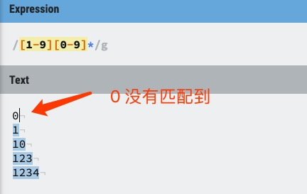
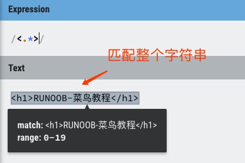
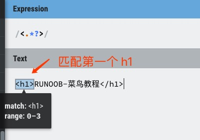
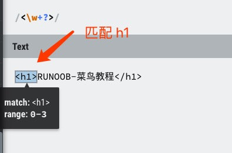
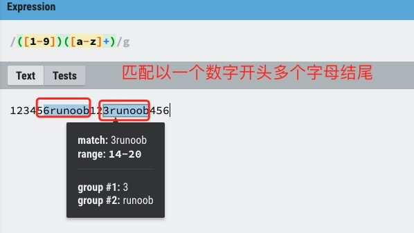
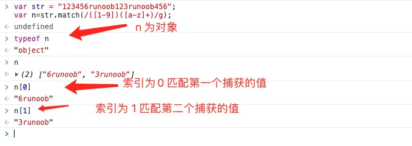
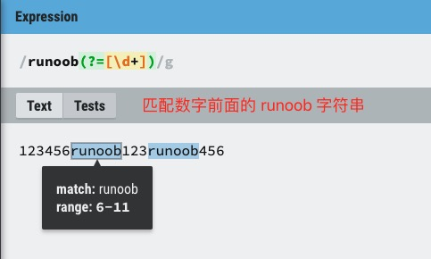
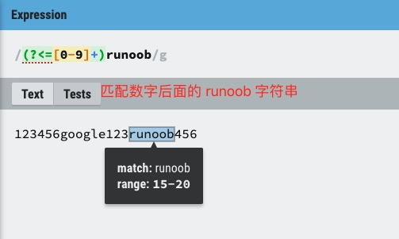
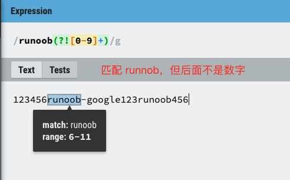
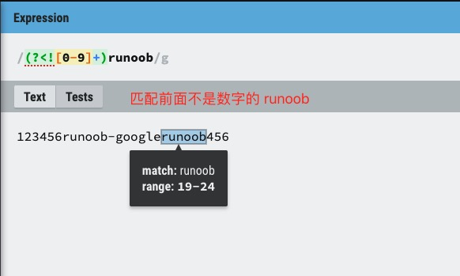

> 本文由 [简悦 SimpRead](http://ksria.com/simpread/) 转码， 原文地址 [www.runoob.com](https://www.runoob.com/regexp/regexp-syntax.html) [正则表达式 – 简介](https://www.runoob.com/regexp/regexp-intro.html "正则表达式 – 简介")[正则表达式 - 修饰符](https://www.runoob.com/regexp/regexp-flags.html "正则表达式 - 修饰符")

正则表达式是一种用于匹配和操作文本的强大工具，它是由一系列字符和特殊字符组成的模式，用于描述要匹配的文本模式。

正则表达式可以在文本中查找、替换、提取和验证特定的模式。

例如：

*   `runoo+b`，可以匹配 **runoob、runooob、runoooooob** 等，`+` 号代表前面的字符必须至少出现一次（1 次或多次）[`尝试一下 »`](/try/try-regex.php?texts=runoob|runooob|runoooooob&tips=runoo%2Bb)。
    
*   `runoo*b`，可以匹配 **runob、runoob、runoooooob** 等，`*` 号代表前面的字符可以不出现，也可以出现一次或者多次（0 次、或 1 次、或多次）[`尝试一下 »`](/try/try-regex.php?texts=runoob|runooob|runoooooob&tips=runoo*b)。
    
*   `colou?r` 可以匹配 **color** 或者 **colour**，`?` 问号代表前面的字符最多只可以出现一次（0 次或 1 次）[`尝试一下 »`](/try/try-regex.php?texts=color|colour|colour123&tips=colou%3Fr)。
    

构造正则表达式的方法和创建数学表达式的方法一样。也就是用多种元字符与运算符可以将小的表达式结合在一起来创建更大的表达式。正则表达式的组件可以是单个的字符、字符集合、字符范围、字符间的选择或者所有这些组件的任意组合。

正则表达式是由普通字符（例如字符 a 到 z）以及特殊字符（称为 "元字符"）组成的文字模式。模式描述在搜索文本时要匹配的一个或多个字符串。正则表达式作为一个模板，将某个字符模式与所搜索的字符串进行匹配。

普通字符
----

普通字符包括没有显式指定为元字符的所有可打印和不可打印字符。这包括所有大写和小写字母、所有数字、所有标点符号和一些其他符号。

<table>
      <tbody>
        <tr>
          <th width="10%">字符</th>
          <th width="80%">描述</th>
        </tr>
        <tr>
          <td><code>[ABC]</code></td>
          <td>
            <p>
              匹配 <code>[...]</code> 中的所有字符，例如
              <code>[aeiou]</code> 匹配字符串 "google runoob taobao" 中所有的 e
              o u a 字母。
            </p>
            
          </td>
        </tr>
        <tr>
          <td><code>[^ABC]</code></td>
          <td>
            <p>
              匹配除了 <code>[...]</code> 中字符的所有字符，例如
              <code>[^aeiou]</code> 匹配字符串 "google runoob taobao" 中除了 e o
              u a 字母的所有字符。
            </p>
            
          </td>
        </tr>
        <tr>
          <td><code>[A-Z]</code></td>
          <td>
            <p>
              [A-Z] 表示一个区间，匹配所有大写字母，[a-z] 表示所有小写字母。
            </p>
            
          </td>
        </tr>
        <tr>
          <td><code>.</code></td>
          <td>
            <p>匹配除换行符（\n、\r）之外的任何单个字符，相等于 [^\n\r]。</p>
            
          </td>
        </tr>
        <tr>
          <td><code>[\s\S]</code></td>
          <td>
            <p>
              匹配所有。\s 是匹配所有空白符，包括换行，\S 非空白符，不包括换行。
            </p>
            
          </td>
        </tr>
        <tr>
          <td><code>\w</code></td>
          <td>
            <p>匹配字母、数字、下划线。等价于 [A-Za-z0-9_]</p>
            
          </td>
        </tr>
        <tr>
          <td><code>\d</code></td>
          <td>
            <p>匹配任意一个阿拉伯数字（0 到 9）。等价于 <code>[0-9]</code></p>
            
          </td>
        </tr>
      </tbody>
    </table>

修饰符：

```
[0-9]+
```

匹配文本：

```
abc123def
```

非打印字符
-----

非打印字符也可以是正则表达式的组成部分。下表列出了表示非打印字符的转义序列：

<table><tbody><tr><th width="20%">字符</th><th width="80%">描述</th></tr><tr><td>\cx</td><td>匹配由 x 指明的控制字符。例如， \cM 匹配一个 Control-M 或回车符。x 的值必须为 A-Z 或 a-z 之一。否则，将 c 视为一个原义的'c' 字符。</td></tr><tr><td>\f</td><td>匹配一个换页符。等价于 \x0c 和 \cL。</td></tr><tr><td>\n</td><td>匹配一个换行符。等价于 \x0a 和 \cJ。</td></tr><tr><td>\r</td><td>匹配一个回车符。等价于 \x0d 和 \cM。</td></tr><tr><td>\s</td><td>匹配任何空白字符，包括空格、制表符、换页符等等。等价于 [\f\n\r\t\v]。注意 Unicode 正则表达式会匹配全角空格符。</td></tr><tr><td>\S</td><td>匹配任何非空白字符。等价于 [^ \f\n\r\t\v]。</td></tr><tr><td>\t</td><td>匹配一个制表符。等价于 \x09 和 \cI。</td></tr><tr><td>\v</td><td>匹配一个垂直制表符。等价于 \x0b 和 \cK。</td></tr></tbody></table>

特殊字符
----

所谓特殊字符，就是一些有特殊含义的字符，如上面说的 `runoo*b` 中的 `*`，简单的说就是表示任何字符串的意思。如果要查找字符串中的 `*` 符号，则需要对 `*` 进行转义，即在其前加一个 `\`，`runo\*ob` 匹配字符串 **runo*ob**。

许多元字符要求在试图匹配它们时特别对待。若要匹配这些特殊字符，必须首先使字符 "转义"，即，将反斜杠字符`\` 放在它们前面。下表列出了正则表达式中的特殊字符：

<table><tbody><tr><th width="20%">特别字符</th><th width="80%">描述</th></tr><tr><td>$</td><td>匹配输入字符串的结尾位置。如果设置了 RegExp 对象的 Multiline 属性，则 $ 也匹配 '\n' 或 '\r'。要匹配 $ 字符本身，请使用 \$。</td></tr><tr><td>( )</td><td>标记一个子表达式的开始和结束位置。子表达式可以获取供以后使用。要匹配这些字符，请使用 \(和 \)。</td></tr><tr><td>*</td><td>匹配前面的子表达式零次或多次。要匹配 * 字符，请使用 \*。</td></tr><tr><td>+</td><td>匹配前面的子表达式一次或多次。要匹配 + 字符，请使用 \+。</td></tr><tr><td>.</td><td>匹配除换行符 \n 之外的任何单字符。要匹配 . ，请使用 \. 。</td></tr><tr><td>[</td><td>标记一个中括号表达式的开始。要匹配 [，请使用 \[。</td></tr><tr><td>?</td><td>匹配前面的子表达式零次或一次，或指明一个非贪婪限定符。要匹配 ? 字符，请使用 \?。</td></tr><tr><td>\</td><td>将下一个字符标记为或特殊字符、或原义字符、或向后引用、或八进制转义符。例如， 'n' 匹配字符'n'。'\n' 匹配换行符。序列 '\\' 匹配 "\"，而 '\(' 则匹配 "("。</td></tr><tr><td>^</td><td>匹配输入字符串的开始位置，除非在方括号表达式中使用，当该符号在方括号表达式中使用时，表示不接受该方括号表达式中的字符集合。要匹配 ^ 字符本身，请使用 \^。</td></tr><tr><td>{</td><td>标记限定符表达式的开始。要匹配 {，请使用 \{。</td></tr><tr><td>|</td><td>指明两项之间的一个选择。要匹配 |，请使用 \|。</td></tr></tbody></table>

限定符
---

限定符用来指定正则表达式的一个给定组件必须要出现多少次才能满足匹配。有 `*` 或 `+` 或 `?` 或 `{n}` 或 `{n,}` 或 `{n,m}` 共 6 种。

正则表达式的限定符有：

<table><tbody><tr><th width="20%">字符</th><th width="70%">描述</th></tr><tr><td>*</td><td>匹配前面的子表达式零次或多次。例如，<code>zo*</code> 能匹配 <strong>"z"</strong> 以及 <strong>"zoo"</strong>。<code>*</code> 等价于 <code>{0,}</code>。</td></tr><tr><td>+</td><td>匹配前面的子表达式一次或多次。例如，<code>zo+</code> 能匹配 <strong>"zo"</strong> 以及 "<strong>zoo"</strong>，但不能匹配 <strong>"z"</strong>。<code>+</code> 等价于 <code>{1,}</code>。</td></tr><tr><td>?</td><td><p>匹配前面的子表达式零次或一次。例如，<code>do(es)?</code> 可以匹配 <strong>"do"</strong> 、 <strong>"does"</strong>、 <strong>"doxy"</strong> 中的 <strong>"do"</strong> 和 <strong>"does"</strong>。<code>?</code> 等价于 <code>{0,1}</code>。</p></td></tr><tr><td>{n}</td><td>n 是一个非负整数。匹配确定的 <strong>n</strong> 次。例如，<code>o{2}</code> 不能匹配 <strong>"Bob"</strong> 中的 <strong>o</strong>，但是能匹配 <strong>"food"</strong> 中的两个 <strong>o</strong>。</td></tr><tr><td>{n,}</td><td>n 是一个非负整数。至少匹配 n 次。例如，<code>o{2,}</code> 不能匹配 <strong>"Bob"</strong> 中的 <strong>o</strong>，但能匹配 <strong>"foooood"</strong> 中的所有 <strong>o</strong>。<code>o{1,}</code> 等价于 <code>o+</code>。<code>o{0,}</code> 则等价于 <code>o*</code>。</td></tr><tr><td>{n,m}</td><td>m 和 n 均为非负整数，其中 n &lt;= m。最少匹配 n 次且最多匹配 m 次。例如，<code>o{1,3}</code> 将匹配 <strong>"fooooood"</strong> 中的前三个 <strong>o</strong>。<code>o{0,1}</code> 等价于 <code>o?</code>。请注意在逗号和两个数之间不能有空格。</td></tr></tbody></table>

以下正则表达式匹配一个正整数，**[1-9]** 设置第一个数字不是 0，`[0-9]*` 表示任意多个数字：

```
/[1-9][0-9]*/
```



请注意，限定符出现在范围表达式之后。因此，它应用于整个范围表达式，在本例中，只指定从 0 到 9 的数字（包括 0 和 9）。

这里不使用 + 限定符，因为在第二个位置或后面的位置不一定需要有一个数字。也不使用 ? 字符，因为使用 ? 会将整数限制到只有两位数。

如果你想设置 0~99 的两位数，可以使用下面的表达式来至少指定一位但至多两位数字。

```
/[0-9]{1,2}/
```

上面的表达式的缺点是，只能匹配两位数字，而且可以匹配 0、00、01、10 99 的章节编号仍只匹配开头两位数字。

```
/[1-9][0-9]?/
```

或

```
/[1-9][0-9]{0,1}/
```

**`*` 和 `+` 限定符都是贪婪的，因为它们会尽可能多的匹配文字，只有在它们的后面加上一个 ? 就可以实现非贪婪或最小匹配。**

例如，您可能搜索 HTML 文档，以查找在 `h1` 标签内的内容。HTML 代码如下：

```
<h1>RUNOOB-菜鸟教程</h1>
```

**贪婪：**下面的表达式匹配从开始小于符号 (<) 到关闭 h1 标记的大于符号 (>) 之间的所有内容。

```
/<.*>/
```



**非贪婪：**如果您只需要匹配开始和结束 h1 标签，下面的非贪婪表达式只匹配 <h1>。

```
/<.*?>/
```



也可以使用以下正则表达式来匹配 h1 标签，表达式则是：

```
/<\w+?>/
```



通过在 `*`、`+` 或 `?` 限定符之后放置 `?`，该表达式从 "贪婪" 表达式转换为 "非贪婪" 表达式或者最小匹配。

定位符
---

定位符使您能够将正则表达式固定到行首或行尾。它们还使您能够创建这样的正则表达式，这些正则表达式出现在一个单词内、在一个单词的开头或者一个单词的结尾。

定位符用来描述字符串或单词的边界，`^` 和 `$` 分别指字符串的开始与结束，`\b` 描述单词的前或后边界，`\B` 表示非单词边界。

正则表达式的定位符有：

<table><tbody><tr><th width="20%">字符</th><th width="70%">描述</th></tr><tr><td>^</td><td>匹配输入字符串开始的位置。如果设置了 RegExp 对象的 Multiline 属性，^ 还会与 \n 或 \r 之后的位置匹配。</td></tr><tr><td>$</td><td>匹配输入字符串结尾的位置。如果设置了 RegExp 对象的 Multiline 属性，$ 还会与 \n 或 \r 之前的位置匹配。</td></tr><tr><td>\b</td><td>匹配一个单词边界，即字与空格间的位置。</td></tr><tr><td>\B</td><td>非单词边界匹配。</td></tr></tbody></table>

**注意**：不能将限定符与定位符一起使用。由于在紧靠换行或者单词边界的前面或后面不能有一个以上位置，因此不允许诸如 `^*` 之类的表达式。

若要匹配一行文本开始处的文本，请在正则表达式的开始使用 `^` 字符。不要将 `^` 的这种用法与中括号表达式内的用法混淆。

若要匹配一行文本的结束处的文本，请在正则表达式的结束处使用 `$` 字符。

若要在搜索章节标题时使用定位点，下面的正则表达式匹配一个章节标题，该标题只包含两个尾随数字，并且出现在行首：

```
/^Chapter [1-9][0-9]{0,1}/
```

真正的章节标题不仅出现行的开始处，而且它还是该行中仅有的文本。它既出现在行首又出现在同一行的结尾。下面的表达式能确保指定的匹配只匹配章节而不匹配交叉引用。通过创建只匹配一行文本的开始和结尾的正则表达式，就可做到这一点。

```
/^Chapter [1-9][0-9]{0,1}$/
```

匹配单词边界稍有不同，但向正则表达式添加了很重要的能力。单词边界是单词和空格之间的位置。非单词边界是任何其他位置。下面的表达式匹配单词 Chapter 的开头三个字符，因为这三个字符出现在单词边界后面：

```
/\bCha/
```

`\b` 字符的位置是非常重要的。如果它位于要匹配的字符串的开始，它在单词的开始处查找匹配项。如果它位于字符串的结尾，它在单词的结尾处查找匹配项。例如，下面的表达式匹配单词 Chapter 中的字符串 ter，因为它出现在单词边界的前面：

```
/ter\b/
```

下面的表达式匹配 Chapter 中的字符串 apt，但不匹配 aptitude 中的字符串 apt：

```
/\Bapt/
```

字符串 apt 出现在单词 Chapter 中的非单词边界处，但出现在单词 aptitude 中的单词边界处。对于 `\B` 非单词边界运算符，不可以匹配单词的开头或结尾，如果是下面的表达式，就不匹配 Chapter 中的 Cha：

```
\BCha
```

选择
--

用圆括号 `()` 将所有选择项括起来，相邻的选择项之间用 `|` 分隔。

`()` 表示捕获分组，`()` 会把每个分组里的匹配的值保存起来， 多个匹配值可以通过数字 n 来查看 (**n** 是一个数字，表示第 n 个捕获组的内容)。





但用圆括号会有一个副作用，使相关的匹配会被缓存，此时可用 `?:` 放在第一个选项前来消除这种副作用。

其中 `?:` 是非捕获元之一，还有两个非捕获元是 `?=` 和 `?!`，这两个还有更多的含义，前者为正向预查，在任何开始匹配圆括号内的正则表达式模式的位置来匹配搜索字符串，后者为负向预查，在任何开始不匹配该正则表达式模式的位置来匹配搜索字符串。

### 以下列出 ?=、?<=、?!、?<! 的使用区别

`exp1(?=exp2)`：查找 exp2 前面的 exp1。



`(?<=exp2)exp1`：查找 exp2 后面的 exp1。



`exp1(?!exp2)`：查找后面不是 exp2 的 exp1。



`(?<!exp2)exp1`：查找前面不是 exp2 的 exp1。



> 更多内容可以参考：[正则表达式的先行断言 (lookahead) 和后行断言(lookbehind)](https://www.runoob.com/w3cnote/reg-lookahead-lookbehind.html)

反向引用
----

对一个正则表达式模式或部分模式两边添加圆括号将导致相关匹配存储到一个临时缓冲区中，所捕获的每个子匹配都按照在正则表达式模式中从左到右出现的顺序存储。缓冲区编号从 1 开始，最多可存储 99 个捕获的子表达式。每个缓冲区都可以使用 `\n` 访问，其中 n 为一个标识特定缓冲区的一位或两位十进制数。

可以使用非捕获元字符 `?:`、`?=` 或 `?!` 来重写捕获，忽略对相关匹配的保存。

反向引用的最简单的、最有用的应用之一，是提供查找文本中两个相同的相邻单词的匹配项的能力。以下面的句子为例：

```
Is is the cost of of gasoline going up up?
```

上面的句子很显然有多个重复的单词。如果能设计一种方法定位该句子，而不必查找每个单词的重复出现，那该有多好。下面的正则表达式使用单个子表达式来实现这一点：

```javascript
var str = "Is is the cost of of gasoline going up up";
var patt1 = /\b([a-z]+) \1\b/igm;
document.write(str.match(patt1));
```

捕获的表达式，正如 `[a-z]+` 指定的，包括一个或多个字母。正则表达式的第二部分是对以前捕获的子匹配项的引用，即，单词的第二个匹配项正好由括号表达式匹配。`\1` 指定第一个子匹配项。

单词边界元字符确保只检测整个单词。否则，诸如 "is issued" 或 "this is" 之类的词组将不能正确地被此表达式识别。

正则表达式后面的全局标记 `g` 指定将该表达式应用到输入字符串中能够查找到的尽可能多的匹配。

表达式的结尾处的不区分大小写 `i` 标记指定不区分大小写。

多行标记 `m` 指定换行符的两边可能出现潜在的匹配。

反向引用还可以将通用资源指示符 (URI) 分解为其组件。假定您想将下面的 URI 分解为协议（ftp、http 等等）、域地址和页 / 路径：

```
https://www.runoob.com:80/html/html-tutorial.html
```

下面的正则表达式提供该功能：

```javascript
var str = "https://www.runoob.com:80/html/html-tutorial.html";
var patt1 = /(\w+):\/\/([^/:]+)(:\d*)?([^# ]*)/;
arr = str.match(patt1);
for (var i = 0; i < arr.length ; i++) {
    document.write(arr[i]);
    document.write("
");
}
```

第三行代码 `str.match(patt1)` 返回一个数组，实例中的数组包含 5 个元素，索引 0 对应的是整个字符串，索引 1 对应第一个匹配符（括号内），以此类推。

第一个括号子表达式捕获 Web 地址的协议部分。该子表达式匹配在冒号和两个正斜杠前面的任何单词。

第二个括号子表达式捕获地址的域地址部分。子表达式匹配非 `:` 和 `/` 之后的一个或多个字符。

第三个括号子表达式捕获端口号（如果指定了的话）。该子表达式匹配冒号后面的零个或多个数字。只能重复一次该子表达式。

最后，第四个括号子表达式捕获 Web 地址指定的路径和 / 或页信息。该子表达式能匹配不包括 # 或空格字符的任何字符序列。

将正则表达式应用到上面的 URI，各子匹配项包含下面的内容：

*   第一个括号子表达式包含 **https**
*   第二个括号子表达式包含 **www.runoob.com**
*   第三个括号子表达式包含 **:80**
*   第四个括号子表达式包含 **/html/html-tutorial.html**