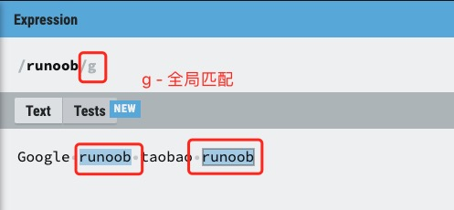
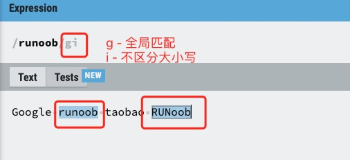
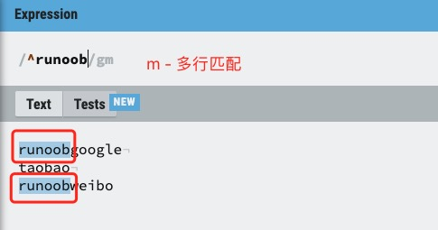
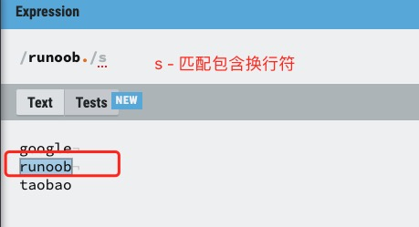

> 本文由 [简悦 SimpRead](http://ksria.com/simpread/) 转码， 原文地址 [www.runoob.com](https://www.runoob.com/regexp/regexp-flags.html) [正则表达式 – 语法](https://www.runoob.com/regexp/regexp-syntax.html "正则表达式 – 语法")[正则表达式 – 元字符](https://www.runoob.com/regexp/regexp-metachar.html "正则表达式 – 元字符")

正则表达式修饰符（也称为模式修饰符或标记）是用于改变正则表达式匹配行为的特殊指令。

标记也称为修饰符，正则表达式的标记用于指定额外的匹配策略。

标记不写在正则表达式里，标记位于表达式之外，格式如下：

```
/pattern/flags
```

常用修饰符
-----

下表列出了正则表达式常用的修饰符：

### 1. `i` (ignore case) - 忽略大小写

*   使匹配不区分大小写
    
*   示例：`/abc/i` 可以匹配 "abc", "Abc", "ABC" 等
    
*   支持语言：几乎所有正则表达式实现（JavaScript、PHP、Python 等）
    

### 2. `g` (global) - 全局匹配

*   查找所有匹配项，而不是在第一个匹配后停止
    
*   示例：在字符串 "ababab" 中，`/ab/g` 会匹配所有三个 "ab"
    
*   支持语言：JavaScript、PHP 等
    

### 3. `m` (multiline) - 多行模式

*   改变 `^` 和 `$` 的行为，使其匹配每行的开头和结尾，而不仅是整个字符串的开头和结尾
    
*   示例：在多行字符串中，`/^abc/m` 会匹配每行开头的 "abc"
    
*   支持语言：JavaScript、PHP、Python、Perl 等
    

### 4. `s` (single line/dotall) - 单行模式

*   使点号 `.` 匹配包括换行符在内的所有字符
    
*   在 JavaScript 中称为 "dotall" 模式，使用 `/s` 修饰符
    
*   示例：`/a.b/s` 可以匹配 "a\nb"
    
*   支持语言：PHP、Perl、Python(作为`re.DOTALL`)、JavaScript(ES2018+)
    

### 5. `u` (unicode) - Unicode 模式

*   启用完整的 Unicode 支持
    
*   正确处理 UTF-16 代理对和 Unicode 字符属性
    
*   示例：`/\p{Script=Greek}/u` 可以匹配希腊字母
    
*   支持语言：JavaScript、PHP 等
    

### 6. `y` (sticky) - 粘性匹配

*   从目标字符串的当前位置开始匹配（使用`lastIndex`属性）
    
*   类似于`^`锚点，但针对的是匹配的起始位置
    
*   示例：在 JavaScript 中，`/a/y` 会从`lastIndex`开始匹配 "a"
    
*   支持语言：JavaScript
    

### 7. `x` (extended) - 扩展模式

*   忽略模式中的空白和注释，使正则表达式更易读
    
*   示例：在 PHP 中，`/a b c/x` 等同于 `/abc/`
    
*   支持语言：PHP、Perl、Python(作为`re.VERBOSE`)

## 示例

### g 修饰符

g 修饰符可以查找字符串中所有的匹配项：



```javascript
var str="Google runoob taobao runoob"; 
var n1=str.match(/runoob/);   // 查找第一次匹配项
var n2=str.match(/runoob/g);  // 查找所有匹配项
```

---

🔹 Java 实现

Java 中使用 `Pattern` 和 `Matcher` 类来实现正则匹配。

```java
import java.util.regex.*;
import java.util.ArrayList;

public class RegexExample {
    public static void main(String[] args) {
        String str = "Google runoob taobao runoob";

        // 查找第一个匹配项
        String n1 = null;
        Pattern p1 = Pattern.compile("runoob");
        Matcher m1 = p1.matcher(str);
        if (m1.find()) {
            n1 = m1.group();
        }

        // 查找所有匹配项
        ArrayList<String> n2 = new ArrayList<>();
        Pattern p2 = Pattern.compile("runoob");
        Matcher m2 = p2.matcher(str);
        while (m2.find()) {
            n2.add(m2.group());
        }

        System.out.println("n1 (第一次匹配): " + n1);     // runoob
        System.out.println("n2 (所有匹配): " + n2);       // [runoob, runoob]
    }
}
```

---

🔹 Python 实现

Python 使用 `re` 模块中的 `re.search()` 和 `re.findall()` 函数分别查找第一个匹配和所有匹配。

```python
import re

str_ = "Google runoob taobao runoob"

# 查找第一个匹配项
match_n1 = re.search(r"runoob", str_)
n1 = match_n1.group() if match_n1 else None

# 查找所有匹配项
n2 = re.findall(r"runoob", str_)

print("n1 (第一次匹配):", n1)     # runoob
print("n2 (所有匹配):", n2)       # ['runoob', 'runoob']
```


### i 修饰符

i 修饰符为不区分大小写匹配，实例如下：



```javascript
var str="Google runoob taobao RUNoob"; 
var n1=str.match(/runoob/g);   // 区分大小写
var n2=str.match(/runoob/gi);  // 不区分大小写
```


---

🔹 Java 实现

Java 中使用 `Pattern` 和 `Matcher` 来进行正则匹配。区分大小写是默认行为，要**不区分大小写**可以使用 `Pattern.CASE_INSENSITIVE` 标志。

```java
import java.util.regex.*;
import java.util.ArrayList;

public class RegexExample {
    public static void main(String[] args) {
        String str = "Google runoob taobao RUNoob";

        // 区分大小写
        ArrayList<String> n1 = new ArrayList<>();
        Pattern p1 = Pattern.compile("runoob");
        Matcher m1 = p1.matcher(str);
        while (m1.find()) {
            n1.add(m1.group());
        }

        // 不区分大小写
        ArrayList<String> n2 = new ArrayList<>();
        Pattern p2 = Pattern.compile("runoob", Pattern.CASE_INSENSITIVE);
        Matcher m2 = p2.matcher(str);
        while (m2.find()) {
            n2.add(m2.group());
        }

        System.out.println("n1 (区分大小写): " + n1);     // [runoob]
        System.out.println("n2 (不区分大小写): " + n2);   // [runoob, RUNoob]
    }
}
```

---

🔹 Python 实现

Python 使用 `re.findall()` 函数来获取所有匹配项。通过 `flags=re.IGNORECASE` 可以实现不区分大小写的匹配。

```python
import re

str_ = "Google runoob taobao RUNoob"

# 区分大小写
n1 = re.findall(r"runoob", str_)

# 不区分大小写
n2 = re.findall(r"runoob", str_, flags=re.IGNORECASE)

print("n1 (区分大小写):", n1)         # ['runoob']
print("n2 (不区分大小写):", n2)       # ['runoob', 'RUNoob']
```


### m 修饰符

m 修饰符可以使 `^` 和 `$` 匹配一段文本中每行的开始和结束位置。

g 只匹配第一行，添加 m 之后实现多行。



以下实例字符串中使用 `\n` 来换行：

```java
var str="runoobgoogle\ntaobao\nrunoobweibo";
var n1=str.match(/^runoob/g);   // 匹配一个
var n2=str.match(/^runoob/gm);  // 多行匹配
```

---

🔹 Java 实现

Java 中使用 `Pattern` 和 `Matcher` 类来处理正则表达式。启用多行模式使用 `Pattern.MULTILINE` 标志。

```java
import java.util.regex.*;
import java.util.ArrayList;

public class RegexExample {
    public static void main(String[] args) {
        String str = "runoobgoogle\ntaobao\nrunoobweibo";

        // 匹配字符串开头的 "runoob"
        ArrayList<String> n1 = new ArrayList<>();
        Pattern p1 = Pattern.compile("^runoob");
        Matcher m1 = p1.matcher(str);
        if (m1.find()) {
            n1.add(m1.group());
        }

        // 多行模式：匹配每一行开头的 "runoob"
        ArrayList<String> n2 = new ArrayList<>();
        Pattern p2 = Pattern.compile("^runoob", Pattern.MULTILINE);
        Matcher m2 = p2.matcher(str);
        while (m2.find()) {
            n2.add(m2.group());
        }

        System.out.println("n1 (仅匹配字符串开头): " + n1);      // [runoob]
        System.out.println("n2 (多行模式匹配): " + n2);          // [runoob, runoob]
    }
}
```

---

🔹 Python 实现

Python 使用 `re.findall()` 来获取所有匹配项。多行模式通过 `flags=re.MULTILINE` 启用。

```python
import re

str_ = "runoobgoogle\ntaobao\nrunoobweibo"

# 匹配字符串开头的 "runoob"
n1 = re.findall(r"^runoob", str_)

# 多行模式：匹配每一行开头的 "runoob"
n2 = re.findall(r"^runoob", str_, flags=re.MULTILINE)

print("n1 (仅匹配字符串开头):", n1)     # ['runoob']
print("n2 (多行模式匹配):", n2)         # ['runoob', 'runoob']
```

### s 修饰符

默认情况下的圆点 `.` 是 匹配除换行符 `\n` 之外的任何字符，加上 s 之后, `.` 中包含换行符 `\n`。



s 修饰符实例如下：

```javascript
var str="google\nrunoob\ntaobao";
var n1=str.match(/google./);   // 没有使用 s，无法匹配\n
var n2=str.match(/runoob./s);  // 使用 s，匹配\n
```


🔹 Java 实现

Java 中没有直接的 `/s` 标志，但可以通过使用 `Pattern.DOTALL` 来实现相同效果（让 `.` 匹配所有字符，包括换行符）。

```Java 
import java.util.regex.*;

public class Main {
    public static void main(String[] args) {
        String str = "google\nrunoob\nrunoob\ntaobao";

        // 不启用 DOTALL，. 不匹配换行符
        Matcher m1 = Pattern.compile("google.").matcher(str);
        String n1 = m1.find() ? m1.group() : null;

        // 启用 DOTALL，. 可以匹配换行符
        Matcher m2 = Pattern.compile("runoob.", Pattern.DOTALL).matcher(str);
        while (m2.find()) {
            System.out.println("n2 match: " + m2.group());
        }

        System.out.println("n1: " + n1);     // null，因为 . 不匹配 \n
        // 如果你想获取所有 runoob. 的匹配结果，可以用一个 List 收集
    }
}
```

------

🔹 Python 实现

Python 中通过 `re.DOTALL`（或简写为 `re.S`）标志来让 `.` 匹配换行符。

```python
import re

str_ = "google\nrunoob\nrunoob\ntaobao"

# 不启用 re.DOTALL，. 不匹配换行符
match_n1 = re.search(r'google.', str_)
n1 = match_n1.group() if match_n1 else None

# 启用 re.DOTALL，. 可以匹配换行符
matches_n2 = re.findall(r'runoob.', str_, flags=re.DOTALL)

print("n1:", n1)              # None，因为 . 不匹配 \n
print("n2 matches:", matches_n2)  # ['runoob\n', 'runoob\n']
```


扩展说明
----

**语言特定修饰符补充表：**

<table><thead><tr><th>语言</th><th>特有修饰符</th><th>描述</th></tr></thead><tbody><tr><td><strong>PHP</strong></td><td><code>A</code></td><td>锚定模式到字符串开头</td></tr><tr><td></td><td><code>D</code></td><td><code>$</code>仅匹配字符串结尾（不包括结尾换行）</td></tr><tr><td></td><td><code>U</code></td><td>反转量词的贪婪性（使所有量词变为非贪婪）</td></tr><tr><td><strong>Python</strong></td><td><code>re.A</code></td><td>使<code>\w</code>,<code>\W</code>,<code>\b</code>,<code>\B</code>等仅匹配 ASCII 字符</td></tr><tr><td></td><td><code>re.L</code></td><td>根据本地化设置确定<code>\w</code>,<code>\W</code>等的含义</td></tr><tr><td><strong>JS(ES2022)</strong></td><td><code>d</code></td><td>为匹配结果生成 indices 属性（包含匹配位置的起止索引）</td></tr></tbody></table>

**修饰符组合示例表：**

<table><thead><tr><th>组合</th><th>效果</th></tr></thead><tbody><tr><td><code>gi</code></td><td>全局匹配 + 忽略大小写（如查找所有格式的 "email" 单词）</td></tr><tr><td><code>ims</code></td><td>忽略大小写 + 多行模式 + 点号匹配换行符（常用于日志分析）</td></tr><tr><td><code>gu</code></td><td>全局匹配 + Unicode 支持（如查找所有 Unicode 表情符号）</td></tr></tbody></table>

**内联修饰符表（PCRE/Perl 风格）：**

<table><thead><tr><th>语法</th><th>作用范围</th><th>示例</th></tr></thead><tbody><tr><td><code>(?i)</code></td><td>启用忽略大小写</td><td><code>a(?i)bc</code> → 匹配 "aBc"、"aBC"</td></tr><tr><td><code>(?-i)</code></td><td>禁用忽略大小写</td><td><code>a(?i)b(?-i)c</code> → 只匹配 "aBc"</td></tr><tr><td><code>(?i:...)</code></td><td>仅对括号内生效</td><td><code>a(?i:b)c</code> → 匹配 "aBc"、"abc"</td></tr></tbody></table>

> 注意：不同语言对修饰符的实现可能存在差异，建议使用时参考具体语言的文档。