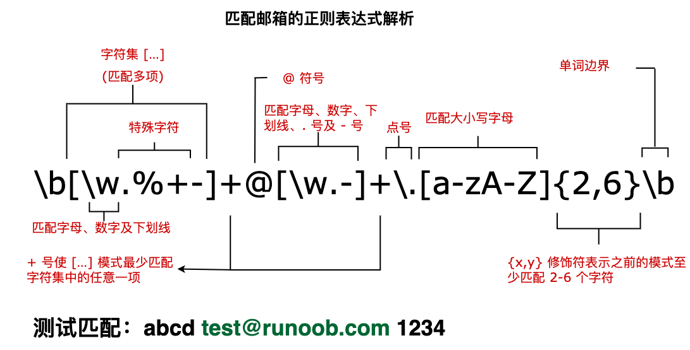

> 本文由 [简悦 SimpRead](http://ksria.com/simpread/) 转码， 原文地址 [www.runoob.com](https://www.runoob.com/regexp/regexp-metachar.html) [正则表达式 - 修饰符](https://www.runoob.com/regexp/regexp-flags.html "正则表达式 - 修饰符")[正则表达式 – 运算符优先级](https://www.runoob.com/regexp/regexp-operator.html "正则表达式 – 运算符优先级")

正则表达式中的元字符是具有特殊含义的字符，它们不表示字面意义，而是用于控制匹配模式。

基本元字符
-----

`.` (点号)

*   匹配除换行符 (`\n`) 外的任意单个字符
    
    示例：`a.b` 匹配 "aab", "a1b", "a b" 等
    

`^` (脱字符)

*   匹配字符串的开始位置
    
*   示例：`^abc` 匹配以 "abc" 开头的字符串
    

`$` (美元符)

*   匹配字符串的结束位置
    
*   示例：`xyz$` 匹配以 "xyz" 结尾的字符串
    

`\` (反斜杠)

*   转义字符，使后面的字符失去特殊含义
    
*   示例：`\.` 匹配实际的点号而不是任意字符
    

字符类元字符
------

`[]` (方括号)

*   定义字符集合，匹配其中任意一个字符
    
*   示例：`[aeiou]` 匹配任意一个元音字母
    

`[^]` (否定字符类)

*   匹配不在方括号中的任意字符
    
*   示例：`[^0-9]` 匹配任意非数字字符
    

`-` (连字符)

*   在字符类中表示范围
    
*   示例：`[a-z]` 匹配任意小写字母
    

量词元字符
-----

`*` (星号)

*   匹配前面的子表达式零次或多次
    
*   示例：`ab*c` 匹配 "ac", "abc", "abbc" 等
    

`+` (加号)

*   匹配前面的子表达式一次或多次
    
*   示例：`ab+c` 匹配 "abc", "abbc" 但不匹配 "ac"
    

`?` (问号)

*   匹配前面的子表达式零次或一次
    
*   示例：`colou?r` 匹配 "color" 和 "colour"
    

`{n}` (花括号)

*   精确匹配 n 次
    
*   示例：`a{3}` 匹配 "aaa"
    

`{n,}`

*   至少匹配 n 次
    
*   示例：`a{2,}` 匹配 "aa", "aaa" 等
    

`{n,m}`

*   匹配 n 到 m 次
    
*   示例：`a{2,4}` 匹配 "aa", "aaa", "aaaa"
    

分组和选择元字符
--------

`()` (圆括号)

*   定义子表达式或捕获组
    
*   示例：`(ab)+` 匹配 "ab", "abab" 等
    

`|` (竖线)

*   表示 "或" 关系
    
*   示例：`cat|dog` 匹配 "cat" 或 "dog"
    

特殊字符类元字符
--------

`\d`

*   匹配任意数字，等价于 `[0-9]`
    

`\D`

*   匹配任意非数字，等价于 `[^0-9]`
    

`\w`

*   匹配任意单词字符 (字母、数字、下划线)，等价于 `[a-zA-Z0-9_]`
    

`\W`

*   匹配任意非单词字符，等价于 `[^a-zA-Z0-9_]`
    

`\s`

*   匹配任意空白字符 (空格、制表符、换行符等)
    

`\S`

*   匹配任意非空白字符
    

边界匹配元字符
-------

`\b`

*   匹配单词边界
    
*   示例：`\bcat\b` 匹配 "cat" 但不匹配 "category"
    

`\B`

*   匹配非单词边界
    
*   示例：`\Bcat\B` 匹配 "scattered" 中的 "cat" 但不匹配单独的 "cat"
    

其他元字符
-----

`\n`

*   匹配换行符
    

`\t`

*   匹配制表符
    

`\r`

*   匹配回车符
    

`\f`

*   匹配换页符
    

`\v`

*   匹配垂直制表符
    

贪婪与非贪婪量词
--------

默认情况下，量词 (`*`, `+`, `?`, `{}`) 是贪婪的，会尽可能多地匹配字符。在量词后加`?`可使其变为非贪婪 (懒惰) 模式：

*   `*?`：零次或多次，但尽可能少
    
*   `+?`：一次或多次，但尽可能少
    
*   `??`：零次或一次，但尽可能少
    
*   `{n,m}?`：n 到 m 次，但尽可能少
    

示例：`<.*?>` 匹配 HTML 标签时不会跨标签匹配

正向和负向预查
-------

`(?=...)` (正向肯定预查)

*   匹配后面跟着特定模式的位置
    
*   示例：`Windows(?=95|98)` 匹配后面跟着 95 或 98 的 "Windows"
    

`(?!...)` (正向否定预查)

*   匹配后面不跟着特定模式的位置
    
*   示例：`Windows(?!95|98)` 匹配后面不跟着 95 或 98 的 "Windows"
    

`(?<=...)` (反向肯定预查)

*   匹配前面是特定模式的位置
    
*   示例：`(?<=95|98)Windows` 匹配前面是 95 或 98 的 "Windows"
    

`(?<!...)` (反向否定预查)

*   匹配前面不是特定模式的位置
    
*   示例：`(?<!95|98)Windows` 匹配前面不是 95 或 98 的 "Windows"
    

### 实例

接下来我们分析一个匹配邮箱的正则表达式，如下图：

```javascript
var str = "abcd test@runoob.com 1234";
var patt1 = /\b[\w.%+-]+@[\w.-]+\.[a-zA-Z]{2,6}\b/g;
document.write(str.match(patt1));

test@runoob.com
```



下表包含了元字符的完整列表以及它们在正则表达式上下文中的行为：

<table><tbody><tr><th width="20%">字符</th><th width="80%">描述</th></tr><tr><td>\</td><td><p>将下一个字符标记为一个特殊字符、或一个原义字符、或一个 向后引用、或一个八进制转义符。例如，'n' 匹配字符 "n"。'\n' 匹配一个换行符。序列 '\\' 匹配 "\" 而 "\(" 则匹配 "("。</p></td></tr><tr><td>^</td><td><p>匹配输入字符串的开始位置。如果设置了 RegExp 对象的 Multiline 属性，^ 也匹配 '\n' 或 '\r' 之后的位置。</p></td></tr><tr><td>$</td><td><p>匹配输入字符串的结束位置。如果设置了 RegExp 对象的 Multiline 属性，$ 也匹配 '\n' 或 '\r' 之前的位置。</p></td></tr><tr><td>*</td><td><p>匹配前面的子表达式零次或多次。例如，zo* 能匹配 "z" 以及 "zoo"。* 等价于 {0,}。</p></td></tr><tr><td>+</td><td><p>匹配前面的子表达式一次或多次。例如，'zo+' 能匹配 "zo" 以及 "zoo"，但不能匹配 "z"。+ 等价于 {1,}。</p></td></tr><tr><td>?</td><td><p>匹配前面的子表达式零次或一次。例如，"do(es)?" 可以匹配 "do" 或 "does" 。? 等价于 {0,1}。</p></td></tr><tr><td>{n}</td><td><p>n 是一个非负整数。匹配确定的 n 次。例如，'o{2}' 不能匹配 "Bob" 中的'o'，但是能匹配 "food" 中的两个 o。</p></td></tr><tr><td>{n,}</td><td><p>n 是一个非负整数。至少匹配 n 次。例如，'o{2,}' 不能匹配 "Bob" 中的'o'，但能匹配 "foooood" 中的所有 o。'o{1,}' 等价于'o+'。'o{0,}' 则等价于'o*'。</p></td></tr><tr><td>{n,m}</td><td><p>m 和 n 均为非负整数，其中 n &lt;= m。最少匹配 n 次且最多匹配 m 次。例如，"o{1,3}" 将匹配 "fooooood" 中的前三个 o。'o{0,1}' 等价于'o?'。请注意在逗号和两个数之间不能有空格。</p></td></tr><tr><td>?</td><td><p>当该字符紧跟在任何一个其他限制符 (*, +, ?, {n}, {n,}, {n,m}) 后面时，匹配模式是非贪婪的。非贪婪模式尽可能少的匹配所搜索的字符串，而默认的贪婪模式则尽可能多的匹配所搜索的字符串。例如，对于字符串 "oooo"，'o+?' 将匹配单个 "o"，而'o+' 将匹配所有'o'。</p></td></tr><tr><td>.</td><td><p>匹配除换行符（\n、\r）之外的任何单个字符。要匹配包括 '\n' 在内的任何字符，请使用像 "<strong>(.|\n)</strong>" 的模式。</p></td></tr><tr><td>(pattern)</td><td><p>匹配 pattern 并获取这一匹配。所获取的匹配可以从产生的 Matches 集合得到，在 VBScript 中使用 SubMatches 集合，在 JScript 中则使用 $0…$9 属性。要匹配圆括号字符，请使用 '\(' 或 '\)'。</p></td></tr><tr><td>(?:pattern)</td><td><p>匹配 pattern 但不获取匹配结果，也就是说这是一个非获取匹配，不进行存储供以后使用。这在使用 "或" 字符 (|) 来组合一个模式的各个部分是很有用。例如， 'industr(?:y|ies) 就是一个比'industry|industries' 更简略的表达式。</p></td></tr><tr><td>(?=pattern)</td><td><p>正向肯定预查（look ahead positive assert），在任何匹配 pattern 的字符串开始处匹配查找字符串。这是一个非获取匹配，也就是说，该匹配不需要获取供以后使用。例如，"Windows(?=95|98|NT|2000)" 能匹配 "Windows2000" 中的 "Windows"，但不能匹配 "Windows3.1" 中的 "Windows"。预查不消耗字符，也就是说，在一个匹配发生后，在最后一次匹配之后立即开始下一次匹配的搜索，而不是从包含预查的字符之后开始。</p></td></tr><tr><td>(?!pattern)</td><td><p>正向否定预查 (negative assert)，在任何不匹配 pattern 的字符串开始处匹配查找字符串。这是一个非获取匹配，也就是说，该匹配不需要获取供以后使用。例如 "Windows(?!95|98|NT|2000)" 能匹配 "Windows3.1" 中的 "Windows"，但不能匹配 "Windows2000" 中的 "Windows"。预查不消耗字符，也就是说，在一个匹配发生后，在最后一次匹配之后立即开始下一次匹配的搜索，而不是从包含预查的字符之后开始。</p></td></tr><tr><td>(?&lt;=pattern)</td><td>反向 (look behind) 肯定预查，与正向肯定预查类似，只是方向相反。例如，"<code>(?&lt;=95|98|NT|2000)Windows</code>"能匹配"<code>2000Windows</code>"中的"<code>Windows</code>"，但不能匹配"<code>3.1Windows</code>"中的"<code>Windows</code>"。</td></tr><tr><td>(?&lt;!pattern)</td><td>反向否定预查，与正向否定预查类似，只是方向相反。例如 "<code>(?&lt;!95|98|NT|2000)Windows</code>"能匹配"<code>3.1Windows</code>"中的"<code>Windows</code>"，但不能匹配"<code>2000Windows</code>"中的"<code>Windows</code>"。</td></tr><tr><td>x|y</td><td><p>匹配 x 或 y。例如，'z|food' 能匹配 "z" 或 "food"。'(z|f)ood' 则匹配 "zood" 或 "food"。</p></td></tr><tr><td>[xyz]</td><td><p>字符集合。匹配所包含的任意一个字符。例如， '[abc]' 可以匹配 "plain" 中的'a'。</p></td></tr><tr><td>[^xyz]</td><td><p>负值字符集合。匹配未包含的任意字符。例如， '[^abc]' 可以匹配 "plain" 中的'p'、'l'、'i'、'n'。</p></td></tr><tr><td>[a-z]</td><td><p>字符范围。匹配指定范围内的任意字符。例如，'[a-z]' 可以匹配'a' 到'z' 范围内的任意小写字母字符。</p></td></tr><tr><td>[^a-z]</td><td><p>负值字符范围。匹配任何不在指定范围内的任意字符。例如，'[^a-z]' 可以匹配任何不在'a' 到'z' 范围内的任意字符。</p></td></tr><tr><td><a href="/regexp/regexp-metachar-b.html" rel="noopener" target="_blank">\b</a></td><td><p>匹配一个单词边界，也就是指单词和空格间的位置。例如， 'er\b' 可以匹配 "never" 中的'er'，但不能匹配 "verb" 中的'er'。</p></td></tr><tr><td><a href="/regexp/regexp-metachar-b.html" rel="noopener" target="_blank">\B</a></td><td><p>匹配非单词边界。'er\B' 能匹配 "verb" 中的'er'，但不能匹配 "never" 中的'er'。</p></td></tr><tr><td>\cx</td><td><p>匹配由 x 指明的控制字符。例如， \cM 匹配一个 Control-M 或回车符。x 的值必须为 A-Z 或 a-z 之一。否则，将 c 视为一个原义的'c' 字符。</p></td></tr><tr><td>\d</td><td><p>匹配一个数字字符。等价于 [0-9]。</p></td></tr><tr><td>\D</td><td><p>匹配一个非数字字符。等价于 [^0-9]。</p></td></tr><tr><td>\f</td><td><p>匹配一个换页符。等价于 \x0c 和 \cL。</p></td></tr><tr><td>\n</td><td><p>匹配一个换行符。等价于 \x0a 和 \cJ。</p></td></tr><tr><td>\r</td><td><p>匹配一个回车符。等价于 \x0d 和 \cM。</p></td></tr><tr><td>\s</td><td><p>匹配任何空白字符，包括空格、制表符、换页符等等。等价于 [\f\n\r\t\v]。</p></td></tr><tr><td>\S</td><td><p>匹配任何非空白字符。等价于 [^ \f\n\r\t\v]。</p></td></tr><tr><td>\t</td><td><p>匹配一个制表符。等价于 \x09 和 \cI。</p></td></tr><tr><td>\v</td><td><p>匹配一个垂直制表符。等价于 \x0b 和 \cK。</p></td></tr><tr><td>\w</td><td><p>匹配字母、数字、下划线。等价于'[A-Za-z0-9_]'。</p></td></tr><tr><td>\W</td><td><p>匹配非字母、数字、下划线。等价于 '[^A-Za-z0-9_]'。</p></td></tr><tr><td>\xn</td><td><p>匹配 n，其中 n 为十六进制转义值。十六进制转义值必须为确定的两个数字长。例如，'\x41' 匹配 "A"。'\x041' 则等价于 '\x04' &amp; "1"。正则表达式中可以使用 ASCII 编码。</p></td></tr><tr><td>\num</td><td><p>匹配 num，其中 num 是一个正整数。对所获取的匹配的引用。例如，'(.)\1' 匹配两个连续的相同字符。</p></td></tr><tr><td>\n</td><td><p>标识一个八进制转义值或一个向后引用。如果 \n 之前至少 n 个获取的子表达式，则 n 为向后引用。否则，如果 n 为八进制数字 (0-7)，则 n 为一个八进制转义值。</p></td></tr><tr><td>\nm</td><td><p>标识一个八进制转义值或一个向后引用。如果 \nm 之前至少有 nm 个获得子表达式，则 nm 为向后引用。如果 \nm 之前至少有 n 个获取，则 n 为一个后跟文字 m 的向后引用。如果前面的条件都不满足，若 n 和 m 均为八进制数字 (0-7)，则 \nm 将匹配八进制转义值 nm。</p></td></tr><tr><td>\nml</td><td><p>如果 n 为八进制数字 (0-3)，且 m 和 l 均为八进制数字 (0-7)，则匹配八进制转义值 nml。</p></td></tr><tr><td>\un</td><td><p>匹配 n，其中 n 是一个用四个十六进制数字表示的 Unicode 字符。例如， \u00A9 匹配版权符号 (?)。</p></td></tr></tbody></table>