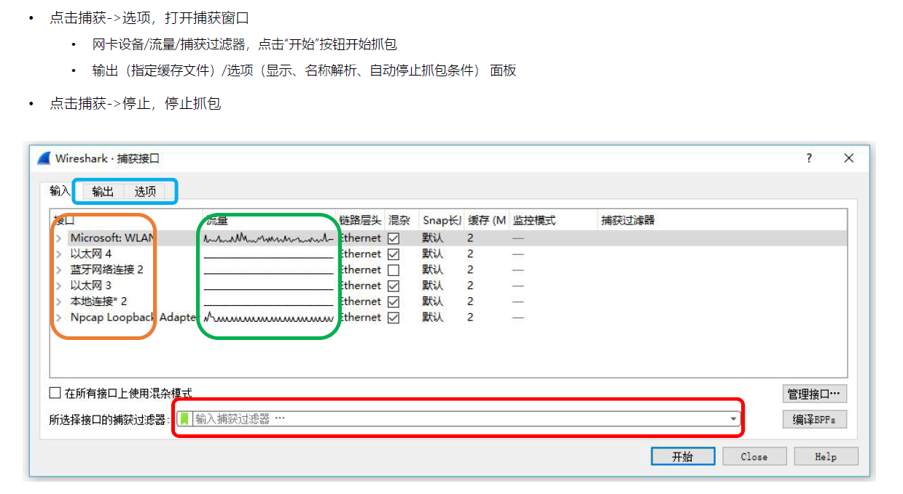

## 如何捕获报文

输出选项： 控制抓取报文的存储方式，存储到文件 临时

选项：自动停止抓包的条件

## Wireshark 面板

### 快捷方式工具栏

## 数据包的颜色（视图->着色规则）

## 设定时间显示格式

#### 绝对时间/相对时间

#### 设定基于某一个数据包的相对时间

## 数据包列表面板的标记符号

## 四种流跟踪

• TCP
• UDP
• SSL
• HTTP

## 文件操作

• 标记报文 Ctrl+M
• 导出标记报文（文件->导出特定分组），亦可按过滤器导出报文
• 合并读入多个报文（文件->合并）

## 如何快速抓取移动设备的报文？

1. 在操作系统上打开 wifi 热点
2. 手机连接 wifi 热点
3. 用 Wireshark 打开捕获->选项面板，选择 wifi 热点对应的接口设备抓包

# Wireshark 过滤器

• **捕获过滤器**
	• 用于减少抓取的报文体积
	• 使用 BPF 语法，功能相对有限

• **显示过滤器**
	• 对已经抓取到的报文过滤显示
	• 功能强大

## BPF 过滤器：Wireshark 捕获过滤器

• Berkeley Packet Filter，在设备驱动级别提供抓包过滤接口，多数抓包工具都支持此语法
• expression 表达式：由多个原语组成

### Expression 表达式

### 限定词

**Type**：设置数字或者名称所指示类型
• host、port
• net ，设定子网，net 192.168.0.0 mask 255.255.255.0 等价于 net 192.168.0.0/24
• portrange，设置端口范围，例如 portrange 6000-8000

**Dir**：设置网络出入方向
• src、dst、src or dst、src and dst
• ra、ta、addr1、addr2、addr3、addr4（仅对 IEEE 802.11 Wireless LAN 有效）

**Proto**：指定协议类型
• ether、fddi、tr、 wlan、 ip、 ip6、 arp、 rarp、 decnet、 tcp、udp、icmp、igmp、icmp、
igrp、pim、ah、esp、vrrp

**其他**

• gateway：指明网关 IP 地址，等价于 ether host ehost and not host host
• broadcast：广播报文，例如 ether broadcast 或者 ip broadcast
• multicast：多播报文，例如 ip multicast 或者 ip6 multicast
• less, greater：小于或者大于

### 基于协议域过滤

## 显示过滤器的过滤属性

### 过滤值比较符号

### 过滤值类型

### 多个表达式间的组合

### 其他常用操作符

### 可用函数

### 显示过滤器的可视化对话框

# 从 wireshark 报文统计中找规律

## 报文统计

• 搭配“显示过滤器”使用
• 统计方式
	• 报文总体分布：捕获文件属性与数据包长度分布
	• 端点统计与会话统计
	• 协议分级统计
	• HTTP/HTTP2 等应用层协议统计
	• TCP 协议连接统计
	• IO 流统计与数据流统计

## 报文总体分布

• 捕获文件属性
	• when：何时抓包
	• where：哪个 IP 接口在抓包
	• how：捕获过滤器是什么？
	• how much：多少报文？多少字节？多快速率？
• 报文长度分布：信息传输效率
	• 各种长度报文的分布

报文长度分度比例

## 协议分级统计（配合显示过滤器）

• 分组数量/字节数百分比（同层）
• 绝对分组数量/字节数
• 速率（比特/秒）
• 协议消息统计
	• 结束“分组”
	• 结束字节
	• 结束速率

**统计-->协议分级** 统计

## 端点统计/会话统计

**• OSI 不同层次统计**
	• 数据链路层（解析名称：MAC/IP/PORT）
		• 通讯双方/单端点、分组数、字节数、报文方向、速率、持续时间
• 网络层
• 传输层
	• UDP/TCP，端口统计
• **快速应用过滤器及着色规则**

## HTTP/HTTP2 统计

## TCP 连接信息统计

基于 TCP 连接特性统计，可切换方向
• RTT 时间
• 吞吐量
• 窗口大小
• 序列号

## IO 图表与数据流统计

• IO 图表
	• 绘制出不同颜色、各类型（折线、直方、点）图
	• 以时间作为 X 轴（可选择时间间隔）
	• 可设置过滤器下的报文信息为Y轴
		• 报文数量、字节数、统计函数
• 数据流
	• 可选择基于显示过滤器，显示各端之间的数据流量

**流量图**

## 专家系统

